ILC Cell Line Encyclopedia (ICLE) Data Analysis
================
true
June 26, 2026

- [ILC Cell Line Encyclopedia (ICLE) Data Analysis](#ilc-cell-line-encyclopedia-icle-data-analysis)
- [Associated Publication and Data Availability](#associated-publication-and-data-availability)
- [1. Preparation](#1-preparation)
  - [Setup Environment](#setup-environment)
  - [Load All Data](#load-all-data)
- [2. Manuscript Figures](#2-manuscript-figures)
  - [a. Multi-omic Characterization of ILC Cell Lines and Genomic Fidelity to Human ILC](#a-multi-omic-characterization-of-ilc-cell-lines-and-genomic-fidelity-to-human-ilc)
    - [SupFig 1: Genotypic Similarity With Public Datasets](#supfig-1-genotypic-similarity-with-public-datasets)
    - [Perform Molecular Subtyping](#perform-molecular-subtyping)
    - [SupFig 2: RNA-seq Consensus Clustering](#supfig-2-rna-seq-consensus-clustering)
    - [SupFig 3: RPPA Consensus Clustering](#supfig-3-rppa-consensus-clustering)
    - [SupFig 4: DNAm Consensus Clustering](#supfig-4-dnam-consensus-clustering)
    - [Figure 1B: Overview of Multiomic Subtypes](#figure-1b-overview-of-multiomic-subtypes)
    - [Figure 1C: SET Signature](#figure-1c-set-signature)
    - [Figure 1D: Multiomics Overview](#figure-1d-multiomics-overview)
    - [Fig 1E: IGV Plot (Patient Tumors vs Cell Lines)](#fig-1e-igv-plot-patient-tumors-vs-cell-lines)
    - [Figure 1F: Alteration Frequency Barplots (Patient Tumors vs Cell Lines)](#figure-1f-alteration-frequency-barplots-patient-tumors-vs-cell-lines)
    - [SupFig 5: Key ILC vs NST Alterations (Patient Tumors)](#supfig-5-key-ilc-vs-nst-alterations-patient-tumors)
    - [SupFig 6: Alterations in Key Pathways (ICLE)](#supfig-6-alterations-in-key-pathways-icle)
  - [b. Recapitulation of the CDH1 Alteration Landscape in ILC Cell Line Models](#b-recapitulation-of-the-cdh1-alteration-landscape-in-ilc-cell-line-models)
    - [Figure 2B: Novel SVs in CDH1](#figure-2b-novel-svs-in-cdh1)
    - [Figure 2C: Exonic Deletions in ICLE](#figure-2c-exonic-deletions-in-icle)
    - [Figure 2D: CDH1 Alterations in Local Recurrences and Distant Metastases (Patient Tumors)](#figure-2d-cdh1-alterations-in-local-recurrences-and-distant-metastases-patient-tumors)
    - [Figure 2E: CDH1 Mutation Lollipop Plots (Patient Tumors vs Cell Lines)](#figure-2e-cdh1-mutation-lollipop-plots-patient-tumors-vs-cell-lines)
    - [Figure 2F: CDH1 Allele Frequency in Cell Lines](#figure-2f-cdh1-allele-frequency-in-cell-lines)
    - [Figure 2G: CDH1 Alteration Type Frequencies (Patient Tumors vs Cell Lines)](#figure-2g-cdh1-alteration-type-frequencies-patient-tumors-vs-cell-lines)
    - [Figure 2H: CDH1 Molecular Alteration Landscape (Patient Tumors vs Cell Lines)](#figure-2h-cdh1-molecular-alteration-landscape-patient-tumors-vs-cell-lines)
  - [c. Optical Genome Mapping Reveals Structural Variations, Chromothripsis and Functional Fusions](#coptical-genome-mapping-reveals-structural-variations-chromothripsis-and-functional-fusions)
    - [Figure 3A (left): ICLE Genomic Instability Metrics](#figure-3a-left-icle-genomic-instability-metrics)
    - [Figure 3A (right): ICLE SV Type Distribution](#figure-3a-right-icle-sv-type-distribution)
    - [Figure 3B: Chromosomal Topography of Translocation Breakpoints](#figure-3b-chromosomal-topography-of-translocation-breakpoints)
    - [Figure 3C: Chromothripsis Landscape](#figure-3c-chromothripsis-landscape)
    - [Figure 3D: OGM Circos Plots — BCK4, 600MPE, HCC2185, ZR7530](#figure-3d-ogm-circos-plots--bck4-600mpe-hcc2185-zr7530)
    - [Figure 3E: Fusion Distribution (Patient Tumors vs Cell Lines)](#figure-3e-fusion-distribution-patient-tumors-vs-cell-lines)
    - [Figure 3F: GOE and LOE Functional Fusions Circos](#figure-3f-goe-and-loe-functional-fusions-circos)
    - [SupFig 8A: Mutation Count vs SV Count and SV Size](#supfig-8a-mutation-count-vs-sv-count-and-sv-size)
    - [SupFig 8B: TMB vs SV Burden (With and Without Outliers)](#supfig-8b-tmb-vs-sv-burden-with-and-without-outliers)
    - [SupFig 8C: SV Count per Chromosome](#supfig-8c-sv-count-per-chromosome)
    - [SupFig 8D: Somatic Mutation Count per Chromosome](#supfig-8d-somatic-mutation-count-per-chromosome)
    - [SupFig 9: OGM Circos Plots](#supfig-9-ogm-circos-plots)
    - [SupFig 10: Functional Fusions Landscape](#supfig-10-functional-fusions-landscape)
  - [d. Global Methylation Instability and Epigenetic Regulation of ILC Driver Genes](#dglobal-methylation-instability-and-epigenetic-regulation-of-ilc-driver-genes)
    - [SupFig 11: DNAm Instability Score (DMI) by PAM50 Subtype and Histology](#supfig-11-dnam-instability-score-dmi-by-pam50-subtype-and-histology)
    - [Figure 4A: DNAm Instability Score (DMI) by Specimen Type](#figure-4a-dnam-instability-score-dmi-by-specimen-type)
    - [Figure 4B: Consensus DNAm–mRNA Alterations (Patient Tumors and Cell Lines)](#figure-4b-consensus-dnammrna-alterations-patient-tumors-and-cell-lines)
    - [Figure 4C: Consensus DNAm-Regulated Genes](#figure-4c-consensus-dnam-regulated-genes)
    - [Figure 4D: Top Consensus DNAm-Regulated Genes — Expression and Methylation Barplots](#figure-4d-top-consensus-dnam-regulated-genes--expression-and-methylation-barplots)
  - [e. Identification of ILC-Specific Gene Dependencies and Nomination of Druggable Targets](#e-identification-of-ilc-specific-gene-dependencies-and-nomination-of-druggable-targets)
    - [Figure 5A: ILC-Specific Dependency Analysis — Study Schematic](#figure-5a-ilc-specific-dependency-analysis--study-schematic)
    - [Figure 5B: Consensus ILC-Specific Differential Dependencies](#figure-5b-consensus-ilc-specific-differential-dependencies)
    - [SupFig 12: Consensus Differential Dependencies Heatmap](#supfig-12-consensus-differential-dependencies-heatmap)
    - [Figure 5C: KEGG Pathway Over-Representation in ILC-Specific Dependency Genes](#figure-5c-kegg-pathway-over-representation-in-ilc-specific-dependency-genes)
    - [Figure 5D: Pathway-Level Dependency Scores](#figure-5d-pathway-level-dependency-scores)
    - [Figure 5E: Druggable ILC Dependencies — Prioritized Therapeutic Targets](#figure-5e-druggable-ilc-dependencies--prioritized-therapeutic-targets)
  - [f. Integrative Multi-omic Benchmarking Framework for ILC Model Selection](#fintegrative-multi-omic-benchmarking-framework-for-ilc-model-selection)
    - [Figure 6: CL–tumor Concordance / Molecular Resemblance Scores](#figure-6-cltumor-concordance--molecular-resemblance-scores)

# Associated Publication and Data Availability

This bioinformatics pipeline accompanies the manuscript: *“Multi-omic
characterization of the ILC cell line encyclopedia (ICLE) defines new
models for biomarker discovery and therapeutic exploration”*.

To reproduce all analyses, clone this GitHub repository and download the
ICLE and external datasets from
[Zenodo](https://zenodo.org/records/18686750). Extract the contents of
each `.tar.gz` archive directly into the repository’s `1-Datasets/`
folder, then follow the instructions in `2-Analysis/README.md`.

<br>

This R Markdown document orchestrates the complete multi-omics analysis
pipeline for the ICLE project, from data loading through figure
generation.

**`2-Analysis/` directory layout:**

- **`config.R`** – Defines project root and all path variables (`DIRS`,
  `FILES`). Must be sourced from `2-Analysis/`.
- **`requirements.R`** – Package installation and version checking for
  all dependencies.
- **`Helper_Scripts/`** – Contains data-loading modules and per-figure
  analysis scripts:
  - *Data loading* (`Data_Loading/`): scripts for loading annotations
    and data modalities (RPPA, RNA-seq, CNV, SNV, DNAm, SV, external
    datasets, GAM generation).
  - *Figure 1*: scripts 01, 02 (sources `03_Fig1C`), 04–07.
  - *Figure 2*: orchestrator `08_Fig2_CDH1_Alteration_Landscape_All.R`
    (sources `08_Fig2C` – `13_Fig2H`).
  - *Figure 3*: orchestrator `14_Fig3_SV_All.R` (sources `14_SupFig8`,
    15–20; scripts 17–18 are sourced by 19–20).
  - *Figure 4:* script 21
  - *Figure 5:* script 22
  - *Figure 6*: script 23
- **`README.md`** – Environment setup, package installation, and
  step-by-step run instructions.

<br>

**Future Directions:**

A dedicated R package and interactive web application are in development
to provide streamlined access to the cell line model scoring framework
described in this study.

<br>

**Additional Notes:**

ICLE and integrated BRCA cell line datasets are available through an
institutional [cBioPortal](https://cbioportal.crc.pitt.edu) instance:

- [ICLE
  Dataset](https://cbioportal.crc.pitt.edu/study/summary?id=ILC_Cell_Line_Encyclopedia)
  (N = 17 cell lines)

- [Integrated BRCA Cell Line
  Dataset](https://cbioportal.crc.pitt.edu/study/summary?id=BRCA_Cell_Line_Integrated)
  (ICLE integrated with public datasets, N = 56 cell lines)

Raw sequencing files are deposited at NCBI under [BioProject
PRJNA1406296](https://www.ncbi.nlm.nih.gov/bioproject/PRJNA1406296).
Processed data are deposited at
[Zenodo](https://zenodo.org/records/18686750).

------------------------------------------------------------------------

# 1. Preparation

## Setup Environment

Set these to `TRUE` to reduce console noise during knitting. Set to
`FALSE` to show package startup messages and warnings.

``` r
# Define Warning and Knitr parameters
SUPPRESS_PKG_MESSAGES <- TRUE   # FALSE = show package startup messages
SUPPRESS_WARNINGS <- TRUE       # FALSE = show warnings
SUPPRESS_FEATURE_SELECTION_PLOTS <- TRUE  # FALSE = show intermediate plots from FSbyMAD/FSbyVar
SUPPRESS_CONSENSUS_CLUSTER_PLOTS <- TRUE  # FALSE = show intermediate plots from ConsensusClusterPlus

knitr::opts_chunk$set(dev = "png", dpi = 300, fig.width = 6, fig.height = 4,
                      screenshot.force = FALSE, cache = FALSE)

# Set working directory
# setwd("/root/capsule/code/2-Analysis/")

# Install packages
source("requirements.R")
install_all_packages()
```

    ## ==============================================

    ## Installing ICLE Project Dependencies

    ## ==============================================

    ## All CRAN packages already installed.

    ## All Bioconductor packages already installed.

    ## 
    ## ==============================================

    ## Package installation complete!

    ## ==============================================

``` r
install_github_packages()
load_packages()
```

    ## Loading packages...

    ## All packages loaded successfully ✓

    ## [1] TRUE

``` r
# load configuration
source("config.R")
```

    ## ===============================================
    ## ICLE Project Configuration Loaded
    ## ===============================================
    ## Project Root: /Users/oshah/Documents/ICLE 
    ## Directories verified: TRUE 
    ## Files verified: TRUE 
    ## Random seed set: 123 
    ## ===============================================

``` r
# Load helper functions
suppressPackageStartupMessages(suppressWarnings(source(file.path(DIRS$scripts$helpers, "Helper_Functions.R"))))
```

## Load All Data

Loads all ICLE and external datasets into the R session via the modular
`Data_Loading/` scripts.

``` r
# Load all ICLE data using the master orchestrator
source(file.path(DIRS$scripts$helpers, "Data_Loading", "01_load_all_data.R"))

# Load all data (ICLE + external datasets)
load_all_icle_data(load_external = TRUE, verbose = TRUE)
```

    ## STEP 0/8: Cell Line Annotations already loaded (skipping)

    ## STEP 1/8: RPPA data already loaded (skipping)

    ## STEP 2/8: RNA-seq data already loaded (skipping)

    ## STEP 3/8: CNV data already loaded (all required objects present in GlobalEnv)

    ## STEP 4/8: Loading Single Nucleotide Variation (WES) Data...

    ## Loading SNV/mutation data...

    ## ═══════════════════════════════════════════════════════

    ##   SNV Data Preparation Pipeline

    ## ═══════════════════════════════════════════════════════

    ## 

    ## Step 1/3: Filtering and merging MAF files...

    ## 'ICLE_Hg38.maf.gz' already exists — skipping MAF filtering.

    ##   ✓ MAF filtering and merging complete

    ## Step 2/3: Performing genome liftover to hg19...

    ## 'ICLE_Hg38_liftover.maf.gz' already exists — skipping liftover

    ##   ✓ Genome liftover complete

    ## Step 3/3: Integrating ICLE and CCLE MAFs...

    ##   ✓ MAF integration complete

    ## 

    ## ═══════════════════════════════════════════════════════

    ##   ✓ SNV data preparation complete

    ## ═══════════════════════════════════════════════════════

    ##   ✓ Loaded BRCA_CL_MAF: 91179 entries

    ##   ✓ SNV data loaded

    ## STEP 5/8: DNAm data already loaded (skipping)

    ## STEP 6/8: SV data already loaded (skipping)

    ## STEP 7/8: External data already loaded (all required objects present in GlobalEnv)

    ##   ✓ TCGA_Annots: present

    ##   ✓ MSK_Annots: present

    ## STEP 8/8: GAM data already loaded (skipping)

    ## 

    ## ═══════════════════════════════════════════════════════

    ##   Data Loading Complete

    ## ═══════════════════════════════════════════════════════

    ## 

    ## Loading Status Summary:

    ##   ⊚ ANNOTATIONS         : ALREADY_LOADED

    ##   ⊚ RPPA                : ALREADY_LOADED

    ##   ⊚ RNASEQ              : ALREADY_LOADED

    ##   ⊚ CNV                 : ALREADY_LOADED

    ##   ✓ SNV                 : SUCCESS

    ##   ⊚ DNAM                : ALREADY_LOADED

    ##   ⊚ SV                  : ALREADY_LOADED

    ##   ⊚ EXTERNAL            : ALREADY_LOADED

    ##   ⊚ GAM                 : ALREADY_LOADED

    ## 

    ## Total Time: 0.00 minutes

    ## 
    ## Key Objects Available in Global Environment:

    ##   • CL_Annots           : 56 x 38

    ##   • BRCA_CL_RPPA        : 207 x 88

    ##   • BRCA_CL_EXP         : 35353 x 68

    ##   • BRCA_CL_GISTIC      : 23109 x 95

    ##   • BRCA_CL_DNAm        : 453001 x 49

    ##   • ICLE_SV             : 4320 x 36

    ##   • BRCA_CL_GAM         : 23738 x 67

    ## ═══════════════════════════════════════════════════════

# 2. Manuscript Figures

## a. Multi-omic Characterization of ILC Cell Lines and Genomic Fidelity to Human ILC

### SupFig 1: Genotypic Similarity With Public Datasets

Pairwise SNP-based genotype similarity heatmap confirming unique cell
line identities and verifying the absence of cross-contamination between
ICLE and the Marcotte et al. panel.

``` r
source(file.path(DIRS$scripts$helpers, "01_SupFig1_Genotype_Similarity.R"), chdir = TRUE)
```

    ## ═══════════════════════════════════════════════════════

    ##   Supplementary Figure 1: Genotype Similarity Analysis

    ## ═══════════════════════════════════════════════════════

    ##   Step 1/4: Loading and merging genotype data...

    ##   ✓ Genotype data merged: 692032 SNPs x 95 samples

    ##   Step 2/4: Converting genotype calls to integers...

    ##   ✓ Genotype calls converted

    ##   Step 3/4: Computing genotypic similarity matrix...

    ##   ✓ Similarity matrix computed

    ##   Step 4/4: Generating genotypic similarity heatmap...

    ##   ✓ Heatmap generated

    ## ═══════════════════════════════════════════════════════

    ##   Genotype Similarity Analysis Complete

    ## ═══════════════════════════════════════════════════════

``` r
pdf(file = file.path(DIRS$results, "SupFig1_Genotype_Similarity.pdf"), width = 8, height = 6)
  draw(supFig_1, merge_legends = TRUE)
dev.off()
```

    ## quartz_off_screen 
    ##                 2

``` r
draw(supFig_1, merge_legends = TRUE)
```

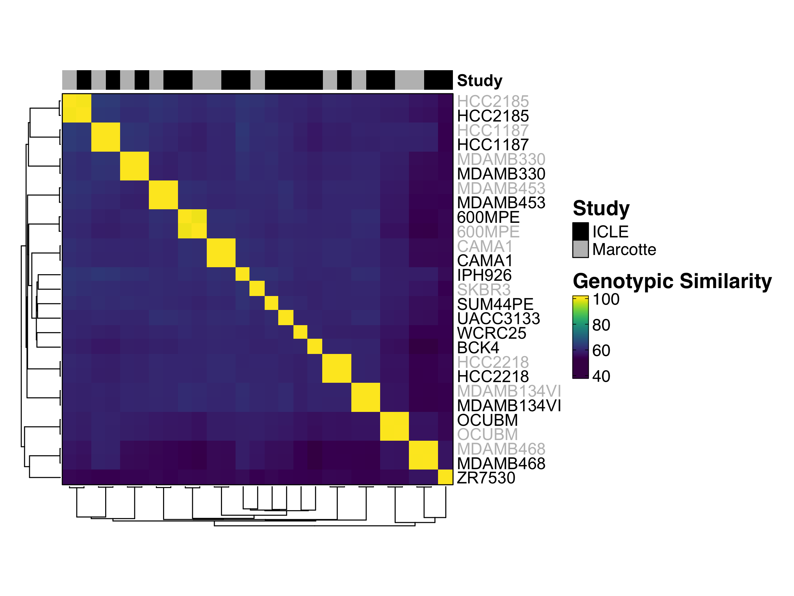

### Perform Molecular Subtyping

Performs all molecular subtyping and produces SupFigs 2–4 (Clustering
heatmaps), Fig 1B (Sankey), and Fig 1C (SET heatmap) in one orchestrator
script. Three independent approaches are used:

1.  **Intrinsic subtyping** — multi-algorithm consensus using
    BreastSubtypeR (PAM50, SCMGENE, SSP, AIMS, GGI); majority-vote
    “TopCall” assignment.
2.  **Data-driven multi-omic consensus clustering** —
    ConsensusClusterPlus on the top 6,000 MAD-variable genes (RNA), top
    50 variable proteins (RPPA), and 6,000 variable probes (DNAm), each
    yielding an independent cluster solution consolidated into four core
    subtypes (Luminal, Luminal/HER2, HER2-enriched, Basal).
3.  **SET signature** — endocrine therapy sensitivity inferred from
    published SET ER+/ER− gene modules (Symmans et al. 2010).

``` r
source(file.path(DIRS$scripts$helpers, "02_Fig1_SupFig2_3_4_Molecular_Subtyping.R"), chdir = TRUE)
```

    ## 
    ##   ── Step 1/5: molecular subtyping pipeline ──

    ## ═══════════════════════════════════════════════════════

    ##   Molecular Subtyping Pipeline

    ## ═══════════════════════════════════════════════════════

    ##   Step 1/7: Calculating ER status...

    ##   ✓ ER status calculated for 56 samples

    ## 
    ##   Step 2/7: Calculating HER2 status...

    ##   ✓ HER2 status calculated for 56 samples

    ## 
    ##   Step 3/7: Running Intrinsic Molecular Subtyping subtyping with BreastSubtypeR...

    ##   ✓ Intrinsic Molecular Subtyping subtyping complete

    ## 
    ##   Step 4/7: Running mRNA consensus clustering...

    ##   ✓ mRNA clustering complete

    ## 
    ##   Step 5/7: Running RPPA consensus clustering...

    ##   ✓ RPPA clustering complete

    ## 
    ##   Step 6/7: Running DNAm consensus clustering...

    ##   ✓ DNAm clustering complete

    ## 
    ##   Step 7/7: Updating annotations and saving results...

    ##   ✓ Annotations updated and results saved

    ## ═══════════════════════════════════════════════════════

    ##   Molecular Subtyping Complete

    ##   Results saved to: /Users/oshah/Documents/ICLE/3-Results/Molecular_Subtyping

    ## ═══════════════════════════════════════════════════════

    ## 
    ##   ── Step 2/5: ER/HER2 status + SET scores ──

    ## 
    ##   ── Step 3/5: building SupFig 2–4 heatmap, PCA, and Sankey objects ──

    ##   ✓ ims entropy heatmap saved

    ##   ✓ SupFig 2A: mRNA_sim_HT object created (saved in Main_Data_Analysis.Rmd)

    ##   ✓ SupFig 2B: supfig2b_mRNA_pca object created (saved in Main_Data_Analysis.Rmd)

    ##   ✓ SupFig 3A: rppa_sim_HT object created (saved in Main_Data_Analysis.Rmd)

    ##   ✓ SupFig 3B: supfig3b_rppa_pca object created (saved in Main_Data_Analysis.Rmd)

    ##   ✓ SupFig 4A: dnam_sim_HT object created (saved in Main_Data_Analysis.Rmd)

    ##   ✓ SupFig 4B: supfig4b_dnam_pca object created (saved in Main_Data_Analysis.Rmd)

    ##   ✓ SupFig 2C: rna_ims object created (saved in Main_Data_Analysis.Rmd)

    ##   ✓ SupFig 3C: rppa_sankey object created (saved in Main_Data_Analysis.Rmd)

    ##   ✓ SupFig 4C: dnam_sankey object created (saved in Main_Data_Analysis.Rmd)

    ## 
    ##   ── Step 4/5: Fig 1B multiomics Sankey ──

    ## 
    ##   ── Step 5/5: Fig 1C SET heatmap ──

    ##   Step 1/4: Loading SET signature genes...

    ##   ✓ Loaded 101 ER+ genes and 59 ER- genes

    ##   Step 2/4: Calculating SET scores...

    ##   ✓ SET scores calculated for 68 samples

    ##   Step 4/4: Creating SET signature heatmaps...

    ##   ✓ SET score heatmap created

    ##   ✓ Heatmaps created and combined

    ## ═══════════════════════════════════════════════════════

    ##   MOLECULAR SUBTYPING COMPLETE

    ## ═══════════════════════════════════════════════════════

### SupFig 2: RNA-seq Consensus Clustering

Heatmap showing consensus clustering solution for top variable RNA
features in integrated BRCA dataset. Heatmap annotations include
multi-algorithm intrinsic molecular subtype (IMS) top calls, ER+ gene
module scores and HER2 mRNA levels.

``` r
pdf(file.path(DIRS$results_sub$molecular_subtyping, "SupFig2A_mRNA_subtypes.pdf"), width = 10, height = 8)
draw(mRNA_sim_HT, merge_legends = TRUE, heatmap_legend_side = "right")
dev.off()
```

    ## quartz_off_screen 
    ##                 2

``` r
draw(mRNA_sim_HT, merge_legends = TRUE, heatmap_legend_side = "right")
```

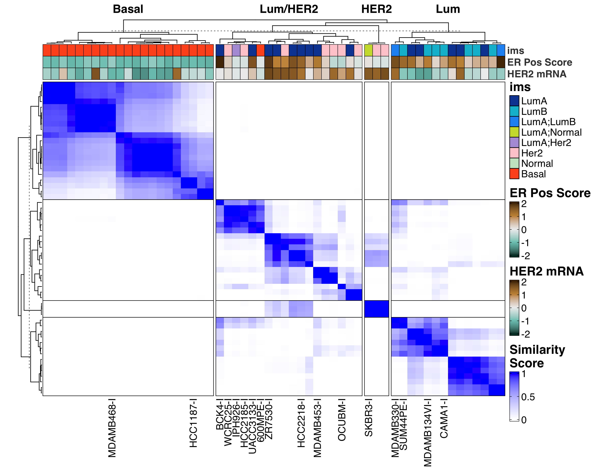

PCA plot of top variable RNA features showing cell clustering/similarity
annotated by molecular subtypes

``` r
ggsave(file.path(DIRS$results_sub$molecular_subtyping, "SupFig2B_mRNA_pca_subtypes.pdf"), supfig2b_mRNA_pca, width = 7, height = 5)
supfig2b_mRNA_pca
```

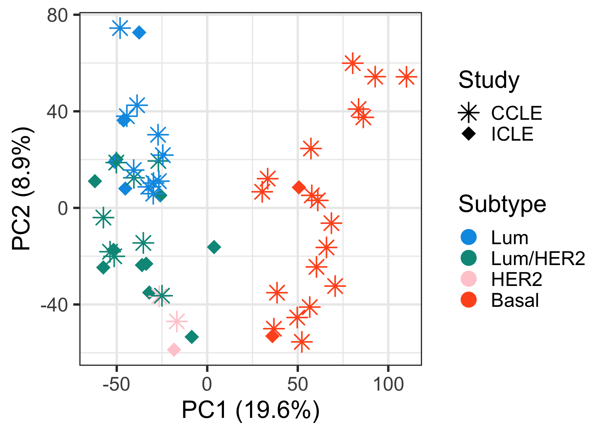

Sankey plot showing agreement between RNA molecular subtypes and (IMS)
top calls

``` r
ggsave(file.path(DIRS$results_sub$molecular_subtyping, "SupFig2C_RNA_ims.pdf"), rna_ims, width = 7, height = 5)
rna_ims
```

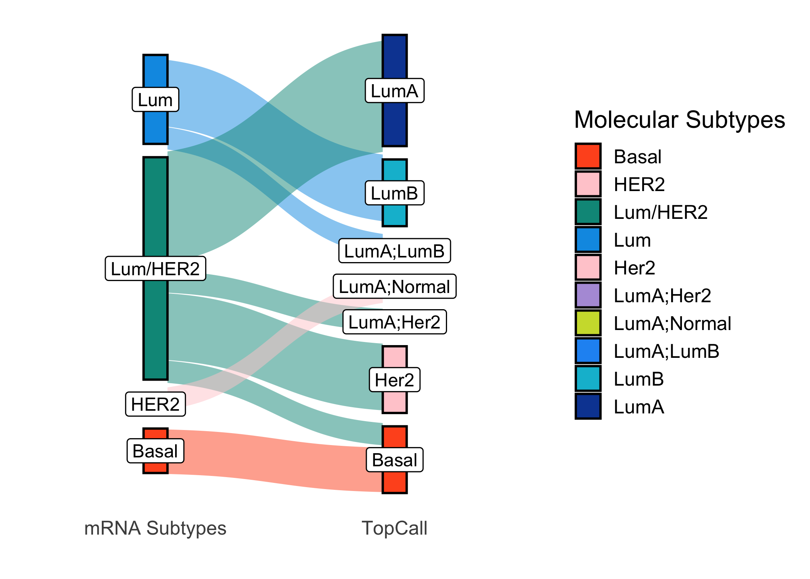

### SupFig 3: RPPA Consensus Clustering

``` r
pdf(file.path(DIRS$results_sub$molecular_subtyping, "SupFig3A_RPPA_subtypes.pdf"), width = 10, height = 8)
draw(rppa_sim_HT, merge_legends = TRUE, heatmap_legend_side = "right")
dev.off()
```

    ## quartz_off_screen 
    ##                 2

``` r
draw(rppa_sim_HT, merge_legends = TRUE, heatmap_legend_side = "right")
```

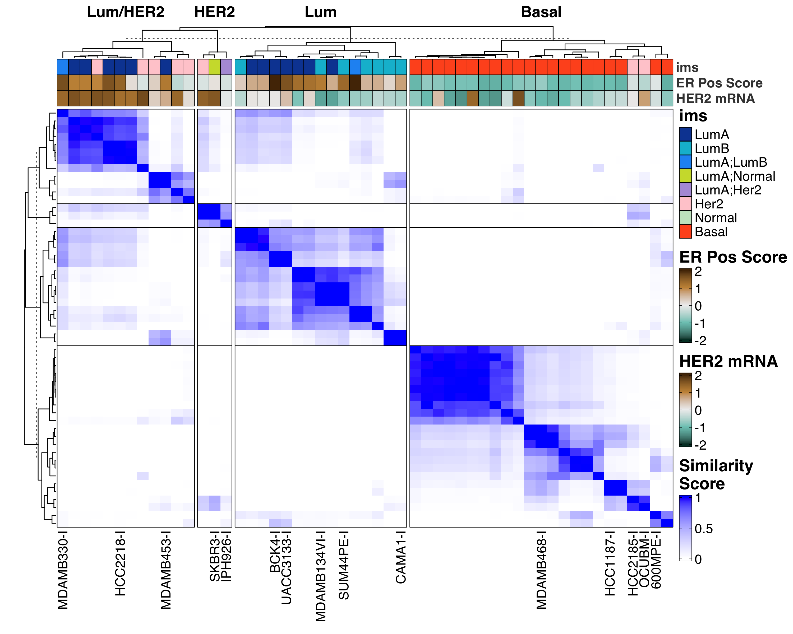

``` r
ggsave(file.path(DIRS$results_sub$molecular_subtyping, "SupFig3B_RPPA_pca_subtypes.pdf"), supfig3b_rppa_pca, width = 7, height = 5)
supfig3b_rppa_pca
```

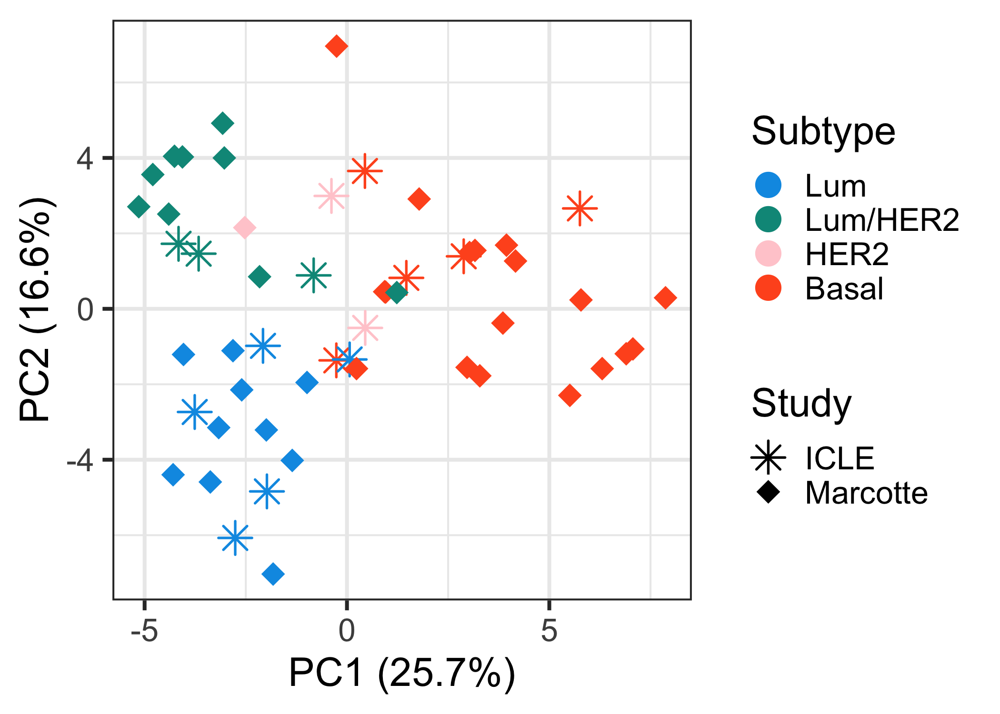

``` r
ggsave(file.path(DIRS$results_sub$molecular_subtyping, "SupFig3C_RPPA_ims.pdf"), rppa_sankey, width = 7, height = 5)
rppa_sankey
```

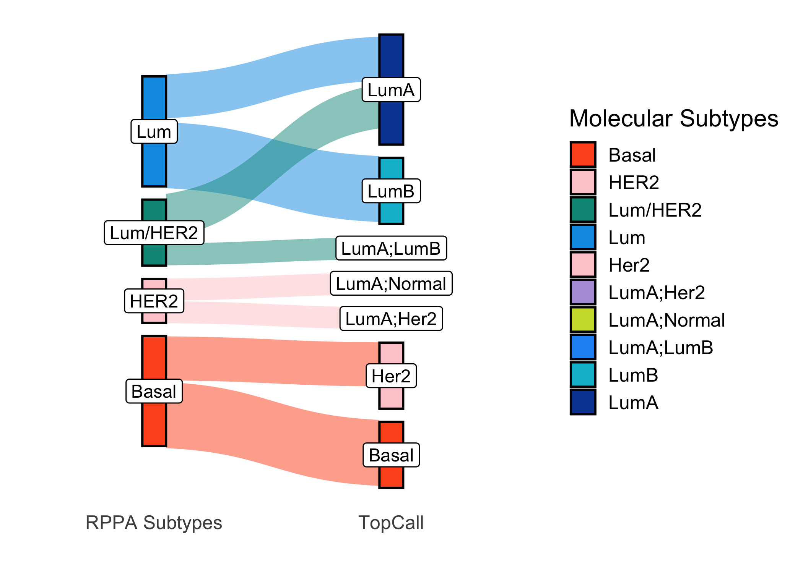

### SupFig 4: DNAm Consensus Clustering

``` r
pdf(file.path(DIRS$results_sub$molecular_subtyping, "SupFig4A_DNAm_subtypes.pdf"), width = 10, height = 8)
draw(dnam_sim_HT, merge_legends = TRUE, heatmap_legend_side = "right")
dev.off()
```

    ## quartz_off_screen 
    ##                 2

``` r
draw(dnam_sim_HT, merge_legends = TRUE, heatmap_legend_side = "right")
```

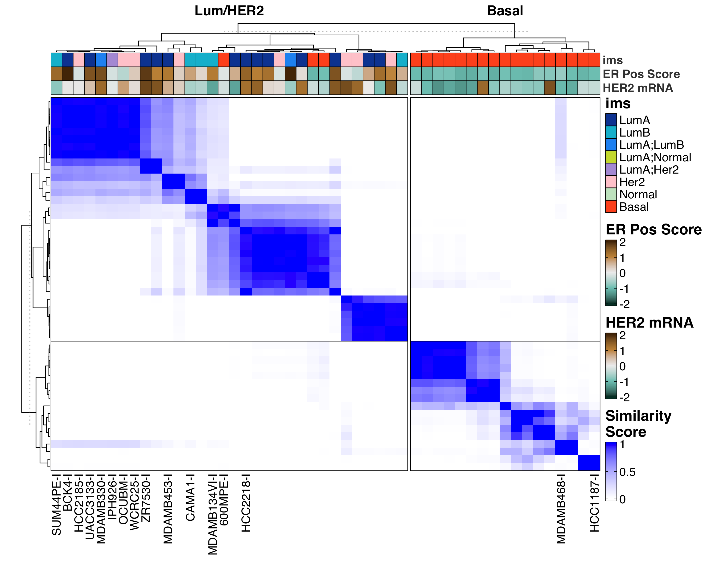

``` r
ggsave(file.path(DIRS$results_sub$molecular_subtyping, "SupFig4B_DNAm_pca_subtypes.pdf"), supfig4b_dnam_pca, width = 7, height = 5)
supfig4b_dnam_pca
```

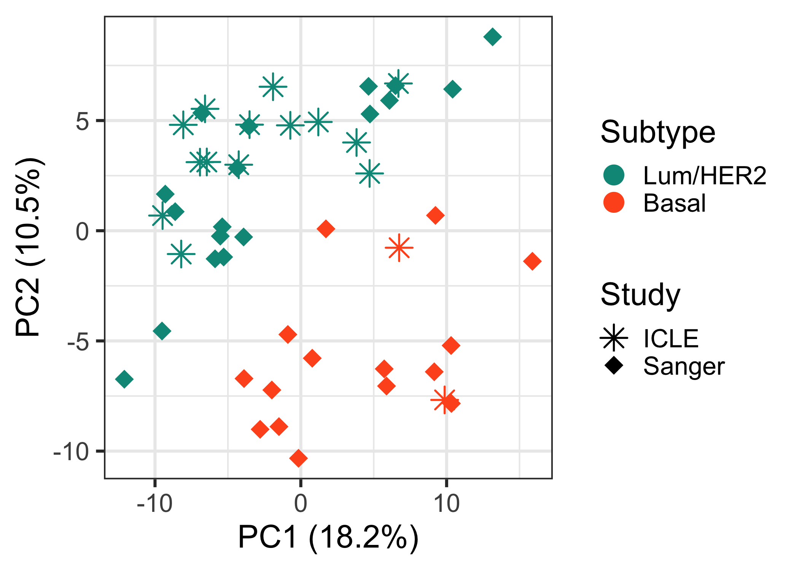

``` r
ggsave(file.path(DIRS$results_sub$molecular_subtyping, "SupFig4C_DNAm_ims.pdf"), dnam_sankey, width = 7, height = 5)
dnam_sankey
```

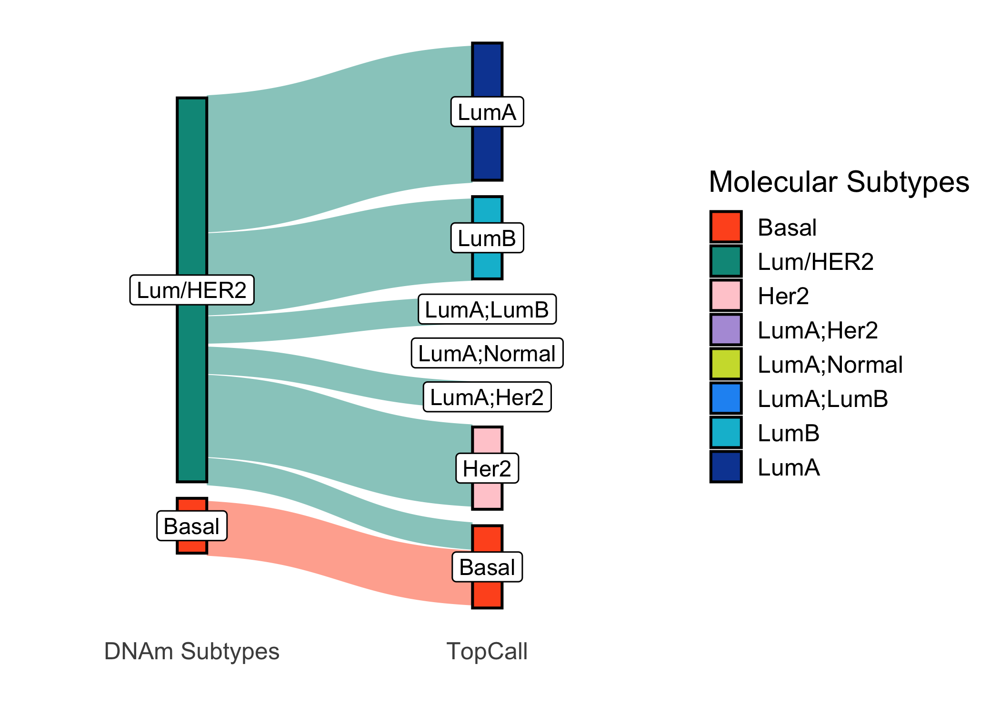

### Figure 1B: Overview of Multiomic Subtypes

Sankey/alluvial diagram showing agreement across the three data-driven
molecular subtype assignments (RNA, RPPA, DNAm).

``` r
ggsave(file.path(DIRS$results_sub$molecular_subtyping, "Fig1B_MolecularSubtypes.pdf"), fig1b_sankey, width = 7, height = 5)

fig1b_sankey
```

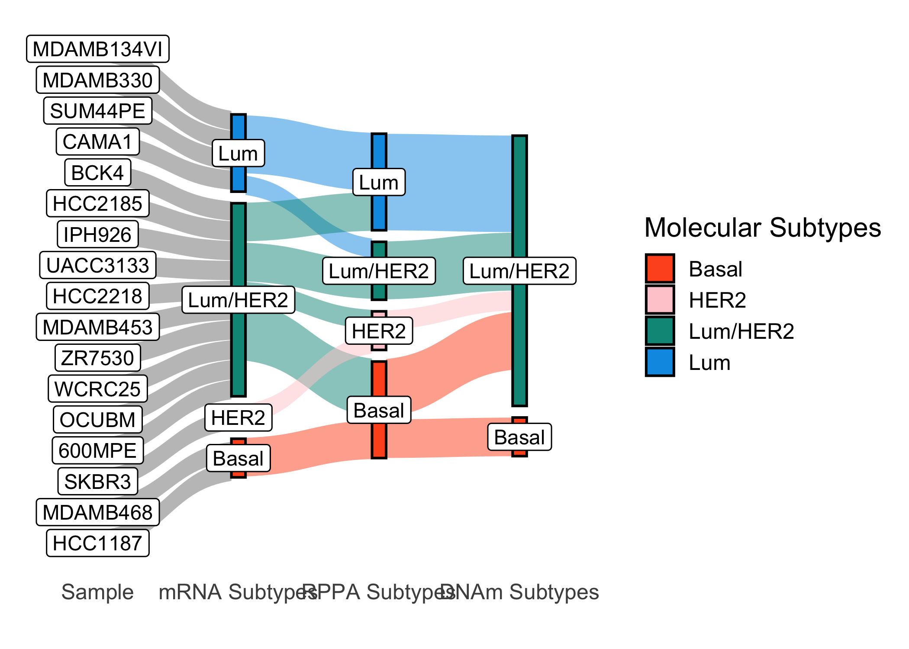

### Figure 1C: SET Signature

Heatmap of SET (Sensitivity to Endocrine Therapy) ER+ and ER− gene
module scores (Symmans et al. 2010) across integrated BRCA cell lines,
stratified by intrinsic subtype.

``` r
pdf(file.path(DIRS$results_sub$molecular_subtyping, "Fig1C_SET_Signature.pdf"), width = 8, height = 6)
  draw(fig1c_setheatmap, merge_legends = TRUE)
dev.off()
```

    ## quartz_off_screen 
    ##                 2

``` r
draw(fig1c_setheatmap, merge_legends = TRUE)
```

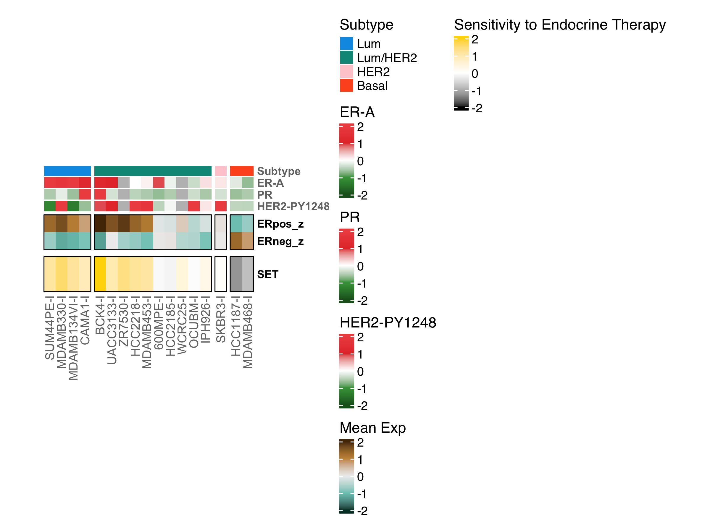

### Figure 1D: Multiomics Overview

Comprehensive multi-omic overview heatmap summarising key genomic,
transcriptomic, proteomic, and epigenetic features of ICLE cell lines.
Features include ER/HER2 status, molecular subtypes, copy number
alterations, somatic mutations and top variable RPPA/RNA/DNAm features.

``` r
source(file.path(DIRS$scripts$helpers, "04_Fig1D_Multiomics_Overview.R"), chdir = T)
```

    ## 
    ## ========================================

    ## Figure 1D: Multiomics Overview

    ## ========================================

    ##   Step 1/6: Loading additional genomic metrics...

    ##   ✓ Saved Genomic Instability Metrics to File/Users/oshah/Documents/ICLE/3-Results/Genomic_Instability_Metrics.tsv

    ##   ✓ Metrics loaded

    ##   Step 2/6: Preparing genetic alteration matrix...

    ##   ✓ Alteration matrix prepared: 9 genes x 17 samples

    ##   Step 3/6: Selecting top variable features...

    ##   ✓ RNA: 6000 genes selected

    ##   ✓ RPPA: 50 proteins selected

    ##   ✓ DNAm: 5913 probes selected

    ## 
    ##   Step 4/6: Creating annotations...

    ##   ✓ Top annotation created

    ## 
    ##   Step 5/6: Creating individual heatmaps...

    ##   ✓ Alteration heatmap created

    ##   ✓ RPPA heatmap created

    ##   ✓ RNA heatmap created

    ##   ✓ DNAm heatmap created

    ## 
    ## ========================================

    ## Figure 1D Completed

    ## ========================================

``` r
pdf(file.path(DIRS$results, "Fig1D_Multiome_Overview.pdf"), width = 6, height = 8)
  draw(fig1d_multiomics_overview, merge_legends = TRUE, annotation_legend_side = "right", heatmap_legend_side = "right")
dev.off()
```

    ## quartz_off_screen 
    ##                 2

``` r
fig1d_multiomics_overview
```

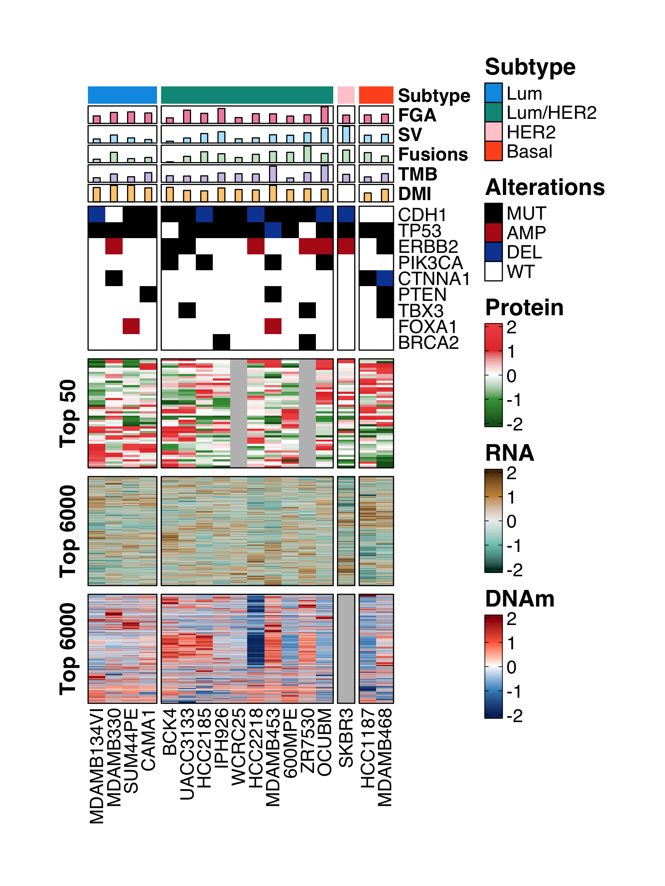

### Fig 1E: IGV Plot (Patient Tumors vs Cell Lines)

Prepares copy number segmentation files (log R ratio) per ICLE molecular
subtype for genome-wide CN visualization in the Integrative Genomics
Viewer (IGV). TCGA primary ILC (n = 127) and MSK metastatic ILC (n =
202) segment files are also subsetted and exported. These files are
loaded directly into IGV to produce figure 1E subpanels.

``` r
# prepare primary ILC patient tumor CN segments
TCGA_BRCA_CN_SEG <- read.delim(file.path(DIRS$external$tcga, "CN", "TCGA_logRR_DNAcopy.seg"))
TCGA_BRCA_CN_SEG$ID <- substr(TCGA_BRCA_CN_SEG$ID, 1, 15)
ILC_cases <- subset(TCGA_Annots, `Final Pathology` == "ILC")$Case.ID
ILC_seg <- subset(TCGA_BRCA_CN_SEG, ID %in% ILC_cases)
write.table(ILC_seg, file = file.path(DIRS$external$tcga, "CN", "TCGA_logRR_ILC_127.seg"), row.names = FALSE, quote = FALSE, sep = "\t")

# prepare metastatic ILC patient tumor CN segments
MSK_BRCA_CN_SEG <- read.delim(file.path(DIRS$external$msk, "CN", "MSK_BRCA_CN.seg"))
ILC_met_cases <- subset(MSK_Annots, ONCOTREE_CODE == "ILC")$SAMPLE_ID
ILC_met_seg <- subset(MSK_BRCA_CN_SEG, ID %in% ILC_met_cases)
write.table(ILC_met_seg, file = file.path(DIRS$external$msk, "MSK_CN_ILC_202.seg"), row.names = FALSE, quote = FALSE, sep = "\t")

# prepare ICLE CN segments by subtype
ICLE_cells <- subset(CL_Annots, Study == "ICLE")
ICLE_cells <- split(ICLE_cells$Name, ICLE_cells$`mRNA Subtypes`)
ICLE_cells$HER2 = "SKBR3-M" # borrow information on SKRB3 from Marcotte
ICLE_cells$Other <- c(ICLE_cells$HER2, ICLE_cells$Basal)
ICLE_cells <- ICLE_cells[-c(3,4)]

BRCA_CL_CN_SEG <- read.delim(FILES$cnv_seg)

BRCA_CL_CN_SEG_subtype <- sapply(ICLE_cells, FUN = function(x){
  subset(BRCA_CL_CN_SEG, ID %in% x)
}, simplify = F)

sapply(names(BRCA_CL_CN_SEG_subtype), FUN = function(x){
  seg = BRCA_CL_CN_SEG_subtype[[x]]
  x = gsub("[//]", "_", x)
  write.table(seg, file = file.path(DIRS$icle$cytosnp, "3_Segmentation", paste0(x, "_ICLE_CL_LogRR_DNACopy.seg")), row.names = FALSE, quote = FALSE, sep = "\t")
})
```

    ## $Lum
    ## NULL
    ## 
    ## $`Lum/HER2`
    ## NULL
    ## 
    ## $Other
    ## NULL

### Figure 1F: Alteration Frequency Barplots (Patient Tumors vs Cell Lines)

Compares alteration frequencies of ESMO ESCAT-scored actionable genes in
luminal ICLE cell lines versus TCGA primary ILC and MSK metastatic ILC
patient tumors. Differences in alteration frequency between groups are
assessed by two-proportion z-test.

``` r
suppressWarnings(source(file.path(DIRS$scripts$helpers, "05_Fig1F_Alteration_barplots.R")))
```

    ## 
    ## ========================================

    ## Figure 1F: Alteration Barplots

    ## ========================================

    ##   Step 1/5: Defining gene sets...

    ##   ✓ Gene sets defined:

    ##     - ILC genes: 6

    ##     - NST genes: 7

    ##     - ESCAT genes: 25

    ##     - Total unique genes: 32

    ##   Step 2/5: Calculating alteration frequencies...

    ##     Processing Cell Lines...

    ##       - Samples: 14

    ##       - Altered genes: 25

    ##     Processing Primary Tumors...

    ##       - Samples: 126

    ##       - Altered genes: 30

    ##     Processing Metastatic Tumors...

    ##       - Samples: 194

    ##       - Altered genes: 31

    ## 

    ##   Step 3/5: Combining and ordering data...

    ##   ✓ Combined data prepared:

    ##     - Common events: 24

    ##     - Genes to plot: 21

    ##   Step 4/5: Creating alteration barplot...

    ##   ✓ Barplot created

    ##   Step 5/5: Performing statistical tests...

    ##   ✓ Statistical tests completed

    ##   Saving results p-values plots...

    ##   ✓ P-values (numeric) saved: /Users/oshah/Documents/ICLE/3-Results/Molecular_Resemblance/Fig1F_Alteration_Barplot_pval.html

    ##   ✓ P-values (notation) saved: /Users/oshah/Documents/ICLE/3-Results/Molecular_Resemblance/Fig1F_Alteration_Barplot_pval_nt.html

    ##   ✓ Figure 1F complete

``` r
output_file <- file.path(DIRS$results, "Molecular_Resemblance", "Fig1F_Alteration_Barplot.pdf")
ggsave(filename = output_file, fig1f_alteration_barplot, width = 6, height = 5)

fig1f_alteration_barplot
```

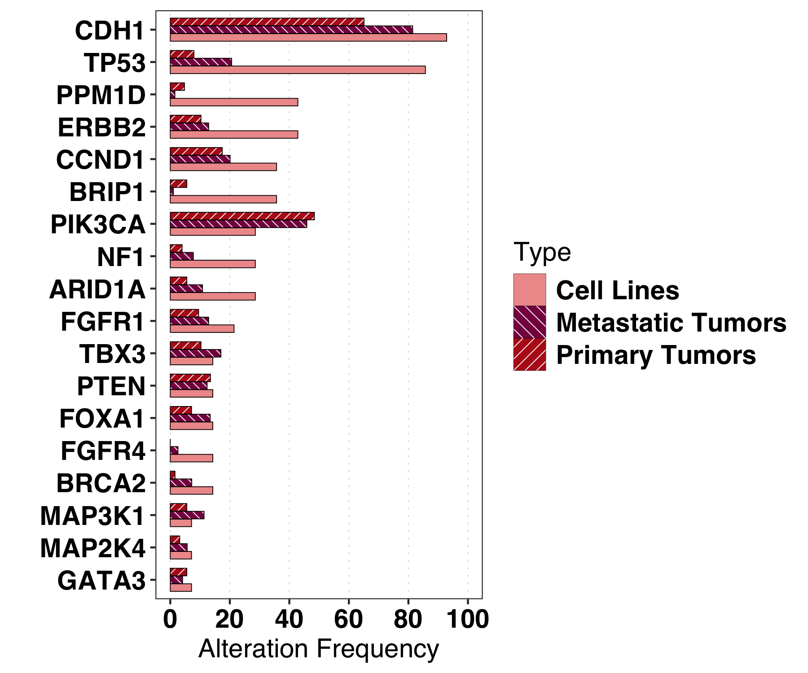

### SupFig 5: Key ILC vs NST Alterations (Patient Tumors)

Barplot comparing the frequencies of key somatic alterations in ILC
versus NST primary and metastatic breast cancer patient tumors.
Statistical comparisons performed using a two-proportion z-test.

``` r
source(file.path(DIRS$scripts$helpers, "06_SupFig5_ILC_NST_Alterations.R"), chdir = TRUE)
```

    ## 
    ## ========================================

    ## SupFig 5: ILC vs NST alteration frequencies (LumA tumors)

    ## ========================================

    ## Specs: 28 rows, 14 genes

    ##   ✓ SupFig 5 complete (supfigs5_tumor_alterations, freq_tbl assigned).

``` r
ggsave(file.path(DIRS$results, "SupFig5_BRCA_Tumor_Top_Alterations.pdf"), supfigs5_tumor_alterations, width = 8, height = 5)

write.table(freq_tbl, file.path(DIRS$results, "SupFig5_BRCA_Tumor_Top_Alterations.tsv"),  # source data for SupFig 5
            sep = "\t", quote = FALSE, row.names = FALSE)

supfigs5_tumor_alterations
```

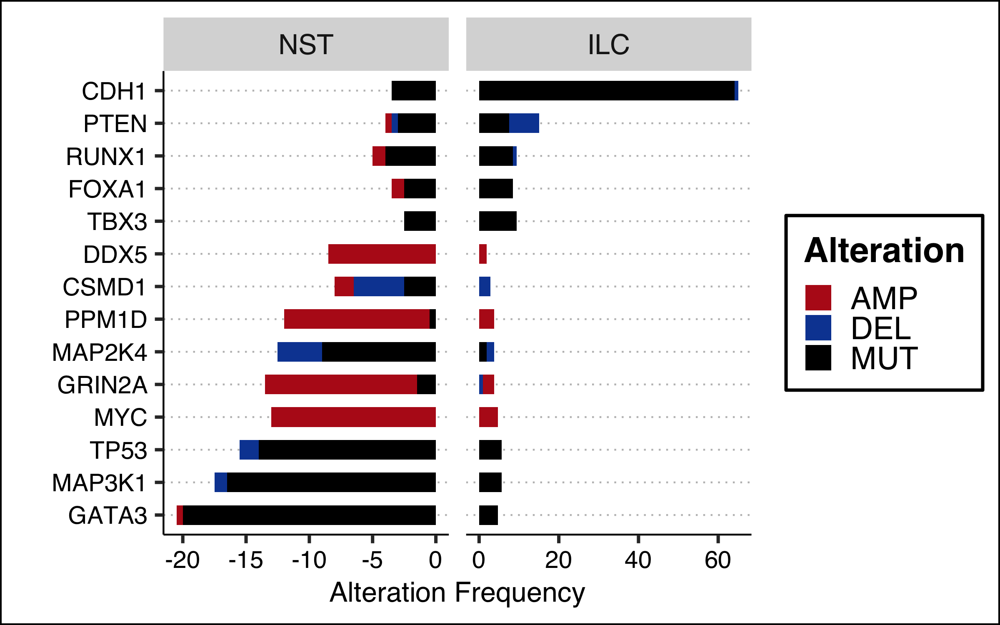

### SupFig 6: Alterations in Key Pathways (ICLE)

Oncoprint summarising the frequency and type of somatic alterations
across key cancer-relevant signalling pathways (RTK/RAS, PI3K, cell
cycle, apoptosis, DNA repair, Wnt, TGF-β, epigenetic regulators) in ICLE
cell lines.

``` r
source(file.path(DIRS$scripts$helpers, "07_SupFig6_Pathway_Alterations.R"), chdir = TRUE)
```

    ## 
    ## ========================================

    ## SupFig 6: Pathway alterations (ICLE)

    ## ========================================

    ##   ✓ SupFig 6 complete (SupFigS6, pathway_alt_mat assigned).

``` r
pdf(file.path(DIRS$results, "SupFig6_Pathway_Alterations.pdf"), width = 7.5, height = 8)
draw(SupFigS6, merge_legends = TRUE)
dev.off()
```

    ## quartz_off_screen 
    ##                 2

``` r
write.table(pathway_alt_mat, file.path(DIRS$results, "SupFig6_Pathway_Alterations.tsv"),  # source data for SupFig 6
            sep = "\t", quote = FALSE, col.names = NA)

draw(SupFigS6, merge_legends = TRUE)
```

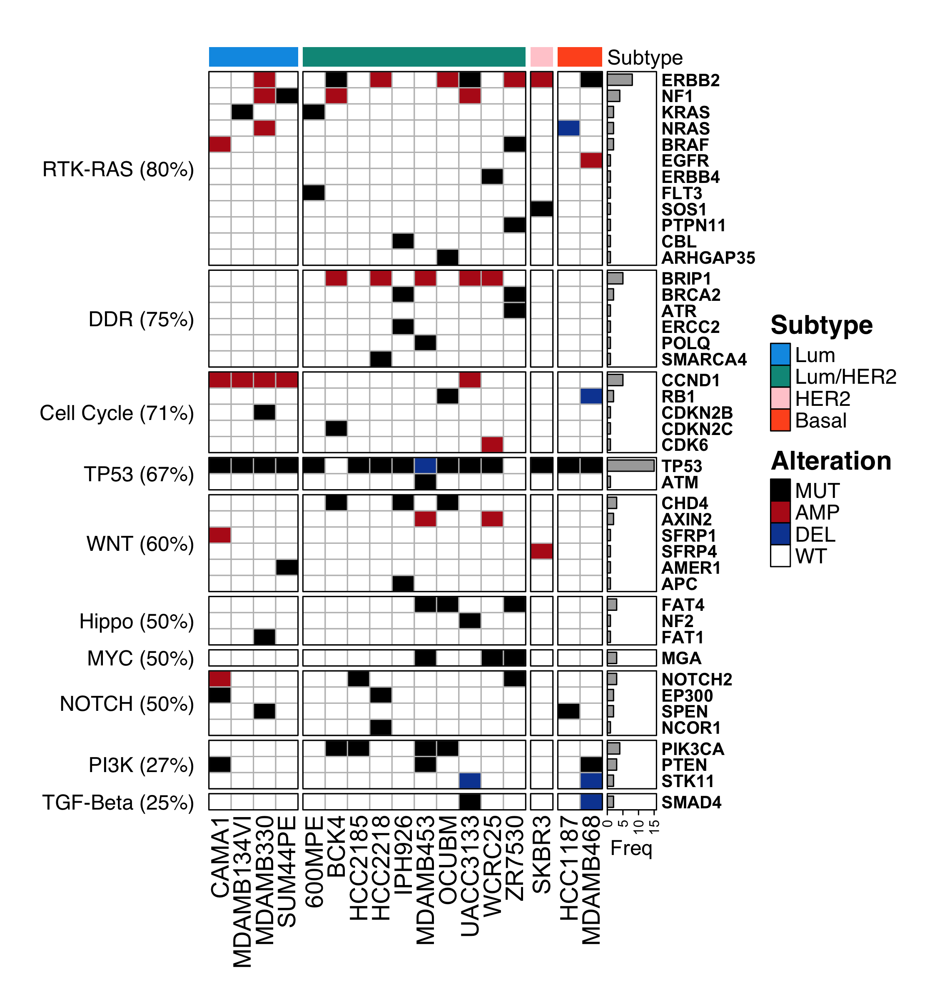

## b. Recapitulation of the CDH1 Alteration Landscape in ILC Cell Line Models

### Figure 2B: Novel SVs in CDH1

Structural variant visualizations for novel *CDH1* rearrangements
detected by Bionano OGM. These figures are generated externally by
loading the filtered SV files into Bionano Access (v1.7) software.

``` r
# Visualizations generated using Bionano Access software by loading SV files
```

Runs the full CDH1 alteration analysis pipeline (Figs 2C–2H) via
orchestrator script `08_Fig2_CDH1_Alteration_Landscape_All.R`, which
sources sub-scripts 08_Fig2C through 13_Fig2H in order. Performs
analysis and generates visualizations of: (i) exonic deletions in *CDH1*
locus using WES read coverage, (ii) *CDH1* alteration frequency
comparisons in FMI local and distant metastases, (iii) *CDH1* biallelic
inactivation events in ILC vs NST tumors and cell lines, (iv) multi-omic
overview of *CDH1* alteration landscape.

``` r
source(file.path(DIRS$scripts$helpers, "08_Fig2_CDH1_Alteration_Landscape_All.R"), chdir = TRUE)
```

    ## 
    ## ========================================

    ## Figure 2C: CDH1 Exonic Deletion Analysis

    ## ========================================

    ##   Loading WES CDH1 read counts...

    ##   Found 19 WES samples

    ##   ✓ Loaded read counts for 19 samples

    ##   Generating CDH1 deletion heatmap...

    ##   ✓ Heatmap generated with 16 exons and 5 samples

    ##   ✓ CDH1 exonic deletion analysis complete (fig2c_cdh1_exonic_del_heatmap assigned).

    ## 
    ## ========================================

    ## Figure 2D: FMI CDH1 alterations (Local vs Distant)

    ## ========================================

    ##   ✓ Fig 2D complete (fig2d_fmi_alts, fig2d_fmi_alts_tbl, fig2d_fmi_alts_tbl_pval assigned).

    ## 
    ## ========================================

    ## Figure 2E: CDH1 Protein Paint query

    ## ========================================

    ##   ✓ Saved Fig2E_CellLines_CDH1_Mutations_Protein_Paint_Query.tsv

    ##   ✓ Saved Fig2E_TCGA_CDH1_Mutations_Protein_Paint_Query.tsv

    ## 
    ## ========================================

    ## Figure 2F: CDH1 allele frequency plot

    ## ========================================

    ##   ✓ Fig 2F complete (fig2f_cdh1_af assigned).

    ## 
    ## ========================================

    ## Figure 2G: Cell vs Tumor CDH1 alteration barplots

    ## ========================================

    ##   ✓ Fig 2G complete (fig2g_cl_cdh1_alts, fig2g_tcga_cdh1_alts, fig2g_cl_cdh1_alts_tbl_pval, fig2g_tcga_cdh1_alts_tbl_pval assigned).

    ## 
    ## ========================================

    ## Figure 2H: CDH1 alteration landscape

    ## ========================================

    ##   ✓ Fig 2H complete (fig2h_tcga, fig2h_cl, TCGA_CDH1_df, CL_CDH1_df assigned).

    ## ═══════════════════════════════════════════════════════

    ##   Figure 2C-H complete

    ## ═══════════════════════════════════════════════════════

### Figure 2C: Exonic Deletions in ICLE

Heatmap of exon-level read depth (samtools bedcov) across canonical
*CDH1* and *CTNNA1* transcripts in ICLE cell lines. Exonic deletions are
defined as exons with fewer than 5 mapped WES reads. Identifies partial
gene deletions not detectable by point-mutation callers.

``` r
pdf(file.path(DIRS$results_sub$cdh1, "Fig2C_CDH1_Exonic_Deletions_ICLE.pdf"), width = 4, height = 4.5)
draw(fig2c_cdh1_exonic_del_heatmap)
dev.off()
```

    ## quartz_off_screen 
    ##                 2

``` r
draw(fig2c_cdh1_exonic_del_heatmap)
```

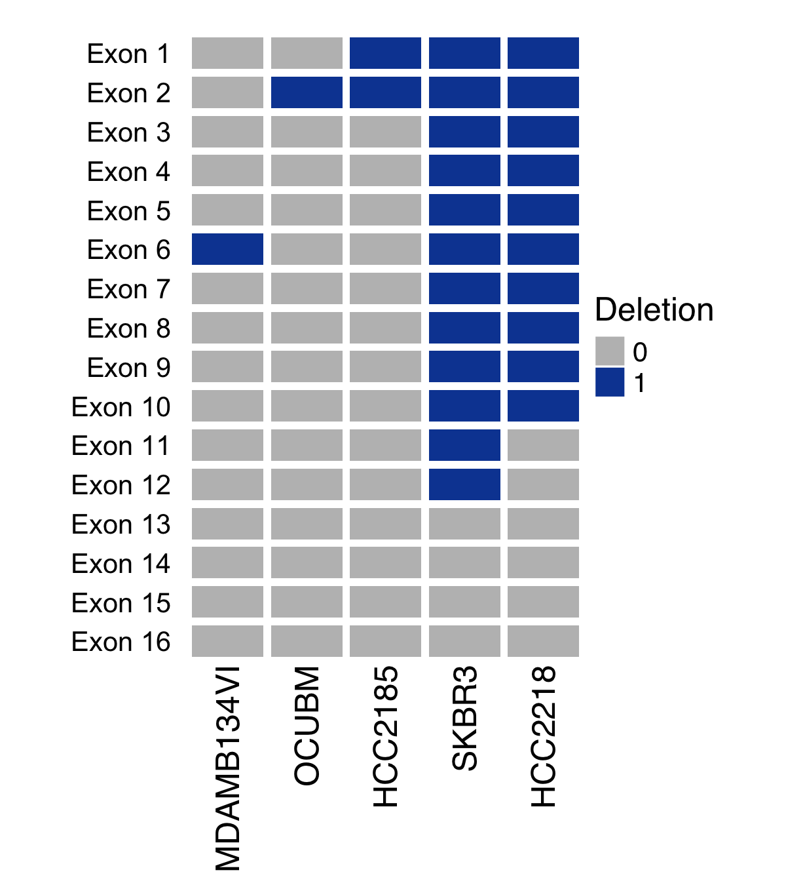

### Figure 2D: CDH1 Alterations in Local Recurrences and Distant Metastases (Patient Tumors)

Barplot comparing the frequency of *CDH1* structural rearrangements and
copy number deletions in ILC versus NST breast cancers across local
recurrence and distant metastasis groups in the FMI clinical cohort.
Enrichment statistics computed by Chi-square exact test, restricted to
cases without co-occurring *CDH1* point mutations or copy number gains.

``` r
ggsave(file.path(DIRS$results_sub$cdh1, "Fig2D_FMI_CDH1_Alterations_Barplot.pdf"), fig2d_fmi_alts, width = 6, height = 4)
gt::gtsave(gt::gt(fig2d_fmi_alts_tbl), file.path(DIRS$results_sub$cdh1, "Fig2D_FMI_CDH1_Alterations_Table.html"))
gt::gtsave(gt::gt(fig2d_fmi_alts_tbl_pval) %>%
               gt::cols_width(starts_with("local") ~ px(100),starts_with("distant") ~ px(100)) %>% 
             gt::tab_options(table.width = px(600), column_labels.font.size = px(10)), 
           file.path(DIRS$results_sub$cdh1, "Fig2D_FMI_CDH1_Alterations_ILCvsNST_Event_pval.html"))

fig2d_fmi_alts
```

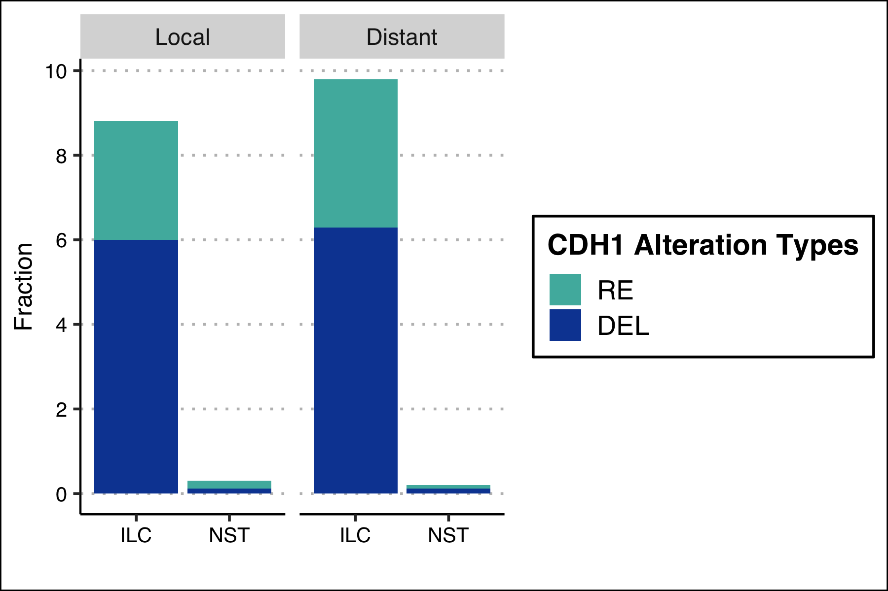

### Figure 2E: CDH1 Mutation Lollipop Plots (Patient Tumors vs Cell Lines)

*CDH1* protein domain lollipop plot overlaying mutation positions across
TCGA primary breast cancer tumors and integrated BRCA cell lines
generated using the ProteinPaint web tool (Zhou et al. 2016;
<https://proteinpaint.stjude.org/>).

``` r
# queries files (Fig2E_TCGA_CDH1_Mutations_Protein_Paint_Query.tsv & Fig2E_CellLines_CDH1_Mutations_Protein_Paint_Query.tsv) plotted using https://proteinpaint.stjude.org/
```

### Figure 2F: CDH1 Allele Frequency in Cell Lines

Barplot of *CDH1* variant allele frequencies (VAF) in ICLE cell lines,
colored by histological subtype (ILC, ILC-like, NST).

``` r
ggsave(file.path(DIRS$results_sub$cdh1, "Fig2F_CL_CDH1_AF_Barplot_histology_shape.pdf"), fig2f_cdh1_af, width = 4.5, height = 4)

fig2f_cdh1_af
```

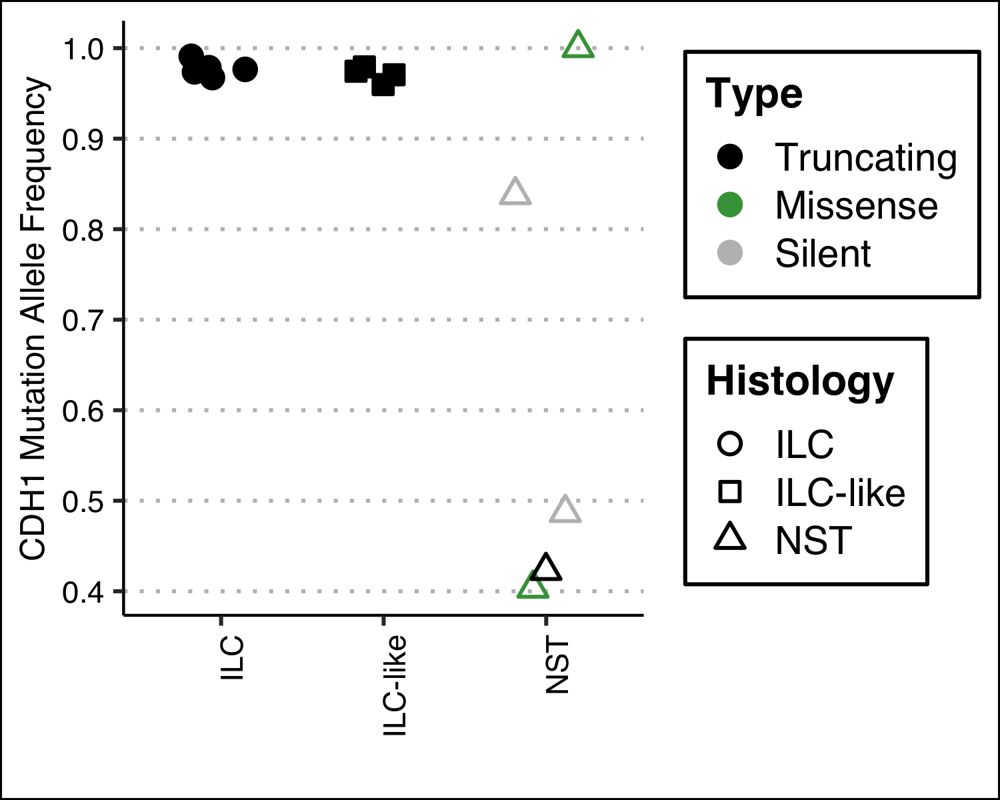

### Figure 2G: CDH1 Alteration Type Frequencies (Patient Tumors vs Cell Lines)

Side-by-side barplots comparing the frequency of *CDH1* alteration
categories — point mutation, LOH, biallelic event (MUT+LOH), dual
deletion — between integrated BRCA cell lines and TCGA primary BRCA
tumors, stratified by ILC vs NST. Enrichment of biallelic events in ILC
assessed by Chi-square test. Accompanying tables report per-event
p-values.

``` r
ggsave(file.path(DIRS$results_sub$cdh1, "Fig2G_CL_CDH1_Alt_barplot.pdf"), fig2g_cl_cdh1_alts, width = 5, height = 5)
ggsave(file.path(DIRS$results_sub$cdh1, "Fig2G_TCGA_CDH1_Alt_barplot.pdf"), fig2g_tcga_cdh1_alts, width = 4, height = 5)
suppressMessages({
  gt::gtsave(gt::gt(fig2g_cl_cdh1_alts_tbl), file.path(DIRS$results_sub$cdh1, "Fig2G_CL_CDH1_Alterations_Table.html"))
  gt::gtsave(gt::gt(fig2g_cl_cdh1_alts_tbl_pval), file.path(DIRS$results_sub$cdh1, "Fig2G_CL_CDH1_Alterations_ILCvsNST_Event_pval.html"))
  gt::gtsave(gt::gt(fig2g_tcga_cdh1_alts_tbl), file.path(DIRS$results_sub$cdh1, "Fig2G_TCGA_CDH1_Alterations_Table.html"))
  gt::gtsave(gt::gt(fig2g_tcga_cdh1_alts_tbl_pval), file.path(DIRS$results_sub$cdh1, "Fig2G_TCGA_CDH1_Alterations_ILCvsNST_Event_pval.html"))
})

ggarrange(plotlist = list(fig2g_tcga_cdh1_alts, fig2g_cl_cdh1_alts), widths = c(0.5, 0.6))
```

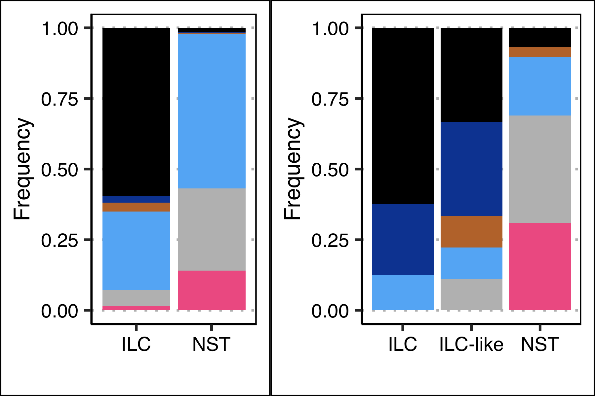

### Figure 2H: CDH1 Molecular Alteration Landscape (Patient Tumors vs Cell Lines)

Overview of multi-omic *CDH1* alteration landscape heatmaps in ILC vs
NST in Patient tumors and cell lines.

``` r
write.table(TCGA_CDH1_df, file.path(DIRS$results_sub$cdh1, "Fig2H_TCGA_CDH1_Alteration_Landscape.tsv"), sep = "\t", row.names = FALSE)  # → Supplementary Table S10 (TCGA)
write.table(CL_CDH1_df, file.path(DIRS$results_sub$cdh1, "Fig2H_CellLines_CDH1_Alteration_Landscape.tsv"), sep = "\t", row.names = FALSE)   # → Supplementary Table S10 (cell lines)

pdf(file.path(DIRS$results_sub$cdh1, "Fig2H_TCGA_CDH1_Alteration_Heatmap.pdf"), width = 8, height = 10)
  draw(fig2h_tcga, merge_legends = TRUE)
dev.off()
```

    ## quartz_off_screen 
    ##                 2

``` r
pdf(file.path(DIRS$results_sub$cdh1, "Fig2H_CellLine_CDH1_Alteration_Heatmap.pdf"), width = 8, height = 10)
  draw(fig2h_cl, merge_legends = TRUE)
dev.off()
```

    ## quartz_off_screen 
    ##                 2

``` r
draw(fig2h_tcga, merge_legends = TRUE)
```

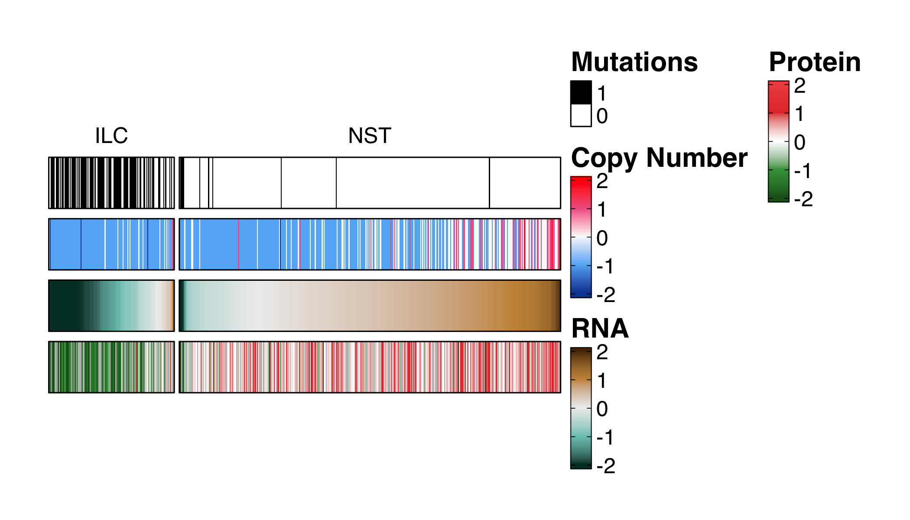

``` r
draw(fig2h_cl, merge_legends = TRUE)
```

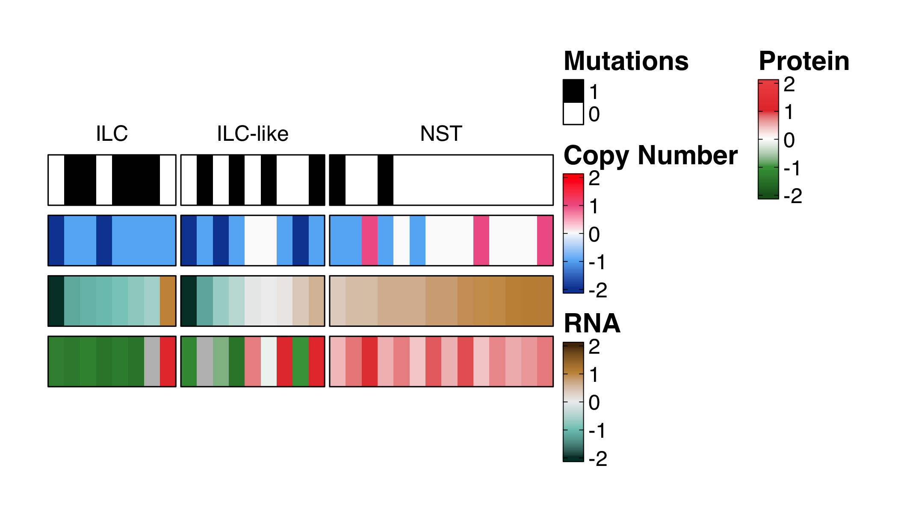

## c. Optical Genome Mapping Reveals Structural Variations, Chromothripsis and Functional Fusions

Runs all Figure 3 and SupFig 8–10 scripts in order via orchestrator
`14_Fig3_SV_All.R`. This section characterises the structural variant
(SV) landscape of ICLE cell lines profiled by Bionano Optical Genome
Mapping (OGM; resolution ≥5 kb). Includes: TMB and SV burden metrics
(SupFig 8), genome-wide SV distribution and genomic instability metrics
(Fig 3A), translocation breakpoint topography (Fig 3B), chromothripsis
detection using ShatterSeek (Fig 3C), circos plot generation (Fig 3D,
SupFig 9), and functional fusion analysis by integrating RNA-seq
expression data (Figs 3E–3F, SupFig 10).

``` r
source(file.path(DIRS$scripts$helpers, "14_Fig3_SV_All.R"), chdir = TRUE)
```

    ## 
    ## ========================================

    ## SupFig 8: TMB vs SV Comparison

    ## ========================================

    ##   ✓ SupFig 8 prep complete (chrom_sizes, alt_count_chr, SupFig8A–D assigned).

    ## 
    ## ========================================

    ## Figure 3A: Genomic instability metrics and SV distribution

    ## ========================================

    ##   ✓ Fig 3A complete

    ## 
    ## ========================================

    ## Figure 3B: Translocation breakpoint topography

    ## ========================================

    ##   ✓ Fig 3B complete (fig3b_transloc_breakpoints_ht assigned).

    ## 
    ## ========================================

    ## Figure 3C: Chromothripsis landscape

    ## ========================================

    ##   ✓ Fig 3C complete (shatterseek_outs, thripsis_ht assigned).

    ## 
    ## ========================================

    ## Figure 3D: Circos plots for selected samples

    ## ========================================

    ##   ✓ Fig 3D complete (trk_bck4, trk_600, trk_hcc, trk_zr assigned).

    ##   Preparing ICLE fusion data...

    ##   Loading tumor fusion data...

    ##   Calculating fusion gene expression...

    ##   Adding OncoVar annotations...

    ##   Identifying recurring fusions...

    ##   ✓ Fusion data preparation complete

    ##   Generating fusion visualizations...

    ## 
    ## ========================================

    ## Figure 3E: ICLE Fusion Distribution (Left)

    ## ========================================

    ##   ✓ Fig 3E (ICLE) complete

    ## 
    ## ========================================

    ## Figure 3E: Tumor Fusion Distribution (Right)

    ## ========================================

    ##   ✓ Fig 3E (Tumor) complete

    ## 
    ## ========================================

    ## SupFig 10A: Fusion Breakpoint Heatmap

    ## ========================================

    ##   ✓ SupFig 10A complete

    ## 
    ## ========================================

    ## SupFig 10B: Recurring Fusions Expression Heatmap

    ## ========================================

    ##   ✓ SupFig 10B complete

    ## 
    ## ========================================

    ## Figure 3F: GOE and LOE Fusions Circos

    ## ========================================

    ##   ✓ Fig 3F (GOE) complete

    ##   ✓ Fig 3F (LOE) complete

    ## 
    ## ========================================

    ## SupFig 10C: Recurring Gene Circos Plots

    ## ========================================

    ##   ✓ SupFig 10C (recurring genes) complete

    ## 
    ## ═══════════════════════════════════════════════════════

    ##   Figure 3 + SupFig 8–10 complete

    ## ═══════════════════════════════════════════════════════

### Figure 3A (left): ICLE Genomic Instability Metrics

Heatmap of genome-wide instability metrics across ICLE cell lines:
fraction genome altered (FGA; CINmetrics), large-scale state transitions
(LST), allelic imbalance (AI), homologous recombination deficiency (HRD)
score, and SV count from OGM. Columns annotated by molecular subtype and
histology.

``` r
pdf(file.path(DIRS$results_sub$ogm, "Fig3A_left_Metrics_of_GenomicInstability.pdf"), width = 4, height = 4)
draw(fig3a_genomic_instability)
dev.off()
```

    ## quartz_off_screen 
    ##                 2

``` r
fig3a_genomic_instability
```

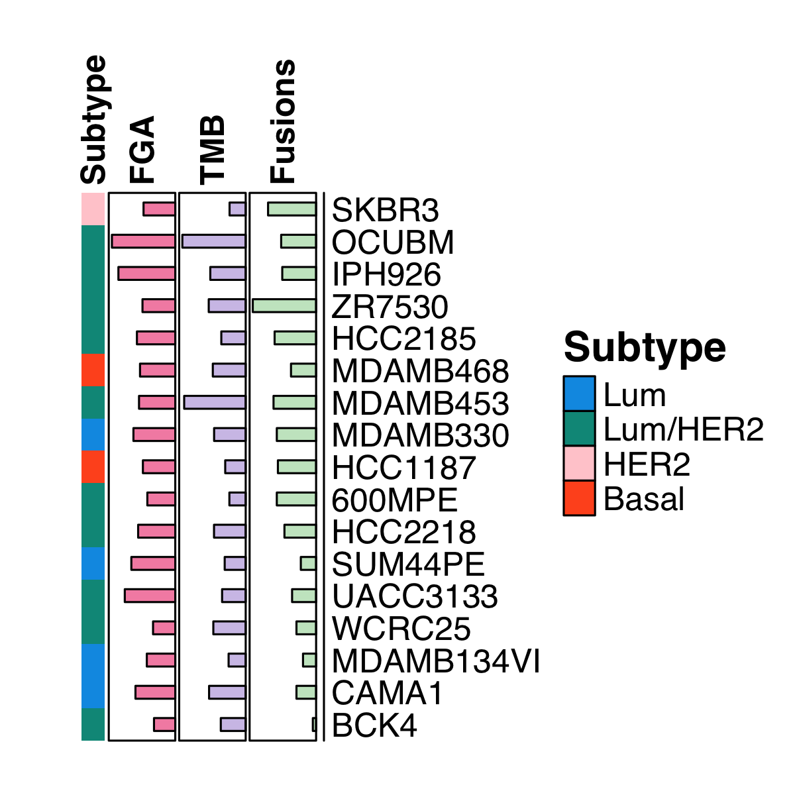

### Figure 3A (right): ICLE SV Type Distribution

Stacked barplot showing the absolute count and proportional distribution
of SV classes (DEL, DUP, INV, INS, TRA) per ICLE cell line, ordered by
total SV burden. Reveals cell line-specific patterns of genomic
rearrangement.

``` r
ggsave(file.path(DIRS$results_sub$ogm, "Fig3A_right_SV_Distribution.pdf"), fig3a_sv_distribution, width = 6, height = 5)
fig3a_sv_distribution
```

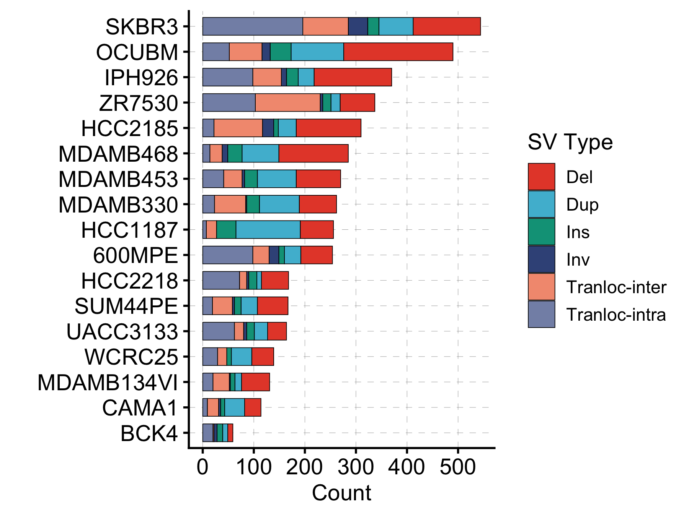

### Figure 3B: Chromosomal Topography of Translocation Breakpoints

Heatmap showing the chromosomal distribution of inter-chromosomal
translocation breakpoints across ICLE cell lines.

``` r
pdf(file.path(DIRS$results_sub$ogm, "Fig3B_Translocation_Distribution.pdf"), width = 6.5, height = 5)
  draw(fig3b_transloc_breakpoints_ht, merge_legends = TRUE)
dev.off()
```

    ## quartz_off_screen 
    ##                 2

``` r
fig3b_transloc_breakpoints_ht
```

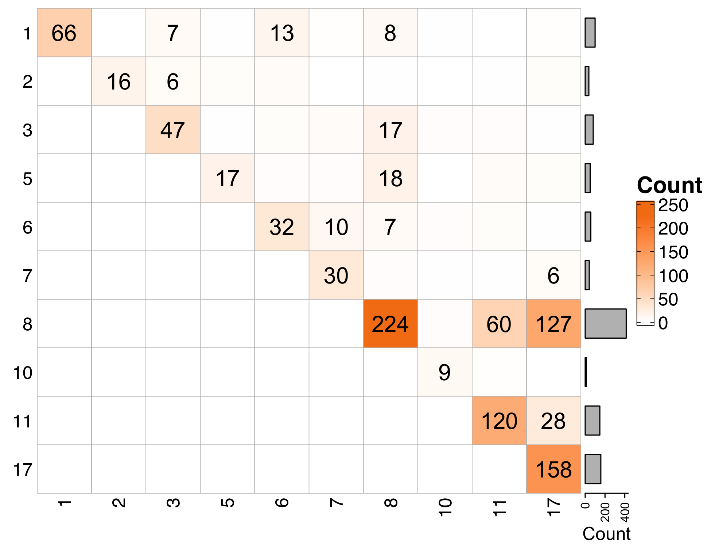

### Figure 3C: Chromothripsis Landscape

Heatmap of chromothripsis events identified by ShatterSeek
(Cortés-Ciriano et al. 2020) in ICLE cell lines. ShatterSeek integrates
OGM SV and CNV data to detect chromosomes with hallmarks of
chromothripsis (clustered oscillating CN states with co-localised SVs).
Rows = chromosomes; columns = ICLE cell lines; tile colour encodes
chromothripsis classification (high-confidence, low-confidence, absent).
Full results saved to
`SupTable11_shatterseek_chromothripsis_results.tsv`.

``` r
write.table(shatterseek_outs$chromothripsis_df, file.path(DIRS$results_sub$ogm, "SupTable11_shatterseek_chromothripsis_results.tsv"), sep = "\t", col.names = NA)  # → Supplementary Table S11
pdf(file.path(DIRS$results_sub$ogm, "Fig3C_chromothripsis_heatmap.pdf"), width = 5, height = 5)
  draw(fig3c_thripsis_ht, merge_legends = TRUE)
dev.off()
```

    ## quartz_off_screen 
    ##                 2

``` r
draw(fig3c_thripsis_ht, merge_legends = TRUE)
```

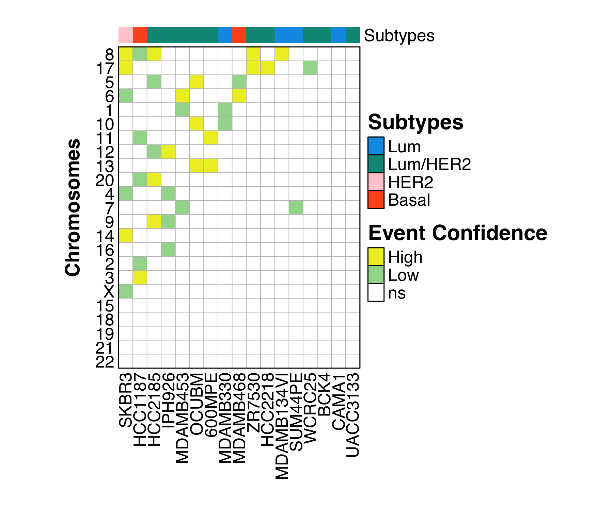

### Figure 3D: OGM Circos Plots — BCK4, 600MPE, HCC2185, ZR7530

Interactive circos plots for four ICLE cell lines with high SV burden or
clinically relevant rearrangements (BCK4, 600MPE, HCC2185, ZR7530),
generated using interacCircos (Cui et al. 2021). Each plot shows
genome-wide SV arcs overlaid on CN tracks. HTML widgets are exported to
static PDFs using `webshot2` (requires Chromium; see `README.md`). Cell
lines were selected to illustrate distinct OGM structural complexity
patterns.

``` r
# Load required libraries for HTML widget to PDF conversion
library(htmlwidgets)
library(webshot2)

# Save all four circos plots to PDF
message("Saving circos plots to PDF...")
```

    ## Saving circos plots to PDF...

``` r
circos_bck4 <- save_circos_to_pdf(trk_bck4, "BCK4", DIRS$results_sub$ogm)
```

    ## ! Reconnecting to chrome process.
    ## ℹ All active sessions will be need to be respawned.

    ## file:////Users/oshah/Documents/ICLE/3-Results/Optical_Genome_Mapping/Fig3D_Circos_BCK4.html screenshot completed

    ##   ✓ Saved PDF: Fig3D_Circos_BCK4.pdf

``` r
circos_600mpe <- save_circos_to_pdf(trk_600, "600MPE", DIRS$results_sub$ogm)
```

    ## file:////Users/oshah/Documents/ICLE/3-Results/Optical_Genome_Mapping/Fig3D_Circos_600MPE.html screenshot completed

    ##   ✓ Saved PDF: Fig3D_Circos_600MPE.pdf

``` r
circos_hcc2185 <- save_circos_to_pdf(trk_hcc, "HCC2185", DIRS$results_sub$ogm)
```

    ## file:////Users/oshah/Documents/ICLE/3-Results/Optical_Genome_Mapping/Fig3D_Circos_HCC2185.html screenshot completed

    ##   ✓ Saved PDF: Fig3D_Circos_HCC2185.pdf

``` r
circos_zr7530 <- save_circos_to_pdf(trk_zr, "ZR7530", DIRS$results_sub$ogm)
```

    ## file:////Users/oshah/Documents/ICLE/3-Results/Optical_Genome_Mapping/Fig3D_Circos_ZR7530.html screenshot completed

    ##   ✓ Saved PDF: Fig3D_Circos_ZR7530.pdf

``` r
circos_bck4
```

<div class="figure">

<div class="interacCircos html-widget html-fill-item" id="htmlwidget-0d9b8588a0732d3f12e4" style="width:1800px;height:1200px;"></div>
<script type="application/json" data-for="htmlwidget-0d9b8588a0732d3f12e4">{"x":{"message":["function (..., domain = NULL, appendLF = TRUE) ","{","    cond <- if (...length() == 1L && inherits(..1, \"condition\")) {","        if (nargs() > 1L) ","            warning(\"additional arguments ignored in message()\")","        ..1","    }","    else {","        msg <- .makeMessage(..., domain = domain, appendLF = appendLF)","        call <- sys.call()","        simpleMessage(msg, call)","    }","    defaultHandler <- function(c) {","        cat(conditionMessage(c), file = stderr(), sep = \"\")","    }","    withRestarts({","        signalCondition(cond)","        defaultHandler(cond)","    }, muffleMessage = function() NULL)","    invisible()","}"],"moduleList_NGCircos":[["ARC_arc01",{"compareGroup":1,"outerRadius":235,"innerRadius":218,"ARCOpacity":1,"ARCAnimationDisplay":false,"ARCAnimationTime":100,"ARCAnimationDelay":10,"ARCAnimationType":"bounce"},[{"chr":"1","start":0,"end":2300000,"color":"rgb(255,255,255)"},{"chr":"1","start":2300000,"end":5400000,"color":"rgb(200,200,200)"},{"chr":"1","start":5400000,"end":7200000,"color":"rgb(255,255,255)"},{"chr":"1","start":7200000,"end":9200000,"color":"rgb(200,200,200)"},{"chr":"1","start":9200000,"end":12700000,"color":"rgb(255,255,255)"},{"chr":"1","start":12700000,"end":16200000,"color":"rgb(200,200,200)"},{"chr":"1","start":16200000,"end":20400000,"color":"rgb(255,255,255)"},{"chr":"1","start":20400000,"end":23900000,"color":"rgb(200,200,200)"},{"chr":"1","start":23900000,"end":28000000,"color":"rgb(255,255,255)"},{"chr":"1","start":28000000,"end":30200000,"color":"rgb(200,200,200)"},{"chr":"1","start":30200000,"end":32400000,"color":"rgb(255,255,255)"},{"chr":"1","start":32400000,"end":34600000,"color":"rgb(200,200,200)"},{"chr":"1","start":34600000,"end":40100000,"color":"rgb(255,255,255)"},{"chr":"1","start":40100000,"end":44100000,"color":"rgb(200,200,200)"},{"chr":"1","start":44100000,"end":46800000,"color":"rgb(255,255,255)"},{"chr":"1","start":46800000,"end":50700000,"color":"rgb(130,130,130)"},{"chr":"1","start":50700000,"end":56100000,"color":"rgb(255,255,255)"},{"chr":"1","start":56100000,"end":59000000,"color":"rgb(200,200,200)"},{"chr":"1","start":59000000,"end":61300000,"color":"rgb(255,255,255)"},{"chr":"1","start":61300000,"end":68900000,"color":"rgb(200,200,200)"},{"chr":"1","start":68900000,"end":69700000,"color":"rgb(255,255,255)"},{"chr":"1","start":69700000,"end":84900000,"color":"rgb(0,0,0)"},{"chr":"1","start":84900000,"end":88400000,"color":"rgb(255,255,255)"},{"chr":"1","start":88400000,"end":92000000,"color":"rgb(130,130,130)"},{"chr":"1","start":92000000,"end":94700000,"color":"rgb(255,255,255)"},{"chr":"1","start":94700000,"end":99700000,"color":"rgb(130,130,130)"},{"chr":"1","start":99700000,"end":102200000,"color":"rgb(255,255,255)"},{"chr":"1","start":102200000,"end":107200000,"color":"rgb(0,0,0)"},{"chr":"1","start":107200000,"end":111800000,"color":"rgb(255,255,255)"},{"chr":"1","start":111800000,"end":116100000,"color":"rgb(200,200,200)"},{"chr":"1","start":116100000,"end":117800000,"color":"rgb(255,255,255)"},{"chr":"1","start":117800000,"end":120600000,"color":"rgb(200,200,200)"},{"chr":"1","start":120600000,"end":121500000,"color":"rgb(255,255,255)"},{"chr":"1","start":121500000,"end":125000000,"color":"rgb(217,47,39)"},{"chr":"1","start":125000000,"end":128900000,"color":"rgb(217,47,39)"},{"chr":"1","start":128900000,"end":142600000,"color":"rgb(220,220,220)"},{"chr":"1","start":142600000,"end":147000000,"color":"rgb(255,255,255)"},{"chr":"1","start":147000000,"end":150300000,"color":"rgb(200,200,200)"},{"chr":"1","start":150300000,"end":155000000,"color":"rgb(255,255,255)"},{"chr":"1","start":155000000,"end":156500000,"color":"rgb(200,200,200)"},{"chr":"1","start":156500000,"end":159100000,"color":"rgb(255,255,255)"},{"chr":"1","start":159100000,"end":160500000,"color":"rgb(200,200,200)"},{"chr":"1","start":160500000,"end":165500000,"color":"rgb(255,255,255)"},{"chr":"1","start":165500000,"end":167200000,"color":"rgb(200,200,200)"},{"chr":"1","start":167200000,"end":170900000,"color":"rgb(255,255,255)"},{"chr":"1","start":170900000,"end":172900000,"color":"rgb(130,130,130)"},{"chr":"1","start":172900000,"end":176000000,"color":"rgb(255,255,255)"},{"chr":"1","start":176000000,"end":180300000,"color":"rgb(200,200,200)"},{"chr":"1","start":180300000,"end":185800000,"color":"rgb(255,255,255)"},{"chr":"1","start":185800000,"end":190800000,"color":"rgb(0,0,0)"},{"chr":"1","start":190800000,"end":193800000,"color":"rgb(255,255,255)"},{"chr":"1","start":193800000,"end":198700000,"color":"rgb(0,0,0)"},{"chr":"1","start":198700000,"end":207200000,"color":"rgb(255,255,255)"},{"chr":"1","start":207200000,"end":211500000,"color":"rgb(200,200,200)"},{"chr":"1","start":211500000,"end":214500000,"color":"rgb(255,255,255)"},{"chr":"1","start":214500000,"end":224100000,"color":"rgb(0,0,0)"},{"chr":"1","start":224100000,"end":224600000,"color":"rgb(255,255,255)"},{"chr":"1","start":224600000,"end":227000000,"color":"rgb(200,200,200)"},{"chr":"1","start":227000000,"end":230700000,"color":"rgb(255,255,255)"},{"chr":"1","start":230700000,"end":234700000,"color":"rgb(200,200,200)"},{"chr":"1","start":234700000,"end":236600000,"color":"rgb(255,255,255)"},{"chr":"1","start":236600000,"end":243700000,"color":"rgb(130,130,130)"},{"chr":"1","start":243700000,"end":249250621,"color":"rgb(255,255,255)"},{"chr":"2","start":0,"end":4400000,"color":"rgb(255,255,255)"},{"chr":"2","start":4400000,"end":7100000,"color":"rgb(200,200,200)"},{"chr":"2","start":7100000,"end":12200000,"color":"rgb(255,255,255)"},{"chr":"2","start":12200000,"end":16700000,"color":"rgb(130,130,130)"},{"chr":"2","start":16700000,"end":19200000,"color":"rgb(255,255,255)"},{"chr":"2","start":19200000,"end":24000000,"color":"rgb(130,130,130)"},{"chr":"2","start":24000000,"end":27900000,"color":"rgb(255,255,255)"},{"chr":"2","start":27900000,"end":30000000,"color":"rgb(200,200,200)"},{"chr":"2","start":30000000,"end":32100000,"color":"rgb(255,255,255)"},{"chr":"2","start":32100000,"end":36600000,"color":"rgb(130,130,130)"},{"chr":"2","start":36600000,"end":38600000,"color":"rgb(255,255,255)"},{"chr":"2","start":38600000,"end":41800000,"color":"rgb(200,200,200)"},{"chr":"2","start":41800000,"end":47800000,"color":"rgb(255,255,255)"},{"chr":"2","start":47800000,"end":52900000,"color":"rgb(0,0,0)"},{"chr":"2","start":52900000,"end":55000000,"color":"rgb(255,255,255)"},{"chr":"2","start":55000000,"end":61300000,"color":"rgb(0,0,0)"},{"chr":"2","start":61300000,"end":64100000,"color":"rgb(255,255,255)"},{"chr":"2","start":64100000,"end":68600000,"color":"rgb(200,200,200)"},{"chr":"2","start":68600000,"end":71500000,"color":"rgb(255,255,255)"},{"chr":"2","start":71500000,"end":73500000,"color":"rgb(200,200,200)"},{"chr":"2","start":73500000,"end":75000000,"color":"rgb(255,255,255)"},{"chr":"2","start":75000000,"end":83300000,"color":"rgb(0,0,0)"},{"chr":"2","start":83300000,"end":90500000,"color":"rgb(255,255,255)"},{"chr":"2","start":90500000,"end":93300000,"color":"rgb(217,47,39)"},{"chr":"2","start":93300000,"end":96800000,"color":"rgb(217,47,39)"},{"chr":"2","start":96800000,"end":102700000,"color":"rgb(255,255,255)"},{"chr":"2","start":102700000,"end":106000000,"color":"rgb(200,200,200)"},{"chr":"2","start":106000000,"end":107500000,"color":"rgb(255,255,255)"},{"chr":"2","start":107500000,"end":110200000,"color":"rgb(200,200,200)"},{"chr":"2","start":110200000,"end":114400000,"color":"rgb(255,255,255)"},{"chr":"2","start":114400000,"end":118800000,"color":"rgb(200,200,200)"},{"chr":"2","start":118800000,"end":122400000,"color":"rgb(255,255,255)"},{"chr":"2","start":122400000,"end":129900000,"color":"rgb(200,200,200)"},{"chr":"2","start":129900000,"end":132500000,"color":"rgb(255,255,255)"},{"chr":"2","start":132500000,"end":135100000,"color":"rgb(200,200,200)"},{"chr":"2","start":135100000,"end":136800000,"color":"rgb(255,255,255)"},{"chr":"2","start":136800000,"end":142200000,"color":"rgb(0,0,0)"},{"chr":"2","start":142200000,"end":144100000,"color":"rgb(255,255,255)"},{"chr":"2","start":144100000,"end":148700000,"color":"rgb(0,0,0)"},{"chr":"2","start":148700000,"end":149900000,"color":"rgb(255,255,255)"},{"chr":"2","start":149900000,"end":150500000,"color":"rgb(200,200,200)"},{"chr":"2","start":150500000,"end":154900000,"color":"rgb(255,255,255)"},{"chr":"2","start":154900000,"end":159800000,"color":"rgb(130,130,130)"},{"chr":"2","start":159800000,"end":163700000,"color":"rgb(255,255,255)"},{"chr":"2","start":163700000,"end":169700000,"color":"rgb(130,130,130)"},{"chr":"2","start":169700000,"end":178000000,"color":"rgb(255,255,255)"},{"chr":"2","start":178000000,"end":180600000,"color":"rgb(200,200,200)"},{"chr":"2","start":180600000,"end":183000000,"color":"rgb(255,255,255)"},{"chr":"2","start":183000000,"end":189400000,"color":"rgb(130,130,130)"},{"chr":"2","start":189400000,"end":191900000,"color":"rgb(255,255,255)"},{"chr":"2","start":191900000,"end":197400000,"color":"rgb(130,130,130)"},{"chr":"2","start":197400000,"end":203300000,"color":"rgb(255,255,255)"},{"chr":"2","start":203300000,"end":204900000,"color":"rgb(200,200,200)"},{"chr":"2","start":204900000,"end":209000000,"color":"rgb(255,255,255)"},{"chr":"2","start":209000000,"end":215300000,"color":"rgb(0,0,0)"},{"chr":"2","start":215300000,"end":221500000,"color":"rgb(255,255,255)"},{"chr":"2","start":221500000,"end":225200000,"color":"rgb(130,130,130)"},{"chr":"2","start":225200000,"end":226100000,"color":"rgb(255,255,255)"},{"chr":"2","start":226100000,"end":231000000,"color":"rgb(0,0,0)"},{"chr":"2","start":231000000,"end":235600000,"color":"rgb(255,255,255)"},{"chr":"2","start":235600000,"end":237300000,"color":"rgb(200,200,200)"},{"chr":"2","start":237300000,"end":243199373,"color":"rgb(255,255,255)"},{"chr":"3","start":0,"end":2800000,"color":"rgb(200,200,200)"},{"chr":"3","start":2800000,"end":4000000,"color":"rgb(255,255,255)"},{"chr":"3","start":4000000,"end":8700000,"color":"rgb(200,200,200)"},{"chr":"3","start":8700000,"end":11800000,"color":"rgb(255,255,255)"},{"chr":"3","start":11800000,"end":13300000,"color":"rgb(200,200,200)"},{"chr":"3","start":13300000,"end":16400000,"color":"rgb(255,255,255)"},{"chr":"3","start":16400000,"end":23900000,"color":"rgb(0,0,0)"},{"chr":"3","start":23900000,"end":26400000,"color":"rgb(255,255,255)"},{"chr":"3","start":26400000,"end":30900000,"color":"rgb(130,130,130)"},{"chr":"3","start":30900000,"end":32100000,"color":"rgb(255,255,255)"},{"chr":"3","start":32100000,"end":36500000,"color":"rgb(200,200,200)"},{"chr":"3","start":36500000,"end":39400000,"color":"rgb(255,255,255)"},{"chr":"3","start":39400000,"end":43700000,"color":"rgb(130,130,130)"},{"chr":"3","start":43700000,"end":44100000,"color":"rgb(255,255,255)"},{"chr":"3","start":44100000,"end":44200000,"color":"rgb(200,200,200)"},{"chr":"3","start":44200000,"end":50600000,"color":"rgb(255,255,255)"},{"chr":"3","start":50600000,"end":52300000,"color":"rgb(200,200,200)"},{"chr":"3","start":52300000,"end":54400000,"color":"rgb(255,255,255)"},{"chr":"3","start":54400000,"end":58600000,"color":"rgb(200,200,200)"},{"chr":"3","start":58600000,"end":63700000,"color":"rgb(255,255,255)"},{"chr":"3","start":63700000,"end":69800000,"color":"rgb(200,200,200)"},{"chr":"3","start":69800000,"end":74200000,"color":"rgb(255,255,255)"},{"chr":"3","start":74200000,"end":79800000,"color":"rgb(130,130,130)"},{"chr":"3","start":79800000,"end":83500000,"color":"rgb(255,255,255)"},{"chr":"3","start":83500000,"end":87200000,"color":"rgb(130,130,130)"},{"chr":"3","start":87200000,"end":87900000,"color":"rgb(255,255,255)"},{"chr":"3","start":87900000,"end":91000000,"color":"rgb(217,47,39)"},{"chr":"3","start":91000000,"end":93900000,"color":"rgb(217,47,39)"},{"chr":"3","start":93900000,"end":98300000,"color":"rgb(220,220,220)"},{"chr":"3","start":98300000,"end":100000000,"color":"rgb(255,255,255)"},{"chr":"3","start":100000000,"end":100900000,"color":"rgb(200,200,200)"},{"chr":"3","start":100900000,"end":102800000,"color":"rgb(255,255,255)"},{"chr":"3","start":102800000,"end":106200000,"color":"rgb(130,130,130)"},{"chr":"3","start":106200000,"end":107900000,"color":"rgb(255,255,255)"},{"chr":"3","start":107900000,"end":111300000,"color":"rgb(200,200,200)"},{"chr":"3","start":111300000,"end":113500000,"color":"rgb(255,255,255)"},{"chr":"3","start":113500000,"end":117300000,"color":"rgb(130,130,130)"},{"chr":"3","start":117300000,"end":119000000,"color":"rgb(255,255,255)"},{"chr":"3","start":119000000,"end":121900000,"color":"rgb(130,130,130)"},{"chr":"3","start":121900000,"end":123800000,"color":"rgb(255,255,255)"},{"chr":"3","start":123800000,"end":125800000,"color":"rgb(200,200,200)"},{"chr":"3","start":125800000,"end":129200000,"color":"rgb(255,255,255)"},{"chr":"3","start":129200000,"end":133700000,"color":"rgb(200,200,200)"},{"chr":"3","start":133700000,"end":135700000,"color":"rgb(255,255,255)"},{"chr":"3","start":135700000,"end":138700000,"color":"rgb(200,200,200)"},{"chr":"3","start":138700000,"end":142800000,"color":"rgb(255,255,255)"},{"chr":"3","start":142800000,"end":148900000,"color":"rgb(0,0,0)"},{"chr":"3","start":148900000,"end":152100000,"color":"rgb(255,255,255)"},{"chr":"3","start":152100000,"end":155000000,"color":"rgb(200,200,200)"},{"chr":"3","start":155000000,"end":157000000,"color":"rgb(255,255,255)"},{"chr":"3","start":157000000,"end":159000000,"color":"rgb(200,200,200)"},{"chr":"3","start":159000000,"end":160700000,"color":"rgb(255,255,255)"},{"chr":"3","start":160700000,"end":167600000,"color":"rgb(0,0,0)"},{"chr":"3","start":167600000,"end":170900000,"color":"rgb(255,255,255)"},{"chr":"3","start":170900000,"end":175700000,"color":"rgb(130,130,130)"},{"chr":"3","start":175700000,"end":179000000,"color":"rgb(255,255,255)"},{"chr":"3","start":179000000,"end":182700000,"color":"rgb(130,130,130)"},{"chr":"3","start":182700000,"end":184500000,"color":"rgb(255,255,255)"},{"chr":"3","start":184500000,"end":186000000,"color":"rgb(200,200,200)"},{"chr":"3","start":186000000,"end":187900000,"color":"rgb(255,255,255)"},{"chr":"3","start":187900000,"end":192300000,"color":"rgb(130,130,130)"},{"chr":"3","start":192300000,"end":198022430,"color":"rgb(255,255,255)"},{"chr":"4","start":0,"end":4500000,"color":"rgb(255,255,255)"},{"chr":"4","start":4500000,"end":6000000,"color":"rgb(200,200,200)"},{"chr":"4","start":6000000,"end":11300000,"color":"rgb(255,255,255)"},{"chr":"4","start":11300000,"end":15200000,"color":"rgb(200,200,200)"},{"chr":"4","start":15200000,"end":17800000,"color":"rgb(255,255,255)"},{"chr":"4","start":17800000,"end":21300000,"color":"rgb(130,130,130)"},{"chr":"4","start":21300000,"end":27700000,"color":"rgb(255,255,255)"},{"chr":"4","start":27700000,"end":35800000,"color":"rgb(0,0,0)"},{"chr":"4","start":35800000,"end":41200000,"color":"rgb(255,255,255)"},{"chr":"4","start":41200000,"end":44600000,"color":"rgb(200,200,200)"},{"chr":"4","start":44600000,"end":48200000,"color":"rgb(255,255,255)"},{"chr":"4","start":48200000,"end":50400000,"color":"rgb(217,47,39)"},{"chr":"4","start":50400000,"end":52700000,"color":"rgb(217,47,39)"},{"chr":"4","start":52700000,"end":59500000,"color":"rgb(255,255,255)"},{"chr":"4","start":59500000,"end":66600000,"color":"rgb(0,0,0)"},{"chr":"4","start":66600000,"end":70500000,"color":"rgb(255,255,255)"},{"chr":"4","start":70500000,"end":76300000,"color":"rgb(130,130,130)"},{"chr":"4","start":76300000,"end":78900000,"color":"rgb(255,255,255)"},{"chr":"4","start":78900000,"end":82400000,"color":"rgb(200,200,200)"},{"chr":"4","start":82400000,"end":84100000,"color":"rgb(255,255,255)"},{"chr":"4","start":84100000,"end":86900000,"color":"rgb(200,200,200)"},{"chr":"4","start":86900000,"end":88000000,"color":"rgb(255,255,255)"},{"chr":"4","start":88000000,"end":93700000,"color":"rgb(130,130,130)"},{"chr":"4","start":93700000,"end":95100000,"color":"rgb(255,255,255)"},{"chr":"4","start":95100000,"end":98800000,"color":"rgb(130,130,130)"},{"chr":"4","start":98800000,"end":101100000,"color":"rgb(255,255,255)"},{"chr":"4","start":101100000,"end":107700000,"color":"rgb(200,200,200)"},{"chr":"4","start":107700000,"end":114100000,"color":"rgb(255,255,255)"},{"chr":"4","start":114100000,"end":120800000,"color":"rgb(130,130,130)"},{"chr":"4","start":120800000,"end":123800000,"color":"rgb(255,255,255)"},{"chr":"4","start":123800000,"end":128800000,"color":"rgb(200,200,200)"},{"chr":"4","start":128800000,"end":131100000,"color":"rgb(255,255,255)"},{"chr":"4","start":131100000,"end":139500000,"color":"rgb(0,0,0)"},{"chr":"4","start":139500000,"end":141500000,"color":"rgb(255,255,255)"},{"chr":"4","start":141500000,"end":146800000,"color":"rgb(200,200,200)"},{"chr":"4","start":146800000,"end":148500000,"color":"rgb(255,255,255)"},{"chr":"4","start":148500000,"end":151100000,"color":"rgb(200,200,200)"},{"chr":"4","start":151100000,"end":155600000,"color":"rgb(255,255,255)"},{"chr":"4","start":155600000,"end":161800000,"color":"rgb(0,0,0)"},{"chr":"4","start":161800000,"end":164500000,"color":"rgb(255,255,255)"},{"chr":"4","start":164500000,"end":170100000,"color":"rgb(0,0,0)"},{"chr":"4","start":170100000,"end":171900000,"color":"rgb(255,255,255)"},{"chr":"4","start":171900000,"end":176300000,"color":"rgb(130,130,130)"},{"chr":"4","start":176300000,"end":177500000,"color":"rgb(255,255,255)"},{"chr":"4","start":177500000,"end":183200000,"color":"rgb(0,0,0)"},{"chr":"4","start":183200000,"end":187100000,"color":"rgb(255,255,255)"},{"chr":"4","start":187100000,"end":191154276,"color":"rgb(200,200,200)"},{"chr":"5","start":0,"end":4500000,"color":"rgb(255,255,255)"},{"chr":"5","start":4500000,"end":6300000,"color":"rgb(200,200,200)"},{"chr":"5","start":6300000,"end":9800000,"color":"rgb(255,255,255)"},{"chr":"5","start":9800000,"end":15000000,"color":"rgb(200,200,200)"},{"chr":"5","start":15000000,"end":18400000,"color":"rgb(255,255,255)"},{"chr":"5","start":18400000,"end":23300000,"color":"rgb(0,0,0)"},{"chr":"5","start":23300000,"end":24600000,"color":"rgb(255,255,255)"},{"chr":"5","start":24600000,"end":28900000,"color":"rgb(0,0,0)"},{"chr":"5","start":28900000,"end":33800000,"color":"rgb(255,255,255)"},{"chr":"5","start":33800000,"end":38400000,"color":"rgb(200,200,200)"},{"chr":"5","start":38400000,"end":42500000,"color":"rgb(255,255,255)"},{"chr":"5","start":42500000,"end":46100000,"color":"rgb(200,200,200)"},{"chr":"5","start":46100000,"end":48400000,"color":"rgb(217,47,39)"},{"chr":"5","start":48400000,"end":50700000,"color":"rgb(217,47,39)"},{"chr":"5","start":50700000,"end":58900000,"color":"rgb(255,255,255)"},{"chr":"5","start":58900000,"end":62900000,"color":"rgb(130,130,130)"},{"chr":"5","start":62900000,"end":63200000,"color":"rgb(255,255,255)"},{"chr":"5","start":63200000,"end":66700000,"color":"rgb(130,130,130)"},{"chr":"5","start":66700000,"end":68400000,"color":"rgb(255,255,255)"},{"chr":"5","start":68400000,"end":73300000,"color":"rgb(200,200,200)"},{"chr":"5","start":73300000,"end":76900000,"color":"rgb(255,255,255)"},{"chr":"5","start":76900000,"end":81400000,"color":"rgb(200,200,200)"},{"chr":"5","start":81400000,"end":82800000,"color":"rgb(255,255,255)"},{"chr":"5","start":82800000,"end":92300000,"color":"rgb(0,0,0)"},{"chr":"5","start":92300000,"end":98200000,"color":"rgb(255,255,255)"},{"chr":"5","start":98200000,"end":102800000,"color":"rgb(0,0,0)"},{"chr":"5","start":102800000,"end":104500000,"color":"rgb(255,255,255)"},{"chr":"5","start":104500000,"end":109600000,"color":"rgb(0,0,0)"},{"chr":"5","start":109600000,"end":111500000,"color":"rgb(255,255,255)"},{"chr":"5","start":111500000,"end":113100000,"color":"rgb(200,200,200)"},{"chr":"5","start":113100000,"end":115200000,"color":"rgb(255,255,255)"},{"chr":"5","start":115200000,"end":121400000,"color":"rgb(0,0,0)"},{"chr":"5","start":121400000,"end":127300000,"color":"rgb(255,255,255)"},{"chr":"5","start":127300000,"end":130600000,"color":"rgb(0,0,0)"},{"chr":"5","start":130600000,"end":136200000,"color":"rgb(255,255,255)"},{"chr":"5","start":136200000,"end":139500000,"color":"rgb(200,200,200)"},{"chr":"5","start":139500000,"end":144500000,"color":"rgb(255,255,255)"},{"chr":"5","start":144500000,"end":149800000,"color":"rgb(130,130,130)"},{"chr":"5","start":149800000,"end":152700000,"color":"rgb(255,255,255)"},{"chr":"5","start":152700000,"end":155700000,"color":"rgb(200,200,200)"},{"chr":"5","start":155700000,"end":159900000,"color":"rgb(255,255,255)"},{"chr":"5","start":159900000,"end":168500000,"color":"rgb(0,0,0)"},{"chr":"5","start":168500000,"end":172800000,"color":"rgb(255,255,255)"},{"chr":"5","start":172800000,"end":176600000,"color":"rgb(200,200,200)"},{"chr":"5","start":176600000,"end":180915260,"color":"rgb(255,255,255)"},{"chr":"6","start":0,"end":2300000,"color":"rgb(255,255,255)"},{"chr":"6","start":2300000,"end":4200000,"color":"rgb(200,200,200)"},{"chr":"6","start":4200000,"end":7100000,"color":"rgb(255,255,255)"},{"chr":"6","start":7100000,"end":10600000,"color":"rgb(200,200,200)"},{"chr":"6","start":10600000,"end":11600000,"color":"rgb(255,255,255)"},{"chr":"6","start":11600000,"end":13400000,"color":"rgb(200,200,200)"},{"chr":"6","start":13400000,"end":15200000,"color":"rgb(255,255,255)"},{"chr":"6","start":15200000,"end":25200000,"color":"rgb(130,130,130)"},{"chr":"6","start":25200000,"end":27000000,"color":"rgb(255,255,255)"},{"chr":"6","start":27000000,"end":30400000,"color":"rgb(200,200,200)"},{"chr":"6","start":30400000,"end":32100000,"color":"rgb(255,255,255)"},{"chr":"6","start":32100000,"end":33500000,"color":"rgb(200,200,200)"},{"chr":"6","start":33500000,"end":36600000,"color":"rgb(255,255,255)"},{"chr":"6","start":36600000,"end":40500000,"color":"rgb(200,200,200)"},{"chr":"6","start":40500000,"end":46200000,"color":"rgb(255,255,255)"},{"chr":"6","start":46200000,"end":51800000,"color":"rgb(0,0,0)"},{"chr":"6","start":51800000,"end":52900000,"color":"rgb(255,255,255)"},{"chr":"6","start":52900000,"end":57000000,"color":"rgb(0,0,0)"},{"chr":"6","start":57000000,"end":58700000,"color":"rgb(255,255,255)"},{"chr":"6","start":58700000,"end":61000000,"color":"rgb(217,47,39)"},{"chr":"6","start":61000000,"end":63300000,"color":"rgb(217,47,39)"},{"chr":"6","start":63300000,"end":63400000,"color":"rgb(255,255,255)"},{"chr":"6","start":63400000,"end":70000000,"color":"rgb(0,0,0)"},{"chr":"6","start":70000000,"end":75900000,"color":"rgb(255,255,255)"},{"chr":"6","start":75900000,"end":83900000,"color":"rgb(200,200,200)"},{"chr":"6","start":83900000,"end":84900000,"color":"rgb(255,255,255)"},{"chr":"6","start":84900000,"end":88000000,"color":"rgb(200,200,200)"},{"chr":"6","start":88000000,"end":93100000,"color":"rgb(255,255,255)"},{"chr":"6","start":93100000,"end":99500000,"color":"rgb(0,0,0)"},{"chr":"6","start":99500000,"end":100600000,"color":"rgb(255,255,255)"},{"chr":"6","start":100600000,"end":105500000,"color":"rgb(0,0,0)"},{"chr":"6","start":105500000,"end":114600000,"color":"rgb(255,255,255)"},{"chr":"6","start":114600000,"end":118300000,"color":"rgb(130,130,130)"},{"chr":"6","start":118300000,"end":118500000,"color":"rgb(255,255,255)"},{"chr":"6","start":118500000,"end":126100000,"color":"rgb(0,0,0)"},{"chr":"6","start":126100000,"end":127100000,"color":"rgb(255,255,255)"},{"chr":"6","start":127100000,"end":130300000,"color":"rgb(130,130,130)"},{"chr":"6","start":130300000,"end":131200000,"color":"rgb(255,255,255)"},{"chr":"6","start":131200000,"end":135200000,"color":"rgb(200,200,200)"},{"chr":"6","start":135200000,"end":139000000,"color":"rgb(255,255,255)"},{"chr":"6","start":139000000,"end":142800000,"color":"rgb(130,130,130)"},{"chr":"6","start":142800000,"end":145600000,"color":"rgb(255,255,255)"},{"chr":"6","start":145600000,"end":149000000,"color":"rgb(130,130,130)"},{"chr":"6","start":149000000,"end":152500000,"color":"rgb(255,255,255)"},{"chr":"6","start":152500000,"end":155500000,"color":"rgb(200,200,200)"},{"chr":"6","start":155500000,"end":161000000,"color":"rgb(255,255,255)"},{"chr":"6","start":161000000,"end":164500000,"color":"rgb(200,200,200)"},{"chr":"6","start":164500000,"end":171115067,"color":"rgb(255,255,255)"},{"chr":"7","start":0,"end":2800000,"color":"rgb(255,255,255)"},{"chr":"7","start":2800000,"end":4500000,"color":"rgb(200,200,200)"},{"chr":"7","start":4500000,"end":7300000,"color":"rgb(255,255,255)"},{"chr":"7","start":7300000,"end":13800000,"color":"rgb(0,0,0)"},{"chr":"7","start":13800000,"end":16500000,"color":"rgb(255,255,255)"},{"chr":"7","start":16500000,"end":20900000,"color":"rgb(0,0,0)"},{"chr":"7","start":20900000,"end":25500000,"color":"rgb(255,255,255)"},{"chr":"7","start":25500000,"end":28000000,"color":"rgb(200,200,200)"},{"chr":"7","start":28000000,"end":28800000,"color":"rgb(255,255,255)"},{"chr":"7","start":28800000,"end":35000000,"color":"rgb(130,130,130)"},{"chr":"7","start":35000000,"end":37200000,"color":"rgb(255,255,255)"},{"chr":"7","start":37200000,"end":43300000,"color":"rgb(130,130,130)"},{"chr":"7","start":43300000,"end":45400000,"color":"rgb(255,255,255)"},{"chr":"7","start":45400000,"end":49000000,"color":"rgb(130,130,130)"},{"chr":"7","start":49000000,"end":50500000,"color":"rgb(255,255,255)"},{"chr":"7","start":50500000,"end":54000000,"color":"rgb(130,130,130)"},{"chr":"7","start":54000000,"end":58000000,"color":"rgb(255,255,255)"},{"chr":"7","start":58000000,"end":59900000,"color":"rgb(217,47,39)"},{"chr":"7","start":59900000,"end":61700000,"color":"rgb(217,47,39)"},{"chr":"7","start":61700000,"end":67000000,"color":"rgb(255,255,255)"},{"chr":"7","start":67000000,"end":72200000,"color":"rgb(200,200,200)"},{"chr":"7","start":72200000,"end":77500000,"color":"rgb(255,255,255)"},{"chr":"7","start":77500000,"end":86400000,"color":"rgb(0,0,0)"},{"chr":"7","start":86400000,"end":88200000,"color":"rgb(255,255,255)"},{"chr":"7","start":88200000,"end":91100000,"color":"rgb(130,130,130)"},{"chr":"7","start":91100000,"end":92800000,"color":"rgb(255,255,255)"},{"chr":"7","start":92800000,"end":98000000,"color":"rgb(130,130,130)"},{"chr":"7","start":98000000,"end":103800000,"color":"rgb(255,255,255)"},{"chr":"7","start":103800000,"end":104500000,"color":"rgb(200,200,200)"},{"chr":"7","start":104500000,"end":107400000,"color":"rgb(255,255,255)"},{"chr":"7","start":107400000,"end":114600000,"color":"rgb(130,130,130)"},{"chr":"7","start":114600000,"end":117400000,"color":"rgb(255,255,255)"},{"chr":"7","start":117400000,"end":121100000,"color":"rgb(130,130,130)"},{"chr":"7","start":121100000,"end":123800000,"color":"rgb(255,255,255)"},{"chr":"7","start":123800000,"end":127100000,"color":"rgb(130,130,130)"},{"chr":"7","start":127100000,"end":129200000,"color":"rgb(255,255,255)"},{"chr":"7","start":129200000,"end":130400000,"color":"rgb(200,200,200)"},{"chr":"7","start":130400000,"end":132600000,"color":"rgb(255,255,255)"},{"chr":"7","start":132600000,"end":138200000,"color":"rgb(200,200,200)"},{"chr":"7","start":138200000,"end":143100000,"color":"rgb(255,255,255)"},{"chr":"7","start":143100000,"end":147900000,"color":"rgb(130,130,130)"},{"chr":"7","start":147900000,"end":152600000,"color":"rgb(255,255,255)"},{"chr":"7","start":152600000,"end":155100000,"color":"rgb(200,200,200)"},{"chr":"7","start":155100000,"end":159138663,"color":"rgb(255,255,255)"},{"chr":"8","start":0,"end":2200000,"color":"rgb(255,255,255)"},{"chr":"8","start":2200000,"end":6200000,"color":"rgb(130,130,130)"},{"chr":"8","start":6200000,"end":12700000,"color":"rgb(255,255,255)"},{"chr":"8","start":12700000,"end":19000000,"color":"rgb(0,0,0)"},{"chr":"8","start":19000000,"end":23300000,"color":"rgb(255,255,255)"},{"chr":"8","start":23300000,"end":27400000,"color":"rgb(200,200,200)"},{"chr":"8","start":27400000,"end":28800000,"color":"rgb(255,255,255)"},{"chr":"8","start":28800000,"end":36500000,"color":"rgb(130,130,130)"},{"chr":"8","start":36500000,"end":38300000,"color":"rgb(255,255,255)"},{"chr":"8","start":38300000,"end":39700000,"color":"rgb(200,200,200)"},{"chr":"8","start":39700000,"end":43100000,"color":"rgb(255,255,255)"},{"chr":"8","start":43100000,"end":45600000,"color":"rgb(217,47,39)"},{"chr":"8","start":45600000,"end":48100000,"color":"rgb(217,47,39)"},{"chr":"8","start":48100000,"end":52200000,"color":"rgb(255,255,255)"},{"chr":"8","start":52200000,"end":52600000,"color":"rgb(130,130,130)"},{"chr":"8","start":52600000,"end":55500000,"color":"rgb(255,255,255)"},{"chr":"8","start":55500000,"end":61600000,"color":"rgb(200,200,200)"},{"chr":"8","start":61600000,"end":62200000,"color":"rgb(255,255,255)"},{"chr":"8","start":62200000,"end":66000000,"color":"rgb(200,200,200)"},{"chr":"8","start":66000000,"end":68000000,"color":"rgb(255,255,255)"},{"chr":"8","start":68000000,"end":70500000,"color":"rgb(200,200,200)"},{"chr":"8","start":70500000,"end":73900000,"color":"rgb(255,255,255)"},{"chr":"8","start":73900000,"end":78300000,"color":"rgb(0,0,0)"},{"chr":"8","start":78300000,"end":80100000,"color":"rgb(255,255,255)"},{"chr":"8","start":80100000,"end":84600000,"color":"rgb(130,130,130)"},{"chr":"8","start":84600000,"end":86900000,"color":"rgb(255,255,255)"},{"chr":"8","start":86900000,"end":93300000,"color":"rgb(0,0,0)"},{"chr":"8","start":93300000,"end":99000000,"color":"rgb(255,255,255)"},{"chr":"8","start":99000000,"end":101600000,"color":"rgb(200,200,200)"},{"chr":"8","start":101600000,"end":106200000,"color":"rgb(255,255,255)"},{"chr":"8","start":106200000,"end":110500000,"color":"rgb(130,130,130)"},{"chr":"8","start":110500000,"end":112100000,"color":"rgb(255,255,255)"},{"chr":"8","start":112100000,"end":117700000,"color":"rgb(0,0,0)"},{"chr":"8","start":117700000,"end":119200000,"color":"rgb(255,255,255)"},{"chr":"8","start":119200000,"end":122500000,"color":"rgb(200,200,200)"},{"chr":"8","start":122500000,"end":127300000,"color":"rgb(255,255,255)"},{"chr":"8","start":127300000,"end":131500000,"color":"rgb(200,200,200)"},{"chr":"8","start":131500000,"end":136400000,"color":"rgb(255,255,255)"},{"chr":"8","start":136400000,"end":139900000,"color":"rgb(130,130,130)"},{"chr":"8","start":139900000,"end":146364022,"color":"rgb(255,255,255)"},{"chr":"9","start":0,"end":2200000,"color":"rgb(255,255,255)"},{"chr":"9","start":2200000,"end":4600000,"color":"rgb(200,200,200)"},{"chr":"9","start":4600000,"end":9000000,"color":"rgb(255,255,255)"},{"chr":"9","start":9000000,"end":14200000,"color":"rgb(130,130,130)"},{"chr":"9","start":14200000,"end":16600000,"color":"rgb(255,255,255)"},{"chr":"9","start":16600000,"end":18500000,"color":"rgb(200,200,200)"},{"chr":"9","start":18500000,"end":19900000,"color":"rgb(255,255,255)"},{"chr":"9","start":19900000,"end":25600000,"color":"rgb(0,0,0)"},{"chr":"9","start":25600000,"end":28000000,"color":"rgb(255,255,255)"},{"chr":"9","start":28000000,"end":33200000,"color":"rgb(0,0,0)"},{"chr":"9","start":33200000,"end":36300000,"color":"rgb(255,255,255)"},{"chr":"9","start":36300000,"end":38400000,"color":"rgb(200,200,200)"},{"chr":"9","start":38400000,"end":41000000,"color":"rgb(255,255,255)"},{"chr":"9","start":41000000,"end":43600000,"color":"rgb(200,200,200)"},{"chr":"9","start":43600000,"end":47300000,"color":"rgb(255,255,255)"},{"chr":"9","start":47300000,"end":49000000,"color":"rgb(217,47,39)"},{"chr":"9","start":49000000,"end":50700000,"color":"rgb(217,47,39)"},{"chr":"9","start":50700000,"end":65900000,"color":"rgb(220,220,220)"},{"chr":"9","start":65900000,"end":68700000,"color":"rgb(255,255,255)"},{"chr":"9","start":68700000,"end":72200000,"color":"rgb(200,200,200)"},{"chr":"9","start":72200000,"end":74000000,"color":"rgb(255,255,255)"},{"chr":"9","start":74000000,"end":79200000,"color":"rgb(200,200,200)"},{"chr":"9","start":79200000,"end":81100000,"color":"rgb(255,255,255)"},{"chr":"9","start":81100000,"end":84100000,"color":"rgb(200,200,200)"},{"chr":"9","start":84100000,"end":86900000,"color":"rgb(255,255,255)"},{"chr":"9","start":86900000,"end":90400000,"color":"rgb(200,200,200)"},{"chr":"9","start":90400000,"end":91800000,"color":"rgb(255,255,255)"},{"chr":"9","start":91800000,"end":93900000,"color":"rgb(200,200,200)"},{"chr":"9","start":93900000,"end":96600000,"color":"rgb(255,255,255)"},{"chr":"9","start":96600000,"end":99300000,"color":"rgb(200,200,200)"},{"chr":"9","start":99300000,"end":102600000,"color":"rgb(255,255,255)"},{"chr":"9","start":102600000,"end":108200000,"color":"rgb(0,0,0)"},{"chr":"9","start":108200000,"end":111300000,"color":"rgb(255,255,255)"},{"chr":"9","start":111300000,"end":114900000,"color":"rgb(200,200,200)"},{"chr":"9","start":114900000,"end":117700000,"color":"rgb(255,255,255)"},{"chr":"9","start":117700000,"end":122500000,"color":"rgb(130,130,130)"},{"chr":"9","start":122500000,"end":125800000,"color":"rgb(255,255,255)"},{"chr":"9","start":125800000,"end":130300000,"color":"rgb(200,200,200)"},{"chr":"9","start":130300000,"end":133500000,"color":"rgb(255,255,255)"},{"chr":"9","start":133500000,"end":134000000,"color":"rgb(200,200,200)"},{"chr":"9","start":134000000,"end":135900000,"color":"rgb(255,255,255)"},{"chr":"9","start":135900000,"end":137400000,"color":"rgb(200,200,200)"},{"chr":"9","start":137400000,"end":141213431,"color":"rgb(255,255,255)"},{"chr":"10","start":0,"end":3000000,"color":"rgb(255,255,255)"},{"chr":"10","start":3000000,"end":3800000,"color":"rgb(200,200,200)"},{"chr":"10","start":3800000,"end":6600000,"color":"rgb(255,255,255)"},{"chr":"10","start":6600000,"end":12200000,"color":"rgb(130,130,130)"},{"chr":"10","start":12200000,"end":17300000,"color":"rgb(255,255,255)"},{"chr":"10","start":17300000,"end":18600000,"color":"rgb(130,130,130)"},{"chr":"10","start":18600000,"end":18700000,"color":"rgb(255,255,255)"},{"chr":"10","start":18700000,"end":22600000,"color":"rgb(130,130,130)"},{"chr":"10","start":22600000,"end":24600000,"color":"rgb(255,255,255)"},{"chr":"10","start":24600000,"end":29600000,"color":"rgb(200,200,200)"},{"chr":"10","start":29600000,"end":31300000,"color":"rgb(255,255,255)"},{"chr":"10","start":31300000,"end":34400000,"color":"rgb(200,200,200)"},{"chr":"10","start":34400000,"end":38000000,"color":"rgb(255,255,255)"},{"chr":"10","start":38000000,"end":40200000,"color":"rgb(217,47,39)"},{"chr":"10","start":40200000,"end":42300000,"color":"rgb(217,47,39)"},{"chr":"10","start":42300000,"end":46100000,"color":"rgb(255,255,255)"},{"chr":"10","start":46100000,"end":49900000,"color":"rgb(200,200,200)"},{"chr":"10","start":49900000,"end":52900000,"color":"rgb(255,255,255)"},{"chr":"10","start":52900000,"end":61200000,"color":"rgb(0,0,0)"},{"chr":"10","start":61200000,"end":64500000,"color":"rgb(255,255,255)"},{"chr":"10","start":64500000,"end":70600000,"color":"rgb(0,0,0)"},{"chr":"10","start":70600000,"end":74900000,"color":"rgb(255,255,255)"},{"chr":"10","start":74900000,"end":77700000,"color":"rgb(200,200,200)"},{"chr":"10","start":77700000,"end":82000000,"color":"rgb(255,255,255)"},{"chr":"10","start":82000000,"end":87900000,"color":"rgb(0,0,0)"},{"chr":"10","start":87900000,"end":89500000,"color":"rgb(255,255,255)"},{"chr":"10","start":89500000,"end":92900000,"color":"rgb(130,130,130)"},{"chr":"10","start":92900000,"end":94100000,"color":"rgb(255,255,255)"},{"chr":"10","start":94100000,"end":97000000,"color":"rgb(200,200,200)"},{"chr":"10","start":97000000,"end":99300000,"color":"rgb(255,255,255)"},{"chr":"10","start":99300000,"end":101900000,"color":"rgb(200,200,200)"},{"chr":"10","start":101900000,"end":103000000,"color":"rgb(255,255,255)"},{"chr":"10","start":103000000,"end":104900000,"color":"rgb(200,200,200)"},{"chr":"10","start":104900000,"end":105800000,"color":"rgb(255,255,255)"},{"chr":"10","start":105800000,"end":111900000,"color":"rgb(0,0,0)"},{"chr":"10","start":111900000,"end":114900000,"color":"rgb(255,255,255)"},{"chr":"10","start":114900000,"end":119100000,"color":"rgb(130,130,130)"},{"chr":"10","start":119100000,"end":121700000,"color":"rgb(255,255,255)"},{"chr":"10","start":121700000,"end":123100000,"color":"rgb(200,200,200)"},{"chr":"10","start":123100000,"end":127500000,"color":"rgb(255,255,255)"},{"chr":"10","start":127500000,"end":130600000,"color":"rgb(200,200,200)"},{"chr":"10","start":130600000,"end":135534747,"color":"rgb(255,255,255)"},{"chr":"11","start":0,"end":2800000,"color":"rgb(255,255,255)"},{"chr":"11","start":2800000,"end":10700000,"color":"rgb(200,200,200)"},{"chr":"11","start":10700000,"end":12700000,"color":"rgb(255,255,255)"},{"chr":"11","start":12700000,"end":16200000,"color":"rgb(200,200,200)"},{"chr":"11","start":16200000,"end":21700000,"color":"rgb(255,255,255)"},{"chr":"11","start":21700000,"end":26100000,"color":"rgb(0,0,0)"},{"chr":"11","start":26100000,"end":27200000,"color":"rgb(255,255,255)"},{"chr":"11","start":27200000,"end":31000000,"color":"rgb(130,130,130)"},{"chr":"11","start":31000000,"end":36400000,"color":"rgb(255,255,255)"},{"chr":"11","start":36400000,"end":43500000,"color":"rgb(0,0,0)"},{"chr":"11","start":43500000,"end":48800000,"color":"rgb(255,255,255)"},{"chr":"11","start":48800000,"end":51600000,"color":"rgb(130,130,130)"},{"chr":"11","start":51600000,"end":53700000,"color":"rgb(217,47,39)"},{"chr":"11","start":53700000,"end":55700000,"color":"rgb(217,47,39)"},{"chr":"11","start":55700000,"end":59900000,"color":"rgb(130,130,130)"},{"chr":"11","start":59900000,"end":61700000,"color":"rgb(255,255,255)"},{"chr":"11","start":61700000,"end":63400000,"color":"rgb(200,200,200)"},{"chr":"11","start":63400000,"end":65900000,"color":"rgb(255,255,255)"},{"chr":"11","start":65900000,"end":68400000,"color":"rgb(200,200,200)"},{"chr":"11","start":68400000,"end":70400000,"color":"rgb(255,255,255)"},{"chr":"11","start":70400000,"end":75200000,"color":"rgb(200,200,200)"},{"chr":"11","start":75200000,"end":77100000,"color":"rgb(255,255,255)"},{"chr":"11","start":77100000,"end":85600000,"color":"rgb(0,0,0)"},{"chr":"11","start":85600000,"end":88300000,"color":"rgb(255,255,255)"},{"chr":"11","start":88300000,"end":92800000,"color":"rgb(0,0,0)"},{"chr":"11","start":92800000,"end":97200000,"color":"rgb(255,255,255)"},{"chr":"11","start":97200000,"end":102100000,"color":"rgb(0,0,0)"},{"chr":"11","start":102100000,"end":102900000,"color":"rgb(255,255,255)"},{"chr":"11","start":102900000,"end":110400000,"color":"rgb(0,0,0)"},{"chr":"11","start":110400000,"end":112500000,"color":"rgb(255,255,255)"},{"chr":"11","start":112500000,"end":114500000,"color":"rgb(200,200,200)"},{"chr":"11","start":114500000,"end":121200000,"color":"rgb(255,255,255)"},{"chr":"11","start":121200000,"end":123900000,"color":"rgb(200,200,200)"},{"chr":"11","start":123900000,"end":127800000,"color":"rgb(255,255,255)"},{"chr":"11","start":127800000,"end":130800000,"color":"rgb(200,200,200)"},{"chr":"11","start":130800000,"end":135006516,"color":"rgb(255,255,255)"},{"chr":"12","start":0,"end":3300000,"color":"rgb(255,255,255)"},{"chr":"12","start":3300000,"end":5400000,"color":"rgb(200,200,200)"},{"chr":"12","start":5400000,"end":10100000,"color":"rgb(255,255,255)"},{"chr":"12","start":10100000,"end":12800000,"color":"rgb(130,130,130)"},{"chr":"12","start":12800000,"end":14800000,"color":"rgb(255,255,255)"},{"chr":"12","start":14800000,"end":20000000,"color":"rgb(0,0,0)"},{"chr":"12","start":20000000,"end":21300000,"color":"rgb(255,255,255)"},{"chr":"12","start":21300000,"end":26500000,"color":"rgb(0,0,0)"},{"chr":"12","start":26500000,"end":27800000,"color":"rgb(255,255,255)"},{"chr":"12","start":27800000,"end":30700000,"color":"rgb(200,200,200)"},{"chr":"12","start":30700000,"end":33300000,"color":"rgb(255,255,255)"},{"chr":"12","start":33300000,"end":35800000,"color":"rgb(217,47,39)"},{"chr":"12","start":35800000,"end":38200000,"color":"rgb(217,47,39)"},{"chr":"12","start":38200000,"end":46400000,"color":"rgb(0,0,0)"},{"chr":"12","start":46400000,"end":49100000,"color":"rgb(255,255,255)"},{"chr":"12","start":49100000,"end":51500000,"color":"rgb(200,200,200)"},{"chr":"12","start":51500000,"end":54900000,"color":"rgb(255,255,255)"},{"chr":"12","start":54900000,"end":56600000,"color":"rgb(200,200,200)"},{"chr":"12","start":56600000,"end":58100000,"color":"rgb(255,255,255)"},{"chr":"12","start":58100000,"end":63100000,"color":"rgb(130,130,130)"},{"chr":"12","start":63100000,"end":65100000,"color":"rgb(255,255,255)"},{"chr":"12","start":65100000,"end":67700000,"color":"rgb(200,200,200)"},{"chr":"12","start":67700000,"end":71500000,"color":"rgb(255,255,255)"},{"chr":"12","start":71500000,"end":75700000,"color":"rgb(130,130,130)"},{"chr":"12","start":75700000,"end":80300000,"color":"rgb(255,255,255)"},{"chr":"12","start":80300000,"end":86700000,"color":"rgb(0,0,0)"},{"chr":"12","start":86700000,"end":89000000,"color":"rgb(255,255,255)"},{"chr":"12","start":89000000,"end":92600000,"color":"rgb(0,0,0)"},{"chr":"12","start":92600000,"end":96200000,"color":"rgb(255,255,255)"},{"chr":"12","start":96200000,"end":101600000,"color":"rgb(130,130,130)"},{"chr":"12","start":101600000,"end":103800000,"color":"rgb(255,255,255)"},{"chr":"12","start":103800000,"end":109000000,"color":"rgb(200,200,200)"},{"chr":"12","start":109000000,"end":111700000,"color":"rgb(255,255,255)"},{"chr":"12","start":111700000,"end":112300000,"color":"rgb(200,200,200)"},{"chr":"12","start":112300000,"end":114300000,"color":"rgb(255,255,255)"},{"chr":"12","start":114300000,"end":116800000,"color":"rgb(200,200,200)"},{"chr":"12","start":116800000,"end":118100000,"color":"rgb(255,255,255)"},{"chr":"12","start":118100000,"end":120700000,"color":"rgb(200,200,200)"},{"chr":"12","start":120700000,"end":125900000,"color":"rgb(255,255,255)"},{"chr":"12","start":125900000,"end":129300000,"color":"rgb(200,200,200)"},{"chr":"12","start":129300000,"end":133851895,"color":"rgb(255,255,255)"},{"chr":"13","start":0,"end":4500000,"color":"rgb(220,220,220)"},{"chr":"13","start":4500000,"end":10000000,"color":"(100,127,164)"},{"chr":"13","start":10000000,"end":16300000,"color":"rgb(220,220,220)"},{"chr":"13","start":16300000,"end":17900000,"color":"rgb(217,47,39)"},{"chr":"13","start":17900000,"end":19500000,"color":"rgb(217,47,39)"},{"chr":"13","start":19500000,"end":23300000,"color":"rgb(255,255,255)"},{"chr":"13","start":23300000,"end":25500000,"color":"rgb(200,200,200)"},{"chr":"13","start":25500000,"end":27800000,"color":"rgb(255,255,255)"},{"chr":"13","start":27800000,"end":28900000,"color":"rgb(200,200,200)"},{"chr":"13","start":28900000,"end":32200000,"color":"rgb(255,255,255)"},{"chr":"13","start":32200000,"end":34000000,"color":"rgb(200,200,200)"},{"chr":"13","start":34000000,"end":35500000,"color":"rgb(255,255,255)"},{"chr":"13","start":35500000,"end":40100000,"color":"rgb(130,130,130)"},{"chr":"13","start":40100000,"end":45200000,"color":"rgb(255,255,255)"},{"chr":"13","start":45200000,"end":45800000,"color":"rgb(200,200,200)"},{"chr":"13","start":45800000,"end":47300000,"color":"rgb(255,255,255)"},{"chr":"13","start":47300000,"end":50900000,"color":"rgb(200,200,200)"},{"chr":"13","start":50900000,"end":55300000,"color":"rgb(255,255,255)"},{"chr":"13","start":55300000,"end":59600000,"color":"rgb(0,0,0)"},{"chr":"13","start":59600000,"end":62300000,"color":"rgb(255,255,255)"},{"chr":"13","start":62300000,"end":65700000,"color":"rgb(130,130,130)"},{"chr":"13","start":65700000,"end":68600000,"color":"rgb(255,255,255)"},{"chr":"13","start":68600000,"end":73300000,"color":"rgb(0,0,0)"},{"chr":"13","start":73300000,"end":75400000,"color":"rgb(255,255,255)"},{"chr":"13","start":75400000,"end":77200000,"color":"rgb(200,200,200)"},{"chr":"13","start":77200000,"end":79000000,"color":"rgb(255,255,255)"},{"chr":"13","start":79000000,"end":87700000,"color":"rgb(0,0,0)"},{"chr":"13","start":87700000,"end":90000000,"color":"rgb(255,255,255)"},{"chr":"13","start":90000000,"end":95000000,"color":"rgb(0,0,0)"},{"chr":"13","start":95000000,"end":98200000,"color":"rgb(255,255,255)"},{"chr":"13","start":98200000,"end":99300000,"color":"rgb(200,200,200)"},{"chr":"13","start":99300000,"end":101700000,"color":"rgb(255,255,255)"},{"chr":"13","start":101700000,"end":104800000,"color":"rgb(0,0,0)"},{"chr":"13","start":104800000,"end":107000000,"color":"rgb(255,255,255)"},{"chr":"13","start":107000000,"end":110300000,"color":"rgb(0,0,0)"},{"chr":"13","start":110300000,"end":115169878,"color":"rgb(255,255,255)"},{"chr":"14","start":0,"end":3700000,"color":"rgb(220,220,220)"},{"chr":"14","start":3700000,"end":8100000,"color":"(100,127,164)"},{"chr":"14","start":8100000,"end":16100000,"color":"rgb(220,220,220)"},{"chr":"14","start":16100000,"end":17600000,"color":"rgb(217,47,39)"},{"chr":"14","start":17600000,"end":19100000,"color":"rgb(217,47,39)"},{"chr":"14","start":19100000,"end":24600000,"color":"rgb(255,255,255)"},{"chr":"14","start":24600000,"end":33300000,"color":"rgb(0,0,0)"},{"chr":"14","start":33300000,"end":35300000,"color":"rgb(255,255,255)"},{"chr":"14","start":35300000,"end":36600000,"color":"rgb(200,200,200)"},{"chr":"14","start":36600000,"end":37800000,"color":"rgb(255,255,255)"},{"chr":"14","start":37800000,"end":43500000,"color":"rgb(0,0,0)"},{"chr":"14","start":43500000,"end":47200000,"color":"rgb(255,255,255)"},{"chr":"14","start":47200000,"end":50900000,"color":"rgb(0,0,0)"},{"chr":"14","start":50900000,"end":54100000,"color":"rgb(255,255,255)"},{"chr":"14","start":54100000,"end":55500000,"color":"rgb(200,200,200)"},{"chr":"14","start":55500000,"end":58100000,"color":"rgb(255,255,255)"},{"chr":"14","start":58100000,"end":62100000,"color":"rgb(130,130,130)"},{"chr":"14","start":62100000,"end":64800000,"color":"rgb(255,255,255)"},{"chr":"14","start":64800000,"end":67900000,"color":"rgb(200,200,200)"},{"chr":"14","start":67900000,"end":70200000,"color":"rgb(255,255,255)"},{"chr":"14","start":70200000,"end":73800000,"color":"rgb(200,200,200)"},{"chr":"14","start":73800000,"end":79300000,"color":"rgb(255,255,255)"},{"chr":"14","start":79300000,"end":83600000,"color":"rgb(0,0,0)"},{"chr":"14","start":83600000,"end":84900000,"color":"rgb(255,255,255)"},{"chr":"14","start":84900000,"end":89800000,"color":"rgb(0,0,0)"},{"chr":"14","start":89800000,"end":91900000,"color":"rgb(255,255,255)"},{"chr":"14","start":91900000,"end":94700000,"color":"rgb(200,200,200)"},{"chr":"14","start":94700000,"end":96300000,"color":"rgb(255,255,255)"},{"chr":"14","start":96300000,"end":101400000,"color":"rgb(200,200,200)"},{"chr":"14","start":101400000,"end":103200000,"color":"rgb(255,255,255)"},{"chr":"14","start":103200000,"end":104000000,"color":"rgb(200,200,200)"},{"chr":"14","start":104000000,"end":107349540,"color":"rgb(255,255,255)"},{"chr":"15","start":0,"end":3900000,"color":"rgb(220,220,220)"},{"chr":"15","start":3900000,"end":8700000,"color":"(100,127,164)"},{"chr":"15","start":8700000,"end":15800000,"color":"rgb(220,220,220)"},{"chr":"15","start":15800000,"end":19000000,"color":"rgb(217,47,39)"},{"chr":"15","start":19000000,"end":20700000,"color":"rgb(217,47,39)"},{"chr":"15","start":20700000,"end":25700000,"color":"rgb(255,255,255)"},{"chr":"15","start":25700000,"end":28100000,"color":"rgb(200,200,200)"},{"chr":"15","start":28100000,"end":30300000,"color":"rgb(255,255,255)"},{"chr":"15","start":30300000,"end":31200000,"color":"rgb(200,200,200)"},{"chr":"15","start":31200000,"end":33600000,"color":"rgb(255,255,255)"},{"chr":"15","start":33600000,"end":40100000,"color":"rgb(130,130,130)"},{"chr":"15","start":40100000,"end":42800000,"color":"rgb(255,255,255)"},{"chr":"15","start":42800000,"end":43600000,"color":"rgb(200,200,200)"},{"chr":"15","start":43600000,"end":44800000,"color":"rgb(255,255,255)"},{"chr":"15","start":44800000,"end":49500000,"color":"rgb(130,130,130)"},{"chr":"15","start":49500000,"end":52900000,"color":"rgb(255,255,255)"},{"chr":"15","start":52900000,"end":59100000,"color":"rgb(130,130,130)"},{"chr":"15","start":59100000,"end":59300000,"color":"rgb(255,255,255)"},{"chr":"15","start":59300000,"end":63700000,"color":"rgb(200,200,200)"},{"chr":"15","start":63700000,"end":67200000,"color":"rgb(255,255,255)"},{"chr":"15","start":67200000,"end":67300000,"color":"rgb(200,200,200)"},{"chr":"15","start":67300000,"end":67500000,"color":"rgb(255,255,255)"},{"chr":"15","start":67500000,"end":72700000,"color":"rgb(200,200,200)"},{"chr":"15","start":72700000,"end":75200000,"color":"rgb(255,255,255)"},{"chr":"15","start":75200000,"end":76600000,"color":"rgb(200,200,200)"},{"chr":"15","start":76600000,"end":78300000,"color":"rgb(255,255,255)"},{"chr":"15","start":78300000,"end":81700000,"color":"rgb(200,200,200)"},{"chr":"15","start":81700000,"end":85200000,"color":"rgb(255,255,255)"},{"chr":"15","start":85200000,"end":89100000,"color":"rgb(200,200,200)"},{"chr":"15","start":89100000,"end":94300000,"color":"rgb(255,255,255)"},{"chr":"15","start":94300000,"end":98500000,"color":"rgb(200,200,200)"},{"chr":"15","start":98500000,"end":102531392,"color":"rgb(255,255,255)"},{"chr":"16","start":0,"end":7900000,"color":"rgb(255,255,255)"},{"chr":"16","start":7900000,"end":10500000,"color":"rgb(200,200,200)"},{"chr":"16","start":10500000,"end":12600000,"color":"rgb(255,255,255)"},{"chr":"16","start":12600000,"end":14800000,"color":"rgb(200,200,200)"},{"chr":"16","start":14800000,"end":16800000,"color":"rgb(255,255,255)"},{"chr":"16","start":16800000,"end":21200000,"color":"rgb(200,200,200)"},{"chr":"16","start":21200000,"end":24200000,"color":"rgb(255,255,255)"},{"chr":"16","start":24200000,"end":28100000,"color":"rgb(200,200,200)"},{"chr":"16","start":28100000,"end":34600000,"color":"rgb(255,255,255)"},{"chr":"16","start":34600000,"end":36600000,"color":"rgb(217,47,39)"},{"chr":"16","start":36600000,"end":38600000,"color":"rgb(217,47,39)"},{"chr":"16","start":38600000,"end":47000000,"color":"rgb(220,220,220)"},{"chr":"16","start":47000000,"end":52600000,"color":"rgb(255,255,255)"},{"chr":"16","start":52600000,"end":56700000,"color":"rgb(200,200,200)"},{"chr":"16","start":56700000,"end":57400000,"color":"rgb(255,255,255)"},{"chr":"16","start":57400000,"end":66700000,"color":"rgb(0,0,0)"},{"chr":"16","start":66700000,"end":70800000,"color":"rgb(255,255,255)"},{"chr":"16","start":70800000,"end":72900000,"color":"rgb(200,200,200)"},{"chr":"16","start":72900000,"end":74100000,"color":"rgb(255,255,255)"},{"chr":"16","start":74100000,"end":79200000,"color":"rgb(130,130,130)"},{"chr":"16","start":79200000,"end":81700000,"color":"rgb(255,255,255)"},{"chr":"16","start":81700000,"end":84200000,"color":"rgb(200,200,200)"},{"chr":"16","start":84200000,"end":87100000,"color":"rgb(255,255,255)"},{"chr":"16","start":87100000,"end":88700000,"color":"rgb(200,200,200)"},{"chr":"16","start":88700000,"end":90354753,"color":"rgb(255,255,255)"},{"chr":"17","start":0,"end":3300000,"color":"rgb(255,255,255)"},{"chr":"17","start":3300000,"end":6500000,"color":"rgb(200,200,200)"},{"chr":"17","start":6500000,"end":10700000,"color":"rgb(255,255,255)"},{"chr":"17","start":10700000,"end":16000000,"color":"rgb(130,130,130)"},{"chr":"17","start":16000000,"end":22200000,"color":"rgb(255,255,255)"},{"chr":"17","start":22200000,"end":24000000,"color":"rgb(217,47,39)"},{"chr":"17","start":24000000,"end":25800000,"color":"rgb(217,47,39)"},{"chr":"17","start":25800000,"end":31800000,"color":"rgb(255,255,255)"},{"chr":"17","start":31800000,"end":38100000,"color":"rgb(200,200,200)"},{"chr":"17","start":38100000,"end":38400000,"color":"rgb(255,255,255)"},{"chr":"17","start":38400000,"end":40900000,"color":"rgb(200,200,200)"},{"chr":"17","start":40900000,"end":44900000,"color":"rgb(255,255,255)"},{"chr":"17","start":44900000,"end":47400000,"color":"rgb(200,200,200)"},{"chr":"17","start":47400000,"end":50200000,"color":"rgb(255,255,255)"},{"chr":"17","start":50200000,"end":57600000,"color":"rgb(130,130,130)"},{"chr":"17","start":57600000,"end":58300000,"color":"rgb(255,255,255)"},{"chr":"17","start":58300000,"end":61100000,"color":"rgb(130,130,130)"},{"chr":"17","start":61100000,"end":62600000,"color":"rgb(255,255,255)"},{"chr":"17","start":62600000,"end":64200000,"color":"rgb(200,200,200)"},{"chr":"17","start":64200000,"end":67100000,"color":"rgb(255,255,255)"},{"chr":"17","start":67100000,"end":70900000,"color":"rgb(130,130,130)"},{"chr":"17","start":70900000,"end":74800000,"color":"rgb(255,255,255)"},{"chr":"17","start":74800000,"end":75300000,"color":"rgb(200,200,200)"},{"chr":"17","start":75300000,"end":81195210,"color":"rgb(255,255,255)"},{"chr":"18","start":0,"end":2900000,"color":"rgb(255,255,255)"},{"chr":"18","start":2900000,"end":7100000,"color":"rgb(200,200,200)"},{"chr":"18","start":7100000,"end":8500000,"color":"rgb(255,255,255)"},{"chr":"18","start":8500000,"end":10900000,"color":"rgb(200,200,200)"},{"chr":"18","start":10900000,"end":15400000,"color":"rgb(255,255,255)"},{"chr":"18","start":15400000,"end":17200000,"color":"rgb(217,47,39)"},{"chr":"18","start":17200000,"end":19000000,"color":"rgb(217,47,39)"},{"chr":"18","start":19000000,"end":25000000,"color":"rgb(255,255,255)"},{"chr":"18","start":25000000,"end":32700000,"color":"rgb(0,0,0)"},{"chr":"18","start":32700000,"end":37200000,"color":"rgb(255,255,255)"},{"chr":"18","start":37200000,"end":43500000,"color":"rgb(130,130,130)"},{"chr":"18","start":43500000,"end":48200000,"color":"rgb(255,255,255)"},{"chr":"18","start":48200000,"end":53800000,"color":"rgb(130,130,130)"},{"chr":"18","start":53800000,"end":56200000,"color":"rgb(255,255,255)"},{"chr":"18","start":56200000,"end":59000000,"color":"rgb(200,200,200)"},{"chr":"18","start":59000000,"end":61600000,"color":"rgb(255,255,255)"},{"chr":"18","start":61600000,"end":66800000,"color":"rgb(0,0,0)"},{"chr":"18","start":66800000,"end":68700000,"color":"rgb(255,255,255)"},{"chr":"18","start":68700000,"end":73100000,"color":"rgb(200,200,200)"},{"chr":"18","start":73100000,"end":78077248,"color":"rgb(255,255,255)"},{"chr":"19","start":0,"end":6900000,"color":"rgb(255,255,255)"},{"chr":"19","start":6900000,"end":13900000,"color":"rgb(200,200,200)"},{"chr":"19","start":13900000,"end":14000000,"color":"rgb(255,255,255)"},{"chr":"19","start":14000000,"end":16300000,"color":"rgb(200,200,200)"},{"chr":"19","start":16300000,"end":20000000,"color":"rgb(255,255,255)"},{"chr":"19","start":20000000,"end":24400000,"color":"rgb(220,220,220)"},{"chr":"19","start":24400000,"end":26500000,"color":"rgb(217,47,39)"},{"chr":"19","start":26500000,"end":28600000,"color":"rgb(217,47,39)"},{"chr":"19","start":28600000,"end":32400000,"color":"rgb(220,220,220)"},{"chr":"19","start":32400000,"end":35500000,"color":"rgb(255,255,255)"},{"chr":"19","start":35500000,"end":38300000,"color":"rgb(200,200,200)"},{"chr":"19","start":38300000,"end":38700000,"color":"rgb(255,255,255)"},{"chr":"19","start":38700000,"end":43400000,"color":"rgb(200,200,200)"},{"chr":"19","start":43400000,"end":45200000,"color":"rgb(255,255,255)"},{"chr":"19","start":45200000,"end":48000000,"color":"rgb(200,200,200)"},{"chr":"19","start":48000000,"end":51400000,"color":"rgb(255,255,255)"},{"chr":"19","start":51400000,"end":53600000,"color":"rgb(200,200,200)"},{"chr":"19","start":53600000,"end":56300000,"color":"rgb(255,255,255)"},{"chr":"19","start":56300000,"end":59128983,"color":"rgb(200,200,200)"},{"chr":"20","start":0,"end":5100000,"color":"rgb(255,255,255)"},{"chr":"20","start":5100000,"end":9200000,"color":"rgb(130,130,130)"},{"chr":"20","start":9200000,"end":12100000,"color":"rgb(255,255,255)"},{"chr":"20","start":12100000,"end":17900000,"color":"rgb(130,130,130)"},{"chr":"20","start":17900000,"end":21300000,"color":"rgb(255,255,255)"},{"chr":"20","start":21300000,"end":22300000,"color":"rgb(200,200,200)"},{"chr":"20","start":22300000,"end":25600000,"color":"rgb(255,255,255)"},{"chr":"20","start":25600000,"end":27500000,"color":"rgb(217,47,39)"},{"chr":"20","start":27500000,"end":29400000,"color":"rgb(217,47,39)"},{"chr":"20","start":29400000,"end":32100000,"color":"rgb(255,255,255)"},{"chr":"20","start":32100000,"end":34400000,"color":"rgb(200,200,200)"},{"chr":"20","start":34400000,"end":37600000,"color":"rgb(255,255,255)"},{"chr":"20","start":37600000,"end":41700000,"color":"rgb(130,130,130)"},{"chr":"20","start":41700000,"end":42100000,"color":"rgb(255,255,255)"},{"chr":"20","start":42100000,"end":46400000,"color":"rgb(200,200,200)"},{"chr":"20","start":46400000,"end":49800000,"color":"rgb(255,255,255)"},{"chr":"20","start":49800000,"end":55000000,"color":"rgb(130,130,130)"},{"chr":"20","start":55000000,"end":56500000,"color":"rgb(255,255,255)"},{"chr":"20","start":56500000,"end":58400000,"color":"rgb(200,200,200)"},{"chr":"20","start":58400000,"end":63025520,"color":"rgb(255,255,255)"},{"chr":"21","start":0,"end":2800000,"color":"rgb(220,220,220)"},{"chr":"21","start":2800000,"end":6800000,"color":"(100,127,164)"},{"chr":"21","start":6800000,"end":10900000,"color":"rgb(220,220,220)"},{"chr":"21","start":10900000,"end":13200000,"color":"rgb(217,47,39)"},{"chr":"21","start":13200000,"end":14300000,"color":"rgb(217,47,39)"},{"chr":"21","start":14300000,"end":16400000,"color":"rgb(255,255,255)"},{"chr":"21","start":16400000,"end":24000000,"color":"rgb(0,0,0)"},{"chr":"21","start":24000000,"end":26800000,"color":"rgb(255,255,255)"},{"chr":"21","start":26800000,"end":31500000,"color":"rgb(130,130,130)"},{"chr":"21","start":31500000,"end":35800000,"color":"rgb(255,255,255)"},{"chr":"21","start":35800000,"end":37800000,"color":"rgb(200,200,200)"},{"chr":"21","start":37800000,"end":39700000,"color":"rgb(255,255,255)"},{"chr":"21","start":39700000,"end":42600000,"color":"rgb(200,200,200)"},{"chr":"21","start":42600000,"end":48129895,"color":"rgb(255,255,255)"},{"chr":"22","start":0,"end":3800000,"color":"rgb(220,220,220)"},{"chr":"22","start":3800000,"end":8300000,"color":"(100,127,164)"},{"chr":"22","start":8300000,"end":12200000,"color":"rgb(220,220,220)"},{"chr":"22","start":12200000,"end":14700000,"color":"rgb(217,47,39)"},{"chr":"22","start":14700000,"end":17900000,"color":"rgb(217,47,39)"},{"chr":"22","start":17900000,"end":22200000,"color":"rgb(255,255,255)"},{"chr":"22","start":22200000,"end":23500000,"color":"rgb(200,200,200)"},{"chr":"22","start":23500000,"end":25900000,"color":"rgb(255,255,255)"},{"chr":"22","start":25900000,"end":29600000,"color":"rgb(200,200,200)"},{"chr":"22","start":29600000,"end":32200000,"color":"rgb(255,255,255)"},{"chr":"22","start":32200000,"end":37600000,"color":"rgb(200,200,200)"},{"chr":"22","start":37600000,"end":41000000,"color":"rgb(255,255,255)"},{"chr":"22","start":41000000,"end":44200000,"color":"rgb(200,200,200)"},{"chr":"22","start":44200000,"end":48400000,"color":"rgb(255,255,255)"},{"chr":"22","start":48400000,"end":49400000,"color":"rgb(200,200,200)"},{"chr":"22","start":49400000,"end":51304566,"color":"rgb(255,255,255)"},{"chr":"X","start":0,"end":4300000,"color":"rgb(255,255,255)"},{"chr":"X","start":4300000,"end":6000000,"color":"rgb(200,200,200)"},{"chr":"X","start":6000000,"end":9500000,"color":"rgb(255,255,255)"},{"chr":"X","start":9500000,"end":17100000,"color":"rgb(200,200,200)"},{"chr":"X","start":17100000,"end":19300000,"color":"rgb(255,255,255)"},{"chr":"X","start":19300000,"end":21900000,"color":"rgb(200,200,200)"},{"chr":"X","start":21900000,"end":24900000,"color":"rgb(255,255,255)"},{"chr":"X","start":24900000,"end":29300000,"color":"rgb(0,0,0)"},{"chr":"X","start":29300000,"end":31500000,"color":"rgb(255,255,255)"},{"chr":"X","start":31500000,"end":37600000,"color":"rgb(0,0,0)"},{"chr":"X","start":37600000,"end":42400000,"color":"rgb(255,255,255)"},{"chr":"X","start":42400000,"end":46400000,"color":"rgb(130,130,130)"},{"chr":"X","start":46400000,"end":49800000,"color":"rgb(255,255,255)"},{"chr":"X","start":49800000,"end":54800000,"color":"rgb(200,200,200)"},{"chr":"X","start":54800000,"end":58100000,"color":"rgb(255,255,255)"},{"chr":"X","start":58100000,"end":60600000,"color":"rgb(217,47,39)"},{"chr":"X","start":60600000,"end":63000000,"color":"rgb(217,47,39)"},{"chr":"X","start":63000000,"end":64600000,"color":"rgb(255,255,255)"},{"chr":"X","start":64600000,"end":67800000,"color":"rgb(200,200,200)"},{"chr":"X","start":67800000,"end":71800000,"color":"rgb(255,255,255)"},{"chr":"X","start":71800000,"end":73900000,"color":"rgb(200,200,200)"},{"chr":"X","start":73900000,"end":76000000,"color":"rgb(255,255,255)"},{"chr":"X","start":76000000,"end":84600000,"color":"rgb(0,0,0)"},{"chr":"X","start":84600000,"end":86200000,"color":"rgb(255,255,255)"},{"chr":"X","start":86200000,"end":91800000,"color":"rgb(0,0,0)"},{"chr":"X","start":91800000,"end":93500000,"color":"rgb(255,255,255)"},{"chr":"X","start":93500000,"end":98300000,"color":"rgb(130,130,130)"},{"chr":"X","start":98300000,"end":102600000,"color":"rgb(255,255,255)"},{"chr":"X","start":102600000,"end":103700000,"color":"rgb(200,200,200)"},{"chr":"X","start":103700000,"end":108700000,"color":"rgb(255,255,255)"},{"chr":"X","start":108700000,"end":116500000,"color":"rgb(130,130,130)"},{"chr":"X","start":116500000,"end":120900000,"color":"rgb(255,255,255)"},{"chr":"X","start":120900000,"end":128700000,"color":"rgb(0,0,0)"},{"chr":"X","start":128700000,"end":130400000,"color":"rgb(255,255,255)"},{"chr":"X","start":130400000,"end":133600000,"color":"rgb(200,200,200)"},{"chr":"X","start":133600000,"end":138000000,"color":"rgb(255,255,255)"},{"chr":"X","start":138000000,"end":140300000,"color":"rgb(130,130,130)"},{"chr":"X","start":140300000,"end":142100000,"color":"rgb(255,255,255)"},{"chr":"X","start":142100000,"end":147100000,"color":"rgb(0,0,0)"},{"chr":"X","start":147100000,"end":155270560,"color":"rgb(255,255,255)"},{"chr":"Y","start":0,"end":2500000,"color":"rgb(255,255,255)"},{"chr":"Y","start":2500000,"end":3000000,"color":"rgb(200,200,200)"},{"chr":"Y","start":3000000,"end":11600000,"color":"rgb(255,255,255)"},{"chr":"Y","start":11600000,"end":12500000,"color":"rgb(217,47,39)"},{"chr":"Y","start":12500000,"end":13400000,"color":"rgb(217,47,39)"},{"chr":"Y","start":13400000,"end":15100000,"color":"rgb(255,255,255)"},{"chr":"Y","start":15100000,"end":19800000,"color":"rgb(200,200,200)"},{"chr":"Y","start":19800000,"end":22100000,"color":"rgb(255,255,255)"},{"chr":"Y","start":22100000,"end":26200000,"color":"rgb(200,200,200)"},{"chr":"Y","start":26200000,"end":28800000,"color":"rgb(255,255,255)"},{"chr":"Y","start":28800000,"end":59373566,"color":"rgb(220,220,220)"}]],["ARC_thripsis_1",{"compareGroup":1,"outerRadius":215,"innerRadius":199,"ARCOpacity":1,"ARCAnimationDisplay":true,"ARCAnimationTime":2000,"ARCAnimationDelay":20,"ARCAnimationType":"bounce"},[]],["BACKGROUND_bg02",{"compareGroup":1,"axisShow":false,"axisWidth":0.3,"axisColor":"#000","axisOpacity":0.5,"axisNum":4,"BACKGROUNDAnimationDisplay":false,"BACKGROUNDAnimationTime":2000,"BACKGROUNDAnimationDelay":20,"BACKGROUNDAnimationType":"bounce","BgouterRadius":195,"BginnerRadius":170,"BgFillColor":"#ECEFF1","BgborderColor":"#CFD8DC","BgborderSize":0.5}],["SCATTER_SV_1",{"compareGroup":1,"SCATTERRadius":190,"innerCircleSize":1,"outerCircleSize":2,"innerCircleColor":"#E64B35FF","outerCircleColor":"#E64B35FF","innerPointType":"circle","outerPointType":"circle","innerrectWidth":2,"innerrectHeight":2,"outerrectWidth":2,"outerrectHeight":2,"outerCircleOpacity":1,"random_data":0,"SCATTERAnimationDisplay":false,"SCATTERAnimationInitialPositionX":0,"SCATTERAnimationInitialPositionY":0,"SCATTERAnimationTime":5000,"SCATTERAnimationDelay":100,"SCATTERAnimationType":"bounce"},[{"chr":"19","start":54064732,"end":54084540,"type":"Del","genes":"ZNF331","name":"Del --> ZNF331"},{"chr":"2","start":142242416,"end":142855166,"type":"Del","genes":"LRP1B","name":"Del --> LRP1B"},{"chr":"2","start":165849013,"end":165873843,"type":"Del","genes":"-","name":"Del --> -"},{"chr":"2","start":189044787,"end":189058591,"type":"Del","genes":"-","name":"Del --> -"},{"chr":"2","start":19202966,"end":19221468,"type":"Del","genes":"-","name":"Del --> -"},{"chr":"2","start":242827897,"end":243041070,"type":"Del","genes":"AK097934;BC101234;LOC728323","name":"Del --> AK097934;BC101234;LOC728323"},{"chr":"X","start":26734207,"end":26816909,"type":"Del","genes":"-","name":"Del --> -"},{"chr":"4","start":188800741,"end":189709439,"type":"Del","genes":"ZFP42;TRIML2;TRIML1;LOC401164","name":"Del --> ZFP42;TRIML2;TRIML1;LOC401164"},{"chr":"8","start":70319014,"end":70333359,"type":"Del","genes":"-","name":"Del --> -"},{"chr":"8","start":70319014,"end":70333359,"type":"Del","genes":"-","name":"Del --> -"}]],["SCATTER_SV_2",{"compareGroup":1,"SCATTERRadius":175,"innerCircleSize":1,"outerCircleSize":2,"innerCircleColor":"#4DBBD5FF","outerCircleColor":"#4DBBD5FF","innerPointType":"circle","outerPointType":"circle","innerrectWidth":2,"innerrectHeight":2,"outerrectWidth":2,"outerrectHeight":2,"outerCircleOpacity":1,"random_data":0,"SCATTERAnimationDisplay":false,"SCATTERAnimationInitialPositionX":0,"SCATTERAnimationInitialPositionY":0,"SCATTERAnimationTime":5000,"SCATTERAnimationDelay":100,"SCATTERAnimationType":"bounce"},[{"chr":"12","start":19480400,"end":19568747,"type":"Dup","genes":"PLEKHA5","name":"Dup --> PLEKHA5"},{"chr":"12","start":19494898,"end":19568747,"type":"Dup","genes":"PLEKHA5","name":"Dup --> PLEKHA5"},{"chr":"13","start":20539130,"end":20645882,"type":"Dup","genes":"ZMYM2;BC044596","name":"Dup --> ZMYM2;BC044596"},{"chr":"3","start":56289311,"end":56454191,"type":"Dup","genes":"ERC2","name":"Dup --> ERC2"},{"chr":"7","start":89725710,"end":89767515,"type":"Dup","genes":"DPY19L2P4","name":"Dup --> DPY19L2P4"},{"chr":"11","start":58231849,"end":60157613,"type":"Dup","genes":"OR5B21;LPXN;ZFP91;CNTF;GLYAT;GLYATL2;AB231721;AK294973;LOC283194;GLYATL1;AB231722;FAM111B;BC028022;FAM111A;DTX4;MPEG1;OR5AN1;OR5A2;OR5A1;OR4D6;OR4D10;OR4D11;OR4D9;TRNA_Val;TRNA_Val;TRNA_Arg;TRNA_Leu;TRNA_Lys;TRNA_Phe;U7;TRNA_Lys;JB175310;TRNA_Phe;OSBP;MIR3162;PATL1;OR10V1;OR10V2P;STX3;MRPL16;GIF;TCN1;AB231702;PLAC1L;MS4A3;MS4A2;MS4A6A;MS4A4E;MS4A4A;MS4A6E;MS4A7","name":"Dup --> OR5B21;LPXN;ZFP91;CNTF;GLYAT;GLYATL2;AB231721;AK294973;LOC283194;GLYATL1;AB231722;FAM111B;BC028022;FAM111A;DTX4;MPEG1;OR5AN1;OR5A2;OR5A1;OR4D6;OR4D10;OR4D11;OR4D9;TRNA_Val;TRNA_Val;TRNA_Arg;TRNA_Leu;TRNA_Lys;TRNA_Phe;U7;TRNA_Lys;JB175310;TRNA_Phe;OSBP;MIR3162;PATL1;OR10V1;OR10V2P;STX3;MRPL16;GIF;TCN1;AB231702;PLAC1L;MS4A3;MS4A2;MS4A6A;MS4A4E;MS4A4A;MS4A6E;MS4A7"},{"chr":"11","start":65514097,"end":66539609,"type":"Dup","genes":"AP5B1;OVOL1;SNX32;CFL1;MUS81;EFEMP2;CTSW;FIBP;CCDC85B;FOSL1;C11orf68;DRAP1;TSGA10IP;SART1;EIF1AD;BANF1;CST6;CATSPER1;AX746604;GAL3ST3;SF3B2;PACS1;KLC2;RAB1B;AK125412;CNIH2;YIF1A;TMEM151A;CD248;RIN1;BRMS1;B3GNT1;TRNA_Ser;SLC29A2;AX747485;NPAS4;MRPL11;PELI3;DPP3;BBS1;ZDHHC24;ACTN3;CTSF;CCDC87;CCS;RBM14;RBM4B;SPTBN2;SPTBN2;SPTBN2;C11orf80","name":"Dup --> AP5B1;OVOL1;SNX32;CFL1;MUS81;EFEMP2;CTSW;FIBP;CCDC85B;FOSL1;C11orf68;DRAP1;TSGA10IP;SART1;EIF1AD;BANF1;CST6;CATSPER1;AX746604;GAL3ST3;SF3B2;PACS1;KLC2;RAB1B;AK125412;CNIH2;YIF1A;TMEM151A;CD248;RIN1;BRMS1;B3GNT1;TRNA_Ser;SLC29A2;AX747485;NPAS4;MRPL11;PELI3;DPP3;BBS1;ZDHHC24;ACTN3;CTSF;CCDC87;CCS;RBM14;RBM4B;SPTBN2;SPTBN2;SPTBN2;C11orf80"},{"chr":"11","start":66179638,"end":70801950,"type":"Dup","genes":"NPAS4;MRPL11;PELI3;DPP3;BBS1;ZDHHC24;ACTN3;CTSF;CCDC87;CCS;RBM14;RBM4B;SPTBN2;SPTBN2;SPTBN2;C11orf80;RCE1;PC;LRFN4;C11orf86;SYT12;RHOD;KDM2A;ADRBK1;ANKRD13D;AK057681;SSH3;LOC100130987;POLD4;7SK;CLCF1;RAD9A;PPP1CA;TBC1D10C;CARNS1;RPS6KB2;PTPRCAP;CORO1B;GPR152;CABP4;TMEM134;AIP;PITPNM1;CDK2AP2;CABP2;GSTP1;C11orf72;NDUFV1;AK129926;X15673;NUDT8;TBX10;ACY3;ALDH3B2;DQ584669;FAM86C2P;AK091996;UNC93B1;ALDH3B1;NDUFS8;MIR4691;TCIRG1;CHKA;AX747648;SUV420H1;C11orf24;LRP5;PPP6R3;GAL;MTL5;CPT1A;5S_rRNA;MRPL21;IGHMBP2;MRGPRD;MRGPRF;BC039516;TPCN2;BC064339;MYEOV;AX746803;AK094674;KC136303;CCND1;AK294004;BC133018;ORAOV1;FGF19;FGF4;FGF3;ANO1;FADD;PPFIA1;MIR548K;AK125463;CTTN;SHANK2;BC127192;BC131767;SHANK2-AS1;SHANK2-AS3;MIR3664","name":"Dup --> NPAS4;MRPL11;PELI3;DPP3;BBS1;ZDHHC24;ACTN3;CTSF;CCDC87;CCS;RBM14;RBM4B;SPTBN2;SPTBN2;SPTBN2;C11orf80;RCE1;PC;LRFN4;C11orf86;SYT12;RHOD;KDM2A;ADRBK1;ANKRD13D;AK057681;SSH3;LOC100130987;POLD4;7SK;CLCF1;RAD9A;PPP1CA;TBC1D10C;CARNS1;RPS6KB2;PTPRCAP;CORO1B;GPR152;CABP4;TMEM134;AIP;PITPNM1;CDK2AP2;CABP2;GSTP1;C11orf72;NDUFV1;AK129926;X15673;NUDT8;TBX10;ACY3;ALDH3B2;DQ584669;FAM86C2P;AK091996;UNC93B1;ALDH3B1;NDUFS8;MIR4691;TCIRG1;CHKA;AX747648;SUV420H1;C11orf24;LRP5;PPP6R3;GAL;MTL5;CPT1A;5S_rRNA;MRPL21;IGHMBP2;MRGPRD;MRGPRF;BC039516;TPCN2;BC064339;MYEOV;AX746803;AK094674;KC136303;CCND1;AK294004;BC133018;ORAOV1;FGF19;FGF4;FGF3;ANO1;FADD;PPFIA1;MIR548K;AK125463;CTTN;SHANK2;BC127192;BC131767;SHANK2-AS1;SHANK2-AS3;MIR3664"},{"chr":"11","start":68160514,"end":71160498,"type":"Dup","genes":"LRP5;PPP6R3;GAL;MTL5;CPT1A;5S_rRNA;MRPL21;IGHMBP2;MRGPRD;MRGPRF;BC039516;TPCN2;BC064339;MYEOV;AX746803;AK094674;KC136303;CCND1;AK294004;BC133018;ORAOV1;FGF19;FGF4;FGF3;ANO1;FADD;PPFIA1;MIR548K;AK125463;CTTN;SHANK2;BC127192;BC131767;SHANK2-AS1;SHANK2-AS3;MIR3664;FLJ42102;DHCR7","name":"Dup --> LRP5;PPP6R3;GAL;MTL5;CPT1A;5S_rRNA;MRPL21;IGHMBP2;MRGPRD;MRGPRF;BC039516;TPCN2;BC064339;MYEOV;AX746803;AK094674;KC136303;CCND1;AK294004;BC133018;ORAOV1;FGF19;FGF4;FGF3;ANO1;FADD;PPFIA1;MIR548K;AK125463;CTTN;SHANK2;BC127192;BC131767;SHANK2-AS1;SHANK2-AS3;MIR3664;FLJ42102;DHCR7"},{"chr":"11","start":68160514,"end":71160498,"type":"Dup","genes":"LRP5;PPP6R3;GAL;MTL5;CPT1A;5S_rRNA;MRPL21;IGHMBP2;MRGPRD;MRGPRF;BC039516;TPCN2;BC064339;MYEOV;AX746803;AK094674;KC136303;CCND1;AK294004;BC133018;ORAOV1;FGF19;FGF4;FGF3;ANO1;FADD;PPFIA1;MIR548K;AK125463;CTTN;SHANK2;BC127192;BC131767;SHANK2-AS1;SHANK2-AS3;MIR3664;FLJ42102;DHCR7","name":"Dup --> LRP5;PPP6R3;GAL;MTL5;CPT1A;5S_rRNA;MRPL21;IGHMBP2;MRGPRD;MRGPRF;BC039516;TPCN2;BC064339;MYEOV;AX746803;AK094674;KC136303;CCND1;AK294004;BC133018;ORAOV1;FGF19;FGF4;FGF3;ANO1;FADD;PPFIA1;MIR548K;AK125463;CTTN;SHANK2;BC127192;BC131767;SHANK2-AS1;SHANK2-AS3;MIR3664;FLJ42102;DHCR7"}]],["SCATTER_SV_3",{"compareGroup":1,"SCATTERRadius":180,"innerCircleSize":1,"outerCircleSize":2,"innerCircleColor":"#00A087FF","outerCircleColor":"#00A087FF","innerPointType":"circle","outerPointType":"circle","innerrectWidth":2,"innerrectHeight":2,"outerrectWidth":2,"outerrectHeight":2,"outerCircleOpacity":1,"random_data":0,"SCATTERAnimationDisplay":false,"SCATTERAnimationInitialPositionX":0,"SCATTERAnimationInitialPositionY":0,"SCATTERAnimationTime":5000,"SCATTERAnimationDelay":100,"SCATTERAnimationType":"bounce"},[{"chr":"1","start":158996830,"end":159038990,"type":"Ins","genes":"IFI16;AIM2","name":"Ins --> IFI16;AIM2"},{"chr":"1","start":159010099,"end":159022628,"type":"Ins","genes":"IFI16","name":"Ins --> IFI16"},{"chr":"11","start":44512090,"end":44519764,"type":"Ins","genes":"-","name":"Ins --> -"},{"chr":"12","start":53379913,"end":53395653,"type":"Ins","genes":"-","name":"Ins --> -"},{"chr":"12","start":7539672,"end":7539672,"type":"Ins","genes":"CD163L1","name":"Ins --> CD163L1"},{"chr":"13","start":28509857,"end":28509857,"type":"Ins","genes":"-","name":"Ins --> -"},{"chr":"3","start":48527341,"end":48542640,"type":"Ins","genes":"SHISA5","name":"Ins --> SHISA5"},{"chr":"3","start":57386006,"end":57394250,"type":"Ins","genes":"DNAH12","name":"Ins --> DNAH12"},{"chr":"6","start":107305873,"end":107343062,"type":"Ins","genes":"-","name":"Ins --> -"},{"chr":"6","start":51093410,"end":51111865,"type":"Ins","genes":"-","name":"Ins --> -"},{"chr":"7","start":98384157,"end":98410075,"type":"Ins","genes":"-","name":"Ins --> -"}]],["SCATTER_SV_4",{"compareGroup":1,"SCATTERRadius":185,"innerCircleSize":1,"outerCircleSize":2,"innerCircleColor":"#3C5488FF","outerCircleColor":"#3C5488FF","innerPointType":"circle","outerPointType":"circle","innerrectWidth":2,"innerrectHeight":2,"outerrectWidth":2,"outerrectHeight":2,"outerCircleOpacity":1,"random_data":0,"SCATTERAnimationDisplay":false,"SCATTERAnimationInitialPositionX":0,"SCATTERAnimationInitialPositionY":0,"SCATTERAnimationTime":5000,"SCATTERAnimationDelay":100,"SCATTERAnimationType":"bounce"},[{"chr":"1","start":175608528,"end":176144132,"type":"Inv","genes":"TNR;RFWD2;SCARNA3","name":"Inv --> TNR;RFWD2;SCARNA3"},{"chr":"1","start":195182017,"end":196899341,"type":"Inv","genes":"KCNT2;MIR4735;CFH;CFHR3","name":"Inv --> KCNT2;MIR4735;CFH;CFHR3"},{"chr":"1","start":55951931,"end":58106199,"type":"Inv","genes":"AK127270;PPAP2B;PRKAA2;C1orf168;BC048114;C8A;C8B;DAB1","name":"Inv --> AK127270;PPAP2B;PRKAA2;C1orf168;BC048114;C8A;C8B;DAB1"},{"chr":"1","start":55951931,"end":58106199,"type":"Inv","genes":"AK127270;PPAP2B;PRKAA2;C1orf168;BC048114;C8A;C8B;DAB1","name":"Inv --> AK127270;PPAP2B;PRKAA2;C1orf168;BC048114;C8A;C8B;DAB1"},{"chr":"1","start":56204105,"end":58106199,"type":"Inv","genes":"PPAP2B;PRKAA2;C1orf168;BC048114;C8A;C8B;DAB1","name":"Inv --> PPAP2B;PRKAA2;C1orf168;BC048114;C8A;C8B;DAB1"},{"chr":"11","start":75267653,"end":75600076,"type":"Inv","genes":"SERPINH1;MAP6;MOGAT2;LOC283214;DGAT2;UVRAG","name":"Inv --> SERPINH1;MAP6;MOGAT2;LOC283214;DGAT2;UVRAG"}]],["CNV_cn1",{"compareGroup":1,"maxRadius":160,"minRadius":130,"CNVwidth":3,"CNVColor":"#CAE1FF","ValueAxisManualScale":false,"ValueAxisMaxScale":10,"ValueAxisMinScale":0,"strokeColor":"black","strokeWidth":0,"opacity":1,"CNVAnimationDisplay":false,"CNVAnimationTime":50,"CNVAnimationDelay":1,"CNVAnimationType":"linear"},[{"chr":"1","start":82154,"end":3696356,"value":1,"color":"blue"},{"chr":"1","start":3696890,"end":6297873,"value":2,"color":"gray"},{"chr":"1","start":6301050,"end":6662913,"value":1,"color":"blue"},{"chr":"1","start":6666848,"end":11703843,"value":1,"color":"blue"},{"chr":"1","start":11708736,"end":12627763,"value":1,"color":"blue"},{"chr":"1","start":12628188,"end":13822397,"value":2,"color":"gray"},{"chr":"1","start":13827385,"end":15234029,"value":2,"color":"gray"},{"chr":"1","start":15244761,"end":21887290,"value":1,"color":"blue"},{"chr":"1","start":21889340,"end":21889635,"value":1,"color":"blue"},{"chr":"1","start":21890386,"end":29252322,"value":1,"color":"blue"},{"chr":"1","start":29255142,"end":29472246,"value":2,"color":"gray"},{"chr":"1","start":29475341,"end":48515250,"value":2,"color":"gray"},{"chr":"1","start":48516401,"end":53532117,"value":2,"color":"gray"},{"chr":"1","start":53532609,"end":53600350,"value":2,"color":"gray"},{"chr":"1","start":53605884,"end":55424178,"value":2,"color":"gray"},{"chr":"1","start":55432798,"end":55529828,"value":2,"color":"gray"},{"chr":"1","start":55529871,"end":57108423,"value":2,"color":"gray"},{"chr":"1","start":57109660,"end":57180867,"value":3,"color":"red"},{"chr":"1","start":57181382,"end":57941236,"value":2,"color":"gray"},{"chr":"1","start":57945943,"end":57992118,"value":1,"color":"blue"},{"chr":"1","start":57992413,"end":58251060,"value":2,"color":"gray"},{"chr":"1","start":58256909,"end":65726516,"value":2,"color":"gray"},{"chr":"1","start":65730862,"end":68608003,"value":2,"color":"gray"},{"chr":"1","start":68609491,"end":102469386,"value":2,"color":"gray"},{"chr":"1","start":102471839,"end":103350881,"value":2,"color":"gray"},{"chr":"1","start":103350903,"end":103382532,"value":3,"color":"red"},{"chr":"1","start":103382678,"end":103475122,"value":2,"color":"gray"},{"chr":"1","start":103475441,"end":103480949,"value":3,"color":"red"},{"chr":"1","start":103482614,"end":103536649,"value":2,"color":"gray"},{"chr":"1","start":103536815,"end":103539196,"value":3,"color":"red"},{"chr":"1","start":103540265,"end":107842708,"value":2,"color":"gray"},{"chr":"1","start":107844510,"end":109612484,"value":2,"color":"gray"},{"chr":"1","start":109612806,"end":111136607,"value":2,"color":"gray"},{"chr":"1","start":111137811,"end":112255389,"value":2,"color":"gray"},{"chr":"1","start":112260747,"end":112687359,"value":2,"color":"gray"},{"chr":"1","start":112688311,"end":114436482,"value":2,"color":"gray"},{"chr":"1","start":114436970,"end":114709317,"value":2,"color":"gray"},{"chr":"1","start":114713205,"end":119956473,"value":2,"color":"gray"},{"chr":"1","start":119957247,"end":144931387,"value":2,"color":"gray"},{"chr":"1","start":144935753,"end":145567084,"value":2,"color":"gray"},{"chr":"1","start":145567446,"end":147083744,"value":2,"color":"gray"},{"chr":"1","start":147088142,"end":150448688,"value":2,"color":"gray"},{"chr":"1","start":150459715,"end":150531078,"value":2,"color":"gray"},{"chr":"1","start":150531242,"end":150532886,"value":2,"color":"gray"},{"chr":"1","start":150536349,"end":150608894,"value":2,"color":"gray"},{"chr":"1","start":150615094,"end":150857664,"value":2,"color":"gray"},{"chr":"1","start":150860471,"end":152958166,"value":2,"color":"gray"},{"chr":"1","start":152959939,"end":153101488,"value":2,"color":"gray"},{"chr":"1","start":153119969,"end":153207274,"value":2,"color":"gray"},{"chr":"1","start":153207416,"end":153225886,"value":2,"color":"gray"},{"chr":"1","start":153226983,"end":157263272,"value":2,"color":"gray"},{"chr":"1","start":157274427,"end":185979298,"value":2,"color":"gray"},{"chr":"1","start":185982217,"end":187531027,"value":3,"color":"red"},{"chr":"1","start":187531473,"end":192033140,"value":3,"color":"red"},{"chr":"1","start":192047263,"end":194096142,"value":3,"color":"red"},{"chr":"1","start":194096432,"end":197168625,"value":3,"color":"red"},{"chr":"1","start":197171182,"end":200829992,"value":3,"color":"red"},{"chr":"1","start":200841534,"end":203747752,"value":2,"color":"gray"},{"chr":"1","start":203749270,"end":203985706,"value":3,"color":"red"},{"chr":"1","start":203996314,"end":207209643,"value":2,"color":"gray"},{"chr":"1","start":207211161,"end":208173117,"value":3,"color":"red"},{"chr":"1","start":208175991,"end":208505326,"value":2,"color":"gray"},{"chr":"1","start":208507471,"end":209436177,"value":3,"color":"red"},{"chr":"1","start":209456475,"end":214819328,"value":2,"color":"gray"},{"chr":"1","start":214819587,"end":218408499,"value":2,"color":"gray"},{"chr":"1","start":218416654,"end":218727857,"value":2,"color":"gray"},{"chr":"1","start":218729548,"end":219736063,"value":2,"color":"gray"},{"chr":"1","start":219738133,"end":225889445,"value":2,"color":"gray"},{"chr":"1","start":225890232,"end":227221715,"value":2,"color":"gray"},{"chr":"1","start":227223367,"end":227452224,"value":3,"color":"red"},{"chr":"1","start":227452700,"end":228024977,"value":2,"color":"gray"},{"chr":"1","start":228027310,"end":228613026,"value":2,"color":"gray"},{"chr":"1","start":228614224,"end":230088714,"value":2,"color":"gray"},{"chr":"1","start":230095259,"end":230104395,"value":4,"color":"red"},{"chr":"1","start":230111146,"end":231448497,"value":2,"color":"gray"},{"chr":"1","start":231450575,"end":233976729,"value":2,"color":"gray"},{"chr":"1","start":233978168,"end":234529519,"value":2,"color":"gray"},{"chr":"1","start":234529552,"end":234613331,"value":3,"color":"red"},{"chr":"1","start":234616522,"end":234827319,"value":2,"color":"gray"},{"chr":"1","start":234827824,"end":235256621,"value":2,"color":"gray"},{"chr":"1","start":235260441,"end":237174035,"value":2,"color":"gray"},{"chr":"1","start":237174255,"end":238298452,"value":2,"color":"gray"},{"chr":"1","start":238299841,"end":239349558,"value":3,"color":"red"},{"chr":"1","start":239350728,"end":242065332,"value":2,"color":"gray"},{"chr":"1","start":242066401,"end":249218992,"value":2,"color":"gray"},{"chr":"2","start":14238,"end":3972403,"value":2,"color":"gray"},{"chr":"2","start":3974358,"end":7949693,"value":2,"color":"gray"},{"chr":"2","start":7958572,"end":12124162,"value":2,"color":"gray"},{"chr":"2","start":12128492,"end":13069079,"value":2,"color":"gray"},{"chr":"2","start":13070276,"end":14657186,"value":2,"color":"gray"},{"chr":"2","start":14658053,"end":18371880,"value":2,"color":"gray"},{"chr":"2","start":18371951,"end":19434656,"value":2,"color":"gray"},{"chr":"2","start":19435346,"end":20112269,"value":2,"color":"gray"},{"chr":"2","start":20112796,"end":20115549,"value":3,"color":"red"},{"chr":"2","start":20131079,"end":20277748,"value":2,"color":"gray"},{"chr":"2","start":20278033,"end":20409322,"value":2,"color":"gray"},{"chr":"2","start":20412227,"end":20787044,"value":2,"color":"gray"},{"chr":"2","start":20789958,"end":20876386,"value":2,"color":"gray"},{"chr":"2","start":20876760,"end":23279149,"value":2,"color":"gray"},{"chr":"2","start":23281048,"end":23956799,"value":2,"color":"gray"},{"chr":"2","start":23970165,"end":24962301,"value":2,"color":"gray"},{"chr":"2","start":24964810,"end":25633242,"value":2,"color":"gray"},{"chr":"2","start":25638105,"end":26664327,"value":2,"color":"gray"},{"chr":"2","start":26667130,"end":27600778,"value":2,"color":"gray"},{"chr":"2","start":27600814,"end":27603798,"value":2,"color":"gray"},{"chr":"2","start":27604279,"end":27743154,"value":2,"color":"gray"},{"chr":"2","start":27743423,"end":31611367,"value":2,"color":"gray"},{"chr":"2","start":31612781,"end":34403344,"value":2,"color":"gray"},{"chr":"2","start":34403856,"end":36257825,"value":2,"color":"gray"},{"chr":"2","start":36259341,"end":36934513,"value":2,"color":"gray"},{"chr":"2","start":36934887,"end":37051428,"value":2,"color":"gray"},{"chr":"2","start":37052585,"end":37236821,"value":2,"color":"gray"},{"chr":"2","start":37237450,"end":37291320,"value":3,"color":"red"},{"chr":"2","start":37292890,"end":39209047,"value":2,"color":"gray"},{"chr":"2","start":39212637,"end":41903118,"value":2,"color":"gray"},{"chr":"2","start":41909765,"end":42409265,"value":2,"color":"gray"},{"chr":"2","start":42413481,"end":42578149,"value":2,"color":"gray"},{"chr":"2","start":42583667,"end":42925459,"value":2,"color":"gray"},{"chr":"2","start":42935961,"end":43634135,"value":2,"color":"gray"},{"chr":"2","start":43635143,"end":44599253,"value":2,"color":"gray"},{"chr":"2","start":44605518,"end":45037498,"value":2,"color":"gray"},{"chr":"2","start":45052611,"end":45159091,"value":2,"color":"gray"},{"chr":"2","start":45159934,"end":45172258,"value":2,"color":"gray"},{"chr":"2","start":45172377,"end":45172838,"value":2,"color":"gray"},{"chr":"2","start":45172925,"end":45205666,"value":2,"color":"gray"},{"chr":"2","start":45207521,"end":45232686,"value":2,"color":"gray"},{"chr":"2","start":45232761,"end":45234304,"value":2,"color":"gray"},{"chr":"2","start":45234363,"end":48069445,"value":2,"color":"gray"},{"chr":"2","start":48073815,"end":49894534,"value":2,"color":"gray"},{"chr":"2","start":49899260,"end":53380459,"value":2,"color":"gray"},{"chr":"2","start":53380974,"end":57470700,"value":2,"color":"gray"},{"chr":"2","start":57482289,"end":57905815,"value":2,"color":"gray"},{"chr":"2","start":57906216,"end":60034937,"value":2,"color":"gray"},{"chr":"2","start":60039819,"end":60744872,"value":2,"color":"gray"},{"chr":"2","start":60747192,"end":64453486,"value":2,"color":"gray"},{"chr":"2","start":64455674,"end":66272243,"value":2,"color":"gray"},{"chr":"2","start":66277661,"end":67848751,"value":2,"color":"gray"},{"chr":"2","start":67852992,"end":70878684,"value":2,"color":"gray"},{"chr":"2","start":70881592,"end":71288912,"value":2,"color":"gray"},{"chr":"2","start":71291058,"end":71658541,"value":2,"color":"gray"},{"chr":"2","start":71680632,"end":72409750,"value":2,"color":"gray"},{"chr":"2","start":72416008,"end":73113601,"value":2,"color":"gray"},{"chr":"2","start":73114352,"end":74583478,"value":2,"color":"gray"},{"chr":"2","start":74586811,"end":74790160,"value":2,"color":"gray"},{"chr":"2","start":74802217,"end":75239600,"value":2,"color":"gray"},{"chr":"2","start":75248797,"end":75872246,"value":2,"color":"gray"},{"chr":"2","start":75873217,"end":77805397,"value":2,"color":"gray"},{"chr":"2","start":77826046,"end":77826374,"value":4,"color":"red"},{"chr":"2","start":77833759,"end":78861056,"value":2,"color":"gray"},{"chr":"2","start":78870238,"end":81464186,"value":2,"color":"gray"},{"chr":"2","start":81467368,"end":84497775,"value":2,"color":"gray"},{"chr":"2","start":84503719,"end":96777168,"value":2,"color":"gray"},{"chr":"2","start":96780082,"end":96952833,"value":2,"color":"gray"},{"chr":"2","start":96955480,"end":99558970,"value":2,"color":"gray"},{"chr":"2","start":99612712,"end":100665673,"value":2,"color":"gray"},{"chr":"2","start":100667373,"end":101737379,"value":2,"color":"gray"},{"chr":"2","start":101751685,"end":109512606,"value":2,"color":"gray"},{"chr":"2","start":109513601,"end":114447184,"value":2,"color":"gray"},{"chr":"2","start":114450028,"end":115132914,"value":2,"color":"gray"},{"chr":"2","start":115141616,"end":118192501,"value":2,"color":"gray"},{"chr":"2","start":118194106,"end":119435628,"value":2,"color":"gray"},{"chr":"2","start":119444229,"end":121122730,"value":2,"color":"gray"},{"chr":"2","start":121123383,"end":121638833,"value":2,"color":"gray"},{"chr":"2","start":121638985,"end":121639420,"value":1,"color":"blue"},{"chr":"2","start":121639838,"end":121996932,"value":2,"color":"gray"},{"chr":"2","start":121997698,"end":123185041,"value":2,"color":"gray"},{"chr":"2","start":123186585,"end":127423066,"value":2,"color":"gray"},{"chr":"2","start":127424849,"end":133617800,"value":2,"color":"gray"},{"chr":"2","start":133618220,"end":134154923,"value":2,"color":"gray"},{"chr":"2","start":134157295,"end":135771350,"value":2,"color":"gray"},{"chr":"2","start":135803425,"end":136498516,"value":2,"color":"gray"},{"chr":"2","start":136499166,"end":136657252,"value":2,"color":"gray"},{"chr":"2","start":136674028,"end":136720176,"value":3,"color":"red"},{"chr":"2","start":136721603,"end":137301605,"value":2,"color":"gray"},{"chr":"2","start":137303302,"end":137592114,"value":2,"color":"gray"},{"chr":"2","start":137592304,"end":140000301,"value":2,"color":"gray"},{"chr":"2","start":140002534,"end":142244994,"value":2,"color":"gray"},{"chr":"2","start":142245717,"end":142853485,"value":2,"color":"gray"},{"chr":"2","start":142855291,"end":144169816,"value":2,"color":"gray"},{"chr":"2","start":144177579,"end":146150052,"value":2,"color":"gray"},{"chr":"2","start":146153407,"end":152253359,"value":2,"color":"gray"},{"chr":"2","start":152253918,"end":152957411,"value":2,"color":"gray"},{"chr":"2","start":152963360,"end":154423961,"value":2,"color":"gray"},{"chr":"2","start":154424279,"end":156935758,"value":2,"color":"gray"},{"chr":"2","start":156948047,"end":159491583,"value":2,"color":"gray"},{"chr":"2","start":159494988,"end":160082724,"value":2,"color":"gray"},{"chr":"2","start":160084084,"end":168479374,"value":2,"color":"gray"},{"chr":"2","start":168485936,"end":172945529,"value":2,"color":"gray"},{"chr":"2","start":172946270,"end":173076350,"value":2,"color":"gray"},{"chr":"2","start":173093268,"end":176943681,"value":2,"color":"gray"},{"chr":"2","start":176945807,"end":176956510,"value":2,"color":"gray"},{"chr":"2","start":176957822,"end":176958372,"value":1,"color":"blue"},{"chr":"2","start":176958450,"end":177058316,"value":2,"color":"gray"},{"chr":"2","start":177064823,"end":179710973,"value":2,"color":"gray"},{"chr":"2","start":179713601,"end":182401566,"value":2,"color":"gray"},{"chr":"2","start":182403894,"end":182542200,"value":2,"color":"gray"},{"chr":"2","start":182542557,"end":182617191,"value":2,"color":"gray"},{"chr":"2","start":182625313,"end":183237824,"value":2,"color":"gray"},{"chr":"2","start":183238919,"end":189841916,"value":2,"color":"gray"},{"chr":"2","start":189842530,"end":189857336,"value":3,"color":"red"},{"chr":"2","start":189857709,"end":189924119,"value":2,"color":"gray"},{"chr":"2","start":189924303,"end":191039604,"value":2,"color":"gray"},{"chr":"2","start":191045969,"end":192810074,"value":2,"color":"gray"},{"chr":"2","start":192810929,"end":196455295,"value":2,"color":"gray"},{"chr":"2","start":196457481,"end":205623839,"value":2,"color":"gray"},{"chr":"2","start":205624129,"end":205636870,"value":3,"color":"red"},{"chr":"2","start":205639108,"end":209236372,"value":2,"color":"gray"},{"chr":"2","start":209237839,"end":216564272,"value":2,"color":"gray"},{"chr":"2","start":216567668,"end":217826219,"value":2,"color":"gray"},{"chr":"2","start":217827849,"end":217831965,"value":3,"color":"red"},{"chr":"2","start":217834515,"end":218637207,"value":2,"color":"gray"},{"chr":"2","start":218638176,"end":219650296,"value":2,"color":"gray"},{"chr":"2","start":219650616,"end":219733973,"value":2,"color":"gray"},{"chr":"2","start":219736055,"end":220502425,"value":2,"color":"gray"},{"chr":"2","start":220503962,"end":220722698,"value":2,"color":"gray"},{"chr":"2","start":220723823,"end":223155096,"value":2,"color":"gray"},{"chr":"2","start":223155389,"end":223172227,"value":2,"color":"gray"},{"chr":"2","start":223177624,"end":230915321,"value":2,"color":"gray"},{"chr":"2","start":230919116,"end":231082600,"value":2,"color":"gray"},{"chr":"2","start":231082755,"end":233250683,"value":2,"color":"gray"},{"chr":"2","start":233257532,"end":233419046,"value":2,"color":"gray"},{"chr":"2","start":233426526,"end":238789044,"value":2,"color":"gray"},{"chr":"2","start":238792133,"end":241493998,"value":2,"color":"gray"},{"chr":"2","start":241506669,"end":241734754,"value":2,"color":"gray"},{"chr":"2","start":241737017,"end":242703369,"value":2,"color":"gray"},{"chr":"2","start":242707126,"end":242857051,"value":2,"color":"gray"},{"chr":"2","start":242864693,"end":243034519,"value":1,"color":"blue"},{"chr":"2","start":243044147,"end":243048760,"value":2,"color":"gray"},{"chr":"3","start":61495,"end":4383915,"value":2,"color":"gray"},{"chr":"3","start":4384362,"end":5610345,"value":2,"color":"gray"},{"chr":"3","start":5610543,"end":8548827,"value":2,"color":"gray"},{"chr":"3","start":8549590,"end":11615207,"value":2,"color":"gray"},{"chr":"3","start":11617308,"end":12462024,"value":2,"color":"gray"},{"chr":"3","start":12462947,"end":12818103,"value":2,"color":"gray"},{"chr":"3","start":12824363,"end":14642891,"value":2,"color":"gray"},{"chr":"3","start":14648833,"end":16586222,"value":2,"color":"gray"},{"chr":"3","start":16586476,"end":20156302,"value":2,"color":"gray"},{"chr":"3","start":20156873,"end":22644920,"value":2,"color":"gray"},{"chr":"3","start":22646735,"end":24344775,"value":2,"color":"gray"},{"chr":"3","start":24346109,"end":29458092,"value":2,"color":"gray"},{"chr":"3","start":29458716,"end":29459473,"value":4,"color":"red"},{"chr":"3","start":29461624,"end":30679612,"value":2,"color":"gray"},{"chr":"3","start":30679970,"end":30714665,"value":2,"color":"gray"},{"chr":"3","start":30715155,"end":30716044,"value":3,"color":"red"},{"chr":"3","start":30716602,"end":34201975,"value":2,"color":"gray"},{"chr":"3","start":34204000,"end":36120024,"value":2,"color":"gray"},{"chr":"3","start":36123358,"end":37414439,"value":2,"color":"gray"},{"chr":"3","start":37463903,"end":38022139,"value":2,"color":"gray"},{"chr":"3","start":38023553,"end":38234729,"value":2,"color":"gray"},{"chr":"3","start":38240534,"end":38300903,"value":2,"color":"gray"},{"chr":"3","start":38302137,"end":38697339,"value":2,"color":"gray"},{"chr":"3","start":38703974,"end":46593906,"value":2,"color":"gray"},{"chr":"3","start":46598377,"end":47052937,"value":2,"color":"gray"},{"chr":"3","start":47058057,"end":48455626,"value":2,"color":"gray"},{"chr":"3","start":48459813,"end":48724096,"value":2,"color":"gray"},{"chr":"3","start":48724599,"end":49016056,"value":2,"color":"gray"},{"chr":"3","start":49018625,"end":50712159,"value":2,"color":"gray"},{"chr":"3","start":50714509,"end":51962081,"value":2,"color":"gray"},{"chr":"3","start":51967439,"end":52572056,"value":2,"color":"gray"},{"chr":"3","start":52579474,"end":53899276,"value":2,"color":"gray"},{"chr":"3","start":53899565,"end":57961370,"value":2,"color":"gray"},{"chr":"3","start":57965749,"end":58302285,"value":2,"color":"gray"},{"chr":"3","start":58302617,"end":58415567,"value":2,"color":"gray"},{"chr":"3","start":58415590,"end":58673232,"value":2,"color":"gray"},{"chr":"3","start":58685959,"end":59876943,"value":2,"color":"gray"},{"chr":"3","start":59877988,"end":71028545,"value":2,"color":"gray"},{"chr":"3","start":71028977,"end":73425846,"value":2,"color":"gray"},{"chr":"3","start":73427609,"end":75353238,"value":2,"color":"gray"},{"chr":"3","start":75358613,"end":75407145,"value":2,"color":"gray"},{"chr":"3","start":75428675,"end":75636449,"value":1,"color":"blue"},{"chr":"3","start":75655870,"end":75726925,"value":2,"color":"gray"},{"chr":"3","start":75734088,"end":97942333,"value":2,"color":"gray"},{"chr":"3","start":97943859,"end":102189169,"value":2,"color":"gray"},{"chr":"3","start":102194775,"end":107482638,"value":2,"color":"gray"},{"chr":"3","start":107483205,"end":118287076,"value":2,"color":"gray"},{"chr":"3","start":118293560,"end":121446900,"value":2,"color":"gray"},{"chr":"3","start":121459589,"end":121644417,"value":2,"color":"gray"},{"chr":"3","start":121646641,"end":121976547,"value":2,"color":"gray"},{"chr":"3","start":121976926,"end":121978343,"value":3,"color":"red"},{"chr":"3","start":121979062,"end":122040283,"value":2,"color":"gray"},{"chr":"3","start":122041742,"end":122592658,"value":2,"color":"gray"},{"chr":"3","start":122595777,"end":124967313,"value":2,"color":"gray"},{"chr":"3","start":124968620,"end":125309954,"value":2,"color":"gray"},{"chr":"3","start":125312130,"end":125504275,"value":2,"color":"gray"},{"chr":"3","start":125540308,"end":129339615,"value":2,"color":"gray"},{"chr":"3","start":129345155,"end":129672976,"value":2,"color":"gray"},{"chr":"3","start":129673730,"end":129942136,"value":2,"color":"gray"},{"chr":"3","start":129944129,"end":133097476,"value":2,"color":"gray"},{"chr":"3","start":133099245,"end":136067655,"value":2,"color":"gray"},{"chr":"3","start":136069472,"end":136425600,"value":2,"color":"gray"},{"chr":"3","start":136444589,"end":138663655,"value":2,"color":"gray"},{"chr":"3","start":138665796,"end":138666394,"value":1,"color":"blue"},{"chr":"3","start":138666741,"end":141568628,"value":2,"color":"gray"},{"chr":"3","start":141569773,"end":142503605,"value":2,"color":"gray"},{"chr":"3","start":142516826,"end":143620809,"value":2,"color":"gray"},{"chr":"3","start":143637187,"end":147101640,"value":2,"color":"gray"},{"chr":"3","start":147103901,"end":147133442,"value":2,"color":"gray"},{"chr":"3","start":147134017,"end":148301245,"value":2,"color":"gray"},{"chr":"3","start":148303859,"end":152743124,"value":2,"color":"gray"},{"chr":"3","start":152746223,"end":155563388,"value":2,"color":"gray"},{"chr":"3","start":155564122,"end":159991470,"value":2,"color":"gray"},{"chr":"3","start":159993490,"end":160003677,"value":3,"color":"red"},{"chr":"3","start":160009122,"end":161695760,"value":2,"color":"gray"},{"chr":"3","start":161700441,"end":167189923,"value":2,"color":"gray"},{"chr":"3","start":167207837,"end":173406816,"value":2,"color":"gray"},{"chr":"3","start":173410323,"end":176206226,"value":2,"color":"gray"},{"chr":"3","start":176210523,"end":182153436,"value":2,"color":"gray"},{"chr":"3","start":182159427,"end":183335081,"value":2,"color":"gray"},{"chr":"3","start":183335322,"end":183521603,"value":2,"color":"gray"},{"chr":"3","start":183528442,"end":183851740,"value":2,"color":"gray"},{"chr":"3","start":183852861,"end":184144646,"value":2,"color":"gray"},{"chr":"3","start":184146786,"end":188153208,"value":2,"color":"gray"},{"chr":"3","start":188155409,"end":193424496,"value":2,"color":"gray"},{"chr":"3","start":193425389,"end":197838262,"value":2,"color":"gray"},{"chr":"4","start":49450,"end":541182,"value":2,"color":"gray"},{"chr":"4","start":561631,"end":3443298,"value":2,"color":"gray"},{"chr":"4","start":3444503,"end":3525057,"value":2,"color":"gray"},{"chr":"4","start":3528200,"end":3943984,"value":2,"color":"gray"},{"chr":"4","start":3980138,"end":6195962,"value":2,"color":"gray"},{"chr":"4","start":6196421,"end":6599555,"value":2,"color":"gray"},{"chr":"4","start":6600012,"end":7191780,"value":2,"color":"gray"},{"chr":"4","start":7195054,"end":9826870,"value":2,"color":"gray"},{"chr":"4","start":9829086,"end":10621516,"value":2,"color":"gray"},{"chr":"4","start":10626314,"end":17812615,"value":2,"color":"gray"},{"chr":"4","start":17813711,"end":23903867,"value":2,"color":"gray"},{"chr":"4","start":23907727,"end":27553045,"value":2,"color":"gray"},{"chr":"4","start":27560693,"end":36014628,"value":2,"color":"gray"},{"chr":"4","start":36015016,"end":42989086,"value":2,"color":"gray"},{"chr":"4","start":42991540,"end":47544947,"value":2,"color":"gray"},{"chr":"4","start":47548254,"end":59117179,"value":2,"color":"gray"},{"chr":"4","start":59133280,"end":70350006,"value":2,"color":"gray"},{"chr":"4","start":70350357,"end":70352690,"value":4,"color":"red"},{"chr":"4","start":70353258,"end":71032811,"value":2,"color":"gray"},{"chr":"4","start":71041750,"end":86972358,"value":2,"color":"gray"},{"chr":"4","start":86973210,"end":87139730,"value":2,"color":"gray"},{"chr":"4","start":87139772,"end":87149917,"value":2,"color":"gray"},{"chr":"4","start":87150148,"end":87151908,"value":3,"color":"red"},{"chr":"4","start":87152298,"end":87317853,"value":2,"color":"gray"},{"chr":"4","start":87318012,"end":87322377,"value":3,"color":"red"},{"chr":"4","start":87323718,"end":90870359,"value":2,"color":"gray"},{"chr":"4","start":90871662,"end":98819843,"value":2,"color":"gray"},{"chr":"4","start":98837843,"end":111538827,"value":2,"color":"gray"},{"chr":"4","start":111539946,"end":111562997,"value":2,"color":"gray"},{"chr":"4","start":111570223,"end":115678239,"value":2,"color":"gray"},{"chr":"4","start":115681827,"end":118257841,"value":2,"color":"gray"},{"chr":"4","start":118262620,"end":124672450,"value":2,"color":"gray"},{"chr":"4","start":124673938,"end":127774985,"value":2,"color":"gray"},{"chr":"4","start":127779997,"end":131097850,"value":2,"color":"gray"},{"chr":"4","start":131100838,"end":139211038,"value":2,"color":"gray"},{"chr":"4","start":139212420,"end":156780170,"value":2,"color":"gray"},{"chr":"4","start":156784671,"end":159065799,"value":2,"color":"gray"},{"chr":"4","start":159076826,"end":160937416,"value":2,"color":"gray"},{"chr":"4","start":160955059,"end":163044149,"value":2,"color":"gray"},{"chr":"4","start":163045747,"end":166705990,"value":2,"color":"gray"},{"chr":"4","start":166708955,"end":169336662,"value":2,"color":"gray"},{"chr":"4","start":169337313,"end":171666694,"value":2,"color":"gray"},{"chr":"4","start":171672038,"end":173535503,"value":2,"color":"gray"},{"chr":"4","start":173541374,"end":174621493,"value":2,"color":"gray"},{"chr":"4","start":174623476,"end":183591332,"value":2,"color":"gray"},{"chr":"4","start":183591707,"end":184686219,"value":2,"color":"gray"},{"chr":"4","start":184687644,"end":186070601,"value":2,"color":"gray"},{"chr":"4","start":186071068,"end":188786838,"value":2,"color":"gray"},{"chr":"4","start":188792218,"end":188805951,"value":2,"color":"gray"},{"chr":"4","start":188815970,"end":189701600,"value":2,"color":"gray"},{"chr":"4","start":189713163,"end":190963766,"value":2,"color":"gray"},{"chr":"5","start":38139,"end":636589,"value":2,"color":"gray"},{"chr":"5","start":640705,"end":1294429,"value":2,"color":"gray"},{"chr":"5","start":1300310,"end":1881733,"value":2,"color":"gray"},{"chr":"5","start":1886471,"end":7244491,"value":2,"color":"gray"},{"chr":"5","start":7250769,"end":8771494,"value":2,"color":"gray"},{"chr":"5","start":8777256,"end":11452037,"value":2,"color":"gray"},{"chr":"5","start":11455872,"end":12641719,"value":2,"color":"gray"},{"chr":"5","start":12642449,"end":13209817,"value":2,"color":"gray"},{"chr":"5","start":13213877,"end":13340781,"value":2,"color":"gray"},{"chr":"5","start":13344447,"end":17732806,"value":2,"color":"gray"},{"chr":"5","start":17734581,"end":18167748,"value":2,"color":"gray"},{"chr":"5","start":18168945,"end":29631637,"value":2,"color":"gray"},{"chr":"5","start":29634027,"end":31525788,"value":2,"color":"gray"},{"chr":"5","start":31528733,"end":35233786,"value":2,"color":"gray"},{"chr":"5","start":35234843,"end":44951744,"value":2,"color":"gray"},{"chr":"5","start":44961444,"end":53444498,"value":2,"color":"gray"},{"chr":"5","start":53445527,"end":82377004,"value":2,"color":"gray"},{"chr":"5","start":82377566,"end":82872160,"value":2,"color":"gray"},{"chr":"5","start":82874549,"end":82874942,"value":4,"color":"red"},{"chr":"5","start":82875330,"end":88048767,"value":2,"color":"gray"},{"chr":"5","start":88049007,"end":88084016,"value":2,"color":"gray"},{"chr":"5","start":88086112,"end":88088439,"value":3,"color":"red"},{"chr":"5","start":88091950,"end":88098545,"value":2,"color":"gray"},{"chr":"5","start":88098566,"end":90058109,"value":2,"color":"gray"},{"chr":"5","start":90060782,"end":90431779,"value":2,"color":"gray"},{"chr":"5","start":90432314,"end":94353905,"value":2,"color":"gray"},{"chr":"5","start":94360291,"end":97047653,"value":2,"color":"gray"},{"chr":"5","start":97048466,"end":97108559,"value":2,"color":"gray"},{"chr":"5","start":97111523,"end":103244640,"value":2,"color":"gray"},{"chr":"5","start":103252374,"end":106428845,"value":2,"color":"gray"},{"chr":"5","start":106446935,"end":108519736,"value":2,"color":"gray"},{"chr":"5","start":108534661,"end":112181283,"value":2,"color":"gray"},{"chr":"5","start":112185491,"end":112606427,"value":2,"color":"gray"},{"chr":"5","start":112608343,"end":116669707,"value":2,"color":"gray"},{"chr":"5","start":116671103,"end":117609133,"value":2,"color":"gray"},{"chr":"5","start":117610910,"end":119434193,"value":2,"color":"gray"},{"chr":"5","start":119437585,"end":121510586,"value":2,"color":"gray"},{"chr":"5","start":121519137,"end":124843659,"value":2,"color":"gray"},{"chr":"5","start":124844266,"end":124875058,"value":3,"color":"red"},{"chr":"5","start":124877035,"end":125918148,"value":2,"color":"gray"},{"chr":"5","start":125919644,"end":126798031,"value":2,"color":"gray"},{"chr":"5","start":126805804,"end":131107692,"value":2,"color":"gray"},{"chr":"5","start":131125988,"end":131681057,"value":2,"color":"gray"},{"chr":"5","start":131686146,"end":131704519,"value":3,"color":"red"},{"chr":"5","start":131704980,"end":134331921,"value":2,"color":"gray"},{"chr":"5","start":134343661,"end":134367537,"value":2,"color":"gray"},{"chr":"5","start":134368169,"end":135259846,"value":2,"color":"gray"},{"chr":"5","start":135261332,"end":135286437,"value":3,"color":"red"},{"chr":"5","start":135287029,"end":137599334,"value":2,"color":"gray"},{"chr":"5","start":137618772,"end":140115433,"value":2,"color":"gray"},{"chr":"5","start":140119534,"end":142639062,"value":2,"color":"gray"},{"chr":"5","start":142640901,"end":145713164,"value":2,"color":"gray"},{"chr":"5","start":145714312,"end":145720023,"value":2,"color":"gray"},{"chr":"5","start":145720431,"end":148169346,"value":2,"color":"gray"},{"chr":"5","start":148172689,"end":149419426,"value":2,"color":"gray"},{"chr":"5","start":149420698,"end":149932822,"value":2,"color":"gray"},{"chr":"5","start":149934113,"end":150723806,"value":2,"color":"gray"},{"chr":"5","start":150726875,"end":160859923,"value":2,"color":"gray"},{"chr":"5","start":160861954,"end":164322053,"value":2,"color":"gray"},{"chr":"5","start":164325241,"end":165422195,"value":2,"color":"gray"},{"chr":"5","start":165423817,"end":167128030,"value":2,"color":"gray"},{"chr":"5","start":167136829,"end":170263363,"value":2,"color":"gray"},{"chr":"5","start":170275387,"end":170692913,"value":2,"color":"gray"},{"chr":"5","start":170695658,"end":174390710,"value":2,"color":"gray"},{"chr":"5","start":174399031,"end":174956467,"value":2,"color":"gray"},{"chr":"5","start":174957482,"end":175947051,"value":2,"color":"gray"},{"chr":"5","start":175947498,"end":176579580,"value":2,"color":"gray"},{"chr":"5","start":176579781,"end":176755342,"value":2,"color":"gray"},{"chr":"5","start":176761535,"end":177766183,"value":2,"color":"gray"},{"chr":"5","start":177766580,"end":179203479,"value":2,"color":"gray"},{"chr":"5","start":179207547,"end":179233839,"value":2,"color":"gray"},{"chr":"5","start":179237896,"end":180693344,"value":2,"color":"gray"},{"chr":"6","start":108666,"end":1608489,"value":2,"color":"gray"},{"chr":"6","start":1608631,"end":1612283,"value":2,"color":"gray"},{"chr":"6","start":1612394,"end":1764507,"value":2,"color":"gray"},{"chr":"6","start":1766973,"end":2937362,"value":2,"color":"gray"},{"chr":"6","start":2945331,"end":3852794,"value":2,"color":"gray"},{"chr":"6","start":3853906,"end":4151518,"value":2,"color":"gray"},{"chr":"6","start":4153137,"end":7504298,"value":2,"color":"gray"},{"chr":"6","start":7505244,"end":8369286,"value":2,"color":"gray"},{"chr":"6","start":8371230,"end":9715511,"value":2,"color":"gray"},{"chr":"6","start":9729119,"end":10398191,"value":2,"color":"gray"},{"chr":"6","start":10398353,"end":10419476,"value":2,"color":"gray"},{"chr":"6","start":10420098,"end":18407590,"value":2,"color":"gray"},{"chr":"6","start":18407743,"end":24100190,"value":2,"color":"gray"},{"chr":"6","start":24101448,"end":29407378,"value":2,"color":"gray"},{"chr":"6","start":29407970,"end":30512163,"value":2,"color":"gray"},{"chr":"6","start":30512505,"end":31170713,"value":2,"color":"gray"},{"chr":"6","start":31170914,"end":31207692,"value":2,"color":"gray"},{"chr":"6","start":31207704,"end":31218984,"value":2,"color":"gray"},{"chr":"6","start":31219869,"end":31453113,"value":2,"color":"gray"},{"chr":"6","start":31453547,"end":31453640,"value":3,"color":"red"},{"chr":"6","start":31457633,"end":31524851,"value":2,"color":"gray"},{"chr":"6","start":31525319,"end":32191620,"value":2,"color":"gray"},{"chr":"6","start":32192436,"end":32215876,"value":2,"color":"gray"},{"chr":"6","start":32216793,"end":32796480,"value":2,"color":"gray"},{"chr":"6","start":32796653,"end":33137727,"value":2,"color":"gray"},{"chr":"6","start":33138021,"end":33777432,"value":2,"color":"gray"},{"chr":"6","start":33778964,"end":38237525,"value":2,"color":"gray"},{"chr":"6","start":38239599,"end":38980081,"value":2,"color":"gray"},{"chr":"6","start":38982244,"end":42869388,"value":2,"color":"gray"},{"chr":"6","start":42873823,"end":44282316,"value":2,"color":"gray"},{"chr":"6","start":44285376,"end":44376192,"value":2,"color":"gray"},{"chr":"6","start":44377661,"end":44410503,"value":2,"color":"gray"},{"chr":"6","start":44411940,"end":44647374,"value":2,"color":"gray"},{"chr":"6","start":44649193,"end":44797271,"value":2,"color":"gray"},{"chr":"6","start":44798701,"end":45333727,"value":2,"color":"gray"},{"chr":"6","start":45335338,"end":45393010,"value":2,"color":"gray"},{"chr":"6","start":45393174,"end":45396319,"value":3,"color":"red"},{"chr":"6","start":45396544,"end":45498737,"value":2,"color":"gray"},{"chr":"6","start":45499511,"end":45500125,"value":3,"color":"red"},{"chr":"6","start":45500172,"end":46557750,"value":2,"color":"gray"},{"chr":"6","start":46559121,"end":46677098,"value":2,"color":"gray"},{"chr":"6","start":46679303,"end":47323254,"value":2,"color":"gray"},{"chr":"6","start":47324617,"end":50756663,"value":2,"color":"gray"},{"chr":"6","start":50756951,"end":54002231,"value":2,"color":"gray"},{"chr":"6","start":54003184,"end":55914639,"value":2,"color":"gray"},{"chr":"6","start":55915726,"end":56393046,"value":2,"color":"gray"},{"chr":"6","start":56397391,"end":56401999,"value":3,"color":"red"},{"chr":"6","start":56402781,"end":58664370,"value":2,"color":"gray"},{"chr":"6","start":58666731,"end":58678665,"value":4,"color":"red"},{"chr":"6","start":58684393,"end":62294082,"value":2,"color":"gray"},{"chr":"6","start":62294576,"end":67008286,"value":2,"color":"gray"},{"chr":"6","start":67017494,"end":67047294,"value":2,"color":"gray"},{"chr":"6","start":67049406,"end":69665063,"value":2,"color":"gray"},{"chr":"6","start":69666520,"end":74015765,"value":2,"color":"gray"},{"chr":"6","start":74016113,"end":74104568,"value":2,"color":"gray"},{"chr":"6","start":74112709,"end":75080425,"value":2,"color":"gray"},{"chr":"6","start":75082067,"end":81478607,"value":2,"color":"gray"},{"chr":"6","start":81508411,"end":82174168,"value":2,"color":"gray"},{"chr":"6","start":82186156,"end":85995036,"value":2,"color":"gray"},{"chr":"6","start":85995936,"end":88393705,"value":2,"color":"gray"},{"chr":"6","start":88397273,"end":91159269,"value":2,"color":"gray"},{"chr":"6","start":91165896,"end":92321000,"value":2,"color":"gray"},{"chr":"6","start":92330487,"end":96911056,"value":2,"color":"gray"},{"chr":"6","start":96938227,"end":100852753,"value":2,"color":"gray"},{"chr":"6","start":100852952,"end":100853082,"value":4,"color":"red"},{"chr":"6","start":100853427,"end":100892705,"value":2,"color":"gray"},{"chr":"6","start":100894119,"end":100906576,"value":2,"color":"gray"},{"chr":"6","start":100908180,"end":101027440,"value":2,"color":"gray"},{"chr":"6","start":101039215,"end":105311616,"value":2,"color":"gray"},{"chr":"6","start":105313205,"end":112773200,"value":2,"color":"gray"},{"chr":"6","start":112775377,"end":114713323,"value":2,"color":"gray"},{"chr":"6","start":114713988,"end":116032842,"value":2,"color":"gray"},{"chr":"6","start":116040072,"end":116575636,"value":2,"color":"gray"},{"chr":"6","start":116587407,"end":116596543,"value":3,"color":"red"},{"chr":"6","start":116596610,"end":118880493,"value":2,"color":"gray"},{"chr":"6","start":118880640,"end":118881152,"value":3,"color":"red"},{"chr":"6","start":118886615,"end":120134714,"value":2,"color":"gray"},{"chr":"6","start":120135888,"end":125001627,"value":2,"color":"gray"},{"chr":"6","start":125011951,"end":134728562,"value":2,"color":"gray"},{"chr":"6","start":134730255,"end":139981210,"value":2,"color":"gray"},{"chr":"6","start":139984667,"end":142882955,"value":2,"color":"gray"},{"chr":"6","start":142884774,"end":150210681,"value":2,"color":"gray"},{"chr":"6","start":150210723,"end":151387215,"value":2,"color":"gray"},{"chr":"6","start":151388060,"end":157404490,"value":2,"color":"gray"},{"chr":"6","start":157405761,"end":158198680,"value":2,"color":"gray"},{"chr":"6","start":158201121,"end":158362686,"value":2,"color":"gray"},{"chr":"6","start":158364714,"end":161166313,"value":2,"color":"gray"},{"chr":"6","start":161168015,"end":166792405,"value":2,"color":"gray"},{"chr":"6","start":166796433,"end":170919470,"value":2,"color":"gray"},{"chr":"7","start":44935,"end":3024697,"value":2,"color":"gray"},{"chr":"7","start":3028003,"end":3320807,"value":2,"color":"gray"},{"chr":"7","start":3326129,"end":4004884,"value":2,"color":"gray"},{"chr":"7","start":4022953,"end":5567169,"value":2,"color":"gray"},{"chr":"7","start":5567279,"end":5570221,"value":1,"color":"blue"},{"chr":"7","start":5571625,"end":6758018,"value":2,"color":"gray"},{"chr":"7","start":6764583,"end":8757367,"value":2,"color":"gray"},{"chr":"7","start":8764246,"end":19155531,"value":2,"color":"gray"},{"chr":"7","start":19156414,"end":19159016,"value":2,"color":"gray"},{"chr":"7","start":19159068,"end":21092593,"value":2,"color":"gray"},{"chr":"7","start":21093515,"end":23836281,"value":2,"color":"gray"},{"chr":"7","start":23840813,"end":26663492,"value":2,"color":"gray"},{"chr":"7","start":26665091,"end":27125998,"value":2,"color":"gray"},{"chr":"7","start":27128249,"end":27168128,"value":2,"color":"gray"},{"chr":"7","start":27168264,"end":27170307,"value":2,"color":"gray"},{"chr":"7","start":27171588,"end":27181734,"value":2,"color":"gray"},{"chr":"7","start":27182142,"end":27187101,"value":2,"color":"gray"},{"chr":"7","start":27187977,"end":27238454,"value":2,"color":"gray"},{"chr":"7","start":27238680,"end":27239100,"value":1,"color":"blue"},{"chr":"7","start":27241055,"end":27244096,"value":2,"color":"gray"},{"chr":"7","start":27244311,"end":30691839,"value":2,"color":"gray"},{"chr":"7","start":30691986,"end":31296238,"value":2,"color":"gray"},{"chr":"7","start":31299814,"end":43805932,"value":2,"color":"gray"},{"chr":"7","start":43809764,"end":44102863,"value":2,"color":"gray"},{"chr":"7","start":44104219,"end":44105178,"value":2,"color":"gray"},{"chr":"7","start":44111189,"end":45312179,"value":2,"color":"gray"},{"chr":"7","start":45312685,"end":46314463,"value":2,"color":"gray"},{"chr":"7","start":46320115,"end":47291954,"value":2,"color":"gray"},{"chr":"7","start":47296495,"end":48244414,"value":2,"color":"gray"},{"chr":"7","start":48257014,"end":50207040,"value":2,"color":"gray"},{"chr":"7","start":50207532,"end":51809260,"value":2,"color":"gray"},{"chr":"7","start":51809901,"end":54694834,"value":2,"color":"gray"},{"chr":"7","start":54703359,"end":72722981,"value":2,"color":"gray"},{"chr":"7","start":72725885,"end":75931974,"value":2,"color":"gray"},{"chr":"7","start":75931984,"end":75933094,"value":1,"color":"blue"},{"chr":"7","start":75933242,"end":75958912,"value":2,"color":"gray"},{"chr":"7","start":75963169,"end":77828434,"value":2,"color":"gray"},{"chr":"7","start":77828940,"end":87291826,"value":2,"color":"gray"},{"chr":"7","start":87293223,"end":97829805,"value":2,"color":"gray"},{"chr":"7","start":97833497,"end":99800559,"value":1,"color":"blue"},{"chr":"7","start":99807473,"end":101462011,"value":1,"color":"blue"},{"chr":"7","start":101466998,"end":102458665,"value":1,"color":"blue"},{"chr":"7","start":102459013,"end":127204844,"value":2,"color":"gray"},{"chr":"7","start":127206134,"end":129712524,"value":1,"color":"blue"},{"chr":"7","start":129725858,"end":130417187,"value":2,"color":"gray"},{"chr":"7","start":130417495,"end":130418525,"value":1,"color":"blue"},{"chr":"7","start":130426897,"end":130582724,"value":2,"color":"gray"},{"chr":"7","start":130583944,"end":131186424,"value":2,"color":"gray"},{"chr":"7","start":131190696,"end":132383800,"value":2,"color":"gray"},{"chr":"7","start":132387111,"end":133705907,"value":2,"color":"gray"},{"chr":"7","start":133709787,"end":135806732,"value":2,"color":"gray"},{"chr":"7","start":135807663,"end":137072931,"value":2,"color":"gray"},{"chr":"7","start":137073259,"end":137753091,"value":2,"color":"gray"},{"chr":"7","start":137753520,"end":138997907,"value":2,"color":"gray"},{"chr":"7","start":139003602,"end":140394164,"value":2,"color":"gray"},{"chr":"7","start":140394587,"end":140803520,"value":2,"color":"gray"},{"chr":"7","start":140812939,"end":141761754,"value":2,"color":"gray"},{"chr":"7","start":141772628,"end":141793419,"value":0,"color":"blue"},{"chr":"7","start":141795061,"end":142451442,"value":2,"color":"gray"},{"chr":"7","start":142454023,"end":142659292,"value":2,"color":"gray"},{"chr":"7","start":142661695,"end":143607161,"value":2,"color":"gray"},{"chr":"7","start":143609237,"end":147803861,"value":2,"color":"gray"},{"chr":"7","start":147805486,"end":149401731,"value":2,"color":"gray"},{"chr":"7","start":149403770,"end":150167583,"value":2,"color":"gray"},{"chr":"7","start":150170776,"end":150640285,"value":2,"color":"gray"},{"chr":"7","start":150642170,"end":150912786,"value":2,"color":"gray"},{"chr":"7","start":150916228,"end":151845129,"value":2,"color":"gray"},{"chr":"7","start":151847070,"end":154198602,"value":2,"color":"gray"},{"chr":"7","start":154201075,"end":154371181,"value":2,"color":"gray"},{"chr":"7","start":154371838,"end":155595216,"value":2,"color":"gray"},{"chr":"7","start":155596353,"end":155604500,"value":2,"color":"gray"},{"chr":"7","start":155604941,"end":156371216,"value":2,"color":"gray"},{"chr":"7","start":156373401,"end":156765043,"value":2,"color":"gray"},{"chr":"7","start":156772542,"end":158416203,"value":2,"color":"gray"},{"chr":"7","start":158424127,"end":159126310,"value":2,"color":"gray"},{"chr":"8","start":164984,"end":1991386,"value":2,"color":"gray"},{"chr":"8","start":1991921,"end":10418039,"value":2,"color":"gray"},{"chr":"8","start":10421967,"end":12570053,"value":1,"color":"blue"},{"chr":"8","start":12579299,"end":18976000,"value":2,"color":"gray"},{"chr":"8","start":18979716,"end":21951598,"value":2,"color":"gray"},{"chr":"8","start":21952226,"end":22601787,"value":1,"color":"blue"},{"chr":"8","start":22606292,"end":40836593,"value":2,"color":"gray"},{"chr":"8","start":40837275,"end":42625663,"value":2,"color":"gray"},{"chr":"8","start":42629895,"end":43369253,"value":2,"color":"gray"},{"chr":"8","start":43370683,"end":47867166,"value":2,"color":"gray"},{"chr":"8","start":47869478,"end":50416266,"value":2,"color":"gray"},{"chr":"8","start":50430756,"end":52335459,"value":2,"color":"gray"},{"chr":"8","start":52336182,"end":55369782,"value":2,"color":"gray"},{"chr":"8","start":55370477,"end":55372660,"value":2,"color":"gray"},{"chr":"8","start":55372896,"end":61251905,"value":2,"color":"gray"},{"chr":"8","start":61265136,"end":62170423,"value":2,"color":"gray"},{"chr":"8","start":62171565,"end":75722130,"value":2,"color":"gray"},{"chr":"8","start":75728126,"end":79743689,"value":2,"color":"gray"},{"chr":"8","start":79747724,"end":83140097,"value":2,"color":"gray"},{"chr":"8","start":83143595,"end":90193247,"value":2,"color":"gray"},{"chr":"8","start":90200921,"end":92406021,"value":2,"color":"gray"},{"chr":"8","start":92407446,"end":93363999,"value":2,"color":"gray"},{"chr":"8","start":93367900,"end":104435234,"value":2,"color":"gray"},{"chr":"8","start":104438719,"end":105216321,"value":2,"color":"gray"},{"chr":"8","start":105217958,"end":106105268,"value":2,"color":"gray"},{"chr":"8","start":106105811,"end":107682407,"value":2,"color":"gray"},{"chr":"8","start":107691513,"end":107698907,"value":4,"color":"red"},{"chr":"8","start":107708167,"end":113167988,"value":2,"color":"gray"},{"chr":"8","start":113171397,"end":115774366,"value":2,"color":"gray"},{"chr":"8","start":115778063,"end":116592355,"value":2,"color":"gray"},{"chr":"8","start":116594538,"end":118418008,"value":2,"color":"gray"},{"chr":"8","start":118421401,"end":119754459,"value":2,"color":"gray"},{"chr":"8","start":119755490,"end":123590755,"value":2,"color":"gray"},{"chr":"8","start":123603473,"end":124027301,"value":2,"color":"gray"},{"chr":"8","start":124027508,"end":132293461,"value":2,"color":"gray"},{"chr":"8","start":132301089,"end":133034922,"value":2,"color":"gray"},{"chr":"8","start":133035196,"end":137338230,"value":2,"color":"gray"},{"chr":"8","start":137340282,"end":138577014,"value":2,"color":"gray"},{"chr":"8","start":138585238,"end":140608316,"value":2,"color":"gray"},{"chr":"8","start":140610241,"end":140994914,"value":2,"color":"gray"},{"chr":"8","start":140995243,"end":142055976,"value":2,"color":"gray"},{"chr":"8","start":142072158,"end":143187128,"value":2,"color":"gray"},{"chr":"8","start":143187847,"end":144449192,"value":2,"color":"gray"},{"chr":"8","start":144460569,"end":145749144,"value":2,"color":"gray"},{"chr":"8","start":145750506,"end":146293414,"value":2,"color":"gray"},{"chr":"9","start":46587,"end":3239762,"value":2,"color":"gray"},{"chr":"9","start":3242834,"end":3765395,"value":2,"color":"gray"},{"chr":"9","start":3772674,"end":7925745,"value":2,"color":"gray"},{"chr":"9","start":7928341,"end":9158221,"value":2,"color":"gray"},{"chr":"9","start":9161679,"end":12846491,"value":2,"color":"gray"},{"chr":"9","start":12852488,"end":14304973,"value":2,"color":"gray"},{"chr":"9","start":14308191,"end":14588049,"value":2,"color":"gray"},{"chr":"9","start":14589694,"end":14677538,"value":2,"color":"gray"},{"chr":"9","start":14678017,"end":16969505,"value":2,"color":"gray"},{"chr":"9","start":16971165,"end":18709694,"value":2,"color":"gray"},{"chr":"9","start":18709767,"end":20623446,"value":2,"color":"gray"},{"chr":"9","start":20625228,"end":20703928,"value":2,"color":"gray"},{"chr":"9","start":20704320,"end":20710798,"value":3,"color":"red"},{"chr":"9","start":20710896,"end":21304245,"value":2,"color":"gray"},{"chr":"9","start":21306241,"end":22547508,"value":2,"color":"gray"},{"chr":"9","start":22551240,"end":26322639,"value":2,"color":"gray"},{"chr":"9","start":26324013,"end":28129536,"value":2,"color":"gray"},{"chr":"9","start":28129815,"end":32316967,"value":2,"color":"gray"},{"chr":"9","start":32319302,"end":34396346,"value":2,"color":"gray"},{"chr":"9","start":34399002,"end":34664488,"value":2,"color":"gray"},{"chr":"9","start":34672119,"end":35641859,"value":2,"color":"gray"},{"chr":"9","start":35643558,"end":35931381,"value":2,"color":"gray"},{"chr":"9","start":35933323,"end":36727388,"value":2,"color":"gray"},{"chr":"9","start":36731326,"end":38407090,"value":2,"color":"gray"},{"chr":"9","start":38407767,"end":73234066,"value":2,"color":"gray"},{"chr":"9","start":73239062,"end":74101337,"value":2,"color":"gray"},{"chr":"9","start":74103833,"end":75513378,"value":2,"color":"gray"},{"chr":"9","start":75513722,"end":76951346,"value":2,"color":"gray"},{"chr":"9","start":76955137,"end":79655428,"value":2,"color":"gray"},{"chr":"9","start":79658445,"end":80260083,"value":2,"color":"gray"},{"chr":"9","start":80263100,"end":80263849,"value":1,"color":"blue"},{"chr":"9","start":80264584,"end":81651946,"value":2,"color":"gray"},{"chr":"9","start":81657195,"end":85798771,"value":2,"color":"gray"},{"chr":"9","start":85798903,"end":89559828,"value":2,"color":"gray"},{"chr":"9","start":89560401,"end":95770161,"value":2,"color":"gray"},{"chr":"9","start":95772228,"end":101870504,"value":2,"color":"gray"},{"chr":"9","start":101872163,"end":103365585,"value":2,"color":"gray"},{"chr":"9","start":103366326,"end":104194532,"value":2,"color":"gray"},{"chr":"9","start":104201312,"end":107548818,"value":2,"color":"gray"},{"chr":"9","start":107550639,"end":114658469,"value":2,"color":"gray"},{"chr":"9","start":114661611,"end":116054040,"value":2,"color":"gray"},{"chr":"9","start":116059054,"end":117835931,"value":2,"color":"gray"},{"chr":"9","start":117840922,"end":118213502,"value":2,"color":"gray"},{"chr":"9","start":118217828,"end":118725422,"value":2,"color":"gray"},{"chr":"9","start":118726180,"end":122591297,"value":2,"color":"gray"},{"chr":"9","start":122595692,"end":123713203,"value":2,"color":"gray"},{"chr":"9","start":123714395,"end":123886277,"value":2,"color":"gray"},{"chr":"9","start":123895051,"end":126768582,"value":2,"color":"gray"},{"chr":"9","start":126771321,"end":127245070,"value":2,"color":"gray"},{"chr":"9","start":127246617,"end":127268440,"value":2,"color":"gray"},{"chr":"9","start":127269297,"end":127674200,"value":2,"color":"gray"},{"chr":"9","start":127687564,"end":128728459,"value":2,"color":"gray"},{"chr":"9","start":128739400,"end":129361955,"value":2,"color":"gray"},{"chr":"9","start":129377075,"end":129463613,"value":2,"color":"gray"},{"chr":"9","start":129465325,"end":130536717,"value":2,"color":"gray"},{"chr":"9","start":130538720,"end":130599463,"value":2,"color":"gray"},{"chr":"9","start":130601457,"end":130601596,"value":1,"color":"blue"},{"chr":"9","start":130601741,"end":130700727,"value":2,"color":"gray"},{"chr":"9","start":130702477,"end":132541486,"value":2,"color":"gray"},{"chr":"9","start":132546316,"end":135818631,"value":2,"color":"gray"},{"chr":"9","start":135818898,"end":139218885,"value":2,"color":"gray"},{"chr":"9","start":139220876,"end":140463729,"value":2,"color":"gray"},{"chr":"9","start":140466816,"end":140688153,"value":2,"color":"gray"},{"chr":"9","start":140688434,"end":140688736,"value":3,"color":"red"},{"chr":"9","start":140689373,"end":141066491,"value":2,"color":"gray"},{"chr":"10","start":98087,"end":329493,"value":2,"color":"gray"},{"chr":"10","start":331398,"end":1084360,"value":2,"color":"gray"},{"chr":"10","start":1086116,"end":1119203,"value":3,"color":"red"},{"chr":"10","start":1126293,"end":1727178,"value":2,"color":"gray"},{"chr":"10","start":1728840,"end":4405188,"value":2,"color":"gray"},{"chr":"10","start":4406237,"end":4647506,"value":2,"color":"gray"},{"chr":"10","start":4648430,"end":4653578,"value":3,"color":"red"},{"chr":"10","start":4655565,"end":5327676,"value":2,"color":"gray"},{"chr":"10","start":5333008,"end":5734358,"value":2,"color":"gray"},{"chr":"10","start":5735648,"end":5869839,"value":2,"color":"gray"},{"chr":"10","start":5871328,"end":6292875,"value":2,"color":"gray"},{"chr":"10","start":6294533,"end":8083888,"value":2,"color":"gray"},{"chr":"10","start":8086170,"end":8097368,"value":2,"color":"gray"},{"chr":"10","start":8097503,"end":8097550,"value":1,"color":"blue"},{"chr":"10","start":8098061,"end":8100117,"value":2,"color":"gray"},{"chr":"10","start":8100266,"end":8100869,"value":1,"color":"blue"},{"chr":"10","start":8100903,"end":8104208,"value":2,"color":"gray"},{"chr":"10","start":8104341,"end":8177255,"value":2,"color":"gray"},{"chr":"10","start":8179864,"end":8988073,"value":2,"color":"gray"},{"chr":"10","start":8992281,"end":9028677,"value":3,"color":"red"},{"chr":"10","start":9030765,"end":10506858,"value":2,"color":"gray"},{"chr":"10","start":10510613,"end":15609839,"value":2,"color":"gray"},{"chr":"10","start":15618479,"end":18816565,"value":2,"color":"gray"},{"chr":"10","start":18819782,"end":19858231,"value":2,"color":"gray"},{"chr":"10","start":19863609,"end":21281210,"value":2,"color":"gray"},{"chr":"10","start":21284439,"end":36296842,"value":2,"color":"gray"},{"chr":"10","start":36306640,"end":37661806,"value":2,"color":"gray"},{"chr":"10","start":37662915,"end":38537070,"value":2,"color":"gray"},{"chr":"10","start":38549612,"end":38597731,"value":2,"color":"gray"},{"chr":"10","start":38606505,"end":43571447,"value":2,"color":"gray"},{"chr":"10","start":43572832,"end":43633431,"value":2,"color":"gray"},{"chr":"10","start":43636140,"end":52733719,"value":2,"color":"gray"},{"chr":"10","start":52736525,"end":54739291,"value":2,"color":"gray"},{"chr":"10","start":54744574,"end":59558639,"value":2,"color":"gray"},{"chr":"10","start":59565698,"end":64007604,"value":2,"color":"gray"},{"chr":"10","start":64014095,"end":64719454,"value":2,"color":"gray"},{"chr":"10","start":64725655,"end":66814568,"value":2,"color":"gray"},{"chr":"10","start":66818010,"end":69909513,"value":2,"color":"gray"},{"chr":"10","start":69909802,"end":71091013,"value":2,"color":"gray"},{"chr":"10","start":71092803,"end":71716509,"value":2,"color":"gray"},{"chr":"10","start":71720702,"end":72191806,"value":2,"color":"gray"},{"chr":"10","start":72191952,"end":72514397,"value":2,"color":"gray"},{"chr":"10","start":72515691,"end":72515833,"value":3,"color":"red"},{"chr":"10","start":72517206,"end":73837420,"value":2,"color":"gray"},{"chr":"10","start":73845884,"end":74128390,"value":2,"color":"gray"},{"chr":"10","start":74135696,"end":74899395,"value":2,"color":"gray"},{"chr":"10","start":74900121,"end":75922676,"value":2,"color":"gray"},{"chr":"10","start":75923446,"end":76468851,"value":2,"color":"gray"},{"chr":"10","start":76480450,"end":79353671,"value":2,"color":"gray"},{"chr":"10","start":79356393,"end":81374757,"value":2,"color":"gray"},{"chr":"10","start":81380107,"end":82456681,"value":2,"color":"gray"},{"chr":"10","start":82464478,"end":85887054,"value":2,"color":"gray"},{"chr":"10","start":85887320,"end":86021843,"value":2,"color":"gray"},{"chr":"10","start":86023610,"end":87330756,"value":2,"color":"gray"},{"chr":"10","start":87332946,"end":88477867,"value":2,"color":"gray"},{"chr":"10","start":88480960,"end":89688659,"value":2,"color":"gray"},{"chr":"10","start":89689267,"end":89691044,"value":3,"color":"red"},{"chr":"10","start":89691246,"end":89692731,"value":2,"color":"gray"},{"chr":"10","start":89692736,"end":89695370,"value":3,"color":"red"},{"chr":"10","start":89696588,"end":89719421,"value":2,"color":"gray"},{"chr":"10","start":89719521,"end":89720401,"value":3,"color":"red"},{"chr":"10","start":89721094,"end":94618925,"value":2,"color":"gray"},{"chr":"10","start":94619980,"end":94797973,"value":2,"color":"gray"},{"chr":"10","start":94804530,"end":94820860,"value":2,"color":"gray"},{"chr":"10","start":94821204,"end":94831463,"value":2,"color":"gray"},{"chr":"10","start":94831513,"end":94835397,"value":2,"color":"gray"},{"chr":"10","start":94836373,"end":95421249,"value":2,"color":"gray"},{"chr":"10","start":95425201,"end":95459817,"value":3,"color":"red"},{"chr":"10","start":95467031,"end":96815331,"value":2,"color":"gray"},{"chr":"10","start":96817069,"end":96824975,"value":3,"color":"red"},{"chr":"10","start":96825091,"end":97952042,"value":2,"color":"gray"},{"chr":"10","start":97956198,"end":100372725,"value":2,"color":"gray"},{"chr":"10","start":100376145,"end":100977302,"value":2,"color":"gray"},{"chr":"10","start":100980206,"end":102227886,"value":2,"color":"gray"},{"chr":"10","start":102233172,"end":104605328,"value":2,"color":"gray"},{"chr":"10","start":104610926,"end":105174869,"value":2,"color":"gray"},{"chr":"10","start":105175255,"end":105590558,"value":2,"color":"gray"},{"chr":"10","start":105591049,"end":105726338,"value":2,"color":"gray"},{"chr":"10","start":105729839,"end":105788905,"value":2,"color":"gray"},{"chr":"10","start":105791355,"end":106558025,"value":2,"color":"gray"},{"chr":"10","start":106559787,"end":111322478,"value":2,"color":"gray"},{"chr":"10","start":111330820,"end":115578004,"value":2,"color":"gray"},{"chr":"10","start":115581823,"end":115685187,"value":2,"color":"gray"},{"chr":"10","start":115694632,"end":115802598,"value":2,"color":"gray"},{"chr":"10","start":115804098,"end":115805589,"value":2,"color":"gray"},{"chr":"10","start":115806241,"end":115894242,"value":2,"color":"gray"},{"chr":"10","start":115899581,"end":115938642,"value":2,"color":"gray"},{"chr":"10","start":115941162,"end":116593175,"value":2,"color":"gray"},{"chr":"10","start":116596071,"end":117728741,"value":2,"color":"gray"},{"chr":"10","start":117729114,"end":123343044,"value":2,"color":"gray"},{"chr":"10","start":123343892,"end":123344440,"value":1,"color":"blue"},{"chr":"10","start":123344530,"end":123540904,"value":2,"color":"gray"},{"chr":"10","start":123541866,"end":123749116,"value":2,"color":"gray"},{"chr":"10","start":123751997,"end":124516699,"value":2,"color":"gray"},{"chr":"10","start":124520349,"end":124520493,"value":4,"color":"red"},{"chr":"10","start":124521655,"end":125217294,"value":2,"color":"gray"},{"chr":"10","start":125217896,"end":126952596,"value":2,"color":"gray"},{"chr":"10","start":126958611,"end":131239375,"value":2,"color":"gray"},{"chr":"10","start":131241249,"end":133482633,"value":2,"color":"gray"},{"chr":"10","start":133484666,"end":135290022,"value":2,"color":"gray"},{"chr":"10","start":135296014,"end":135477883,"value":2,"color":"gray"},{"chr":"11","start":198510,"end":2207209,"value":2,"color":"gray"},{"chr":"11","start":2213166,"end":2615196,"value":2,"color":"gray"},{"chr":"11","start":2617782,"end":2702513,"value":2,"color":"gray"},{"chr":"11","start":2703315,"end":3259083,"value":2,"color":"gray"},{"chr":"11","start":3259535,"end":4946056,"value":2,"color":"gray"},{"chr":"11","start":4946345,"end":5172398,"value":2,"color":"gray"},{"chr":"11","start":5172786,"end":5243757,"value":2,"color":"gray"},{"chr":"11","start":5244144,"end":5244984,"value":3,"color":"red"},{"chr":"11","start":5245115,"end":5247726,"value":2,"color":"gray"},{"chr":"11","start":5247733,"end":5248499,"value":2,"color":"gray"},{"chr":"11","start":5248614,"end":6409790,"value":2,"color":"gray"},{"chr":"11","start":6409818,"end":6413108,"value":2,"color":"gray"},{"chr":"11","start":6413182,"end":6467984,"value":2,"color":"gray"},{"chr":"11","start":6468326,"end":6477831,"value":2,"color":"gray"},{"chr":"11","start":6478619,"end":6624181,"value":2,"color":"gray"},{"chr":"11","start":6625016,"end":6672457,"value":2,"color":"gray"},{"chr":"11","start":6673190,"end":14485640,"value":2,"color":"gray"},{"chr":"11","start":14504463,"end":14907393,"value":2,"color":"gray"},{"chr":"11","start":14909368,"end":16004563,"value":2,"color":"gray"},{"chr":"11","start":16004608,"end":16759078,"value":2,"color":"gray"},{"chr":"11","start":16760244,"end":17297663,"value":2,"color":"gray"},{"chr":"11","start":17300844,"end":17369517,"value":3,"color":"red"},{"chr":"11","start":17370701,"end":17408090,"value":2,"color":"gray"},{"chr":"11","start":17408251,"end":17428558,"value":2,"color":"gray"},{"chr":"11","start":17429358,"end":18422029,"value":2,"color":"gray"},{"chr":"11","start":18422119,"end":18631527,"value":2,"color":"gray"},{"chr":"11","start":18631622,"end":20150777,"value":2,"color":"gray"},{"chr":"11","start":20154539,"end":20554790,"value":2,"color":"gray"},{"chr":"11","start":20556930,"end":21032271,"value":2,"color":"gray"},{"chr":"11","start":21034351,"end":22395192,"value":2,"color":"gray"},{"chr":"11","start":22395570,"end":22400269,"value":4,"color":"red"},{"chr":"11","start":22400813,"end":23224901,"value":2,"color":"gray"},{"chr":"11","start":23226964,"end":26289656,"value":2,"color":"gray"},{"chr":"11","start":26300330,"end":31813746,"value":2,"color":"gray"},{"chr":"11","start":31813895,"end":31846268,"value":2,"color":"gray"},{"chr":"11","start":31871538,"end":32447375,"value":2,"color":"gray"},{"chr":"11","start":32449106,"end":32494962,"value":2,"color":"gray"},{"chr":"11","start":32495550,"end":33390547,"value":2,"color":"gray"},{"chr":"11","start":33394460,"end":34460231,"value":2,"color":"gray"},{"chr":"11","start":34460472,"end":34460769,"value":1,"color":"blue"},{"chr":"11","start":34460839,"end":36597809,"value":2,"color":"gray"},{"chr":"11","start":36598384,"end":42520431,"value":2,"color":"gray"},{"chr":"11","start":42521024,"end":43785494,"value":2,"color":"gray"},{"chr":"11","start":43785733,"end":43844500,"value":2,"color":"gray"},{"chr":"11","start":43851308,"end":44195575,"value":2,"color":"gray"},{"chr":"11","start":44196118,"end":44196155,"value":3,"color":"red"},{"chr":"11","start":44198268,"end":44246730,"value":2,"color":"gray"},{"chr":"11","start":44248255,"end":47312689,"value":2,"color":"gray"},{"chr":"11","start":47312892,"end":47470862,"value":2,"color":"gray"},{"chr":"11","start":47474146,"end":47648042,"value":2,"color":"gray"},{"chr":"11","start":47653711,"end":47746962,"value":2,"color":"gray"},{"chr":"11","start":47747809,"end":49124182,"value":2,"color":"gray"},{"chr":"11","start":49132307,"end":50697498,"value":2,"color":"gray"},{"chr":"11","start":51160828,"end":55179208,"value":1,"color":"blue"},{"chr":"11","start":55180829,"end":56911638,"value":2,"color":"gray"},{"chr":"11","start":56914157,"end":58230672,"value":2,"color":"gray"},{"chr":"11","start":58232813,"end":59340678,"value":2,"color":"gray"},{"chr":"11","start":59342178,"end":60212297,"value":2,"color":"gray"},{"chr":"11","start":60215066,"end":60603647,"value":2,"color":"gray"},{"chr":"11","start":60608292,"end":62789763,"value":2,"color":"gray"},{"chr":"11","start":62794074,"end":63560199,"value":2,"color":"gray"},{"chr":"11","start":63570347,"end":65495211,"value":2,"color":"gray"},{"chr":"11","start":65496558,"end":66331458,"value":2,"color":"gray"},{"chr":"11","start":66333072,"end":66611058,"value":2,"color":"gray"},{"chr":"11","start":66615838,"end":67821036,"value":2,"color":"gray"},{"chr":"11","start":67834500,"end":67971546,"value":2,"color":"gray"},{"chr":"11","start":67974818,"end":68156821,"value":2,"color":"gray"},{"chr":"11","start":68157299,"end":71168264,"value":2,"color":"gray"},{"chr":"11","start":71171003,"end":75036757,"value":1,"color":"blue"},{"chr":"11","start":75044640,"end":75297884,"value":2,"color":"gray"},{"chr":"11","start":75307298,"end":75446269,"value":2,"color":"gray"},{"chr":"11","start":75455021,"end":75594191,"value":2,"color":"gray"},{"chr":"11","start":75603050,"end":75837669,"value":2,"color":"gray"},{"chr":"11","start":75846138,"end":76065047,"value":2,"color":"gray"},{"chr":"11","start":76087399,"end":76360404,"value":2,"color":"gray"},{"chr":"11","start":76364726,"end":76553487,"value":2,"color":"gray"},{"chr":"11","start":76563014,"end":76747519,"value":2,"color":"gray"},{"chr":"11","start":76748182,"end":76928025,"value":2,"color":"gray"},{"chr":"11","start":76928929,"end":79089400,"value":2,"color":"gray"},{"chr":"11","start":79091227,"end":81037404,"value":2,"color":"gray"},{"chr":"11","start":81037613,"end":99096024,"value":2,"color":"gray"},{"chr":"11","start":99096479,"end":100870339,"value":2,"color":"gray"},{"chr":"11","start":100870494,"end":100874319,"value":1,"color":"blue"},{"chr":"11","start":100878498,"end":108623483,"value":2,"color":"gray"},{"chr":"11","start":108627584,"end":114167581,"value":2,"color":"gray"},{"chr":"11","start":114167999,"end":114168160,"value":2,"color":"gray"},{"chr":"11","start":114169038,"end":116693871,"value":2,"color":"gray"},{"chr":"11","start":116695818,"end":116701898,"value":1,"color":"blue"},{"chr":"11","start":116702778,"end":116707736,"value":1,"color":"blue"},{"chr":"11","start":116707739,"end":116708215,"value":1,"color":"blue"},{"chr":"11","start":116708254,"end":130432459,"value":2,"color":"gray"},{"chr":"11","start":130440220,"end":133783232,"value":2,"color":"gray"},{"chr":"11","start":133786590,"end":134430272,"value":1,"color":"blue"},{"chr":"11","start":134431676,"end":134934063,"value":2,"color":"gray"},{"chr":"12","start":191619,"end":783484,"value":2,"color":"gray"},{"chr":"12","start":786238,"end":1521189,"value":2,"color":"gray"},{"chr":"12","start":1524470,"end":3431571,"value":2,"color":"gray"},{"chr":"12","start":3434881,"end":5764784,"value":2,"color":"gray"},{"chr":"12","start":5767174,"end":7370502,"value":2,"color":"gray"},{"chr":"12","start":7371239,"end":11791029,"value":2,"color":"gray"},{"chr":"12","start":11794636,"end":14128836,"value":2,"color":"gray"},{"chr":"12","start":14131558,"end":16695883,"value":2,"color":"gray"},{"chr":"12","start":16698528,"end":21543215,"value":2,"color":"gray"},{"chr":"12","start":21544661,"end":23732388,"value":2,"color":"gray"},{"chr":"12","start":23732389,"end":23733969,"value":3,"color":"red"},{"chr":"12","start":23734115,"end":23961602,"value":2,"color":"gray"},{"chr":"12","start":23961783,"end":23961845,"value":3,"color":"red"},{"chr":"12","start":23961896,"end":24197842,"value":2,"color":"gray"},{"chr":"12","start":24198178,"end":24223005,"value":2,"color":"gray"},{"chr":"12","start":24223333,"end":24229680,"value":3,"color":"red"},{"chr":"12","start":24229747,"end":24318555,"value":2,"color":"gray"},{"chr":"12","start":24318856,"end":24327613,"value":2,"color":"gray"},{"chr":"12","start":24328225,"end":24389660,"value":2,"color":"gray"},{"chr":"12","start":24390450,"end":24390681,"value":4,"color":"red"},{"chr":"12","start":24390860,"end":24488921,"value":2,"color":"gray"},{"chr":"12","start":24488981,"end":24727774,"value":2,"color":"gray"},{"chr":"12","start":24728831,"end":31088854,"value":2,"color":"gray"},{"chr":"12","start":31089672,"end":31402690,"value":2,"color":"gray"},{"chr":"12","start":31406809,"end":33459554,"value":2,"color":"gray"},{"chr":"12","start":33466941,"end":34436391,"value":3,"color":"red"},{"chr":"12","start":34460029,"end":34758266,"value":2,"color":"gray"},{"chr":"12","start":34781188,"end":38717678,"value":2,"color":"gray"},{"chr":"12","start":38718138,"end":45321380,"value":2,"color":"gray"},{"chr":"12","start":45322922,"end":48081539,"value":2,"color":"gray"},{"chr":"12","start":48090118,"end":48368893,"value":2,"color":"gray"},{"chr":"12","start":48368989,"end":48381394,"value":2,"color":"gray"},{"chr":"12","start":48381582,"end":48396920,"value":2,"color":"gray"},{"chr":"12","start":48399612,"end":49146947,"value":2,"color":"gray"},{"chr":"12","start":49149425,"end":49314994,"value":2,"color":"gray"},{"chr":"12","start":49317852,"end":49440697,"value":2,"color":"gray"},{"chr":"12","start":49440937,"end":50506176,"value":2,"color":"gray"},{"chr":"12","start":50508456,"end":52180118,"value":2,"color":"gray"},{"chr":"12","start":52182529,"end":55008813,"value":2,"color":"gray"},{"chr":"12","start":55014152,"end":55978465,"value":2,"color":"gray"},{"chr":"12","start":56010287,"end":58403744,"value":2,"color":"gray"},{"chr":"12","start":58417789,"end":59302731,"value":2,"color":"gray"},{"chr":"12","start":59305508,"end":63004002,"value":2,"color":"gray"},{"chr":"12","start":63007936,"end":65572664,"value":2,"color":"gray"},{"chr":"12","start":65574110,"end":65574450,"value":3,"color":"red"},{"chr":"12","start":65574790,"end":71940572,"value":2,"color":"gray"},{"chr":"12","start":71941490,"end":75737206,"value":2,"color":"gray"},{"chr":"12","start":75738067,"end":78002554,"value":2,"color":"gray"},{"chr":"12","start":78003541,"end":81098280,"value":2,"color":"gray"},{"chr":"12","start":81098444,"end":81102342,"value":2,"color":"gray"},{"chr":"12","start":81102758,"end":88198197,"value":2,"color":"gray"},{"chr":"12","start":88203662,"end":90150382,"value":2,"color":"gray"},{"chr":"12","start":90155177,"end":91184749,"value":2,"color":"gray"},{"chr":"12","start":91187331,"end":91194966,"value":3,"color":"red"},{"chr":"12","start":91197897,"end":91820821,"value":2,"color":"gray"},{"chr":"12","start":91833310,"end":98989629,"value":2,"color":"gray"},{"chr":"12","start":98990289,"end":100748582,"value":2,"color":"gray"},{"chr":"12","start":100750952,"end":102127371,"value":2,"color":"gray"},{"chr":"12","start":102127535,"end":102130185,"value":3,"color":"red"},{"chr":"12","start":102131564,"end":103988385,"value":2,"color":"gray"},{"chr":"12","start":103988728,"end":103988915,"value":4,"color":"red"},{"chr":"12","start":103989941,"end":103998258,"value":2,"color":"gray"},{"chr":"12","start":103998259,"end":104000207,"value":3,"color":"red"},{"chr":"12","start":104000319,"end":104001167,"value":2,"color":"gray"},{"chr":"12","start":104001220,"end":107699176,"value":2,"color":"gray"},{"chr":"12","start":107704705,"end":111889491,"value":2,"color":"gray"},{"chr":"12","start":111890146,"end":112011760,"value":2,"color":"gray"},{"chr":"12","start":112013455,"end":115224251,"value":2,"color":"gray"},{"chr":"12","start":115229401,"end":116396859,"value":2,"color":"gray"},{"chr":"12","start":116400183,"end":116786988,"value":2,"color":"gray"},{"chr":"12","start":116788262,"end":118193397,"value":2,"color":"gray"},{"chr":"12","start":118193500,"end":119284639,"value":2,"color":"gray"},{"chr":"12","start":119286138,"end":120557842,"value":2,"color":"gray"},{"chr":"12","start":120564999,"end":122963550,"value":2,"color":"gray"},{"chr":"12","start":122965689,"end":123124702,"value":2,"color":"gray"},{"chr":"12","start":123131824,"end":123626982,"value":2,"color":"gray"},{"chr":"12","start":123632276,"end":124750131,"value":2,"color":"gray"},{"chr":"12","start":124750448,"end":125638135,"value":2,"color":"gray"},{"chr":"12","start":125640788,"end":126074723,"value":2,"color":"gray"},{"chr":"12","start":126077244,"end":128426297,"value":2,"color":"gray"},{"chr":"12","start":128427252,"end":132297091,"value":2,"color":"gray"},{"chr":"12","start":132302324,"end":133433237,"value":2,"color":"gray"},{"chr":"12","start":133449367,"end":133777645,"value":2,"color":"gray"},{"chr":"13","start":19058717,"end":19758799,"value":2,"color":"gray"},{"chr":"13","start":19771535,"end":20657188,"value":2,"color":"gray"},{"chr":"13","start":20659814,"end":21118721,"value":2,"color":"gray"},{"chr":"13","start":21120557,"end":22260901,"value":2,"color":"gray"},{"chr":"13","start":22262004,"end":22679011,"value":2,"color":"gray"},{"chr":"13","start":22682423,"end":23528685,"value":2,"color":"gray"},{"chr":"13","start":23534551,"end":23562804,"value":2,"color":"gray"},{"chr":"13","start":23562936,"end":24506728,"value":2,"color":"gray"},{"chr":"13","start":24506770,"end":35219778,"value":2,"color":"gray"},{"chr":"13","start":35227988,"end":36215058,"value":2,"color":"gray"},{"chr":"13","start":36215709,"end":38092457,"value":2,"color":"gray"},{"chr":"13","start":38093034,"end":39515776,"value":2,"color":"gray"},{"chr":"13","start":39515837,"end":54142688,"value":2,"color":"gray"},{"chr":"13","start":54146159,"end":59429242,"value":2,"color":"gray"},{"chr":"13","start":59433956,"end":61945347,"value":2,"color":"gray"},{"chr":"13","start":61945991,"end":68095175,"value":2,"color":"gray"},{"chr":"13","start":68111052,"end":71343278,"value":2,"color":"gray"},{"chr":"13","start":71346503,"end":73083051,"value":2,"color":"gray"},{"chr":"13","start":73086549,"end":81188248,"value":2,"color":"gray"},{"chr":"13","start":81188676,"end":84449192,"value":2,"color":"gray"},{"chr":"13","start":84451477,"end":84559815,"value":2,"color":"gray"},{"chr":"13","start":84569365,"end":90743387,"value":2,"color":"gray"},{"chr":"13","start":90757411,"end":92647058,"value":2,"color":"gray"},{"chr":"13","start":92647085,"end":93946582,"value":2,"color":"gray"},{"chr":"13","start":93947095,"end":94170671,"value":2,"color":"gray"},{"chr":"13","start":94171102,"end":94173232,"value":3,"color":"red"},{"chr":"13","start":94173543,"end":94244165,"value":2,"color":"gray"},{"chr":"13","start":94244462,"end":94245959,"value":3,"color":"red"},{"chr":"13","start":94246282,"end":94375133,"value":2,"color":"gray"},{"chr":"13","start":94375158,"end":94870426,"value":2,"color":"gray"},{"chr":"13","start":94870444,"end":101765696,"value":2,"color":"gray"},{"chr":"13","start":101766174,"end":104332308,"value":2,"color":"gray"},{"chr":"13","start":104333419,"end":109736773,"value":2,"color":"gray"},{"chr":"13","start":109738100,"end":110802123,"value":2,"color":"gray"},{"chr":"13","start":110805771,"end":113633796,"value":2,"color":"gray"},{"chr":"13","start":113636645,"end":113784998,"value":2,"color":"gray"},{"chr":"13","start":113786125,"end":114999215,"value":2,"color":"gray"},{"chr":"13","start":114999637,"end":115103529,"value":2,"color":"gray"},{"chr":"14","start":19255726,"end":20425051,"value":2,"color":"gray"},{"chr":"14","start":20426742,"end":22133997,"value":2,"color":"gray"},{"chr":"14","start":22136829,"end":22790115,"value":2,"color":"gray"},{"chr":"14","start":22791563,"end":23244138,"value":2,"color":"gray"},{"chr":"14","start":23244542,"end":23850902,"value":2,"color":"gray"},{"chr":"14","start":23851739,"end":23902317,"value":2,"color":"gray"},{"chr":"14","start":23902479,"end":24538205,"value":2,"color":"gray"},{"chr":"14","start":24540790,"end":24809611,"value":2,"color":"gray"},{"chr":"14","start":24809795,"end":25102844,"value":2,"color":"gray"},{"chr":"14","start":25103031,"end":26704377,"value":2,"color":"gray"},{"chr":"14","start":26710271,"end":29087550,"value":2,"color":"gray"},{"chr":"14","start":29088007,"end":30493712,"value":2,"color":"gray"},{"chr":"14","start":30494365,"end":31343171,"value":2,"color":"gray"},{"chr":"14","start":31343950,"end":31344039,"value":1,"color":"blue"},{"chr":"14","start":31344406,"end":35630562,"value":2,"color":"gray"},{"chr":"14","start":35637511,"end":35908656,"value":2,"color":"gray"},{"chr":"14","start":35914303,"end":36982614,"value":2,"color":"gray"},{"chr":"14","start":36983065,"end":36996206,"value":2,"color":"gray"},{"chr":"14","start":37000781,"end":37123250,"value":2,"color":"gray"},{"chr":"14","start":37125942,"end":37135732,"value":2,"color":"gray"},{"chr":"14","start":37137523,"end":37700773,"value":2,"color":"gray"},{"chr":"14","start":37704434,"end":40712589,"value":2,"color":"gray"},{"chr":"14","start":40731102,"end":49318954,"value":2,"color":"gray"},{"chr":"14","start":49331680,"end":49754876,"value":2,"color":"gray"},{"chr":"14","start":49758369,"end":50087279,"value":2,"color":"gray"},{"chr":"14","start":50087636,"end":50089114,"value":2,"color":"gray"},{"chr":"14","start":50089180,"end":50092598,"value":3,"color":"red"},{"chr":"14","start":50092902,"end":50100242,"value":2,"color":"gray"},{"chr":"14","start":50100374,"end":50101946,"value":1,"color":"blue"},{"chr":"14","start":50103816,"end":50151208,"value":3,"color":"red"},{"chr":"14","start":50158183,"end":54416051,"value":2,"color":"gray"},{"chr":"14","start":54416438,"end":54416662,"value":3,"color":"red"},{"chr":"14","start":54417117,"end":54423281,"value":2,"color":"gray"},{"chr":"14","start":54423984,"end":60972287,"value":2,"color":"gray"},{"chr":"14","start":60975457,"end":60978071,"value":2,"color":"gray"},{"chr":"14","start":60978317,"end":61106834,"value":2,"color":"gray"},{"chr":"14","start":61108569,"end":61111957,"value":2,"color":"gray"},{"chr":"14","start":61112399,"end":61112667,"value":3,"color":"red"},{"chr":"14","start":61112736,"end":61122040,"value":2,"color":"gray"},{"chr":"14","start":61124940,"end":62420606,"value":2,"color":"gray"},{"chr":"14","start":62429742,"end":63406938,"value":2,"color":"gray"},{"chr":"14","start":63411966,"end":65049474,"value":2,"color":"gray"},{"chr":"14","start":65054858,"end":65340410,"value":2,"color":"gray"},{"chr":"14","start":65344400,"end":65505627,"value":2,"color":"gray"},{"chr":"14","start":65507538,"end":65544647,"value":2,"color":"gray"},{"chr":"14","start":65547990,"end":67858153,"value":2,"color":"gray"},{"chr":"14","start":67862371,"end":78875870,"value":2,"color":"gray"},{"chr":"14","start":78877554,"end":79627019,"value":2,"color":"gray"},{"chr":"14","start":79630249,"end":82505045,"value":2,"color":"gray"},{"chr":"14","start":82507034,"end":86825607,"value":2,"color":"gray"},{"chr":"14","start":86827614,"end":88174839,"value":2,"color":"gray"},{"chr":"14","start":88179609,"end":88826682,"value":2,"color":"gray"},{"chr":"14","start":88853957,"end":89294953,"value":2,"color":"gray"},{"chr":"14","start":89297204,"end":92740193,"value":2,"color":"gray"},{"chr":"14","start":92741506,"end":97264382,"value":2,"color":"gray"},{"chr":"14","start":97268547,"end":99513836,"value":2,"color":"gray"},{"chr":"14","start":99521433,"end":103393161,"value":2,"color":"gray"},{"chr":"14","start":103394830,"end":103397150,"value":1,"color":"blue"},{"chr":"14","start":103398706,"end":104206854,"value":2,"color":"gray"},{"chr":"14","start":104222892,"end":104545285,"value":2,"color":"gray"},{"chr":"14","start":104546893,"end":106326623,"value":2,"color":"gray"},{"chr":"14","start":106327522,"end":107287663,"value":2,"color":"gray"},{"chr":"15","start":20071673,"end":23811724,"value":2,"color":"gray"},{"chr":"15","start":23811907,"end":23812040,"value":1,"color":"blue"},{"chr":"15","start":23812386,"end":23908687,"value":2,"color":"gray"},{"chr":"15","start":23909626,"end":25123567,"value":2,"color":"gray"},{"chr":"15","start":25123967,"end":25124192,"value":3,"color":"red"},{"chr":"15","start":25124269,"end":25293761,"value":2,"color":"gray"},{"chr":"15","start":25295814,"end":25317304,"value":2,"color":"gray"},{"chr":"15","start":25318786,"end":25319455,"value":2,"color":"gray"},{"chr":"15","start":25319926,"end":25340215,"value":2,"color":"gray"},{"chr":"15","start":25341747,"end":25599037,"value":2,"color":"gray"},{"chr":"15","start":25600677,"end":25613927,"value":3,"color":"red"},{"chr":"15","start":25614253,"end":35117336,"value":2,"color":"gray"},{"chr":"15","start":35119748,"end":35428218,"value":2,"color":"gray"},{"chr":"15","start":35430469,"end":35437305,"value":3,"color":"red"},{"chr":"15","start":35437732,"end":38648797,"value":2,"color":"gray"},{"chr":"15","start":38658249,"end":40528155,"value":2,"color":"gray"},{"chr":"15","start":40534077,"end":40764589,"value":2,"color":"gray"},{"chr":"15","start":40764616,"end":41288278,"value":2,"color":"gray"},{"chr":"15","start":41310301,"end":41689232,"value":2,"color":"gray"},{"chr":"15","start":41694377,"end":42326362,"value":2,"color":"gray"},{"chr":"15","start":42326539,"end":42334340,"value":3,"color":"red"},{"chr":"15","start":42336018,"end":43097652,"value":2,"color":"gray"},{"chr":"15","start":43099550,"end":43485930,"value":2,"color":"gray"},{"chr":"15","start":43489532,"end":44099881,"value":2,"color":"gray"},{"chr":"15","start":44100342,"end":45321593,"value":2,"color":"gray"},{"chr":"15","start":45340041,"end":45459564,"value":2,"color":"gray"},{"chr":"15","start":45460422,"end":45640627,"value":2,"color":"gray"},{"chr":"15","start":45652889,"end":46466516,"value":2,"color":"gray"},{"chr":"15","start":46473327,"end":48077732,"value":2,"color":"gray"},{"chr":"15","start":48078332,"end":50696581,"value":2,"color":"gray"},{"chr":"15","start":50704367,"end":51040798,"value":2,"color":"gray"},{"chr":"15","start":51061380,"end":53777673,"value":2,"color":"gray"},{"chr":"15","start":53777918,"end":56974304,"value":2,"color":"gray"},{"chr":"15","start":56986245,"end":62140034,"value":2,"color":"gray"},{"chr":"15","start":62145214,"end":62358682,"value":3,"color":"red"},{"chr":"15","start":62359350,"end":62451724,"value":2,"color":"gray"},{"chr":"15","start":62457480,"end":70923956,"value":2,"color":"gray"},{"chr":"15","start":70924516,"end":71175296,"value":2,"color":"gray"},{"chr":"15","start":71176302,"end":73285630,"value":2,"color":"gray"},{"chr":"15","start":73287152,"end":73556944,"value":2,"color":"gray"},{"chr":"15","start":73557903,"end":74320838,"value":2,"color":"gray"},{"chr":"15","start":74325024,"end":75660180,"value":2,"color":"gray"},{"chr":"15","start":75662734,"end":75814165,"value":2,"color":"gray"},{"chr":"15","start":75815280,"end":76103430,"value":2,"color":"gray"},{"chr":"15","start":76107165,"end":77307401,"value":2,"color":"gray"},{"chr":"15","start":77307910,"end":77328202,"value":1,"color":"blue"},{"chr":"15","start":77340328,"end":77865459,"value":2,"color":"gray"},{"chr":"15","start":77867682,"end":78119345,"value":2,"color":"gray"},{"chr":"15","start":78121487,"end":80591427,"value":2,"color":"gray"},{"chr":"15","start":80596335,"end":85070931,"value":2,"color":"gray"},{"chr":"15","start":85117468,"end":86654795,"value":2,"color":"gray"},{"chr":"15","start":86655875,"end":88527916,"value":2,"color":"gray"},{"chr":"15","start":88531046,"end":90059038,"value":2,"color":"gray"},{"chr":"15","start":90059097,"end":90162682,"value":2,"color":"gray"},{"chr":"15","start":90168108,"end":90319319,"value":2,"color":"gray"},{"chr":"15","start":90319895,"end":90320496,"value":1,"color":"blue"},{"chr":"15","start":90320971,"end":91205608,"value":2,"color":"gray"},{"chr":"15","start":91211701,"end":91353584,"value":2,"color":"gray"},{"chr":"15","start":91354439,"end":91592893,"value":2,"color":"gray"},{"chr":"15","start":91594955,"end":92533914,"value":2,"color":"gray"},{"chr":"15","start":92534978,"end":92543378,"value":3,"color":"red"},{"chr":"15","start":92545284,"end":93589401,"value":2,"color":"gray"},{"chr":"15","start":93589740,"end":93617432,"value":2,"color":"gray"},{"chr":"15","start":93617790,"end":93926846,"value":2,"color":"gray"},{"chr":"15","start":93927305,"end":99131822,"value":2,"color":"gray"},{"chr":"15","start":99134778,"end":102461162,"value":2,"color":"gray"},{"chr":"16","start":88165,"end":221400,"value":2,"color":"gray"},{"chr":"16","start":221986,"end":230768,"value":2,"color":"gray"},{"chr":"16","start":230777,"end":1889714,"value":2,"color":"gray"},{"chr":"16","start":1890056,"end":1934183,"value":3,"color":"red"},{"chr":"16","start":1943418,"end":2103988,"value":2,"color":"gray"},{"chr":"16","start":2104008,"end":2259191,"value":2,"color":"gray"},{"chr":"16","start":2263146,"end":3837653,"value":2,"color":"gray"},{"chr":"16","start":3838298,"end":3874056,"value":2,"color":"gray"},{"chr":"16","start":3875168,"end":3896474,"value":2,"color":"gray"},{"chr":"16","start":3898833,"end":5910763,"value":2,"color":"gray"},{"chr":"16","start":5913773,"end":8321930,"value":2,"color":"gray"},{"chr":"16","start":8324988,"end":8541061,"value":2,"color":"gray"},{"chr":"16","start":8546503,"end":8551693,"value":3,"color":"red"},{"chr":"16","start":8553132,"end":8725112,"value":2,"color":"gray"},{"chr":"16","start":8729124,"end":9107554,"value":2,"color":"gray"},{"chr":"16","start":9108156,"end":10663931,"value":2,"color":"gray"},{"chr":"16","start":10665359,"end":12674377,"value":2,"color":"gray"},{"chr":"16","start":12675288,"end":15755013,"value":2,"color":"gray"},{"chr":"16","start":15755305,"end":15765211,"value":2,"color":"gray"},{"chr":"16","start":15765403,"end":15774425,"value":2,"color":"gray"},{"chr":"16","start":15774779,"end":15775052,"value":5,"color":"red"},{"chr":"16","start":15775179,"end":15790607,"value":2,"color":"gray"},{"chr":"16","start":15791137,"end":16838689,"value":2,"color":"gray"},{"chr":"16","start":16859425,"end":27190945,"value":2,"color":"gray"},{"chr":"16","start":27192691,"end":31509816,"value":2,"color":"gray"},{"chr":"16","start":31513086,"end":46450037,"value":2,"color":"gray"},{"chr":"16","start":46503494,"end":50426054,"value":2,"color":"gray"},{"chr":"16","start":50427128,"end":50427554,"value":1,"color":"blue"},{"chr":"16","start":50429331,"end":50742938,"value":2,"color":"gray"},{"chr":"16","start":50743331,"end":50745926,"value":1,"color":"blue"},{"chr":"16","start":50750102,"end":56308431,"value":2,"color":"gray"},{"chr":"16","start":56311774,"end":58045591,"value":1,"color":"blue"},{"chr":"16","start":58047221,"end":66805034,"value":2,"color":"gray"},{"chr":"16","start":66812797,"end":68435906,"value":1,"color":"blue"},{"chr":"16","start":68436210,"end":70823505,"value":1,"color":"blue"},{"chr":"16","start":70824983,"end":76023497,"value":2,"color":"gray"},{"chr":"16","start":76023649,"end":79291806,"value":2,"color":"gray"},{"chr":"16","start":79292192,"end":83859039,"value":2,"color":"gray"},{"chr":"16","start":83859629,"end":86538372,"value":1,"color":"blue"},{"chr":"16","start":86540874,"end":86552647,"value":1,"color":"blue"},{"chr":"16","start":86552713,"end":86598793,"value":2,"color":"gray"},{"chr":"16","start":86601049,"end":86602433,"value":1,"color":"blue"},{"chr":"16","start":86602444,"end":87564924,"value":2,"color":"gray"},{"chr":"16","start":87564964,"end":88286654,"value":1,"color":"blue"},{"chr":"16","start":88298124,"end":89261859,"value":1,"color":"blue"},{"chr":"16","start":89273092,"end":90274695,"value":1,"color":"blue"},{"chr":"17","start":8547,"end":1979564,"value":2,"color":"gray"},{"chr":"17","start":1981480,"end":2133792,"value":2,"color":"gray"},{"chr":"17","start":2136418,"end":2287488,"value":2,"color":"gray"},{"chr":"17","start":2288007,"end":2293475,"value":2,"color":"gray"},{"chr":"17","start":2293725,"end":2318695,"value":2,"color":"gray"},{"chr":"17","start":2320070,"end":2578648,"value":2,"color":"gray"},{"chr":"17","start":2579856,"end":2952430,"value":2,"color":"gray"},{"chr":"17","start":2953418,"end":3416555,"value":2,"color":"gray"},{"chr":"17","start":3418554,"end":3538495,"value":2,"color":"gray"},{"chr":"17","start":3539897,"end":3608522,"value":2,"color":"gray"},{"chr":"17","start":3612762,"end":3718135,"value":2,"color":"gray"},{"chr":"17","start":3719620,"end":3768679,"value":3,"color":"red"},{"chr":"17","start":3769379,"end":3910613,"value":2,"color":"gray"},{"chr":"17","start":3916823,"end":4325518,"value":2,"color":"gray"},{"chr":"17","start":4326040,"end":5191527,"value":2,"color":"gray"},{"chr":"17","start":5194861,"end":6888605,"value":2,"color":"gray"},{"chr":"17","start":6889557,"end":8384390,"value":2,"color":"gray"},{"chr":"17","start":8384400,"end":8481714,"value":2,"color":"gray"},{"chr":"17","start":8482406,"end":8483470,"value":4,"color":"red"},{"chr":"17","start":8483520,"end":10296439,"value":2,"color":"gray"},{"chr":"17","start":10296968,"end":10480844,"value":2,"color":"gray"},{"chr":"17","start":10493837,"end":11209878,"value":2,"color":"gray"},{"chr":"17","start":11213601,"end":11226501,"value":3,"color":"red"},{"chr":"17","start":11228108,"end":11810953,"value":2,"color":"gray"},{"chr":"17","start":11814315,"end":11814378,"value":4,"color":"red"},{"chr":"17","start":11827667,"end":11896398,"value":2,"color":"gray"},{"chr":"17","start":11899204,"end":15131345,"value":2,"color":"gray"},{"chr":"17","start":15133657,"end":16572573,"value":2,"color":"gray"},{"chr":"17","start":16576609,"end":17580119,"value":2,"color":"gray"},{"chr":"17","start":17585628,"end":17750907,"value":2,"color":"gray"},{"chr":"17","start":17752809,"end":19488851,"value":2,"color":"gray"},{"chr":"17","start":19494178,"end":21048913,"value":2,"color":"gray"},{"chr":"17","start":21070901,"end":21319792,"value":2,"color":"gray"},{"chr":"17","start":21320135,"end":26655708,"value":2,"color":"gray"},{"chr":"17","start":26658162,"end":27717572,"value":2,"color":"gray"},{"chr":"17","start":27730988,"end":29485225,"value":2,"color":"gray"},{"chr":"17","start":29485447,"end":29529847,"value":2,"color":"gray"},{"chr":"17","start":29530362,"end":29532659,"value":3,"color":"red"},{"chr":"17","start":29532904,"end":29553905,"value":2,"color":"gray"},{"chr":"17","start":29554432,"end":29576503,"value":2,"color":"gray"},{"chr":"17","start":29577034,"end":29700792,"value":2,"color":"gray"},{"chr":"17","start":29701106,"end":31319428,"value":2,"color":"gray"},{"chr":"17","start":31319575,"end":35509834,"value":2,"color":"gray"},{"chr":"17","start":35512253,"end":36043178,"value":2,"color":"gray"},{"chr":"17","start":36043653,"end":37409625,"value":2,"color":"gray"},{"chr":"17","start":37436711,"end":37672105,"value":2,"color":"gray"},{"chr":"17","start":37673920,"end":37949924,"value":2,"color":"gray"},{"chr":"17","start":37976469,"end":38031714,"value":3,"color":"red"},{"chr":"17","start":38040763,"end":38460375,"value":2,"color":"gray"},{"chr":"17","start":38460861,"end":38512480,"value":2,"color":"gray"},{"chr":"17","start":38520516,"end":38569071,"value":2,"color":"gray"},{"chr":"17","start":38571706,"end":38756969,"value":2,"color":"gray"},{"chr":"17","start":38757789,"end":38974733,"value":2,"color":"gray"},{"chr":"17","start":38975038,"end":39023396,"value":2,"color":"gray"},{"chr":"17","start":39023875,"end":39463103,"value":2,"color":"gray"},{"chr":"17","start":39465942,"end":39660805,"value":2,"color":"gray"},{"chr":"17","start":39661366,"end":39811683,"value":2,"color":"gray"},{"chr":"17","start":39818268,"end":40384254,"value":2,"color":"gray"},{"chr":"17","start":40388430,"end":40423496,"value":3,"color":"red"},{"chr":"17","start":40427147,"end":41188342,"value":2,"color":"gray"},{"chr":"17","start":41191129,"end":41557974,"value":2,"color":"gray"},{"chr":"17","start":41559785,"end":42337976,"value":2,"color":"gray"},{"chr":"17","start":42338945,"end":42454973,"value":2,"color":"gray"},{"chr":"17","start":42455126,"end":44112733,"value":2,"color":"gray"},{"chr":"17","start":44112743,"end":44268953,"value":2,"color":"gray"},{"chr":"17","start":44269493,"end":45017859,"value":2,"color":"gray"},{"chr":"17","start":45028001,"end":45258867,"value":2,"color":"gray"},{"chr":"17","start":45258959,"end":45406345,"value":2,"color":"gray"},{"chr":"17","start":45422733,"end":45764692,"value":2,"color":"gray"},{"chr":"17","start":45772447,"end":46184883,"value":2,"color":"gray"},{"chr":"17","start":46200348,"end":46563757,"value":2,"color":"gray"},{"chr":"17","start":46567134,"end":48202131,"value":2,"color":"gray"},{"chr":"17","start":48205071,"end":48285769,"value":2,"color":"gray"},{"chr":"17","start":48289070,"end":48770959,"value":2,"color":"gray"},{"chr":"17","start":48771135,"end":48840957,"value":3,"color":"red"},{"chr":"17","start":48841400,"end":49063234,"value":2,"color":"gray"},{"chr":"17","start":49067763,"end":49230308,"value":2,"color":"gray"},{"chr":"17","start":49230900,"end":49254449,"value":2,"color":"gray"},{"chr":"17","start":49256975,"end":53248927,"value":2,"color":"gray"},{"chr":"17","start":53250078,"end":54453119,"value":2,"color":"gray"},{"chr":"17","start":54456927,"end":54464886,"value":3,"color":"red"},{"chr":"17","start":54466739,"end":54552209,"value":2,"color":"gray"},{"chr":"17","start":54553587,"end":56769887,"value":2,"color":"gray"},{"chr":"17","start":56771096,"end":57206124,"value":2,"color":"gray"},{"chr":"17","start":57207540,"end":57208921,"value":4,"color":"red"},{"chr":"17","start":57210721,"end":58154207,"value":2,"color":"gray"},{"chr":"17","start":58156427,"end":58275994,"value":2,"color":"gray"},{"chr":"17","start":58299971,"end":59359667,"value":2,"color":"gray"},{"chr":"17","start":59359889,"end":59502635,"value":2,"color":"gray"},{"chr":"17","start":59508731,"end":59516834,"value":3,"color":"red"},{"chr":"17","start":59522241,"end":59567791,"value":2,"color":"gray"},{"chr":"17","start":59570858,"end":60683503,"value":2,"color":"gray"},{"chr":"17","start":60689755,"end":61481619,"value":2,"color":"gray"},{"chr":"17","start":61496471,"end":61627515,"value":2,"color":"gray"},{"chr":"17","start":61630076,"end":61910565,"value":2,"color":"gray"},{"chr":"17","start":61910622,"end":62158319,"value":2,"color":"gray"},{"chr":"17","start":62159608,"end":63748853,"value":2,"color":"gray"},{"chr":"17","start":63761460,"end":64202857,"value":3,"color":"red"},{"chr":"17","start":64204591,"end":65065890,"value":2,"color":"gray"},{"chr":"17","start":65066096,"end":65069655,"value":4,"color":"red"},{"chr":"17","start":65070304,"end":66862759,"value":2,"color":"gray"},{"chr":"17","start":66865496,"end":70115486,"value":2,"color":"gray"},{"chr":"17","start":70115914,"end":70120776,"value":2,"color":"gray"},{"chr":"17","start":70120935,"end":70123028,"value":3,"color":"red"},{"chr":"17","start":70123472,"end":71177139,"value":2,"color":"gray"},{"chr":"17","start":71188283,"end":72749259,"value":2,"color":"gray"},{"chr":"17","start":72749632,"end":73000061,"value":2,"color":"gray"},{"chr":"17","start":73000351,"end":73204137,"value":2,"color":"gray"},{"chr":"17","start":73211642,"end":73326965,"value":2,"color":"gray"},{"chr":"17","start":73328773,"end":73464294,"value":2,"color":"gray"},{"chr":"17","start":73482664,"end":73616059,"value":2,"color":"gray"},{"chr":"17","start":73616864,"end":73729569,"value":2,"color":"gray"},{"chr":"17","start":73732522,"end":73759552,"value":2,"color":"gray"},{"chr":"17","start":73760144,"end":74456758,"value":2,"color":"gray"},{"chr":"17","start":74458062,"end":74541883,"value":2,"color":"gray"},{"chr":"17","start":74544746,"end":74636253,"value":2,"color":"gray"},{"chr":"17","start":74637881,"end":74657160,"value":3,"color":"red"},{"chr":"17","start":74658084,"end":78157995,"value":2,"color":"gray"},{"chr":"17","start":78158063,"end":78260011,"value":2,"color":"gray"},{"chr":"17","start":78261869,"end":79232941,"value":2,"color":"gray"},{"chr":"17","start":79235990,"end":80044726,"value":2,"color":"gray"},{"chr":"17","start":80059487,"end":81060040,"value":2,"color":"gray"},{"chr":"18","start":13034,"end":1050812,"value":2,"color":"gray"},{"chr":"18","start":1051047,"end":5647875,"value":2,"color":"gray"},{"chr":"18","start":5651168,"end":24391444,"value":2,"color":"gray"},{"chr":"18","start":24393963,"end":32147136,"value":2,"color":"gray"},{"chr":"18","start":32149207,"end":34801866,"value":2,"color":"gray"},{"chr":"18","start":34803165,"end":35196346,"value":2,"color":"gray"},{"chr":"18","start":35198916,"end":36152668,"value":2,"color":"gray"},{"chr":"18","start":36153889,"end":40653158,"value":2,"color":"gray"},{"chr":"18","start":40655271,"end":40655606,"value":4,"color":"red"},{"chr":"18","start":40659924,"end":41903433,"value":2,"color":"gray"},{"chr":"18","start":41904325,"end":45319554,"value":2,"color":"gray"},{"chr":"18","start":45359726,"end":45403896,"value":2,"color":"gray"},{"chr":"18","start":45404603,"end":45452557,"value":2,"color":"gray"},{"chr":"18","start":45452801,"end":46558289,"value":2,"color":"gray"},{"chr":"18","start":46559879,"end":47393991,"value":2,"color":"gray"},{"chr":"18","start":47394347,"end":47394538,"value":4,"color":"red"},{"chr":"18","start":47398549,"end":48693595,"value":2,"color":"gray"},{"chr":"18","start":48700452,"end":53177958,"value":2,"color":"gray"},{"chr":"18","start":53178475,"end":53179603,"value":3,"color":"red"},{"chr":"18","start":53180546,"end":54693531,"value":2,"color":"gray"},{"chr":"18","start":54694151,"end":58055105,"value":2,"color":"gray"},{"chr":"18","start":58059544,"end":58684971,"value":2,"color":"gray"},{"chr":"18","start":58689076,"end":59761656,"value":2,"color":"gray"},{"chr":"18","start":59764837,"end":59984822,"value":2,"color":"gray"},{"chr":"18","start":59994282,"end":62055124,"value":2,"color":"gray"},{"chr":"18","start":62056525,"end":67549606,"value":2,"color":"gray"},{"chr":"18","start":67550412,"end":68584222,"value":2,"color":"gray"},{"chr":"18","start":68585024,"end":71338552,"value":2,"color":"gray"},{"chr":"18","start":71341156,"end":76177941,"value":2,"color":"gray"},{"chr":"18","start":76178452,"end":77868036,"value":2,"color":"gray"},{"chr":"18","start":77869022,"end":78015180,"value":2,"color":"gray"},{"chr":"19","start":260912,"end":463528,"value":2,"color":"gray"},{"chr":"19","start":464612,"end":2306575,"value":2,"color":"gray"},{"chr":"19","start":2310756,"end":3354956,"value":2,"color":"gray"},{"chr":"19","start":3357780,"end":4764306,"value":2,"color":"gray"},{"chr":"19","start":4768917,"end":6811567,"value":2,"color":"gray"},{"chr":"19","start":6812364,"end":7251842,"value":2,"color":"gray"},{"chr":"19","start":7255984,"end":7705818,"value":2,"color":"gray"},{"chr":"19","start":7706656,"end":7712399,"value":1,"color":"blue"},{"chr":"19","start":7712443,"end":9096252,"value":2,"color":"gray"},{"chr":"19","start":9096304,"end":10071347,"value":2,"color":"gray"},{"chr":"19","start":10071669,"end":11712531,"value":2,"color":"gray"},{"chr":"19","start":11713933,"end":12699777,"value":2,"color":"gray"},{"chr":"19","start":12718619,"end":13332010,"value":2,"color":"gray"},{"chr":"19","start":13332467,"end":13894296,"value":2,"color":"gray"},{"chr":"19","start":13898779,"end":14625790,"value":2,"color":"gray"},{"chr":"19","start":14626197,"end":14663996,"value":2,"color":"gray"},{"chr":"19","start":14664933,"end":14698231,"value":2,"color":"gray"},{"chr":"19","start":14701093,"end":15129184,"value":2,"color":"gray"},{"chr":"19","start":15131668,"end":15764071,"value":2,"color":"gray"},{"chr":"19","start":15764220,"end":15772521,"value":2,"color":"gray"},{"chr":"19","start":15772530,"end":15773532,"value":2,"color":"gray"},{"chr":"19","start":15773915,"end":16078966,"value":2,"color":"gray"},{"chr":"19","start":16085596,"end":20061057,"value":2,"color":"gray"},{"chr":"19","start":20076159,"end":28786657,"value":2,"color":"gray"},{"chr":"19","start":28789999,"end":30455280,"value":2,"color":"gray"},{"chr":"19","start":30457988,"end":30478556,"value":3,"color":"red"},{"chr":"19","start":30497886,"end":33621261,"value":2,"color":"gray"},{"chr":"19","start":33622942,"end":33793430,"value":2,"color":"gray"},{"chr":"19","start":33795241,"end":34959979,"value":2,"color":"gray"},{"chr":"19","start":34971846,"end":34997102,"value":1,"color":"blue"},{"chr":"19","start":35002775,"end":35486325,"value":2,"color":"gray"},{"chr":"19","start":35490165,"end":36822594,"value":2,"color":"gray"},{"chr":"19","start":36825458,"end":38271618,"value":2,"color":"gray"},{"chr":"19","start":38283790,"end":38552834,"value":2,"color":"gray"},{"chr":"19","start":38563632,"end":42356101,"value":2,"color":"gray"},{"chr":"19","start":42358069,"end":42937888,"value":2,"color":"gray"},{"chr":"19","start":42941059,"end":44339337,"value":2,"color":"gray"},{"chr":"19","start":44339377,"end":44946310,"value":2,"color":"gray"},{"chr":"19","start":44947184,"end":46268428,"value":2,"color":"gray"},{"chr":"19","start":46268453,"end":46274392,"value":1,"color":"blue"},{"chr":"19","start":46274522,"end":46538897,"value":2,"color":"gray"},{"chr":"19","start":46540698,"end":46664542,"value":2,"color":"gray"},{"chr":"19","start":46667981,"end":48379105,"value":2,"color":"gray"},{"chr":"19","start":48379662,"end":48564927,"value":2,"color":"gray"},{"chr":"19","start":48565483,"end":51411751,"value":2,"color":"gray"},{"chr":"19","start":51412010,"end":52232324,"value":2,"color":"gray"},{"chr":"19","start":52234447,"end":54056347,"value":2,"color":"gray"},{"chr":"19","start":54058822,"end":54368893,"value":2,"color":"gray"},{"chr":"19","start":54373081,"end":54746107,"value":2,"color":"gray"},{"chr":"19","start":54749011,"end":54893319,"value":2,"color":"gray"},{"chr":"19","start":54896877,"end":54993641,"value":2,"color":"gray"},{"chr":"19","start":54995170,"end":55525497,"value":2,"color":"gray"},{"chr":"19","start":55525894,"end":56215439,"value":2,"color":"gray"},{"chr":"19","start":56219377,"end":58841651,"value":2,"color":"gray"},{"chr":"19","start":58846556,"end":59097160,"value":2,"color":"gray"},{"chr":"20","start":63244,"end":3063234,"value":2,"color":"gray"},{"chr":"20","start":3063256,"end":3064977,"value":1,"color":"blue"},{"chr":"20","start":3066362,"end":3208324,"value":2,"color":"gray"},{"chr":"20","start":3208399,"end":3220597,"value":2,"color":"gray"},{"chr":"20","start":3228423,"end":3631558,"value":2,"color":"gray"},{"chr":"20","start":3638043,"end":3707715,"value":2,"color":"gray"},{"chr":"20","start":3711864,"end":4677988,"value":2,"color":"gray"},{"chr":"20","start":4680217,"end":4680378,"value":1,"color":"blue"},{"chr":"20","start":4680521,"end":5296078,"value":2,"color":"gray"},{"chr":"20","start":5296488,"end":5297859,"value":1,"color":"blue"},{"chr":"20","start":5297984,"end":5526032,"value":2,"color":"gray"},{"chr":"20","start":5527176,"end":6902150,"value":2,"color":"gray"},{"chr":"20","start":6905861,"end":8163877,"value":2,"color":"gray"},{"chr":"20","start":8163994,"end":8165398,"value":3,"color":"red"},{"chr":"20","start":8165732,"end":8670065,"value":2,"color":"gray"},{"chr":"20","start":8670262,"end":8670437,"value":4,"color":"red"},{"chr":"20","start":8670868,"end":13964458,"value":2,"color":"gray"},{"chr":"20","start":13970791,"end":15829235,"value":2,"color":"gray"},{"chr":"20","start":15829320,"end":17324569,"value":2,"color":"gray"},{"chr":"20","start":17326804,"end":22873298,"value":2,"color":"gray"},{"chr":"20","start":22877174,"end":37905431,"value":2,"color":"gray"},{"chr":"20","start":37906360,"end":39255548,"value":2,"color":"gray"},{"chr":"20","start":39261054,"end":40290461,"value":2,"color":"gray"},{"chr":"20","start":40290806,"end":41796576,"value":2,"color":"gray"},{"chr":"20","start":41797929,"end":50413048,"value":2,"color":"gray"},{"chr":"20","start":50413060,"end":52812824,"value":2,"color":"gray"},{"chr":"20","start":52814015,"end":54452716,"value":2,"color":"gray"},{"chr":"20","start":54457983,"end":54819006,"value":2,"color":"gray"},{"chr":"20","start":54822088,"end":57465612,"value":2,"color":"gray"},{"chr":"20","start":57468252,"end":57545765,"value":2,"color":"gray"},{"chr":"20","start":57554923,"end":58413101,"value":2,"color":"gray"},{"chr":"20","start":58416428,"end":59502518,"value":2,"color":"gray"},{"chr":"20","start":59508811,"end":60171993,"value":2,"color":"gray"},{"chr":"20","start":60172462,"end":61910270,"value":2,"color":"gray"},{"chr":"20","start":61924424,"end":62378364,"value":2,"color":"gray"},{"chr":"20","start":62379006,"end":62668845,"value":2,"color":"gray"},{"chr":"20","start":62669894,"end":62731816,"value":2,"color":"gray"},{"chr":"20","start":62731992,"end":62934877,"value":2,"color":"gray"},{"chr":"21","start":10827533,"end":15504534,"value":2,"color":"gray"},{"chr":"21","start":15511434,"end":19508790,"value":2,"color":"gray"},{"chr":"21","start":19510788,"end":25078132,"value":2,"color":"gray"},{"chr":"21","start":25093165,"end":26831491,"value":2,"color":"gray"},{"chr":"21","start":26834279,"end":27814330,"value":2,"color":"gray"},{"chr":"21","start":27818662,"end":29780950,"value":2,"color":"gray"},{"chr":"21","start":29789405,"end":31430474,"value":2,"color":"gray"},{"chr":"21","start":31431705,"end":32487354,"value":2,"color":"gray"},{"chr":"21","start":32487917,"end":41501157,"value":2,"color":"gray"},{"chr":"21","start":41509457,"end":41804859,"value":2,"color":"gray"},{"chr":"21","start":41813285,"end":43087772,"value":2,"color":"gray"},{"chr":"21","start":43089302,"end":43187043,"value":2,"color":"gray"},{"chr":"21","start":43188023,"end":44453022,"value":2,"color":"gray"},{"chr":"21","start":44453278,"end":47854286,"value":2,"color":"gray"},{"chr":"21","start":47855876,"end":48100155,"value":2,"color":"gray"},{"chr":"22","start":16114244,"end":17073066,"value":2,"color":"gray"},{"chr":"22","start":17075353,"end":17432482,"value":2,"color":"gray"},{"chr":"22","start":17433888,"end":19634330,"value":2,"color":"gray"},{"chr":"22","start":19634877,"end":19643245,"value":2,"color":"gray"},{"chr":"22","start":19643555,"end":22095920,"value":2,"color":"gray"},{"chr":"22","start":22098687,"end":28241457,"value":2,"color":"gray"},{"chr":"22","start":28244191,"end":29371761,"value":2,"color":"gray"},{"chr":"22","start":29375026,"end":33766062,"value":2,"color":"gray"},{"chr":"22","start":33766355,"end":33771672,"value":3,"color":"red"},{"chr":"22","start":33771783,"end":34253393,"value":2,"color":"gray"},{"chr":"22","start":34253492,"end":34256269,"value":3,"color":"red"},{"chr":"22","start":34256369,"end":34326399,"value":2,"color":"gray"},{"chr":"22","start":34332195,"end":35289350,"value":2,"color":"gray"},{"chr":"22","start":35291275,"end":35722011,"value":2,"color":"gray"},{"chr":"22","start":35723831,"end":35828300,"value":2,"color":"gray"},{"chr":"22","start":35829452,"end":36616317,"value":2,"color":"gray"},{"chr":"22","start":36621613,"end":38746369,"value":2,"color":"gray"},{"chr":"22","start":38753311,"end":38822300,"value":2,"color":"gray"},{"chr":"22","start":38822522,"end":38822698,"value":1,"color":"blue"},{"chr":"22","start":38822905,"end":38848204,"value":2,"color":"gray"},{"chr":"22","start":38849420,"end":39121252,"value":2,"color":"gray"},{"chr":"22","start":39122038,"end":40083730,"value":2,"color":"gray"},{"chr":"22","start":40091547,"end":41575987,"value":2,"color":"gray"},{"chr":"22","start":41591770,"end":44082454,"value":2,"color":"gray"},{"chr":"22","start":44083442,"end":44113813,"value":3,"color":"red"},{"chr":"22","start":44114861,"end":45737310,"value":2,"color":"gray"},{"chr":"22","start":45737787,"end":45811362,"value":2,"color":"gray"},{"chr":"22","start":45814536,"end":46079215,"value":2,"color":"gray"},{"chr":"22","start":46080620,"end":46196881,"value":2,"color":"gray"},{"chr":"22","start":46199458,"end":46557161,"value":2,"color":"gray"},{"chr":"22","start":46561566,"end":46574015,"value":2,"color":"gray"},{"chr":"22","start":46577210,"end":47645317,"value":2,"color":"gray"},{"chr":"22","start":47648233,"end":50153363,"value":2,"color":"gray"},{"chr":"22","start":50154682,"end":51195728,"value":2,"color":"gray"},{"chr":"X","start":2700157,"end":4430103,"value":2,"color":"gray"},{"chr":"X","start":4442855,"end":9335857,"value":2,"color":"gray"},{"chr":"X","start":9338694,"end":14470836,"value":2,"color":"gray"},{"chr":"X","start":14485645,"end":16735505,"value":2,"color":"gray"},{"chr":"X","start":16762002,"end":20246643,"value":2,"color":"gray"},{"chr":"X","start":20249040,"end":23149191,"value":2,"color":"gray"},{"chr":"X","start":23154697,"end":25026993,"value":2,"color":"gray"},{"chr":"X","start":25027056,"end":25038156,"value":2,"color":"gray"},{"chr":"X","start":25040118,"end":25375914,"value":2,"color":"gray"},{"chr":"X","start":25432717,"end":28946344,"value":2,"color":"gray"},{"chr":"X","start":28948041,"end":28964006,"value":3,"color":"red"},{"chr":"X","start":28964501,"end":30326452,"value":2,"color":"gray"},{"chr":"X","start":30326881,"end":30328646,"value":2,"color":"gray"},{"chr":"X","start":30331349,"end":31843230,"value":2,"color":"gray"},{"chr":"X","start":31843791,"end":37029254,"value":2,"color":"gray"},{"chr":"X","start":37029338,"end":38265777,"value":2,"color":"gray"},{"chr":"X","start":38265960,"end":40457220,"value":2,"color":"gray"},{"chr":"X","start":40459046,"end":47011315,"value":2,"color":"gray"},{"chr":"X","start":47014143,"end":48124252,"value":2,"color":"gray"},{"chr":"X","start":48127104,"end":49048361,"value":2,"color":"gray"},{"chr":"X","start":49048489,"end":49048930,"value":3,"color":"red"},{"chr":"X","start":49049161,"end":49118461,"value":2,"color":"gray"},{"chr":"X","start":49119256,"end":53257400,"value":2,"color":"gray"},{"chr":"X","start":53262303,"end":53460973,"value":2,"color":"gray"},{"chr":"X","start":53467212,"end":70294222,"value":2,"color":"gray"},{"chr":"X","start":70295157,"end":70568458,"value":2,"color":"gray"},{"chr":"X","start":70584952,"end":74267259,"value":2,"color":"gray"},{"chr":"X","start":74269157,"end":83578001,"value":2,"color":"gray"},{"chr":"X","start":83584034,"end":94756278,"value":2,"color":"gray"},{"chr":"X","start":94785947,"end":99422029,"value":2,"color":"gray"},{"chr":"X","start":99441815,"end":112050679,"value":2,"color":"gray"},{"chr":"X","start":112055214,"end":114664241,"value":2,"color":"gray"},{"chr":"X","start":114667610,"end":115568993,"value":2,"color":"gray"},{"chr":"X","start":115570465,"end":116178276,"value":2,"color":"gray"},{"chr":"X","start":116179720,"end":117343079,"value":2,"color":"gray"},{"chr":"X","start":117346852,"end":120229703,"value":2,"color":"gray"},{"chr":"X","start":120231782,"end":128704171,"value":2,"color":"gray"},{"chr":"X","start":128708910,"end":129277210,"value":2,"color":"gray"},{"chr":"X","start":129277888,"end":139602364,"value":2,"color":"gray"},{"chr":"X","start":139603225,"end":147940656,"value":2,"color":"gray"},{"chr":"X","start":147942080,"end":151899355,"value":2,"color":"gray"},{"chr":"X","start":151900856,"end":151903532,"value":2,"color":"gray"},{"chr":"X","start":151908475,"end":152707846,"value":2,"color":"gray"},{"chr":"X","start":152710238,"end":153301955,"value":2,"color":"gray"},{"chr":"X","start":153303660,"end":153562778,"value":2,"color":"gray"},{"chr":"X","start":153576750,"end":153831748,"value":2,"color":"gray"},{"chr":"X","start":153832236,"end":153836330,"value":3,"color":"red"},{"chr":"X","start":153840278,"end":154440581,"value":2,"color":"gray"},{"chr":"X","start":154446014,"end":154927199,"value":2,"color":"gray"}]],["BACKGROUND_bg01",{"compareGroup":1,"axisShow":false,"axisWidth":0.3,"axisColor":"#000","axisOpacity":0.5,"axisNum":4,"BACKGROUNDAnimationDisplay":false,"BACKGROUNDAnimationTime":2000,"BACKGROUNDAnimationDelay":20,"BACKGROUNDAnimationType":"bounce","BgouterRadius":165,"BginnerRadius":125,"BgFillColor":"#eeeeff","BgborderColor":"#000000","BgborderSize":0}],["ARC_arc02",{"compareGroup":1,"outerRadius":122,"innerRadius":110,"ARCOpacity":1,"ARCAnimationDisplay":false,"ARCAnimationTime":100,"ARCAnimationDelay":10,"ARCAnimationType":"bounce"},[{"chr":"1","start":1682670,"end":1711470,"des":"NADK","type":"Oncogene|Pan","color":"red"},{"chr":"1","start":1716723,"end":1822556,"des":"GNB1","type":"Oncogene|Pan","color":"red"},{"chr":"1","start":2487803,"end":2497061,"des":"TNFRSF14","type":"TSG|Pan","color":"blue"},{"chr":"1","start":8071786,"end":8086369,"des":"ERRFI1","type":"TSG|Pan","color":"blue"},{"chr":"1","start":9711788,"end":9789172,"des":"PIK3CD","type":"Oncogene|Pan","color":"red"},{"chr":"1","start":11166591,"end":11322608,"des":"MTOR","type":"Oncogene|Pan","color":"red"},{"chr":"1","start":16174201,"end":16266951,"des":"SPEN","type":"TSG|Pan","color":"blue"},{"chr":"1","start":17345220,"end":17380527,"des":"SDHB","type":"TSG|Pan","color":"blue"},{"chr":"1","start":22379201,"end":22427853,"des":"CDC42","type":"Oncogene|Pan","color":"red"},{"chr":"1","start":23884416,"end":23885992,"des":"ID3","type":"TSG|Pan","color":"blue"},{"chr":"1","start":27022505,"end":27108595,"des":"ARID1A","type":"TSG|Pan","color":"blue"},{"chr":"1","start":28586028,"end":28609002,"des":"SESN2","type":"TSG|Pan","color":"blue"},{"chr":"1","start":32716865,"end":32751768,"des":"LCK","type":"Oncogene|Pan","color":"red"},{"chr":"1","start":32757683,"end":32799227,"des":"HDAC1","type":"Oncogene|Pan","color":"red"},{"chr":"1","start":36335408,"end":36396132,"des":"AGO1","type":"Oncogene|Pan","color":"red"},{"chr":"1","start":36931643,"end":36948915,"des":"CSF3R","type":"Oncogene|Pan","color":"red"},{"chr":"1","start":39303870,"end":39325444,"des":"RRAGC","type":"Oncogene|Pan","color":"red"},{"chr":"1","start":40361099,"end":40367589,"des":"MYCL","type":"Oncogene|Pan","color":"red"},{"chr":"1","start":43803488,"end":43820136,"des":"MPL","type":"Oncogene|Pan","color":"red"},{"chr":"1","start":45794913,"end":45806142,"des":"MUTYH","type":"TSG|Pan","color":"blue"},{"chr":"1","start":46505811,"end":46640573,"des":"PIK3R3","type":"TSG|Pan","color":"blue"},{"chr":"1","start":47681961,"end":47698007,"des":"TAL1","type":"Oncogene|Pan","color":"red"},{"chr":"1","start":51434366,"end":51440306,"des":"CDKN2C","type":"TSG|Pan","color":"blue"},{"chr":"1","start":59246462,"end":59249719,"des":"JUN","type":"Oncogene|Pan","color":"red"},{"chr":"1","start":78409739,"end":78444889,"des":"FUBP1","type":"TSG|Pan","color":"blue"},{"chr":"1","start":85731459,"end":85742315,"des":"BCL10","type":"TSG|Pan","color":"blue"},{"chr":"1","start":115247089,"end":115259392,"des":"NRAS","type":"Oncogene|Pan","color":"red"},{"chr":"1","start":117057155,"end":117113715,"des":"CD58","type":"TSG|Pan","color":"blue"},{"chr":"1","start":147013270,"end":147098015,"des":"BCL9","type":"Oncogene|Pan","color":"red"},{"chr":"1","start":150547026,"end":150552214,"des":"MCL1","type":"Oncogene|Pan","color":"red"},{"chr":"1","start":155867598,"end":155881140,"des":"RIT1","type":"Oncogene|Pan","color":"red"},{"chr":"1","start":156785541,"end":156851642,"des":"NTRK1","type":"Oncogene|Pan","color":"red"},{"chr":"1","start":160313172,"end":160328739,"des":"NCSTN","type":"Oncogene|Pan","color":"red"},{"chr":"1","start":161284170,"end":161345130,"des":"SDHC","type":"TSG|Pan","color":"blue"},{"chr":"1","start":162600652,"end":162757195,"des":"DDR2","type":"Oncogene|Pan","color":"red"},{"chr":"1","start":163291743,"end":163325549,"des":"NUF2","type":"Oncogene|Pan","color":"red"},{"chr":"1","start":179068464,"end":179198819,"des":"ABL2","type":"Oncogene|Pan","color":"red"},{"chr":"1","start":193091160,"end":193223942,"des":"CDC73","type":"TSG|Pan","color":"blue"},{"chr":"1","start":204485506,"end":204527248,"des":"MDM4","type":"Oncogene|Pan","color":"red"},{"chr":"1","start":206643818,"end":206670222,"des":"IKBKE","type":"Oncogene|Pan","color":"red"},{"chr":"1","start":211499956,"end":211548286,"des":"TRAF5","type":"TSG|Pan","color":"blue"},{"chr":"1","start":226548391,"end":226595794,"des":"PARP1","type":"TSG|Pan","color":"blue"},{"chr":"1","start":230450235,"end":230562078,"des":"PGBD5","type":"Oncogene|Pan","color":"red"},{"chr":"1","start":231474038,"end":231490769,"des":"SPRTN","type":"TSG|Pan","color":"blue"},{"chr":"1","start":235330209,"end":235491494,"des":"ARID4B","type":"TSG|Pan","color":"blue"},{"chr":"1","start":241660903,"end":241683055,"des":"FH","type":"TSG|Pan","color":"blue"},{"chr":"1","start":243651534,"end":244014381,"des":"AKT3","type":"Oncogene|Pan","color":"red"},{"chr":"1","start":245912641,"end":246670581,"des":"SMYD3","type":"Oncogene|Pan","color":"red"},{"chr":"10","start":21822277,"end":22032559,"des":"MLLT10","type":"Oncogene|Pan","color":"red"},{"chr":"10","start":43572474,"end":43625797,"des":"RET","type":"Oncogene|Pan","color":"red"},{"chr":"10","start":63661457,"end":63856703,"des":"ARID5B","type":"TSG|Pan","color":"blue"},{"chr":"10","start":70320093,"end":70454242,"des":"TET1","type":"TSG|Pan","color":"blue"},{"chr":"10","start":88516375,"end":88687726,"des":"BMPR1A","type":"TSG|Pan","color":"blue"},{"chr":"10","start":89623381,"end":89731687,"des":"PTEN","type":"TSG|Pan","color":"blue"},{"chr":"10","start":90750554,"end":90776816,"des":"FAS","type":"TSG|Pan","color":"blue"},{"chr":"10","start":102891056,"end":102897546,"des":"TLX1","type":"Oncogene|Pan","color":"red"},{"chr":"10","start":104263728,"end":104393292,"des":"SUFU","type":"TSG|Pan","color":"blue"},{"chr":"10","start":104847773,"end":104953063,"des":"NT5C2","type":"Oncogene|Pan","color":"red"},{"chr":"10","start":112327452,"end":112365804,"des":"SMC3","type":"TSG|Pan","color":"blue"},{"chr":"10","start":112679127,"end":112773425,"des":"SHOC2","type":"Oncogene|Pan","color":"red"},{"chr":"10","start":114710005,"end":114927436,"des":"TCF7L2","type":"TSG|Pan","color":"blue"},{"chr":"10","start":123237843,"end":123357972,"des":"FGFR2","type":"Oncogene|Pan","color":"red"},{"chr":"11","start":532241,"end":535576,"des":"HRAS","type":"Oncogene|Pan","color":"red"},{"chr":"11","start":2150341,"end":2170833,"des":"IGF2","type":"Oncogene|Pan","color":"red"},{"chr":"11","start":3696239,"end":3818784,"des":"NUP98","type":"Oncogene|Pan","color":"red"},{"chr":"11","start":8245855,"end":8290334,"des":"LMO1","type":"Oncogene|Pan","color":"red"},{"chr":"11","start":10772792,"end":10801293,"des":"CTR9","type":"TSG|Pan","color":"blue"},{"chr":"11","start":14299465,"end":14386052,"des":"RRAS2","type":"Oncogene|Pan","color":"red"},{"chr":"11","start":33880122,"end":33913623,"des":"LMO2","type":"Oncogene|Pan","color":"red"},{"chr":"11","start":61197595,"end":61214204,"des":"SDHAF2","type":"TSG|Pan","color":"blue"},{"chr":"11","start":64126633,"end":64139687,"des":"RPS6KA4","type":"Oncogene|Pan","color":"red"},{"chr":"11","start":64570985,"end":64578766,"des":"MEN1","type":"TSG|Pan","color":"blue"},{"chr":"11","start":67195964,"end":67202872,"des":"RPS6KB2","type":"Oncogene|Pan","color":"red"},{"chr":"11","start":69455923,"end":69469242,"des":"CCND1","type":"Oncogene|Pan","color":"red"},{"chr":"11","start":69513005,"end":69518790,"des":"FGF19","type":"Oncogene|Pan","color":"red"},{"chr":"11","start":69585790,"end":69590109,"des":"FGF4","type":"Oncogene|Pan","color":"red"},{"chr":"11","start":69624735,"end":69634184,"des":"FGF3","type":"Oncogene|Pan","color":"red"},{"chr":"11","start":71935810,"end":71950188,"des":"INPPL1","type":"TSG|Pan","color":"blue"},{"chr":"11","start":77033061,"end":77185139,"des":"PAK1","type":"Oncogene|Pan","color":"red"},{"chr":"11","start":77926335,"end":78128866,"des":"GAB2","type":"Oncogene|Pan","color":"red"},{"chr":"11","start":85955425,"end":85989852,"des":"EED","type":"TSG|Pan","color":"blue"},{"chr":"11","start":94898676,"end":94965639,"des":"SESN3","type":"TSG|Pan","color":"blue"},{"chr":"11","start":100900354,"end":101000544,"des":"PGR","type":"Oncogene|Pan","color":"red"},{"chr":"11","start":101981177,"end":102104155,"des":"YAP1","type":"Oncogene|Pan","color":"red"},{"chr":"11","start":108093558,"end":108239829,"des":"ATM","type":"TSG|Pan","color":"blue"},{"chr":"11","start":111957596,"end":111966518,"des":"SDHD","type":"TSG|Pan","color":"blue"},{"chr":"11","start":118307206,"end":118397547,"des":"KMT2A","type":"TSG|Pan","color":"blue"},{"chr":"11","start":119077048,"end":119178859,"des":"CBL","type":"TSG|Pan","color":"blue"},{"chr":"11","start":125495030,"end":125546151,"des":"CHEK1","type":"TSG|Pan","color":"blue"},{"chr":"11","start":128556429,"end":128683162,"des":"FLI1","type":"Oncogene|Pan","color":"red"},{"chr":"12","start":389222,"end":498486,"des":"KDM5A","type":"Oncogene|Pan","color":"red"},{"chr":"12","start":4382927,"end":4414518,"des":"CCND2","type":"Oncogene|Pan","color":"red"},{"chr":"12","start":11802607,"end":12048311,"des":"ETV6","type":"TSG|Pan","color":"blue"},{"chr":"12","start":12268960,"end":12419978,"des":"LRP6","type":"Oncogene|Pan","color":"red"},{"chr":"12","start":12870301,"end":12875303,"des":"CDKN1B","type":"TSG|Pan","color":"blue"},{"chr":"12","start":21621843,"end":21654603,"des":"RECQL","type":"TSG|Pan","color":"blue"},{"chr":"12","start":25358179,"end":25403863,"des":"KRAS","type":"Oncogene|Pan","color":"red"},{"chr":"12","start":46123488,"end":46301820,"des":"ARID2","type":"TSG|Pan","color":"blue"},{"chr":"12","start":48176506,"end":48213686,"des":"HDAC7","type":"Oncogene|Pan","color":"red"},{"chr":"12","start":49412760,"end":49454577,"des":"KMT2D","type":"TSG|Pan","color":"blue"},{"chr":"12","start":51157883,"end":51214945,"des":"ATF1","type":"Oncogene|Pan","color":"red"},{"chr":"12","start":54685890,"end":54694821,"des":"NFE2","type":"Oncogene|Pan","color":"red"},{"chr":"12","start":56473891,"end":56497289,"des":"ERBB3","type":"Oncogene|Pan","color":"red"},{"chr":"12","start":57489192,"end":57505145,"des":"STAT6","type":"Oncogene|Pan","color":"red"},{"chr":"12","start":57853567,"end":57866047,"des":"GLI1","type":"Oncogene|Pan","color":"red"},{"chr":"12","start":57916606,"end":57923931,"des":"MBD6","type":"TSG|Pan","color":"blue"},{"chr":"12","start":58141509,"end":58146093,"des":"CDK4","type":"Oncogene|Pan","color":"red"},{"chr":"12","start":65444405,"end":65515085,"des":"WIF1","type":"TSG|Pan","color":"blue"},{"chr":"12","start":69201951,"end":69244464,"des":"MDM2","type":"Oncogene|Pan","color":"red"},{"chr":"12","start":92534053,"end":92539622,"des":"BTG1","type":"TSG|Pan","color":"blue"},{"chr":"12","start":102789651,"end":102874341,"des":"IGF1","type":"Oncogene|Pan","color":"red"},{"chr":"12","start":111843726,"end":111889427,"des":"SH2B3","type":"TSG|Pan","color":"blue"},{"chr":"12","start":111890017,"end":112037480,"des":"ATXN2","type":"TSG|Pan","color":"blue"},{"chr":"12","start":112856750,"end":112947722,"des":"PTPN11","type":"Oncogene|Pan","color":"red"},{"chr":"12","start":113494534,"end":113535830,"des":"DTX1","type":"TSG|Pan","color":"blue"},{"chr":"12","start":115108059,"end":115121980,"des":"TBX3","type":"TSG|Pan","color":"blue"},{"chr":"12","start":117890816,"end":118406795,"des":"KSR2","type":"Oncogene|Pan","color":"red"},{"chr":"12","start":120532903,"end":120554557,"des":"RAB35","type":"Oncogene|Pan","color":"red"},{"chr":"12","start":120779132,"end":120806967,"des":"MSI1","type":"Oncogene|Pan","color":"red"},{"chr":"12","start":121416345,"end":121440314,"des":"HNF1A","type":"TSG|Pan","color":"blue"},{"chr":"12","start":132434486,"end":132565005,"des":"EP400","type":"TSG|Pan","color":"blue"},{"chr":"12","start":133200347,"end":133263928,"des":"POLE","type":"TSG|Pan","color":"blue"},{"chr":"13","start":21547175,"end":21635725,"des":"LATS2","type":"TSG|Pan","color":"blue"},{"chr":"13","start":26828265,"end":26979373,"des":"CDK8","type":"Oncogene|Pan","color":"red"},{"chr":"13","start":28577410,"end":28674713,"des":"FLT3","type":"Oncogene|Pan","color":"red"},{"chr":"13","start":28874482,"end":29069265,"des":"FLT1","type":"Oncogene|Pan","color":"red"},{"chr":"13","start":32889644,"end":32974405,"des":"BRCA2","type":"TSG|Pan","color":"blue"},{"chr":"13","start":33160588,"end":33352157,"des":"PDS5B","type":"TSG|Pan","color":"blue"},{"chr":"13","start":41129803,"end":41240778,"des":"FOXO1","type":"TSG|Pan","color":"blue"},{"chr":"13","start":48877886,"end":49056026,"des":"RB1","type":"TSG|Pan","color":"blue"},{"chr":"13","start":50018409,"end":50069139,"des":"SETDB2","type":"TSG|Pan","color":"blue"},{"chr":"13","start":73326307,"end":73356038,"des":"DIS3","type":"TSG|Pan","color":"blue"},{"chr":"13","start":73629113,"end":73651680,"des":"KLF5","type":"Oncogene|Pan","color":"red"},{"chr":"13","start":103498381,"end":103528345,"des":"ERCC5","type":"TSG|Pan","color":"blue"},{"chr":"13","start":110405041,"end":110438930,"des":"IRS2","type":"Oncogene|Pan","color":"red"},{"chr":"14","start":23440385,"end":23451760,"des":"AJUBA","type":"TSG|Pan","color":"blue"},{"chr":"14","start":35870719,"end":35873955,"des":"NFKBIA","type":"TSG|Pan","color":"blue"},{"chr":"14","start":58765221,"end":58840591,"des":"ARID4A","type":"TSG|Pan","color":"blue"},{"chr":"14","start":62162230,"end":62214977,"des":"HIF1A","type":"Oncogene|Pan","color":"red"},{"chr":"14","start":65472818,"end":65569413,"des":"MAX","type":"TSG|Pan","color":"blue"},{"chr":"14","start":68286495,"end":69149823,"des":"RAD51B","type":"TSG|Pan","color":"blue"},{"chr":"14","start":69254371,"end":69262960,"des":"ZFP36L1","type":"TSG|Pan","color":"blue"},{"chr":"14","start":81421964,"end":81612650,"des":"TSHR","type":"Oncogene|Pan","color":"red"},{"chr":"14","start":95552564,"end":95624347,"des":"DICER1","type":"TSG|Pan","color":"blue"},{"chr":"14","start":96152762,"end":96158965,"des":"TCL1B","type":"Oncogene|Pan","color":"red"},{"chr":"14","start":96176283,"end":96180462,"des":"TCL1A","type":"Oncogene|Pan","color":"red"},{"chr":"14","start":99635624,"end":99738534,"des":"BCL11B","type":"TSG|Pan","color":"blue"},{"chr":"14","start":100705480,"end":100749125,"des":"YY1","type":"Oncogene|Pan","color":"red"},{"chr":"14","start":103243785,"end":103377837,"des":"TRAF3","type":"TSG|Pan","color":"blue"},{"chr":"14","start":105235685,"end":105262085,"des":"AKT1","type":"Oncogene|Pan","color":"red"},{"chr":"15","start":32933813,"end":32989299,"des":"SCG5","type":"Oncogene|Pan","color":"red"},{"chr":"15","start":33010204,"end":33037307,"des":"GREM1","type":"Oncogene|Pan","color":"red"},{"chr":"15","start":38545036,"end":38649450,"des":"SPRED1","type":"TSG|Pan","color":"blue"},{"chr":"15","start":40987371,"end":41024538,"des":"RAD51","type":"TSG|Pan","color":"blue"},{"chr":"15","start":41952609,"end":42062141,"des":"MGA","type":"TSG|Pan","color":"blue"},{"chr":"15","start":43695258,"end":43802838,"des":"TP53BP1","type":"TSG|Pan","color":"blue"},{"chr":"15","start":45003714,"end":45010343,"des":"B2M","type":"TSG|Pan","color":"blue"},{"chr":"15","start":50716601,"end":50806618,"des":"USP8","type":"Oncogene|Pan","color":"red"},{"chr":"15","start":51500253,"end":51630793,"des":"CYP19A1","type":"Oncogene|Pan","color":"red"},{"chr":"15","start":66679249,"end":66783882,"des":"MAP2K1","type":"Oncogene|Pan","color":"red"},{"chr":"15","start":67357939,"end":67487533,"des":"SMAD3","type":"TSG|Pan","color":"blue"},{"chr":"15","start":74833517,"end":74890472,"des":"ARID3B","type":"Oncogene|Pan","color":"red"},{"chr":"15","start":88402981,"end":88799970,"des":"NTRK3","type":"Oncogene|Pan","color":"red"},{"chr":"15","start":90626278,"end":90645700,"des":"IDH2","type":"Oncogene|Pan","color":"red"},{"chr":"15","start":91260576,"end":91359396,"des":"BLM","type":"TSG|Pan","color":"blue"},{"chr":"15","start":91411817,"end":91426687,"des":"FURIN","type":"Oncogene|Pan","color":"red"},{"chr":"15","start":99191767,"end":99507759,"des":"IGF1R","type":"Oncogene|Pan","color":"red"},{"chr":"16","start":337439,"end":402723,"des":"AXIN1","type":"TSG|Pan","color":"blue"},{"chr":"16","start":2089820,"end":2097835,"des":"NTHL1","type":"TSG|Pan","color":"blue"},{"chr":"16","start":2097895,"end":2139491,"des":"TSC2","type":"TSG|Pan","color":"blue"},{"chr":"16","start":3631183,"end":3661607,"des":"SLX4","type":"TSG|Pan","color":"blue"},{"chr":"16","start":3775055,"end":3930714,"des":"CREBBP","type":"TSG|Pan","color":"blue"},{"chr":"16","start":9847261,"end":10276765,"des":"GRIN2A","type":"TSG|Pan","color":"blue"},{"chr":"16","start":10971054,"end":11030250,"des":"CIITA","type":"TSG|Pan","color":"blue"},{"chr":"16","start":11348273,"end":11350039,"des":"SOCS1","type":"TSG|Pan","color":"blue"},{"chr":"16","start":14014010,"end":14046205,"des":"ERCC4","type":"TSG|Pan","color":"blue"},{"chr":"16","start":18816181,"end":18937730,"des":"SMG1","type":"TSG|Pan","color":"blue"},{"chr":"16","start":23614485,"end":23652631,"des":"PALB2","type":"TSG|Pan","color":"blue"},{"chr":"16","start":30125425,"end":30134630,"des":"MAPK3","type":"Oncogene|Pan","color":"red"},{"chr":"16","start":30969074,"end":30995983,"des":"SETD1A","type":"Oncogene|Pan","color":"red"},{"chr":"16","start":50775996,"end":50835846,"des":"CYLD","type":"TSG|Pan","color":"blue"},{"chr":"16","start":67063051,"end":67134958,"des":"CBFB","type":"TSG|Pan","color":"blue"},{"chr":"16","start":67596428,"end":67673088,"des":"CTCF","type":"TSG|Pan","color":"blue"},{"chr":"16","start":68771194,"end":68869439,"des":"CDH1","type":"TSG|Pan","color":"blue"},{"chr":"16","start":71315295,"end":71323625,"des":"CMTR2","type":"TSG|Pan","color":"blue"},{"chr":"16","start":72816785,"end":73092920,"des":"ZFHX3","type":"TSG|Pan","color":"blue"},{"chr":"16","start":73160536,"end":73178346,"des":"ZFHX3","type":"TSG|Pan","color":"blue"},{"chr":"16","start":81812895,"end":81996290,"des":"PLCG2","type":"Oncogene|Pan","color":"red"},{"chr":"16","start":85932767,"end":85956215,"des":"IRF8","type":"TSG|Pan","color":"blue"},{"chr":"16","start":89334039,"end":89556969,"des":"ANKRD11","type":"TSG|Pan","color":"blue"},{"chr":"16","start":89803956,"end":89883055,"des":"FANCA","type":"TSG|Pan","color":"blue"},{"chr":"17","start":7215979,"end":7218679,"des":"GPS2","type":"TSG|Pan","color":"blue"},{"chr":"17","start":7571719,"end":7590868,"des":"TP53","type":"TSG|Pan","color":"blue"},{"chr":"17","start":8108048,"end":8113893,"des":"AURKB","type":"Oncogene|Pan","color":"red"},{"chr":"17","start":11924193,"end":12047143,"des":"MAP2K4","type":"TSG|Pan","color":"blue"},{"chr":"17","start":15932470,"end":16118848,"des":"NCOR1","type":"TSG|Pan","color":"blue"},{"chr":"17","start":17115526,"end":17140482,"des":"FLCN","type":"TSG|Pan","color":"blue"},{"chr":"17","start":29421944,"end":29704695,"des":"NF1","type":"TSG|Pan","color":"blue"},{"chr":"17","start":30264025,"end":30328057,"des":"SUZ12","type":"TSG|Pan","color":"blue"},{"chr":"17","start":33419240,"end":33446879,"des":"RAD51D","type":"TSG|Pan","color":"blue"},{"chr":"17","start":33677326,"end":33700640,"des":"SLFN11","type":"TSG|Pan","color":"blue"},{"chr":"17","start":37617738,"end":37690818,"des":"CDK12","type":"TSG|Pan","color":"blue"},{"chr":"17","start":37844346,"end":37884911,"des":"ERBB2","type":"Oncogene|Pan","color":"red"},{"chr":"17","start":40351194,"end":40428409,"des":"STAT5B","type":"Oncogene|Pan","color":"red"},{"chr":"17","start":40439564,"end":40463960,"des":"STAT5A","type":"Oncogene|Pan","color":"red"},{"chr":"17","start":40465341,"end":40540460,"des":"STAT3","type":"Oncogene|Pan","color":"red"},{"chr":"17","start":40852292,"end":40897058,"des":"EZH1","type":"Oncogene|Pan","color":"red"},{"chr":"17","start":41196311,"end":41277381,"des":"BRCA1","type":"TSG|Pan","color":"blue"},{"chr":"17","start":41605213,"end":41623708,"des":"ETV4","type":"Oncogene|Pan","color":"red"},{"chr":"17","start":43340485,"end":43394386,"des":"MAP3K14","type":"Oncogene|Pan","color":"red"},{"chr":"17","start":47676245,"end":47755525,"des":"SPOP","type":"TSG|Pan","color":"blue"},{"chr":"17","start":55333211,"end":55762050,"des":"MSI2","type":"Oncogene|Pan","color":"red"},{"chr":"17","start":56429860,"end":56494895,"des":"RNF43","type":"TSG|Pan","color":"blue"},{"chr":"17","start":56769933,"end":56812972,"des":"RAD51C","type":"TSG|Pan","color":"blue"},{"chr":"17","start":58677553,"end":58743640,"des":"PPM1D","type":"Oncogene|Pan","color":"red"},{"chr":"17","start":59756499,"end":59940889,"des":"BRIP1","type":"TSG|Pan","color":"blue"},{"chr":"17","start":62006099,"end":62009691,"des":"CD79B","type":"Oncogene|Pan","color":"red"},{"chr":"17","start":63005406,"end":63052858,"des":"GNA13","type":"Oncogene|Pan","color":"red"},{"chr":"17","start":63524682,"end":63557766,"des":"AXIN2","type":"TSG|Pan","color":"blue"},{"chr":"17","start":76352861,"end":76357006,"des":"SOCS3","type":"TSG|Pan","color":"blue"},{"chr":"17","start":78518637,"end":78940168,"des":"RPTOR","type":"Oncogene|Pan","color":"red"},{"chr":"17","start":79476996,"end":79479825,"des":"ACTG1","type":"TSG|Pan","color":"blue"},{"chr":"18","start":721587,"end":812243,"des":"YES1","type":"Oncogene|Pan","color":"red"},{"chr":"18","start":12785476,"end":12884334,"des":"PTPN2","type":"TSG|Pan","color":"blue"},{"chr":"18","start":23596216,"end":23671181,"des":"SS18","type":"Oncogene|Pan","color":"red"},{"chr":"18","start":42260037,"end":42648475,"des":"SETBP1","type":"Oncogene|Pan","color":"red"},{"chr":"18","start":45335327,"end":45457517,"des":"SMAD2","type":"TSG|Pan","color":"blue"},{"chr":"18","start":48556582,"end":48611411,"des":"SMAD4","type":"TSG|Pan","color":"blue"},{"chr":"18","start":57567227,"end":57571537,"des":"PMAIP1","type":"TSG|Pan","color":"blue"},{"chr":"18","start":60790578,"end":60987002,"des":"BCL2","type":"Oncogene|Pan","color":"red"},{"chr":"19","start":926034,"end":975937,"des":"ARID3A","type":"TSG|Pan","color":"blue"},{"chr":"19","start":1205776,"end":1228430,"des":"STK11","type":"TSG|Pan","color":"blue"},{"chr":"19","start":1609290,"end":1652614,"des":"TCF3","type":"TSG|Pan","color":"blue"},{"chr":"19","start":2163931,"end":2232577,"des":"DOT1L","type":"Oncogene|Pan","color":"red"},{"chr":"19","start":3094359,"end":3123996,"des":"GNA11","type":"Oncogene|Pan","color":"red"},{"chr":"19","start":4090319,"end":4124119,"des":"MAP2K2","type":"Oncogene|Pan","color":"red"},{"chr":"19","start":5205518,"end":5340823,"des":"PTPRS","type":"TSG|Pan","color":"blue"},{"chr":"19","start":6772718,"end":6857372,"des":"VAV1","type":"Oncogene|Pan","color":"red"},{"chr":"19","start":7112275,"end":7294425,"des":"INSR","type":"Oncogene|Pan","color":"red"},{"chr":"19","start":10244021,"end":10305629,"des":"DNMT1","type":"Oncogene|Pan","color":"red"},{"chr":"19","start":10461208,"end":10491248,"des":"TYK2","type":"Oncogene|Pan","color":"red"},{"chr":"19","start":10596800,"end":10614032,"des":"KEAP1","type":"TSG|Pan","color":"blue"},{"chr":"19","start":11071705,"end":11172947,"des":"SMARCA4","type":"TSG|Pan","color":"blue"},{"chr":"19","start":11487882,"end":11494990,"des":"EPOR","type":"Oncogene|Pan","color":"red"},{"chr":"19","start":13049422,"end":13055303,"des":"CALR","type":"Oncogene|Pan","color":"red"},{"chr":"19","start":14202506,"end":14228574,"des":"PRKACA","type":"Oncogene|Pan","color":"red"},{"chr":"19","start":15346329,"end":15443350,"des":"BRD4","type":"Oncogene|Pan","color":"red"},{"chr":"19","start":16435636,"end":16439496,"des":"KLF2","type":"TSG|Pan","color":"blue"},{"chr":"19","start":17935590,"end":17958791,"des":"JAK3","type":"Oncogene|Pan","color":"red"},{"chr":"19","start":18263972,"end":18281342,"des":"PIK3R2","type":"TSG|Pan","color":"blue"},{"chr":"19","start":19256375,"end":19281072,"des":"MEF2B","type":"Oncogene|Pan","color":"red"},{"chr":"19","start":30302897,"end":30315219,"des":"CCNE1","type":"Oncogene|Pan","color":"red"},{"chr":"19","start":33790839,"end":33793470,"des":"CEBPA","type":"TSG|Pan","color":"blue"},{"chr":"19","start":40736223,"end":40791252,"des":"AKT2","type":"Oncogene|Pan","color":"red"},{"chr":"19","start":41725127,"end":41767672,"des":"AXL","type":"Oncogene|Pan","color":"red"},{"chr":"19","start":42381348,"end":42385439,"des":"CD79A","type":"Oncogene|Pan","color":"red"},{"chr":"19","start":42751712,"end":42759280,"des":"ERF","type":"TSG|Pan","color":"blue"},{"chr":"19","start":42772681,"end":42799948,"des":"CIC","type":"TSG|Pan","color":"blue"},{"chr":"19","start":45853094,"end":45873845,"des":"ERCC2","type":"TSG|Pan","color":"blue"},{"chr":"19","start":47724080,"end":47735924,"des":"BBC3","type":"TSG|Pan","color":"blue"},{"chr":"19","start":50138548,"end":50143400,"des":"RRAS","type":"Oncogene|Pan","color":"red"},{"chr":"19","start":50887579,"end":50921275,"des":"POLD1","type":"TSG|Pan","color":"blue"},{"chr":"19","start":52693304,"end":52732771,"des":"PPP2R1A","type":"TSG|Pan","color":"blue"},{"chr":"2","start":16080671,"end":16087125,"des":"MYCN","type":"Oncogene|Pan","color":"red"},{"chr":"2","start":25450745,"end":25565459,"des":"DNMT3A","type":"TSG|Pan","color":"blue"},{"chr":"2","start":25956621,"end":26101356,"des":"ASXL2","type":"TSG|Pan","color":"blue"},{"chr":"2","start":29415639,"end":30144452,"des":"ALK","type":"Oncogene|Pan","color":"red"},{"chr":"2","start":39208689,"end":39352009,"des":"SOS1","type":"Oncogene|Pan","color":"red"},{"chr":"2","start":47596449,"end":47614159,"des":"EPCAM","type":"TSG|Pan","color":"blue"},{"chr":"2","start":47630205,"end":47710367,"des":"MSH2","type":"TSG|Pan","color":"blue"},{"chr":"2","start":48010220,"end":48034092,"des":"MSH6","type":"TSG|Pan","color":"blue"},{"chr":"2","start":48034058,"end":48133637,"des":"FBXO11","type":"TSG|Pan","color":"blue"},{"chr":"2","start":61108708,"end":61158747,"des":"REL","type":"Oncogene|Pan","color":"red"},{"chr":"2","start":61704983,"end":61765491,"des":"XPO1","type":"Oncogene|Pan","color":"red"},{"chr":"2","start":67624464,"end":67639221,"des":"ETAA1","type":"TSG|Pan","color":"blue"},{"chr":"2","start":74212036,"end":74335302,"des":"TET3","type":"TSG|Pan","color":"blue"},{"chr":"2","start":96914251,"end":96931735,"des":"TMEM127","type":"TSG|Pan","color":"blue"},{"chr":"2","start":111878490,"end":111926022,"des":"BCL2L11","type":"TSG|Pan","color":"blue"},{"chr":"2","start":113973573,"end":114036498,"des":"PAX8","type":"Oncogene|Pan","color":"red"},{"chr":"2","start":128014865,"end":128051720,"des":"ERCC3","type":"TSG|Pan","color":"blue"},{"chr":"2","start":136871918,"end":136875719,"des":"CXCR4","type":"Oncogene|Pan","color":"red"},{"chr":"2","start":158592958,"end":158732842,"des":"ACVR1","type":"Oncogene|Pan","color":"red"},{"chr":"2","start":178095030,"end":178129859,"des":"NFE2L2","type":"Oncogene|Pan","color":"red"},{"chr":"2","start":190648810,"end":190742355,"des":"PMS1","type":"TSG|Pan","color":"blue"},{"chr":"2","start":198254508,"end":198299817,"des":"SF3B1","type":"Oncogene|Pan","color":"red"},{"chr":"2","start":202098165,"end":202152434,"des":"CASP8","type":"TSG|Pan","color":"blue"},{"chr":"2","start":204571197,"end":204603635,"des":"CD28","type":"Oncogene|Pan","color":"red"},{"chr":"2","start":204732493,"end":204738688,"des":"CTLA4","type":"Oncogene|Pan","color":"red"},{"chr":"2","start":208394685,"end":208470712,"des":"CREB1","type":"Oncogene|Pan","color":"red"},{"chr":"2","start":209100950,"end":209119795,"des":"IDH1","type":"Oncogene|Pan","color":"red"},{"chr":"2","start":212240441,"end":213403526,"des":"ERBB4","type":"Oncogene|Pan","color":"red"},{"chr":"2","start":215590369,"end":215674407,"des":"BARD1","type":"TSG|Pan","color":"blue"},{"chr":"2","start":220437031,"end":220440433,"des":"INHA","type":"TSG|Pan","color":"blue"},{"chr":"2","start":227596027,"end":227664536,"des":"IRS1","type":"Oncogene|Pan","color":"red"},{"chr":"2","start":231090444,"end":231177930,"des":"SP140","type":"TSG|Pan","color":"blue"},{"chr":"2","start":242792035,"end":242801046,"des":"PDCD1","type":"Oncogene|Pan","color":"red"},{"chr":"20","start":9518017,"end":9819724,"des":"PAK5","type":"Oncogene|Pan","color":"red"},{"chr":"20","start":30946133,"end":31027122,"des":"ASXL1","type":"TSG|Pan","color":"blue"},{"chr":"20","start":31350190,"end":31397162,"des":"DNMT3B","type":"TSG|Pan","color":"blue"},{"chr":"20","start":35518177,"end":35580111,"des":"SAMHD1","type":"TSG|Pan","color":"blue"},{"chr":"20","start":35973087,"end":36034453,"des":"SRC","type":"Oncogene|Pan","color":"red"},{"chr":"20","start":39314487,"end":39317876,"des":"MAFB","type":"Oncogene|Pan","color":"red"},{"chr":"20","start":39657461,"end":39753126,"des":"TOP1","type":"TSG|Pan","color":"blue"},{"chr":"20","start":39766182,"end":39806266,"des":"PLCG1","type":"Oncogene|Pan","color":"red"},{"chr":"20","start":40701395,"end":41818546,"des":"PTPRT","type":"TSG|Pan","color":"blue"},{"chr":"20","start":46130630,"end":46285614,"des":"NCOA3","type":"Oncogene|Pan","color":"red"},{"chr":"20","start":54944444,"end":54967393,"des":"AURKA","type":"Oncogene|Pan","color":"red"},{"chr":"20","start":57414802,"end":57486251,"des":"GNAS","type":"Oncogene|Pan","color":"red"},{"chr":"20","start":62289162,"end":62327606,"des":"RTEL1","type":"TSG|Pan","color":"blue"},{"chr":"21","start":36160097,"end":36421599,"des":"RUNX1","type":"TSG|Pan","color":"blue"},{"chr":"21","start":39739182,"end":40033707,"des":"ERG","type":"Oncogene|Pan","color":"red"},{"chr":"21","start":44513065,"end":44527688,"des":"U2AF1","type":"Oncogene|Pan","color":"red"},{"chr":"21","start":45642877,"end":45660826,"des":"ICOSLG","type":"Oncogene|Pan","color":"red"},{"chr":"22","start":21271694,"end":21308035,"des":"CRKL","type":"Oncogene|Pan","color":"red"},{"chr":"22","start":21336585,"end":21353320,"des":"LZTR1","type":"TSG|Pan","color":"blue"},{"chr":"22","start":22113945,"end":22221970,"des":"MAPK1","type":"Oncogene|Pan","color":"red"},{"chr":"22","start":23522695,"end":23660224,"des":"BCR","type":"Oncogene|Pan","color":"red"},{"chr":"22","start":24129152,"end":24180196,"des":"SMARCB1","type":"TSG|Pan","color":"blue"},{"chr":"22","start":29083730,"end":29137822,"des":"CHEK2","type":"TSG|Pan","color":"blue"},{"chr":"22","start":29190547,"end":29196560,"des":"XBP1","type":"Oncogene|Pan","color":"red"},{"chr":"22","start":29279559,"end":29453476,"des":"ZNRF3","type":"TSG|Pan","color":"blue"},{"chr":"22","start":29664256,"end":29696511,"des":"EWSR1","type":"Oncogene|Pan","color":"red"},{"chr":"22","start":29999544,"end":30094589,"des":"NF2","type":"TSG|Pan","color":"blue"},{"chr":"22","start":37621309,"end":37640309,"des":"RAC2","type":"Oncogene|Pan","color":"red"},{"chr":"22","start":39619363,"end":39640987,"des":"PDGFB","type":"Oncogene|Pan","color":"red"},{"chr":"22","start":41488595,"end":41576081,"des":"EP300","type":"TSG|Pan","color":"blue"},{"chr":"3","start":3191316,"end":3221401,"des":"CRBN","type":"TSG|Pan","color":"blue"},{"chr":"3","start":10068120,"end":10143616,"des":"FANCD2","type":"TSG|Pan","color":"blue"},{"chr":"3","start":10183461,"end":10195350,"des":"VHL","type":"TSG|Pan","color":"blue"},{"chr":"3","start":12328866,"end":12475842,"des":"PPARG","type":"Oncogene|Pan","color":"red"},{"chr":"3","start":12625099,"end":12705616,"des":"RAF1","type":"Oncogene|Pan","color":"red"},{"chr":"3","start":30647993,"end":30735633,"des":"TGFBR2","type":"TSG|Pan","color":"blue"},{"chr":"3","start":37034840,"end":37092337,"des":"MLH1","type":"TSG|Pan","color":"blue"},{"chr":"3","start":38180151,"end":38184512,"des":"MYD88","type":"Oncogene|Pan","color":"red"},{"chr":"3","start":41240995,"end":41281934,"des":"CTNNB1","type":"Oncogene|Pan","color":"red"},{"chr":"3","start":47057897,"end":47205603,"des":"SETD2","type":"TSG|Pan","color":"blue"},{"chr":"3","start":49396578,"end":49449409,"des":"RHOA","type":"Oncogene|Pan","color":"red"},{"chr":"3","start":49721379,"end":49726196,"des":"MST1","type":"TSG|Pan","color":"blue"},{"chr":"3","start":49924435,"end":49941306,"des":"MST1R","type":"Oncogene|Pan","color":"red"},{"chr":"3","start":52435024,"end":52444024,"des":"BAP1","type":"TSG|Pan","color":"blue"},{"chr":"3","start":52579382,"end":52719929,"des":"PBRM1","type":"TSG|Pan","color":"blue"},{"chr":"3","start":63848819,"end":63989136,"des":"ATXN7","type":"Oncogene|Pan","color":"red"},{"chr":"3","start":72423743,"end":72495774,"des":"RYBP","type":"TSG|Pan","color":"blue"},{"chr":"3","start":72798427,"end":72897596,"des":"SHQ1","type":"TSG|Pan","color":"blue"},{"chr":"3","start":78646387,"end":79817148,"des":"ROBO1","type":"TSG|Pan","color":"blue"},{"chr":"3","start":89156770,"end":89531284,"des":"EPHA3","type":"TSG|Pan","color":"blue"},{"chr":"3","start":119540167,"end":119813294,"des":"GSK3B","type":"Oncogene|Pan","color":"red"},{"chr":"3","start":128198264,"end":128212044,"des":"GATA2","type":"Oncogene|Pan","color":"red"},{"chr":"3","start":134514101,"end":134979307,"des":"EPHB1","type":"TSG|Pan","color":"blue"},{"chr":"3","start":136055077,"end":136471220,"des":"STAG1","type":"TSG|Pan","color":"blue"},{"chr":"3","start":138371539,"end":138553770,"des":"PIK3CB","type":"Oncogene|Pan","color":"red"},{"chr":"3","start":142168076,"end":142297575,"des":"ATR","type":"TSG|Pan","color":"blue"},{"chr":"3","start":149235015,"end":149442575,"des":"WWTR1","type":"Oncogene|Pan","color":"red"},{"chr":"3","start":168801286,"end":169381500,"des":"MECOM","type":"Oncogene|Pan","color":"red"},{"chr":"3","start":169940211,"end":170023765,"des":"PRKCI","type":"Oncogene|Pan","color":"red"},{"chr":"3","start":176737131,"end":176915270,"des":"TBL1XR1","type":"TSG|Pan","color":"blue"},{"chr":"3","start":178866144,"end":178957881,"des":"PIK3CA","type":"Oncogene|Pan","color":"red"},{"chr":"3","start":181429712,"end":181432223,"des":"SOX2","type":"Oncogene|Pan","color":"red"},{"chr":"3","start":185000748,"end":185206882,"des":"MAP3K13","type":"Oncogene|Pan","color":"red"},{"chr":"3","start":185764102,"end":185826878,"des":"ETV5","type":"Oncogene|Pan","color":"red"},{"chr":"3","start":186501365,"end":186507685,"des":"EIF4A2","type":"Oncogene|Pan","color":"red"},{"chr":"3","start":187439164,"end":187463256,"des":"BCL6","type":"Oncogene|Pan","color":"red"},{"chr":"4","start":1795019,"end":1810599,"des":"FGFR3","type":"Oncogene|Pan","color":"red"},{"chr":"4","start":41746098,"end":41750742,"des":"PHOX2B","type":"TSG|Pan","color":"blue"},{"chr":"4","start":55095459,"end":55164414,"des":"PDGFRA","type":"Oncogene|Pan","color":"red"},{"chr":"4","start":55524123,"end":55606881,"des":"KIT","type":"Oncogene|Pan","color":"red"},{"chr":"4","start":55944647,"end":55991762,"des":"KDR","type":"Oncogene|Pan","color":"red"},{"chr":"4","start":57774065,"end":57802010,"des":"REST","type":"TSG|Pan","color":"blue"},{"chr":"4","start":99792834,"end":99851788,"des":"EIF4E","type":"Oncogene|Pan","color":"red"},{"chr":"4","start":106067031,"end":106200960,"des":"TET2","type":"TSG|Pan","color":"blue"},{"chr":"4","start":142944312,"end":143767688,"des":"INPP4B","type":"TSG|Pan","color":"blue"},{"chr":"4","start":144258028,"end":144395718,"des":"GAB1","type":"Oncogene|Pan","color":"red"},{"chr":"4","start":153241695,"end":153457244,"des":"FBXW7","type":"TSG|Pan","color":"blue"},{"chr":"4","start":187508947,"end":187645010,"des":"FAT1","type":"TSG|Pan","color":"blue"},{"chr":"5","start":218337,"end":257197,"des":"SDHA","type":"TSG|Pan","color":"blue"},{"chr":"5","start":1253262,"end":1295183,"des":"TERT","type":"Oncogene|Pan","color":"red"},{"chr":"5","start":35856992,"end":35879705,"des":"IL7R","type":"Oncogene|Pan","color":"red"},{"chr":"5","start":38938022,"end":39074501,"des":"RICTOR","type":"Oncogene|Pan","color":"red"},{"chr":"5","start":55033844,"end":55112985,"des":"DDX4","type":"Oncogene|Pan","color":"red"},{"chr":"5","start":56111375,"end":56191978,"des":"MAP3K1","type":"TSG|Pan","color":"blue"},{"chr":"5","start":67511583,"end":67597649,"des":"PIK3R1","type":"TSG|Pan","color":"blue"},{"chr":"5","start":72921982,"end":73237818,"des":"ARHGEF28","type":"Oncogene|Pan","color":"red"},{"chr":"5","start":79950470,"end":80172634,"des":"MSH3","type":"TSG|Pan","color":"blue"},{"chr":"5","start":86563699,"end":86687733,"des":"RASA1","type":"TSG|Pan","color":"blue"},{"chr":"5","start":112043194,"end":112181936,"des":"APC","type":"TSG|Pan","color":"blue"},{"chr":"5","start":131396347,"end":131398897,"des":"IL3","type":"Oncogene|Pan","color":"red"},{"chr":"5","start":131817300,"end":131826465,"des":"IRF1","type":"TSG|Pan","color":"blue"},{"chr":"5","start":131892668,"end":131982039,"des":"RAD50","type":"TSG|Pan","color":"blue"},{"chr":"5","start":137801167,"end":137804992,"des":"EGR1","type":"TSG|Pan","color":"blue"},{"chr":"5","start":149493401,"end":149535408,"des":"PDGFRB","type":"Oncogene|Pan","color":"red"},{"chr":"5","start":170736251,"end":170739143,"des":"TLX3","type":"Oncogene|Pan","color":"red"},{"chr":"5","start":170814119,"end":170837904,"des":"NPM1","type":"TSG|Pan","color":"blue"},{"chr":"5","start":176513915,"end":176525145,"des":"FGFR4","type":"Oncogene|Pan","color":"red"},{"chr":"5","start":176938577,"end":176943962,"des":"DDX41","type":"TSG|Pan","color":"blue"},{"chr":"5","start":180028505,"end":180076600,"des":"FLT4","type":"Oncogene|Pan","color":"red"},{"chr":"6","start":292056,"end":351355,"des":"DUSP22","type":"TSG|Pan","color":"blue"},{"chr":"6","start":391751,"end":411443,"des":"IRF4","type":"Oncogene|Pan","color":"red"},{"chr":"6","start":18224090,"end":18264761,"des":"DEK","type":"Oncogene|Pan","color":"red"},{"chr":"6","start":20402109,"end":20493945,"des":"E2F3","type":"Oncogene|Pan","color":"red"},{"chr":"6","start":29910246,"end":29913661,"des":"HLA-A","type":"TSG|Pan","color":"blue"},{"chr":"6","start":31236525,"end":31239913,"des":"HLA-C","type":"TSG|Pan","color":"blue"},{"chr":"6","start":31321651,"end":31324956,"des":"HLA-B","type":"TSG|Pan","color":"blue"},{"chr":"6","start":31938951,"end":31949223,"des":"STK19","type":"Oncogene|Pan","color":"red"},{"chr":"6","start":31981166,"end":31981961,"des":"STK19","type":"Oncogene|Pan","color":"red"},{"chr":"6","start":33286334,"end":33290793,"des":"DAXX","type":"TSG|Pan","color":"blue"},{"chr":"6","start":36644239,"end":36655109,"des":"CDKN1A","type":"TSG|Pan","color":"blue"},{"chr":"6","start":41902670,"end":42016632,"des":"CCND3","type":"Oncogene|Pan","color":"red"},{"chr":"6","start":43737945,"end":43754223,"des":"VEGFA","type":"Oncogene|Pan","color":"red"},{"chr":"6","start":90636246,"end":91006627,"des":"BACH2","type":"TSG|Pan","color":"blue"},{"chr":"6","start":106534210,"end":106557811,"des":"PRDM1","type":"TSG|Pan","color":"blue"},{"chr":"6","start":109305511,"end":109416049,"des":"SESN1","type":"TSG|Pan","color":"blue"},{"chr":"6","start":111981534,"end":112194655,"des":"FYN","type":"Oncogene|Pan","color":"red"},{"chr":"6","start":117608515,"end":117747105,"des":"ROS1","type":"Oncogene|Pan","color":"red"},{"chr":"6","start":134490383,"end":134639196,"des":"SGK1","type":"Oncogene|Pan","color":"red"},{"chr":"6","start":137518620,"end":137540522,"des":"IFNGR1","type":"TSG|Pan","color":"blue"},{"chr":"6","start":138188395,"end":138204449,"des":"TNFAIP3","type":"TSG|Pan","color":"blue"},{"chr":"6","start":139117247,"end":139225207,"des":"ECT2L","type":"TSG|Pan","color":"blue"},{"chr":"6","start":149979288,"end":150039392,"des":"LATS1","type":"TSG|Pan","color":"blue"},{"chr":"6","start":151977806,"end":152450748,"des":"ESR1","type":"Oncogene|Pan","color":"red"},{"chr":"6","start":157097159,"end":157531913,"des":"ARID1B","type":"TSG|Pan","color":"blue"},{"chr":"7","start":2767740,"end":2883942,"des":"GNA12","type":"Oncogene|Pan","color":"red"},{"chr":"7","start":2945775,"end":3083501,"des":"CARD11","type":"Oncogene|Pan","color":"red"},{"chr":"7","start":6010555,"end":6048737,"des":"PMS2","type":"TSG|Pan","color":"blue"},{"chr":"7","start":6414157,"end":6443598,"des":"RAC1","type":"Oncogene|Pan","color":"red"},{"chr":"7","start":13930855,"end":14031050,"des":"ETV1","type":"Oncogene|Pan","color":"red"},{"chr":"7","start":55086709,"end":55279321,"des":"EGFR","type":"Oncogene|Pan","color":"red"},{"chr":"7","start":74071990,"end":74175022,"des":"GTF2I","type":"Oncogene|Pan","color":"red"},{"chr":"7","start":81328327,"end":81399363,"des":"HGF","type":"Oncogene|Pan","color":"red"},{"chr":"7","start":92234234,"end":92465887,"des":"CDK6","type":"Oncogene|Pan","color":"red"},{"chr":"7","start":101459286,"end":101927250,"des":"CUX1","type":"TSG|Pan","color":"blue"},{"chr":"7","start":106505726,"end":106549425,"des":"PIK3CG","type":"Oncogene|Pan","color":"red"},{"chr":"7","start":116312249,"end":116438431,"des":"MET","type":"Oncogene|Pan","color":"red"},{"chr":"7","start":124462439,"end":124570037,"des":"POT1","type":"TSG|Pan","color":"blue"},{"chr":"7","start":128828473,"end":128853385,"des":"SMO","type":"Oncogene|Pan","color":"red"},{"chr":"7","start":140413127,"end":140624729,"des":"BRAF","type":"Oncogene|Pan","color":"red"},{"chr":"7","start":141695678,"end":141806547,"des":"MGAM","type":"Oncogene|Pan","color":"red"},{"chr":"7","start":151163097,"end":151216981,"des":"RHEB","type":"Oncogene|Pan","color":"red"},{"chr":"7","start":151832009,"end":152133088,"des":"KMT2C","type":"TSG|Pan","color":"blue"},{"chr":"7","start":152341861,"end":152373226,"des":"XRCC2","type":"TSG|Pan","color":"blue"},{"chr":"8","start":20054891,"end":20079207,"des":"ATP6V1B2","type":"TSG|Pan","color":"blue"},{"chr":"8","start":27632070,"end":27662806,"des":"ESCO2","type":"TSG|Pan","color":"blue"},{"chr":"8","start":29190578,"end":29208201,"des":"DUSP4","type":"TSG|Pan","color":"blue"},{"chr":"8","start":31497267,"end":32631562,"des":"NRG1","type":"Oncogene|Pan","color":"red"},{"chr":"8","start":38268655,"end":38326352,"des":"FGFR1","type":"Oncogene|Pan","color":"red"},{"chr":"8","start":41119480,"end":41166992,"des":"SFRP1","type":"TSG|Pan","color":"blue"},{"chr":"8","start":55370494,"end":55373452,"des":"SOX17","type":"TSG|Pan","color":"blue"},{"chr":"8","start":56792393,"end":56926728,"des":"LYN","type":"Oncogene|Pan","color":"red"},{"chr":"8","start":90945560,"end":90996952,"des":"NBN","type":"TSG|Pan","color":"blue"},{"chr":"8","start":92967194,"end":93115613,"des":"RUNX1T1","type":"Oncogene|Pan","color":"red"},{"chr":"8","start":103264501,"end":103424928,"des":"UBR5","type":"Oncogene|Pan","color":"red"},{"chr":"8","start":117858172,"end":117887015,"des":"RAD21","type":"TSG|Pan","color":"blue"},{"chr":"8","start":128747679,"end":128755197,"des":"MYC","type":"Oncogene|Pan","color":"red"},{"chr":"8","start":145736670,"end":145743217,"des":"RECQL4","type":"TSG|Pan","color":"blue"},{"chr":"9","start":2015346,"end":2193623,"des":"SMARCA2","type":"TSG|Pan","color":"blue"},{"chr":"9","start":4985085,"end":5129944,"des":"JAK2","type":"Oncogene|Pan","color":"red"},{"chr":"9","start":5450502,"end":5470567,"des":"CD274","type":"Oncogene|Pan","color":"red"},{"chr":"9","start":5510530,"end":5571282,"des":"PDCD1LG2","type":"Oncogene|Pan","color":"red"},{"chr":"9","start":8314245,"end":10613002,"des":"PTPRD","type":"TSG|Pan","color":"blue"},{"chr":"9","start":21802634,"end":21867080,"des":"MTAP","type":"TSG|Pan","color":"blue"},{"chr":"9","start":21967750,"end":21995323,"des":"CDKN2A","type":"TSG|Pan","color":"blue"},{"chr":"9","start":22002901,"end":22009312,"des":"CDKN2B","type":"TSG|Pan","color":"blue"},{"chr":"9","start":27325206,"end":27529812,"des":"MOB3B","type":"TSG|Pan","color":"blue"},{"chr":"9","start":36833265,"end":37034265,"des":"PAX5","type":"TSG|Pan","color":"blue"},{"chr":"9","start":80331023,"end":80646727,"des":"GNAQ","type":"Oncogene|Pan","color":"red"},{"chr":"9","start":87283436,"end":87641967,"des":"NTRK2","type":"Oncogene|Pan","color":"red"},{"chr":"9","start":93563881,"end":93660831,"des":"SYK","type":"Oncogene|Pan","color":"red"},{"chr":"9","start":97861335,"end":98079991,"des":"FANCC","type":"TSG|Pan","color":"blue"},{"chr":"9","start":98205261,"end":98279253,"des":"PTCH1","type":"TSG|Pan","color":"blue"},{"chr":"9","start":101867394,"end":101916473,"des":"TGFBR1","type":"TSG|Pan","color":"blue"},{"chr":"9","start":102584136,"end":102629173,"des":"NR4A3","type":"Oncogene|Pan","color":"red"},{"chr":"9","start":127908851,"end":127952218,"des":"PPP6C","type":"TSG|Pan","color":"blue"},{"chr":"9","start":133589267,"end":133763062,"des":"ABL1","type":"Oncogene|Pan","color":"red"},{"chr":"9","start":135766735,"end":135820003,"des":"TSC1","type":"TSG|Pan","color":"blue"},{"chr":"9","start":136627015,"end":136857446,"des":"VAV2","type":"Oncogene|Pan","color":"red"},{"chr":"9","start":139553307,"end":139567130,"des":"EGFL7","type":"Oncogene|Pan","color":"red"},{"chr":"X","start":1314893,"end":1331616,"des":"CRLF2","type":"Oncogene|Pan","color":"red"},{"chr":"X","start":1581473,"end":1656078,"des":"P2RY8","type":"TSG|Pan","color":"blue"},{"chr":"X","start":15337572,"end":15353676,"des":"PIGA","type":"TSG|Pan","color":"blue"},{"chr":"X","start":39910498,"end":40036582,"des":"BCOR","type":"TSG|Pan","color":"blue"},{"chr":"X","start":41192560,"end":41223725,"des":"DDX3X","type":"TSG|Pan","color":"blue"},{"chr":"X","start":44732420,"end":44972024,"des":"KDM6A","type":"TSG|Pan","color":"blue"},{"chr":"X","start":47004616,"end":47046214,"des":"RBM10","type":"TSG|Pan","color":"blue"},{"chr":"X","start":47420498,"end":47431320,"des":"ARAF","type":"Oncogene|Pan","color":"red"},{"chr":"X","start":48886237,"end":48900883,"des":"TFE3","type":"Oncogene|Pan","color":"red"},{"chr":"X","start":49969415,"end":50094911,"des":"CCNB3","type":"Oncogene|Pan","color":"red"},{"chr":"X","start":53205458,"end":53254604,"des":"KDM5C","type":"TSG|Pan","color":"blue"},{"chr":"X","start":53401069,"end":53449677,"des":"SMC1A","type":"TSG|Pan","color":"blue"},{"chr":"X","start":63404996,"end":63425588,"des":"AMER1","type":"TSG|Pan","color":"blue"},{"chr":"X","start":66763862,"end":66950461,"des":"AR","type":"Oncogene|Pan","color":"red"},{"chr":"X","start":76760355,"end":77041702,"des":"ATRX","type":"TSG|Pan","color":"blue"},{"chr":"X","start":100604434,"end":100645784,"des":"BTK","type":"Oncogene|Pan","color":"red"},{"chr":"X","start":122993557,"end":123047822,"des":"XIAP","type":"Oncogene|Pan","color":"red"},{"chr":"X","start":123094409,"end":123236505,"des":"STAG2","type":"TSG|Pan","color":"blue"},{"chr":"X","start":123480131,"end":123507013,"des":"SH2D1A","type":"TSG|Pan","color":"blue"},{"chr":"X","start":129114954,"end":129192043,"des":"BCORL1","type":"TSG|Pan","color":"blue"},{"chr":"X","start":133507341,"end":133562820,"des":"PHF6","type":"TSG|Pan","color":"blue"},{"chr":"Y","start":1264893,"end":1281616,"des":"CRLF2","type":"Oncogene|Pan","color":"red"},{"chr":"Y","start":1531473,"end":1606078,"des":"P2RY8","type":"TSG|Pan","color":"blue"}]],["LINK_link01",{"compareGroup":1,"LinkRadius":105,"LinkFillColor":"#8491B4FF","LinkWidth":1,"LinkType":"Q","displayLinkAxis":true,"LinkAxisColor":"#B8B8B8","LinkAxisWidth":0.5,"LinkAxisPad":3,"displayLinkLabel":false,"LinkLabelColor":"red","LinkLabelSize":13,"LinkLabelPad":8,"LINKAnimationDisplay":true,"LINKAnimationDirection":"1to2","LINKAnimationTime":5000,"LINKAnimationDelay":10,"LINKAnimationType":"bounce"},[{"g1chr":"1","g1start":183912074,"g1end":183912074,"g2chr":"1","g2start":195196204,"g2end":195196204,"type":"Tranloc-intra","fusion":"COLGALT2"},{"g1chr":"1","g1start":186134929,"g1end":186134929,"g2chr":"1","g2start":195457768,"g2end":195457768,"type":"Tranloc-intra","fusion":"HMCN1;MIR548F1"},{"g1chr":"1","g1start":186987759,"g1end":186987759,"g2chr":"1","g2start":195472727,"g2end":195472727,"type":"Tranloc-intra","fusion":"-"},{"g1chr":"1","g1start":29258471,"g1end":29258471,"g2chr":"1","g2start":209465713,"g2end":209465713,"type":"Tranloc-intra","fusion":"EPB41"},{"g1chr":"1","g1start":55833548,"g1end":55833548,"g2chr":"1","g2start":65929591,"g2end":65929591,"type":"Tranloc-intra","fusion":"LEPR"},{"g1chr":"1","g1start":57939225,"g1end":57939225,"g2chr":"1","g2start":160945585,"g2end":160945585,"type":"Tranloc-intra","fusion":"DAB1"},{"g1chr":"1","g1start":58000730,"g1end":58000730,"g2chr":"1","g2start":65728056,"g2end":65728056,"type":"Tranloc-intra","fusion":"DAB1"},{"g1chr":"1","g1start":58103446,"g1end":58103446,"g2chr":"1","g2start":161710737,"g2end":161710737,"type":"Tranloc-intra","fusion":"DAB1"},{"g1chr":"1","g1start":65936877,"g1end":65936877,"g2chr":"1","g2start":160937958,"g2end":160937958,"type":"Tranloc-intra","fusion":"LEPR"},{"g1chr":"1","g1start":65936877,"g1end":65936877,"g2chr":"1","g2start":160937958,"g2end":160937958,"type":"Tranloc-intra","fusion":"LEPR"},{"g1chr":"1","g1start":68588905,"g1end":68588905,"g2chr":"1","g2start":102475437,"g2end":102475437,"type":"Tranloc-intra","fusion":"GNG12-AS1;WLS"},{"g1chr":"1","g1start":68588905,"g1end":68588905,"g2chr":"1","g2start":102475437,"g2end":102475437,"type":"Tranloc-intra","fusion":"GNG12-AS1;WLS"},{"g1chr":"11","g1start":68160514,"g1end":68160514,"g2chr":"11","g2start":75311093,"g2end":75311093,"type":"Tranloc-intra","fusion":"LRP5;MAP6"},{"g1chr":"11","g1start":68160514,"g1end":68160514,"g2chr":"11","g2start":75311093,"g2end":75311093,"type":"Tranloc-intra","fusion":"LRP5;MAP6"},{"g1chr":"3","g1start":64522968,"g1end":64522968,"g2chr":"3","g2start":74858744,"g2end":74858744,"type":"Tranloc-intra","fusion":"ADAMTS9"},{"g1chr":"3","g1start":64522968,"g1end":64522968,"g2chr":"3","g2start":74858744,"g2end":74858744,"type":"Tranloc-intra","fusion":"ADAMTS9"},{"g1chr":"3","g1start":64542093,"g1end":64542093,"g2chr":"3","g2start":74860668,"g2end":74860668,"type":"Tranloc-intra","fusion":"ADAMTS9"},{"g1chr":"5","g1start":82496299,"g1end":82496299,"g2chr":"5","g2start":107441575,"g2end":107441575,"type":"Tranloc-intra","fusion":"XRCC4;FBXL17"},{"g1chr":"5","g1start":82500455,"g1end":82500455,"g2chr":"5","g2start":107447254,"g2end":107447254,"type":"Tranloc-intra","fusion":"XRCC4;FBXL17"},{"g1chr":"7","g1start":87290271,"g1end":87290271,"g2chr":"7","g2start":130595839,"g2end":130595839,"type":"Tranloc-intra","fusion":"ABCB1;RUNDC3B;LOC646329"}]],["LINK_link02",{"compareGroup":1,"LinkRadius":105,"LinkFillColor":"#F39B7FFF","LinkWidth":1,"LinkType":"Q","displayLinkAxis":true,"LinkAxisColor":"#B8B8B8","LinkAxisWidth":0.5,"LinkAxisPad":3,"displayLinkLabel":false,"LinkLabelColor":"red","LinkLabelSize":13,"LinkLabelPad":8,"LINKAnimationDisplay":true,"LINKAnimationDirection":"1to2","LINKAnimationTime":5000,"LINKAnimationDelay":10,"LINKAnimationType":"bounce"},[{"g1chr":"10","g1start":125867194,"g1end":125867194,"g2chr":"20","g2start":32374358,"g2end":32374358,"type":"Tranloc-inter","fusion":"ZNF341"},{"g1chr":"8","g1start":40839875,"g1end":40839875,"g2chr":"11","g2start":81026288,"g2end":81026288,"type":"Tranloc-inter","fusion":"-"}]]],"moduleList_circosJS":[],"genome":{"1":249250621,"2":243199373,"3":198022430,"4":191154276,"5":180915260,"6":171115067,"7":159138663,"8":146364022,"9":141213431,"10":135534747,"11":135006516,"12":133851895,"13":115169878,"14":107349540,"15":102531392,"16":90354753,"17":81195210,"18":78077248,"19":59128983,"20":63025520,"21":48129895,"22":51304566,"X":155270560,"Y":59373566},"genome2":{"1":249250621,"2":243199373,"3":198022430,"4":191154276,"5":180915260,"6":171115067,"7":159138663,"8":146364022,"9":141213431,"10":135534747,"11":135006516,"12":133851895,"13":115169878,"14":107349540,"15":102531392,"16":90354753,"17":81195210,"18":78077248,"19":59128983,"20":63025520,"21":48129895,"22":51304566,"X":155270560,"Y":59373566},"svgClassName":"interacCircos","genomeFillColor":["white","white","white","white","white","white","white","white","white","white","white","white","white","white","white","white","white","white","white","white","white","white","white","white"],"chrPad":0.02,"innerRadius":216,"outerRadius":230,"displayGenomeBorder":true,"genomeBorderColor":"white","genomeBorderSize":0,"genomeTicksDisplay":false,"genomeTicksLen":5,"genomeTicksColor":"#000","genomeTicksTextSize":"0.6em","genomeTicksTextColor":"#000","genomeTicksScale":30000000,"genomeTicksRealLength":true,"genomeTicksOffset":0,"genomeLabelDisplay":true,"genomeLabelTextSize":"10pt","genomeLabelTextColor":"#000","genomeLabelDx":0,"genomeLabelDy":0,"compareEvent":false,"compareEventGroupGapRate":0.1,"compareEventGroupDistance":0,"zoom":true,"CNVxlink":false,"CNVMouseEvent":true,"CNVMouseClickDisplay":false,"CNVMouseClickColor":"red","CNVMouseClickArcOpacity":1,"CNVMouseClickArcStrokeColor":"#F26223","CNVMouseClickArcStrokeWidth":0,"CNVMouseClickTextFromData":"fourth","CNVMouseClickTextOpacity":1,"CNVMouseClickTextColor":"red","CNVMouseClickTextSize":8,"CNVMouseClickTextPostionX":0,"CNVMouseClickTextPostionY":0,"CNVMouseClickTextDrag":true,"CNVMouseDownDisplay":false,"CNVMouseDownColor":"green","CNVMouseDownArcOpacity":1,"CNVMouseDownArcStrokeColor":"#F26223","CNVMouseDownArcStrokeWidth":0,"CNVMouseEnterDisplay":false,"CNVMouseEnterColor":"yellow","CNVMouseEnterArcOpacity":1,"CNVMouseEnterArcStrokeColor":"#F26223","CNVMouseEnterArcStrokeWidth":0,"CNVMouseLeaveDisplay":false,"CNVMouseLeaveColor":"pink","CNVMouseLeaveArcOpacity":1,"CNVMouseLeaveArcStrokeColor":"#F26223","CNVMouseLeaveArcStrokeWidth":0,"CNVMouseMoveDisplay":false,"CNVMouseMoveColor":"red","CNVMouseMoveArcOpacity":1,"CNVMouseMoveArcStrokeColor":"#F26223","CNVMouseMoveArcStrokeWidth":0,"CNVMouseOutDisplay":false,"CNVMouseOutAnimationTime":500,"CNVMouseOutColor":"red","CNVMouseOutArcOpacity":1,"CNVMouseOutArcStrokeColor":"red","CNVMouseOutArcStrokeWidth":0,"CNVMouseUpDisplay":false,"CNVMouseUpColor":"grey","CNVMouseUpArcOpacity":1,"CNVMouseUpArcStrokeColor":"#F26223","CNVMouseUpArcStrokeWidth":0,"CNVMouseOverDisplay":false,"CNVMouseOverColor":"red","CNVMouseOverArcOpacity":1,"CNVMouseOverArcStrokeColor":"#F26223","CNVMouseOverArcStrokeWidth":3,"CNVMouseOverTooltipsSetting":"style1","CNVMouseOverTooltipsHtml":" ","CNVMouseOverTooltipsPosition":"absolute","CNVMouseOverTooltipsBackgroundColor":"white","CNVMouseOverTooltipsBorderStyle":"solid","CNVMouseOverTooltipsBorderWidth":0,"CNVMouseOverTooltipsPadding":"3px","CNVMouseOverTooltipsBorderRadius":"3px","CNVMouseOverTooltipsOpacity":0.8,"HEATMAPMouseEvent":true,"HEATMAPMouseClickDisplay":false,"HEATMAPMouseClickColor":"green","HEATMAPMouseClickOpacity":1,"HEATMAPMouseClickStrokeColor":"none","HEATMAPMouseClickStrokeWidth":"none","HEATMAPMouseDownDisplay":false,"HEATMAPMouseDownColor":"green","HEATMAPMouseDownOpacity":1,"HEATMAPMouseDownStrokeColor":"none","HEATMAPMouseDownStrokeWidth":"none","HEATMAPMouseEnterDisplay":false,"HEATMAPMouseEnterColor":"green","HEATMAPMouseEnterOpacity":1,"HEATMAPMouseEnterStrokeColor":"none","HEATMAPMouseEnterStrokeWidth":"none","HEATMAPMouseLeaveDisplay":false,"HEATMAPMouseLeaveColor":"green","HEATMAPMouseLeaveOpacity":1,"HEATMAPMouseLeaveStrokeColor":"none","HEATMAPMouseLeaveStrokeWidth":"none","HEATMAPMouseMoveDisplay":false,"HEATMAPMouseMoveColor":"green","HEATMAPMouseMoveOpacity":1,"HEATMAPMouseMoveStrokeColor":"none","HEATMAPMouseMoveStrokeWidth":"none","HEATMAPMouseOutDisplay":false,"HEATMAPMouseOutAnimationTime":500,"HEATMAPMouseOutColor":"green","HEATMAPMouseOutOpacity":1,"HEATMAPMouseOutStrokeColor":"none","HEATMAPMouseOutStrokeWidth":"none","HEATMAPMouseUpDisplay":false,"HEATMAPMouseUpColor":"green","HEATMAPMouseUpOpacity":1,"HEATMAPMouseUpStrokeColor":"none","HEATMAPMouseUpStrokeWidth":"none","HEATMAPMouseOverDisplay":false,"HEATMAPMouseOverColor":"none","HEATMAPMouseOverOpacity":1,"HEATMAPMouseOverStrokeColor":"none","HEATMAPMouseOverStrokeWidth":"none","HEATMAPMouseOverTooltipsSetting":"style1","HEATMAPMouseOverTooltipsHtml":" ","HEATMAPMouseOverTooltipsPosition":"absolute","HEATMAPMouseOverTooltipsBackgroundColor":"white","HEATMAPMouseOverTooltipsBorderStyle":"solid","HEATMAPMouseOverTooltipsBorderWidth":0,"HEATMAPMouseOverTooltipsPadding":"3px","HEATMAPMouseOverTooltipsBorderRadius":"3px","HEATMAPMouseOverTooltipsOpacity":0.8,"BUBBLExlink":false,"BUBBLEMouseEvent":true,"BUBBLEMouseClickDisplay":false,"BUBBLEMouseClickColor":"green","BUBBLEMouseClickOpacity":1,"BUBBLEMouseClickStrokeColor":"none","BUBBLEMouseClickStrokeWidth":"none","BUBBLEMouseDownDisplay":false,"BUBBLEMouseDownColor":"green","BUBBLEMouseDownOpacity":1,"BUBBLEMouseDownStrokeColor":"none","BUBBLEMouseDownStrokeWidth":"none","BUBBLEMouseEnterDisplay":false,"BUBBLEMouseEnterColor":"green","BUBBLEMouseEnterOpacity":1,"BUBBLEMouseEnterStrokeColor":"none","BUBBLEMouseEnterStrokeWidth":"none","BUBBLEMouseLeaveDisplay":false,"BUBBLEMouseLeaveColor":"green","BUBBLEMouseLeaveOpacity":1,"BUBBLEMouseLeaveStrokeColor":"none","BUBBLEMouseLeaveStrokeWidth":"none","BUBBLEMouseMoveDisplay":false,"BUBBLEMouseMoveColor":"green","BUBBLEMouseMoveOpacity":1,"BUBBLEMouseMoveStrokeColor":"none","BUBBLEMouseMoveStrokeWidth":"none","BUBBLEMouseOutDisplay":false,"BUBBLEMouseOutAnimationTime":500,"BUBBLEMouseOutColor":"green","BUBBLEMouseOutOpacity":1,"BUBBLEMouseOutStrokeColor":"none","BUBBLEMouseOutStrokeWidth":"none","BUBBLEMouseUpDisplay":false,"BUBBLEMouseUpColor":"green","BUBBLEMouseUpOpacity":1,"BUBBLEMouseUpStrokeColor":"none","BUBBLEMouseUpStrokeWidth":"none","BUBBLEMouseOverDisplay":false,"BUBBLEMouseOverColor":"green","BUBBLEMouseOverOpacity":1,"BUBBLEMouseOverStrokeColor":"none","BUBBLEMouseOverStrokeWidth":"none","BUBBLEMouseOverTooltipsSetting":"style1","BUBBLEMouseOverTooltipsHtml":" ","BUBBLEMouseOverTooltipsPosition":"absolute","BUBBLEMouseOverTooltipsBackgroundColor":"white","BUBBLEMouseOverTooltipsBorderStyle":"solid","BUBBLEMouseOverTooltipsBorderWidth":0,"BUBBLEMouseOverTooltipsPadding":"3px","BUBBLEMouseOverTooltipsBorderRadius":"3px","BUBBLEMouseOverTooltipsOpacity":0.8,"SNPxlink":false,"SNPMouseEvent":true,"SNPMouseCombinationEvent":false,"SNPMouseCombinationImageDisplay":false,"SNPMouseCombinationImageTitle":"This is image","SNPMouseCombinationImageTitleSize":5,"SNPMouseCombinationImageTitleWeight":"bold","SNPMouseCombinationImageTitleColor":"black","SNPMouseCombinationImagePositionX":0,"SNPMouseCombinationImagePositionY":0,"SNPMouseCombinationImageHeight":200,"SNPMouseCombinationImageWidth":300,"SNPMouseCombinationGraphDisplay":false,"SNPMouseCombinationGraphTitle":"This is graph","SNPMouseCombinationGraphTitleSize":5,"SNPMouseCombinationGraphTitleWeight":"bold","SNPMouseCombinationGraphTitleColor":"black","SNPMouseCombinationGraphType":"histogram","SNPMouseCombinationGraphPositionX":0,"SNPMouseCombinationGraphPositionY":0,"SNPMouseCombinationGraphHeight":200,"SNPMouseCombinationGraphWidth":300,"SNPMouseCombinationGraphHistogramBarColor":"blue","SNPMouseCombinationGraphHistogramPadding":30,"SNPMouseCombinationGraphHistogramPositionCorrectX":0,"SNPMouseCombinationGraphPieAutoColor":true,"SNPMouseCombinationGraphPieColor":["blue","orange"],"SNPMouseCombinationGraphPieSize":50,"SNPMouseCombinationGraphPieStroke":true,"SNPMouseCombinationGraphPieStrokeColor":"black","SNPMouseCombinationGraphPieStrokeWidth":1,"SNPMouseCombinationGraphPieOpacity":1,"SNPMouseCombinationGraphLineType":"linear","SNPMouseCombinationGraphLineColor":"black","SNPMouseCombinationGraphLineWidth":1,"SNPMouseCombinationGraphLinePoint":false,"SNPMouseCombinationGraphLinePointSize":5,"SNPMouseCombinationGraphLinePointAutoColor":true,"SNPMouseCombinationGraphLinePointColor":["blue","orange"],"SNPMouseCombinationGraphLinePointStroke":true,"SNPMouseCombinationGraphLinePointStrokeColor":"black","SNPMouseCombinationGraphLinePointStrokeWidth":1,"SNPMouseCombinationGraphLinePointOpacity":1,"SNPMouseCombinationGraphLinePositionCorrectX":0,"SNPMouseCombinationTextDisplay":false,"SNPMouseCombinationTextColor":"red","SNPMouseCombinationTextSize":3,"SNPMouseCombinationTextWeight":"bold","SNPMouseCombinationTextPositionCorrectX":0,"SNPMouseCombinationTextPositionCorrectY":0,"SNPMouseClickDisplay":false,"SNPMouseClickColor":"red","SNPMouseClickCircleSize":4,"SNPMouseClickCircleOpacity":1,"SNPMouseClickCircleStrokeColor":"#F26223","SNPMouseClickCircleStrokeWidth":0,"SNPMouseClickTextFromData":"fourth","SNPMouseClickTextOpacity":1,"SNPMouseClickTextColor":"red","SNPMouseClickTextSize":8,"SNPMouseClickTextPostionX":1,"SNPMouseClickTextPostionY":10,"SNPMouseClickTextDrag":true,"SNPMouseDownDisplay":false,"SNPMouseDownColor":"green","SNPMouseDownCircleSize":4,"SNPMouseDownCircleOpacity":1,"SNPMouseDownCircleStrokeColor":"#F26223","SNPMouseDownCircleStrokeWidth":0,"SNPMouseEnterDisplay":false,"SNPMouseEnterColor":"yellow","SNPMouseEnterCircleSize":4,"SNPMouseEnterCircleOpacity":1,"SNPMouseEnterCircleStrokeColor":"#F26223","SNPMouseEnterCircleStrokeWidth":0,"SNPMouseLeaveDisplay":false,"SNPMouseLeaveColor":"pink","SNPMouseLeaveCircleSize":4,"SNPMouseLeaveCircleOpacity":1,"SNPMouseLeaveCircleStrokeColor":"#F26223","SNPMouseLeaveCircleStrokeWidth":0,"SNPMouseMoveDisplay":false,"SNPMouseMoveColor":"red","SNPMouseMoveCircleSize":2,"SNPMouseMoveCircleOpacity":1,"SNPMouseMoveCircleStrokeColor":"#F26223","SNPMouseMoveCircleStrokeWidth":0,"SNPMouseOutDisplay":false,"SNPMouseOutAnimationTime":500,"SNPMouseOutColor":"red","SNPMouseOutCircleSize":2,"SNPMouseOutCircleOpacity":1,"SNPMouseOutCircleStrokeColor":"red","SNPMouseOutCircleStrokeWidth":0,"SNPMouseUpDisplay":false,"SNPMouseUpColor":"grey","SNPMouseUpCircleSize":2,"SNPMouseUpCircleOpacity":1,"SNPMouseUpCircleStrokeColor":"#F26223","SNPMouseUpCircleStrokeWidth":0,"SNPMouseOverDisplay":false,"SNPMouseOverColor":"red","SNPMouseOverCircleSize":2,"SNPMouseOverCircleOpacity":1,"SNPMouseOverCircleStrokeColor":"#F26223","SNPMouseOverCircleStrokeWidth":3,"SNPMouseOverTooltipsSetting":"style1","SNPMouseOverTooltipsHtml":" ","SNPMouseOverTooltipsPosition":"absolute","SNPMouseOverTooltipsBackgroundColor":"white","SNPMouseOverTooltipsBorderStyle":"solid","SNPMouseOverTooltipsBorderWidth":0,"SNPMouseOverTooltipsPadding":"3px","SNPMouseOverTooltipsBorderRadius":"3px","SNPMouseOverTooltipsOpacity":0.8,"TEXTModuleDragEvent":false,"LINKxlink":false,"LINKMouseEvent":true,"LINKMouseClickDisplay":false,"LINKMouseClickOpacity":1,"LINKMouseClickStrokeColor":"green","LINKMouseClickStrokeWidth":4,"LINKMouseDownDisplay":false,"LINKMouseDownOpacity":1,"LINKMouseDownStrokeColor":"none","LINKMouseDownStrokeWidth":"none","LINKMouseEnterDisplay":false,"LINKMouseEnterOpacity":1,"LINKMouseEnterStrokeColor":"none","LINKMouseEnterStrokeWidth":"none","LINKMouseLeaveDisplay":false,"LINKMouseLeaveOpacity":1,"LINKMouseLeaveStrokeColor":"none","LINKMouseLeaveStrokeWidth":"none","LINKMouseMoveDisplay":false,"LINKMouseMoveOpacity":1,"LINKMouseMoveStrokeColor":"none","LINKMouseMoveStrokeWidth":"none","LINKMouseOutDisplay":false,"LINKMouseOutAnimationTime":500,"LINKMouseOutOpacity":1,"LINKMouseOutStrokeColor":"none","LINKMouseOutStrokeWidth":"none","LINKMouseUpDisplay":false,"LINKMouseUpOpacity":1,"LINKMouseUpStrokeColor":"none","LINKMouseUpStrokeWidth":"none","LINKMouseOverDisplay":false,"LINKMouseOverOpacity":1,"LINKMouseOverStrokeColor":"none","LINKMouseOverStrokeWidth":"none","LINKMouseOverTooltipsSetting":"style1","LINKMouseOverTooltipsHtml":" ","LINKMouseOverTooltipsPosition":"absolute","LINKMouseOverTooltipsBackgroundColor":"white","LINKMouseOverTooltipsBorderStyle":"solid","LINKMouseOverTooltipsBorderWidth":0,"LINKMouseOverTooltipsPadding":"3px","LINKMouseOverTooltipsBorderRadius":"3px","LINKMouseOverTooltipsOpacity":1,"LINKLabelDragEvent":false,"CHORDMouseEvent":true,"CHORDMouseFillColorExcluded":"#FFFFFF","CHORDMouseClickDisplay":false,"CHORDMouseClickOpacity":1,"CHORDMouseClickStrokeColor":"none","CHORDMouseClickStrokeWidth":"none","CHORDMouseDownDisplay":false,"CHORDMouseDownOpacity":1,"CHORDMouseDownStrokeColor":"none","CHORDMouseDownStrokeWidth":"none","CHORDMouseEnterDisplay":false,"CHORDMouseEnterOpacity":1,"CHORDMouseEnterStrokeColor":"none","CHORDMouseEnterStrokeWidth":"none","CHORDMouseLeaveDisplay":false,"CHORDMouseLeaveOpacity":1,"CHORDMouseLeaveStrokeColor":"none","CHORDMouseLeaveStrokeWidth":"none","CHORDMouseMoveDisplay":false,"CHORDMouseMoveOpacity":1,"CHORDMouseMoveStrokeColor":"none","CHORDMouseMoveStrokeWidth":"none","CHORDMouseOutDisplay":false,"CHORDMouseOutAnimationTime":500,"CHORDMouseOutOpacity":1,"CHORDMouseOutStrokeColor":"none","CHORDMouseOutStrokeWidth":"none","CHORDMouseUpDisplay":false,"CHORDMouseUpOpacity":1,"CHORDMouseUpStrokeColor":"none","CHORDMouseUpStrokeWidth":"none","CHORDMouseOverDisplay":false,"CHORDMouseOverOpacity":1,"CHORDMouseOverStrokeColor":"none","CHORDMouseOverStrokeWidth":"none","HISTOGRAMxlink":false,"HISTOGRAMMouseEvent":true,"HISTOGRAMMouseClickDisplay":false,"HISTOGRAMMouseClickColor":"red","HISTOGRAMMouseClickOpacity":1,"HISTOGRAMMouseClickStrokeColor":"none","HISTOGRAMMouseClickStrokeWidth":"none","HISTOGRAMMouseDownDisplay":false,"HISTOGRAMMouseDownColor":"red","HISTOGRAMMouseDownOpacity":1,"HISTOGRAMMouseDownStrokeColor":"none","HISTOGRAMMouseDownStrokeWidth":"none","HISTOGRAMMouseEnterDisplay":false,"HISTOGRAMMouseEnterColor":"red","HISTOGRAMMouseEnterOpacity":1,"HISTOGRAMMouseEnterStrokeColor":"none","HISTOGRAMMouseEnterStrokeWidth":"none","HISTOGRAMMouseLeaveDisplay":false,"HISTOGRAMMouseLeaveColor":"red","HISTOGRAMMouseLeaveOpacity":1,"HISTOGRAMMouseLeaveStrokeColor":"none","HISTOGRAMMouseLeaveStrokeWidth":"none","HISTOGRAMMouseMoveDisplay":false,"HISTOGRAMMouseMoveColor":"red","HISTOGRAMMouseMoveOpacity":1,"HISTOGRAMMouseMoveStrokeColor":"none","HISTOGRAMMouseMoveStrokeWidth":"none","HISTOGRAMMouseOutDisplay":false,"HISTOGRAMMouseOutAnimationTime":500,"HISTOGRAMMouseOutColor":"red","HISTOGRAMMouseOutOpacity":1,"HISTOGRAMMouseOutStrokeColor":"none","HISTOGRAMMouseOutStrokeWidth":"none","HISTOGRAMMouseUpDisplay":false,"HISTOGRAMMouseUpColor":"red","HISTOGRAMMouseUpOpacity":1,"HISTOGRAMMouseUpStrokeColor":"none","HISTOGRAMMouseUpStrokeWidth":"none","HISTOGRAMMouseOverDisplay":false,"HISTOGRAMMouseOverColor":"red","HISTOGRAMMouseOverOpacity":1,"HISTOGRAMMouseOverStrokeColor":"none","HISTOGRAMMouseOverStrokeWidth":"none","HISTOGRAMMouseOverTooltipsSetting":"style1","HISTOGRAMMouseOverTooltipsHtml":" ","HISTOGRAMMouseOverTooltipsPosition":"absolute","HISTOGRAMMouseOverTooltipsBackgroundColor":"white","HISTOGRAMMouseOverTooltipsBorderStyle":"solid","HISTOGRAMMouseOverTooltipsBorderWidth":0,"HISTOGRAMMouseOverTooltipsPadding":"3px","HISTOGRAMMouseOverTooltipsBorderRadius":"3px","HISTOGRAMMouseOverTooltipsOpacity":1,"LINEMouseEvent":true,"LINEMouseClickDisplay":false,"LINEMouseClickLineOpacity":1,"LINEMouseClickLineStrokeColor":"none","LINEMouseClickLineStrokeWidth":"none","LINEMouseDownDisplay":false,"LINEMouseDownLineOpacity":1,"LINEMouseDownLineStrokeColor":"none","LINEMouseDownLineStrokeWidth":"none","LINEMouseEnterDisplay":false,"LINEMouseEnterLineOpacity":1,"LINEMouseEnterLineStrokeColor":"none","LINEMouseEnterLineStrokeWidth":"none","LINEMouseLeaveDisplay":false,"LINEMouseLeaveLineOpacity":1,"LINEMouseLeaveLineStrokeColor":"none","LINEMouseLeaveLineStrokeWidth":"none","LINEMouseMoveDisplay":false,"LINEMouseMoveLineOpacity":1,"LINEMouseMoveLineStrokeColor":"none","LINEMouseMoveLineStrokeWidth":"none","LINEMouseOutDisplay":false,"LINEMouseOutAnimationTime":500,"LINEMouseOutLineOpacity":1,"LINEMouseOutLineStrokeColor":"none","LINEMouseOutLineStrokeWidth":"none","LINEMouseUpDisplay":false,"LINEMouseUpLineOpacity":1,"LINEMouseUpLineStrokeColor":"none","LINEMouseUpLineStrokeWidth":"none","LINEMouseOverDisplay":false,"LINEMouseOverLineOpacity":1,"LINEMouseOverLineStrokeColor":"none","LINEMouseOverLineStrokeWidth":"none","LINEMouseOverTooltipsSetting":"style1","LINEMouseOverTooltipsHtml":" ","LINEMouseOverTooltipsPosition":"absolute","LINEMouseOverTooltipsBackgroundColor":"white","LINEMouseOverTooltipsBorderStyle":"solid","LINEMouseOverTooltipsBorderWidth":0,"LINEMouseOverTooltipsPadding":"3px","LINEMouseOverTooltipsBorderRadius":"3px","LINEMouseOverTooltipsOpacity":1,"WIGMouseEvent":true,"WIGMouseClickDisplay":false,"WIGMouseClickLineOpacity":1,"WIGMouseClickLineStrokeColor":"none","WIGMouseClickLineStrokeWidth":"none","WIGMouseClickFillColor":"none","WIGMouseDownDisplay":false,"WIGMouseDownLineOpacity":1,"WIGMouseDownLineStrokeColor":"none","WIGMouseDownLineStrokeWidth":"none","WIGMouseDownFillColor":"none","WIGMouseEnterDisplay":false,"WIGMouseEnterLineOpacity":1,"WIGMouseEnterLineStrokeColor":"none","WIGMouseEnterLineStrokeWidth":"none","WIGMouseEnterFillColor":"none","WIGMouseLeaveDisplay":false,"WIGMouseLeaveLineOpacity":1,"WIGMouseLeaveLineStrokeColor":"none","WIGMouseLeaveLineStrokeWidth":"none","WIGMouseLeaveFillColor":"none","WIGMouseMoveDisplay":false,"WIGMouseMoveLineOpacity":1,"WIGMouseMoveLineStrokeColor":"none","WIGMouseMoveLineStrokeWidth":"none","WIGMouseMoveFillColor":"none","WIGMouseOutDisplay":false,"WIGMouseOutAnimationTime":500,"WIGMouseOutLineOpacity":1,"WIGMouseOutLineStrokeColor":"none","WIGMouseOutLineStrokeWidth":"none","WIGMouseOutFillColor":"none","WIGMouseUpDisplay":false,"WIGMouseUpLineOpacity":1,"WIGMouseUpLineStrokeColor":"none","WIGMouseUpLineStrokeWidth":"none","WIGMouseUpFillColor":"none","WIGMouseOverDisplay":false,"WIGMouseOverLineOpacity":1,"WIGMouseOverLineStrokeColor":"none","WIGMouseOverLineStrokeWidth":"none","WIGMouseOverFillColor":"none","WIGMouseOverTooltipsSetting":"style1","WIGMouseOverTooltipsHtml":" ","WIGMouseOverTooltipsPosition":"absolute","WIGMouseOverTooltipsBackgroundColor":"white","WIGMouseOverTooltipsBorderStyle":"solid","WIGMouseOverTooltipsBorderWidth":0,"WIGMouseOverTooltipsPadding":"3px","WIGMouseOverTooltipsBorderRadius":"3px","WIGMouseOverTooltipsOpacity":1,"SCATTERxlink":false,"SCATTERMouseEvent":true,"SCATTERMouseClickDisplay":false,"SCATTERMouseClickColor":"red","SCATTERMouseClickCircleSize":2,"SCATTERMouseClickCircleOpacity":1,"SCATTERMouseClickCircleStrokeColor":"none","SCATTERMouseClickCircleStrokeWidth":"none","SCATTERMouseClickTextFromData":"fourth","SCATTERMouseClickTextOpacity":1,"SCATTERMouseClickTextColor":"red","SCATTERMouseClickTextSize":8,"SCATTERMouseClickTextPostionX":1,"SCATTERMouseClickTextPostionY":10,"SCATTERMouseClickTextDrag":true,"SCATTERMouseDownDisplay":false,"SCATTERMouseDownColor":"red","SCATTERMouseDownCircleSize":2,"SCATTERMouseDownCircleOpacity":1,"SCATTERMouseDownCircleStrokeColor":"none","SCATTERMouseDownCircleStrokeWidth":"none","SCATTERMouseEnterDisplay":false,"SCATTERMouseEnterColor":"red","SCATTERMouseEnterCircleSize":2,"SCATTERMouseEnterCircleOpacity":1,"SCATTERMouseEnterCircleStrokeColor":"none","SCATTERMouseEnterCircleStrokeWidth":"none","SCATTERMouseLeaveDisplay":false,"SCATTERMouseLeaveColor":"red","SCATTERMouseLeaveCircleSize":2,"SCATTERMouseLeaveCircleOpacity":1,"SCATTERMouseLeaveCircleStrokeColor":"none","SCATTERMouseLeaveCircleStrokeWidth":"none","SCATTERMouseMoveDisplay":false,"SCATTERMouseMoveColor":"red","SCATTERMouseMoveCircleSize":2,"SCATTERMouseMoveCircleOpacity":1,"SCATTERMouseMoveCircleStrokeColor":"none","SCATTERMouseMoveCircleStrokeWidth":"none","SCATTERMouseOutDisplay":false,"SCATTERMouseOutAnimationTime":500,"SCATTERMouseOutColor":"red","SCATTERMouseOutCircleSize":2,"SCATTERMouseOutCircleOpacity":1,"SCATTERMouseOutCircleStrokeColor":"none","SCATTERMouseOutCircleStrokeWidth":"none","SCATTERMouseUpDisplay":false,"SCATTERMouseUpColor":"red","SCATTERMouseUpCircleSize":2,"SCATTERMouseUpCircleOpacity":1,"SCATTERMouseUpCircleStrokeColor":"none","SCATTERMouseUpCircleStrokeWidth":"none","SCATTERMouseOverDisplay":false,"SCATTERMouseOverColor":"red","SCATTERMouseOverCircleSize":2,"SCATTERMouseOverCircleOpacity":1,"SCATTERMouseOverCircleStrokeColor":"none","SCATTERMouseOverCircleStrokeWidth":"none","SCATTERMouseOverTooltipsSetting":"style1","SCATTERMouseOverTooltipsHtml":" ","SCATTERMouseOverTooltipsPosition":"absolute","SCATTERMouseOverTooltipsBackgroundColor":"white","SCATTERMouseOverTooltipsBorderStyle":"solid","SCATTERMouseOverTooltipsBorderWidth":0,"SCATTERMouseOverTooltipsPadding":"3px","SCATTERMouseOverTooltipsBorderRadius":"3px","SCATTERMouseOverTooltipsOpacity":1,"ARCxlink":false,"ARCMouseEvent":true,"ARCMouseClickDisplay":false,"ARCMouseClickColor":"red","ARCMouseClickArcOpacity":1,"ARCMouseClickArcStrokeColor":"none","ARCMouseClickArcStrokeWidth":"none","ARCMouseClickTextFromData":"fourth","ARCMouseClickTextOpacity":1,"ARCMouseClickTextColor":"red","ARCMouseClickTextSize":8,"ARCMouseClickTextPostionX":1,"ARCMouseClickTextPostionY":10,"ARCMouseClickTextDrag":true,"ARCMouseDownDisplay":false,"ARCMouseDownColor":"red","ARCMouseDownArcOpacity":1,"ARCMouseDownArcStrokeColor":"none","ARCMouseDownArcStrokeWidth":"none","ARCMouseEnterDisplay":false,"ARCMouseEnterColor":"red","ARCMouseEnterArcOpacity":1,"ARCMouseEnterArcStrokeColor":"none","ARCMouseEnterArcStrokeWidth":"none","ARCMouseLeaveDisplay":false,"ARCMouseLeaveColor":"red","ARCMouseLeaveArcOpacity":1,"ARCMouseLeaveArcStrokeColor":"none","ARCMouseLeaveArcStrokeWidth":"none","ARCMouseMoveDisplay":false,"ARCMouseMoveColor":"red","ARCMouseMoveArcOpacity":1,"ARCMouseMoveArcStrokeColor":"none","ARCMouseMoveArcStrokeWidth":"none","ARCMouseOutDisplay":false,"ARCMouseOutAnimationTime":500,"ARCMouseOutColor":"red","ARCMouseOutArcOpacity":1,"ARCMouseOutArcStrokeColor":"none","ARCMouseOutArcStrokeWidth":"none","ARCMouseUpDisplay":false,"ARCMouseUpColor":"red","ARCMouseUpArcOpacity":1,"ARCMouseUpArcStrokeColor":"none","ARCMouseUpArcStrokeWidth":"none","ARCMouseOverDisplay":false,"ARCMouseOverColor":"red","ARCMouseOverArcOpacity":1,"ARCMouseOverArcStrokeColor":"none","ARCMouseOverArcStrokeWidth":"none","ARCMouseOverTooltipsSetting":"style1","ARCMouseOverTooltipsHtml":" ","ARCMouseOverTooltipsPosition":"absolute","ARCMouseOverTooltipsBackgroundColor":"white","ARCMouseOverTooltipsBorderStyle":"solid","ARCMouseOverTooltipsBorderWidth":0,"ARCMouseOverTooltipsPadding":"3px","ARCMouseOverTooltipsBorderRadius":"3px","ARCMouseOverTooltipsOpacity":1,"GENExlink":false,"GENEMouseEvent":true,"GENEMouseClickDisplay":false,"GENEMouseClickColor":"red","GENEMouseClickArcOpacity":1,"GENEMouseClickArcStrokeColor":"none","GENEMouseClickArcStrokeWidth":"none","GENEMouseClickTextFromData":"fourth","GENEMouseClickTextOpacity":1,"GENEMouseClickTextColor":"red","GENEMouseClickTextSize":8,"GENEMouseClickTextPostionX":1,"GENEMouseClickTextPostionY":10,"GENEMouseClickTextDrag":true,"GENEMouseDownDisplay":false,"GENEMouseDownColor":"red","GENEMouseDownArcOpacity":1,"GENEMouseDownArcStrokeColor":"none","GENEMouseDownArcStrokeWidth":"none","GENEMouseEnterDisplay":false,"GENEMouseEnterColor":"red","GENEMouseEnterArcOpacity":1,"GENEMouseEnterArcStrokeColor":"none","GENEMouseEnterArcStrokeWidth":"none","GENEMouseLeaveDisplay":false,"GENEMouseLeaveColor":"red","GENEMouseLeaveArcOpacity":1,"GENEMouseLeaveArcStrokeColor":"none","GENEMouseLeaveArcStrokeWidth":"none","GENEMouseMoveDisplay":false,"GENEMouseMoveColor":"red","GENEMouseMoveArcOpacity":1,"GENEMouseMoveArcStrokeColor":"none","GENEMouseMoveArcStrokeWidth":"none","GENEMouseOutDisplay":false,"GENEMouseOutAnimationTime":500,"GENEMouseOutColor":"red","GENEMouseOutArcOpacity":1,"GENEMouseOutArcStrokeColor":"none","GENEMouseOutArcStrokeWidth":"none","GENEMouseUpDisplay":false,"GENEMouseUpColor":"red","GENEMouseUpArcOpacity":1,"GENEMouseUpArcStrokeColor":"none","GENEMouseUpArcStrokeWidth":"none","GENEMouseOverDisplay":false,"GENEMouseOverColor":"red","GENEMouseOverArcOpacity":1,"GENEMouseOverArcStrokeColor":"none","GENEMouseOverArcStrokeWidth":"none","GENEMouseOverTooltipsSetting":"style1","GENEMouseOverTooltipsHtml":" ","GENEMouseOverTooltipsPosition":"absolute","GENEMouseOverTooltipsBackgroundColor":"white","GENEMouseOverTooltipsBorderStyle":"solid","GENEMouseOverTooltipsBorderWidth":0,"GENEMouseOverTooltipsPadding":"3px","GENEMouseOverTooltipsBorderRadius":"3px","GENEMouseOverTooltipsOpacity":1,"LOLLIPOPxlink":false,"LOLLIPOPMouseEvent":true,"LOLLIPOPMouseClickDisplay":false,"LOLLIPOPMouseClickColor":"red","LOLLIPOPMouseClickCircleSize":2,"LOLLIPOPMouseClickCircleOpacity":1,"LOLLIPOPMouseClickCircleStrokeColor":"none","LOLLIPOPMouseClickCircleStrokeWidth":"none","LOLLIPOPMouseClickTextFromData":"fourth","LOLLIPOPMouseClickTextOpacity":1,"LOLLIPOPMouseClickTextColor":"red","LOLLIPOPMouseClickTextSize":8,"LOLLIPOPMouseClickTextPostionX":1,"LOLLIPOPMouseClickTextPostionY":10,"LOLLIPOPMouseClickTextDrag":true,"LOLLIPOPMouseDownDisplay":false,"LOLLIPOPMouseDownColor":"red","LOLLIPOPMouseDownCircleSize":2,"LOLLIPOPMouseDownCircleOpacity":1,"LOLLIPOPMouseDownCircleStrokeColor":"none","LOLLIPOPMouseDownCircleStrokeWidth":"none","LOLLIPOPMouseEnterDisplay":false,"LOLLIPOPMouseEnterColor":"red","LOLLIPOPMouseEnterCircleSize":2,"LOLLIPOPMouseEnterCircleOpacity":1,"LOLLIPOPMouseEnterCircleStrokeColor":"none","LOLLIPOPMouseEnterCircleStrokeWidth":"none","LOLLIPOPMouseLeaveDisplay":false,"LOLLIPOPMouseLeaveColor":"red","LOLLIPOPMouseLeaveCircleSize":2,"LOLLIPOPMouseLeaveCircleOpacity":1,"LOLLIPOPMouseLeaveCircleStrokeColor":"none","LOLLIPOPMouseLeaveCircleStrokeWidth":"none","LOLLIPOPMouseMoveDisplay":false,"LOLLIPOPMouseMoveColor":"red","LOLLIPOPMouseMoveCircleSize":2,"LOLLIPOPMouseMoveCircleOpacity":1,"LOLLIPOPMouseMoveCircleStrokeColor":"none","LOLLIPOPMouseMoveCircleStrokeWidth":"none","LOLLIPOPMouseOutDisplay":false,"LOLLIPOPMouseOutAnimationTime":500,"LOLLIPOPMouseOutColor":"red","LOLLIPOPMouseOutCircleSize":2,"LOLLIPOPMouseOutCircleOpacity":1,"LOLLIPOPMouseOutCircleStrokeColor":"none","LOLLIPOPMouseOutCircleStrokeWidth":"none","LOLLIPOPMouseUpDisplay":false,"LOLLIPOPMouseUpColor":"red","LOLLIPOPMouseUpCircleSize":2,"LOLLIPOPMouseUpCircleOpacity":1,"LOLLIPOPMouseUpCircleStrokeColor":"none","LOLLIPOPMouseUpCircleStrokeWidth":"none","LOLLIPOPMouseOverDisplay":false,"LOLLIPOPMouseOverColor":"red","LOLLIPOPMouseOverCircleSize":2,"LOLLIPOPMouseOverCircleOpacity":1,"LOLLIPOPMouseOverCircleStrokeColor":"none","LOLLIPOPMouseOverCircleStrokeWidth":"none","LOLLIPOPMouseOverTooltipsSetting":"style1","LOLLIPOPMouseOverTooltipsHtml":" ","LOLLIPOPMouseOverTooltipsPosition":"absolute","LOLLIPOPMouseOverTooltipsBackgroundColor":"white","LOLLIPOPMouseOverTooltipsBorderStyle":"solid","LOLLIPOPMouseOverTooltipsBorderWidth":0,"LOLLIPOPMouseOverTooltipsPadding":"3px","LOLLIPOPMouseOverTooltipsBorderRadius":"3px","LOLLIPOPMouseOverTooltipsOpacity":1},"evals":[],"jsHooks":[]}</script>

<p class="caption">

Fig 3D — BCK4 OGM circos
</p>

</div>

``` r
circos_600mpe
```

<div class="figure">

<div class="interacCircos html-widget html-fill-item" id="htmlwidget-6180dbb3dd43fa59794a" style="width:1800px;height:1200px;"></div>
<script type="application/json" data-for="htmlwidget-6180dbb3dd43fa59794a">{"x":{"message":["function (..., domain = NULL, appendLF = TRUE) ","{","    cond <- if (...length() == 1L && inherits(..1, \"condition\")) {","        if (nargs() > 1L) ","            warning(\"additional arguments ignored in message()\")","        ..1","    }","    else {","        msg <- .makeMessage(..., domain = domain, appendLF = appendLF)","        call <- sys.call()","        simpleMessage(msg, call)","    }","    defaultHandler <- function(c) {","        cat(conditionMessage(c), file = stderr(), sep = \"\")","    }","    withRestarts({","        signalCondition(cond)","        defaultHandler(cond)","    }, muffleMessage = function() NULL)","    invisible()","}"],"moduleList_NGCircos":[["ARC_arc01",{"compareGroup":1,"outerRadius":235,"innerRadius":218,"ARCOpacity":1,"ARCAnimationDisplay":false,"ARCAnimationTime":100,"ARCAnimationDelay":10,"ARCAnimationType":"bounce"},[{"chr":"1","start":0,"end":2300000,"color":"rgb(255,255,255)"},{"chr":"1","start":2300000,"end":5400000,"color":"rgb(200,200,200)"},{"chr":"1","start":5400000,"end":7200000,"color":"rgb(255,255,255)"},{"chr":"1","start":7200000,"end":9200000,"color":"rgb(200,200,200)"},{"chr":"1","start":9200000,"end":12700000,"color":"rgb(255,255,255)"},{"chr":"1","start":12700000,"end":16200000,"color":"rgb(200,200,200)"},{"chr":"1","start":16200000,"end":20400000,"color":"rgb(255,255,255)"},{"chr":"1","start":20400000,"end":23900000,"color":"rgb(200,200,200)"},{"chr":"1","start":23900000,"end":28000000,"color":"rgb(255,255,255)"},{"chr":"1","start":28000000,"end":30200000,"color":"rgb(200,200,200)"},{"chr":"1","start":30200000,"end":32400000,"color":"rgb(255,255,255)"},{"chr":"1","start":32400000,"end":34600000,"color":"rgb(200,200,200)"},{"chr":"1","start":34600000,"end":40100000,"color":"rgb(255,255,255)"},{"chr":"1","start":40100000,"end":44100000,"color":"rgb(200,200,200)"},{"chr":"1","start":44100000,"end":46800000,"color":"rgb(255,255,255)"},{"chr":"1","start":46800000,"end":50700000,"color":"rgb(130,130,130)"},{"chr":"1","start":50700000,"end":56100000,"color":"rgb(255,255,255)"},{"chr":"1","start":56100000,"end":59000000,"color":"rgb(200,200,200)"},{"chr":"1","start":59000000,"end":61300000,"color":"rgb(255,255,255)"},{"chr":"1","start":61300000,"end":68900000,"color":"rgb(200,200,200)"},{"chr":"1","start":68900000,"end":69700000,"color":"rgb(255,255,255)"},{"chr":"1","start":69700000,"end":84900000,"color":"rgb(0,0,0)"},{"chr":"1","start":84900000,"end":88400000,"color":"rgb(255,255,255)"},{"chr":"1","start":88400000,"end":92000000,"color":"rgb(130,130,130)"},{"chr":"1","start":92000000,"end":94700000,"color":"rgb(255,255,255)"},{"chr":"1","start":94700000,"end":99700000,"color":"rgb(130,130,130)"},{"chr":"1","start":99700000,"end":102200000,"color":"rgb(255,255,255)"},{"chr":"1","start":102200000,"end":107200000,"color":"rgb(0,0,0)"},{"chr":"1","start":107200000,"end":111800000,"color":"rgb(255,255,255)"},{"chr":"1","start":111800000,"end":116100000,"color":"rgb(200,200,200)"},{"chr":"1","start":116100000,"end":117800000,"color":"rgb(255,255,255)"},{"chr":"1","start":117800000,"end":120600000,"color":"rgb(200,200,200)"},{"chr":"1","start":120600000,"end":121500000,"color":"rgb(255,255,255)"},{"chr":"1","start":121500000,"end":125000000,"color":"rgb(217,47,39)"},{"chr":"1","start":125000000,"end":128900000,"color":"rgb(217,47,39)"},{"chr":"1","start":128900000,"end":142600000,"color":"rgb(220,220,220)"},{"chr":"1","start":142600000,"end":147000000,"color":"rgb(255,255,255)"},{"chr":"1","start":147000000,"end":150300000,"color":"rgb(200,200,200)"},{"chr":"1","start":150300000,"end":155000000,"color":"rgb(255,255,255)"},{"chr":"1","start":155000000,"end":156500000,"color":"rgb(200,200,200)"},{"chr":"1","start":156500000,"end":159100000,"color":"rgb(255,255,255)"},{"chr":"1","start":159100000,"end":160500000,"color":"rgb(200,200,200)"},{"chr":"1","start":160500000,"end":165500000,"color":"rgb(255,255,255)"},{"chr":"1","start":165500000,"end":167200000,"color":"rgb(200,200,200)"},{"chr":"1","start":167200000,"end":170900000,"color":"rgb(255,255,255)"},{"chr":"1","start":170900000,"end":172900000,"color":"rgb(130,130,130)"},{"chr":"1","start":172900000,"end":176000000,"color":"rgb(255,255,255)"},{"chr":"1","start":176000000,"end":180300000,"color":"rgb(200,200,200)"},{"chr":"1","start":180300000,"end":185800000,"color":"rgb(255,255,255)"},{"chr":"1","start":185800000,"end":190800000,"color":"rgb(0,0,0)"},{"chr":"1","start":190800000,"end":193800000,"color":"rgb(255,255,255)"},{"chr":"1","start":193800000,"end":198700000,"color":"rgb(0,0,0)"},{"chr":"1","start":198700000,"end":207200000,"color":"rgb(255,255,255)"},{"chr":"1","start":207200000,"end":211500000,"color":"rgb(200,200,200)"},{"chr":"1","start":211500000,"end":214500000,"color":"rgb(255,255,255)"},{"chr":"1","start":214500000,"end":224100000,"color":"rgb(0,0,0)"},{"chr":"1","start":224100000,"end":224600000,"color":"rgb(255,255,255)"},{"chr":"1","start":224600000,"end":227000000,"color":"rgb(200,200,200)"},{"chr":"1","start":227000000,"end":230700000,"color":"rgb(255,255,255)"},{"chr":"1","start":230700000,"end":234700000,"color":"rgb(200,200,200)"},{"chr":"1","start":234700000,"end":236600000,"color":"rgb(255,255,255)"},{"chr":"1","start":236600000,"end":243700000,"color":"rgb(130,130,130)"},{"chr":"1","start":243700000,"end":249250621,"color":"rgb(255,255,255)"},{"chr":"2","start":0,"end":4400000,"color":"rgb(255,255,255)"},{"chr":"2","start":4400000,"end":7100000,"color":"rgb(200,200,200)"},{"chr":"2","start":7100000,"end":12200000,"color":"rgb(255,255,255)"},{"chr":"2","start":12200000,"end":16700000,"color":"rgb(130,130,130)"},{"chr":"2","start":16700000,"end":19200000,"color":"rgb(255,255,255)"},{"chr":"2","start":19200000,"end":24000000,"color":"rgb(130,130,130)"},{"chr":"2","start":24000000,"end":27900000,"color":"rgb(255,255,255)"},{"chr":"2","start":27900000,"end":30000000,"color":"rgb(200,200,200)"},{"chr":"2","start":30000000,"end":32100000,"color":"rgb(255,255,255)"},{"chr":"2","start":32100000,"end":36600000,"color":"rgb(130,130,130)"},{"chr":"2","start":36600000,"end":38600000,"color":"rgb(255,255,255)"},{"chr":"2","start":38600000,"end":41800000,"color":"rgb(200,200,200)"},{"chr":"2","start":41800000,"end":47800000,"color":"rgb(255,255,255)"},{"chr":"2","start":47800000,"end":52900000,"color":"rgb(0,0,0)"},{"chr":"2","start":52900000,"end":55000000,"color":"rgb(255,255,255)"},{"chr":"2","start":55000000,"end":61300000,"color":"rgb(0,0,0)"},{"chr":"2","start":61300000,"end":64100000,"color":"rgb(255,255,255)"},{"chr":"2","start":64100000,"end":68600000,"color":"rgb(200,200,200)"},{"chr":"2","start":68600000,"end":71500000,"color":"rgb(255,255,255)"},{"chr":"2","start":71500000,"end":73500000,"color":"rgb(200,200,200)"},{"chr":"2","start":73500000,"end":75000000,"color":"rgb(255,255,255)"},{"chr":"2","start":75000000,"end":83300000,"color":"rgb(0,0,0)"},{"chr":"2","start":83300000,"end":90500000,"color":"rgb(255,255,255)"},{"chr":"2","start":90500000,"end":93300000,"color":"rgb(217,47,39)"},{"chr":"2","start":93300000,"end":96800000,"color":"rgb(217,47,39)"},{"chr":"2","start":96800000,"end":102700000,"color":"rgb(255,255,255)"},{"chr":"2","start":102700000,"end":106000000,"color":"rgb(200,200,200)"},{"chr":"2","start":106000000,"end":107500000,"color":"rgb(255,255,255)"},{"chr":"2","start":107500000,"end":110200000,"color":"rgb(200,200,200)"},{"chr":"2","start":110200000,"end":114400000,"color":"rgb(255,255,255)"},{"chr":"2","start":114400000,"end":118800000,"color":"rgb(200,200,200)"},{"chr":"2","start":118800000,"end":122400000,"color":"rgb(255,255,255)"},{"chr":"2","start":122400000,"end":129900000,"color":"rgb(200,200,200)"},{"chr":"2","start":129900000,"end":132500000,"color":"rgb(255,255,255)"},{"chr":"2","start":132500000,"end":135100000,"color":"rgb(200,200,200)"},{"chr":"2","start":135100000,"end":136800000,"color":"rgb(255,255,255)"},{"chr":"2","start":136800000,"end":142200000,"color":"rgb(0,0,0)"},{"chr":"2","start":142200000,"end":144100000,"color":"rgb(255,255,255)"},{"chr":"2","start":144100000,"end":148700000,"color":"rgb(0,0,0)"},{"chr":"2","start":148700000,"end":149900000,"color":"rgb(255,255,255)"},{"chr":"2","start":149900000,"end":150500000,"color":"rgb(200,200,200)"},{"chr":"2","start":150500000,"end":154900000,"color":"rgb(255,255,255)"},{"chr":"2","start":154900000,"end":159800000,"color":"rgb(130,130,130)"},{"chr":"2","start":159800000,"end":163700000,"color":"rgb(255,255,255)"},{"chr":"2","start":163700000,"end":169700000,"color":"rgb(130,130,130)"},{"chr":"2","start":169700000,"end":178000000,"color":"rgb(255,255,255)"},{"chr":"2","start":178000000,"end":180600000,"color":"rgb(200,200,200)"},{"chr":"2","start":180600000,"end":183000000,"color":"rgb(255,255,255)"},{"chr":"2","start":183000000,"end":189400000,"color":"rgb(130,130,130)"},{"chr":"2","start":189400000,"end":191900000,"color":"rgb(255,255,255)"},{"chr":"2","start":191900000,"end":197400000,"color":"rgb(130,130,130)"},{"chr":"2","start":197400000,"end":203300000,"color":"rgb(255,255,255)"},{"chr":"2","start":203300000,"end":204900000,"color":"rgb(200,200,200)"},{"chr":"2","start":204900000,"end":209000000,"color":"rgb(255,255,255)"},{"chr":"2","start":209000000,"end":215300000,"color":"rgb(0,0,0)"},{"chr":"2","start":215300000,"end":221500000,"color":"rgb(255,255,255)"},{"chr":"2","start":221500000,"end":225200000,"color":"rgb(130,130,130)"},{"chr":"2","start":225200000,"end":226100000,"color":"rgb(255,255,255)"},{"chr":"2","start":226100000,"end":231000000,"color":"rgb(0,0,0)"},{"chr":"2","start":231000000,"end":235600000,"color":"rgb(255,255,255)"},{"chr":"2","start":235600000,"end":237300000,"color":"rgb(200,200,200)"},{"chr":"2","start":237300000,"end":243199373,"color":"rgb(255,255,255)"},{"chr":"3","start":0,"end":2800000,"color":"rgb(200,200,200)"},{"chr":"3","start":2800000,"end":4000000,"color":"rgb(255,255,255)"},{"chr":"3","start":4000000,"end":8700000,"color":"rgb(200,200,200)"},{"chr":"3","start":8700000,"end":11800000,"color":"rgb(255,255,255)"},{"chr":"3","start":11800000,"end":13300000,"color":"rgb(200,200,200)"},{"chr":"3","start":13300000,"end":16400000,"color":"rgb(255,255,255)"},{"chr":"3","start":16400000,"end":23900000,"color":"rgb(0,0,0)"},{"chr":"3","start":23900000,"end":26400000,"color":"rgb(255,255,255)"},{"chr":"3","start":26400000,"end":30900000,"color":"rgb(130,130,130)"},{"chr":"3","start":30900000,"end":32100000,"color":"rgb(255,255,255)"},{"chr":"3","start":32100000,"end":36500000,"color":"rgb(200,200,200)"},{"chr":"3","start":36500000,"end":39400000,"color":"rgb(255,255,255)"},{"chr":"3","start":39400000,"end":43700000,"color":"rgb(130,130,130)"},{"chr":"3","start":43700000,"end":44100000,"color":"rgb(255,255,255)"},{"chr":"3","start":44100000,"end":44200000,"color":"rgb(200,200,200)"},{"chr":"3","start":44200000,"end":50600000,"color":"rgb(255,255,255)"},{"chr":"3","start":50600000,"end":52300000,"color":"rgb(200,200,200)"},{"chr":"3","start":52300000,"end":54400000,"color":"rgb(255,255,255)"},{"chr":"3","start":54400000,"end":58600000,"color":"rgb(200,200,200)"},{"chr":"3","start":58600000,"end":63700000,"color":"rgb(255,255,255)"},{"chr":"3","start":63700000,"end":69800000,"color":"rgb(200,200,200)"},{"chr":"3","start":69800000,"end":74200000,"color":"rgb(255,255,255)"},{"chr":"3","start":74200000,"end":79800000,"color":"rgb(130,130,130)"},{"chr":"3","start":79800000,"end":83500000,"color":"rgb(255,255,255)"},{"chr":"3","start":83500000,"end":87200000,"color":"rgb(130,130,130)"},{"chr":"3","start":87200000,"end":87900000,"color":"rgb(255,255,255)"},{"chr":"3","start":87900000,"end":91000000,"color":"rgb(217,47,39)"},{"chr":"3","start":91000000,"end":93900000,"color":"rgb(217,47,39)"},{"chr":"3","start":93900000,"end":98300000,"color":"rgb(220,220,220)"},{"chr":"3","start":98300000,"end":100000000,"color":"rgb(255,255,255)"},{"chr":"3","start":100000000,"end":100900000,"color":"rgb(200,200,200)"},{"chr":"3","start":100900000,"end":102800000,"color":"rgb(255,255,255)"},{"chr":"3","start":102800000,"end":106200000,"color":"rgb(130,130,130)"},{"chr":"3","start":106200000,"end":107900000,"color":"rgb(255,255,255)"},{"chr":"3","start":107900000,"end":111300000,"color":"rgb(200,200,200)"},{"chr":"3","start":111300000,"end":113500000,"color":"rgb(255,255,255)"},{"chr":"3","start":113500000,"end":117300000,"color":"rgb(130,130,130)"},{"chr":"3","start":117300000,"end":119000000,"color":"rgb(255,255,255)"},{"chr":"3","start":119000000,"end":121900000,"color":"rgb(130,130,130)"},{"chr":"3","start":121900000,"end":123800000,"color":"rgb(255,255,255)"},{"chr":"3","start":123800000,"end":125800000,"color":"rgb(200,200,200)"},{"chr":"3","start":125800000,"end":129200000,"color":"rgb(255,255,255)"},{"chr":"3","start":129200000,"end":133700000,"color":"rgb(200,200,200)"},{"chr":"3","start":133700000,"end":135700000,"color":"rgb(255,255,255)"},{"chr":"3","start":135700000,"end":138700000,"color":"rgb(200,200,200)"},{"chr":"3","start":138700000,"end":142800000,"color":"rgb(255,255,255)"},{"chr":"3","start":142800000,"end":148900000,"color":"rgb(0,0,0)"},{"chr":"3","start":148900000,"end":152100000,"color":"rgb(255,255,255)"},{"chr":"3","start":152100000,"end":155000000,"color":"rgb(200,200,200)"},{"chr":"3","start":155000000,"end":157000000,"color":"rgb(255,255,255)"},{"chr":"3","start":157000000,"end":159000000,"color":"rgb(200,200,200)"},{"chr":"3","start":159000000,"end":160700000,"color":"rgb(255,255,255)"},{"chr":"3","start":160700000,"end":167600000,"color":"rgb(0,0,0)"},{"chr":"3","start":167600000,"end":170900000,"color":"rgb(255,255,255)"},{"chr":"3","start":170900000,"end":175700000,"color":"rgb(130,130,130)"},{"chr":"3","start":175700000,"end":179000000,"color":"rgb(255,255,255)"},{"chr":"3","start":179000000,"end":182700000,"color":"rgb(130,130,130)"},{"chr":"3","start":182700000,"end":184500000,"color":"rgb(255,255,255)"},{"chr":"3","start":184500000,"end":186000000,"color":"rgb(200,200,200)"},{"chr":"3","start":186000000,"end":187900000,"color":"rgb(255,255,255)"},{"chr":"3","start":187900000,"end":192300000,"color":"rgb(130,130,130)"},{"chr":"3","start":192300000,"end":198022430,"color":"rgb(255,255,255)"},{"chr":"4","start":0,"end":4500000,"color":"rgb(255,255,255)"},{"chr":"4","start":4500000,"end":6000000,"color":"rgb(200,200,200)"},{"chr":"4","start":6000000,"end":11300000,"color":"rgb(255,255,255)"},{"chr":"4","start":11300000,"end":15200000,"color":"rgb(200,200,200)"},{"chr":"4","start":15200000,"end":17800000,"color":"rgb(255,255,255)"},{"chr":"4","start":17800000,"end":21300000,"color":"rgb(130,130,130)"},{"chr":"4","start":21300000,"end":27700000,"color":"rgb(255,255,255)"},{"chr":"4","start":27700000,"end":35800000,"color":"rgb(0,0,0)"},{"chr":"4","start":35800000,"end":41200000,"color":"rgb(255,255,255)"},{"chr":"4","start":41200000,"end":44600000,"color":"rgb(200,200,200)"},{"chr":"4","start":44600000,"end":48200000,"color":"rgb(255,255,255)"},{"chr":"4","start":48200000,"end":50400000,"color":"rgb(217,47,39)"},{"chr":"4","start":50400000,"end":52700000,"color":"rgb(217,47,39)"},{"chr":"4","start":52700000,"end":59500000,"color":"rgb(255,255,255)"},{"chr":"4","start":59500000,"end":66600000,"color":"rgb(0,0,0)"},{"chr":"4","start":66600000,"end":70500000,"color":"rgb(255,255,255)"},{"chr":"4","start":70500000,"end":76300000,"color":"rgb(130,130,130)"},{"chr":"4","start":76300000,"end":78900000,"color":"rgb(255,255,255)"},{"chr":"4","start":78900000,"end":82400000,"color":"rgb(200,200,200)"},{"chr":"4","start":82400000,"end":84100000,"color":"rgb(255,255,255)"},{"chr":"4","start":84100000,"end":86900000,"color":"rgb(200,200,200)"},{"chr":"4","start":86900000,"end":88000000,"color":"rgb(255,255,255)"},{"chr":"4","start":88000000,"end":93700000,"color":"rgb(130,130,130)"},{"chr":"4","start":93700000,"end":95100000,"color":"rgb(255,255,255)"},{"chr":"4","start":95100000,"end":98800000,"color":"rgb(130,130,130)"},{"chr":"4","start":98800000,"end":101100000,"color":"rgb(255,255,255)"},{"chr":"4","start":101100000,"end":107700000,"color":"rgb(200,200,200)"},{"chr":"4","start":107700000,"end":114100000,"color":"rgb(255,255,255)"},{"chr":"4","start":114100000,"end":120800000,"color":"rgb(130,130,130)"},{"chr":"4","start":120800000,"end":123800000,"color":"rgb(255,255,255)"},{"chr":"4","start":123800000,"end":128800000,"color":"rgb(200,200,200)"},{"chr":"4","start":128800000,"end":131100000,"color":"rgb(255,255,255)"},{"chr":"4","start":131100000,"end":139500000,"color":"rgb(0,0,0)"},{"chr":"4","start":139500000,"end":141500000,"color":"rgb(255,255,255)"},{"chr":"4","start":141500000,"end":146800000,"color":"rgb(200,200,200)"},{"chr":"4","start":146800000,"end":148500000,"color":"rgb(255,255,255)"},{"chr":"4","start":148500000,"end":151100000,"color":"rgb(200,200,200)"},{"chr":"4","start":151100000,"end":155600000,"color":"rgb(255,255,255)"},{"chr":"4","start":155600000,"end":161800000,"color":"rgb(0,0,0)"},{"chr":"4","start":161800000,"end":164500000,"color":"rgb(255,255,255)"},{"chr":"4","start":164500000,"end":170100000,"color":"rgb(0,0,0)"},{"chr":"4","start":170100000,"end":171900000,"color":"rgb(255,255,255)"},{"chr":"4","start":171900000,"end":176300000,"color":"rgb(130,130,130)"},{"chr":"4","start":176300000,"end":177500000,"color":"rgb(255,255,255)"},{"chr":"4","start":177500000,"end":183200000,"color":"rgb(0,0,0)"},{"chr":"4","start":183200000,"end":187100000,"color":"rgb(255,255,255)"},{"chr":"4","start":187100000,"end":191154276,"color":"rgb(200,200,200)"},{"chr":"5","start":0,"end":4500000,"color":"rgb(255,255,255)"},{"chr":"5","start":4500000,"end":6300000,"color":"rgb(200,200,200)"},{"chr":"5","start":6300000,"end":9800000,"color":"rgb(255,255,255)"},{"chr":"5","start":9800000,"end":15000000,"color":"rgb(200,200,200)"},{"chr":"5","start":15000000,"end":18400000,"color":"rgb(255,255,255)"},{"chr":"5","start":18400000,"end":23300000,"color":"rgb(0,0,0)"},{"chr":"5","start":23300000,"end":24600000,"color":"rgb(255,255,255)"},{"chr":"5","start":24600000,"end":28900000,"color":"rgb(0,0,0)"},{"chr":"5","start":28900000,"end":33800000,"color":"rgb(255,255,255)"},{"chr":"5","start":33800000,"end":38400000,"color":"rgb(200,200,200)"},{"chr":"5","start":38400000,"end":42500000,"color":"rgb(255,255,255)"},{"chr":"5","start":42500000,"end":46100000,"color":"rgb(200,200,200)"},{"chr":"5","start":46100000,"end":48400000,"color":"rgb(217,47,39)"},{"chr":"5","start":48400000,"end":50700000,"color":"rgb(217,47,39)"},{"chr":"5","start":50700000,"end":58900000,"color":"rgb(255,255,255)"},{"chr":"5","start":58900000,"end":62900000,"color":"rgb(130,130,130)"},{"chr":"5","start":62900000,"end":63200000,"color":"rgb(255,255,255)"},{"chr":"5","start":63200000,"end":66700000,"color":"rgb(130,130,130)"},{"chr":"5","start":66700000,"end":68400000,"color":"rgb(255,255,255)"},{"chr":"5","start":68400000,"end":73300000,"color":"rgb(200,200,200)"},{"chr":"5","start":73300000,"end":76900000,"color":"rgb(255,255,255)"},{"chr":"5","start":76900000,"end":81400000,"color":"rgb(200,200,200)"},{"chr":"5","start":81400000,"end":82800000,"color":"rgb(255,255,255)"},{"chr":"5","start":82800000,"end":92300000,"color":"rgb(0,0,0)"},{"chr":"5","start":92300000,"end":98200000,"color":"rgb(255,255,255)"},{"chr":"5","start":98200000,"end":102800000,"color":"rgb(0,0,0)"},{"chr":"5","start":102800000,"end":104500000,"color":"rgb(255,255,255)"},{"chr":"5","start":104500000,"end":109600000,"color":"rgb(0,0,0)"},{"chr":"5","start":109600000,"end":111500000,"color":"rgb(255,255,255)"},{"chr":"5","start":111500000,"end":113100000,"color":"rgb(200,200,200)"},{"chr":"5","start":113100000,"end":115200000,"color":"rgb(255,255,255)"},{"chr":"5","start":115200000,"end":121400000,"color":"rgb(0,0,0)"},{"chr":"5","start":121400000,"end":127300000,"color":"rgb(255,255,255)"},{"chr":"5","start":127300000,"end":130600000,"color":"rgb(0,0,0)"},{"chr":"5","start":130600000,"end":136200000,"color":"rgb(255,255,255)"},{"chr":"5","start":136200000,"end":139500000,"color":"rgb(200,200,200)"},{"chr":"5","start":139500000,"end":144500000,"color":"rgb(255,255,255)"},{"chr":"5","start":144500000,"end":149800000,"color":"rgb(130,130,130)"},{"chr":"5","start":149800000,"end":152700000,"color":"rgb(255,255,255)"},{"chr":"5","start":152700000,"end":155700000,"color":"rgb(200,200,200)"},{"chr":"5","start":155700000,"end":159900000,"color":"rgb(255,255,255)"},{"chr":"5","start":159900000,"end":168500000,"color":"rgb(0,0,0)"},{"chr":"5","start":168500000,"end":172800000,"color":"rgb(255,255,255)"},{"chr":"5","start":172800000,"end":176600000,"color":"rgb(200,200,200)"},{"chr":"5","start":176600000,"end":180915260,"color":"rgb(255,255,255)"},{"chr":"6","start":0,"end":2300000,"color":"rgb(255,255,255)"},{"chr":"6","start":2300000,"end":4200000,"color":"rgb(200,200,200)"},{"chr":"6","start":4200000,"end":7100000,"color":"rgb(255,255,255)"},{"chr":"6","start":7100000,"end":10600000,"color":"rgb(200,200,200)"},{"chr":"6","start":10600000,"end":11600000,"color":"rgb(255,255,255)"},{"chr":"6","start":11600000,"end":13400000,"color":"rgb(200,200,200)"},{"chr":"6","start":13400000,"end":15200000,"color":"rgb(255,255,255)"},{"chr":"6","start":15200000,"end":25200000,"color":"rgb(130,130,130)"},{"chr":"6","start":25200000,"end":27000000,"color":"rgb(255,255,255)"},{"chr":"6","start":27000000,"end":30400000,"color":"rgb(200,200,200)"},{"chr":"6","start":30400000,"end":32100000,"color":"rgb(255,255,255)"},{"chr":"6","start":32100000,"end":33500000,"color":"rgb(200,200,200)"},{"chr":"6","start":33500000,"end":36600000,"color":"rgb(255,255,255)"},{"chr":"6","start":36600000,"end":40500000,"color":"rgb(200,200,200)"},{"chr":"6","start":40500000,"end":46200000,"color":"rgb(255,255,255)"},{"chr":"6","start":46200000,"end":51800000,"color":"rgb(0,0,0)"},{"chr":"6","start":51800000,"end":52900000,"color":"rgb(255,255,255)"},{"chr":"6","start":52900000,"end":57000000,"color":"rgb(0,0,0)"},{"chr":"6","start":57000000,"end":58700000,"color":"rgb(255,255,255)"},{"chr":"6","start":58700000,"end":61000000,"color":"rgb(217,47,39)"},{"chr":"6","start":61000000,"end":63300000,"color":"rgb(217,47,39)"},{"chr":"6","start":63300000,"end":63400000,"color":"rgb(255,255,255)"},{"chr":"6","start":63400000,"end":70000000,"color":"rgb(0,0,0)"},{"chr":"6","start":70000000,"end":75900000,"color":"rgb(255,255,255)"},{"chr":"6","start":75900000,"end":83900000,"color":"rgb(200,200,200)"},{"chr":"6","start":83900000,"end":84900000,"color":"rgb(255,255,255)"},{"chr":"6","start":84900000,"end":88000000,"color":"rgb(200,200,200)"},{"chr":"6","start":88000000,"end":93100000,"color":"rgb(255,255,255)"},{"chr":"6","start":93100000,"end":99500000,"color":"rgb(0,0,0)"},{"chr":"6","start":99500000,"end":100600000,"color":"rgb(255,255,255)"},{"chr":"6","start":100600000,"end":105500000,"color":"rgb(0,0,0)"},{"chr":"6","start":105500000,"end":114600000,"color":"rgb(255,255,255)"},{"chr":"6","start":114600000,"end":118300000,"color":"rgb(130,130,130)"},{"chr":"6","start":118300000,"end":118500000,"color":"rgb(255,255,255)"},{"chr":"6","start":118500000,"end":126100000,"color":"rgb(0,0,0)"},{"chr":"6","start":126100000,"end":127100000,"color":"rgb(255,255,255)"},{"chr":"6","start":127100000,"end":130300000,"color":"rgb(130,130,130)"},{"chr":"6","start":130300000,"end":131200000,"color":"rgb(255,255,255)"},{"chr":"6","start":131200000,"end":135200000,"color":"rgb(200,200,200)"},{"chr":"6","start":135200000,"end":139000000,"color":"rgb(255,255,255)"},{"chr":"6","start":139000000,"end":142800000,"color":"rgb(130,130,130)"},{"chr":"6","start":142800000,"end":145600000,"color":"rgb(255,255,255)"},{"chr":"6","start":145600000,"end":149000000,"color":"rgb(130,130,130)"},{"chr":"6","start":149000000,"end":152500000,"color":"rgb(255,255,255)"},{"chr":"6","start":152500000,"end":155500000,"color":"rgb(200,200,200)"},{"chr":"6","start":155500000,"end":161000000,"color":"rgb(255,255,255)"},{"chr":"6","start":161000000,"end":164500000,"color":"rgb(200,200,200)"},{"chr":"6","start":164500000,"end":171115067,"color":"rgb(255,255,255)"},{"chr":"7","start":0,"end":2800000,"color":"rgb(255,255,255)"},{"chr":"7","start":2800000,"end":4500000,"color":"rgb(200,200,200)"},{"chr":"7","start":4500000,"end":7300000,"color":"rgb(255,255,255)"},{"chr":"7","start":7300000,"end":13800000,"color":"rgb(0,0,0)"},{"chr":"7","start":13800000,"end":16500000,"color":"rgb(255,255,255)"},{"chr":"7","start":16500000,"end":20900000,"color":"rgb(0,0,0)"},{"chr":"7","start":20900000,"end":25500000,"color":"rgb(255,255,255)"},{"chr":"7","start":25500000,"end":28000000,"color":"rgb(200,200,200)"},{"chr":"7","start":28000000,"end":28800000,"color":"rgb(255,255,255)"},{"chr":"7","start":28800000,"end":35000000,"color":"rgb(130,130,130)"},{"chr":"7","start":35000000,"end":37200000,"color":"rgb(255,255,255)"},{"chr":"7","start":37200000,"end":43300000,"color":"rgb(130,130,130)"},{"chr":"7","start":43300000,"end":45400000,"color":"rgb(255,255,255)"},{"chr":"7","start":45400000,"end":49000000,"color":"rgb(130,130,130)"},{"chr":"7","start":49000000,"end":50500000,"color":"rgb(255,255,255)"},{"chr":"7","start":50500000,"end":54000000,"color":"rgb(130,130,130)"},{"chr":"7","start":54000000,"end":58000000,"color":"rgb(255,255,255)"},{"chr":"7","start":58000000,"end":59900000,"color":"rgb(217,47,39)"},{"chr":"7","start":59900000,"end":61700000,"color":"rgb(217,47,39)"},{"chr":"7","start":61700000,"end":67000000,"color":"rgb(255,255,255)"},{"chr":"7","start":67000000,"end":72200000,"color":"rgb(200,200,200)"},{"chr":"7","start":72200000,"end":77500000,"color":"rgb(255,255,255)"},{"chr":"7","start":77500000,"end":86400000,"color":"rgb(0,0,0)"},{"chr":"7","start":86400000,"end":88200000,"color":"rgb(255,255,255)"},{"chr":"7","start":88200000,"end":91100000,"color":"rgb(130,130,130)"},{"chr":"7","start":91100000,"end":92800000,"color":"rgb(255,255,255)"},{"chr":"7","start":92800000,"end":98000000,"color":"rgb(130,130,130)"},{"chr":"7","start":98000000,"end":103800000,"color":"rgb(255,255,255)"},{"chr":"7","start":103800000,"end":104500000,"color":"rgb(200,200,200)"},{"chr":"7","start":104500000,"end":107400000,"color":"rgb(255,255,255)"},{"chr":"7","start":107400000,"end":114600000,"color":"rgb(130,130,130)"},{"chr":"7","start":114600000,"end":117400000,"color":"rgb(255,255,255)"},{"chr":"7","start":117400000,"end":121100000,"color":"rgb(130,130,130)"},{"chr":"7","start":121100000,"end":123800000,"color":"rgb(255,255,255)"},{"chr":"7","start":123800000,"end":127100000,"color":"rgb(130,130,130)"},{"chr":"7","start":127100000,"end":129200000,"color":"rgb(255,255,255)"},{"chr":"7","start":129200000,"end":130400000,"color":"rgb(200,200,200)"},{"chr":"7","start":130400000,"end":132600000,"color":"rgb(255,255,255)"},{"chr":"7","start":132600000,"end":138200000,"color":"rgb(200,200,200)"},{"chr":"7","start":138200000,"end":143100000,"color":"rgb(255,255,255)"},{"chr":"7","start":143100000,"end":147900000,"color":"rgb(130,130,130)"},{"chr":"7","start":147900000,"end":152600000,"color":"rgb(255,255,255)"},{"chr":"7","start":152600000,"end":155100000,"color":"rgb(200,200,200)"},{"chr":"7","start":155100000,"end":159138663,"color":"rgb(255,255,255)"},{"chr":"8","start":0,"end":2200000,"color":"rgb(255,255,255)"},{"chr":"8","start":2200000,"end":6200000,"color":"rgb(130,130,130)"},{"chr":"8","start":6200000,"end":12700000,"color":"rgb(255,255,255)"},{"chr":"8","start":12700000,"end":19000000,"color":"rgb(0,0,0)"},{"chr":"8","start":19000000,"end":23300000,"color":"rgb(255,255,255)"},{"chr":"8","start":23300000,"end":27400000,"color":"rgb(200,200,200)"},{"chr":"8","start":27400000,"end":28800000,"color":"rgb(255,255,255)"},{"chr":"8","start":28800000,"end":36500000,"color":"rgb(130,130,130)"},{"chr":"8","start":36500000,"end":38300000,"color":"rgb(255,255,255)"},{"chr":"8","start":38300000,"end":39700000,"color":"rgb(200,200,200)"},{"chr":"8","start":39700000,"end":43100000,"color":"rgb(255,255,255)"},{"chr":"8","start":43100000,"end":45600000,"color":"rgb(217,47,39)"},{"chr":"8","start":45600000,"end":48100000,"color":"rgb(217,47,39)"},{"chr":"8","start":48100000,"end":52200000,"color":"rgb(255,255,255)"},{"chr":"8","start":52200000,"end":52600000,"color":"rgb(130,130,130)"},{"chr":"8","start":52600000,"end":55500000,"color":"rgb(255,255,255)"},{"chr":"8","start":55500000,"end":61600000,"color":"rgb(200,200,200)"},{"chr":"8","start":61600000,"end":62200000,"color":"rgb(255,255,255)"},{"chr":"8","start":62200000,"end":66000000,"color":"rgb(200,200,200)"},{"chr":"8","start":66000000,"end":68000000,"color":"rgb(255,255,255)"},{"chr":"8","start":68000000,"end":70500000,"color":"rgb(200,200,200)"},{"chr":"8","start":70500000,"end":73900000,"color":"rgb(255,255,255)"},{"chr":"8","start":73900000,"end":78300000,"color":"rgb(0,0,0)"},{"chr":"8","start":78300000,"end":80100000,"color":"rgb(255,255,255)"},{"chr":"8","start":80100000,"end":84600000,"color":"rgb(130,130,130)"},{"chr":"8","start":84600000,"end":86900000,"color":"rgb(255,255,255)"},{"chr":"8","start":86900000,"end":93300000,"color":"rgb(0,0,0)"},{"chr":"8","start":93300000,"end":99000000,"color":"rgb(255,255,255)"},{"chr":"8","start":99000000,"end":101600000,"color":"rgb(200,200,200)"},{"chr":"8","start":101600000,"end":106200000,"color":"rgb(255,255,255)"},{"chr":"8","start":106200000,"end":110500000,"color":"rgb(130,130,130)"},{"chr":"8","start":110500000,"end":112100000,"color":"rgb(255,255,255)"},{"chr":"8","start":112100000,"end":117700000,"color":"rgb(0,0,0)"},{"chr":"8","start":117700000,"end":119200000,"color":"rgb(255,255,255)"},{"chr":"8","start":119200000,"end":122500000,"color":"rgb(200,200,200)"},{"chr":"8","start":122500000,"end":127300000,"color":"rgb(255,255,255)"},{"chr":"8","start":127300000,"end":131500000,"color":"rgb(200,200,200)"},{"chr":"8","start":131500000,"end":136400000,"color":"rgb(255,255,255)"},{"chr":"8","start":136400000,"end":139900000,"color":"rgb(130,130,130)"},{"chr":"8","start":139900000,"end":146364022,"color":"rgb(255,255,255)"},{"chr":"9","start":0,"end":2200000,"color":"rgb(255,255,255)"},{"chr":"9","start":2200000,"end":4600000,"color":"rgb(200,200,200)"},{"chr":"9","start":4600000,"end":9000000,"color":"rgb(255,255,255)"},{"chr":"9","start":9000000,"end":14200000,"color":"rgb(130,130,130)"},{"chr":"9","start":14200000,"end":16600000,"color":"rgb(255,255,255)"},{"chr":"9","start":16600000,"end":18500000,"color":"rgb(200,200,200)"},{"chr":"9","start":18500000,"end":19900000,"color":"rgb(255,255,255)"},{"chr":"9","start":19900000,"end":25600000,"color":"rgb(0,0,0)"},{"chr":"9","start":25600000,"end":28000000,"color":"rgb(255,255,255)"},{"chr":"9","start":28000000,"end":33200000,"color":"rgb(0,0,0)"},{"chr":"9","start":33200000,"end":36300000,"color":"rgb(255,255,255)"},{"chr":"9","start":36300000,"end":38400000,"color":"rgb(200,200,200)"},{"chr":"9","start":38400000,"end":41000000,"color":"rgb(255,255,255)"},{"chr":"9","start":41000000,"end":43600000,"color":"rgb(200,200,200)"},{"chr":"9","start":43600000,"end":47300000,"color":"rgb(255,255,255)"},{"chr":"9","start":47300000,"end":49000000,"color":"rgb(217,47,39)"},{"chr":"9","start":49000000,"end":50700000,"color":"rgb(217,47,39)"},{"chr":"9","start":50700000,"end":65900000,"color":"rgb(220,220,220)"},{"chr":"9","start":65900000,"end":68700000,"color":"rgb(255,255,255)"},{"chr":"9","start":68700000,"end":72200000,"color":"rgb(200,200,200)"},{"chr":"9","start":72200000,"end":74000000,"color":"rgb(255,255,255)"},{"chr":"9","start":74000000,"end":79200000,"color":"rgb(200,200,200)"},{"chr":"9","start":79200000,"end":81100000,"color":"rgb(255,255,255)"},{"chr":"9","start":81100000,"end":84100000,"color":"rgb(200,200,200)"},{"chr":"9","start":84100000,"end":86900000,"color":"rgb(255,255,255)"},{"chr":"9","start":86900000,"end":90400000,"color":"rgb(200,200,200)"},{"chr":"9","start":90400000,"end":91800000,"color":"rgb(255,255,255)"},{"chr":"9","start":91800000,"end":93900000,"color":"rgb(200,200,200)"},{"chr":"9","start":93900000,"end":96600000,"color":"rgb(255,255,255)"},{"chr":"9","start":96600000,"end":99300000,"color":"rgb(200,200,200)"},{"chr":"9","start":99300000,"end":102600000,"color":"rgb(255,255,255)"},{"chr":"9","start":102600000,"end":108200000,"color":"rgb(0,0,0)"},{"chr":"9","start":108200000,"end":111300000,"color":"rgb(255,255,255)"},{"chr":"9","start":111300000,"end":114900000,"color":"rgb(200,200,200)"},{"chr":"9","start":114900000,"end":117700000,"color":"rgb(255,255,255)"},{"chr":"9","start":117700000,"end":122500000,"color":"rgb(130,130,130)"},{"chr":"9","start":122500000,"end":125800000,"color":"rgb(255,255,255)"},{"chr":"9","start":125800000,"end":130300000,"color":"rgb(200,200,200)"},{"chr":"9","start":130300000,"end":133500000,"color":"rgb(255,255,255)"},{"chr":"9","start":133500000,"end":134000000,"color":"rgb(200,200,200)"},{"chr":"9","start":134000000,"end":135900000,"color":"rgb(255,255,255)"},{"chr":"9","start":135900000,"end":137400000,"color":"rgb(200,200,200)"},{"chr":"9","start":137400000,"end":141213431,"color":"rgb(255,255,255)"},{"chr":"10","start":0,"end":3000000,"color":"rgb(255,255,255)"},{"chr":"10","start":3000000,"end":3800000,"color":"rgb(200,200,200)"},{"chr":"10","start":3800000,"end":6600000,"color":"rgb(255,255,255)"},{"chr":"10","start":6600000,"end":12200000,"color":"rgb(130,130,130)"},{"chr":"10","start":12200000,"end":17300000,"color":"rgb(255,255,255)"},{"chr":"10","start":17300000,"end":18600000,"color":"rgb(130,130,130)"},{"chr":"10","start":18600000,"end":18700000,"color":"rgb(255,255,255)"},{"chr":"10","start":18700000,"end":22600000,"color":"rgb(130,130,130)"},{"chr":"10","start":22600000,"end":24600000,"color":"rgb(255,255,255)"},{"chr":"10","start":24600000,"end":29600000,"color":"rgb(200,200,200)"},{"chr":"10","start":29600000,"end":31300000,"color":"rgb(255,255,255)"},{"chr":"10","start":31300000,"end":34400000,"color":"rgb(200,200,200)"},{"chr":"10","start":34400000,"end":38000000,"color":"rgb(255,255,255)"},{"chr":"10","start":38000000,"end":40200000,"color":"rgb(217,47,39)"},{"chr":"10","start":40200000,"end":42300000,"color":"rgb(217,47,39)"},{"chr":"10","start":42300000,"end":46100000,"color":"rgb(255,255,255)"},{"chr":"10","start":46100000,"end":49900000,"color":"rgb(200,200,200)"},{"chr":"10","start":49900000,"end":52900000,"color":"rgb(255,255,255)"},{"chr":"10","start":52900000,"end":61200000,"color":"rgb(0,0,0)"},{"chr":"10","start":61200000,"end":64500000,"color":"rgb(255,255,255)"},{"chr":"10","start":64500000,"end":70600000,"color":"rgb(0,0,0)"},{"chr":"10","start":70600000,"end":74900000,"color":"rgb(255,255,255)"},{"chr":"10","start":74900000,"end":77700000,"color":"rgb(200,200,200)"},{"chr":"10","start":77700000,"end":82000000,"color":"rgb(255,255,255)"},{"chr":"10","start":82000000,"end":87900000,"color":"rgb(0,0,0)"},{"chr":"10","start":87900000,"end":89500000,"color":"rgb(255,255,255)"},{"chr":"10","start":89500000,"end":92900000,"color":"rgb(130,130,130)"},{"chr":"10","start":92900000,"end":94100000,"color":"rgb(255,255,255)"},{"chr":"10","start":94100000,"end":97000000,"color":"rgb(200,200,200)"},{"chr":"10","start":97000000,"end":99300000,"color":"rgb(255,255,255)"},{"chr":"10","start":99300000,"end":101900000,"color":"rgb(200,200,200)"},{"chr":"10","start":101900000,"end":103000000,"color":"rgb(255,255,255)"},{"chr":"10","start":103000000,"end":104900000,"color":"rgb(200,200,200)"},{"chr":"10","start":104900000,"end":105800000,"color":"rgb(255,255,255)"},{"chr":"10","start":105800000,"end":111900000,"color":"rgb(0,0,0)"},{"chr":"10","start":111900000,"end":114900000,"color":"rgb(255,255,255)"},{"chr":"10","start":114900000,"end":119100000,"color":"rgb(130,130,130)"},{"chr":"10","start":119100000,"end":121700000,"color":"rgb(255,255,255)"},{"chr":"10","start":121700000,"end":123100000,"color":"rgb(200,200,200)"},{"chr":"10","start":123100000,"end":127500000,"color":"rgb(255,255,255)"},{"chr":"10","start":127500000,"end":130600000,"color":"rgb(200,200,200)"},{"chr":"10","start":130600000,"end":135534747,"color":"rgb(255,255,255)"},{"chr":"11","start":0,"end":2800000,"color":"rgb(255,255,255)"},{"chr":"11","start":2800000,"end":10700000,"color":"rgb(200,200,200)"},{"chr":"11","start":10700000,"end":12700000,"color":"rgb(255,255,255)"},{"chr":"11","start":12700000,"end":16200000,"color":"rgb(200,200,200)"},{"chr":"11","start":16200000,"end":21700000,"color":"rgb(255,255,255)"},{"chr":"11","start":21700000,"end":26100000,"color":"rgb(0,0,0)"},{"chr":"11","start":26100000,"end":27200000,"color":"rgb(255,255,255)"},{"chr":"11","start":27200000,"end":31000000,"color":"rgb(130,130,130)"},{"chr":"11","start":31000000,"end":36400000,"color":"rgb(255,255,255)"},{"chr":"11","start":36400000,"end":43500000,"color":"rgb(0,0,0)"},{"chr":"11","start":43500000,"end":48800000,"color":"rgb(255,255,255)"},{"chr":"11","start":48800000,"end":51600000,"color":"rgb(130,130,130)"},{"chr":"11","start":51600000,"end":53700000,"color":"rgb(217,47,39)"},{"chr":"11","start":53700000,"end":55700000,"color":"rgb(217,47,39)"},{"chr":"11","start":55700000,"end":59900000,"color":"rgb(130,130,130)"},{"chr":"11","start":59900000,"end":61700000,"color":"rgb(255,255,255)"},{"chr":"11","start":61700000,"end":63400000,"color":"rgb(200,200,200)"},{"chr":"11","start":63400000,"end":65900000,"color":"rgb(255,255,255)"},{"chr":"11","start":65900000,"end":68400000,"color":"rgb(200,200,200)"},{"chr":"11","start":68400000,"end":70400000,"color":"rgb(255,255,255)"},{"chr":"11","start":70400000,"end":75200000,"color":"rgb(200,200,200)"},{"chr":"11","start":75200000,"end":77100000,"color":"rgb(255,255,255)"},{"chr":"11","start":77100000,"end":85600000,"color":"rgb(0,0,0)"},{"chr":"11","start":85600000,"end":88300000,"color":"rgb(255,255,255)"},{"chr":"11","start":88300000,"end":92800000,"color":"rgb(0,0,0)"},{"chr":"11","start":92800000,"end":97200000,"color":"rgb(255,255,255)"},{"chr":"11","start":97200000,"end":102100000,"color":"rgb(0,0,0)"},{"chr":"11","start":102100000,"end":102900000,"color":"rgb(255,255,255)"},{"chr":"11","start":102900000,"end":110400000,"color":"rgb(0,0,0)"},{"chr":"11","start":110400000,"end":112500000,"color":"rgb(255,255,255)"},{"chr":"11","start":112500000,"end":114500000,"color":"rgb(200,200,200)"},{"chr":"11","start":114500000,"end":121200000,"color":"rgb(255,255,255)"},{"chr":"11","start":121200000,"end":123900000,"color":"rgb(200,200,200)"},{"chr":"11","start":123900000,"end":127800000,"color":"rgb(255,255,255)"},{"chr":"11","start":127800000,"end":130800000,"color":"rgb(200,200,200)"},{"chr":"11","start":130800000,"end":135006516,"color":"rgb(255,255,255)"},{"chr":"12","start":0,"end":3300000,"color":"rgb(255,255,255)"},{"chr":"12","start":3300000,"end":5400000,"color":"rgb(200,200,200)"},{"chr":"12","start":5400000,"end":10100000,"color":"rgb(255,255,255)"},{"chr":"12","start":10100000,"end":12800000,"color":"rgb(130,130,130)"},{"chr":"12","start":12800000,"end":14800000,"color":"rgb(255,255,255)"},{"chr":"12","start":14800000,"end":20000000,"color":"rgb(0,0,0)"},{"chr":"12","start":20000000,"end":21300000,"color":"rgb(255,255,255)"},{"chr":"12","start":21300000,"end":26500000,"color":"rgb(0,0,0)"},{"chr":"12","start":26500000,"end":27800000,"color":"rgb(255,255,255)"},{"chr":"12","start":27800000,"end":30700000,"color":"rgb(200,200,200)"},{"chr":"12","start":30700000,"end":33300000,"color":"rgb(255,255,255)"},{"chr":"12","start":33300000,"end":35800000,"color":"rgb(217,47,39)"},{"chr":"12","start":35800000,"end":38200000,"color":"rgb(217,47,39)"},{"chr":"12","start":38200000,"end":46400000,"color":"rgb(0,0,0)"},{"chr":"12","start":46400000,"end":49100000,"color":"rgb(255,255,255)"},{"chr":"12","start":49100000,"end":51500000,"color":"rgb(200,200,200)"},{"chr":"12","start":51500000,"end":54900000,"color":"rgb(255,255,255)"},{"chr":"12","start":54900000,"end":56600000,"color":"rgb(200,200,200)"},{"chr":"12","start":56600000,"end":58100000,"color":"rgb(255,255,255)"},{"chr":"12","start":58100000,"end":63100000,"color":"rgb(130,130,130)"},{"chr":"12","start":63100000,"end":65100000,"color":"rgb(255,255,255)"},{"chr":"12","start":65100000,"end":67700000,"color":"rgb(200,200,200)"},{"chr":"12","start":67700000,"end":71500000,"color":"rgb(255,255,255)"},{"chr":"12","start":71500000,"end":75700000,"color":"rgb(130,130,130)"},{"chr":"12","start":75700000,"end":80300000,"color":"rgb(255,255,255)"},{"chr":"12","start":80300000,"end":86700000,"color":"rgb(0,0,0)"},{"chr":"12","start":86700000,"end":89000000,"color":"rgb(255,255,255)"},{"chr":"12","start":89000000,"end":92600000,"color":"rgb(0,0,0)"},{"chr":"12","start":92600000,"end":96200000,"color":"rgb(255,255,255)"},{"chr":"12","start":96200000,"end":101600000,"color":"rgb(130,130,130)"},{"chr":"12","start":101600000,"end":103800000,"color":"rgb(255,255,255)"},{"chr":"12","start":103800000,"end":109000000,"color":"rgb(200,200,200)"},{"chr":"12","start":109000000,"end":111700000,"color":"rgb(255,255,255)"},{"chr":"12","start":111700000,"end":112300000,"color":"rgb(200,200,200)"},{"chr":"12","start":112300000,"end":114300000,"color":"rgb(255,255,255)"},{"chr":"12","start":114300000,"end":116800000,"color":"rgb(200,200,200)"},{"chr":"12","start":116800000,"end":118100000,"color":"rgb(255,255,255)"},{"chr":"12","start":118100000,"end":120700000,"color":"rgb(200,200,200)"},{"chr":"12","start":120700000,"end":125900000,"color":"rgb(255,255,255)"},{"chr":"12","start":125900000,"end":129300000,"color":"rgb(200,200,200)"},{"chr":"12","start":129300000,"end":133851895,"color":"rgb(255,255,255)"},{"chr":"13","start":0,"end":4500000,"color":"rgb(220,220,220)"},{"chr":"13","start":4500000,"end":10000000,"color":"(100,127,164)"},{"chr":"13","start":10000000,"end":16300000,"color":"rgb(220,220,220)"},{"chr":"13","start":16300000,"end":17900000,"color":"rgb(217,47,39)"},{"chr":"13","start":17900000,"end":19500000,"color":"rgb(217,47,39)"},{"chr":"13","start":19500000,"end":23300000,"color":"rgb(255,255,255)"},{"chr":"13","start":23300000,"end":25500000,"color":"rgb(200,200,200)"},{"chr":"13","start":25500000,"end":27800000,"color":"rgb(255,255,255)"},{"chr":"13","start":27800000,"end":28900000,"color":"rgb(200,200,200)"},{"chr":"13","start":28900000,"end":32200000,"color":"rgb(255,255,255)"},{"chr":"13","start":32200000,"end":34000000,"color":"rgb(200,200,200)"},{"chr":"13","start":34000000,"end":35500000,"color":"rgb(255,255,255)"},{"chr":"13","start":35500000,"end":40100000,"color":"rgb(130,130,130)"},{"chr":"13","start":40100000,"end":45200000,"color":"rgb(255,255,255)"},{"chr":"13","start":45200000,"end":45800000,"color":"rgb(200,200,200)"},{"chr":"13","start":45800000,"end":47300000,"color":"rgb(255,255,255)"},{"chr":"13","start":47300000,"end":50900000,"color":"rgb(200,200,200)"},{"chr":"13","start":50900000,"end":55300000,"color":"rgb(255,255,255)"},{"chr":"13","start":55300000,"end":59600000,"color":"rgb(0,0,0)"},{"chr":"13","start":59600000,"end":62300000,"color":"rgb(255,255,255)"},{"chr":"13","start":62300000,"end":65700000,"color":"rgb(130,130,130)"},{"chr":"13","start":65700000,"end":68600000,"color":"rgb(255,255,255)"},{"chr":"13","start":68600000,"end":73300000,"color":"rgb(0,0,0)"},{"chr":"13","start":73300000,"end":75400000,"color":"rgb(255,255,255)"},{"chr":"13","start":75400000,"end":77200000,"color":"rgb(200,200,200)"},{"chr":"13","start":77200000,"end":79000000,"color":"rgb(255,255,255)"},{"chr":"13","start":79000000,"end":87700000,"color":"rgb(0,0,0)"},{"chr":"13","start":87700000,"end":90000000,"color":"rgb(255,255,255)"},{"chr":"13","start":90000000,"end":95000000,"color":"rgb(0,0,0)"},{"chr":"13","start":95000000,"end":98200000,"color":"rgb(255,255,255)"},{"chr":"13","start":98200000,"end":99300000,"color":"rgb(200,200,200)"},{"chr":"13","start":99300000,"end":101700000,"color":"rgb(255,255,255)"},{"chr":"13","start":101700000,"end":104800000,"color":"rgb(0,0,0)"},{"chr":"13","start":104800000,"end":107000000,"color":"rgb(255,255,255)"},{"chr":"13","start":107000000,"end":110300000,"color":"rgb(0,0,0)"},{"chr":"13","start":110300000,"end":115169878,"color":"rgb(255,255,255)"},{"chr":"14","start":0,"end":3700000,"color":"rgb(220,220,220)"},{"chr":"14","start":3700000,"end":8100000,"color":"(100,127,164)"},{"chr":"14","start":8100000,"end":16100000,"color":"rgb(220,220,220)"},{"chr":"14","start":16100000,"end":17600000,"color":"rgb(217,47,39)"},{"chr":"14","start":17600000,"end":19100000,"color":"rgb(217,47,39)"},{"chr":"14","start":19100000,"end":24600000,"color":"rgb(255,255,255)"},{"chr":"14","start":24600000,"end":33300000,"color":"rgb(0,0,0)"},{"chr":"14","start":33300000,"end":35300000,"color":"rgb(255,255,255)"},{"chr":"14","start":35300000,"end":36600000,"color":"rgb(200,200,200)"},{"chr":"14","start":36600000,"end":37800000,"color":"rgb(255,255,255)"},{"chr":"14","start":37800000,"end":43500000,"color":"rgb(0,0,0)"},{"chr":"14","start":43500000,"end":47200000,"color":"rgb(255,255,255)"},{"chr":"14","start":47200000,"end":50900000,"color":"rgb(0,0,0)"},{"chr":"14","start":50900000,"end":54100000,"color":"rgb(255,255,255)"},{"chr":"14","start":54100000,"end":55500000,"color":"rgb(200,200,200)"},{"chr":"14","start":55500000,"end":58100000,"color":"rgb(255,255,255)"},{"chr":"14","start":58100000,"end":62100000,"color":"rgb(130,130,130)"},{"chr":"14","start":62100000,"end":64800000,"color":"rgb(255,255,255)"},{"chr":"14","start":64800000,"end":67900000,"color":"rgb(200,200,200)"},{"chr":"14","start":67900000,"end":70200000,"color":"rgb(255,255,255)"},{"chr":"14","start":70200000,"end":73800000,"color":"rgb(200,200,200)"},{"chr":"14","start":73800000,"end":79300000,"color":"rgb(255,255,255)"},{"chr":"14","start":79300000,"end":83600000,"color":"rgb(0,0,0)"},{"chr":"14","start":83600000,"end":84900000,"color":"rgb(255,255,255)"},{"chr":"14","start":84900000,"end":89800000,"color":"rgb(0,0,0)"},{"chr":"14","start":89800000,"end":91900000,"color":"rgb(255,255,255)"},{"chr":"14","start":91900000,"end":94700000,"color":"rgb(200,200,200)"},{"chr":"14","start":94700000,"end":96300000,"color":"rgb(255,255,255)"},{"chr":"14","start":96300000,"end":101400000,"color":"rgb(200,200,200)"},{"chr":"14","start":101400000,"end":103200000,"color":"rgb(255,255,255)"},{"chr":"14","start":103200000,"end":104000000,"color":"rgb(200,200,200)"},{"chr":"14","start":104000000,"end":107349540,"color":"rgb(255,255,255)"},{"chr":"15","start":0,"end":3900000,"color":"rgb(220,220,220)"},{"chr":"15","start":3900000,"end":8700000,"color":"(100,127,164)"},{"chr":"15","start":8700000,"end":15800000,"color":"rgb(220,220,220)"},{"chr":"15","start":15800000,"end":19000000,"color":"rgb(217,47,39)"},{"chr":"15","start":19000000,"end":20700000,"color":"rgb(217,47,39)"},{"chr":"15","start":20700000,"end":25700000,"color":"rgb(255,255,255)"},{"chr":"15","start":25700000,"end":28100000,"color":"rgb(200,200,200)"},{"chr":"15","start":28100000,"end":30300000,"color":"rgb(255,255,255)"},{"chr":"15","start":30300000,"end":31200000,"color":"rgb(200,200,200)"},{"chr":"15","start":31200000,"end":33600000,"color":"rgb(255,255,255)"},{"chr":"15","start":33600000,"end":40100000,"color":"rgb(130,130,130)"},{"chr":"15","start":40100000,"end":42800000,"color":"rgb(255,255,255)"},{"chr":"15","start":42800000,"end":43600000,"color":"rgb(200,200,200)"},{"chr":"15","start":43600000,"end":44800000,"color":"rgb(255,255,255)"},{"chr":"15","start":44800000,"end":49500000,"color":"rgb(130,130,130)"},{"chr":"15","start":49500000,"end":52900000,"color":"rgb(255,255,255)"},{"chr":"15","start":52900000,"end":59100000,"color":"rgb(130,130,130)"},{"chr":"15","start":59100000,"end":59300000,"color":"rgb(255,255,255)"},{"chr":"15","start":59300000,"end":63700000,"color":"rgb(200,200,200)"},{"chr":"15","start":63700000,"end":67200000,"color":"rgb(255,255,255)"},{"chr":"15","start":67200000,"end":67300000,"color":"rgb(200,200,200)"},{"chr":"15","start":67300000,"end":67500000,"color":"rgb(255,255,255)"},{"chr":"15","start":67500000,"end":72700000,"color":"rgb(200,200,200)"},{"chr":"15","start":72700000,"end":75200000,"color":"rgb(255,255,255)"},{"chr":"15","start":75200000,"end":76600000,"color":"rgb(200,200,200)"},{"chr":"15","start":76600000,"end":78300000,"color":"rgb(255,255,255)"},{"chr":"15","start":78300000,"end":81700000,"color":"rgb(200,200,200)"},{"chr":"15","start":81700000,"end":85200000,"color":"rgb(255,255,255)"},{"chr":"15","start":85200000,"end":89100000,"color":"rgb(200,200,200)"},{"chr":"15","start":89100000,"end":94300000,"color":"rgb(255,255,255)"},{"chr":"15","start":94300000,"end":98500000,"color":"rgb(200,200,200)"},{"chr":"15","start":98500000,"end":102531392,"color":"rgb(255,255,255)"},{"chr":"16","start":0,"end":7900000,"color":"rgb(255,255,255)"},{"chr":"16","start":7900000,"end":10500000,"color":"rgb(200,200,200)"},{"chr":"16","start":10500000,"end":12600000,"color":"rgb(255,255,255)"},{"chr":"16","start":12600000,"end":14800000,"color":"rgb(200,200,200)"},{"chr":"16","start":14800000,"end":16800000,"color":"rgb(255,255,255)"},{"chr":"16","start":16800000,"end":21200000,"color":"rgb(200,200,200)"},{"chr":"16","start":21200000,"end":24200000,"color":"rgb(255,255,255)"},{"chr":"16","start":24200000,"end":28100000,"color":"rgb(200,200,200)"},{"chr":"16","start":28100000,"end":34600000,"color":"rgb(255,255,255)"},{"chr":"16","start":34600000,"end":36600000,"color":"rgb(217,47,39)"},{"chr":"16","start":36600000,"end":38600000,"color":"rgb(217,47,39)"},{"chr":"16","start":38600000,"end":47000000,"color":"rgb(220,220,220)"},{"chr":"16","start":47000000,"end":52600000,"color":"rgb(255,255,255)"},{"chr":"16","start":52600000,"end":56700000,"color":"rgb(200,200,200)"},{"chr":"16","start":56700000,"end":57400000,"color":"rgb(255,255,255)"},{"chr":"16","start":57400000,"end":66700000,"color":"rgb(0,0,0)"},{"chr":"16","start":66700000,"end":70800000,"color":"rgb(255,255,255)"},{"chr":"16","start":70800000,"end":72900000,"color":"rgb(200,200,200)"},{"chr":"16","start":72900000,"end":74100000,"color":"rgb(255,255,255)"},{"chr":"16","start":74100000,"end":79200000,"color":"rgb(130,130,130)"},{"chr":"16","start":79200000,"end":81700000,"color":"rgb(255,255,255)"},{"chr":"16","start":81700000,"end":84200000,"color":"rgb(200,200,200)"},{"chr":"16","start":84200000,"end":87100000,"color":"rgb(255,255,255)"},{"chr":"16","start":87100000,"end":88700000,"color":"rgb(200,200,200)"},{"chr":"16","start":88700000,"end":90354753,"color":"rgb(255,255,255)"},{"chr":"17","start":0,"end":3300000,"color":"rgb(255,255,255)"},{"chr":"17","start":3300000,"end":6500000,"color":"rgb(200,200,200)"},{"chr":"17","start":6500000,"end":10700000,"color":"rgb(255,255,255)"},{"chr":"17","start":10700000,"end":16000000,"color":"rgb(130,130,130)"},{"chr":"17","start":16000000,"end":22200000,"color":"rgb(255,255,255)"},{"chr":"17","start":22200000,"end":24000000,"color":"rgb(217,47,39)"},{"chr":"17","start":24000000,"end":25800000,"color":"rgb(217,47,39)"},{"chr":"17","start":25800000,"end":31800000,"color":"rgb(255,255,255)"},{"chr":"17","start":31800000,"end":38100000,"color":"rgb(200,200,200)"},{"chr":"17","start":38100000,"end":38400000,"color":"rgb(255,255,255)"},{"chr":"17","start":38400000,"end":40900000,"color":"rgb(200,200,200)"},{"chr":"17","start":40900000,"end":44900000,"color":"rgb(255,255,255)"},{"chr":"17","start":44900000,"end":47400000,"color":"rgb(200,200,200)"},{"chr":"17","start":47400000,"end":50200000,"color":"rgb(255,255,255)"},{"chr":"17","start":50200000,"end":57600000,"color":"rgb(130,130,130)"},{"chr":"17","start":57600000,"end":58300000,"color":"rgb(255,255,255)"},{"chr":"17","start":58300000,"end":61100000,"color":"rgb(130,130,130)"},{"chr":"17","start":61100000,"end":62600000,"color":"rgb(255,255,255)"},{"chr":"17","start":62600000,"end":64200000,"color":"rgb(200,200,200)"},{"chr":"17","start":64200000,"end":67100000,"color":"rgb(255,255,255)"},{"chr":"17","start":67100000,"end":70900000,"color":"rgb(130,130,130)"},{"chr":"17","start":70900000,"end":74800000,"color":"rgb(255,255,255)"},{"chr":"17","start":74800000,"end":75300000,"color":"rgb(200,200,200)"},{"chr":"17","start":75300000,"end":81195210,"color":"rgb(255,255,255)"},{"chr":"18","start":0,"end":2900000,"color":"rgb(255,255,255)"},{"chr":"18","start":2900000,"end":7100000,"color":"rgb(200,200,200)"},{"chr":"18","start":7100000,"end":8500000,"color":"rgb(255,255,255)"},{"chr":"18","start":8500000,"end":10900000,"color":"rgb(200,200,200)"},{"chr":"18","start":10900000,"end":15400000,"color":"rgb(255,255,255)"},{"chr":"18","start":15400000,"end":17200000,"color":"rgb(217,47,39)"},{"chr":"18","start":17200000,"end":19000000,"color":"rgb(217,47,39)"},{"chr":"18","start":19000000,"end":25000000,"color":"rgb(255,255,255)"},{"chr":"18","start":25000000,"end":32700000,"color":"rgb(0,0,0)"},{"chr":"18","start":32700000,"end":37200000,"color":"rgb(255,255,255)"},{"chr":"18","start":37200000,"end":43500000,"color":"rgb(130,130,130)"},{"chr":"18","start":43500000,"end":48200000,"color":"rgb(255,255,255)"},{"chr":"18","start":48200000,"end":53800000,"color":"rgb(130,130,130)"},{"chr":"18","start":53800000,"end":56200000,"color":"rgb(255,255,255)"},{"chr":"18","start":56200000,"end":59000000,"color":"rgb(200,200,200)"},{"chr":"18","start":59000000,"end":61600000,"color":"rgb(255,255,255)"},{"chr":"18","start":61600000,"end":66800000,"color":"rgb(0,0,0)"},{"chr":"18","start":66800000,"end":68700000,"color":"rgb(255,255,255)"},{"chr":"18","start":68700000,"end":73100000,"color":"rgb(200,200,200)"},{"chr":"18","start":73100000,"end":78077248,"color":"rgb(255,255,255)"},{"chr":"19","start":0,"end":6900000,"color":"rgb(255,255,255)"},{"chr":"19","start":6900000,"end":13900000,"color":"rgb(200,200,200)"},{"chr":"19","start":13900000,"end":14000000,"color":"rgb(255,255,255)"},{"chr":"19","start":14000000,"end":16300000,"color":"rgb(200,200,200)"},{"chr":"19","start":16300000,"end":20000000,"color":"rgb(255,255,255)"},{"chr":"19","start":20000000,"end":24400000,"color":"rgb(220,220,220)"},{"chr":"19","start":24400000,"end":26500000,"color":"rgb(217,47,39)"},{"chr":"19","start":26500000,"end":28600000,"color":"rgb(217,47,39)"},{"chr":"19","start":28600000,"end":32400000,"color":"rgb(220,220,220)"},{"chr":"19","start":32400000,"end":35500000,"color":"rgb(255,255,255)"},{"chr":"19","start":35500000,"end":38300000,"color":"rgb(200,200,200)"},{"chr":"19","start":38300000,"end":38700000,"color":"rgb(255,255,255)"},{"chr":"19","start":38700000,"end":43400000,"color":"rgb(200,200,200)"},{"chr":"19","start":43400000,"end":45200000,"color":"rgb(255,255,255)"},{"chr":"19","start":45200000,"end":48000000,"color":"rgb(200,200,200)"},{"chr":"19","start":48000000,"end":51400000,"color":"rgb(255,255,255)"},{"chr":"19","start":51400000,"end":53600000,"color":"rgb(200,200,200)"},{"chr":"19","start":53600000,"end":56300000,"color":"rgb(255,255,255)"},{"chr":"19","start":56300000,"end":59128983,"color":"rgb(200,200,200)"},{"chr":"20","start":0,"end":5100000,"color":"rgb(255,255,255)"},{"chr":"20","start":5100000,"end":9200000,"color":"rgb(130,130,130)"},{"chr":"20","start":9200000,"end":12100000,"color":"rgb(255,255,255)"},{"chr":"20","start":12100000,"end":17900000,"color":"rgb(130,130,130)"},{"chr":"20","start":17900000,"end":21300000,"color":"rgb(255,255,255)"},{"chr":"20","start":21300000,"end":22300000,"color":"rgb(200,200,200)"},{"chr":"20","start":22300000,"end":25600000,"color":"rgb(255,255,255)"},{"chr":"20","start":25600000,"end":27500000,"color":"rgb(217,47,39)"},{"chr":"20","start":27500000,"end":29400000,"color":"rgb(217,47,39)"},{"chr":"20","start":29400000,"end":32100000,"color":"rgb(255,255,255)"},{"chr":"20","start":32100000,"end":34400000,"color":"rgb(200,200,200)"},{"chr":"20","start":34400000,"end":37600000,"color":"rgb(255,255,255)"},{"chr":"20","start":37600000,"end":41700000,"color":"rgb(130,130,130)"},{"chr":"20","start":41700000,"end":42100000,"color":"rgb(255,255,255)"},{"chr":"20","start":42100000,"end":46400000,"color":"rgb(200,200,200)"},{"chr":"20","start":46400000,"end":49800000,"color":"rgb(255,255,255)"},{"chr":"20","start":49800000,"end":55000000,"color":"rgb(130,130,130)"},{"chr":"20","start":55000000,"end":56500000,"color":"rgb(255,255,255)"},{"chr":"20","start":56500000,"end":58400000,"color":"rgb(200,200,200)"},{"chr":"20","start":58400000,"end":63025520,"color":"rgb(255,255,255)"},{"chr":"21","start":0,"end":2800000,"color":"rgb(220,220,220)"},{"chr":"21","start":2800000,"end":6800000,"color":"(100,127,164)"},{"chr":"21","start":6800000,"end":10900000,"color":"rgb(220,220,220)"},{"chr":"21","start":10900000,"end":13200000,"color":"rgb(217,47,39)"},{"chr":"21","start":13200000,"end":14300000,"color":"rgb(217,47,39)"},{"chr":"21","start":14300000,"end":16400000,"color":"rgb(255,255,255)"},{"chr":"21","start":16400000,"end":24000000,"color":"rgb(0,0,0)"},{"chr":"21","start":24000000,"end":26800000,"color":"rgb(255,255,255)"},{"chr":"21","start":26800000,"end":31500000,"color":"rgb(130,130,130)"},{"chr":"21","start":31500000,"end":35800000,"color":"rgb(255,255,255)"},{"chr":"21","start":35800000,"end":37800000,"color":"rgb(200,200,200)"},{"chr":"21","start":37800000,"end":39700000,"color":"rgb(255,255,255)"},{"chr":"21","start":39700000,"end":42600000,"color":"rgb(200,200,200)"},{"chr":"21","start":42600000,"end":48129895,"color":"rgb(255,255,255)"},{"chr":"22","start":0,"end":3800000,"color":"rgb(220,220,220)"},{"chr":"22","start":3800000,"end":8300000,"color":"(100,127,164)"},{"chr":"22","start":8300000,"end":12200000,"color":"rgb(220,220,220)"},{"chr":"22","start":12200000,"end":14700000,"color":"rgb(217,47,39)"},{"chr":"22","start":14700000,"end":17900000,"color":"rgb(217,47,39)"},{"chr":"22","start":17900000,"end":22200000,"color":"rgb(255,255,255)"},{"chr":"22","start":22200000,"end":23500000,"color":"rgb(200,200,200)"},{"chr":"22","start":23500000,"end":25900000,"color":"rgb(255,255,255)"},{"chr":"22","start":25900000,"end":29600000,"color":"rgb(200,200,200)"},{"chr":"22","start":29600000,"end":32200000,"color":"rgb(255,255,255)"},{"chr":"22","start":32200000,"end":37600000,"color":"rgb(200,200,200)"},{"chr":"22","start":37600000,"end":41000000,"color":"rgb(255,255,255)"},{"chr":"22","start":41000000,"end":44200000,"color":"rgb(200,200,200)"},{"chr":"22","start":44200000,"end":48400000,"color":"rgb(255,255,255)"},{"chr":"22","start":48400000,"end":49400000,"color":"rgb(200,200,200)"},{"chr":"22","start":49400000,"end":51304566,"color":"rgb(255,255,255)"},{"chr":"X","start":0,"end":4300000,"color":"rgb(255,255,255)"},{"chr":"X","start":4300000,"end":6000000,"color":"rgb(200,200,200)"},{"chr":"X","start":6000000,"end":9500000,"color":"rgb(255,255,255)"},{"chr":"X","start":9500000,"end":17100000,"color":"rgb(200,200,200)"},{"chr":"X","start":17100000,"end":19300000,"color":"rgb(255,255,255)"},{"chr":"X","start":19300000,"end":21900000,"color":"rgb(200,200,200)"},{"chr":"X","start":21900000,"end":24900000,"color":"rgb(255,255,255)"},{"chr":"X","start":24900000,"end":29300000,"color":"rgb(0,0,0)"},{"chr":"X","start":29300000,"end":31500000,"color":"rgb(255,255,255)"},{"chr":"X","start":31500000,"end":37600000,"color":"rgb(0,0,0)"},{"chr":"X","start":37600000,"end":42400000,"color":"rgb(255,255,255)"},{"chr":"X","start":42400000,"end":46400000,"color":"rgb(130,130,130)"},{"chr":"X","start":46400000,"end":49800000,"color":"rgb(255,255,255)"},{"chr":"X","start":49800000,"end":54800000,"color":"rgb(200,200,200)"},{"chr":"X","start":54800000,"end":58100000,"color":"rgb(255,255,255)"},{"chr":"X","start":58100000,"end":60600000,"color":"rgb(217,47,39)"},{"chr":"X","start":60600000,"end":63000000,"color":"rgb(217,47,39)"},{"chr":"X","start":63000000,"end":64600000,"color":"rgb(255,255,255)"},{"chr":"X","start":64600000,"end":67800000,"color":"rgb(200,200,200)"},{"chr":"X","start":67800000,"end":71800000,"color":"rgb(255,255,255)"},{"chr":"X","start":71800000,"end":73900000,"color":"rgb(200,200,200)"},{"chr":"X","start":73900000,"end":76000000,"color":"rgb(255,255,255)"},{"chr":"X","start":76000000,"end":84600000,"color":"rgb(0,0,0)"},{"chr":"X","start":84600000,"end":86200000,"color":"rgb(255,255,255)"},{"chr":"X","start":86200000,"end":91800000,"color":"rgb(0,0,0)"},{"chr":"X","start":91800000,"end":93500000,"color":"rgb(255,255,255)"},{"chr":"X","start":93500000,"end":98300000,"color":"rgb(130,130,130)"},{"chr":"X","start":98300000,"end":102600000,"color":"rgb(255,255,255)"},{"chr":"X","start":102600000,"end":103700000,"color":"rgb(200,200,200)"},{"chr":"X","start":103700000,"end":108700000,"color":"rgb(255,255,255)"},{"chr":"X","start":108700000,"end":116500000,"color":"rgb(130,130,130)"},{"chr":"X","start":116500000,"end":120900000,"color":"rgb(255,255,255)"},{"chr":"X","start":120900000,"end":128700000,"color":"rgb(0,0,0)"},{"chr":"X","start":128700000,"end":130400000,"color":"rgb(255,255,255)"},{"chr":"X","start":130400000,"end":133600000,"color":"rgb(200,200,200)"},{"chr":"X","start":133600000,"end":138000000,"color":"rgb(255,255,255)"},{"chr":"X","start":138000000,"end":140300000,"color":"rgb(130,130,130)"},{"chr":"X","start":140300000,"end":142100000,"color":"rgb(255,255,255)"},{"chr":"X","start":142100000,"end":147100000,"color":"rgb(0,0,0)"},{"chr":"X","start":147100000,"end":155270560,"color":"rgb(255,255,255)"},{"chr":"Y","start":0,"end":2500000,"color":"rgb(255,255,255)"},{"chr":"Y","start":2500000,"end":3000000,"color":"rgb(200,200,200)"},{"chr":"Y","start":3000000,"end":11600000,"color":"rgb(255,255,255)"},{"chr":"Y","start":11600000,"end":12500000,"color":"rgb(217,47,39)"},{"chr":"Y","start":12500000,"end":13400000,"color":"rgb(217,47,39)"},{"chr":"Y","start":13400000,"end":15100000,"color":"rgb(255,255,255)"},{"chr":"Y","start":15100000,"end":19800000,"color":"rgb(200,200,200)"},{"chr":"Y","start":19800000,"end":22100000,"color":"rgb(255,255,255)"},{"chr":"Y","start":22100000,"end":26200000,"color":"rgb(200,200,200)"},{"chr":"Y","start":26200000,"end":28800000,"color":"rgb(255,255,255)"},{"chr":"Y","start":28800000,"end":59373566,"color":"rgb(220,220,220)"}]],["ARC_thripsis_1",{"compareGroup":1,"outerRadius":215,"innerRadius":199,"ARCOpacity":1,"ARCAnimationDisplay":true,"ARCAnimationTime":2000,"ARCAnimationDelay":20,"ARCAnimationType":"bounce"},[{"chr":"11","start":650463,"end":79686583,"des":"High","color":"#eded2a"},{"chr":"13","start":19487972,"end":112648208,"des":"High","color":"#eded2a"}]],["BACKGROUND_bg02",{"compareGroup":1,"axisShow":false,"axisWidth":0.3,"axisColor":"#000","axisOpacity":0.5,"axisNum":4,"BACKGROUNDAnimationDisplay":false,"BACKGROUNDAnimationTime":2000,"BACKGROUNDAnimationDelay":20,"BACKGROUNDAnimationType":"bounce","BgouterRadius":195,"BginnerRadius":170,"BgFillColor":"#ECEFF1","BgborderColor":"#CFD8DC","BgborderSize":0.5}],["SCATTER_SV_1",{"compareGroup":1,"SCATTERRadius":190,"innerCircleSize":1,"outerCircleSize":2,"innerCircleColor":"#E64B35FF","outerCircleColor":"#E64B35FF","innerPointType":"circle","outerPointType":"circle","innerrectWidth":2,"innerrectHeight":2,"outerrectWidth":2,"outerrectHeight":2,"outerCircleOpacity":1,"random_data":0,"SCATTERAnimationDisplay":false,"SCATTERAnimationInitialPositionX":0,"SCATTERAnimationInitialPositionY":0,"SCATTERAnimationTime":5000,"SCATTERAnimationDelay":100,"SCATTERAnimationType":"bounce"},[{"chr":"1","start":7948216,"end":7961125,"type":"Del","genes":"-","name":"Del --> -"},{"chr":"1","start":7948216,"end":7961125,"type":"Del","genes":"-","name":"Del --> -"},{"chr":"1","start":16336913,"end":16381001,"type":"Del","genes":"HSPB7;CLCNKA;CLCNKB","name":"Del --> HSPB7;CLCNKA;CLCNKB"},{"chr":"1","start":16336913,"end":16381001,"type":"Del","genes":"HSPB7;CLCNKA;CLCNKB","name":"Del --> HSPB7;CLCNKA;CLCNKB"},{"chr":"1","start":16336913,"end":16381001,"type":"Del","genes":"HSPB7;CLCNKA;CLCNKB","name":"Del --> HSPB7;CLCNKA;CLCNKB"},{"chr":"1","start":16336913,"end":16381001,"type":"Del","genes":"HSPB7;CLCNKA;CLCNKB","name":"Del --> HSPB7;CLCNKA;CLCNKB"},{"chr":"1","start":48400967,"end":48486412,"type":"Del","genes":"TRABD2B","name":"Del --> TRABD2B"},{"chr":"2","start":23878853,"end":23899524,"type":"Del","genes":"KLHL29","name":"Del --> KLHL29"},{"chr":"2","start":207857177,"end":207869768,"type":"Del","genes":"-","name":"Del --> -"},{"chr":"2","start":238546962,"end":238566248,"type":"Del","genes":"-","name":"Del --> -"},{"chr":"4","start":119396930,"end":119414160,"type":"Del","genes":"Mir_350","name":"Del --> Mir_350"},{"chr":"4","start":119396930,"end":119414160,"type":"Del","genes":"Mir_350","name":"Del --> Mir_350"},{"chr":"4","start":134914268,"end":135188784,"type":"Del","genes":"PABPC4L","name":"Del --> PABPC4L"},{"chr":"5","start":13729522,"end":13998400,"type":"Del","genes":"DNAH5","name":"Del --> DNAH5"},{"chr":"5","start":17339311,"end":17353304,"type":"Del","genes":"7SK","name":"Del --> 7SK"},{"chr":"5","start":26089211,"end":26118640,"type":"Del","genes":"-","name":"Del --> -"},{"chr":"5","start":118154375,"end":118180936,"type":"Del","genes":"DTWD2","name":"Del --> DTWD2"},{"chr":"5","start":153649942,"end":153697318,"type":"Del","genes":"GALNT10","name":"Del --> GALNT10"},{"chr":"5","start":153678256,"end":153697318,"type":"Del","genes":"GALNT10","name":"Del --> GALNT10"},{"chr":"5","start":153648224,"end":153697318,"type":"Del","genes":"GALNT10","name":"Del --> GALNT10"},{"chr":"7","start":79873881,"end":79906964,"type":"Del","genes":"-","name":"Del --> -"},{"chr":"7","start":86931877,"end":86949642,"type":"Del","genes":"-","name":"Del --> -"},{"chr":"7","start":86931877,"end":86949642,"type":"Del","genes":"-","name":"Del --> -"},{"chr":"11","start":37319120,"end":40787423,"type":"Del","genes":"LRRC4C","name":"Del --> LRRC4C"},{"chr":"11","start":58289939,"end":59121714,"type":"Del","genes":"LPXN;ZFP91;CNTF;GLYAT;GLYATL2;AB231721;AK294973;LOC283194;GLYATL1;AB231722;FAM111B;BC028022;FAM111A;DTX4;MPEG1","name":"Del --> LPXN;ZFP91;CNTF;GLYAT;GLYATL2;AB231721;AK294973;LOC283194;GLYATL1;AB231722;FAM111B;BC028022;FAM111A;DTX4;MPEG1"},{"chr":"11","start":64839114,"end":66064866,"type":"Del","genes":"CDCA5;ZFPL1;LOC100130348;VPS51;TM7SF2;ZNHIT2;BC104003;FAU;MRPL49;SYVN1;SPDYC;CAPN1;SLC22A20;SLC22A20;POLA2;CDC42EP2;DPF2;TIGD3;SLC25A45;FRMD8;NEAT1;MascRNA_menRNA;MALAT1;MIR548AR;SCYL1;LTBP3;U7;SSSCA1-AS1;SSSCA1;FAM89B;EHBP1L1;KCNK7;MAP3K11;PCNXL3;MIR4690;SIPA1;MIR4489;DQ587981;RELA;KAT5;RNASEH2C;AP5B1;OVOL1;SNX32;CFL1;MUS81;EFEMP2;CTSW;FIBP;CCDC85B;FOSL1;C11orf68;DRAP1;TSGA10IP;SART1;EIF1AD;BANF1;CST6;CATSPER1;AX746604;GAL3ST3;SF3B2;PACS1;KLC2;RAB1B;AK125412;CNIH2;YIF1A;TMEM151A","name":"Del --> CDCA5;ZFPL1;LOC100130348;VPS51;TM7SF2;ZNHIT2;BC104003;FAU;MRPL49;SYVN1;SPDYC;CAPN1;SLC22A20;SLC22A20;POLA2;CDC42EP2;DPF2;TIGD3;SLC25A45;FRMD8;NEAT1;MascRNA_menRNA;MALAT1;MIR548AR;SCYL1;LTBP3;U7;SSSCA1-AS1;SSSCA1;FAM89B;EHBP1L1;KCNK7;MAP3K11;PCNXL3;MIR4690;SIPA1;MIR4489;DQ587981;RELA;KAT5;RNASEH2C;AP5B1;OVOL1;SNX32;CFL1;MUS81;EFEMP2;CTSW;FIBP;CCDC85B;FOSL1;C11orf68;DRAP1;TSGA10IP;SART1;EIF1AD;BANF1;CST6;CATSPER1;AX746604;GAL3ST3;SF3B2;PACS1;KLC2;RAB1B;AK125412;CNIH2;YIF1A;TMEM151A"},{"chr":"11","start":64839114,"end":66064866,"type":"Del","genes":"CDCA5;ZFPL1;LOC100130348;VPS51;TM7SF2;ZNHIT2;BC104003;FAU;MRPL49;SYVN1;SPDYC;CAPN1;SLC22A20;SLC22A20;POLA2;CDC42EP2;DPF2;TIGD3;SLC25A45;FRMD8;NEAT1;MascRNA_menRNA;MALAT1;MIR548AR;SCYL1;LTBP3;U7;SSSCA1-AS1;SSSCA1;FAM89B;EHBP1L1;KCNK7;MAP3K11;PCNXL3;MIR4690;SIPA1;MIR4489;DQ587981;RELA;KAT5;RNASEH2C;AP5B1;OVOL1;SNX32;CFL1;MUS81;EFEMP2;CTSW;FIBP;CCDC85B;FOSL1;C11orf68;DRAP1;TSGA10IP;SART1;EIF1AD;BANF1;CST6;CATSPER1;AX746604;GAL3ST3;SF3B2;PACS1;KLC2;RAB1B;AK125412;CNIH2;YIF1A;TMEM151A","name":"Del --> CDCA5;ZFPL1;LOC100130348;VPS51;TM7SF2;ZNHIT2;BC104003;FAU;MRPL49;SYVN1;SPDYC;CAPN1;SLC22A20;SLC22A20;POLA2;CDC42EP2;DPF2;TIGD3;SLC25A45;FRMD8;NEAT1;MascRNA_menRNA;MALAT1;MIR548AR;SCYL1;LTBP3;U7;SSSCA1-AS1;SSSCA1;FAM89B;EHBP1L1;KCNK7;MAP3K11;PCNXL3;MIR4690;SIPA1;MIR4489;DQ587981;RELA;KAT5;RNASEH2C;AP5B1;OVOL1;SNX32;CFL1;MUS81;EFEMP2;CTSW;FIBP;CCDC85B;FOSL1;C11orf68;DRAP1;TSGA10IP;SART1;EIF1AD;BANF1;CST6;CATSPER1;AX746604;GAL3ST3;SF3B2;PACS1;KLC2;RAB1B;AK125412;CNIH2;YIF1A;TMEM151A"},{"chr":"11","start":64839114,"end":66064866,"type":"Del","genes":"CDCA5;ZFPL1;LOC100130348;VPS51;TM7SF2;ZNHIT2;BC104003;FAU;MRPL49;SYVN1;SPDYC;CAPN1;SLC22A20;SLC22A20;POLA2;CDC42EP2;DPF2;TIGD3;SLC25A45;FRMD8;NEAT1;MascRNA_menRNA;MALAT1;MIR548AR;SCYL1;LTBP3;U7;SSSCA1-AS1;SSSCA1;FAM89B;EHBP1L1;KCNK7;MAP3K11;PCNXL3;MIR4690;SIPA1;MIR4489;DQ587981;RELA;KAT5;RNASEH2C;AP5B1;OVOL1;SNX32;CFL1;MUS81;EFEMP2;CTSW;FIBP;CCDC85B;FOSL1;C11orf68;DRAP1;TSGA10IP;SART1;EIF1AD;BANF1;CST6;CATSPER1;AX746604;GAL3ST3;SF3B2;PACS1;KLC2;RAB1B;AK125412;CNIH2;YIF1A;TMEM151A","name":"Del --> CDCA5;ZFPL1;LOC100130348;VPS51;TM7SF2;ZNHIT2;BC104003;FAU;MRPL49;SYVN1;SPDYC;CAPN1;SLC22A20;SLC22A20;POLA2;CDC42EP2;DPF2;TIGD3;SLC25A45;FRMD8;NEAT1;MascRNA_menRNA;MALAT1;MIR548AR;SCYL1;LTBP3;U7;SSSCA1-AS1;SSSCA1;FAM89B;EHBP1L1;KCNK7;MAP3K11;PCNXL3;MIR4690;SIPA1;MIR4489;DQ587981;RELA;KAT5;RNASEH2C;AP5B1;OVOL1;SNX32;CFL1;MUS81;EFEMP2;CTSW;FIBP;CCDC85B;FOSL1;C11orf68;DRAP1;TSGA10IP;SART1;EIF1AD;BANF1;CST6;CATSPER1;AX746604;GAL3ST3;SF3B2;PACS1;KLC2;RAB1B;AK125412;CNIH2;YIF1A;TMEM151A"},{"chr":"11","start":64839114,"end":66064866,"type":"Del","genes":"CDCA5;ZFPL1;LOC100130348;VPS51;TM7SF2;ZNHIT2;BC104003;FAU;MRPL49;SYVN1;SPDYC;CAPN1;SLC22A20;SLC22A20;POLA2;CDC42EP2;DPF2;TIGD3;SLC25A45;FRMD8;NEAT1;MascRNA_menRNA;MALAT1;MIR548AR;SCYL1;LTBP3;U7;SSSCA1-AS1;SSSCA1;FAM89B;EHBP1L1;KCNK7;MAP3K11;PCNXL3;MIR4690;SIPA1;MIR4489;DQ587981;RELA;KAT5;RNASEH2C;AP5B1;OVOL1;SNX32;CFL1;MUS81;EFEMP2;CTSW;FIBP;CCDC85B;FOSL1;C11orf68;DRAP1;TSGA10IP;SART1;EIF1AD;BANF1;CST6;CATSPER1;AX746604;GAL3ST3;SF3B2;PACS1;KLC2;RAB1B;AK125412;CNIH2;YIF1A;TMEM151A","name":"Del --> CDCA5;ZFPL1;LOC100130348;VPS51;TM7SF2;ZNHIT2;BC104003;FAU;MRPL49;SYVN1;SPDYC;CAPN1;SLC22A20;SLC22A20;POLA2;CDC42EP2;DPF2;TIGD3;SLC25A45;FRMD8;NEAT1;MascRNA_menRNA;MALAT1;MIR548AR;SCYL1;LTBP3;U7;SSSCA1-AS1;SSSCA1;FAM89B;EHBP1L1;KCNK7;MAP3K11;PCNXL3;MIR4690;SIPA1;MIR4489;DQ587981;RELA;KAT5;RNASEH2C;AP5B1;OVOL1;SNX32;CFL1;MUS81;EFEMP2;CTSW;FIBP;CCDC85B;FOSL1;C11orf68;DRAP1;TSGA10IP;SART1;EIF1AD;BANF1;CST6;CATSPER1;AX746604;GAL3ST3;SF3B2;PACS1;KLC2;RAB1B;AK125412;CNIH2;YIF1A;TMEM151A"},{"chr":"11","start":64817125,"end":66043167,"type":"Del","genes":"NAALADL1;AB231703;CDCA5;ZFPL1;LOC100130348;VPS51;TM7SF2;ZNHIT2;BC104003;FAU;MRPL49;SYVN1;SPDYC;CAPN1;SLC22A20;SLC22A20;POLA2;CDC42EP2;DPF2;TIGD3;SLC25A45;FRMD8;NEAT1;MascRNA_menRNA;MALAT1;MIR548AR;SCYL1;LTBP3;U7;SSSCA1-AS1;SSSCA1;FAM89B;EHBP1L1;KCNK7;MAP3K11;PCNXL3;MIR4690;SIPA1;MIR4489;DQ587981;RELA;KAT5;RNASEH2C;AP5B1;OVOL1;SNX32;CFL1;MUS81;EFEMP2;CTSW;FIBP;CCDC85B;FOSL1;C11orf68;DRAP1;TSGA10IP;SART1;EIF1AD;BANF1;CST6;CATSPER1;AX746604;GAL3ST3;SF3B2;PACS1;KLC2;RAB1B;AK125412","name":"Del --> NAALADL1;AB231703;CDCA5;ZFPL1;LOC100130348;VPS51;TM7SF2;ZNHIT2;BC104003;FAU;MRPL49;SYVN1;SPDYC;CAPN1;SLC22A20;SLC22A20;POLA2;CDC42EP2;DPF2;TIGD3;SLC25A45;FRMD8;NEAT1;MascRNA_menRNA;MALAT1;MIR548AR;SCYL1;LTBP3;U7;SSSCA1-AS1;SSSCA1;FAM89B;EHBP1L1;KCNK7;MAP3K11;PCNXL3;MIR4690;SIPA1;MIR4489;DQ587981;RELA;KAT5;RNASEH2C;AP5B1;OVOL1;SNX32;CFL1;MUS81;EFEMP2;CTSW;FIBP;CCDC85B;FOSL1;C11orf68;DRAP1;TSGA10IP;SART1;EIF1AD;BANF1;CST6;CATSPER1;AX746604;GAL3ST3;SF3B2;PACS1;KLC2;RAB1B;AK125412"},{"chr":"11","start":70586790,"end":72984098,"type":"Del","genes":"SHANK2;SHANK2-AS3;MIR3664;FLJ42102;DHCR7;NADSYN1;KRTAP5-7;KRTAP5-8;KRTAP5-9;KRTAP5-10;KRTAP5-11;FAM86C1;ALG1L9P;ALG1L9P;DEFB108B;LOC100133315;LOC100129216;RNF121;IL18BP;NUMA1;MIR3165;LRTOMT;LRTOMT;LAMTOR1;ANAPC15;FOLR3;FOLR1;FOLR2;INPPL1;PHOX2A;CLPB;AL832797;PDE2A;MIR139;U7;ARAP1;BC150585;STARD10;MIR4692;ATG16L2;FCHSD2;P2RY2;P2RY6","name":"Del --> SHANK2;SHANK2-AS3;MIR3664;FLJ42102;DHCR7;NADSYN1;KRTAP5-7;KRTAP5-8;KRTAP5-9;KRTAP5-10;KRTAP5-11;FAM86C1;ALG1L9P;ALG1L9P;DEFB108B;LOC100133315;LOC100129216;RNF121;IL18BP;NUMA1;MIR3165;LRTOMT;LRTOMT;LAMTOR1;ANAPC15;FOLR3;FOLR1;FOLR2;INPPL1;PHOX2A;CLPB;AL832797;PDE2A;MIR139;U7;ARAP1;BC150585;STARD10;MIR4692;ATG16L2;FCHSD2;P2RY2;P2RY6"},{"chr":"11","start":73779307,"end":73797191,"type":"Del","genes":"C2CD3","name":"Del --> C2CD3"},{"chr":"11","start":73808335,"end":78358114,"type":"Del","genes":"C2CD3;PPME1;SNORA7;P4HA3;BC048427;PGM2L1;KCNE3;LIPT2;MGC12965;POLD3;CHRDL2;MIR4696;RNF169;XRRA1;SPCS2;Mir_548;NEU3;DQ592682;DQ583960;DQ595000;DQ591572;OR2AT4;SLCO2B1;TPBGL;ARRB1;MIR326;RPS3;SNORD15A;SNORD15B;KLHL35;GDPD5;SERPINH1;MAP6;MOGAT2;LOC283214;DGAT2;UVRAG;WNT11;TRNA_Pro;TRNA_Pro;PRKRIR;AK125821;C11orf30;LRRC32;GUCY2EP;TSKU;ACER3;B3GNT6;CAPN5;OMP;MYO7A;GDPD4;PAK1;AQP11;CLNS1A;RSF1;AAMDC;INTS4;KCTD14;NDUFC2-KCTD14;THRSP;ALG8;LOC100289388;KCTD21;USP35;GAB2;NARS2;BC042472","name":"Del --> C2CD3;PPME1;SNORA7;P4HA3;BC048427;PGM2L1;KCNE3;LIPT2;MGC12965;POLD3;CHRDL2;MIR4696;RNF169;XRRA1;SPCS2;Mir_548;NEU3;DQ592682;DQ583960;DQ595000;DQ591572;OR2AT4;SLCO2B1;TPBGL;ARRB1;MIR326;RPS3;SNORD15A;SNORD15B;KLHL35;GDPD5;SERPINH1;MAP6;MOGAT2;LOC283214;DGAT2;UVRAG;WNT11;TRNA_Pro;TRNA_Pro;PRKRIR;AK125821;C11orf30;LRRC32;GUCY2EP;TSKU;ACER3;B3GNT6;CAPN5;OMP;MYO7A;GDPD4;PAK1;AQP11;CLNS1A;RSF1;AAMDC;INTS4;KCTD14;NDUFC2-KCTD14;THRSP;ALG8;LOC100289388;KCTD21;USP35;GAB2;NARS2;BC042472"},{"chr":"11","start":73797191,"end":78346996,"type":"Del","genes":"C2CD3;PPME1;SNORA7;P4HA3;BC048427;PGM2L1;KCNE3;LIPT2;MGC12965;POLD3;CHRDL2;MIR4696;RNF169;XRRA1;SPCS2;Mir_548;NEU3;DQ592682;DQ583960;DQ595000;DQ591572;OR2AT4;SLCO2B1;TPBGL;ARRB1;MIR326;RPS3;SNORD15A;SNORD15B;KLHL35;GDPD5;SERPINH1;MAP6;MOGAT2;LOC283214;DGAT2;UVRAG;WNT11;TRNA_Pro;TRNA_Pro;PRKRIR;AK125821;C11orf30;LRRC32;GUCY2EP;TSKU;ACER3;B3GNT6;CAPN5;OMP;MYO7A;GDPD4;PAK1;AQP11;CLNS1A;RSF1;AAMDC;INTS4;KCTD14;NDUFC2-KCTD14;THRSP;ALG8;LOC100289388;KCTD21;USP35;GAB2;NARS2;BC042472","name":"Del --> C2CD3;PPME1;SNORA7;P4HA3;BC048427;PGM2L1;KCNE3;LIPT2;MGC12965;POLD3;CHRDL2;MIR4696;RNF169;XRRA1;SPCS2;Mir_548;NEU3;DQ592682;DQ583960;DQ595000;DQ591572;OR2AT4;SLCO2B1;TPBGL;ARRB1;MIR326;RPS3;SNORD15A;SNORD15B;KLHL35;GDPD5;SERPINH1;MAP6;MOGAT2;LOC283214;DGAT2;UVRAG;WNT11;TRNA_Pro;TRNA_Pro;PRKRIR;AK125821;C11orf30;LRRC32;GUCY2EP;TSKU;ACER3;B3GNT6;CAPN5;OMP;MYO7A;GDPD4;PAK1;AQP11;CLNS1A;RSF1;AAMDC;INTS4;KCTD14;NDUFC2-KCTD14;THRSP;ALG8;LOC100289388;KCTD21;USP35;GAB2;NARS2;BC042472"},{"chr":"11","start":76436066,"end":77482202,"type":"Del","genes":"TSKU;ACER3;B3GNT6;CAPN5;OMP;MYO7A;GDPD4;PAK1;AQP11;CLNS1A;RSF1","name":"Del --> TSKU;ACER3;B3GNT6;CAPN5;OMP;MYO7A;GDPD4;PAK1;AQP11;CLNS1A;RSF1"},{"chr":"11","start":76436066,"end":77482202,"type":"Del","genes":"TSKU;ACER3;B3GNT6;CAPN5;OMP;MYO7A;GDPD4;PAK1;AQP11;CLNS1A;RSF1","name":"Del --> TSKU;ACER3;B3GNT6;CAPN5;OMP;MYO7A;GDPD4;PAK1;AQP11;CLNS1A;RSF1"},{"chr":"11","start":76587153,"end":77654090,"type":"Del","genes":"ACER3;B3GNT6;CAPN5;OMP;MYO7A;GDPD4;PAK1;AQP11;CLNS1A;RSF1;AAMDC;INTS4","name":"Del --> ACER3;B3GNT6;CAPN5;OMP;MYO7A;GDPD4;PAK1;AQP11;CLNS1A;RSF1;AAMDC;INTS4"},{"chr":"11","start":76587153,"end":77655058,"type":"Del","genes":"ACER3;B3GNT6;CAPN5;OMP;MYO7A;GDPD4;PAK1;AQP11;CLNS1A;RSF1;AAMDC;INTS4","name":"Del --> ACER3;B3GNT6;CAPN5;OMP;MYO7A;GDPD4;PAK1;AQP11;CLNS1A;RSF1;AAMDC;INTS4"},{"chr":"11","start":76587153,"end":77655058,"type":"Del","genes":"ACER3;B3GNT6;CAPN5;OMP;MYO7A;GDPD4;PAK1;AQP11;CLNS1A;RSF1;AAMDC;INTS4","name":"Del --> ACER3;B3GNT6;CAPN5;OMP;MYO7A;GDPD4;PAK1;AQP11;CLNS1A;RSF1;AAMDC;INTS4"},{"chr":"11","start":76585842,"end":77654090,"type":"Del","genes":"ACER3;B3GNT6;CAPN5;OMP;MYO7A;GDPD4;PAK1;AQP11;CLNS1A;RSF1;AAMDC;INTS4","name":"Del --> ACER3;B3GNT6;CAPN5;OMP;MYO7A;GDPD4;PAK1;AQP11;CLNS1A;RSF1;AAMDC;INTS4"},{"chr":"11","start":76727599,"end":78180368,"type":"Del","genes":"ACER3;B3GNT6;CAPN5;OMP;MYO7A;GDPD4;PAK1;AQP11;CLNS1A;RSF1;AAMDC;INTS4;KCTD14;NDUFC2-KCTD14;THRSP;ALG8;LOC100289388;KCTD21;USP35;GAB2;NARS2","name":"Del --> ACER3;B3GNT6;CAPN5;OMP;MYO7A;GDPD4;PAK1;AQP11;CLNS1A;RSF1;AAMDC;INTS4;KCTD14;NDUFC2-KCTD14;THRSP;ALG8;LOC100289388;KCTD21;USP35;GAB2;NARS2"},{"chr":"11","start":76727599,"end":78180368,"type":"Del","genes":"ACER3;B3GNT6;CAPN5;OMP;MYO7A;GDPD4;PAK1;AQP11;CLNS1A;RSF1;AAMDC;INTS4;KCTD14;NDUFC2-KCTD14;THRSP;ALG8;LOC100289388;KCTD21;USP35;GAB2;NARS2","name":"Del --> ACER3;B3GNT6;CAPN5;OMP;MYO7A;GDPD4;PAK1;AQP11;CLNS1A;RSF1;AAMDC;INTS4;KCTD14;NDUFC2-KCTD14;THRSP;ALG8;LOC100289388;KCTD21;USP35;GAB2;NARS2"},{"chr":"11","start":78895445,"end":78907511,"type":"Del","genes":"TENM4","name":"Del --> TENM4"},{"chr":"11","start":78895445,"end":78907512,"type":"Del","genes":"TENM4","name":"Del --> TENM4"},{"chr":"12","start":780036,"end":797149,"type":"Del","genes":"-","name":"Del --> -"},{"chr":"12","start":778928,"end":797150,"type":"Del","genes":"-","name":"Del --> -"},{"chr":"12","start":63928488,"end":64123415,"type":"Del","genes":"DPY19L2","name":"Del --> DPY19L2"},{"chr":"15","start":57411543,"end":57435042,"type":"Del","genes":"TCF12","name":"Del --> TCF12"},{"chr":"16","start":21586480,"end":21943250,"type":"Del","genes":"LOC23117;METTL9;IGSF6;U6;OTOA;RRN3P1;LOC23117;LOC100132247;DQ598910;DKFZp779K0112;DQ592203;DKFZp547E087","name":"Del --> LOC23117;METTL9;IGSF6;U6;OTOA;RRN3P1;LOC23117;LOC100132247;DQ598910;DKFZp779K0112;DQ592203;DKFZp547E087"},{"chr":"17","start":75574397,"end":75585602,"type":"Del","genes":"-","name":"Del --> -"},{"chr":"17","start":75574397,"end":75585602,"type":"Del","genes":"-","name":"Del --> -"},{"chr":"17","start":75574397,"end":75585602,"type":"Del","genes":"-","name":"Del --> -"},{"chr":"19","start":21788091,"end":21808608,"type":"Del","genes":"-","name":"Del --> -"},{"chr":"20","start":29456068,"end":29463858,"type":"Del","genes":"-","name":"Del --> -"},{"chr":"20","start":39881697,"end":39909467,"type":"Del","genes":"ZHX3","name":"Del --> ZHX3"},{"chr":"22","start":37695847,"end":38312429,"type":"Del","genes":"CYTH4;AK097787;DQ587342;DQ581393;DQ577118;DQ571864;DQ595731;DQ581625;DQ584235;DQ573975;DQ593233;DQ584694;DQ572877;DQ580960;DQ597571;DQ599403;DQ574964;DQ584633;DQ574365;DQ570280;DQ572884;DQ588058;DQ596669;DQ594524;DQ590895;DQ595101;DQ574556;DQ576685;DQ575042;DQ581304;DQ571088;DQ592963;DQ584963;DQ587429;DQ574091;DQ597182;DQ584932;DQ589322;DQ601805;DQ597697;DQ576223;DQ576602;DQ588809;DQ576178;DQ577109;DQ601762;DQ574393;DQ594725;DQ579677;DQ594390;DQ593994;ELFN2;BC033336;MFNG;CARD10;CARD10;CDC42EP1;LGALS2;GGA1;SH3BP1;AK097791;LGALS1;DM074112;NOL12;TRIOBP;H1F0;GCAT;GALR3;ANKRD54;MIR659;EIF3L;MICALL1","name":"Del --> CYTH4;AK097787;DQ587342;DQ581393;DQ577118;DQ571864;DQ595731;DQ581625;DQ584235;DQ573975;DQ593233;DQ584694;DQ572877;DQ580960;DQ597571;DQ599403;DQ574964;DQ584633;DQ574365;DQ570280;DQ572884;DQ588058;DQ596669;DQ594524;DQ590895;DQ595101;DQ574556;DQ576685;DQ575042;DQ581304;DQ571088;DQ592963;DQ584963;DQ587429;DQ574091;DQ597182;DQ584932;DQ589322;DQ601805;DQ597697;DQ576223;DQ576602;DQ588809;DQ576178;DQ577109;DQ601762;DQ574393;DQ594725;DQ579677;DQ594390;DQ593994;ELFN2;BC033336;MFNG;CARD10;CARD10;CDC42EP1;LGALS2;GGA1;SH3BP1;AK097791;LGALS1;DM074112;NOL12;TRIOBP;H1F0;GCAT;GALR3;ANKRD54;MIR659;EIF3L;MICALL1"},{"chr":"22","start":37695847,"end":38312429,"type":"Del","genes":"CYTH4;AK097787;DQ587342;DQ581393;DQ577118;DQ571864;DQ595731;DQ581625;DQ584235;DQ573975;DQ593233;DQ584694;DQ572877;DQ580960;DQ597571;DQ599403;DQ574964;DQ584633;DQ574365;DQ570280;DQ572884;DQ588058;DQ596669;DQ594524;DQ590895;DQ595101;DQ574556;DQ576685;DQ575042;DQ581304;DQ571088;DQ592963;DQ584963;DQ587429;DQ574091;DQ597182;DQ584932;DQ589322;DQ601805;DQ597697;DQ576223;DQ576602;DQ588809;DQ576178;DQ577109;DQ601762;DQ574393;DQ594725;DQ579677;DQ594390;DQ593994;ELFN2;BC033336;MFNG;CARD10;CARD10;CDC42EP1;LGALS2;GGA1;SH3BP1;AK097791;LGALS1;DM074112;NOL12;TRIOBP;H1F0;GCAT;GALR3;ANKRD54;MIR659;EIF3L;MICALL1","name":"Del --> CYTH4;AK097787;DQ587342;DQ581393;DQ577118;DQ571864;DQ595731;DQ581625;DQ584235;DQ573975;DQ593233;DQ584694;DQ572877;DQ580960;DQ597571;DQ599403;DQ574964;DQ584633;DQ574365;DQ570280;DQ572884;DQ588058;DQ596669;DQ594524;DQ590895;DQ595101;DQ574556;DQ576685;DQ575042;DQ581304;DQ571088;DQ592963;DQ584963;DQ587429;DQ574091;DQ597182;DQ584932;DQ589322;DQ601805;DQ597697;DQ576223;DQ576602;DQ588809;DQ576178;DQ577109;DQ601762;DQ574393;DQ594725;DQ579677;DQ594390;DQ593994;ELFN2;BC033336;MFNG;CARD10;CARD10;CDC42EP1;LGALS2;GGA1;SH3BP1;AK097791;LGALS1;DM074112;NOL12;TRIOBP;H1F0;GCAT;GALR3;ANKRD54;MIR659;EIF3L;MICALL1"},{"chr":"22","start":38388273,"end":40414905,"type":"Del","genes":"PICK1;SLC16A8;BAIAP2L2;PLA2G6;PLA2G6;MAFF;MAFF;TMEM184B;BC127823;CSNK1E;LOC400927;KCNJ4;KDELR3;DDX17;DMC1;FAM227A;CBY1;BC036921;TOMM22;JOSD1;GTPBP1;SUN2;DNAL4;NPTXR;CBX6;APOBEC3B;APOBEC3C;APOBEC3D;APOBEC3F;APOBEC3H;CBX7;PDGFB;5S_rRNA;RPL3;SNORD43;TAB1;MGAT3;SMCR7L;ATF4;RPS19BP1;CACNA1I;ENTHD1;GRAP2;FAM83F","name":"Del --> PICK1;SLC16A8;BAIAP2L2;PLA2G6;PLA2G6;MAFF;MAFF;TMEM184B;BC127823;CSNK1E;LOC400927;KCNJ4;KDELR3;DDX17;DMC1;FAM227A;CBY1;BC036921;TOMM22;JOSD1;GTPBP1;SUN2;DNAL4;NPTXR;CBX6;APOBEC3B;APOBEC3C;APOBEC3D;APOBEC3F;APOBEC3H;CBX7;PDGFB;5S_rRNA;RPL3;SNORD43;TAB1;MGAT3;SMCR7L;ATF4;RPS19BP1;CACNA1I;ENTHD1;GRAP2;FAM83F"},{"chr":"22","start":38388273,"end":40414905,"type":"Del","genes":"PICK1;SLC16A8;BAIAP2L2;PLA2G6;PLA2G6;MAFF;MAFF;TMEM184B;BC127823;CSNK1E;LOC400927;KCNJ4;KDELR3;DDX17;DMC1;FAM227A;CBY1;BC036921;TOMM22;JOSD1;GTPBP1;SUN2;DNAL4;NPTXR;CBX6;APOBEC3B;APOBEC3C;APOBEC3D;APOBEC3F;APOBEC3H;CBX7;PDGFB;5S_rRNA;RPL3;SNORD43;TAB1;MGAT3;SMCR7L;ATF4;RPS19BP1;CACNA1I;ENTHD1;GRAP2;FAM83F","name":"Del --> PICK1;SLC16A8;BAIAP2L2;PLA2G6;PLA2G6;MAFF;MAFF;TMEM184B;BC127823;CSNK1E;LOC400927;KCNJ4;KDELR3;DDX17;DMC1;FAM227A;CBY1;BC036921;TOMM22;JOSD1;GTPBP1;SUN2;DNAL4;NPTXR;CBX6;APOBEC3B;APOBEC3C;APOBEC3D;APOBEC3F;APOBEC3H;CBX7;PDGFB;5S_rRNA;RPL3;SNORD43;TAB1;MGAT3;SMCR7L;ATF4;RPS19BP1;CACNA1I;ENTHD1;GRAP2;FAM83F"},{"chr":"22","start":38388273,"end":40414905,"type":"Del","genes":"PICK1;SLC16A8;BAIAP2L2;PLA2G6;PLA2G6;MAFF;MAFF;TMEM184B;BC127823;CSNK1E;LOC400927;KCNJ4;KDELR3;DDX17;DMC1;FAM227A;CBY1;BC036921;TOMM22;JOSD1;GTPBP1;SUN2;DNAL4;NPTXR;CBX6;APOBEC3B;APOBEC3C;APOBEC3D;APOBEC3F;APOBEC3H;CBX7;PDGFB;5S_rRNA;RPL3;SNORD43;TAB1;MGAT3;SMCR7L;ATF4;RPS19BP1;CACNA1I;ENTHD1;GRAP2;FAM83F","name":"Del --> PICK1;SLC16A8;BAIAP2L2;PLA2G6;PLA2G6;MAFF;MAFF;TMEM184B;BC127823;CSNK1E;LOC400927;KCNJ4;KDELR3;DDX17;DMC1;FAM227A;CBY1;BC036921;TOMM22;JOSD1;GTPBP1;SUN2;DNAL4;NPTXR;CBX6;APOBEC3B;APOBEC3C;APOBEC3D;APOBEC3F;APOBEC3H;CBX7;PDGFB;5S_rRNA;RPL3;SNORD43;TAB1;MGAT3;SMCR7L;ATF4;RPS19BP1;CACNA1I;ENTHD1;GRAP2;FAM83F"},{"chr":"22","start":38388273,"end":40414905,"type":"Del","genes":"PICK1;SLC16A8;BAIAP2L2;PLA2G6;PLA2G6;MAFF;MAFF;TMEM184B;BC127823;CSNK1E;LOC400927;KCNJ4;KDELR3;DDX17;DMC1;FAM227A;CBY1;BC036921;TOMM22;JOSD1;GTPBP1;SUN2;DNAL4;NPTXR;CBX6;APOBEC3B;APOBEC3C;APOBEC3D;APOBEC3F;APOBEC3H;CBX7;PDGFB;5S_rRNA;RPL3;SNORD43;TAB1;MGAT3;SMCR7L;ATF4;RPS19BP1;CACNA1I;ENTHD1;GRAP2;FAM83F","name":"Del --> PICK1;SLC16A8;BAIAP2L2;PLA2G6;PLA2G6;MAFF;MAFF;TMEM184B;BC127823;CSNK1E;LOC400927;KCNJ4;KDELR3;DDX17;DMC1;FAM227A;CBY1;BC036921;TOMM22;JOSD1;GTPBP1;SUN2;DNAL4;NPTXR;CBX6;APOBEC3B;APOBEC3C;APOBEC3D;APOBEC3F;APOBEC3H;CBX7;PDGFB;5S_rRNA;RPL3;SNORD43;TAB1;MGAT3;SMCR7L;ATF4;RPS19BP1;CACNA1I;ENTHD1;GRAP2;FAM83F"},{"chr":"X","start":152933560,"end":152961812,"type":"Del","genes":"PNCK;SLC6A8","name":"Del --> PNCK;SLC6A8"}]],["SCATTER_SV_2",{"compareGroup":1,"SCATTERRadius":175,"innerCircleSize":1,"outerCircleSize":2,"innerCircleColor":"#4DBBD5FF","outerCircleColor":"#4DBBD5FF","innerPointType":"circle","outerPointType":"circle","innerrectWidth":2,"innerrectHeight":2,"outerrectWidth":2,"outerrectHeight":2,"outerCircleOpacity":1,"random_data":0,"SCATTERAnimationDisplay":false,"SCATTERAnimationInitialPositionX":0,"SCATTERAnimationInitialPositionY":0,"SCATTERAnimationTime":5000,"SCATTERAnimationDelay":100,"SCATTERAnimationType":"bounce"},[{"chr":"1","start":13437517,"end":13472557,"type":"Dup","genes":"PRAMEF13","name":"Dup --> PRAMEF13"},{"chr":"1","start":116983340,"end":117051886,"type":"Dup","genes":"Y_RNA","name":"Dup --> Y_RNA"},{"chr":"2","start":142201884,"end":142657257,"type":"Dup","genes":"LRP1B","name":"Dup --> LRP1B"},{"chr":"3","start":150551125,"end":150619940,"type":"Dup","genes":"CLRN1-AS1;CLRN1","name":"Dup --> CLRN1-AS1;CLRN1"},{"chr":"3","start":150533617,"end":150619940,"type":"Dup","genes":"CLRN1-AS1;CLRN1","name":"Dup --> CLRN1-AS1;CLRN1"},{"chr":"5","start":45582506,"end":46129900,"type":"Dup","genes":"HCN1","name":"Dup --> HCN1"},{"chr":"7","start":54329794,"end":54360279,"type":"Dup","genes":"-","name":"Dup --> -"},{"chr":"8","start":116652325,"end":116734103,"type":"Dup","genes":"TRPS1","name":"Dup --> TRPS1"},{"chr":"10","start":63746660,"end":63939948,"type":"Dup","genes":"ARID5B","name":"Dup --> ARID5B"},{"chr":"10","start":63746660,"end":63939948,"type":"Dup","genes":"ARID5B","name":"Dup --> ARID5B"},{"chr":"11","start":8414791,"end":12640913,"type":"Dup","genes":"STK33;SCARNA20;TRIM66;BC068088;RPL27A;SNORA3;SNORA45;ST5;5S_rRNA;AKIP1;C11orf16;ASCL3;TMEM9B;TMEM9B-AS1;NRIP3;SCUBE2;MIR5691;KRT8P41;DENND5A;TRNA_Leu;TMEM41B;IPO7;SNORA23;LOC644656;ZNF143;DM376721;DM376720;DM376719;WEE1;SWAP70;LOC440028;SBF2-AS1;BC073899;SBF2;BC073899;U80769;ADM;EF537580;AMPD3;MTRNR2L8;DQ582265;JB137816;RNF141;MRVI1-AS1;LYVE1;MRVI1;CTR9;EIF4G2;SNORD97;BC026354;ZBED5;ZBED5-AS1;AK056982;GALNT18;CSNK2A3;MIR4299;USP47;DKK3;MICAL2;MICALCL;PARVA","name":"Dup --> STK33;SCARNA20;TRIM66;BC068088;RPL27A;SNORA3;SNORA45;ST5;5S_rRNA;AKIP1;C11orf16;ASCL3;TMEM9B;TMEM9B-AS1;NRIP3;SCUBE2;MIR5691;KRT8P41;DENND5A;TRNA_Leu;TMEM41B;IPO7;SNORA23;LOC644656;ZNF143;DM376721;DM376720;DM376719;WEE1;SWAP70;LOC440028;SBF2-AS1;BC073899;SBF2;BC073899;U80769;ADM;EF537580;AMPD3;MTRNR2L8;DQ582265;JB137816;RNF141;MRVI1-AS1;LYVE1;MRVI1;CTR9;EIF4G2;SNORD97;BC026354;ZBED5;ZBED5-AS1;AK056982;GALNT18;CSNK2A3;MIR4299;USP47;DKK3;MICAL2;MICALCL;PARVA"},{"chr":"11","start":10777097,"end":10871606,"type":"Dup","genes":"CTR9;EIF4G2;SNORD97;BC026354","name":"Dup --> CTR9;EIF4G2;SNORD97;BC026354"},{"chr":"11","start":12098482,"end":12245372,"type":"Dup","genes":"MICAL2","name":"Dup --> MICAL2"},{"chr":"11","start":55284568,"end":55794315,"type":"Dup","genes":"OR4C15;OR4C16;OR4C11;OR4P4;OR4S2;OR4C6;OR5D13;OR5D14;OR5L1;OR5D18;OR5L2;OR5D16;TRIM51;OR5W2;OR5I1;OR10AG1;OR7E5P;OR5F1","name":"Dup --> OR4C15;OR4C16;OR4C11;OR4P4;OR4S2;OR4C6;OR5D13;OR5D14;OR5L1;OR5D18;OR5L2;OR5D16;TRIM51;OR5W2;OR5I1;OR10AG1;OR7E5P;OR5F1"},{"chr":"11","start":59476583,"end":63502850,"type":"Dup","genes":"OR10V1;OR10V2P;STX3;MRPL16;GIF;TCN1;AB231702;PLAC1L;MS4A3;MS4A2;MS4A6A;MS4A4E;MS4A4A;MS4A6E;MS4A7;MS4A14;MS4A5;MS4A1;MS4A12;MS4A13;LINC00301;MS4A8;AB231761;MS4A15;MS4A10;CCDC86;PTGDR2;ZP1;PRPF19;TMEM109;TMEM132A;SLC15A3;CD6;TRNA_Pseudo;CD5;VPS37C;PGA3;PGA4;PGA5;VWCE;DDB1;DAK;CYB561A3;TMEM138;TMEM216;CPSF7;SDHAF2;PPP1R32;MIR4488;LRRC10B;SYT7;SYT7;BC040894;RPLP0P2;DAGLA;MYRF;DKFZP434K028;TMEM258;MIR611;FEN1;FADS1;MIR1908;FADS2;FADS3;RAB3IL1;BEST1;FTH1;BC132896;INCENP;SCGB1D1;SCGB2A1;SCGB1D2;SCGB2A2;SCGB1D4;ASRGL1;SCGB1A1;AHNAK;EEF1G;TUT1;MTA2;EML3;ROM1;B3GAT3;GANAB;INTS5;C11orf48;METTL12;METTL12;SNORA57;C11orf83;UBXN1;LRRN4CL;BSCL2;GNG3;HNRNPUL2;TTC9C;ZBTB3;POLR2G;TAF6L;TMEM179B;TMEM223;NXF1;STX5;WDR74;SNHG1;SNORD30;SNORD22;SNORD28;SLC3A2;CHRM1;SLC22A6;SLC22A8;SLC22A24;SLC22A25;SLC22A10;SLC22A9;HRASLS5;LGALS12;RARRES3;HRASLS2;PLA2G16;DQ593252;ATL3;RTN3","name":"Dup --> OR10V1;OR10V2P;STX3;MRPL16;GIF;TCN1;AB231702;PLAC1L;MS4A3;MS4A2;MS4A6A;MS4A4E;MS4A4A;MS4A6E;MS4A7;MS4A14;MS4A5;MS4A1;MS4A12;MS4A13;LINC00301;MS4A8;AB231761;MS4A15;MS4A10;CCDC86;PTGDR2;ZP1;PRPF19;TMEM109;TMEM132A;SLC15A3;CD6;TRNA_Pseudo;CD5;VPS37C;PGA3;PGA4;PGA5;VWCE;DDB1;DAK;CYB561A3;TMEM138;TMEM216;CPSF7;SDHAF2;PPP1R32;MIR4488;LRRC10B;SYT7;SYT7;BC040894;RPLP0P2;DAGLA;MYRF;DKFZP434K028;TMEM258;MIR611;FEN1;FADS1;MIR1908;FADS2;FADS3;RAB3IL1;BEST1;FTH1;BC132896;INCENP;SCGB1D1;SCGB2A1;SCGB1D2;SCGB2A2;SCGB1D4;ASRGL1;SCGB1A1;AHNAK;EEF1G;TUT1;MTA2;EML3;ROM1;B3GAT3;GANAB;INTS5;C11orf48;METTL12;METTL12;SNORA57;C11orf83;UBXN1;LRRN4CL;BSCL2;GNG3;HNRNPUL2;TTC9C;ZBTB3;POLR2G;TAF6L;TMEM179B;TMEM223;NXF1;STX5;WDR74;SNHG1;SNORD30;SNORD22;SNORD28;SLC3A2;CHRM1;SLC22A6;SLC22A8;SLC22A24;SLC22A25;SLC22A10;SLC22A9;HRASLS5;LGALS12;RARRES3;HRASLS2;PLA2G16;DQ593252;ATL3;RTN3"},{"chr":"11","start":66759817,"end":67010596,"type":"Dup","genes":"SYT12;RHOD;KDM2A","name":"Dup --> SYT12;RHOD;KDM2A"},{"chr":"11","start":72984098,"end":76885281,"type":"Dup","genes":"P2RY6;ARHGEF17;RELT;FAM168A;PLEKHB1;PLEKHB1;RAB6A;MRPL48;COA4;PAAF1;DNAJB13;UCP2;UCP3;C2CD3;PPME1;SNORA7;P4HA3;BC048427;PGM2L1;KCNE3;LIPT2;MGC12965;POLD3;CHRDL2;MIR4696;RNF169;XRRA1;SPCS2;Mir_548;NEU3;DQ592682;DQ583960;DQ595000;DQ591572;OR2AT4;SLCO2B1;TPBGL;ARRB1;MIR326;RPS3;SNORD15A;SNORD15B;KLHL35;GDPD5;SERPINH1;MAP6;MOGAT2;LOC283214;DGAT2;UVRAG;WNT11;TRNA_Pro;TRNA_Pro;PRKRIR;AK125821;C11orf30;LRRC32;GUCY2EP;TSKU;ACER3;B3GNT6;CAPN5;OMP;MYO7A","name":"Dup --> P2RY6;ARHGEF17;RELT;FAM168A;PLEKHB1;PLEKHB1;RAB6A;MRPL48;COA4;PAAF1;DNAJB13;UCP2;UCP3;C2CD3;PPME1;SNORA7;P4HA3;BC048427;PGM2L1;KCNE3;LIPT2;MGC12965;POLD3;CHRDL2;MIR4696;RNF169;XRRA1;SPCS2;Mir_548;NEU3;DQ592682;DQ583960;DQ595000;DQ591572;OR2AT4;SLCO2B1;TPBGL;ARRB1;MIR326;RPS3;SNORD15A;SNORD15B;KLHL35;GDPD5;SERPINH1;MAP6;MOGAT2;LOC283214;DGAT2;UVRAG;WNT11;TRNA_Pro;TRNA_Pro;PRKRIR;AK125821;C11orf30;LRRC32;GUCY2EP;TSKU;ACER3;B3GNT6;CAPN5;OMP;MYO7A"},{"chr":"11","start":75886827,"end":77462397,"type":"Dup","genes":"WNT11;TRNA_Pro;TRNA_Pro;PRKRIR;AK125821;C11orf30;LRRC32;GUCY2EP;TSKU;ACER3;B3GNT6;CAPN5;OMP;MYO7A;GDPD4;PAK1;AQP11;CLNS1A;RSF1","name":"Dup --> WNT11;TRNA_Pro;TRNA_Pro;PRKRIR;AK125821;C11orf30;LRRC32;GUCY2EP;TSKU;ACER3;B3GNT6;CAPN5;OMP;MYO7A;GDPD4;PAK1;AQP11;CLNS1A;RSF1"},{"chr":"11","start":76016498,"end":76786781,"type":"Dup","genes":"PRKRIR;AK125821;C11orf30;LRRC32;GUCY2EP;TSKU;ACER3;B3GNT6;CAPN5","name":"Dup --> PRKRIR;AK125821;C11orf30;LRRC32;GUCY2EP;TSKU;ACER3;B3GNT6;CAPN5"},{"chr":"11","start":76432437,"end":76539334,"type":"Dup","genes":"GUCY2EP;TSKU","name":"Dup --> GUCY2EP;TSKU"},{"chr":"11","start":76436066,"end":76539334,"type":"Dup","genes":"TSKU","name":"Dup --> TSKU"},{"chr":"11","start":76458211,"end":76539334,"type":"Dup","genes":"TSKU","name":"Dup --> TSKU"},{"chr":"11","start":76537144,"end":77462397,"type":"Dup","genes":"ACER3;B3GNT6;CAPN5;OMP;MYO7A;GDPD4;PAK1;AQP11;CLNS1A;RSF1","name":"Dup --> ACER3;B3GNT6;CAPN5;OMP;MYO7A;GDPD4;PAK1;AQP11;CLNS1A;RSF1"},{"chr":"11","start":77482202,"end":77952559,"type":"Dup","genes":"RSF1;AAMDC;INTS4;KCTD14;NDUFC2-KCTD14;THRSP;ALG8;LOC100289388;KCTD21;USP35;GAB2","name":"Dup --> RSF1;AAMDC;INTS4;KCTD14;NDUFC2-KCTD14;THRSP;ALG8;LOC100289388;KCTD21;USP35;GAB2"},{"chr":"11","start":77655058,"end":77820800,"type":"Dup","genes":"INTS4;KCTD14;NDUFC2-KCTD14;THRSP;ALG8","name":"Dup --> INTS4;KCTD14;NDUFC2-KCTD14;THRSP;ALG8"},{"chr":"13","start":24317423,"end":28844801,"type":"Dup","genes":"MIPEP;C1QTNF9B-AS1;C1QTNF9B;C1QTNF9B;ANKRD20A19P;SPATA13;MIR2276;SPATA13-AS1;C1QTNF9;BC038727;PARP4;TPTE2P6;ATP12A;RNF17;CENPJ;AK054988;TPTE2P1;PABPC3;AMER2;BC022569;MTMR6;NUPL1;ATP8A2;SHISA2;RNF6;CDK8;BC047364;WASF3;GPR12;USP12;RPL21;SNORD102;SNORA27;RASL11A;GTF3A;MTIF3;LNX2;POLR1D;GSX1;PDX1;ATP5EP2;CDX2;PRHOXNB;FLT3;PAN3-AS1;PAN3","name":"Dup --> MIPEP;C1QTNF9B-AS1;C1QTNF9B;C1QTNF9B;ANKRD20A19P;SPATA13;MIR2276;SPATA13-AS1;C1QTNF9;BC038727;PARP4;TPTE2P6;ATP12A;RNF17;CENPJ;AK054988;TPTE2P1;PABPC3;AMER2;BC022569;MTMR6;NUPL1;ATP8A2;SHISA2;RNF6;CDK8;BC047364;WASF3;GPR12;USP12;RPL21;SNORD102;SNORA27;RASL11A;GTF3A;MTIF3;LNX2;POLR1D;GSX1;PDX1;ATP5EP2;CDX2;PRHOXNB;FLT3;PAN3-AS1;PAN3"},{"chr":"13","start":107377500,"end":112346738,"type":"Dup","genes":"FAM155A;SNORD31;BC043519;LIG4;ABHD13;TNFSF13B;5S_rRNA;MYO16;MYO16-AS1;IRS2;COL4A1;COL4A2;COL4A2-AS1;RAB20;CARKD;CARS2;DJ031140;ING1;LINC00346;ANKRD10;ARHGEF7;AX748212;TEX29","name":"Dup --> FAM155A;SNORD31;BC043519;LIG4;ABHD13;TNFSF13B;5S_rRNA;MYO16;MYO16-AS1;IRS2;COL4A1;COL4A2;COL4A2-AS1;RAB20;CARKD;CARS2;DJ031140;ING1;LINC00346;ANKRD10;ARHGEF7;AX748212;TEX29"},{"chr":"14","start":80627286,"end":81832151,"type":"Dup","genes":"DIO2;DIO2-AS1;CEP128;TSHR;GTF2A1;SNORA79;BC040628;STON2","name":"Dup --> DIO2;DIO2-AS1;CEP128;TSHR;GTF2A1;SNORA79;BC040628;STON2"},{"chr":"15","start":20446001,"end":20523404,"type":"Dup","genes":"DQ592463;CHEK2P2","name":"Dup --> DQ592463;CHEK2P2"},{"chr":"22","start":46297144,"end":46928205,"type":"Dup","genes":"WNT7B;LOC730668;LINC00899;C22orf26;MIRLET7BHG;LOC554174;MIR3619;MIRLET7A3;DM119500;MIR4763;MIRLET7B;PPARA;CDPF1;PKDREJ;TTC38;GTSE1-AS1;GTSE1;BC069212;TRMU;CELSR1","name":"Dup --> WNT7B;LOC730668;LINC00899;C22orf26;MIRLET7BHG;LOC554174;MIR3619;MIRLET7A3;DM119500;MIR4763;MIRLET7B;PPARA;CDPF1;PKDREJ;TTC38;GTSE1-AS1;GTSE1;BC069212;TRMU;CELSR1"},{"chr":"X","start":62445380,"end":62507390,"type":"Dup","genes":"-","name":"Dup --> -"},{"chr":"X","start":134284728,"end":134331214,"type":"Dup","genes":"CXorf48","name":"Dup --> CXorf48"}]],["SCATTER_SV_3",{"compareGroup":1,"SCATTERRadius":180,"innerCircleSize":1,"outerCircleSize":2,"innerCircleColor":"#00A087FF","outerCircleColor":"#00A087FF","innerPointType":"circle","outerPointType":"circle","innerrectWidth":2,"innerrectHeight":2,"outerrectWidth":2,"outerrectHeight":2,"outerCircleOpacity":1,"random_data":0,"SCATTERAnimationDisplay":false,"SCATTERAnimationInitialPositionX":0,"SCATTERAnimationInitialPositionY":0,"SCATTERAnimationTime":5000,"SCATTERAnimationDelay":100,"SCATTERAnimationType":"bounce"},[{"chr":"1","start":117018642,"end":117051886,"type":"Ins","genes":"-","name":"Ins --> -"},{"chr":"10","start":38916098,"end":38926012,"type":"Ins","genes":"-","name":"Ins --> -"},{"chr":"11","start":14063010,"end":14068584,"type":"Ins","genes":"SPON1","name":"Ins --> SPON1"},{"chr":"11","start":18229699,"end":18232243,"type":"Ins","genes":"LOC494141","name":"Ins --> LOC494141"},{"chr":"12","start":123990896,"end":123990896,"type":"Ins","genes":"RILPL1","name":"Ins --> RILPL1"},{"chr":"13","start":107889834,"end":107892481,"type":"Ins","genes":"FAM155A","name":"Ins --> FAM155A"},{"chr":"15","start":28738400,"end":28742540,"type":"Ins","genes":"-","name":"Ins --> -"},{"chr":"22","start":21779032,"end":21803193,"type":"Ins","genes":"HIC2","name":"Ins --> HIC2"},{"chr":"22","start":28603121,"end":28603121,"type":"Ins","genes":"TTC28","name":"Ins --> TTC28"},{"chr":"22","start":28596173,"end":28603121,"type":"Ins","genes":"TTC28","name":"Ins --> TTC28"},{"chr":"X","start":134331214,"end":134336216,"type":"Ins","genes":"-","name":"Ins --> -"}]],["SCATTER_SV_4",{"compareGroup":1,"SCATTERRadius":185,"innerCircleSize":1,"outerCircleSize":2,"innerCircleColor":"#3C5488FF","outerCircleColor":"#3C5488FF","innerPointType":"circle","outerPointType":"circle","innerrectWidth":2,"innerrectHeight":2,"outerrectWidth":2,"outerrectHeight":2,"outerCircleOpacity":1,"random_data":0,"SCATTERAnimationDisplay":false,"SCATTERAnimationInitialPositionX":0,"SCATTERAnimationInitialPositionY":0,"SCATTERAnimationTime":5000,"SCATTERAnimationDelay":100,"SCATTERAnimationType":"bounce"},[{"chr":"5","start":42961875,"end":45210769,"type":"Inv","genes":"AK056817;LOC648987;ANXA2R;DQ601842;LOC153684;LOC100132356;LOC100506639;ZNF131;NIM1;HMGCS1;CCL28;C5orf28;C5orf34;PAIP1;LOC100652772;NNT;FGF10;MRPS30","name":"Inv --> AK056817;LOC648987;ANXA2R;DQ601842;LOC153684;LOC100132356;LOC100506639;ZNF131;NIM1;HMGCS1;CCL28;C5orf28;C5orf34;PAIP1;LOC100652772;NNT;FGF10;MRPS30"},{"chr":"5","start":44744763,"end":45651136,"type":"Inv","genes":"MRPS30;HCN1","name":"Inv --> MRPS30;HCN1"},{"chr":"11","start":62626710,"end":66983213,"type":"Inv","genes":"SLC3A2;CHRM1;SLC22A6;SLC22A8;SLC22A24;SLC22A25;SLC22A10;SLC22A9;HRASLS5;LGALS12;RARRES3;HRASLS2;PLA2G16;DQ593252;ATL3;RTN3;C11orf95;C11orf84;MARK2;TRNA_Pseudo;RCOR2;NAA40;COX8A;OTUB1;MACROD1;FLRT1;STIP1;FERMT3;TRPT1;NUDT22;AX747192;DNAJC4;VEGFB;FKBP2;PPP1R14B;PLCB3;BAD;GPR137;KCNK4;KCNK4;TEX40;ESRRA;TRMT112;PRDX5;CCDC88B;RPS6KA4;MIR1237;BC038767;LOC100996455;SLC22A11;SLC22A12;NRXN2;RASGRP2;RASGRP2;PYGM;SF1;MAP4K2;MEN1;CDC42BPG;EHD1;AB429224;MIR192;MIR194-2;DM119532;ATG2A;PPP2R5B;GPHA2;C11orf85;BATF2;BATF2;ARL2;ARL2-SNX15;SAC3D1;NAALADL1;AB231703;CDCA5;ZFPL1;LOC100130348;VPS51;TM7SF2;ZNHIT2;BC104003;FAU;MRPL49;SYVN1;SPDYC;CAPN1;SLC22A20;SLC22A20;POLA2;CDC42EP2;DPF2;TIGD3;SLC25A45;FRMD8;NEAT1;MascRNA_menRNA;MALAT1;MIR548AR;SCYL1;LTBP3;U7;SSSCA1-AS1;SSSCA1;FAM89B;EHBP1L1;KCNK7;MAP3K11;PCNXL3;MIR4690;SIPA1;MIR4489;DQ587981;RELA;KAT5;RNASEH2C;AP5B1;OVOL1;SNX32;CFL1;MUS81;EFEMP2;CTSW;FIBP;CCDC85B;FOSL1;C11orf68;DRAP1;TSGA10IP;SART1;EIF1AD;BANF1;CST6;CATSPER1;AX746604;GAL3ST3;SF3B2;PACS1;KLC2;RAB1B;AK125412;CNIH2;YIF1A;TMEM151A;CD248;RIN1;BRMS1;B3GNT1;TRNA_Ser;SLC29A2;AX747485;NPAS4;MRPL11;PELI3;DPP3;BBS1;ZDHHC24;ACTN3;CTSF;CCDC87;CCS;RBM14;RBM4B;SPTBN2;SPTBN2;SPTBN2;C11orf80;RCE1;PC;LRFN4;C11orf86;SYT12;RHOD;KDM2A","name":"Inv --> SLC3A2;CHRM1;SLC22A6;SLC22A8;SLC22A24;SLC22A25;SLC22A10;SLC22A9;HRASLS5;LGALS12;RARRES3;HRASLS2;PLA2G16;DQ593252;ATL3;RTN3;C11orf95;C11orf84;MARK2;TRNA_Pseudo;RCOR2;NAA40;COX8A;OTUB1;MACROD1;FLRT1;STIP1;FERMT3;TRPT1;NUDT22;AX747192;DNAJC4;VEGFB;FKBP2;PPP1R14B;PLCB3;BAD;GPR137;KCNK4;KCNK4;TEX40;ESRRA;TRMT112;PRDX5;CCDC88B;RPS6KA4;MIR1237;BC038767;LOC100996455;SLC22A11;SLC22A12;NRXN2;RASGRP2;RASGRP2;PYGM;SF1;MAP4K2;MEN1;CDC42BPG;EHD1;AB429224;MIR192;MIR194-2;DM119532;ATG2A;PPP2R5B;GPHA2;C11orf85;BATF2;BATF2;ARL2;ARL2-SNX15;SAC3D1;NAALADL1;AB231703;CDCA5;ZFPL1;LOC100130348;VPS51;TM7SF2;ZNHIT2;BC104003;FAU;MRPL49;SYVN1;SPDYC;CAPN1;SLC22A20;SLC22A20;POLA2;CDC42EP2;DPF2;TIGD3;SLC25A45;FRMD8;NEAT1;MascRNA_menRNA;MALAT1;MIR548AR;SCYL1;LTBP3;U7;SSSCA1-AS1;SSSCA1;FAM89B;EHBP1L1;KCNK7;MAP3K11;PCNXL3;MIR4690;SIPA1;MIR4489;DQ587981;RELA;KAT5;RNASEH2C;AP5B1;OVOL1;SNX32;CFL1;MUS81;EFEMP2;CTSW;FIBP;CCDC85B;FOSL1;C11orf68;DRAP1;TSGA10IP;SART1;EIF1AD;BANF1;CST6;CATSPER1;AX746604;GAL3ST3;SF3B2;PACS1;KLC2;RAB1B;AK125412;CNIH2;YIF1A;TMEM151A;CD248;RIN1;BRMS1;B3GNT1;TRNA_Ser;SLC29A2;AX747485;NPAS4;MRPL11;PELI3;DPP3;BBS1;ZDHHC24;ACTN3;CTSF;CCDC87;CCS;RBM14;RBM4B;SPTBN2;SPTBN2;SPTBN2;C11orf80;RCE1;PC;LRFN4;C11orf86;SYT12;RHOD;KDM2A"},{"chr":"11","start":67103617,"end":67840511,"type":"Inv","genes":"LOC100130987;POLD4;7SK;CLCF1;RAD9A;PPP1CA;TBC1D10C;CARNS1;RPS6KB2;PTPRCAP;CORO1B;GPR152;CABP4;TMEM134;AIP;PITPNM1;CDK2AP2;CABP2;GSTP1;C11orf72;NDUFV1;AK129926;X15673;NUDT8;TBX10;ACY3;ALDH3B2;DQ584669;FAM86C2P;AK091996;UNC93B1;ALDH3B1;NDUFS8;MIR4691;TCIRG1;CHKA;AX747648","name":"Inv --> LOC100130987;POLD4;7SK;CLCF1;RAD9A;PPP1CA;TBC1D10C;CARNS1;RPS6KB2;PTPRCAP;CORO1B;GPR152;CABP4;TMEM134;AIP;PITPNM1;CDK2AP2;CABP2;GSTP1;C11orf72;NDUFV1;AK129926;X15673;NUDT8;TBX10;ACY3;ALDH3B2;DQ584669;FAM86C2P;AK091996;UNC93B1;ALDH3B1;NDUFS8;MIR4691;TCIRG1;CHKA;AX747648"},{"chr":"11","start":69428900,"end":69438418,"type":"Inv","genes":"-","name":"Inv --> -"},{"chr":"11","start":69428900,"end":69438418,"type":"Inv","genes":"-","name":"Inv --> -"},{"chr":"11","start":69428900,"end":69438418,"type":"Inv","genes":"-","name":"Inv --> -"},{"chr":"11","start":69428900,"end":69438418,"type":"Inv","genes":"-","name":"Inv --> -"},{"chr":"11","start":69428900,"end":69438418,"type":"Inv","genes":"-","name":"Inv --> -"},{"chr":"11","start":76102199,"end":78016667,"type":"Inv","genes":"AK125821;C11orf30;LRRC32;GUCY2EP;TSKU;ACER3;B3GNT6;CAPN5;OMP;MYO7A;GDPD4;PAK1;AQP11;CLNS1A;RSF1;AAMDC;INTS4;KCTD14;NDUFC2-KCTD14;THRSP;ALG8;LOC100289388;KCTD21;USP35;GAB2","name":"Inv --> AK125821;C11orf30;LRRC32;GUCY2EP;TSKU;ACER3;B3GNT6;CAPN5;OMP;MYO7A;GDPD4;PAK1;AQP11;CLNS1A;RSF1;AAMDC;INTS4;KCTD14;NDUFC2-KCTD14;THRSP;ALG8;LOC100289388;KCTD21;USP35;GAB2"},{"chr":"11","start":76288093,"end":77482202,"type":"Inv","genes":"LRRC32;GUCY2EP;TSKU;ACER3;B3GNT6;CAPN5;OMP;MYO7A;GDPD4;PAK1;AQP11;CLNS1A;RSF1","name":"Inv --> LRRC32;GUCY2EP;TSKU;ACER3;B3GNT6;CAPN5;OMP;MYO7A;GDPD4;PAK1;AQP11;CLNS1A;RSF1"},{"chr":"11","start":76539334,"end":76539334,"type":"Inv","genes":"-","name":"Inv --> -"},{"chr":"11","start":76539334,"end":77654090,"type":"Inv","genes":"ACER3;B3GNT6;CAPN5;OMP;MYO7A;GDPD4;PAK1;AQP11;CLNS1A;RSF1;AAMDC;INTS4","name":"Inv --> ACER3;B3GNT6;CAPN5;OMP;MYO7A;GDPD4;PAK1;AQP11;CLNS1A;RSF1;AAMDC;INTS4"},{"chr":"11","start":76727599,"end":77693945,"type":"Inv","genes":"ACER3;B3GNT6;CAPN5;OMP;MYO7A;GDPD4;PAK1;AQP11;CLNS1A;RSF1;AAMDC;INTS4","name":"Inv --> ACER3;B3GNT6;CAPN5;OMP;MYO7A;GDPD4;PAK1;AQP11;CLNS1A;RSF1;AAMDC;INTS4"},{"chr":"11","start":76808450,"end":78016667,"type":"Inv","genes":"CAPN5;OMP;MYO7A;GDPD4;PAK1;AQP11;CLNS1A;RSF1;AAMDC;INTS4;KCTD14;NDUFC2-KCTD14;THRSP;ALG8;LOC100289388;KCTD21;USP35;GAB2","name":"Inv --> CAPN5;OMP;MYO7A;GDPD4;PAK1;AQP11;CLNS1A;RSF1;AAMDC;INTS4;KCTD14;NDUFC2-KCTD14;THRSP;ALG8;LOC100289388;KCTD21;USP35;GAB2"},{"chr":"11","start":77865280,"end":78180368,"type":"Inv","genes":"LOC100289388;KCTD21;USP35;GAB2;NARS2","name":"Inv --> LOC100289388;KCTD21;USP35;GAB2;NARS2"},{"chr":"11","start":77786549,"end":78180368,"type":"Inv","genes":"NDUFC2-KCTD14;ALG8;LOC100289388;KCTD21;USP35;GAB2;NARS2","name":"Inv --> NDUFC2-KCTD14;ALG8;LOC100289388;KCTD21;USP35;GAB2;NARS2"},{"chr":"13","start":97037906,"end":97837373,"type":"Inv","genes":"HS6ST3;LINC00359;DQ583891;SNORD112;OXGR1","name":"Inv --> HS6ST3;LINC00359;DQ583891;SNORD112;OXGR1"},{"chr":"13","start":97045882,"end":97823421,"type":"Inv","genes":"HS6ST3;LINC00359;DQ583891;SNORD112;OXGR1","name":"Inv --> HS6ST3;LINC00359;DQ583891;SNORD112;OXGR1"}]],["CNV_cn1",{"compareGroup":1,"maxRadius":160,"minRadius":130,"CNVwidth":3,"CNVColor":"#CAE1FF","ValueAxisManualScale":false,"ValueAxisMaxScale":10,"ValueAxisMinScale":0,"strokeColor":"black","strokeWidth":0,"opacity":1,"CNVAnimationDisplay":false,"CNVAnimationTime":50,"CNVAnimationDelay":1,"CNVAnimationType":"linear"},[{"chr":"1","start":82154,"end":4130348,"value":2,"color":"gray"},{"chr":"1","start":4130684,"end":15768023,"value":2,"color":"gray"},{"chr":"1","start":15768304,"end":16356187,"value":2,"color":"gray"},{"chr":"1","start":16356522,"end":16378215,"value":2,"color":"gray"},{"chr":"1","start":16379416,"end":16526529,"value":2,"color":"gray"},{"chr":"1","start":16530364,"end":20306916,"value":2,"color":"gray"},{"chr":"1","start":20311676,"end":20442054,"value":2,"color":"gray"},{"chr":"1","start":20442311,"end":25572637,"value":2,"color":"gray"},{"chr":"1","start":25598276,"end":25647782,"value":1,"color":"blue"},{"chr":"1","start":25669531,"end":25698655,"value":2,"color":"gray"},{"chr":"1","start":25705424,"end":25717365,"value":1,"color":"blue"},{"chr":"1","start":25718599,"end":26247602,"value":2,"color":"gray"},{"chr":"1","start":26266697,"end":26527863,"value":2,"color":"gray"},{"chr":"1","start":26546723,"end":29054752,"value":2,"color":"gray"},{"chr":"1","start":29060898,"end":48399540,"value":2,"color":"gray"},{"chr":"1","start":48401303,"end":48477448,"value":2,"color":"gray"},{"chr":"1","start":48480638,"end":69612469,"value":2,"color":"gray"},{"chr":"1","start":69619701,"end":72066623,"value":2,"color":"gray"},{"chr":"1","start":72070767,"end":76474354,"value":2,"color":"gray"},{"chr":"1","start":76485133,"end":79394126,"value":2,"color":"gray"},{"chr":"1","start":79395424,"end":79508151,"value":2,"color":"gray"},{"chr":"1","start":79509109,"end":80072305,"value":2,"color":"gray"},{"chr":"1","start":80075820,"end":82503980,"value":2,"color":"gray"},{"chr":"1","start":82506257,"end":85615649,"value":2,"color":"gray"},{"chr":"1","start":85617351,"end":85733929,"value":2,"color":"gray"},{"chr":"1","start":85734632,"end":87188921,"value":2,"color":"gray"},{"chr":"1","start":87201978,"end":94588992,"value":2,"color":"gray"},{"chr":"1","start":94591481,"end":100811859,"value":2,"color":"gray"},{"chr":"1","start":100817103,"end":101809218,"value":2,"color":"gray"},{"chr":"1","start":101815604,"end":103350903,"value":2,"color":"gray"},{"chr":"1","start":103351358,"end":103508317,"value":2,"color":"gray"},{"chr":"1","start":103509832,"end":103536088,"value":2,"color":"gray"},{"chr":"1","start":103536486,"end":103539196,"value":3,"color":"red"},{"chr":"1","start":103540265,"end":104129880,"value":2,"color":"gray"},{"chr":"1","start":104153865,"end":104155944,"value":1,"color":"blue"},{"chr":"1","start":104309132,"end":107716642,"value":2,"color":"gray"},{"chr":"1","start":107719960,"end":111746355,"value":2,"color":"gray"},{"chr":"1","start":111748088,"end":112939750,"value":2,"color":"gray"},{"chr":"1","start":112940944,"end":116965829,"value":2,"color":"gray"},{"chr":"1","start":116970461,"end":117066907,"value":2,"color":"gray"},{"chr":"1","start":117068160,"end":145416056,"value":2,"color":"gray"},{"chr":"1","start":145421477,"end":149995979,"value":2,"color":"gray"},{"chr":"1","start":150000165,"end":151272451,"value":3,"color":"red"},{"chr":"1","start":151279855,"end":152682909,"value":2,"color":"gray"},{"chr":"1","start":152685025,"end":154332870,"value":2,"color":"gray"},{"chr":"1","start":154340789,"end":154350589,"value":4,"color":"red"},{"chr":"1","start":154356481,"end":156210557,"value":2,"color":"gray"},{"chr":"1","start":156211476,"end":159783833,"value":2,"color":"gray"},{"chr":"1","start":159784361,"end":162787989,"value":2,"color":"gray"},{"chr":"1","start":162793865,"end":164595489,"value":2,"color":"gray"},{"chr":"1","start":164598589,"end":180897569,"value":2,"color":"gray"},{"chr":"1","start":180905352,"end":181768985,"value":2,"color":"gray"},{"chr":"1","start":181771992,"end":184622136,"value":2,"color":"gray"},{"chr":"1","start":184639886,"end":186247924,"value":2,"color":"gray"},{"chr":"1","start":186255294,"end":186804060,"value":3,"color":"red"},{"chr":"1","start":186806053,"end":188700069,"value":3,"color":"red"},{"chr":"1","start":188705079,"end":192211842,"value":3,"color":"red"},{"chr":"1","start":192215064,"end":193592394,"value":2,"color":"gray"},{"chr":"1","start":193600999,"end":194166524,"value":3,"color":"red"},{"chr":"1","start":194172170,"end":195723484,"value":3,"color":"red"},{"chr":"1","start":195724306,"end":197866357,"value":3,"color":"red"},{"chr":"1","start":197867588,"end":200874847,"value":2,"color":"gray"},{"chr":"1","start":200877562,"end":201915658,"value":2,"color":"gray"},{"chr":"1","start":201918527,"end":202461982,"value":2,"color":"gray"},{"chr":"1","start":202501788,"end":203964132,"value":2,"color":"gray"},{"chr":"1","start":203967091,"end":203979519,"value":3,"color":"red"},{"chr":"1","start":203982102,"end":208864258,"value":2,"color":"gray"},{"chr":"1","start":208866218,"end":215301524,"value":2,"color":"gray"},{"chr":"1","start":215307777,"end":218506743,"value":3,"color":"red"},{"chr":"1","start":218517668,"end":237316521,"value":2,"color":"gray"},{"chr":"1","start":237319520,"end":240954544,"value":2,"color":"gray"},{"chr":"1","start":240956849,"end":245246340,"value":2,"color":"gray"},{"chr":"1","start":245249432,"end":246116352,"value":2,"color":"gray"},{"chr":"1","start":246117191,"end":249069206,"value":2,"color":"gray"},{"chr":"1","start":249075377,"end":249218992,"value":2,"color":"gray"},{"chr":"2","start":14238,"end":13002998,"value":2,"color":"gray"},{"chr":"2","start":13006363,"end":14743474,"value":2,"color":"gray"},{"chr":"2","start":14745146,"end":31782280,"value":2,"color":"gray"},{"chr":"2","start":31782791,"end":44211546,"value":2,"color":"gray"},{"chr":"2","start":44212008,"end":49882063,"value":2,"color":"gray"},{"chr":"2","start":49883809,"end":53370427,"value":2,"color":"gray"},{"chr":"2","start":53379489,"end":57077745,"value":2,"color":"gray"},{"chr":"2","start":57098139,"end":58794665,"value":2,"color":"gray"},{"chr":"2","start":58795436,"end":76420089,"value":2,"color":"gray"},{"chr":"2","start":76432642,"end":79088516,"value":2,"color":"gray"},{"chr":"2","start":79089793,"end":81993943,"value":2,"color":"gray"},{"chr":"2","start":82017373,"end":83932640,"value":2,"color":"gray"},{"chr":"2","start":83947833,"end":95595941,"value":2,"color":"gray"},{"chr":"2","start":95605228,"end":122288478,"value":2,"color":"gray"},{"chr":"2","start":122288496,"end":122288513,"value":1,"color":"blue"},{"chr":"2","start":122316046,"end":130890907,"value":2,"color":"gray"},{"chr":"2","start":130893997,"end":130916286,"value":3,"color":"red"},{"chr":"2","start":130943513,"end":133747552,"value":2,"color":"gray"},{"chr":"2","start":133747646,"end":138888963,"value":2,"color":"gray"},{"chr":"2","start":138897835,"end":142200084,"value":2,"color":"gray"},{"chr":"2","start":142207390,"end":142652185,"value":2,"color":"gray"},{"chr":"2","start":142655818,"end":144070983,"value":2,"color":"gray"},{"chr":"2","start":144076740,"end":146124454,"value":2,"color":"gray"},{"chr":"2","start":146134774,"end":147825689,"value":2,"color":"gray"},{"chr":"2","start":147826517,"end":149193999,"value":2,"color":"gray"},{"chr":"2","start":149194892,"end":156918327,"value":2,"color":"gray"},{"chr":"2","start":156919338,"end":158972966,"value":2,"color":"gray"},{"chr":"2","start":158977794,"end":158978325,"value":1,"color":"blue"},{"chr":"2","start":158980689,"end":159865053,"value":2,"color":"gray"},{"chr":"2","start":159870038,"end":177370607,"value":2,"color":"gray"},{"chr":"2","start":177370744,"end":183213152,"value":2,"color":"gray"},{"chr":"2","start":183213987,"end":195663691,"value":2,"color":"gray"},{"chr":"2","start":195691309,"end":203001990,"value":2,"color":"gray"},{"chr":"2","start":203004983,"end":235099369,"value":2,"color":"gray"},{"chr":"2","start":235103289,"end":238552973,"value":2,"color":"gray"},{"chr":"2","start":238555352,"end":238555898,"value":1,"color":"blue"},{"chr":"2","start":238561083,"end":243048760,"value":2,"color":"gray"},{"chr":"3","start":61495,"end":3211515,"value":2,"color":"gray"},{"chr":"3","start":3212429,"end":6240746,"value":2,"color":"gray"},{"chr":"3","start":6246651,"end":7847183,"value":2,"color":"gray"},{"chr":"3","start":7849434,"end":18031227,"value":2,"color":"gray"},{"chr":"3","start":18038961,"end":36286503,"value":2,"color":"gray"},{"chr":"3","start":36297407,"end":61315350,"value":2,"color":"gray"},{"chr":"3","start":61318622,"end":69866379,"value":2,"color":"gray"},{"chr":"3","start":69868072,"end":69870775,"value":3,"color":"red"},{"chr":"3","start":69870947,"end":69878088,"value":2,"color":"gray"},{"chr":"3","start":69878090,"end":69884351,"value":2,"color":"gray"},{"chr":"3","start":69885635,"end":71028977,"value":2,"color":"gray"},{"chr":"3","start":71029118,"end":74409330,"value":2,"color":"gray"},{"chr":"3","start":74409801,"end":82920077,"value":2,"color":"gray"},{"chr":"3","start":82922156,"end":85570561,"value":2,"color":"gray"},{"chr":"3","start":85577752,"end":97517148,"value":2,"color":"gray"},{"chr":"3","start":97526324,"end":102337866,"value":2,"color":"gray"},{"chr":"3","start":102345638,"end":105444536,"value":2,"color":"gray"},{"chr":"3","start":105448920,"end":105474390,"value":3,"color":"red"},{"chr":"3","start":105476669,"end":110496376,"value":2,"color":"gray"},{"chr":"3","start":110498167,"end":121903232,"value":2,"color":"gray"},{"chr":"3","start":121905363,"end":121975224,"value":2,"color":"gray"},{"chr":"3","start":121975327,"end":143502226,"value":2,"color":"gray"},{"chr":"3","start":143506434,"end":144340205,"value":2,"color":"gray"},{"chr":"3","start":144342672,"end":147982762,"value":2,"color":"gray"},{"chr":"3","start":147984893,"end":161049713,"value":2,"color":"gray"},{"chr":"3","start":161058726,"end":166745838,"value":2,"color":"gray"},{"chr":"3","start":166746608,"end":173734550,"value":2,"color":"gray"},{"chr":"3","start":173737594,"end":176800388,"value":2,"color":"gray"},{"chr":"3","start":176802500,"end":183960039,"value":2,"color":"gray"},{"chr":"3","start":183960053,"end":188403035,"value":2,"color":"gray"},{"chr":"3","start":188405299,"end":197838262,"value":2,"color":"gray"},{"chr":"4","start":49450,"end":7894887,"value":2,"color":"gray"},{"chr":"4","start":7896866,"end":8373832,"value":2,"color":"gray"},{"chr":"4","start":8377058,"end":8869660,"value":2,"color":"gray"},{"chr":"4","start":8870629,"end":19096163,"value":2,"color":"gray"},{"chr":"4","start":19101375,"end":35033504,"value":2,"color":"gray"},{"chr":"4","start":35034577,"end":39062436,"value":2,"color":"gray"},{"chr":"4","start":39063614,"end":47277298,"value":2,"color":"gray"},{"chr":"4","start":47279522,"end":49620898,"value":2,"color":"gray"},{"chr":"4","start":52682617,"end":52682990,"value":1,"color":"blue"},{"chr":"4","start":52685386,"end":56874517,"value":2,"color":"gray"},{"chr":"4","start":56903251,"end":67041359,"value":2,"color":"gray"},{"chr":"4","start":67042255,"end":88732911,"value":2,"color":"gray"},{"chr":"4","start":88733531,"end":100807221,"value":2,"color":"gray"},{"chr":"4","start":100808909,"end":116151157,"value":2,"color":"gray"},{"chr":"4","start":116164027,"end":121395169,"value":2,"color":"gray"},{"chr":"4","start":121396721,"end":124718116,"value":2,"color":"gray"},{"chr":"4","start":124718998,"end":134889067,"value":2,"color":"gray"},{"chr":"4","start":134919765,"end":135183337,"value":1,"color":"blue"},{"chr":"4","start":135195682,"end":142797440,"value":2,"color":"gray"},{"chr":"4","start":142808503,"end":161160240,"value":2,"color":"gray"},{"chr":"4","start":161168319,"end":190963766,"value":2,"color":"gray"},{"chr":"5","start":38139,"end":7169851,"value":2,"color":"gray"},{"chr":"5","start":7178644,"end":7202086,"value":2,"color":"gray"},{"chr":"5","start":7204616,"end":7243197,"value":2,"color":"gray"},{"chr":"5","start":7244491,"end":8857503,"value":2,"color":"gray"},{"chr":"5","start":8860434,"end":16732052,"value":2,"color":"gray"},{"chr":"5","start":16737513,"end":18435446,"value":2,"color":"gray"},{"chr":"5","start":18439405,"end":30800973,"value":2,"color":"gray"},{"chr":"5","start":30805353,"end":36877640,"value":2,"color":"gray"},{"chr":"5","start":36879422,"end":36893772,"value":2,"color":"gray"},{"chr":"5","start":36893877,"end":36999723,"value":2,"color":"gray"},{"chr":"5","start":37000957,"end":37028259,"value":2,"color":"gray"},{"chr":"5","start":37029364,"end":44392977,"value":2,"color":"gray"},{"chr":"5","start":44393778,"end":49492838,"value":2,"color":"gray"},{"chr":"5","start":49522346,"end":53079862,"value":2,"color":"gray"},{"chr":"5","start":53080847,"end":82188060,"value":2,"color":"gray"},{"chr":"5","start":82189112,"end":83575190,"value":2,"color":"gray"},{"chr":"5","start":83579008,"end":84822809,"value":2,"color":"gray"},{"chr":"5","start":84860966,"end":87387572,"value":2,"color":"gray"},{"chr":"5","start":87413633,"end":100599227,"value":2,"color":"gray"},{"chr":"5","start":100604495,"end":107896807,"value":2,"color":"gray"},{"chr":"5","start":107899940,"end":118145507,"value":2,"color":"gray"},{"chr":"5","start":118158000,"end":118168648,"value":1,"color":"blue"},{"chr":"5","start":118175020,"end":120183320,"value":2,"color":"gray"},{"chr":"5","start":120198311,"end":120962383,"value":2,"color":"gray"},{"chr":"5","start":120965472,"end":125279529,"value":2,"color":"gray"},{"chr":"5","start":125284737,"end":127155001,"value":2,"color":"gray"},{"chr":"5","start":127156760,"end":131707095,"value":2,"color":"gray"},{"chr":"5","start":131707293,"end":146448551,"value":2,"color":"gray"},{"chr":"5","start":146452612,"end":149020020,"value":2,"color":"gray"},{"chr":"5","start":149020605,"end":160388599,"value":2,"color":"gray"},{"chr":"5","start":160388643,"end":161180720,"value":2,"color":"gray"},{"chr":"5","start":161189729,"end":166289264,"value":2,"color":"gray"},{"chr":"5","start":166291065,"end":180693344,"value":2,"color":"gray"},{"chr":"6","start":108666,"end":8392434,"value":2,"color":"gray"},{"chr":"6","start":8400901,"end":10184724,"value":2,"color":"gray"},{"chr":"6","start":10186253,"end":17066353,"value":2,"color":"gray"},{"chr":"6","start":17080712,"end":24101448,"value":2,"color":"gray"},{"chr":"6","start":24102723,"end":29513807,"value":2,"color":"gray"},{"chr":"6","start":29515802,"end":29611229,"value":2,"color":"gray"},{"chr":"6","start":29611431,"end":29940106,"value":2,"color":"gray"},{"chr":"6","start":29940260,"end":33421577,"value":2,"color":"gray"},{"chr":"6","start":33422150,"end":44826567,"value":2,"color":"gray"},{"chr":"6","start":44846008,"end":48549772,"value":2,"color":"gray"},{"chr":"6","start":48562825,"end":50516277,"value":2,"color":"gray"},{"chr":"6","start":50522228,"end":51584186,"value":2,"color":"gray"},{"chr":"6","start":51586771,"end":52111808,"value":2,"color":"gray"},{"chr":"6","start":52112716,"end":52121015,"value":3,"color":"red"},{"chr":"6","start":52124370,"end":53210355,"value":2,"color":"gray"},{"chr":"6","start":53220825,"end":55825851,"value":2,"color":"gray"},{"chr":"6","start":55828727,"end":55846527,"value":2,"color":"gray"},{"chr":"6","start":55875132,"end":65138913,"value":2,"color":"gray"},{"chr":"6","start":65141817,"end":69324546,"value":2,"color":"gray"},{"chr":"6","start":69328070,"end":76536333,"value":2,"color":"gray"},{"chr":"6","start":76538361,"end":78965525,"value":2,"color":"gray"},{"chr":"6","start":78973201,"end":79019754,"value":2,"color":"gray"},{"chr":"6","start":79039234,"end":84675796,"value":2,"color":"gray"},{"chr":"6","start":84693623,"end":92348148,"value":2,"color":"gray"},{"chr":"6","start":92349020,"end":96621271,"value":2,"color":"gray"},{"chr":"6","start":96622433,"end":100849326,"value":2,"color":"gray"},{"chr":"6","start":100849730,"end":100854133,"value":3,"color":"red"},{"chr":"6","start":100854250,"end":101875714,"value":2,"color":"gray"},{"chr":"6","start":101877502,"end":104554681,"value":2,"color":"gray"},{"chr":"6","start":104559148,"end":120282927,"value":2,"color":"gray"},{"chr":"6","start":120284480,"end":124900701,"value":2,"color":"gray"},{"chr":"6","start":124907009,"end":156305117,"value":2,"color":"gray"},{"chr":"6","start":156314920,"end":161196966,"value":2,"color":"gray"},{"chr":"6","start":161201960,"end":170919470,"value":2,"color":"gray"},{"chr":"7","start":44935,"end":1849127,"value":2,"color":"gray"},{"chr":"7","start":1851461,"end":3258801,"value":2,"color":"gray"},{"chr":"7","start":3264548,"end":8790549,"value":2,"color":"gray"},{"chr":"7","start":8794418,"end":13146222,"value":3,"color":"red"},{"chr":"7","start":13152162,"end":13836003,"value":3,"color":"red"},{"chr":"7","start":13841798,"end":17687722,"value":3,"color":"red"},{"chr":"7","start":17690211,"end":17738031,"value":2,"color":"gray"},{"chr":"7","start":17739875,"end":19133072,"value":3,"color":"red"},{"chr":"7","start":19133464,"end":19155339,"value":2,"color":"gray"},{"chr":"7","start":19155504,"end":19159946,"value":2,"color":"gray"},{"chr":"7","start":19160090,"end":19250811,"value":2,"color":"gray"},{"chr":"7","start":19252156,"end":22101207,"value":2,"color":"gray"},{"chr":"7","start":22104664,"end":27125998,"value":2,"color":"gray"},{"chr":"7","start":27128249,"end":27222517,"value":2,"color":"gray"},{"chr":"7","start":27222879,"end":39939960,"value":2,"color":"gray"},{"chr":"7","start":39942647,"end":40173505,"value":3,"color":"red"},{"chr":"7","start":40174120,"end":48092486,"value":2,"color":"gray"},{"chr":"7","start":48093679,"end":49633565,"value":2,"color":"gray"},{"chr":"7","start":49633802,"end":51798888,"value":2,"color":"gray"},{"chr":"7","start":51803145,"end":55098413,"value":3,"color":"red"},{"chr":"7","start":55100418,"end":56064071,"value":2,"color":"gray"},{"chr":"7","start":56066079,"end":56104388,"value":3,"color":"red"},{"chr":"7","start":56104539,"end":61074194,"value":2,"color":"gray"},{"chr":"7","start":61138655,"end":61976976,"value":2,"color":"gray"},{"chr":"7","start":61985583,"end":61994843,"value":2,"color":"gray"},{"chr":"7","start":61996496,"end":62145873,"value":3,"color":"red"},{"chr":"7","start":62147682,"end":62159171,"value":2,"color":"gray"},{"chr":"7","start":62167336,"end":62407182,"value":3,"color":"red"},{"chr":"7","start":62413326,"end":64364381,"value":2,"color":"gray"},{"chr":"7","start":64393948,"end":64891546,"value":3,"color":"red"},{"chr":"7","start":64896694,"end":77828940,"value":2,"color":"gray"},{"chr":"7","start":77829071,"end":78416820,"value":2,"color":"gray"},{"chr":"7","start":78420458,"end":85495837,"value":3,"color":"red"},{"chr":"7","start":85514562,"end":88102745,"value":2,"color":"gray"},{"chr":"7","start":88105166,"end":89538623,"value":3,"color":"red"},{"chr":"7","start":89544278,"end":90545844,"value":2,"color":"gray"},{"chr":"7","start":90546764,"end":90566527,"value":3,"color":"red"},{"chr":"7","start":90581572,"end":94927242,"value":2,"color":"gray"},{"chr":"7","start":94927495,"end":95035766,"value":2,"color":"gray"},{"chr":"7","start":95035950,"end":96334274,"value":2,"color":"gray"},{"chr":"7","start":96336100,"end":96625589,"value":2,"color":"gray"},{"chr":"7","start":96626119,"end":96656572,"value":2,"color":"gray"},{"chr":"7","start":96656684,"end":99049403,"value":2,"color":"gray"},{"chr":"7","start":99050039,"end":100965601,"value":2,"color":"gray"},{"chr":"7","start":100968363,"end":108049865,"value":2,"color":"gray"},{"chr":"7","start":108050027,"end":116217029,"value":3,"color":"red"},{"chr":"7","start":116217657,"end":116917427,"value":2,"color":"gray"},{"chr":"7","start":116918085,"end":117869066,"value":2,"color":"gray"},{"chr":"7","start":117871989,"end":118769366,"value":3,"color":"red"},{"chr":"7","start":118777401,"end":125061480,"value":3,"color":"red"},{"chr":"7","start":125068580,"end":126081733,"value":3,"color":"red"},{"chr":"7","start":126090509,"end":127178162,"value":2,"color":"gray"},{"chr":"7","start":127185250,"end":129321191,"value":2,"color":"gray"},{"chr":"7","start":129321647,"end":129664312,"value":2,"color":"gray"},{"chr":"7","start":129668931,"end":129710136,"value":3,"color":"red"},{"chr":"7","start":129712524,"end":130833874,"value":2,"color":"gray"},{"chr":"7","start":130834659,"end":131186424,"value":3,"color":"red"},{"chr":"7","start":131190696,"end":132495299,"value":2,"color":"gray"},{"chr":"7","start":132503145,"end":138509405,"value":2,"color":"gray"},{"chr":"7","start":138518056,"end":138846477,"value":2,"color":"gray"},{"chr":"7","start":138851165,"end":139122814,"value":2,"color":"gray"},{"chr":"7","start":139136670,"end":139791034,"value":2,"color":"gray"},{"chr":"7","start":139794009,"end":142330328,"value":2,"color":"gray"},{"chr":"7","start":142334744,"end":143607161,"value":2,"color":"gray"},{"chr":"7","start":143609237,"end":145175716,"value":2,"color":"gray"},{"chr":"7","start":145182425,"end":145782848,"value":3,"color":"red"},{"chr":"7","start":145794079,"end":147768006,"value":2,"color":"gray"},{"chr":"7","start":147770563,"end":154197672,"value":2,"color":"gray"},{"chr":"7","start":154198602,"end":154203454,"value":3,"color":"red"},{"chr":"7","start":154205291,"end":159126310,"value":2,"color":"gray"},{"chr":"8","start":164984,"end":2777814,"value":2,"color":"gray"},{"chr":"8","start":2781277,"end":5189771,"value":2,"color":"gray"},{"chr":"8","start":5191869,"end":8101641,"value":2,"color":"gray"},{"chr":"8","start":8105359,"end":8145609,"value":3,"color":"red"},{"chr":"8","start":8150039,"end":12957475,"value":2,"color":"gray"},{"chr":"8","start":12966739,"end":17921921,"value":2,"color":"gray"},{"chr":"8","start":17925155,"end":18295044,"value":2,"color":"gray"},{"chr":"8","start":18296705,"end":20211529,"value":2,"color":"gray"},{"chr":"8","start":20212403,"end":49900765,"value":2,"color":"gray"},{"chr":"8","start":49926047,"end":52975387,"value":2,"color":"gray"},{"chr":"8","start":52987396,"end":61036683,"value":2,"color":"gray"},{"chr":"8","start":61046885,"end":62007449,"value":2,"color":"gray"},{"chr":"8","start":62007962,"end":62793604,"value":2,"color":"gray"},{"chr":"8","start":62795087,"end":65295491,"value":2,"color":"gray"},{"chr":"8","start":65303114,"end":68998925,"value":2,"color":"gray"},{"chr":"8","start":69001175,"end":70206163,"value":2,"color":"gray"},{"chr":"8","start":70208823,"end":73123327,"value":2,"color":"gray"},{"chr":"8","start":73129923,"end":94831346,"value":2,"color":"gray"},{"chr":"8","start":94834747,"end":105957540,"value":2,"color":"gray"},{"chr":"8","start":105958020,"end":109043781,"value":2,"color":"gray"},{"chr":"8","start":109046727,"end":110798611,"value":2,"color":"gray"},{"chr":"8","start":110808944,"end":117099512,"value":2,"color":"gray"},{"chr":"8","start":117109176,"end":120432799,"value":2,"color":"gray"},{"chr":"8","start":120433976,"end":122985747,"value":2,"color":"gray"},{"chr":"8","start":122989850,"end":137664271,"value":2,"color":"gray"},{"chr":"8","start":137670528,"end":138866496,"value":2,"color":"gray"},{"chr":"8","start":138871092,"end":143528511,"value":2,"color":"gray"},{"chr":"8","start":143535189,"end":145701317,"value":2,"color":"gray"},{"chr":"8","start":145701337,"end":146293414,"value":2,"color":"gray"},{"chr":"9","start":46587,"end":1054587,"value":2,"color":"gray"},{"chr":"9","start":1054991,"end":7474066,"value":2,"color":"gray"},{"chr":"9","start":7478718,"end":7656826,"value":2,"color":"gray"},{"chr":"9","start":7658953,"end":12518862,"value":2,"color":"gray"},{"chr":"9","start":12521469,"end":19792882,"value":2,"color":"gray"},{"chr":"9","start":19797850,"end":32827302,"value":2,"color":"gray"},{"chr":"9","start":32830551,"end":39004140,"value":2,"color":"gray"},{"chr":"9","start":39076028,"end":78770335,"value":2,"color":"gray"},{"chr":"9","start":78772523,"end":92852199,"value":2,"color":"gray"},{"chr":"9","start":92852944,"end":131984706,"value":2,"color":"gray"},{"chr":"9","start":131986809,"end":134710059,"value":2,"color":"gray"},{"chr":"9","start":134711461,"end":135819420,"value":2,"color":"gray"},{"chr":"9","start":135819542,"end":140511280,"value":2,"color":"gray"},{"chr":"9","start":140512640,"end":141066491,"value":2,"color":"gray"},{"chr":"10","start":98087,"end":10521475,"value":2,"color":"gray"},{"chr":"10","start":10528970,"end":11245195,"value":2,"color":"gray"},{"chr":"10","start":11246269,"end":14817067,"value":2,"color":"gray"},{"chr":"10","start":14818646,"end":43615382,"value":2,"color":"gray"},{"chr":"10","start":43615908,"end":53525356,"value":2,"color":"gray"},{"chr":"10","start":53525737,"end":59588583,"value":2,"color":"gray"},{"chr":"10","start":59590078,"end":63769839,"value":2,"color":"gray"},{"chr":"10","start":63772869,"end":63786554,"value":3,"color":"red"},{"chr":"10","start":63787427,"end":63913746,"value":2,"color":"gray"},{"chr":"10","start":63926234,"end":63935987,"value":3,"color":"red"},{"chr":"10","start":63941939,"end":66453375,"value":2,"color":"gray"},{"chr":"10","start":66459187,"end":70551048,"value":2,"color":"gray"},{"chr":"10","start":70571101,"end":82696713,"value":2,"color":"gray"},{"chr":"10","start":82701513,"end":85254470,"value":2,"color":"gray"},{"chr":"10","start":85254486,"end":96601576,"value":2,"color":"gray"},{"chr":"10","start":96602398,"end":102757442,"value":2,"color":"gray"},{"chr":"10","start":102762256,"end":135477883,"value":2,"color":"gray"},{"chr":"11","start":198510,"end":383855,"value":2,"color":"gray"},{"chr":"11","start":392953,"end":623765,"value":2,"color":"gray"},{"chr":"11","start":626730,"end":828748,"value":2,"color":"gray"},{"chr":"11","start":828916,"end":927020,"value":2,"color":"gray"},{"chr":"11","start":934594,"end":1653445,"value":2,"color":"gray"},{"chr":"11","start":1657308,"end":3633789,"value":2,"color":"gray"},{"chr":"11","start":3635086,"end":8343361,"value":2,"color":"gray"},{"chr":"11","start":8348340,"end":8352511,"value":2,"color":"gray"},{"chr":"11","start":8354463,"end":8378752,"value":2,"color":"gray"},{"chr":"11","start":8380719,"end":8404535,"value":2,"color":"gray"},{"chr":"11","start":8416123,"end":9944824,"value":2,"color":"gray"},{"chr":"11","start":9948104,"end":10346994,"value":2,"color":"gray"},{"chr":"11","start":10347130,"end":10745929,"value":2,"color":"gray"},{"chr":"11","start":10754074,"end":10826256,"value":2,"color":"gray"},{"chr":"11","start":10832402,"end":10849613,"value":3,"color":"red"},{"chr":"11","start":10852822,"end":12259702,"value":2,"color":"gray"},{"chr":"11","start":12260083,"end":14855923,"value":2,"color":"gray"},{"chr":"11","start":14860270,"end":16191995,"value":2,"color":"gray"},{"chr":"11","start":16192098,"end":16248275,"value":2,"color":"gray"},{"chr":"11","start":16248290,"end":16280263,"value":2,"color":"gray"},{"chr":"11","start":16280304,"end":16283004,"value":2,"color":"gray"},{"chr":"11","start":16283670,"end":16305699,"value":2,"color":"gray"},{"chr":"11","start":16306081,"end":17247708,"value":2,"color":"gray"},{"chr":"11","start":17250019,"end":17408496,"value":2,"color":"gray"},{"chr":"11","start":17408605,"end":17988860,"value":2,"color":"gray"},{"chr":"11","start":18001888,"end":18866536,"value":2,"color":"gray"},{"chr":"11","start":18866896,"end":22646571,"value":2,"color":"gray"},{"chr":"11","start":22646720,"end":26361574,"value":2,"color":"gray"},{"chr":"11","start":26366279,"end":26596402,"value":2,"color":"gray"},{"chr":"11","start":26599911,"end":27633409,"value":2,"color":"gray"},{"chr":"11","start":27635319,"end":27946346,"value":2,"color":"gray"},{"chr":"11","start":27958820,"end":31811571,"value":2,"color":"gray"},{"chr":"11","start":31812582,"end":32814473,"value":2,"color":"gray"},{"chr":"11","start":32815580,"end":37015835,"value":2,"color":"gray"},{"chr":"11","start":37020611,"end":37317728,"value":2,"color":"gray"},{"chr":"11","start":37325465,"end":40781345,"value":2,"color":"gray"},{"chr":"11","start":40783291,"end":41997783,"value":2,"color":"gray"},{"chr":"11","start":42004820,"end":44140741,"value":2,"color":"gray"},{"chr":"11","start":44141233,"end":44283722,"value":2,"color":"gray"},{"chr":"11","start":44284705,"end":44616829,"value":2,"color":"gray"},{"chr":"11","start":44617142,"end":45707377,"value":2,"color":"gray"},{"chr":"11","start":45710652,"end":45719881,"value":2,"color":"gray"},{"chr":"11","start":45730783,"end":45776968,"value":2,"color":"gray"},{"chr":"11","start":45777525,"end":45878461,"value":2,"color":"gray"},{"chr":"11","start":45891418,"end":47354363,"value":2,"color":"gray"},{"chr":"11","start":47354787,"end":47599322,"value":2,"color":"gray"},{"chr":"11","start":47599714,"end":47606984,"value":2,"color":"gray"},{"chr":"11","start":47609867,"end":48238880,"value":2,"color":"gray"},{"chr":"11","start":48239071,"end":48878863,"value":2,"color":"gray"},{"chr":"11","start":48889126,"end":49053601,"value":2,"color":"gray"},{"chr":"11","start":49093987,"end":50668400,"value":2,"color":"gray"},{"chr":"11","start":50697498,"end":55258370,"value":2,"color":"gray"},{"chr":"11","start":55264310,"end":55339829,"value":2,"color":"gray"},{"chr":"11","start":55340379,"end":55736066,"value":3,"color":"red"},{"chr":"11","start":55738062,"end":55796170,"value":2,"color":"gray"},{"chr":"11","start":55798259,"end":55929181,"value":2,"color":"gray"},{"chr":"11","start":55934440,"end":56690570,"value":2,"color":"gray"},{"chr":"11","start":56691213,"end":58292976,"value":2,"color":"gray"},{"chr":"11","start":58312394,"end":58872960,"value":2,"color":"gray"},{"chr":"11","start":58877531,"end":59461129,"value":2,"color":"gray"},{"chr":"11","start":59475426,"end":60122857,"value":3,"color":"red"},{"chr":"11","start":60130796,"end":61046610,"value":2,"color":"gray"},{"chr":"11","start":61048012,"end":61442492,"value":2,"color":"gray"},{"chr":"11","start":61446425,"end":61557803,"value":2,"color":"gray"},{"chr":"11","start":61560035,"end":62105441,"value":2,"color":"gray"},{"chr":"11","start":62117709,"end":62625786,"value":2,"color":"gray"},{"chr":"11","start":62641999,"end":62794074,"value":2,"color":"gray"},{"chr":"11","start":62801148,"end":63011204,"value":1,"color":"blue"},{"chr":"11","start":63039972,"end":63558603,"value":3,"color":"red"},{"chr":"11","start":63560199,"end":64821067,"value":2,"color":"gray"},{"chr":"11","start":64827087,"end":66041807,"value":2,"color":"gray"},{"chr":"11","start":66048491,"end":66728044,"value":2,"color":"gray"},{"chr":"11","start":66744119,"end":67258438,"value":2,"color":"gray"},{"chr":"11","start":67258528,"end":67464928,"value":2,"color":"gray"},{"chr":"11","start":67472145,"end":67834500,"value":2,"color":"gray"},{"chr":"11","start":67846196,"end":68985583,"value":2,"color":"gray"},{"chr":"11","start":68994497,"end":69087550,"value":2,"color":"gray"},{"chr":"11","start":69150850,"end":70576931,"value":3,"color":"red"},{"chr":"11","start":70579515,"end":72968660,"value":2,"color":"gray"},{"chr":"11","start":72970563,"end":73356872,"value":2,"color":"gray"},{"chr":"11","start":73359236,"end":73770072,"value":2,"color":"gray"},{"chr":"11","start":73785326,"end":75852448,"value":2,"color":"gray"},{"chr":"11","start":75855064,"end":76876278,"value":3,"color":"red"},{"chr":"11","start":76877137,"end":77477956,"value":2,"color":"gray"},{"chr":"11","start":77498768,"end":77979829,"value":2,"color":"gray"},{"chr":"11","start":77996403,"end":78137286,"value":2,"color":"gray"},{"chr":"11","start":78147374,"end":78180508,"value":2,"color":"gray"},{"chr":"11","start":78192707,"end":78326116,"value":2,"color":"gray"},{"chr":"11","start":78340688,"end":78819684,"value":2,"color":"gray"},{"chr":"11","start":78821660,"end":78834421,"value":2,"color":"gray"},{"chr":"11","start":78844664,"end":79687057,"value":2,"color":"gray"},{"chr":"11","start":79688804,"end":91560288,"value":2,"color":"gray"},{"chr":"11","start":91560493,"end":95008479,"value":2,"color":"gray"},{"chr":"11","start":95011645,"end":111135745,"value":2,"color":"gray"},{"chr":"11","start":111140462,"end":121463984,"value":2,"color":"gray"},{"chr":"11","start":121464946,"end":122462813,"value":2,"color":"gray"},{"chr":"11","start":122464091,"end":122682156,"value":2,"color":"gray"},{"chr":"11","start":122684332,"end":122817211,"value":2,"color":"gray"},{"chr":"11","start":122818311,"end":123502761,"value":2,"color":"gray"},{"chr":"11","start":123503652,"end":124442025,"value":2,"color":"gray"},{"chr":"11","start":124448354,"end":125965332,"value":2,"color":"gray"},{"chr":"11","start":125970673,"end":126649155,"value":2,"color":"gray"},{"chr":"11","start":126652326,"end":127103711,"value":2,"color":"gray"},{"chr":"11","start":127105446,"end":128330520,"value":2,"color":"gray"},{"chr":"11","start":128333215,"end":129983282,"value":2,"color":"gray"},{"chr":"11","start":129987100,"end":130355956,"value":2,"color":"gray"},{"chr":"11","start":130357269,"end":132379512,"value":2,"color":"gray"},{"chr":"11","start":132381313,"end":132743858,"value":2,"color":"gray"},{"chr":"11","start":132746594,"end":132795569,"value":2,"color":"gray"},{"chr":"11","start":132796757,"end":132803094,"value":1,"color":"blue"},{"chr":"11","start":132803872,"end":133682252,"value":2,"color":"gray"},{"chr":"11","start":133686324,"end":134484711,"value":2,"color":"gray"},{"chr":"11","start":134486796,"end":134598043,"value":2,"color":"gray"},{"chr":"11","start":134603256,"end":134604874,"value":0,"color":"blue"},{"chr":"11","start":134608118,"end":134934063,"value":2,"color":"gray"},{"chr":"12","start":191619,"end":287473,"value":2,"color":"gray"},{"chr":"12","start":287936,"end":291101,"value":4,"color":"red"},{"chr":"12","start":294544,"end":850613,"value":2,"color":"gray"},{"chr":"12","start":854331,"end":1530377,"value":3,"color":"red"},{"chr":"12","start":1534712,"end":7363916,"value":2,"color":"gray"},{"chr":"12","start":7364442,"end":11787989,"value":3,"color":"red"},{"chr":"12","start":11791029,"end":14154639,"value":2,"color":"gray"},{"chr":"12","start":14161665,"end":16515450,"value":3,"color":"red"},{"chr":"12","start":16515945,"end":19689884,"value":3,"color":"red"},{"chr":"12","start":19692403,"end":20143133,"value":3,"color":"red"},{"chr":"12","start":20144754,"end":21481882,"value":3,"color":"red"},{"chr":"12","start":21482399,"end":21490381,"value":4,"color":"red"},{"chr":"12","start":21493529,"end":21567793,"value":3,"color":"red"},{"chr":"12","start":21571978,"end":23728719,"value":3,"color":"red"},{"chr":"12","start":23729855,"end":23747621,"value":3,"color":"red"},{"chr":"12","start":23748915,"end":23788086,"value":3,"color":"red"},{"chr":"12","start":23790004,"end":23790847,"value":2,"color":"gray"},{"chr":"12","start":23791047,"end":23804051,"value":3,"color":"red"},{"chr":"12","start":23804799,"end":23806405,"value":2,"color":"gray"},{"chr":"12","start":23806844,"end":23888904,"value":3,"color":"red"},{"chr":"12","start":23889154,"end":23895695,"value":2,"color":"gray"},{"chr":"12","start":23896605,"end":23960043,"value":3,"color":"red"},{"chr":"12","start":23961602,"end":23962011,"value":4,"color":"red"},{"chr":"12","start":23962030,"end":24318555,"value":3,"color":"red"},{"chr":"12","start":24318856,"end":24328727,"value":2,"color":"gray"},{"chr":"12","start":24329129,"end":24489008,"value":3,"color":"red"},{"chr":"12","start":24489213,"end":25282504,"value":2,"color":"gray"},{"chr":"12","start":25286052,"end":28870501,"value":3,"color":"red"},{"chr":"12","start":28885237,"end":30980440,"value":3,"color":"red"},{"chr":"12","start":30982771,"end":33293907,"value":3,"color":"red"},{"chr":"12","start":33302438,"end":33305855,"value":0,"color":"blue"},{"chr":"12","start":33308022,"end":34853011,"value":3,"color":"red"},{"chr":"12","start":37876400,"end":47748949,"value":2,"color":"gray"},{"chr":"12","start":47755374,"end":58165085,"value":2,"color":"gray"},{"chr":"12","start":58166403,"end":59302731,"value":2,"color":"gray"},{"chr":"12","start":59305508,"end":62126486,"value":2,"color":"gray"},{"chr":"12","start":62135592,"end":63952575,"value":2,"color":"gray"},{"chr":"12","start":63952830,"end":64135854,"value":2,"color":"gray"},{"chr":"12","start":64139771,"end":68800152,"value":2,"color":"gray"},{"chr":"12","start":68803691,"end":72860474,"value":2,"color":"gray"},{"chr":"12","start":72862338,"end":75293093,"value":2,"color":"gray"},{"chr":"12","start":75296610,"end":83596016,"value":2,"color":"gray"},{"chr":"12","start":83596279,"end":88933744,"value":2,"color":"gray"},{"chr":"12","start":88936648,"end":133777645,"value":2,"color":"gray"},{"chr":"13","start":19058717,"end":19468896,"value":1,"color":"blue"},{"chr":"13","start":19474739,"end":22395396,"value":2,"color":"gray"},{"chr":"13","start":22397453,"end":22636768,"value":2,"color":"gray"},{"chr":"13","start":22637361,"end":23504097,"value":1,"color":"blue"},{"chr":"13","start":23506648,"end":26424692,"value":2,"color":"gray"},{"chr":"13","start":26432354,"end":28493013,"value":2,"color":"gray"},{"chr":"13","start":28493276,"end":28498926,"value":2,"color":"gray"},{"chr":"13","start":28499123,"end":28847135,"value":2,"color":"gray"},{"chr":"13","start":28850567,"end":29754294,"value":2,"color":"gray"},{"chr":"13","start":29765897,"end":31454611,"value":2,"color":"gray"},{"chr":"13","start":31455618,"end":33966085,"value":2,"color":"gray"},{"chr":"13","start":33973109,"end":34363664,"value":1,"color":"blue"},{"chr":"13","start":34365395,"end":34367194,"value":1,"color":"blue"},{"chr":"13","start":34368502,"end":34494021,"value":1,"color":"blue"},{"chr":"13","start":34502705,"end":34529294,"value":2,"color":"gray"},{"chr":"13","start":34531727,"end":34614173,"value":1,"color":"blue"},{"chr":"13","start":34621053,"end":34752890,"value":2,"color":"gray"},{"chr":"13","start":34759829,"end":35121119,"value":1,"color":"blue"},{"chr":"13","start":35125387,"end":35324035,"value":2,"color":"gray"},{"chr":"13","start":35328474,"end":36334125,"value":1,"color":"blue"},{"chr":"13","start":36340767,"end":37252922,"value":2,"color":"gray"},{"chr":"13","start":37257743,"end":40913462,"value":1,"color":"blue"},{"chr":"13","start":40914540,"end":41154496,"value":2,"color":"gray"},{"chr":"13","start":41159273,"end":44690110,"value":1,"color":"blue"},{"chr":"13","start":44692881,"end":45030179,"value":2,"color":"gray"},{"chr":"13","start":45030799,"end":45123243,"value":1,"color":"blue"},{"chr":"13","start":45147196,"end":46694900,"value":2,"color":"gray"},{"chr":"13","start":46702401,"end":50086266,"value":1,"color":"blue"},{"chr":"13","start":50088133,"end":53930811,"value":1,"color":"blue"},{"chr":"13","start":53931613,"end":55863735,"value":1,"color":"blue"},{"chr":"13","start":55868278,"end":55884268,"value":2,"color":"gray"},{"chr":"13","start":55903420,"end":68407804,"value":1,"color":"blue"},{"chr":"13","start":68418564,"end":68790607,"value":2,"color":"gray"},{"chr":"13","start":68808994,"end":69240121,"value":1,"color":"blue"},{"chr":"13","start":69247022,"end":69263738,"value":0,"color":"blue"},{"chr":"13","start":69276739,"end":90105115,"value":1,"color":"blue"},{"chr":"13","start":90118020,"end":90368350,"value":2,"color":"gray"},{"chr":"13","start":90375538,"end":90894588,"value":1,"color":"blue"},{"chr":"13","start":90894898,"end":93145470,"value":2,"color":"gray"},{"chr":"13","start":93148685,"end":93351218,"value":1,"color":"blue"},{"chr":"13","start":93351223,"end":93401194,"value":1,"color":"blue"},{"chr":"13","start":93403511,"end":93947476,"value":1,"color":"blue"},{"chr":"13","start":93947716,"end":93947920,"value":2,"color":"gray"},{"chr":"13","start":93948972,"end":94152292,"value":1,"color":"blue"},{"chr":"13","start":94152964,"end":94485312,"value":1,"color":"blue"},{"chr":"13","start":94485457,"end":94485567,"value":1,"color":"blue"},{"chr":"13","start":94486018,"end":94907978,"value":1,"color":"blue"},{"chr":"13","start":94907979,"end":95714301,"value":1,"color":"blue"},{"chr":"13","start":95714367,"end":95717906,"value":1,"color":"blue"},{"chr":"13","start":95718488,"end":95734728,"value":2,"color":"gray"},{"chr":"13","start":95734966,"end":95815535,"value":1,"color":"blue"},{"chr":"13","start":95816460,"end":95864808,"value":2,"color":"gray"},{"chr":"13","start":95866060,"end":95872515,"value":1,"color":"blue"},{"chr":"13","start":95873985,"end":96360501,"value":2,"color":"gray"},{"chr":"13","start":96361404,"end":96825631,"value":1,"color":"blue"},{"chr":"13","start":96826213,"end":96968023,"value":2,"color":"gray"},{"chr":"13","start":96991918,"end":97052022,"value":2,"color":"gray"},{"chr":"13","start":97054502,"end":97997538,"value":2,"color":"gray"},{"chr":"13","start":98000888,"end":98492348,"value":1,"color":"blue"},{"chr":"13","start":98492934,"end":99063113,"value":1,"color":"blue"},{"chr":"13","start":99063471,"end":99115517,"value":2,"color":"gray"},{"chr":"13","start":99117863,"end":100636672,"value":2,"color":"gray"},{"chr":"13","start":100636688,"end":101093590,"value":1,"color":"blue"},{"chr":"13","start":101095827,"end":101512217,"value":2,"color":"gray"},{"chr":"13","start":101520093,"end":102986788,"value":1,"color":"blue"},{"chr":"13","start":102990829,"end":103609697,"value":2,"color":"gray"},{"chr":"13","start":103609789,"end":104516851,"value":2,"color":"gray"},{"chr":"13","start":104525274,"end":107361723,"value":2,"color":"gray"},{"chr":"13","start":107366821,"end":107775876,"value":2,"color":"gray"},{"chr":"13","start":107780316,"end":107874558,"value":2,"color":"gray"},{"chr":"13","start":107875341,"end":107908990,"value":2,"color":"gray"},{"chr":"13","start":107911258,"end":110294250,"value":2,"color":"gray"},{"chr":"13","start":110297563,"end":112505203,"value":2,"color":"gray"},{"chr":"13","start":112507702,"end":112640065,"value":2,"color":"gray"},{"chr":"13","start":112651089,"end":115103529,"value":2,"color":"gray"},{"chr":"14","start":19255726,"end":23842588,"value":2,"color":"gray"},{"chr":"14","start":23843363,"end":24018338,"value":2,"color":"gray"},{"chr":"14","start":24020127,"end":26238533,"value":2,"color":"gray"},{"chr":"14","start":26239937,"end":29234128,"value":2,"color":"gray"},{"chr":"14","start":29234135,"end":40687587,"value":2,"color":"gray"},{"chr":"14","start":40691447,"end":44548845,"value":2,"color":"gray"},{"chr":"14","start":44565011,"end":46794666,"value":2,"color":"gray"},{"chr":"14","start":46807798,"end":49203473,"value":2,"color":"gray"},{"chr":"14","start":49210594,"end":56963072,"value":2,"color":"gray"},{"chr":"14","start":56967728,"end":58882109,"value":2,"color":"gray"},{"chr":"14","start":58883261,"end":80461289,"value":2,"color":"gray"},{"chr":"14","start":80462899,"end":87265767,"value":2,"color":"gray"},{"chr":"14","start":87266428,"end":103547430,"value":2,"color":"gray"},{"chr":"14","start":103555497,"end":107032656,"value":2,"color":"gray"},{"chr":"14","start":107032984,"end":107287663,"value":2,"color":"gray"},{"chr":"15","start":20071673,"end":25290268,"value":2,"color":"gray"},{"chr":"15","start":25290622,"end":25334086,"value":2,"color":"gray"},{"chr":"15","start":25334372,"end":25355485,"value":2,"color":"gray"},{"chr":"15","start":25361214,"end":25482023,"value":2,"color":"gray"},{"chr":"15","start":25483672,"end":25590717,"value":2,"color":"gray"},{"chr":"15","start":25591183,"end":25602022,"value":2,"color":"gray"},{"chr":"15","start":25602101,"end":25603753,"value":3,"color":"red"},{"chr":"15","start":25605871,"end":26403561,"value":2,"color":"gray"},{"chr":"15","start":26405342,"end":35121225,"value":2,"color":"gray"},{"chr":"15","start":35122429,"end":38648797,"value":2,"color":"gray"},{"chr":"15","start":38658249,"end":50555544,"value":2,"color":"gray"},{"chr":"15","start":50564884,"end":51040798,"value":2,"color":"gray"},{"chr":"15","start":51061380,"end":99205180,"value":2,"color":"gray"},{"chr":"15","start":99206153,"end":99501382,"value":2,"color":"gray"},{"chr":"15","start":99501545,"end":99501581,"value":3,"color":"red"},{"chr":"15","start":99502454,"end":102376655,"value":2,"color":"gray"},{"chr":"15","start":102376761,"end":102461162,"value":2,"color":"gray"},{"chr":"16","start":88165,"end":227402,"value":2,"color":"gray"},{"chr":"16","start":227481,"end":1799407,"value":2,"color":"gray"},{"chr":"16","start":1802232,"end":1858888,"value":2,"color":"gray"},{"chr":"16","start":1862724,"end":3291970,"value":2,"color":"gray"},{"chr":"16","start":3292896,"end":4242093,"value":2,"color":"gray"},{"chr":"16","start":4244404,"end":5075633,"value":2,"color":"gray"},{"chr":"16","start":5080086,"end":46450037,"value":2,"color":"gray"},{"chr":"16","start":46503494,"end":47116679,"value":2,"color":"gray"},{"chr":"16","start":47117654,"end":47682466,"value":1,"color":"blue"},{"chr":"16","start":47684460,"end":48197103,"value":2,"color":"gray"},{"chr":"16","start":48199530,"end":48242359,"value":2,"color":"gray"},{"chr":"16","start":48242898,"end":48667717,"value":2,"color":"gray"},{"chr":"16","start":48741222,"end":49358944,"value":2,"color":"gray"},{"chr":"16","start":49363512,"end":50541546,"value":2,"color":"gray"},{"chr":"16","start":50550793,"end":54033075,"value":2,"color":"gray"},{"chr":"16","start":54033135,"end":57639037,"value":2,"color":"gray"},{"chr":"16","start":57640552,"end":58035429,"value":2,"color":"gray"},{"chr":"16","start":58036347,"end":58719260,"value":2,"color":"gray"},{"chr":"16","start":58724493,"end":65610758,"value":2,"color":"gray"},{"chr":"16","start":65613949,"end":66270091,"value":2,"color":"gray"},{"chr":"16","start":66270632,"end":66918334,"value":2,"color":"gray"},{"chr":"16","start":66918452,"end":66919269,"value":2,"color":"gray"},{"chr":"16","start":66919325,"end":69556715,"value":2,"color":"gray"},{"chr":"16","start":69559696,"end":69737908,"value":1,"color":"blue"},{"chr":"16","start":69738727,"end":70833405,"value":2,"color":"gray"},{"chr":"16","start":70891236,"end":71206836,"value":2,"color":"gray"},{"chr":"16","start":71223208,"end":75929714,"value":2,"color":"gray"},{"chr":"16","start":75936826,"end":77176942,"value":2,"color":"gray"},{"chr":"16","start":77177128,"end":81060761,"value":2,"color":"gray"},{"chr":"16","start":81061827,"end":81881247,"value":2,"color":"gray"},{"chr":"16","start":81883434,"end":81888874,"value":1,"color":"blue"},{"chr":"16","start":81888905,"end":81978470,"value":2,"color":"gray"},{"chr":"16","start":81979125,"end":83825634,"value":2,"color":"gray"},{"chr":"16","start":83825658,"end":85880436,"value":2,"color":"gray"},{"chr":"16","start":85881453,"end":86542845,"value":2,"color":"gray"},{"chr":"16","start":86543026,"end":86547001,"value":2,"color":"gray"},{"chr":"16","start":86547115,"end":87572788,"value":2,"color":"gray"},{"chr":"16","start":87574280,"end":90274695,"value":2,"color":"gray"},{"chr":"17","start":8547,"end":1549986,"value":2,"color":"gray"},{"chr":"17","start":1550106,"end":13451812,"value":2,"color":"gray"},{"chr":"17","start":13453960,"end":21469411,"value":2,"color":"gray"},{"chr":"17","start":21470731,"end":29484443,"value":2,"color":"gray"},{"chr":"17","start":29484651,"end":31319428,"value":2,"color":"gray"},{"chr":"17","start":31319575,"end":37047658,"value":2,"color":"gray"},{"chr":"17","start":37049116,"end":38191924,"value":2,"color":"gray"},{"chr":"17","start":38215948,"end":44164956,"value":2,"color":"gray"},{"chr":"17","start":44165803,"end":44350090,"value":2,"color":"gray"},{"chr":"17","start":44580136,"end":53250078,"value":2,"color":"gray"},{"chr":"17","start":53253019,"end":56646670,"value":2,"color":"gray"},{"chr":"17","start":56650660,"end":61679170,"value":2,"color":"gray"},{"chr":"17","start":61679674,"end":65004401,"value":2,"color":"gray"},{"chr":"17","start":65012762,"end":75573683,"value":2,"color":"gray"},{"chr":"17","start":75576843,"end":75581680,"value":1,"color":"blue"},{"chr":"17","start":75589728,"end":81060040,"value":2,"color":"gray"},{"chr":"18","start":13034,"end":24747427,"value":2,"color":"gray"},{"chr":"18","start":24748549,"end":28615736,"value":2,"color":"gray"},{"chr":"18","start":28618549,"end":42247961,"value":2,"color":"gray"},{"chr":"18","start":42262428,"end":53177670,"value":2,"color":"gray"},{"chr":"18","start":53177958,"end":53179603,"value":3,"color":"red"},{"chr":"18","start":53180546,"end":62142018,"value":2,"color":"gray"},{"chr":"18","start":62142789,"end":62799003,"value":2,"color":"gray"},{"chr":"18","start":62800404,"end":66247295,"value":2,"color":"gray"},{"chr":"18","start":66250693,"end":66873244,"value":2,"color":"gray"},{"chr":"18","start":66879447,"end":66883372,"value":3,"color":"red"},{"chr":"18","start":66883961,"end":67148381,"value":2,"color":"gray"},{"chr":"18","start":67149873,"end":67150897,"value":1,"color":"blue"},{"chr":"18","start":67153636,"end":68575404,"value":2,"color":"gray"},{"chr":"18","start":68577493,"end":68604587,"value":3,"color":"red"},{"chr":"18","start":68604686,"end":68918986,"value":2,"color":"gray"},{"chr":"18","start":68925031,"end":71480827,"value":2,"color":"gray"},{"chr":"18","start":71482490,"end":78015180,"value":2,"color":"gray"},{"chr":"19","start":260912,"end":2732986,"value":2,"color":"gray"},{"chr":"19","start":2738352,"end":19463032,"value":2,"color":"gray"},{"chr":"19","start":19467937,"end":24371902,"value":2,"color":"gray"},{"chr":"19","start":24372210,"end":32860964,"value":2,"color":"gray"},{"chr":"19","start":32862099,"end":33726375,"value":2,"color":"gray"},{"chr":"19","start":33726810,"end":33732964,"value":3,"color":"red"},{"chr":"19","start":33733928,"end":35086849,"value":2,"color":"gray"},{"chr":"19","start":35090669,"end":43291796,"value":2,"color":"gray"},{"chr":"19","start":43294394,"end":43537378,"value":2,"color":"gray"},{"chr":"19","start":43542847,"end":59097160,"value":2,"color":"gray"},{"chr":"20","start":63244,"end":8563032,"value":2,"color":"gray"},{"chr":"20","start":8563139,"end":8722986,"value":2,"color":"gray"},{"chr":"20","start":8724104,"end":8725307,"value":3,"color":"red"},{"chr":"20","start":8725858,"end":23952699,"value":2,"color":"gray"},{"chr":"20","start":23955742,"end":50538971,"value":2,"color":"gray"},{"chr":"20","start":50546891,"end":51218359,"value":2,"color":"gray"},{"chr":"20","start":51222246,"end":60754419,"value":2,"color":"gray"},{"chr":"20","start":60757489,"end":62706105,"value":2,"color":"gray"},{"chr":"20","start":62712053,"end":62934877,"value":2,"color":"gray"},{"chr":"21","start":10827533,"end":17395676,"value":2,"color":"gray"},{"chr":"21","start":17400916,"end":25378074,"value":2,"color":"gray"},{"chr":"21","start":25382976,"end":48100155,"value":2,"color":"gray"},{"chr":"22","start":16114244,"end":18633978,"value":2,"color":"gray"},{"chr":"22","start":18640300,"end":19694333,"value":2,"color":"gray"},{"chr":"22","start":19698129,"end":19752973,"value":2,"color":"gray"},{"chr":"22","start":19755006,"end":19978558,"value":2,"color":"gray"},{"chr":"22","start":19980300,"end":20025951,"value":2,"color":"gray"},{"chr":"22","start":20037315,"end":20109677,"value":2,"color":"gray"},{"chr":"22","start":20127554,"end":20248391,"value":2,"color":"gray"},{"chr":"22","start":20278004,"end":20761384,"value":2,"color":"gray"},{"chr":"22","start":20761899,"end":21122412,"value":2,"color":"gray"},{"chr":"22","start":21128206,"end":21917190,"value":2,"color":"gray"},{"chr":"22","start":21927064,"end":25464310,"value":2,"color":"gray"},{"chr":"22","start":25465065,"end":28204797,"value":2,"color":"gray"},{"chr":"22","start":28206912,"end":28666961,"value":2,"color":"gray"},{"chr":"22","start":28672406,"end":29791234,"value":2,"color":"gray"},{"chr":"22","start":29793641,"end":29854959,"value":2,"color":"gray"},{"chr":"22","start":29863152,"end":30278019,"value":2,"color":"gray"},{"chr":"22","start":30294744,"end":33667187,"value":2,"color":"gray"},{"chr":"22","start":33670584,"end":34100289,"value":2,"color":"gray"},{"chr":"22","start":34100524,"end":34157941,"value":2,"color":"gray"},{"chr":"22","start":34158060,"end":35167444,"value":2,"color":"gray"},{"chr":"22","start":35170796,"end":36664002,"value":2,"color":"gray"},{"chr":"22","start":36668884,"end":36980951,"value":2,"color":"gray"},{"chr":"22","start":36982675,"end":37022532,"value":2,"color":"gray"},{"chr":"22","start":37025274,"end":37412967,"value":2,"color":"gray"},{"chr":"22","start":37414784,"end":37707962,"value":2,"color":"gray"},{"chr":"22","start":37710013,"end":38258429,"value":2,"color":"gray"},{"chr":"22","start":38262979,"end":38397034,"value":2,"color":"gray"},{"chr":"22","start":38398267,"end":38877461,"value":2,"color":"gray"},{"chr":"22","start":38878758,"end":39130964,"value":2,"color":"gray"},{"chr":"22","start":39131727,"end":39281636,"value":2,"color":"gray"},{"chr":"22","start":39282645,"end":39343188,"value":2,"color":"gray"},{"chr":"22","start":39346679,"end":40013216,"value":2,"color":"gray"},{"chr":"22","start":40018212,"end":40036598,"value":2,"color":"gray"},{"chr":"22","start":40041887,"end":40407574,"value":2,"color":"gray"},{"chr":"22","start":40415140,"end":40454069,"value":2,"color":"gray"},{"chr":"22","start":40477430,"end":40914949,"value":2,"color":"gray"},{"chr":"22","start":40917169,"end":46014679,"value":2,"color":"gray"},{"chr":"22","start":46018094,"end":46279781,"value":2,"color":"gray"},{"chr":"22","start":46311903,"end":51195728,"value":2,"color":"gray"},{"chr":"X","start":2700157,"end":4140215,"value":2,"color":"gray"},{"chr":"X","start":4142260,"end":8287968,"value":2,"color":"gray"},{"chr":"X","start":8295828,"end":9066192,"value":2,"color":"gray"},{"chr":"X","start":9078712,"end":10521074,"value":2,"color":"gray"},{"chr":"X","start":10525065,"end":16525997,"value":2,"color":"gray"},{"chr":"X","start":16528383,"end":20232952,"value":2,"color":"gray"},{"chr":"X","start":20233331,"end":25783389,"value":2,"color":"gray"},{"chr":"X","start":25783407,"end":29383858,"value":2,"color":"gray"},{"chr":"X","start":29384164,"end":29400782,"value":2,"color":"gray"},{"chr":"X","start":29400878,"end":29425793,"value":2,"color":"gray"},{"chr":"X","start":29426602,"end":29435309,"value":2,"color":"gray"},{"chr":"X","start":29435504,"end":38017271,"value":2,"color":"gray"},{"chr":"X","start":38019863,"end":39254277,"value":2,"color":"gray"},{"chr":"X","start":39255626,"end":40441739,"value":2,"color":"gray"},{"chr":"X","start":40442779,"end":47960745,"value":2,"color":"gray"},{"chr":"X","start":47970295,"end":49118241,"value":2,"color":"gray"},{"chr":"X","start":49118461,"end":52962552,"value":2,"color":"gray"},{"chr":"X","start":53024926,"end":55041605,"value":2,"color":"gray"},{"chr":"X","start":55043446,"end":56059573,"value":2,"color":"gray"},{"chr":"X","start":56070928,"end":79281064,"value":2,"color":"gray"},{"chr":"X","start":79281202,"end":98738917,"value":2,"color":"gray"},{"chr":"X","start":98744339,"end":111915746,"value":2,"color":"gray"},{"chr":"X","start":111915837,"end":116316872,"value":2,"color":"gray"},{"chr":"X","start":116353722,"end":120895123,"value":2,"color":"gray"},{"chr":"X","start":120901543,"end":121932157,"value":2,"color":"gray"},{"chr":"X","start":121932826,"end":122792747,"value":2,"color":"gray"},{"chr":"X","start":122796903,"end":127669491,"value":2,"color":"gray"},{"chr":"X","start":127699175,"end":138626085,"value":2,"color":"gray"},{"chr":"X","start":138627477,"end":146773005,"value":2,"color":"gray"},{"chr":"X","start":146773989,"end":154927199,"value":2,"color":"gray"}]],["BACKGROUND_bg01",{"compareGroup":1,"axisShow":false,"axisWidth":0.3,"axisColor":"#000","axisOpacity":0.5,"axisNum":4,"BACKGROUNDAnimationDisplay":false,"BACKGROUNDAnimationTime":2000,"BACKGROUNDAnimationDelay":20,"BACKGROUNDAnimationType":"bounce","BgouterRadius":165,"BginnerRadius":125,"BgFillColor":"#eeeeff","BgborderColor":"#000000","BgborderSize":0}],["ARC_arc02",{"compareGroup":1,"outerRadius":122,"innerRadius":110,"ARCOpacity":1,"ARCAnimationDisplay":false,"ARCAnimationTime":100,"ARCAnimationDelay":10,"ARCAnimationType":"bounce"},[{"chr":"1","start":1682670,"end":1711470,"des":"NADK","type":"Oncogene|Pan","color":"red"},{"chr":"1","start":1716723,"end":1822556,"des":"GNB1","type":"Oncogene|Pan","color":"red"},{"chr":"1","start":2487803,"end":2497061,"des":"TNFRSF14","type":"TSG|Pan","color":"blue"},{"chr":"1","start":8071786,"end":8086369,"des":"ERRFI1","type":"TSG|Pan","color":"blue"},{"chr":"1","start":9711788,"end":9789172,"des":"PIK3CD","type":"Oncogene|Pan","color":"red"},{"chr":"1","start":11166591,"end":11322608,"des":"MTOR","type":"Oncogene|Pan","color":"red"},{"chr":"1","start":16174201,"end":16266951,"des":"SPEN","type":"TSG|Pan","color":"blue"},{"chr":"1","start":17345220,"end":17380527,"des":"SDHB","type":"TSG|Pan","color":"blue"},{"chr":"1","start":22379201,"end":22427853,"des":"CDC42","type":"Oncogene|Pan","color":"red"},{"chr":"1","start":23884416,"end":23885992,"des":"ID3","type":"TSG|Pan","color":"blue"},{"chr":"1","start":27022505,"end":27108595,"des":"ARID1A","type":"TSG|Pan","color":"blue"},{"chr":"1","start":28586028,"end":28609002,"des":"SESN2","type":"TSG|Pan","color":"blue"},{"chr":"1","start":32716865,"end":32751768,"des":"LCK","type":"Oncogene|Pan","color":"red"},{"chr":"1","start":32757683,"end":32799227,"des":"HDAC1","type":"Oncogene|Pan","color":"red"},{"chr":"1","start":36335408,"end":36396132,"des":"AGO1","type":"Oncogene|Pan","color":"red"},{"chr":"1","start":36931643,"end":36948915,"des":"CSF3R","type":"Oncogene|Pan","color":"red"},{"chr":"1","start":39303870,"end":39325444,"des":"RRAGC","type":"Oncogene|Pan","color":"red"},{"chr":"1","start":40361099,"end":40367589,"des":"MYCL","type":"Oncogene|Pan","color":"red"},{"chr":"1","start":43803488,"end":43820136,"des":"MPL","type":"Oncogene|Pan","color":"red"},{"chr":"1","start":45794913,"end":45806142,"des":"MUTYH","type":"TSG|Pan","color":"blue"},{"chr":"1","start":46505811,"end":46640573,"des":"PIK3R3","type":"TSG|Pan","color":"blue"},{"chr":"1","start":47681961,"end":47698007,"des":"TAL1","type":"Oncogene|Pan","color":"red"},{"chr":"1","start":51434366,"end":51440306,"des":"CDKN2C","type":"TSG|Pan","color":"blue"},{"chr":"1","start":59246462,"end":59249719,"des":"JUN","type":"Oncogene|Pan","color":"red"},{"chr":"1","start":78409739,"end":78444889,"des":"FUBP1","type":"TSG|Pan","color":"blue"},{"chr":"1","start":85731459,"end":85742315,"des":"BCL10","type":"TSG|Pan","color":"blue"},{"chr":"1","start":115247089,"end":115259392,"des":"NRAS","type":"Oncogene|Pan","color":"red"},{"chr":"1","start":117057155,"end":117113715,"des":"CD58","type":"TSG|Pan","color":"blue"},{"chr":"1","start":147013270,"end":147098015,"des":"BCL9","type":"Oncogene|Pan","color":"red"},{"chr":"1","start":150547026,"end":150552214,"des":"MCL1","type":"Oncogene|Pan","color":"red"},{"chr":"1","start":155867598,"end":155881140,"des":"RIT1","type":"Oncogene|Pan","color":"red"},{"chr":"1","start":156785541,"end":156851642,"des":"NTRK1","type":"Oncogene|Pan","color":"red"},{"chr":"1","start":160313172,"end":160328739,"des":"NCSTN","type":"Oncogene|Pan","color":"red"},{"chr":"1","start":161284170,"end":161345130,"des":"SDHC","type":"TSG|Pan","color":"blue"},{"chr":"1","start":162600652,"end":162757195,"des":"DDR2","type":"Oncogene|Pan","color":"red"},{"chr":"1","start":163291743,"end":163325549,"des":"NUF2","type":"Oncogene|Pan","color":"red"},{"chr":"1","start":179068464,"end":179198819,"des":"ABL2","type":"Oncogene|Pan","color":"red"},{"chr":"1","start":193091160,"end":193223942,"des":"CDC73","type":"TSG|Pan","color":"blue"},{"chr":"1","start":204485506,"end":204527248,"des":"MDM4","type":"Oncogene|Pan","color":"red"},{"chr":"1","start":206643818,"end":206670222,"des":"IKBKE","type":"Oncogene|Pan","color":"red"},{"chr":"1","start":211499956,"end":211548286,"des":"TRAF5","type":"TSG|Pan","color":"blue"},{"chr":"1","start":226548391,"end":226595794,"des":"PARP1","type":"TSG|Pan","color":"blue"},{"chr":"1","start":230450235,"end":230562078,"des":"PGBD5","type":"Oncogene|Pan","color":"red"},{"chr":"1","start":231474038,"end":231490769,"des":"SPRTN","type":"TSG|Pan","color":"blue"},{"chr":"1","start":235330209,"end":235491494,"des":"ARID4B","type":"TSG|Pan","color":"blue"},{"chr":"1","start":241660903,"end":241683055,"des":"FH","type":"TSG|Pan","color":"blue"},{"chr":"1","start":243651534,"end":244014381,"des":"AKT3","type":"Oncogene|Pan","color":"red"},{"chr":"1","start":245912641,"end":246670581,"des":"SMYD3","type":"Oncogene|Pan","color":"red"},{"chr":"10","start":21822277,"end":22032559,"des":"MLLT10","type":"Oncogene|Pan","color":"red"},{"chr":"10","start":43572474,"end":43625797,"des":"RET","type":"Oncogene|Pan","color":"red"},{"chr":"10","start":63661457,"end":63856703,"des":"ARID5B","type":"TSG|Pan","color":"blue"},{"chr":"10","start":70320093,"end":70454242,"des":"TET1","type":"TSG|Pan","color":"blue"},{"chr":"10","start":88516375,"end":88687726,"des":"BMPR1A","type":"TSG|Pan","color":"blue"},{"chr":"10","start":89623381,"end":89731687,"des":"PTEN","type":"TSG|Pan","color":"blue"},{"chr":"10","start":90750554,"end":90776816,"des":"FAS","type":"TSG|Pan","color":"blue"},{"chr":"10","start":102891056,"end":102897546,"des":"TLX1","type":"Oncogene|Pan","color":"red"},{"chr":"10","start":104263728,"end":104393292,"des":"SUFU","type":"TSG|Pan","color":"blue"},{"chr":"10","start":104847773,"end":104953063,"des":"NT5C2","type":"Oncogene|Pan","color":"red"},{"chr":"10","start":112327452,"end":112365804,"des":"SMC3","type":"TSG|Pan","color":"blue"},{"chr":"10","start":112679127,"end":112773425,"des":"SHOC2","type":"Oncogene|Pan","color":"red"},{"chr":"10","start":114710005,"end":114927436,"des":"TCF7L2","type":"TSG|Pan","color":"blue"},{"chr":"10","start":123237843,"end":123357972,"des":"FGFR2","type":"Oncogene|Pan","color":"red"},{"chr":"11","start":532241,"end":535576,"des":"HRAS","type":"Oncogene|Pan","color":"red"},{"chr":"11","start":2150341,"end":2170833,"des":"IGF2","type":"Oncogene|Pan","color":"red"},{"chr":"11","start":3696239,"end":3818784,"des":"NUP98","type":"Oncogene|Pan","color":"red"},{"chr":"11","start":8245855,"end":8290334,"des":"LMO1","type":"Oncogene|Pan","color":"red"},{"chr":"11","start":10772792,"end":10801293,"des":"CTR9","type":"TSG|Pan","color":"blue"},{"chr":"11","start":14299465,"end":14386052,"des":"RRAS2","type":"Oncogene|Pan","color":"red"},{"chr":"11","start":33880122,"end":33913623,"des":"LMO2","type":"Oncogene|Pan","color":"red"},{"chr":"11","start":61197595,"end":61214204,"des":"SDHAF2","type":"TSG|Pan","color":"blue"},{"chr":"11","start":64126633,"end":64139687,"des":"RPS6KA4","type":"Oncogene|Pan","color":"red"},{"chr":"11","start":64570985,"end":64578766,"des":"MEN1","type":"TSG|Pan","color":"blue"},{"chr":"11","start":67195964,"end":67202872,"des":"RPS6KB2","type":"Oncogene|Pan","color":"red"},{"chr":"11","start":69455923,"end":69469242,"des":"CCND1","type":"Oncogene|Pan","color":"red"},{"chr":"11","start":69513005,"end":69518790,"des":"FGF19","type":"Oncogene|Pan","color":"red"},{"chr":"11","start":69585790,"end":69590109,"des":"FGF4","type":"Oncogene|Pan","color":"red"},{"chr":"11","start":69624735,"end":69634184,"des":"FGF3","type":"Oncogene|Pan","color":"red"},{"chr":"11","start":71935810,"end":71950188,"des":"INPPL1","type":"TSG|Pan","color":"blue"},{"chr":"11","start":77033061,"end":77185139,"des":"PAK1","type":"Oncogene|Pan","color":"red"},{"chr":"11","start":77926335,"end":78128866,"des":"GAB2","type":"Oncogene|Pan","color":"red"},{"chr":"11","start":85955425,"end":85989852,"des":"EED","type":"TSG|Pan","color":"blue"},{"chr":"11","start":94898676,"end":94965639,"des":"SESN3","type":"TSG|Pan","color":"blue"},{"chr":"11","start":100900354,"end":101000544,"des":"PGR","type":"Oncogene|Pan","color":"red"},{"chr":"11","start":101981177,"end":102104155,"des":"YAP1","type":"Oncogene|Pan","color":"red"},{"chr":"11","start":108093558,"end":108239829,"des":"ATM","type":"TSG|Pan","color":"blue"},{"chr":"11","start":111957596,"end":111966518,"des":"SDHD","type":"TSG|Pan","color":"blue"},{"chr":"11","start":118307206,"end":118397547,"des":"KMT2A","type":"TSG|Pan","color":"blue"},{"chr":"11","start":119077048,"end":119178859,"des":"CBL","type":"TSG|Pan","color":"blue"},{"chr":"11","start":125495030,"end":125546151,"des":"CHEK1","type":"TSG|Pan","color":"blue"},{"chr":"11","start":128556429,"end":128683162,"des":"FLI1","type":"Oncogene|Pan","color":"red"},{"chr":"12","start":389222,"end":498486,"des":"KDM5A","type":"Oncogene|Pan","color":"red"},{"chr":"12","start":4382927,"end":4414518,"des":"CCND2","type":"Oncogene|Pan","color":"red"},{"chr":"12","start":11802607,"end":12048311,"des":"ETV6","type":"TSG|Pan","color":"blue"},{"chr":"12","start":12268960,"end":12419978,"des":"LRP6","type":"Oncogene|Pan","color":"red"},{"chr":"12","start":12870301,"end":12875303,"des":"CDKN1B","type":"TSG|Pan","color":"blue"},{"chr":"12","start":21621843,"end":21654603,"des":"RECQL","type":"TSG|Pan","color":"blue"},{"chr":"12","start":25358179,"end":25403863,"des":"KRAS","type":"Oncogene|Pan","color":"red"},{"chr":"12","start":46123488,"end":46301820,"des":"ARID2","type":"TSG|Pan","color":"blue"},{"chr":"12","start":48176506,"end":48213686,"des":"HDAC7","type":"Oncogene|Pan","color":"red"},{"chr":"12","start":49412760,"end":49454577,"des":"KMT2D","type":"TSG|Pan","color":"blue"},{"chr":"12","start":51157883,"end":51214945,"des":"ATF1","type":"Oncogene|Pan","color":"red"},{"chr":"12","start":54685890,"end":54694821,"des":"NFE2","type":"Oncogene|Pan","color":"red"},{"chr":"12","start":56473891,"end":56497289,"des":"ERBB3","type":"Oncogene|Pan","color":"red"},{"chr":"12","start":57489192,"end":57505145,"des":"STAT6","type":"Oncogene|Pan","color":"red"},{"chr":"12","start":57853567,"end":57866047,"des":"GLI1","type":"Oncogene|Pan","color":"red"},{"chr":"12","start":57916606,"end":57923931,"des":"MBD6","type":"TSG|Pan","color":"blue"},{"chr":"12","start":58141509,"end":58146093,"des":"CDK4","type":"Oncogene|Pan","color":"red"},{"chr":"12","start":65444405,"end":65515085,"des":"WIF1","type":"TSG|Pan","color":"blue"},{"chr":"12","start":69201951,"end":69244464,"des":"MDM2","type":"Oncogene|Pan","color":"red"},{"chr":"12","start":92534053,"end":92539622,"des":"BTG1","type":"TSG|Pan","color":"blue"},{"chr":"12","start":102789651,"end":102874341,"des":"IGF1","type":"Oncogene|Pan","color":"red"},{"chr":"12","start":111843726,"end":111889427,"des":"SH2B3","type":"TSG|Pan","color":"blue"},{"chr":"12","start":111890017,"end":112037480,"des":"ATXN2","type":"TSG|Pan","color":"blue"},{"chr":"12","start":112856750,"end":112947722,"des":"PTPN11","type":"Oncogene|Pan","color":"red"},{"chr":"12","start":113494534,"end":113535830,"des":"DTX1","type":"TSG|Pan","color":"blue"},{"chr":"12","start":115108059,"end":115121980,"des":"TBX3","type":"TSG|Pan","color":"blue"},{"chr":"12","start":117890816,"end":118406795,"des":"KSR2","type":"Oncogene|Pan","color":"red"},{"chr":"12","start":120532903,"end":120554557,"des":"RAB35","type":"Oncogene|Pan","color":"red"},{"chr":"12","start":120779132,"end":120806967,"des":"MSI1","type":"Oncogene|Pan","color":"red"},{"chr":"12","start":121416345,"end":121440314,"des":"HNF1A","type":"TSG|Pan","color":"blue"},{"chr":"12","start":132434486,"end":132565005,"des":"EP400","type":"TSG|Pan","color":"blue"},{"chr":"12","start":133200347,"end":133263928,"des":"POLE","type":"TSG|Pan","color":"blue"},{"chr":"13","start":21547175,"end":21635725,"des":"LATS2","type":"TSG|Pan","color":"blue"},{"chr":"13","start":26828265,"end":26979373,"des":"CDK8","type":"Oncogene|Pan","color":"red"},{"chr":"13","start":28577410,"end":28674713,"des":"FLT3","type":"Oncogene|Pan","color":"red"},{"chr":"13","start":28874482,"end":29069265,"des":"FLT1","type":"Oncogene|Pan","color":"red"},{"chr":"13","start":32889644,"end":32974405,"des":"BRCA2","type":"TSG|Pan","color":"blue"},{"chr":"13","start":33160588,"end":33352157,"des":"PDS5B","type":"TSG|Pan","color":"blue"},{"chr":"13","start":41129803,"end":41240778,"des":"FOXO1","type":"TSG|Pan","color":"blue"},{"chr":"13","start":48877886,"end":49056026,"des":"RB1","type":"TSG|Pan","color":"blue"},{"chr":"13","start":50018409,"end":50069139,"des":"SETDB2","type":"TSG|Pan","color":"blue"},{"chr":"13","start":73326307,"end":73356038,"des":"DIS3","type":"TSG|Pan","color":"blue"},{"chr":"13","start":73629113,"end":73651680,"des":"KLF5","type":"Oncogene|Pan","color":"red"},{"chr":"13","start":103498381,"end":103528345,"des":"ERCC5","type":"TSG|Pan","color":"blue"},{"chr":"13","start":110405041,"end":110438930,"des":"IRS2","type":"Oncogene|Pan","color":"red"},{"chr":"14","start":23440385,"end":23451760,"des":"AJUBA","type":"TSG|Pan","color":"blue"},{"chr":"14","start":35870719,"end":35873955,"des":"NFKBIA","type":"TSG|Pan","color":"blue"},{"chr":"14","start":58765221,"end":58840591,"des":"ARID4A","type":"TSG|Pan","color":"blue"},{"chr":"14","start":62162230,"end":62214977,"des":"HIF1A","type":"Oncogene|Pan","color":"red"},{"chr":"14","start":65472818,"end":65569413,"des":"MAX","type":"TSG|Pan","color":"blue"},{"chr":"14","start":68286495,"end":69149823,"des":"RAD51B","type":"TSG|Pan","color":"blue"},{"chr":"14","start":69254371,"end":69262960,"des":"ZFP36L1","type":"TSG|Pan","color":"blue"},{"chr":"14","start":81421964,"end":81612650,"des":"TSHR","type":"Oncogene|Pan","color":"red"},{"chr":"14","start":95552564,"end":95624347,"des":"DICER1","type":"TSG|Pan","color":"blue"},{"chr":"14","start":96152762,"end":96158965,"des":"TCL1B","type":"Oncogene|Pan","color":"red"},{"chr":"14","start":96176283,"end":96180462,"des":"TCL1A","type":"Oncogene|Pan","color":"red"},{"chr":"14","start":99635624,"end":99738534,"des":"BCL11B","type":"TSG|Pan","color":"blue"},{"chr":"14","start":100705480,"end":100749125,"des":"YY1","type":"Oncogene|Pan","color":"red"},{"chr":"14","start":103243785,"end":103377837,"des":"TRAF3","type":"TSG|Pan","color":"blue"},{"chr":"14","start":105235685,"end":105262085,"des":"AKT1","type":"Oncogene|Pan","color":"red"},{"chr":"15","start":32933813,"end":32989299,"des":"SCG5","type":"Oncogene|Pan","color":"red"},{"chr":"15","start":33010204,"end":33037307,"des":"GREM1","type":"Oncogene|Pan","color":"red"},{"chr":"15","start":38545036,"end":38649450,"des":"SPRED1","type":"TSG|Pan","color":"blue"},{"chr":"15","start":40987371,"end":41024538,"des":"RAD51","type":"TSG|Pan","color":"blue"},{"chr":"15","start":41952609,"end":42062141,"des":"MGA","type":"TSG|Pan","color":"blue"},{"chr":"15","start":43695258,"end":43802838,"des":"TP53BP1","type":"TSG|Pan","color":"blue"},{"chr":"15","start":45003714,"end":45010343,"des":"B2M","type":"TSG|Pan","color":"blue"},{"chr":"15","start":50716601,"end":50806618,"des":"USP8","type":"Oncogene|Pan","color":"red"},{"chr":"15","start":51500253,"end":51630793,"des":"CYP19A1","type":"Oncogene|Pan","color":"red"},{"chr":"15","start":66679249,"end":66783882,"des":"MAP2K1","type":"Oncogene|Pan","color":"red"},{"chr":"15","start":67357939,"end":67487533,"des":"SMAD3","type":"TSG|Pan","color":"blue"},{"chr":"15","start":74833517,"end":74890472,"des":"ARID3B","type":"Oncogene|Pan","color":"red"},{"chr":"15","start":88402981,"end":88799970,"des":"NTRK3","type":"Oncogene|Pan","color":"red"},{"chr":"15","start":90626278,"end":90645700,"des":"IDH2","type":"Oncogene|Pan","color":"red"},{"chr":"15","start":91260576,"end":91359396,"des":"BLM","type":"TSG|Pan","color":"blue"},{"chr":"15","start":91411817,"end":91426687,"des":"FURIN","type":"Oncogene|Pan","color":"red"},{"chr":"15","start":99191767,"end":99507759,"des":"IGF1R","type":"Oncogene|Pan","color":"red"},{"chr":"16","start":337439,"end":402723,"des":"AXIN1","type":"TSG|Pan","color":"blue"},{"chr":"16","start":2089820,"end":2097835,"des":"NTHL1","type":"TSG|Pan","color":"blue"},{"chr":"16","start":2097895,"end":2139491,"des":"TSC2","type":"TSG|Pan","color":"blue"},{"chr":"16","start":3631183,"end":3661607,"des":"SLX4","type":"TSG|Pan","color":"blue"},{"chr":"16","start":3775055,"end":3930714,"des":"CREBBP","type":"TSG|Pan","color":"blue"},{"chr":"16","start":9847261,"end":10276765,"des":"GRIN2A","type":"TSG|Pan","color":"blue"},{"chr":"16","start":10971054,"end":11030250,"des":"CIITA","type":"TSG|Pan","color":"blue"},{"chr":"16","start":11348273,"end":11350039,"des":"SOCS1","type":"TSG|Pan","color":"blue"},{"chr":"16","start":14014010,"end":14046205,"des":"ERCC4","type":"TSG|Pan","color":"blue"},{"chr":"16","start":18816181,"end":18937730,"des":"SMG1","type":"TSG|Pan","color":"blue"},{"chr":"16","start":23614485,"end":23652631,"des":"PALB2","type":"TSG|Pan","color":"blue"},{"chr":"16","start":30125425,"end":30134630,"des":"MAPK3","type":"Oncogene|Pan","color":"red"},{"chr":"16","start":30969074,"end":30995983,"des":"SETD1A","type":"Oncogene|Pan","color":"red"},{"chr":"16","start":50775996,"end":50835846,"des":"CYLD","type":"TSG|Pan","color":"blue"},{"chr":"16","start":67063051,"end":67134958,"des":"CBFB","type":"TSG|Pan","color":"blue"},{"chr":"16","start":67596428,"end":67673088,"des":"CTCF","type":"TSG|Pan","color":"blue"},{"chr":"16","start":68771194,"end":68869439,"des":"CDH1","type":"TSG|Pan","color":"blue"},{"chr":"16","start":71315295,"end":71323625,"des":"CMTR2","type":"TSG|Pan","color":"blue"},{"chr":"16","start":72816785,"end":73092920,"des":"ZFHX3","type":"TSG|Pan","color":"blue"},{"chr":"16","start":73160536,"end":73178346,"des":"ZFHX3","type":"TSG|Pan","color":"blue"},{"chr":"16","start":81812895,"end":81996290,"des":"PLCG2","type":"Oncogene|Pan","color":"red"},{"chr":"16","start":85932767,"end":85956215,"des":"IRF8","type":"TSG|Pan","color":"blue"},{"chr":"16","start":89334039,"end":89556969,"des":"ANKRD11","type":"TSG|Pan","color":"blue"},{"chr":"16","start":89803956,"end":89883055,"des":"FANCA","type":"TSG|Pan","color":"blue"},{"chr":"17","start":7215979,"end":7218679,"des":"GPS2","type":"TSG|Pan","color":"blue"},{"chr":"17","start":7571719,"end":7590868,"des":"TP53","type":"TSG|Pan","color":"blue"},{"chr":"17","start":8108048,"end":8113893,"des":"AURKB","type":"Oncogene|Pan","color":"red"},{"chr":"17","start":11924193,"end":12047143,"des":"MAP2K4","type":"TSG|Pan","color":"blue"},{"chr":"17","start":15932470,"end":16118848,"des":"NCOR1","type":"TSG|Pan","color":"blue"},{"chr":"17","start":17115526,"end":17140482,"des":"FLCN","type":"TSG|Pan","color":"blue"},{"chr":"17","start":29421944,"end":29704695,"des":"NF1","type":"TSG|Pan","color":"blue"},{"chr":"17","start":30264025,"end":30328057,"des":"SUZ12","type":"TSG|Pan","color":"blue"},{"chr":"17","start":33419240,"end":33446879,"des":"RAD51D","type":"TSG|Pan","color":"blue"},{"chr":"17","start":33677326,"end":33700640,"des":"SLFN11","type":"TSG|Pan","color":"blue"},{"chr":"17","start":37617738,"end":37690818,"des":"CDK12","type":"TSG|Pan","color":"blue"},{"chr":"17","start":37844346,"end":37884911,"des":"ERBB2","type":"Oncogene|Pan","color":"red"},{"chr":"17","start":40351194,"end":40428409,"des":"STAT5B","type":"Oncogene|Pan","color":"red"},{"chr":"17","start":40439564,"end":40463960,"des":"STAT5A","type":"Oncogene|Pan","color":"red"},{"chr":"17","start":40465341,"end":40540460,"des":"STAT3","type":"Oncogene|Pan","color":"red"},{"chr":"17","start":40852292,"end":40897058,"des":"EZH1","type":"Oncogene|Pan","color":"red"},{"chr":"17","start":41196311,"end":41277381,"des":"BRCA1","type":"TSG|Pan","color":"blue"},{"chr":"17","start":41605213,"end":41623708,"des":"ETV4","type":"Oncogene|Pan","color":"red"},{"chr":"17","start":43340485,"end":43394386,"des":"MAP3K14","type":"Oncogene|Pan","color":"red"},{"chr":"17","start":47676245,"end":47755525,"des":"SPOP","type":"TSG|Pan","color":"blue"},{"chr":"17","start":55333211,"end":55762050,"des":"MSI2","type":"Oncogene|Pan","color":"red"},{"chr":"17","start":56429860,"end":56494895,"des":"RNF43","type":"TSG|Pan","color":"blue"},{"chr":"17","start":56769933,"end":56812972,"des":"RAD51C","type":"TSG|Pan","color":"blue"},{"chr":"17","start":58677553,"end":58743640,"des":"PPM1D","type":"Oncogene|Pan","color":"red"},{"chr":"17","start":59756499,"end":59940889,"des":"BRIP1","type":"TSG|Pan","color":"blue"},{"chr":"17","start":62006099,"end":62009691,"des":"CD79B","type":"Oncogene|Pan","color":"red"},{"chr":"17","start":63005406,"end":63052858,"des":"GNA13","type":"Oncogene|Pan","color":"red"},{"chr":"17","start":63524682,"end":63557766,"des":"AXIN2","type":"TSG|Pan","color":"blue"},{"chr":"17","start":76352861,"end":76357006,"des":"SOCS3","type":"TSG|Pan","color":"blue"},{"chr":"17","start":78518637,"end":78940168,"des":"RPTOR","type":"Oncogene|Pan","color":"red"},{"chr":"17","start":79476996,"end":79479825,"des":"ACTG1","type":"TSG|Pan","color":"blue"},{"chr":"18","start":721587,"end":812243,"des":"YES1","type":"Oncogene|Pan","color":"red"},{"chr":"18","start":12785476,"end":12884334,"des":"PTPN2","type":"TSG|Pan","color":"blue"},{"chr":"18","start":23596216,"end":23671181,"des":"SS18","type":"Oncogene|Pan","color":"red"},{"chr":"18","start":42260037,"end":42648475,"des":"SETBP1","type":"Oncogene|Pan","color":"red"},{"chr":"18","start":45335327,"end":45457517,"des":"SMAD2","type":"TSG|Pan","color":"blue"},{"chr":"18","start":48556582,"end":48611411,"des":"SMAD4","type":"TSG|Pan","color":"blue"},{"chr":"18","start":57567227,"end":57571537,"des":"PMAIP1","type":"TSG|Pan","color":"blue"},{"chr":"18","start":60790578,"end":60987002,"des":"BCL2","type":"Oncogene|Pan","color":"red"},{"chr":"19","start":926034,"end":975937,"des":"ARID3A","type":"TSG|Pan","color":"blue"},{"chr":"19","start":1205776,"end":1228430,"des":"STK11","type":"TSG|Pan","color":"blue"},{"chr":"19","start":1609290,"end":1652614,"des":"TCF3","type":"TSG|Pan","color":"blue"},{"chr":"19","start":2163931,"end":2232577,"des":"DOT1L","type":"Oncogene|Pan","color":"red"},{"chr":"19","start":3094359,"end":3123996,"des":"GNA11","type":"Oncogene|Pan","color":"red"},{"chr":"19","start":4090319,"end":4124119,"des":"MAP2K2","type":"Oncogene|Pan","color":"red"},{"chr":"19","start":5205518,"end":5340823,"des":"PTPRS","type":"TSG|Pan","color":"blue"},{"chr":"19","start":6772718,"end":6857372,"des":"VAV1","type":"Oncogene|Pan","color":"red"},{"chr":"19","start":7112275,"end":7294425,"des":"INSR","type":"Oncogene|Pan","color":"red"},{"chr":"19","start":10244021,"end":10305629,"des":"DNMT1","type":"Oncogene|Pan","color":"red"},{"chr":"19","start":10461208,"end":10491248,"des":"TYK2","type":"Oncogene|Pan","color":"red"},{"chr":"19","start":10596800,"end":10614032,"des":"KEAP1","type":"TSG|Pan","color":"blue"},{"chr":"19","start":11071705,"end":11172947,"des":"SMARCA4","type":"TSG|Pan","color":"blue"},{"chr":"19","start":11487882,"end":11494990,"des":"EPOR","type":"Oncogene|Pan","color":"red"},{"chr":"19","start":13049422,"end":13055303,"des":"CALR","type":"Oncogene|Pan","color":"red"},{"chr":"19","start":14202506,"end":14228574,"des":"PRKACA","type":"Oncogene|Pan","color":"red"},{"chr":"19","start":15346329,"end":15443350,"des":"BRD4","type":"Oncogene|Pan","color":"red"},{"chr":"19","start":16435636,"end":16439496,"des":"KLF2","type":"TSG|Pan","color":"blue"},{"chr":"19","start":17935590,"end":17958791,"des":"JAK3","type":"Oncogene|Pan","color":"red"},{"chr":"19","start":18263972,"end":18281342,"des":"PIK3R2","type":"TSG|Pan","color":"blue"},{"chr":"19","start":19256375,"end":19281072,"des":"MEF2B","type":"Oncogene|Pan","color":"red"},{"chr":"19","start":30302897,"end":30315219,"des":"CCNE1","type":"Oncogene|Pan","color":"red"},{"chr":"19","start":33790839,"end":33793470,"des":"CEBPA","type":"TSG|Pan","color":"blue"},{"chr":"19","start":40736223,"end":40791252,"des":"AKT2","type":"Oncogene|Pan","color":"red"},{"chr":"19","start":41725127,"end":41767672,"des":"AXL","type":"Oncogene|Pan","color":"red"},{"chr":"19","start":42381348,"end":42385439,"des":"CD79A","type":"Oncogene|Pan","color":"red"},{"chr":"19","start":42751712,"end":42759280,"des":"ERF","type":"TSG|Pan","color":"blue"},{"chr":"19","start":42772681,"end":42799948,"des":"CIC","type":"TSG|Pan","color":"blue"},{"chr":"19","start":45853094,"end":45873845,"des":"ERCC2","type":"TSG|Pan","color":"blue"},{"chr":"19","start":47724080,"end":47735924,"des":"BBC3","type":"TSG|Pan","color":"blue"},{"chr":"19","start":50138548,"end":50143400,"des":"RRAS","type":"Oncogene|Pan","color":"red"},{"chr":"19","start":50887579,"end":50921275,"des":"POLD1","type":"TSG|Pan","color":"blue"},{"chr":"19","start":52693304,"end":52732771,"des":"PPP2R1A","type":"TSG|Pan","color":"blue"},{"chr":"2","start":16080671,"end":16087125,"des":"MYCN","type":"Oncogene|Pan","color":"red"},{"chr":"2","start":25450745,"end":25565459,"des":"DNMT3A","type":"TSG|Pan","color":"blue"},{"chr":"2","start":25956621,"end":26101356,"des":"ASXL2","type":"TSG|Pan","color":"blue"},{"chr":"2","start":29415639,"end":30144452,"des":"ALK","type":"Oncogene|Pan","color":"red"},{"chr":"2","start":39208689,"end":39352009,"des":"SOS1","type":"Oncogene|Pan","color":"red"},{"chr":"2","start":47596449,"end":47614159,"des":"EPCAM","type":"TSG|Pan","color":"blue"},{"chr":"2","start":47630205,"end":47710367,"des":"MSH2","type":"TSG|Pan","color":"blue"},{"chr":"2","start":48010220,"end":48034092,"des":"MSH6","type":"TSG|Pan","color":"blue"},{"chr":"2","start":48034058,"end":48133637,"des":"FBXO11","type":"TSG|Pan","color":"blue"},{"chr":"2","start":61108708,"end":61158747,"des":"REL","type":"Oncogene|Pan","color":"red"},{"chr":"2","start":61704983,"end":61765491,"des":"XPO1","type":"Oncogene|Pan","color":"red"},{"chr":"2","start":67624464,"end":67639221,"des":"ETAA1","type":"TSG|Pan","color":"blue"},{"chr":"2","start":74212036,"end":74335302,"des":"TET3","type":"TSG|Pan","color":"blue"},{"chr":"2","start":96914251,"end":96931735,"des":"TMEM127","type":"TSG|Pan","color":"blue"},{"chr":"2","start":111878490,"end":111926022,"des":"BCL2L11","type":"TSG|Pan","color":"blue"},{"chr":"2","start":113973573,"end":114036498,"des":"PAX8","type":"Oncogene|Pan","color":"red"},{"chr":"2","start":128014865,"end":128051720,"des":"ERCC3","type":"TSG|Pan","color":"blue"},{"chr":"2","start":136871918,"end":136875719,"des":"CXCR4","type":"Oncogene|Pan","color":"red"},{"chr":"2","start":158592958,"end":158732842,"des":"ACVR1","type":"Oncogene|Pan","color":"red"},{"chr":"2","start":178095030,"end":178129859,"des":"NFE2L2","type":"Oncogene|Pan","color":"red"},{"chr":"2","start":190648810,"end":190742355,"des":"PMS1","type":"TSG|Pan","color":"blue"},{"chr":"2","start":198254508,"end":198299817,"des":"SF3B1","type":"Oncogene|Pan","color":"red"},{"chr":"2","start":202098165,"end":202152434,"des":"CASP8","type":"TSG|Pan","color":"blue"},{"chr":"2","start":204571197,"end":204603635,"des":"CD28","type":"Oncogene|Pan","color":"red"},{"chr":"2","start":204732493,"end":204738688,"des":"CTLA4","type":"Oncogene|Pan","color":"red"},{"chr":"2","start":208394685,"end":208470712,"des":"CREB1","type":"Oncogene|Pan","color":"red"},{"chr":"2","start":209100950,"end":209119795,"des":"IDH1","type":"Oncogene|Pan","color":"red"},{"chr":"2","start":212240441,"end":213403526,"des":"ERBB4","type":"Oncogene|Pan","color":"red"},{"chr":"2","start":215590369,"end":215674407,"des":"BARD1","type":"TSG|Pan","color":"blue"},{"chr":"2","start":220437031,"end":220440433,"des":"INHA","type":"TSG|Pan","color":"blue"},{"chr":"2","start":227596027,"end":227664536,"des":"IRS1","type":"Oncogene|Pan","color":"red"},{"chr":"2","start":231090444,"end":231177930,"des":"SP140","type":"TSG|Pan","color":"blue"},{"chr":"2","start":242792035,"end":242801046,"des":"PDCD1","type":"Oncogene|Pan","color":"red"},{"chr":"20","start":9518017,"end":9819724,"des":"PAK5","type":"Oncogene|Pan","color":"red"},{"chr":"20","start":30946133,"end":31027122,"des":"ASXL1","type":"TSG|Pan","color":"blue"},{"chr":"20","start":31350190,"end":31397162,"des":"DNMT3B","type":"TSG|Pan","color":"blue"},{"chr":"20","start":35518177,"end":35580111,"des":"SAMHD1","type":"TSG|Pan","color":"blue"},{"chr":"20","start":35973087,"end":36034453,"des":"SRC","type":"Oncogene|Pan","color":"red"},{"chr":"20","start":39314487,"end":39317876,"des":"MAFB","type":"Oncogene|Pan","color":"red"},{"chr":"20","start":39657461,"end":39753126,"des":"TOP1","type":"TSG|Pan","color":"blue"},{"chr":"20","start":39766182,"end":39806266,"des":"PLCG1","type":"Oncogene|Pan","color":"red"},{"chr":"20","start":40701395,"end":41818546,"des":"PTPRT","type":"TSG|Pan","color":"blue"},{"chr":"20","start":46130630,"end":46285614,"des":"NCOA3","type":"Oncogene|Pan","color":"red"},{"chr":"20","start":54944444,"end":54967393,"des":"AURKA","type":"Oncogene|Pan","color":"red"},{"chr":"20","start":57414802,"end":57486251,"des":"GNAS","type":"Oncogene|Pan","color":"red"},{"chr":"20","start":62289162,"end":62327606,"des":"RTEL1","type":"TSG|Pan","color":"blue"},{"chr":"21","start":36160097,"end":36421599,"des":"RUNX1","type":"TSG|Pan","color":"blue"},{"chr":"21","start":39739182,"end":40033707,"des":"ERG","type":"Oncogene|Pan","color":"red"},{"chr":"21","start":44513065,"end":44527688,"des":"U2AF1","type":"Oncogene|Pan","color":"red"},{"chr":"21","start":45642877,"end":45660826,"des":"ICOSLG","type":"Oncogene|Pan","color":"red"},{"chr":"22","start":21271694,"end":21308035,"des":"CRKL","type":"Oncogene|Pan","color":"red"},{"chr":"22","start":21336585,"end":21353320,"des":"LZTR1","type":"TSG|Pan","color":"blue"},{"chr":"22","start":22113945,"end":22221970,"des":"MAPK1","type":"Oncogene|Pan","color":"red"},{"chr":"22","start":23522695,"end":23660224,"des":"BCR","type":"Oncogene|Pan","color":"red"},{"chr":"22","start":24129152,"end":24180196,"des":"SMARCB1","type":"TSG|Pan","color":"blue"},{"chr":"22","start":29083730,"end":29137822,"des":"CHEK2","type":"TSG|Pan","color":"blue"},{"chr":"22","start":29190547,"end":29196560,"des":"XBP1","type":"Oncogene|Pan","color":"red"},{"chr":"22","start":29279559,"end":29453476,"des":"ZNRF3","type":"TSG|Pan","color":"blue"},{"chr":"22","start":29664256,"end":29696511,"des":"EWSR1","type":"Oncogene|Pan","color":"red"},{"chr":"22","start":29999544,"end":30094589,"des":"NF2","type":"TSG|Pan","color":"blue"},{"chr":"22","start":37621309,"end":37640309,"des":"RAC2","type":"Oncogene|Pan","color":"red"},{"chr":"22","start":39619363,"end":39640987,"des":"PDGFB","type":"Oncogene|Pan","color":"red"},{"chr":"22","start":41488595,"end":41576081,"des":"EP300","type":"TSG|Pan","color":"blue"},{"chr":"3","start":3191316,"end":3221401,"des":"CRBN","type":"TSG|Pan","color":"blue"},{"chr":"3","start":10068120,"end":10143616,"des":"FANCD2","type":"TSG|Pan","color":"blue"},{"chr":"3","start":10183461,"end":10195350,"des":"VHL","type":"TSG|Pan","color":"blue"},{"chr":"3","start":12328866,"end":12475842,"des":"PPARG","type":"Oncogene|Pan","color":"red"},{"chr":"3","start":12625099,"end":12705616,"des":"RAF1","type":"Oncogene|Pan","color":"red"},{"chr":"3","start":30647993,"end":30735633,"des":"TGFBR2","type":"TSG|Pan","color":"blue"},{"chr":"3","start":37034840,"end":37092337,"des":"MLH1","type":"TSG|Pan","color":"blue"},{"chr":"3","start":38180151,"end":38184512,"des":"MYD88","type":"Oncogene|Pan","color":"red"},{"chr":"3","start":41240995,"end":41281934,"des":"CTNNB1","type":"Oncogene|Pan","color":"red"},{"chr":"3","start":47057897,"end":47205603,"des":"SETD2","type":"TSG|Pan","color":"blue"},{"chr":"3","start":49396578,"end":49449409,"des":"RHOA","type":"Oncogene|Pan","color":"red"},{"chr":"3","start":49721379,"end":49726196,"des":"MST1","type":"TSG|Pan","color":"blue"},{"chr":"3","start":49924435,"end":49941306,"des":"MST1R","type":"Oncogene|Pan","color":"red"},{"chr":"3","start":52435024,"end":52444024,"des":"BAP1","type":"TSG|Pan","color":"blue"},{"chr":"3","start":52579382,"end":52719929,"des":"PBRM1","type":"TSG|Pan","color":"blue"},{"chr":"3","start":63848819,"end":63989136,"des":"ATXN7","type":"Oncogene|Pan","color":"red"},{"chr":"3","start":72423743,"end":72495774,"des":"RYBP","type":"TSG|Pan","color":"blue"},{"chr":"3","start":72798427,"end":72897596,"des":"SHQ1","type":"TSG|Pan","color":"blue"},{"chr":"3","start":78646387,"end":79817148,"des":"ROBO1","type":"TSG|Pan","color":"blue"},{"chr":"3","start":89156770,"end":89531284,"des":"EPHA3","type":"TSG|Pan","color":"blue"},{"chr":"3","start":119540167,"end":119813294,"des":"GSK3B","type":"Oncogene|Pan","color":"red"},{"chr":"3","start":128198264,"end":128212044,"des":"GATA2","type":"Oncogene|Pan","color":"red"},{"chr":"3","start":134514101,"end":134979307,"des":"EPHB1","type":"TSG|Pan","color":"blue"},{"chr":"3","start":136055077,"end":136471220,"des":"STAG1","type":"TSG|Pan","color":"blue"},{"chr":"3","start":138371539,"end":138553770,"des":"PIK3CB","type":"Oncogene|Pan","color":"red"},{"chr":"3","start":142168076,"end":142297575,"des":"ATR","type":"TSG|Pan","color":"blue"},{"chr":"3","start":149235015,"end":149442575,"des":"WWTR1","type":"Oncogene|Pan","color":"red"},{"chr":"3","start":168801286,"end":169381500,"des":"MECOM","type":"Oncogene|Pan","color":"red"},{"chr":"3","start":169940211,"end":170023765,"des":"PRKCI","type":"Oncogene|Pan","color":"red"},{"chr":"3","start":176737131,"end":176915270,"des":"TBL1XR1","type":"TSG|Pan","color":"blue"},{"chr":"3","start":178866144,"end":178957881,"des":"PIK3CA","type":"Oncogene|Pan","color":"red"},{"chr":"3","start":181429712,"end":181432223,"des":"SOX2","type":"Oncogene|Pan","color":"red"},{"chr":"3","start":185000748,"end":185206882,"des":"MAP3K13","type":"Oncogene|Pan","color":"red"},{"chr":"3","start":185764102,"end":185826878,"des":"ETV5","type":"Oncogene|Pan","color":"red"},{"chr":"3","start":186501365,"end":186507685,"des":"EIF4A2","type":"Oncogene|Pan","color":"red"},{"chr":"3","start":187439164,"end":187463256,"des":"BCL6","type":"Oncogene|Pan","color":"red"},{"chr":"4","start":1795019,"end":1810599,"des":"FGFR3","type":"Oncogene|Pan","color":"red"},{"chr":"4","start":41746098,"end":41750742,"des":"PHOX2B","type":"TSG|Pan","color":"blue"},{"chr":"4","start":55095459,"end":55164414,"des":"PDGFRA","type":"Oncogene|Pan","color":"red"},{"chr":"4","start":55524123,"end":55606881,"des":"KIT","type":"Oncogene|Pan","color":"red"},{"chr":"4","start":55944647,"end":55991762,"des":"KDR","type":"Oncogene|Pan","color":"red"},{"chr":"4","start":57774065,"end":57802010,"des":"REST","type":"TSG|Pan","color":"blue"},{"chr":"4","start":99792834,"end":99851788,"des":"EIF4E","type":"Oncogene|Pan","color":"red"},{"chr":"4","start":106067031,"end":106200960,"des":"TET2","type":"TSG|Pan","color":"blue"},{"chr":"4","start":142944312,"end":143767688,"des":"INPP4B","type":"TSG|Pan","color":"blue"},{"chr":"4","start":144258028,"end":144395718,"des":"GAB1","type":"Oncogene|Pan","color":"red"},{"chr":"4","start":153241695,"end":153457244,"des":"FBXW7","type":"TSG|Pan","color":"blue"},{"chr":"4","start":187508947,"end":187645010,"des":"FAT1","type":"TSG|Pan","color":"blue"},{"chr":"5","start":218337,"end":257197,"des":"SDHA","type":"TSG|Pan","color":"blue"},{"chr":"5","start":1253262,"end":1295183,"des":"TERT","type":"Oncogene|Pan","color":"red"},{"chr":"5","start":35856992,"end":35879705,"des":"IL7R","type":"Oncogene|Pan","color":"red"},{"chr":"5","start":38938022,"end":39074501,"des":"RICTOR","type":"Oncogene|Pan","color":"red"},{"chr":"5","start":55033844,"end":55112985,"des":"DDX4","type":"Oncogene|Pan","color":"red"},{"chr":"5","start":56111375,"end":56191978,"des":"MAP3K1","type":"TSG|Pan","color":"blue"},{"chr":"5","start":67511583,"end":67597649,"des":"PIK3R1","type":"TSG|Pan","color":"blue"},{"chr":"5","start":72921982,"end":73237818,"des":"ARHGEF28","type":"Oncogene|Pan","color":"red"},{"chr":"5","start":79950470,"end":80172634,"des":"MSH3","type":"TSG|Pan","color":"blue"},{"chr":"5","start":86563699,"end":86687733,"des":"RASA1","type":"TSG|Pan","color":"blue"},{"chr":"5","start":112043194,"end":112181936,"des":"APC","type":"TSG|Pan","color":"blue"},{"chr":"5","start":131396347,"end":131398897,"des":"IL3","type":"Oncogene|Pan","color":"red"},{"chr":"5","start":131817300,"end":131826465,"des":"IRF1","type":"TSG|Pan","color":"blue"},{"chr":"5","start":131892668,"end":131982039,"des":"RAD50","type":"TSG|Pan","color":"blue"},{"chr":"5","start":137801167,"end":137804992,"des":"EGR1","type":"TSG|Pan","color":"blue"},{"chr":"5","start":149493401,"end":149535408,"des":"PDGFRB","type":"Oncogene|Pan","color":"red"},{"chr":"5","start":170736251,"end":170739143,"des":"TLX3","type":"Oncogene|Pan","color":"red"},{"chr":"5","start":170814119,"end":170837904,"des":"NPM1","type":"TSG|Pan","color":"blue"},{"chr":"5","start":176513915,"end":176525145,"des":"FGFR4","type":"Oncogene|Pan","color":"red"},{"chr":"5","start":176938577,"end":176943962,"des":"DDX41","type":"TSG|Pan","color":"blue"},{"chr":"5","start":180028505,"end":180076600,"des":"FLT4","type":"Oncogene|Pan","color":"red"},{"chr":"6","start":292056,"end":351355,"des":"DUSP22","type":"TSG|Pan","color":"blue"},{"chr":"6","start":391751,"end":411443,"des":"IRF4","type":"Oncogene|Pan","color":"red"},{"chr":"6","start":18224090,"end":18264761,"des":"DEK","type":"Oncogene|Pan","color":"red"},{"chr":"6","start":20402109,"end":20493945,"des":"E2F3","type":"Oncogene|Pan","color":"red"},{"chr":"6","start":29910246,"end":29913661,"des":"HLA-A","type":"TSG|Pan","color":"blue"},{"chr":"6","start":31236525,"end":31239913,"des":"HLA-C","type":"TSG|Pan","color":"blue"},{"chr":"6","start":31321651,"end":31324956,"des":"HLA-B","type":"TSG|Pan","color":"blue"},{"chr":"6","start":31938951,"end":31949223,"des":"STK19","type":"Oncogene|Pan","color":"red"},{"chr":"6","start":31981166,"end":31981961,"des":"STK19","type":"Oncogene|Pan","color":"red"},{"chr":"6","start":33286334,"end":33290793,"des":"DAXX","type":"TSG|Pan","color":"blue"},{"chr":"6","start":36644239,"end":36655109,"des":"CDKN1A","type":"TSG|Pan","color":"blue"},{"chr":"6","start":41902670,"end":42016632,"des":"CCND3","type":"Oncogene|Pan","color":"red"},{"chr":"6","start":43737945,"end":43754223,"des":"VEGFA","type":"Oncogene|Pan","color":"red"},{"chr":"6","start":90636246,"end":91006627,"des":"BACH2","type":"TSG|Pan","color":"blue"},{"chr":"6","start":106534210,"end":106557811,"des":"PRDM1","type":"TSG|Pan","color":"blue"},{"chr":"6","start":109305511,"end":109416049,"des":"SESN1","type":"TSG|Pan","color":"blue"},{"chr":"6","start":111981534,"end":112194655,"des":"FYN","type":"Oncogene|Pan","color":"red"},{"chr":"6","start":117608515,"end":117747105,"des":"ROS1","type":"Oncogene|Pan","color":"red"},{"chr":"6","start":134490383,"end":134639196,"des":"SGK1","type":"Oncogene|Pan","color":"red"},{"chr":"6","start":137518620,"end":137540522,"des":"IFNGR1","type":"TSG|Pan","color":"blue"},{"chr":"6","start":138188395,"end":138204449,"des":"TNFAIP3","type":"TSG|Pan","color":"blue"},{"chr":"6","start":139117247,"end":139225207,"des":"ECT2L","type":"TSG|Pan","color":"blue"},{"chr":"6","start":149979288,"end":150039392,"des":"LATS1","type":"TSG|Pan","color":"blue"},{"chr":"6","start":151977806,"end":152450748,"des":"ESR1","type":"Oncogene|Pan","color":"red"},{"chr":"6","start":157097159,"end":157531913,"des":"ARID1B","type":"TSG|Pan","color":"blue"},{"chr":"7","start":2767740,"end":2883942,"des":"GNA12","type":"Oncogene|Pan","color":"red"},{"chr":"7","start":2945775,"end":3083501,"des":"CARD11","type":"Oncogene|Pan","color":"red"},{"chr":"7","start":6010555,"end":6048737,"des":"PMS2","type":"TSG|Pan","color":"blue"},{"chr":"7","start":6414157,"end":6443598,"des":"RAC1","type":"Oncogene|Pan","color":"red"},{"chr":"7","start":13930855,"end":14031050,"des":"ETV1","type":"Oncogene|Pan","color":"red"},{"chr":"7","start":55086709,"end":55279321,"des":"EGFR","type":"Oncogene|Pan","color":"red"},{"chr":"7","start":74071990,"end":74175022,"des":"GTF2I","type":"Oncogene|Pan","color":"red"},{"chr":"7","start":81328327,"end":81399363,"des":"HGF","type":"Oncogene|Pan","color":"red"},{"chr":"7","start":92234234,"end":92465887,"des":"CDK6","type":"Oncogene|Pan","color":"red"},{"chr":"7","start":101459286,"end":101927250,"des":"CUX1","type":"TSG|Pan","color":"blue"},{"chr":"7","start":106505726,"end":106549425,"des":"PIK3CG","type":"Oncogene|Pan","color":"red"},{"chr":"7","start":116312249,"end":116438431,"des":"MET","type":"Oncogene|Pan","color":"red"},{"chr":"7","start":124462439,"end":124570037,"des":"POT1","type":"TSG|Pan","color":"blue"},{"chr":"7","start":128828473,"end":128853385,"des":"SMO","type":"Oncogene|Pan","color":"red"},{"chr":"7","start":140413127,"end":140624729,"des":"BRAF","type":"Oncogene|Pan","color":"red"},{"chr":"7","start":141695678,"end":141806547,"des":"MGAM","type":"Oncogene|Pan","color":"red"},{"chr":"7","start":151163097,"end":151216981,"des":"RHEB","type":"Oncogene|Pan","color":"red"},{"chr":"7","start":151832009,"end":152133088,"des":"KMT2C","type":"TSG|Pan","color":"blue"},{"chr":"7","start":152341861,"end":152373226,"des":"XRCC2","type":"TSG|Pan","color":"blue"},{"chr":"8","start":20054891,"end":20079207,"des":"ATP6V1B2","type":"TSG|Pan","color":"blue"},{"chr":"8","start":27632070,"end":27662806,"des":"ESCO2","type":"TSG|Pan","color":"blue"},{"chr":"8","start":29190578,"end":29208201,"des":"DUSP4","type":"TSG|Pan","color":"blue"},{"chr":"8","start":31497267,"end":32631562,"des":"NRG1","type":"Oncogene|Pan","color":"red"},{"chr":"8","start":38268655,"end":38326352,"des":"FGFR1","type":"Oncogene|Pan","color":"red"},{"chr":"8","start":41119480,"end":41166992,"des":"SFRP1","type":"TSG|Pan","color":"blue"},{"chr":"8","start":55370494,"end":55373452,"des":"SOX17","type":"TSG|Pan","color":"blue"},{"chr":"8","start":56792393,"end":56926728,"des":"LYN","type":"Oncogene|Pan","color":"red"},{"chr":"8","start":90945560,"end":90996952,"des":"NBN","type":"TSG|Pan","color":"blue"},{"chr":"8","start":92967194,"end":93115613,"des":"RUNX1T1","type":"Oncogene|Pan","color":"red"},{"chr":"8","start":103264501,"end":103424928,"des":"UBR5","type":"Oncogene|Pan","color":"red"},{"chr":"8","start":117858172,"end":117887015,"des":"RAD21","type":"TSG|Pan","color":"blue"},{"chr":"8","start":128747679,"end":128755197,"des":"MYC","type":"Oncogene|Pan","color":"red"},{"chr":"8","start":145736670,"end":145743217,"des":"RECQL4","type":"TSG|Pan","color":"blue"},{"chr":"9","start":2015346,"end":2193623,"des":"SMARCA2","type":"TSG|Pan","color":"blue"},{"chr":"9","start":4985085,"end":5129944,"des":"JAK2","type":"Oncogene|Pan","color":"red"},{"chr":"9","start":5450502,"end":5470567,"des":"CD274","type":"Oncogene|Pan","color":"red"},{"chr":"9","start":5510530,"end":5571282,"des":"PDCD1LG2","type":"Oncogene|Pan","color":"red"},{"chr":"9","start":8314245,"end":10613002,"des":"PTPRD","type":"TSG|Pan","color":"blue"},{"chr":"9","start":21802634,"end":21867080,"des":"MTAP","type":"TSG|Pan","color":"blue"},{"chr":"9","start":21967750,"end":21995323,"des":"CDKN2A","type":"TSG|Pan","color":"blue"},{"chr":"9","start":22002901,"end":22009312,"des":"CDKN2B","type":"TSG|Pan","color":"blue"},{"chr":"9","start":27325206,"end":27529812,"des":"MOB3B","type":"TSG|Pan","color":"blue"},{"chr":"9","start":36833265,"end":37034265,"des":"PAX5","type":"TSG|Pan","color":"blue"},{"chr":"9","start":80331023,"end":80646727,"des":"GNAQ","type":"Oncogene|Pan","color":"red"},{"chr":"9","start":87283436,"end":87641967,"des":"NTRK2","type":"Oncogene|Pan","color":"red"},{"chr":"9","start":93563881,"end":93660831,"des":"SYK","type":"Oncogene|Pan","color":"red"},{"chr":"9","start":97861335,"end":98079991,"des":"FANCC","type":"TSG|Pan","color":"blue"},{"chr":"9","start":98205261,"end":98279253,"des":"PTCH1","type":"TSG|Pan","color":"blue"},{"chr":"9","start":101867394,"end":101916473,"des":"TGFBR1","type":"TSG|Pan","color":"blue"},{"chr":"9","start":102584136,"end":102629173,"des":"NR4A3","type":"Oncogene|Pan","color":"red"},{"chr":"9","start":127908851,"end":127952218,"des":"PPP6C","type":"TSG|Pan","color":"blue"},{"chr":"9","start":133589267,"end":133763062,"des":"ABL1","type":"Oncogene|Pan","color":"red"},{"chr":"9","start":135766735,"end":135820003,"des":"TSC1","type":"TSG|Pan","color":"blue"},{"chr":"9","start":136627015,"end":136857446,"des":"VAV2","type":"Oncogene|Pan","color":"red"},{"chr":"9","start":139553307,"end":139567130,"des":"EGFL7","type":"Oncogene|Pan","color":"red"},{"chr":"X","start":1314893,"end":1331616,"des":"CRLF2","type":"Oncogene|Pan","color":"red"},{"chr":"X","start":1581473,"end":1656078,"des":"P2RY8","type":"TSG|Pan","color":"blue"},{"chr":"X","start":15337572,"end":15353676,"des":"PIGA","type":"TSG|Pan","color":"blue"},{"chr":"X","start":39910498,"end":40036582,"des":"BCOR","type":"TSG|Pan","color":"blue"},{"chr":"X","start":41192560,"end":41223725,"des":"DDX3X","type":"TSG|Pan","color":"blue"},{"chr":"X","start":44732420,"end":44972024,"des":"KDM6A","type":"TSG|Pan","color":"blue"},{"chr":"X","start":47004616,"end":47046214,"des":"RBM10","type":"TSG|Pan","color":"blue"},{"chr":"X","start":47420498,"end":47431320,"des":"ARAF","type":"Oncogene|Pan","color":"red"},{"chr":"X","start":48886237,"end":48900883,"des":"TFE3","type":"Oncogene|Pan","color":"red"},{"chr":"X","start":49969415,"end":50094911,"des":"CCNB3","type":"Oncogene|Pan","color":"red"},{"chr":"X","start":53205458,"end":53254604,"des":"KDM5C","type":"TSG|Pan","color":"blue"},{"chr":"X","start":53401069,"end":53449677,"des":"SMC1A","type":"TSG|Pan","color":"blue"},{"chr":"X","start":63404996,"end":63425588,"des":"AMER1","type":"TSG|Pan","color":"blue"},{"chr":"X","start":66763862,"end":66950461,"des":"AR","type":"Oncogene|Pan","color":"red"},{"chr":"X","start":76760355,"end":77041702,"des":"ATRX","type":"TSG|Pan","color":"blue"},{"chr":"X","start":100604434,"end":100645784,"des":"BTK","type":"Oncogene|Pan","color":"red"},{"chr":"X","start":122993557,"end":123047822,"des":"XIAP","type":"Oncogene|Pan","color":"red"},{"chr":"X","start":123094409,"end":123236505,"des":"STAG2","type":"TSG|Pan","color":"blue"},{"chr":"X","start":123480131,"end":123507013,"des":"SH2D1A","type":"TSG|Pan","color":"blue"},{"chr":"X","start":129114954,"end":129192043,"des":"BCORL1","type":"TSG|Pan","color":"blue"},{"chr":"X","start":133507341,"end":133562820,"des":"PHF6","type":"TSG|Pan","color":"blue"},{"chr":"Y","start":1264893,"end":1281616,"des":"CRLF2","type":"Oncogene|Pan","color":"red"},{"chr":"Y","start":1531473,"end":1606078,"des":"P2RY8","type":"TSG|Pan","color":"blue"}]],["LINK_link01",{"compareGroup":1,"LinkRadius":105,"LinkFillColor":"#8491B4FF","LinkWidth":1,"LinkType":"Q","displayLinkAxis":true,"LinkAxisColor":"#B8B8B8","LinkAxisWidth":0.5,"LinkAxisPad":3,"displayLinkLabel":false,"LinkLabelColor":"red","LinkLabelSize":13,"LinkLabelPad":8,"LINKAnimationDisplay":true,"LINKAnimationDirection":"1to2","LINKAnimationTime":5000,"LINKAnimationDelay":10,"LINKAnimationType":"bounce"},[{"g1chr":"1","g1start":16552877,"g1end":16552877,"g2chr":"1","g2start":26543517,"g2end":26543517,"type":"Tranloc-intra","fusion":"-"},{"g1chr":"1","g1start":16552877,"g1end":16552877,"g2chr":"1","g2start":26543517,"g2end":26543517,"type":"Tranloc-intra","fusion":"-"},{"g1chr":"1","g1start":16552877,"g1end":16552877,"g2chr":"1","g2start":26543517,"g2end":26543517,"type":"Tranloc-intra","fusion":"-"},{"g1chr":"1","g1start":16552877,"g1end":16552877,"g2chr":"1","g2start":26543517,"g2end":26543517,"type":"Tranloc-intra","fusion":"-"},{"g1chr":"1","g1start":20434542,"g1end":20434542,"g2chr":"1","g2start":26264374,"g2end":26264374,"type":"Tranloc-intra","fusion":"-"},{"g1chr":"1","g1start":20308336,"g1end":20308336,"g2chr":"1","g2start":29062589,"g2end":29062589,"type":"Tranloc-intra","fusion":"-"},{"g1chr":"1","g1start":20434542,"g1end":20434542,"g2chr":"1","g2start":26264374,"g2end":26264374,"type":"Tranloc-intra","fusion":"-"},{"g1chr":"1","g1start":20308336,"g1end":20308336,"g2chr":"1","g2start":29062589,"g2end":29062589,"type":"Tranloc-intra","fusion":"-"},{"g1chr":"1","g1start":20434542,"g1end":20434542,"g2chr":"1","g2start":26264374,"g2end":26264374,"type":"Tranloc-intra","fusion":"-"},{"g1chr":"1","g1start":20434542,"g1end":20434542,"g2chr":"1","g2start":26264374,"g2end":26264374,"type":"Tranloc-intra","fusion":"-"},{"g1chr":"5","g1start":13704687,"g1end":13704687,"g2chr":"5","g2start":28117369,"g2end":28117369,"type":"Tranloc-intra","fusion":"DNAH5"},{"g1chr":"11","g1start":650463,"g1end":650463,"g2chr":"11","g2start":76885281,"g2end":76885281,"type":"Tranloc-intra","fusion":"DEAF1;MYO7A"},{"g1chr":"11","g1start":940185,"g1end":940185,"g2chr":"11","g2start":70147780,"g2end":70147780,"type":"Tranloc-intra","fusion":"AP2A2;PPFIA1"},{"g1chr":"11","g1start":940185,"g1end":940185,"g2chr":"11","g2start":68984898,"g2end":68984898,"type":"Tranloc-intra","fusion":"AP2A2"},{"g1chr":"11","g1start":940185,"g1end":940185,"g2chr":"11","g2start":70147780,"g2end":70147780,"type":"Tranloc-intra","fusion":"AP2A2;PPFIA1"},{"g1chr":"11","g1start":8375168,"g1end":8375168,"g2chr":"11","g2start":18008465,"g2end":18008465,"type":"Tranloc-intra","fusion":"SERGEF"},{"g1chr":"11","g1start":10714764,"g1end":10714764,"g2chr":"11","g2start":67051072,"g2end":67051072,"type":"Tranloc-intra","fusion":"ADRBK1"},{"g1chr":"11","g1start":10800754,"g1end":10800754,"g2chr":"11","g2start":49082794,"g2end":49082794,"type":"Tranloc-intra","fusion":"CTR9"},{"g1chr":"11","g1start":12628568,"g1end":12628568,"g2chr":"11","g2start":55933223,"g2end":55933223,"type":"Tranloc-intra","fusion":"-"},{"g1chr":"11","g1start":16307976,"g1end":16307976,"g2chr":"11","g2start":32816352,"g2end":32816352,"type":"Tranloc-intra","fusion":"SOX6"},{"g1chr":"11","g1start":26598571,"g1end":26598571,"g2chr":"11","g2start":37012345,"g2end":37012345,"type":"Tranloc-intra","fusion":"ANO3"},{"g1chr":"11","g1start":32749713,"g1end":32749713,"g2chr":"11","g2start":63409175,"g2end":63409175,"type":"Tranloc-intra","fusion":"CCDC73;ATL3"},{"g1chr":"11","g1start":32749713,"g1end":32749713,"g2chr":"11","g2start":77923824,"g2end":77923824,"type":"Tranloc-intra","fusion":"CCDC73;USP35"},{"g1chr":"11","g1start":32749713,"g1end":32749713,"g2chr":"11","g2start":63409175,"g2end":63409175,"type":"Tranloc-intra","fusion":"CCDC73;ATL3"},{"g1chr":"11","g1start":32749713,"g1end":32749713,"g2chr":"11","g2start":77923824,"g2end":77923824,"type":"Tranloc-intra","fusion":"CCDC73;USP35"},{"g1chr":"11","g1start":32749713,"g1end":32749713,"g2chr":"11","g2start":63409175,"g2end":63409175,"type":"Tranloc-intra","fusion":"CCDC73;ATL3"},{"g1chr":"11","g1start":32749713,"g1end":32749713,"g2chr":"11","g2start":77923824,"g2end":77923824,"type":"Tranloc-intra","fusion":"CCDC73;USP35"},{"g1chr":"11","g1start":32804925,"g1end":32804925,"g2chr":"11","g2start":44657915,"g2end":44657915,"type":"Tranloc-intra","fusion":"CCDC73"},{"g1chr":"11","g1start":47387902,"g1end":47387902,"g2chr":"11","g2start":70098611,"g2end":70098611,"type":"Tranloc-intra","fusion":"SPI1"},{"g1chr":"11","g1start":47422099,"g1end":47422099,"g2chr":"11","g2start":59124738,"g2end":59124738,"type":"Tranloc-intra","fusion":"-"},{"g1chr":"11","g1start":48234813,"g1end":48234813,"g2chr":"11","g2start":69978975,"g2end":69978975,"type":"Tranloc-intra","fusion":"ANO1"},{"g1chr":"11","g1start":48814310,"g1end":48814310,"g2chr":"11","g2start":59534259,"g2end":59534259,"type":"Tranloc-intra","fusion":"STX3"},{"g1chr":"11","g1start":63015594,"g1end":63015594,"g2chr":"11","g2start":69162695,"g2end":69162695,"type":"Tranloc-intra","fusion":"-"},{"g1chr":"11","g1start":63406923,"g1end":63406923,"g2chr":"11","g2start":78130362,"g2end":78130362,"type":"Tranloc-intra","fusion":"ATL3"},{"g1chr":"11","g1start":63502850,"g1end":63502850,"g2chr":"11","g2start":73184231,"g2end":73184231,"type":"Tranloc-intra","fusion":"RTN3;FAM168A"},{"g1chr":"11","g1start":63406923,"g1end":63406923,"g2chr":"11","g2start":76727599,"g2end":76727599,"type":"Tranloc-intra","fusion":"ATL3;ACER3"},{"g1chr":"11","g1start":63406923,"g1end":63406923,"g2chr":"11","g2start":78130362,"g2end":78130362,"type":"Tranloc-intra","fusion":"ATL3"},{"g1chr":"11","g1start":63448291,"g1end":63448291,"g2chr":"11","g2start":78260766,"g2end":78260766,"type":"Tranloc-intra","fusion":"NARS2;BC042472"},{"g1chr":"11","g1start":63409175,"g1end":63409175,"g2chr":"11","g2start":77811266,"g2end":77811266,"type":"Tranloc-intra","fusion":"ATL3"},{"g1chr":"11","g1start":63409175,"g1end":63409175,"g2chr":"11","g2start":77811266,"g2end":77811266,"type":"Tranloc-intra","fusion":"ATL3"},{"g1chr":"11","g1start":63409175,"g1end":63409175,"g2chr":"11","g2start":77811266,"g2end":77811266,"type":"Tranloc-intra","fusion":"ATL3"},{"g1chr":"11","g1start":63562828,"g1end":63562828,"g2chr":"11","g2start":79422634,"g2end":79422634,"type":"Tranloc-intra","fusion":"-"},{"g1chr":"11","g1start":63458143,"g1end":63458143,"g2chr":"11","g2start":78105777,"g2end":78105777,"type":"Tranloc-intra","fusion":"RTN3;GAB2"},{"g1chr":"11","g1start":63965123,"g1end":63965123,"g2chr":"11","g2start":70237880,"g2end":70237880,"type":"Tranloc-intra","fusion":"STIP1;AK125463"},{"g1chr":"11","g1start":66179638,"g1end":66179638,"g2chr":"11","g2start":76458211,"g2end":76458211,"type":"Tranloc-intra","fusion":"-"},{"g1chr":"11","g1start":67103617,"g1end":67103617,"g2chr":"11","g2start":76371525,"g2end":76371525,"type":"Tranloc-intra","fusion":"LOC100130987;LRRC32"},{"g1chr":"11","g1start":67258797,"g1end":67258797,"g2chr":"11","g2start":75856035,"g2end":75856035,"type":"Tranloc-intra","fusion":"-"},{"g1chr":"11","g1start":67011874,"g1end":67011874,"g2chr":"11","g2start":79521395,"g2end":79521395,"type":"Tranloc-intra","fusion":"KDM2A"},{"g1chr":"11","g1start":67011874,"g1end":67011874,"g2chr":"11","g2start":79521395,"g2end":79521395,"type":"Tranloc-intra","fusion":"KDM2A"},{"g1chr":"11","g1start":67051072,"g1end":67051072,"g2chr":"11","g2start":79521395,"g2end":79521395,"type":"Tranloc-intra","fusion":"ADRBK1"},{"g1chr":"11","g1start":67840511,"g1end":67840511,"g2chr":"11","g2start":76371525,"g2end":76371525,"type":"Tranloc-intra","fusion":"CHKA;LRRC32"},{"g1chr":"11","g1start":67955217,"g1end":67955217,"g2chr":"11","g2start":79686583,"g2end":79686583,"type":"Tranloc-intra","fusion":"SUV420H1"},{"g1chr":"11","g1start":69239556,"g1end":69239556,"g2chr":"11","g2start":76432437,"g2end":76432437,"type":"Tranloc-intra","fusion":"GUCY2EP"},{"g1chr":"11","g1start":69239556,"g1end":69239556,"g2chr":"11","g2start":76432437,"g2end":76432437,"type":"Tranloc-intra","fusion":"GUCY2EP"},{"g1chr":"11","g1start":69428900,"g1end":69428900,"g2chr":"11","g2start":77891954,"g2end":77891954,"type":"Tranloc-intra","fusion":"KCTD21"},{"g1chr":"11","g1start":69239556,"g1end":69239556,"g2chr":"11","g2start":76432437,"g2end":76432437,"type":"Tranloc-intra","fusion":"GUCY2EP"},{"g1chr":"11","g1start":69428900,"g1end":69428900,"g2chr":"11","g2start":77891954,"g2end":77891954,"type":"Tranloc-intra","fusion":"KCTD21"},{"g1chr":"11","g1start":69428900,"g1end":69428900,"g2chr":"11","g2start":77891954,"g2end":77891954,"type":"Tranloc-intra","fusion":"KCTD21"},{"g1chr":"11","g1start":69428900,"g1end":69428900,"g2chr":"11","g2start":77891954,"g2end":77891954,"type":"Tranloc-intra","fusion":"KCTD21"},{"g1chr":"11","g1start":69428900,"g1end":69428900,"g2chr":"11","g2start":77891954,"g2end":77891954,"type":"Tranloc-intra","fusion":"KCTD21"},{"g1chr":"11","g1start":69428900,"g1end":69428900,"g2chr":"11","g2start":77891954,"g2end":77891954,"type":"Tranloc-intra","fusion":"KCTD21"},{"g1chr":"11","g1start":70586790,"g1end":70586790,"g2chr":"11","g2start":76727599,"g2end":76727599,"type":"Tranloc-intra","fusion":"SHANK2;ACER3"},{"g1chr":"11","g1start":70586790,"g1end":70586790,"g2chr":"11","g2start":76727599,"g2end":76727599,"type":"Tranloc-intra","fusion":"SHANK2;ACER3"},{"g1chr":"11","g1start":70586790,"g1end":70586790,"g2chr":"11","g2start":76727599,"g2end":76727599,"type":"Tranloc-intra","fusion":"SHANK2;ACER3"},{"g1chr":"13","g1start":19487972,"g1end":19487972,"g2chr":"13","g2start":90365396,"g2end":90365396,"type":"Tranloc-intra","fusion":"BC035261"},{"g1chr":"13","g1start":24370973,"g1end":24370973,"g2chr":"13","g2start":31452762,"g2end":31452762,"type":"Tranloc-intra","fusion":"MIPEP"},{"g1chr":"13","g1start":25170599,"g1end":25170599,"g2chr":"13","g2start":93144833,"g2end":93144833,"type":"Tranloc-intra","fusion":"TPTE2P6;GPC5"},{"g1chr":"13","g1start":34014105,"g1end":34014105,"g2chr":"13","g2start":45129332,"g2end":45129332,"type":"Tranloc-intra","fusion":"TSC22D1"},{"g1chr":"13","g1start":37260530,"g1end":37260530,"g2chr":"13","g2start":108071224,"g2end":108071224,"type":"Tranloc-intra","fusion":"SERTM1;FAM155A"},{"g1chr":"13","g1start":46697363,"g1end":46697363,"g2chr":"13","g2start":107772607,"g2end":107772607,"type":"Tranloc-intra","fusion":"-"},{"g1chr":"13","g1start":68791894,"g1end":68791894,"g2chr":"13","g2start":112648208,"g2end":112648208,"type":"Tranloc-intra","fusion":"-"},{"g1chr":"19","g1start":35794766,"g1end":35794766,"g2chr":"19","g2start":41968205,"g2end":41968205,"type":"Tranloc-intra","fusion":"MAG;LOC100505495"},{"g1chr":"22","g1start":19980941,"g1end":19980941,"g2chr":"22","g2start":46928205,"g2end":46928205,"type":"Tranloc-intra","fusion":"ARVCF;CELSR1"},{"g1chr":"22","g1start":19980941,"g1end":19980941,"g2chr":"22","g2start":46928205,"g2end":46928205,"type":"Tranloc-intra","fusion":"ARVCF;CELSR1"},{"g1chr":"22","g1start":20228937,"g1end":20228937,"g2chr":"22","g2start":37695847,"g2end":37695847,"type":"Tranloc-intra","fusion":"RTN4R;CYTH4"},{"g1chr":"22","g1start":20228937,"g1end":20228937,"g2chr":"22","g2start":38388273,"g2end":38388273,"type":"Tranloc-intra","fusion":"RTN4R"},{"g1chr":"22","g1start":20228937,"g1end":20228937,"g2chr":"22","g2start":40468308,"g2end":40468308,"type":"Tranloc-intra","fusion":"RTN4R"},{"g1chr":"22","g1start":20228937,"g1end":20228937,"g2chr":"22","g2start":37695847,"g2end":37695847,"type":"Tranloc-intra","fusion":"RTN4R;CYTH4"},{"g1chr":"22","g1start":20228937,"g1end":20228937,"g2chr":"22","g2start":38388273,"g2end":38388273,"type":"Tranloc-intra","fusion":"RTN4R"},{"g1chr":"22","g1start":20228937,"g1end":20228937,"g2chr":"22","g2start":40468308,"g2end":40468308,"type":"Tranloc-intra","fusion":"RTN4R"},{"g1chr":"22","g1start":20228937,"g1end":20228937,"g2chr":"22","g2start":40468308,"g2end":40468308,"type":"Tranloc-intra","fusion":"RTN4R"},{"g1chr":"22","g1start":20228937,"g1end":20228937,"g2chr":"22","g2start":40468308,"g2end":40468308,"type":"Tranloc-intra","fusion":"RTN4R"},{"g1chr":"22","g1start":21117215,"g1end":21117215,"g2chr":"22","g2start":40922724,"g2end":40922724,"type":"Tranloc-intra","fusion":"PI4KA;MKL1"},{"g1chr":"22","g1start":20767016,"g1end":20767016,"g2chr":"22","g2start":46928205,"g2end":46928205,"type":"Tranloc-intra","fusion":"CELSR1"},{"g1chr":"22","g1start":20767016,"g1end":20767016,"g2chr":"22","g2start":46928205,"g2end":46928205,"type":"Tranloc-intra","fusion":"CELSR1"},{"g1chr":"22","g1start":21491447,"g1end":21491447,"g2chr":"22","g2start":30301353,"g2end":30301353,"type":"Tranloc-intra","fusion":"MTMR3"},{"g1chr":"22","g1start":21491447,"g1end":21491447,"g2chr":"22","g2start":30301353,"g2end":30301353,"type":"Tranloc-intra","fusion":"MTMR3"},{"g1chr":"22","g1start":21924899,"g1end":21924899,"g2chr":"22","g2start":36658693,"g2end":36658693,"type":"Tranloc-intra","fusion":"UBE2L3;APOL1"},{"g1chr":"22","g1start":28670619,"g1end":28670619,"g2chr":"22","g2start":46542823,"g2end":46542823,"type":"Tranloc-intra","fusion":"TTC28"},{"g1chr":"22","g1start":29853655,"g1end":29853655,"g2chr":"22","g2start":46297144,"g2end":46297144,"type":"Tranloc-intra","fusion":"-"},{"g1chr":"22","g1start":29853655,"g1end":29853655,"g2chr":"22","g2start":46297144,"g2end":46297144,"type":"Tranloc-intra","fusion":"-"},{"g1chr":"22","g1start":29785211,"g1end":29785211,"g2chr":"22","g2start":46928205,"g2end":46928205,"type":"Tranloc-intra","fusion":"CELSR1"},{"g1chr":"22","g1start":29853655,"g1end":29853655,"g2chr":"22","g2start":46297144,"g2end":46297144,"type":"Tranloc-intra","fusion":"-"},{"g1chr":"22","g1start":30301353,"g1end":30301353,"g2chr":"22","g2start":46012096,"g2end":46012096,"type":"Tranloc-intra","fusion":"MTMR3"},{"g1chr":"22","g1start":30301353,"g1end":30301353,"g2chr":"22","g2start":46012096,"g2end":46012096,"type":"Tranloc-intra","fusion":"MTMR3"},{"g1chr":"22","g1start":37419670,"g1end":37419670,"g2chr":"22","g2start":46485967,"g2end":46485967,"type":"Tranloc-intra","fusion":"MPST;MIRLET7BHG"},{"g1chr":"22","g1start":37419670,"g1end":37419670,"g2chr":"22","g2start":46462697,"g2end":46462697,"type":"Tranloc-intra","fusion":"MPST;MIRLET7BHG"},{"g1chr":"22","g1start":37419670,"g1end":37419670,"g2chr":"22","g2start":46485967,"g2end":46485967,"type":"Tranloc-intra","fusion":"MPST;MIRLET7BHG"}]],["LINK_link02",{"compareGroup":1,"LinkRadius":105,"LinkFillColor":"#F39B7FFF","LinkWidth":1,"LinkType":"Q","displayLinkAxis":true,"LinkAxisColor":"#B8B8B8","LinkAxisWidth":0.5,"LinkAxisPad":3,"displayLinkLabel":false,"LinkLabelColor":"red","LinkLabelSize":13,"LinkLabelPad":8,"LINKAnimationDisplay":true,"LINKAnimationDirection":"1to2","LINKAnimationTime":5000,"LINKAnimationDelay":10,"LINKAnimationType":"bounce"},[{"g1chr":"1","g1start":151320551,"g1end":151320551,"g2chr":"12","g2start":28859349,"g2end":28859349,"type":"Tranloc-inter","fusion":"-"},{"g1chr":"1","g1start":235160582,"g1end":235160582,"g2chr":"14","g2start":52281689,"g2end":52281689,"type":"Tranloc-inter","fusion":"-"},{"g1chr":"9","g1start":7477805,"g1end":7477805,"g2chr":"17","g2start":21910607,"g2end":21910607,"type":"Tranloc-inter","fusion":"FLJ36000"},{"g1chr":"11","g1start":1694624,"g1end":1694624,"g2chr":"13","g2start":26879560,"g2end":26879560,"type":"Tranloc-inter","fusion":"CDK8"},{"g1chr":"11","g1start":10891584,"g1end":10891584,"g2chr":"13","g2start":102994751,"g2end":102994751,"type":"Tranloc-inter","fusion":"ZBED5-AS1;FGF14;FGF14-IT1"},{"g1chr":"11","g1start":12027023,"g1end":12027023,"g2chr":"13","g2start":96950462,"g2end":96950462,"type":"Tranloc-inter","fusion":"DKK3;HS6ST3"},{"g1chr":"11","g1start":30737885,"g1end":30737885,"g2chr":"17","g2start":21937182,"g2end":21937182,"type":"Tranloc-inter","fusion":"-"},{"g1chr":"11","g1start":45899813,"g1end":45899813,"g2chr":"13","g2start":23525367,"g2end":23525367,"type":"Tranloc-inter","fusion":"CRY2"},{"g1chr":"11","g1start":45905171,"g1end":45905171,"g2chr":"13","g2start":23525367,"g2end":23525367,"type":"Tranloc-inter","fusion":"-"},{"g1chr":"11","g1start":58875153,"g1end":58875153,"g2chr":"13","g2start":96980318,"g2end":96980318,"type":"Tranloc-inter","fusion":"FAM111B;HS6ST3"},{"g1chr":"11","g1start":58875153,"g1end":58875153,"g2chr":"13","g2start":96980318,"g2end":96980318,"type":"Tranloc-inter","fusion":"FAM111B;HS6ST3"},{"g1chr":"11","g1start":59226262,"g1end":59226262,"g2chr":"13","g2start":90121983,"g2end":90121983,"type":"Tranloc-inter","fusion":"-"},{"g1chr":"11","g1start":59226262,"g1end":59226262,"g2chr":"13","g2start":90121983,"g2end":90121983,"type":"Tranloc-inter","fusion":"-"},{"g1chr":"11","g1start":62152953,"g1end":62152953,"g2chr":"13","g2start":26895398,"g2end":26895398,"type":"Tranloc-inter","fusion":"ASRGL1;CDK8"},{"g1chr":"11","g1start":63307817,"g1end":63307817,"g2chr":"13","g2start":22440039,"g2end":22440039,"type":"Tranloc-inter","fusion":"RARRES3"},{"g1chr":"11","g1start":63307817,"g1end":63307817,"g2chr":"13","g2start":22440039,"g2end":22440039,"type":"Tranloc-inter","fusion":"RARRES3"},{"g1chr":"11","g1start":67148962,"g1end":67148962,"g2chr":"13","g2start":36341386,"g2end":36341386,"type":"Tranloc-inter","fusion":"LOC100130987;MIR548F5"},{"g1chr":"11","g1start":67148962,"g1end":67148962,"g2chr":"13","g2start":36341386,"g2end":36341386,"type":"Tranloc-inter","fusion":"LOC100130987;MIR548F5"},{"g1chr":"11","g1start":67148962,"g1end":67148962,"g2chr":"13","g2start":36341386,"g2end":36341386,"type":"Tranloc-inter","fusion":"LOC100130987;MIR548F5"},{"g1chr":"11","g1start":67955217,"g1end":67955217,"g2chr":"13","g2start":34625598,"g2end":34625598,"type":"Tranloc-inter","fusion":"SUV420H1"},{"g1chr":"11","g1start":73235350,"g1end":73235350,"g2chr":"12","g2start":32252685,"g2end":32252685,"type":"Tranloc-inter","fusion":"FAM168A"},{"g1chr":"11","g1start":76288093,"g1end":76288093,"g2chr":"13","g2start":68418248,"g2end":68418248,"type":"Tranloc-inter","fusion":"-"},{"g1chr":"11","g1start":77535444,"g1end":77535444,"g2chr":"13","g2start":110302505,"g2end":110302505,"type":"Tranloc-inter","fusion":"AAMDC"},{"g1chr":"11","g1start":77686209,"g1end":77686209,"g2chr":"13","g2start":108082009,"g2end":108082009,"type":"Tranloc-inter","fusion":"INTS4;FAM155A"},{"g1chr":"11","g1start":77686209,"g1end":77686209,"g2chr":"13","g2start":108082009,"g2end":108082009,"type":"Tranloc-inter","fusion":"INTS4;FAM155A"},{"g1chr":"11","g1start":78706895,"g1end":78706895,"g2chr":"13","g2start":29767497,"g2end":29767497,"type":"Tranloc-inter","fusion":"TENM4;MTUS2"},{"g1chr":"11","g1start":78869284,"g1end":78869284,"g2chr":"13","g2start":35122650,"g2end":35122650,"type":"Tranloc-inter","fusion":"TENM4;LINC00457"},{"g1chr":"11","g1start":78869284,"g1end":78869284,"g2chr":"13","g2start":35122650,"g2end":35122650,"type":"Tranloc-inter","fusion":"TENM4;LINC00457"},{"g1chr":"11","g1start":79521395,"g1end":79521395,"g2chr":"13","g2start":36341386,"g2end":36341386,"type":"Tranloc-inter","fusion":"MIR548F5"},{"g1chr":"11","g1start":79686583,"g1end":79686583,"g2chr":"13","g2start":34749773,"g2end":34749773,"type":"Tranloc-inter","fusion":"-"},{"g1chr":"11","g1start":79686583,"g1end":79686583,"g2chr":"13","g2start":34750440,"g2end":34750440,"type":"Tranloc-inter","fusion":"-"},{"g1chr":"12","g1start":28657758,"g1end":28657758,"g2chr":"X","g2start":56082730,"g2end":56082730,"type":"Tranloc-inter","fusion":"CCDC91"}]]],"moduleList_circosJS":[],"genome":{"1":249250621,"2":243199373,"3":198022430,"4":191154276,"5":180915260,"6":171115067,"7":159138663,"8":146364022,"9":141213431,"10":135534747,"11":135006516,"12":133851895,"13":115169878,"14":107349540,"15":102531392,"16":90354753,"17":81195210,"18":78077248,"19":59128983,"20":63025520,"21":48129895,"22":51304566,"X":155270560,"Y":59373566},"genome2":{"1":249250621,"2":243199373,"3":198022430,"4":191154276,"5":180915260,"6":171115067,"7":159138663,"8":146364022,"9":141213431,"10":135534747,"11":135006516,"12":133851895,"13":115169878,"14":107349540,"15":102531392,"16":90354753,"17":81195210,"18":78077248,"19":59128983,"20":63025520,"21":48129895,"22":51304566,"X":155270560,"Y":59373566},"svgClassName":"interacCircos","genomeFillColor":["white","white","white","white","white","white","white","white","white","white","white","white","white","white","white","white","white","white","white","white","white","white","white","white"],"chrPad":0.02,"innerRadius":216,"outerRadius":230,"displayGenomeBorder":true,"genomeBorderColor":"white","genomeBorderSize":0,"genomeTicksDisplay":false,"genomeTicksLen":5,"genomeTicksColor":"#000","genomeTicksTextSize":"0.6em","genomeTicksTextColor":"#000","genomeTicksScale":30000000,"genomeTicksRealLength":true,"genomeTicksOffset":0,"genomeLabelDisplay":true,"genomeLabelTextSize":"10pt","genomeLabelTextColor":"#000","genomeLabelDx":0,"genomeLabelDy":0,"compareEvent":false,"compareEventGroupGapRate":0.1,"compareEventGroupDistance":0,"zoom":true,"CNVxlink":false,"CNVMouseEvent":true,"CNVMouseClickDisplay":false,"CNVMouseClickColor":"red","CNVMouseClickArcOpacity":1,"CNVMouseClickArcStrokeColor":"#F26223","CNVMouseClickArcStrokeWidth":0,"CNVMouseClickTextFromData":"fourth","CNVMouseClickTextOpacity":1,"CNVMouseClickTextColor":"red","CNVMouseClickTextSize":8,"CNVMouseClickTextPostionX":0,"CNVMouseClickTextPostionY":0,"CNVMouseClickTextDrag":true,"CNVMouseDownDisplay":false,"CNVMouseDownColor":"green","CNVMouseDownArcOpacity":1,"CNVMouseDownArcStrokeColor":"#F26223","CNVMouseDownArcStrokeWidth":0,"CNVMouseEnterDisplay":false,"CNVMouseEnterColor":"yellow","CNVMouseEnterArcOpacity":1,"CNVMouseEnterArcStrokeColor":"#F26223","CNVMouseEnterArcStrokeWidth":0,"CNVMouseLeaveDisplay":false,"CNVMouseLeaveColor":"pink","CNVMouseLeaveArcOpacity":1,"CNVMouseLeaveArcStrokeColor":"#F26223","CNVMouseLeaveArcStrokeWidth":0,"CNVMouseMoveDisplay":false,"CNVMouseMoveColor":"red","CNVMouseMoveArcOpacity":1,"CNVMouseMoveArcStrokeColor":"#F26223","CNVMouseMoveArcStrokeWidth":0,"CNVMouseOutDisplay":false,"CNVMouseOutAnimationTime":500,"CNVMouseOutColor":"red","CNVMouseOutArcOpacity":1,"CNVMouseOutArcStrokeColor":"red","CNVMouseOutArcStrokeWidth":0,"CNVMouseUpDisplay":false,"CNVMouseUpColor":"grey","CNVMouseUpArcOpacity":1,"CNVMouseUpArcStrokeColor":"#F26223","CNVMouseUpArcStrokeWidth":0,"CNVMouseOverDisplay":false,"CNVMouseOverColor":"red","CNVMouseOverArcOpacity":1,"CNVMouseOverArcStrokeColor":"#F26223","CNVMouseOverArcStrokeWidth":3,"CNVMouseOverTooltipsSetting":"style1","CNVMouseOverTooltipsHtml":" ","CNVMouseOverTooltipsPosition":"absolute","CNVMouseOverTooltipsBackgroundColor":"white","CNVMouseOverTooltipsBorderStyle":"solid","CNVMouseOverTooltipsBorderWidth":0,"CNVMouseOverTooltipsPadding":"3px","CNVMouseOverTooltipsBorderRadius":"3px","CNVMouseOverTooltipsOpacity":0.8,"HEATMAPMouseEvent":true,"HEATMAPMouseClickDisplay":false,"HEATMAPMouseClickColor":"green","HEATMAPMouseClickOpacity":1,"HEATMAPMouseClickStrokeColor":"none","HEATMAPMouseClickStrokeWidth":"none","HEATMAPMouseDownDisplay":false,"HEATMAPMouseDownColor":"green","HEATMAPMouseDownOpacity":1,"HEATMAPMouseDownStrokeColor":"none","HEATMAPMouseDownStrokeWidth":"none","HEATMAPMouseEnterDisplay":false,"HEATMAPMouseEnterColor":"green","HEATMAPMouseEnterOpacity":1,"HEATMAPMouseEnterStrokeColor":"none","HEATMAPMouseEnterStrokeWidth":"none","HEATMAPMouseLeaveDisplay":false,"HEATMAPMouseLeaveColor":"green","HEATMAPMouseLeaveOpacity":1,"HEATMAPMouseLeaveStrokeColor":"none","HEATMAPMouseLeaveStrokeWidth":"none","HEATMAPMouseMoveDisplay":false,"HEATMAPMouseMoveColor":"green","HEATMAPMouseMoveOpacity":1,"HEATMAPMouseMoveStrokeColor":"none","HEATMAPMouseMoveStrokeWidth":"none","HEATMAPMouseOutDisplay":false,"HEATMAPMouseOutAnimationTime":500,"HEATMAPMouseOutColor":"green","HEATMAPMouseOutOpacity":1,"HEATMAPMouseOutStrokeColor":"none","HEATMAPMouseOutStrokeWidth":"none","HEATMAPMouseUpDisplay":false,"HEATMAPMouseUpColor":"green","HEATMAPMouseUpOpacity":1,"HEATMAPMouseUpStrokeColor":"none","HEATMAPMouseUpStrokeWidth":"none","HEATMAPMouseOverDisplay":false,"HEATMAPMouseOverColor":"none","HEATMAPMouseOverOpacity":1,"HEATMAPMouseOverStrokeColor":"none","HEATMAPMouseOverStrokeWidth":"none","HEATMAPMouseOverTooltipsSetting":"style1","HEATMAPMouseOverTooltipsHtml":" ","HEATMAPMouseOverTooltipsPosition":"absolute","HEATMAPMouseOverTooltipsBackgroundColor":"white","HEATMAPMouseOverTooltipsBorderStyle":"solid","HEATMAPMouseOverTooltipsBorderWidth":0,"HEATMAPMouseOverTooltipsPadding":"3px","HEATMAPMouseOverTooltipsBorderRadius":"3px","HEATMAPMouseOverTooltipsOpacity":0.8,"BUBBLExlink":false,"BUBBLEMouseEvent":true,"BUBBLEMouseClickDisplay":false,"BUBBLEMouseClickColor":"green","BUBBLEMouseClickOpacity":1,"BUBBLEMouseClickStrokeColor":"none","BUBBLEMouseClickStrokeWidth":"none","BUBBLEMouseDownDisplay":false,"BUBBLEMouseDownColor":"green","BUBBLEMouseDownOpacity":1,"BUBBLEMouseDownStrokeColor":"none","BUBBLEMouseDownStrokeWidth":"none","BUBBLEMouseEnterDisplay":false,"BUBBLEMouseEnterColor":"green","BUBBLEMouseEnterOpacity":1,"BUBBLEMouseEnterStrokeColor":"none","BUBBLEMouseEnterStrokeWidth":"none","BUBBLEMouseLeaveDisplay":false,"BUBBLEMouseLeaveColor":"green","BUBBLEMouseLeaveOpacity":1,"BUBBLEMouseLeaveStrokeColor":"none","BUBBLEMouseLeaveStrokeWidth":"none","BUBBLEMouseMoveDisplay":false,"BUBBLEMouseMoveColor":"green","BUBBLEMouseMoveOpacity":1,"BUBBLEMouseMoveStrokeColor":"none","BUBBLEMouseMoveStrokeWidth":"none","BUBBLEMouseOutDisplay":false,"BUBBLEMouseOutAnimationTime":500,"BUBBLEMouseOutColor":"green","BUBBLEMouseOutOpacity":1,"BUBBLEMouseOutStrokeColor":"none","BUBBLEMouseOutStrokeWidth":"none","BUBBLEMouseUpDisplay":false,"BUBBLEMouseUpColor":"green","BUBBLEMouseUpOpacity":1,"BUBBLEMouseUpStrokeColor":"none","BUBBLEMouseUpStrokeWidth":"none","BUBBLEMouseOverDisplay":false,"BUBBLEMouseOverColor":"green","BUBBLEMouseOverOpacity":1,"BUBBLEMouseOverStrokeColor":"none","BUBBLEMouseOverStrokeWidth":"none","BUBBLEMouseOverTooltipsSetting":"style1","BUBBLEMouseOverTooltipsHtml":" ","BUBBLEMouseOverTooltipsPosition":"absolute","BUBBLEMouseOverTooltipsBackgroundColor":"white","BUBBLEMouseOverTooltipsBorderStyle":"solid","BUBBLEMouseOverTooltipsBorderWidth":0,"BUBBLEMouseOverTooltipsPadding":"3px","BUBBLEMouseOverTooltipsBorderRadius":"3px","BUBBLEMouseOverTooltipsOpacity":0.8,"SNPxlink":false,"SNPMouseEvent":true,"SNPMouseCombinationEvent":false,"SNPMouseCombinationImageDisplay":false,"SNPMouseCombinationImageTitle":"This is image","SNPMouseCombinationImageTitleSize":5,"SNPMouseCombinationImageTitleWeight":"bold","SNPMouseCombinationImageTitleColor":"black","SNPMouseCombinationImagePositionX":0,"SNPMouseCombinationImagePositionY":0,"SNPMouseCombinationImageHeight":200,"SNPMouseCombinationImageWidth":300,"SNPMouseCombinationGraphDisplay":false,"SNPMouseCombinationGraphTitle":"This is graph","SNPMouseCombinationGraphTitleSize":5,"SNPMouseCombinationGraphTitleWeight":"bold","SNPMouseCombinationGraphTitleColor":"black","SNPMouseCombinationGraphType":"histogram","SNPMouseCombinationGraphPositionX":0,"SNPMouseCombinationGraphPositionY":0,"SNPMouseCombinationGraphHeight":200,"SNPMouseCombinationGraphWidth":300,"SNPMouseCombinationGraphHistogramBarColor":"blue","SNPMouseCombinationGraphHistogramPadding":30,"SNPMouseCombinationGraphHistogramPositionCorrectX":0,"SNPMouseCombinationGraphPieAutoColor":true,"SNPMouseCombinationGraphPieColor":["blue","orange"],"SNPMouseCombinationGraphPieSize":50,"SNPMouseCombinationGraphPieStroke":true,"SNPMouseCombinationGraphPieStrokeColor":"black","SNPMouseCombinationGraphPieStrokeWidth":1,"SNPMouseCombinationGraphPieOpacity":1,"SNPMouseCombinationGraphLineType":"linear","SNPMouseCombinationGraphLineColor":"black","SNPMouseCombinationGraphLineWidth":1,"SNPMouseCombinationGraphLinePoint":false,"SNPMouseCombinationGraphLinePointSize":5,"SNPMouseCombinationGraphLinePointAutoColor":true,"SNPMouseCombinationGraphLinePointColor":["blue","orange"],"SNPMouseCombinationGraphLinePointStroke":true,"SNPMouseCombinationGraphLinePointStrokeColor":"black","SNPMouseCombinationGraphLinePointStrokeWidth":1,"SNPMouseCombinationGraphLinePointOpacity":1,"SNPMouseCombinationGraphLinePositionCorrectX":0,"SNPMouseCombinationTextDisplay":false,"SNPMouseCombinationTextColor":"red","SNPMouseCombinationTextSize":3,"SNPMouseCombinationTextWeight":"bold","SNPMouseCombinationTextPositionCorrectX":0,"SNPMouseCombinationTextPositionCorrectY":0,"SNPMouseClickDisplay":false,"SNPMouseClickColor":"red","SNPMouseClickCircleSize":4,"SNPMouseClickCircleOpacity":1,"SNPMouseClickCircleStrokeColor":"#F26223","SNPMouseClickCircleStrokeWidth":0,"SNPMouseClickTextFromData":"fourth","SNPMouseClickTextOpacity":1,"SNPMouseClickTextColor":"red","SNPMouseClickTextSize":8,"SNPMouseClickTextPostionX":1,"SNPMouseClickTextPostionY":10,"SNPMouseClickTextDrag":true,"SNPMouseDownDisplay":false,"SNPMouseDownColor":"green","SNPMouseDownCircleSize":4,"SNPMouseDownCircleOpacity":1,"SNPMouseDownCircleStrokeColor":"#F26223","SNPMouseDownCircleStrokeWidth":0,"SNPMouseEnterDisplay":false,"SNPMouseEnterColor":"yellow","SNPMouseEnterCircleSize":4,"SNPMouseEnterCircleOpacity":1,"SNPMouseEnterCircleStrokeColor":"#F26223","SNPMouseEnterCircleStrokeWidth":0,"SNPMouseLeaveDisplay":false,"SNPMouseLeaveColor":"pink","SNPMouseLeaveCircleSize":4,"SNPMouseLeaveCircleOpacity":1,"SNPMouseLeaveCircleStrokeColor":"#F26223","SNPMouseLeaveCircleStrokeWidth":0,"SNPMouseMoveDisplay":false,"SNPMouseMoveColor":"red","SNPMouseMoveCircleSize":2,"SNPMouseMoveCircleOpacity":1,"SNPMouseMoveCircleStrokeColor":"#F26223","SNPMouseMoveCircleStrokeWidth":0,"SNPMouseOutDisplay":false,"SNPMouseOutAnimationTime":500,"SNPMouseOutColor":"red","SNPMouseOutCircleSize":2,"SNPMouseOutCircleOpacity":1,"SNPMouseOutCircleStrokeColor":"red","SNPMouseOutCircleStrokeWidth":0,"SNPMouseUpDisplay":false,"SNPMouseUpColor":"grey","SNPMouseUpCircleSize":2,"SNPMouseUpCircleOpacity":1,"SNPMouseUpCircleStrokeColor":"#F26223","SNPMouseUpCircleStrokeWidth":0,"SNPMouseOverDisplay":false,"SNPMouseOverColor":"red","SNPMouseOverCircleSize":2,"SNPMouseOverCircleOpacity":1,"SNPMouseOverCircleStrokeColor":"#F26223","SNPMouseOverCircleStrokeWidth":3,"SNPMouseOverTooltipsSetting":"style1","SNPMouseOverTooltipsHtml":" ","SNPMouseOverTooltipsPosition":"absolute","SNPMouseOverTooltipsBackgroundColor":"white","SNPMouseOverTooltipsBorderStyle":"solid","SNPMouseOverTooltipsBorderWidth":0,"SNPMouseOverTooltipsPadding":"3px","SNPMouseOverTooltipsBorderRadius":"3px","SNPMouseOverTooltipsOpacity":0.8,"TEXTModuleDragEvent":false,"LINKxlink":false,"LINKMouseEvent":true,"LINKMouseClickDisplay":false,"LINKMouseClickOpacity":1,"LINKMouseClickStrokeColor":"green","LINKMouseClickStrokeWidth":4,"LINKMouseDownDisplay":false,"LINKMouseDownOpacity":1,"LINKMouseDownStrokeColor":"none","LINKMouseDownStrokeWidth":"none","LINKMouseEnterDisplay":false,"LINKMouseEnterOpacity":1,"LINKMouseEnterStrokeColor":"none","LINKMouseEnterStrokeWidth":"none","LINKMouseLeaveDisplay":false,"LINKMouseLeaveOpacity":1,"LINKMouseLeaveStrokeColor":"none","LINKMouseLeaveStrokeWidth":"none","LINKMouseMoveDisplay":false,"LINKMouseMoveOpacity":1,"LINKMouseMoveStrokeColor":"none","LINKMouseMoveStrokeWidth":"none","LINKMouseOutDisplay":false,"LINKMouseOutAnimationTime":500,"LINKMouseOutOpacity":1,"LINKMouseOutStrokeColor":"none","LINKMouseOutStrokeWidth":"none","LINKMouseUpDisplay":false,"LINKMouseUpOpacity":1,"LINKMouseUpStrokeColor":"none","LINKMouseUpStrokeWidth":"none","LINKMouseOverDisplay":false,"LINKMouseOverOpacity":1,"LINKMouseOverStrokeColor":"none","LINKMouseOverStrokeWidth":"none","LINKMouseOverTooltipsSetting":"style1","LINKMouseOverTooltipsHtml":" ","LINKMouseOverTooltipsPosition":"absolute","LINKMouseOverTooltipsBackgroundColor":"white","LINKMouseOverTooltipsBorderStyle":"solid","LINKMouseOverTooltipsBorderWidth":0,"LINKMouseOverTooltipsPadding":"3px","LINKMouseOverTooltipsBorderRadius":"3px","LINKMouseOverTooltipsOpacity":1,"LINKLabelDragEvent":false,"CHORDMouseEvent":true,"CHORDMouseFillColorExcluded":"#FFFFFF","CHORDMouseClickDisplay":false,"CHORDMouseClickOpacity":1,"CHORDMouseClickStrokeColor":"none","CHORDMouseClickStrokeWidth":"none","CHORDMouseDownDisplay":false,"CHORDMouseDownOpacity":1,"CHORDMouseDownStrokeColor":"none","CHORDMouseDownStrokeWidth":"none","CHORDMouseEnterDisplay":false,"CHORDMouseEnterOpacity":1,"CHORDMouseEnterStrokeColor":"none","CHORDMouseEnterStrokeWidth":"none","CHORDMouseLeaveDisplay":false,"CHORDMouseLeaveOpacity":1,"CHORDMouseLeaveStrokeColor":"none","CHORDMouseLeaveStrokeWidth":"none","CHORDMouseMoveDisplay":false,"CHORDMouseMoveOpacity":1,"CHORDMouseMoveStrokeColor":"none","CHORDMouseMoveStrokeWidth":"none","CHORDMouseOutDisplay":false,"CHORDMouseOutAnimationTime":500,"CHORDMouseOutOpacity":1,"CHORDMouseOutStrokeColor":"none","CHORDMouseOutStrokeWidth":"none","CHORDMouseUpDisplay":false,"CHORDMouseUpOpacity":1,"CHORDMouseUpStrokeColor":"none","CHORDMouseUpStrokeWidth":"none","CHORDMouseOverDisplay":false,"CHORDMouseOverOpacity":1,"CHORDMouseOverStrokeColor":"none","CHORDMouseOverStrokeWidth":"none","HISTOGRAMxlink":false,"HISTOGRAMMouseEvent":true,"HISTOGRAMMouseClickDisplay":false,"HISTOGRAMMouseClickColor":"red","HISTOGRAMMouseClickOpacity":1,"HISTOGRAMMouseClickStrokeColor":"none","HISTOGRAMMouseClickStrokeWidth":"none","HISTOGRAMMouseDownDisplay":false,"HISTOGRAMMouseDownColor":"red","HISTOGRAMMouseDownOpacity":1,"HISTOGRAMMouseDownStrokeColor":"none","HISTOGRAMMouseDownStrokeWidth":"none","HISTOGRAMMouseEnterDisplay":false,"HISTOGRAMMouseEnterColor":"red","HISTOGRAMMouseEnterOpacity":1,"HISTOGRAMMouseEnterStrokeColor":"none","HISTOGRAMMouseEnterStrokeWidth":"none","HISTOGRAMMouseLeaveDisplay":false,"HISTOGRAMMouseLeaveColor":"red","HISTOGRAMMouseLeaveOpacity":1,"HISTOGRAMMouseLeaveStrokeColor":"none","HISTOGRAMMouseLeaveStrokeWidth":"none","HISTOGRAMMouseMoveDisplay":false,"HISTOGRAMMouseMoveColor":"red","HISTOGRAMMouseMoveOpacity":1,"HISTOGRAMMouseMoveStrokeColor":"none","HISTOGRAMMouseMoveStrokeWidth":"none","HISTOGRAMMouseOutDisplay":false,"HISTOGRAMMouseOutAnimationTime":500,"HISTOGRAMMouseOutColor":"red","HISTOGRAMMouseOutOpacity":1,"HISTOGRAMMouseOutStrokeColor":"none","HISTOGRAMMouseOutStrokeWidth":"none","HISTOGRAMMouseUpDisplay":false,"HISTOGRAMMouseUpColor":"red","HISTOGRAMMouseUpOpacity":1,"HISTOGRAMMouseUpStrokeColor":"none","HISTOGRAMMouseUpStrokeWidth":"none","HISTOGRAMMouseOverDisplay":false,"HISTOGRAMMouseOverColor":"red","HISTOGRAMMouseOverOpacity":1,"HISTOGRAMMouseOverStrokeColor":"none","HISTOGRAMMouseOverStrokeWidth":"none","HISTOGRAMMouseOverTooltipsSetting":"style1","HISTOGRAMMouseOverTooltipsHtml":" ","HISTOGRAMMouseOverTooltipsPosition":"absolute","HISTOGRAMMouseOverTooltipsBackgroundColor":"white","HISTOGRAMMouseOverTooltipsBorderStyle":"solid","HISTOGRAMMouseOverTooltipsBorderWidth":0,"HISTOGRAMMouseOverTooltipsPadding":"3px","HISTOGRAMMouseOverTooltipsBorderRadius":"3px","HISTOGRAMMouseOverTooltipsOpacity":1,"LINEMouseEvent":true,"LINEMouseClickDisplay":false,"LINEMouseClickLineOpacity":1,"LINEMouseClickLineStrokeColor":"none","LINEMouseClickLineStrokeWidth":"none","LINEMouseDownDisplay":false,"LINEMouseDownLineOpacity":1,"LINEMouseDownLineStrokeColor":"none","LINEMouseDownLineStrokeWidth":"none","LINEMouseEnterDisplay":false,"LINEMouseEnterLineOpacity":1,"LINEMouseEnterLineStrokeColor":"none","LINEMouseEnterLineStrokeWidth":"none","LINEMouseLeaveDisplay":false,"LINEMouseLeaveLineOpacity":1,"LINEMouseLeaveLineStrokeColor":"none","LINEMouseLeaveLineStrokeWidth":"none","LINEMouseMoveDisplay":false,"LINEMouseMoveLineOpacity":1,"LINEMouseMoveLineStrokeColor":"none","LINEMouseMoveLineStrokeWidth":"none","LINEMouseOutDisplay":false,"LINEMouseOutAnimationTime":500,"LINEMouseOutLineOpacity":1,"LINEMouseOutLineStrokeColor":"none","LINEMouseOutLineStrokeWidth":"none","LINEMouseUpDisplay":false,"LINEMouseUpLineOpacity":1,"LINEMouseUpLineStrokeColor":"none","LINEMouseUpLineStrokeWidth":"none","LINEMouseOverDisplay":false,"LINEMouseOverLineOpacity":1,"LINEMouseOverLineStrokeColor":"none","LINEMouseOverLineStrokeWidth":"none","LINEMouseOverTooltipsSetting":"style1","LINEMouseOverTooltipsHtml":" ","LINEMouseOverTooltipsPosition":"absolute","LINEMouseOverTooltipsBackgroundColor":"white","LINEMouseOverTooltipsBorderStyle":"solid","LINEMouseOverTooltipsBorderWidth":0,"LINEMouseOverTooltipsPadding":"3px","LINEMouseOverTooltipsBorderRadius":"3px","LINEMouseOverTooltipsOpacity":1,"WIGMouseEvent":true,"WIGMouseClickDisplay":false,"WIGMouseClickLineOpacity":1,"WIGMouseClickLineStrokeColor":"none","WIGMouseClickLineStrokeWidth":"none","WIGMouseClickFillColor":"none","WIGMouseDownDisplay":false,"WIGMouseDownLineOpacity":1,"WIGMouseDownLineStrokeColor":"none","WIGMouseDownLineStrokeWidth":"none","WIGMouseDownFillColor":"none","WIGMouseEnterDisplay":false,"WIGMouseEnterLineOpacity":1,"WIGMouseEnterLineStrokeColor":"none","WIGMouseEnterLineStrokeWidth":"none","WIGMouseEnterFillColor":"none","WIGMouseLeaveDisplay":false,"WIGMouseLeaveLineOpacity":1,"WIGMouseLeaveLineStrokeColor":"none","WIGMouseLeaveLineStrokeWidth":"none","WIGMouseLeaveFillColor":"none","WIGMouseMoveDisplay":false,"WIGMouseMoveLineOpacity":1,"WIGMouseMoveLineStrokeColor":"none","WIGMouseMoveLineStrokeWidth":"none","WIGMouseMoveFillColor":"none","WIGMouseOutDisplay":false,"WIGMouseOutAnimationTime":500,"WIGMouseOutLineOpacity":1,"WIGMouseOutLineStrokeColor":"none","WIGMouseOutLineStrokeWidth":"none","WIGMouseOutFillColor":"none","WIGMouseUpDisplay":false,"WIGMouseUpLineOpacity":1,"WIGMouseUpLineStrokeColor":"none","WIGMouseUpLineStrokeWidth":"none","WIGMouseUpFillColor":"none","WIGMouseOverDisplay":false,"WIGMouseOverLineOpacity":1,"WIGMouseOverLineStrokeColor":"none","WIGMouseOverLineStrokeWidth":"none","WIGMouseOverFillColor":"none","WIGMouseOverTooltipsSetting":"style1","WIGMouseOverTooltipsHtml":" ","WIGMouseOverTooltipsPosition":"absolute","WIGMouseOverTooltipsBackgroundColor":"white","WIGMouseOverTooltipsBorderStyle":"solid","WIGMouseOverTooltipsBorderWidth":0,"WIGMouseOverTooltipsPadding":"3px","WIGMouseOverTooltipsBorderRadius":"3px","WIGMouseOverTooltipsOpacity":1,"SCATTERxlink":false,"SCATTERMouseEvent":true,"SCATTERMouseClickDisplay":false,"SCATTERMouseClickColor":"red","SCATTERMouseClickCircleSize":2,"SCATTERMouseClickCircleOpacity":1,"SCATTERMouseClickCircleStrokeColor":"none","SCATTERMouseClickCircleStrokeWidth":"none","SCATTERMouseClickTextFromData":"fourth","SCATTERMouseClickTextOpacity":1,"SCATTERMouseClickTextColor":"red","SCATTERMouseClickTextSize":8,"SCATTERMouseClickTextPostionX":1,"SCATTERMouseClickTextPostionY":10,"SCATTERMouseClickTextDrag":true,"SCATTERMouseDownDisplay":false,"SCATTERMouseDownColor":"red","SCATTERMouseDownCircleSize":2,"SCATTERMouseDownCircleOpacity":1,"SCATTERMouseDownCircleStrokeColor":"none","SCATTERMouseDownCircleStrokeWidth":"none","SCATTERMouseEnterDisplay":false,"SCATTERMouseEnterColor":"red","SCATTERMouseEnterCircleSize":2,"SCATTERMouseEnterCircleOpacity":1,"SCATTERMouseEnterCircleStrokeColor":"none","SCATTERMouseEnterCircleStrokeWidth":"none","SCATTERMouseLeaveDisplay":false,"SCATTERMouseLeaveColor":"red","SCATTERMouseLeaveCircleSize":2,"SCATTERMouseLeaveCircleOpacity":1,"SCATTERMouseLeaveCircleStrokeColor":"none","SCATTERMouseLeaveCircleStrokeWidth":"none","SCATTERMouseMoveDisplay":false,"SCATTERMouseMoveColor":"red","SCATTERMouseMoveCircleSize":2,"SCATTERMouseMoveCircleOpacity":1,"SCATTERMouseMoveCircleStrokeColor":"none","SCATTERMouseMoveCircleStrokeWidth":"none","SCATTERMouseOutDisplay":false,"SCATTERMouseOutAnimationTime":500,"SCATTERMouseOutColor":"red","SCATTERMouseOutCircleSize":2,"SCATTERMouseOutCircleOpacity":1,"SCATTERMouseOutCircleStrokeColor":"none","SCATTERMouseOutCircleStrokeWidth":"none","SCATTERMouseUpDisplay":false,"SCATTERMouseUpColor":"red","SCATTERMouseUpCircleSize":2,"SCATTERMouseUpCircleOpacity":1,"SCATTERMouseUpCircleStrokeColor":"none","SCATTERMouseUpCircleStrokeWidth":"none","SCATTERMouseOverDisplay":false,"SCATTERMouseOverColor":"red","SCATTERMouseOverCircleSize":2,"SCATTERMouseOverCircleOpacity":1,"SCATTERMouseOverCircleStrokeColor":"none","SCATTERMouseOverCircleStrokeWidth":"none","SCATTERMouseOverTooltipsSetting":"style1","SCATTERMouseOverTooltipsHtml":" ","SCATTERMouseOverTooltipsPosition":"absolute","SCATTERMouseOverTooltipsBackgroundColor":"white","SCATTERMouseOverTooltipsBorderStyle":"solid","SCATTERMouseOverTooltipsBorderWidth":0,"SCATTERMouseOverTooltipsPadding":"3px","SCATTERMouseOverTooltipsBorderRadius":"3px","SCATTERMouseOverTooltipsOpacity":1,"ARCxlink":false,"ARCMouseEvent":true,"ARCMouseClickDisplay":false,"ARCMouseClickColor":"red","ARCMouseClickArcOpacity":1,"ARCMouseClickArcStrokeColor":"none","ARCMouseClickArcStrokeWidth":"none","ARCMouseClickTextFromData":"fourth","ARCMouseClickTextOpacity":1,"ARCMouseClickTextColor":"red","ARCMouseClickTextSize":8,"ARCMouseClickTextPostionX":1,"ARCMouseClickTextPostionY":10,"ARCMouseClickTextDrag":true,"ARCMouseDownDisplay":false,"ARCMouseDownColor":"red","ARCMouseDownArcOpacity":1,"ARCMouseDownArcStrokeColor":"none","ARCMouseDownArcStrokeWidth":"none","ARCMouseEnterDisplay":false,"ARCMouseEnterColor":"red","ARCMouseEnterArcOpacity":1,"ARCMouseEnterArcStrokeColor":"none","ARCMouseEnterArcStrokeWidth":"none","ARCMouseLeaveDisplay":false,"ARCMouseLeaveColor":"red","ARCMouseLeaveArcOpacity":1,"ARCMouseLeaveArcStrokeColor":"none","ARCMouseLeaveArcStrokeWidth":"none","ARCMouseMoveDisplay":false,"ARCMouseMoveColor":"red","ARCMouseMoveArcOpacity":1,"ARCMouseMoveArcStrokeColor":"none","ARCMouseMoveArcStrokeWidth":"none","ARCMouseOutDisplay":false,"ARCMouseOutAnimationTime":500,"ARCMouseOutColor":"red","ARCMouseOutArcOpacity":1,"ARCMouseOutArcStrokeColor":"none","ARCMouseOutArcStrokeWidth":"none","ARCMouseUpDisplay":false,"ARCMouseUpColor":"red","ARCMouseUpArcOpacity":1,"ARCMouseUpArcStrokeColor":"none","ARCMouseUpArcStrokeWidth":"none","ARCMouseOverDisplay":false,"ARCMouseOverColor":"red","ARCMouseOverArcOpacity":1,"ARCMouseOverArcStrokeColor":"none","ARCMouseOverArcStrokeWidth":"none","ARCMouseOverTooltipsSetting":"style1","ARCMouseOverTooltipsHtml":" ","ARCMouseOverTooltipsPosition":"absolute","ARCMouseOverTooltipsBackgroundColor":"white","ARCMouseOverTooltipsBorderStyle":"solid","ARCMouseOverTooltipsBorderWidth":0,"ARCMouseOverTooltipsPadding":"3px","ARCMouseOverTooltipsBorderRadius":"3px","ARCMouseOverTooltipsOpacity":1,"GENExlink":false,"GENEMouseEvent":true,"GENEMouseClickDisplay":false,"GENEMouseClickColor":"red","GENEMouseClickArcOpacity":1,"GENEMouseClickArcStrokeColor":"none","GENEMouseClickArcStrokeWidth":"none","GENEMouseClickTextFromData":"fourth","GENEMouseClickTextOpacity":1,"GENEMouseClickTextColor":"red","GENEMouseClickTextSize":8,"GENEMouseClickTextPostionX":1,"GENEMouseClickTextPostionY":10,"GENEMouseClickTextDrag":true,"GENEMouseDownDisplay":false,"GENEMouseDownColor":"red","GENEMouseDownArcOpacity":1,"GENEMouseDownArcStrokeColor":"none","GENEMouseDownArcStrokeWidth":"none","GENEMouseEnterDisplay":false,"GENEMouseEnterColor":"red","GENEMouseEnterArcOpacity":1,"GENEMouseEnterArcStrokeColor":"none","GENEMouseEnterArcStrokeWidth":"none","GENEMouseLeaveDisplay":false,"GENEMouseLeaveColor":"red","GENEMouseLeaveArcOpacity":1,"GENEMouseLeaveArcStrokeColor":"none","GENEMouseLeaveArcStrokeWidth":"none","GENEMouseMoveDisplay":false,"GENEMouseMoveColor":"red","GENEMouseMoveArcOpacity":1,"GENEMouseMoveArcStrokeColor":"none","GENEMouseMoveArcStrokeWidth":"none","GENEMouseOutDisplay":false,"GENEMouseOutAnimationTime":500,"GENEMouseOutColor":"red","GENEMouseOutArcOpacity":1,"GENEMouseOutArcStrokeColor":"none","GENEMouseOutArcStrokeWidth":"none","GENEMouseUpDisplay":false,"GENEMouseUpColor":"red","GENEMouseUpArcOpacity":1,"GENEMouseUpArcStrokeColor":"none","GENEMouseUpArcStrokeWidth":"none","GENEMouseOverDisplay":false,"GENEMouseOverColor":"red","GENEMouseOverArcOpacity":1,"GENEMouseOverArcStrokeColor":"none","GENEMouseOverArcStrokeWidth":"none","GENEMouseOverTooltipsSetting":"style1","GENEMouseOverTooltipsHtml":" ","GENEMouseOverTooltipsPosition":"absolute","GENEMouseOverTooltipsBackgroundColor":"white","GENEMouseOverTooltipsBorderStyle":"solid","GENEMouseOverTooltipsBorderWidth":0,"GENEMouseOverTooltipsPadding":"3px","GENEMouseOverTooltipsBorderRadius":"3px","GENEMouseOverTooltipsOpacity":1,"LOLLIPOPxlink":false,"LOLLIPOPMouseEvent":true,"LOLLIPOPMouseClickDisplay":false,"LOLLIPOPMouseClickColor":"red","LOLLIPOPMouseClickCircleSize":2,"LOLLIPOPMouseClickCircleOpacity":1,"LOLLIPOPMouseClickCircleStrokeColor":"none","LOLLIPOPMouseClickCircleStrokeWidth":"none","LOLLIPOPMouseClickTextFromData":"fourth","LOLLIPOPMouseClickTextOpacity":1,"LOLLIPOPMouseClickTextColor":"red","LOLLIPOPMouseClickTextSize":8,"LOLLIPOPMouseClickTextPostionX":1,"LOLLIPOPMouseClickTextPostionY":10,"LOLLIPOPMouseClickTextDrag":true,"LOLLIPOPMouseDownDisplay":false,"LOLLIPOPMouseDownColor":"red","LOLLIPOPMouseDownCircleSize":2,"LOLLIPOPMouseDownCircleOpacity":1,"LOLLIPOPMouseDownCircleStrokeColor":"none","LOLLIPOPMouseDownCircleStrokeWidth":"none","LOLLIPOPMouseEnterDisplay":false,"LOLLIPOPMouseEnterColor":"red","LOLLIPOPMouseEnterCircleSize":2,"LOLLIPOPMouseEnterCircleOpacity":1,"LOLLIPOPMouseEnterCircleStrokeColor":"none","LOLLIPOPMouseEnterCircleStrokeWidth":"none","LOLLIPOPMouseLeaveDisplay":false,"LOLLIPOPMouseLeaveColor":"red","LOLLIPOPMouseLeaveCircleSize":2,"LOLLIPOPMouseLeaveCircleOpacity":1,"LOLLIPOPMouseLeaveCircleStrokeColor":"none","LOLLIPOPMouseLeaveCircleStrokeWidth":"none","LOLLIPOPMouseMoveDisplay":false,"LOLLIPOPMouseMoveColor":"red","LOLLIPOPMouseMoveCircleSize":2,"LOLLIPOPMouseMoveCircleOpacity":1,"LOLLIPOPMouseMoveCircleStrokeColor":"none","LOLLIPOPMouseMoveCircleStrokeWidth":"none","LOLLIPOPMouseOutDisplay":false,"LOLLIPOPMouseOutAnimationTime":500,"LOLLIPOPMouseOutColor":"red","LOLLIPOPMouseOutCircleSize":2,"LOLLIPOPMouseOutCircleOpacity":1,"LOLLIPOPMouseOutCircleStrokeColor":"none","LOLLIPOPMouseOutCircleStrokeWidth":"none","LOLLIPOPMouseUpDisplay":false,"LOLLIPOPMouseUpColor":"red","LOLLIPOPMouseUpCircleSize":2,"LOLLIPOPMouseUpCircleOpacity":1,"LOLLIPOPMouseUpCircleStrokeColor":"none","LOLLIPOPMouseUpCircleStrokeWidth":"none","LOLLIPOPMouseOverDisplay":false,"LOLLIPOPMouseOverColor":"red","LOLLIPOPMouseOverCircleSize":2,"LOLLIPOPMouseOverCircleOpacity":1,"LOLLIPOPMouseOverCircleStrokeColor":"none","LOLLIPOPMouseOverCircleStrokeWidth":"none","LOLLIPOPMouseOverTooltipsSetting":"style1","LOLLIPOPMouseOverTooltipsHtml":" ","LOLLIPOPMouseOverTooltipsPosition":"absolute","LOLLIPOPMouseOverTooltipsBackgroundColor":"white","LOLLIPOPMouseOverTooltipsBorderStyle":"solid","LOLLIPOPMouseOverTooltipsBorderWidth":0,"LOLLIPOPMouseOverTooltipsPadding":"3px","LOLLIPOPMouseOverTooltipsBorderRadius":"3px","LOLLIPOPMouseOverTooltipsOpacity":1},"evals":[],"jsHooks":[]}</script>

<p class="caption">

Fig 3D — 600MPE OGM circos
</p>

</div>

``` r
circos_hcc2185
```

<div class="figure">

<div class="interacCircos html-widget html-fill-item" id="htmlwidget-84f5e31222a0e6c43c96" style="width:1800px;height:1200px;"></div>
<script type="application/json" data-for="htmlwidget-84f5e31222a0e6c43c96">{"x":{"message":["function (..., domain = NULL, appendLF = TRUE) ","{","    cond <- if (...length() == 1L && inherits(..1, \"condition\")) {","        if (nargs() > 1L) ","            warning(\"additional arguments ignored in message()\")","        ..1","    }","    else {","        msg <- .makeMessage(..., domain = domain, appendLF = appendLF)","        call <- sys.call()","        simpleMessage(msg, call)","    }","    defaultHandler <- function(c) {","        cat(conditionMessage(c), file = stderr(), sep = \"\")","    }","    withRestarts({","        signalCondition(cond)","        defaultHandler(cond)","    }, muffleMessage = function() NULL)","    invisible()","}"],"moduleList_NGCircos":[["ARC_arc01",{"compareGroup":1,"outerRadius":235,"innerRadius":218,"ARCOpacity":1,"ARCAnimationDisplay":false,"ARCAnimationTime":100,"ARCAnimationDelay":10,"ARCAnimationType":"bounce"},[{"chr":"1","start":0,"end":2300000,"color":"rgb(255,255,255)"},{"chr":"1","start":2300000,"end":5400000,"color":"rgb(200,200,200)"},{"chr":"1","start":5400000,"end":7200000,"color":"rgb(255,255,255)"},{"chr":"1","start":7200000,"end":9200000,"color":"rgb(200,200,200)"},{"chr":"1","start":9200000,"end":12700000,"color":"rgb(255,255,255)"},{"chr":"1","start":12700000,"end":16200000,"color":"rgb(200,200,200)"},{"chr":"1","start":16200000,"end":20400000,"color":"rgb(255,255,255)"},{"chr":"1","start":20400000,"end":23900000,"color":"rgb(200,200,200)"},{"chr":"1","start":23900000,"end":28000000,"color":"rgb(255,255,255)"},{"chr":"1","start":28000000,"end":30200000,"color":"rgb(200,200,200)"},{"chr":"1","start":30200000,"end":32400000,"color":"rgb(255,255,255)"},{"chr":"1","start":32400000,"end":34600000,"color":"rgb(200,200,200)"},{"chr":"1","start":34600000,"end":40100000,"color":"rgb(255,255,255)"},{"chr":"1","start":40100000,"end":44100000,"color":"rgb(200,200,200)"},{"chr":"1","start":44100000,"end":46800000,"color":"rgb(255,255,255)"},{"chr":"1","start":46800000,"end":50700000,"color":"rgb(130,130,130)"},{"chr":"1","start":50700000,"end":56100000,"color":"rgb(255,255,255)"},{"chr":"1","start":56100000,"end":59000000,"color":"rgb(200,200,200)"},{"chr":"1","start":59000000,"end":61300000,"color":"rgb(255,255,255)"},{"chr":"1","start":61300000,"end":68900000,"color":"rgb(200,200,200)"},{"chr":"1","start":68900000,"end":69700000,"color":"rgb(255,255,255)"},{"chr":"1","start":69700000,"end":84900000,"color":"rgb(0,0,0)"},{"chr":"1","start":84900000,"end":88400000,"color":"rgb(255,255,255)"},{"chr":"1","start":88400000,"end":92000000,"color":"rgb(130,130,130)"},{"chr":"1","start":92000000,"end":94700000,"color":"rgb(255,255,255)"},{"chr":"1","start":94700000,"end":99700000,"color":"rgb(130,130,130)"},{"chr":"1","start":99700000,"end":102200000,"color":"rgb(255,255,255)"},{"chr":"1","start":102200000,"end":107200000,"color":"rgb(0,0,0)"},{"chr":"1","start":107200000,"end":111800000,"color":"rgb(255,255,255)"},{"chr":"1","start":111800000,"end":116100000,"color":"rgb(200,200,200)"},{"chr":"1","start":116100000,"end":117800000,"color":"rgb(255,255,255)"},{"chr":"1","start":117800000,"end":120600000,"color":"rgb(200,200,200)"},{"chr":"1","start":120600000,"end":121500000,"color":"rgb(255,255,255)"},{"chr":"1","start":121500000,"end":125000000,"color":"rgb(217,47,39)"},{"chr":"1","start":125000000,"end":128900000,"color":"rgb(217,47,39)"},{"chr":"1","start":128900000,"end":142600000,"color":"rgb(220,220,220)"},{"chr":"1","start":142600000,"end":147000000,"color":"rgb(255,255,255)"},{"chr":"1","start":147000000,"end":150300000,"color":"rgb(200,200,200)"},{"chr":"1","start":150300000,"end":155000000,"color":"rgb(255,255,255)"},{"chr":"1","start":155000000,"end":156500000,"color":"rgb(200,200,200)"},{"chr":"1","start":156500000,"end":159100000,"color":"rgb(255,255,255)"},{"chr":"1","start":159100000,"end":160500000,"color":"rgb(200,200,200)"},{"chr":"1","start":160500000,"end":165500000,"color":"rgb(255,255,255)"},{"chr":"1","start":165500000,"end":167200000,"color":"rgb(200,200,200)"},{"chr":"1","start":167200000,"end":170900000,"color":"rgb(255,255,255)"},{"chr":"1","start":170900000,"end":172900000,"color":"rgb(130,130,130)"},{"chr":"1","start":172900000,"end":176000000,"color":"rgb(255,255,255)"},{"chr":"1","start":176000000,"end":180300000,"color":"rgb(200,200,200)"},{"chr":"1","start":180300000,"end":185800000,"color":"rgb(255,255,255)"},{"chr":"1","start":185800000,"end":190800000,"color":"rgb(0,0,0)"},{"chr":"1","start":190800000,"end":193800000,"color":"rgb(255,255,255)"},{"chr":"1","start":193800000,"end":198700000,"color":"rgb(0,0,0)"},{"chr":"1","start":198700000,"end":207200000,"color":"rgb(255,255,255)"},{"chr":"1","start":207200000,"end":211500000,"color":"rgb(200,200,200)"},{"chr":"1","start":211500000,"end":214500000,"color":"rgb(255,255,255)"},{"chr":"1","start":214500000,"end":224100000,"color":"rgb(0,0,0)"},{"chr":"1","start":224100000,"end":224600000,"color":"rgb(255,255,255)"},{"chr":"1","start":224600000,"end":227000000,"color":"rgb(200,200,200)"},{"chr":"1","start":227000000,"end":230700000,"color":"rgb(255,255,255)"},{"chr":"1","start":230700000,"end":234700000,"color":"rgb(200,200,200)"},{"chr":"1","start":234700000,"end":236600000,"color":"rgb(255,255,255)"},{"chr":"1","start":236600000,"end":243700000,"color":"rgb(130,130,130)"},{"chr":"1","start":243700000,"end":249250621,"color":"rgb(255,255,255)"},{"chr":"2","start":0,"end":4400000,"color":"rgb(255,255,255)"},{"chr":"2","start":4400000,"end":7100000,"color":"rgb(200,200,200)"},{"chr":"2","start":7100000,"end":12200000,"color":"rgb(255,255,255)"},{"chr":"2","start":12200000,"end":16700000,"color":"rgb(130,130,130)"},{"chr":"2","start":16700000,"end":19200000,"color":"rgb(255,255,255)"},{"chr":"2","start":19200000,"end":24000000,"color":"rgb(130,130,130)"},{"chr":"2","start":24000000,"end":27900000,"color":"rgb(255,255,255)"},{"chr":"2","start":27900000,"end":30000000,"color":"rgb(200,200,200)"},{"chr":"2","start":30000000,"end":32100000,"color":"rgb(255,255,255)"},{"chr":"2","start":32100000,"end":36600000,"color":"rgb(130,130,130)"},{"chr":"2","start":36600000,"end":38600000,"color":"rgb(255,255,255)"},{"chr":"2","start":38600000,"end":41800000,"color":"rgb(200,200,200)"},{"chr":"2","start":41800000,"end":47800000,"color":"rgb(255,255,255)"},{"chr":"2","start":47800000,"end":52900000,"color":"rgb(0,0,0)"},{"chr":"2","start":52900000,"end":55000000,"color":"rgb(255,255,255)"},{"chr":"2","start":55000000,"end":61300000,"color":"rgb(0,0,0)"},{"chr":"2","start":61300000,"end":64100000,"color":"rgb(255,255,255)"},{"chr":"2","start":64100000,"end":68600000,"color":"rgb(200,200,200)"},{"chr":"2","start":68600000,"end":71500000,"color":"rgb(255,255,255)"},{"chr":"2","start":71500000,"end":73500000,"color":"rgb(200,200,200)"},{"chr":"2","start":73500000,"end":75000000,"color":"rgb(255,255,255)"},{"chr":"2","start":75000000,"end":83300000,"color":"rgb(0,0,0)"},{"chr":"2","start":83300000,"end":90500000,"color":"rgb(255,255,255)"},{"chr":"2","start":90500000,"end":93300000,"color":"rgb(217,47,39)"},{"chr":"2","start":93300000,"end":96800000,"color":"rgb(217,47,39)"},{"chr":"2","start":96800000,"end":102700000,"color":"rgb(255,255,255)"},{"chr":"2","start":102700000,"end":106000000,"color":"rgb(200,200,200)"},{"chr":"2","start":106000000,"end":107500000,"color":"rgb(255,255,255)"},{"chr":"2","start":107500000,"end":110200000,"color":"rgb(200,200,200)"},{"chr":"2","start":110200000,"end":114400000,"color":"rgb(255,255,255)"},{"chr":"2","start":114400000,"end":118800000,"color":"rgb(200,200,200)"},{"chr":"2","start":118800000,"end":122400000,"color":"rgb(255,255,255)"},{"chr":"2","start":122400000,"end":129900000,"color":"rgb(200,200,200)"},{"chr":"2","start":129900000,"end":132500000,"color":"rgb(255,255,255)"},{"chr":"2","start":132500000,"end":135100000,"color":"rgb(200,200,200)"},{"chr":"2","start":135100000,"end":136800000,"color":"rgb(255,255,255)"},{"chr":"2","start":136800000,"end":142200000,"color":"rgb(0,0,0)"},{"chr":"2","start":142200000,"end":144100000,"color":"rgb(255,255,255)"},{"chr":"2","start":144100000,"end":148700000,"color":"rgb(0,0,0)"},{"chr":"2","start":148700000,"end":149900000,"color":"rgb(255,255,255)"},{"chr":"2","start":149900000,"end":150500000,"color":"rgb(200,200,200)"},{"chr":"2","start":150500000,"end":154900000,"color":"rgb(255,255,255)"},{"chr":"2","start":154900000,"end":159800000,"color":"rgb(130,130,130)"},{"chr":"2","start":159800000,"end":163700000,"color":"rgb(255,255,255)"},{"chr":"2","start":163700000,"end":169700000,"color":"rgb(130,130,130)"},{"chr":"2","start":169700000,"end":178000000,"color":"rgb(255,255,255)"},{"chr":"2","start":178000000,"end":180600000,"color":"rgb(200,200,200)"},{"chr":"2","start":180600000,"end":183000000,"color":"rgb(255,255,255)"},{"chr":"2","start":183000000,"end":189400000,"color":"rgb(130,130,130)"},{"chr":"2","start":189400000,"end":191900000,"color":"rgb(255,255,255)"},{"chr":"2","start":191900000,"end":197400000,"color":"rgb(130,130,130)"},{"chr":"2","start":197400000,"end":203300000,"color":"rgb(255,255,255)"},{"chr":"2","start":203300000,"end":204900000,"color":"rgb(200,200,200)"},{"chr":"2","start":204900000,"end":209000000,"color":"rgb(255,255,255)"},{"chr":"2","start":209000000,"end":215300000,"color":"rgb(0,0,0)"},{"chr":"2","start":215300000,"end":221500000,"color":"rgb(255,255,255)"},{"chr":"2","start":221500000,"end":225200000,"color":"rgb(130,130,130)"},{"chr":"2","start":225200000,"end":226100000,"color":"rgb(255,255,255)"},{"chr":"2","start":226100000,"end":231000000,"color":"rgb(0,0,0)"},{"chr":"2","start":231000000,"end":235600000,"color":"rgb(255,255,255)"},{"chr":"2","start":235600000,"end":237300000,"color":"rgb(200,200,200)"},{"chr":"2","start":237300000,"end":243199373,"color":"rgb(255,255,255)"},{"chr":"3","start":0,"end":2800000,"color":"rgb(200,200,200)"},{"chr":"3","start":2800000,"end":4000000,"color":"rgb(255,255,255)"},{"chr":"3","start":4000000,"end":8700000,"color":"rgb(200,200,200)"},{"chr":"3","start":8700000,"end":11800000,"color":"rgb(255,255,255)"},{"chr":"3","start":11800000,"end":13300000,"color":"rgb(200,200,200)"},{"chr":"3","start":13300000,"end":16400000,"color":"rgb(255,255,255)"},{"chr":"3","start":16400000,"end":23900000,"color":"rgb(0,0,0)"},{"chr":"3","start":23900000,"end":26400000,"color":"rgb(255,255,255)"},{"chr":"3","start":26400000,"end":30900000,"color":"rgb(130,130,130)"},{"chr":"3","start":30900000,"end":32100000,"color":"rgb(255,255,255)"},{"chr":"3","start":32100000,"end":36500000,"color":"rgb(200,200,200)"},{"chr":"3","start":36500000,"end":39400000,"color":"rgb(255,255,255)"},{"chr":"3","start":39400000,"end":43700000,"color":"rgb(130,130,130)"},{"chr":"3","start":43700000,"end":44100000,"color":"rgb(255,255,255)"},{"chr":"3","start":44100000,"end":44200000,"color":"rgb(200,200,200)"},{"chr":"3","start":44200000,"end":50600000,"color":"rgb(255,255,255)"},{"chr":"3","start":50600000,"end":52300000,"color":"rgb(200,200,200)"},{"chr":"3","start":52300000,"end":54400000,"color":"rgb(255,255,255)"},{"chr":"3","start":54400000,"end":58600000,"color":"rgb(200,200,200)"},{"chr":"3","start":58600000,"end":63700000,"color":"rgb(255,255,255)"},{"chr":"3","start":63700000,"end":69800000,"color":"rgb(200,200,200)"},{"chr":"3","start":69800000,"end":74200000,"color":"rgb(255,255,255)"},{"chr":"3","start":74200000,"end":79800000,"color":"rgb(130,130,130)"},{"chr":"3","start":79800000,"end":83500000,"color":"rgb(255,255,255)"},{"chr":"3","start":83500000,"end":87200000,"color":"rgb(130,130,130)"},{"chr":"3","start":87200000,"end":87900000,"color":"rgb(255,255,255)"},{"chr":"3","start":87900000,"end":91000000,"color":"rgb(217,47,39)"},{"chr":"3","start":91000000,"end":93900000,"color":"rgb(217,47,39)"},{"chr":"3","start":93900000,"end":98300000,"color":"rgb(220,220,220)"},{"chr":"3","start":98300000,"end":100000000,"color":"rgb(255,255,255)"},{"chr":"3","start":100000000,"end":100900000,"color":"rgb(200,200,200)"},{"chr":"3","start":100900000,"end":102800000,"color":"rgb(255,255,255)"},{"chr":"3","start":102800000,"end":106200000,"color":"rgb(130,130,130)"},{"chr":"3","start":106200000,"end":107900000,"color":"rgb(255,255,255)"},{"chr":"3","start":107900000,"end":111300000,"color":"rgb(200,200,200)"},{"chr":"3","start":111300000,"end":113500000,"color":"rgb(255,255,255)"},{"chr":"3","start":113500000,"end":117300000,"color":"rgb(130,130,130)"},{"chr":"3","start":117300000,"end":119000000,"color":"rgb(255,255,255)"},{"chr":"3","start":119000000,"end":121900000,"color":"rgb(130,130,130)"},{"chr":"3","start":121900000,"end":123800000,"color":"rgb(255,255,255)"},{"chr":"3","start":123800000,"end":125800000,"color":"rgb(200,200,200)"},{"chr":"3","start":125800000,"end":129200000,"color":"rgb(255,255,255)"},{"chr":"3","start":129200000,"end":133700000,"color":"rgb(200,200,200)"},{"chr":"3","start":133700000,"end":135700000,"color":"rgb(255,255,255)"},{"chr":"3","start":135700000,"end":138700000,"color":"rgb(200,200,200)"},{"chr":"3","start":138700000,"end":142800000,"color":"rgb(255,255,255)"},{"chr":"3","start":142800000,"end":148900000,"color":"rgb(0,0,0)"},{"chr":"3","start":148900000,"end":152100000,"color":"rgb(255,255,255)"},{"chr":"3","start":152100000,"end":155000000,"color":"rgb(200,200,200)"},{"chr":"3","start":155000000,"end":157000000,"color":"rgb(255,255,255)"},{"chr":"3","start":157000000,"end":159000000,"color":"rgb(200,200,200)"},{"chr":"3","start":159000000,"end":160700000,"color":"rgb(255,255,255)"},{"chr":"3","start":160700000,"end":167600000,"color":"rgb(0,0,0)"},{"chr":"3","start":167600000,"end":170900000,"color":"rgb(255,255,255)"},{"chr":"3","start":170900000,"end":175700000,"color":"rgb(130,130,130)"},{"chr":"3","start":175700000,"end":179000000,"color":"rgb(255,255,255)"},{"chr":"3","start":179000000,"end":182700000,"color":"rgb(130,130,130)"},{"chr":"3","start":182700000,"end":184500000,"color":"rgb(255,255,255)"},{"chr":"3","start":184500000,"end":186000000,"color":"rgb(200,200,200)"},{"chr":"3","start":186000000,"end":187900000,"color":"rgb(255,255,255)"},{"chr":"3","start":187900000,"end":192300000,"color":"rgb(130,130,130)"},{"chr":"3","start":192300000,"end":198022430,"color":"rgb(255,255,255)"},{"chr":"4","start":0,"end":4500000,"color":"rgb(255,255,255)"},{"chr":"4","start":4500000,"end":6000000,"color":"rgb(200,200,200)"},{"chr":"4","start":6000000,"end":11300000,"color":"rgb(255,255,255)"},{"chr":"4","start":11300000,"end":15200000,"color":"rgb(200,200,200)"},{"chr":"4","start":15200000,"end":17800000,"color":"rgb(255,255,255)"},{"chr":"4","start":17800000,"end":21300000,"color":"rgb(130,130,130)"},{"chr":"4","start":21300000,"end":27700000,"color":"rgb(255,255,255)"},{"chr":"4","start":27700000,"end":35800000,"color":"rgb(0,0,0)"},{"chr":"4","start":35800000,"end":41200000,"color":"rgb(255,255,255)"},{"chr":"4","start":41200000,"end":44600000,"color":"rgb(200,200,200)"},{"chr":"4","start":44600000,"end":48200000,"color":"rgb(255,255,255)"},{"chr":"4","start":48200000,"end":50400000,"color":"rgb(217,47,39)"},{"chr":"4","start":50400000,"end":52700000,"color":"rgb(217,47,39)"},{"chr":"4","start":52700000,"end":59500000,"color":"rgb(255,255,255)"},{"chr":"4","start":59500000,"end":66600000,"color":"rgb(0,0,0)"},{"chr":"4","start":66600000,"end":70500000,"color":"rgb(255,255,255)"},{"chr":"4","start":70500000,"end":76300000,"color":"rgb(130,130,130)"},{"chr":"4","start":76300000,"end":78900000,"color":"rgb(255,255,255)"},{"chr":"4","start":78900000,"end":82400000,"color":"rgb(200,200,200)"},{"chr":"4","start":82400000,"end":84100000,"color":"rgb(255,255,255)"},{"chr":"4","start":84100000,"end":86900000,"color":"rgb(200,200,200)"},{"chr":"4","start":86900000,"end":88000000,"color":"rgb(255,255,255)"},{"chr":"4","start":88000000,"end":93700000,"color":"rgb(130,130,130)"},{"chr":"4","start":93700000,"end":95100000,"color":"rgb(255,255,255)"},{"chr":"4","start":95100000,"end":98800000,"color":"rgb(130,130,130)"},{"chr":"4","start":98800000,"end":101100000,"color":"rgb(255,255,255)"},{"chr":"4","start":101100000,"end":107700000,"color":"rgb(200,200,200)"},{"chr":"4","start":107700000,"end":114100000,"color":"rgb(255,255,255)"},{"chr":"4","start":114100000,"end":120800000,"color":"rgb(130,130,130)"},{"chr":"4","start":120800000,"end":123800000,"color":"rgb(255,255,255)"},{"chr":"4","start":123800000,"end":128800000,"color":"rgb(200,200,200)"},{"chr":"4","start":128800000,"end":131100000,"color":"rgb(255,255,255)"},{"chr":"4","start":131100000,"end":139500000,"color":"rgb(0,0,0)"},{"chr":"4","start":139500000,"end":141500000,"color":"rgb(255,255,255)"},{"chr":"4","start":141500000,"end":146800000,"color":"rgb(200,200,200)"},{"chr":"4","start":146800000,"end":148500000,"color":"rgb(255,255,255)"},{"chr":"4","start":148500000,"end":151100000,"color":"rgb(200,200,200)"},{"chr":"4","start":151100000,"end":155600000,"color":"rgb(255,255,255)"},{"chr":"4","start":155600000,"end":161800000,"color":"rgb(0,0,0)"},{"chr":"4","start":161800000,"end":164500000,"color":"rgb(255,255,255)"},{"chr":"4","start":164500000,"end":170100000,"color":"rgb(0,0,0)"},{"chr":"4","start":170100000,"end":171900000,"color":"rgb(255,255,255)"},{"chr":"4","start":171900000,"end":176300000,"color":"rgb(130,130,130)"},{"chr":"4","start":176300000,"end":177500000,"color":"rgb(255,255,255)"},{"chr":"4","start":177500000,"end":183200000,"color":"rgb(0,0,0)"},{"chr":"4","start":183200000,"end":187100000,"color":"rgb(255,255,255)"},{"chr":"4","start":187100000,"end":191154276,"color":"rgb(200,200,200)"},{"chr":"5","start":0,"end":4500000,"color":"rgb(255,255,255)"},{"chr":"5","start":4500000,"end":6300000,"color":"rgb(200,200,200)"},{"chr":"5","start":6300000,"end":9800000,"color":"rgb(255,255,255)"},{"chr":"5","start":9800000,"end":15000000,"color":"rgb(200,200,200)"},{"chr":"5","start":15000000,"end":18400000,"color":"rgb(255,255,255)"},{"chr":"5","start":18400000,"end":23300000,"color":"rgb(0,0,0)"},{"chr":"5","start":23300000,"end":24600000,"color":"rgb(255,255,255)"},{"chr":"5","start":24600000,"end":28900000,"color":"rgb(0,0,0)"},{"chr":"5","start":28900000,"end":33800000,"color":"rgb(255,255,255)"},{"chr":"5","start":33800000,"end":38400000,"color":"rgb(200,200,200)"},{"chr":"5","start":38400000,"end":42500000,"color":"rgb(255,255,255)"},{"chr":"5","start":42500000,"end":46100000,"color":"rgb(200,200,200)"},{"chr":"5","start":46100000,"end":48400000,"color":"rgb(217,47,39)"},{"chr":"5","start":48400000,"end":50700000,"color":"rgb(217,47,39)"},{"chr":"5","start":50700000,"end":58900000,"color":"rgb(255,255,255)"},{"chr":"5","start":58900000,"end":62900000,"color":"rgb(130,130,130)"},{"chr":"5","start":62900000,"end":63200000,"color":"rgb(255,255,255)"},{"chr":"5","start":63200000,"end":66700000,"color":"rgb(130,130,130)"},{"chr":"5","start":66700000,"end":68400000,"color":"rgb(255,255,255)"},{"chr":"5","start":68400000,"end":73300000,"color":"rgb(200,200,200)"},{"chr":"5","start":73300000,"end":76900000,"color":"rgb(255,255,255)"},{"chr":"5","start":76900000,"end":81400000,"color":"rgb(200,200,200)"},{"chr":"5","start":81400000,"end":82800000,"color":"rgb(255,255,255)"},{"chr":"5","start":82800000,"end":92300000,"color":"rgb(0,0,0)"},{"chr":"5","start":92300000,"end":98200000,"color":"rgb(255,255,255)"},{"chr":"5","start":98200000,"end":102800000,"color":"rgb(0,0,0)"},{"chr":"5","start":102800000,"end":104500000,"color":"rgb(255,255,255)"},{"chr":"5","start":104500000,"end":109600000,"color":"rgb(0,0,0)"},{"chr":"5","start":109600000,"end":111500000,"color":"rgb(255,255,255)"},{"chr":"5","start":111500000,"end":113100000,"color":"rgb(200,200,200)"},{"chr":"5","start":113100000,"end":115200000,"color":"rgb(255,255,255)"},{"chr":"5","start":115200000,"end":121400000,"color":"rgb(0,0,0)"},{"chr":"5","start":121400000,"end":127300000,"color":"rgb(255,255,255)"},{"chr":"5","start":127300000,"end":130600000,"color":"rgb(0,0,0)"},{"chr":"5","start":130600000,"end":136200000,"color":"rgb(255,255,255)"},{"chr":"5","start":136200000,"end":139500000,"color":"rgb(200,200,200)"},{"chr":"5","start":139500000,"end":144500000,"color":"rgb(255,255,255)"},{"chr":"5","start":144500000,"end":149800000,"color":"rgb(130,130,130)"},{"chr":"5","start":149800000,"end":152700000,"color":"rgb(255,255,255)"},{"chr":"5","start":152700000,"end":155700000,"color":"rgb(200,200,200)"},{"chr":"5","start":155700000,"end":159900000,"color":"rgb(255,255,255)"},{"chr":"5","start":159900000,"end":168500000,"color":"rgb(0,0,0)"},{"chr":"5","start":168500000,"end":172800000,"color":"rgb(255,255,255)"},{"chr":"5","start":172800000,"end":176600000,"color":"rgb(200,200,200)"},{"chr":"5","start":176600000,"end":180915260,"color":"rgb(255,255,255)"},{"chr":"6","start":0,"end":2300000,"color":"rgb(255,255,255)"},{"chr":"6","start":2300000,"end":4200000,"color":"rgb(200,200,200)"},{"chr":"6","start":4200000,"end":7100000,"color":"rgb(255,255,255)"},{"chr":"6","start":7100000,"end":10600000,"color":"rgb(200,200,200)"},{"chr":"6","start":10600000,"end":11600000,"color":"rgb(255,255,255)"},{"chr":"6","start":11600000,"end":13400000,"color":"rgb(200,200,200)"},{"chr":"6","start":13400000,"end":15200000,"color":"rgb(255,255,255)"},{"chr":"6","start":15200000,"end":25200000,"color":"rgb(130,130,130)"},{"chr":"6","start":25200000,"end":27000000,"color":"rgb(255,255,255)"},{"chr":"6","start":27000000,"end":30400000,"color":"rgb(200,200,200)"},{"chr":"6","start":30400000,"end":32100000,"color":"rgb(255,255,255)"},{"chr":"6","start":32100000,"end":33500000,"color":"rgb(200,200,200)"},{"chr":"6","start":33500000,"end":36600000,"color":"rgb(255,255,255)"},{"chr":"6","start":36600000,"end":40500000,"color":"rgb(200,200,200)"},{"chr":"6","start":40500000,"end":46200000,"color":"rgb(255,255,255)"},{"chr":"6","start":46200000,"end":51800000,"color":"rgb(0,0,0)"},{"chr":"6","start":51800000,"end":52900000,"color":"rgb(255,255,255)"},{"chr":"6","start":52900000,"end":57000000,"color":"rgb(0,0,0)"},{"chr":"6","start":57000000,"end":58700000,"color":"rgb(255,255,255)"},{"chr":"6","start":58700000,"end":61000000,"color":"rgb(217,47,39)"},{"chr":"6","start":61000000,"end":63300000,"color":"rgb(217,47,39)"},{"chr":"6","start":63300000,"end":63400000,"color":"rgb(255,255,255)"},{"chr":"6","start":63400000,"end":70000000,"color":"rgb(0,0,0)"},{"chr":"6","start":70000000,"end":75900000,"color":"rgb(255,255,255)"},{"chr":"6","start":75900000,"end":83900000,"color":"rgb(200,200,200)"},{"chr":"6","start":83900000,"end":84900000,"color":"rgb(255,255,255)"},{"chr":"6","start":84900000,"end":88000000,"color":"rgb(200,200,200)"},{"chr":"6","start":88000000,"end":93100000,"color":"rgb(255,255,255)"},{"chr":"6","start":93100000,"end":99500000,"color":"rgb(0,0,0)"},{"chr":"6","start":99500000,"end":100600000,"color":"rgb(255,255,255)"},{"chr":"6","start":100600000,"end":105500000,"color":"rgb(0,0,0)"},{"chr":"6","start":105500000,"end":114600000,"color":"rgb(255,255,255)"},{"chr":"6","start":114600000,"end":118300000,"color":"rgb(130,130,130)"},{"chr":"6","start":118300000,"end":118500000,"color":"rgb(255,255,255)"},{"chr":"6","start":118500000,"end":126100000,"color":"rgb(0,0,0)"},{"chr":"6","start":126100000,"end":127100000,"color":"rgb(255,255,255)"},{"chr":"6","start":127100000,"end":130300000,"color":"rgb(130,130,130)"},{"chr":"6","start":130300000,"end":131200000,"color":"rgb(255,255,255)"},{"chr":"6","start":131200000,"end":135200000,"color":"rgb(200,200,200)"},{"chr":"6","start":135200000,"end":139000000,"color":"rgb(255,255,255)"},{"chr":"6","start":139000000,"end":142800000,"color":"rgb(130,130,130)"},{"chr":"6","start":142800000,"end":145600000,"color":"rgb(255,255,255)"},{"chr":"6","start":145600000,"end":149000000,"color":"rgb(130,130,130)"},{"chr":"6","start":149000000,"end":152500000,"color":"rgb(255,255,255)"},{"chr":"6","start":152500000,"end":155500000,"color":"rgb(200,200,200)"},{"chr":"6","start":155500000,"end":161000000,"color":"rgb(255,255,255)"},{"chr":"6","start":161000000,"end":164500000,"color":"rgb(200,200,200)"},{"chr":"6","start":164500000,"end":171115067,"color":"rgb(255,255,255)"},{"chr":"7","start":0,"end":2800000,"color":"rgb(255,255,255)"},{"chr":"7","start":2800000,"end":4500000,"color":"rgb(200,200,200)"},{"chr":"7","start":4500000,"end":7300000,"color":"rgb(255,255,255)"},{"chr":"7","start":7300000,"end":13800000,"color":"rgb(0,0,0)"},{"chr":"7","start":13800000,"end":16500000,"color":"rgb(255,255,255)"},{"chr":"7","start":16500000,"end":20900000,"color":"rgb(0,0,0)"},{"chr":"7","start":20900000,"end":25500000,"color":"rgb(255,255,255)"},{"chr":"7","start":25500000,"end":28000000,"color":"rgb(200,200,200)"},{"chr":"7","start":28000000,"end":28800000,"color":"rgb(255,255,255)"},{"chr":"7","start":28800000,"end":35000000,"color":"rgb(130,130,130)"},{"chr":"7","start":35000000,"end":37200000,"color":"rgb(255,255,255)"},{"chr":"7","start":37200000,"end":43300000,"color":"rgb(130,130,130)"},{"chr":"7","start":43300000,"end":45400000,"color":"rgb(255,255,255)"},{"chr":"7","start":45400000,"end":49000000,"color":"rgb(130,130,130)"},{"chr":"7","start":49000000,"end":50500000,"color":"rgb(255,255,255)"},{"chr":"7","start":50500000,"end":54000000,"color":"rgb(130,130,130)"},{"chr":"7","start":54000000,"end":58000000,"color":"rgb(255,255,255)"},{"chr":"7","start":58000000,"end":59900000,"color":"rgb(217,47,39)"},{"chr":"7","start":59900000,"end":61700000,"color":"rgb(217,47,39)"},{"chr":"7","start":61700000,"end":67000000,"color":"rgb(255,255,255)"},{"chr":"7","start":67000000,"end":72200000,"color":"rgb(200,200,200)"},{"chr":"7","start":72200000,"end":77500000,"color":"rgb(255,255,255)"},{"chr":"7","start":77500000,"end":86400000,"color":"rgb(0,0,0)"},{"chr":"7","start":86400000,"end":88200000,"color":"rgb(255,255,255)"},{"chr":"7","start":88200000,"end":91100000,"color":"rgb(130,130,130)"},{"chr":"7","start":91100000,"end":92800000,"color":"rgb(255,255,255)"},{"chr":"7","start":92800000,"end":98000000,"color":"rgb(130,130,130)"},{"chr":"7","start":98000000,"end":103800000,"color":"rgb(255,255,255)"},{"chr":"7","start":103800000,"end":104500000,"color":"rgb(200,200,200)"},{"chr":"7","start":104500000,"end":107400000,"color":"rgb(255,255,255)"},{"chr":"7","start":107400000,"end":114600000,"color":"rgb(130,130,130)"},{"chr":"7","start":114600000,"end":117400000,"color":"rgb(255,255,255)"},{"chr":"7","start":117400000,"end":121100000,"color":"rgb(130,130,130)"},{"chr":"7","start":121100000,"end":123800000,"color":"rgb(255,255,255)"},{"chr":"7","start":123800000,"end":127100000,"color":"rgb(130,130,130)"},{"chr":"7","start":127100000,"end":129200000,"color":"rgb(255,255,255)"},{"chr":"7","start":129200000,"end":130400000,"color":"rgb(200,200,200)"},{"chr":"7","start":130400000,"end":132600000,"color":"rgb(255,255,255)"},{"chr":"7","start":132600000,"end":138200000,"color":"rgb(200,200,200)"},{"chr":"7","start":138200000,"end":143100000,"color":"rgb(255,255,255)"},{"chr":"7","start":143100000,"end":147900000,"color":"rgb(130,130,130)"},{"chr":"7","start":147900000,"end":152600000,"color":"rgb(255,255,255)"},{"chr":"7","start":152600000,"end":155100000,"color":"rgb(200,200,200)"},{"chr":"7","start":155100000,"end":159138663,"color":"rgb(255,255,255)"},{"chr":"8","start":0,"end":2200000,"color":"rgb(255,255,255)"},{"chr":"8","start":2200000,"end":6200000,"color":"rgb(130,130,130)"},{"chr":"8","start":6200000,"end":12700000,"color":"rgb(255,255,255)"},{"chr":"8","start":12700000,"end":19000000,"color":"rgb(0,0,0)"},{"chr":"8","start":19000000,"end":23300000,"color":"rgb(255,255,255)"},{"chr":"8","start":23300000,"end":27400000,"color":"rgb(200,200,200)"},{"chr":"8","start":27400000,"end":28800000,"color":"rgb(255,255,255)"},{"chr":"8","start":28800000,"end":36500000,"color":"rgb(130,130,130)"},{"chr":"8","start":36500000,"end":38300000,"color":"rgb(255,255,255)"},{"chr":"8","start":38300000,"end":39700000,"color":"rgb(200,200,200)"},{"chr":"8","start":39700000,"end":43100000,"color":"rgb(255,255,255)"},{"chr":"8","start":43100000,"end":45600000,"color":"rgb(217,47,39)"},{"chr":"8","start":45600000,"end":48100000,"color":"rgb(217,47,39)"},{"chr":"8","start":48100000,"end":52200000,"color":"rgb(255,255,255)"},{"chr":"8","start":52200000,"end":52600000,"color":"rgb(130,130,130)"},{"chr":"8","start":52600000,"end":55500000,"color":"rgb(255,255,255)"},{"chr":"8","start":55500000,"end":61600000,"color":"rgb(200,200,200)"},{"chr":"8","start":61600000,"end":62200000,"color":"rgb(255,255,255)"},{"chr":"8","start":62200000,"end":66000000,"color":"rgb(200,200,200)"},{"chr":"8","start":66000000,"end":68000000,"color":"rgb(255,255,255)"},{"chr":"8","start":68000000,"end":70500000,"color":"rgb(200,200,200)"},{"chr":"8","start":70500000,"end":73900000,"color":"rgb(255,255,255)"},{"chr":"8","start":73900000,"end":78300000,"color":"rgb(0,0,0)"},{"chr":"8","start":78300000,"end":80100000,"color":"rgb(255,255,255)"},{"chr":"8","start":80100000,"end":84600000,"color":"rgb(130,130,130)"},{"chr":"8","start":84600000,"end":86900000,"color":"rgb(255,255,255)"},{"chr":"8","start":86900000,"end":93300000,"color":"rgb(0,0,0)"},{"chr":"8","start":93300000,"end":99000000,"color":"rgb(255,255,255)"},{"chr":"8","start":99000000,"end":101600000,"color":"rgb(200,200,200)"},{"chr":"8","start":101600000,"end":106200000,"color":"rgb(255,255,255)"},{"chr":"8","start":106200000,"end":110500000,"color":"rgb(130,130,130)"},{"chr":"8","start":110500000,"end":112100000,"color":"rgb(255,255,255)"},{"chr":"8","start":112100000,"end":117700000,"color":"rgb(0,0,0)"},{"chr":"8","start":117700000,"end":119200000,"color":"rgb(255,255,255)"},{"chr":"8","start":119200000,"end":122500000,"color":"rgb(200,200,200)"},{"chr":"8","start":122500000,"end":127300000,"color":"rgb(255,255,255)"},{"chr":"8","start":127300000,"end":131500000,"color":"rgb(200,200,200)"},{"chr":"8","start":131500000,"end":136400000,"color":"rgb(255,255,255)"},{"chr":"8","start":136400000,"end":139900000,"color":"rgb(130,130,130)"},{"chr":"8","start":139900000,"end":146364022,"color":"rgb(255,255,255)"},{"chr":"9","start":0,"end":2200000,"color":"rgb(255,255,255)"},{"chr":"9","start":2200000,"end":4600000,"color":"rgb(200,200,200)"},{"chr":"9","start":4600000,"end":9000000,"color":"rgb(255,255,255)"},{"chr":"9","start":9000000,"end":14200000,"color":"rgb(130,130,130)"},{"chr":"9","start":14200000,"end":16600000,"color":"rgb(255,255,255)"},{"chr":"9","start":16600000,"end":18500000,"color":"rgb(200,200,200)"},{"chr":"9","start":18500000,"end":19900000,"color":"rgb(255,255,255)"},{"chr":"9","start":19900000,"end":25600000,"color":"rgb(0,0,0)"},{"chr":"9","start":25600000,"end":28000000,"color":"rgb(255,255,255)"},{"chr":"9","start":28000000,"end":33200000,"color":"rgb(0,0,0)"},{"chr":"9","start":33200000,"end":36300000,"color":"rgb(255,255,255)"},{"chr":"9","start":36300000,"end":38400000,"color":"rgb(200,200,200)"},{"chr":"9","start":38400000,"end":41000000,"color":"rgb(255,255,255)"},{"chr":"9","start":41000000,"end":43600000,"color":"rgb(200,200,200)"},{"chr":"9","start":43600000,"end":47300000,"color":"rgb(255,255,255)"},{"chr":"9","start":47300000,"end":49000000,"color":"rgb(217,47,39)"},{"chr":"9","start":49000000,"end":50700000,"color":"rgb(217,47,39)"},{"chr":"9","start":50700000,"end":65900000,"color":"rgb(220,220,220)"},{"chr":"9","start":65900000,"end":68700000,"color":"rgb(255,255,255)"},{"chr":"9","start":68700000,"end":72200000,"color":"rgb(200,200,200)"},{"chr":"9","start":72200000,"end":74000000,"color":"rgb(255,255,255)"},{"chr":"9","start":74000000,"end":79200000,"color":"rgb(200,200,200)"},{"chr":"9","start":79200000,"end":81100000,"color":"rgb(255,255,255)"},{"chr":"9","start":81100000,"end":84100000,"color":"rgb(200,200,200)"},{"chr":"9","start":84100000,"end":86900000,"color":"rgb(255,255,255)"},{"chr":"9","start":86900000,"end":90400000,"color":"rgb(200,200,200)"},{"chr":"9","start":90400000,"end":91800000,"color":"rgb(255,255,255)"},{"chr":"9","start":91800000,"end":93900000,"color":"rgb(200,200,200)"},{"chr":"9","start":93900000,"end":96600000,"color":"rgb(255,255,255)"},{"chr":"9","start":96600000,"end":99300000,"color":"rgb(200,200,200)"},{"chr":"9","start":99300000,"end":102600000,"color":"rgb(255,255,255)"},{"chr":"9","start":102600000,"end":108200000,"color":"rgb(0,0,0)"},{"chr":"9","start":108200000,"end":111300000,"color":"rgb(255,255,255)"},{"chr":"9","start":111300000,"end":114900000,"color":"rgb(200,200,200)"},{"chr":"9","start":114900000,"end":117700000,"color":"rgb(255,255,255)"},{"chr":"9","start":117700000,"end":122500000,"color":"rgb(130,130,130)"},{"chr":"9","start":122500000,"end":125800000,"color":"rgb(255,255,255)"},{"chr":"9","start":125800000,"end":130300000,"color":"rgb(200,200,200)"},{"chr":"9","start":130300000,"end":133500000,"color":"rgb(255,255,255)"},{"chr":"9","start":133500000,"end":134000000,"color":"rgb(200,200,200)"},{"chr":"9","start":134000000,"end":135900000,"color":"rgb(255,255,255)"},{"chr":"9","start":135900000,"end":137400000,"color":"rgb(200,200,200)"},{"chr":"9","start":137400000,"end":141213431,"color":"rgb(255,255,255)"},{"chr":"10","start":0,"end":3000000,"color":"rgb(255,255,255)"},{"chr":"10","start":3000000,"end":3800000,"color":"rgb(200,200,200)"},{"chr":"10","start":3800000,"end":6600000,"color":"rgb(255,255,255)"},{"chr":"10","start":6600000,"end":12200000,"color":"rgb(130,130,130)"},{"chr":"10","start":12200000,"end":17300000,"color":"rgb(255,255,255)"},{"chr":"10","start":17300000,"end":18600000,"color":"rgb(130,130,130)"},{"chr":"10","start":18600000,"end":18700000,"color":"rgb(255,255,255)"},{"chr":"10","start":18700000,"end":22600000,"color":"rgb(130,130,130)"},{"chr":"10","start":22600000,"end":24600000,"color":"rgb(255,255,255)"},{"chr":"10","start":24600000,"end":29600000,"color":"rgb(200,200,200)"},{"chr":"10","start":29600000,"end":31300000,"color":"rgb(255,255,255)"},{"chr":"10","start":31300000,"end":34400000,"color":"rgb(200,200,200)"},{"chr":"10","start":34400000,"end":38000000,"color":"rgb(255,255,255)"},{"chr":"10","start":38000000,"end":40200000,"color":"rgb(217,47,39)"},{"chr":"10","start":40200000,"end":42300000,"color":"rgb(217,47,39)"},{"chr":"10","start":42300000,"end":46100000,"color":"rgb(255,255,255)"},{"chr":"10","start":46100000,"end":49900000,"color":"rgb(200,200,200)"},{"chr":"10","start":49900000,"end":52900000,"color":"rgb(255,255,255)"},{"chr":"10","start":52900000,"end":61200000,"color":"rgb(0,0,0)"},{"chr":"10","start":61200000,"end":64500000,"color":"rgb(255,255,255)"},{"chr":"10","start":64500000,"end":70600000,"color":"rgb(0,0,0)"},{"chr":"10","start":70600000,"end":74900000,"color":"rgb(255,255,255)"},{"chr":"10","start":74900000,"end":77700000,"color":"rgb(200,200,200)"},{"chr":"10","start":77700000,"end":82000000,"color":"rgb(255,255,255)"},{"chr":"10","start":82000000,"end":87900000,"color":"rgb(0,0,0)"},{"chr":"10","start":87900000,"end":89500000,"color":"rgb(255,255,255)"},{"chr":"10","start":89500000,"end":92900000,"color":"rgb(130,130,130)"},{"chr":"10","start":92900000,"end":94100000,"color":"rgb(255,255,255)"},{"chr":"10","start":94100000,"end":97000000,"color":"rgb(200,200,200)"},{"chr":"10","start":97000000,"end":99300000,"color":"rgb(255,255,255)"},{"chr":"10","start":99300000,"end":101900000,"color":"rgb(200,200,200)"},{"chr":"10","start":101900000,"end":103000000,"color":"rgb(255,255,255)"},{"chr":"10","start":103000000,"end":104900000,"color":"rgb(200,200,200)"},{"chr":"10","start":104900000,"end":105800000,"color":"rgb(255,255,255)"},{"chr":"10","start":105800000,"end":111900000,"color":"rgb(0,0,0)"},{"chr":"10","start":111900000,"end":114900000,"color":"rgb(255,255,255)"},{"chr":"10","start":114900000,"end":119100000,"color":"rgb(130,130,130)"},{"chr":"10","start":119100000,"end":121700000,"color":"rgb(255,255,255)"},{"chr":"10","start":121700000,"end":123100000,"color":"rgb(200,200,200)"},{"chr":"10","start":123100000,"end":127500000,"color":"rgb(255,255,255)"},{"chr":"10","start":127500000,"end":130600000,"color":"rgb(200,200,200)"},{"chr":"10","start":130600000,"end":135534747,"color":"rgb(255,255,255)"},{"chr":"11","start":0,"end":2800000,"color":"rgb(255,255,255)"},{"chr":"11","start":2800000,"end":10700000,"color":"rgb(200,200,200)"},{"chr":"11","start":10700000,"end":12700000,"color":"rgb(255,255,255)"},{"chr":"11","start":12700000,"end":16200000,"color":"rgb(200,200,200)"},{"chr":"11","start":16200000,"end":21700000,"color":"rgb(255,255,255)"},{"chr":"11","start":21700000,"end":26100000,"color":"rgb(0,0,0)"},{"chr":"11","start":26100000,"end":27200000,"color":"rgb(255,255,255)"},{"chr":"11","start":27200000,"end":31000000,"color":"rgb(130,130,130)"},{"chr":"11","start":31000000,"end":36400000,"color":"rgb(255,255,255)"},{"chr":"11","start":36400000,"end":43500000,"color":"rgb(0,0,0)"},{"chr":"11","start":43500000,"end":48800000,"color":"rgb(255,255,255)"},{"chr":"11","start":48800000,"end":51600000,"color":"rgb(130,130,130)"},{"chr":"11","start":51600000,"end":53700000,"color":"rgb(217,47,39)"},{"chr":"11","start":53700000,"end":55700000,"color":"rgb(217,47,39)"},{"chr":"11","start":55700000,"end":59900000,"color":"rgb(130,130,130)"},{"chr":"11","start":59900000,"end":61700000,"color":"rgb(255,255,255)"},{"chr":"11","start":61700000,"end":63400000,"color":"rgb(200,200,200)"},{"chr":"11","start":63400000,"end":65900000,"color":"rgb(255,255,255)"},{"chr":"11","start":65900000,"end":68400000,"color":"rgb(200,200,200)"},{"chr":"11","start":68400000,"end":70400000,"color":"rgb(255,255,255)"},{"chr":"11","start":70400000,"end":75200000,"color":"rgb(200,200,200)"},{"chr":"11","start":75200000,"end":77100000,"color":"rgb(255,255,255)"},{"chr":"11","start":77100000,"end":85600000,"color":"rgb(0,0,0)"},{"chr":"11","start":85600000,"end":88300000,"color":"rgb(255,255,255)"},{"chr":"11","start":88300000,"end":92800000,"color":"rgb(0,0,0)"},{"chr":"11","start":92800000,"end":97200000,"color":"rgb(255,255,255)"},{"chr":"11","start":97200000,"end":102100000,"color":"rgb(0,0,0)"},{"chr":"11","start":102100000,"end":102900000,"color":"rgb(255,255,255)"},{"chr":"11","start":102900000,"end":110400000,"color":"rgb(0,0,0)"},{"chr":"11","start":110400000,"end":112500000,"color":"rgb(255,255,255)"},{"chr":"11","start":112500000,"end":114500000,"color":"rgb(200,200,200)"},{"chr":"11","start":114500000,"end":121200000,"color":"rgb(255,255,255)"},{"chr":"11","start":121200000,"end":123900000,"color":"rgb(200,200,200)"},{"chr":"11","start":123900000,"end":127800000,"color":"rgb(255,255,255)"},{"chr":"11","start":127800000,"end":130800000,"color":"rgb(200,200,200)"},{"chr":"11","start":130800000,"end":135006516,"color":"rgb(255,255,255)"},{"chr":"12","start":0,"end":3300000,"color":"rgb(255,255,255)"},{"chr":"12","start":3300000,"end":5400000,"color":"rgb(200,200,200)"},{"chr":"12","start":5400000,"end":10100000,"color":"rgb(255,255,255)"},{"chr":"12","start":10100000,"end":12800000,"color":"rgb(130,130,130)"},{"chr":"12","start":12800000,"end":14800000,"color":"rgb(255,255,255)"},{"chr":"12","start":14800000,"end":20000000,"color":"rgb(0,0,0)"},{"chr":"12","start":20000000,"end":21300000,"color":"rgb(255,255,255)"},{"chr":"12","start":21300000,"end":26500000,"color":"rgb(0,0,0)"},{"chr":"12","start":26500000,"end":27800000,"color":"rgb(255,255,255)"},{"chr":"12","start":27800000,"end":30700000,"color":"rgb(200,200,200)"},{"chr":"12","start":30700000,"end":33300000,"color":"rgb(255,255,255)"},{"chr":"12","start":33300000,"end":35800000,"color":"rgb(217,47,39)"},{"chr":"12","start":35800000,"end":38200000,"color":"rgb(217,47,39)"},{"chr":"12","start":38200000,"end":46400000,"color":"rgb(0,0,0)"},{"chr":"12","start":46400000,"end":49100000,"color":"rgb(255,255,255)"},{"chr":"12","start":49100000,"end":51500000,"color":"rgb(200,200,200)"},{"chr":"12","start":51500000,"end":54900000,"color":"rgb(255,255,255)"},{"chr":"12","start":54900000,"end":56600000,"color":"rgb(200,200,200)"},{"chr":"12","start":56600000,"end":58100000,"color":"rgb(255,255,255)"},{"chr":"12","start":58100000,"end":63100000,"color":"rgb(130,130,130)"},{"chr":"12","start":63100000,"end":65100000,"color":"rgb(255,255,255)"},{"chr":"12","start":65100000,"end":67700000,"color":"rgb(200,200,200)"},{"chr":"12","start":67700000,"end":71500000,"color":"rgb(255,255,255)"},{"chr":"12","start":71500000,"end":75700000,"color":"rgb(130,130,130)"},{"chr":"12","start":75700000,"end":80300000,"color":"rgb(255,255,255)"},{"chr":"12","start":80300000,"end":86700000,"color":"rgb(0,0,0)"},{"chr":"12","start":86700000,"end":89000000,"color":"rgb(255,255,255)"},{"chr":"12","start":89000000,"end":92600000,"color":"rgb(0,0,0)"},{"chr":"12","start":92600000,"end":96200000,"color":"rgb(255,255,255)"},{"chr":"12","start":96200000,"end":101600000,"color":"rgb(130,130,130)"},{"chr":"12","start":101600000,"end":103800000,"color":"rgb(255,255,255)"},{"chr":"12","start":103800000,"end":109000000,"color":"rgb(200,200,200)"},{"chr":"12","start":109000000,"end":111700000,"color":"rgb(255,255,255)"},{"chr":"12","start":111700000,"end":112300000,"color":"rgb(200,200,200)"},{"chr":"12","start":112300000,"end":114300000,"color":"rgb(255,255,255)"},{"chr":"12","start":114300000,"end":116800000,"color":"rgb(200,200,200)"},{"chr":"12","start":116800000,"end":118100000,"color":"rgb(255,255,255)"},{"chr":"12","start":118100000,"end":120700000,"color":"rgb(200,200,200)"},{"chr":"12","start":120700000,"end":125900000,"color":"rgb(255,255,255)"},{"chr":"12","start":125900000,"end":129300000,"color":"rgb(200,200,200)"},{"chr":"12","start":129300000,"end":133851895,"color":"rgb(255,255,255)"},{"chr":"13","start":0,"end":4500000,"color":"rgb(220,220,220)"},{"chr":"13","start":4500000,"end":10000000,"color":"(100,127,164)"},{"chr":"13","start":10000000,"end":16300000,"color":"rgb(220,220,220)"},{"chr":"13","start":16300000,"end":17900000,"color":"rgb(217,47,39)"},{"chr":"13","start":17900000,"end":19500000,"color":"rgb(217,47,39)"},{"chr":"13","start":19500000,"end":23300000,"color":"rgb(255,255,255)"},{"chr":"13","start":23300000,"end":25500000,"color":"rgb(200,200,200)"},{"chr":"13","start":25500000,"end":27800000,"color":"rgb(255,255,255)"},{"chr":"13","start":27800000,"end":28900000,"color":"rgb(200,200,200)"},{"chr":"13","start":28900000,"end":32200000,"color":"rgb(255,255,255)"},{"chr":"13","start":32200000,"end":34000000,"color":"rgb(200,200,200)"},{"chr":"13","start":34000000,"end":35500000,"color":"rgb(255,255,255)"},{"chr":"13","start":35500000,"end":40100000,"color":"rgb(130,130,130)"},{"chr":"13","start":40100000,"end":45200000,"color":"rgb(255,255,255)"},{"chr":"13","start":45200000,"end":45800000,"color":"rgb(200,200,200)"},{"chr":"13","start":45800000,"end":47300000,"color":"rgb(255,255,255)"},{"chr":"13","start":47300000,"end":50900000,"color":"rgb(200,200,200)"},{"chr":"13","start":50900000,"end":55300000,"color":"rgb(255,255,255)"},{"chr":"13","start":55300000,"end":59600000,"color":"rgb(0,0,0)"},{"chr":"13","start":59600000,"end":62300000,"color":"rgb(255,255,255)"},{"chr":"13","start":62300000,"end":65700000,"color":"rgb(130,130,130)"},{"chr":"13","start":65700000,"end":68600000,"color":"rgb(255,255,255)"},{"chr":"13","start":68600000,"end":73300000,"color":"rgb(0,0,0)"},{"chr":"13","start":73300000,"end":75400000,"color":"rgb(255,255,255)"},{"chr":"13","start":75400000,"end":77200000,"color":"rgb(200,200,200)"},{"chr":"13","start":77200000,"end":79000000,"color":"rgb(255,255,255)"},{"chr":"13","start":79000000,"end":87700000,"color":"rgb(0,0,0)"},{"chr":"13","start":87700000,"end":90000000,"color":"rgb(255,255,255)"},{"chr":"13","start":90000000,"end":95000000,"color":"rgb(0,0,0)"},{"chr":"13","start":95000000,"end":98200000,"color":"rgb(255,255,255)"},{"chr":"13","start":98200000,"end":99300000,"color":"rgb(200,200,200)"},{"chr":"13","start":99300000,"end":101700000,"color":"rgb(255,255,255)"},{"chr":"13","start":101700000,"end":104800000,"color":"rgb(0,0,0)"},{"chr":"13","start":104800000,"end":107000000,"color":"rgb(255,255,255)"},{"chr":"13","start":107000000,"end":110300000,"color":"rgb(0,0,0)"},{"chr":"13","start":110300000,"end":115169878,"color":"rgb(255,255,255)"},{"chr":"14","start":0,"end":3700000,"color":"rgb(220,220,220)"},{"chr":"14","start":3700000,"end":8100000,"color":"(100,127,164)"},{"chr":"14","start":8100000,"end":16100000,"color":"rgb(220,220,220)"},{"chr":"14","start":16100000,"end":17600000,"color":"rgb(217,47,39)"},{"chr":"14","start":17600000,"end":19100000,"color":"rgb(217,47,39)"},{"chr":"14","start":19100000,"end":24600000,"color":"rgb(255,255,255)"},{"chr":"14","start":24600000,"end":33300000,"color":"rgb(0,0,0)"},{"chr":"14","start":33300000,"end":35300000,"color":"rgb(255,255,255)"},{"chr":"14","start":35300000,"end":36600000,"color":"rgb(200,200,200)"},{"chr":"14","start":36600000,"end":37800000,"color":"rgb(255,255,255)"},{"chr":"14","start":37800000,"end":43500000,"color":"rgb(0,0,0)"},{"chr":"14","start":43500000,"end":47200000,"color":"rgb(255,255,255)"},{"chr":"14","start":47200000,"end":50900000,"color":"rgb(0,0,0)"},{"chr":"14","start":50900000,"end":54100000,"color":"rgb(255,255,255)"},{"chr":"14","start":54100000,"end":55500000,"color":"rgb(200,200,200)"},{"chr":"14","start":55500000,"end":58100000,"color":"rgb(255,255,255)"},{"chr":"14","start":58100000,"end":62100000,"color":"rgb(130,130,130)"},{"chr":"14","start":62100000,"end":64800000,"color":"rgb(255,255,255)"},{"chr":"14","start":64800000,"end":67900000,"color":"rgb(200,200,200)"},{"chr":"14","start":67900000,"end":70200000,"color":"rgb(255,255,255)"},{"chr":"14","start":70200000,"end":73800000,"color":"rgb(200,200,200)"},{"chr":"14","start":73800000,"end":79300000,"color":"rgb(255,255,255)"},{"chr":"14","start":79300000,"end":83600000,"color":"rgb(0,0,0)"},{"chr":"14","start":83600000,"end":84900000,"color":"rgb(255,255,255)"},{"chr":"14","start":84900000,"end":89800000,"color":"rgb(0,0,0)"},{"chr":"14","start":89800000,"end":91900000,"color":"rgb(255,255,255)"},{"chr":"14","start":91900000,"end":94700000,"color":"rgb(200,200,200)"},{"chr":"14","start":94700000,"end":96300000,"color":"rgb(255,255,255)"},{"chr":"14","start":96300000,"end":101400000,"color":"rgb(200,200,200)"},{"chr":"14","start":101400000,"end":103200000,"color":"rgb(255,255,255)"},{"chr":"14","start":103200000,"end":104000000,"color":"rgb(200,200,200)"},{"chr":"14","start":104000000,"end":107349540,"color":"rgb(255,255,255)"},{"chr":"15","start":0,"end":3900000,"color":"rgb(220,220,220)"},{"chr":"15","start":3900000,"end":8700000,"color":"(100,127,164)"},{"chr":"15","start":8700000,"end":15800000,"color":"rgb(220,220,220)"},{"chr":"15","start":15800000,"end":19000000,"color":"rgb(217,47,39)"},{"chr":"15","start":19000000,"end":20700000,"color":"rgb(217,47,39)"},{"chr":"15","start":20700000,"end":25700000,"color":"rgb(255,255,255)"},{"chr":"15","start":25700000,"end":28100000,"color":"rgb(200,200,200)"},{"chr":"15","start":28100000,"end":30300000,"color":"rgb(255,255,255)"},{"chr":"15","start":30300000,"end":31200000,"color":"rgb(200,200,200)"},{"chr":"15","start":31200000,"end":33600000,"color":"rgb(255,255,255)"},{"chr":"15","start":33600000,"end":40100000,"color":"rgb(130,130,130)"},{"chr":"15","start":40100000,"end":42800000,"color":"rgb(255,255,255)"},{"chr":"15","start":42800000,"end":43600000,"color":"rgb(200,200,200)"},{"chr":"15","start":43600000,"end":44800000,"color":"rgb(255,255,255)"},{"chr":"15","start":44800000,"end":49500000,"color":"rgb(130,130,130)"},{"chr":"15","start":49500000,"end":52900000,"color":"rgb(255,255,255)"},{"chr":"15","start":52900000,"end":59100000,"color":"rgb(130,130,130)"},{"chr":"15","start":59100000,"end":59300000,"color":"rgb(255,255,255)"},{"chr":"15","start":59300000,"end":63700000,"color":"rgb(200,200,200)"},{"chr":"15","start":63700000,"end":67200000,"color":"rgb(255,255,255)"},{"chr":"15","start":67200000,"end":67300000,"color":"rgb(200,200,200)"},{"chr":"15","start":67300000,"end":67500000,"color":"rgb(255,255,255)"},{"chr":"15","start":67500000,"end":72700000,"color":"rgb(200,200,200)"},{"chr":"15","start":72700000,"end":75200000,"color":"rgb(255,255,255)"},{"chr":"15","start":75200000,"end":76600000,"color":"rgb(200,200,200)"},{"chr":"15","start":76600000,"end":78300000,"color":"rgb(255,255,255)"},{"chr":"15","start":78300000,"end":81700000,"color":"rgb(200,200,200)"},{"chr":"15","start":81700000,"end":85200000,"color":"rgb(255,255,255)"},{"chr":"15","start":85200000,"end":89100000,"color":"rgb(200,200,200)"},{"chr":"15","start":89100000,"end":94300000,"color":"rgb(255,255,255)"},{"chr":"15","start":94300000,"end":98500000,"color":"rgb(200,200,200)"},{"chr":"15","start":98500000,"end":102531392,"color":"rgb(255,255,255)"},{"chr":"16","start":0,"end":7900000,"color":"rgb(255,255,255)"},{"chr":"16","start":7900000,"end":10500000,"color":"rgb(200,200,200)"},{"chr":"16","start":10500000,"end":12600000,"color":"rgb(255,255,255)"},{"chr":"16","start":12600000,"end":14800000,"color":"rgb(200,200,200)"},{"chr":"16","start":14800000,"end":16800000,"color":"rgb(255,255,255)"},{"chr":"16","start":16800000,"end":21200000,"color":"rgb(200,200,200)"},{"chr":"16","start":21200000,"end":24200000,"color":"rgb(255,255,255)"},{"chr":"16","start":24200000,"end":28100000,"color":"rgb(200,200,200)"},{"chr":"16","start":28100000,"end":34600000,"color":"rgb(255,255,255)"},{"chr":"16","start":34600000,"end":36600000,"color":"rgb(217,47,39)"},{"chr":"16","start":36600000,"end":38600000,"color":"rgb(217,47,39)"},{"chr":"16","start":38600000,"end":47000000,"color":"rgb(220,220,220)"},{"chr":"16","start":47000000,"end":52600000,"color":"rgb(255,255,255)"},{"chr":"16","start":52600000,"end":56700000,"color":"rgb(200,200,200)"},{"chr":"16","start":56700000,"end":57400000,"color":"rgb(255,255,255)"},{"chr":"16","start":57400000,"end":66700000,"color":"rgb(0,0,0)"},{"chr":"16","start":66700000,"end":70800000,"color":"rgb(255,255,255)"},{"chr":"16","start":70800000,"end":72900000,"color":"rgb(200,200,200)"},{"chr":"16","start":72900000,"end":74100000,"color":"rgb(255,255,255)"},{"chr":"16","start":74100000,"end":79200000,"color":"rgb(130,130,130)"},{"chr":"16","start":79200000,"end":81700000,"color":"rgb(255,255,255)"},{"chr":"16","start":81700000,"end":84200000,"color":"rgb(200,200,200)"},{"chr":"16","start":84200000,"end":87100000,"color":"rgb(255,255,255)"},{"chr":"16","start":87100000,"end":88700000,"color":"rgb(200,200,200)"},{"chr":"16","start":88700000,"end":90354753,"color":"rgb(255,255,255)"},{"chr":"17","start":0,"end":3300000,"color":"rgb(255,255,255)"},{"chr":"17","start":3300000,"end":6500000,"color":"rgb(200,200,200)"},{"chr":"17","start":6500000,"end":10700000,"color":"rgb(255,255,255)"},{"chr":"17","start":10700000,"end":16000000,"color":"rgb(130,130,130)"},{"chr":"17","start":16000000,"end":22200000,"color":"rgb(255,255,255)"},{"chr":"17","start":22200000,"end":24000000,"color":"rgb(217,47,39)"},{"chr":"17","start":24000000,"end":25800000,"color":"rgb(217,47,39)"},{"chr":"17","start":25800000,"end":31800000,"color":"rgb(255,255,255)"},{"chr":"17","start":31800000,"end":38100000,"color":"rgb(200,200,200)"},{"chr":"17","start":38100000,"end":38400000,"color":"rgb(255,255,255)"},{"chr":"17","start":38400000,"end":40900000,"color":"rgb(200,200,200)"},{"chr":"17","start":40900000,"end":44900000,"color":"rgb(255,255,255)"},{"chr":"17","start":44900000,"end":47400000,"color":"rgb(200,200,200)"},{"chr":"17","start":47400000,"end":50200000,"color":"rgb(255,255,255)"},{"chr":"17","start":50200000,"end":57600000,"color":"rgb(130,130,130)"},{"chr":"17","start":57600000,"end":58300000,"color":"rgb(255,255,255)"},{"chr":"17","start":58300000,"end":61100000,"color":"rgb(130,130,130)"},{"chr":"17","start":61100000,"end":62600000,"color":"rgb(255,255,255)"},{"chr":"17","start":62600000,"end":64200000,"color":"rgb(200,200,200)"},{"chr":"17","start":64200000,"end":67100000,"color":"rgb(255,255,255)"},{"chr":"17","start":67100000,"end":70900000,"color":"rgb(130,130,130)"},{"chr":"17","start":70900000,"end":74800000,"color":"rgb(255,255,255)"},{"chr":"17","start":74800000,"end":75300000,"color":"rgb(200,200,200)"},{"chr":"17","start":75300000,"end":81195210,"color":"rgb(255,255,255)"},{"chr":"18","start":0,"end":2900000,"color":"rgb(255,255,255)"},{"chr":"18","start":2900000,"end":7100000,"color":"rgb(200,200,200)"},{"chr":"18","start":7100000,"end":8500000,"color":"rgb(255,255,255)"},{"chr":"18","start":8500000,"end":10900000,"color":"rgb(200,200,200)"},{"chr":"18","start":10900000,"end":15400000,"color":"rgb(255,255,255)"},{"chr":"18","start":15400000,"end":17200000,"color":"rgb(217,47,39)"},{"chr":"18","start":17200000,"end":19000000,"color":"rgb(217,47,39)"},{"chr":"18","start":19000000,"end":25000000,"color":"rgb(255,255,255)"},{"chr":"18","start":25000000,"end":32700000,"color":"rgb(0,0,0)"},{"chr":"18","start":32700000,"end":37200000,"color":"rgb(255,255,255)"},{"chr":"18","start":37200000,"end":43500000,"color":"rgb(130,130,130)"},{"chr":"18","start":43500000,"end":48200000,"color":"rgb(255,255,255)"},{"chr":"18","start":48200000,"end":53800000,"color":"rgb(130,130,130)"},{"chr":"18","start":53800000,"end":56200000,"color":"rgb(255,255,255)"},{"chr":"18","start":56200000,"end":59000000,"color":"rgb(200,200,200)"},{"chr":"18","start":59000000,"end":61600000,"color":"rgb(255,255,255)"},{"chr":"18","start":61600000,"end":66800000,"color":"rgb(0,0,0)"},{"chr":"18","start":66800000,"end":68700000,"color":"rgb(255,255,255)"},{"chr":"18","start":68700000,"end":73100000,"color":"rgb(200,200,200)"},{"chr":"18","start":73100000,"end":78077248,"color":"rgb(255,255,255)"},{"chr":"19","start":0,"end":6900000,"color":"rgb(255,255,255)"},{"chr":"19","start":6900000,"end":13900000,"color":"rgb(200,200,200)"},{"chr":"19","start":13900000,"end":14000000,"color":"rgb(255,255,255)"},{"chr":"19","start":14000000,"end":16300000,"color":"rgb(200,200,200)"},{"chr":"19","start":16300000,"end":20000000,"color":"rgb(255,255,255)"},{"chr":"19","start":20000000,"end":24400000,"color":"rgb(220,220,220)"},{"chr":"19","start":24400000,"end":26500000,"color":"rgb(217,47,39)"},{"chr":"19","start":26500000,"end":28600000,"color":"rgb(217,47,39)"},{"chr":"19","start":28600000,"end":32400000,"color":"rgb(220,220,220)"},{"chr":"19","start":32400000,"end":35500000,"color":"rgb(255,255,255)"},{"chr":"19","start":35500000,"end":38300000,"color":"rgb(200,200,200)"},{"chr":"19","start":38300000,"end":38700000,"color":"rgb(255,255,255)"},{"chr":"19","start":38700000,"end":43400000,"color":"rgb(200,200,200)"},{"chr":"19","start":43400000,"end":45200000,"color":"rgb(255,255,255)"},{"chr":"19","start":45200000,"end":48000000,"color":"rgb(200,200,200)"},{"chr":"19","start":48000000,"end":51400000,"color":"rgb(255,255,255)"},{"chr":"19","start":51400000,"end":53600000,"color":"rgb(200,200,200)"},{"chr":"19","start":53600000,"end":56300000,"color":"rgb(255,255,255)"},{"chr":"19","start":56300000,"end":59128983,"color":"rgb(200,200,200)"},{"chr":"20","start":0,"end":5100000,"color":"rgb(255,255,255)"},{"chr":"20","start":5100000,"end":9200000,"color":"rgb(130,130,130)"},{"chr":"20","start":9200000,"end":12100000,"color":"rgb(255,255,255)"},{"chr":"20","start":12100000,"end":17900000,"color":"rgb(130,130,130)"},{"chr":"20","start":17900000,"end":21300000,"color":"rgb(255,255,255)"},{"chr":"20","start":21300000,"end":22300000,"color":"rgb(200,200,200)"},{"chr":"20","start":22300000,"end":25600000,"color":"rgb(255,255,255)"},{"chr":"20","start":25600000,"end":27500000,"color":"rgb(217,47,39)"},{"chr":"20","start":27500000,"end":29400000,"color":"rgb(217,47,39)"},{"chr":"20","start":29400000,"end":32100000,"color":"rgb(255,255,255)"},{"chr":"20","start":32100000,"end":34400000,"color":"rgb(200,200,200)"},{"chr":"20","start":34400000,"end":37600000,"color":"rgb(255,255,255)"},{"chr":"20","start":37600000,"end":41700000,"color":"rgb(130,130,130)"},{"chr":"20","start":41700000,"end":42100000,"color":"rgb(255,255,255)"},{"chr":"20","start":42100000,"end":46400000,"color":"rgb(200,200,200)"},{"chr":"20","start":46400000,"end":49800000,"color":"rgb(255,255,255)"},{"chr":"20","start":49800000,"end":55000000,"color":"rgb(130,130,130)"},{"chr":"20","start":55000000,"end":56500000,"color":"rgb(255,255,255)"},{"chr":"20","start":56500000,"end":58400000,"color":"rgb(200,200,200)"},{"chr":"20","start":58400000,"end":63025520,"color":"rgb(255,255,255)"},{"chr":"21","start":0,"end":2800000,"color":"rgb(220,220,220)"},{"chr":"21","start":2800000,"end":6800000,"color":"(100,127,164)"},{"chr":"21","start":6800000,"end":10900000,"color":"rgb(220,220,220)"},{"chr":"21","start":10900000,"end":13200000,"color":"rgb(217,47,39)"},{"chr":"21","start":13200000,"end":14300000,"color":"rgb(217,47,39)"},{"chr":"21","start":14300000,"end":16400000,"color":"rgb(255,255,255)"},{"chr":"21","start":16400000,"end":24000000,"color":"rgb(0,0,0)"},{"chr":"21","start":24000000,"end":26800000,"color":"rgb(255,255,255)"},{"chr":"21","start":26800000,"end":31500000,"color":"rgb(130,130,130)"},{"chr":"21","start":31500000,"end":35800000,"color":"rgb(255,255,255)"},{"chr":"21","start":35800000,"end":37800000,"color":"rgb(200,200,200)"},{"chr":"21","start":37800000,"end":39700000,"color":"rgb(255,255,255)"},{"chr":"21","start":39700000,"end":42600000,"color":"rgb(200,200,200)"},{"chr":"21","start":42600000,"end":48129895,"color":"rgb(255,255,255)"},{"chr":"22","start":0,"end":3800000,"color":"rgb(220,220,220)"},{"chr":"22","start":3800000,"end":8300000,"color":"(100,127,164)"},{"chr":"22","start":8300000,"end":12200000,"color":"rgb(220,220,220)"},{"chr":"22","start":12200000,"end":14700000,"color":"rgb(217,47,39)"},{"chr":"22","start":14700000,"end":17900000,"color":"rgb(217,47,39)"},{"chr":"22","start":17900000,"end":22200000,"color":"rgb(255,255,255)"},{"chr":"22","start":22200000,"end":23500000,"color":"rgb(200,200,200)"},{"chr":"22","start":23500000,"end":25900000,"color":"rgb(255,255,255)"},{"chr":"22","start":25900000,"end":29600000,"color":"rgb(200,200,200)"},{"chr":"22","start":29600000,"end":32200000,"color":"rgb(255,255,255)"},{"chr":"22","start":32200000,"end":37600000,"color":"rgb(200,200,200)"},{"chr":"22","start":37600000,"end":41000000,"color":"rgb(255,255,255)"},{"chr":"22","start":41000000,"end":44200000,"color":"rgb(200,200,200)"},{"chr":"22","start":44200000,"end":48400000,"color":"rgb(255,255,255)"},{"chr":"22","start":48400000,"end":49400000,"color":"rgb(200,200,200)"},{"chr":"22","start":49400000,"end":51304566,"color":"rgb(255,255,255)"},{"chr":"X","start":0,"end":4300000,"color":"rgb(255,255,255)"},{"chr":"X","start":4300000,"end":6000000,"color":"rgb(200,200,200)"},{"chr":"X","start":6000000,"end":9500000,"color":"rgb(255,255,255)"},{"chr":"X","start":9500000,"end":17100000,"color":"rgb(200,200,200)"},{"chr":"X","start":17100000,"end":19300000,"color":"rgb(255,255,255)"},{"chr":"X","start":19300000,"end":21900000,"color":"rgb(200,200,200)"},{"chr":"X","start":21900000,"end":24900000,"color":"rgb(255,255,255)"},{"chr":"X","start":24900000,"end":29300000,"color":"rgb(0,0,0)"},{"chr":"X","start":29300000,"end":31500000,"color":"rgb(255,255,255)"},{"chr":"X","start":31500000,"end":37600000,"color":"rgb(0,0,0)"},{"chr":"X","start":37600000,"end":42400000,"color":"rgb(255,255,255)"},{"chr":"X","start":42400000,"end":46400000,"color":"rgb(130,130,130)"},{"chr":"X","start":46400000,"end":49800000,"color":"rgb(255,255,255)"},{"chr":"X","start":49800000,"end":54800000,"color":"rgb(200,200,200)"},{"chr":"X","start":54800000,"end":58100000,"color":"rgb(255,255,255)"},{"chr":"X","start":58100000,"end":60600000,"color":"rgb(217,47,39)"},{"chr":"X","start":60600000,"end":63000000,"color":"rgb(217,47,39)"},{"chr":"X","start":63000000,"end":64600000,"color":"rgb(255,255,255)"},{"chr":"X","start":64600000,"end":67800000,"color":"rgb(200,200,200)"},{"chr":"X","start":67800000,"end":71800000,"color":"rgb(255,255,255)"},{"chr":"X","start":71800000,"end":73900000,"color":"rgb(200,200,200)"},{"chr":"X","start":73900000,"end":76000000,"color":"rgb(255,255,255)"},{"chr":"X","start":76000000,"end":84600000,"color":"rgb(0,0,0)"},{"chr":"X","start":84600000,"end":86200000,"color":"rgb(255,255,255)"},{"chr":"X","start":86200000,"end":91800000,"color":"rgb(0,0,0)"},{"chr":"X","start":91800000,"end":93500000,"color":"rgb(255,255,255)"},{"chr":"X","start":93500000,"end":98300000,"color":"rgb(130,130,130)"},{"chr":"X","start":98300000,"end":102600000,"color":"rgb(255,255,255)"},{"chr":"X","start":102600000,"end":103700000,"color":"rgb(200,200,200)"},{"chr":"X","start":103700000,"end":108700000,"color":"rgb(255,255,255)"},{"chr":"X","start":108700000,"end":116500000,"color":"rgb(130,130,130)"},{"chr":"X","start":116500000,"end":120900000,"color":"rgb(255,255,255)"},{"chr":"X","start":120900000,"end":128700000,"color":"rgb(0,0,0)"},{"chr":"X","start":128700000,"end":130400000,"color":"rgb(255,255,255)"},{"chr":"X","start":130400000,"end":133600000,"color":"rgb(200,200,200)"},{"chr":"X","start":133600000,"end":138000000,"color":"rgb(255,255,255)"},{"chr":"X","start":138000000,"end":140300000,"color":"rgb(130,130,130)"},{"chr":"X","start":140300000,"end":142100000,"color":"rgb(255,255,255)"},{"chr":"X","start":142100000,"end":147100000,"color":"rgb(0,0,0)"},{"chr":"X","start":147100000,"end":155270560,"color":"rgb(255,255,255)"},{"chr":"Y","start":0,"end":2500000,"color":"rgb(255,255,255)"},{"chr":"Y","start":2500000,"end":3000000,"color":"rgb(200,200,200)"},{"chr":"Y","start":3000000,"end":11600000,"color":"rgb(255,255,255)"},{"chr":"Y","start":11600000,"end":12500000,"color":"rgb(217,47,39)"},{"chr":"Y","start":12500000,"end":13400000,"color":"rgb(217,47,39)"},{"chr":"Y","start":13400000,"end":15100000,"color":"rgb(255,255,255)"},{"chr":"Y","start":15100000,"end":19800000,"color":"rgb(200,200,200)"},{"chr":"Y","start":19800000,"end":22100000,"color":"rgb(255,255,255)"},{"chr":"Y","start":22100000,"end":26200000,"color":"rgb(200,200,200)"},{"chr":"Y","start":26200000,"end":28800000,"color":"rgb(255,255,255)"},{"chr":"Y","start":28800000,"end":59373566,"color":"rgb(220,220,220)"}]],["ARC_thripsis_1",{"compareGroup":1,"outerRadius":215,"innerRadius":199,"ARCOpacity":1,"ARCAnimationDisplay":true,"ARCAnimationTime":2000,"ARCAnimationDelay":20,"ARCAnimationType":"bounce"},[{"chr":"5","start":2036717,"end":155898291,"des":"Low","color":"#a1d99b"},{"chr":"8","start":101712248,"end":133501938,"des":"High","color":"#eded2a"},{"chr":"9","start":5612474,"end":128668187,"des":"High","color":"#eded2a"},{"chr":"12","start":7487361,"end":125021126,"des":"Low","color":"#a1d99b"},{"chr":"20","start":3664969,"end":51900818,"des":"High","color":"#eded2a"}]],["BACKGROUND_bg02",{"compareGroup":1,"axisShow":false,"axisWidth":0.3,"axisColor":"#000","axisOpacity":0.5,"axisNum":4,"BACKGROUNDAnimationDisplay":false,"BACKGROUNDAnimationTime":2000,"BACKGROUNDAnimationDelay":20,"BACKGROUNDAnimationType":"bounce","BgouterRadius":195,"BginnerRadius":170,"BgFillColor":"#ECEFF1","BgborderColor":"#CFD8DC","BgborderSize":0.5}],["SCATTER_SV_1",{"compareGroup":1,"SCATTERRadius":190,"innerCircleSize":1,"outerCircleSize":2,"innerCircleColor":"#E64B35FF","outerCircleColor":"#E64B35FF","innerPointType":"circle","outerPointType":"circle","innerrectWidth":2,"innerrectHeight":2,"outerrectWidth":2,"outerrectHeight":2,"outerCircleOpacity":1,"random_data":0,"SCATTERAnimationDisplay":false,"SCATTERAnimationInitialPositionX":0,"SCATTERAnimationInitialPositionY":0,"SCATTERAnimationTime":5000,"SCATTERAnimationDelay":100,"SCATTERAnimationType":"bounce"},[{"chr":"1","start":112314144,"end":112485545,"type":"Del","genes":"KCND3","name":"Del --> KCND3"},{"chr":"1","start":153852589,"end":153994442,"type":"Del","genes":"GATAD2B;DENND4B;CRTC2;SLC39A1;CREB3L4;JTB;RAB13;RPS27;NUP210L","name":"Del --> GATAD2B;DENND4B;CRTC2;SLC39A1;CREB3L4;JTB;RAB13;RPS27;NUP210L"},{"chr":"10","start":104899136,"end":104983818,"type":"Del","genes":"NT5C2;BC040734","name":"Del --> NT5C2;BC040734"},{"chr":"10","start":120658390,"end":121096884,"type":"Del","genes":"NANOS1;EIF3A;SNORA19;SNORA19;FAM45B;BC042590;SFXN4;PRDX3;GRK5","name":"Del --> NANOS1;EIF3A;SNORA19;SNORA19;FAM45B;BC042590;SFXN4;PRDX3;GRK5"},{"chr":"10","start":67174568,"end":67186243,"type":"Del","genes":"-","name":"Del --> -"},{"chr":"10","start":67174568,"end":67186243,"type":"Del","genes":"-","name":"Del --> -"},{"chr":"10","start":74679090,"end":74867836,"type":"Del","genes":"OIT3;PLA2G12B;P4HA1","name":"Del --> OIT3;PLA2G12B;P4HA1"},{"chr":"10","start":78669205,"end":78682540,"type":"Del","genes":"KCNMA1","name":"Del --> KCNMA1"},{"chr":"10","start":92718983,"end":95948181,"type":"Del","genes":"LINC00502;NUDT9P1;PCGF5;LOC100188947;HECTD2;PPP1R3C;TNKS2;Mir_584;FGFBP3;BTAF1;CPEB3;SNORA25;CPEB3_ribozyme;MARCH5;AK124121;MARK2P9;IDE;KIF11;HHEX;EXOC6;CYP26C1;CYP26A1;MYOF;CEP55;5S_rRNA;FFAR4;RBP4;PDE6C;FRA10AC1;LGI1;SLC35G1;PIPSL;PLCE1;BC035380","name":"Del --> LINC00502;NUDT9P1;PCGF5;LOC100188947;HECTD2;PPP1R3C;TNKS2;Mir_584;FGFBP3;BTAF1;CPEB3;SNORA25;CPEB3_ribozyme;MARCH5;AK124121;MARK2P9;IDE;KIF11;HHEX;EXOC6;CYP26C1;CYP26A1;MYOF;CEP55;5S_rRNA;FFAR4;RBP4;PDE6C;FRA10AC1;LGI1;SLC35G1;PIPSL;PLCE1;BC035380"},{"chr":"11","start":10154012,"end":10169109,"type":"Del","genes":"SBF2","name":"Del --> SBF2"},{"chr":"11","start":10154012,"end":10169109,"type":"Del","genes":"SBF2","name":"Del --> SBF2"},{"chr":"11","start":76668073,"end":77693945,"type":"Del","genes":"ACER3;B3GNT6;CAPN5;OMP;MYO7A;GDPD4;PAK1;AQP11;CLNS1A;RSF1;AAMDC;INTS4","name":"Del --> ACER3;B3GNT6;CAPN5;OMP;MYO7A;GDPD4;PAK1;AQP11;CLNS1A;RSF1;AAMDC;INTS4"},{"chr":"11","start":77952559,"end":78969763,"type":"Del","genes":"GAB2;NARS2;BC042472;TENM4;ODZ4;Mir_548;BC008359","name":"Del --> GAB2;NARS2;BC042472;TENM4;ODZ4;Mir_548;BC008359"},{"chr":"11","start":78776261,"end":78869284,"type":"Del","genes":"TENM4;BC008359","name":"Del --> TENM4;BC008359"},{"chr":"11","start":79387131,"end":82001752,"type":"Del","genes":"BC041900;MIR4300","name":"Del --> BC041900;MIR4300"},{"chr":"11","start":80068276,"end":81533112,"type":"Del","genes":"-","name":"Del --> -"},{"chr":"11","start":80191752,"end":80433259,"type":"Del","genes":"-","name":"Del --> -"},{"chr":"11","start":81085790,"end":81111678,"type":"Del","genes":"-","name":"Del --> -"},{"chr":"11","start":81085835,"end":81111634,"type":"Del","genes":"-","name":"Del --> -"},{"chr":"11","start":81168860,"end":81398765,"type":"Del","genes":"-","name":"Del --> -"},{"chr":"11","start":81168860,"end":81398765,"type":"Del","genes":"-","name":"Del --> -"},{"chr":"11","start":81808956,"end":82003756,"type":"Del","genes":"BC041900","name":"Del --> BC041900"},{"chr":"11","start":82395207,"end":82971082,"type":"Del","genes":"FAM181B;PRCP;C11orf82;RAB30;SNORA70E;LOC100506233;PCF11;AK311356;ANKRD42","name":"Del --> FAM181B;PRCP;C11orf82;RAB30;SNORA70E;LOC100506233;PCF11;AK311356;ANKRD42"},{"chr":"11","start":82517888,"end":83863997,"type":"Del","genes":"PRCP;C11orf82;RAB30;SNORA70E;LOC100506233;PCF11;AK311356;ANKRD42;CCDC90B;BC070093;DLG2","name":"Del --> PRCP;C11orf82;RAB30;SNORA70E;LOC100506233;PCF11;AK311356;ANKRD42;CCDC90B;BC070093;DLG2"},{"chr":"12","start":100238893,"end":100753042,"type":"Del","genes":"ANKS1B;BC062763;UHRF1BP1L;GOLGA2P5;DQ583972;DQ579681;GOLGA2P5;DQ571064;MIR1827;ACTR6;AX746635;DEPDC4;SCYL2;SLC17A8","name":"Del --> ANKS1B;BC062763;UHRF1BP1L;GOLGA2P5;DQ583972;DQ579681;GOLGA2P5;DQ571064;MIR1827;ACTR6;AX746635;DEPDC4;SCYL2;SLC17A8"},{"chr":"12","start":11758800,"end":12091468,"type":"Del","genes":"ETV6;RNU6-19P","name":"Del --> ETV6;RNU6-19P"},{"chr":"12","start":124779184,"end":125021126,"type":"Del","genes":"FAM101A;NCOR2;BC017209","name":"Del --> FAM101A;NCOR2;BC017209"},{"chr":"12","start":49831787,"end":50232581,"type":"Del","genes":"SPATS2;KCNH3;MCRS1;FAM186B;PRPF40B;FMNL3;TMBIM6;NCKAP5L;TRNA_Pseudo;BCDIN3D-AS1;BCDIN3D","name":"Del --> SPATS2;KCNH3;MCRS1;FAM186B;PRPF40B;FMNL3;TMBIM6;NCKAP5L;TRNA_Pseudo;BCDIN3D-AS1;BCDIN3D"},{"chr":"12","start":60693991,"end":60758193,"type":"Del","genes":"-","name":"Del --> -"},{"chr":"12","start":7487361,"end":11571608,"type":"Del","genes":"CD163L1;CD163;APOBEC1;GDF3;DPPA3;CLEC4C;NANOGNB;NANOG;SLC2A14;Y_RNA;NANOGP1;AY455283;SLC2A3;FOXJ2;C3AR1;BC039122;NECAP1;CLEC4A;POU5F1P3;POU5F1P3;ZNF705A;FAM66C;FAM90A1;FAM86FP;LINC00937;CLEC6A;CLEC4D;CLEC4E;AICDA;MFAP5;RIMKLB;RIMKLB;A2ML1;PHC1;M6PR;KLRG1;LINC00612;A2M-AS1;A2M;JB175316;PZP;A2MP1;MIR1244-1;LOC100499405;LOC642846;SNORA75;LOC642846;DQ582774;DQ586985;DQ577612;DQ586485;DQ577180;DQ585706;DQ575612;DQ592342;DQ599803;DDX12P;DDX12P;DDX12P;SNORA75;BX647938;KLRB1;LOC374443;CLEC2D;CLECL1;CD69;KLRF1;CLEC2B;KLRF2;CLEC2A;CLEC12A;CLEC1B;CLEC12B;CLEC9A;CLEC1A;CLEC7A;OLR1;TMEM52B;GABARAPL1;KLRD1;AK096314;KLRK1;KLRC4;KLRC3;KLRC1;KLRAP1;MAGOHB;STYK1;YBX3;TAS2R7;TAS2R8;TAS2R9;TAS2R10;PRR4;PRH1;TAS2R13;PRH2;TAS2R14;TAS2R50;TAS2R20;TAS2R19;TAS2R31;TAS2R46;TAS2R43;TAS2R30;LOC100129361;TAS2R42;PRB3;PRB4;PRB1;PRB2","name":"Del --> CD163L1;CD163;APOBEC1;GDF3;DPPA3;CLEC4C;NANOGNB;NANOG;SLC2A14;Y_RNA;NANOGP1;AY455283;SLC2A3;FOXJ2;C3AR1;BC039122;NECAP1;CLEC4A;POU5F1P3;POU5F1P3;ZNF705A;FAM66C;FAM90A1;FAM86FP;LINC00937;CLEC6A;CLEC4D;CLEC4E;AICDA;MFAP5;RIMKLB;RIMKLB;A2ML1;PHC1;M6PR;KLRG1;LINC00612;A2M-AS1;A2M;JB175316;PZP;A2MP1;MIR1244-1;LOC100499405;LOC642846;SNORA75;LOC642846;DQ582774;DQ586985;DQ577612;DQ586485;DQ577180;DQ585706;DQ575612;DQ592342;DQ599803;DDX12P;DDX12P;DDX12P;SNORA75;BX647938;KLRB1;LOC374443;CLEC2D;CLECL1;CD69;KLRF1;CLEC2B;KLRF2;CLEC2A;CLEC12A;CLEC1B;CLEC12B;CLEC9A;CLEC1A;CLEC7A;OLR1;TMEM52B;GABARAPL1;KLRD1;AK096314;KLRK1;KLRC4;KLRC3;KLRC1;KLRAP1;MAGOHB;STYK1;YBX3;TAS2R7;TAS2R8;TAS2R9;TAS2R10;PRR4;PRH1;TAS2R13;PRH2;TAS2R14;TAS2R50;TAS2R20;TAS2R19;TAS2R31;TAS2R46;TAS2R43;TAS2R30;LOC100129361;TAS2R42;PRB3;PRB4;PRB1;PRB2"},{"chr":"12","start":99416594,"end":99437609,"type":"Del","genes":"ANKS1B","name":"Del --> ANKS1B"},{"chr":"12","start":99468803,"end":99953596,"type":"Del","genes":"ANKS1B;5S_rRNA","name":"Del --> ANKS1B;5S_rRNA"},{"chr":"12","start":99629751,"end":99813760,"type":"Del","genes":"ANKS1B","name":"Del --> ANKS1B"},{"chr":"14","start":21394007,"end":23611249,"type":"Del","genes":"RNASE2;METTL17;SLC39A2;NDRG2;TPPP2;RNASE13;RNASE7;RNASE8;ARHGEF40;ZNF219;TMEM253;OR5AU1;LINC00641;HNRNPC;RPGRIP1;SUPT16H;CHD8;SNORD9;SNORD8;Metazoa_SRP;RAB2B;TOX4;METTL3;SALL2;OR10G3;D21847;OR10G2;TRA@;OR4E2;TRA;TRA;TCRVA15;TCRAV5.1a;TCRA;V alpha 18/J alpha F/C alpha;TCRA;TRAV12-1;TCRA;AV1S4A1N1T;TCR-alpha;AV2S1A1;TRA@;AV8S2;hADV14S1;T-Cell Receptor V-alpha region;TCR-alpha;TCRA;TCRA;TRAV20;TCRA;TRD;TCR-alpha;TCRAVN1;TCRA;TCRA;AV4S1;V alpha immunoglobulin;TCR;hADV38S2;av27s1;TCR- alpha V 33.1;TCR-alpha;AK093552;AK125397;TCRDV2;hDV103S1;TCRA;ADV21S1A1N;TCRA;TCRA;TCRA;DAD1;ABHD4;OXA1L;SLC7A7;MRPL52;MMP14;LRP10;REM2;RBM23;PRMT5;TRNA;HAUS4;AJUBA;C14orf93;PSMB5;PSMB11;CDH24;ACIN1;C14orf119;BC153822;CEBPE;SLC7A8","name":"Del --> RNASE2;METTL17;SLC39A2;NDRG2;TPPP2;RNASE13;RNASE7;RNASE8;ARHGEF40;ZNF219;TMEM253;OR5AU1;LINC00641;HNRNPC;RPGRIP1;SUPT16H;CHD8;SNORD9;SNORD8;Metazoa_SRP;RAB2B;TOX4;METTL3;SALL2;OR10G3;D21847;OR10G2;TRA@;OR4E2;TRA;TRA;TCRVA15;TCRAV5.1a;TCRA;V alpha 18/J alpha F/C alpha;TCRA;TRAV12-1;TCRA;AV1S4A1N1T;TCR-alpha;AV2S1A1;TRA@;AV8S2;hADV14S1;T-Cell Receptor V-alpha region;TCR-alpha;TCRA;TCRA;TRAV20;TCRA;TRD;TCR-alpha;TCRAVN1;TCRA;TCRA;AV4S1;V alpha immunoglobulin;TCR;hADV38S2;av27s1;TCR- alpha V 33.1;TCR-alpha;AK093552;AK125397;TCRDV2;hDV103S1;TCRA;ADV21S1A1N;TCRA;TCRA;TCRA;DAD1;ABHD4;OXA1L;SLC7A7;MRPL52;MMP14;LRP10;REM2;RBM23;PRMT5;TRNA;HAUS4;AJUBA;C14orf93;PSMB5;PSMB11;CDH24;ACIN1;C14orf119;BC153822;CEBPE;SLC7A8"},{"chr":"14","start":37468446,"end":37661283,"type":"Del","genes":"SLC25A21;SLC25A21-AS1","name":"Del --> SLC25A21;SLC25A21-AS1"},{"chr":"14","start":51156293,"end":51274092,"type":"Del","genes":"NIN","name":"Del --> NIN"},{"chr":"14","start":68691340,"end":68967137,"type":"Del","genes":"RAD51B;Metazoa_SRP","name":"Del --> RAD51B;Metazoa_SRP"},{"chr":"15","start":45137104,"end":45153872,"type":"Del","genes":"-","name":"Del --> -"},{"chr":"15","start":63834747,"end":64199715,"type":"Del","genes":"USP3;USP3-AS1;FBXL22;HERC1;Mir_422;DAPK2","name":"Del --> USP3;USP3-AS1;FBXL22;HERC1;Mir_422;DAPK2"},{"chr":"15","start":64583819,"end":64713945,"type":"Del","genes":"CSNK1G1;KIAA0101;TRIP4","name":"Del --> CSNK1G1;KIAA0101;TRIP4"},{"chr":"15","start":64957335,"end":65818495,"type":"Del","genes":"ZNF609;OAZ2;RBPMS2;MIR1272;PIF1;PLEKHO2;ANKDD1A;SPG21;MTFMT;SLC51B;RASL12;KBTBD13;UBAP1L;PDCD7;CLPX;CILP;PARP16;IGDCC3;IGDCC4;DPP8","name":"Del --> ZNF609;OAZ2;RBPMS2;MIR1272;PIF1;PLEKHO2;ANKDD1A;SPG21;MTFMT;SLC51B;RASL12;KBTBD13;UBAP1L;PDCD7;CLPX;CILP;PARP16;IGDCC3;IGDCC4;DPP8"},{"chr":"16","start":68466370,"end":68789380,"type":"Del","genes":"SMPD3;Y_RNA;ZFP90;ZFP90;CDH3;CDH1","name":"Del --> SMPD3;Y_RNA;ZFP90;ZFP90;CDH3;CDH1"},{"chr":"16","start":77796747,"end":77810205,"type":"Del","genes":"-","name":"Del --> -"},{"chr":"16","start":89409063,"end":89476003,"type":"Del","genes":"ANKRD11","name":"Del --> ANKRD11"},{"chr":"17","start":42146207,"end":42479067,"type":"Del","genes":"G6PC3;HDAC5;C17orf53;ASB16;ASB16-AS1;TMUB2;ATXN7L3;UBTF;SLC4A1;AK055254;RUNDC3A;SLC25A39;GRN;FAM171A2;ITGA2B;GPATCH8","name":"Del --> G6PC3;HDAC5;C17orf53;ASB16;ASB16-AS1;TMUB2;ATXN7L3;UBTF;SLC4A1;AK055254;RUNDC3A;SLC25A39;GRN;FAM171A2;ITGA2B;GPATCH8"},{"chr":"17","start":58472886,"end":58600975,"type":"Del","genes":"C17orf64;L32131;APPBP2","name":"Del --> C17orf64;L32131;APPBP2"},{"chr":"17","start":58660252,"end":58682478,"type":"Del","genes":"PPM1D","name":"Del --> PPM1D"},{"chr":"18","start":46588902,"end":46983025,"type":"Del","genes":"DYM","name":"Del --> DYM"},{"chr":"18","start":50405657,"end":50747393,"type":"Del","genes":"DCC","name":"Del --> DCC"},{"chr":"19","start":11617263,"end":11996024,"type":"Del","genes":"ECSIT;CNN1;ELOF1;BC039523;ACP5;ZNF627;ZNF833P;ZNF823;ZNF441;ZNF491;ZNF440;ZNF439","name":"Del --> ECSIT;CNN1;ELOF1;BC039523;ACP5;ZNF627;ZNF833P;ZNF823;ZNF441;ZNF491;ZNF440;ZNF439"},{"chr":"2","start":141548201,"end":142009677,"type":"Del","genes":"LRP1B;Y_RNA;U6","name":"Del --> LRP1B;Y_RNA;U6"},{"chr":"2","start":167118253,"end":167237320,"type":"Del","genes":"BC051759;SCN9A","name":"Del --> BC051759;SCN9A"},{"chr":"2","start":19197688,"end":19216190,"type":"Del","genes":"-","name":"Del --> -"},{"chr":"2","start":19202966,"end":19226049,"type":"Del","genes":"-","name":"Del --> -"},{"chr":"20","start":14319318,"end":14732913,"type":"Del","genes":"MACROD2","name":"Del --> MACROD2"},{"chr":"20","start":14578849,"end":15238311,"type":"Del","genes":"MACROD2;MACROD2-AS1;U6","name":"Del --> MACROD2;MACROD2-AS1;U6"},{"chr":"20","start":14858180,"end":14869397,"type":"Del","genes":"MACROD2","name":"Del --> MACROD2"},{"chr":"20","start":30796811,"end":31339212,"type":"Del","genes":"POFUT1;KIF3B;ASXL1;C20orf112;LOC149950;C20orf203;COMMD7","name":"Del --> POFUT1;KIF3B;ASXL1;C20orf112;LOC149950;C20orf203;COMMD7"},{"chr":"20","start":41544181,"end":44941784,"type":"Del","genes":"PTPRT;7SK;Metazoa_SRP;SCARNA15;SRSF6;L3MBTL1;SGK2;IFT52;MYBL2;GTSF1L;TOX2;JPH2;Mir_584;OSER1;OSER1-AS1;BC036500;GDAP1L1;FITM2;R3HDML;HNF4A;BC071794;AF143870;HNF4A;MIR3646;Metazoa_SRP;C20orf62;TTPAL;SERINC3;PKIG;ADA;LOC79015;WISP2;KCNK15;RIMS4;YWHAB;PABPC1L;TOMM34;STK4-AS1;STK4;KCNS1;WFDC5;WFDC12;PI3;SEMG2;SLPI;MATN4;RBPJL;TRNA_Pseudo;SDC4;SYS1;TP53TG5;DBNDD2;PIGT;WFDC2;SPINT3;EPPIN-WFDC6;WFDC8;5S_rRNA;WFDC9;WFDC10A;WFDC11;WFDC10B;WFDC13;SPINT4;WFDC3;U6atac;DNTTIP1;UBE2C;TNNC2;SNX21;ACOT8;ZSWIM3;ZSWIM1;SPATA25;NEURL2;CTSA;PLTP;PCIF1;ZNF335;MMP9;SLC12A5;NCOA5;CD40;CDH22","name":"Del --> PTPRT;7SK;Metazoa_SRP;SCARNA15;SRSF6;L3MBTL1;SGK2;IFT52;MYBL2;GTSF1L;TOX2;JPH2;Mir_584;OSER1;OSER1-AS1;BC036500;GDAP1L1;FITM2;R3HDML;HNF4A;BC071794;AF143870;HNF4A;MIR3646;Metazoa_SRP;C20orf62;TTPAL;SERINC3;PKIG;ADA;LOC79015;WISP2;KCNK15;RIMS4;YWHAB;PABPC1L;TOMM34;STK4-AS1;STK4;KCNS1;WFDC5;WFDC12;PI3;SEMG2;SLPI;MATN4;RBPJL;TRNA_Pseudo;SDC4;SYS1;TP53TG5;DBNDD2;PIGT;WFDC2;SPINT3;EPPIN-WFDC6;WFDC8;5S_rRNA;WFDC9;WFDC10A;WFDC11;WFDC10B;WFDC13;SPINT4;WFDC3;U6atac;DNTTIP1;UBE2C;TNNC2;SNX21;ACOT8;ZSWIM3;ZSWIM1;SPATA25;NEURL2;CTSA;PLTP;PCIF1;ZNF335;MMP9;SLC12A5;NCOA5;CD40;CDH22"},{"chr":"20","start":4197757,"end":5050693,"type":"Del","genes":"ADRA1D;BC039673;PRNP;PRNP;PRND;PRNT;RASSF2;SLC23A2;SNORA31","name":"Del --> ADRA1D;BC039673;PRNP;PRNP;PRND;PRNT;RASSF2;SLC23A2;SNORA31"},{"chr":"20","start":49058106,"end":49079599,"type":"Del","genes":"-","name":"Del --> -"},{"chr":"20","start":49058106,"end":49079599,"type":"Del","genes":"-","name":"Del --> -"},{"chr":"20","start":49478632,"end":51900818,"type":"Del","genes":"BCAS4;ADNP;DPM1;MOCS3;KCNG1;NFATC2;MIR3194;ATP9A;SALL4;ZFP64;TRNA_Pseudo;7SK;TSHZ2","name":"Del --> BCAS4;ADNP;DPM1;MOCS3;KCNG1;NFATC2;MIR3194;ATP9A;SALL4;ZFP64;TRNA_Pseudo;7SK;TSHZ2"},{"chr":"20","start":8965438,"end":9110179,"type":"Del","genes":"-","name":"Del --> -"},{"chr":"22","start":39192722,"end":39718886,"type":"Del","genes":"NPTXR;CBX6;APOBEC3B;APOBEC3C;APOBEC3D;APOBEC3F;APOBEC3H;CBX7;PDGFB;5S_rRNA;RPL3;SNORD43","name":"Del --> NPTXR;CBX6;APOBEC3B;APOBEC3C;APOBEC3D;APOBEC3F;APOBEC3H;CBX7;PDGFB;5S_rRNA;RPL3;SNORD43"},{"chr":"22","start":46654525,"end":49126955,"type":"Del","genes":"PKDREJ;TTC38;GTSE1-AS1;GTSE1;BC069212;TRMU;CELSR1;GRAMD4;CERK;TBC1D22A;FLJ32756;BC037972;LINC00898;AK093107;MIR3201;FAM19A5;LOC284933","name":"Del --> PKDREJ;TTC38;GTSE1-AS1;GTSE1;BC069212;TRMU;CELSR1;GRAMD4;CERK;TBC1D22A;FLJ32756;BC037972;LINC00898;AK093107;MIR3201;FAM19A5;LOC284933"},{"chr":"X","start":125133596,"end":125458208,"type":"Del","genes":"DCAF12L2","name":"Del --> DCAF12L2"},{"chr":"X","start":28905587,"end":29439079,"type":"Del","genes":"IL1RAPL1","name":"Del --> IL1RAPL1"},{"chr":"X","start":62771859,"end":62897166,"type":"Del","genes":"ARHGEF9","name":"Del --> ARHGEF9"},{"chr":"3","start":16876791,"end":16973896,"type":"Del","genes":"-","name":"Del --> -"},{"chr":"3","start":176862140,"end":176888792,"type":"Del","genes":"TBL1XR1","name":"Del --> TBL1XR1"},{"chr":"3","start":178705942,"end":178733335,"type":"Del","genes":"-","name":"Del --> -"},{"chr":"3","start":183433708,"end":183451367,"type":"Del","genes":"YEATS2","name":"Del --> YEATS2"},{"chr":"3","start":187516037,"end":187992697,"type":"Del","genes":"LPP-AS2;FLJ42393;LPP","name":"Del --> LPP-AS2;FLJ42393;LPP"},{"chr":"3","start":3157768,"end":3526849,"type":"Del","genes":"TRNT1;TRNT1;CRBN","name":"Del --> TRNT1;TRNT1;CRBN"},{"chr":"3","start":4283843,"end":4727328,"type":"Del","genes":"SETMAR;SUMF1;ITPR1","name":"Del --> SETMAR;SUMF1;ITPR1"},{"chr":"4","start":151845074,"end":151887211,"type":"Del","genes":"LRBA","name":"Del --> LRBA"},{"chr":"4","start":48694984,"end":48746879,"type":"Del","genes":"FRYL","name":"Del --> FRYL"},{"chr":"4","start":86487242,"end":86897241,"type":"Del","genes":"ARHGAP24;MIR4451","name":"Del --> ARHGAP24;MIR4451"},{"chr":"5","start":142119869,"end":142163383,"type":"Del","genes":"ARHGAP26","name":"Del --> ARHGAP26"},{"chr":"5","start":155397810,"end":155898291,"type":"Del","genes":"SGCD","name":"Del --> SGCD"},{"chr":"5","start":17920771,"end":19031394,"type":"Del","genes":"BC028204","name":"Del --> BC028204"},{"chr":"5","start":2036717,"end":2086841,"type":"Del","genes":"-","name":"Del --> -"},{"chr":"5","start":2036717,"end":2086841,"type":"Del","genes":"-","name":"Del --> -"},{"chr":"5","start":3350930,"end":3398996,"type":"Del","genes":"-","name":"Del --> -"},{"chr":"5","start":51453146,"end":54723353,"type":"Del","genes":"PELO;ITGA1;AK097288;ITGA2;MOCS2;MOCS2;LOC257396;FST;NDUFS4;BC048141;ARL15;U6;MIR581;Metazoa_SRP;HSPB3;SNX18;ESM1;GZMK;Y_RNA;GZMA;CDC20B;GPX8;MIR449A;MIR449B;MIR449C;MCIDAS;CCNO;DHX29;SKIV2L2;PPAP2A","name":"Del --> PELO;ITGA1;AK097288;ITGA2;MOCS2;MOCS2;LOC257396;FST;NDUFS4;BC048141;ARL15;U6;MIR581;Metazoa_SRP;HSPB3;SNX18;ESM1;GZMK;Y_RNA;GZMA;CDC20B;GPX8;MIR449A;MIR449B;MIR449C;MCIDAS;CCNO;DHX29;SKIV2L2;PPAP2A"},{"chr":"5","start":58955404,"end":59752448,"type":"Del","genes":"PDE4D;Mir_582","name":"Del --> PDE4D;Mir_582"},{"chr":"5","start":59779087,"end":59931651,"type":"Del","genes":"PART1;DEPDC1B","name":"Del --> PART1;DEPDC1B"},{"chr":"5","start":59973883,"end":60065249,"type":"Del","genes":"DEPDC1B;ELOVL7","name":"Del --> DEPDC1B;ELOVL7"},{"chr":"6","start":104806635,"end":105076120,"type":"Del","genes":"-","name":"Del --> -"},{"chr":"6","start":105726591,"end":105740447,"type":"Del","genes":"PREP","name":"Del --> PREP"},{"chr":"6","start":118723030,"end":118752232,"type":"Del","genes":"-","name":"Del --> -"},{"chr":"6","start":120717920,"end":121247289,"type":"Del","genes":"-","name":"Del --> -"},{"chr":"6","start":132286925,"end":133922451,"type":"Del","genes":"LOC100507254;MOXD1;STX7;TAAR9;TAAR8;TAAR6;TAAR5;TAAR3;TAAR2;TAAR1;VNN1;VNN3;VNN2;SLC18B1;RPS12;SNORA33;LINC00326;EYA4;BC041459","name":"Del --> LOC100507254;MOXD1;STX7;TAAR9;TAAR8;TAAR6;TAAR5;TAAR3;TAAR2;TAAR1;VNN1;VNN3;VNN2;SLC18B1;RPS12;SNORA33;LINC00326;EYA4;BC041459"},{"chr":"6","start":137508804,"end":140227420,"type":"Del","genes":"IFNGR1;OLIG3;LOC100130476;TNFAIP3;PERP;KIAA1244;PBOV1;HEBP2;NHSL1;MIR3145;FLJ46906;LOC100507462;CCDC28A;ECT2L;REPS1;ABRACL;HECA;TXLNB;CITED2;LOC645434;LOC100132735","name":"Del --> IFNGR1;OLIG3;LOC100130476;TNFAIP3;PERP;KIAA1244;PBOV1;HEBP2;NHSL1;MIR3145;FLJ46906;LOC100507462;CCDC28A;ECT2L;REPS1;ABRACL;HECA;TXLNB;CITED2;LOC645434;LOC100132735"},{"chr":"6","start":155328626,"end":155609109,"type":"Del","genes":"TIAM2;AB075492;TFB1M;CLDN20","name":"Del --> TIAM2;AB075492;TFB1M;CLDN20"},{"chr":"6","start":162508401,"end":162599391,"type":"Del","genes":"PARK2","name":"Del --> PARK2"},{"chr":"6","start":37841796,"end":37901244,"type":"Del","genes":"ZFAND3","name":"Del --> ZFAND3"},{"chr":"6","start":4696503,"end":4805417,"type":"Del","genes":"CDYL","name":"Del --> CDYL"},{"chr":"6","start":8923437,"end":8933661,"type":"Del","genes":"-","name":"Del --> -"},{"chr":"6","start":8923437,"end":8933661,"type":"Del","genes":"-","name":"Del --> -"},{"chr":"7","start":69651358,"end":69883155,"type":"Del","genes":"AUTS2","name":"Del --> AUTS2"},{"chr":"7","start":69959640,"end":70168559,"type":"Del","genes":"AUTS2","name":"Del --> AUTS2"},{"chr":"7","start":70104684,"end":70151890,"type":"Del","genes":"AUTS2","name":"Del --> AUTS2"},{"chr":"8","start":111362123,"end":115854498,"type":"Del","genes":"CSMD3;MIR2053","name":"Del --> CSMD3;MIR2053"},{"chr":"8","start":119016273,"end":120445989,"type":"Del","genes":"EXT1;AK025288;SAMD12;SAMD12-AS1;TNFRSF11B;COLEC10;MAL2;NOV","name":"Del --> EXT1;AK025288;SAMD12;SAMD12-AS1;TNFRSF11B;COLEC10;MAL2;NOV"},{"chr":"8","start":119614270,"end":119654268,"type":"Del","genes":"SAMD12;SAMD12-AS1","name":"Del --> SAMD12;SAMD12-AS1"},{"chr":"8","start":119614270,"end":119654268,"type":"Del","genes":"SAMD12;SAMD12-AS1","name":"Del --> SAMD12;SAMD12-AS1"},{"chr":"8","start":122449512,"end":122488970,"type":"Del","genes":"-","name":"Del --> -"},{"chr":"8","start":122460919,"end":122488970,"type":"Del","genes":"-","name":"Del --> -"},{"chr":"8","start":124053595,"end":124076830,"type":"Del","genes":"DERL1","name":"Del --> DERL1"},{"chr":"8","start":124770905,"end":125881517,"type":"Del","genes":"FAM91A1;FER1L6;FER1L6-AS1;AK057332;TMEM65;TRMT12;CR933665;RNF139;TATDN1;NDUFB9;MTSS1","name":"Del --> FAM91A1;FER1L6;FER1L6-AS1;AK057332;TMEM65;TRMT12;CR933665;RNF139;TATDN1;NDUFB9;MTSS1"},{"chr":"8","start":126635921,"end":126661969,"type":"Del","genes":"-","name":"Del --> -"},{"chr":"8","start":141510155,"end":141655912,"type":"Del","genes":"CHRAC1;DQ574852;AGO2","name":"Del --> CHRAC1;DQ574852;AGO2"},{"chr":"8","start":141621578,"end":141985155,"type":"Del","genes":"AGO2;PTK2;Mir_28","name":"Del --> AGO2;PTK2;Mir_28"},{"chr":"8","start":141859781,"end":141954517,"type":"Del","genes":"PTK2","name":"Del --> PTK2"},{"chr":"8","start":99630816,"end":99683730,"type":"Del","genes":"STK3","name":"Del --> STK3"},{"chr":"9","start":124033429,"end":124868698,"type":"Del","genes":"GSN;STOM;GGTA1P;Metazoa_SRP;DAB2IP;TTLL11;BC039180;Mir_584","name":"Del --> GSN;STOM;GGTA1P;Metazoa_SRP;DAB2IP;TTLL11;BC039180;Mir_584"},{"chr":"9","start":130168275,"end":130286509,"type":"Del","genes":"SLC2A8;ZNF79;RPL12;SNORA65;LRSAM1;AX747547;FAM129B","name":"Del --> SLC2A8;ZNF79;RPL12;SNORA65;LRSAM1;AX747547;FAM129B"},{"chr":"9","start":33709183,"end":33752640,"type":"Del","genes":"PRSS3","name":"Del --> PRSS3"},{"chr":"9","start":33712181,"end":33752640,"type":"Del","genes":"PRSS3","name":"Del --> PRSS3"},{"chr":"9","start":33835506,"end":34599909,"type":"Del","genes":"UBE2R2;UBAP2;SNORD121A;DCAF12;DQ587955;DQ597117;DQ594696;DQ585850;DQ574810;UBAP1;KIF24;NUDT2;KIAA1161;C9orf24;FAM219A;DNAI1;7SK;ENHO;CNTFR;LOC415056","name":"Del --> UBE2R2;UBAP2;SNORD121A;DCAF12;DQ587955;DQ597117;DQ594696;DQ585850;DQ574810;UBAP1;KIF24;NUDT2;KIAA1161;C9orf24;FAM219A;DNAI1;7SK;ENHO;CNTFR;LOC415056"},{"chr":"9","start":35031323,"end":35049853,"type":"Del","genes":"C9orf131;Metazoa_SRP","name":"Del --> C9orf131;Metazoa_SRP"},{"chr":"9","start":35165020,"end":35176068,"type":"Del","genes":"UNC13B","name":"Del --> UNC13B"},{"chr":"9","start":35861500,"end":38744636,"type":"Del","genes":"LINC00950;OR13J1;HRCT1;LOC158376;OR2S2;RECK;GLIPR2;CCIN;CLTA;GNE;RNF38;MELK;MIR4475;PAX5;MIR4540;MIR4476;LOC100506710;ZCCHC7;GRHPR;ZBTB5;POLR1E;BC014180;FBXO10;TOMM5;FRMPD1;TRMT10B;EXOSC3;AK098263;DCAF10;BC062753;DQ590189;SLC25A51;BC021061;SHB;ALDH1B1;IGFBPL1;DQ596352;DQ573539;DQ587539;DQ590589;ANKRD18A;FAM201A;U6","name":"Del --> LINC00950;OR13J1;HRCT1;LOC158376;OR2S2;RECK;GLIPR2;CCIN;CLTA;GNE;RNF38;MELK;MIR4475;PAX5;MIR4540;MIR4476;LOC100506710;ZCCHC7;GRHPR;ZBTB5;POLR1E;BC014180;FBXO10;TOMM5;FRMPD1;TRMT10B;EXOSC3;AK098263;DCAF10;BC062753;DQ590189;SLC25A51;BC021061;SHB;ALDH1B1;IGFBPL1;DQ596352;DQ573539;DQ587539;DQ590589;ANKRD18A;FAM201A;U6"},{"chr":"9","start":80160023,"end":80434977,"type":"Del","genes":"GNA14;GNAQ","name":"Del --> GNA14;GNAQ"},{"chr":"9","start":94747933,"end":94772061,"type":"Del","genes":"-","name":"Del --> -"}]],["SCATTER_SV_2",{"compareGroup":1,"SCATTERRadius":175,"innerCircleSize":1,"outerCircleSize":2,"innerCircleColor":"#4DBBD5FF","outerCircleColor":"#4DBBD5FF","innerPointType":"circle","outerPointType":"circle","innerrectWidth":2,"innerrectHeight":2,"outerrectWidth":2,"outerrectHeight":2,"outerCircleOpacity":1,"random_data":0,"SCATTERAnimationDisplay":false,"SCATTERAnimationInitialPositionX":0,"SCATTERAnimationInitialPositionY":0,"SCATTERAnimationTime":5000,"SCATTERAnimationDelay":100,"SCATTERAnimationType":"bounce"},[{"chr":"12","start":24685206,"end":24756454,"type":"Dup","genes":"LINC00477","name":"Dup --> LINC00477"},{"chr":"12","start":24685206,"end":24756454,"type":"Dup","genes":"LINC00477","name":"Dup --> LINC00477"},{"chr":"2","start":201921550,"end":201957070,"type":"Dup","genes":"FAM126B;NDUFB3;U6","name":"Dup --> FAM126B;NDUFB3;U6"},{"chr":"6","start":122626131,"end":122755009,"type":"Dup","genes":"HSF2","name":"Dup --> HSF2"},{"chr":"12","start":30053184,"end":30190906,"type":"Dup","genes":"-","name":"Dup --> -"},{"chr":"12","start":63733478,"end":63874085,"type":"Dup","genes":"-","name":"Dup --> -"},{"chr":"20","start":11072574,"end":11176511,"type":"Dup","genes":"-","name":"Dup --> -"},{"chr":"22","start":32504003,"end":32554611,"type":"Dup","genes":"SLC5A1;AP1B1P1;JB175027;C22orf42","name":"Dup --> SLC5A1;AP1B1P1;JB175027;C22orf42"},{"chr":"3","start":178356749,"end":178420670,"type":"Dup","genes":"AF279780;KCNMB2","name":"Dup --> AF279780;KCNMB2"},{"chr":"3","start":192613790,"end":192743932,"type":"Dup","genes":"MB21D2","name":"Dup --> MB21D2"},{"chr":"3","start":196324344,"end":196451911,"type":"Dup","genes":"LRRC33;CEP19;U6;PIGX","name":"Dup --> LRRC33;CEP19;U6;PIGX"},{"chr":"6","start":122802130,"end":122941131,"type":"Dup","genes":"-","name":"Dup --> -"},{"chr":"6","start":166008640,"end":166124985,"type":"Dup","genes":"PDE10A","name":"Dup --> PDE10A"},{"chr":"6","start":166866304,"end":167025226,"type":"Dup","genes":"RPS6KA2;RPS6KA2-IT1;MIR1913","name":"Dup --> RPS6KA2;RPS6KA2-IT1;MIR1913"},{"chr":"8","start":117803280,"end":117982637,"type":"Dup","genes":"RAD21;RAD21-AS1;AL832163;AARD","name":"Dup --> RAD21;RAD21-AS1;AL832163;AARD"},{"chr":"9","start":11283082,"end":11412028,"type":"Dup","genes":"-","name":"Dup --> -"},{"chr":"9","start":27059589,"end":27180604,"type":"Dup","genes":"IFT74;TEK","name":"Dup --> IFT74;TEK"},{"chr":"9","start":38199956,"end":38295990,"type":"Dup","genes":"-","name":"Dup --> -"},{"chr":"12","start":23852644,"end":24107287,"type":"Dup","genes":"SOX5","name":"Dup --> SOX5"},{"chr":"12","start":86615228,"end":90251790,"type":"Dup","genes":"MGAT4C;MIR548AL;MKRN9P;C12orf50;C12orf29;CEP290;BC033323;TMTC3;KITLG;U1;LOC728084;DUSP6;GALNT4;ATP2B1;LINC00936","name":"Dup --> MGAT4C;MIR548AL;MKRN9P;C12orf50;C12orf29;CEP290;BC033323;TMTC3;KITLG;U1;LOC728084;DUSP6;GALNT4;ATP2B1;LINC00936"},{"chr":"14","start":81487632,"end":81763238,"type":"Dup","genes":"TSHR;GTF2A1;SNORA79;BC040628;STON2","name":"Dup --> TSHR;GTF2A1;SNORA79;BC040628;STON2"},{"chr":"2","start":239874606,"end":241781342,"type":"Dup","genes":"HDAC4;MIR4440;MIR4441;MGC16025;MIR4269;MIR2467;BC132948;LOC150935;MIR4786;NDUFA10;OR6B2;PRR21;OR6B3;MYEOV2;OTOS;GPC1;PP14571;MIR149;ANKMY1;DUSP28;RNPEPL1;CAPN10;GPR35;AQP12B;AQP12A;KIF1A","name":"Dup --> HDAC4;MIR4440;MIR4441;MGC16025;MIR4269;MIR2467;BC132948;LOC150935;MIR4786;NDUFA10;OR6B2;PRR21;OR6B3;MYEOV2;OTOS;GPC1;PP14571;MIR149;ANKMY1;DUSP28;RNPEPL1;CAPN10;GPR35;AQP12B;AQP12A;KIF1A"},{"chr":"20","start":41055215,"end":41544181,"type":"Dup","genes":"PTPRT;BC040166","name":"Dup --> PTPRT;BC040166"},{"chr":"3","start":176271657,"end":178936894,"type":"Dup","genes":"TBL1XR1;LINC00578;AK056252;U6;AX747163;Mir_584;AF279780;KCNMB2;ZMAT3;BC032034;PIK3CA","name":"Dup --> TBL1XR1;LINC00578;AK056252;U6;AX747163;Mir_584;AF279780;KCNMB2;ZMAT3;BC032034;PIK3CA"},{"chr":"3","start":194974116,"end":196765343,"type":"Dup","genes":"XXYLT1;ACAP2;MIR5692C1;PPP1R2;U6atac;APOD;BC044310;BC053580;SDHAP2;SDHAP2;MIR570;AK128346;MUC20;MUC4;TNK2;AK127609;SDHAP1;SDHAP1;TFRC;LINC00885;ZDHHC19;Y_RNA;SLC51A;AF088041;PCYT1A;TCTEX1D2;AK124973;TM4SF19;UBXN7;AX747828;RNF168;C3orf43;WDR53;FBXO45;LRRC33;CEP19;U6;PIGX;PAK2;SENP5;NCBP2;NCBP2-AS2;PIGZ;MFI2;MFI2-AS1","name":"Dup --> XXYLT1;ACAP2;MIR5692C1;PPP1R2;U6atac;APOD;BC044310;BC053580;SDHAP2;SDHAP2;MIR570;AK128346;MUC20;MUC4;TNK2;AK127609;SDHAP1;SDHAP1;TFRC;LINC00885;ZDHHC19;Y_RNA;SLC51A;AF088041;PCYT1A;TCTEX1D2;AK124973;TM4SF19;UBXN7;AX747828;RNF168;C3orf43;WDR53;FBXO45;LRRC33;CEP19;U6;PIGX;PAK2;SENP5;NCBP2;NCBP2-AS2;PIGZ;MFI2;MFI2-AS1"},{"chr":"5","start":13877877,"end":19031394,"type":"Dup","genes":"DNAH5;TRIO;FAM105A;FAM105B;ANKH;LOC100130744;MIR4637;FBXL7;Mir_887;MARCH11;BC043001;ZNF622;FAM134B;MYO10;LOC285696;BASP1;7SK;LOC401177;BC028204","name":"Dup --> DNAH5;TRIO;FAM105A;FAM105B;ANKH;LOC100130744;MIR4637;FBXL7;Mir_887;MARCH11;BC043001;ZNF622;FAM134B;MYO10;LOC285696;BASP1;7SK;LOC401177;BC028204"},{"chr":"6","start":122601268,"end":122716902,"type":"Dup","genes":"-","name":"Dup --> -"},{"chr":"6","start":157969847,"end":158502750,"type":"Dup","genes":"ZDHHC14;SNX9;SYNJ2;SYNJ2-IT1","name":"Dup --> ZDHHC14;SNX9;SYNJ2;SYNJ2-IT1"},{"chr":"8","start":116446745,"end":118846375,"type":"Dup","genes":"TRPS1;LINC00536;EIF3H;UTP23;RAD21;RAD21-AS1;AL832163;AARD;SLC30A8;Metazoa_SRP;SNORA31;MED30;EXT1","name":"Dup --> TRPS1;LINC00536;EIF3H;UTP23;RAD21;RAD21-AS1;AL832163;AARD;SLC30A8;Metazoa_SRP;SNORA31;MED30;EXT1"},{"chr":"8","start":117858560,"end":118366245,"type":"Dup","genes":"RAD21;RAD21-AS1;AL832163;AARD;SLC30A8;Metazoa_SRP;SNORA31","name":"Dup --> RAD21;RAD21-AS1;AL832163;AARD;SLC30A8;Metazoa_SRP;SNORA31"},{"chr":"8","start":118899121,"end":122689959,"type":"Dup","genes":"EXT1;AK025288;SAMD12;SAMD12-AS1;TNFRSF11B;COLEC10;MAL2;NOV;ENPP2;TAF2;DSCC1;DEPTOR;COL14A1;MRPL13;MTBP;SNTB1;AK057448;HAS2;HAS2-AS1","name":"Dup --> EXT1;AK025288;SAMD12;SAMD12-AS1;TNFRSF11B;COLEC10;MAL2;NOV;ENPP2;TAF2;DSCC1;DEPTOR;COL14A1;MRPL13;MTBP;SNTB1;AK057448;HAS2;HAS2-AS1"},{"chr":"9","start":124490922,"end":124622401,"type":"Dup","genes":"DAB2IP;TTLL11","name":"Dup --> DAB2IP;TTLL11"},{"chr":"9","start":33763199,"end":35211365,"type":"Dup","genes":"PRSS3;UBE2R2;UBAP2;SNORD121A;DCAF12;DQ587955;DQ597117;DQ594696;DQ585850;DQ574810;UBAP1;KIF24;NUDT2;KIAA1161;C9orf24;FAM219A;DNAI1;7SK;ENHO;CNTFR;LOC415056;RPP25L;DCTN3;ARID3C;SIGMAR1;GALT;IL11RA;CCL27;CCL19;CCL21;FAM205A;FAM205B;KIAA1045;DNAJB5;C9orf131;Metazoa_SRP;VCP;FANCG;PIGO;STOML2;FAM214B;UNC13B","name":"Dup --> PRSS3;UBE2R2;UBAP2;SNORD121A;DCAF12;DQ587955;DQ597117;DQ594696;DQ585850;DQ574810;UBAP1;KIF24;NUDT2;KIAA1161;C9orf24;FAM219A;DNAI1;7SK;ENHO;CNTFR;LOC415056;RPP25L;DCTN3;ARID3C;SIGMAR1;GALT;IL11RA;CCL27;CCL19;CCL21;FAM205A;FAM205B;KIAA1045;DNAJB5;C9orf131;Metazoa_SRP;VCP;FANCG;PIGO;STOML2;FAM214B;UNC13B"},{"chr":"9","start":34690782,"end":37224181,"type":"Dup","genes":"CCL19;CCL21;FAM205A;FAM205B;KIAA1045;DNAJB5;C9orf131;Metazoa_SRP;VCP;FANCG;PIGO;STOML2;FAM214B;UNC13B;ATP8B5P;DQ580826;RUSC2;FAM166B;TESK1;MIR4667;CD72;SIT1;RMRP;CCDC107;ARHGEF39;CA9;TPM2;TLN1;CREB3;GBA2;RGP1;MSMP;DQ589555;NPR2;SPAG8;HINT2;FAM221B;TMEM8B;TMEM8B;LINC00950;OR13J1;HRCT1;LOC158376;OR2S2;RECK;GLIPR2;CCIN;CLTA;GNE;RNF38;MELK;MIR4475;PAX5;MIR4540;MIR4476;LOC100506710;ZCCHC7","name":"Dup --> CCL19;CCL21;FAM205A;FAM205B;KIAA1045;DNAJB5;C9orf131;Metazoa_SRP;VCP;FANCG;PIGO;STOML2;FAM214B;UNC13B;ATP8B5P;DQ580826;RUSC2;FAM166B;TESK1;MIR4667;CD72;SIT1;RMRP;CCDC107;ARHGEF39;CA9;TPM2;TLN1;CREB3;GBA2;RGP1;MSMP;DQ589555;NPR2;SPAG8;HINT2;FAM221B;TMEM8B;TMEM8B;LINC00950;OR13J1;HRCT1;LOC158376;OR2S2;RECK;GLIPR2;CCIN;CLTA;GNE;RNF38;MELK;MIR4475;PAX5;MIR4540;MIR4476;LOC100506710;ZCCHC7"},{"chr":"9","start":35474948,"end":36525418,"type":"Dup","genes":"DQ580826;RUSC2;FAM166B;TESK1;MIR4667;CD72;SIT1;RMRP;CCDC107;ARHGEF39;CA9;TPM2;TLN1;CREB3;GBA2;RGP1;MSMP;DQ589555;NPR2;SPAG8;HINT2;FAM221B;TMEM8B;TMEM8B;LINC00950;OR13J1;HRCT1;LOC158376;OR2S2;RECK;GLIPR2;CCIN;CLTA;GNE;RNF38","name":"Dup --> DQ580826;RUSC2;FAM166B;TESK1;MIR4667;CD72;SIT1;RMRP;CCDC107;ARHGEF39;CA9;TPM2;TLN1;CREB3;GBA2;RGP1;MSMP;DQ589555;NPR2;SPAG8;HINT2;FAM221B;TMEM8B;TMEM8B;LINC00950;OR13J1;HRCT1;LOC158376;OR2S2;RECK;GLIPR2;CCIN;CLTA;GNE;RNF38"}]],["SCATTER_SV_3",{"compareGroup":1,"SCATTERRadius":180,"innerCircleSize":1,"outerCircleSize":2,"innerCircleColor":"#00A087FF","outerCircleColor":"#00A087FF","innerPointType":"circle","outerPointType":"circle","innerrectWidth":2,"innerrectHeight":2,"outerrectWidth":2,"outerrectHeight":2,"outerCircleOpacity":1,"random_data":0,"SCATTERAnimationDisplay":false,"SCATTERAnimationInitialPositionX":0,"SCATTERAnimationInitialPositionY":0,"SCATTERAnimationTime":5000,"SCATTERAnimationDelay":100,"SCATTERAnimationType":"bounce"},[{"chr":"13","start":71867680,"end":71876603,"type":"Ins","genes":"-","name":"Ins --> -"},{"chr":"2","start":122734512,"end":122735205,"type":"Ins","genes":"-","name":"Ins --> -"},{"chr":"3","start":57386006,"end":57390855,"type":"Ins","genes":"DNAH12","name":"Ins --> DNAH12"},{"chr":"6","start":107305873,"end":107343062,"type":"Ins","genes":"-","name":"Ins --> -"},{"chr":"6","start":51093410,"end":51111865,"type":"Ins","genes":"-","name":"Ins --> -"},{"chr":"7","start":70228793,"end":70240654,"type":"Ins","genes":"AUTS2","name":"Ins --> AUTS2"},{"chr":"7","start":98384157,"end":98410075,"type":"Ins","genes":"-","name":"Ins --> -"},{"chr":"8","start":130863665,"end":130863665,"type":"Ins","genes":"FAM49B","name":"Ins --> FAM49B"},{"chr":"8","start":30009170,"end":30010575,"type":"Ins","genes":"MIR548O2","name":"Ins --> MIR548O2"}]],["SCATTER_SV_4",{"compareGroup":1,"SCATTERRadius":185,"innerCircleSize":1,"outerCircleSize":2,"innerCircleColor":"#3C5488FF","outerCircleColor":"#3C5488FF","innerPointType":"circle","outerPointType":"circle","innerrectWidth":2,"innerrectHeight":2,"outerrectWidth":2,"outerrectHeight":2,"outerCircleOpacity":1,"random_data":0,"SCATTERAnimationDisplay":false,"SCATTERAnimationInitialPositionX":0,"SCATTERAnimationInitialPositionY":0,"SCATTERAnimationTime":5000,"SCATTERAnimationDelay":100,"SCATTERAnimationType":"bounce"},[{"chr":"14","start":67979854,"end":68531978,"type":"Inv","genes":"TMEM229B;PLEKHH1;PIGH;ARG2;VTI1B;RDH11;RDH12;ZFYVE26;Metazoa_SRP;RAD51B","name":"Inv --> TMEM229B;PLEKHH1;PIGH;ARG2;VTI1B;RDH11;RDH12;ZFYVE26;Metazoa_SRP;RAD51B"},{"chr":"19","start":57747601,"end":58961913,"type":"Inv","genes":"ZNF805;ZNF460;ZNF543;ZNF304;ZNF547;ZNF548;ZNF17;ZNF749;VN1R1;ZNF772;ZNF419;ZNF773;ZNF549;ZNF550;ZNF416;ZIK1;ZNF530;ZNF134;ZNF211;ZSCAN4;ZNF551;ZNF154;ZNF671;ZNF586;ZNF552;FKBP1AP1;ZNF587B;ZNF587;BC011243;ZNF814;ZNF417;ZNF418;ZNF256;C19orf18;ZNF606;LOC100128398;ZSCAN1;ZNF135;ZSCAN18;ZNF329;ZNF274;ZNF544;BC063675;ZNF8;LOC113386;ZSCAN22;A1BG;A1BG-AS1;ZNF497;BC023201;BC023201;ZNF837;MIR4754;RPS5;LOC646862;ZNF584;DQ581862;ZNF132","name":"Inv --> ZNF805;ZNF460;ZNF543;ZNF304;ZNF547;ZNF548;ZNF17;ZNF749;VN1R1;ZNF772;ZNF419;ZNF773;ZNF549;ZNF550;ZNF416;ZIK1;ZNF530;ZNF134;ZNF211;ZSCAN4;ZNF551;ZNF154;ZNF671;ZNF586;ZNF552;FKBP1AP1;ZNF587B;ZNF587;BC011243;ZNF814;ZNF417;ZNF418;ZNF256;C19orf18;ZNF606;LOC100128398;ZSCAN1;ZNF135;ZSCAN18;ZNF329;ZNF274;ZNF544;BC063675;ZNF8;LOC113386;ZSCAN22;A1BG;A1BG-AS1;ZNF497;BC023201;BC023201;ZNF837;MIR4754;RPS5;LOC646862;ZNF584;DQ581862;ZNF132"},{"chr":"20","start":10833267,"end":11018140,"type":"Inv","genes":"-","name":"Inv --> -"},{"chr":"20","start":47954665,"end":49906435,"type":"Inv","genes":"AK055386;KCNB1;PTGIS;B4GALT5;SLC9A8;SPATA2;RNF114;SNAI1;LINC00651;TMEM189-UBE2V1;CEBPB;AK307192;LOC284751;TRNA_Leu;PTPN1;MIR645;FAM65C;PARD6B;BCAS4;ADNP;DPM1;MOCS3;KCNG1","name":"Inv --> AK055386;KCNB1;PTGIS;B4GALT5;SLC9A8;SPATA2;RNF114;SNAI1;LINC00651;TMEM189-UBE2V1;CEBPB;AK307192;LOC284751;TRNA_Leu;PTPN1;MIR645;FAM65C;PARD6B;BCAS4;ADNP;DPM1;MOCS3;KCNG1"},{"chr":"3","start":183551241,"end":183579411,"type":"Inv","genes":"PARL","name":"Inv --> PARL"},{"chr":"6","start":104691147,"end":104726454,"type":"Inv","genes":"-","name":"Inv --> -"},{"chr":"6","start":111959669,"end":115388876,"type":"Inv","genes":"FYN;WISP3;TUBE1;FAM229B;LAMA4;Mir_548;RFPL4B;MARCKS;LOC285758;FLJ34503;HDAC2;BC042098;HS3ST5;Mir_320;5S_rRNA;Mir_548;Mir_584","name":"Inv --> FYN;WISP3;TUBE1;FAM229B;LAMA4;Mir_548;RFPL4B;MARCKS;LOC285758;FLJ34503;HDAC2;BC042098;HS3ST5;Mir_320;5S_rRNA;Mir_548;Mir_584"},{"chr":"6","start":119857676,"end":121026844,"type":"Inv","genes":"-","name":"Inv --> -"},{"chr":"6","start":129246026,"end":133150800,"type":"Inv","genes":"LAMA2;U6;BC035400;5S_rRNA;ARHGAP18;Mir_548;TMEM244;L3MBTL3;SAMD3;TMEM200A;Mir_562;SMLR1;EPB41L2;AKAP7;ARG1;MED23;ENPP3;OR2A4;CTAGE9;ENPP1;7SK;CTGF;DD182001;LOC100507254;MOXD1;STX7;TAAR9;TAAR8;TAAR6;TAAR5;TAAR3;TAAR2;TAAR1;VNN1;VNN3;VNN2;SLC18B1;RPS12;SNORA33","name":"Inv --> LAMA2;U6;BC035400;5S_rRNA;ARHGAP18;Mir_548;TMEM244;L3MBTL3;SAMD3;TMEM200A;Mir_562;SMLR1;EPB41L2;AKAP7;ARG1;MED23;ENPP3;OR2A4;CTAGE9;ENPP1;7SK;CTGF;DD182001;LOC100507254;MOXD1;STX7;TAAR9;TAAR8;TAAR6;TAAR5;TAAR3;TAAR2;TAAR1;VNN1;VNN3;VNN2;SLC18B1;RPS12;SNORA33"},{"chr":"6","start":129713246,"end":129916821,"type":"Inv","genes":"LAMA2;U6;BC035400;5S_rRNA;ARHGAP18","name":"Inv --> LAMA2;U6;BC035400;5S_rRNA;ARHGAP18"},{"chr":"6","start":130137152,"end":131008025,"type":"Inv","genes":"TMEM244;L3MBTL3;SAMD3;TMEM200A","name":"Inv --> TMEM244;L3MBTL3;SAMD3;TMEM200A"},{"chr":"6","start":145620608,"end":148419660,"type":"Inv","genes":"EPM2A;FLJ44955;FBXO30;LOC100507557;SHPRH;GRM1;5S_rRNA;RAB32;FW339973;ADGB;LOC729176;STXBP5-AS1;STXBP5-AS1;STXBP5;STXBP5;SAMD5;BC047626","name":"Inv --> EPM2A;FLJ44955;FBXO30;LOC100507557;SHPRH;GRM1;5S_rRNA;RAB32;FW339973;ADGB;LOC729176;STXBP5-AS1;STXBP5-AS1;STXBP5;STXBP5;SAMD5;BC047626"},{"chr":"6","start":145729709,"end":146192465,"type":"Inv","genes":"EPM2A;FLJ44955;FBXO30;LOC100507557","name":"Inv --> EPM2A;FLJ44955;FBXO30;LOC100507557"},{"chr":"6","start":150903311,"end":152552772,"type":"Inv","genes":"PLEKHG1;MTHFD1L;U6;BC031960;AKAP12;U6;ZBTB2;RMND1;C6orf211;CCDC170;U6;ESR1;SYNE1","name":"Inv --> PLEKHG1;MTHFD1L;U6;BC031960;AKAP12;U6;ZBTB2;RMND1;C6orf211;CCDC170;U6;ESR1;SYNE1"},{"chr":"6","start":153750177,"end":154598614,"type":"Inv","genes":"OPRM1;IPCEF1","name":"Inv --> OPRM1;IPCEF1"},{"chr":"8","start":101836390,"end":106087811,"type":"Inv","genes":"YWHAZ;AX746867;FLJ42969;7SK;ZNF706;NACAP1;GRHL2;NCALD;MIR5680;RRM2B;AK095151;UBR5;ODF1;KLF10;AK127183;AZIN1;ATP6V1C1;AK001351;C8orf56;BAALC;MIR3151;LOC100499183;FZD6;CTHRC1;SLC25A32;DCAF13;RIMS2;DCSTAMP;DPYS;Mir_548;LRP12;Mir_584","name":"Inv --> YWHAZ;AX746867;FLJ42969;7SK;ZNF706;NACAP1;GRHL2;NCALD;MIR5680;RRM2B;AK095151;UBR5;ODF1;KLF10;AK127183;AZIN1;ATP6V1C1;AK001351;C8orf56;BAALC;MIR3151;LOC100499183;FZD6;CTHRC1;SLC25A32;DCAF13;RIMS2;DCSTAMP;DPYS;Mir_548;LRP12;Mir_584"},{"chr":"8","start":123687563,"end":128283572,"type":"Inv","genes":"ZHX2;DERL1;WDR67;TRNA_Met;U3;FAM83A;FAM83A-AS1;MIR4663;C8orf76;ZHX1;TRNA_Pseudo;U6;ATAD2;Mir_548;DQ573774;DQ594696;DQ599993;DQ587954;WDYHV1;FBXO32;7SK;KLHL38;ANXA13;FAM91A1;FER1L6;FER1L6-AS1;AK057332;TMEM65;TRMT12;CR933665;RNF139;TATDN1;NDUFB9;MTSS1;DQ589437;DQ572100;DQ585837;DQ601943;DQ597408;DQ589253;DQ570460;DQ581357;DQ579449;DQ583712;DQ580489;LOC157381;DQ573086;ZNF572;SQLE;KIAA0196;NSMCE2;Metazoa_SRP;TRIB1;Mir_544;U6;LINC00861;FAM84B;PCAT1;JX003871;CCAT1;BC106081","name":"Inv --> ZHX2;DERL1;WDR67;TRNA_Met;U3;FAM83A;FAM83A-AS1;MIR4663;C8orf76;ZHX1;TRNA_Pseudo;U6;ATAD2;Mir_548;DQ573774;DQ594696;DQ599993;DQ587954;WDYHV1;FBXO32;7SK;KLHL38;ANXA13;FAM91A1;FER1L6;FER1L6-AS1;AK057332;TMEM65;TRMT12;CR933665;RNF139;TATDN1;NDUFB9;MTSS1;DQ589437;DQ572100;DQ585837;DQ601943;DQ597408;DQ589253;DQ570460;DQ581357;DQ579449;DQ583712;DQ580489;LOC157381;DQ573086;ZNF572;SQLE;KIAA0196;NSMCE2;Metazoa_SRP;TRIB1;Mir_544;U6;LINC00861;FAM84B;PCAT1;JX003871;CCAT1;BC106081"},{"chr":"8","start":65552723,"end":68319057,"type":"Inv","genes":"CYP7B1;LINC00251;LOC286186;ARMC1;MTFR1;TRNA_Tyr;PDE7A;DNAJC5B;TRNA_Tyr;TRNA_Tyr;TRNA_Ala;TRIM55;CRH;LOC100505659;LOC100505676;RRS1;ADHFE1;C8orf46;MYBL1;VCPIP1;C8orf44;SGK3;PTTG3P;MCMDC2;SNHG6;SNORD87;TCF24;PPP1R42;U2;COPS5;JA611241;CSPP1;ARFGEF1","name":"Inv --> CYP7B1;LINC00251;LOC286186;ARMC1;MTFR1;TRNA_Tyr;PDE7A;DNAJC5B;TRNA_Tyr;TRNA_Tyr;TRNA_Ala;TRIM55;CRH;LOC100505659;LOC100505676;RRS1;ADHFE1;C8orf46;MYBL1;VCPIP1;C8orf44;SGK3;PTTG3P;MCMDC2;SNHG6;SNORD87;TCF24;PPP1R42;U2;COPS5;JA611241;CSPP1;ARFGEF1"},{"chr":"9","start":34088595,"end":35392211,"type":"Inv","genes":"DCAF12;DQ587955;DQ597117;DQ594696;DQ585850;DQ574810;UBAP1;KIF24;NUDT2;KIAA1161;C9orf24;FAM219A;DNAI1;7SK;ENHO;CNTFR;LOC415056;RPP25L;DCTN3;ARID3C;SIGMAR1;GALT;IL11RA;CCL27;CCL19;CCL21;FAM205A;FAM205B;KIAA1045;DNAJB5;C9orf131;Metazoa_SRP;VCP;FANCG;PIGO;STOML2;FAM214B;UNC13B","name":"Inv --> DCAF12;DQ587955;DQ597117;DQ594696;DQ585850;DQ574810;UBAP1;KIF24;NUDT2;KIAA1161;C9orf24;FAM219A;DNAI1;7SK;ENHO;CNTFR;LOC415056;RPP25L;DCTN3;ARID3C;SIGMAR1;GALT;IL11RA;CCL27;CCL19;CCL21;FAM205A;FAM205B;KIAA1045;DNAJB5;C9orf131;Metazoa_SRP;VCP;FANCG;PIGO;STOML2;FAM214B;UNC13B"},{"chr":"9","start":34323163,"end":35256941,"type":"Inv","genes":"KIF24;NUDT2;KIAA1161;C9orf24;FAM219A;DNAI1;7SK;ENHO;CNTFR;LOC415056;RPP25L;DCTN3;ARID3C;SIGMAR1;GALT;IL11RA;CCL27;CCL19;CCL21;FAM205A;FAM205B;KIAA1045;DNAJB5;C9orf131;Metazoa_SRP;VCP;FANCG;PIGO;STOML2;FAM214B;UNC13B","name":"Inv --> KIF24;NUDT2;KIAA1161;C9orf24;FAM219A;DNAI1;7SK;ENHO;CNTFR;LOC415056;RPP25L;DCTN3;ARID3C;SIGMAR1;GALT;IL11RA;CCL27;CCL19;CCL21;FAM205A;FAM205B;KIAA1045;DNAJB5;C9orf131;Metazoa_SRP;VCP;FANCG;PIGO;STOML2;FAM214B;UNC13B"},{"chr":"9","start":35432712,"end":35667991,"type":"Inv","genes":"ATP8B5P;DQ580826;RUSC2;FAM166B;TESK1;MIR4667;CD72;SIT1;RMRP;CCDC107;ARHGEF39","name":"Inv --> ATP8B5P;DQ580826;RUSC2;FAM166B;TESK1;MIR4667;CD72;SIT1;RMRP;CCDC107;ARHGEF39"},{"chr":"9","start":81615364,"end":82254890,"type":"Inv","genes":"TLE4","name":"Inv --> TLE4"}]],["CNV_cn1",{"compareGroup":1,"maxRadius":160,"minRadius":130,"CNVwidth":3,"CNVColor":"#CAE1FF","ValueAxisManualScale":false,"ValueAxisMaxScale":10,"ValueAxisMinScale":0,"strokeColor":"black","strokeWidth":0,"opacity":1,"CNVAnimationDisplay":false,"CNVAnimationTime":50,"CNVAnimationDelay":1,"CNVAnimationType":"linear"},[{"chr":"1","start":82154,"end":3696890,"value":2,"color":"gray"},{"chr":"1","start":3697035,"end":6314822,"value":2,"color":"gray"},{"chr":"1","start":6317121,"end":6662913,"value":2,"color":"gray"},{"chr":"1","start":6666848,"end":21887290,"value":2,"color":"gray"},{"chr":"1","start":21889340,"end":21890386,"value":1,"color":"blue"},{"chr":"1","start":21894214,"end":22138198,"value":2,"color":"gray"},{"chr":"1","start":22140348,"end":22191454,"value":1,"color":"blue"},{"chr":"1","start":22193202,"end":25572637,"value":2,"color":"gray"},{"chr":"1","start":25598276,"end":25647782,"value":1,"color":"blue"},{"chr":"1","start":25669531,"end":49407295,"value":2,"color":"gray"},{"chr":"1","start":49414373,"end":50607029,"value":2,"color":"gray"},{"chr":"1","start":50613676,"end":61261195,"value":2,"color":"gray"},{"chr":"1","start":61264038,"end":63384292,"value":2,"color":"gray"},{"chr":"1","start":63392665,"end":101028907,"value":2,"color":"gray"},{"chr":"1","start":101032950,"end":103161803,"value":2,"color":"gray"},{"chr":"1","start":103165230,"end":103350903,"value":2,"color":"gray"},{"chr":"1","start":103351358,"end":103352076,"value":2,"color":"gray"},{"chr":"1","start":103352451,"end":104108181,"value":2,"color":"gray"},{"chr":"1","start":104109722,"end":104329877,"value":2,"color":"gray"},{"chr":"1","start":104357400,"end":109612484,"value":2,"color":"gray"},{"chr":"1","start":109612806,"end":110949720,"value":2,"color":"gray"},{"chr":"1","start":110950277,"end":110950462,"value":1,"color":"blue"},{"chr":"1","start":110955220,"end":112315450,"value":2,"color":"gray"},{"chr":"1","start":112320800,"end":112480855,"value":1,"color":"blue"},{"chr":"1","start":112483722,"end":144865454,"value":2,"color":"gray"},{"chr":"1","start":144866600,"end":145586780,"value":2,"color":"gray"},{"chr":"1","start":145588184,"end":147166377,"value":2,"color":"gray"},{"chr":"1","start":147172046,"end":147795939,"value":2,"color":"gray"},{"chr":"1","start":147801691,"end":153889042,"value":2,"color":"gray"},{"chr":"1","start":153892525,"end":153989774,"value":2,"color":"gray"},{"chr":"1","start":153991711,"end":155158650,"value":2,"color":"gray"},{"chr":"1","start":155158912,"end":155267779,"value":2,"color":"gray"},{"chr":"1","start":155269776,"end":158224904,"value":2,"color":"gray"},{"chr":"1","start":158228392,"end":159748886,"value":2,"color":"gray"},{"chr":"1","start":159749188,"end":161709211,"value":2,"color":"gray"},{"chr":"1","start":161709317,"end":174988736,"value":2,"color":"gray"},{"chr":"1","start":174988963,"end":178084797,"value":2,"color":"gray"},{"chr":"1","start":178092233,"end":180121480,"value":2,"color":"gray"},{"chr":"1","start":180122812,"end":183373665,"value":2,"color":"gray"},{"chr":"1","start":183383643,"end":187767589,"value":2,"color":"gray"},{"chr":"1","start":187768381,"end":191872334,"value":2,"color":"gray"},{"chr":"1","start":191875752,"end":194264817,"value":2,"color":"gray"},{"chr":"1","start":194266914,"end":197690148,"value":2,"color":"gray"},{"chr":"1","start":197697688,"end":200829992,"value":2,"color":"gray"},{"chr":"1","start":200841534,"end":210019824,"value":2,"color":"gray"},{"chr":"1","start":210020971,"end":214819587,"value":2,"color":"gray"},{"chr":"1","start":214820099,"end":219642109,"value":2,"color":"gray"},{"chr":"1","start":219644224,"end":226025750,"value":2,"color":"gray"},{"chr":"1","start":226026241,"end":228017395,"value":2,"color":"gray"},{"chr":"1","start":228019842,"end":228613026,"value":2,"color":"gray"},{"chr":"1","start":228614224,"end":230088714,"value":2,"color":"gray"},{"chr":"1","start":230095259,"end":230104395,"value":5,"color":"red"},{"chr":"1","start":230111146,"end":236378709,"value":2,"color":"gray"},{"chr":"1","start":236378916,"end":237174035,"value":2,"color":"gray"},{"chr":"1","start":237174255,"end":242065332,"value":2,"color":"gray"},{"chr":"1","start":242066401,"end":246603657,"value":2,"color":"gray"},{"chr":"1","start":246606143,"end":246746101,"value":2,"color":"gray"},{"chr":"1","start":246747586,"end":249218992,"value":2,"color":"gray"},{"chr":"2","start":14238,"end":110819,"value":2,"color":"gray"},{"chr":"2","start":112477,"end":4173729,"value":2,"color":"gray"},{"chr":"2","start":4176692,"end":9823199,"value":2,"color":"gray"},{"chr":"2","start":9829235,"end":12996275,"value":2,"color":"gray"},{"chr":"2","start":13002998,"end":15758114,"value":2,"color":"gray"},{"chr":"2","start":15772865,"end":23226264,"value":2,"color":"gray"},{"chr":"2","start":23227422,"end":31748207,"value":2,"color":"gray"},{"chr":"2","start":31749714,"end":32314095,"value":2,"color":"gray"},{"chr":"2","start":32314131,"end":32314563,"value":3,"color":"red"},{"chr":"2","start":32315402,"end":32338951,"value":2,"color":"gray"},{"chr":"2","start":32338958,"end":32929116,"value":2,"color":"gray"},{"chr":"2","start":32930247,"end":38300431,"value":2,"color":"gray"},{"chr":"2","start":38301735,"end":38303019,"value":1,"color":"blue"},{"chr":"2","start":38306415,"end":39506756,"value":2,"color":"gray"},{"chr":"2","start":39512437,"end":39741928,"value":2,"color":"gray"},{"chr":"2","start":39743876,"end":42405743,"value":2,"color":"gray"},{"chr":"2","start":42407943,"end":42642531,"value":2,"color":"gray"},{"chr":"2","start":42649409,"end":42978436,"value":2,"color":"gray"},{"chr":"2","start":42980069,"end":43634135,"value":2,"color":"gray"},{"chr":"2","start":43635143,"end":45159934,"value":2,"color":"gray"},{"chr":"2","start":45162618,"end":45171928,"value":2,"color":"gray"},{"chr":"2","start":45172233,"end":56408030,"value":2,"color":"gray"},{"chr":"2","start":56411157,"end":56422980,"value":1,"color":"blue"},{"chr":"2","start":56423598,"end":57398024,"value":2,"color":"gray"},{"chr":"2","start":57399830,"end":57445471,"value":3,"color":"red"},{"chr":"2","start":57450236,"end":67864090,"value":2,"color":"gray"},{"chr":"2","start":67864675,"end":74756536,"value":2,"color":"gray"},{"chr":"2","start":74756548,"end":74757141,"value":1,"color":"blue"},{"chr":"2","start":74757613,"end":75873217,"value":2,"color":"gray"},{"chr":"2","start":75876340,"end":84030512,"value":2,"color":"gray"},{"chr":"2","start":84031764,"end":95937962,"value":2,"color":"gray"},{"chr":"2","start":95944632,"end":99644472,"value":2,"color":"gray"},{"chr":"2","start":99651963,"end":121513993,"value":2,"color":"gray"},{"chr":"2","start":121515390,"end":121997698,"value":2,"color":"gray"},{"chr":"2","start":121997800,"end":127524572,"value":2,"color":"gray"},{"chr":"2","start":127524945,"end":133629564,"value":2,"color":"gray"},{"chr":"2","start":133633125,"end":141551350,"value":2,"color":"gray"},{"chr":"2","start":141556943,"end":142009056,"value":1,"color":"blue"},{"chr":"2","start":142010268,"end":167118171,"value":2,"color":"gray"},{"chr":"2","start":167120956,"end":167232463,"value":1,"color":"blue"},{"chr":"2","start":167235607,"end":176946509,"value":2,"color":"gray"},{"chr":"2","start":176946822,"end":177047684,"value":2,"color":"gray"},{"chr":"2","start":177047685,"end":188291105,"value":2,"color":"gray"},{"chr":"2","start":188297133,"end":188683655,"value":2,"color":"gray"},{"chr":"2","start":188684507,"end":190922314,"value":2,"color":"gray"},{"chr":"2","start":190922865,"end":201854175,"value":2,"color":"gray"},{"chr":"2","start":201935095,"end":201943431,"value":3,"color":"red"},{"chr":"2","start":201964446,"end":218398137,"value":2,"color":"gray"},{"chr":"2","start":218404073,"end":219647455,"value":2,"color":"gray"},{"chr":"2","start":219647487,"end":219733973,"value":2,"color":"gray"},{"chr":"2","start":219736055,"end":220502425,"value":2,"color":"gray"},{"chr":"2","start":220503962,"end":230081043,"value":2,"color":"gray"},{"chr":"2","start":230082174,"end":232576431,"value":2,"color":"gray"},{"chr":"2","start":232580258,"end":233169114,"value":2,"color":"gray"},{"chr":"2","start":233171039,"end":233588671,"value":2,"color":"gray"},{"chr":"2","start":233591551,"end":238869884,"value":2,"color":"gray"},{"chr":"2","start":238870583,"end":239489888,"value":2,"color":"gray"},{"chr":"2","start":239491250,"end":239864826,"value":1,"color":"blue"},{"chr":"2","start":239865136,"end":240342708,"value":2,"color":"gray"},{"chr":"2","start":240343513,"end":240589914,"value":1,"color":"blue"},{"chr":"2","start":240601166,"end":240675093,"value":2,"color":"gray"},{"chr":"2","start":240678769,"end":240925714,"value":2,"color":"gray"},{"chr":"2","start":240927449,"end":241493998,"value":2,"color":"gray"},{"chr":"2","start":241506669,"end":241525691,"value":2,"color":"gray"},{"chr":"2","start":241527673,"end":241792959,"value":2,"color":"gray"},{"chr":"2","start":241794655,"end":242242439,"value":2,"color":"gray"},{"chr":"2","start":242243538,"end":243048760,"value":1,"color":"blue"},{"chr":"3","start":61495,"end":3193676,"value":2,"color":"gray"},{"chr":"3","start":3195574,"end":3535441,"value":2,"color":"gray"},{"chr":"3","start":3540936,"end":4282950,"value":2,"color":"gray"},{"chr":"3","start":4286700,"end":4728971,"value":1,"color":"blue"},{"chr":"3","start":4731593,"end":5625761,"value":2,"color":"gray"},{"chr":"3","start":5626851,"end":8528431,"value":2,"color":"gray"},{"chr":"3","start":8533268,"end":10344111,"value":2,"color":"gray"},{"chr":"3","start":10345921,"end":11049517,"value":2,"color":"gray"},{"chr":"3","start":11053242,"end":12287944,"value":2,"color":"gray"},{"chr":"3","start":12293739,"end":12458274,"value":2,"color":"gray"},{"chr":"3","start":12459376,"end":12461615,"value":3,"color":"red"},{"chr":"3","start":12461932,"end":12860988,"value":2,"color":"gray"},{"chr":"3","start":12861586,"end":14814156,"value":2,"color":"gray"},{"chr":"3","start":14815753,"end":16874088,"value":2,"color":"gray"},{"chr":"3","start":16878403,"end":16970781,"value":1,"color":"blue"},{"chr":"3","start":16973705,"end":18082465,"value":2,"color":"gray"},{"chr":"3","start":18083383,"end":30686931,"value":2,"color":"gray"},{"chr":"3","start":30687030,"end":35439546,"value":2,"color":"gray"},{"chr":"3","start":35442122,"end":35967682,"value":2,"color":"gray"},{"chr":"3","start":35969079,"end":38034821,"value":2,"color":"gray"},{"chr":"3","start":38038982,"end":38073168,"value":2,"color":"gray"},{"chr":"3","start":38080101,"end":38638390,"value":2,"color":"gray"},{"chr":"3","start":38639164,"end":38697339,"value":2,"color":"gray"},{"chr":"3","start":38703974,"end":46889187,"value":2,"color":"gray"},{"chr":"3","start":46892161,"end":48384388,"value":2,"color":"gray"},{"chr":"3","start":48387356,"end":48724096,"value":1,"color":"blue"},{"chr":"3","start":48724599,"end":52566914,"value":2,"color":"gray"},{"chr":"3","start":52572056,"end":53889368,"value":2,"color":"gray"},{"chr":"3","start":53889849,"end":55341143,"value":1,"color":"blue"},{"chr":"3","start":55354717,"end":57826884,"value":2,"color":"gray"},{"chr":"3","start":57849296,"end":62394559,"value":2,"color":"gray"},{"chr":"3","start":62398776,"end":90442925,"value":2,"color":"gray"},{"chr":"3","start":93537290,"end":93634632,"value":2,"color":"gray"},{"chr":"3","start":93638017,"end":110314691,"value":2,"color":"gray"},{"chr":"3","start":110316687,"end":112112749,"value":2,"color":"gray"},{"chr":"3","start":112113334,"end":118982422,"value":2,"color":"gray"},{"chr":"3","start":118985011,"end":120232831,"value":2,"color":"gray"},{"chr":"3","start":120234219,"end":121480038,"value":2,"color":"gray"},{"chr":"3","start":121481801,"end":121538885,"value":3,"color":"red"},{"chr":"3","start":121541532,"end":121597022,"value":2,"color":"gray"},{"chr":"3","start":121597888,"end":121947625,"value":2,"color":"gray"},{"chr":"3","start":121949392,"end":121949401,"value":1,"color":"blue"},{"chr":"3","start":121949745,"end":121976494,"value":2,"color":"gray"},{"chr":"3","start":121976535,"end":121978343,"value":3,"color":"red"},{"chr":"3","start":121979062,"end":122055080,"value":2,"color":"gray"},{"chr":"3","start":122055980,"end":122612470,"value":2,"color":"gray"},{"chr":"3","start":122617445,"end":124918879,"value":2,"color":"gray"},{"chr":"3","start":124919384,"end":125452841,"value":2,"color":"gray"},{"chr":"3","start":125477762,"end":126790130,"value":2,"color":"gray"},{"chr":"3","start":126798493,"end":130368796,"value":2,"color":"gray"},{"chr":"3","start":130370748,"end":133109606,"value":2,"color":"gray"},{"chr":"3","start":133110636,"end":134331048,"value":2,"color":"gray"},{"chr":"3","start":134342758,"end":136067232,"value":2,"color":"gray"},{"chr":"3","start":136067655,"end":136425600,"value":3,"color":"red"},{"chr":"3","start":136444589,"end":138663655,"value":2,"color":"gray"},{"chr":"3","start":138665796,"end":138666394,"value":1,"color":"blue"},{"chr":"3","start":138666741,"end":141568628,"value":2,"color":"gray"},{"chr":"3","start":141569773,"end":159991470,"value":2,"color":"gray"},{"chr":"3","start":159993490,"end":160003677,"value":3,"color":"red"},{"chr":"3","start":160009122,"end":162666172,"value":2,"color":"gray"},{"chr":"3","start":162671443,"end":170729873,"value":2,"color":"gray"},{"chr":"3","start":170732300,"end":172161790,"value":2,"color":"gray"},{"chr":"3","start":172161842,"end":172162553,"value":3,"color":"red"},{"chr":"3","start":172162829,"end":173236368,"value":2,"color":"gray"},{"chr":"3","start":173239453,"end":173289281,"value":3,"color":"red"},{"chr":"3","start":173292459,"end":176289744,"value":2,"color":"gray"},{"chr":"3","start":176294153,"end":178057689,"value":3,"color":"red"},{"chr":"3","start":178072978,"end":178264581,"value":2,"color":"gray"},{"chr":"3","start":178267549,"end":178755116,"value":3,"color":"red"},{"chr":"3","start":178765726,"end":178952507,"value":4,"color":"red"},{"chr":"3","start":178962897,"end":179144021,"value":3,"color":"red"},{"chr":"3","start":179146844,"end":179207592,"value":3,"color":"red"},{"chr":"3","start":179221407,"end":182537303,"value":2,"color":"gray"},{"chr":"3","start":182545311,"end":183147036,"value":2,"color":"gray"},{"chr":"3","start":183150941,"end":183236106,"value":2,"color":"gray"},{"chr":"3","start":183248484,"end":183335081,"value":2,"color":"gray"},{"chr":"3","start":183335322,"end":183399778,"value":3,"color":"red"},{"chr":"3","start":183416341,"end":183754029,"value":3,"color":"red"},{"chr":"3","start":183758506,"end":183761125,"value":5,"color":"red"},{"chr":"3","start":183761664,"end":183961834,"value":2,"color":"gray"},{"chr":"3","start":183962446,"end":186767945,"value":2,"color":"gray"},{"chr":"3","start":186776153,"end":186830661,"value":3,"color":"red"},{"chr":"3","start":186836148,"end":187100897,"value":2,"color":"gray"},{"chr":"3","start":187101435,"end":187514203,"value":2,"color":"gray"},{"chr":"3","start":187518999,"end":188014304,"value":2,"color":"gray"},{"chr":"3","start":188017675,"end":188059443,"value":3,"color":"red"},{"chr":"3","start":188061714,"end":188233404,"value":2,"color":"gray"},{"chr":"3","start":188236356,"end":188683430,"value":3,"color":"red"},{"chr":"3","start":188689987,"end":189172796,"value":2,"color":"gray"},{"chr":"3","start":189190614,"end":189195811,"value":4,"color":"red"},{"chr":"3","start":189199622,"end":189914180,"value":2,"color":"gray"},{"chr":"3","start":189916813,"end":190142205,"value":2,"color":"gray"},{"chr":"3","start":190144608,"end":190690194,"value":2,"color":"gray"},{"chr":"3","start":190699342,"end":192611340,"value":2,"color":"gray"},{"chr":"3","start":192613761,"end":193090806,"value":3,"color":"red"},{"chr":"3","start":193093702,"end":193144406,"value":2,"color":"gray"},{"chr":"3","start":193149450,"end":193424496,"value":3,"color":"red"},{"chr":"3","start":193425389,"end":194229185,"value":2,"color":"gray"},{"chr":"3","start":194232753,"end":194233500,"value":5,"color":"red"},{"chr":"3","start":194236335,"end":194990363,"value":2,"color":"gray"},{"chr":"3","start":194994754,"end":195304653,"value":3,"color":"red"},{"chr":"3","start":195310679,"end":196547538,"value":3,"color":"red"},{"chr":"3","start":196549781,"end":197838262,"value":2,"color":"gray"},{"chr":"4","start":49450,"end":10001861,"value":2,"color":"gray"},{"chr":"4","start":10004548,"end":28347050,"value":2,"color":"gray"},{"chr":"4","start":28352417,"end":35393192,"value":2,"color":"gray"},{"chr":"4","start":35401416,"end":39721239,"value":2,"color":"gray"},{"chr":"4","start":39737672,"end":40477925,"value":1,"color":"blue"},{"chr":"4","start":40482793,"end":64001013,"value":2,"color":"gray"},{"chr":"4","start":64010031,"end":86492246,"value":2,"color":"gray"},{"chr":"4","start":86495743,"end":86893210,"value":1,"color":"blue"},{"chr":"4","start":86896041,"end":100356179,"value":2,"color":"gray"},{"chr":"4","start":100356466,"end":111538827,"value":2,"color":"gray"},{"chr":"4","start":111539946,"end":111550968,"value":2,"color":"gray"},{"chr":"4","start":111551418,"end":151840850,"value":2,"color":"gray"},{"chr":"4","start":151852107,"end":151880765,"value":1,"color":"blue"},{"chr":"4","start":151887280,"end":180823827,"value":2,"color":"gray"},{"chr":"4","start":180824638,"end":190963766,"value":2,"color":"gray"},{"chr":"5","start":38139,"end":818658,"value":2,"color":"gray"},{"chr":"5","start":819671,"end":1294429,"value":2,"color":"gray"},{"chr":"5","start":1300310,"end":2041665,"value":2,"color":"gray"},{"chr":"5","start":2047463,"end":2064969,"value":1,"color":"blue"},{"chr":"5","start":2075104,"end":2970320,"value":2,"color":"gray"},{"chr":"5","start":2972677,"end":2974992,"value":4,"color":"red"},{"chr":"5","start":2978271,"end":3547893,"value":2,"color":"gray"},{"chr":"5","start":3556260,"end":7252807,"value":3,"color":"red"},{"chr":"5","start":7253812,"end":8771494,"value":3,"color":"red"},{"chr":"5","start":8777256,"end":11529117,"value":3,"color":"red"},{"chr":"5","start":11530088,"end":13603883,"value":3,"color":"red"},{"chr":"5","start":13604919,"end":17896146,"value":3,"color":"red"},{"chr":"5","start":17899205,"end":21085280,"value":3,"color":"red"},{"chr":"5","start":21092826,"end":23104936,"value":3,"color":"red"},{"chr":"5","start":23127912,"end":23439312,"value":3,"color":"red"},{"chr":"5","start":23446583,"end":25128890,"value":3,"color":"red"},{"chr":"5","start":25130313,"end":30799521,"value":3,"color":"red"},{"chr":"5","start":30800973,"end":36877640,"value":3,"color":"red"},{"chr":"5","start":36879422,"end":37048334,"value":3,"color":"red"},{"chr":"5","start":37049343,"end":37782403,"value":3,"color":"red"},{"chr":"5","start":37788642,"end":38281851,"value":3,"color":"red"},{"chr":"5","start":38282246,"end":46399093,"value":3,"color":"red"},{"chr":"5","start":49457282,"end":51483914,"value":2,"color":"gray"},{"chr":"5","start":51491064,"end":53486661,"value":1,"color":"blue"},{"chr":"5","start":53489570,"end":54038676,"value":1,"color":"blue"},{"chr":"5","start":54043954,"end":54718415,"value":1,"color":"blue"},{"chr":"5","start":54737008,"end":58830145,"value":2,"color":"gray"},{"chr":"5","start":58831872,"end":58960124,"value":1,"color":"blue"},{"chr":"5","start":58968636,"end":59486768,"value":0,"color":"blue"},{"chr":"5","start":59502520,"end":59746920,"value":1,"color":"blue"},{"chr":"5","start":59752640,"end":59777561,"value":2,"color":"gray"},{"chr":"5","start":59783317,"end":60020520,"value":1,"color":"blue"},{"chr":"5","start":60048028,"end":97047653,"value":2,"color":"gray"},{"chr":"5","start":97048466,"end":97099320,"value":1,"color":"blue"},{"chr":"5","start":97108559,"end":129081099,"value":2,"color":"gray"},{"chr":"5","start":129081652,"end":142121774,"value":2,"color":"gray"},{"chr":"5","start":142123873,"end":142155381,"value":1,"color":"blue"},{"chr":"5","start":142159867,"end":149419426,"value":2,"color":"gray"},{"chr":"5","start":149420698,"end":149792337,"value":2,"color":"gray"},{"chr":"5","start":149792600,"end":151985487,"value":2,"color":"gray"},{"chr":"5","start":151998609,"end":155422838,"value":2,"color":"gray"},{"chr":"5","start":155427558,"end":155815451,"value":1,"color":"blue"},{"chr":"5","start":155818088,"end":155857697,"value":1,"color":"blue"},{"chr":"5","start":155859368,"end":155894284,"value":1,"color":"blue"},{"chr":"5","start":155898139,"end":169004471,"value":2,"color":"gray"},{"chr":"5","start":169010795,"end":172664244,"value":2,"color":"gray"},{"chr":"5","start":172664357,"end":176711882,"value":2,"color":"gray"},{"chr":"5","start":176713284,"end":176755342,"value":2,"color":"gray"},{"chr":"5","start":176761535,"end":176850425,"value":2,"color":"gray"},{"chr":"5","start":176852255,"end":179607388,"value":2,"color":"gray"},{"chr":"5","start":179608360,"end":180693344,"value":2,"color":"gray"},{"chr":"6","start":108666,"end":382537,"value":2,"color":"gray"},{"chr":"6","start":382897,"end":1764507,"value":2,"color":"gray"},{"chr":"6","start":1766973,"end":4705849,"value":2,"color":"gray"},{"chr":"6","start":4715297,"end":4799647,"value":2,"color":"gray"},{"chr":"6","start":4805260,"end":6986617,"value":2,"color":"gray"},{"chr":"6","start":6988005,"end":8923203,"value":2,"color":"gray"},{"chr":"6","start":8927894,"end":8936120,"value":1,"color":"blue"},{"chr":"6","start":8936505,"end":9715511,"value":2,"color":"gray"},{"chr":"6","start":9729119,"end":17237051,"value":2,"color":"gray"},{"chr":"6","start":17239999,"end":18122157,"value":2,"color":"gray"},{"chr":"6","start":18122393,"end":18122526,"value":1,"color":"blue"},{"chr":"6","start":18125523,"end":24444534,"value":2,"color":"gray"},{"chr":"6","start":24445131,"end":29391936,"value":2,"color":"gray"},{"chr":"6","start":29392235,"end":29737846,"value":2,"color":"gray"},{"chr":"6","start":29738569,"end":29767611,"value":2,"color":"gray"},{"chr":"6","start":29767743,"end":29834041,"value":2,"color":"gray"},{"chr":"6","start":29835632,"end":29981750,"value":2,"color":"gray"},{"chr":"6","start":29982429,"end":30512163,"value":2,"color":"gray"},{"chr":"6","start":30512505,"end":31141127,"value":2,"color":"gray"},{"chr":"6","start":31141523,"end":31453640,"value":2,"color":"gray"},{"chr":"6","start":31457633,"end":31575568,"value":2,"color":"gray"},{"chr":"6","start":31578717,"end":31578772,"value":4,"color":"red"},{"chr":"6","start":31579740,"end":32191620,"value":2,"color":"gray"},{"chr":"6","start":32192436,"end":32389648,"value":2,"color":"gray"},{"chr":"6","start":32390399,"end":32401217,"value":3,"color":"red"},{"chr":"6","start":32401327,"end":32449411,"value":2,"color":"gray"},{"chr":"6","start":32498834,"end":32555728,"value":1,"color":"blue"},{"chr":"6","start":32560859,"end":32796480,"value":2,"color":"gray"},{"chr":"6","start":32796653,"end":32823257,"value":2,"color":"gray"},{"chr":"6","start":32823567,"end":32894515,"value":2,"color":"gray"},{"chr":"6","start":32895580,"end":32953711,"value":2,"color":"gray"},{"chr":"6","start":32954634,"end":32965085,"value":3,"color":"red"},{"chr":"6","start":32965942,"end":32998238,"value":2,"color":"gray"},{"chr":"6","start":32998564,"end":33042880,"value":2,"color":"gray"},{"chr":"6","start":33043520,"end":33057711,"value":2,"color":"gray"},{"chr":"6","start":33057835,"end":33072240,"value":2,"color":"gray"},{"chr":"6","start":33072266,"end":33087684,"value":2,"color":"gray"},{"chr":"6","start":33088084,"end":33125462,"value":2,"color":"gray"},{"chr":"6","start":33125725,"end":33138021,"value":2,"color":"gray"},{"chr":"6","start":33138498,"end":33771779,"value":2,"color":"gray"},{"chr":"6","start":33772761,"end":38161207,"value":2,"color":"gray"},{"chr":"6","start":38166511,"end":39015469,"value":2,"color":"gray"},{"chr":"6","start":39020542,"end":44285376,"value":2,"color":"gray"},{"chr":"6","start":44288847,"end":45298863,"value":2,"color":"gray"},{"chr":"6","start":45299448,"end":45333727,"value":3,"color":"red"},{"chr":"6","start":45335338,"end":45393010,"value":2,"color":"gray"},{"chr":"6","start":45393174,"end":45395869,"value":3,"color":"red"},{"chr":"6","start":45395920,"end":45498737,"value":2,"color":"gray"},{"chr":"6","start":45499511,"end":45500470,"value":3,"color":"red"},{"chr":"6","start":45500613,"end":46557750,"value":2,"color":"gray"},{"chr":"6","start":46559121,"end":50756663,"value":2,"color":"gray"},{"chr":"6","start":50756951,"end":51769245,"value":2,"color":"gray"},{"chr":"6","start":51771039,"end":52861204,"value":2,"color":"gray"},{"chr":"6","start":52864261,"end":65499157,"value":2,"color":"gray"},{"chr":"6","start":65499982,"end":66340203,"value":2,"color":"gray"},{"chr":"6","start":66342056,"end":67528476,"value":2,"color":"gray"},{"chr":"6","start":67529319,"end":77299933,"value":2,"color":"gray"},{"chr":"6","start":77315788,"end":77326802,"value":0,"color":"blue"},{"chr":"6","start":77327833,"end":100852753,"value":2,"color":"gray"},{"chr":"6","start":100852952,"end":100853082,"value":3,"color":"red"},{"chr":"6","start":100853427,"end":104484800,"value":2,"color":"gray"},{"chr":"6","start":104488425,"end":105173534,"value":3,"color":"red"},{"chr":"6","start":105180893,"end":105230729,"value":5,"color":"red"},{"chr":"6","start":105232233,"end":107513677,"value":3,"color":"red"},{"chr":"6","start":107515614,"end":107745825,"value":4,"color":"red"},{"chr":"6","start":107750799,"end":108363102,"value":3,"color":"red"},{"chr":"6","start":108364106,"end":108370656,"value":5,"color":"red"},{"chr":"6","start":108372208,"end":108988184,"value":3,"color":"red"},{"chr":"6","start":108990805,"end":111699368,"value":2,"color":"gray"},{"chr":"6","start":111736642,"end":112385977,"value":3,"color":"red"},{"chr":"6","start":112386144,"end":112773200,"value":3,"color":"red"},{"chr":"6","start":112775377,"end":113562376,"value":4,"color":"red"},{"chr":"6","start":113564702,"end":114711584,"value":3,"color":"red"},{"chr":"6","start":114713323,"end":115194099,"value":4,"color":"red"},{"chr":"6","start":115212142,"end":115377513,"value":2,"color":"gray"},{"chr":"6","start":115388972,"end":117636459,"value":4,"color":"red"},{"chr":"6","start":117638124,"end":118880332,"value":3,"color":"red"},{"chr":"6","start":118880493,"end":118886615,"value":5,"color":"red"},{"chr":"6","start":118891582,"end":123071112,"value":3,"color":"red"},{"chr":"6","start":123074621,"end":123346362,"value":3,"color":"red"},{"chr":"6","start":123352977,"end":123893417,"value":3,"color":"red"},{"chr":"6","start":123893646,"end":127289867,"value":3,"color":"red"},{"chr":"6","start":127298394,"end":129716209,"value":3,"color":"red"},{"chr":"6","start":129717246,"end":132363507,"value":3,"color":"red"},{"chr":"6","start":132364521,"end":135265617,"value":3,"color":"red"},{"chr":"6","start":135271886,"end":136346130,"value":3,"color":"red"},{"chr":"6","start":136349307,"end":137181414,"value":2,"color":"gray"},{"chr":"6","start":137184492,"end":138566893,"value":2,"color":"gray"},{"chr":"6","start":138570001,"end":140253023,"value":2,"color":"gray"},{"chr":"6","start":140260613,"end":149074229,"value":3,"color":"red"},{"chr":"6","start":149080301,"end":150195384,"value":2,"color":"gray"},{"chr":"6","start":150198491,"end":150720571,"value":2,"color":"gray"},{"chr":"6","start":150720908,"end":152501416,"value":2,"color":"gray"},{"chr":"6","start":152503969,"end":153754313,"value":3,"color":"red"},{"chr":"6","start":153754860,"end":154440742,"value":2,"color":"gray"},{"chr":"6","start":154441864,"end":154758890,"value":3,"color":"red"},{"chr":"6","start":154759822,"end":155205709,"value":2,"color":"gray"},{"chr":"6","start":155206501,"end":155255431,"value":2,"color":"gray"},{"chr":"6","start":155255820,"end":155597147,"value":2,"color":"gray"},{"chr":"6","start":155603197,"end":157295116,"value":2,"color":"gray"},{"chr":"6","start":157297182,"end":157966721,"value":2,"color":"gray"},{"chr":"6","start":157974539,"end":158198680,"value":2,"color":"gray"},{"chr":"6","start":158201121,"end":158387117,"value":3,"color":"red"},{"chr":"6","start":158387610,"end":162597463,"value":2,"color":"gray"},{"chr":"6","start":162598215,"end":163838794,"value":2,"color":"gray"},{"chr":"6","start":163838890,"end":163997628,"value":2,"color":"gray"},{"chr":"6","start":164007423,"end":166000314,"value":2,"color":"gray"},{"chr":"6","start":166001004,"end":166792405,"value":3,"color":"red"},{"chr":"6","start":166796433,"end":167025839,"value":2,"color":"gray"},{"chr":"6","start":167029135,"end":170919470,"value":1,"color":"blue"},{"chr":"7","start":44935,"end":869660,"value":2,"color":"gray"},{"chr":"7","start":869846,"end":3046235,"value":2,"color":"gray"},{"chr":"7","start":3046735,"end":3320807,"value":2,"color":"gray"},{"chr":"7","start":3326129,"end":3955516,"value":2,"color":"gray"},{"chr":"7","start":3958048,"end":5569047,"value":2,"color":"gray"},{"chr":"7","start":5569843,"end":5570221,"value":1,"color":"blue"},{"chr":"7","start":5571625,"end":5642746,"value":2,"color":"gray"},{"chr":"7","start":5644693,"end":10318768,"value":2,"color":"gray"},{"chr":"7","start":10319014,"end":16436708,"value":2,"color":"gray"},{"chr":"7","start":16437070,"end":16438357,"value":1,"color":"blue"},{"chr":"7","start":16439560,"end":18584206,"value":2,"color":"gray"},{"chr":"7","start":18590659,"end":19156443,"value":2,"color":"gray"},{"chr":"7","start":19156456,"end":19157633,"value":1,"color":"blue"},{"chr":"7","start":19158271,"end":22354617,"value":2,"color":"gray"},{"chr":"7","start":22358205,"end":27181734,"value":2,"color":"gray"},{"chr":"7","start":27182142,"end":27188659,"value":2,"color":"gray"},{"chr":"7","start":27189001,"end":27238287,"value":2,"color":"gray"},{"chr":"7","start":27238454,"end":27239100,"value":1,"color":"blue"},{"chr":"7","start":27241055,"end":42831789,"value":2,"color":"gray"},{"chr":"7","start":42834531,"end":44102863,"value":2,"color":"gray"},{"chr":"7","start":44104219,"end":44105178,"value":2,"color":"gray"},{"chr":"7","start":44111189,"end":56291170,"value":2,"color":"gray"},{"chr":"7","start":56294281,"end":61074194,"value":2,"color":"gray"},{"chr":"7","start":61138655,"end":62289683,"value":2,"color":"gray"},{"chr":"7","start":62296695,"end":69649683,"value":2,"color":"gray"},{"chr":"7","start":69652761,"end":69887085,"value":1,"color":"blue"},{"chr":"7","start":69888238,"end":69980024,"value":2,"color":"gray"},{"chr":"7","start":69980786,"end":70117254,"value":2,"color":"gray"},{"chr":"7","start":70118749,"end":70138137,"value":0,"color":"blue"},{"chr":"7","start":70141539,"end":70165863,"value":2,"color":"gray"},{"chr":"7","start":70169449,"end":72766465,"value":2,"color":"gray"},{"chr":"7","start":72766817,"end":75956115,"value":2,"color":"gray"},{"chr":"7","start":75957382,"end":78468373,"value":2,"color":"gray"},{"chr":"7","start":78469638,"end":84352260,"value":2,"color":"gray"},{"chr":"7","start":84395443,"end":96616012,"value":2,"color":"gray"},{"chr":"7","start":96618435,"end":96648446,"value":2,"color":"gray"},{"chr":"7","start":96648811,"end":96649522,"value":3,"color":"red"},{"chr":"7","start":96649668,"end":96656684,"value":2,"color":"gray"},{"chr":"7","start":96656727,"end":97015800,"value":2,"color":"gray"},{"chr":"7","start":97017795,"end":97030369,"value":3,"color":"red"},{"chr":"7","start":97038975,"end":97775981,"value":2,"color":"gray"},{"chr":"7","start":97779285,"end":98258341,"value":2,"color":"gray"},{"chr":"7","start":98258608,"end":98830439,"value":2,"color":"gray"},{"chr":"7","start":98834127,"end":99155401,"value":2,"color":"gray"},{"chr":"7","start":99156446,"end":99316423,"value":2,"color":"gray"},{"chr":"7","start":99316825,"end":102458665,"value":2,"color":"gray"},{"chr":"7","start":102459013,"end":108490660,"value":2,"color":"gray"},{"chr":"7","start":108502899,"end":108660736,"value":3,"color":"red"},{"chr":"7","start":108692515,"end":113222518,"value":2,"color":"gray"},{"chr":"7","start":113237912,"end":126843169,"value":2,"color":"gray"},{"chr":"7","start":126845237,"end":130833874,"value":2,"color":"gray"},{"chr":"7","start":130834659,"end":131186424,"value":2,"color":"gray"},{"chr":"7","start":131190696,"end":132383800,"value":2,"color":"gray"},{"chr":"7","start":132387111,"end":135806732,"value":2,"color":"gray"},{"chr":"7","start":135807663,"end":136980174,"value":2,"color":"gray"},{"chr":"7","start":136985504,"end":137753091,"value":2,"color":"gray"},{"chr":"7","start":137753520,"end":138377805,"value":2,"color":"gray"},{"chr":"7","start":138378905,"end":140390656,"value":2,"color":"gray"},{"chr":"7","start":140394164,"end":140758393,"value":3,"color":"red"},{"chr":"7","start":140761247,"end":142353601,"value":2,"color":"gray"},{"chr":"7","start":142356859,"end":142749737,"value":2,"color":"gray"},{"chr":"7","start":142750147,"end":143607161,"value":2,"color":"gray"},{"chr":"7","start":143609237,"end":147803861,"value":2,"color":"gray"},{"chr":"7","start":147805486,"end":148891161,"value":2,"color":"gray"},{"chr":"7","start":148898389,"end":149458128,"value":2,"color":"gray"},{"chr":"7","start":149460447,"end":150154871,"value":2,"color":"gray"},{"chr":"7","start":150156381,"end":150600845,"value":2,"color":"gray"},{"chr":"7","start":150606288,"end":150904783,"value":2,"color":"gray"},{"chr":"7","start":150905167,"end":151648954,"value":2,"color":"gray"},{"chr":"7","start":151650180,"end":154196001,"value":2,"color":"gray"},{"chr":"7","start":154196985,"end":154269573,"value":3,"color":"red"},{"chr":"7","start":154270220,"end":154521737,"value":2,"color":"gray"},{"chr":"7","start":154522644,"end":154530602,"value":3,"color":"red"},{"chr":"7","start":154531386,"end":155592357,"value":2,"color":"gray"},{"chr":"7","start":155595216,"end":155605005,"value":2,"color":"gray"},{"chr":"7","start":155605026,"end":156405911,"value":2,"color":"gray"},{"chr":"7","start":156407224,"end":156778615,"value":2,"color":"gray"},{"chr":"7","start":156781605,"end":159126310,"value":2,"color":"gray"},{"chr":"8","start":164984,"end":2101655,"value":2,"color":"gray"},{"chr":"8","start":2102110,"end":3831350,"value":2,"color":"gray"},{"chr":"8","start":3832080,"end":3835098,"value":3,"color":"red"},{"chr":"8","start":3835166,"end":9710822,"value":2,"color":"gray"},{"chr":"8","start":9711456,"end":11561049,"value":2,"color":"gray"},{"chr":"8","start":11561983,"end":11567140,"value":1,"color":"blue"},{"chr":"8","start":11567376,"end":12570053,"value":2,"color":"gray"},{"chr":"8","start":12579299,"end":20002426,"value":2,"color":"gray"},{"chr":"8","start":20004641,"end":43416230,"value":2,"color":"gray"},{"chr":"8","start":43418823,"end":47617956,"value":2,"color":"gray"},{"chr":"8","start":47633440,"end":55371538,"value":2,"color":"gray"},{"chr":"8","start":55372098,"end":55372660,"value":1,"color":"blue"},{"chr":"8","start":55372896,"end":65362019,"value":2,"color":"gray"},{"chr":"8","start":65364994,"end":67934729,"value":3,"color":"red"},{"chr":"8","start":67954571,"end":75728126,"value":2,"color":"gray"},{"chr":"8","start":75736824,"end":79671067,"value":2,"color":"gray"},{"chr":"8","start":79676001,"end":82698328,"value":2,"color":"gray"},{"chr":"8","start":82702122,"end":83968656,"value":3,"color":"red"},{"chr":"8","start":83972553,"end":91168750,"value":2,"color":"gray"},{"chr":"8","start":91171735,"end":91650260,"value":3,"color":"red"},{"chr":"8","start":91656468,"end":93420729,"value":3,"color":"red"},{"chr":"8","start":93424621,"end":99048329,"value":3,"color":"red"},{"chr":"8","start":99052895,"end":99673105,"value":3,"color":"red"},{"chr":"8","start":99686213,"end":101709538,"value":3,"color":"red"},{"chr":"8","start":101717689,"end":103274006,"value":2,"color":"gray"},{"chr":"8","start":103276753,"end":103407126,"value":3,"color":"red"},{"chr":"8","start":103428008,"end":103720185,"value":2,"color":"gray"},{"chr":"8","start":103724898,"end":103794864,"value":2,"color":"gray"},{"chr":"8","start":103798301,"end":104435234,"value":2,"color":"gray"},{"chr":"8","start":104438719,"end":104745597,"value":3,"color":"red"},{"chr":"8","start":104825219,"end":105216321,"value":3,"color":"red"},{"chr":"8","start":105217958,"end":105367096,"value":3,"color":"red"},{"chr":"8","start":105368408,"end":105864131,"value":2,"color":"gray"},{"chr":"8","start":105872179,"end":110202230,"value":3,"color":"red"},{"chr":"8","start":110216964,"end":111421582,"value":3,"color":"red"},{"chr":"8","start":111427941,"end":114864148,"value":3,"color":"red"},{"chr":"8","start":114867123,"end":118418008,"value":3,"color":"red"},{"chr":"8","start":118421401,"end":118873577,"value":3,"color":"red"},{"chr":"8","start":118874307,"end":118875844,"value":2,"color":"gray"},{"chr":"8","start":118876247,"end":119754459,"value":3,"color":"red"},{"chr":"8","start":119755490,"end":120831728,"value":3,"color":"red"},{"chr":"8","start":120832650,"end":122193417,"value":3,"color":"red"},{"chr":"8","start":122193547,"end":123331728,"value":3,"color":"red"},{"chr":"8","start":123345261,"end":123556500,"value":3,"color":"red"},{"chr":"8","start":123569427,"end":124031541,"value":3,"color":"red"},{"chr":"8","start":124038045,"end":124580116,"value":3,"color":"red"},{"chr":"8","start":124581213,"end":126984970,"value":3,"color":"red"},{"chr":"8","start":126995907,"end":128653001,"value":3,"color":"red"},{"chr":"8","start":128654115,"end":128988967,"value":3,"color":"red"},{"chr":"8","start":128989292,"end":129920280,"value":3,"color":"red"},{"chr":"8","start":129934111,"end":132252439,"value":3,"color":"red"},{"chr":"8","start":132256944,"end":133033089,"value":3,"color":"red"},{"chr":"8","start":133034922,"end":133512858,"value":3,"color":"red"},{"chr":"8","start":133516071,"end":133858712,"value":3,"color":"red"},{"chr":"8","start":133877427,"end":134317248,"value":2,"color":"gray"},{"chr":"8","start":134320263,"end":134328022,"value":4,"color":"red"},{"chr":"8","start":134328386,"end":134569528,"value":3,"color":"red"},{"chr":"8","start":134571842,"end":135068340,"value":3,"color":"red"},{"chr":"8","start":135070667,"end":135283869,"value":3,"color":"red"},{"chr":"8","start":135288110,"end":135792825,"value":3,"color":"red"},{"chr":"8","start":135793642,"end":135796966,"value":4,"color":"red"},{"chr":"8","start":135802892,"end":136932865,"value":3,"color":"red"},{"chr":"8","start":136933622,"end":138844863,"value":3,"color":"red"},{"chr":"8","start":138846091,"end":140188319,"value":3,"color":"red"},{"chr":"8","start":140188963,"end":143921804,"value":2,"color":"gray"},{"chr":"8","start":143922620,"end":143954531,"value":3,"color":"red"},{"chr":"8","start":143954747,"end":144335295,"value":2,"color":"gray"},{"chr":"8","start":144344387,"end":145247168,"value":2,"color":"gray"},{"chr":"8","start":145259406,"end":145508113,"value":3,"color":"red"},{"chr":"8","start":145508549,"end":145749144,"value":2,"color":"gray"},{"chr":"8","start":145750506,"end":146293414,"value":2,"color":"gray"},{"chr":"9","start":46587,"end":679901,"value":1,"color":"blue"},{"chr":"9","start":680323,"end":1058244,"value":1,"color":"blue"},{"chr":"9","start":1058335,"end":4709784,"value":1,"color":"blue"},{"chr":"9","start":4712407,"end":5666181,"value":2,"color":"gray"},{"chr":"9","start":5690079,"end":7491136,"value":1,"color":"blue"},{"chr":"9","start":7493198,"end":8395913,"value":3,"color":"red"},{"chr":"9","start":8396388,"end":9475644,"value":3,"color":"red"},{"chr":"9","start":9476195,"end":10903674,"value":1,"color":"blue"},{"chr":"9","start":10904815,"end":11013198,"value":2,"color":"gray"},{"chr":"9","start":11015940,"end":11414180,"value":3,"color":"red"},{"chr":"9","start":11419061,"end":14884447,"value":2,"color":"gray"},{"chr":"9","start":14887211,"end":15286744,"value":1,"color":"blue"},{"chr":"9","start":15289941,"end":15471054,"value":2,"color":"gray"},{"chr":"9","start":15472678,"end":15574853,"value":1,"color":"blue"},{"chr":"9","start":15585395,"end":16339369,"value":2,"color":"gray"},{"chr":"9","start":16339512,"end":24768179,"value":1,"color":"blue"},{"chr":"9","start":24770615,"end":26678360,"value":2,"color":"gray"},{"chr":"9","start":26681499,"end":27182825,"value":2,"color":"gray"},{"chr":"9","start":27184714,"end":32998002,"value":1,"color":"blue"},{"chr":"9","start":33001441,"end":33473893,"value":2,"color":"gray"},{"chr":"9","start":33487023,"end":34396346,"value":3,"color":"red"},{"chr":"9","start":34399002,"end":34730015,"value":3,"color":"red"},{"chr":"9","start":34730395,"end":35058455,"value":3,"color":"red"},{"chr":"9","start":35060746,"end":35116932,"value":3,"color":"red"},{"chr":"9","start":35121795,"end":35641859,"value":3,"color":"red"},{"chr":"9","start":35643558,"end":35860942,"value":3,"color":"red"},{"chr":"9","start":35864274,"end":36731326,"value":3,"color":"red"},{"chr":"9","start":36732969,"end":37119528,"value":3,"color":"red"},{"chr":"9","start":37125911,"end":37256393,"value":4,"color":"red"},{"chr":"9","start":37258237,"end":38309523,"value":3,"color":"red"},{"chr":"9","start":38312365,"end":38733080,"value":1,"color":"blue"},{"chr":"9","start":38736897,"end":69410435,"value":2,"color":"gray"},{"chr":"9","start":70984372,"end":72027641,"value":2,"color":"gray"},{"chr":"9","start":72028323,"end":72160174,"value":2,"color":"gray"},{"chr":"9","start":72163388,"end":77835651,"value":2,"color":"gray"},{"chr":"9","start":77846356,"end":79438813,"value":2,"color":"gray"},{"chr":"9","start":79442798,"end":80163049,"value":2,"color":"gray"},{"chr":"9","start":80164601,"end":80260083,"value":2,"color":"gray"},{"chr":"9","start":80263100,"end":80263849,"value":1,"color":"blue"},{"chr":"9","start":80264584,"end":80371529,"value":2,"color":"gray"},{"chr":"9","start":80378205,"end":80416752,"value":3,"color":"red"},{"chr":"9","start":80418336,"end":80428935,"value":2,"color":"gray"},{"chr":"9","start":80430627,"end":80985484,"value":2,"color":"gray"},{"chr":"9","start":80985638,"end":81609142,"value":3,"color":"red"},{"chr":"9","start":81620737,"end":82263667,"value":2,"color":"gray"},{"chr":"9","start":82268575,"end":82383308,"value":3,"color":"red"},{"chr":"9","start":82392719,"end":83055876,"value":2,"color":"gray"},{"chr":"9","start":83065765,"end":86369356,"value":2,"color":"gray"},{"chr":"9","start":86381582,"end":86625243,"value":3,"color":"red"},{"chr":"9","start":86666444,"end":87710734,"value":2,"color":"gray"},{"chr":"9","start":87718566,"end":88738450,"value":3,"color":"red"},{"chr":"9","start":88741540,"end":94733613,"value":2,"color":"gray"},{"chr":"9","start":94758241,"end":94769170,"value":0,"color":"blue"},{"chr":"9","start":94775387,"end":108506720,"value":2,"color":"gray"},{"chr":"9","start":108521693,"end":108868577,"value":1,"color":"blue"},{"chr":"9","start":108869252,"end":109394613,"value":2,"color":"gray"},{"chr":"9","start":109403237,"end":114449970,"value":2,"color":"gray"},{"chr":"9","start":114453006,"end":114759313,"value":2,"color":"gray"},{"chr":"9","start":114764995,"end":120467955,"value":2,"color":"gray"},{"chr":"9","start":120469426,"end":120704358,"value":2,"color":"gray"},{"chr":"9","start":120713296,"end":121450688,"value":2,"color":"gray"},{"chr":"9","start":121452706,"end":122908894,"value":2,"color":"gray"},{"chr":"9","start":122918266,"end":123713203,"value":2,"color":"gray"},{"chr":"9","start":123714395,"end":124021254,"value":2,"color":"gray"},{"chr":"9","start":124029155,"end":124200417,"value":1,"color":"blue"},{"chr":"9","start":124227499,"end":124467254,"value":2,"color":"gray"},{"chr":"9","start":124479782,"end":126527679,"value":2,"color":"gray"},{"chr":"9","start":126529083,"end":126661968,"value":3,"color":"red"},{"chr":"9","start":126664663,"end":126969243,"value":2,"color":"gray"},{"chr":"9","start":126969598,"end":127278646,"value":2,"color":"gray"},{"chr":"9","start":127280680,"end":131769243,"value":2,"color":"gray"},{"chr":"9","start":131770786,"end":135904566,"value":2,"color":"gray"},{"chr":"9","start":135905701,"end":136029295,"value":2,"color":"gray"},{"chr":"9","start":136029312,"end":139134981,"value":2,"color":"gray"},{"chr":"9","start":139217805,"end":140518964,"value":2,"color":"gray"},{"chr":"9","start":140519654,"end":141066491,"value":2,"color":"gray"},{"chr":"10","start":98087,"end":927331,"value":2,"color":"gray"},{"chr":"10","start":936103,"end":1084360,"value":2,"color":"gray"},{"chr":"10","start":1086116,"end":1119203,"value":3,"color":"red"},{"chr":"10","start":1126293,"end":1804579,"value":2,"color":"gray"},{"chr":"10","start":1805990,"end":4627791,"value":2,"color":"gray"},{"chr":"10","start":4628581,"end":4659197,"value":3,"color":"red"},{"chr":"10","start":4672037,"end":5386067,"value":2,"color":"gray"},{"chr":"10","start":5388446,"end":6390834,"value":2,"color":"gray"},{"chr":"10","start":6391061,"end":8083888,"value":2,"color":"gray"},{"chr":"10","start":8086170,"end":8100097,"value":2,"color":"gray"},{"chr":"10","start":8100117,"end":8100869,"value":1,"color":"blue"},{"chr":"10","start":8100903,"end":8102805,"value":2,"color":"gray"},{"chr":"10","start":8102833,"end":8988073,"value":2,"color":"gray"},{"chr":"10","start":8992281,"end":9028677,"value":3,"color":"red"},{"chr":"10","start":9030765,"end":10385660,"value":2,"color":"gray"},{"chr":"10","start":10395026,"end":16051758,"value":2,"color":"gray"},{"chr":"10","start":16061958,"end":37899173,"value":2,"color":"gray"},{"chr":"10","start":37905848,"end":43590081,"value":2,"color":"gray"},{"chr":"10","start":43590280,"end":43616181,"value":2,"color":"gray"},{"chr":"10","start":43618484,"end":51052394,"value":2,"color":"gray"},{"chr":"10","start":51110279,"end":55951332,"value":2,"color":"gray"},{"chr":"10","start":55954370,"end":57595769,"value":2,"color":"gray"},{"chr":"10","start":57597140,"end":64007604,"value":2,"color":"gray"},{"chr":"10","start":64014095,"end":64637908,"value":2,"color":"gray"},{"chr":"10","start":64644428,"end":70941113,"value":2,"color":"gray"},{"chr":"10","start":70951346,"end":72514397,"value":2,"color":"gray"},{"chr":"10","start":72515691,"end":72515833,"value":3,"color":"red"},{"chr":"10","start":72517206,"end":75406141,"value":2,"color":"gray"},{"chr":"10","start":75407290,"end":75765790,"value":2,"color":"gray"},{"chr":"10","start":75768477,"end":76518214,"value":2,"color":"gray"},{"chr":"10","start":76527573,"end":79352035,"value":2,"color":"gray"},{"chr":"10","start":79353671,"end":82918542,"value":2,"color":"gray"},{"chr":"10","start":82920367,"end":90904160,"value":2,"color":"gray"},{"chr":"10","start":90913029,"end":92721319,"value":3,"color":"red"},{"chr":"10","start":92725577,"end":94618925,"value":2,"color":"gray"},{"chr":"10","start":94619980,"end":94818715,"value":2,"color":"gray"},{"chr":"10","start":94819001,"end":94830782,"value":2,"color":"gray"},{"chr":"10","start":94831463,"end":94835072,"value":2,"color":"gray"},{"chr":"10","start":94835325,"end":95421249,"value":2,"color":"gray"},{"chr":"10","start":95425201,"end":95459817,"value":3,"color":"red"},{"chr":"10","start":95467031,"end":95941459,"value":2,"color":"gray"},{"chr":"10","start":95944722,"end":96075117,"value":3,"color":"red"},{"chr":"10","start":96076343,"end":96690371,"value":3,"color":"red"},{"chr":"10","start":96693727,"end":96799688,"value":3,"color":"red"},{"chr":"10","start":96799774,"end":96825153,"value":3,"color":"red"},{"chr":"10","start":96826827,"end":97562036,"value":3,"color":"red"},{"chr":"10","start":97565367,"end":98913628,"value":2,"color":"gray"},{"chr":"10","start":98915112,"end":101735593,"value":2,"color":"gray"},{"chr":"10","start":101737005,"end":104897985,"value":2,"color":"gray"},{"chr":"10","start":104934709,"end":104964536,"value":1,"color":"blue"},{"chr":"10","start":104990933,"end":111625409,"value":2,"color":"gray"},{"chr":"10","start":111632445,"end":112326831,"value":2,"color":"gray"},{"chr":"10","start":112327759,"end":112328084,"value":1,"color":"blue"},{"chr":"10","start":112328121,"end":115804699,"value":2,"color":"gray"},{"chr":"10","start":115804862,"end":115805539,"value":1,"color":"blue"},{"chr":"10","start":115805589,"end":120632810,"value":2,"color":"gray"},{"chr":"10","start":120639977,"end":121087219,"value":1,"color":"blue"},{"chr":"10","start":121096445,"end":123343044,"value":2,"color":"gray"},{"chr":"10","start":123343892,"end":123344440,"value":1,"color":"blue"},{"chr":"10","start":123344530,"end":130878393,"value":2,"color":"gray"},{"chr":"10","start":130882099,"end":132890603,"value":2,"color":"gray"},{"chr":"10","start":132891026,"end":134832782,"value":2,"color":"gray"},{"chr":"10","start":134834077,"end":135155292,"value":1,"color":"blue"},{"chr":"10","start":135157955,"end":135477883,"value":2,"color":"gray"},{"chr":"11","start":198510,"end":383855,"value":2,"color":"gray"},{"chr":"11","start":392953,"end":3259083,"value":2,"color":"gray"},{"chr":"11","start":3259535,"end":10155921,"value":2,"color":"gray"},{"chr":"11","start":10158907,"end":10166415,"value":0,"color":"blue"},{"chr":"11","start":10169377,"end":14089741,"value":2,"color":"gray"},{"chr":"11","start":14090461,"end":14093889,"value":3,"color":"red"},{"chr":"11","start":14097139,"end":14641882,"value":2,"color":"gray"},{"chr":"11","start":14644426,"end":16250267,"value":2,"color":"gray"},{"chr":"11","start":16250938,"end":17406051,"value":2,"color":"gray"},{"chr":"11","start":17407477,"end":17411821,"value":2,"color":"gray"},{"chr":"11","start":17412960,"end":23224901,"value":2,"color":"gray"},{"chr":"11","start":23226964,"end":29545230,"value":2,"color":"gray"},{"chr":"11","start":29545690,"end":32456026,"value":2,"color":"gray"},{"chr":"11","start":32456085,"end":32456981,"value":1,"color":"blue"},{"chr":"11","start":32458219,"end":34460231,"value":2,"color":"gray"},{"chr":"11","start":34460472,"end":34460769,"value":1,"color":"blue"},{"chr":"11","start":34460839,"end":44273442,"value":2,"color":"gray"},{"chr":"11","start":44283722,"end":44338255,"value":2,"color":"gray"},{"chr":"11","start":44340085,"end":47346145,"value":2,"color":"gray"},{"chr":"11","start":47353058,"end":47474146,"value":2,"color":"gray"},{"chr":"11","start":47487740,"end":50697498,"value":2,"color":"gray"},{"chr":"11","start":51160828,"end":55340379,"value":2,"color":"gray"},{"chr":"11","start":55340631,"end":56172900,"value":2,"color":"gray"},{"chr":"11","start":56174184,"end":60603647,"value":2,"color":"gray"},{"chr":"11","start":60608292,"end":63723238,"value":2,"color":"gray"},{"chr":"11","start":63723281,"end":67821036,"value":2,"color":"gray"},{"chr":"11","start":67834500,"end":70072089,"value":2,"color":"gray"},{"chr":"11","start":70077881,"end":70081665,"value":1,"color":"blue"},{"chr":"11","start":70089007,"end":73318285,"value":2,"color":"gray"},{"chr":"11","start":73337929,"end":74386800,"value":2,"color":"gray"},{"chr":"11","start":74389427,"end":76508843,"value":2,"color":"gray"},{"chr":"11","start":76513822,"end":76666181,"value":2,"color":"gray"},{"chr":"11","start":76683806,"end":77595642,"value":2,"color":"gray"},{"chr":"11","start":77605501,"end":77909014,"value":2,"color":"gray"},{"chr":"11","start":77920563,"end":78797120,"value":2,"color":"gray"},{"chr":"11","start":78800073,"end":78868436,"value":1,"color":"blue"},{"chr":"11","start":78869070,"end":78963236,"value":2,"color":"gray"},{"chr":"11","start":78968453,"end":79385728,"value":2,"color":"gray"},{"chr":"11","start":79388988,"end":80062406,"value":2,"color":"gray"},{"chr":"11","start":80068405,"end":80187596,"value":1,"color":"blue"},{"chr":"11","start":80195131,"end":80282466,"value":0,"color":"blue"},{"chr":"11","start":80283896,"end":80381669,"value":0,"color":"blue"},{"chr":"11","start":80389059,"end":80429527,"value":0,"color":"blue"},{"chr":"11","start":80437928,"end":81082396,"value":1,"color":"blue"},{"chr":"11","start":81093405,"end":81102917,"value":0,"color":"blue"},{"chr":"11","start":81109767,"end":81166104,"value":1,"color":"blue"},{"chr":"11","start":81171701,"end":81393198,"value":0,"color":"blue"},{"chr":"11","start":81395174,"end":81517261,"value":1,"color":"blue"},{"chr":"11","start":81525713,"end":81810647,"value":2,"color":"gray"},{"chr":"11","start":81810977,"end":81879093,"value":1,"color":"blue"},{"chr":"11","start":81879223,"end":81910326,"value":2,"color":"gray"},{"chr":"11","start":81928156,"end":81987786,"value":1,"color":"blue"},{"chr":"11","start":81995806,"end":82405181,"value":2,"color":"gray"},{"chr":"11","start":82406633,"end":82514969,"value":2,"color":"gray"},{"chr":"11","start":82520338,"end":82959604,"value":1,"color":"blue"},{"chr":"11","start":82968952,"end":83847967,"value":2,"color":"gray"},{"chr":"11","start":83857036,"end":85733958,"value":2,"color":"gray"},{"chr":"11","start":85734547,"end":86777044,"value":2,"color":"gray"},{"chr":"11","start":86778589,"end":89970175,"value":2,"color":"gray"},{"chr":"11","start":89970603,"end":91882304,"value":2,"color":"gray"},{"chr":"11","start":91898660,"end":97301438,"value":2,"color":"gray"},{"chr":"11","start":97303532,"end":100646982,"value":2,"color":"gray"},{"chr":"11","start":100648073,"end":108777530,"value":2,"color":"gray"},{"chr":"11","start":108781543,"end":114167581,"value":2,"color":"gray"},{"chr":"11","start":114167999,"end":114168160,"value":4,"color":"red"},{"chr":"11","start":114169038,"end":114451355,"value":2,"color":"gray"},{"chr":"11","start":114456874,"end":115075436,"value":2,"color":"gray"},{"chr":"11","start":115077367,"end":115396078,"value":2,"color":"gray"},{"chr":"11","start":115397017,"end":118337755,"value":2,"color":"gray"},{"chr":"11","start":118338141,"end":118357022,"value":2,"color":"gray"},{"chr":"11","start":118357039,"end":121058575,"value":2,"color":"gray"},{"chr":"11","start":121059326,"end":134738270,"value":2,"color":"gray"},{"chr":"11","start":134738885,"end":134934063,"value":2,"color":"gray"},{"chr":"12","start":191619,"end":351711,"value":2,"color":"gray"},{"chr":"12","start":358988,"end":558423,"value":3,"color":"red"},{"chr":"12","start":564185,"end":723290,"value":2,"color":"gray"},{"chr":"12","start":724279,"end":2205886,"value":3,"color":"red"},{"chr":"12","start":2208215,"end":3431571,"value":2,"color":"gray"},{"chr":"12","start":3434881,"end":4816890,"value":2,"color":"gray"},{"chr":"12","start":4819865,"end":6923018,"value":2,"color":"gray"},{"chr":"12","start":6923831,"end":7290200,"value":2,"color":"gray"},{"chr":"12","start":7291670,"end":7463871,"value":2,"color":"gray"},{"chr":"12","start":7465941,"end":7841567,"value":3,"color":"red"},{"chr":"12","start":7842587,"end":8761829,"value":3,"color":"red"},{"chr":"12","start":8763020,"end":8784675,"value":4,"color":"red"},{"chr":"12","start":8786982,"end":9108984,"value":2,"color":"gray"},{"chr":"12","start":9111797,"end":11598347,"value":3,"color":"red"},{"chr":"12","start":11600320,"end":11787989,"value":2,"color":"gray"},{"chr":"12","start":11791029,"end":12084073,"value":2,"color":"gray"},{"chr":"12","start":12085777,"end":14154639,"value":2,"color":"gray"},{"chr":"12","start":14161665,"end":15962766,"value":2,"color":"gray"},{"chr":"12","start":15973272,"end":19955649,"value":2,"color":"gray"},{"chr":"12","start":19957161,"end":23842634,"value":3,"color":"red"},{"chr":"12","start":23845200,"end":23859461,"value":3,"color":"red"},{"chr":"12","start":23860334,"end":23888904,"value":3,"color":"red"},{"chr":"12","start":23889154,"end":23895695,"value":2,"color":"gray"},{"chr":"12","start":23896605,"end":23960043,"value":3,"color":"red"},{"chr":"12","start":23961602,"end":23961845,"value":5,"color":"red"},{"chr":"12","start":23961896,"end":24063118,"value":3,"color":"red"},{"chr":"12","start":24064486,"end":24113944,"value":3,"color":"red"},{"chr":"12","start":24114663,"end":24223333,"value":3,"color":"red"},{"chr":"12","start":24223734,"end":24229747,"value":3,"color":"red"},{"chr":"12","start":24229907,"end":24389660,"value":3,"color":"red"},{"chr":"12","start":24390450,"end":24390681,"value":5,"color":"red"},{"chr":"12","start":24390860,"end":24488921,"value":3,"color":"red"},{"chr":"12","start":24488981,"end":30044932,"value":2,"color":"gray"},{"chr":"12","start":30054753,"end":30968662,"value":3,"color":"red"},{"chr":"12","start":30971860,"end":31409778,"value":2,"color":"gray"},{"chr":"12","start":31410821,"end":38715697,"value":2,"color":"gray"},{"chr":"12","start":38717678,"end":40873251,"value":3,"color":"red"},{"chr":"12","start":40875476,"end":40875963,"value":1,"color":"blue"},{"chr":"12","start":40893165,"end":41163972,"value":3,"color":"red"},{"chr":"12","start":41167273,"end":41186595,"value":4,"color":"red"},{"chr":"12","start":41188211,"end":41391335,"value":3,"color":"red"},{"chr":"12","start":41394966,"end":42523160,"value":2,"color":"gray"},{"chr":"12","start":42528698,"end":47973661,"value":2,"color":"gray"},{"chr":"12","start":47981313,"end":49317852,"value":2,"color":"gray"},{"chr":"12","start":49318800,"end":49440697,"value":2,"color":"gray"},{"chr":"12","start":49440937,"end":49578810,"value":2,"color":"gray"},{"chr":"12","start":49580022,"end":49580627,"value":3,"color":"red"},{"chr":"12","start":49580753,"end":50183966,"value":2,"color":"gray"},{"chr":"12","start":50185043,"end":50207610,"value":2,"color":"gray"},{"chr":"12","start":50213254,"end":50510777,"value":2,"color":"gray"},{"chr":"12","start":50512629,"end":52224973,"value":2,"color":"gray"},{"chr":"12","start":52226477,"end":54534721,"value":2,"color":"gray"},{"chr":"12","start":54539005,"end":55967941,"value":2,"color":"gray"},{"chr":"12","start":55974078,"end":58303535,"value":2,"color":"gray"},{"chr":"12","start":58328500,"end":63598384,"value":2,"color":"gray"},{"chr":"12","start":63601319,"end":63892595,"value":3,"color":"red"},{"chr":"12","start":63895154,"end":72860474,"value":2,"color":"gray"},{"chr":"12","start":72862338,"end":75737206,"value":2,"color":"gray"},{"chr":"12","start":75738067,"end":76706165,"value":2,"color":"gray"},{"chr":"12","start":76712538,"end":81099994,"value":3,"color":"red"},{"chr":"12","start":81101414,"end":81102342,"value":2,"color":"gray"},{"chr":"12","start":81102758,"end":83563835,"value":3,"color":"red"},{"chr":"12","start":83567848,"end":86518790,"value":2,"color":"gray"},{"chr":"12","start":86529854,"end":90251760,"value":3,"color":"red"},{"chr":"12","start":90255774,"end":91022310,"value":2,"color":"gray"},{"chr":"12","start":91024916,"end":91820821,"value":2,"color":"gray"},{"chr":"12","start":91833310,"end":99586180,"value":2,"color":"gray"},{"chr":"12","start":99590901,"end":99631219,"value":1,"color":"blue"},{"chr":"12","start":99638276,"end":99812732,"value":0,"color":"blue"},{"chr":"12","start":99813940,"end":99936638,"value":1,"color":"blue"},{"chr":"12","start":99952070,"end":99984590,"value":2,"color":"gray"},{"chr":"12","start":99984914,"end":103984886,"value":2,"color":"gray"},{"chr":"12","start":103985312,"end":103988385,"value":2,"color":"gray"},{"chr":"12","start":103988728,"end":103988915,"value":4,"color":"red"},{"chr":"12","start":103989941,"end":103998258,"value":2,"color":"gray"},{"chr":"12","start":103998259,"end":104000319,"value":3,"color":"red"},{"chr":"12","start":104000409,"end":108072102,"value":2,"color":"gray"},{"chr":"12","start":108073695,"end":109561036,"value":2,"color":"gray"},{"chr":"12","start":109562235,"end":110719675,"value":2,"color":"gray"},{"chr":"12","start":110720633,"end":111176213,"value":2,"color":"gray"},{"chr":"12","start":111176494,"end":111895272,"value":2,"color":"gray"},{"chr":"12","start":111899834,"end":112032570,"value":3,"color":"red"},{"chr":"12","start":112037450,"end":115224251,"value":2,"color":"gray"},{"chr":"12","start":115229401,"end":117266158,"value":2,"color":"gray"},{"chr":"12","start":117282718,"end":124774793,"value":2,"color":"gray"},{"chr":"12","start":124790517,"end":125008031,"value":1,"color":"blue"},{"chr":"12","start":125009074,"end":131137802,"value":2,"color":"gray"},{"chr":"12","start":131140688,"end":133464500,"value":2,"color":"gray"},{"chr":"12","start":133481917,"end":133777645,"value":2,"color":"gray"},{"chr":"13","start":19058717,"end":32258560,"value":2,"color":"gray"},{"chr":"13","start":32259041,"end":39516627,"value":2,"color":"gray"},{"chr":"13","start":39517760,"end":49798391,"value":2,"color":"gray"},{"chr":"13","start":49804113,"end":50747984,"value":2,"color":"gray"},{"chr":"13","start":50751963,"end":53367458,"value":2,"color":"gray"},{"chr":"13","start":53371072,"end":74985657,"value":2,"color":"gray"},{"chr":"13","start":74985785,"end":79854198,"value":2,"color":"gray"},{"chr":"13","start":79856806,"end":91955192,"value":2,"color":"gray"},{"chr":"13","start":91957181,"end":94123963,"value":2,"color":"gray"},{"chr":"13","start":94124734,"end":94126101,"value":1,"color":"blue"},{"chr":"13","start":94126167,"end":104370742,"value":2,"color":"gray"},{"chr":"13","start":104373617,"end":108361559,"value":2,"color":"gray"},{"chr":"13","start":108361903,"end":109738100,"value":2,"color":"gray"},{"chr":"13","start":109741078,"end":109741291,"value":1,"color":"blue"},{"chr":"13","start":109747382,"end":111049216,"value":2,"color":"gray"},{"chr":"13","start":111049623,"end":112930740,"value":2,"color":"gray"},{"chr":"13","start":112931650,"end":112968554,"value":1,"color":"blue"},{"chr":"13","start":112978282,"end":114944528,"value":2,"color":"gray"},{"chr":"13","start":114946692,"end":115103529,"value":2,"color":"gray"},{"chr":"14","start":19255726,"end":20667084,"value":2,"color":"gray"},{"chr":"14","start":20668817,"end":20676314,"value":3,"color":"red"},{"chr":"14","start":20677257,"end":21393289,"value":2,"color":"gray"},{"chr":"14","start":21413602,"end":23612586,"value":2,"color":"gray"},{"chr":"14","start":23613840,"end":23745723,"value":2,"color":"gray"},{"chr":"14","start":23749595,"end":23902317,"value":2,"color":"gray"},{"chr":"14","start":23902479,"end":24649669,"value":2,"color":"gray"},{"chr":"14","start":24653187,"end":24809185,"value":2,"color":"gray"},{"chr":"14","start":24809611,"end":25105866,"value":2,"color":"gray"},{"chr":"14","start":25105891,"end":27510897,"value":2,"color":"gray"},{"chr":"14","start":27511389,"end":30009227,"value":3,"color":"red"},{"chr":"14","start":30010177,"end":35452302,"value":3,"color":"red"},{"chr":"14","start":35477499,"end":35494519,"value":4,"color":"red"},{"chr":"14","start":35497266,"end":35569795,"value":3,"color":"red"},{"chr":"14","start":35571651,"end":35908656,"value":2,"color":"gray"},{"chr":"14","start":35914303,"end":36979626,"value":3,"color":"red"},{"chr":"14","start":36981967,"end":36996206,"value":2,"color":"gray"},{"chr":"14","start":37000781,"end":37123250,"value":3,"color":"red"},{"chr":"14","start":37125942,"end":37135732,"value":2,"color":"gray"},{"chr":"14","start":37137523,"end":37474650,"value":3,"color":"red"},{"chr":"14","start":37491836,"end":37673982,"value":2,"color":"gray"},{"chr":"14","start":37678115,"end":38277999,"value":3,"color":"red"},{"chr":"14","start":38279008,"end":40706203,"value":3,"color":"red"},{"chr":"14","start":40712589,"end":49384358,"value":3,"color":"red"},{"chr":"14","start":49391003,"end":50086640,"value":3,"color":"red"},{"chr":"14","start":50087279,"end":50089180,"value":2,"color":"gray"},{"chr":"14","start":50089223,"end":50092598,"value":4,"color":"red"},{"chr":"14","start":50092902,"end":50100242,"value":3,"color":"red"},{"chr":"14","start":50100374,"end":50109177,"value":2,"color":"gray"},{"chr":"14","start":50110319,"end":50151208,"value":3,"color":"red"},{"chr":"14","start":50158183,"end":50406826,"value":3,"color":"red"},{"chr":"14","start":50410547,"end":50550242,"value":2,"color":"gray"},{"chr":"14","start":50554273,"end":51144660,"value":3,"color":"red"},{"chr":"14","start":51157160,"end":51272225,"value":2,"color":"gray"},{"chr":"14","start":51273774,"end":52876727,"value":3,"color":"red"},{"chr":"14","start":52879326,"end":53470916,"value":3,"color":"red"},{"chr":"14","start":53473822,"end":54416662,"value":3,"color":"red"},{"chr":"14","start":54417117,"end":54423281,"value":2,"color":"gray"},{"chr":"14","start":54423984,"end":58661423,"value":3,"color":"red"},{"chr":"14","start":58669403,"end":58873671,"value":3,"color":"red"},{"chr":"14","start":58881694,"end":59400491,"value":2,"color":"gray"},{"chr":"14","start":59400518,"end":59804127,"value":3,"color":"red"},{"chr":"14","start":59804999,"end":60933539,"value":3,"color":"red"},{"chr":"14","start":60938407,"end":60978071,"value":2,"color":"gray"},{"chr":"14","start":60978317,"end":65049474,"value":2,"color":"gray"},{"chr":"14","start":65054858,"end":65330386,"value":2,"color":"gray"},{"chr":"14","start":65333597,"end":68682285,"value":2,"color":"gray"},{"chr":"14","start":68685681,"end":68963746,"value":2,"color":"gray"},{"chr":"14","start":68967382,"end":79237349,"value":2,"color":"gray"},{"chr":"14","start":79240471,"end":80288484,"value":2,"color":"gray"},{"chr":"14","start":80288888,"end":81761745,"value":2,"color":"gray"},{"chr":"14","start":81767047,"end":83193968,"value":2,"color":"gray"},{"chr":"14","start":83194955,"end":87134407,"value":2,"color":"gray"},{"chr":"14","start":87140799,"end":91834388,"value":2,"color":"gray"},{"chr":"14","start":91836237,"end":103393161,"value":2,"color":"gray"},{"chr":"14","start":103394830,"end":103397150,"value":1,"color":"blue"},{"chr":"14","start":103398706,"end":104545285,"value":2,"color":"gray"},{"chr":"14","start":104546893,"end":106174984,"value":2,"color":"gray"},{"chr":"14","start":106175202,"end":107129238,"value":2,"color":"gray"},{"chr":"14","start":107131709,"end":107257882,"value":2,"color":"gray"},{"chr":"14","start":107258750,"end":107287663,"value":2,"color":"gray"},{"chr":"15","start":20071673,"end":55622695,"value":2,"color":"gray"},{"chr":"15","start":55632859,"end":63809990,"value":2,"color":"gray"},{"chr":"15","start":63831984,"end":64216247,"value":1,"color":"blue"},{"chr":"15","start":64219108,"end":64541781,"value":2,"color":"gray"},{"chr":"15","start":64565276,"end":64675313,"value":1,"color":"blue"},{"chr":"15","start":64679667,"end":65366666,"value":1,"color":"blue"},{"chr":"15","start":65369251,"end":65370752,"value":1,"color":"blue"},{"chr":"15","start":65370835,"end":65739303,"value":1,"color":"blue"},{"chr":"15","start":65739683,"end":102461162,"value":2,"color":"gray"},{"chr":"16","start":88165,"end":2348528,"value":2,"color":"gray"},{"chr":"16","start":2353151,"end":3874056,"value":2,"color":"gray"},{"chr":"16","start":3875168,"end":3920192,"value":2,"color":"gray"},{"chr":"16","start":3920740,"end":4800817,"value":2,"color":"gray"},{"chr":"16","start":4801419,"end":4872760,"value":2,"color":"gray"},{"chr":"16","start":4874584,"end":15774425,"value":2,"color":"gray"},{"chr":"16","start":15774779,"end":15775052,"value":3,"color":"red"},{"chr":"16","start":15775179,"end":16083372,"value":2,"color":"gray"},{"chr":"16","start":16085236,"end":16104121,"value":2,"color":"gray"},{"chr":"16","start":16105965,"end":19941001,"value":2,"color":"gray"},{"chr":"16","start":19941968,"end":23009574,"value":2,"color":"gray"},{"chr":"16","start":23009777,"end":26962077,"value":2,"color":"gray"},{"chr":"16","start":26962996,"end":31122571,"value":2,"color":"gray"},{"chr":"16","start":31129942,"end":31498859,"value":2,"color":"gray"},{"chr":"16","start":31500217,"end":31505252,"value":2,"color":"gray"},{"chr":"16","start":31509816,"end":32511914,"value":2,"color":"gray"},{"chr":"16","start":32608438,"end":33460718,"value":2,"color":"gray"},{"chr":"16","start":33557021,"end":34194635,"value":1,"color":"blue"},{"chr":"16","start":34202673,"end":35035660,"value":2,"color":"gray"},{"chr":"16","start":35036360,"end":67195842,"value":2,"color":"gray"},{"chr":"16","start":67197138,"end":68463621,"value":2,"color":"gray"},{"chr":"16","start":68473462,"end":68790502,"value":0,"color":"blue"},{"chr":"16","start":68793316,"end":70106199,"value":2,"color":"gray"},{"chr":"16","start":70161244,"end":70523010,"value":2,"color":"gray"},{"chr":"16","start":70524256,"end":71135472,"value":2,"color":"gray"},{"chr":"16","start":71143100,"end":73830476,"value":2,"color":"gray"},{"chr":"16","start":73832185,"end":74723707,"value":2,"color":"gray"},{"chr":"16","start":74726185,"end":74812676,"value":2,"color":"gray"},{"chr":"16","start":74820071,"end":74881902,"value":2,"color":"gray"},{"chr":"16","start":74884070,"end":75342846,"value":2,"color":"gray"},{"chr":"16","start":75344476,"end":75484241,"value":2,"color":"gray"},{"chr":"16","start":75486648,"end":75593083,"value":2,"color":"gray"},{"chr":"16","start":75594918,"end":79857312,"value":2,"color":"gray"},{"chr":"16","start":79860357,"end":82168234,"value":2,"color":"gray"},{"chr":"16","start":82169385,"end":82185112,"value":3,"color":"red"},{"chr":"16","start":82186572,"end":85165684,"value":2,"color":"gray"},{"chr":"16","start":85166890,"end":85323490,"value":2,"color":"gray"},{"chr":"16","start":85331029,"end":88151971,"value":2,"color":"gray"},{"chr":"16","start":88154226,"end":89420356,"value":2,"color":"gray"},{"chr":"16","start":89422823,"end":89462678,"value":0,"color":"blue"},{"chr":"16","start":89464478,"end":90274695,"value":2,"color":"gray"},{"chr":"17","start":8547,"end":1183464,"value":1,"color":"blue"},{"chr":"17","start":1189327,"end":2310130,"value":2,"color":"gray"},{"chr":"17","start":2316938,"end":2578648,"value":2,"color":"gray"},{"chr":"17","start":2579856,"end":8427981,"value":2,"color":"gray"},{"chr":"17","start":8428148,"end":8481714,"value":2,"color":"gray"},{"chr":"17","start":8482406,"end":8483734,"value":3,"color":"red"},{"chr":"17","start":8483975,"end":8531042,"value":2,"color":"gray"},{"chr":"17","start":8531384,"end":11687521,"value":2,"color":"gray"},{"chr":"17","start":11688806,"end":15826088,"value":2,"color":"gray"},{"chr":"17","start":15840494,"end":19510081,"value":2,"color":"gray"},{"chr":"17","start":19515695,"end":19537470,"value":0,"color":"blue"},{"chr":"17","start":19543162,"end":21048913,"value":2,"color":"gray"},{"chr":"17","start":21070901,"end":27580040,"value":2,"color":"gray"},{"chr":"17","start":27580756,"end":29423637,"value":2,"color":"gray"},{"chr":"17","start":29423989,"end":29711411,"value":2,"color":"gray"},{"chr":"17","start":29717959,"end":38760998,"value":2,"color":"gray"},{"chr":"17","start":38763876,"end":38974733,"value":2,"color":"gray"},{"chr":"17","start":38975038,"end":39510218,"value":2,"color":"gray"},{"chr":"17","start":39520001,"end":40372516,"value":2,"color":"gray"},{"chr":"17","start":40375561,"end":42150309,"value":2,"color":"gray"},{"chr":"17","start":42152103,"end":42460258,"value":1,"color":"blue"},{"chr":"17","start":42462576,"end":44109769,"value":2,"color":"gray"},{"chr":"17","start":44109843,"end":44272928,"value":2,"color":"gray"},{"chr":"17","start":44273218,"end":48216944,"value":2,"color":"gray"},{"chr":"17","start":48220584,"end":48278931,"value":2,"color":"gray"},{"chr":"17","start":48285769,"end":48738266,"value":2,"color":"gray"},{"chr":"17","start":48742200,"end":54464886,"value":2,"color":"gray"},{"chr":"17","start":54466739,"end":56619581,"value":2,"color":"gray"},{"chr":"17","start":56620167,"end":71190153,"value":2,"color":"gray"},{"chr":"17","start":71192663,"end":79060180,"value":2,"color":"gray"},{"chr":"17","start":79065650,"end":80426635,"value":2,"color":"gray"},{"chr":"17","start":80428099,"end":81060040,"value":2,"color":"gray"},{"chr":"18","start":13034,"end":2629101,"value":2,"color":"gray"},{"chr":"18","start":2631822,"end":3268550,"value":1,"color":"blue"},{"chr":"18","start":3269893,"end":3861269,"value":2,"color":"gray"},{"chr":"18","start":3862461,"end":5069454,"value":2,"color":"gray"},{"chr":"18","start":5071785,"end":5578982,"value":2,"color":"gray"},{"chr":"18","start":5585173,"end":22137396,"value":2,"color":"gray"},{"chr":"18","start":22138949,"end":23137574,"value":2,"color":"gray"},{"chr":"18","start":23145817,"end":24542137,"value":0,"color":"blue"},{"chr":"18","start":24542155,"end":24564624,"value":0,"color":"blue"},{"chr":"18","start":24569322,"end":27273833,"value":0,"color":"blue"},{"chr":"18","start":27280703,"end":28910615,"value":1,"color":"blue"},{"chr":"18","start":28913599,"end":35644034,"value":1,"color":"blue"},{"chr":"18","start":35644687,"end":42262428,"value":1,"color":"blue"},{"chr":"18","start":42262869,"end":46595014,"value":1,"color":"blue"},{"chr":"18","start":46596847,"end":46976586,"value":0,"color":"blue"},{"chr":"18","start":46978174,"end":49014615,"value":1,"color":"blue"},{"chr":"18","start":49015440,"end":50379032,"value":1,"color":"blue"},{"chr":"18","start":50381562,"end":50403635,"value":1,"color":"blue"},{"chr":"18","start":50407714,"end":50745236,"value":0,"color":"blue"},{"chr":"18","start":50747191,"end":51584469,"value":1,"color":"blue"},{"chr":"18","start":51600474,"end":56997535,"value":1,"color":"blue"},{"chr":"18","start":56997835,"end":60568428,"value":1,"color":"blue"},{"chr":"18","start":60570057,"end":61261540,"value":1,"color":"blue"},{"chr":"18","start":61262367,"end":69167172,"value":1,"color":"blue"},{"chr":"18","start":69170909,"end":69587022,"value":2,"color":"gray"},{"chr":"18","start":69594399,"end":69921381,"value":2,"color":"gray"},{"chr":"18","start":69924440,"end":69992422,"value":2,"color":"gray"},{"chr":"18","start":69996169,"end":70469519,"value":1,"color":"blue"},{"chr":"18","start":70472285,"end":75716268,"value":2,"color":"gray"},{"chr":"18","start":75773172,"end":75959126,"value":1,"color":"blue"},{"chr":"18","start":75964953,"end":76002769,"value":2,"color":"gray"},{"chr":"18","start":76005598,"end":76235992,"value":1,"color":"blue"},{"chr":"18","start":76242139,"end":77720079,"value":2,"color":"gray"},{"chr":"18","start":77730807,"end":78015180,"value":2,"color":"gray"},{"chr":"19","start":260912,"end":2247733,"value":2,"color":"gray"},{"chr":"19","start":2248882,"end":5329001,"value":2,"color":"gray"},{"chr":"19","start":5333960,"end":7249633,"value":2,"color":"gray"},{"chr":"19","start":7251101,"end":9033548,"value":2,"color":"gray"},{"chr":"19","start":9037160,"end":10071347,"value":2,"color":"gray"},{"chr":"19","start":10071669,"end":11628467,"value":2,"color":"gray"},{"chr":"19","start":11633206,"end":11980332,"value":1,"color":"blue"},{"chr":"19","start":11995508,"end":12625451,"value":2,"color":"gray"},{"chr":"19","start":12634687,"end":19810078,"value":2,"color":"gray"},{"chr":"19","start":19810251,"end":22564922,"value":2,"color":"gray"},{"chr":"19","start":22567144,"end":23680857,"value":1,"color":"blue"},{"chr":"19","start":23685823,"end":23723161,"value":2,"color":"gray"},{"chr":"19","start":23732171,"end":24490299,"value":0,"color":"blue"},{"chr":"19","start":24518609,"end":32877834,"value":2,"color":"gray"},{"chr":"19","start":32879264,"end":40486136,"value":2,"color":"gray"},{"chr":"19","start":40501915,"end":42364086,"value":2,"color":"gray"},{"chr":"19","start":42364609,"end":42364717,"value":1,"color":"blue"},{"chr":"19","start":42364745,"end":42500373,"value":2,"color":"gray"},{"chr":"19","start":42500717,"end":44339377,"value":2,"color":"gray"},{"chr":"19","start":44342504,"end":44946310,"value":2,"color":"gray"},{"chr":"19","start":44947184,"end":45146103,"value":2,"color":"gray"},{"chr":"19","start":45147719,"end":46435760,"value":2,"color":"gray"},{"chr":"19","start":46439321,"end":46553532,"value":2,"color":"gray"},{"chr":"19","start":46557553,"end":46616185,"value":3,"color":"red"},{"chr":"19","start":46618960,"end":48764857,"value":2,"color":"gray"},{"chr":"19","start":48768026,"end":51415252,"value":2,"color":"gray"},{"chr":"19","start":51418505,"end":51434270,"value":3,"color":"red"},{"chr":"19","start":51434783,"end":52254351,"value":2,"color":"gray"},{"chr":"19","start":52255196,"end":54367597,"value":2,"color":"gray"},{"chr":"19","start":54368893,"end":56215439,"value":2,"color":"gray"},{"chr":"19","start":56219377,"end":57153106,"value":2,"color":"gray"},{"chr":"19","start":57157742,"end":57746823,"value":2,"color":"gray"},{"chr":"19","start":57748385,"end":58440004,"value":1,"color":"blue"},{"chr":"19","start":58440878,"end":59097160,"value":2,"color":"gray"},{"chr":"20","start":63244,"end":288233,"value":3,"color":"red"},{"chr":"20","start":288922,"end":1208093,"value":2,"color":"gray"},{"chr":"20","start":1210015,"end":1232364,"value":3,"color":"red"},{"chr":"20","start":1232727,"end":1467917,"value":3,"color":"red"},{"chr":"20","start":1470343,"end":1497623,"value":2,"color":"gray"},{"chr":"20","start":1499127,"end":3062467,"value":2,"color":"gray"},{"chr":"20","start":3063234,"end":3064977,"value":1,"color":"blue"},{"chr":"20","start":3066362,"end":3208208,"value":2,"color":"gray"},{"chr":"20","start":3208324,"end":3220597,"value":2,"color":"gray"},{"chr":"20","start":3228423,"end":3776175,"value":2,"color":"gray"},{"chr":"20","start":3776368,"end":4020079,"value":2,"color":"gray"},{"chr":"20","start":4021135,"end":4195591,"value":2,"color":"gray"},{"chr":"20","start":4197198,"end":5099636,"value":2,"color":"gray"},{"chr":"20","start":5106287,"end":5300088,"value":3,"color":"red"},{"chr":"20","start":5301501,"end":8605552,"value":2,"color":"gray"},{"chr":"20","start":8606219,"end":8960884,"value":2,"color":"gray"},{"chr":"20","start":8972202,"end":9103947,"value":2,"color":"gray"},{"chr":"20","start":9106084,"end":10113825,"value":2,"color":"gray"},{"chr":"20","start":10115599,"end":10619886,"value":3,"color":"red"},{"chr":"20","start":10620275,"end":10656087,"value":2,"color":"gray"},{"chr":"20","start":10669188,"end":11187616,"value":3,"color":"red"},{"chr":"20","start":11188606,"end":11790408,"value":2,"color":"gray"},{"chr":"20","start":11791008,"end":14321880,"value":2,"color":"gray"},{"chr":"20","start":14324140,"end":14581209,"value":1,"color":"blue"},{"chr":"20","start":14588168,"end":14732585,"value":0,"color":"blue"},{"chr":"20","start":14739839,"end":14858910,"value":1,"color":"blue"},{"chr":"20","start":14862235,"end":14867228,"value":0,"color":"blue"},{"chr":"20","start":14870398,"end":15122254,"value":1,"color":"blue"},{"chr":"20","start":15127193,"end":15154045,"value":2,"color":"gray"},{"chr":"20","start":15160752,"end":15180181,"value":2,"color":"gray"},{"chr":"20","start":15180933,"end":15189598,"value":1,"color":"blue"},{"chr":"20","start":15191622,"end":15228295,"value":2,"color":"gray"},{"chr":"20","start":15233655,"end":15514898,"value":2,"color":"gray"},{"chr":"20","start":15520791,"end":16222093,"value":3,"color":"red"},{"chr":"20","start":16223808,"end":22817485,"value":2,"color":"gray"},{"chr":"20","start":22820537,"end":25509638,"value":2,"color":"gray"},{"chr":"20","start":25527984,"end":30063342,"value":1,"color":"blue"},{"chr":"20","start":30065178,"end":30478276,"value":2,"color":"gray"},{"chr":"20","start":30481698,"end":30794605,"value":2,"color":"gray"},{"chr":"20","start":30794785,"end":31315867,"value":2,"color":"gray"},{"chr":"20","start":31322273,"end":31861998,"value":2,"color":"gray"},{"chr":"20","start":31865697,"end":35251962,"value":2,"color":"gray"},{"chr":"20","start":35274673,"end":39567774,"value":1,"color":"blue"},{"chr":"20","start":39575638,"end":41030338,"value":2,"color":"gray"},{"chr":"20","start":41041171,"end":41552020,"value":2,"color":"gray"},{"chr":"20","start":41554681,"end":44914262,"value":2,"color":"gray"},{"chr":"20","start":44918759,"end":46046009,"value":2,"color":"gray"},{"chr":"20","start":46056756,"end":46516716,"value":2,"color":"gray"},{"chr":"20","start":46534622,"end":46801667,"value":2,"color":"gray"},{"chr":"20","start":46802078,"end":47580459,"value":2,"color":"gray"},{"chr":"20","start":47582731,"end":47955131,"value":2,"color":"gray"},{"chr":"20","start":47959782,"end":48248252,"value":2,"color":"gray"},{"chr":"20","start":48257149,"end":48290938,"value":2,"color":"gray"},{"chr":"20","start":48309807,"end":49201186,"value":3,"color":"red"},{"chr":"20","start":49207642,"end":49395511,"value":2,"color":"gray"},{"chr":"20","start":49407107,"end":49726467,"value":2,"color":"gray"},{"chr":"20","start":49729512,"end":50076586,"value":2,"color":"gray"},{"chr":"20","start":50080911,"end":51869389,"value":2,"color":"gray"},{"chr":"20","start":51873712,"end":54817683,"value":2,"color":"gray"},{"chr":"20","start":54817822,"end":58826701,"value":2,"color":"gray"},{"chr":"20","start":58829160,"end":58971174,"value":3,"color":"red"},{"chr":"20","start":58972200,"end":59832791,"value":2,"color":"gray"},{"chr":"20","start":59836389,"end":61641848,"value":2,"color":"gray"},{"chr":"20","start":61644330,"end":61884802,"value":2,"color":"gray"},{"chr":"20","start":61895909,"end":62934877,"value":2,"color":"gray"},{"chr":"21","start":10827533,"end":15545545,"value":2,"color":"gray"},{"chr":"21","start":15548798,"end":15606354,"value":2,"color":"gray"},{"chr":"21","start":15608977,"end":16710026,"value":2,"color":"gray"},{"chr":"21","start":16711501,"end":25520736,"value":2,"color":"gray"},{"chr":"21","start":25522504,"end":26031868,"value":2,"color":"gray"},{"chr":"21","start":26032368,"end":34185288,"value":2,"color":"gray"},{"chr":"21","start":34191308,"end":40498014,"value":2,"color":"gray"},{"chr":"21","start":40498109,"end":41501157,"value":2,"color":"gray"},{"chr":"21","start":41509457,"end":41776253,"value":2,"color":"gray"},{"chr":"21","start":41780398,"end":43414985,"value":2,"color":"gray"},{"chr":"21","start":43422525,"end":47851753,"value":2,"color":"gray"},{"chr":"21","start":47854286,"end":48100155,"value":2,"color":"gray"},{"chr":"22","start":16114244,"end":17094749,"value":2,"color":"gray"},{"chr":"22","start":17096864,"end":19581946,"value":2,"color":"gray"},{"chr":"22","start":19582961,"end":32498115,"value":2,"color":"gray"},{"chr":"22","start":32500710,"end":33667187,"value":3,"color":"red"},{"chr":"22","start":33670584,"end":33742537,"value":2,"color":"gray"},{"chr":"22","start":33743163,"end":33766062,"value":3,"color":"red"},{"chr":"22","start":33766355,"end":33771672,"value":4,"color":"red"},{"chr":"22","start":33771783,"end":34312401,"value":2,"color":"gray"},{"chr":"22","start":34313530,"end":34934348,"value":3,"color":"red"},{"chr":"22","start":34940942,"end":34981270,"value":4,"color":"red"},{"chr":"22","start":34985917,"end":35096084,"value":3,"color":"red"},{"chr":"22","start":35124698,"end":35441894,"value":2,"color":"gray"},{"chr":"22","start":35442750,"end":36058248,"value":2,"color":"gray"},{"chr":"22","start":36072262,"end":36616317,"value":2,"color":"gray"},{"chr":"22","start":36621613,"end":38848204,"value":2,"color":"gray"},{"chr":"22","start":38849420,"end":39199936,"value":2,"color":"gray"},{"chr":"22","start":39214774,"end":39721745,"value":2,"color":"gray"},{"chr":"22","start":39738425,"end":41104224,"value":2,"color":"gray"},{"chr":"22","start":41118962,"end":41575987,"value":2,"color":"gray"},{"chr":"22","start":41591770,"end":42516945,"value":2,"color":"gray"},{"chr":"22","start":42517283,"end":42518512,"value":3,"color":"red"},{"chr":"22","start":42522638,"end":43130398,"value":2,"color":"gray"},{"chr":"22","start":43142948,"end":43415711,"value":2,"color":"gray"},{"chr":"22","start":43430077,"end":43534794,"value":2,"color":"gray"},{"chr":"22","start":43536882,"end":44734215,"value":2,"color":"gray"},{"chr":"22","start":44735500,"end":46556011,"value":2,"color":"gray"},{"chr":"22","start":46556037,"end":46665006,"value":2,"color":"gray"},{"chr":"22","start":46665670,"end":49139792,"value":2,"color":"gray"},{"chr":"22","start":49141016,"end":51133580,"value":2,"color":"gray"},{"chr":"22","start":51133583,"end":51137249,"value":2,"color":"gray"},{"chr":"22","start":51137253,"end":51141611,"value":2,"color":"gray"},{"chr":"22","start":51142979,"end":51145142,"value":1,"color":"blue"},{"chr":"22","start":51145190,"end":51195728,"value":2,"color":"gray"},{"chr":"X","start":2700157,"end":28856065,"value":2,"color":"gray"},{"chr":"X","start":28856518,"end":28858000,"value":3,"color":"red"},{"chr":"X","start":28858218,"end":28870556,"value":2,"color":"gray"},{"chr":"X","start":28870882,"end":28872091,"value":2,"color":"gray"},{"chr":"X","start":28872473,"end":28895273,"value":2,"color":"gray"},{"chr":"X","start":28896542,"end":28896882,"value":2,"color":"gray"},{"chr":"X","start":28897137,"end":28916470,"value":2,"color":"gray"},{"chr":"X","start":28916617,"end":29428234,"value":1,"color":"blue"},{"chr":"X","start":29428376,"end":34039075,"value":2,"color":"gray"},{"chr":"X","start":34047330,"end":43440856,"value":2,"color":"gray"},{"chr":"X","start":43465510,"end":47011315,"value":2,"color":"gray"},{"chr":"X","start":47014143,"end":62747056,"value":2,"color":"gray"},{"chr":"X","start":62777431,"end":62884800,"value":1,"color":"blue"},{"chr":"X","start":62889008,"end":66554840,"value":2,"color":"gray"},{"chr":"X","start":66570171,"end":125134412,"value":2,"color":"gray"},{"chr":"X","start":125140381,"end":125423877,"value":0,"color":"blue"},{"chr":"X","start":125466580,"end":136646726,"value":2,"color":"gray"},{"chr":"X","start":136648925,"end":136649012,"value":1,"color":"blue"},{"chr":"X","start":136649711,"end":143627058,"value":2,"color":"gray"},{"chr":"X","start":143628953,"end":143637758,"value":0,"color":"blue"},{"chr":"X","start":143637961,"end":152626413,"value":2,"color":"gray"},{"chr":"X","start":152628123,"end":153020247,"value":2,"color":"gray"},{"chr":"X","start":153026306,"end":153286083,"value":2,"color":"gray"},{"chr":"X","start":153287381,"end":153780386,"value":2,"color":"gray"},{"chr":"X","start":153781876,"end":154927199,"value":2,"color":"gray"}]],["BACKGROUND_bg01",{"compareGroup":1,"axisShow":false,"axisWidth":0.3,"axisColor":"#000","axisOpacity":0.5,"axisNum":4,"BACKGROUNDAnimationDisplay":false,"BACKGROUNDAnimationTime":2000,"BACKGROUNDAnimationDelay":20,"BACKGROUNDAnimationType":"bounce","BgouterRadius":165,"BginnerRadius":125,"BgFillColor":"#eeeeff","BgborderColor":"#000000","BgborderSize":0}],["ARC_arc02",{"compareGroup":1,"outerRadius":122,"innerRadius":110,"ARCOpacity":1,"ARCAnimationDisplay":false,"ARCAnimationTime":100,"ARCAnimationDelay":10,"ARCAnimationType":"bounce"},[{"chr":"1","start":1682670,"end":1711470,"des":"NADK","type":"Oncogene|Pan","color":"red"},{"chr":"1","start":1716723,"end":1822556,"des":"GNB1","type":"Oncogene|Pan","color":"red"},{"chr":"1","start":2487803,"end":2497061,"des":"TNFRSF14","type":"TSG|Pan","color":"blue"},{"chr":"1","start":8071786,"end":8086369,"des":"ERRFI1","type":"TSG|Pan","color":"blue"},{"chr":"1","start":9711788,"end":9789172,"des":"PIK3CD","type":"Oncogene|Pan","color":"red"},{"chr":"1","start":11166591,"end":11322608,"des":"MTOR","type":"Oncogene|Pan","color":"red"},{"chr":"1","start":16174201,"end":16266951,"des":"SPEN","type":"TSG|Pan","color":"blue"},{"chr":"1","start":17345220,"end":17380527,"des":"SDHB","type":"TSG|Pan","color":"blue"},{"chr":"1","start":22379201,"end":22427853,"des":"CDC42","type":"Oncogene|Pan","color":"red"},{"chr":"1","start":23884416,"end":23885992,"des":"ID3","type":"TSG|Pan","color":"blue"},{"chr":"1","start":27022505,"end":27108595,"des":"ARID1A","type":"TSG|Pan","color":"blue"},{"chr":"1","start":28586028,"end":28609002,"des":"SESN2","type":"TSG|Pan","color":"blue"},{"chr":"1","start":32716865,"end":32751768,"des":"LCK","type":"Oncogene|Pan","color":"red"},{"chr":"1","start":32757683,"end":32799227,"des":"HDAC1","type":"Oncogene|Pan","color":"red"},{"chr":"1","start":36335408,"end":36396132,"des":"AGO1","type":"Oncogene|Pan","color":"red"},{"chr":"1","start":36931643,"end":36948915,"des":"CSF3R","type":"Oncogene|Pan","color":"red"},{"chr":"1","start":39303870,"end":39325444,"des":"RRAGC","type":"Oncogene|Pan","color":"red"},{"chr":"1","start":40361099,"end":40367589,"des":"MYCL","type":"Oncogene|Pan","color":"red"},{"chr":"1","start":43803488,"end":43820136,"des":"MPL","type":"Oncogene|Pan","color":"red"},{"chr":"1","start":45794913,"end":45806142,"des":"MUTYH","type":"TSG|Pan","color":"blue"},{"chr":"1","start":46505811,"end":46640573,"des":"PIK3R3","type":"TSG|Pan","color":"blue"},{"chr":"1","start":47681961,"end":47698007,"des":"TAL1","type":"Oncogene|Pan","color":"red"},{"chr":"1","start":51434366,"end":51440306,"des":"CDKN2C","type":"TSG|Pan","color":"blue"},{"chr":"1","start":59246462,"end":59249719,"des":"JUN","type":"Oncogene|Pan","color":"red"},{"chr":"1","start":78409739,"end":78444889,"des":"FUBP1","type":"TSG|Pan","color":"blue"},{"chr":"1","start":85731459,"end":85742315,"des":"BCL10","type":"TSG|Pan","color":"blue"},{"chr":"1","start":115247089,"end":115259392,"des":"NRAS","type":"Oncogene|Pan","color":"red"},{"chr":"1","start":117057155,"end":117113715,"des":"CD58","type":"TSG|Pan","color":"blue"},{"chr":"1","start":147013270,"end":147098015,"des":"BCL9","type":"Oncogene|Pan","color":"red"},{"chr":"1","start":150547026,"end":150552214,"des":"MCL1","type":"Oncogene|Pan","color":"red"},{"chr":"1","start":155867598,"end":155881140,"des":"RIT1","type":"Oncogene|Pan","color":"red"},{"chr":"1","start":156785541,"end":156851642,"des":"NTRK1","type":"Oncogene|Pan","color":"red"},{"chr":"1","start":160313172,"end":160328739,"des":"NCSTN","type":"Oncogene|Pan","color":"red"},{"chr":"1","start":161284170,"end":161345130,"des":"SDHC","type":"TSG|Pan","color":"blue"},{"chr":"1","start":162600652,"end":162757195,"des":"DDR2","type":"Oncogene|Pan","color":"red"},{"chr":"1","start":163291743,"end":163325549,"des":"NUF2","type":"Oncogene|Pan","color":"red"},{"chr":"1","start":179068464,"end":179198819,"des":"ABL2","type":"Oncogene|Pan","color":"red"},{"chr":"1","start":193091160,"end":193223942,"des":"CDC73","type":"TSG|Pan","color":"blue"},{"chr":"1","start":204485506,"end":204527248,"des":"MDM4","type":"Oncogene|Pan","color":"red"},{"chr":"1","start":206643818,"end":206670222,"des":"IKBKE","type":"Oncogene|Pan","color":"red"},{"chr":"1","start":211499956,"end":211548286,"des":"TRAF5","type":"TSG|Pan","color":"blue"},{"chr":"1","start":226548391,"end":226595794,"des":"PARP1","type":"TSG|Pan","color":"blue"},{"chr":"1","start":230450235,"end":230562078,"des":"PGBD5","type":"Oncogene|Pan","color":"red"},{"chr":"1","start":231474038,"end":231490769,"des":"SPRTN","type":"TSG|Pan","color":"blue"},{"chr":"1","start":235330209,"end":235491494,"des":"ARID4B","type":"TSG|Pan","color":"blue"},{"chr":"1","start":241660903,"end":241683055,"des":"FH","type":"TSG|Pan","color":"blue"},{"chr":"1","start":243651534,"end":244014381,"des":"AKT3","type":"Oncogene|Pan","color":"red"},{"chr":"1","start":245912641,"end":246670581,"des":"SMYD3","type":"Oncogene|Pan","color":"red"},{"chr":"10","start":21822277,"end":22032559,"des":"MLLT10","type":"Oncogene|Pan","color":"red"},{"chr":"10","start":43572474,"end":43625797,"des":"RET","type":"Oncogene|Pan","color":"red"},{"chr":"10","start":63661457,"end":63856703,"des":"ARID5B","type":"TSG|Pan","color":"blue"},{"chr":"10","start":70320093,"end":70454242,"des":"TET1","type":"TSG|Pan","color":"blue"},{"chr":"10","start":88516375,"end":88687726,"des":"BMPR1A","type":"TSG|Pan","color":"blue"},{"chr":"10","start":89623381,"end":89731687,"des":"PTEN","type":"TSG|Pan","color":"blue"},{"chr":"10","start":90750554,"end":90776816,"des":"FAS","type":"TSG|Pan","color":"blue"},{"chr":"10","start":102891056,"end":102897546,"des":"TLX1","type":"Oncogene|Pan","color":"red"},{"chr":"10","start":104263728,"end":104393292,"des":"SUFU","type":"TSG|Pan","color":"blue"},{"chr":"10","start":104847773,"end":104953063,"des":"NT5C2","type":"Oncogene|Pan","color":"red"},{"chr":"10","start":112327452,"end":112365804,"des":"SMC3","type":"TSG|Pan","color":"blue"},{"chr":"10","start":112679127,"end":112773425,"des":"SHOC2","type":"Oncogene|Pan","color":"red"},{"chr":"10","start":114710005,"end":114927436,"des":"TCF7L2","type":"TSG|Pan","color":"blue"},{"chr":"10","start":123237843,"end":123357972,"des":"FGFR2","type":"Oncogene|Pan","color":"red"},{"chr":"11","start":532241,"end":535576,"des":"HRAS","type":"Oncogene|Pan","color":"red"},{"chr":"11","start":2150341,"end":2170833,"des":"IGF2","type":"Oncogene|Pan","color":"red"},{"chr":"11","start":3696239,"end":3818784,"des":"NUP98","type":"Oncogene|Pan","color":"red"},{"chr":"11","start":8245855,"end":8290334,"des":"LMO1","type":"Oncogene|Pan","color":"red"},{"chr":"11","start":10772792,"end":10801293,"des":"CTR9","type":"TSG|Pan","color":"blue"},{"chr":"11","start":14299465,"end":14386052,"des":"RRAS2","type":"Oncogene|Pan","color":"red"},{"chr":"11","start":33880122,"end":33913623,"des":"LMO2","type":"Oncogene|Pan","color":"red"},{"chr":"11","start":61197595,"end":61214204,"des":"SDHAF2","type":"TSG|Pan","color":"blue"},{"chr":"11","start":64126633,"end":64139687,"des":"RPS6KA4","type":"Oncogene|Pan","color":"red"},{"chr":"11","start":64570985,"end":64578766,"des":"MEN1","type":"TSG|Pan","color":"blue"},{"chr":"11","start":67195964,"end":67202872,"des":"RPS6KB2","type":"Oncogene|Pan","color":"red"},{"chr":"11","start":69455923,"end":69469242,"des":"CCND1","type":"Oncogene|Pan","color":"red"},{"chr":"11","start":69513005,"end":69518790,"des":"FGF19","type":"Oncogene|Pan","color":"red"},{"chr":"11","start":69585790,"end":69590109,"des":"FGF4","type":"Oncogene|Pan","color":"red"},{"chr":"11","start":69624735,"end":69634184,"des":"FGF3","type":"Oncogene|Pan","color":"red"},{"chr":"11","start":71935810,"end":71950188,"des":"INPPL1","type":"TSG|Pan","color":"blue"},{"chr":"11","start":77033061,"end":77185139,"des":"PAK1","type":"Oncogene|Pan","color":"red"},{"chr":"11","start":77926335,"end":78128866,"des":"GAB2","type":"Oncogene|Pan","color":"red"},{"chr":"11","start":85955425,"end":85989852,"des":"EED","type":"TSG|Pan","color":"blue"},{"chr":"11","start":94898676,"end":94965639,"des":"SESN3","type":"TSG|Pan","color":"blue"},{"chr":"11","start":100900354,"end":101000544,"des":"PGR","type":"Oncogene|Pan","color":"red"},{"chr":"11","start":101981177,"end":102104155,"des":"YAP1","type":"Oncogene|Pan","color":"red"},{"chr":"11","start":108093558,"end":108239829,"des":"ATM","type":"TSG|Pan","color":"blue"},{"chr":"11","start":111957596,"end":111966518,"des":"SDHD","type":"TSG|Pan","color":"blue"},{"chr":"11","start":118307206,"end":118397547,"des":"KMT2A","type":"TSG|Pan","color":"blue"},{"chr":"11","start":119077048,"end":119178859,"des":"CBL","type":"TSG|Pan","color":"blue"},{"chr":"11","start":125495030,"end":125546151,"des":"CHEK1","type":"TSG|Pan","color":"blue"},{"chr":"11","start":128556429,"end":128683162,"des":"FLI1","type":"Oncogene|Pan","color":"red"},{"chr":"12","start":389222,"end":498486,"des":"KDM5A","type":"Oncogene|Pan","color":"red"},{"chr":"12","start":4382927,"end":4414518,"des":"CCND2","type":"Oncogene|Pan","color":"red"},{"chr":"12","start":11802607,"end":12048311,"des":"ETV6","type":"TSG|Pan","color":"blue"},{"chr":"12","start":12268960,"end":12419978,"des":"LRP6","type":"Oncogene|Pan","color":"red"},{"chr":"12","start":12870301,"end":12875303,"des":"CDKN1B","type":"TSG|Pan","color":"blue"},{"chr":"12","start":21621843,"end":21654603,"des":"RECQL","type":"TSG|Pan","color":"blue"},{"chr":"12","start":25358179,"end":25403863,"des":"KRAS","type":"Oncogene|Pan","color":"red"},{"chr":"12","start":46123488,"end":46301820,"des":"ARID2","type":"TSG|Pan","color":"blue"},{"chr":"12","start":48176506,"end":48213686,"des":"HDAC7","type":"Oncogene|Pan","color":"red"},{"chr":"12","start":49412760,"end":49454577,"des":"KMT2D","type":"TSG|Pan","color":"blue"},{"chr":"12","start":51157883,"end":51214945,"des":"ATF1","type":"Oncogene|Pan","color":"red"},{"chr":"12","start":54685890,"end":54694821,"des":"NFE2","type":"Oncogene|Pan","color":"red"},{"chr":"12","start":56473891,"end":56497289,"des":"ERBB3","type":"Oncogene|Pan","color":"red"},{"chr":"12","start":57489192,"end":57505145,"des":"STAT6","type":"Oncogene|Pan","color":"red"},{"chr":"12","start":57853567,"end":57866047,"des":"GLI1","type":"Oncogene|Pan","color":"red"},{"chr":"12","start":57916606,"end":57923931,"des":"MBD6","type":"TSG|Pan","color":"blue"},{"chr":"12","start":58141509,"end":58146093,"des":"CDK4","type":"Oncogene|Pan","color":"red"},{"chr":"12","start":65444405,"end":65515085,"des":"WIF1","type":"TSG|Pan","color":"blue"},{"chr":"12","start":69201951,"end":69244464,"des":"MDM2","type":"Oncogene|Pan","color":"red"},{"chr":"12","start":92534053,"end":92539622,"des":"BTG1","type":"TSG|Pan","color":"blue"},{"chr":"12","start":102789651,"end":102874341,"des":"IGF1","type":"Oncogene|Pan","color":"red"},{"chr":"12","start":111843726,"end":111889427,"des":"SH2B3","type":"TSG|Pan","color":"blue"},{"chr":"12","start":111890017,"end":112037480,"des":"ATXN2","type":"TSG|Pan","color":"blue"},{"chr":"12","start":112856750,"end":112947722,"des":"PTPN11","type":"Oncogene|Pan","color":"red"},{"chr":"12","start":113494534,"end":113535830,"des":"DTX1","type":"TSG|Pan","color":"blue"},{"chr":"12","start":115108059,"end":115121980,"des":"TBX3","type":"TSG|Pan","color":"blue"},{"chr":"12","start":117890816,"end":118406795,"des":"KSR2","type":"Oncogene|Pan","color":"red"},{"chr":"12","start":120532903,"end":120554557,"des":"RAB35","type":"Oncogene|Pan","color":"red"},{"chr":"12","start":120779132,"end":120806967,"des":"MSI1","type":"Oncogene|Pan","color":"red"},{"chr":"12","start":121416345,"end":121440314,"des":"HNF1A","type":"TSG|Pan","color":"blue"},{"chr":"12","start":132434486,"end":132565005,"des":"EP400","type":"TSG|Pan","color":"blue"},{"chr":"12","start":133200347,"end":133263928,"des":"POLE","type":"TSG|Pan","color":"blue"},{"chr":"13","start":21547175,"end":21635725,"des":"LATS2","type":"TSG|Pan","color":"blue"},{"chr":"13","start":26828265,"end":26979373,"des":"CDK8","type":"Oncogene|Pan","color":"red"},{"chr":"13","start":28577410,"end":28674713,"des":"FLT3","type":"Oncogene|Pan","color":"red"},{"chr":"13","start":28874482,"end":29069265,"des":"FLT1","type":"Oncogene|Pan","color":"red"},{"chr":"13","start":32889644,"end":32974405,"des":"BRCA2","type":"TSG|Pan","color":"blue"},{"chr":"13","start":33160588,"end":33352157,"des":"PDS5B","type":"TSG|Pan","color":"blue"},{"chr":"13","start":41129803,"end":41240778,"des":"FOXO1","type":"TSG|Pan","color":"blue"},{"chr":"13","start":48877886,"end":49056026,"des":"RB1","type":"TSG|Pan","color":"blue"},{"chr":"13","start":50018409,"end":50069139,"des":"SETDB2","type":"TSG|Pan","color":"blue"},{"chr":"13","start":73326307,"end":73356038,"des":"DIS3","type":"TSG|Pan","color":"blue"},{"chr":"13","start":73629113,"end":73651680,"des":"KLF5","type":"Oncogene|Pan","color":"red"},{"chr":"13","start":103498381,"end":103528345,"des":"ERCC5","type":"TSG|Pan","color":"blue"},{"chr":"13","start":110405041,"end":110438930,"des":"IRS2","type":"Oncogene|Pan","color":"red"},{"chr":"14","start":23440385,"end":23451760,"des":"AJUBA","type":"TSG|Pan","color":"blue"},{"chr":"14","start":35870719,"end":35873955,"des":"NFKBIA","type":"TSG|Pan","color":"blue"},{"chr":"14","start":58765221,"end":58840591,"des":"ARID4A","type":"TSG|Pan","color":"blue"},{"chr":"14","start":62162230,"end":62214977,"des":"HIF1A","type":"Oncogene|Pan","color":"red"},{"chr":"14","start":65472818,"end":65569413,"des":"MAX","type":"TSG|Pan","color":"blue"},{"chr":"14","start":68286495,"end":69149823,"des":"RAD51B","type":"TSG|Pan","color":"blue"},{"chr":"14","start":69254371,"end":69262960,"des":"ZFP36L1","type":"TSG|Pan","color":"blue"},{"chr":"14","start":81421964,"end":81612650,"des":"TSHR","type":"Oncogene|Pan","color":"red"},{"chr":"14","start":95552564,"end":95624347,"des":"DICER1","type":"TSG|Pan","color":"blue"},{"chr":"14","start":96152762,"end":96158965,"des":"TCL1B","type":"Oncogene|Pan","color":"red"},{"chr":"14","start":96176283,"end":96180462,"des":"TCL1A","type":"Oncogene|Pan","color":"red"},{"chr":"14","start":99635624,"end":99738534,"des":"BCL11B","type":"TSG|Pan","color":"blue"},{"chr":"14","start":100705480,"end":100749125,"des":"YY1","type":"Oncogene|Pan","color":"red"},{"chr":"14","start":103243785,"end":103377837,"des":"TRAF3","type":"TSG|Pan","color":"blue"},{"chr":"14","start":105235685,"end":105262085,"des":"AKT1","type":"Oncogene|Pan","color":"red"},{"chr":"15","start":32933813,"end":32989299,"des":"SCG5","type":"Oncogene|Pan","color":"red"},{"chr":"15","start":33010204,"end":33037307,"des":"GREM1","type":"Oncogene|Pan","color":"red"},{"chr":"15","start":38545036,"end":38649450,"des":"SPRED1","type":"TSG|Pan","color":"blue"},{"chr":"15","start":40987371,"end":41024538,"des":"RAD51","type":"TSG|Pan","color":"blue"},{"chr":"15","start":41952609,"end":42062141,"des":"MGA","type":"TSG|Pan","color":"blue"},{"chr":"15","start":43695258,"end":43802838,"des":"TP53BP1","type":"TSG|Pan","color":"blue"},{"chr":"15","start":45003714,"end":45010343,"des":"B2M","type":"TSG|Pan","color":"blue"},{"chr":"15","start":50716601,"end":50806618,"des":"USP8","type":"Oncogene|Pan","color":"red"},{"chr":"15","start":51500253,"end":51630793,"des":"CYP19A1","type":"Oncogene|Pan","color":"red"},{"chr":"15","start":66679249,"end":66783882,"des":"MAP2K1","type":"Oncogene|Pan","color":"red"},{"chr":"15","start":67357939,"end":67487533,"des":"SMAD3","type":"TSG|Pan","color":"blue"},{"chr":"15","start":74833517,"end":74890472,"des":"ARID3B","type":"Oncogene|Pan","color":"red"},{"chr":"15","start":88402981,"end":88799970,"des":"NTRK3","type":"Oncogene|Pan","color":"red"},{"chr":"15","start":90626278,"end":90645700,"des":"IDH2","type":"Oncogene|Pan","color":"red"},{"chr":"15","start":91260576,"end":91359396,"des":"BLM","type":"TSG|Pan","color":"blue"},{"chr":"15","start":91411817,"end":91426687,"des":"FURIN","type":"Oncogene|Pan","color":"red"},{"chr":"15","start":99191767,"end":99507759,"des":"IGF1R","type":"Oncogene|Pan","color":"red"},{"chr":"16","start":337439,"end":402723,"des":"AXIN1","type":"TSG|Pan","color":"blue"},{"chr":"16","start":2089820,"end":2097835,"des":"NTHL1","type":"TSG|Pan","color":"blue"},{"chr":"16","start":2097895,"end":2139491,"des":"TSC2","type":"TSG|Pan","color":"blue"},{"chr":"16","start":3631183,"end":3661607,"des":"SLX4","type":"TSG|Pan","color":"blue"},{"chr":"16","start":3775055,"end":3930714,"des":"CREBBP","type":"TSG|Pan","color":"blue"},{"chr":"16","start":9847261,"end":10276765,"des":"GRIN2A","type":"TSG|Pan","color":"blue"},{"chr":"16","start":10971054,"end":11030250,"des":"CIITA","type":"TSG|Pan","color":"blue"},{"chr":"16","start":11348273,"end":11350039,"des":"SOCS1","type":"TSG|Pan","color":"blue"},{"chr":"16","start":14014010,"end":14046205,"des":"ERCC4","type":"TSG|Pan","color":"blue"},{"chr":"16","start":18816181,"end":18937730,"des":"SMG1","type":"TSG|Pan","color":"blue"},{"chr":"16","start":23614485,"end":23652631,"des":"PALB2","type":"TSG|Pan","color":"blue"},{"chr":"16","start":30125425,"end":30134630,"des":"MAPK3","type":"Oncogene|Pan","color":"red"},{"chr":"16","start":30969074,"end":30995983,"des":"SETD1A","type":"Oncogene|Pan","color":"red"},{"chr":"16","start":50775996,"end":50835846,"des":"CYLD","type":"TSG|Pan","color":"blue"},{"chr":"16","start":67063051,"end":67134958,"des":"CBFB","type":"TSG|Pan","color":"blue"},{"chr":"16","start":67596428,"end":67673088,"des":"CTCF","type":"TSG|Pan","color":"blue"},{"chr":"16","start":68771194,"end":68869439,"des":"CDH1","type":"TSG|Pan","color":"blue"},{"chr":"16","start":71315295,"end":71323625,"des":"CMTR2","type":"TSG|Pan","color":"blue"},{"chr":"16","start":72816785,"end":73092920,"des":"ZFHX3","type":"TSG|Pan","color":"blue"},{"chr":"16","start":73160536,"end":73178346,"des":"ZFHX3","type":"TSG|Pan","color":"blue"},{"chr":"16","start":81812895,"end":81996290,"des":"PLCG2","type":"Oncogene|Pan","color":"red"},{"chr":"16","start":85932767,"end":85956215,"des":"IRF8","type":"TSG|Pan","color":"blue"},{"chr":"16","start":89334039,"end":89556969,"des":"ANKRD11","type":"TSG|Pan","color":"blue"},{"chr":"16","start":89803956,"end":89883055,"des":"FANCA","type":"TSG|Pan","color":"blue"},{"chr":"17","start":7215979,"end":7218679,"des":"GPS2","type":"TSG|Pan","color":"blue"},{"chr":"17","start":7571719,"end":7590868,"des":"TP53","type":"TSG|Pan","color":"blue"},{"chr":"17","start":8108048,"end":8113893,"des":"AURKB","type":"Oncogene|Pan","color":"red"},{"chr":"17","start":11924193,"end":12047143,"des":"MAP2K4","type":"TSG|Pan","color":"blue"},{"chr":"17","start":15932470,"end":16118848,"des":"NCOR1","type":"TSG|Pan","color":"blue"},{"chr":"17","start":17115526,"end":17140482,"des":"FLCN","type":"TSG|Pan","color":"blue"},{"chr":"17","start":29421944,"end":29704695,"des":"NF1","type":"TSG|Pan","color":"blue"},{"chr":"17","start":30264025,"end":30328057,"des":"SUZ12","type":"TSG|Pan","color":"blue"},{"chr":"17","start":33419240,"end":33446879,"des":"RAD51D","type":"TSG|Pan","color":"blue"},{"chr":"17","start":33677326,"end":33700640,"des":"SLFN11","type":"TSG|Pan","color":"blue"},{"chr":"17","start":37617738,"end":37690818,"des":"CDK12","type":"TSG|Pan","color":"blue"},{"chr":"17","start":37844346,"end":37884911,"des":"ERBB2","type":"Oncogene|Pan","color":"red"},{"chr":"17","start":40351194,"end":40428409,"des":"STAT5B","type":"Oncogene|Pan","color":"red"},{"chr":"17","start":40439564,"end":40463960,"des":"STAT5A","type":"Oncogene|Pan","color":"red"},{"chr":"17","start":40465341,"end":40540460,"des":"STAT3","type":"Oncogene|Pan","color":"red"},{"chr":"17","start":40852292,"end":40897058,"des":"EZH1","type":"Oncogene|Pan","color":"red"},{"chr":"17","start":41196311,"end":41277381,"des":"BRCA1","type":"TSG|Pan","color":"blue"},{"chr":"17","start":41605213,"end":41623708,"des":"ETV4","type":"Oncogene|Pan","color":"red"},{"chr":"17","start":43340485,"end":43394386,"des":"MAP3K14","type":"Oncogene|Pan","color":"red"},{"chr":"17","start":47676245,"end":47755525,"des":"SPOP","type":"TSG|Pan","color":"blue"},{"chr":"17","start":55333211,"end":55762050,"des":"MSI2","type":"Oncogene|Pan","color":"red"},{"chr":"17","start":56429860,"end":56494895,"des":"RNF43","type":"TSG|Pan","color":"blue"},{"chr":"17","start":56769933,"end":56812972,"des":"RAD51C","type":"TSG|Pan","color":"blue"},{"chr":"17","start":58677553,"end":58743640,"des":"PPM1D","type":"Oncogene|Pan","color":"red"},{"chr":"17","start":59756499,"end":59940889,"des":"BRIP1","type":"TSG|Pan","color":"blue"},{"chr":"17","start":62006099,"end":62009691,"des":"CD79B","type":"Oncogene|Pan","color":"red"},{"chr":"17","start":63005406,"end":63052858,"des":"GNA13","type":"Oncogene|Pan","color":"red"},{"chr":"17","start":63524682,"end":63557766,"des":"AXIN2","type":"TSG|Pan","color":"blue"},{"chr":"17","start":76352861,"end":76357006,"des":"SOCS3","type":"TSG|Pan","color":"blue"},{"chr":"17","start":78518637,"end":78940168,"des":"RPTOR","type":"Oncogene|Pan","color":"red"},{"chr":"17","start":79476996,"end":79479825,"des":"ACTG1","type":"TSG|Pan","color":"blue"},{"chr":"18","start":721587,"end":812243,"des":"YES1","type":"Oncogene|Pan","color":"red"},{"chr":"18","start":12785476,"end":12884334,"des":"PTPN2","type":"TSG|Pan","color":"blue"},{"chr":"18","start":23596216,"end":23671181,"des":"SS18","type":"Oncogene|Pan","color":"red"},{"chr":"18","start":42260037,"end":42648475,"des":"SETBP1","type":"Oncogene|Pan","color":"red"},{"chr":"18","start":45335327,"end":45457517,"des":"SMAD2","type":"TSG|Pan","color":"blue"},{"chr":"18","start":48556582,"end":48611411,"des":"SMAD4","type":"TSG|Pan","color":"blue"},{"chr":"18","start":57567227,"end":57571537,"des":"PMAIP1","type":"TSG|Pan","color":"blue"},{"chr":"18","start":60790578,"end":60987002,"des":"BCL2","type":"Oncogene|Pan","color":"red"},{"chr":"19","start":926034,"end":975937,"des":"ARID3A","type":"TSG|Pan","color":"blue"},{"chr":"19","start":1205776,"end":1228430,"des":"STK11","type":"TSG|Pan","color":"blue"},{"chr":"19","start":1609290,"end":1652614,"des":"TCF3","type":"TSG|Pan","color":"blue"},{"chr":"19","start":2163931,"end":2232577,"des":"DOT1L","type":"Oncogene|Pan","color":"red"},{"chr":"19","start":3094359,"end":3123996,"des":"GNA11","type":"Oncogene|Pan","color":"red"},{"chr":"19","start":4090319,"end":4124119,"des":"MAP2K2","type":"Oncogene|Pan","color":"red"},{"chr":"19","start":5205518,"end":5340823,"des":"PTPRS","type":"TSG|Pan","color":"blue"},{"chr":"19","start":6772718,"end":6857372,"des":"VAV1","type":"Oncogene|Pan","color":"red"},{"chr":"19","start":7112275,"end":7294425,"des":"INSR","type":"Oncogene|Pan","color":"red"},{"chr":"19","start":10244021,"end":10305629,"des":"DNMT1","type":"Oncogene|Pan","color":"red"},{"chr":"19","start":10461208,"end":10491248,"des":"TYK2","type":"Oncogene|Pan","color":"red"},{"chr":"19","start":10596800,"end":10614032,"des":"KEAP1","type":"TSG|Pan","color":"blue"},{"chr":"19","start":11071705,"end":11172947,"des":"SMARCA4","type":"TSG|Pan","color":"blue"},{"chr":"19","start":11487882,"end":11494990,"des":"EPOR","type":"Oncogene|Pan","color":"red"},{"chr":"19","start":13049422,"end":13055303,"des":"CALR","type":"Oncogene|Pan","color":"red"},{"chr":"19","start":14202506,"end":14228574,"des":"PRKACA","type":"Oncogene|Pan","color":"red"},{"chr":"19","start":15346329,"end":15443350,"des":"BRD4","type":"Oncogene|Pan","color":"red"},{"chr":"19","start":16435636,"end":16439496,"des":"KLF2","type":"TSG|Pan","color":"blue"},{"chr":"19","start":17935590,"end":17958791,"des":"JAK3","type":"Oncogene|Pan","color":"red"},{"chr":"19","start":18263972,"end":18281342,"des":"PIK3R2","type":"TSG|Pan","color":"blue"},{"chr":"19","start":19256375,"end":19281072,"des":"MEF2B","type":"Oncogene|Pan","color":"red"},{"chr":"19","start":30302897,"end":30315219,"des":"CCNE1","type":"Oncogene|Pan","color":"red"},{"chr":"19","start":33790839,"end":33793470,"des":"CEBPA","type":"TSG|Pan","color":"blue"},{"chr":"19","start":40736223,"end":40791252,"des":"AKT2","type":"Oncogene|Pan","color":"red"},{"chr":"19","start":41725127,"end":41767672,"des":"AXL","type":"Oncogene|Pan","color":"red"},{"chr":"19","start":42381348,"end":42385439,"des":"CD79A","type":"Oncogene|Pan","color":"red"},{"chr":"19","start":42751712,"end":42759280,"des":"ERF","type":"TSG|Pan","color":"blue"},{"chr":"19","start":42772681,"end":42799948,"des":"CIC","type":"TSG|Pan","color":"blue"},{"chr":"19","start":45853094,"end":45873845,"des":"ERCC2","type":"TSG|Pan","color":"blue"},{"chr":"19","start":47724080,"end":47735924,"des":"BBC3","type":"TSG|Pan","color":"blue"},{"chr":"19","start":50138548,"end":50143400,"des":"RRAS","type":"Oncogene|Pan","color":"red"},{"chr":"19","start":50887579,"end":50921275,"des":"POLD1","type":"TSG|Pan","color":"blue"},{"chr":"19","start":52693304,"end":52732771,"des":"PPP2R1A","type":"TSG|Pan","color":"blue"},{"chr":"2","start":16080671,"end":16087125,"des":"MYCN","type":"Oncogene|Pan","color":"red"},{"chr":"2","start":25450745,"end":25565459,"des":"DNMT3A","type":"TSG|Pan","color":"blue"},{"chr":"2","start":25956621,"end":26101356,"des":"ASXL2","type":"TSG|Pan","color":"blue"},{"chr":"2","start":29415639,"end":30144452,"des":"ALK","type":"Oncogene|Pan","color":"red"},{"chr":"2","start":39208689,"end":39352009,"des":"SOS1","type":"Oncogene|Pan","color":"red"},{"chr":"2","start":47596449,"end":47614159,"des":"EPCAM","type":"TSG|Pan","color":"blue"},{"chr":"2","start":47630205,"end":47710367,"des":"MSH2","type":"TSG|Pan","color":"blue"},{"chr":"2","start":48010220,"end":48034092,"des":"MSH6","type":"TSG|Pan","color":"blue"},{"chr":"2","start":48034058,"end":48133637,"des":"FBXO11","type":"TSG|Pan","color":"blue"},{"chr":"2","start":61108708,"end":61158747,"des":"REL","type":"Oncogene|Pan","color":"red"},{"chr":"2","start":61704983,"end":61765491,"des":"XPO1","type":"Oncogene|Pan","color":"red"},{"chr":"2","start":67624464,"end":67639221,"des":"ETAA1","type":"TSG|Pan","color":"blue"},{"chr":"2","start":74212036,"end":74335302,"des":"TET3","type":"TSG|Pan","color":"blue"},{"chr":"2","start":96914251,"end":96931735,"des":"TMEM127","type":"TSG|Pan","color":"blue"},{"chr":"2","start":111878490,"end":111926022,"des":"BCL2L11","type":"TSG|Pan","color":"blue"},{"chr":"2","start":113973573,"end":114036498,"des":"PAX8","type":"Oncogene|Pan","color":"red"},{"chr":"2","start":128014865,"end":128051720,"des":"ERCC3","type":"TSG|Pan","color":"blue"},{"chr":"2","start":136871918,"end":136875719,"des":"CXCR4","type":"Oncogene|Pan","color":"red"},{"chr":"2","start":158592958,"end":158732842,"des":"ACVR1","type":"Oncogene|Pan","color":"red"},{"chr":"2","start":178095030,"end":178129859,"des":"NFE2L2","type":"Oncogene|Pan","color":"red"},{"chr":"2","start":190648810,"end":190742355,"des":"PMS1","type":"TSG|Pan","color":"blue"},{"chr":"2","start":198254508,"end":198299817,"des":"SF3B1","type":"Oncogene|Pan","color":"red"},{"chr":"2","start":202098165,"end":202152434,"des":"CASP8","type":"TSG|Pan","color":"blue"},{"chr":"2","start":204571197,"end":204603635,"des":"CD28","type":"Oncogene|Pan","color":"red"},{"chr":"2","start":204732493,"end":204738688,"des":"CTLA4","type":"Oncogene|Pan","color":"red"},{"chr":"2","start":208394685,"end":208470712,"des":"CREB1","type":"Oncogene|Pan","color":"red"},{"chr":"2","start":209100950,"end":209119795,"des":"IDH1","type":"Oncogene|Pan","color":"red"},{"chr":"2","start":212240441,"end":213403526,"des":"ERBB4","type":"Oncogene|Pan","color":"red"},{"chr":"2","start":215590369,"end":215674407,"des":"BARD1","type":"TSG|Pan","color":"blue"},{"chr":"2","start":220437031,"end":220440433,"des":"INHA","type":"TSG|Pan","color":"blue"},{"chr":"2","start":227596027,"end":227664536,"des":"IRS1","type":"Oncogene|Pan","color":"red"},{"chr":"2","start":231090444,"end":231177930,"des":"SP140","type":"TSG|Pan","color":"blue"},{"chr":"2","start":242792035,"end":242801046,"des":"PDCD1","type":"Oncogene|Pan","color":"red"},{"chr":"20","start":9518017,"end":9819724,"des":"PAK5","type":"Oncogene|Pan","color":"red"},{"chr":"20","start":30946133,"end":31027122,"des":"ASXL1","type":"TSG|Pan","color":"blue"},{"chr":"20","start":31350190,"end":31397162,"des":"DNMT3B","type":"TSG|Pan","color":"blue"},{"chr":"20","start":35518177,"end":35580111,"des":"SAMHD1","type":"TSG|Pan","color":"blue"},{"chr":"20","start":35973087,"end":36034453,"des":"SRC","type":"Oncogene|Pan","color":"red"},{"chr":"20","start":39314487,"end":39317876,"des":"MAFB","type":"Oncogene|Pan","color":"red"},{"chr":"20","start":39657461,"end":39753126,"des":"TOP1","type":"TSG|Pan","color":"blue"},{"chr":"20","start":39766182,"end":39806266,"des":"PLCG1","type":"Oncogene|Pan","color":"red"},{"chr":"20","start":40701395,"end":41818546,"des":"PTPRT","type":"TSG|Pan","color":"blue"},{"chr":"20","start":46130630,"end":46285614,"des":"NCOA3","type":"Oncogene|Pan","color":"red"},{"chr":"20","start":54944444,"end":54967393,"des":"AURKA","type":"Oncogene|Pan","color":"red"},{"chr":"20","start":57414802,"end":57486251,"des":"GNAS","type":"Oncogene|Pan","color":"red"},{"chr":"20","start":62289162,"end":62327606,"des":"RTEL1","type":"TSG|Pan","color":"blue"},{"chr":"21","start":36160097,"end":36421599,"des":"RUNX1","type":"TSG|Pan","color":"blue"},{"chr":"21","start":39739182,"end":40033707,"des":"ERG","type":"Oncogene|Pan","color":"red"},{"chr":"21","start":44513065,"end":44527688,"des":"U2AF1","type":"Oncogene|Pan","color":"red"},{"chr":"21","start":45642877,"end":45660826,"des":"ICOSLG","type":"Oncogene|Pan","color":"red"},{"chr":"22","start":21271694,"end":21308035,"des":"CRKL","type":"Oncogene|Pan","color":"red"},{"chr":"22","start":21336585,"end":21353320,"des":"LZTR1","type":"TSG|Pan","color":"blue"},{"chr":"22","start":22113945,"end":22221970,"des":"MAPK1","type":"Oncogene|Pan","color":"red"},{"chr":"22","start":23522695,"end":23660224,"des":"BCR","type":"Oncogene|Pan","color":"red"},{"chr":"22","start":24129152,"end":24180196,"des":"SMARCB1","type":"TSG|Pan","color":"blue"},{"chr":"22","start":29083730,"end":29137822,"des":"CHEK2","type":"TSG|Pan","color":"blue"},{"chr":"22","start":29190547,"end":29196560,"des":"XBP1","type":"Oncogene|Pan","color":"red"},{"chr":"22","start":29279559,"end":29453476,"des":"ZNRF3","type":"TSG|Pan","color":"blue"},{"chr":"22","start":29664256,"end":29696511,"des":"EWSR1","type":"Oncogene|Pan","color":"red"},{"chr":"22","start":29999544,"end":30094589,"des":"NF2","type":"TSG|Pan","color":"blue"},{"chr":"22","start":37621309,"end":37640309,"des":"RAC2","type":"Oncogene|Pan","color":"red"},{"chr":"22","start":39619363,"end":39640987,"des":"PDGFB","type":"Oncogene|Pan","color":"red"},{"chr":"22","start":41488595,"end":41576081,"des":"EP300","type":"TSG|Pan","color":"blue"},{"chr":"3","start":3191316,"end":3221401,"des":"CRBN","type":"TSG|Pan","color":"blue"},{"chr":"3","start":10068120,"end":10143616,"des":"FANCD2","type":"TSG|Pan","color":"blue"},{"chr":"3","start":10183461,"end":10195350,"des":"VHL","type":"TSG|Pan","color":"blue"},{"chr":"3","start":12328866,"end":12475842,"des":"PPARG","type":"Oncogene|Pan","color":"red"},{"chr":"3","start":12625099,"end":12705616,"des":"RAF1","type":"Oncogene|Pan","color":"red"},{"chr":"3","start":30647993,"end":30735633,"des":"TGFBR2","type":"TSG|Pan","color":"blue"},{"chr":"3","start":37034840,"end":37092337,"des":"MLH1","type":"TSG|Pan","color":"blue"},{"chr":"3","start":38180151,"end":38184512,"des":"MYD88","type":"Oncogene|Pan","color":"red"},{"chr":"3","start":41240995,"end":41281934,"des":"CTNNB1","type":"Oncogene|Pan","color":"red"},{"chr":"3","start":47057897,"end":47205603,"des":"SETD2","type":"TSG|Pan","color":"blue"},{"chr":"3","start":49396578,"end":49449409,"des":"RHOA","type":"Oncogene|Pan","color":"red"},{"chr":"3","start":49721379,"end":49726196,"des":"MST1","type":"TSG|Pan","color":"blue"},{"chr":"3","start":49924435,"end":49941306,"des":"MST1R","type":"Oncogene|Pan","color":"red"},{"chr":"3","start":52435024,"end":52444024,"des":"BAP1","type":"TSG|Pan","color":"blue"},{"chr":"3","start":52579382,"end":52719929,"des":"PBRM1","type":"TSG|Pan","color":"blue"},{"chr":"3","start":63848819,"end":63989136,"des":"ATXN7","type":"Oncogene|Pan","color":"red"},{"chr":"3","start":72423743,"end":72495774,"des":"RYBP","type":"TSG|Pan","color":"blue"},{"chr":"3","start":72798427,"end":72897596,"des":"SHQ1","type":"TSG|Pan","color":"blue"},{"chr":"3","start":78646387,"end":79817148,"des":"ROBO1","type":"TSG|Pan","color":"blue"},{"chr":"3","start":89156770,"end":89531284,"des":"EPHA3","type":"TSG|Pan","color":"blue"},{"chr":"3","start":119540167,"end":119813294,"des":"GSK3B","type":"Oncogene|Pan","color":"red"},{"chr":"3","start":128198264,"end":128212044,"des":"GATA2","type":"Oncogene|Pan","color":"red"},{"chr":"3","start":134514101,"end":134979307,"des":"EPHB1","type":"TSG|Pan","color":"blue"},{"chr":"3","start":136055077,"end":136471220,"des":"STAG1","type":"TSG|Pan","color":"blue"},{"chr":"3","start":138371539,"end":138553770,"des":"PIK3CB","type":"Oncogene|Pan","color":"red"},{"chr":"3","start":142168076,"end":142297575,"des":"ATR","type":"TSG|Pan","color":"blue"},{"chr":"3","start":149235015,"end":149442575,"des":"WWTR1","type":"Oncogene|Pan","color":"red"},{"chr":"3","start":168801286,"end":169381500,"des":"MECOM","type":"Oncogene|Pan","color":"red"},{"chr":"3","start":169940211,"end":170023765,"des":"PRKCI","type":"Oncogene|Pan","color":"red"},{"chr":"3","start":176737131,"end":176915270,"des":"TBL1XR1","type":"TSG|Pan","color":"blue"},{"chr":"3","start":178866144,"end":178957881,"des":"PIK3CA","type":"Oncogene|Pan","color":"red"},{"chr":"3","start":181429712,"end":181432223,"des":"SOX2","type":"Oncogene|Pan","color":"red"},{"chr":"3","start":185000748,"end":185206882,"des":"MAP3K13","type":"Oncogene|Pan","color":"red"},{"chr":"3","start":185764102,"end":185826878,"des":"ETV5","type":"Oncogene|Pan","color":"red"},{"chr":"3","start":186501365,"end":186507685,"des":"EIF4A2","type":"Oncogene|Pan","color":"red"},{"chr":"3","start":187439164,"end":187463256,"des":"BCL6","type":"Oncogene|Pan","color":"red"},{"chr":"4","start":1795019,"end":1810599,"des":"FGFR3","type":"Oncogene|Pan","color":"red"},{"chr":"4","start":41746098,"end":41750742,"des":"PHOX2B","type":"TSG|Pan","color":"blue"},{"chr":"4","start":55095459,"end":55164414,"des":"PDGFRA","type":"Oncogene|Pan","color":"red"},{"chr":"4","start":55524123,"end":55606881,"des":"KIT","type":"Oncogene|Pan","color":"red"},{"chr":"4","start":55944647,"end":55991762,"des":"KDR","type":"Oncogene|Pan","color":"red"},{"chr":"4","start":57774065,"end":57802010,"des":"REST","type":"TSG|Pan","color":"blue"},{"chr":"4","start":99792834,"end":99851788,"des":"EIF4E","type":"Oncogene|Pan","color":"red"},{"chr":"4","start":106067031,"end":106200960,"des":"TET2","type":"TSG|Pan","color":"blue"},{"chr":"4","start":142944312,"end":143767688,"des":"INPP4B","type":"TSG|Pan","color":"blue"},{"chr":"4","start":144258028,"end":144395718,"des":"GAB1","type":"Oncogene|Pan","color":"red"},{"chr":"4","start":153241695,"end":153457244,"des":"FBXW7","type":"TSG|Pan","color":"blue"},{"chr":"4","start":187508947,"end":187645010,"des":"FAT1","type":"TSG|Pan","color":"blue"},{"chr":"5","start":218337,"end":257197,"des":"SDHA","type":"TSG|Pan","color":"blue"},{"chr":"5","start":1253262,"end":1295183,"des":"TERT","type":"Oncogene|Pan","color":"red"},{"chr":"5","start":35856992,"end":35879705,"des":"IL7R","type":"Oncogene|Pan","color":"red"},{"chr":"5","start":38938022,"end":39074501,"des":"RICTOR","type":"Oncogene|Pan","color":"red"},{"chr":"5","start":55033844,"end":55112985,"des":"DDX4","type":"Oncogene|Pan","color":"red"},{"chr":"5","start":56111375,"end":56191978,"des":"MAP3K1","type":"TSG|Pan","color":"blue"},{"chr":"5","start":67511583,"end":67597649,"des":"PIK3R1","type":"TSG|Pan","color":"blue"},{"chr":"5","start":72921982,"end":73237818,"des":"ARHGEF28","type":"Oncogene|Pan","color":"red"},{"chr":"5","start":79950470,"end":80172634,"des":"MSH3","type":"TSG|Pan","color":"blue"},{"chr":"5","start":86563699,"end":86687733,"des":"RASA1","type":"TSG|Pan","color":"blue"},{"chr":"5","start":112043194,"end":112181936,"des":"APC","type":"TSG|Pan","color":"blue"},{"chr":"5","start":131396347,"end":131398897,"des":"IL3","type":"Oncogene|Pan","color":"red"},{"chr":"5","start":131817300,"end":131826465,"des":"IRF1","type":"TSG|Pan","color":"blue"},{"chr":"5","start":131892668,"end":131982039,"des":"RAD50","type":"TSG|Pan","color":"blue"},{"chr":"5","start":137801167,"end":137804992,"des":"EGR1","type":"TSG|Pan","color":"blue"},{"chr":"5","start":149493401,"end":149535408,"des":"PDGFRB","type":"Oncogene|Pan","color":"red"},{"chr":"5","start":170736251,"end":170739143,"des":"TLX3","type":"Oncogene|Pan","color":"red"},{"chr":"5","start":170814119,"end":170837904,"des":"NPM1","type":"TSG|Pan","color":"blue"},{"chr":"5","start":176513915,"end":176525145,"des":"FGFR4","type":"Oncogene|Pan","color":"red"},{"chr":"5","start":176938577,"end":176943962,"des":"DDX41","type":"TSG|Pan","color":"blue"},{"chr":"5","start":180028505,"end":180076600,"des":"FLT4","type":"Oncogene|Pan","color":"red"},{"chr":"6","start":292056,"end":351355,"des":"DUSP22","type":"TSG|Pan","color":"blue"},{"chr":"6","start":391751,"end":411443,"des":"IRF4","type":"Oncogene|Pan","color":"red"},{"chr":"6","start":18224090,"end":18264761,"des":"DEK","type":"Oncogene|Pan","color":"red"},{"chr":"6","start":20402109,"end":20493945,"des":"E2F3","type":"Oncogene|Pan","color":"red"},{"chr":"6","start":29910246,"end":29913661,"des":"HLA-A","type":"TSG|Pan","color":"blue"},{"chr":"6","start":31236525,"end":31239913,"des":"HLA-C","type":"TSG|Pan","color":"blue"},{"chr":"6","start":31321651,"end":31324956,"des":"HLA-B","type":"TSG|Pan","color":"blue"},{"chr":"6","start":31938951,"end":31949223,"des":"STK19","type":"Oncogene|Pan","color":"red"},{"chr":"6","start":31981166,"end":31981961,"des":"STK19","type":"Oncogene|Pan","color":"red"},{"chr":"6","start":33286334,"end":33290793,"des":"DAXX","type":"TSG|Pan","color":"blue"},{"chr":"6","start":36644239,"end":36655109,"des":"CDKN1A","type":"TSG|Pan","color":"blue"},{"chr":"6","start":41902670,"end":42016632,"des":"CCND3","type":"Oncogene|Pan","color":"red"},{"chr":"6","start":43737945,"end":43754223,"des":"VEGFA","type":"Oncogene|Pan","color":"red"},{"chr":"6","start":90636246,"end":91006627,"des":"BACH2","type":"TSG|Pan","color":"blue"},{"chr":"6","start":106534210,"end":106557811,"des":"PRDM1","type":"TSG|Pan","color":"blue"},{"chr":"6","start":109305511,"end":109416049,"des":"SESN1","type":"TSG|Pan","color":"blue"},{"chr":"6","start":111981534,"end":112194655,"des":"FYN","type":"Oncogene|Pan","color":"red"},{"chr":"6","start":117608515,"end":117747105,"des":"ROS1","type":"Oncogene|Pan","color":"red"},{"chr":"6","start":134490383,"end":134639196,"des":"SGK1","type":"Oncogene|Pan","color":"red"},{"chr":"6","start":137518620,"end":137540522,"des":"IFNGR1","type":"TSG|Pan","color":"blue"},{"chr":"6","start":138188395,"end":138204449,"des":"TNFAIP3","type":"TSG|Pan","color":"blue"},{"chr":"6","start":139117247,"end":139225207,"des":"ECT2L","type":"TSG|Pan","color":"blue"},{"chr":"6","start":149979288,"end":150039392,"des":"LATS1","type":"TSG|Pan","color":"blue"},{"chr":"6","start":151977806,"end":152450748,"des":"ESR1","type":"Oncogene|Pan","color":"red"},{"chr":"6","start":157097159,"end":157531913,"des":"ARID1B","type":"TSG|Pan","color":"blue"},{"chr":"7","start":2767740,"end":2883942,"des":"GNA12","type":"Oncogene|Pan","color":"red"},{"chr":"7","start":2945775,"end":3083501,"des":"CARD11","type":"Oncogene|Pan","color":"red"},{"chr":"7","start":6010555,"end":6048737,"des":"PMS2","type":"TSG|Pan","color":"blue"},{"chr":"7","start":6414157,"end":6443598,"des":"RAC1","type":"Oncogene|Pan","color":"red"},{"chr":"7","start":13930855,"end":14031050,"des":"ETV1","type":"Oncogene|Pan","color":"red"},{"chr":"7","start":55086709,"end":55279321,"des":"EGFR","type":"Oncogene|Pan","color":"red"},{"chr":"7","start":74071990,"end":74175022,"des":"GTF2I","type":"Oncogene|Pan","color":"red"},{"chr":"7","start":81328327,"end":81399363,"des":"HGF","type":"Oncogene|Pan","color":"red"},{"chr":"7","start":92234234,"end":92465887,"des":"CDK6","type":"Oncogene|Pan","color":"red"},{"chr":"7","start":101459286,"end":101927250,"des":"CUX1","type":"TSG|Pan","color":"blue"},{"chr":"7","start":106505726,"end":106549425,"des":"PIK3CG","type":"Oncogene|Pan","color":"red"},{"chr":"7","start":116312249,"end":116438431,"des":"MET","type":"Oncogene|Pan","color":"red"},{"chr":"7","start":124462439,"end":124570037,"des":"POT1","type":"TSG|Pan","color":"blue"},{"chr":"7","start":128828473,"end":128853385,"des":"SMO","type":"Oncogene|Pan","color":"red"},{"chr":"7","start":140413127,"end":140624729,"des":"BRAF","type":"Oncogene|Pan","color":"red"},{"chr":"7","start":141695678,"end":141806547,"des":"MGAM","type":"Oncogene|Pan","color":"red"},{"chr":"7","start":151163097,"end":151216981,"des":"RHEB","type":"Oncogene|Pan","color":"red"},{"chr":"7","start":151832009,"end":152133088,"des":"KMT2C","type":"TSG|Pan","color":"blue"},{"chr":"7","start":152341861,"end":152373226,"des":"XRCC2","type":"TSG|Pan","color":"blue"},{"chr":"8","start":20054891,"end":20079207,"des":"ATP6V1B2","type":"TSG|Pan","color":"blue"},{"chr":"8","start":27632070,"end":27662806,"des":"ESCO2","type":"TSG|Pan","color":"blue"},{"chr":"8","start":29190578,"end":29208201,"des":"DUSP4","type":"TSG|Pan","color":"blue"},{"chr":"8","start":31497267,"end":32631562,"des":"NRG1","type":"Oncogene|Pan","color":"red"},{"chr":"8","start":38268655,"end":38326352,"des":"FGFR1","type":"Oncogene|Pan","color":"red"},{"chr":"8","start":41119480,"end":41166992,"des":"SFRP1","type":"TSG|Pan","color":"blue"},{"chr":"8","start":55370494,"end":55373452,"des":"SOX17","type":"TSG|Pan","color":"blue"},{"chr":"8","start":56792393,"end":56926728,"des":"LYN","type":"Oncogene|Pan","color":"red"},{"chr":"8","start":90945560,"end":90996952,"des":"NBN","type":"TSG|Pan","color":"blue"},{"chr":"8","start":92967194,"end":93115613,"des":"RUNX1T1","type":"Oncogene|Pan","color":"red"},{"chr":"8","start":103264501,"end":103424928,"des":"UBR5","type":"Oncogene|Pan","color":"red"},{"chr":"8","start":117858172,"end":117887015,"des":"RAD21","type":"TSG|Pan","color":"blue"},{"chr":"8","start":128747679,"end":128755197,"des":"MYC","type":"Oncogene|Pan","color":"red"},{"chr":"8","start":145736670,"end":145743217,"des":"RECQL4","type":"TSG|Pan","color":"blue"},{"chr":"9","start":2015346,"end":2193623,"des":"SMARCA2","type":"TSG|Pan","color":"blue"},{"chr":"9","start":4985085,"end":5129944,"des":"JAK2","type":"Oncogene|Pan","color":"red"},{"chr":"9","start":5450502,"end":5470567,"des":"CD274","type":"Oncogene|Pan","color":"red"},{"chr":"9","start":5510530,"end":5571282,"des":"PDCD1LG2","type":"Oncogene|Pan","color":"red"},{"chr":"9","start":8314245,"end":10613002,"des":"PTPRD","type":"TSG|Pan","color":"blue"},{"chr":"9","start":21802634,"end":21867080,"des":"MTAP","type":"TSG|Pan","color":"blue"},{"chr":"9","start":21967750,"end":21995323,"des":"CDKN2A","type":"TSG|Pan","color":"blue"},{"chr":"9","start":22002901,"end":22009312,"des":"CDKN2B","type":"TSG|Pan","color":"blue"},{"chr":"9","start":27325206,"end":27529812,"des":"MOB3B","type":"TSG|Pan","color":"blue"},{"chr":"9","start":36833265,"end":37034265,"des":"PAX5","type":"TSG|Pan","color":"blue"},{"chr":"9","start":80331023,"end":80646727,"des":"GNAQ","type":"Oncogene|Pan","color":"red"},{"chr":"9","start":87283436,"end":87641967,"des":"NTRK2","type":"Oncogene|Pan","color":"red"},{"chr":"9","start":93563881,"end":93660831,"des":"SYK","type":"Oncogene|Pan","color":"red"},{"chr":"9","start":97861335,"end":98079991,"des":"FANCC","type":"TSG|Pan","color":"blue"},{"chr":"9","start":98205261,"end":98279253,"des":"PTCH1","type":"TSG|Pan","color":"blue"},{"chr":"9","start":101867394,"end":101916473,"des":"TGFBR1","type":"TSG|Pan","color":"blue"},{"chr":"9","start":102584136,"end":102629173,"des":"NR4A3","type":"Oncogene|Pan","color":"red"},{"chr":"9","start":127908851,"end":127952218,"des":"PPP6C","type":"TSG|Pan","color":"blue"},{"chr":"9","start":133589267,"end":133763062,"des":"ABL1","type":"Oncogene|Pan","color":"red"},{"chr":"9","start":135766735,"end":135820003,"des":"TSC1","type":"TSG|Pan","color":"blue"},{"chr":"9","start":136627015,"end":136857446,"des":"VAV2","type":"Oncogene|Pan","color":"red"},{"chr":"9","start":139553307,"end":139567130,"des":"EGFL7","type":"Oncogene|Pan","color":"red"},{"chr":"X","start":1314893,"end":1331616,"des":"CRLF2","type":"Oncogene|Pan","color":"red"},{"chr":"X","start":1581473,"end":1656078,"des":"P2RY8","type":"TSG|Pan","color":"blue"},{"chr":"X","start":15337572,"end":15353676,"des":"PIGA","type":"TSG|Pan","color":"blue"},{"chr":"X","start":39910498,"end":40036582,"des":"BCOR","type":"TSG|Pan","color":"blue"},{"chr":"X","start":41192560,"end":41223725,"des":"DDX3X","type":"TSG|Pan","color":"blue"},{"chr":"X","start":44732420,"end":44972024,"des":"KDM6A","type":"TSG|Pan","color":"blue"},{"chr":"X","start":47004616,"end":47046214,"des":"RBM10","type":"TSG|Pan","color":"blue"},{"chr":"X","start":47420498,"end":47431320,"des":"ARAF","type":"Oncogene|Pan","color":"red"},{"chr":"X","start":48886237,"end":48900883,"des":"TFE3","type":"Oncogene|Pan","color":"red"},{"chr":"X","start":49969415,"end":50094911,"des":"CCNB3","type":"Oncogene|Pan","color":"red"},{"chr":"X","start":53205458,"end":53254604,"des":"KDM5C","type":"TSG|Pan","color":"blue"},{"chr":"X","start":53401069,"end":53449677,"des":"SMC1A","type":"TSG|Pan","color":"blue"},{"chr":"X","start":63404996,"end":63425588,"des":"AMER1","type":"TSG|Pan","color":"blue"},{"chr":"X","start":66763862,"end":66950461,"des":"AR","type":"Oncogene|Pan","color":"red"},{"chr":"X","start":76760355,"end":77041702,"des":"ATRX","type":"TSG|Pan","color":"blue"},{"chr":"X","start":100604434,"end":100645784,"des":"BTK","type":"Oncogene|Pan","color":"red"},{"chr":"X","start":122993557,"end":123047822,"des":"XIAP","type":"Oncogene|Pan","color":"red"},{"chr":"X","start":123094409,"end":123236505,"des":"STAG2","type":"TSG|Pan","color":"blue"},{"chr":"X","start":123480131,"end":123507013,"des":"SH2D1A","type":"TSG|Pan","color":"blue"},{"chr":"X","start":129114954,"end":129192043,"des":"BCORL1","type":"TSG|Pan","color":"blue"},{"chr":"X","start":133507341,"end":133562820,"des":"PHF6","type":"TSG|Pan","color":"blue"},{"chr":"Y","start":1264893,"end":1281616,"des":"CRLF2","type":"Oncogene|Pan","color":"red"},{"chr":"Y","start":1531473,"end":1606078,"des":"P2RY8","type":"TSG|Pan","color":"blue"}]],["LINK_link01",{"compareGroup":1,"LinkRadius":105,"LinkFillColor":"#8491B4FF","LinkWidth":1,"LinkType":"Q","displayLinkAxis":true,"LinkAxisColor":"#B8B8B8","LinkAxisWidth":0.5,"LinkAxisPad":3,"displayLinkLabel":false,"LinkLabelColor":"red","LinkLabelSize":13,"LinkLabelPad":8,"LINKAnimationDisplay":true,"LINKAnimationDirection":"1to2","LINKAnimationTime":5000,"LINKAnimationDelay":10,"LINKAnimationType":"bounce"},[{"g1chr":"12","g1start":13238814,"g1end":13238814,"g2chr":"12","g2start":39649230,"g2end":39649230,"type":"Tranloc-intra","fusion":"GSG1"},{"g1chr":"20","g1start":3664969,"g1end":3664969,"g2chr":"20","g2start":46267389,"g2end":46267389,"type":"Tranloc-intra","fusion":"NCOA3"},{"g1chr":"20","g1start":5289053,"g1end":5289053,"g2chr":"20","g2start":48305390,"g2end":48305390,"type":"Tranloc-intra","fusion":"PROKR2;B4GALT5"},{"g1chr":"22","g1start":35104823,"g1end":35104823,"g2chr":"22","g2start":44735103,"g2end":44735103,"type":"Tranloc-intra","fusion":"-"},{"g1chr":"3","g1start":176510456,"g1end":176510456,"g2chr":"3","g2start":183361429,"g2end":183361429,"type":"Tranloc-intra","fusion":"KLHL24"},{"g1chr":"5","g1start":9924912,"g1end":9924912,"g2chr":"5","g2start":38432082,"g2end":38432082,"type":"Tranloc-intra","fusion":"EGFLAM"},{"g1chr":"6","g1start":108983218,"g1end":108983218,"g2chr":"6","g2start":115208849,"g2end":115208849,"type":"Tranloc-intra","fusion":"FOXO3"},{"g1chr":"6","g1start":113475961,"g1end":113475961,"g2chr":"6","g2start":137250007,"g2end":137250007,"type":"Tranloc-intra","fusion":"-"},{"g1chr":"6","g1start":120822230,"g1end":120822230,"g2chr":"6","g2start":136088507,"g2end":136088507,"type":"Tranloc-intra","fusion":"-"},{"g1chr":"6","g1start":120822230,"g1end":120822230,"g2chr":"6","g2start":136088507,"g2end":136088507,"type":"Tranloc-intra","fusion":"-"},{"g1chr":"6","g1start":129408950,"g1end":129408950,"g2chr":"6","g2start":137368843,"g2end":137368843,"type":"Tranloc-intra","fusion":"LAMA2"},{"g1chr":"8","g1start":101712248,"g1end":101712248,"g2chr":"8","g2start":121980536,"g2end":121980536,"type":"Tranloc-intra","fusion":"-"},{"g1chr":"8","g1start":110369100,"g1end":110369100,"g2chr":"8","g2start":122190340,"g2end":122190340,"type":"Tranloc-intra","fusion":"-"},{"g1chr":"8","g1start":120830576,"g1end":120830576,"g2chr":"8","g2start":126273893,"g2end":126273893,"type":"Tranloc-intra","fusion":"TAF2;NSMCE2"},{"g1chr":"8","g1start":126543000,"g1end":126543000,"g2chr":"8","g2start":133501938,"g2end":133501938,"type":"Tranloc-intra","fusion":"-"},{"g1chr":"8","g1start":91158622,"g1end":91158622,"g2chr":"8","g2start":138374133,"g2end":138374133,"type":"Tranloc-intra","fusion":"-"},{"g1chr":"9","g1start":11012403,"g1end":11012403,"g2chr":"9","g2start":86386728,"g2end":86386728,"type":"Tranloc-intra","fusion":"GKAP1"},{"g1chr":"9","g1start":15510592,"g1end":15510592,"g2chr":"9","g2start":86440921,"g2end":86440921,"type":"Tranloc-intra","fusion":"PSIP1"},{"g1chr":"9","g1start":16328502,"g1end":16328502,"g2chr":"9","g2start":72007248,"g2end":72007248,"type":"Tranloc-intra","fusion":"FAM189A2"},{"g1chr":"9","g1start":26678305,"g1end":26678305,"g2chr":"9","g2start":33638619,"g2end":33638619,"type":"Tranloc-intra","fusion":"-"},{"g1chr":"9","g1start":37623410,"g1end":37623410,"g2chr":"9","g2start":128668187,"g2end":128668187,"type":"Tranloc-intra","fusion":"PBX3"},{"g1chr":"9","g1start":5612474,"g1end":5612474,"g2chr":"9","g2start":83009766,"g2end":83009766,"type":"Tranloc-intra","fusion":"-"}]],["LINK_link02",{"compareGroup":1,"LinkRadius":105,"LinkFillColor":"#F39B7FFF","LinkWidth":1,"LinkType":"Q","displayLinkAxis":true,"LinkAxisColor":"#B8B8B8","LinkAxisWidth":0.5,"LinkAxisPad":3,"displayLinkLabel":false,"LinkLabelColor":"red","LinkLabelSize":13,"LinkLabelPad":8,"LINKAnimationDisplay":true,"LINKAnimationDirection":"1to2","LINKAnimationTime":5000,"LINKAnimationDelay":10,"LINKAnimationType":"bounce"},[{"g1chr":"10","g1start":98961207,"g1end":98961207,"g2chr":"20","g2start":3689062,"g2end":3689062,"type":"Tranloc-inter","fusion":"-"},{"g1chr":"12","g1start":30176347,"g1end":30176347,"g2chr":"21","g2start":40565073,"g2end":40565073,"type":"Tranloc-inter","fusion":"BRWD1"},{"g1chr":"12","g1start":76637015,"g1end":76637015,"g2chr":"20","g2start":48675212,"g2end":48675212,"type":"Tranloc-inter","fusion":"-"},{"g1chr":"14","g1start":26892984,"g1end":26892984,"g2chr":"18","g2start":2548472,"g2end":2548472,"type":"Tranloc-inter","fusion":"METTL4"},{"g1chr":"2","g1start":129052072,"g1end":129052072,"g2chr":"6","g2start":141880541,"g2end":141880541,"type":"Tranloc-inter","fusion":"HS6ST1"},{"g1chr":"2","g1start":129068803,"g1end":129068803,"g2chr":"3","g2start":55354369,"g2end":55354369,"type":"Tranloc-inter","fusion":"HS6ST1"},{"g1chr":"2","g1start":1671560,"g1end":1671560,"g2chr":"12","g2start":63886075,"g2end":63886075,"type":"Tranloc-inter","fusion":"PXDN"},{"g1chr":"2","g1start":188642472,"g1end":188642472,"g2chr":"16","g2start":70574496,"g2end":70574496,"type":"Tranloc-inter","fusion":"SF3B3"},{"g1chr":"20","g1start":1459792,"g1end":1459792,"g2chr":"22","g2start":51244015,"g2end":51244015,"type":"Tranloc-inter","fusion":"SIRPB2"},{"g1chr":"20","g1start":3634438,"g1end":3634438,"g2chr":"22","g2start":35002964,"g2end":35002964,"type":"Tranloc-inter","fusion":"-"},{"g1chr":"3","g1start":112115982,"g1end":112115982,"g2chr":"6","g2start":106206802,"g2end":106206802,"type":"Tranloc-inter","fusion":"-"},{"g1chr":"3","g1start":118966115,"g1end":118966115,"g2chr":"20","g2start":3832305,"g2end":3832305,"type":"Tranloc-inter","fusion":"MAVS"},{"g1chr":"3","g1start":176763609,"g1end":176763609,"g2chr":"8","g2start":122225362,"g2end":122225362,"type":"Tranloc-inter","fusion":"TBL1XR1"},{"g1chr":"3","g1start":177641734,"g1end":177641734,"g2chr":"12","g2start":110153892,"g2end":110153892,"type":"Tranloc-inter","fusion":"FAM222A"},{"g1chr":"3","g1start":177657236,"g1end":177657236,"g2chr":"12","g2start":110008258,"g2end":110008258,"type":"Tranloc-inter","fusion":"MMAB"},{"g1chr":"3","g1start":178050714,"g1end":178050714,"g2chr":"9","g2start":86630977,"g2end":86630977,"type":"Tranloc-inter","fusion":"-"},{"g1chr":"3","g1start":178073810,"g1end":178073810,"g2chr":"8","g2start":118515897,"g2end":118515897,"type":"Tranloc-inter","fusion":"AX747163"},{"g1chr":"3","g1start":178253794,"g1end":178253794,"g2chr":"10","g2start":90907616,"g2end":90907616,"type":"Tranloc-inter","fusion":"AF279780"},{"g1chr":"3","g1start":178560796,"g1end":178560796,"g2chr":"9","g2start":80945764,"g2end":80945764,"type":"Tranloc-inter","fusion":"AF279780;KCNMB2"},{"g1chr":"3","g1start":179054677,"g1end":179054677,"g2chr":"20","g2start":16220686,"g2end":16220686,"type":"Tranloc-inter","fusion":"-"},{"g1chr":"3","g1start":179203320,"g1end":179203320,"g2chr":"9","g2start":88719487,"g2end":88719487,"type":"Tranloc-inter","fusion":"-"},{"g1chr":"3","g1start":182601948,"g1end":182601948,"g2chr":"8","g2start":134948362,"g2end":134948362,"type":"Tranloc-inter","fusion":"ATP11B"},{"g1chr":"3","g1start":182671621,"g1end":182671621,"g2chr":"20","g2start":30544153,"g2end":30544153,"type":"Tranloc-inter","fusion":"DCUN1D1"},{"g1chr":"3","g1start":182671621,"g1end":182671621,"g2chr":"20","g2start":30544916,"g2end":30544916,"type":"Tranloc-inter","fusion":"DCUN1D1"},{"g1chr":"3","g1start":182800243,"g1end":182800243,"g2chr":"8","g2start":118904500,"g2end":118904500,"type":"Tranloc-inter","fusion":"MCCC1;EXT1"},{"g1chr":"3","g1start":182800243,"g1end":182800243,"g2chr":"8","g2start":118904500,"g2end":118904500,"type":"Tranloc-inter","fusion":"MCCC1;EXT1"},{"g1chr":"3","g1start":183579411,"g1end":183579411,"g2chr":"20","g2start":50985999,"g2end":50985999,"type":"Tranloc-inter","fusion":"PARL"},{"g1chr":"3","g1start":183966062,"g1end":183966062,"g2chr":"20","g2start":58954661,"g2end":58954661,"type":"Tranloc-inter","fusion":"ALG3;LOC284757"},{"g1chr":"3","g1start":183966062,"g1end":183966062,"g2chr":"20","g2start":58954661,"g2end":58954661,"type":"Tranloc-inter","fusion":"ALG3;LOC284757"},{"g1chr":"3","g1start":187100910,"g1end":187100910,"g2chr":"8","g2start":129678128,"g2end":129678128,"type":"Tranloc-inter","fusion":"-"},{"g1chr":"3","g1start":188257093,"g1end":188257093,"g2chr":"8","g2start":127175691,"g2end":127175691,"type":"Tranloc-inter","fusion":"LPP"},{"g1chr":"3","g1start":188684734,"g1end":188684734,"g2chr":"20","g2start":58784694,"g2end":58784694,"type":"Tranloc-inter","fusion":"LOC284757"},{"g1chr":"3","g1start":188684734,"g1end":188684734,"g2chr":"20","g2start":58824713,"g2end":58824713,"type":"Tranloc-inter","fusion":"LOC284757"},{"g1chr":"3","g1start":188684734,"g1end":188684734,"g2chr":"20","g2start":58824713,"g2end":58824713,"type":"Tranloc-inter","fusion":"LOC284757"},{"g1chr":"3","g1start":190107726,"g1end":190107726,"g2chr":"14","g2start":27484869,"g2end":27484869,"type":"Tranloc-inter","fusion":"CLDN16"},{"g1chr":"3","g1start":193830243,"g1end":193830243,"g2chr":"14","g2start":27989621,"g2end":27989621,"type":"Tranloc-inter","fusion":"BC148262"},{"g1chr":"3","g1start":195800371,"g1end":195800371,"g2chr":"8","g2start":118718811,"g2end":118718811,"type":"Tranloc-inter","fusion":"TFRC"},{"g1chr":"3","g1start":53880976,"g1end":53880976,"g2chr":"6","g2start":138605223,"g2end":138605223,"type":"Tranloc-inter","fusion":"IL17RB;KIAA1244"},{"g1chr":"6","g1start":105956634,"g1end":105956634,"g2chr":"20","g2start":39591323,"g2end":39591323,"type":"Tranloc-inter","fusion":"-"},{"g1chr":"6","g1start":113125010,"g1end":113125010,"g2chr":"20","g2start":10432880,"g2end":10432880,"type":"Tranloc-inter","fusion":"SLX4IP"},{"g1chr":"6","g1start":115859207,"g1end":115859207,"g2chr":"8","g2start":111149914,"g2end":111149914,"type":"Tranloc-inter","fusion":"-"},{"g1chr":"6","g1start":117597248,"g1end":117597248,"g2chr":"9","g2start":34770788,"g2end":34770788,"type":"Tranloc-inter","fusion":"-"},{"g1chr":"6","g1start":118819438,"g1end":118819438,"g2chr":"16","g2start":19963032,"g2end":19963032,"type":"Tranloc-inter","fusion":"CEP85L"},{"g1chr":"6","g1start":120731125,"g1end":120731125,"g2chr":"8","g2start":101249812,"g2end":101249812,"type":"Tranloc-inter","fusion":"SPAG1"},{"g1chr":"6","g1start":123701457,"g1end":123701457,"g2chr":"18","g2start":70477807,"g2end":70477807,"type":"Tranloc-inter","fusion":"TRDN;NETO1"},{"g1chr":"6","g1start":129246026,"g1end":129246026,"g2chr":"8","g2start":116512560,"g2end":116512560,"type":"Tranloc-inter","fusion":"LAMA2;TRPS1"},{"g1chr":"6","g1start":130610274,"g1end":130610274,"g2chr":"16","g2start":31111398,"g2end":31111398,"type":"Tranloc-inter","fusion":"-"},{"g1chr":"6","g1start":134193475,"g1end":134193475,"g2chr":"18","g2start":76240301,"g2end":76240301,"type":"Tranloc-inter","fusion":"BC041459"},{"g1chr":"6","g1start":135119377,"g1end":135119377,"g2chr":"9","g2start":34207722,"g2end":34207722,"type":"Tranloc-inter","fusion":"UBAP1"},{"g1chr":"6","g1start":135795235,"g1end":135795235,"g2chr":"9","g2start":124618836,"g2end":124618836,"type":"Tranloc-inter","fusion":"AHI1;TTLL11"},{"g1chr":"7","g1start":108678485,"g1end":108678485,"g2chr":"17","g2start":1218374,"g2end":1218374,"type":"Tranloc-inter","fusion":"-"},{"g1chr":"7","g1start":113236686,"g1end":113236686,"g2chr":"12","g2start":63611971,"g2end":63611971,"type":"Tranloc-inter","fusion":"-"},{"g1chr":"8","g1start":100061262,"g1end":100061262,"g2chr":"20","g2start":11018140,"g2end":11018140,"type":"Tranloc-inter","fusion":"VPS13B"},{"g1chr":"8","g1start":100079870,"g1end":100079870,"g2chr":"10","g2start":957462,"g2end":957462,"type":"Tranloc-inter","fusion":"VPS13B;LARP4B"},{"g1chr":"8","g1start":100857769,"g1end":100857769,"g2chr":"10","g2start":82915670,"g2end":82915670,"type":"Tranloc-inter","fusion":"VPS13B"},{"g1chr":"8","g1start":101310562,"g1end":101310562,"g2chr":"9","g2start":114729753,"g2end":114729753,"type":"Tranloc-inter","fusion":"RNF19A"},{"g1chr":"8","g1start":105223201,"g1end":105223201,"g2chr":"9","g2start":38771430,"g2end":38771430,"type":"Tranloc-inter","fusion":"RIMS2"},{"g1chr":"8","g1start":105223201,"g1end":105223201,"g2chr":"9","g2start":38771430,"g2end":38771430,"type":"Tranloc-inter","fusion":"RIMS2"},{"g1chr":"8","g1start":110197382,"g1end":110197382,"g2chr":"9","g2start":33004726,"g2end":33004726,"type":"Tranloc-inter","fusion":"-"},{"g1chr":"8","g1start":110405902,"g1end":110405902,"g2chr":"9","g2start":36599346,"g2end":36599346,"type":"Tranloc-inter","fusion":"PKHD1L1;MELK"},{"g1chr":"8","g1start":111108331,"g1end":111108331,"g2chr":"20","g2start":11823798,"g2end":11823798,"type":"Tranloc-inter","fusion":"-"},{"g1chr":"8","g1start":112503129,"g1end":112503129,"g2chr":"20","g2start":35272619,"g2end":35272619,"type":"Tranloc-inter","fusion":"SLA2"},{"g1chr":"8","g1start":116157262,"g1end":116157262,"g2chr":"9","g2start":36282945,"g2end":36282945,"type":"Tranloc-inter","fusion":"-"},{"g1chr":"8","g1start":116694202,"g1end":116694202,"g2chr":"9","g2start":36977802,"g2end":36977802,"type":"Tranloc-inter","fusion":"PAX5"},{"g1chr":"8","g1start":117783151,"g1end":117783151,"g2chr":"9","g2start":131765974,"g2end":131765974,"type":"Tranloc-inter","fusion":"UTP23;NUP188"},{"g1chr":"8","g1start":117996534,"g1end":117996534,"g2chr":"9","g2start":9467910,"g2end":9467910,"type":"Tranloc-inter","fusion":"PTPRD"},{"g1chr":"8","g1start":118039932,"g1end":118039932,"g2chr":"20","g2start":15519866,"g2end":15519866,"type":"Tranloc-inter","fusion":"MACROD2"},{"g1chr":"8","g1start":118198641,"g1end":118198641,"g2chr":"20","g2start":49732273,"g2end":49732273,"type":"Tranloc-inter","fusion":"-"},{"g1chr":"8","g1start":118315370,"g1end":118315370,"g2chr":"20","g2start":47895402,"g2end":47895402,"type":"Tranloc-inter","fusion":"ZFAS1;ZFAS1"},{"g1chr":"8","g1start":118762259,"g1end":118762259,"g2chr":"20","g2start":3899937,"g2end":3899937,"type":"Tranloc-inter","fusion":"PANK2"},{"g1chr":"8","g1start":118899121,"g1end":118899121,"g2chr":"12","g2start":82691745,"g2end":82691745,"type":"Tranloc-inter","fusion":"EXT1"},{"g1chr":"8","g1start":119118629,"g1end":119118629,"g2chr":"20","g2start":48396759,"g2end":48396759,"type":"Tranloc-inter","fusion":"EXT1"},{"g1chr":"8","g1start":122615950,"g1end":122615950,"g2chr":"20","g2start":11042780,"g2end":11042780,"type":"Tranloc-inter","fusion":"-"},{"g1chr":"8","g1start":122660495,"g1end":122660495,"g2chr":"12","g2start":83569135,"g2end":83569135,"type":"Tranloc-inter","fusion":"-"},{"g1chr":"8","g1start":123042691,"g1end":123042691,"g2chr":"20","g2start":31854672,"g2end":31854672,"type":"Tranloc-inter","fusion":"BC052578"},{"g1chr":"8","g1start":123756700,"g1end":123756700,"g2chr":"18","g2start":75708062,"g2end":75708062,"type":"Tranloc-inter","fusion":"-"},{"g1chr":"8","g1start":130915063,"g1end":130915063,"g2chr":"9","g2start":124800385,"g2end":124800385,"type":"Tranloc-inter","fusion":"FAM49B;TTLL11"},{"g1chr":"8","g1start":133735689,"g1end":133735689,"g2chr":"20","g2start":5198797,"g2end":5198797,"type":"Tranloc-inter","fusion":"TMEM71"},{"g1chr":"8","g1start":135417580,"g1end":135417580,"g2chr":"9","g2start":7501187,"g2end":7501187,"type":"Tranloc-inter","fusion":"-"},{"g1chr":"8","g1start":137523373,"g1end":137523373,"g2chr":"20","g2start":48899966,"g2end":48899966,"type":"Tranloc-inter","fusion":"-"},{"g1chr":"8","g1start":142113247,"g1end":142113247,"g2chr":"20","g2start":1466184,"g2end":1466184,"type":"Tranloc-inter","fusion":"SIRPB2"},{"g1chr":"8","g1start":142645704,"g1end":142645704,"g2chr":"20","g2start":25546903,"g2end":25546903,"type":"Tranloc-inter","fusion":"NINL"},{"g1chr":"8","g1start":67926354,"g1end":67926354,"g2chr":"20","g2start":46013851,"g2end":46013851,"type":"Tranloc-inter","fusion":"PPP1R42"},{"g1chr":"8","g1start":83910604,"g1end":83910604,"g2chr":"20","g2start":30098661,"g2end":30098661,"type":"Tranloc-inter","fusion":"-"},{"g1chr":"8","g1start":99755082,"g1end":99755082,"g2chr":"20","g2start":10111199,"g2end":10111199,"type":"Tranloc-inter","fusion":"STK3;SNAP25-AS1"},{"g1chr":"9","g1start":11012403,"g1end":11012403,"g2chr":"12","g2start":112008902,"g2end":112008902,"type":"Tranloc-inter","fusion":"ATXN2"},{"g1chr":"9","g1start":11198124,"g1end":11198124,"g2chr":"12","g2start":111510797,"g2end":111510797,"type":"Tranloc-inter","fusion":"CUX2"},{"g1chr":"9","g1start":122930649,"g1end":122930649,"g2chr":"16","g2start":22982205,"g2end":22982205,"type":"Tranloc-inter","fusion":"-"},{"g1chr":"9","g1start":15289810,"g1end":15289810,"g2chr":"20","g2start":48862306,"g2end":48862306,"type":"Tranloc-inter","fusion":"TTC39B"},{"g1chr":"9","g1start":33401648,"g1end":33401648,"g2chr":"20","g2start":10611755,"g2end":10611755,"type":"Tranloc-inter","fusion":"AQP7"},{"g1chr":"9","g1start":34240528,"g1end":34240528,"g2chr":"18","g2start":69994863,"g2end":69994863,"type":"Tranloc-inter","fusion":"UBAP1"},{"g1chr":"9","g1start":35145991,"g1end":35145991,"g2chr":"20","g2start":10981243,"g2end":10981243,"type":"Tranloc-inter","fusion":"-"},{"g1chr":"9","g1start":35211365,"g1end":35211365,"g2chr":"18","g2start":69645046,"g2end":69645046,"type":"Tranloc-inter","fusion":"UNC13B"},{"g1chr":"9","g1start":87720957,"g1end":87720957,"g2chr":"10","g2start":97575100,"g2end":97575100,"type":"Tranloc-inter","fusion":"ENTPD1-AS1;ENTPD1"},{"g1chr":"9","g1start":9467910,"g1end":9467910,"g2chr":"20","g2start":15519866,"g2end":15519866,"type":"Tranloc-inter","fusion":"PTPRD;MACROD2"}]]],"moduleList_circosJS":[],"genome":{"1":249250621,"2":243199373,"3":198022430,"4":191154276,"5":180915260,"6":171115067,"7":159138663,"8":146364022,"9":141213431,"10":135534747,"11":135006516,"12":133851895,"13":115169878,"14":107349540,"15":102531392,"16":90354753,"17":81195210,"18":78077248,"19":59128983,"20":63025520,"21":48129895,"22":51304566,"X":155270560,"Y":59373566},"genome2":{"1":249250621,"2":243199373,"3":198022430,"4":191154276,"5":180915260,"6":171115067,"7":159138663,"8":146364022,"9":141213431,"10":135534747,"11":135006516,"12":133851895,"13":115169878,"14":107349540,"15":102531392,"16":90354753,"17":81195210,"18":78077248,"19":59128983,"20":63025520,"21":48129895,"22":51304566,"X":155270560,"Y":59373566},"svgClassName":"interacCircos","genomeFillColor":["white","white","white","white","white","white","white","white","white","white","white","white","white","white","white","white","white","white","white","white","white","white","white","white"],"chrPad":0.02,"innerRadius":216,"outerRadius":230,"displayGenomeBorder":true,"genomeBorderColor":"white","genomeBorderSize":0,"genomeTicksDisplay":false,"genomeTicksLen":5,"genomeTicksColor":"#000","genomeTicksTextSize":"0.6em","genomeTicksTextColor":"#000","genomeTicksScale":30000000,"genomeTicksRealLength":true,"genomeTicksOffset":0,"genomeLabelDisplay":true,"genomeLabelTextSize":"10pt","genomeLabelTextColor":"#000","genomeLabelDx":0,"genomeLabelDy":0,"compareEvent":false,"compareEventGroupGapRate":0.1,"compareEventGroupDistance":0,"zoom":true,"CNVxlink":false,"CNVMouseEvent":true,"CNVMouseClickDisplay":false,"CNVMouseClickColor":"red","CNVMouseClickArcOpacity":1,"CNVMouseClickArcStrokeColor":"#F26223","CNVMouseClickArcStrokeWidth":0,"CNVMouseClickTextFromData":"fourth","CNVMouseClickTextOpacity":1,"CNVMouseClickTextColor":"red","CNVMouseClickTextSize":8,"CNVMouseClickTextPostionX":0,"CNVMouseClickTextPostionY":0,"CNVMouseClickTextDrag":true,"CNVMouseDownDisplay":false,"CNVMouseDownColor":"green","CNVMouseDownArcOpacity":1,"CNVMouseDownArcStrokeColor":"#F26223","CNVMouseDownArcStrokeWidth":0,"CNVMouseEnterDisplay":false,"CNVMouseEnterColor":"yellow","CNVMouseEnterArcOpacity":1,"CNVMouseEnterArcStrokeColor":"#F26223","CNVMouseEnterArcStrokeWidth":0,"CNVMouseLeaveDisplay":false,"CNVMouseLeaveColor":"pink","CNVMouseLeaveArcOpacity":1,"CNVMouseLeaveArcStrokeColor":"#F26223","CNVMouseLeaveArcStrokeWidth":0,"CNVMouseMoveDisplay":false,"CNVMouseMoveColor":"red","CNVMouseMoveArcOpacity":1,"CNVMouseMoveArcStrokeColor":"#F26223","CNVMouseMoveArcStrokeWidth":0,"CNVMouseOutDisplay":false,"CNVMouseOutAnimationTime":500,"CNVMouseOutColor":"red","CNVMouseOutArcOpacity":1,"CNVMouseOutArcStrokeColor":"red","CNVMouseOutArcStrokeWidth":0,"CNVMouseUpDisplay":false,"CNVMouseUpColor":"grey","CNVMouseUpArcOpacity":1,"CNVMouseUpArcStrokeColor":"#F26223","CNVMouseUpArcStrokeWidth":0,"CNVMouseOverDisplay":false,"CNVMouseOverColor":"red","CNVMouseOverArcOpacity":1,"CNVMouseOverArcStrokeColor":"#F26223","CNVMouseOverArcStrokeWidth":3,"CNVMouseOverTooltipsSetting":"style1","CNVMouseOverTooltipsHtml":" ","CNVMouseOverTooltipsPosition":"absolute","CNVMouseOverTooltipsBackgroundColor":"white","CNVMouseOverTooltipsBorderStyle":"solid","CNVMouseOverTooltipsBorderWidth":0,"CNVMouseOverTooltipsPadding":"3px","CNVMouseOverTooltipsBorderRadius":"3px","CNVMouseOverTooltipsOpacity":0.8,"HEATMAPMouseEvent":true,"HEATMAPMouseClickDisplay":false,"HEATMAPMouseClickColor":"green","HEATMAPMouseClickOpacity":1,"HEATMAPMouseClickStrokeColor":"none","HEATMAPMouseClickStrokeWidth":"none","HEATMAPMouseDownDisplay":false,"HEATMAPMouseDownColor":"green","HEATMAPMouseDownOpacity":1,"HEATMAPMouseDownStrokeColor":"none","HEATMAPMouseDownStrokeWidth":"none","HEATMAPMouseEnterDisplay":false,"HEATMAPMouseEnterColor":"green","HEATMAPMouseEnterOpacity":1,"HEATMAPMouseEnterStrokeColor":"none","HEATMAPMouseEnterStrokeWidth":"none","HEATMAPMouseLeaveDisplay":false,"HEATMAPMouseLeaveColor":"green","HEATMAPMouseLeaveOpacity":1,"HEATMAPMouseLeaveStrokeColor":"none","HEATMAPMouseLeaveStrokeWidth":"none","HEATMAPMouseMoveDisplay":false,"HEATMAPMouseMoveColor":"green","HEATMAPMouseMoveOpacity":1,"HEATMAPMouseMoveStrokeColor":"none","HEATMAPMouseMoveStrokeWidth":"none","HEATMAPMouseOutDisplay":false,"HEATMAPMouseOutAnimationTime":500,"HEATMAPMouseOutColor":"green","HEATMAPMouseOutOpacity":1,"HEATMAPMouseOutStrokeColor":"none","HEATMAPMouseOutStrokeWidth":"none","HEATMAPMouseUpDisplay":false,"HEATMAPMouseUpColor":"green","HEATMAPMouseUpOpacity":1,"HEATMAPMouseUpStrokeColor":"none","HEATMAPMouseUpStrokeWidth":"none","HEATMAPMouseOverDisplay":false,"HEATMAPMouseOverColor":"none","HEATMAPMouseOverOpacity":1,"HEATMAPMouseOverStrokeColor":"none","HEATMAPMouseOverStrokeWidth":"none","HEATMAPMouseOverTooltipsSetting":"style1","HEATMAPMouseOverTooltipsHtml":" ","HEATMAPMouseOverTooltipsPosition":"absolute","HEATMAPMouseOverTooltipsBackgroundColor":"white","HEATMAPMouseOverTooltipsBorderStyle":"solid","HEATMAPMouseOverTooltipsBorderWidth":0,"HEATMAPMouseOverTooltipsPadding":"3px","HEATMAPMouseOverTooltipsBorderRadius":"3px","HEATMAPMouseOverTooltipsOpacity":0.8,"BUBBLExlink":false,"BUBBLEMouseEvent":true,"BUBBLEMouseClickDisplay":false,"BUBBLEMouseClickColor":"green","BUBBLEMouseClickOpacity":1,"BUBBLEMouseClickStrokeColor":"none","BUBBLEMouseClickStrokeWidth":"none","BUBBLEMouseDownDisplay":false,"BUBBLEMouseDownColor":"green","BUBBLEMouseDownOpacity":1,"BUBBLEMouseDownStrokeColor":"none","BUBBLEMouseDownStrokeWidth":"none","BUBBLEMouseEnterDisplay":false,"BUBBLEMouseEnterColor":"green","BUBBLEMouseEnterOpacity":1,"BUBBLEMouseEnterStrokeColor":"none","BUBBLEMouseEnterStrokeWidth":"none","BUBBLEMouseLeaveDisplay":false,"BUBBLEMouseLeaveColor":"green","BUBBLEMouseLeaveOpacity":1,"BUBBLEMouseLeaveStrokeColor":"none","BUBBLEMouseLeaveStrokeWidth":"none","BUBBLEMouseMoveDisplay":false,"BUBBLEMouseMoveColor":"green","BUBBLEMouseMoveOpacity":1,"BUBBLEMouseMoveStrokeColor":"none","BUBBLEMouseMoveStrokeWidth":"none","BUBBLEMouseOutDisplay":false,"BUBBLEMouseOutAnimationTime":500,"BUBBLEMouseOutColor":"green","BUBBLEMouseOutOpacity":1,"BUBBLEMouseOutStrokeColor":"none","BUBBLEMouseOutStrokeWidth":"none","BUBBLEMouseUpDisplay":false,"BUBBLEMouseUpColor":"green","BUBBLEMouseUpOpacity":1,"BUBBLEMouseUpStrokeColor":"none","BUBBLEMouseUpStrokeWidth":"none","BUBBLEMouseOverDisplay":false,"BUBBLEMouseOverColor":"green","BUBBLEMouseOverOpacity":1,"BUBBLEMouseOverStrokeColor":"none","BUBBLEMouseOverStrokeWidth":"none","BUBBLEMouseOverTooltipsSetting":"style1","BUBBLEMouseOverTooltipsHtml":" ","BUBBLEMouseOverTooltipsPosition":"absolute","BUBBLEMouseOverTooltipsBackgroundColor":"white","BUBBLEMouseOverTooltipsBorderStyle":"solid","BUBBLEMouseOverTooltipsBorderWidth":0,"BUBBLEMouseOverTooltipsPadding":"3px","BUBBLEMouseOverTooltipsBorderRadius":"3px","BUBBLEMouseOverTooltipsOpacity":0.8,"SNPxlink":false,"SNPMouseEvent":true,"SNPMouseCombinationEvent":false,"SNPMouseCombinationImageDisplay":false,"SNPMouseCombinationImageTitle":"This is image","SNPMouseCombinationImageTitleSize":5,"SNPMouseCombinationImageTitleWeight":"bold","SNPMouseCombinationImageTitleColor":"black","SNPMouseCombinationImagePositionX":0,"SNPMouseCombinationImagePositionY":0,"SNPMouseCombinationImageHeight":200,"SNPMouseCombinationImageWidth":300,"SNPMouseCombinationGraphDisplay":false,"SNPMouseCombinationGraphTitle":"This is graph","SNPMouseCombinationGraphTitleSize":5,"SNPMouseCombinationGraphTitleWeight":"bold","SNPMouseCombinationGraphTitleColor":"black","SNPMouseCombinationGraphType":"histogram","SNPMouseCombinationGraphPositionX":0,"SNPMouseCombinationGraphPositionY":0,"SNPMouseCombinationGraphHeight":200,"SNPMouseCombinationGraphWidth":300,"SNPMouseCombinationGraphHistogramBarColor":"blue","SNPMouseCombinationGraphHistogramPadding":30,"SNPMouseCombinationGraphHistogramPositionCorrectX":0,"SNPMouseCombinationGraphPieAutoColor":true,"SNPMouseCombinationGraphPieColor":["blue","orange"],"SNPMouseCombinationGraphPieSize":50,"SNPMouseCombinationGraphPieStroke":true,"SNPMouseCombinationGraphPieStrokeColor":"black","SNPMouseCombinationGraphPieStrokeWidth":1,"SNPMouseCombinationGraphPieOpacity":1,"SNPMouseCombinationGraphLineType":"linear","SNPMouseCombinationGraphLineColor":"black","SNPMouseCombinationGraphLineWidth":1,"SNPMouseCombinationGraphLinePoint":false,"SNPMouseCombinationGraphLinePointSize":5,"SNPMouseCombinationGraphLinePointAutoColor":true,"SNPMouseCombinationGraphLinePointColor":["blue","orange"],"SNPMouseCombinationGraphLinePointStroke":true,"SNPMouseCombinationGraphLinePointStrokeColor":"black","SNPMouseCombinationGraphLinePointStrokeWidth":1,"SNPMouseCombinationGraphLinePointOpacity":1,"SNPMouseCombinationGraphLinePositionCorrectX":0,"SNPMouseCombinationTextDisplay":false,"SNPMouseCombinationTextColor":"red","SNPMouseCombinationTextSize":3,"SNPMouseCombinationTextWeight":"bold","SNPMouseCombinationTextPositionCorrectX":0,"SNPMouseCombinationTextPositionCorrectY":0,"SNPMouseClickDisplay":false,"SNPMouseClickColor":"red","SNPMouseClickCircleSize":4,"SNPMouseClickCircleOpacity":1,"SNPMouseClickCircleStrokeColor":"#F26223","SNPMouseClickCircleStrokeWidth":0,"SNPMouseClickTextFromData":"fourth","SNPMouseClickTextOpacity":1,"SNPMouseClickTextColor":"red","SNPMouseClickTextSize":8,"SNPMouseClickTextPostionX":1,"SNPMouseClickTextPostionY":10,"SNPMouseClickTextDrag":true,"SNPMouseDownDisplay":false,"SNPMouseDownColor":"green","SNPMouseDownCircleSize":4,"SNPMouseDownCircleOpacity":1,"SNPMouseDownCircleStrokeColor":"#F26223","SNPMouseDownCircleStrokeWidth":0,"SNPMouseEnterDisplay":false,"SNPMouseEnterColor":"yellow","SNPMouseEnterCircleSize":4,"SNPMouseEnterCircleOpacity":1,"SNPMouseEnterCircleStrokeColor":"#F26223","SNPMouseEnterCircleStrokeWidth":0,"SNPMouseLeaveDisplay":false,"SNPMouseLeaveColor":"pink","SNPMouseLeaveCircleSize":4,"SNPMouseLeaveCircleOpacity":1,"SNPMouseLeaveCircleStrokeColor":"#F26223","SNPMouseLeaveCircleStrokeWidth":0,"SNPMouseMoveDisplay":false,"SNPMouseMoveColor":"red","SNPMouseMoveCircleSize":2,"SNPMouseMoveCircleOpacity":1,"SNPMouseMoveCircleStrokeColor":"#F26223","SNPMouseMoveCircleStrokeWidth":0,"SNPMouseOutDisplay":false,"SNPMouseOutAnimationTime":500,"SNPMouseOutColor":"red","SNPMouseOutCircleSize":2,"SNPMouseOutCircleOpacity":1,"SNPMouseOutCircleStrokeColor":"red","SNPMouseOutCircleStrokeWidth":0,"SNPMouseUpDisplay":false,"SNPMouseUpColor":"grey","SNPMouseUpCircleSize":2,"SNPMouseUpCircleOpacity":1,"SNPMouseUpCircleStrokeColor":"#F26223","SNPMouseUpCircleStrokeWidth":0,"SNPMouseOverDisplay":false,"SNPMouseOverColor":"red","SNPMouseOverCircleSize":2,"SNPMouseOverCircleOpacity":1,"SNPMouseOverCircleStrokeColor":"#F26223","SNPMouseOverCircleStrokeWidth":3,"SNPMouseOverTooltipsSetting":"style1","SNPMouseOverTooltipsHtml":" ","SNPMouseOverTooltipsPosition":"absolute","SNPMouseOverTooltipsBackgroundColor":"white","SNPMouseOverTooltipsBorderStyle":"solid","SNPMouseOverTooltipsBorderWidth":0,"SNPMouseOverTooltipsPadding":"3px","SNPMouseOverTooltipsBorderRadius":"3px","SNPMouseOverTooltipsOpacity":0.8,"TEXTModuleDragEvent":false,"LINKxlink":false,"LINKMouseEvent":true,"LINKMouseClickDisplay":false,"LINKMouseClickOpacity":1,"LINKMouseClickStrokeColor":"green","LINKMouseClickStrokeWidth":4,"LINKMouseDownDisplay":false,"LINKMouseDownOpacity":1,"LINKMouseDownStrokeColor":"none","LINKMouseDownStrokeWidth":"none","LINKMouseEnterDisplay":false,"LINKMouseEnterOpacity":1,"LINKMouseEnterStrokeColor":"none","LINKMouseEnterStrokeWidth":"none","LINKMouseLeaveDisplay":false,"LINKMouseLeaveOpacity":1,"LINKMouseLeaveStrokeColor":"none","LINKMouseLeaveStrokeWidth":"none","LINKMouseMoveDisplay":false,"LINKMouseMoveOpacity":1,"LINKMouseMoveStrokeColor":"none","LINKMouseMoveStrokeWidth":"none","LINKMouseOutDisplay":false,"LINKMouseOutAnimationTime":500,"LINKMouseOutOpacity":1,"LINKMouseOutStrokeColor":"none","LINKMouseOutStrokeWidth":"none","LINKMouseUpDisplay":false,"LINKMouseUpOpacity":1,"LINKMouseUpStrokeColor":"none","LINKMouseUpStrokeWidth":"none","LINKMouseOverDisplay":false,"LINKMouseOverOpacity":1,"LINKMouseOverStrokeColor":"none","LINKMouseOverStrokeWidth":"none","LINKMouseOverTooltipsSetting":"style1","LINKMouseOverTooltipsHtml":" ","LINKMouseOverTooltipsPosition":"absolute","LINKMouseOverTooltipsBackgroundColor":"white","LINKMouseOverTooltipsBorderStyle":"solid","LINKMouseOverTooltipsBorderWidth":0,"LINKMouseOverTooltipsPadding":"3px","LINKMouseOverTooltipsBorderRadius":"3px","LINKMouseOverTooltipsOpacity":1,"LINKLabelDragEvent":false,"CHORDMouseEvent":true,"CHORDMouseFillColorExcluded":"#FFFFFF","CHORDMouseClickDisplay":false,"CHORDMouseClickOpacity":1,"CHORDMouseClickStrokeColor":"none","CHORDMouseClickStrokeWidth":"none","CHORDMouseDownDisplay":false,"CHORDMouseDownOpacity":1,"CHORDMouseDownStrokeColor":"none","CHORDMouseDownStrokeWidth":"none","CHORDMouseEnterDisplay":false,"CHORDMouseEnterOpacity":1,"CHORDMouseEnterStrokeColor":"none","CHORDMouseEnterStrokeWidth":"none","CHORDMouseLeaveDisplay":false,"CHORDMouseLeaveOpacity":1,"CHORDMouseLeaveStrokeColor":"none","CHORDMouseLeaveStrokeWidth":"none","CHORDMouseMoveDisplay":false,"CHORDMouseMoveOpacity":1,"CHORDMouseMoveStrokeColor":"none","CHORDMouseMoveStrokeWidth":"none","CHORDMouseOutDisplay":false,"CHORDMouseOutAnimationTime":500,"CHORDMouseOutOpacity":1,"CHORDMouseOutStrokeColor":"none","CHORDMouseOutStrokeWidth":"none","CHORDMouseUpDisplay":false,"CHORDMouseUpOpacity":1,"CHORDMouseUpStrokeColor":"none","CHORDMouseUpStrokeWidth":"none","CHORDMouseOverDisplay":false,"CHORDMouseOverOpacity":1,"CHORDMouseOverStrokeColor":"none","CHORDMouseOverStrokeWidth":"none","HISTOGRAMxlink":false,"HISTOGRAMMouseEvent":true,"HISTOGRAMMouseClickDisplay":false,"HISTOGRAMMouseClickColor":"red","HISTOGRAMMouseClickOpacity":1,"HISTOGRAMMouseClickStrokeColor":"none","HISTOGRAMMouseClickStrokeWidth":"none","HISTOGRAMMouseDownDisplay":false,"HISTOGRAMMouseDownColor":"red","HISTOGRAMMouseDownOpacity":1,"HISTOGRAMMouseDownStrokeColor":"none","HISTOGRAMMouseDownStrokeWidth":"none","HISTOGRAMMouseEnterDisplay":false,"HISTOGRAMMouseEnterColor":"red","HISTOGRAMMouseEnterOpacity":1,"HISTOGRAMMouseEnterStrokeColor":"none","HISTOGRAMMouseEnterStrokeWidth":"none","HISTOGRAMMouseLeaveDisplay":false,"HISTOGRAMMouseLeaveColor":"red","HISTOGRAMMouseLeaveOpacity":1,"HISTOGRAMMouseLeaveStrokeColor":"none","HISTOGRAMMouseLeaveStrokeWidth":"none","HISTOGRAMMouseMoveDisplay":false,"HISTOGRAMMouseMoveColor":"red","HISTOGRAMMouseMoveOpacity":1,"HISTOGRAMMouseMoveStrokeColor":"none","HISTOGRAMMouseMoveStrokeWidth":"none","HISTOGRAMMouseOutDisplay":false,"HISTOGRAMMouseOutAnimationTime":500,"HISTOGRAMMouseOutColor":"red","HISTOGRAMMouseOutOpacity":1,"HISTOGRAMMouseOutStrokeColor":"none","HISTOGRAMMouseOutStrokeWidth":"none","HISTOGRAMMouseUpDisplay":false,"HISTOGRAMMouseUpColor":"red","HISTOGRAMMouseUpOpacity":1,"HISTOGRAMMouseUpStrokeColor":"none","HISTOGRAMMouseUpStrokeWidth":"none","HISTOGRAMMouseOverDisplay":false,"HISTOGRAMMouseOverColor":"red","HISTOGRAMMouseOverOpacity":1,"HISTOGRAMMouseOverStrokeColor":"none","HISTOGRAMMouseOverStrokeWidth":"none","HISTOGRAMMouseOverTooltipsSetting":"style1","HISTOGRAMMouseOverTooltipsHtml":" ","HISTOGRAMMouseOverTooltipsPosition":"absolute","HISTOGRAMMouseOverTooltipsBackgroundColor":"white","HISTOGRAMMouseOverTooltipsBorderStyle":"solid","HISTOGRAMMouseOverTooltipsBorderWidth":0,"HISTOGRAMMouseOverTooltipsPadding":"3px","HISTOGRAMMouseOverTooltipsBorderRadius":"3px","HISTOGRAMMouseOverTooltipsOpacity":1,"LINEMouseEvent":true,"LINEMouseClickDisplay":false,"LINEMouseClickLineOpacity":1,"LINEMouseClickLineStrokeColor":"none","LINEMouseClickLineStrokeWidth":"none","LINEMouseDownDisplay":false,"LINEMouseDownLineOpacity":1,"LINEMouseDownLineStrokeColor":"none","LINEMouseDownLineStrokeWidth":"none","LINEMouseEnterDisplay":false,"LINEMouseEnterLineOpacity":1,"LINEMouseEnterLineStrokeColor":"none","LINEMouseEnterLineStrokeWidth":"none","LINEMouseLeaveDisplay":false,"LINEMouseLeaveLineOpacity":1,"LINEMouseLeaveLineStrokeColor":"none","LINEMouseLeaveLineStrokeWidth":"none","LINEMouseMoveDisplay":false,"LINEMouseMoveLineOpacity":1,"LINEMouseMoveLineStrokeColor":"none","LINEMouseMoveLineStrokeWidth":"none","LINEMouseOutDisplay":false,"LINEMouseOutAnimationTime":500,"LINEMouseOutLineOpacity":1,"LINEMouseOutLineStrokeColor":"none","LINEMouseOutLineStrokeWidth":"none","LINEMouseUpDisplay":false,"LINEMouseUpLineOpacity":1,"LINEMouseUpLineStrokeColor":"none","LINEMouseUpLineStrokeWidth":"none","LINEMouseOverDisplay":false,"LINEMouseOverLineOpacity":1,"LINEMouseOverLineStrokeColor":"none","LINEMouseOverLineStrokeWidth":"none","LINEMouseOverTooltipsSetting":"style1","LINEMouseOverTooltipsHtml":" ","LINEMouseOverTooltipsPosition":"absolute","LINEMouseOverTooltipsBackgroundColor":"white","LINEMouseOverTooltipsBorderStyle":"solid","LINEMouseOverTooltipsBorderWidth":0,"LINEMouseOverTooltipsPadding":"3px","LINEMouseOverTooltipsBorderRadius":"3px","LINEMouseOverTooltipsOpacity":1,"WIGMouseEvent":true,"WIGMouseClickDisplay":false,"WIGMouseClickLineOpacity":1,"WIGMouseClickLineStrokeColor":"none","WIGMouseClickLineStrokeWidth":"none","WIGMouseClickFillColor":"none","WIGMouseDownDisplay":false,"WIGMouseDownLineOpacity":1,"WIGMouseDownLineStrokeColor":"none","WIGMouseDownLineStrokeWidth":"none","WIGMouseDownFillColor":"none","WIGMouseEnterDisplay":false,"WIGMouseEnterLineOpacity":1,"WIGMouseEnterLineStrokeColor":"none","WIGMouseEnterLineStrokeWidth":"none","WIGMouseEnterFillColor":"none","WIGMouseLeaveDisplay":false,"WIGMouseLeaveLineOpacity":1,"WIGMouseLeaveLineStrokeColor":"none","WIGMouseLeaveLineStrokeWidth":"none","WIGMouseLeaveFillColor":"none","WIGMouseMoveDisplay":false,"WIGMouseMoveLineOpacity":1,"WIGMouseMoveLineStrokeColor":"none","WIGMouseMoveLineStrokeWidth":"none","WIGMouseMoveFillColor":"none","WIGMouseOutDisplay":false,"WIGMouseOutAnimationTime":500,"WIGMouseOutLineOpacity":1,"WIGMouseOutLineStrokeColor":"none","WIGMouseOutLineStrokeWidth":"none","WIGMouseOutFillColor":"none","WIGMouseUpDisplay":false,"WIGMouseUpLineOpacity":1,"WIGMouseUpLineStrokeColor":"none","WIGMouseUpLineStrokeWidth":"none","WIGMouseUpFillColor":"none","WIGMouseOverDisplay":false,"WIGMouseOverLineOpacity":1,"WIGMouseOverLineStrokeColor":"none","WIGMouseOverLineStrokeWidth":"none","WIGMouseOverFillColor":"none","WIGMouseOverTooltipsSetting":"style1","WIGMouseOverTooltipsHtml":" ","WIGMouseOverTooltipsPosition":"absolute","WIGMouseOverTooltipsBackgroundColor":"white","WIGMouseOverTooltipsBorderStyle":"solid","WIGMouseOverTooltipsBorderWidth":0,"WIGMouseOverTooltipsPadding":"3px","WIGMouseOverTooltipsBorderRadius":"3px","WIGMouseOverTooltipsOpacity":1,"SCATTERxlink":false,"SCATTERMouseEvent":true,"SCATTERMouseClickDisplay":false,"SCATTERMouseClickColor":"red","SCATTERMouseClickCircleSize":2,"SCATTERMouseClickCircleOpacity":1,"SCATTERMouseClickCircleStrokeColor":"none","SCATTERMouseClickCircleStrokeWidth":"none","SCATTERMouseClickTextFromData":"fourth","SCATTERMouseClickTextOpacity":1,"SCATTERMouseClickTextColor":"red","SCATTERMouseClickTextSize":8,"SCATTERMouseClickTextPostionX":1,"SCATTERMouseClickTextPostionY":10,"SCATTERMouseClickTextDrag":true,"SCATTERMouseDownDisplay":false,"SCATTERMouseDownColor":"red","SCATTERMouseDownCircleSize":2,"SCATTERMouseDownCircleOpacity":1,"SCATTERMouseDownCircleStrokeColor":"none","SCATTERMouseDownCircleStrokeWidth":"none","SCATTERMouseEnterDisplay":false,"SCATTERMouseEnterColor":"red","SCATTERMouseEnterCircleSize":2,"SCATTERMouseEnterCircleOpacity":1,"SCATTERMouseEnterCircleStrokeColor":"none","SCATTERMouseEnterCircleStrokeWidth":"none","SCATTERMouseLeaveDisplay":false,"SCATTERMouseLeaveColor":"red","SCATTERMouseLeaveCircleSize":2,"SCATTERMouseLeaveCircleOpacity":1,"SCATTERMouseLeaveCircleStrokeColor":"none","SCATTERMouseLeaveCircleStrokeWidth":"none","SCATTERMouseMoveDisplay":false,"SCATTERMouseMoveColor":"red","SCATTERMouseMoveCircleSize":2,"SCATTERMouseMoveCircleOpacity":1,"SCATTERMouseMoveCircleStrokeColor":"none","SCATTERMouseMoveCircleStrokeWidth":"none","SCATTERMouseOutDisplay":false,"SCATTERMouseOutAnimationTime":500,"SCATTERMouseOutColor":"red","SCATTERMouseOutCircleSize":2,"SCATTERMouseOutCircleOpacity":1,"SCATTERMouseOutCircleStrokeColor":"none","SCATTERMouseOutCircleStrokeWidth":"none","SCATTERMouseUpDisplay":false,"SCATTERMouseUpColor":"red","SCATTERMouseUpCircleSize":2,"SCATTERMouseUpCircleOpacity":1,"SCATTERMouseUpCircleStrokeColor":"none","SCATTERMouseUpCircleStrokeWidth":"none","SCATTERMouseOverDisplay":false,"SCATTERMouseOverColor":"red","SCATTERMouseOverCircleSize":2,"SCATTERMouseOverCircleOpacity":1,"SCATTERMouseOverCircleStrokeColor":"none","SCATTERMouseOverCircleStrokeWidth":"none","SCATTERMouseOverTooltipsSetting":"style1","SCATTERMouseOverTooltipsHtml":" ","SCATTERMouseOverTooltipsPosition":"absolute","SCATTERMouseOverTooltipsBackgroundColor":"white","SCATTERMouseOverTooltipsBorderStyle":"solid","SCATTERMouseOverTooltipsBorderWidth":0,"SCATTERMouseOverTooltipsPadding":"3px","SCATTERMouseOverTooltipsBorderRadius":"3px","SCATTERMouseOverTooltipsOpacity":1,"ARCxlink":false,"ARCMouseEvent":true,"ARCMouseClickDisplay":false,"ARCMouseClickColor":"red","ARCMouseClickArcOpacity":1,"ARCMouseClickArcStrokeColor":"none","ARCMouseClickArcStrokeWidth":"none","ARCMouseClickTextFromData":"fourth","ARCMouseClickTextOpacity":1,"ARCMouseClickTextColor":"red","ARCMouseClickTextSize":8,"ARCMouseClickTextPostionX":1,"ARCMouseClickTextPostionY":10,"ARCMouseClickTextDrag":true,"ARCMouseDownDisplay":false,"ARCMouseDownColor":"red","ARCMouseDownArcOpacity":1,"ARCMouseDownArcStrokeColor":"none","ARCMouseDownArcStrokeWidth":"none","ARCMouseEnterDisplay":false,"ARCMouseEnterColor":"red","ARCMouseEnterArcOpacity":1,"ARCMouseEnterArcStrokeColor":"none","ARCMouseEnterArcStrokeWidth":"none","ARCMouseLeaveDisplay":false,"ARCMouseLeaveColor":"red","ARCMouseLeaveArcOpacity":1,"ARCMouseLeaveArcStrokeColor":"none","ARCMouseLeaveArcStrokeWidth":"none","ARCMouseMoveDisplay":false,"ARCMouseMoveColor":"red","ARCMouseMoveArcOpacity":1,"ARCMouseMoveArcStrokeColor":"none","ARCMouseMoveArcStrokeWidth":"none","ARCMouseOutDisplay":false,"ARCMouseOutAnimationTime":500,"ARCMouseOutColor":"red","ARCMouseOutArcOpacity":1,"ARCMouseOutArcStrokeColor":"none","ARCMouseOutArcStrokeWidth":"none","ARCMouseUpDisplay":false,"ARCMouseUpColor":"red","ARCMouseUpArcOpacity":1,"ARCMouseUpArcStrokeColor":"none","ARCMouseUpArcStrokeWidth":"none","ARCMouseOverDisplay":false,"ARCMouseOverColor":"red","ARCMouseOverArcOpacity":1,"ARCMouseOverArcStrokeColor":"none","ARCMouseOverArcStrokeWidth":"none","ARCMouseOverTooltipsSetting":"style1","ARCMouseOverTooltipsHtml":" ","ARCMouseOverTooltipsPosition":"absolute","ARCMouseOverTooltipsBackgroundColor":"white","ARCMouseOverTooltipsBorderStyle":"solid","ARCMouseOverTooltipsBorderWidth":0,"ARCMouseOverTooltipsPadding":"3px","ARCMouseOverTooltipsBorderRadius":"3px","ARCMouseOverTooltipsOpacity":1,"GENExlink":false,"GENEMouseEvent":true,"GENEMouseClickDisplay":false,"GENEMouseClickColor":"red","GENEMouseClickArcOpacity":1,"GENEMouseClickArcStrokeColor":"none","GENEMouseClickArcStrokeWidth":"none","GENEMouseClickTextFromData":"fourth","GENEMouseClickTextOpacity":1,"GENEMouseClickTextColor":"red","GENEMouseClickTextSize":8,"GENEMouseClickTextPostionX":1,"GENEMouseClickTextPostionY":10,"GENEMouseClickTextDrag":true,"GENEMouseDownDisplay":false,"GENEMouseDownColor":"red","GENEMouseDownArcOpacity":1,"GENEMouseDownArcStrokeColor":"none","GENEMouseDownArcStrokeWidth":"none","GENEMouseEnterDisplay":false,"GENEMouseEnterColor":"red","GENEMouseEnterArcOpacity":1,"GENEMouseEnterArcStrokeColor":"none","GENEMouseEnterArcStrokeWidth":"none","GENEMouseLeaveDisplay":false,"GENEMouseLeaveColor":"red","GENEMouseLeaveArcOpacity":1,"GENEMouseLeaveArcStrokeColor":"none","GENEMouseLeaveArcStrokeWidth":"none","GENEMouseMoveDisplay":false,"GENEMouseMoveColor":"red","GENEMouseMoveArcOpacity":1,"GENEMouseMoveArcStrokeColor":"none","GENEMouseMoveArcStrokeWidth":"none","GENEMouseOutDisplay":false,"GENEMouseOutAnimationTime":500,"GENEMouseOutColor":"red","GENEMouseOutArcOpacity":1,"GENEMouseOutArcStrokeColor":"none","GENEMouseOutArcStrokeWidth":"none","GENEMouseUpDisplay":false,"GENEMouseUpColor":"red","GENEMouseUpArcOpacity":1,"GENEMouseUpArcStrokeColor":"none","GENEMouseUpArcStrokeWidth":"none","GENEMouseOverDisplay":false,"GENEMouseOverColor":"red","GENEMouseOverArcOpacity":1,"GENEMouseOverArcStrokeColor":"none","GENEMouseOverArcStrokeWidth":"none","GENEMouseOverTooltipsSetting":"style1","GENEMouseOverTooltipsHtml":" ","GENEMouseOverTooltipsPosition":"absolute","GENEMouseOverTooltipsBackgroundColor":"white","GENEMouseOverTooltipsBorderStyle":"solid","GENEMouseOverTooltipsBorderWidth":0,"GENEMouseOverTooltipsPadding":"3px","GENEMouseOverTooltipsBorderRadius":"3px","GENEMouseOverTooltipsOpacity":1,"LOLLIPOPxlink":false,"LOLLIPOPMouseEvent":true,"LOLLIPOPMouseClickDisplay":false,"LOLLIPOPMouseClickColor":"red","LOLLIPOPMouseClickCircleSize":2,"LOLLIPOPMouseClickCircleOpacity":1,"LOLLIPOPMouseClickCircleStrokeColor":"none","LOLLIPOPMouseClickCircleStrokeWidth":"none","LOLLIPOPMouseClickTextFromData":"fourth","LOLLIPOPMouseClickTextOpacity":1,"LOLLIPOPMouseClickTextColor":"red","LOLLIPOPMouseClickTextSize":8,"LOLLIPOPMouseClickTextPostionX":1,"LOLLIPOPMouseClickTextPostionY":10,"LOLLIPOPMouseClickTextDrag":true,"LOLLIPOPMouseDownDisplay":false,"LOLLIPOPMouseDownColor":"red","LOLLIPOPMouseDownCircleSize":2,"LOLLIPOPMouseDownCircleOpacity":1,"LOLLIPOPMouseDownCircleStrokeColor":"none","LOLLIPOPMouseDownCircleStrokeWidth":"none","LOLLIPOPMouseEnterDisplay":false,"LOLLIPOPMouseEnterColor":"red","LOLLIPOPMouseEnterCircleSize":2,"LOLLIPOPMouseEnterCircleOpacity":1,"LOLLIPOPMouseEnterCircleStrokeColor":"none","LOLLIPOPMouseEnterCircleStrokeWidth":"none","LOLLIPOPMouseLeaveDisplay":false,"LOLLIPOPMouseLeaveColor":"red","LOLLIPOPMouseLeaveCircleSize":2,"LOLLIPOPMouseLeaveCircleOpacity":1,"LOLLIPOPMouseLeaveCircleStrokeColor":"none","LOLLIPOPMouseLeaveCircleStrokeWidth":"none","LOLLIPOPMouseMoveDisplay":false,"LOLLIPOPMouseMoveColor":"red","LOLLIPOPMouseMoveCircleSize":2,"LOLLIPOPMouseMoveCircleOpacity":1,"LOLLIPOPMouseMoveCircleStrokeColor":"none","LOLLIPOPMouseMoveCircleStrokeWidth":"none","LOLLIPOPMouseOutDisplay":false,"LOLLIPOPMouseOutAnimationTime":500,"LOLLIPOPMouseOutColor":"red","LOLLIPOPMouseOutCircleSize":2,"LOLLIPOPMouseOutCircleOpacity":1,"LOLLIPOPMouseOutCircleStrokeColor":"none","LOLLIPOPMouseOutCircleStrokeWidth":"none","LOLLIPOPMouseUpDisplay":false,"LOLLIPOPMouseUpColor":"red","LOLLIPOPMouseUpCircleSize":2,"LOLLIPOPMouseUpCircleOpacity":1,"LOLLIPOPMouseUpCircleStrokeColor":"none","LOLLIPOPMouseUpCircleStrokeWidth":"none","LOLLIPOPMouseOverDisplay":false,"LOLLIPOPMouseOverColor":"red","LOLLIPOPMouseOverCircleSize":2,"LOLLIPOPMouseOverCircleOpacity":1,"LOLLIPOPMouseOverCircleStrokeColor":"none","LOLLIPOPMouseOverCircleStrokeWidth":"none","LOLLIPOPMouseOverTooltipsSetting":"style1","LOLLIPOPMouseOverTooltipsHtml":" ","LOLLIPOPMouseOverTooltipsPosition":"absolute","LOLLIPOPMouseOverTooltipsBackgroundColor":"white","LOLLIPOPMouseOverTooltipsBorderStyle":"solid","LOLLIPOPMouseOverTooltipsBorderWidth":0,"LOLLIPOPMouseOverTooltipsPadding":"3px","LOLLIPOPMouseOverTooltipsBorderRadius":"3px","LOLLIPOPMouseOverTooltipsOpacity":1},"evals":[],"jsHooks":[]}</script>

<p class="caption">

Fig 3D — HCC2185 OGM circos
</p>

</div>

``` r
circos_zr7530
```

<div class="figure">

<div class="interacCircos html-widget html-fill-item" id="htmlwidget-a8d8bef73054443ff74b" style="width:1800px;height:1200px;"></div>
<script type="application/json" data-for="htmlwidget-a8d8bef73054443ff74b">{"x":{"message":["function (..., domain = NULL, appendLF = TRUE) ","{","    cond <- if (...length() == 1L && inherits(..1, \"condition\")) {","        if (nargs() > 1L) ","            warning(\"additional arguments ignored in message()\")","        ..1","    }","    else {","        msg <- .makeMessage(..., domain = domain, appendLF = appendLF)","        call <- sys.call()","        simpleMessage(msg, call)","    }","    defaultHandler <- function(c) {","        cat(conditionMessage(c), file = stderr(), sep = \"\")","    }","    withRestarts({","        signalCondition(cond)","        defaultHandler(cond)","    }, muffleMessage = function() NULL)","    invisible()","}"],"moduleList_NGCircos":[["ARC_arc01",{"compareGroup":1,"outerRadius":235,"innerRadius":218,"ARCOpacity":1,"ARCAnimationDisplay":false,"ARCAnimationTime":100,"ARCAnimationDelay":10,"ARCAnimationType":"bounce"},[{"chr":"1","start":0,"end":2300000,"color":"rgb(255,255,255)"},{"chr":"1","start":2300000,"end":5400000,"color":"rgb(200,200,200)"},{"chr":"1","start":5400000,"end":7200000,"color":"rgb(255,255,255)"},{"chr":"1","start":7200000,"end":9200000,"color":"rgb(200,200,200)"},{"chr":"1","start":9200000,"end":12700000,"color":"rgb(255,255,255)"},{"chr":"1","start":12700000,"end":16200000,"color":"rgb(200,200,200)"},{"chr":"1","start":16200000,"end":20400000,"color":"rgb(255,255,255)"},{"chr":"1","start":20400000,"end":23900000,"color":"rgb(200,200,200)"},{"chr":"1","start":23900000,"end":28000000,"color":"rgb(255,255,255)"},{"chr":"1","start":28000000,"end":30200000,"color":"rgb(200,200,200)"},{"chr":"1","start":30200000,"end":32400000,"color":"rgb(255,255,255)"},{"chr":"1","start":32400000,"end":34600000,"color":"rgb(200,200,200)"},{"chr":"1","start":34600000,"end":40100000,"color":"rgb(255,255,255)"},{"chr":"1","start":40100000,"end":44100000,"color":"rgb(200,200,200)"},{"chr":"1","start":44100000,"end":46800000,"color":"rgb(255,255,255)"},{"chr":"1","start":46800000,"end":50700000,"color":"rgb(130,130,130)"},{"chr":"1","start":50700000,"end":56100000,"color":"rgb(255,255,255)"},{"chr":"1","start":56100000,"end":59000000,"color":"rgb(200,200,200)"},{"chr":"1","start":59000000,"end":61300000,"color":"rgb(255,255,255)"},{"chr":"1","start":61300000,"end":68900000,"color":"rgb(200,200,200)"},{"chr":"1","start":68900000,"end":69700000,"color":"rgb(255,255,255)"},{"chr":"1","start":69700000,"end":84900000,"color":"rgb(0,0,0)"},{"chr":"1","start":84900000,"end":88400000,"color":"rgb(255,255,255)"},{"chr":"1","start":88400000,"end":92000000,"color":"rgb(130,130,130)"},{"chr":"1","start":92000000,"end":94700000,"color":"rgb(255,255,255)"},{"chr":"1","start":94700000,"end":99700000,"color":"rgb(130,130,130)"},{"chr":"1","start":99700000,"end":102200000,"color":"rgb(255,255,255)"},{"chr":"1","start":102200000,"end":107200000,"color":"rgb(0,0,0)"},{"chr":"1","start":107200000,"end":111800000,"color":"rgb(255,255,255)"},{"chr":"1","start":111800000,"end":116100000,"color":"rgb(200,200,200)"},{"chr":"1","start":116100000,"end":117800000,"color":"rgb(255,255,255)"},{"chr":"1","start":117800000,"end":120600000,"color":"rgb(200,200,200)"},{"chr":"1","start":120600000,"end":121500000,"color":"rgb(255,255,255)"},{"chr":"1","start":121500000,"end":125000000,"color":"rgb(217,47,39)"},{"chr":"1","start":125000000,"end":128900000,"color":"rgb(217,47,39)"},{"chr":"1","start":128900000,"end":142600000,"color":"rgb(220,220,220)"},{"chr":"1","start":142600000,"end":147000000,"color":"rgb(255,255,255)"},{"chr":"1","start":147000000,"end":150300000,"color":"rgb(200,200,200)"},{"chr":"1","start":150300000,"end":155000000,"color":"rgb(255,255,255)"},{"chr":"1","start":155000000,"end":156500000,"color":"rgb(200,200,200)"},{"chr":"1","start":156500000,"end":159100000,"color":"rgb(255,255,255)"},{"chr":"1","start":159100000,"end":160500000,"color":"rgb(200,200,200)"},{"chr":"1","start":160500000,"end":165500000,"color":"rgb(255,255,255)"},{"chr":"1","start":165500000,"end":167200000,"color":"rgb(200,200,200)"},{"chr":"1","start":167200000,"end":170900000,"color":"rgb(255,255,255)"},{"chr":"1","start":170900000,"end":172900000,"color":"rgb(130,130,130)"},{"chr":"1","start":172900000,"end":176000000,"color":"rgb(255,255,255)"},{"chr":"1","start":176000000,"end":180300000,"color":"rgb(200,200,200)"},{"chr":"1","start":180300000,"end":185800000,"color":"rgb(255,255,255)"},{"chr":"1","start":185800000,"end":190800000,"color":"rgb(0,0,0)"},{"chr":"1","start":190800000,"end":193800000,"color":"rgb(255,255,255)"},{"chr":"1","start":193800000,"end":198700000,"color":"rgb(0,0,0)"},{"chr":"1","start":198700000,"end":207200000,"color":"rgb(255,255,255)"},{"chr":"1","start":207200000,"end":211500000,"color":"rgb(200,200,200)"},{"chr":"1","start":211500000,"end":214500000,"color":"rgb(255,255,255)"},{"chr":"1","start":214500000,"end":224100000,"color":"rgb(0,0,0)"},{"chr":"1","start":224100000,"end":224600000,"color":"rgb(255,255,255)"},{"chr":"1","start":224600000,"end":227000000,"color":"rgb(200,200,200)"},{"chr":"1","start":227000000,"end":230700000,"color":"rgb(255,255,255)"},{"chr":"1","start":230700000,"end":234700000,"color":"rgb(200,200,200)"},{"chr":"1","start":234700000,"end":236600000,"color":"rgb(255,255,255)"},{"chr":"1","start":236600000,"end":243700000,"color":"rgb(130,130,130)"},{"chr":"1","start":243700000,"end":249250621,"color":"rgb(255,255,255)"},{"chr":"2","start":0,"end":4400000,"color":"rgb(255,255,255)"},{"chr":"2","start":4400000,"end":7100000,"color":"rgb(200,200,200)"},{"chr":"2","start":7100000,"end":12200000,"color":"rgb(255,255,255)"},{"chr":"2","start":12200000,"end":16700000,"color":"rgb(130,130,130)"},{"chr":"2","start":16700000,"end":19200000,"color":"rgb(255,255,255)"},{"chr":"2","start":19200000,"end":24000000,"color":"rgb(130,130,130)"},{"chr":"2","start":24000000,"end":27900000,"color":"rgb(255,255,255)"},{"chr":"2","start":27900000,"end":30000000,"color":"rgb(200,200,200)"},{"chr":"2","start":30000000,"end":32100000,"color":"rgb(255,255,255)"},{"chr":"2","start":32100000,"end":36600000,"color":"rgb(130,130,130)"},{"chr":"2","start":36600000,"end":38600000,"color":"rgb(255,255,255)"},{"chr":"2","start":38600000,"end":41800000,"color":"rgb(200,200,200)"},{"chr":"2","start":41800000,"end":47800000,"color":"rgb(255,255,255)"},{"chr":"2","start":47800000,"end":52900000,"color":"rgb(0,0,0)"},{"chr":"2","start":52900000,"end":55000000,"color":"rgb(255,255,255)"},{"chr":"2","start":55000000,"end":61300000,"color":"rgb(0,0,0)"},{"chr":"2","start":61300000,"end":64100000,"color":"rgb(255,255,255)"},{"chr":"2","start":64100000,"end":68600000,"color":"rgb(200,200,200)"},{"chr":"2","start":68600000,"end":71500000,"color":"rgb(255,255,255)"},{"chr":"2","start":71500000,"end":73500000,"color":"rgb(200,200,200)"},{"chr":"2","start":73500000,"end":75000000,"color":"rgb(255,255,255)"},{"chr":"2","start":75000000,"end":83300000,"color":"rgb(0,0,0)"},{"chr":"2","start":83300000,"end":90500000,"color":"rgb(255,255,255)"},{"chr":"2","start":90500000,"end":93300000,"color":"rgb(217,47,39)"},{"chr":"2","start":93300000,"end":96800000,"color":"rgb(217,47,39)"},{"chr":"2","start":96800000,"end":102700000,"color":"rgb(255,255,255)"},{"chr":"2","start":102700000,"end":106000000,"color":"rgb(200,200,200)"},{"chr":"2","start":106000000,"end":107500000,"color":"rgb(255,255,255)"},{"chr":"2","start":107500000,"end":110200000,"color":"rgb(200,200,200)"},{"chr":"2","start":110200000,"end":114400000,"color":"rgb(255,255,255)"},{"chr":"2","start":114400000,"end":118800000,"color":"rgb(200,200,200)"},{"chr":"2","start":118800000,"end":122400000,"color":"rgb(255,255,255)"},{"chr":"2","start":122400000,"end":129900000,"color":"rgb(200,200,200)"},{"chr":"2","start":129900000,"end":132500000,"color":"rgb(255,255,255)"},{"chr":"2","start":132500000,"end":135100000,"color":"rgb(200,200,200)"},{"chr":"2","start":135100000,"end":136800000,"color":"rgb(255,255,255)"},{"chr":"2","start":136800000,"end":142200000,"color":"rgb(0,0,0)"},{"chr":"2","start":142200000,"end":144100000,"color":"rgb(255,255,255)"},{"chr":"2","start":144100000,"end":148700000,"color":"rgb(0,0,0)"},{"chr":"2","start":148700000,"end":149900000,"color":"rgb(255,255,255)"},{"chr":"2","start":149900000,"end":150500000,"color":"rgb(200,200,200)"},{"chr":"2","start":150500000,"end":154900000,"color":"rgb(255,255,255)"},{"chr":"2","start":154900000,"end":159800000,"color":"rgb(130,130,130)"},{"chr":"2","start":159800000,"end":163700000,"color":"rgb(255,255,255)"},{"chr":"2","start":163700000,"end":169700000,"color":"rgb(130,130,130)"},{"chr":"2","start":169700000,"end":178000000,"color":"rgb(255,255,255)"},{"chr":"2","start":178000000,"end":180600000,"color":"rgb(200,200,200)"},{"chr":"2","start":180600000,"end":183000000,"color":"rgb(255,255,255)"},{"chr":"2","start":183000000,"end":189400000,"color":"rgb(130,130,130)"},{"chr":"2","start":189400000,"end":191900000,"color":"rgb(255,255,255)"},{"chr":"2","start":191900000,"end":197400000,"color":"rgb(130,130,130)"},{"chr":"2","start":197400000,"end":203300000,"color":"rgb(255,255,255)"},{"chr":"2","start":203300000,"end":204900000,"color":"rgb(200,200,200)"},{"chr":"2","start":204900000,"end":209000000,"color":"rgb(255,255,255)"},{"chr":"2","start":209000000,"end":215300000,"color":"rgb(0,0,0)"},{"chr":"2","start":215300000,"end":221500000,"color":"rgb(255,255,255)"},{"chr":"2","start":221500000,"end":225200000,"color":"rgb(130,130,130)"},{"chr":"2","start":225200000,"end":226100000,"color":"rgb(255,255,255)"},{"chr":"2","start":226100000,"end":231000000,"color":"rgb(0,0,0)"},{"chr":"2","start":231000000,"end":235600000,"color":"rgb(255,255,255)"},{"chr":"2","start":235600000,"end":237300000,"color":"rgb(200,200,200)"},{"chr":"2","start":237300000,"end":243199373,"color":"rgb(255,255,255)"},{"chr":"3","start":0,"end":2800000,"color":"rgb(200,200,200)"},{"chr":"3","start":2800000,"end":4000000,"color":"rgb(255,255,255)"},{"chr":"3","start":4000000,"end":8700000,"color":"rgb(200,200,200)"},{"chr":"3","start":8700000,"end":11800000,"color":"rgb(255,255,255)"},{"chr":"3","start":11800000,"end":13300000,"color":"rgb(200,200,200)"},{"chr":"3","start":13300000,"end":16400000,"color":"rgb(255,255,255)"},{"chr":"3","start":16400000,"end":23900000,"color":"rgb(0,0,0)"},{"chr":"3","start":23900000,"end":26400000,"color":"rgb(255,255,255)"},{"chr":"3","start":26400000,"end":30900000,"color":"rgb(130,130,130)"},{"chr":"3","start":30900000,"end":32100000,"color":"rgb(255,255,255)"},{"chr":"3","start":32100000,"end":36500000,"color":"rgb(200,200,200)"},{"chr":"3","start":36500000,"end":39400000,"color":"rgb(255,255,255)"},{"chr":"3","start":39400000,"end":43700000,"color":"rgb(130,130,130)"},{"chr":"3","start":43700000,"end":44100000,"color":"rgb(255,255,255)"},{"chr":"3","start":44100000,"end":44200000,"color":"rgb(200,200,200)"},{"chr":"3","start":44200000,"end":50600000,"color":"rgb(255,255,255)"},{"chr":"3","start":50600000,"end":52300000,"color":"rgb(200,200,200)"},{"chr":"3","start":52300000,"end":54400000,"color":"rgb(255,255,255)"},{"chr":"3","start":54400000,"end":58600000,"color":"rgb(200,200,200)"},{"chr":"3","start":58600000,"end":63700000,"color":"rgb(255,255,255)"},{"chr":"3","start":63700000,"end":69800000,"color":"rgb(200,200,200)"},{"chr":"3","start":69800000,"end":74200000,"color":"rgb(255,255,255)"},{"chr":"3","start":74200000,"end":79800000,"color":"rgb(130,130,130)"},{"chr":"3","start":79800000,"end":83500000,"color":"rgb(255,255,255)"},{"chr":"3","start":83500000,"end":87200000,"color":"rgb(130,130,130)"},{"chr":"3","start":87200000,"end":87900000,"color":"rgb(255,255,255)"},{"chr":"3","start":87900000,"end":91000000,"color":"rgb(217,47,39)"},{"chr":"3","start":91000000,"end":93900000,"color":"rgb(217,47,39)"},{"chr":"3","start":93900000,"end":98300000,"color":"rgb(220,220,220)"},{"chr":"3","start":98300000,"end":100000000,"color":"rgb(255,255,255)"},{"chr":"3","start":100000000,"end":100900000,"color":"rgb(200,200,200)"},{"chr":"3","start":100900000,"end":102800000,"color":"rgb(255,255,255)"},{"chr":"3","start":102800000,"end":106200000,"color":"rgb(130,130,130)"},{"chr":"3","start":106200000,"end":107900000,"color":"rgb(255,255,255)"},{"chr":"3","start":107900000,"end":111300000,"color":"rgb(200,200,200)"},{"chr":"3","start":111300000,"end":113500000,"color":"rgb(255,255,255)"},{"chr":"3","start":113500000,"end":117300000,"color":"rgb(130,130,130)"},{"chr":"3","start":117300000,"end":119000000,"color":"rgb(255,255,255)"},{"chr":"3","start":119000000,"end":121900000,"color":"rgb(130,130,130)"},{"chr":"3","start":121900000,"end":123800000,"color":"rgb(255,255,255)"},{"chr":"3","start":123800000,"end":125800000,"color":"rgb(200,200,200)"},{"chr":"3","start":125800000,"end":129200000,"color":"rgb(255,255,255)"},{"chr":"3","start":129200000,"end":133700000,"color":"rgb(200,200,200)"},{"chr":"3","start":133700000,"end":135700000,"color":"rgb(255,255,255)"},{"chr":"3","start":135700000,"end":138700000,"color":"rgb(200,200,200)"},{"chr":"3","start":138700000,"end":142800000,"color":"rgb(255,255,255)"},{"chr":"3","start":142800000,"end":148900000,"color":"rgb(0,0,0)"},{"chr":"3","start":148900000,"end":152100000,"color":"rgb(255,255,255)"},{"chr":"3","start":152100000,"end":155000000,"color":"rgb(200,200,200)"},{"chr":"3","start":155000000,"end":157000000,"color":"rgb(255,255,255)"},{"chr":"3","start":157000000,"end":159000000,"color":"rgb(200,200,200)"},{"chr":"3","start":159000000,"end":160700000,"color":"rgb(255,255,255)"},{"chr":"3","start":160700000,"end":167600000,"color":"rgb(0,0,0)"},{"chr":"3","start":167600000,"end":170900000,"color":"rgb(255,255,255)"},{"chr":"3","start":170900000,"end":175700000,"color":"rgb(130,130,130)"},{"chr":"3","start":175700000,"end":179000000,"color":"rgb(255,255,255)"},{"chr":"3","start":179000000,"end":182700000,"color":"rgb(130,130,130)"},{"chr":"3","start":182700000,"end":184500000,"color":"rgb(255,255,255)"},{"chr":"3","start":184500000,"end":186000000,"color":"rgb(200,200,200)"},{"chr":"3","start":186000000,"end":187900000,"color":"rgb(255,255,255)"},{"chr":"3","start":187900000,"end":192300000,"color":"rgb(130,130,130)"},{"chr":"3","start":192300000,"end":198022430,"color":"rgb(255,255,255)"},{"chr":"4","start":0,"end":4500000,"color":"rgb(255,255,255)"},{"chr":"4","start":4500000,"end":6000000,"color":"rgb(200,200,200)"},{"chr":"4","start":6000000,"end":11300000,"color":"rgb(255,255,255)"},{"chr":"4","start":11300000,"end":15200000,"color":"rgb(200,200,200)"},{"chr":"4","start":15200000,"end":17800000,"color":"rgb(255,255,255)"},{"chr":"4","start":17800000,"end":21300000,"color":"rgb(130,130,130)"},{"chr":"4","start":21300000,"end":27700000,"color":"rgb(255,255,255)"},{"chr":"4","start":27700000,"end":35800000,"color":"rgb(0,0,0)"},{"chr":"4","start":35800000,"end":41200000,"color":"rgb(255,255,255)"},{"chr":"4","start":41200000,"end":44600000,"color":"rgb(200,200,200)"},{"chr":"4","start":44600000,"end":48200000,"color":"rgb(255,255,255)"},{"chr":"4","start":48200000,"end":50400000,"color":"rgb(217,47,39)"},{"chr":"4","start":50400000,"end":52700000,"color":"rgb(217,47,39)"},{"chr":"4","start":52700000,"end":59500000,"color":"rgb(255,255,255)"},{"chr":"4","start":59500000,"end":66600000,"color":"rgb(0,0,0)"},{"chr":"4","start":66600000,"end":70500000,"color":"rgb(255,255,255)"},{"chr":"4","start":70500000,"end":76300000,"color":"rgb(130,130,130)"},{"chr":"4","start":76300000,"end":78900000,"color":"rgb(255,255,255)"},{"chr":"4","start":78900000,"end":82400000,"color":"rgb(200,200,200)"},{"chr":"4","start":82400000,"end":84100000,"color":"rgb(255,255,255)"},{"chr":"4","start":84100000,"end":86900000,"color":"rgb(200,200,200)"},{"chr":"4","start":86900000,"end":88000000,"color":"rgb(255,255,255)"},{"chr":"4","start":88000000,"end":93700000,"color":"rgb(130,130,130)"},{"chr":"4","start":93700000,"end":95100000,"color":"rgb(255,255,255)"},{"chr":"4","start":95100000,"end":98800000,"color":"rgb(130,130,130)"},{"chr":"4","start":98800000,"end":101100000,"color":"rgb(255,255,255)"},{"chr":"4","start":101100000,"end":107700000,"color":"rgb(200,200,200)"},{"chr":"4","start":107700000,"end":114100000,"color":"rgb(255,255,255)"},{"chr":"4","start":114100000,"end":120800000,"color":"rgb(130,130,130)"},{"chr":"4","start":120800000,"end":123800000,"color":"rgb(255,255,255)"},{"chr":"4","start":123800000,"end":128800000,"color":"rgb(200,200,200)"},{"chr":"4","start":128800000,"end":131100000,"color":"rgb(255,255,255)"},{"chr":"4","start":131100000,"end":139500000,"color":"rgb(0,0,0)"},{"chr":"4","start":139500000,"end":141500000,"color":"rgb(255,255,255)"},{"chr":"4","start":141500000,"end":146800000,"color":"rgb(200,200,200)"},{"chr":"4","start":146800000,"end":148500000,"color":"rgb(255,255,255)"},{"chr":"4","start":148500000,"end":151100000,"color":"rgb(200,200,200)"},{"chr":"4","start":151100000,"end":155600000,"color":"rgb(255,255,255)"},{"chr":"4","start":155600000,"end":161800000,"color":"rgb(0,0,0)"},{"chr":"4","start":161800000,"end":164500000,"color":"rgb(255,255,255)"},{"chr":"4","start":164500000,"end":170100000,"color":"rgb(0,0,0)"},{"chr":"4","start":170100000,"end":171900000,"color":"rgb(255,255,255)"},{"chr":"4","start":171900000,"end":176300000,"color":"rgb(130,130,130)"},{"chr":"4","start":176300000,"end":177500000,"color":"rgb(255,255,255)"},{"chr":"4","start":177500000,"end":183200000,"color":"rgb(0,0,0)"},{"chr":"4","start":183200000,"end":187100000,"color":"rgb(255,255,255)"},{"chr":"4","start":187100000,"end":191154276,"color":"rgb(200,200,200)"},{"chr":"5","start":0,"end":4500000,"color":"rgb(255,255,255)"},{"chr":"5","start":4500000,"end":6300000,"color":"rgb(200,200,200)"},{"chr":"5","start":6300000,"end":9800000,"color":"rgb(255,255,255)"},{"chr":"5","start":9800000,"end":15000000,"color":"rgb(200,200,200)"},{"chr":"5","start":15000000,"end":18400000,"color":"rgb(255,255,255)"},{"chr":"5","start":18400000,"end":23300000,"color":"rgb(0,0,0)"},{"chr":"5","start":23300000,"end":24600000,"color":"rgb(255,255,255)"},{"chr":"5","start":24600000,"end":28900000,"color":"rgb(0,0,0)"},{"chr":"5","start":28900000,"end":33800000,"color":"rgb(255,255,255)"},{"chr":"5","start":33800000,"end":38400000,"color":"rgb(200,200,200)"},{"chr":"5","start":38400000,"end":42500000,"color":"rgb(255,255,255)"},{"chr":"5","start":42500000,"end":46100000,"color":"rgb(200,200,200)"},{"chr":"5","start":46100000,"end":48400000,"color":"rgb(217,47,39)"},{"chr":"5","start":48400000,"end":50700000,"color":"rgb(217,47,39)"},{"chr":"5","start":50700000,"end":58900000,"color":"rgb(255,255,255)"},{"chr":"5","start":58900000,"end":62900000,"color":"rgb(130,130,130)"},{"chr":"5","start":62900000,"end":63200000,"color":"rgb(255,255,255)"},{"chr":"5","start":63200000,"end":66700000,"color":"rgb(130,130,130)"},{"chr":"5","start":66700000,"end":68400000,"color":"rgb(255,255,255)"},{"chr":"5","start":68400000,"end":73300000,"color":"rgb(200,200,200)"},{"chr":"5","start":73300000,"end":76900000,"color":"rgb(255,255,255)"},{"chr":"5","start":76900000,"end":81400000,"color":"rgb(200,200,200)"},{"chr":"5","start":81400000,"end":82800000,"color":"rgb(255,255,255)"},{"chr":"5","start":82800000,"end":92300000,"color":"rgb(0,0,0)"},{"chr":"5","start":92300000,"end":98200000,"color":"rgb(255,255,255)"},{"chr":"5","start":98200000,"end":102800000,"color":"rgb(0,0,0)"},{"chr":"5","start":102800000,"end":104500000,"color":"rgb(255,255,255)"},{"chr":"5","start":104500000,"end":109600000,"color":"rgb(0,0,0)"},{"chr":"5","start":109600000,"end":111500000,"color":"rgb(255,255,255)"},{"chr":"5","start":111500000,"end":113100000,"color":"rgb(200,200,200)"},{"chr":"5","start":113100000,"end":115200000,"color":"rgb(255,255,255)"},{"chr":"5","start":115200000,"end":121400000,"color":"rgb(0,0,0)"},{"chr":"5","start":121400000,"end":127300000,"color":"rgb(255,255,255)"},{"chr":"5","start":127300000,"end":130600000,"color":"rgb(0,0,0)"},{"chr":"5","start":130600000,"end":136200000,"color":"rgb(255,255,255)"},{"chr":"5","start":136200000,"end":139500000,"color":"rgb(200,200,200)"},{"chr":"5","start":139500000,"end":144500000,"color":"rgb(255,255,255)"},{"chr":"5","start":144500000,"end":149800000,"color":"rgb(130,130,130)"},{"chr":"5","start":149800000,"end":152700000,"color":"rgb(255,255,255)"},{"chr":"5","start":152700000,"end":155700000,"color":"rgb(200,200,200)"},{"chr":"5","start":155700000,"end":159900000,"color":"rgb(255,255,255)"},{"chr":"5","start":159900000,"end":168500000,"color":"rgb(0,0,0)"},{"chr":"5","start":168500000,"end":172800000,"color":"rgb(255,255,255)"},{"chr":"5","start":172800000,"end":176600000,"color":"rgb(200,200,200)"},{"chr":"5","start":176600000,"end":180915260,"color":"rgb(255,255,255)"},{"chr":"6","start":0,"end":2300000,"color":"rgb(255,255,255)"},{"chr":"6","start":2300000,"end":4200000,"color":"rgb(200,200,200)"},{"chr":"6","start":4200000,"end":7100000,"color":"rgb(255,255,255)"},{"chr":"6","start":7100000,"end":10600000,"color":"rgb(200,200,200)"},{"chr":"6","start":10600000,"end":11600000,"color":"rgb(255,255,255)"},{"chr":"6","start":11600000,"end":13400000,"color":"rgb(200,200,200)"},{"chr":"6","start":13400000,"end":15200000,"color":"rgb(255,255,255)"},{"chr":"6","start":15200000,"end":25200000,"color":"rgb(130,130,130)"},{"chr":"6","start":25200000,"end":27000000,"color":"rgb(255,255,255)"},{"chr":"6","start":27000000,"end":30400000,"color":"rgb(200,200,200)"},{"chr":"6","start":30400000,"end":32100000,"color":"rgb(255,255,255)"},{"chr":"6","start":32100000,"end":33500000,"color":"rgb(200,200,200)"},{"chr":"6","start":33500000,"end":36600000,"color":"rgb(255,255,255)"},{"chr":"6","start":36600000,"end":40500000,"color":"rgb(200,200,200)"},{"chr":"6","start":40500000,"end":46200000,"color":"rgb(255,255,255)"},{"chr":"6","start":46200000,"end":51800000,"color":"rgb(0,0,0)"},{"chr":"6","start":51800000,"end":52900000,"color":"rgb(255,255,255)"},{"chr":"6","start":52900000,"end":57000000,"color":"rgb(0,0,0)"},{"chr":"6","start":57000000,"end":58700000,"color":"rgb(255,255,255)"},{"chr":"6","start":58700000,"end":61000000,"color":"rgb(217,47,39)"},{"chr":"6","start":61000000,"end":63300000,"color":"rgb(217,47,39)"},{"chr":"6","start":63300000,"end":63400000,"color":"rgb(255,255,255)"},{"chr":"6","start":63400000,"end":70000000,"color":"rgb(0,0,0)"},{"chr":"6","start":70000000,"end":75900000,"color":"rgb(255,255,255)"},{"chr":"6","start":75900000,"end":83900000,"color":"rgb(200,200,200)"},{"chr":"6","start":83900000,"end":84900000,"color":"rgb(255,255,255)"},{"chr":"6","start":84900000,"end":88000000,"color":"rgb(200,200,200)"},{"chr":"6","start":88000000,"end":93100000,"color":"rgb(255,255,255)"},{"chr":"6","start":93100000,"end":99500000,"color":"rgb(0,0,0)"},{"chr":"6","start":99500000,"end":100600000,"color":"rgb(255,255,255)"},{"chr":"6","start":100600000,"end":105500000,"color":"rgb(0,0,0)"},{"chr":"6","start":105500000,"end":114600000,"color":"rgb(255,255,255)"},{"chr":"6","start":114600000,"end":118300000,"color":"rgb(130,130,130)"},{"chr":"6","start":118300000,"end":118500000,"color":"rgb(255,255,255)"},{"chr":"6","start":118500000,"end":126100000,"color":"rgb(0,0,0)"},{"chr":"6","start":126100000,"end":127100000,"color":"rgb(255,255,255)"},{"chr":"6","start":127100000,"end":130300000,"color":"rgb(130,130,130)"},{"chr":"6","start":130300000,"end":131200000,"color":"rgb(255,255,255)"},{"chr":"6","start":131200000,"end":135200000,"color":"rgb(200,200,200)"},{"chr":"6","start":135200000,"end":139000000,"color":"rgb(255,255,255)"},{"chr":"6","start":139000000,"end":142800000,"color":"rgb(130,130,130)"},{"chr":"6","start":142800000,"end":145600000,"color":"rgb(255,255,255)"},{"chr":"6","start":145600000,"end":149000000,"color":"rgb(130,130,130)"},{"chr":"6","start":149000000,"end":152500000,"color":"rgb(255,255,255)"},{"chr":"6","start":152500000,"end":155500000,"color":"rgb(200,200,200)"},{"chr":"6","start":155500000,"end":161000000,"color":"rgb(255,255,255)"},{"chr":"6","start":161000000,"end":164500000,"color":"rgb(200,200,200)"},{"chr":"6","start":164500000,"end":171115067,"color":"rgb(255,255,255)"},{"chr":"7","start":0,"end":2800000,"color":"rgb(255,255,255)"},{"chr":"7","start":2800000,"end":4500000,"color":"rgb(200,200,200)"},{"chr":"7","start":4500000,"end":7300000,"color":"rgb(255,255,255)"},{"chr":"7","start":7300000,"end":13800000,"color":"rgb(0,0,0)"},{"chr":"7","start":13800000,"end":16500000,"color":"rgb(255,255,255)"},{"chr":"7","start":16500000,"end":20900000,"color":"rgb(0,0,0)"},{"chr":"7","start":20900000,"end":25500000,"color":"rgb(255,255,255)"},{"chr":"7","start":25500000,"end":28000000,"color":"rgb(200,200,200)"},{"chr":"7","start":28000000,"end":28800000,"color":"rgb(255,255,255)"},{"chr":"7","start":28800000,"end":35000000,"color":"rgb(130,130,130)"},{"chr":"7","start":35000000,"end":37200000,"color":"rgb(255,255,255)"},{"chr":"7","start":37200000,"end":43300000,"color":"rgb(130,130,130)"},{"chr":"7","start":43300000,"end":45400000,"color":"rgb(255,255,255)"},{"chr":"7","start":45400000,"end":49000000,"color":"rgb(130,130,130)"},{"chr":"7","start":49000000,"end":50500000,"color":"rgb(255,255,255)"},{"chr":"7","start":50500000,"end":54000000,"color":"rgb(130,130,130)"},{"chr":"7","start":54000000,"end":58000000,"color":"rgb(255,255,255)"},{"chr":"7","start":58000000,"end":59900000,"color":"rgb(217,47,39)"},{"chr":"7","start":59900000,"end":61700000,"color":"rgb(217,47,39)"},{"chr":"7","start":61700000,"end":67000000,"color":"rgb(255,255,255)"},{"chr":"7","start":67000000,"end":72200000,"color":"rgb(200,200,200)"},{"chr":"7","start":72200000,"end":77500000,"color":"rgb(255,255,255)"},{"chr":"7","start":77500000,"end":86400000,"color":"rgb(0,0,0)"},{"chr":"7","start":86400000,"end":88200000,"color":"rgb(255,255,255)"},{"chr":"7","start":88200000,"end":91100000,"color":"rgb(130,130,130)"},{"chr":"7","start":91100000,"end":92800000,"color":"rgb(255,255,255)"},{"chr":"7","start":92800000,"end":98000000,"color":"rgb(130,130,130)"},{"chr":"7","start":98000000,"end":103800000,"color":"rgb(255,255,255)"},{"chr":"7","start":103800000,"end":104500000,"color":"rgb(200,200,200)"},{"chr":"7","start":104500000,"end":107400000,"color":"rgb(255,255,255)"},{"chr":"7","start":107400000,"end":114600000,"color":"rgb(130,130,130)"},{"chr":"7","start":114600000,"end":117400000,"color":"rgb(255,255,255)"},{"chr":"7","start":117400000,"end":121100000,"color":"rgb(130,130,130)"},{"chr":"7","start":121100000,"end":123800000,"color":"rgb(255,255,255)"},{"chr":"7","start":123800000,"end":127100000,"color":"rgb(130,130,130)"},{"chr":"7","start":127100000,"end":129200000,"color":"rgb(255,255,255)"},{"chr":"7","start":129200000,"end":130400000,"color":"rgb(200,200,200)"},{"chr":"7","start":130400000,"end":132600000,"color":"rgb(255,255,255)"},{"chr":"7","start":132600000,"end":138200000,"color":"rgb(200,200,200)"},{"chr":"7","start":138200000,"end":143100000,"color":"rgb(255,255,255)"},{"chr":"7","start":143100000,"end":147900000,"color":"rgb(130,130,130)"},{"chr":"7","start":147900000,"end":152600000,"color":"rgb(255,255,255)"},{"chr":"7","start":152600000,"end":155100000,"color":"rgb(200,200,200)"},{"chr":"7","start":155100000,"end":159138663,"color":"rgb(255,255,255)"},{"chr":"8","start":0,"end":2200000,"color":"rgb(255,255,255)"},{"chr":"8","start":2200000,"end":6200000,"color":"rgb(130,130,130)"},{"chr":"8","start":6200000,"end":12700000,"color":"rgb(255,255,255)"},{"chr":"8","start":12700000,"end":19000000,"color":"rgb(0,0,0)"},{"chr":"8","start":19000000,"end":23300000,"color":"rgb(255,255,255)"},{"chr":"8","start":23300000,"end":27400000,"color":"rgb(200,200,200)"},{"chr":"8","start":27400000,"end":28800000,"color":"rgb(255,255,255)"},{"chr":"8","start":28800000,"end":36500000,"color":"rgb(130,130,130)"},{"chr":"8","start":36500000,"end":38300000,"color":"rgb(255,255,255)"},{"chr":"8","start":38300000,"end":39700000,"color":"rgb(200,200,200)"},{"chr":"8","start":39700000,"end":43100000,"color":"rgb(255,255,255)"},{"chr":"8","start":43100000,"end":45600000,"color":"rgb(217,47,39)"},{"chr":"8","start":45600000,"end":48100000,"color":"rgb(217,47,39)"},{"chr":"8","start":48100000,"end":52200000,"color":"rgb(255,255,255)"},{"chr":"8","start":52200000,"end":52600000,"color":"rgb(130,130,130)"},{"chr":"8","start":52600000,"end":55500000,"color":"rgb(255,255,255)"},{"chr":"8","start":55500000,"end":61600000,"color":"rgb(200,200,200)"},{"chr":"8","start":61600000,"end":62200000,"color":"rgb(255,255,255)"},{"chr":"8","start":62200000,"end":66000000,"color":"rgb(200,200,200)"},{"chr":"8","start":66000000,"end":68000000,"color":"rgb(255,255,255)"},{"chr":"8","start":68000000,"end":70500000,"color":"rgb(200,200,200)"},{"chr":"8","start":70500000,"end":73900000,"color":"rgb(255,255,255)"},{"chr":"8","start":73900000,"end":78300000,"color":"rgb(0,0,0)"},{"chr":"8","start":78300000,"end":80100000,"color":"rgb(255,255,255)"},{"chr":"8","start":80100000,"end":84600000,"color":"rgb(130,130,130)"},{"chr":"8","start":84600000,"end":86900000,"color":"rgb(255,255,255)"},{"chr":"8","start":86900000,"end":93300000,"color":"rgb(0,0,0)"},{"chr":"8","start":93300000,"end":99000000,"color":"rgb(255,255,255)"},{"chr":"8","start":99000000,"end":101600000,"color":"rgb(200,200,200)"},{"chr":"8","start":101600000,"end":106200000,"color":"rgb(255,255,255)"},{"chr":"8","start":106200000,"end":110500000,"color":"rgb(130,130,130)"},{"chr":"8","start":110500000,"end":112100000,"color":"rgb(255,255,255)"},{"chr":"8","start":112100000,"end":117700000,"color":"rgb(0,0,0)"},{"chr":"8","start":117700000,"end":119200000,"color":"rgb(255,255,255)"},{"chr":"8","start":119200000,"end":122500000,"color":"rgb(200,200,200)"},{"chr":"8","start":122500000,"end":127300000,"color":"rgb(255,255,255)"},{"chr":"8","start":127300000,"end":131500000,"color":"rgb(200,200,200)"},{"chr":"8","start":131500000,"end":136400000,"color":"rgb(255,255,255)"},{"chr":"8","start":136400000,"end":139900000,"color":"rgb(130,130,130)"},{"chr":"8","start":139900000,"end":146364022,"color":"rgb(255,255,255)"},{"chr":"9","start":0,"end":2200000,"color":"rgb(255,255,255)"},{"chr":"9","start":2200000,"end":4600000,"color":"rgb(200,200,200)"},{"chr":"9","start":4600000,"end":9000000,"color":"rgb(255,255,255)"},{"chr":"9","start":9000000,"end":14200000,"color":"rgb(130,130,130)"},{"chr":"9","start":14200000,"end":16600000,"color":"rgb(255,255,255)"},{"chr":"9","start":16600000,"end":18500000,"color":"rgb(200,200,200)"},{"chr":"9","start":18500000,"end":19900000,"color":"rgb(255,255,255)"},{"chr":"9","start":19900000,"end":25600000,"color":"rgb(0,0,0)"},{"chr":"9","start":25600000,"end":28000000,"color":"rgb(255,255,255)"},{"chr":"9","start":28000000,"end":33200000,"color":"rgb(0,0,0)"},{"chr":"9","start":33200000,"end":36300000,"color":"rgb(255,255,255)"},{"chr":"9","start":36300000,"end":38400000,"color":"rgb(200,200,200)"},{"chr":"9","start":38400000,"end":41000000,"color":"rgb(255,255,255)"},{"chr":"9","start":41000000,"end":43600000,"color":"rgb(200,200,200)"},{"chr":"9","start":43600000,"end":47300000,"color":"rgb(255,255,255)"},{"chr":"9","start":47300000,"end":49000000,"color":"rgb(217,47,39)"},{"chr":"9","start":49000000,"end":50700000,"color":"rgb(217,47,39)"},{"chr":"9","start":50700000,"end":65900000,"color":"rgb(220,220,220)"},{"chr":"9","start":65900000,"end":68700000,"color":"rgb(255,255,255)"},{"chr":"9","start":68700000,"end":72200000,"color":"rgb(200,200,200)"},{"chr":"9","start":72200000,"end":74000000,"color":"rgb(255,255,255)"},{"chr":"9","start":74000000,"end":79200000,"color":"rgb(200,200,200)"},{"chr":"9","start":79200000,"end":81100000,"color":"rgb(255,255,255)"},{"chr":"9","start":81100000,"end":84100000,"color":"rgb(200,200,200)"},{"chr":"9","start":84100000,"end":86900000,"color":"rgb(255,255,255)"},{"chr":"9","start":86900000,"end":90400000,"color":"rgb(200,200,200)"},{"chr":"9","start":90400000,"end":91800000,"color":"rgb(255,255,255)"},{"chr":"9","start":91800000,"end":93900000,"color":"rgb(200,200,200)"},{"chr":"9","start":93900000,"end":96600000,"color":"rgb(255,255,255)"},{"chr":"9","start":96600000,"end":99300000,"color":"rgb(200,200,200)"},{"chr":"9","start":99300000,"end":102600000,"color":"rgb(255,255,255)"},{"chr":"9","start":102600000,"end":108200000,"color":"rgb(0,0,0)"},{"chr":"9","start":108200000,"end":111300000,"color":"rgb(255,255,255)"},{"chr":"9","start":111300000,"end":114900000,"color":"rgb(200,200,200)"},{"chr":"9","start":114900000,"end":117700000,"color":"rgb(255,255,255)"},{"chr":"9","start":117700000,"end":122500000,"color":"rgb(130,130,130)"},{"chr":"9","start":122500000,"end":125800000,"color":"rgb(255,255,255)"},{"chr":"9","start":125800000,"end":130300000,"color":"rgb(200,200,200)"},{"chr":"9","start":130300000,"end":133500000,"color":"rgb(255,255,255)"},{"chr":"9","start":133500000,"end":134000000,"color":"rgb(200,200,200)"},{"chr":"9","start":134000000,"end":135900000,"color":"rgb(255,255,255)"},{"chr":"9","start":135900000,"end":137400000,"color":"rgb(200,200,200)"},{"chr":"9","start":137400000,"end":141213431,"color":"rgb(255,255,255)"},{"chr":"10","start":0,"end":3000000,"color":"rgb(255,255,255)"},{"chr":"10","start":3000000,"end":3800000,"color":"rgb(200,200,200)"},{"chr":"10","start":3800000,"end":6600000,"color":"rgb(255,255,255)"},{"chr":"10","start":6600000,"end":12200000,"color":"rgb(130,130,130)"},{"chr":"10","start":12200000,"end":17300000,"color":"rgb(255,255,255)"},{"chr":"10","start":17300000,"end":18600000,"color":"rgb(130,130,130)"},{"chr":"10","start":18600000,"end":18700000,"color":"rgb(255,255,255)"},{"chr":"10","start":18700000,"end":22600000,"color":"rgb(130,130,130)"},{"chr":"10","start":22600000,"end":24600000,"color":"rgb(255,255,255)"},{"chr":"10","start":24600000,"end":29600000,"color":"rgb(200,200,200)"},{"chr":"10","start":29600000,"end":31300000,"color":"rgb(255,255,255)"},{"chr":"10","start":31300000,"end":34400000,"color":"rgb(200,200,200)"},{"chr":"10","start":34400000,"end":38000000,"color":"rgb(255,255,255)"},{"chr":"10","start":38000000,"end":40200000,"color":"rgb(217,47,39)"},{"chr":"10","start":40200000,"end":42300000,"color":"rgb(217,47,39)"},{"chr":"10","start":42300000,"end":46100000,"color":"rgb(255,255,255)"},{"chr":"10","start":46100000,"end":49900000,"color":"rgb(200,200,200)"},{"chr":"10","start":49900000,"end":52900000,"color":"rgb(255,255,255)"},{"chr":"10","start":52900000,"end":61200000,"color":"rgb(0,0,0)"},{"chr":"10","start":61200000,"end":64500000,"color":"rgb(255,255,255)"},{"chr":"10","start":64500000,"end":70600000,"color":"rgb(0,0,0)"},{"chr":"10","start":70600000,"end":74900000,"color":"rgb(255,255,255)"},{"chr":"10","start":74900000,"end":77700000,"color":"rgb(200,200,200)"},{"chr":"10","start":77700000,"end":82000000,"color":"rgb(255,255,255)"},{"chr":"10","start":82000000,"end":87900000,"color":"rgb(0,0,0)"},{"chr":"10","start":87900000,"end":89500000,"color":"rgb(255,255,255)"},{"chr":"10","start":89500000,"end":92900000,"color":"rgb(130,130,130)"},{"chr":"10","start":92900000,"end":94100000,"color":"rgb(255,255,255)"},{"chr":"10","start":94100000,"end":97000000,"color":"rgb(200,200,200)"},{"chr":"10","start":97000000,"end":99300000,"color":"rgb(255,255,255)"},{"chr":"10","start":99300000,"end":101900000,"color":"rgb(200,200,200)"},{"chr":"10","start":101900000,"end":103000000,"color":"rgb(255,255,255)"},{"chr":"10","start":103000000,"end":104900000,"color":"rgb(200,200,200)"},{"chr":"10","start":104900000,"end":105800000,"color":"rgb(255,255,255)"},{"chr":"10","start":105800000,"end":111900000,"color":"rgb(0,0,0)"},{"chr":"10","start":111900000,"end":114900000,"color":"rgb(255,255,255)"},{"chr":"10","start":114900000,"end":119100000,"color":"rgb(130,130,130)"},{"chr":"10","start":119100000,"end":121700000,"color":"rgb(255,255,255)"},{"chr":"10","start":121700000,"end":123100000,"color":"rgb(200,200,200)"},{"chr":"10","start":123100000,"end":127500000,"color":"rgb(255,255,255)"},{"chr":"10","start":127500000,"end":130600000,"color":"rgb(200,200,200)"},{"chr":"10","start":130600000,"end":135534747,"color":"rgb(255,255,255)"},{"chr":"11","start":0,"end":2800000,"color":"rgb(255,255,255)"},{"chr":"11","start":2800000,"end":10700000,"color":"rgb(200,200,200)"},{"chr":"11","start":10700000,"end":12700000,"color":"rgb(255,255,255)"},{"chr":"11","start":12700000,"end":16200000,"color":"rgb(200,200,200)"},{"chr":"11","start":16200000,"end":21700000,"color":"rgb(255,255,255)"},{"chr":"11","start":21700000,"end":26100000,"color":"rgb(0,0,0)"},{"chr":"11","start":26100000,"end":27200000,"color":"rgb(255,255,255)"},{"chr":"11","start":27200000,"end":31000000,"color":"rgb(130,130,130)"},{"chr":"11","start":31000000,"end":36400000,"color":"rgb(255,255,255)"},{"chr":"11","start":36400000,"end":43500000,"color":"rgb(0,0,0)"},{"chr":"11","start":43500000,"end":48800000,"color":"rgb(255,255,255)"},{"chr":"11","start":48800000,"end":51600000,"color":"rgb(130,130,130)"},{"chr":"11","start":51600000,"end":53700000,"color":"rgb(217,47,39)"},{"chr":"11","start":53700000,"end":55700000,"color":"rgb(217,47,39)"},{"chr":"11","start":55700000,"end":59900000,"color":"rgb(130,130,130)"},{"chr":"11","start":59900000,"end":61700000,"color":"rgb(255,255,255)"},{"chr":"11","start":61700000,"end":63400000,"color":"rgb(200,200,200)"},{"chr":"11","start":63400000,"end":65900000,"color":"rgb(255,255,255)"},{"chr":"11","start":65900000,"end":68400000,"color":"rgb(200,200,200)"},{"chr":"11","start":68400000,"end":70400000,"color":"rgb(255,255,255)"},{"chr":"11","start":70400000,"end":75200000,"color":"rgb(200,200,200)"},{"chr":"11","start":75200000,"end":77100000,"color":"rgb(255,255,255)"},{"chr":"11","start":77100000,"end":85600000,"color":"rgb(0,0,0)"},{"chr":"11","start":85600000,"end":88300000,"color":"rgb(255,255,255)"},{"chr":"11","start":88300000,"end":92800000,"color":"rgb(0,0,0)"},{"chr":"11","start":92800000,"end":97200000,"color":"rgb(255,255,255)"},{"chr":"11","start":97200000,"end":102100000,"color":"rgb(0,0,0)"},{"chr":"11","start":102100000,"end":102900000,"color":"rgb(255,255,255)"},{"chr":"11","start":102900000,"end":110400000,"color":"rgb(0,0,0)"},{"chr":"11","start":110400000,"end":112500000,"color":"rgb(255,255,255)"},{"chr":"11","start":112500000,"end":114500000,"color":"rgb(200,200,200)"},{"chr":"11","start":114500000,"end":121200000,"color":"rgb(255,255,255)"},{"chr":"11","start":121200000,"end":123900000,"color":"rgb(200,200,200)"},{"chr":"11","start":123900000,"end":127800000,"color":"rgb(255,255,255)"},{"chr":"11","start":127800000,"end":130800000,"color":"rgb(200,200,200)"},{"chr":"11","start":130800000,"end":135006516,"color":"rgb(255,255,255)"},{"chr":"12","start":0,"end":3300000,"color":"rgb(255,255,255)"},{"chr":"12","start":3300000,"end":5400000,"color":"rgb(200,200,200)"},{"chr":"12","start":5400000,"end":10100000,"color":"rgb(255,255,255)"},{"chr":"12","start":10100000,"end":12800000,"color":"rgb(130,130,130)"},{"chr":"12","start":12800000,"end":14800000,"color":"rgb(255,255,255)"},{"chr":"12","start":14800000,"end":20000000,"color":"rgb(0,0,0)"},{"chr":"12","start":20000000,"end":21300000,"color":"rgb(255,255,255)"},{"chr":"12","start":21300000,"end":26500000,"color":"rgb(0,0,0)"},{"chr":"12","start":26500000,"end":27800000,"color":"rgb(255,255,255)"},{"chr":"12","start":27800000,"end":30700000,"color":"rgb(200,200,200)"},{"chr":"12","start":30700000,"end":33300000,"color":"rgb(255,255,255)"},{"chr":"12","start":33300000,"end":35800000,"color":"rgb(217,47,39)"},{"chr":"12","start":35800000,"end":38200000,"color":"rgb(217,47,39)"},{"chr":"12","start":38200000,"end":46400000,"color":"rgb(0,0,0)"},{"chr":"12","start":46400000,"end":49100000,"color":"rgb(255,255,255)"},{"chr":"12","start":49100000,"end":51500000,"color":"rgb(200,200,200)"},{"chr":"12","start":51500000,"end":54900000,"color":"rgb(255,255,255)"},{"chr":"12","start":54900000,"end":56600000,"color":"rgb(200,200,200)"},{"chr":"12","start":56600000,"end":58100000,"color":"rgb(255,255,255)"},{"chr":"12","start":58100000,"end":63100000,"color":"rgb(130,130,130)"},{"chr":"12","start":63100000,"end":65100000,"color":"rgb(255,255,255)"},{"chr":"12","start":65100000,"end":67700000,"color":"rgb(200,200,200)"},{"chr":"12","start":67700000,"end":71500000,"color":"rgb(255,255,255)"},{"chr":"12","start":71500000,"end":75700000,"color":"rgb(130,130,130)"},{"chr":"12","start":75700000,"end":80300000,"color":"rgb(255,255,255)"},{"chr":"12","start":80300000,"end":86700000,"color":"rgb(0,0,0)"},{"chr":"12","start":86700000,"end":89000000,"color":"rgb(255,255,255)"},{"chr":"12","start":89000000,"end":92600000,"color":"rgb(0,0,0)"},{"chr":"12","start":92600000,"end":96200000,"color":"rgb(255,255,255)"},{"chr":"12","start":96200000,"end":101600000,"color":"rgb(130,130,130)"},{"chr":"12","start":101600000,"end":103800000,"color":"rgb(255,255,255)"},{"chr":"12","start":103800000,"end":109000000,"color":"rgb(200,200,200)"},{"chr":"12","start":109000000,"end":111700000,"color":"rgb(255,255,255)"},{"chr":"12","start":111700000,"end":112300000,"color":"rgb(200,200,200)"},{"chr":"12","start":112300000,"end":114300000,"color":"rgb(255,255,255)"},{"chr":"12","start":114300000,"end":116800000,"color":"rgb(200,200,200)"},{"chr":"12","start":116800000,"end":118100000,"color":"rgb(255,255,255)"},{"chr":"12","start":118100000,"end":120700000,"color":"rgb(200,200,200)"},{"chr":"12","start":120700000,"end":125900000,"color":"rgb(255,255,255)"},{"chr":"12","start":125900000,"end":129300000,"color":"rgb(200,200,200)"},{"chr":"12","start":129300000,"end":133851895,"color":"rgb(255,255,255)"},{"chr":"13","start":0,"end":4500000,"color":"rgb(220,220,220)"},{"chr":"13","start":4500000,"end":10000000,"color":"(100,127,164)"},{"chr":"13","start":10000000,"end":16300000,"color":"rgb(220,220,220)"},{"chr":"13","start":16300000,"end":17900000,"color":"rgb(217,47,39)"},{"chr":"13","start":17900000,"end":19500000,"color":"rgb(217,47,39)"},{"chr":"13","start":19500000,"end":23300000,"color":"rgb(255,255,255)"},{"chr":"13","start":23300000,"end":25500000,"color":"rgb(200,200,200)"},{"chr":"13","start":25500000,"end":27800000,"color":"rgb(255,255,255)"},{"chr":"13","start":27800000,"end":28900000,"color":"rgb(200,200,200)"},{"chr":"13","start":28900000,"end":32200000,"color":"rgb(255,255,255)"},{"chr":"13","start":32200000,"end":34000000,"color":"rgb(200,200,200)"},{"chr":"13","start":34000000,"end":35500000,"color":"rgb(255,255,255)"},{"chr":"13","start":35500000,"end":40100000,"color":"rgb(130,130,130)"},{"chr":"13","start":40100000,"end":45200000,"color":"rgb(255,255,255)"},{"chr":"13","start":45200000,"end":45800000,"color":"rgb(200,200,200)"},{"chr":"13","start":45800000,"end":47300000,"color":"rgb(255,255,255)"},{"chr":"13","start":47300000,"end":50900000,"color":"rgb(200,200,200)"},{"chr":"13","start":50900000,"end":55300000,"color":"rgb(255,255,255)"},{"chr":"13","start":55300000,"end":59600000,"color":"rgb(0,0,0)"},{"chr":"13","start":59600000,"end":62300000,"color":"rgb(255,255,255)"},{"chr":"13","start":62300000,"end":65700000,"color":"rgb(130,130,130)"},{"chr":"13","start":65700000,"end":68600000,"color":"rgb(255,255,255)"},{"chr":"13","start":68600000,"end":73300000,"color":"rgb(0,0,0)"},{"chr":"13","start":73300000,"end":75400000,"color":"rgb(255,255,255)"},{"chr":"13","start":75400000,"end":77200000,"color":"rgb(200,200,200)"},{"chr":"13","start":77200000,"end":79000000,"color":"rgb(255,255,255)"},{"chr":"13","start":79000000,"end":87700000,"color":"rgb(0,0,0)"},{"chr":"13","start":87700000,"end":90000000,"color":"rgb(255,255,255)"},{"chr":"13","start":90000000,"end":95000000,"color":"rgb(0,0,0)"},{"chr":"13","start":95000000,"end":98200000,"color":"rgb(255,255,255)"},{"chr":"13","start":98200000,"end":99300000,"color":"rgb(200,200,200)"},{"chr":"13","start":99300000,"end":101700000,"color":"rgb(255,255,255)"},{"chr":"13","start":101700000,"end":104800000,"color":"rgb(0,0,0)"},{"chr":"13","start":104800000,"end":107000000,"color":"rgb(255,255,255)"},{"chr":"13","start":107000000,"end":110300000,"color":"rgb(0,0,0)"},{"chr":"13","start":110300000,"end":115169878,"color":"rgb(255,255,255)"},{"chr":"14","start":0,"end":3700000,"color":"rgb(220,220,220)"},{"chr":"14","start":3700000,"end":8100000,"color":"(100,127,164)"},{"chr":"14","start":8100000,"end":16100000,"color":"rgb(220,220,220)"},{"chr":"14","start":16100000,"end":17600000,"color":"rgb(217,47,39)"},{"chr":"14","start":17600000,"end":19100000,"color":"rgb(217,47,39)"},{"chr":"14","start":19100000,"end":24600000,"color":"rgb(255,255,255)"},{"chr":"14","start":24600000,"end":33300000,"color":"rgb(0,0,0)"},{"chr":"14","start":33300000,"end":35300000,"color":"rgb(255,255,255)"},{"chr":"14","start":35300000,"end":36600000,"color":"rgb(200,200,200)"},{"chr":"14","start":36600000,"end":37800000,"color":"rgb(255,255,255)"},{"chr":"14","start":37800000,"end":43500000,"color":"rgb(0,0,0)"},{"chr":"14","start":43500000,"end":47200000,"color":"rgb(255,255,255)"},{"chr":"14","start":47200000,"end":50900000,"color":"rgb(0,0,0)"},{"chr":"14","start":50900000,"end":54100000,"color":"rgb(255,255,255)"},{"chr":"14","start":54100000,"end":55500000,"color":"rgb(200,200,200)"},{"chr":"14","start":55500000,"end":58100000,"color":"rgb(255,255,255)"},{"chr":"14","start":58100000,"end":62100000,"color":"rgb(130,130,130)"},{"chr":"14","start":62100000,"end":64800000,"color":"rgb(255,255,255)"},{"chr":"14","start":64800000,"end":67900000,"color":"rgb(200,200,200)"},{"chr":"14","start":67900000,"end":70200000,"color":"rgb(255,255,255)"},{"chr":"14","start":70200000,"end":73800000,"color":"rgb(200,200,200)"},{"chr":"14","start":73800000,"end":79300000,"color":"rgb(255,255,255)"},{"chr":"14","start":79300000,"end":83600000,"color":"rgb(0,0,0)"},{"chr":"14","start":83600000,"end":84900000,"color":"rgb(255,255,255)"},{"chr":"14","start":84900000,"end":89800000,"color":"rgb(0,0,0)"},{"chr":"14","start":89800000,"end":91900000,"color":"rgb(255,255,255)"},{"chr":"14","start":91900000,"end":94700000,"color":"rgb(200,200,200)"},{"chr":"14","start":94700000,"end":96300000,"color":"rgb(255,255,255)"},{"chr":"14","start":96300000,"end":101400000,"color":"rgb(200,200,200)"},{"chr":"14","start":101400000,"end":103200000,"color":"rgb(255,255,255)"},{"chr":"14","start":103200000,"end":104000000,"color":"rgb(200,200,200)"},{"chr":"14","start":104000000,"end":107349540,"color":"rgb(255,255,255)"},{"chr":"15","start":0,"end":3900000,"color":"rgb(220,220,220)"},{"chr":"15","start":3900000,"end":8700000,"color":"(100,127,164)"},{"chr":"15","start":8700000,"end":15800000,"color":"rgb(220,220,220)"},{"chr":"15","start":15800000,"end":19000000,"color":"rgb(217,47,39)"},{"chr":"15","start":19000000,"end":20700000,"color":"rgb(217,47,39)"},{"chr":"15","start":20700000,"end":25700000,"color":"rgb(255,255,255)"},{"chr":"15","start":25700000,"end":28100000,"color":"rgb(200,200,200)"},{"chr":"15","start":28100000,"end":30300000,"color":"rgb(255,255,255)"},{"chr":"15","start":30300000,"end":31200000,"color":"rgb(200,200,200)"},{"chr":"15","start":31200000,"end":33600000,"color":"rgb(255,255,255)"},{"chr":"15","start":33600000,"end":40100000,"color":"rgb(130,130,130)"},{"chr":"15","start":40100000,"end":42800000,"color":"rgb(255,255,255)"},{"chr":"15","start":42800000,"end":43600000,"color":"rgb(200,200,200)"},{"chr":"15","start":43600000,"end":44800000,"color":"rgb(255,255,255)"},{"chr":"15","start":44800000,"end":49500000,"color":"rgb(130,130,130)"},{"chr":"15","start":49500000,"end":52900000,"color":"rgb(255,255,255)"},{"chr":"15","start":52900000,"end":59100000,"color":"rgb(130,130,130)"},{"chr":"15","start":59100000,"end":59300000,"color":"rgb(255,255,255)"},{"chr":"15","start":59300000,"end":63700000,"color":"rgb(200,200,200)"},{"chr":"15","start":63700000,"end":67200000,"color":"rgb(255,255,255)"},{"chr":"15","start":67200000,"end":67300000,"color":"rgb(200,200,200)"},{"chr":"15","start":67300000,"end":67500000,"color":"rgb(255,255,255)"},{"chr":"15","start":67500000,"end":72700000,"color":"rgb(200,200,200)"},{"chr":"15","start":72700000,"end":75200000,"color":"rgb(255,255,255)"},{"chr":"15","start":75200000,"end":76600000,"color":"rgb(200,200,200)"},{"chr":"15","start":76600000,"end":78300000,"color":"rgb(255,255,255)"},{"chr":"15","start":78300000,"end":81700000,"color":"rgb(200,200,200)"},{"chr":"15","start":81700000,"end":85200000,"color":"rgb(255,255,255)"},{"chr":"15","start":85200000,"end":89100000,"color":"rgb(200,200,200)"},{"chr":"15","start":89100000,"end":94300000,"color":"rgb(255,255,255)"},{"chr":"15","start":94300000,"end":98500000,"color":"rgb(200,200,200)"},{"chr":"15","start":98500000,"end":102531392,"color":"rgb(255,255,255)"},{"chr":"16","start":0,"end":7900000,"color":"rgb(255,255,255)"},{"chr":"16","start":7900000,"end":10500000,"color":"rgb(200,200,200)"},{"chr":"16","start":10500000,"end":12600000,"color":"rgb(255,255,255)"},{"chr":"16","start":12600000,"end":14800000,"color":"rgb(200,200,200)"},{"chr":"16","start":14800000,"end":16800000,"color":"rgb(255,255,255)"},{"chr":"16","start":16800000,"end":21200000,"color":"rgb(200,200,200)"},{"chr":"16","start":21200000,"end":24200000,"color":"rgb(255,255,255)"},{"chr":"16","start":24200000,"end":28100000,"color":"rgb(200,200,200)"},{"chr":"16","start":28100000,"end":34600000,"color":"rgb(255,255,255)"},{"chr":"16","start":34600000,"end":36600000,"color":"rgb(217,47,39)"},{"chr":"16","start":36600000,"end":38600000,"color":"rgb(217,47,39)"},{"chr":"16","start":38600000,"end":47000000,"color":"rgb(220,220,220)"},{"chr":"16","start":47000000,"end":52600000,"color":"rgb(255,255,255)"},{"chr":"16","start":52600000,"end":56700000,"color":"rgb(200,200,200)"},{"chr":"16","start":56700000,"end":57400000,"color":"rgb(255,255,255)"},{"chr":"16","start":57400000,"end":66700000,"color":"rgb(0,0,0)"},{"chr":"16","start":66700000,"end":70800000,"color":"rgb(255,255,255)"},{"chr":"16","start":70800000,"end":72900000,"color":"rgb(200,200,200)"},{"chr":"16","start":72900000,"end":74100000,"color":"rgb(255,255,255)"},{"chr":"16","start":74100000,"end":79200000,"color":"rgb(130,130,130)"},{"chr":"16","start":79200000,"end":81700000,"color":"rgb(255,255,255)"},{"chr":"16","start":81700000,"end":84200000,"color":"rgb(200,200,200)"},{"chr":"16","start":84200000,"end":87100000,"color":"rgb(255,255,255)"},{"chr":"16","start":87100000,"end":88700000,"color":"rgb(200,200,200)"},{"chr":"16","start":88700000,"end":90354753,"color":"rgb(255,255,255)"},{"chr":"17","start":0,"end":3300000,"color":"rgb(255,255,255)"},{"chr":"17","start":3300000,"end":6500000,"color":"rgb(200,200,200)"},{"chr":"17","start":6500000,"end":10700000,"color":"rgb(255,255,255)"},{"chr":"17","start":10700000,"end":16000000,"color":"rgb(130,130,130)"},{"chr":"17","start":16000000,"end":22200000,"color":"rgb(255,255,255)"},{"chr":"17","start":22200000,"end":24000000,"color":"rgb(217,47,39)"},{"chr":"17","start":24000000,"end":25800000,"color":"rgb(217,47,39)"},{"chr":"17","start":25800000,"end":31800000,"color":"rgb(255,255,255)"},{"chr":"17","start":31800000,"end":38100000,"color":"rgb(200,200,200)"},{"chr":"17","start":38100000,"end":38400000,"color":"rgb(255,255,255)"},{"chr":"17","start":38400000,"end":40900000,"color":"rgb(200,200,200)"},{"chr":"17","start":40900000,"end":44900000,"color":"rgb(255,255,255)"},{"chr":"17","start":44900000,"end":47400000,"color":"rgb(200,200,200)"},{"chr":"17","start":47400000,"end":50200000,"color":"rgb(255,255,255)"},{"chr":"17","start":50200000,"end":57600000,"color":"rgb(130,130,130)"},{"chr":"17","start":57600000,"end":58300000,"color":"rgb(255,255,255)"},{"chr":"17","start":58300000,"end":61100000,"color":"rgb(130,130,130)"},{"chr":"17","start":61100000,"end":62600000,"color":"rgb(255,255,255)"},{"chr":"17","start":62600000,"end":64200000,"color":"rgb(200,200,200)"},{"chr":"17","start":64200000,"end":67100000,"color":"rgb(255,255,255)"},{"chr":"17","start":67100000,"end":70900000,"color":"rgb(130,130,130)"},{"chr":"17","start":70900000,"end":74800000,"color":"rgb(255,255,255)"},{"chr":"17","start":74800000,"end":75300000,"color":"rgb(200,200,200)"},{"chr":"17","start":75300000,"end":81195210,"color":"rgb(255,255,255)"},{"chr":"18","start":0,"end":2900000,"color":"rgb(255,255,255)"},{"chr":"18","start":2900000,"end":7100000,"color":"rgb(200,200,200)"},{"chr":"18","start":7100000,"end":8500000,"color":"rgb(255,255,255)"},{"chr":"18","start":8500000,"end":10900000,"color":"rgb(200,200,200)"},{"chr":"18","start":10900000,"end":15400000,"color":"rgb(255,255,255)"},{"chr":"18","start":15400000,"end":17200000,"color":"rgb(217,47,39)"},{"chr":"18","start":17200000,"end":19000000,"color":"rgb(217,47,39)"},{"chr":"18","start":19000000,"end":25000000,"color":"rgb(255,255,255)"},{"chr":"18","start":25000000,"end":32700000,"color":"rgb(0,0,0)"},{"chr":"18","start":32700000,"end":37200000,"color":"rgb(255,255,255)"},{"chr":"18","start":37200000,"end":43500000,"color":"rgb(130,130,130)"},{"chr":"18","start":43500000,"end":48200000,"color":"rgb(255,255,255)"},{"chr":"18","start":48200000,"end":53800000,"color":"rgb(130,130,130)"},{"chr":"18","start":53800000,"end":56200000,"color":"rgb(255,255,255)"},{"chr":"18","start":56200000,"end":59000000,"color":"rgb(200,200,200)"},{"chr":"18","start":59000000,"end":61600000,"color":"rgb(255,255,255)"},{"chr":"18","start":61600000,"end":66800000,"color":"rgb(0,0,0)"},{"chr":"18","start":66800000,"end":68700000,"color":"rgb(255,255,255)"},{"chr":"18","start":68700000,"end":73100000,"color":"rgb(200,200,200)"},{"chr":"18","start":73100000,"end":78077248,"color":"rgb(255,255,255)"},{"chr":"19","start":0,"end":6900000,"color":"rgb(255,255,255)"},{"chr":"19","start":6900000,"end":13900000,"color":"rgb(200,200,200)"},{"chr":"19","start":13900000,"end":14000000,"color":"rgb(255,255,255)"},{"chr":"19","start":14000000,"end":16300000,"color":"rgb(200,200,200)"},{"chr":"19","start":16300000,"end":20000000,"color":"rgb(255,255,255)"},{"chr":"19","start":20000000,"end":24400000,"color":"rgb(220,220,220)"},{"chr":"19","start":24400000,"end":26500000,"color":"rgb(217,47,39)"},{"chr":"19","start":26500000,"end":28600000,"color":"rgb(217,47,39)"},{"chr":"19","start":28600000,"end":32400000,"color":"rgb(220,220,220)"},{"chr":"19","start":32400000,"end":35500000,"color":"rgb(255,255,255)"},{"chr":"19","start":35500000,"end":38300000,"color":"rgb(200,200,200)"},{"chr":"19","start":38300000,"end":38700000,"color":"rgb(255,255,255)"},{"chr":"19","start":38700000,"end":43400000,"color":"rgb(200,200,200)"},{"chr":"19","start":43400000,"end":45200000,"color":"rgb(255,255,255)"},{"chr":"19","start":45200000,"end":48000000,"color":"rgb(200,200,200)"},{"chr":"19","start":48000000,"end":51400000,"color":"rgb(255,255,255)"},{"chr":"19","start":51400000,"end":53600000,"color":"rgb(200,200,200)"},{"chr":"19","start":53600000,"end":56300000,"color":"rgb(255,255,255)"},{"chr":"19","start":56300000,"end":59128983,"color":"rgb(200,200,200)"},{"chr":"20","start":0,"end":5100000,"color":"rgb(255,255,255)"},{"chr":"20","start":5100000,"end":9200000,"color":"rgb(130,130,130)"},{"chr":"20","start":9200000,"end":12100000,"color":"rgb(255,255,255)"},{"chr":"20","start":12100000,"end":17900000,"color":"rgb(130,130,130)"},{"chr":"20","start":17900000,"end":21300000,"color":"rgb(255,255,255)"},{"chr":"20","start":21300000,"end":22300000,"color":"rgb(200,200,200)"},{"chr":"20","start":22300000,"end":25600000,"color":"rgb(255,255,255)"},{"chr":"20","start":25600000,"end":27500000,"color":"rgb(217,47,39)"},{"chr":"20","start":27500000,"end":29400000,"color":"rgb(217,47,39)"},{"chr":"20","start":29400000,"end":32100000,"color":"rgb(255,255,255)"},{"chr":"20","start":32100000,"end":34400000,"color":"rgb(200,200,200)"},{"chr":"20","start":34400000,"end":37600000,"color":"rgb(255,255,255)"},{"chr":"20","start":37600000,"end":41700000,"color":"rgb(130,130,130)"},{"chr":"20","start":41700000,"end":42100000,"color":"rgb(255,255,255)"},{"chr":"20","start":42100000,"end":46400000,"color":"rgb(200,200,200)"},{"chr":"20","start":46400000,"end":49800000,"color":"rgb(255,255,255)"},{"chr":"20","start":49800000,"end":55000000,"color":"rgb(130,130,130)"},{"chr":"20","start":55000000,"end":56500000,"color":"rgb(255,255,255)"},{"chr":"20","start":56500000,"end":58400000,"color":"rgb(200,200,200)"},{"chr":"20","start":58400000,"end":63025520,"color":"rgb(255,255,255)"},{"chr":"21","start":0,"end":2800000,"color":"rgb(220,220,220)"},{"chr":"21","start":2800000,"end":6800000,"color":"(100,127,164)"},{"chr":"21","start":6800000,"end":10900000,"color":"rgb(220,220,220)"},{"chr":"21","start":10900000,"end":13200000,"color":"rgb(217,47,39)"},{"chr":"21","start":13200000,"end":14300000,"color":"rgb(217,47,39)"},{"chr":"21","start":14300000,"end":16400000,"color":"rgb(255,255,255)"},{"chr":"21","start":16400000,"end":24000000,"color":"rgb(0,0,0)"},{"chr":"21","start":24000000,"end":26800000,"color":"rgb(255,255,255)"},{"chr":"21","start":26800000,"end":31500000,"color":"rgb(130,130,130)"},{"chr":"21","start":31500000,"end":35800000,"color":"rgb(255,255,255)"},{"chr":"21","start":35800000,"end":37800000,"color":"rgb(200,200,200)"},{"chr":"21","start":37800000,"end":39700000,"color":"rgb(255,255,255)"},{"chr":"21","start":39700000,"end":42600000,"color":"rgb(200,200,200)"},{"chr":"21","start":42600000,"end":48129895,"color":"rgb(255,255,255)"},{"chr":"22","start":0,"end":3800000,"color":"rgb(220,220,220)"},{"chr":"22","start":3800000,"end":8300000,"color":"(100,127,164)"},{"chr":"22","start":8300000,"end":12200000,"color":"rgb(220,220,220)"},{"chr":"22","start":12200000,"end":14700000,"color":"rgb(217,47,39)"},{"chr":"22","start":14700000,"end":17900000,"color":"rgb(217,47,39)"},{"chr":"22","start":17900000,"end":22200000,"color":"rgb(255,255,255)"},{"chr":"22","start":22200000,"end":23500000,"color":"rgb(200,200,200)"},{"chr":"22","start":23500000,"end":25900000,"color":"rgb(255,255,255)"},{"chr":"22","start":25900000,"end":29600000,"color":"rgb(200,200,200)"},{"chr":"22","start":29600000,"end":32200000,"color":"rgb(255,255,255)"},{"chr":"22","start":32200000,"end":37600000,"color":"rgb(200,200,200)"},{"chr":"22","start":37600000,"end":41000000,"color":"rgb(255,255,255)"},{"chr":"22","start":41000000,"end":44200000,"color":"rgb(200,200,200)"},{"chr":"22","start":44200000,"end":48400000,"color":"rgb(255,255,255)"},{"chr":"22","start":48400000,"end":49400000,"color":"rgb(200,200,200)"},{"chr":"22","start":49400000,"end":51304566,"color":"rgb(255,255,255)"},{"chr":"X","start":0,"end":4300000,"color":"rgb(255,255,255)"},{"chr":"X","start":4300000,"end":6000000,"color":"rgb(200,200,200)"},{"chr":"X","start":6000000,"end":9500000,"color":"rgb(255,255,255)"},{"chr":"X","start":9500000,"end":17100000,"color":"rgb(200,200,200)"},{"chr":"X","start":17100000,"end":19300000,"color":"rgb(255,255,255)"},{"chr":"X","start":19300000,"end":21900000,"color":"rgb(200,200,200)"},{"chr":"X","start":21900000,"end":24900000,"color":"rgb(255,255,255)"},{"chr":"X","start":24900000,"end":29300000,"color":"rgb(0,0,0)"},{"chr":"X","start":29300000,"end":31500000,"color":"rgb(255,255,255)"},{"chr":"X","start":31500000,"end":37600000,"color":"rgb(0,0,0)"},{"chr":"X","start":37600000,"end":42400000,"color":"rgb(255,255,255)"},{"chr":"X","start":42400000,"end":46400000,"color":"rgb(130,130,130)"},{"chr":"X","start":46400000,"end":49800000,"color":"rgb(255,255,255)"},{"chr":"X","start":49800000,"end":54800000,"color":"rgb(200,200,200)"},{"chr":"X","start":54800000,"end":58100000,"color":"rgb(255,255,255)"},{"chr":"X","start":58100000,"end":60600000,"color":"rgb(217,47,39)"},{"chr":"X","start":60600000,"end":63000000,"color":"rgb(217,47,39)"},{"chr":"X","start":63000000,"end":64600000,"color":"rgb(255,255,255)"},{"chr":"X","start":64600000,"end":67800000,"color":"rgb(200,200,200)"},{"chr":"X","start":67800000,"end":71800000,"color":"rgb(255,255,255)"},{"chr":"X","start":71800000,"end":73900000,"color":"rgb(200,200,200)"},{"chr":"X","start":73900000,"end":76000000,"color":"rgb(255,255,255)"},{"chr":"X","start":76000000,"end":84600000,"color":"rgb(0,0,0)"},{"chr":"X","start":84600000,"end":86200000,"color":"rgb(255,255,255)"},{"chr":"X","start":86200000,"end":91800000,"color":"rgb(0,0,0)"},{"chr":"X","start":91800000,"end":93500000,"color":"rgb(255,255,255)"},{"chr":"X","start":93500000,"end":98300000,"color":"rgb(130,130,130)"},{"chr":"X","start":98300000,"end":102600000,"color":"rgb(255,255,255)"},{"chr":"X","start":102600000,"end":103700000,"color":"rgb(200,200,200)"},{"chr":"X","start":103700000,"end":108700000,"color":"rgb(255,255,255)"},{"chr":"X","start":108700000,"end":116500000,"color":"rgb(130,130,130)"},{"chr":"X","start":116500000,"end":120900000,"color":"rgb(255,255,255)"},{"chr":"X","start":120900000,"end":128700000,"color":"rgb(0,0,0)"},{"chr":"X","start":128700000,"end":130400000,"color":"rgb(255,255,255)"},{"chr":"X","start":130400000,"end":133600000,"color":"rgb(200,200,200)"},{"chr":"X","start":133600000,"end":138000000,"color":"rgb(255,255,255)"},{"chr":"X","start":138000000,"end":140300000,"color":"rgb(130,130,130)"},{"chr":"X","start":140300000,"end":142100000,"color":"rgb(255,255,255)"},{"chr":"X","start":142100000,"end":147100000,"color":"rgb(0,0,0)"},{"chr":"X","start":147100000,"end":155270560,"color":"rgb(255,255,255)"},{"chr":"Y","start":0,"end":2500000,"color":"rgb(255,255,255)"},{"chr":"Y","start":2500000,"end":3000000,"color":"rgb(200,200,200)"},{"chr":"Y","start":3000000,"end":11600000,"color":"rgb(255,255,255)"},{"chr":"Y","start":11600000,"end":12500000,"color":"rgb(217,47,39)"},{"chr":"Y","start":12500000,"end":13400000,"color":"rgb(217,47,39)"},{"chr":"Y","start":13400000,"end":15100000,"color":"rgb(255,255,255)"},{"chr":"Y","start":15100000,"end":19800000,"color":"rgb(200,200,200)"},{"chr":"Y","start":19800000,"end":22100000,"color":"rgb(255,255,255)"},{"chr":"Y","start":22100000,"end":26200000,"color":"rgb(200,200,200)"},{"chr":"Y","start":26200000,"end":28800000,"color":"rgb(255,255,255)"},{"chr":"Y","start":28800000,"end":59373566,"color":"rgb(220,220,220)"}]],["ARC_thripsis_1",{"compareGroup":1,"outerRadius":215,"innerRadius":199,"ARCOpacity":1,"ARCAnimationDisplay":true,"ARCAnimationTime":2000,"ARCAnimationDelay":20,"ARCAnimationType":"bounce"},[{"chr":"8","start":48897676,"end":145705491,"des":"High","color":"#eded2a"},{"chr":"17","start":26801544,"end":65181862,"des":"High","color":"#eded2a"}]],["BACKGROUND_bg02",{"compareGroup":1,"axisShow":false,"axisWidth":0.3,"axisColor":"#000","axisOpacity":0.5,"axisNum":4,"BACKGROUNDAnimationDisplay":false,"BACKGROUNDAnimationTime":2000,"BACKGROUNDAnimationDelay":20,"BACKGROUNDAnimationType":"bounce","BgouterRadius":195,"BginnerRadius":170,"BgFillColor":"#ECEFF1","BgborderColor":"#CFD8DC","BgborderSize":0.5}],["SCATTER_SV_1",{"compareGroup":1,"SCATTERRadius":190,"innerCircleSize":1,"outerCircleSize":2,"innerCircleColor":"#E64B35FF","outerCircleColor":"#E64B35FF","innerPointType":"circle","outerPointType":"circle","innerrectWidth":2,"innerrectHeight":2,"outerrectWidth":2,"outerrectHeight":2,"outerCircleOpacity":1,"random_data":0,"SCATTERAnimationDisplay":false,"SCATTERAnimationInitialPositionX":0,"SCATTERAnimationInitialPositionY":0,"SCATTERAnimationTime":5000,"SCATTERAnimationDelay":100,"SCATTERAnimationType":"bounce"},[{"chr":"1","start":174470329,"end":174867917,"type":"Del","genes":"RABGAP1L","name":"Del --> RABGAP1L"},{"chr":"1","start":209134353,"end":209151527,"type":"Del","genes":"-","name":"Del --> -"},{"chr":"1","start":229407729,"end":230533447,"type":"Del","genes":"RAB4A;SPHAR;CCSAP;ACTA1;NUP133;AX747652;ABCB10;TAF5L;URB2;GALNT2;PGBD5","name":"Del --> RAB4A;SPHAR;CCSAP;ACTA1;NUP133;AX747652;ABCB10;TAF5L;URB2;GALNT2;PGBD5"},{"chr":"11","start":767650,"end":798751,"type":"Del","genes":"PDDC1;NS3BP;CEND1;SLC25A22","name":"Del --> PDDC1;NS3BP;CEND1;SLC25A22"},{"chr":"12","start":110309973,"end":110334610,"type":"Del","genes":"GLTP","name":"Del --> GLTP"},{"chr":"12","start":78684226,"end":78697024,"type":"Del","genes":"-","name":"Del --> -"},{"chr":"13","start":43205614,"end":43230508,"type":"Del","genes":"-","name":"Del --> -"},{"chr":"14","start":45820274,"end":46016815,"type":"Del","genes":"-","name":"Del --> -"},{"chr":"14","start":77423893,"end":77448888,"type":"Del","genes":"-","name":"Del --> -"},{"chr":"14","start":77423893,"end":77448888,"type":"Del","genes":"-","name":"Del --> -"},{"chr":"15","start":42882255,"end":42892122,"type":"Del","genes":"STARD9","name":"Del --> STARD9"},{"chr":"15","start":42882255,"end":42892122,"type":"Del","genes":"STARD9","name":"Del --> STARD9"},{"chr":"16","start":4277863,"end":4302432,"type":"Del","genes":"SRL;LOC100507501","name":"Del --> SRL;LOC100507501"},{"chr":"17","start":27619286,"end":27632040,"type":"Del","genes":"NUFIP2","name":"Del --> NUFIP2"},{"chr":"17","start":36783460,"end":36828464,"type":"Del","genes":"C17orf96","name":"Del --> C17orf96"},{"chr":"17","start":37899899,"end":37920203,"type":"Del","genes":"GRB7;IKZF3","name":"Del --> GRB7;IKZF3"},{"chr":"17","start":37920082,"end":37942903,"type":"Del","genes":"IKZF3","name":"Del --> IKZF3"},{"chr":"17","start":38004816,"end":38020090,"type":"Del","genes":"IKZF3","name":"Del --> IKZF3"},{"chr":"17","start":46166134,"end":46189253,"type":"Del","genes":"CBX1;SNX11","name":"Del --> CBX1;SNX11"},{"chr":"17","start":46590340,"end":47482955,"type":"Del","genes":"HOXB1;HOXB2;HOXB-AS1;HOXB3;HOXB4;MIR10A;HOXB5;HOXB-AS3;HOXB6;HOXB-AS3;HOXB7;HOXB8;HOXB9;MIR196A1;PRAC;HOXB-AS5;MIR3185;HOXB13;TTLL6;CALCOCO2;ATP5G1;UBE2Z;SNF8;GIP;IGF2BP1;B4GALNT2;TRNA_Gln;GNGT2;ABI3;PHOSPHO1;FLJ40194;ZNF652;PHB","name":"Del --> HOXB1;HOXB2;HOXB-AS1;HOXB3;HOXB4;MIR10A;HOXB5;HOXB-AS3;HOXB6;HOXB-AS3;HOXB7;HOXB8;HOXB9;MIR196A1;PRAC;HOXB-AS5;MIR3185;HOXB13;TTLL6;CALCOCO2;ATP5G1;UBE2Z;SNF8;GIP;IGF2BP1;B4GALNT2;TRNA_Gln;GNGT2;ABI3;PHOSPHO1;FLJ40194;ZNF652;PHB"},{"chr":"17","start":47339928,"end":48168937,"type":"Del","genes":"ZNF652;PHB;AK097622;NGFR;NXPH3;SPOP;SLC35B1;FAM117A;KAT7;TAC4;FLJ45513;DLX4;DLX3;LOC284080;ITGA3","name":"Del --> ZNF652;PHB;AK097622;NGFR;NXPH3;SPOP;SLC35B1;FAM117A;KAT7;TAC4;FLJ45513;DLX4;DLX3;LOC284080;ITGA3"},{"chr":"17","start":47339928,"end":48168937,"type":"Del","genes":"ZNF652;PHB;AK097622;NGFR;NXPH3;SPOP;SLC35B1;FAM117A;KAT7;TAC4;FLJ45513;DLX4;DLX3;LOC284080;ITGA3","name":"Del --> ZNF652;PHB;AK097622;NGFR;NXPH3;SPOP;SLC35B1;FAM117A;KAT7;TAC4;FLJ45513;DLX4;DLX3;LOC284080;ITGA3"},{"chr":"17","start":58660252,"end":58674812,"type":"Del","genes":"-","name":"Del --> -"},{"chr":"17","start":58660252,"end":58682478,"type":"Del","genes":"PPM1D","name":"Del --> PPM1D"},{"chr":"2","start":19202966,"end":19221468,"type":"Del","genes":"-","name":"Del --> -"},{"chr":"2","start":19207908,"end":19226049,"type":"Del","genes":"-","name":"Del --> -"},{"chr":"2","start":25031047,"end":26304348,"type":"Del","genes":"CENPO;ADCY3;DNAJC27;DNAJC27-AS1;EFR3B;POMC;DNMT3A;MIR1301;DTNB;Y_RNA;ASXL2;U2;KIF3C;RAB10;U6","name":"Del --> CENPO;ADCY3;DNAJC27;DNAJC27-AS1;EFR3B;POMC;DNMT3A;MIR1301;DTNB;Y_RNA;ASXL2;U2;KIF3C;RAB10;U6"},{"chr":"20","start":15224940,"end":15399402,"type":"Del","genes":"MACROD2","name":"Del --> MACROD2"},{"chr":"20","start":15816428,"end":15964124,"type":"Del","genes":"MACROD2;AK125594","name":"Del --> MACROD2;AK125594"},{"chr":"20","start":44850141,"end":44888318,"type":"Del","genes":"CDH22","name":"Del --> CDH22"},{"chr":"22","start":34297575,"end":34314979,"type":"Del","genes":"LARGE","name":"Del --> LARGE"},{"chr":"22","start":34297575,"end":34315272,"type":"Del","genes":"LARGE","name":"Del --> LARGE"},{"chr":"22","start":34297575,"end":34315272,"type":"Del","genes":"LARGE","name":"Del --> LARGE"},{"chr":"X","start":105581254,"end":105600523,"type":"Del","genes":"-","name":"Del --> -"},{"chr":"X","start":105581254,"end":105600523,"type":"Del","genes":"-","name":"Del --> -"},{"chr":"X","start":151906187,"end":151941065,"type":"Del","genes":"CSAG1;MAGEA2;CSAG2;MAGEA3","name":"Del --> CSAG1;MAGEA2;CSAG2;MAGEA3"},{"chr":"3","start":137848119,"end":137880730,"type":"Del","genes":"A4GNT;DBR1","name":"Del --> A4GNT;DBR1"},{"chr":"3","start":80473077,"end":80622106,"type":"Del","genes":"-","name":"Del --> -"},{"chr":"5","start":16976043,"end":16984116,"type":"Del","genes":"-","name":"Del --> -"},{"chr":"5","start":59252925,"end":59290112,"type":"Del","genes":"-","name":"Del --> -"},{"chr":"5","start":64164345,"end":64174715,"type":"Del","genes":"CWC27","name":"Del --> CWC27"},{"chr":"5","start":64164345,"end":64174715,"type":"Del","genes":"CWC27","name":"Del --> CWC27"},{"chr":"6","start":18105579,"end":18121062,"type":"Del","genes":"NHLRC1","name":"Del --> NHLRC1"},{"chr":"6","start":18105579,"end":18121062,"type":"Del","genes":"NHLRC1","name":"Del --> NHLRC1"},{"chr":"8","start":102330176,"end":103248380,"type":"Del","genes":"NACAP1;GRHL2;NCALD;MIR5680;RRM2B","name":"Del --> NACAP1;GRHL2;NCALD;MIR5680;RRM2B"},{"chr":"8","start":104879464,"end":109165559,"type":"Del","genes":"RIMS2;DCSTAMP;DPYS;Mir_548;LRP12;Mir_584;ZFPM2;OXR1;ABRA;ANGPT1;Mir_548;RSPO2","name":"Del --> RIMS2;DCSTAMP;DPYS;Mir_548;LRP12;Mir_584;ZFPM2;OXR1;ABRA;ANGPT1;Mir_548;RSPO2"},{"chr":"8","start":104879464,"end":109165559,"type":"Del","genes":"RIMS2;DCSTAMP;DPYS;Mir_548;LRP12;Mir_584;ZFPM2;OXR1;ABRA;ANGPT1;Mir_548;RSPO2","name":"Del --> RIMS2;DCSTAMP;DPYS;Mir_548;LRP12;Mir_584;ZFPM2;OXR1;ABRA;ANGPT1;Mir_548;RSPO2"},{"chr":"8","start":110016798,"end":110075943,"type":"Del","genes":"-","name":"Del --> -"},{"chr":"8","start":110147463,"end":110181267,"type":"Del","genes":"-","name":"Del --> -"},{"chr":"8","start":116684983,"end":116724798,"type":"Del","genes":"-","name":"Del --> -"},{"chr":"8","start":117471458,"end":117590023,"type":"Del","genes":"-","name":"Del --> -"},{"chr":"8","start":117471458,"end":117591926,"type":"Del","genes":"-","name":"Del --> -"},{"chr":"8","start":120449566,"end":120466658,"type":"Del","genes":"-","name":"Del --> -"},{"chr":"8","start":120830576,"end":122426051,"type":"Del","genes":"TAF2;DSCC1;DEPTOR;COL14A1;MRPL13;MTBP;SNTB1;AK057448","name":"Del --> TAF2;DSCC1;DEPTOR;COL14A1;MRPL13;MTBP;SNTB1;AK057448"},{"chr":"8","start":121446460,"end":121471615,"type":"Del","genes":"MRPL13;MTBP","name":"Del --> MRPL13;MTBP"},{"chr":"8","start":121679830,"end":121714105,"type":"Del","genes":"SNTB1","name":"Del --> SNTB1"},{"chr":"8","start":123675882,"end":123710352,"type":"Del","genes":"-","name":"Del --> -"},{"chr":"8","start":124960612,"end":126948053,"type":"Del","genes":"FER1L6;FER1L6-AS1;AK057332;TMEM65;TRMT12;CR933665;RNF139;TATDN1;NDUFB9;MTSS1;DQ589437;DQ572100;DQ585837;DQ601943;DQ597408;DQ589253;DQ570460;DQ581357;DQ579449;DQ583712;DQ580489;LOC157381;DQ573086;ZNF572;SQLE;KIAA0196;NSMCE2;Metazoa_SRP;TRIB1;Mir_544;U6","name":"Del --> FER1L6;FER1L6-AS1;AK057332;TMEM65;TRMT12;CR933665;RNF139;TATDN1;NDUFB9;MTSS1;DQ589437;DQ572100;DQ585837;DQ601943;DQ597408;DQ589253;DQ570460;DQ581357;DQ579449;DQ583712;DQ580489;LOC157381;DQ573086;ZNF572;SQLE;KIAA0196;NSMCE2;Metazoa_SRP;TRIB1;Mir_544;U6"},{"chr":"8","start":127585145,"end":127626262,"type":"Del","genes":"-","name":"Del --> -"},{"chr":"8","start":130551673,"end":130566729,"type":"Del","genes":"-","name":"Del --> -"},{"chr":"8","start":133914036,"end":133954748,"type":"Del","genes":"TG","name":"Del --> TG"},{"chr":"8","start":134109762,"end":134123443,"type":"Del","genes":"TG","name":"Del --> TG"},{"chr":"8","start":136517682,"end":136581477,"type":"Del","genes":"KHDRBS3","name":"Del --> KHDRBS3"},{"chr":"8","start":141771389,"end":141806164,"type":"Del","genes":"PTK2","name":"Del --> PTK2"},{"chr":"8","start":85272339,"end":85892048,"type":"Del","genes":"RALYL","name":"Del --> RALYL"},{"chr":"8","start":85272339,"end":85892048,"type":"Del","genes":"RALYL","name":"Del --> RALYL"},{"chr":"8","start":85272339,"end":85892048,"type":"Del","genes":"RALYL","name":"Del --> RALYL"},{"chr":"8","start":85272339,"end":85892048,"type":"Del","genes":"RALYL","name":"Del --> RALYL"}]],["SCATTER_SV_2",{"compareGroup":1,"SCATTERRadius":175,"innerCircleSize":1,"outerCircleSize":2,"innerCircleColor":"#4DBBD5FF","outerCircleColor":"#4DBBD5FF","innerPointType":"circle","outerPointType":"circle","innerrectWidth":2,"innerrectHeight":2,"outerrectWidth":2,"outerrectHeight":2,"outerCircleOpacity":1,"random_data":0,"SCATTERAnimationDisplay":false,"SCATTERAnimationInitialPositionX":0,"SCATTERAnimationInitialPositionY":0,"SCATTERAnimationTime":5000,"SCATTERAnimationDelay":100,"SCATTERAnimationType":"bounce"},[{"chr":"3","start":172253899,"end":172312386,"type":"Dup","genes":"AK127557","name":"Dup --> AK127557"},{"chr":"3","start":172253899,"end":172320985,"type":"Dup","genes":"AK127557","name":"Dup --> AK127557"},{"chr":"5","start":76680187,"end":76808898,"type":"Dup","genes":"PDE8B;WDR41","name":"Dup --> PDE8B;WDR41"},{"chr":"5","start":76680187,"end":76808898,"type":"Dup","genes":"PDE8B;WDR41","name":"Dup --> PDE8B;WDR41"},{"chr":"6","start":72122626,"end":72286401,"type":"Dup","genes":"LINC00472","name":"Dup --> LINC00472"},{"chr":"6","start":72122626,"end":72290091,"type":"Dup","genes":"LINC00472","name":"Dup --> LINC00472"},{"chr":"6","start":72125912,"end":72286401,"type":"Dup","genes":"LINC00472","name":"Dup --> LINC00472"},{"chr":"7","start":40447112,"end":40497354,"type":"Dup","genes":"C7orf10","name":"Dup --> C7orf10"},{"chr":"17","start":58808031,"end":58901880,"type":"Dup","genes":"BCAS3;TRNA_Sup","name":"Dup --> BCAS3;TRNA_Sup"},{"chr":"8","start":49068965,"end":49168801,"type":"Dup","genes":"-","name":"Dup --> -"},{"chr":"8","start":49093289,"end":49164768,"type":"Dup","genes":"-","name":"Dup --> -"},{"chr":"8","start":49094245,"end":49164768,"type":"Dup","genes":"-","name":"Dup --> -"},{"chr":"8","start":49109031,"end":49164768,"type":"Dup","genes":"-","name":"Dup --> -"},{"chr":"17","start":36755327,"end":38073866,"type":"Dup","genes":"SRCIN1;C17orf96;MIR4734;MLLT6;MIR4726;CISD3;PCGF2;TRNA_Asn;PSMB3;PIP4K2B;CWC25;MIR4727;TRNA_Cys;C17orf98;RPL23;SNORA21;TRNA_Cys;TRNA;TRNA_Cys;LASP1;LINC00672;FBXO47;LRRC37A11P;LOC100131347;PLXDC1;TRNA_Cys;TRNA_Cys;ARL5C;CACNB1;RPL19;STAC2;FBXL20;MED1;CDK12;NEUROD2;PPP1R1B;STARD3;TCAP;PNMT;PGAP3;ERBB2;MIR4728;MIEN1;GRB7;IKZF3;ZPBP2;GSDMB","name":"Dup --> SRCIN1;C17orf96;MIR4734;MLLT6;MIR4726;CISD3;PCGF2;TRNA_Asn;PSMB3;PIP4K2B;CWC25;MIR4727;TRNA_Cys;C17orf98;RPL23;SNORA21;TRNA_Cys;TRNA;TRNA_Cys;LASP1;LINC00672;FBXO47;LRRC37A11P;LOC100131347;PLXDC1;TRNA_Cys;TRNA_Cys;ARL5C;CACNB1;RPL19;STAC2;FBXL20;MED1;CDK12;NEUROD2;PPP1R1B;STARD3;TCAP;PNMT;PGAP3;ERBB2;MIR4728;MIEN1;GRB7;IKZF3;ZPBP2;GSDMB"},{"chr":"17","start":46129793,"end":46507318,"type":"Dup","genes":"NFE2L1;CBX1;SNX11;SKAP1;MIR1203","name":"Dup --> NFE2L1;CBX1;SNX11;SKAP1;MIR1203"},{"chr":"17","start":58422256,"end":62639127,"type":"Dup","genes":"USP32;C17orf64;L32131;APPBP2;PPM1D;BCAS3;TRNA_Sup;TBX2;C17orf82;TBX4;NACA2;BRIP1;INTS2;MED13;Y_RNA;Mir_652;TBC1D3P2;DQ571391;DQ574804;DQ573965;DQ581615;DQ575686;DQ580080;EFCAB3;METTL2A;TLK2;MRC2;Y_RNA;MARCH10;BC037347;Mir_633;TANC2;MIR548W;CYB561;ACE;KCNH6;DCAF7;BC024682;TACO1;MAP3K3;LIMD2;LOC729683;STRADA;CCDC47;DDX42;FTSJ3;PSMC5;SMARCD2;TCAM1P;CSH2;GH2;CSH1;CSHL1;GH1;CD79B;SCN4A;C17orf72;C17orf72;ICAM2;DQ572107;ERN1;SNORD104;SNORA76;TEX2;PECAM1;MILR1;POLG2;DDX5;MIR3064;MIR5047;CEP95;TRNA_Thr;SMURF2","name":"Dup --> USP32;C17orf64;L32131;APPBP2;PPM1D;BCAS3;TRNA_Sup;TBX2;C17orf82;TBX4;NACA2;BRIP1;INTS2;MED13;Y_RNA;Mir_652;TBC1D3P2;DQ571391;DQ574804;DQ573965;DQ581615;DQ575686;DQ580080;EFCAB3;METTL2A;TLK2;MRC2;Y_RNA;MARCH10;BC037347;Mir_633;TANC2;MIR548W;CYB561;ACE;KCNH6;DCAF7;BC024682;TACO1;MAP3K3;LIMD2;LOC729683;STRADA;CCDC47;DDX42;FTSJ3;PSMC5;SMARCD2;TCAM1P;CSH2;GH2;CSH1;CSHL1;GH1;CD79B;SCN4A;C17orf72;C17orf72;ICAM2;DQ572107;ERN1;SNORD104;SNORA76;TEX2;PECAM1;MILR1;POLG2;DDX5;MIR3064;MIR5047;CEP95;TRNA_Thr;SMURF2"},{"chr":"6","start":72125912,"end":72286401,"type":"Dup","genes":"LINC00472","name":"Dup --> LINC00472"},{"chr":"8","start":117298038,"end":121904431,"type":"Dup","genes":"LINC00536;EIF3H;UTP23;RAD21;RAD21-AS1;AL832163;AARD;SLC30A8;Metazoa_SRP;SNORA31;MED30;EXT1;AK025288;SAMD12;SAMD12-AS1;TNFRSF11B;COLEC10;MAL2;NOV;ENPP2;TAF2;DSCC1;DEPTOR;COL14A1;MRPL13;MTBP;SNTB1;AK057448","name":"Dup --> LINC00536;EIF3H;UTP23;RAD21;RAD21-AS1;AL832163;AARD;SLC30A8;Metazoa_SRP;SNORA31;MED30;EXT1;AK025288;SAMD12;SAMD12-AS1;TNFRSF11B;COLEC10;MAL2;NOV;ENPP2;TAF2;DSCC1;DEPTOR;COL14A1;MRPL13;MTBP;SNTB1;AK057448"}]],["SCATTER_SV_3",{"compareGroup":1,"SCATTERRadius":180,"innerCircleSize":1,"outerCircleSize":2,"innerCircleColor":"#00A087FF","outerCircleColor":"#00A087FF","innerPointType":"circle","outerPointType":"circle","innerrectWidth":2,"innerrectHeight":2,"outerrectWidth":2,"outerrectHeight":2,"outerCircleOpacity":1,"random_data":0,"SCATTERAnimationDisplay":false,"SCATTERAnimationInitialPositionX":0,"SCATTERAnimationInitialPositionY":0,"SCATTERAnimationTime":5000,"SCATTERAnimationDelay":100,"SCATTERAnimationType":"bounce"},[{"chr":"1","start":43722146,"end":43728235,"type":"Ins","genes":"-","name":"Ins --> -"},{"chr":"1","start":74334392,"end":74348250,"type":"Ins","genes":"-","name":"Ins --> -"},{"chr":"13","start":65619524,"end":65633175,"type":"Ins","genes":"-","name":"Ins --> -"},{"chr":"17","start":27776169,"end":27786088,"type":"Ins","genes":"TAOK1","name":"Ins --> TAOK1"},{"chr":"18","start":15234714,"end":15247524,"type":"Ins","genes":"-","name":"Ins --> -"},{"chr":"2","start":191943382,"end":191961620,"type":"Ins","genes":"STAT4","name":"Ins --> STAT4"},{"chr":"3","start":173274510,"end":173284533,"type":"Ins","genes":"NLGN1","name":"Ins --> NLGN1"},{"chr":"3","start":48527339,"end":48542641,"type":"Ins","genes":"SHISA5","name":"Ins --> SHISA5"},{"chr":"3","start":57386006,"end":57404678,"type":"Ins","genes":"DNAH12","name":"Ins --> DNAH12"},{"chr":"6","start":107305873,"end":107343062,"type":"Ins","genes":"-","name":"Ins --> -"},{"chr":"6","start":51093410,"end":51102133,"type":"Ins","genes":"-","name":"Ins --> -"},{"chr":"7","start":31804217,"end":31818509,"type":"Ins","genes":"PDE1C","name":"Ins --> PDE1C"},{"chr":"7","start":40497354,"end":40508356,"type":"Ins","genes":"C7orf10","name":"Ins --> C7orf10"},{"chr":"7","start":98384157,"end":98410075,"type":"Ins","genes":"-","name":"Ins --> -"},{"chr":"8","start":49077813,"end":49093777,"type":"Ins","genes":"-","name":"Ins --> -"},{"chr":"8","start":49077824,"end":49094245,"type":"Ins","genes":"-","name":"Ins --> -"}]],["SCATTER_SV_4",{"compareGroup":1,"SCATTERRadius":185,"innerCircleSize":1,"outerCircleSize":2,"innerCircleColor":"#3C5488FF","outerCircleColor":"#3C5488FF","innerPointType":"circle","outerPointType":"circle","innerrectWidth":2,"innerrectHeight":2,"outerrectWidth":2,"outerrectHeight":2,"outerCircleOpacity":1,"random_data":0,"SCATTERAnimationDisplay":false,"SCATTERAnimationInitialPositionX":0,"SCATTERAnimationInitialPositionY":0,"SCATTERAnimationTime":5000,"SCATTERAnimationDelay":100,"SCATTERAnimationType":"bounce"},[{"chr":"1","start":32918087,"end":37707743,"type":"Inv","genes":"ZBTB8B;ZBTB8A;ZBTB8OS;RBBP4;SYNC;KIAA1522;YARS;S100PBP;FNDC5;HPCA;TMEM54;RNF19B;BC036308;AK2;ADC;AX747064;TRIM62;ZNF362;A3GALT2;PHC2;MIR3605;7SK;ZSCAN20;CSMD2;HMGB4;LOC402779;C1orf94;GJB5;GJB4;Mir_548;GJB3;GJA4;SMIM12;DLGAP3;LOC653160;ZMYM6NB;ZMYM6;ZMYM1;AL831889;SFPQ;ZMYM4;AF119915;KIAA0319L;NCDN;TFAP2E;PSMB2;C1orf216;CLSPN;AGO4;AGO1;AK025726;AGO3;TEKT2;ADPRHL2;COL8A2;TRAPPC3;MAP7D1;THRAP3;SH3D21;EVA1B;STK40;LSM10;OSCP1;MRPS15;CSF3R;GRIK3;MIR4255","name":"Inv --> ZBTB8B;ZBTB8A;ZBTB8OS;RBBP4;SYNC;KIAA1522;YARS;S100PBP;FNDC5;HPCA;TMEM54;RNF19B;BC036308;AK2;ADC;AX747064;TRIM62;ZNF362;A3GALT2;PHC2;MIR3605;7SK;ZSCAN20;CSMD2;HMGB4;LOC402779;C1orf94;GJB5;GJB4;Mir_548;GJB3;GJA4;SMIM12;DLGAP3;LOC653160;ZMYM6NB;ZMYM6;ZMYM1;AL831889;SFPQ;ZMYM4;AF119915;KIAA0319L;NCDN;TFAP2E;PSMB2;C1orf216;CLSPN;AGO4;AGO1;AK025726;AGO3;TEKT2;ADPRHL2;COL8A2;TRAPPC3;MAP7D1;THRAP3;SH3D21;EVA1B;STK40;LSM10;OSCP1;MRPS15;CSF3R;GRIK3;MIR4255"},{"chr":"17","start":51488865,"end":53072441,"type":"Inv","genes":"KIF2B;KIF2B;7SK;TOM1L1;TRNA;COX11;STXBP4","name":"Inv --> KIF2B;KIF2B;7SK;TOM1L1;TRNA;COX11;STXBP4"},{"chr":"6","start":101678136,"end":102960800,"type":"Inv","genes":"Mir_548;GRIK2;DQ585302","name":"Inv --> Mir_548;GRIK2;DQ585302"},{"chr":"8","start":101994993,"end":102523931,"type":"Inv","genes":"FLJ42969;7SK;ZNF706;NACAP1;GRHL2","name":"Inv --> FLJ42969;7SK;ZNF706;NACAP1;GRHL2"},{"chr":"8","start":101994993,"end":102523931,"type":"Inv","genes":"FLJ42969;7SK;ZNF706;NACAP1;GRHL2","name":"Inv --> FLJ42969;7SK;ZNF706;NACAP1;GRHL2"}]],["CNV_cn1",{"compareGroup":1,"maxRadius":160,"minRadius":130,"CNVwidth":3,"CNVColor":"#CAE1FF","ValueAxisManualScale":false,"ValueAxisMaxScale":10,"ValueAxisMinScale":0,"strokeColor":"black","strokeWidth":0,"opacity":1,"CNVAnimationDisplay":false,"CNVAnimationTime":50,"CNVAnimationDelay":1,"CNVAnimationType":"linear"},[{"chr":"1","start":82154,"end":3696356,"value":1,"color":"blue"},{"chr":"1","start":3696890,"end":29162568,"value":2,"color":"gray"},{"chr":"1","start":29169559,"end":29245406,"value":2,"color":"gray"},{"chr":"1","start":29248044,"end":29430131,"value":2,"color":"gray"},{"chr":"1","start":29432839,"end":31907102,"value":2,"color":"gray"},{"chr":"1","start":31907510,"end":32689857,"value":2,"color":"gray"},{"chr":"1","start":32704995,"end":35218077,"value":2,"color":"gray"},{"chr":"1","start":35223345,"end":35246297,"value":2,"color":"gray"},{"chr":"1","start":35246653,"end":35248305,"value":2,"color":"gray"},{"chr":"1","start":35250205,"end":35251243,"value":2,"color":"gray"},{"chr":"1","start":35251394,"end":35864571,"value":2,"color":"gray"},{"chr":"1","start":35882659,"end":37700681,"value":2,"color":"gray"},{"chr":"1","start":37703332,"end":48524180,"value":2,"color":"gray"},{"chr":"1","start":48526339,"end":53532117,"value":2,"color":"gray"},{"chr":"1","start":53532609,"end":53587179,"value":2,"color":"gray"},{"chr":"1","start":53588494,"end":53748286,"value":2,"color":"gray"},{"chr":"1","start":53751610,"end":53813684,"value":2,"color":"gray"},{"chr":"1","start":53813961,"end":53814038,"value":3,"color":"red"},{"chr":"1","start":53815537,"end":55811215,"value":2,"color":"gray"},{"chr":"1","start":55812880,"end":59041809,"value":2,"color":"gray"},{"chr":"1","start":59041930,"end":59042997,"value":1,"color":"blue"},{"chr":"1","start":59047175,"end":59246956,"value":2,"color":"gray"},{"chr":"1","start":59247385,"end":59248774,"value":2,"color":"gray"},{"chr":"1","start":59248806,"end":59251097,"value":2,"color":"gray"},{"chr":"1","start":59253695,"end":67770799,"value":2,"color":"gray"},{"chr":"1","start":67772011,"end":67772023,"value":4,"color":"red"},{"chr":"1","start":67773091,"end":68803646,"value":2,"color":"gray"},{"chr":"1","start":68804187,"end":77041553,"value":2,"color":"gray"},{"chr":"1","start":77041694,"end":79382535,"value":2,"color":"gray"},{"chr":"1","start":79392756,"end":80768813,"value":2,"color":"gray"},{"chr":"1","start":80770605,"end":81567853,"value":2,"color":"gray"},{"chr":"1","start":81572438,"end":83390124,"value":2,"color":"gray"},{"chr":"1","start":83395322,"end":89333557,"value":2,"color":"gray"},{"chr":"1","start":89333935,"end":95426247,"value":2,"color":"gray"},{"chr":"1","start":95426365,"end":97788399,"value":2,"color":"gray"},{"chr":"1","start":97792488,"end":97794265,"value":4,"color":"red"},{"chr":"1","start":97795939,"end":100198059,"value":2,"color":"gray"},{"chr":"1","start":100200184,"end":103233203,"value":2,"color":"gray"},{"chr":"1","start":103238392,"end":109367944,"value":2,"color":"gray"},{"chr":"1","start":109368762,"end":109606882,"value":2,"color":"gray"},{"chr":"1","start":109610537,"end":110517396,"value":2,"color":"gray"},{"chr":"1","start":110517701,"end":111748128,"value":2,"color":"gray"},{"chr":"1","start":111748325,"end":112280674,"value":2,"color":"gray"},{"chr":"1","start":112283838,"end":112730350,"value":2,"color":"gray"},{"chr":"1","start":112731101,"end":119957770,"value":2,"color":"gray"},{"chr":"1","start":119957883,"end":145068751,"value":2,"color":"gray"},{"chr":"1","start":145073413,"end":146559165,"value":2,"color":"gray"},{"chr":"1","start":146560564,"end":147083744,"value":3,"color":"red"},{"chr":"1","start":147088142,"end":147365037,"value":2,"color":"gray"},{"chr":"1","start":147367541,"end":150459715,"value":2,"color":"gray"},{"chr":"1","start":150466925,"end":150532886,"value":2,"color":"gray"},{"chr":"1","start":150536349,"end":150608894,"value":2,"color":"gray"},{"chr":"1","start":150615094,"end":150857664,"value":3,"color":"red"},{"chr":"1","start":150860471,"end":152156322,"value":2,"color":"gray"},{"chr":"1","start":152160437,"end":152273168,"value":3,"color":"red"},{"chr":"1","start":152275453,"end":152289573,"value":2,"color":"gray"},{"chr":"1","start":152291335,"end":153226983,"value":2,"color":"gray"},{"chr":"1","start":153227177,"end":154774958,"value":2,"color":"gray"},{"chr":"1","start":154776412,"end":155293012,"value":2,"color":"gray"},{"chr":"1","start":155298018,"end":155887772,"value":2,"color":"gray"},{"chr":"1","start":155891045,"end":156942228,"value":2,"color":"gray"},{"chr":"1","start":156952054,"end":158224904,"value":2,"color":"gray"},{"chr":"1","start":158228392,"end":159706560,"value":3,"color":"red"},{"chr":"1","start":159710093,"end":162361245,"value":2,"color":"gray"},{"chr":"1","start":162363732,"end":164733504,"value":3,"color":"red"},{"chr":"1","start":164734457,"end":165713693,"value":2,"color":"gray"},{"chr":"1","start":165716548,"end":165728322,"value":3,"color":"red"},{"chr":"1","start":165734088,"end":166308592,"value":2,"color":"gray"},{"chr":"1","start":166313850,"end":166885604,"value":3,"color":"red"},{"chr":"1","start":166895500,"end":168725876,"value":2,"color":"gray"},{"chr":"1","start":168732201,"end":172100831,"value":3,"color":"red"},{"chr":"1","start":172101666,"end":172253585,"value":3,"color":"red"},{"chr":"1","start":172254193,"end":175004183,"value":3,"color":"red"},{"chr":"1","start":175010010,"end":175859765,"value":2,"color":"gray"},{"chr":"1","start":175866247,"end":176311597,"value":3,"color":"red"},{"chr":"1","start":176345142,"end":178084797,"value":2,"color":"gray"},{"chr":"1","start":178092233,"end":179195206,"value":3,"color":"red"},{"chr":"1","start":179198653,"end":179802378,"value":2,"color":"gray"},{"chr":"1","start":179813613,"end":180089858,"value":3,"color":"red"},{"chr":"1","start":180095348,"end":180243524,"value":2,"color":"gray"},{"chr":"1","start":180246261,"end":180873153,"value":3,"color":"red"},{"chr":"1","start":180875730,"end":183565989,"value":2,"color":"gray"},{"chr":"1","start":183581914,"end":184639886,"value":3,"color":"red"},{"chr":"1","start":184644321,"end":187531027,"value":3,"color":"red"},{"chr":"1","start":187531473,"end":192033140,"value":3,"color":"red"},{"chr":"1","start":192047263,"end":193958320,"value":3,"color":"red"},{"chr":"1","start":193960753,"end":197165014,"value":3,"color":"red"},{"chr":"1","start":197168625,"end":199814415,"value":3,"color":"red"},{"chr":"1","start":199816681,"end":200829992,"value":3,"color":"red"},{"chr":"1","start":200841534,"end":207241281,"value":2,"color":"gray"},{"chr":"1","start":207249792,"end":207968257,"value":3,"color":"red"},{"chr":"1","start":207981419,"end":208494119,"value":2,"color":"gray"},{"chr":"1","start":208505326,"end":209742782,"value":3,"color":"red"},{"chr":"1","start":209745395,"end":209851897,"value":2,"color":"gray"},{"chr":"1","start":209856626,"end":214819328,"value":3,"color":"red"},{"chr":"1","start":214819587,"end":218506743,"value":3,"color":"red"},{"chr":"1","start":218517668,"end":226008101,"value":3,"color":"red"},{"chr":"1","start":226012614,"end":227221715,"value":2,"color":"gray"},{"chr":"1","start":227223367,"end":227499593,"value":3,"color":"red"},{"chr":"1","start":227506948,"end":228174528,"value":2,"color":"gray"},{"chr":"1","start":228188545,"end":228613026,"value":2,"color":"gray"},{"chr":"1","start":228614224,"end":229415785,"value":2,"color":"gray"},{"chr":"1","start":229416068,"end":229565732,"value":2,"color":"gray"},{"chr":"1","start":229566034,"end":229569310,"value":2,"color":"gray"},{"chr":"1","start":229569592,"end":230088714,"value":2,"color":"gray"},{"chr":"1","start":230095259,"end":230104395,"value":4,"color":"red"},{"chr":"1","start":230111146,"end":230575433,"value":2,"color":"gray"},{"chr":"1","start":230591801,"end":237174035,"value":2,"color":"gray"},{"chr":"1","start":237174255,"end":238298452,"value":3,"color":"red"},{"chr":"1","start":238299841,"end":239359436,"value":3,"color":"red"},{"chr":"1","start":239362390,"end":242065332,"value":3,"color":"red"},{"chr":"1","start":242066401,"end":249218992,"value":3,"color":"red"},{"chr":"2","start":14238,"end":3947654,"value":2,"color":"gray"},{"chr":"2","start":3948987,"end":6214229,"value":2,"color":"gray"},{"chr":"2","start":6215483,"end":6215499,"value":3,"color":"red"},{"chr":"2","start":6217962,"end":9833224,"value":2,"color":"gray"},{"chr":"2","start":9833804,"end":11273813,"value":2,"color":"gray"},{"chr":"2","start":11283965,"end":23239848,"value":2,"color":"gray"},{"chr":"2","start":23241481,"end":23461436,"value":2,"color":"gray"},{"chr":"2","start":23466934,"end":23476047,"value":1,"color":"blue"},{"chr":"2","start":23494356,"end":25040543,"value":2,"color":"gray"},{"chr":"2","start":25041620,"end":26281239,"value":2,"color":"gray"},{"chr":"2","start":26307140,"end":27600555,"value":2,"color":"gray"},{"chr":"2","start":27600778,"end":27604279,"value":2,"color":"gray"},{"chr":"2","start":27608523,"end":27844601,"value":2,"color":"gray"},{"chr":"2","start":27846603,"end":33412077,"value":2,"color":"gray"},{"chr":"2","start":33412535,"end":38300431,"value":2,"color":"gray"},{"chr":"2","start":38301735,"end":38303019,"value":1,"color":"blue"},{"chr":"2","start":38306415,"end":38862223,"value":2,"color":"gray"},{"chr":"2","start":38877636,"end":38881480,"value":1,"color":"blue"},{"chr":"2","start":38883974,"end":42978436,"value":2,"color":"gray"},{"chr":"2","start":42980069,"end":44596768,"value":2,"color":"gray"},{"chr":"2","start":44597096,"end":45082995,"value":2,"color":"gray"},{"chr":"2","start":45089817,"end":45159934,"value":2,"color":"gray"},{"chr":"2","start":45162618,"end":45172258,"value":2,"color":"gray"},{"chr":"2","start":45172377,"end":49984263,"value":2,"color":"gray"},{"chr":"2","start":49985340,"end":53384500,"value":2,"color":"gray"},{"chr":"2","start":53385229,"end":53773801,"value":2,"color":"gray"},{"chr":"2","start":53780790,"end":53782559,"value":1,"color":"blue"},{"chr":"2","start":53784430,"end":56408030,"value":2,"color":"gray"},{"chr":"2","start":56411157,"end":56421972,"value":1,"color":"blue"},{"chr":"2","start":56422980,"end":70826216,"value":2,"color":"gray"},{"chr":"2","start":70829851,"end":74649934,"value":2,"color":"gray"},{"chr":"2","start":74652629,"end":74790160,"value":2,"color":"gray"},{"chr":"2","start":74802217,"end":75239600,"value":2,"color":"gray"},{"chr":"2","start":75248797,"end":84551902,"value":2,"color":"gray"},{"chr":"2","start":84552604,"end":95937962,"value":2,"color":"gray"},{"chr":"2","start":95944632,"end":99644472,"value":2,"color":"gray"},{"chr":"2","start":99651963,"end":109094759,"value":2,"color":"gray"},{"chr":"2","start":109099477,"end":114553262,"value":2,"color":"gray"},{"chr":"2","start":114556845,"end":119395691,"value":2,"color":"gray"},{"chr":"2","start":119398501,"end":121513993,"value":2,"color":"gray"},{"chr":"2","start":121515390,"end":121638833,"value":2,"color":"gray"},{"chr":"2","start":121638985,"end":121639420,"value":1,"color":"blue"},{"chr":"2","start":121639838,"end":121740743,"value":2,"color":"gray"},{"chr":"2","start":121741087,"end":121741181,"value":3,"color":"red"},{"chr":"2","start":121741475,"end":122288512,"value":2,"color":"gray"},{"chr":"2","start":122288513,"end":127426697,"value":2,"color":"gray"},{"chr":"2","start":127429676,"end":128388790,"value":2,"color":"gray"},{"chr":"2","start":128388862,"end":128398840,"value":1,"color":"blue"},{"chr":"2","start":128399414,"end":133617800,"value":2,"color":"gray"},{"chr":"2","start":133618220,"end":139911372,"value":2,"color":"gray"},{"chr":"2","start":139914782,"end":142967224,"value":2,"color":"gray"},{"chr":"2","start":142969568,"end":162983749,"value":2,"color":"gray"},{"chr":"2","start":162984829,"end":168479374,"value":2,"color":"gray"},{"chr":"2","start":168485936,"end":172945529,"value":2,"color":"gray"},{"chr":"2","start":172946270,"end":173029863,"value":2,"color":"gray"},{"chr":"2","start":173034038,"end":176943681,"value":2,"color":"gray"},{"chr":"2","start":176945807,"end":177037428,"value":2,"color":"gray"},{"chr":"2","start":177037720,"end":188389326,"value":2,"color":"gray"},{"chr":"2","start":188390819,"end":190023960,"value":2,"color":"gray"},{"chr":"2","start":190024521,"end":216928870,"value":2,"color":"gray"},{"chr":"2","start":216930191,"end":217786474,"value":2,"color":"gray"},{"chr":"2","start":217787536,"end":218638176,"value":2,"color":"gray"},{"chr":"2","start":218650612,"end":219733973,"value":2,"color":"gray"},{"chr":"2","start":219736055,"end":220505421,"value":2,"color":"gray"},{"chr":"2","start":220506522,"end":231035305,"value":2,"color":"gray"},{"chr":"2","start":231035514,"end":233290980,"value":2,"color":"gray"},{"chr":"2","start":233300816,"end":233383416,"value":2,"color":"gray"},{"chr":"2","start":233385202,"end":233391303,"value":1,"color":"blue"},{"chr":"2","start":233392155,"end":233411532,"value":2,"color":"gray"},{"chr":"2","start":233414721,"end":234119635,"value":2,"color":"gray"},{"chr":"2","start":234123010,"end":238277795,"value":2,"color":"gray"},{"chr":"2","start":238283472,"end":241493998,"value":2,"color":"gray"},{"chr":"2","start":241506669,"end":241872722,"value":2,"color":"gray"},{"chr":"2","start":241876580,"end":242750743,"value":2,"color":"gray"},{"chr":"2","start":242752763,"end":242812080,"value":1,"color":"blue"},{"chr":"2","start":242814778,"end":243048760,"value":2,"color":"gray"},{"chr":"3","start":61495,"end":4383915,"value":2,"color":"gray"},{"chr":"3","start":4384362,"end":5787176,"value":2,"color":"gray"},{"chr":"3","start":5788862,"end":8528431,"value":2,"color":"gray"},{"chr":"3","start":8533268,"end":12272199,"value":2,"color":"gray"},{"chr":"3","start":12272683,"end":12463571,"value":2,"color":"gray"},{"chr":"3","start":12463717,"end":12824363,"value":2,"color":"gray"},{"chr":"3","start":12830079,"end":14672311,"value":2,"color":"gray"},{"chr":"3","start":14676294,"end":16586222,"value":2,"color":"gray"},{"chr":"3","start":16586476,"end":21890328,"value":2,"color":"gray"},{"chr":"3","start":21892549,"end":22300883,"value":2,"color":"gray"},{"chr":"3","start":22303072,"end":24292825,"value":2,"color":"gray"},{"chr":"3","start":24294854,"end":25561488,"value":2,"color":"gray"},{"chr":"3","start":25564929,"end":25835983,"value":2,"color":"gray"},{"chr":"3","start":25836023,"end":30659119,"value":2,"color":"gray"},{"chr":"3","start":30661009,"end":37414439,"value":2,"color":"gray"},{"chr":"3","start":37463903,"end":38598694,"value":2,"color":"gray"},{"chr":"3","start":38598931,"end":38697339,"value":2,"color":"gray"},{"chr":"3","start":38703974,"end":46889187,"value":2,"color":"gray"},{"chr":"3","start":46892161,"end":47008087,"value":2,"color":"gray"},{"chr":"3","start":47024495,"end":47052937,"value":2,"color":"gray"},{"chr":"3","start":47058057,"end":48491757,"value":2,"color":"gray"},{"chr":"3","start":48500300,"end":48724096,"value":2,"color":"gray"},{"chr":"3","start":48724599,"end":49014681,"value":2,"color":"gray"},{"chr":"3","start":49016056,"end":50712159,"value":2,"color":"gray"},{"chr":"3","start":50714509,"end":51962081,"value":2,"color":"gray"},{"chr":"3","start":51967439,"end":52572056,"value":2,"color":"gray"},{"chr":"3","start":52579474,"end":53175557,"value":2,"color":"gray"},{"chr":"3","start":53186704,"end":53294215,"value":2,"color":"gray"},{"chr":"3","start":53312915,"end":53893840,"value":2,"color":"gray"},{"chr":"3","start":53894412,"end":57914178,"value":2,"color":"gray"},{"chr":"3","start":57945243,"end":58317692,"value":2,"color":"gray"},{"chr":"3","start":58320984,"end":59876943,"value":2,"color":"gray"},{"chr":"3","start":59877988,"end":69865394,"value":2,"color":"gray"},{"chr":"3","start":69866379,"end":69870947,"value":3,"color":"red"},{"chr":"3","start":69870962,"end":71066743,"value":2,"color":"gray"},{"chr":"3","start":71067815,"end":71413686,"value":2,"color":"gray"},{"chr":"3","start":71413960,"end":71414045,"value":3,"color":"red"},{"chr":"3","start":71414482,"end":71455526,"value":2,"color":"gray"},{"chr":"3","start":71455775,"end":71720566,"value":2,"color":"gray"},{"chr":"3","start":71726259,"end":74095484,"value":2,"color":"gray"},{"chr":"3","start":74096374,"end":80473339,"value":2,"color":"gray"},{"chr":"3","start":80483952,"end":80611818,"value":2,"color":"gray"},{"chr":"3","start":80654883,"end":84200533,"value":2,"color":"gray"},{"chr":"3","start":84202116,"end":86318521,"value":2,"color":"gray"},{"chr":"3","start":86331094,"end":97787260,"value":2,"color":"gray"},{"chr":"3","start":97791448,"end":102176125,"value":2,"color":"gray"},{"chr":"3","start":102181131,"end":107604277,"value":2,"color":"gray"},{"chr":"3","start":107611941,"end":118161371,"value":2,"color":"gray"},{"chr":"3","start":118162623,"end":121488005,"value":2,"color":"gray"},{"chr":"3","start":121488353,"end":121538885,"value":2,"color":"gray"},{"chr":"3","start":121541532,"end":121976547,"value":2,"color":"gray"},{"chr":"3","start":121976926,"end":121978343,"value":3,"color":"red"},{"chr":"3","start":121979062,"end":125452841,"value":2,"color":"gray"},{"chr":"3","start":125477762,"end":129382355,"value":2,"color":"gray"},{"chr":"3","start":129401505,"end":138663655,"value":2,"color":"gray"},{"chr":"3","start":138665796,"end":138666394,"value":1,"color":"blue"},{"chr":"3","start":138666741,"end":141670971,"value":2,"color":"gray"},{"chr":"3","start":141683097,"end":143706302,"value":2,"color":"gray"},{"chr":"3","start":143707802,"end":147106319,"value":2,"color":"gray"},{"chr":"3","start":147108756,"end":147131502,"value":2,"color":"gray"},{"chr":"3","start":147132591,"end":161997753,"value":2,"color":"gray"},{"chr":"3","start":162003134,"end":167323709,"value":2,"color":"gray"},{"chr":"3","start":167327264,"end":172158924,"value":2,"color":"gray"},{"chr":"3","start":172161215,"end":172162553,"value":3,"color":"red"},{"chr":"3","start":172162829,"end":172164990,"value":2,"color":"gray"},{"chr":"3","start":172165727,"end":172165933,"value":2,"color":"gray"},{"chr":"3","start":172166033,"end":172247790,"value":2,"color":"gray"},{"chr":"3","start":172258131,"end":172339752,"value":2,"color":"gray"},{"chr":"3","start":172340607,"end":173441676,"value":2,"color":"gray"},{"chr":"3","start":173444320,"end":176423123,"value":2,"color":"gray"},{"chr":"3","start":176430561,"end":182732230,"value":2,"color":"gray"},{"chr":"3","start":182733547,"end":183350349,"value":2,"color":"gray"},{"chr":"3","start":183352334,"end":183442219,"value":2,"color":"gray"},{"chr":"3","start":183443634,"end":183851740,"value":2,"color":"gray"},{"chr":"3","start":183852861,"end":183910877,"value":2,"color":"gray"},{"chr":"3","start":183917034,"end":183942187,"value":2,"color":"gray"},{"chr":"3","start":183943141,"end":184144646,"value":2,"color":"gray"},{"chr":"3","start":184146786,"end":188147274,"value":2,"color":"gray"},{"chr":"3","start":188149860,"end":193424496,"value":2,"color":"gray"},{"chr":"3","start":193425389,"end":197838262,"value":2,"color":"gray"},{"chr":"4","start":49450,"end":492129,"value":2,"color":"gray"},{"chr":"4","start":497138,"end":3775685,"value":2,"color":"gray"},{"chr":"4","start":3775957,"end":6256130,"value":2,"color":"gray"},{"chr":"4","start":6256489,"end":6361632,"value":2,"color":"gray"},{"chr":"4","start":6362566,"end":7312145,"value":2,"color":"gray"},{"chr":"4","start":7315904,"end":9824945,"value":2,"color":"gray"},{"chr":"4","start":9826870,"end":10621516,"value":2,"color":"gray"},{"chr":"4","start":10626314,"end":18833254,"value":2,"color":"gray"},{"chr":"4","start":18835874,"end":20447040,"value":2,"color":"gray"},{"chr":"4","start":20449733,"end":20458688,"value":3,"color":"red"},{"chr":"4","start":20459118,"end":23795064,"value":2,"color":"gray"},{"chr":"4","start":23797000,"end":28233327,"value":2,"color":"gray"},{"chr":"4","start":28233491,"end":35588460,"value":2,"color":"gray"},{"chr":"4","start":35595493,"end":42989086,"value":2,"color":"gray"},{"chr":"4","start":42991540,"end":47243813,"value":2,"color":"gray"},{"chr":"4","start":47272392,"end":49091782,"value":2,"color":"gray"},{"chr":"4","start":49102156,"end":52685386,"value":2,"color":"gray"},{"chr":"4","start":52689427,"end":58480567,"value":2,"color":"gray"},{"chr":"4","start":58481417,"end":71137121,"value":2,"color":"gray"},{"chr":"4","start":71141300,"end":90743331,"value":2,"color":"gray"},{"chr":"4","start":90746709,"end":99314233,"value":2,"color":"gray"},{"chr":"4","start":99317251,"end":111538827,"value":2,"color":"gray"},{"chr":"4","start":111539946,"end":111550968,"value":2,"color":"gray"},{"chr":"4","start":111551418,"end":111551543,"value":3,"color":"red"},{"chr":"4","start":111551845,"end":111562997,"value":2,"color":"gray"},{"chr":"4","start":111570223,"end":115565659,"value":2,"color":"gray"},{"chr":"4","start":115566754,"end":118340170,"value":2,"color":"gray"},{"chr":"4","start":118340693,"end":131061059,"value":2,"color":"gray"},{"chr":"4","start":131062487,"end":139203950,"value":2,"color":"gray"},{"chr":"4","start":139209701,"end":139686911,"value":2,"color":"gray"},{"chr":"4","start":139687856,"end":150205408,"value":2,"color":"gray"},{"chr":"4","start":150208355,"end":151918331,"value":2,"color":"gray"},{"chr":"4","start":151936149,"end":156780170,"value":2,"color":"gray"},{"chr":"4","start":156784671,"end":159065799,"value":2,"color":"gray"},{"chr":"4","start":159076826,"end":160937416,"value":2,"color":"gray"},{"chr":"4","start":160955059,"end":163957656,"value":2,"color":"gray"},{"chr":"4","start":163966691,"end":172002025,"value":2,"color":"gray"},{"chr":"4","start":172006196,"end":183591332,"value":2,"color":"gray"},{"chr":"4","start":183591707,"end":187636922,"value":2,"color":"gray"},{"chr":"4","start":187638636,"end":190963766,"value":2,"color":"gray"},{"chr":"5","start":38139,"end":1134166,"value":1,"color":"blue"},{"chr":"5","start":1134914,"end":1270358,"value":2,"color":"gray"},{"chr":"5","start":1270632,"end":1294429,"value":2,"color":"gray"},{"chr":"5","start":1300310,"end":2194596,"value":2,"color":"gray"},{"chr":"5","start":2194769,"end":2970320,"value":2,"color":"gray"},{"chr":"5","start":2972677,"end":2979710,"value":3,"color":"red"},{"chr":"5","start":2981865,"end":3657787,"value":2,"color":"gray"},{"chr":"5","start":3662174,"end":5290195,"value":2,"color":"gray"},{"chr":"5","start":5290797,"end":7023296,"value":2,"color":"gray"},{"chr":"5","start":7025264,"end":9371411,"value":3,"color":"red"},{"chr":"5","start":9373448,"end":10255821,"value":2,"color":"gray"},{"chr":"5","start":10256049,"end":11149808,"value":2,"color":"gray"},{"chr":"5","start":11154447,"end":11577141,"value":2,"color":"gray"},{"chr":"5","start":11582048,"end":13595112,"value":3,"color":"red"},{"chr":"5","start":13598206,"end":17933360,"value":2,"color":"gray"},{"chr":"5","start":17953026,"end":30800973,"value":3,"color":"red"},{"chr":"5","start":30805353,"end":36982029,"value":2,"color":"gray"},{"chr":"5","start":36982687,"end":37030800,"value":3,"color":"red"},{"chr":"5","start":37031136,"end":37751724,"value":3,"color":"red"},{"chr":"5","start":37755337,"end":38757335,"value":2,"color":"gray"},{"chr":"5","start":38761236,"end":46228333,"value":3,"color":"red"},{"chr":"5","start":46251306,"end":53418318,"value":2,"color":"gray"},{"chr":"5","start":53431670,"end":59249174,"value":2,"color":"gray"},{"chr":"5","start":59254778,"end":59277134,"value":1,"color":"blue"},{"chr":"5","start":59280611,"end":76712575,"value":2,"color":"gray"},{"chr":"5","start":76714380,"end":76807827,"value":3,"color":"red"},{"chr":"5","start":76808135,"end":80815467,"value":2,"color":"gray"},{"chr":"5","start":80819553,"end":82857015,"value":2,"color":"gray"},{"chr":"5","start":82857173,"end":82858132,"value":3,"color":"red"},{"chr":"5","start":82858378,"end":82872160,"value":2,"color":"gray"},{"chr":"5","start":82874549,"end":82874942,"value":4,"color":"red"},{"chr":"5","start":82875330,"end":83129532,"value":2,"color":"gray"},{"chr":"5","start":83139409,"end":94188622,"value":2,"color":"gray"},{"chr":"5","start":94190819,"end":97512070,"value":2,"color":"gray"},{"chr":"5","start":97512483,"end":101397849,"value":2,"color":"gray"},{"chr":"5","start":101399838,"end":101631790,"value":2,"color":"gray"},{"chr":"5","start":101633557,"end":106428845,"value":2,"color":"gray"},{"chr":"5","start":106446935,"end":119437585,"value":2,"color":"gray"},{"chr":"5","start":119439819,"end":121190247,"value":2,"color":"gray"},{"chr":"5","start":121191224,"end":130164900,"value":2,"color":"gray"},{"chr":"5","start":130167659,"end":137776931,"value":2,"color":"gray"},{"chr":"5","start":137777269,"end":137803947,"value":2,"color":"gray"},{"chr":"5","start":137803996,"end":142612488,"value":2,"color":"gray"},{"chr":"5","start":142612938,"end":145714312,"value":2,"color":"gray"},{"chr":"5","start":145716676,"end":145719827,"value":2,"color":"gray"},{"chr":"5","start":145719938,"end":148088972,"value":2,"color":"gray"},{"chr":"5","start":148093644,"end":148205927,"value":2,"color":"gray"},{"chr":"5","start":148206160,"end":148206473,"value":2,"color":"gray"},{"chr":"5","start":148206646,"end":149419426,"value":2,"color":"gray"},{"chr":"5","start":149420698,"end":149955709,"value":2,"color":"gray"},{"chr":"5","start":149961539,"end":150399634,"value":2,"color":"gray"},{"chr":"5","start":150399930,"end":150483825,"value":2,"color":"gray"},{"chr":"5","start":150485241,"end":160488378,"value":2,"color":"gray"},{"chr":"5","start":160493675,"end":167152260,"value":2,"color":"gray"},{"chr":"5","start":167153322,"end":169062922,"value":2,"color":"gray"},{"chr":"5","start":169068382,"end":170202565,"value":2,"color":"gray"},{"chr":"5","start":170207363,"end":170695658,"value":2,"color":"gray"},{"chr":"5","start":170698209,"end":170733084,"value":2,"color":"gray"},{"chr":"5","start":170733191,"end":170738586,"value":2,"color":"gray"},{"chr":"5","start":170739090,"end":172659953,"value":2,"color":"gray"},{"chr":"5","start":172660004,"end":172662040,"value":2,"color":"gray"},{"chr":"5","start":172662192,"end":173237531,"value":2,"color":"gray"},{"chr":"5","start":173242125,"end":175916083,"value":2,"color":"gray"},{"chr":"5","start":175935316,"end":176579580,"value":2,"color":"gray"},{"chr":"5","start":176579781,"end":176716819,"value":2,"color":"gray"},{"chr":"5","start":176717120,"end":177036043,"value":2,"color":"gray"},{"chr":"5","start":177041772,"end":177669413,"value":2,"color":"gray"},{"chr":"5","start":177675217,"end":177675465,"value":1,"color":"blue"},{"chr":"5","start":177678526,"end":179214818,"value":2,"color":"gray"},{"chr":"5","start":179218842,"end":179223023,"value":2,"color":"gray"},{"chr":"5","start":179223408,"end":179608656,"value":2,"color":"gray"},{"chr":"5","start":179611713,"end":180693344,"value":2,"color":"gray"},{"chr":"6","start":108666,"end":169152,"value":2,"color":"gray"},{"chr":"6","start":170824,"end":236731,"value":2,"color":"gray"},{"chr":"6","start":237124,"end":1608631,"value":2,"color":"gray"},{"chr":"6","start":1608688,"end":1612283,"value":2,"color":"gray"},{"chr":"6","start":1612394,"end":1764507,"value":2,"color":"gray"},{"chr":"6","start":1766973,"end":1918262,"value":2,"color":"gray"},{"chr":"6","start":1921848,"end":2139450,"value":3,"color":"red"},{"chr":"6","start":2145136,"end":8369286,"value":2,"color":"gray"},{"chr":"6","start":8371230,"end":9715511,"value":2,"color":"gray"},{"chr":"6","start":9729119,"end":10397770,"value":2,"color":"gray"},{"chr":"6","start":10398191,"end":10420098,"value":2,"color":"gray"},{"chr":"6","start":10422524,"end":17102858,"value":2,"color":"gray"},{"chr":"6","start":17106718,"end":18122157,"value":2,"color":"gray"},{"chr":"6","start":18122393,"end":18122526,"value":1,"color":"blue"},{"chr":"6","start":18125523,"end":23946867,"value":2,"color":"gray"},{"chr":"6","start":23947613,"end":27656255,"value":2,"color":"gray"},{"chr":"6","start":27656499,"end":27657647,"value":4,"color":"red"},{"chr":"6","start":27660508,"end":29407378,"value":2,"color":"gray"},{"chr":"6","start":29407970,"end":30512163,"value":2,"color":"gray"},{"chr":"6","start":30512505,"end":30718180,"value":2,"color":"gray"},{"chr":"6","start":30719909,"end":30840950,"value":2,"color":"gray"},{"chr":"6","start":30841996,"end":30920957,"value":2,"color":"gray"},{"chr":"6","start":30921364,"end":30992346,"value":2,"color":"gray"},{"chr":"6","start":30993499,"end":30996363,"value":2,"color":"gray"},{"chr":"6","start":30998742,"end":31069899,"value":2,"color":"gray"},{"chr":"6","start":31070664,"end":31170713,"value":2,"color":"gray"},{"chr":"6","start":31170914,"end":31210601,"value":2,"color":"gray"},{"chr":"6","start":31211050,"end":31213413,"value":3,"color":"red"},{"chr":"6","start":31213902,"end":31511857,"value":2,"color":"gray"},{"chr":"6","start":31512288,"end":32191620,"value":2,"color":"gray"},{"chr":"6","start":32192436,"end":32805049,"value":2,"color":"gray"},{"chr":"6","start":32805470,"end":32822858,"value":2,"color":"gray"},{"chr":"6","start":32823257,"end":32897705,"value":2,"color":"gray"},{"chr":"6","start":32899139,"end":32953711,"value":2,"color":"gray"},{"chr":"6","start":32954634,"end":32965085,"value":2,"color":"gray"},{"chr":"6","start":32965942,"end":32998238,"value":2,"color":"gray"},{"chr":"6","start":32998564,"end":33042880,"value":2,"color":"gray"},{"chr":"6","start":33043520,"end":33138021,"value":2,"color":"gray"},{"chr":"6","start":33138498,"end":33777432,"value":2,"color":"gray"},{"chr":"6","start":33778964,"end":38223386,"value":2,"color":"gray"},{"chr":"6","start":38237525,"end":38946459,"value":2,"color":"gray"},{"chr":"6","start":38947930,"end":42860958,"value":2,"color":"gray"},{"chr":"6","start":42869388,"end":44280812,"value":2,"color":"gray"},{"chr":"6","start":44281601,"end":44699068,"value":2,"color":"gray"},{"chr":"6","start":44710304,"end":45333727,"value":2,"color":"gray"},{"chr":"6","start":45335338,"end":45393010,"value":2,"color":"gray"},{"chr":"6","start":45393174,"end":45395920,"value":3,"color":"red"},{"chr":"6","start":45396297,"end":45498737,"value":2,"color":"gray"},{"chr":"6","start":45499511,"end":45500125,"value":3,"color":"red"},{"chr":"6","start":45500172,"end":46174522,"value":2,"color":"gray"},{"chr":"6","start":46188118,"end":48288536,"value":2,"color":"gray"},{"chr":"6","start":48289514,"end":50351595,"value":2,"color":"gray"},{"chr":"6","start":50352150,"end":51723293,"value":2,"color":"gray"},{"chr":"6","start":51725155,"end":53284413,"value":2,"color":"gray"},{"chr":"6","start":53289583,"end":65132024,"value":2,"color":"gray"},{"chr":"6","start":65133052,"end":69525365,"value":2,"color":"gray"},{"chr":"6","start":69527865,"end":72105609,"value":2,"color":"gray"},{"chr":"6","start":72108896,"end":72277032,"value":2,"color":"gray"},{"chr":"6","start":72279021,"end":73660234,"value":2,"color":"gray"},{"chr":"6","start":73660344,"end":74015765,"value":2,"color":"gray"},{"chr":"6","start":74016113,"end":74104568,"value":2,"color":"gray"},{"chr":"6","start":74112709,"end":75236060,"value":2,"color":"gray"},{"chr":"6","start":75238840,"end":76450023,"value":2,"color":"gray"},{"chr":"6","start":76458378,"end":76489774,"value":2,"color":"gray"},{"chr":"6","start":76491943,"end":77299933,"value":2,"color":"gray"},{"chr":"6","start":77315788,"end":77326802,"value":1,"color":"blue"},{"chr":"6","start":77327833,"end":85996401,"value":2,"color":"gray"},{"chr":"6","start":85997097,"end":91951308,"value":2,"color":"gray"},{"chr":"6","start":91957965,"end":95065664,"value":2,"color":"gray"},{"chr":"6","start":95071919,"end":95072132,"value":1,"color":"blue"},{"chr":"6","start":95075925,"end":100448788,"value":2,"color":"gray"},{"chr":"6","start":100449301,"end":100852753,"value":2,"color":"gray"},{"chr":"6","start":100852952,"end":100853427,"value":3,"color":"red"},{"chr":"6","start":100853996,"end":101890395,"value":2,"color":"gray"},{"chr":"6","start":101891573,"end":102377833,"value":2,"color":"gray"},{"chr":"6","start":102379804,"end":103048170,"value":2,"color":"gray"},{"chr":"6","start":103052113,"end":104300486,"value":3,"color":"red"},{"chr":"6","start":104302429,"end":104742765,"value":2,"color":"gray"},{"chr":"6","start":104745414,"end":107906652,"value":2,"color":"gray"},{"chr":"6","start":107909485,"end":108394171,"value":2,"color":"gray"},{"chr":"6","start":108407662,"end":110010736,"value":2,"color":"gray"},{"chr":"6","start":110011458,"end":110426046,"value":2,"color":"gray"},{"chr":"6","start":110447643,"end":110567409,"value":2,"color":"gray"},{"chr":"6","start":110570460,"end":110967879,"value":2,"color":"gray"},{"chr":"6","start":110969521,"end":111695268,"value":2,"color":"gray"},{"chr":"6","start":111695631,"end":121398535,"value":2,"color":"gray"},{"chr":"6","start":121400690,"end":122663943,"value":2,"color":"gray"},{"chr":"6","start":122666394,"end":125572026,"value":2,"color":"gray"},{"chr":"6","start":125574509,"end":131345664,"value":2,"color":"gray"},{"chr":"6","start":131348212,"end":132766737,"value":2,"color":"gray"},{"chr":"6","start":132773984,"end":137539810,"value":2,"color":"gray"},{"chr":"6","start":137540370,"end":137540645,"value":1,"color":"blue"},{"chr":"6","start":137541075,"end":155778870,"value":2,"color":"gray"},{"chr":"6","start":155779534,"end":156834043,"value":2,"color":"gray"},{"chr":"6","start":156842462,"end":157295116,"value":2,"color":"gray"},{"chr":"6","start":157297182,"end":157299121,"value":1,"color":"blue"},{"chr":"6","start":157302035,"end":158197326,"value":2,"color":"gray"},{"chr":"6","start":158198680,"end":158362686,"value":2,"color":"gray"},{"chr":"6","start":158364714,"end":161168548,"value":2,"color":"gray"},{"chr":"6","start":161172733,"end":166699631,"value":2,"color":"gray"},{"chr":"6","start":166702780,"end":170919470,"value":2,"color":"gray"},{"chr":"7","start":44935,"end":3067913,"value":2,"color":"gray"},{"chr":"7","start":3070171,"end":4004884,"value":2,"color":"gray"},{"chr":"7","start":4022953,"end":4814613,"value":2,"color":"gray"},{"chr":"7","start":4815346,"end":4831292,"value":2,"color":"gray"},{"chr":"7","start":4832776,"end":5568987,"value":2,"color":"gray"},{"chr":"7","start":5569035,"end":5570221,"value":1,"color":"blue"},{"chr":"7","start":5571625,"end":6960802,"value":2,"color":"gray"},{"chr":"7","start":6985071,"end":8757367,"value":2,"color":"gray"},{"chr":"7","start":8764246,"end":19155531,"value":2,"color":"gray"},{"chr":"7","start":19156414,"end":19159016,"value":2,"color":"gray"},{"chr":"7","start":19159068,"end":21433440,"value":2,"color":"gray"},{"chr":"7","start":21443004,"end":24045162,"value":2,"color":"gray"},{"chr":"7","start":24048364,"end":24856032,"value":2,"color":"gray"},{"chr":"7","start":24857983,"end":27134145,"value":2,"color":"gray"},{"chr":"7","start":27134270,"end":27168848,"value":2,"color":"gray"},{"chr":"7","start":27168896,"end":27169093,"value":1,"color":"blue"},{"chr":"7","start":27169369,"end":27181734,"value":2,"color":"gray"},{"chr":"7","start":27182142,"end":27185634,"value":2,"color":"gray"},{"chr":"7","start":27185723,"end":27232126,"value":2,"color":"gray"},{"chr":"7","start":27236344,"end":27237704,"value":2,"color":"gray"},{"chr":"7","start":27237982,"end":27238287,"value":2,"color":"gray"},{"chr":"7","start":27238454,"end":27239100,"value":1,"color":"blue"},{"chr":"7","start":27241055,"end":27244096,"value":2,"color":"gray"},{"chr":"7","start":27244311,"end":30691839,"value":2,"color":"gray"},{"chr":"7","start":30691986,"end":31175964,"value":2,"color":"gray"},{"chr":"7","start":31178749,"end":43805932,"value":2,"color":"gray"},{"chr":"7","start":43809764,"end":44102863,"value":2,"color":"gray"},{"chr":"7","start":44104219,"end":44105178,"value":2,"color":"gray"},{"chr":"7","start":44111189,"end":45310510,"value":2,"color":"gray"},{"chr":"7","start":45312179,"end":46384534,"value":2,"color":"gray"},{"chr":"7","start":46386508,"end":47291954,"value":2,"color":"gray"},{"chr":"7","start":47296495,"end":48098949,"value":2,"color":"gray"},{"chr":"7","start":48100016,"end":50234164,"value":2,"color":"gray"},{"chr":"7","start":50234363,"end":51377189,"value":2,"color":"gray"},{"chr":"7","start":51393774,"end":51423203,"value":3,"color":"red"},{"chr":"7","start":51423526,"end":51756063,"value":2,"color":"gray"},{"chr":"7","start":51765420,"end":54595330,"value":2,"color":"gray"},{"chr":"7","start":54600112,"end":55187138,"value":2,"color":"gray"},{"chr":"7","start":55190489,"end":67730559,"value":2,"color":"gray"},{"chr":"7","start":67742611,"end":72236616,"value":2,"color":"gray"},{"chr":"7","start":72276703,"end":73568425,"value":2,"color":"gray"},{"chr":"7","start":73579794,"end":75879334,"value":2,"color":"gray"},{"chr":"7","start":75896535,"end":75906486,"value":1,"color":"blue"},{"chr":"7","start":75908947,"end":75931984,"value":2,"color":"gray"},{"chr":"7","start":75932030,"end":75946763,"value":2,"color":"gray"},{"chr":"7","start":75953297,"end":76144560,"value":2,"color":"gray"},{"chr":"7","start":76161400,"end":78463648,"value":2,"color":"gray"},{"chr":"7","start":78467217,"end":79817949,"value":3,"color":"red"},{"chr":"7","start":79825420,"end":82915430,"value":2,"color":"gray"},{"chr":"7","start":82918301,"end":84946665,"value":3,"color":"red"},{"chr":"7","start":84953373,"end":85431893,"value":2,"color":"gray"},{"chr":"7","start":85433391,"end":97796093,"value":2,"color":"gray"},{"chr":"7","start":97797652,"end":99245909,"value":2,"color":"gray"},{"chr":"7","start":99245914,"end":99637844,"value":2,"color":"gray"},{"chr":"7","start":99639445,"end":102375663,"value":2,"color":"gray"},{"chr":"7","start":102399857,"end":107787327,"value":2,"color":"gray"},{"chr":"7","start":107788257,"end":127195294,"value":2,"color":"gray"},{"chr":"7","start":127203830,"end":128413247,"value":2,"color":"gray"},{"chr":"7","start":128413726,"end":128591693,"value":2,"color":"gray"},{"chr":"7","start":128594183,"end":130586612,"value":2,"color":"gray"},{"chr":"7","start":130589791,"end":140397792,"value":2,"color":"gray"},{"chr":"7","start":140402382,"end":140432893,"value":3,"color":"red"},{"chr":"7","start":140434010,"end":142214138,"value":2,"color":"gray"},{"chr":"7","start":142217780,"end":142686688,"value":2,"color":"gray"},{"chr":"7","start":142689472,"end":144094418,"value":2,"color":"gray"},{"chr":"7","start":144094583,"end":144111707,"value":2,"color":"gray"},{"chr":"7","start":144113853,"end":148463860,"value":2,"color":"gray"},{"chr":"7","start":148467447,"end":150640285,"value":2,"color":"gray"},{"chr":"7","start":150642170,"end":150830015,"value":2,"color":"gray"},{"chr":"7","start":150837529,"end":155595216,"value":2,"color":"gray"},{"chr":"7","start":155596353,"end":155603257,"value":1,"color":"blue"},{"chr":"7","start":155603649,"end":156057327,"value":2,"color":"gray"},{"chr":"7","start":156062171,"end":156765043,"value":2,"color":"gray"},{"chr":"7","start":156772542,"end":158524830,"value":2,"color":"gray"},{"chr":"7","start":158525086,"end":159126310,"value":2,"color":"gray"},{"chr":"8","start":164984,"end":2129547,"value":2,"color":"gray"},{"chr":"8","start":2131125,"end":2133338,"value":0,"color":"blue"},{"chr":"8","start":2135762,"end":3784833,"value":2,"color":"gray"},{"chr":"8","start":3786543,"end":3789272,"value":0,"color":"blue"},{"chr":"8","start":3791362,"end":10418039,"value":2,"color":"gray"},{"chr":"8","start":10421967,"end":12570053,"value":2,"color":"gray"},{"chr":"8","start":12579299,"end":14209780,"value":2,"color":"gray"},{"chr":"8","start":14215025,"end":20812112,"value":2,"color":"gray"},{"chr":"8","start":20825287,"end":21872328,"value":2,"color":"gray"},{"chr":"8","start":21878607,"end":22492708,"value":1,"color":"blue"},{"chr":"8","start":22493124,"end":29202211,"value":2,"color":"gray"},{"chr":"8","start":29205803,"end":29207872,"value":1,"color":"blue"},{"chr":"8","start":29223864,"end":38324426,"value":2,"color":"gray"},{"chr":"8","start":38325131,"end":38326291,"value":1,"color":"blue"},{"chr":"8","start":38327287,"end":38592135,"value":2,"color":"gray"},{"chr":"8","start":38594656,"end":40181183,"value":2,"color":"gray"},{"chr":"8","start":40184872,"end":40189549,"value":1,"color":"blue"},{"chr":"8","start":40190876,"end":40442565,"value":2,"color":"gray"},{"chr":"8","start":40442938,"end":40555742,"value":2,"color":"gray"},{"chr":"8","start":40562776,"end":41363149,"value":2,"color":"gray"},{"chr":"8","start":41367608,"end":41376476,"value":2,"color":"gray"},{"chr":"8","start":41385848,"end":42296969,"value":2,"color":"gray"},{"chr":"8","start":42300229,"end":43416230,"value":2,"color":"gray"},{"chr":"8","start":43418823,"end":43448095,"value":1,"color":"blue"},{"chr":"8","start":43450381,"end":43740939,"value":2,"color":"gray"},{"chr":"8","start":43784378,"end":47224354,"value":1,"color":"blue"},{"chr":"8","start":47242099,"end":47290423,"value":1,"color":"blue"},{"chr":"8","start":47294183,"end":48741570,"value":2,"color":"gray"},{"chr":"8","start":48752082,"end":49242537,"value":3,"color":"red"},{"chr":"8","start":49252776,"end":51780761,"value":2,"color":"gray"},{"chr":"8","start":51785729,"end":55371538,"value":2,"color":"gray"},{"chr":"8","start":55372098,"end":55372473,"value":1,"color":"blue"},{"chr":"8","start":55372660,"end":60254022,"value":2,"color":"gray"},{"chr":"8","start":60254110,"end":60980940,"value":2,"color":"gray"},{"chr":"8","start":60997355,"end":61452046,"value":2,"color":"gray"},{"chr":"8","start":61455573,"end":61550764,"value":3,"color":"red"},{"chr":"8","start":61559253,"end":61590175,"value":2,"color":"gray"},{"chr":"8","start":61591436,"end":61593224,"value":1,"color":"blue"},{"chr":"8","start":61594018,"end":65942775,"value":2,"color":"gray"},{"chr":"8","start":65960510,"end":66020732,"value":3,"color":"red"},{"chr":"8","start":66024382,"end":67199420,"value":2,"color":"gray"},{"chr":"8","start":67202787,"end":67380677,"value":2,"color":"gray"},{"chr":"8","start":67380737,"end":68857719,"value":3,"color":"red"},{"chr":"8","start":68863901,"end":72861260,"value":2,"color":"gray"},{"chr":"8","start":72869548,"end":73338613,"value":3,"color":"red"},{"chr":"8","start":73351215,"end":73821073,"value":2,"color":"gray"},{"chr":"8","start":73821809,"end":74262063,"value":2,"color":"gray"},{"chr":"8","start":74263630,"end":74300542,"value":3,"color":"red"},{"chr":"8","start":74302491,"end":85198548,"value":2,"color":"gray"},{"chr":"8","start":85229266,"end":86278678,"value":3,"color":"red"},{"chr":"8","start":86295423,"end":91175874,"value":2,"color":"gray"},{"chr":"8","start":91176950,"end":91334872,"value":3,"color":"red"},{"chr":"8","start":91336887,"end":95012376,"value":2,"color":"gray"},{"chr":"8","start":95023498,"end":95564533,"value":3,"color":"red"},{"chr":"8","start":95565273,"end":100075242,"value":2,"color":"gray"},{"chr":"8","start":100080020,"end":100596021,"value":3,"color":"red"},{"chr":"8","start":100603905,"end":100606821,"value":1,"color":"blue"},{"chr":"8","start":100609588,"end":101584521,"value":3,"color":"red"},{"chr":"8","start":101585249,"end":102050512,"value":3,"color":"red"},{"chr":"8","start":102053606,"end":102530317,"value":2,"color":"gray"},{"chr":"8","start":102532638,"end":102604019,"value":3,"color":"red"},{"chr":"8","start":102604306,"end":103274006,"value":2,"color":"gray"},{"chr":"8","start":103276753,"end":103407126,"value":3,"color":"red"},{"chr":"8","start":103428008,"end":103715226,"value":2,"color":"gray"},{"chr":"8","start":103718551,"end":103798301,"value":2,"color":"gray"},{"chr":"8","start":103801557,"end":105216321,"value":3,"color":"red"},{"chr":"8","start":105217958,"end":106091472,"value":2,"color":"gray"},{"chr":"8","start":106095659,"end":106663315,"value":2,"color":"gray"},{"chr":"8","start":106664873,"end":106816281,"value":3,"color":"red"},{"chr":"8","start":106837240,"end":107054409,"value":4,"color":"red"},{"chr":"8","start":107062323,"end":107152005,"value":2,"color":"gray"},{"chr":"8","start":107162795,"end":107614824,"value":3,"color":"red"},{"chr":"8","start":107615482,"end":107962124,"value":3,"color":"red"},{"chr":"8","start":107967119,"end":108273016,"value":4,"color":"red"},{"chr":"8","start":108279912,"end":109664146,"value":3,"color":"red"},{"chr":"8","start":109667084,"end":110420429,"value":4,"color":"red"},{"chr":"8","start":110425552,"end":110442726,"value":9,"color":"red"},{"chr":"8","start":110447772,"end":110510993,"value":4,"color":"red"},{"chr":"8","start":110513744,"end":111051403,"value":3,"color":"red"},{"chr":"8","start":111055485,"end":115915157,"value":4,"color":"red"},{"chr":"8","start":115923992,"end":117735209,"value":3,"color":"red"},{"chr":"8","start":117741913,"end":118817057,"value":3,"color":"red"},{"chr":"8","start":118817244,"end":118819578,"value":2,"color":"gray"},{"chr":"8","start":118820371,"end":118820682,"value":4,"color":"red"},{"chr":"8","start":118820802,"end":118833265,"value":3,"color":"red"},{"chr":"8","start":118833316,"end":118840179,"value":4,"color":"red"},{"chr":"8","start":118840923,"end":119157032,"value":3,"color":"red"},{"chr":"8","start":119163143,"end":120329940,"value":3,"color":"red"},{"chr":"8","start":120334254,"end":123539025,"value":3,"color":"red"},{"chr":"8","start":123543258,"end":124031541,"value":3,"color":"red"},{"chr":"8","start":124038045,"end":124155886,"value":3,"color":"red"},{"chr":"8","start":124161980,"end":124256276,"value":3,"color":"red"},{"chr":"8","start":124259431,"end":124411678,"value":4,"color":"red"},{"chr":"8","start":124416004,"end":125500472,"value":3,"color":"red"},{"chr":"8","start":125500518,"end":125504124,"value":4,"color":"red"},{"chr":"8","start":125506269,"end":126953742,"value":3,"color":"red"},{"chr":"8","start":126959274,"end":127425147,"value":3,"color":"red"},{"chr":"8","start":127437105,"end":127897460,"value":3,"color":"red"},{"chr":"8","start":127901649,"end":128402907,"value":3,"color":"red"},{"chr":"8","start":128403514,"end":129264171,"value":3,"color":"red"},{"chr":"8","start":129265059,"end":130547253,"value":3,"color":"red"},{"chr":"8","start":130554268,"end":132301089,"value":3,"color":"red"},{"chr":"8","start":132304508,"end":132597684,"value":3,"color":"red"},{"chr":"8","start":132598884,"end":133722097,"value":3,"color":"red"},{"chr":"8","start":133722281,"end":133805463,"value":3,"color":"red"},{"chr":"8","start":133813884,"end":133833435,"value":7,"color":"red"},{"chr":"8","start":133844508,"end":134347512,"value":3,"color":"red"},{"chr":"8","start":134350106,"end":134380152,"value":2,"color":"gray"},{"chr":"8","start":134386337,"end":134409650,"value":3,"color":"red"},{"chr":"8","start":134413869,"end":134594583,"value":2,"color":"gray"},{"chr":"8","start":134598104,"end":137360783,"value":3,"color":"red"},{"chr":"8","start":137371598,"end":137697835,"value":2,"color":"gray"},{"chr":"8","start":137704732,"end":138876628,"value":3,"color":"red"},{"chr":"8","start":138877155,"end":140408107,"value":2,"color":"gray"},{"chr":"8","start":140415986,"end":141100742,"value":3,"color":"red"},{"chr":"8","start":141100784,"end":141463939,"value":2,"color":"gray"},{"chr":"8","start":141467960,"end":143326402,"value":3,"color":"red"},{"chr":"8","start":143345885,"end":143928233,"value":2,"color":"gray"},{"chr":"8","start":143949604,"end":143954501,"value":2,"color":"gray"},{"chr":"8","start":143954531,"end":143969032,"value":2,"color":"gray"},{"chr":"8","start":143977819,"end":143992218,"value":2,"color":"gray"},{"chr":"8","start":143992661,"end":143999600,"value":2,"color":"gray"},{"chr":"8","start":143999726,"end":144079588,"value":2,"color":"gray"},{"chr":"8","start":144089589,"end":144124609,"value":2,"color":"gray"},{"chr":"8","start":144134961,"end":144201854,"value":2,"color":"gray"},{"chr":"8","start":144216966,"end":144425247,"value":3,"color":"red"},{"chr":"8","start":144438516,"end":145031265,"value":2,"color":"gray"},{"chr":"8","start":145034852,"end":145710986,"value":3,"color":"red"},{"chr":"8","start":145718650,"end":145818782,"value":2,"color":"gray"},{"chr":"8","start":145846570,"end":146016230,"value":2,"color":"gray"},{"chr":"8","start":146016869,"end":146293414,"value":2,"color":"gray"},{"chr":"9","start":46587,"end":1057212,"value":2,"color":"gray"},{"chr":"9","start":1057318,"end":1057540,"value":3,"color":"red"},{"chr":"9","start":1057617,"end":2717797,"value":2,"color":"gray"},{"chr":"9","start":2717883,"end":2718802,"value":1,"color":"blue"},{"chr":"9","start":2720369,"end":7925381,"value":2,"color":"gray"},{"chr":"9","start":7925745,"end":12463411,"value":2,"color":"gray"},{"chr":"9","start":12464876,"end":12476727,"value":3,"color":"red"},{"chr":"9","start":12479157,"end":14312724,"value":2,"color":"gray"},{"chr":"9","start":14313712,"end":22547508,"value":2,"color":"gray"},{"chr":"9","start":22551240,"end":26292267,"value":2,"color":"gray"},{"chr":"9","start":26294087,"end":30194560,"value":2,"color":"gray"},{"chr":"9","start":30207721,"end":30222006,"value":3,"color":"red"},{"chr":"9","start":30235654,"end":32173751,"value":2,"color":"gray"},{"chr":"9","start":32176843,"end":32211402,"value":2,"color":"gray"},{"chr":"9","start":32231421,"end":72676057,"value":2,"color":"gray"},{"chr":"9","start":72679678,"end":74254313,"value":2,"color":"gray"},{"chr":"9","start":74257162,"end":74258824,"value":1,"color":"blue"},{"chr":"9","start":74260812,"end":80260083,"value":2,"color":"gray"},{"chr":"9","start":80263100,"end":80263849,"value":1,"color":"blue"},{"chr":"9","start":80264584,"end":89445581,"value":2,"color":"gray"},{"chr":"9","start":89448000,"end":100613191,"value":2,"color":"gray"},{"chr":"9","start":100614710,"end":100617649,"value":1,"color":"blue"},{"chr":"9","start":100617879,"end":103191461,"value":2,"color":"gray"},{"chr":"9","start":103207142,"end":115983216,"value":2,"color":"gray"},{"chr":"9","start":115983540,"end":117558703,"value":2,"color":"gray"},{"chr":"9","start":117560265,"end":121878377,"value":2,"color":"gray"},{"chr":"9","start":121881005,"end":126997079,"value":2,"color":"gray"},{"chr":"9","start":127001460,"end":127268440,"value":2,"color":"gray"},{"chr":"9","start":127269297,"end":129242209,"value":2,"color":"gray"},{"chr":"9","start":129242770,"end":129453229,"value":2,"color":"gray"},{"chr":"9","start":129453334,"end":129457752,"value":1,"color":"blue"},{"chr":"9","start":129458161,"end":130599463,"value":2,"color":"gray"},{"chr":"9","start":130601457,"end":130601596,"value":1,"color":"blue"},{"chr":"9","start":130601741,"end":134405598,"value":2,"color":"gray"},{"chr":"9","start":134408434,"end":135904566,"value":2,"color":"gray"},{"chr":"9","start":135905701,"end":139218885,"value":2,"color":"gray"},{"chr":"9","start":139220876,"end":140396212,"value":2,"color":"gray"},{"chr":"9","start":140399983,"end":141066491,"value":2,"color":"gray"},{"chr":"10","start":98087,"end":308491,"value":2,"color":"gray"},{"chr":"10","start":310225,"end":776394,"value":2,"color":"gray"},{"chr":"10","start":776544,"end":803721,"value":3,"color":"red"},{"chr":"10","start":804315,"end":1084360,"value":2,"color":"gray"},{"chr":"10","start":1086116,"end":1119203,"value":3,"color":"red"},{"chr":"10","start":1126293,"end":1200445,"value":2,"color":"gray"},{"chr":"10","start":1204296,"end":1232500,"value":2,"color":"gray"},{"chr":"10","start":1240519,"end":1755177,"value":2,"color":"gray"},{"chr":"10","start":1756440,"end":3098711,"value":2,"color":"gray"},{"chr":"10","start":3099351,"end":3876063,"value":2,"color":"gray"},{"chr":"10","start":3877968,"end":4627791,"value":2,"color":"gray"},{"chr":"10","start":4628581,"end":4655565,"value":3,"color":"red"},{"chr":"10","start":4659197,"end":5337743,"value":2,"color":"gray"},{"chr":"10","start":5339074,"end":6288042,"value":2,"color":"gray"},{"chr":"10","start":6291335,"end":8083888,"value":2,"color":"gray"},{"chr":"10","start":8086170,"end":8100903,"value":2,"color":"gray"},{"chr":"10","start":8101032,"end":8111815,"value":2,"color":"gray"},{"chr":"10","start":8112109,"end":10570880,"value":2,"color":"gray"},{"chr":"10","start":10571906,"end":15541140,"value":2,"color":"gray"},{"chr":"10","start":15542260,"end":17270301,"value":2,"color":"gray"},{"chr":"10","start":17271275,"end":17272711,"value":2,"color":"gray"},{"chr":"10","start":17274297,"end":18789267,"value":2,"color":"gray"},{"chr":"10","start":18789498,"end":20349877,"value":2,"color":"gray"},{"chr":"10","start":20361929,"end":21292923,"value":2,"color":"gray"},{"chr":"10","start":21294051,"end":22067207,"value":2,"color":"gray"},{"chr":"10","start":22095737,"end":23477504,"value":2,"color":"gray"},{"chr":"10","start":23480318,"end":23482269,"value":1,"color":"blue"},{"chr":"10","start":23482363,"end":36296842,"value":2,"color":"gray"},{"chr":"10","start":36306640,"end":37899173,"value":2,"color":"gray"},{"chr":"10","start":37905848,"end":43562340,"value":2,"color":"gray"},{"chr":"10","start":43562479,"end":43633431,"value":2,"color":"gray"},{"chr":"10","start":43636140,"end":45644768,"value":2,"color":"gray"},{"chr":"10","start":45648517,"end":45690757,"value":3,"color":"red"},{"chr":"10","start":45694085,"end":48388801,"value":2,"color":"gray"},{"chr":"10","start":48389069,"end":48389245,"value":1,"color":"blue"},{"chr":"10","start":48389375,"end":52642384,"value":2,"color":"gray"},{"chr":"10","start":52642500,"end":59574735,"value":2,"color":"gray"},{"chr":"10","start":59576183,"end":64572170,"value":2,"color":"gray"},{"chr":"10","start":64572538,"end":64578762,"value":2,"color":"gray"},{"chr":"10","start":64580061,"end":66814568,"value":2,"color":"gray"},{"chr":"10","start":66818010,"end":69914581,"value":2,"color":"gray"},{"chr":"10","start":69915035,"end":71079286,"value":2,"color":"gray"},{"chr":"10","start":71081399,"end":72514397,"value":2,"color":"gray"},{"chr":"10","start":72515691,"end":72515833,"value":3,"color":"red"},{"chr":"10","start":72517206,"end":73438344,"value":2,"color":"gray"},{"chr":"10","start":73439328,"end":73576307,"value":2,"color":"gray"},{"chr":"10","start":73577236,"end":73871830,"value":2,"color":"gray"},{"chr":"10","start":73873350,"end":75406141,"value":2,"color":"gray"},{"chr":"10","start":75407290,"end":75702131,"value":2,"color":"gray"},{"chr":"10","start":75705977,"end":75922676,"value":2,"color":"gray"},{"chr":"10","start":75923446,"end":76518214,"value":2,"color":"gray"},{"chr":"10","start":76527573,"end":76858765,"value":2,"color":"gray"},{"chr":"10","start":76867899,"end":79080057,"value":2,"color":"gray"},{"chr":"10","start":79082890,"end":82479714,"value":2,"color":"gray"},{"chr":"10","start":82480172,"end":85453920,"value":2,"color":"gray"},{"chr":"10","start":85455159,"end":89381993,"value":2,"color":"gray"},{"chr":"10","start":89385484,"end":89718439,"value":2,"color":"gray"},{"chr":"10","start":89719421,"end":89720401,"value":3,"color":"red"},{"chr":"10","start":89721094,"end":94618925,"value":2,"color":"gray"},{"chr":"10","start":94619980,"end":94820860,"value":2,"color":"gray"},{"chr":"10","start":94821204,"end":94831463,"value":2,"color":"gray"},{"chr":"10","start":94831513,"end":94835072,"value":2,"color":"gray"},{"chr":"10","start":94835325,"end":95429007,"value":2,"color":"gray"},{"chr":"10","start":95431535,"end":95459817,"value":3,"color":"red"},{"chr":"10","start":95467031,"end":96825091,"value":2,"color":"gray"},{"chr":"10","start":96825153,"end":102206607,"value":2,"color":"gray"},{"chr":"10","start":102209160,"end":102585914,"value":2,"color":"gray"},{"chr":"10","start":102587428,"end":102588801,"value":1,"color":"blue"},{"chr":"10","start":102589112,"end":102664649,"value":2,"color":"gray"},{"chr":"10","start":102668856,"end":102707526,"value":2,"color":"gray"},{"chr":"10","start":102715183,"end":103008802,"value":2,"color":"gray"},{"chr":"10","start":103018321,"end":103318303,"value":2,"color":"gray"},{"chr":"10","start":103320642,"end":103816369,"value":2,"color":"gray"},{"chr":"10","start":103823135,"end":103827010,"value":2,"color":"gray"},{"chr":"10","start":103827439,"end":104638723,"value":2,"color":"gray"},{"chr":"10","start":104640955,"end":105107470,"value":2,"color":"gray"},{"chr":"10","start":105118462,"end":105590558,"value":2,"color":"gray"},{"chr":"10","start":105591049,"end":111321939,"value":2,"color":"gray"},{"chr":"10","start":111322478,"end":112326831,"value":2,"color":"gray"},{"chr":"10","start":112327759,"end":112328399,"value":2,"color":"gray"},{"chr":"10","start":112328468,"end":112360368,"value":2,"color":"gray"},{"chr":"10","start":112360936,"end":112362070,"value":3,"color":"red"},{"chr":"10","start":112362385,"end":115578004,"value":2,"color":"gray"},{"chr":"10","start":115581823,"end":115685187,"value":2,"color":"gray"},{"chr":"10","start":115694632,"end":115802598,"value":2,"color":"gray"},{"chr":"10","start":115804098,"end":115805589,"value":2,"color":"gray"},{"chr":"10","start":115806241,"end":116593175,"value":2,"color":"gray"},{"chr":"10","start":116596071,"end":118328664,"value":2,"color":"gray"},{"chr":"10","start":118345097,"end":123343044,"value":2,"color":"gray"},{"chr":"10","start":123343892,"end":123344440,"value":1,"color":"blue"},{"chr":"10","start":123344530,"end":125217896,"value":2,"color":"gray"},{"chr":"10","start":125219941,"end":126714256,"value":2,"color":"gray"},{"chr":"10","start":126714714,"end":126714966,"value":1,"color":"blue"},{"chr":"10","start":126715436,"end":126911910,"value":2,"color":"gray"},{"chr":"10","start":126912186,"end":132194943,"value":2,"color":"gray"},{"chr":"10","start":132197535,"end":133482633,"value":2,"color":"gray"},{"chr":"10","start":133484666,"end":135290022,"value":2,"color":"gray"},{"chr":"10","start":135296014,"end":135477883,"value":2,"color":"gray"},{"chr":"11","start":198510,"end":764854,"value":2,"color":"gray"},{"chr":"11","start":766479,"end":837772,"value":2,"color":"gray"},{"chr":"11","start":838110,"end":1250488,"value":2,"color":"gray"},{"chr":"11","start":1258803,"end":3695972,"value":2,"color":"gray"},{"chr":"11","start":3696458,"end":5243757,"value":2,"color":"gray"},{"chr":"11","start":5244144,"end":5246000,"value":3,"color":"red"},{"chr":"11","start":5246042,"end":5248269,"value":2,"color":"gray"},{"chr":"11","start":5248280,"end":6410397,"value":2,"color":"gray"},{"chr":"11","start":6410697,"end":6413182,"value":2,"color":"gray"},{"chr":"11","start":6415297,"end":6621516,"value":2,"color":"gray"},{"chr":"11","start":6622112,"end":6673190,"value":2,"color":"gray"},{"chr":"11","start":6679132,"end":10579144,"value":2,"color":"gray"},{"chr":"11","start":10579636,"end":10579845,"value":4,"color":"red"},{"chr":"11","start":10580684,"end":14089741,"value":2,"color":"gray"},{"chr":"11","start":14090461,"end":14093889,"value":4,"color":"red"},{"chr":"11","start":14097139,"end":14485640,"value":2,"color":"gray"},{"chr":"11","start":14504463,"end":16158865,"value":2,"color":"gray"},{"chr":"11","start":16160035,"end":16243527,"value":2,"color":"gray"},{"chr":"11","start":16243842,"end":16759078,"value":2,"color":"gray"},{"chr":"11","start":16760244,"end":17405347,"value":2,"color":"gray"},{"chr":"11","start":17406051,"end":17429358,"value":2,"color":"gray"},{"chr":"11","start":17429872,"end":20962109,"value":2,"color":"gray"},{"chr":"11","start":20963548,"end":23224901,"value":2,"color":"gray"},{"chr":"11","start":23226964,"end":26289656,"value":2,"color":"gray"},{"chr":"11","start":26300330,"end":31813895,"value":2,"color":"gray"},{"chr":"11","start":31815167,"end":31824021,"value":2,"color":"gray"},{"chr":"11","start":31824423,"end":31871538,"value":2,"color":"gray"},{"chr":"11","start":31872707,"end":32449106,"value":2,"color":"gray"},{"chr":"11","start":32449108,"end":32452524,"value":2,"color":"gray"},{"chr":"11","start":32452888,"end":32456085,"value":2,"color":"gray"},{"chr":"11","start":32456188,"end":32456981,"value":1,"color":"blue"},{"chr":"11","start":32458219,"end":33302474,"value":2,"color":"gray"},{"chr":"11","start":33307211,"end":33314798,"value":3,"color":"red"},{"chr":"11","start":33317202,"end":34458230,"value":2,"color":"gray"},{"chr":"11","start":34459518,"end":34460231,"value":3,"color":"red"},{"chr":"11","start":34460472,"end":34460769,"value":1,"color":"blue"},{"chr":"11","start":34460839,"end":36598384,"value":2,"color":"gray"},{"chr":"11","start":36598426,"end":42520431,"value":2,"color":"gray"},{"chr":"11","start":42521024,"end":43783124,"value":2,"color":"gray"},{"chr":"11","start":43785494,"end":43879540,"value":2,"color":"gray"},{"chr":"11","start":43884515,"end":44117122,"value":2,"color":"gray"},{"chr":"11","start":44117898,"end":44118059,"value":1,"color":"blue"},{"chr":"11","start":44118565,"end":44188701,"value":2,"color":"gray"},{"chr":"11","start":44189669,"end":44191454,"value":3,"color":"red"},{"chr":"11","start":44191700,"end":44195575,"value":2,"color":"gray"},{"chr":"11","start":44196118,"end":44196155,"value":3,"color":"red"},{"chr":"11","start":44198268,"end":44256609,"value":2,"color":"gray"},{"chr":"11","start":44256776,"end":45913652,"value":2,"color":"gray"},{"chr":"11","start":45922690,"end":45949534,"value":2,"color":"gray"},{"chr":"11","start":45950259,"end":46742426,"value":2,"color":"gray"},{"chr":"11","start":46743135,"end":46751059,"value":2,"color":"gray"},{"chr":"11","start":46753323,"end":46784697,"value":2,"color":"gray"},{"chr":"11","start":46787573,"end":46842045,"value":3,"color":"red"},{"chr":"11","start":46849360,"end":47339180,"value":2,"color":"gray"},{"chr":"11","start":47346145,"end":47474146,"value":2,"color":"gray"},{"chr":"11","start":47487740,"end":47632395,"value":2,"color":"gray"},{"chr":"11","start":47639153,"end":55362955,"value":2,"color":"gray"},{"chr":"11","start":55431897,"end":55595081,"value":2,"color":"gray"},{"chr":"11","start":55604412,"end":56925021,"value":2,"color":"gray"},{"chr":"11","start":56928773,"end":57696234,"value":2,"color":"gray"},{"chr":"11","start":57703762,"end":60536854,"value":2,"color":"gray"},{"chr":"11","start":60537069,"end":62378801,"value":2,"color":"gray"},{"chr":"11","start":62380732,"end":62384523,"value":2,"color":"gray"},{"chr":"11","start":62384869,"end":62789763,"value":2,"color":"gray"},{"chr":"11","start":62794074,"end":63659778,"value":2,"color":"gray"},{"chr":"11","start":63670787,"end":67821036,"value":2,"color":"gray"},{"chr":"11","start":67834500,"end":69588729,"value":2,"color":"gray"},{"chr":"11","start":69589142,"end":69589556,"value":1,"color":"blue"},{"chr":"11","start":69592493,"end":73378142,"value":2,"color":"gray"},{"chr":"11","start":73379075,"end":74864729,"value":2,"color":"gray"},{"chr":"11","start":74865716,"end":75346072,"value":2,"color":"gray"},{"chr":"11","start":75353668,"end":75865197,"value":2,"color":"gray"},{"chr":"11","start":75866552,"end":116660768,"value":2,"color":"gray"},{"chr":"11","start":116660813,"end":116708215,"value":1,"color":"blue"},{"chr":"11","start":116708254,"end":129035245,"value":2,"color":"gray"},{"chr":"11","start":129060826,"end":133769699,"value":2,"color":"gray"},{"chr":"11","start":133772838,"end":134934063,"value":2,"color":"gray"},{"chr":"12","start":191619,"end":783484,"value":2,"color":"gray"},{"chr":"12","start":786238,"end":1734593,"value":2,"color":"gray"},{"chr":"12","start":1737580,"end":3431571,"value":2,"color":"gray"},{"chr":"12","start":3434881,"end":5151998,"value":2,"color":"gray"},{"chr":"12","start":5152290,"end":5155016,"value":2,"color":"gray"},{"chr":"12","start":5155043,"end":6073520,"value":2,"color":"gray"},{"chr":"12","start":6076653,"end":7363916,"value":2,"color":"gray"},{"chr":"12","start":7364442,"end":10296034,"value":2,"color":"gray"},{"chr":"12","start":10306058,"end":10306596,"value":1,"color":"blue"},{"chr":"12","start":10310892,"end":11388462,"value":2,"color":"gray"},{"chr":"12","start":11392148,"end":14282375,"value":2,"color":"gray"},{"chr":"12","start":14288015,"end":16515152,"value":2,"color":"gray"},{"chr":"12","start":16515450,"end":24113944,"value":2,"color":"gray"},{"chr":"12","start":24114663,"end":24389660,"value":2,"color":"gray"},{"chr":"12","start":24390450,"end":24390681,"value":3,"color":"red"},{"chr":"12","start":24390860,"end":24488921,"value":2,"color":"gray"},{"chr":"12","start":24488981,"end":24584468,"value":2,"color":"gray"},{"chr":"12","start":24584968,"end":24600832,"value":2,"color":"gray"},{"chr":"12","start":24601218,"end":25227628,"value":2,"color":"gray"},{"chr":"12","start":25229305,"end":31088854,"value":2,"color":"gray"},{"chr":"12","start":31089672,"end":31402690,"value":2,"color":"gray"},{"chr":"12","start":31406809,"end":34436391,"value":2,"color":"gray"},{"chr":"12","start":34460029,"end":38094338,"value":2,"color":"gray"},{"chr":"12","start":38118144,"end":48090118,"value":2,"color":"gray"},{"chr":"12","start":48103324,"end":48389984,"value":2,"color":"gray"},{"chr":"12","start":48390297,"end":49127207,"value":2,"color":"gray"},{"chr":"12","start":49133725,"end":49578810,"value":2,"color":"gray"},{"chr":"12","start":49580022,"end":49580627,"value":3,"color":"red"},{"chr":"12","start":49580753,"end":50115404,"value":2,"color":"gray"},{"chr":"12","start":50124039,"end":50124076,"value":3,"color":"red"},{"chr":"12","start":50146459,"end":50510431,"value":2,"color":"gray"},{"chr":"12","start":50510777,"end":52204246,"value":2,"color":"gray"},{"chr":"12","start":52211617,"end":54626752,"value":2,"color":"gray"},{"chr":"12","start":54627090,"end":56084994,"value":2,"color":"gray"},{"chr":"12","start":56086735,"end":58177091,"value":2,"color":"gray"},{"chr":"12","start":58178148,"end":59282702,"value":2,"color":"gray"},{"chr":"12","start":59284551,"end":63010326,"value":2,"color":"gray"},{"chr":"12","start":63013773,"end":65572664,"value":2,"color":"gray"},{"chr":"12","start":65574110,"end":65574450,"value":3,"color":"red"},{"chr":"12","start":65574790,"end":71941490,"value":2,"color":"gray"},{"chr":"12","start":71943537,"end":74917553,"value":2,"color":"gray"},{"chr":"12","start":74922723,"end":75196736,"value":2,"color":"gray"},{"chr":"12","start":75202659,"end":78880444,"value":2,"color":"gray"},{"chr":"12","start":78881510,"end":81099994,"value":2,"color":"gray"},{"chr":"12","start":81101414,"end":81102342,"value":2,"color":"gray"},{"chr":"12","start":81102758,"end":88519120,"value":2,"color":"gray"},{"chr":"12","start":88523488,"end":88969908,"value":2,"color":"gray"},{"chr":"12","start":88974212,"end":88974265,"value":1,"color":"blue"},{"chr":"12","start":88977348,"end":91184749,"value":2,"color":"gray"},{"chr":"12","start":91187331,"end":91194966,"value":3,"color":"red"},{"chr":"12","start":91197897,"end":91893181,"value":2,"color":"gray"},{"chr":"12","start":91897664,"end":104000792,"value":2,"color":"gray"},{"chr":"12","start":104001167,"end":108936484,"value":2,"color":"gray"},{"chr":"12","start":108938229,"end":115224251,"value":2,"color":"gray"},{"chr":"12","start":115229401,"end":116431515,"value":2,"color":"gray"},{"chr":"12","start":116436056,"end":116790188,"value":2,"color":"gray"},{"chr":"12","start":116790821,"end":120502726,"value":2,"color":"gray"},{"chr":"12","start":120516525,"end":122751120,"value":2,"color":"gray"},{"chr":"12","start":122756342,"end":124769687,"value":2,"color":"gray"},{"chr":"12","start":124772515,"end":125638135,"value":2,"color":"gray"},{"chr":"12","start":125640788,"end":126074723,"value":2,"color":"gray"},{"chr":"12","start":126077244,"end":129074314,"value":2,"color":"gray"},{"chr":"12","start":129074780,"end":131466562,"value":2,"color":"gray"},{"chr":"12","start":131467634,"end":133464500,"value":2,"color":"gray"},{"chr":"12","start":133481917,"end":133777645,"value":2,"color":"gray"},{"chr":"13","start":19058717,"end":28186345,"value":2,"color":"gray"},{"chr":"13","start":28194806,"end":28195049,"value":1,"color":"blue"},{"chr":"13","start":28197436,"end":28495193,"value":2,"color":"gray"},{"chr":"13","start":28495220,"end":28499853,"value":2,"color":"gray"},{"chr":"13","start":28499878,"end":57397153,"value":2,"color":"gray"},{"chr":"13","start":57406882,"end":57701979,"value":2,"color":"gray"},{"chr":"13","start":57703321,"end":57750171,"value":2,"color":"gray"},{"chr":"13","start":57803238,"end":59482364,"value":2,"color":"gray"},{"chr":"13","start":59483082,"end":61956157,"value":2,"color":"gray"},{"chr":"13","start":61956809,"end":69240121,"value":2,"color":"gray"},{"chr":"13","start":69247022,"end":69263738,"value":2,"color":"gray"},{"chr":"13","start":69276739,"end":72565457,"value":2,"color":"gray"},{"chr":"13","start":72565868,"end":77134940,"value":2,"color":"gray"},{"chr":"13","start":77137531,"end":78112137,"value":2,"color":"gray"},{"chr":"13","start":78121330,"end":78121400,"value":4,"color":"red"},{"chr":"13","start":78124682,"end":78492106,"value":2,"color":"gray"},{"chr":"13","start":78492147,"end":78494254,"value":2,"color":"gray"},{"chr":"13","start":78496085,"end":79485372,"value":2,"color":"gray"},{"chr":"13","start":79490052,"end":81479833,"value":2,"color":"gray"},{"chr":"13","start":81480220,"end":91739401,"value":2,"color":"gray"},{"chr":"13","start":91740377,"end":92647085,"value":2,"color":"gray"},{"chr":"13","start":92648123,"end":94657915,"value":2,"color":"gray"},{"chr":"13","start":94658643,"end":100631434,"value":2,"color":"gray"},{"chr":"13","start":100631968,"end":100632279,"value":1,"color":"blue"},{"chr":"13","start":100635377,"end":101987047,"value":2,"color":"gray"},{"chr":"13","start":101988393,"end":102852092,"value":2,"color":"gray"},{"chr":"13","start":102854174,"end":104299447,"value":2,"color":"gray"},{"chr":"13","start":104300045,"end":109500738,"value":2,"color":"gray"},{"chr":"13","start":109502665,"end":111032833,"value":2,"color":"gray"},{"chr":"13","start":111033821,"end":113631143,"value":2,"color":"gray"},{"chr":"13","start":113633796,"end":113784998,"value":2,"color":"gray"},{"chr":"13","start":113786125,"end":114527838,"value":2,"color":"gray"},{"chr":"13","start":114542858,"end":114548359,"value":1,"color":"blue"},{"chr":"13","start":114548917,"end":114948574,"value":2,"color":"gray"},{"chr":"13","start":114950027,"end":115103529,"value":2,"color":"gray"},{"chr":"14","start":19255726,"end":20802315,"value":2,"color":"gray"},{"chr":"14","start":20809491,"end":20946102,"value":2,"color":"gray"},{"chr":"14","start":20946932,"end":21087223,"value":2,"color":"gray"},{"chr":"14","start":21091127,"end":21091390,"value":1,"color":"blue"},{"chr":"14","start":21093733,"end":21358155,"value":2,"color":"gray"},{"chr":"14","start":21359808,"end":21413602,"value":2,"color":"gray"},{"chr":"14","start":21422666,"end":23129207,"value":2,"color":"gray"},{"chr":"14","start":23139054,"end":23824114,"value":2,"color":"gray"},{"chr":"14","start":23824536,"end":23902479,"value":2,"color":"gray"},{"chr":"14","start":23902620,"end":24721665,"value":2,"color":"gray"},{"chr":"14","start":24721901,"end":24809185,"value":2,"color":"gray"},{"chr":"14","start":24809611,"end":25133186,"value":2,"color":"gray"},{"chr":"14","start":25138412,"end":30493712,"value":2,"color":"gray"},{"chr":"14","start":30494365,"end":31343171,"value":2,"color":"gray"},{"chr":"14","start":31343950,"end":31344406,"value":1,"color":"blue"},{"chr":"14","start":31347073,"end":35872068,"value":2,"color":"gray"},{"chr":"14","start":35872094,"end":35883976,"value":2,"color":"gray"},{"chr":"14","start":35884624,"end":36347986,"value":2,"color":"gray"},{"chr":"14","start":36352323,"end":36406186,"value":3,"color":"red"},{"chr":"14","start":36413913,"end":36982614,"value":2,"color":"gray"},{"chr":"14","start":36983065,"end":36996206,"value":2,"color":"gray"},{"chr":"14","start":37000781,"end":37123202,"value":2,"color":"gray"},{"chr":"14","start":37123250,"end":37135732,"value":2,"color":"gray"},{"chr":"14","start":37137523,"end":37352231,"value":2,"color":"gray"},{"chr":"14","start":37355006,"end":40706203,"value":2,"color":"gray"},{"chr":"14","start":40712589,"end":44776212,"value":2,"color":"gray"},{"chr":"14","start":44778082,"end":45812811,"value":2,"color":"gray"},{"chr":"14","start":45822337,"end":45987005,"value":2,"color":"gray"},{"chr":"14","start":46024675,"end":49552059,"value":2,"color":"gray"},{"chr":"14","start":49556995,"end":50086640,"value":2,"color":"gray"},{"chr":"14","start":50087279,"end":50089114,"value":2,"color":"gray"},{"chr":"14","start":50089180,"end":50100374,"value":2,"color":"gray"},{"chr":"14","start":50100386,"end":50101946,"value":1,"color":"blue"},{"chr":"14","start":50103816,"end":50159179,"value":3,"color":"red"},{"chr":"14","start":50161828,"end":54416051,"value":2,"color":"gray"},{"chr":"14","start":54416438,"end":54416662,"value":3,"color":"red"},{"chr":"14","start":54417117,"end":54423281,"value":2,"color":"gray"},{"chr":"14","start":54423984,"end":60971877,"value":2,"color":"gray"},{"chr":"14","start":60972287,"end":60978071,"value":2,"color":"gray"},{"chr":"14","start":60978317,"end":65049474,"value":2,"color":"gray"},{"chr":"14","start":65054858,"end":65330386,"value":2,"color":"gray"},{"chr":"14","start":65333597,"end":67858153,"value":2,"color":"gray"},{"chr":"14","start":67862371,"end":78957511,"value":2,"color":"gray"},{"chr":"14","start":78961246,"end":80039207,"value":2,"color":"gray"},{"chr":"14","start":80041744,"end":80062167,"value":3,"color":"red"},{"chr":"14","start":80064635,"end":82580335,"value":2,"color":"gray"},{"chr":"14","start":82584565,"end":84973292,"value":2,"color":"gray"},{"chr":"14","start":84975084,"end":88113033,"value":2,"color":"gray"},{"chr":"14","start":88119737,"end":91886691,"value":2,"color":"gray"},{"chr":"14","start":91890156,"end":92290681,"value":2,"color":"gray"},{"chr":"14","start":92290744,"end":92638468,"value":2,"color":"gray"},{"chr":"14","start":92647042,"end":97252356,"value":2,"color":"gray"},{"chr":"14","start":97252629,"end":99268957,"value":2,"color":"gray"},{"chr":"14","start":99272231,"end":103393161,"value":2,"color":"gray"},{"chr":"14","start":103394830,"end":103397150,"value":1,"color":"blue"},{"chr":"14","start":103398706,"end":105007815,"value":2,"color":"gray"},{"chr":"14","start":105011436,"end":106539167,"value":2,"color":"gray"},{"chr":"14","start":106539468,"end":107287663,"value":2,"color":"gray"},{"chr":"15","start":20071673,"end":23955391,"value":2,"color":"gray"},{"chr":"15","start":23955532,"end":25123567,"value":2,"color":"gray"},{"chr":"15","start":25123967,"end":25124192,"value":4,"color":"red"},{"chr":"15","start":25124269,"end":25151156,"value":2,"color":"gray"},{"chr":"15","start":25153230,"end":25601480,"value":2,"color":"gray"},{"chr":"15","start":25602022,"end":25605871,"value":3,"color":"red"},{"chr":"15","start":25606170,"end":35147345,"value":2,"color":"gray"},{"chr":"15","start":35148102,"end":37934859,"value":2,"color":"gray"},{"chr":"15","start":37942811,"end":40512818,"value":2,"color":"gray"},{"chr":"15","start":40516342,"end":40528155,"value":3,"color":"red"},{"chr":"15","start":40534077,"end":40764589,"value":2,"color":"gray"},{"chr":"15","start":40764616,"end":43097652,"value":2,"color":"gray"},{"chr":"15","start":43099550,"end":43485930,"value":2,"color":"gray"},{"chr":"15","start":43489532,"end":43533091,"value":2,"color":"gray"},{"chr":"15","start":43535455,"end":43784475,"value":2,"color":"gray"},{"chr":"15","start":43798039,"end":44099881,"value":2,"color":"gray"},{"chr":"15","start":44100342,"end":45315838,"value":2,"color":"gray"},{"chr":"15","start":45317915,"end":45460422,"value":2,"color":"gray"},{"chr":"15","start":45462736,"end":45562132,"value":2,"color":"gray"},{"chr":"15","start":45565563,"end":62171479,"value":2,"color":"gray"},{"chr":"15","start":62172907,"end":62340126,"value":3,"color":"red"},{"chr":"15","start":62358682,"end":62924178,"value":2,"color":"gray"},{"chr":"15","start":62924688,"end":65345962,"value":2,"color":"gray"},{"chr":"15","start":65347405,"end":65372141,"value":2,"color":"gray"},{"chr":"15","start":65376971,"end":73285630,"value":2,"color":"gray"},{"chr":"15","start":73287152,"end":73485160,"value":3,"color":"red"},{"chr":"15","start":73488753,"end":74217517,"value":2,"color":"gray"},{"chr":"15","start":74218466,"end":75660180,"value":2,"color":"gray"},{"chr":"15","start":75662734,"end":80890101,"value":2,"color":"gray"},{"chr":"15","start":80904460,"end":85159995,"value":2,"color":"gray"},{"chr":"15","start":85168176,"end":85470292,"value":2,"color":"gray"},{"chr":"15","start":85470908,"end":88453657,"value":2,"color":"gray"},{"chr":"15","start":88454826,"end":90319095,"value":2,"color":"gray"},{"chr":"15","start":90319319,"end":90320496,"value":1,"color":"blue"},{"chr":"15","start":90320971,"end":91205608,"value":2,"color":"gray"},{"chr":"15","start":91211701,"end":91345348,"value":2,"color":"gray"},{"chr":"15","start":91346923,"end":91410009,"value":2,"color":"gray"},{"chr":"15","start":91411656,"end":91446588,"value":2,"color":"gray"},{"chr":"15","start":91447686,"end":91864249,"value":2,"color":"gray"},{"chr":"15","start":91864394,"end":93564972,"value":2,"color":"gray"},{"chr":"15","start":93566411,"end":93617432,"value":2,"color":"gray"},{"chr":"15","start":93617790,"end":93630706,"value":2,"color":"gray"},{"chr":"15","start":93631306,"end":93631636,"value":1,"color":"blue"},{"chr":"15","start":93634724,"end":93919401,"value":2,"color":"gray"},{"chr":"15","start":93920514,"end":93926846,"value":2,"color":"gray"},{"chr":"15","start":93927305,"end":98911989,"value":2,"color":"gray"},{"chr":"15","start":98912579,"end":99130113,"value":2,"color":"gray"},{"chr":"15","start":99131449,"end":99131822,"value":3,"color":"red"},{"chr":"15","start":99134778,"end":99282558,"value":2,"color":"gray"},{"chr":"15","start":99282850,"end":99284466,"value":3,"color":"red"},{"chr":"15","start":99284601,"end":99478057,"value":2,"color":"gray"},{"chr":"15","start":99478436,"end":99505822,"value":2,"color":"gray"},{"chr":"15","start":99506536,"end":102461162,"value":2,"color":"gray"},{"chr":"16","start":88165,"end":221986,"value":2,"color":"gray"},{"chr":"16","start":223477,"end":231655,"value":2,"color":"gray"},{"chr":"16","start":231890,"end":572044,"value":2,"color":"gray"},{"chr":"16","start":575312,"end":783004,"value":2,"color":"gray"},{"chr":"16","start":787827,"end":1030154,"value":2,"color":"gray"},{"chr":"16","start":1030273,"end":1035811,"value":2,"color":"gray"},{"chr":"16","start":1036077,"end":1889714,"value":2,"color":"gray"},{"chr":"16","start":1890056,"end":1934183,"value":2,"color":"gray"},{"chr":"16","start":1943418,"end":2129040,"value":2,"color":"gray"},{"chr":"16","start":2129052,"end":2294890,"value":2,"color":"gray"},{"chr":"16","start":2296851,"end":2378444,"value":2,"color":"gray"},{"chr":"16","start":2379811,"end":2454510,"value":2,"color":"gray"},{"chr":"16","start":2460423,"end":3219600,"value":2,"color":"gray"},{"chr":"16","start":3225869,"end":5913773,"value":2,"color":"gray"},{"chr":"16","start":5914267,"end":8321930,"value":2,"color":"gray"},{"chr":"16","start":8324988,"end":10202409,"value":2,"color":"gray"},{"chr":"16","start":10205245,"end":10206175,"value":1,"color":"blue"},{"chr":"16","start":10208218,"end":10663931,"value":2,"color":"gray"},{"chr":"16","start":10665359,"end":11700808,"value":2,"color":"gray"},{"chr":"16","start":11703058,"end":15774425,"value":2,"color":"gray"},{"chr":"16","start":15774779,"end":15774782,"value":4,"color":"red"},{"chr":"16","start":15775052,"end":15790109,"value":2,"color":"gray"},{"chr":"16","start":15790607,"end":15881069,"value":2,"color":"gray"},{"chr":"16","start":15881791,"end":15882653,"value":2,"color":"gray"},{"chr":"16","start":15883183,"end":15942434,"value":2,"color":"gray"},{"chr":"16","start":15943676,"end":27161634,"value":2,"color":"gray"},{"chr":"16","start":27163805,"end":31505252,"value":2,"color":"gray"},{"chr":"16","start":31509816,"end":51413204,"value":2,"color":"gray"},{"chr":"16","start":51416422,"end":55843252,"value":2,"color":"gray"},{"chr":"16","start":55844428,"end":56866196,"value":2,"color":"gray"},{"chr":"16","start":56872824,"end":58143392,"value":2,"color":"gray"},{"chr":"16","start":58145585,"end":59034776,"value":2,"color":"gray"},{"chr":"16","start":59035144,"end":64994904,"value":2,"color":"gray"},{"chr":"16","start":64996346,"end":66912706,"value":2,"color":"gray"},{"chr":"16","start":66914492,"end":68137747,"value":1,"color":"blue"},{"chr":"16","start":68150527,"end":70190329,"value":2,"color":"gray"},{"chr":"16","start":70192013,"end":70802236,"value":1,"color":"blue"},{"chr":"16","start":70813237,"end":70833405,"value":2,"color":"gray"},{"chr":"16","start":70891236,"end":71174886,"value":2,"color":"gray"},{"chr":"16","start":71206836,"end":71360615,"value":2,"color":"gray"},{"chr":"16","start":71361886,"end":75255217,"value":2,"color":"gray"},{"chr":"16","start":75262425,"end":75270760,"value":1,"color":"blue"},{"chr":"16","start":75274282,"end":77313881,"value":2,"color":"gray"},{"chr":"16","start":77314674,"end":78875927,"value":2,"color":"gray"},{"chr":"16","start":78877301,"end":78877418,"value":0,"color":"blue"},{"chr":"16","start":78877618,"end":80631421,"value":2,"color":"gray"},{"chr":"16","start":80632586,"end":81776989,"value":2,"color":"gray"},{"chr":"16","start":81795052,"end":83636801,"value":2,"color":"gray"},{"chr":"16","start":83638982,"end":83977560,"value":2,"color":"gray"},{"chr":"16","start":83979601,"end":84034622,"value":1,"color":"blue"},{"chr":"16","start":84035514,"end":86541344,"value":2,"color":"gray"},{"chr":"16","start":86541397,"end":86547001,"value":1,"color":"blue"},{"chr":"16","start":86547115,"end":86598793,"value":2,"color":"gray"},{"chr":"16","start":86601049,"end":86602489,"value":1,"color":"blue"},{"chr":"16","start":86602707,"end":87443734,"value":2,"color":"gray"},{"chr":"16","start":87445270,"end":88701780,"value":1,"color":"blue"},{"chr":"16","start":88704770,"end":89261859,"value":1,"color":"blue"},{"chr":"16","start":89273092,"end":90097748,"value":1,"color":"blue"},{"chr":"16","start":90102384,"end":90274695,"value":2,"color":"gray"},{"chr":"17","start":8547,"end":2309701,"value":2,"color":"gray"},{"chr":"17","start":2310130,"end":3431686,"value":2,"color":"gray"},{"chr":"17","start":3436080,"end":4966954,"value":2,"color":"gray"},{"chr":"17","start":4968497,"end":6311397,"value":2,"color":"gray"},{"chr":"17","start":6312267,"end":8433355,"value":2,"color":"gray"},{"chr":"17","start":8433481,"end":15843560,"value":2,"color":"gray"},{"chr":"17","start":15854257,"end":17684396,"value":2,"color":"gray"},{"chr":"17","start":17684512,"end":17752809,"value":1,"color":"blue"},{"chr":"17","start":17757728,"end":22242355,"value":2,"color":"gray"},{"chr":"17","start":25295032,"end":25639541,"value":3,"color":"red"},{"chr":"17","start":25642348,"end":26665648,"value":2,"color":"gray"},{"chr":"17","start":26669266,"end":27004703,"value":3,"color":"red"},{"chr":"17","start":27005361,"end":27085564,"value":2,"color":"gray"},{"chr":"17","start":27091951,"end":27474974,"value":2,"color":"gray"},{"chr":"17","start":27486673,"end":27573388,"value":3,"color":"red"},{"chr":"17","start":27573840,"end":27577334,"value":2,"color":"gray"},{"chr":"17","start":27577631,"end":27809104,"value":3,"color":"red"},{"chr":"17","start":27869968,"end":29423498,"value":2,"color":"gray"},{"chr":"17","start":29423522,"end":29427025,"value":2,"color":"gray"},{"chr":"17","start":29428426,"end":35141462,"value":2,"color":"gray"},{"chr":"17","start":35142612,"end":35162839,"value":3,"color":"red"},{"chr":"17","start":35169199,"end":35325308,"value":3,"color":"red"},{"chr":"17","start":35328347,"end":35346641,"value":5,"color":"red"},{"chr":"17","start":35362972,"end":35509834,"value":3,"color":"red"},{"chr":"17","start":35512253,"end":35604290,"value":3,"color":"red"},{"chr":"17","start":35605382,"end":35922443,"value":2,"color":"gray"},{"chr":"17","start":35932917,"end":36244358,"value":2,"color":"gray"},{"chr":"17","start":36307189,"end":37276683,"value":3,"color":"red"},{"chr":"17","start":37283329,"end":37792613,"value":2,"color":"gray"},{"chr":"17","start":37795660,"end":38077464,"value":3,"color":"red"},{"chr":"17","start":38080865,"end":46122270,"value":2,"color":"gray"},{"chr":"17","start":46123932,"end":46602432,"value":3,"color":"red"},{"chr":"17","start":46605156,"end":47356023,"value":3,"color":"red"},{"chr":"17","start":47367536,"end":47454263,"value":3,"color":"red"},{"chr":"17","start":47461433,"end":47801651,"value":2,"color":"gray"},{"chr":"17","start":47818821,"end":47993737,"value":3,"color":"red"},{"chr":"17","start":47998525,"end":48167366,"value":2,"color":"gray"},{"chr":"17","start":48169856,"end":48205071,"value":3,"color":"red"},{"chr":"17","start":48208455,"end":49048064,"value":2,"color":"gray"},{"chr":"17","start":49063234,"end":49230308,"value":3,"color":"red"},{"chr":"17","start":49230900,"end":49254449,"value":2,"color":"gray"},{"chr":"17","start":49256975,"end":49430764,"value":3,"color":"red"},{"chr":"17","start":49442178,"end":50876416,"value":2,"color":"gray"},{"chr":"17","start":50881375,"end":50883312,"value":6,"color":"red"},{"chr":"17","start":50887523,"end":51272810,"value":2,"color":"gray"},{"chr":"17","start":51277058,"end":52041958,"value":2,"color":"gray"},{"chr":"17","start":52046254,"end":53071867,"value":2,"color":"gray"},{"chr":"17","start":53076799,"end":53920169,"value":2,"color":"gray"},{"chr":"17","start":53921136,"end":54642770,"value":3,"color":"red"},{"chr":"17","start":54647595,"end":56010960,"value":2,"color":"gray"},{"chr":"17","start":56012010,"end":56174500,"value":3,"color":"red"},{"chr":"17","start":56176545,"end":56188302,"value":5,"color":"red"},{"chr":"17","start":56188586,"end":56263605,"value":3,"color":"red"},{"chr":"17","start":56265017,"end":56358884,"value":2,"color":"gray"},{"chr":"17","start":56360389,"end":56374483,"value":4,"color":"red"},{"chr":"17","start":56379131,"end":56411460,"value":3,"color":"red"},{"chr":"17","start":56414321,"end":56769887,"value":2,"color":"gray"},{"chr":"17","start":56771096,"end":57206124,"value":3,"color":"red"},{"chr":"17","start":57207540,"end":57208921,"value":5,"color":"red"},{"chr":"17","start":57210721,"end":58225766,"value":2,"color":"gray"},{"chr":"17","start":58226915,"end":58308996,"value":2,"color":"gray"},{"chr":"17","start":58316337,"end":58898088,"value":4,"color":"red"},{"chr":"17","start":58901716,"end":59810431,"value":2,"color":"gray"},{"chr":"17","start":59812748,"end":60709277,"value":2,"color":"gray"},{"chr":"17","start":60712031,"end":60882097,"value":2,"color":"gray"},{"chr":"17","start":60882789,"end":61375289,"value":2,"color":"gray"},{"chr":"17","start":61384439,"end":61623641,"value":2,"color":"gray"},{"chr":"17","start":61626701,"end":61910565,"value":2,"color":"gray"},{"chr":"17","start":61910622,"end":62056610,"value":2,"color":"gray"},{"chr":"17","start":62060718,"end":62115123,"value":2,"color":"gray"},{"chr":"17","start":62116449,"end":62159608,"value":2,"color":"gray"},{"chr":"17","start":62160439,"end":62502435,"value":2,"color":"gray"},{"chr":"17","start":62503131,"end":62784028,"value":3,"color":"red"},{"chr":"17","start":62849823,"end":63663463,"value":2,"color":"gray"},{"chr":"17","start":63663994,"end":63852687,"value":2,"color":"gray"},{"chr":"17","start":63856501,"end":65066096,"value":2,"color":"gray"},{"chr":"17","start":65066811,"end":65069655,"value":3,"color":"red"},{"chr":"17","start":65070304,"end":65713350,"value":2,"color":"gray"},{"chr":"17","start":65734514,"end":66300248,"value":2,"color":"gray"},{"chr":"17","start":66300683,"end":66483524,"value":2,"color":"gray"},{"chr":"17","start":66492736,"end":66862176,"value":2,"color":"gray"},{"chr":"17","start":66862759,"end":70115486,"value":2,"color":"gray"},{"chr":"17","start":70115914,"end":70766971,"value":2,"color":"gray"},{"chr":"17","start":70767734,"end":72198839,"value":2,"color":"gray"},{"chr":"17","start":72206793,"end":72743202,"value":2,"color":"gray"},{"chr":"17","start":72745164,"end":73000061,"value":2,"color":"gray"},{"chr":"17","start":73000351,"end":73482664,"value":2,"color":"gray"},{"chr":"17","start":73488794,"end":73937665,"value":2,"color":"gray"},{"chr":"17","start":73941955,"end":74001190,"value":2,"color":"gray"},{"chr":"17","start":74002725,"end":74014668,"value":1,"color":"blue"},{"chr":"17","start":74021304,"end":74458062,"value":2,"color":"gray"},{"chr":"17","start":74466028,"end":74573532,"value":2,"color":"gray"},{"chr":"17","start":74574103,"end":74636253,"value":2,"color":"gray"},{"chr":"17","start":74637881,"end":74657160,"value":2,"color":"gray"},{"chr":"17","start":74658084,"end":76079751,"value":2,"color":"gray"},{"chr":"17","start":76080550,"end":76175877,"value":2,"color":"gray"},{"chr":"17","start":76176167,"end":78153130,"value":2,"color":"gray"},{"chr":"17","start":78156291,"end":78261869,"value":2,"color":"gray"},{"chr":"17","start":78266759,"end":78479278,"value":2,"color":"gray"},{"chr":"17","start":78491689,"end":78793642,"value":2,"color":"gray"},{"chr":"17","start":78795555,"end":79375998,"value":2,"color":"gray"},{"chr":"17","start":79380547,"end":80072642,"value":2,"color":"gray"},{"chr":"17","start":80085633,"end":81060040,"value":2,"color":"gray"},{"chr":"18","start":13034,"end":52499626,"value":2,"color":"gray"},{"chr":"18","start":52503313,"end":52503589,"value":0,"color":"blue"},{"chr":"18","start":52504498,"end":78015180,"value":2,"color":"gray"},{"chr":"19","start":260912,"end":509897,"value":2,"color":"gray"},{"chr":"19","start":511453,"end":2306575,"value":2,"color":"gray"},{"chr":"19","start":2310756,"end":3440080,"value":2,"color":"gray"},{"chr":"19","start":3441385,"end":4106129,"value":2,"color":"gray"},{"chr":"19","start":4108431,"end":5924893,"value":2,"color":"gray"},{"chr":"19","start":5924961,"end":8905057,"value":2,"color":"gray"},{"chr":"19","start":8913668,"end":10071347,"value":2,"color":"gray"},{"chr":"19","start":10071669,"end":11712531,"value":2,"color":"gray"},{"chr":"19","start":11713933,"end":12757392,"value":2,"color":"gray"},{"chr":"19","start":12757997,"end":13262322,"value":2,"color":"gray"},{"chr":"19","start":13263338,"end":13894296,"value":2,"color":"gray"},{"chr":"19","start":13898779,"end":14625790,"value":2,"color":"gray"},{"chr":"19","start":14626197,"end":15270665,"value":2,"color":"gray"},{"chr":"19","start":15271771,"end":15303225,"value":1,"color":"blue"},{"chr":"19","start":15305423,"end":16085596,"value":2,"color":"gray"},{"chr":"19","start":16103505,"end":16105270,"value":1,"color":"blue"},{"chr":"19","start":16108723,"end":17802817,"value":2,"color":"gray"},{"chr":"19","start":17808998,"end":20055286,"value":2,"color":"gray"},{"chr":"19","start":20056348,"end":22808488,"value":2,"color":"gray"},{"chr":"19","start":22811667,"end":23000745,"value":2,"color":"gray"},{"chr":"19","start":23014004,"end":24379583,"value":2,"color":"gray"},{"chr":"19","start":24385695,"end":24413838,"value":1,"color":"blue"},{"chr":"19","start":24436404,"end":27763440,"value":2,"color":"gray"},{"chr":"19","start":27795706,"end":30448600,"value":2,"color":"gray"},{"chr":"19","start":30455280,"end":30478556,"value":3,"color":"red"},{"chr":"19","start":30497886,"end":35486325,"value":2,"color":"gray"},{"chr":"19","start":35490165,"end":35615179,"value":2,"color":"gray"},{"chr":"19","start":35615995,"end":36204690,"value":2,"color":"gray"},{"chr":"19","start":36206050,"end":36641835,"value":2,"color":"gray"},{"chr":"19","start":36643695,"end":38515280,"value":2,"color":"gray"},{"chr":"19","start":38524310,"end":40011564,"value":2,"color":"gray"},{"chr":"19","start":40013943,"end":40691632,"value":2,"color":"gray"},{"chr":"19","start":40697061,"end":42356101,"value":2,"color":"gray"},{"chr":"19","start":42358069,"end":42918079,"value":2,"color":"gray"},{"chr":"19","start":42922537,"end":44342504,"value":2,"color":"gray"},{"chr":"19","start":44342977,"end":44946310,"value":2,"color":"gray"},{"chr":"19","start":44947184,"end":46266740,"value":2,"color":"gray"},{"chr":"19","start":46267450,"end":46276056,"value":2,"color":"gray"},{"chr":"19","start":46278294,"end":46560024,"value":2,"color":"gray"},{"chr":"19","start":46560510,"end":46616185,"value":3,"color":"red"},{"chr":"19","start":46618960,"end":48794374,"value":2,"color":"gray"},{"chr":"19","start":48799716,"end":49706736,"value":2,"color":"gray"},{"chr":"19","start":49708361,"end":49883083,"value":2,"color":"gray"},{"chr":"19","start":49885005,"end":51364623,"value":2,"color":"gray"},{"chr":"19","start":51365952,"end":51892035,"value":2,"color":"gray"},{"chr":"19","start":51892109,"end":54367597,"value":2,"color":"gray"},{"chr":"19","start":54368893,"end":54746107,"value":2,"color":"gray"},{"chr":"19","start":54749011,"end":55525497,"value":2,"color":"gray"},{"chr":"19","start":55525894,"end":56215439,"value":2,"color":"gray"},{"chr":"19","start":56219377,"end":58841651,"value":2,"color":"gray"},{"chr":"19","start":58846556,"end":59097160,"value":2,"color":"gray"},{"chr":"20","start":63244,"end":241366,"value":3,"color":"red"},{"chr":"20","start":243147,"end":3061986,"value":2,"color":"gray"},{"chr":"20","start":3062467,"end":3064977,"value":2,"color":"gray"},{"chr":"20","start":3066362,"end":3099752,"value":2,"color":"gray"},{"chr":"20","start":3102998,"end":3138979,"value":3,"color":"red"},{"chr":"20","start":3141985,"end":3208208,"value":2,"color":"gray"},{"chr":"20","start":3208324,"end":3228423,"value":2,"color":"gray"},{"chr":"20","start":3231134,"end":3631558,"value":2,"color":"gray"},{"chr":"20","start":3638043,"end":3737495,"value":2,"color":"gray"},{"chr":"20","start":3737677,"end":5526032,"value":2,"color":"gray"},{"chr":"20","start":5527176,"end":6759706,"value":2,"color":"gray"},{"chr":"20","start":6759980,"end":10619886,"value":2,"color":"gray"},{"chr":"20","start":10620275,"end":10656087,"value":2,"color":"gray"},{"chr":"20","start":10669188,"end":15807441,"value":3,"color":"red"},{"chr":"20","start":15810676,"end":23027655,"value":2,"color":"gray"},{"chr":"20","start":23027917,"end":26288197,"value":2,"color":"gray"},{"chr":"20","start":26289012,"end":37909315,"value":2,"color":"gray"},{"chr":"20","start":37909494,"end":41796576,"value":2,"color":"gray"},{"chr":"20","start":41797929,"end":50413048,"value":2,"color":"gray"},{"chr":"20","start":50413060,"end":54817683,"value":2,"color":"gray"},{"chr":"20","start":54817822,"end":60171993,"value":2,"color":"gray"},{"chr":"20","start":60172462,"end":62036227,"value":2,"color":"gray"},{"chr":"20","start":62038052,"end":62049793,"value":2,"color":"gray"},{"chr":"20","start":62050063,"end":62050379,"value":1,"color":"blue"},{"chr":"20","start":62050583,"end":62379006,"value":2,"color":"gray"},{"chr":"20","start":62385479,"end":62668845,"value":2,"color":"gray"},{"chr":"20","start":62669894,"end":62731015,"value":2,"color":"gray"},{"chr":"20","start":62731816,"end":62934877,"value":2,"color":"gray"},{"chr":"21","start":10827533,"end":16416811,"value":2,"color":"gray"},{"chr":"21","start":16422603,"end":18275600,"value":1,"color":"blue"},{"chr":"21","start":18276053,"end":18403520,"value":1,"color":"blue"},{"chr":"21","start":18414153,"end":19211917,"value":1,"color":"blue"},{"chr":"21","start":19220798,"end":27010118,"value":1,"color":"blue"},{"chr":"21","start":27011112,"end":27295002,"value":1,"color":"blue"},{"chr":"21","start":27297513,"end":32118200,"value":1,"color":"blue"},{"chr":"21","start":32120157,"end":32838535,"value":1,"color":"blue"},{"chr":"21","start":32843813,"end":39754511,"value":2,"color":"gray"},{"chr":"21","start":39757300,"end":42335623,"value":2,"color":"gray"},{"chr":"21","start":42341594,"end":44040362,"value":2,"color":"gray"},{"chr":"21","start":44047010,"end":47851753,"value":2,"color":"gray"},{"chr":"21","start":47854286,"end":48100155,"value":2,"color":"gray"},{"chr":"22","start":16114244,"end":19643245,"value":2,"color":"gray"},{"chr":"22","start":19643555,"end":19698129,"value":2,"color":"gray"},{"chr":"22","start":19700846,"end":19743640,"value":2,"color":"gray"},{"chr":"22","start":19745357,"end":22098687,"value":2,"color":"gray"},{"chr":"22","start":22106535,"end":22218622,"value":2,"color":"gray"},{"chr":"22","start":22219875,"end":22219908,"value":3,"color":"red"},{"chr":"22","start":22220508,"end":28241457,"value":2,"color":"gray"},{"chr":"22","start":28244191,"end":29358219,"value":2,"color":"gray"},{"chr":"22","start":29361159,"end":34296745,"value":2,"color":"gray"},{"chr":"22","start":34296751,"end":34304472,"value":2,"color":"gray"},{"chr":"22","start":34305903,"end":34312401,"value":2,"color":"gray"},{"chr":"22","start":34313530,"end":35722011,"value":2,"color":"gray"},{"chr":"22","start":35723831,"end":35941944,"value":2,"color":"gray"},{"chr":"22","start":35942020,"end":36622822,"value":2,"color":"gray"},{"chr":"22","start":36622906,"end":38822300,"value":2,"color":"gray"},{"chr":"22","start":38822522,"end":38823895,"value":1,"color":"blue"},{"chr":"22","start":38825165,"end":38878758,"value":2,"color":"gray"},{"chr":"22","start":38879495,"end":39121252,"value":2,"color":"gray"},{"chr":"22","start":39122038,"end":39747780,"value":2,"color":"gray"},{"chr":"22","start":39748854,"end":40843225,"value":2,"color":"gray"},{"chr":"22","start":40845598,"end":41575987,"value":2,"color":"gray"},{"chr":"22","start":41591770,"end":50105000,"value":2,"color":"gray"},{"chr":"22","start":50107199,"end":51195728,"value":2,"color":"gray"},{"chr":"X","start":2700157,"end":20246643,"value":2,"color":"gray"},{"chr":"X","start":20249040,"end":30326452,"value":2,"color":"gray"},{"chr":"X","start":30326881,"end":30328646,"value":2,"color":"gray"},{"chr":"X","start":30331349,"end":37150684,"value":2,"color":"gray"},{"chr":"X","start":37167612,"end":39270108,"value":2,"color":"gray"},{"chr":"X","start":39286413,"end":40324770,"value":2,"color":"gray"},{"chr":"X","start":40337286,"end":43647663,"value":2,"color":"gray"},{"chr":"X","start":43648122,"end":43648691,"value":3,"color":"red"},{"chr":"X","start":43649217,"end":47011315,"value":2,"color":"gray"},{"chr":"X","start":47014143,"end":49118461,"value":2,"color":"gray"},{"chr":"X","start":49119256,"end":53257400,"value":2,"color":"gray"},{"chr":"X","start":53262303,"end":53578442,"value":2,"color":"gray"},{"chr":"X","start":53581707,"end":57643211,"value":2,"color":"gray"},{"chr":"X","start":57687399,"end":57778934,"value":3,"color":"red"},{"chr":"X","start":57801922,"end":70319970,"value":2,"color":"gray"},{"chr":"X","start":70319989,"end":71584594,"value":2,"color":"gray"},{"chr":"X","start":71584940,"end":79282378,"value":2,"color":"gray"},{"chr":"X","start":79283388,"end":99422029,"value":2,"color":"gray"},{"chr":"X","start":99441815,"end":112050679,"value":2,"color":"gray"},{"chr":"X","start":112055214,"end":116467101,"value":2,"color":"gray"},{"chr":"X","start":116473293,"end":117637033,"value":2,"color":"gray"},{"chr":"X","start":117640987,"end":119334499,"value":2,"color":"gray"},{"chr":"X","start":119343503,"end":128708910,"value":2,"color":"gray"},{"chr":"X","start":128709713,"end":129289668,"value":2,"color":"gray"},{"chr":"X","start":129290699,"end":136644780,"value":2,"color":"gray"},{"chr":"X","start":136646387,"end":136651423,"value":2,"color":"gray"},{"chr":"X","start":136652179,"end":139580982,"value":2,"color":"gray"},{"chr":"X","start":139582496,"end":139602364,"value":2,"color":"gray"},{"chr":"X","start":139603225,"end":147350544,"value":2,"color":"gray"},{"chr":"X","start":147351840,"end":152030292,"value":2,"color":"gray"},{"chr":"X","start":152032735,"end":152734584,"value":2,"color":"gray"},{"chr":"X","start":152735959,"end":152783894,"value":2,"color":"gray"},{"chr":"X","start":152791260,"end":152932848,"value":2,"color":"gray"},{"chr":"X","start":152933866,"end":153171400,"value":2,"color":"gray"},{"chr":"X","start":153171619,"end":153171979,"value":1,"color":"blue"},{"chr":"X","start":153171993,"end":153286083,"value":2,"color":"gray"},{"chr":"X","start":153287381,"end":153579276,"value":2,"color":"gray"},{"chr":"X","start":153579448,"end":153609400,"value":2,"color":"gray"},{"chr":"X","start":153609438,"end":153831748,"value":2,"color":"gray"},{"chr":"X","start":153832236,"end":154927199,"value":2,"color":"gray"}]],["BACKGROUND_bg01",{"compareGroup":1,"axisShow":false,"axisWidth":0.3,"axisColor":"#000","axisOpacity":0.5,"axisNum":4,"BACKGROUNDAnimationDisplay":false,"BACKGROUNDAnimationTime":2000,"BACKGROUNDAnimationDelay":20,"BACKGROUNDAnimationType":"bounce","BgouterRadius":165,"BginnerRadius":125,"BgFillColor":"#eeeeff","BgborderColor":"#000000","BgborderSize":0}],["ARC_arc02",{"compareGroup":1,"outerRadius":122,"innerRadius":110,"ARCOpacity":1,"ARCAnimationDisplay":false,"ARCAnimationTime":100,"ARCAnimationDelay":10,"ARCAnimationType":"bounce"},[{"chr":"1","start":1682670,"end":1711470,"des":"NADK","type":"Oncogene|Pan","color":"red"},{"chr":"1","start":1716723,"end":1822556,"des":"GNB1","type":"Oncogene|Pan","color":"red"},{"chr":"1","start":2487803,"end":2497061,"des":"TNFRSF14","type":"TSG|Pan","color":"blue"},{"chr":"1","start":8071786,"end":8086369,"des":"ERRFI1","type":"TSG|Pan","color":"blue"},{"chr":"1","start":9711788,"end":9789172,"des":"PIK3CD","type":"Oncogene|Pan","color":"red"},{"chr":"1","start":11166591,"end":11322608,"des":"MTOR","type":"Oncogene|Pan","color":"red"},{"chr":"1","start":16174201,"end":16266951,"des":"SPEN","type":"TSG|Pan","color":"blue"},{"chr":"1","start":17345220,"end":17380527,"des":"SDHB","type":"TSG|Pan","color":"blue"},{"chr":"1","start":22379201,"end":22427853,"des":"CDC42","type":"Oncogene|Pan","color":"red"},{"chr":"1","start":23884416,"end":23885992,"des":"ID3","type":"TSG|Pan","color":"blue"},{"chr":"1","start":27022505,"end":27108595,"des":"ARID1A","type":"TSG|Pan","color":"blue"},{"chr":"1","start":28586028,"end":28609002,"des":"SESN2","type":"TSG|Pan","color":"blue"},{"chr":"1","start":32716865,"end":32751768,"des":"LCK","type":"Oncogene|Pan","color":"red"},{"chr":"1","start":32757683,"end":32799227,"des":"HDAC1","type":"Oncogene|Pan","color":"red"},{"chr":"1","start":36335408,"end":36396132,"des":"AGO1","type":"Oncogene|Pan","color":"red"},{"chr":"1","start":36931643,"end":36948915,"des":"CSF3R","type":"Oncogene|Pan","color":"red"},{"chr":"1","start":39303870,"end":39325444,"des":"RRAGC","type":"Oncogene|Pan","color":"red"},{"chr":"1","start":40361099,"end":40367589,"des":"MYCL","type":"Oncogene|Pan","color":"red"},{"chr":"1","start":43803488,"end":43820136,"des":"MPL","type":"Oncogene|Pan","color":"red"},{"chr":"1","start":45794913,"end":45806142,"des":"MUTYH","type":"TSG|Pan","color":"blue"},{"chr":"1","start":46505811,"end":46640573,"des":"PIK3R3","type":"TSG|Pan","color":"blue"},{"chr":"1","start":47681961,"end":47698007,"des":"TAL1","type":"Oncogene|Pan","color":"red"},{"chr":"1","start":51434366,"end":51440306,"des":"CDKN2C","type":"TSG|Pan","color":"blue"},{"chr":"1","start":59246462,"end":59249719,"des":"JUN","type":"Oncogene|Pan","color":"red"},{"chr":"1","start":78409739,"end":78444889,"des":"FUBP1","type":"TSG|Pan","color":"blue"},{"chr":"1","start":85731459,"end":85742315,"des":"BCL10","type":"TSG|Pan","color":"blue"},{"chr":"1","start":115247089,"end":115259392,"des":"NRAS","type":"Oncogene|Pan","color":"red"},{"chr":"1","start":117057155,"end":117113715,"des":"CD58","type":"TSG|Pan","color":"blue"},{"chr":"1","start":147013270,"end":147098015,"des":"BCL9","type":"Oncogene|Pan","color":"red"},{"chr":"1","start":150547026,"end":150552214,"des":"MCL1","type":"Oncogene|Pan","color":"red"},{"chr":"1","start":155867598,"end":155881140,"des":"RIT1","type":"Oncogene|Pan","color":"red"},{"chr":"1","start":156785541,"end":156851642,"des":"NTRK1","type":"Oncogene|Pan","color":"red"},{"chr":"1","start":160313172,"end":160328739,"des":"NCSTN","type":"Oncogene|Pan","color":"red"},{"chr":"1","start":161284170,"end":161345130,"des":"SDHC","type":"TSG|Pan","color":"blue"},{"chr":"1","start":162600652,"end":162757195,"des":"DDR2","type":"Oncogene|Pan","color":"red"},{"chr":"1","start":163291743,"end":163325549,"des":"NUF2","type":"Oncogene|Pan","color":"red"},{"chr":"1","start":179068464,"end":179198819,"des":"ABL2","type":"Oncogene|Pan","color":"red"},{"chr":"1","start":193091160,"end":193223942,"des":"CDC73","type":"TSG|Pan","color":"blue"},{"chr":"1","start":204485506,"end":204527248,"des":"MDM4","type":"Oncogene|Pan","color":"red"},{"chr":"1","start":206643818,"end":206670222,"des":"IKBKE","type":"Oncogene|Pan","color":"red"},{"chr":"1","start":211499956,"end":211548286,"des":"TRAF5","type":"TSG|Pan","color":"blue"},{"chr":"1","start":226548391,"end":226595794,"des":"PARP1","type":"TSG|Pan","color":"blue"},{"chr":"1","start":230450235,"end":230562078,"des":"PGBD5","type":"Oncogene|Pan","color":"red"},{"chr":"1","start":231474038,"end":231490769,"des":"SPRTN","type":"TSG|Pan","color":"blue"},{"chr":"1","start":235330209,"end":235491494,"des":"ARID4B","type":"TSG|Pan","color":"blue"},{"chr":"1","start":241660903,"end":241683055,"des":"FH","type":"TSG|Pan","color":"blue"},{"chr":"1","start":243651534,"end":244014381,"des":"AKT3","type":"Oncogene|Pan","color":"red"},{"chr":"1","start":245912641,"end":246670581,"des":"SMYD3","type":"Oncogene|Pan","color":"red"},{"chr":"10","start":21822277,"end":22032559,"des":"MLLT10","type":"Oncogene|Pan","color":"red"},{"chr":"10","start":43572474,"end":43625797,"des":"RET","type":"Oncogene|Pan","color":"red"},{"chr":"10","start":63661457,"end":63856703,"des":"ARID5B","type":"TSG|Pan","color":"blue"},{"chr":"10","start":70320093,"end":70454242,"des":"TET1","type":"TSG|Pan","color":"blue"},{"chr":"10","start":88516375,"end":88687726,"des":"BMPR1A","type":"TSG|Pan","color":"blue"},{"chr":"10","start":89623381,"end":89731687,"des":"PTEN","type":"TSG|Pan","color":"blue"},{"chr":"10","start":90750554,"end":90776816,"des":"FAS","type":"TSG|Pan","color":"blue"},{"chr":"10","start":102891056,"end":102897546,"des":"TLX1","type":"Oncogene|Pan","color":"red"},{"chr":"10","start":104263728,"end":104393292,"des":"SUFU","type":"TSG|Pan","color":"blue"},{"chr":"10","start":104847773,"end":104953063,"des":"NT5C2","type":"Oncogene|Pan","color":"red"},{"chr":"10","start":112327452,"end":112365804,"des":"SMC3","type":"TSG|Pan","color":"blue"},{"chr":"10","start":112679127,"end":112773425,"des":"SHOC2","type":"Oncogene|Pan","color":"red"},{"chr":"10","start":114710005,"end":114927436,"des":"TCF7L2","type":"TSG|Pan","color":"blue"},{"chr":"10","start":123237843,"end":123357972,"des":"FGFR2","type":"Oncogene|Pan","color":"red"},{"chr":"11","start":532241,"end":535576,"des":"HRAS","type":"Oncogene|Pan","color":"red"},{"chr":"11","start":2150341,"end":2170833,"des":"IGF2","type":"Oncogene|Pan","color":"red"},{"chr":"11","start":3696239,"end":3818784,"des":"NUP98","type":"Oncogene|Pan","color":"red"},{"chr":"11","start":8245855,"end":8290334,"des":"LMO1","type":"Oncogene|Pan","color":"red"},{"chr":"11","start":10772792,"end":10801293,"des":"CTR9","type":"TSG|Pan","color":"blue"},{"chr":"11","start":14299465,"end":14386052,"des":"RRAS2","type":"Oncogene|Pan","color":"red"},{"chr":"11","start":33880122,"end":33913623,"des":"LMO2","type":"Oncogene|Pan","color":"red"},{"chr":"11","start":61197595,"end":61214204,"des":"SDHAF2","type":"TSG|Pan","color":"blue"},{"chr":"11","start":64126633,"end":64139687,"des":"RPS6KA4","type":"Oncogene|Pan","color":"red"},{"chr":"11","start":64570985,"end":64578766,"des":"MEN1","type":"TSG|Pan","color":"blue"},{"chr":"11","start":67195964,"end":67202872,"des":"RPS6KB2","type":"Oncogene|Pan","color":"red"},{"chr":"11","start":69455923,"end":69469242,"des":"CCND1","type":"Oncogene|Pan","color":"red"},{"chr":"11","start":69513005,"end":69518790,"des":"FGF19","type":"Oncogene|Pan","color":"red"},{"chr":"11","start":69585790,"end":69590109,"des":"FGF4","type":"Oncogene|Pan","color":"red"},{"chr":"11","start":69624735,"end":69634184,"des":"FGF3","type":"Oncogene|Pan","color":"red"},{"chr":"11","start":71935810,"end":71950188,"des":"INPPL1","type":"TSG|Pan","color":"blue"},{"chr":"11","start":77033061,"end":77185139,"des":"PAK1","type":"Oncogene|Pan","color":"red"},{"chr":"11","start":77926335,"end":78128866,"des":"GAB2","type":"Oncogene|Pan","color":"red"},{"chr":"11","start":85955425,"end":85989852,"des":"EED","type":"TSG|Pan","color":"blue"},{"chr":"11","start":94898676,"end":94965639,"des":"SESN3","type":"TSG|Pan","color":"blue"},{"chr":"11","start":100900354,"end":101000544,"des":"PGR","type":"Oncogene|Pan","color":"red"},{"chr":"11","start":101981177,"end":102104155,"des":"YAP1","type":"Oncogene|Pan","color":"red"},{"chr":"11","start":108093558,"end":108239829,"des":"ATM","type":"TSG|Pan","color":"blue"},{"chr":"11","start":111957596,"end":111966518,"des":"SDHD","type":"TSG|Pan","color":"blue"},{"chr":"11","start":118307206,"end":118397547,"des":"KMT2A","type":"TSG|Pan","color":"blue"},{"chr":"11","start":119077048,"end":119178859,"des":"CBL","type":"TSG|Pan","color":"blue"},{"chr":"11","start":125495030,"end":125546151,"des":"CHEK1","type":"TSG|Pan","color":"blue"},{"chr":"11","start":128556429,"end":128683162,"des":"FLI1","type":"Oncogene|Pan","color":"red"},{"chr":"12","start":389222,"end":498486,"des":"KDM5A","type":"Oncogene|Pan","color":"red"},{"chr":"12","start":4382927,"end":4414518,"des":"CCND2","type":"Oncogene|Pan","color":"red"},{"chr":"12","start":11802607,"end":12048311,"des":"ETV6","type":"TSG|Pan","color":"blue"},{"chr":"12","start":12268960,"end":12419978,"des":"LRP6","type":"Oncogene|Pan","color":"red"},{"chr":"12","start":12870301,"end":12875303,"des":"CDKN1B","type":"TSG|Pan","color":"blue"},{"chr":"12","start":21621843,"end":21654603,"des":"RECQL","type":"TSG|Pan","color":"blue"},{"chr":"12","start":25358179,"end":25403863,"des":"KRAS","type":"Oncogene|Pan","color":"red"},{"chr":"12","start":46123488,"end":46301820,"des":"ARID2","type":"TSG|Pan","color":"blue"},{"chr":"12","start":48176506,"end":48213686,"des":"HDAC7","type":"Oncogene|Pan","color":"red"},{"chr":"12","start":49412760,"end":49454577,"des":"KMT2D","type":"TSG|Pan","color":"blue"},{"chr":"12","start":51157883,"end":51214945,"des":"ATF1","type":"Oncogene|Pan","color":"red"},{"chr":"12","start":54685890,"end":54694821,"des":"NFE2","type":"Oncogene|Pan","color":"red"},{"chr":"12","start":56473891,"end":56497289,"des":"ERBB3","type":"Oncogene|Pan","color":"red"},{"chr":"12","start":57489192,"end":57505145,"des":"STAT6","type":"Oncogene|Pan","color":"red"},{"chr":"12","start":57853567,"end":57866047,"des":"GLI1","type":"Oncogene|Pan","color":"red"},{"chr":"12","start":57916606,"end":57923931,"des":"MBD6","type":"TSG|Pan","color":"blue"},{"chr":"12","start":58141509,"end":58146093,"des":"CDK4","type":"Oncogene|Pan","color":"red"},{"chr":"12","start":65444405,"end":65515085,"des":"WIF1","type":"TSG|Pan","color":"blue"},{"chr":"12","start":69201951,"end":69244464,"des":"MDM2","type":"Oncogene|Pan","color":"red"},{"chr":"12","start":92534053,"end":92539622,"des":"BTG1","type":"TSG|Pan","color":"blue"},{"chr":"12","start":102789651,"end":102874341,"des":"IGF1","type":"Oncogene|Pan","color":"red"},{"chr":"12","start":111843726,"end":111889427,"des":"SH2B3","type":"TSG|Pan","color":"blue"},{"chr":"12","start":111890017,"end":112037480,"des":"ATXN2","type":"TSG|Pan","color":"blue"},{"chr":"12","start":112856750,"end":112947722,"des":"PTPN11","type":"Oncogene|Pan","color":"red"},{"chr":"12","start":113494534,"end":113535830,"des":"DTX1","type":"TSG|Pan","color":"blue"},{"chr":"12","start":115108059,"end":115121980,"des":"TBX3","type":"TSG|Pan","color":"blue"},{"chr":"12","start":117890816,"end":118406795,"des":"KSR2","type":"Oncogene|Pan","color":"red"},{"chr":"12","start":120532903,"end":120554557,"des":"RAB35","type":"Oncogene|Pan","color":"red"},{"chr":"12","start":120779132,"end":120806967,"des":"MSI1","type":"Oncogene|Pan","color":"red"},{"chr":"12","start":121416345,"end":121440314,"des":"HNF1A","type":"TSG|Pan","color":"blue"},{"chr":"12","start":132434486,"end":132565005,"des":"EP400","type":"TSG|Pan","color":"blue"},{"chr":"12","start":133200347,"end":133263928,"des":"POLE","type":"TSG|Pan","color":"blue"},{"chr":"13","start":21547175,"end":21635725,"des":"LATS2","type":"TSG|Pan","color":"blue"},{"chr":"13","start":26828265,"end":26979373,"des":"CDK8","type":"Oncogene|Pan","color":"red"},{"chr":"13","start":28577410,"end":28674713,"des":"FLT3","type":"Oncogene|Pan","color":"red"},{"chr":"13","start":28874482,"end":29069265,"des":"FLT1","type":"Oncogene|Pan","color":"red"},{"chr":"13","start":32889644,"end":32974405,"des":"BRCA2","type":"TSG|Pan","color":"blue"},{"chr":"13","start":33160588,"end":33352157,"des":"PDS5B","type":"TSG|Pan","color":"blue"},{"chr":"13","start":41129803,"end":41240778,"des":"FOXO1","type":"TSG|Pan","color":"blue"},{"chr":"13","start":48877886,"end":49056026,"des":"RB1","type":"TSG|Pan","color":"blue"},{"chr":"13","start":50018409,"end":50069139,"des":"SETDB2","type":"TSG|Pan","color":"blue"},{"chr":"13","start":73326307,"end":73356038,"des":"DIS3","type":"TSG|Pan","color":"blue"},{"chr":"13","start":73629113,"end":73651680,"des":"KLF5","type":"Oncogene|Pan","color":"red"},{"chr":"13","start":103498381,"end":103528345,"des":"ERCC5","type":"TSG|Pan","color":"blue"},{"chr":"13","start":110405041,"end":110438930,"des":"IRS2","type":"Oncogene|Pan","color":"red"},{"chr":"14","start":23440385,"end":23451760,"des":"AJUBA","type":"TSG|Pan","color":"blue"},{"chr":"14","start":35870719,"end":35873955,"des":"NFKBIA","type":"TSG|Pan","color":"blue"},{"chr":"14","start":58765221,"end":58840591,"des":"ARID4A","type":"TSG|Pan","color":"blue"},{"chr":"14","start":62162230,"end":62214977,"des":"HIF1A","type":"Oncogene|Pan","color":"red"},{"chr":"14","start":65472818,"end":65569413,"des":"MAX","type":"TSG|Pan","color":"blue"},{"chr":"14","start":68286495,"end":69149823,"des":"RAD51B","type":"TSG|Pan","color":"blue"},{"chr":"14","start":69254371,"end":69262960,"des":"ZFP36L1","type":"TSG|Pan","color":"blue"},{"chr":"14","start":81421964,"end":81612650,"des":"TSHR","type":"Oncogene|Pan","color":"red"},{"chr":"14","start":95552564,"end":95624347,"des":"DICER1","type":"TSG|Pan","color":"blue"},{"chr":"14","start":96152762,"end":96158965,"des":"TCL1B","type":"Oncogene|Pan","color":"red"},{"chr":"14","start":96176283,"end":96180462,"des":"TCL1A","type":"Oncogene|Pan","color":"red"},{"chr":"14","start":99635624,"end":99738534,"des":"BCL11B","type":"TSG|Pan","color":"blue"},{"chr":"14","start":100705480,"end":100749125,"des":"YY1","type":"Oncogene|Pan","color":"red"},{"chr":"14","start":103243785,"end":103377837,"des":"TRAF3","type":"TSG|Pan","color":"blue"},{"chr":"14","start":105235685,"end":105262085,"des":"AKT1","type":"Oncogene|Pan","color":"red"},{"chr":"15","start":32933813,"end":32989299,"des":"SCG5","type":"Oncogene|Pan","color":"red"},{"chr":"15","start":33010204,"end":33037307,"des":"GREM1","type":"Oncogene|Pan","color":"red"},{"chr":"15","start":38545036,"end":38649450,"des":"SPRED1","type":"TSG|Pan","color":"blue"},{"chr":"15","start":40987371,"end":41024538,"des":"RAD51","type":"TSG|Pan","color":"blue"},{"chr":"15","start":41952609,"end":42062141,"des":"MGA","type":"TSG|Pan","color":"blue"},{"chr":"15","start":43695258,"end":43802838,"des":"TP53BP1","type":"TSG|Pan","color":"blue"},{"chr":"15","start":45003714,"end":45010343,"des":"B2M","type":"TSG|Pan","color":"blue"},{"chr":"15","start":50716601,"end":50806618,"des":"USP8","type":"Oncogene|Pan","color":"red"},{"chr":"15","start":51500253,"end":51630793,"des":"CYP19A1","type":"Oncogene|Pan","color":"red"},{"chr":"15","start":66679249,"end":66783882,"des":"MAP2K1","type":"Oncogene|Pan","color":"red"},{"chr":"15","start":67357939,"end":67487533,"des":"SMAD3","type":"TSG|Pan","color":"blue"},{"chr":"15","start":74833517,"end":74890472,"des":"ARID3B","type":"Oncogene|Pan","color":"red"},{"chr":"15","start":88402981,"end":88799970,"des":"NTRK3","type":"Oncogene|Pan","color":"red"},{"chr":"15","start":90626278,"end":90645700,"des":"IDH2","type":"Oncogene|Pan","color":"red"},{"chr":"15","start":91260576,"end":91359396,"des":"BLM","type":"TSG|Pan","color":"blue"},{"chr":"15","start":91411817,"end":91426687,"des":"FURIN","type":"Oncogene|Pan","color":"red"},{"chr":"15","start":99191767,"end":99507759,"des":"IGF1R","type":"Oncogene|Pan","color":"red"},{"chr":"16","start":337439,"end":402723,"des":"AXIN1","type":"TSG|Pan","color":"blue"},{"chr":"16","start":2089820,"end":2097835,"des":"NTHL1","type":"TSG|Pan","color":"blue"},{"chr":"16","start":2097895,"end":2139491,"des":"TSC2","type":"TSG|Pan","color":"blue"},{"chr":"16","start":3631183,"end":3661607,"des":"SLX4","type":"TSG|Pan","color":"blue"},{"chr":"16","start":3775055,"end":3930714,"des":"CREBBP","type":"TSG|Pan","color":"blue"},{"chr":"16","start":9847261,"end":10276765,"des":"GRIN2A","type":"TSG|Pan","color":"blue"},{"chr":"16","start":10971054,"end":11030250,"des":"CIITA","type":"TSG|Pan","color":"blue"},{"chr":"16","start":11348273,"end":11350039,"des":"SOCS1","type":"TSG|Pan","color":"blue"},{"chr":"16","start":14014010,"end":14046205,"des":"ERCC4","type":"TSG|Pan","color":"blue"},{"chr":"16","start":18816181,"end":18937730,"des":"SMG1","type":"TSG|Pan","color":"blue"},{"chr":"16","start":23614485,"end":23652631,"des":"PALB2","type":"TSG|Pan","color":"blue"},{"chr":"16","start":30125425,"end":30134630,"des":"MAPK3","type":"Oncogene|Pan","color":"red"},{"chr":"16","start":30969074,"end":30995983,"des":"SETD1A","type":"Oncogene|Pan","color":"red"},{"chr":"16","start":50775996,"end":50835846,"des":"CYLD","type":"TSG|Pan","color":"blue"},{"chr":"16","start":67063051,"end":67134958,"des":"CBFB","type":"TSG|Pan","color":"blue"},{"chr":"16","start":67596428,"end":67673088,"des":"CTCF","type":"TSG|Pan","color":"blue"},{"chr":"16","start":68771194,"end":68869439,"des":"CDH1","type":"TSG|Pan","color":"blue"},{"chr":"16","start":71315295,"end":71323625,"des":"CMTR2","type":"TSG|Pan","color":"blue"},{"chr":"16","start":72816785,"end":73092920,"des":"ZFHX3","type":"TSG|Pan","color":"blue"},{"chr":"16","start":73160536,"end":73178346,"des":"ZFHX3","type":"TSG|Pan","color":"blue"},{"chr":"16","start":81812895,"end":81996290,"des":"PLCG2","type":"Oncogene|Pan","color":"red"},{"chr":"16","start":85932767,"end":85956215,"des":"IRF8","type":"TSG|Pan","color":"blue"},{"chr":"16","start":89334039,"end":89556969,"des":"ANKRD11","type":"TSG|Pan","color":"blue"},{"chr":"16","start":89803956,"end":89883055,"des":"FANCA","type":"TSG|Pan","color":"blue"},{"chr":"17","start":7215979,"end":7218679,"des":"GPS2","type":"TSG|Pan","color":"blue"},{"chr":"17","start":7571719,"end":7590868,"des":"TP53","type":"TSG|Pan","color":"blue"},{"chr":"17","start":8108048,"end":8113893,"des":"AURKB","type":"Oncogene|Pan","color":"red"},{"chr":"17","start":11924193,"end":12047143,"des":"MAP2K4","type":"TSG|Pan","color":"blue"},{"chr":"17","start":15932470,"end":16118848,"des":"NCOR1","type":"TSG|Pan","color":"blue"},{"chr":"17","start":17115526,"end":17140482,"des":"FLCN","type":"TSG|Pan","color":"blue"},{"chr":"17","start":29421944,"end":29704695,"des":"NF1","type":"TSG|Pan","color":"blue"},{"chr":"17","start":30264025,"end":30328057,"des":"SUZ12","type":"TSG|Pan","color":"blue"},{"chr":"17","start":33419240,"end":33446879,"des":"RAD51D","type":"TSG|Pan","color":"blue"},{"chr":"17","start":33677326,"end":33700640,"des":"SLFN11","type":"TSG|Pan","color":"blue"},{"chr":"17","start":37617738,"end":37690818,"des":"CDK12","type":"TSG|Pan","color":"blue"},{"chr":"17","start":37844346,"end":37884911,"des":"ERBB2","type":"Oncogene|Pan","color":"red"},{"chr":"17","start":40351194,"end":40428409,"des":"STAT5B","type":"Oncogene|Pan","color":"red"},{"chr":"17","start":40439564,"end":40463960,"des":"STAT5A","type":"Oncogene|Pan","color":"red"},{"chr":"17","start":40465341,"end":40540460,"des":"STAT3","type":"Oncogene|Pan","color":"red"},{"chr":"17","start":40852292,"end":40897058,"des":"EZH1","type":"Oncogene|Pan","color":"red"},{"chr":"17","start":41196311,"end":41277381,"des":"BRCA1","type":"TSG|Pan","color":"blue"},{"chr":"17","start":41605213,"end":41623708,"des":"ETV4","type":"Oncogene|Pan","color":"red"},{"chr":"17","start":43340485,"end":43394386,"des":"MAP3K14","type":"Oncogene|Pan","color":"red"},{"chr":"17","start":47676245,"end":47755525,"des":"SPOP","type":"TSG|Pan","color":"blue"},{"chr":"17","start":55333211,"end":55762050,"des":"MSI2","type":"Oncogene|Pan","color":"red"},{"chr":"17","start":56429860,"end":56494895,"des":"RNF43","type":"TSG|Pan","color":"blue"},{"chr":"17","start":56769933,"end":56812972,"des":"RAD51C","type":"TSG|Pan","color":"blue"},{"chr":"17","start":58677553,"end":58743640,"des":"PPM1D","type":"Oncogene|Pan","color":"red"},{"chr":"17","start":59756499,"end":59940889,"des":"BRIP1","type":"TSG|Pan","color":"blue"},{"chr":"17","start":62006099,"end":62009691,"des":"CD79B","type":"Oncogene|Pan","color":"red"},{"chr":"17","start":63005406,"end":63052858,"des":"GNA13","type":"Oncogene|Pan","color":"red"},{"chr":"17","start":63524682,"end":63557766,"des":"AXIN2","type":"TSG|Pan","color":"blue"},{"chr":"17","start":76352861,"end":76357006,"des":"SOCS3","type":"TSG|Pan","color":"blue"},{"chr":"17","start":78518637,"end":78940168,"des":"RPTOR","type":"Oncogene|Pan","color":"red"},{"chr":"17","start":79476996,"end":79479825,"des":"ACTG1","type":"TSG|Pan","color":"blue"},{"chr":"18","start":721587,"end":812243,"des":"YES1","type":"Oncogene|Pan","color":"red"},{"chr":"18","start":12785476,"end":12884334,"des":"PTPN2","type":"TSG|Pan","color":"blue"},{"chr":"18","start":23596216,"end":23671181,"des":"SS18","type":"Oncogene|Pan","color":"red"},{"chr":"18","start":42260037,"end":42648475,"des":"SETBP1","type":"Oncogene|Pan","color":"red"},{"chr":"18","start":45335327,"end":45457517,"des":"SMAD2","type":"TSG|Pan","color":"blue"},{"chr":"18","start":48556582,"end":48611411,"des":"SMAD4","type":"TSG|Pan","color":"blue"},{"chr":"18","start":57567227,"end":57571537,"des":"PMAIP1","type":"TSG|Pan","color":"blue"},{"chr":"18","start":60790578,"end":60987002,"des":"BCL2","type":"Oncogene|Pan","color":"red"},{"chr":"19","start":926034,"end":975937,"des":"ARID3A","type":"TSG|Pan","color":"blue"},{"chr":"19","start":1205776,"end":1228430,"des":"STK11","type":"TSG|Pan","color":"blue"},{"chr":"19","start":1609290,"end":1652614,"des":"TCF3","type":"TSG|Pan","color":"blue"},{"chr":"19","start":2163931,"end":2232577,"des":"DOT1L","type":"Oncogene|Pan","color":"red"},{"chr":"19","start":3094359,"end":3123996,"des":"GNA11","type":"Oncogene|Pan","color":"red"},{"chr":"19","start":4090319,"end":4124119,"des":"MAP2K2","type":"Oncogene|Pan","color":"red"},{"chr":"19","start":5205518,"end":5340823,"des":"PTPRS","type":"TSG|Pan","color":"blue"},{"chr":"19","start":6772718,"end":6857372,"des":"VAV1","type":"Oncogene|Pan","color":"red"},{"chr":"19","start":7112275,"end":7294425,"des":"INSR","type":"Oncogene|Pan","color":"red"},{"chr":"19","start":10244021,"end":10305629,"des":"DNMT1","type":"Oncogene|Pan","color":"red"},{"chr":"19","start":10461208,"end":10491248,"des":"TYK2","type":"Oncogene|Pan","color":"red"},{"chr":"19","start":10596800,"end":10614032,"des":"KEAP1","type":"TSG|Pan","color":"blue"},{"chr":"19","start":11071705,"end":11172947,"des":"SMARCA4","type":"TSG|Pan","color":"blue"},{"chr":"19","start":11487882,"end":11494990,"des":"EPOR","type":"Oncogene|Pan","color":"red"},{"chr":"19","start":13049422,"end":13055303,"des":"CALR","type":"Oncogene|Pan","color":"red"},{"chr":"19","start":14202506,"end":14228574,"des":"PRKACA","type":"Oncogene|Pan","color":"red"},{"chr":"19","start":15346329,"end":15443350,"des":"BRD4","type":"Oncogene|Pan","color":"red"},{"chr":"19","start":16435636,"end":16439496,"des":"KLF2","type":"TSG|Pan","color":"blue"},{"chr":"19","start":17935590,"end":17958791,"des":"JAK3","type":"Oncogene|Pan","color":"red"},{"chr":"19","start":18263972,"end":18281342,"des":"PIK3R2","type":"TSG|Pan","color":"blue"},{"chr":"19","start":19256375,"end":19281072,"des":"MEF2B","type":"Oncogene|Pan","color":"red"},{"chr":"19","start":30302897,"end":30315219,"des":"CCNE1","type":"Oncogene|Pan","color":"red"},{"chr":"19","start":33790839,"end":33793470,"des":"CEBPA","type":"TSG|Pan","color":"blue"},{"chr":"19","start":40736223,"end":40791252,"des":"AKT2","type":"Oncogene|Pan","color":"red"},{"chr":"19","start":41725127,"end":41767672,"des":"AXL","type":"Oncogene|Pan","color":"red"},{"chr":"19","start":42381348,"end":42385439,"des":"CD79A","type":"Oncogene|Pan","color":"red"},{"chr":"19","start":42751712,"end":42759280,"des":"ERF","type":"TSG|Pan","color":"blue"},{"chr":"19","start":42772681,"end":42799948,"des":"CIC","type":"TSG|Pan","color":"blue"},{"chr":"19","start":45853094,"end":45873845,"des":"ERCC2","type":"TSG|Pan","color":"blue"},{"chr":"19","start":47724080,"end":47735924,"des":"BBC3","type":"TSG|Pan","color":"blue"},{"chr":"19","start":50138548,"end":50143400,"des":"RRAS","type":"Oncogene|Pan","color":"red"},{"chr":"19","start":50887579,"end":50921275,"des":"POLD1","type":"TSG|Pan","color":"blue"},{"chr":"19","start":52693304,"end":52732771,"des":"PPP2R1A","type":"TSG|Pan","color":"blue"},{"chr":"2","start":16080671,"end":16087125,"des":"MYCN","type":"Oncogene|Pan","color":"red"},{"chr":"2","start":25450745,"end":25565459,"des":"DNMT3A","type":"TSG|Pan","color":"blue"},{"chr":"2","start":25956621,"end":26101356,"des":"ASXL2","type":"TSG|Pan","color":"blue"},{"chr":"2","start":29415639,"end":30144452,"des":"ALK","type":"Oncogene|Pan","color":"red"},{"chr":"2","start":39208689,"end":39352009,"des":"SOS1","type":"Oncogene|Pan","color":"red"},{"chr":"2","start":47596449,"end":47614159,"des":"EPCAM","type":"TSG|Pan","color":"blue"},{"chr":"2","start":47630205,"end":47710367,"des":"MSH2","type":"TSG|Pan","color":"blue"},{"chr":"2","start":48010220,"end":48034092,"des":"MSH6","type":"TSG|Pan","color":"blue"},{"chr":"2","start":48034058,"end":48133637,"des":"FBXO11","type":"TSG|Pan","color":"blue"},{"chr":"2","start":61108708,"end":61158747,"des":"REL","type":"Oncogene|Pan","color":"red"},{"chr":"2","start":61704983,"end":61765491,"des":"XPO1","type":"Oncogene|Pan","color":"red"},{"chr":"2","start":67624464,"end":67639221,"des":"ETAA1","type":"TSG|Pan","color":"blue"},{"chr":"2","start":74212036,"end":74335302,"des":"TET3","type":"TSG|Pan","color":"blue"},{"chr":"2","start":96914251,"end":96931735,"des":"TMEM127","type":"TSG|Pan","color":"blue"},{"chr":"2","start":111878490,"end":111926022,"des":"BCL2L11","type":"TSG|Pan","color":"blue"},{"chr":"2","start":113973573,"end":114036498,"des":"PAX8","type":"Oncogene|Pan","color":"red"},{"chr":"2","start":128014865,"end":128051720,"des":"ERCC3","type":"TSG|Pan","color":"blue"},{"chr":"2","start":136871918,"end":136875719,"des":"CXCR4","type":"Oncogene|Pan","color":"red"},{"chr":"2","start":158592958,"end":158732842,"des":"ACVR1","type":"Oncogene|Pan","color":"red"},{"chr":"2","start":178095030,"end":178129859,"des":"NFE2L2","type":"Oncogene|Pan","color":"red"},{"chr":"2","start":190648810,"end":190742355,"des":"PMS1","type":"TSG|Pan","color":"blue"},{"chr":"2","start":198254508,"end":198299817,"des":"SF3B1","type":"Oncogene|Pan","color":"red"},{"chr":"2","start":202098165,"end":202152434,"des":"CASP8","type":"TSG|Pan","color":"blue"},{"chr":"2","start":204571197,"end":204603635,"des":"CD28","type":"Oncogene|Pan","color":"red"},{"chr":"2","start":204732493,"end":204738688,"des":"CTLA4","type":"Oncogene|Pan","color":"red"},{"chr":"2","start":208394685,"end":208470712,"des":"CREB1","type":"Oncogene|Pan","color":"red"},{"chr":"2","start":209100950,"end":209119795,"des":"IDH1","type":"Oncogene|Pan","color":"red"},{"chr":"2","start":212240441,"end":213403526,"des":"ERBB4","type":"Oncogene|Pan","color":"red"},{"chr":"2","start":215590369,"end":215674407,"des":"BARD1","type":"TSG|Pan","color":"blue"},{"chr":"2","start":220437031,"end":220440433,"des":"INHA","type":"TSG|Pan","color":"blue"},{"chr":"2","start":227596027,"end":227664536,"des":"IRS1","type":"Oncogene|Pan","color":"red"},{"chr":"2","start":231090444,"end":231177930,"des":"SP140","type":"TSG|Pan","color":"blue"},{"chr":"2","start":242792035,"end":242801046,"des":"PDCD1","type":"Oncogene|Pan","color":"red"},{"chr":"20","start":9518017,"end":9819724,"des":"PAK5","type":"Oncogene|Pan","color":"red"},{"chr":"20","start":30946133,"end":31027122,"des":"ASXL1","type":"TSG|Pan","color":"blue"},{"chr":"20","start":31350190,"end":31397162,"des":"DNMT3B","type":"TSG|Pan","color":"blue"},{"chr":"20","start":35518177,"end":35580111,"des":"SAMHD1","type":"TSG|Pan","color":"blue"},{"chr":"20","start":35973087,"end":36034453,"des":"SRC","type":"Oncogene|Pan","color":"red"},{"chr":"20","start":39314487,"end":39317876,"des":"MAFB","type":"Oncogene|Pan","color":"red"},{"chr":"20","start":39657461,"end":39753126,"des":"TOP1","type":"TSG|Pan","color":"blue"},{"chr":"20","start":39766182,"end":39806266,"des":"PLCG1","type":"Oncogene|Pan","color":"red"},{"chr":"20","start":40701395,"end":41818546,"des":"PTPRT","type":"TSG|Pan","color":"blue"},{"chr":"20","start":46130630,"end":46285614,"des":"NCOA3","type":"Oncogene|Pan","color":"red"},{"chr":"20","start":54944444,"end":54967393,"des":"AURKA","type":"Oncogene|Pan","color":"red"},{"chr":"20","start":57414802,"end":57486251,"des":"GNAS","type":"Oncogene|Pan","color":"red"},{"chr":"20","start":62289162,"end":62327606,"des":"RTEL1","type":"TSG|Pan","color":"blue"},{"chr":"21","start":36160097,"end":36421599,"des":"RUNX1","type":"TSG|Pan","color":"blue"},{"chr":"21","start":39739182,"end":40033707,"des":"ERG","type":"Oncogene|Pan","color":"red"},{"chr":"21","start":44513065,"end":44527688,"des":"U2AF1","type":"Oncogene|Pan","color":"red"},{"chr":"21","start":45642877,"end":45660826,"des":"ICOSLG","type":"Oncogene|Pan","color":"red"},{"chr":"22","start":21271694,"end":21308035,"des":"CRKL","type":"Oncogene|Pan","color":"red"},{"chr":"22","start":21336585,"end":21353320,"des":"LZTR1","type":"TSG|Pan","color":"blue"},{"chr":"22","start":22113945,"end":22221970,"des":"MAPK1","type":"Oncogene|Pan","color":"red"},{"chr":"22","start":23522695,"end":23660224,"des":"BCR","type":"Oncogene|Pan","color":"red"},{"chr":"22","start":24129152,"end":24180196,"des":"SMARCB1","type":"TSG|Pan","color":"blue"},{"chr":"22","start":29083730,"end":29137822,"des":"CHEK2","type":"TSG|Pan","color":"blue"},{"chr":"22","start":29190547,"end":29196560,"des":"XBP1","type":"Oncogene|Pan","color":"red"},{"chr":"22","start":29279559,"end":29453476,"des":"ZNRF3","type":"TSG|Pan","color":"blue"},{"chr":"22","start":29664256,"end":29696511,"des":"EWSR1","type":"Oncogene|Pan","color":"red"},{"chr":"22","start":29999544,"end":30094589,"des":"NF2","type":"TSG|Pan","color":"blue"},{"chr":"22","start":37621309,"end":37640309,"des":"RAC2","type":"Oncogene|Pan","color":"red"},{"chr":"22","start":39619363,"end":39640987,"des":"PDGFB","type":"Oncogene|Pan","color":"red"},{"chr":"22","start":41488595,"end":41576081,"des":"EP300","type":"TSG|Pan","color":"blue"},{"chr":"3","start":3191316,"end":3221401,"des":"CRBN","type":"TSG|Pan","color":"blue"},{"chr":"3","start":10068120,"end":10143616,"des":"FANCD2","type":"TSG|Pan","color":"blue"},{"chr":"3","start":10183461,"end":10195350,"des":"VHL","type":"TSG|Pan","color":"blue"},{"chr":"3","start":12328866,"end":12475842,"des":"PPARG","type":"Oncogene|Pan","color":"red"},{"chr":"3","start":12625099,"end":12705616,"des":"RAF1","type":"Oncogene|Pan","color":"red"},{"chr":"3","start":30647993,"end":30735633,"des":"TGFBR2","type":"TSG|Pan","color":"blue"},{"chr":"3","start":37034840,"end":37092337,"des":"MLH1","type":"TSG|Pan","color":"blue"},{"chr":"3","start":38180151,"end":38184512,"des":"MYD88","type":"Oncogene|Pan","color":"red"},{"chr":"3","start":41240995,"end":41281934,"des":"CTNNB1","type":"Oncogene|Pan","color":"red"},{"chr":"3","start":47057897,"end":47205603,"des":"SETD2","type":"TSG|Pan","color":"blue"},{"chr":"3","start":49396578,"end":49449409,"des":"RHOA","type":"Oncogene|Pan","color":"red"},{"chr":"3","start":49721379,"end":49726196,"des":"MST1","type":"TSG|Pan","color":"blue"},{"chr":"3","start":49924435,"end":49941306,"des":"MST1R","type":"Oncogene|Pan","color":"red"},{"chr":"3","start":52435024,"end":52444024,"des":"BAP1","type":"TSG|Pan","color":"blue"},{"chr":"3","start":52579382,"end":52719929,"des":"PBRM1","type":"TSG|Pan","color":"blue"},{"chr":"3","start":63848819,"end":63989136,"des":"ATXN7","type":"Oncogene|Pan","color":"red"},{"chr":"3","start":72423743,"end":72495774,"des":"RYBP","type":"TSG|Pan","color":"blue"},{"chr":"3","start":72798427,"end":72897596,"des":"SHQ1","type":"TSG|Pan","color":"blue"},{"chr":"3","start":78646387,"end":79817148,"des":"ROBO1","type":"TSG|Pan","color":"blue"},{"chr":"3","start":89156770,"end":89531284,"des":"EPHA3","type":"TSG|Pan","color":"blue"},{"chr":"3","start":119540167,"end":119813294,"des":"GSK3B","type":"Oncogene|Pan","color":"red"},{"chr":"3","start":128198264,"end":128212044,"des":"GATA2","type":"Oncogene|Pan","color":"red"},{"chr":"3","start":134514101,"end":134979307,"des":"EPHB1","type":"TSG|Pan","color":"blue"},{"chr":"3","start":136055077,"end":136471220,"des":"STAG1","type":"TSG|Pan","color":"blue"},{"chr":"3","start":138371539,"end":138553770,"des":"PIK3CB","type":"Oncogene|Pan","color":"red"},{"chr":"3","start":142168076,"end":142297575,"des":"ATR","type":"TSG|Pan","color":"blue"},{"chr":"3","start":149235015,"end":149442575,"des":"WWTR1","type":"Oncogene|Pan","color":"red"},{"chr":"3","start":168801286,"end":169381500,"des":"MECOM","type":"Oncogene|Pan","color":"red"},{"chr":"3","start":169940211,"end":170023765,"des":"PRKCI","type":"Oncogene|Pan","color":"red"},{"chr":"3","start":176737131,"end":176915270,"des":"TBL1XR1","type":"TSG|Pan","color":"blue"},{"chr":"3","start":178866144,"end":178957881,"des":"PIK3CA","type":"Oncogene|Pan","color":"red"},{"chr":"3","start":181429712,"end":181432223,"des":"SOX2","type":"Oncogene|Pan","color":"red"},{"chr":"3","start":185000748,"end":185206882,"des":"MAP3K13","type":"Oncogene|Pan","color":"red"},{"chr":"3","start":185764102,"end":185826878,"des":"ETV5","type":"Oncogene|Pan","color":"red"},{"chr":"3","start":186501365,"end":186507685,"des":"EIF4A2","type":"Oncogene|Pan","color":"red"},{"chr":"3","start":187439164,"end":187463256,"des":"BCL6","type":"Oncogene|Pan","color":"red"},{"chr":"4","start":1795019,"end":1810599,"des":"FGFR3","type":"Oncogene|Pan","color":"red"},{"chr":"4","start":41746098,"end":41750742,"des":"PHOX2B","type":"TSG|Pan","color":"blue"},{"chr":"4","start":55095459,"end":55164414,"des":"PDGFRA","type":"Oncogene|Pan","color":"red"},{"chr":"4","start":55524123,"end":55606881,"des":"KIT","type":"Oncogene|Pan","color":"red"},{"chr":"4","start":55944647,"end":55991762,"des":"KDR","type":"Oncogene|Pan","color":"red"},{"chr":"4","start":57774065,"end":57802010,"des":"REST","type":"TSG|Pan","color":"blue"},{"chr":"4","start":99792834,"end":99851788,"des":"EIF4E","type":"Oncogene|Pan","color":"red"},{"chr":"4","start":106067031,"end":106200960,"des":"TET2","type":"TSG|Pan","color":"blue"},{"chr":"4","start":142944312,"end":143767688,"des":"INPP4B","type":"TSG|Pan","color":"blue"},{"chr":"4","start":144258028,"end":144395718,"des":"GAB1","type":"Oncogene|Pan","color":"red"},{"chr":"4","start":153241695,"end":153457244,"des":"FBXW7","type":"TSG|Pan","color":"blue"},{"chr":"4","start":187508947,"end":187645010,"des":"FAT1","type":"TSG|Pan","color":"blue"},{"chr":"5","start":218337,"end":257197,"des":"SDHA","type":"TSG|Pan","color":"blue"},{"chr":"5","start":1253262,"end":1295183,"des":"TERT","type":"Oncogene|Pan","color":"red"},{"chr":"5","start":35856992,"end":35879705,"des":"IL7R","type":"Oncogene|Pan","color":"red"},{"chr":"5","start":38938022,"end":39074501,"des":"RICTOR","type":"Oncogene|Pan","color":"red"},{"chr":"5","start":55033844,"end":55112985,"des":"DDX4","type":"Oncogene|Pan","color":"red"},{"chr":"5","start":56111375,"end":56191978,"des":"MAP3K1","type":"TSG|Pan","color":"blue"},{"chr":"5","start":67511583,"end":67597649,"des":"PIK3R1","type":"TSG|Pan","color":"blue"},{"chr":"5","start":72921982,"end":73237818,"des":"ARHGEF28","type":"Oncogene|Pan","color":"red"},{"chr":"5","start":79950470,"end":80172634,"des":"MSH3","type":"TSG|Pan","color":"blue"},{"chr":"5","start":86563699,"end":86687733,"des":"RASA1","type":"TSG|Pan","color":"blue"},{"chr":"5","start":112043194,"end":112181936,"des":"APC","type":"TSG|Pan","color":"blue"},{"chr":"5","start":131396347,"end":131398897,"des":"IL3","type":"Oncogene|Pan","color":"red"},{"chr":"5","start":131817300,"end":131826465,"des":"IRF1","type":"TSG|Pan","color":"blue"},{"chr":"5","start":131892668,"end":131982039,"des":"RAD50","type":"TSG|Pan","color":"blue"},{"chr":"5","start":137801167,"end":137804992,"des":"EGR1","type":"TSG|Pan","color":"blue"},{"chr":"5","start":149493401,"end":149535408,"des":"PDGFRB","type":"Oncogene|Pan","color":"red"},{"chr":"5","start":170736251,"end":170739143,"des":"TLX3","type":"Oncogene|Pan","color":"red"},{"chr":"5","start":170814119,"end":170837904,"des":"NPM1","type":"TSG|Pan","color":"blue"},{"chr":"5","start":176513915,"end":176525145,"des":"FGFR4","type":"Oncogene|Pan","color":"red"},{"chr":"5","start":176938577,"end":176943962,"des":"DDX41","type":"TSG|Pan","color":"blue"},{"chr":"5","start":180028505,"end":180076600,"des":"FLT4","type":"Oncogene|Pan","color":"red"},{"chr":"6","start":292056,"end":351355,"des":"DUSP22","type":"TSG|Pan","color":"blue"},{"chr":"6","start":391751,"end":411443,"des":"IRF4","type":"Oncogene|Pan","color":"red"},{"chr":"6","start":18224090,"end":18264761,"des":"DEK","type":"Oncogene|Pan","color":"red"},{"chr":"6","start":20402109,"end":20493945,"des":"E2F3","type":"Oncogene|Pan","color":"red"},{"chr":"6","start":29910246,"end":29913661,"des":"HLA-A","type":"TSG|Pan","color":"blue"},{"chr":"6","start":31236525,"end":31239913,"des":"HLA-C","type":"TSG|Pan","color":"blue"},{"chr":"6","start":31321651,"end":31324956,"des":"HLA-B","type":"TSG|Pan","color":"blue"},{"chr":"6","start":31938951,"end":31949223,"des":"STK19","type":"Oncogene|Pan","color":"red"},{"chr":"6","start":31981166,"end":31981961,"des":"STK19","type":"Oncogene|Pan","color":"red"},{"chr":"6","start":33286334,"end":33290793,"des":"DAXX","type":"TSG|Pan","color":"blue"},{"chr":"6","start":36644239,"end":36655109,"des":"CDKN1A","type":"TSG|Pan","color":"blue"},{"chr":"6","start":41902670,"end":42016632,"des":"CCND3","type":"Oncogene|Pan","color":"red"},{"chr":"6","start":43737945,"end":43754223,"des":"VEGFA","type":"Oncogene|Pan","color":"red"},{"chr":"6","start":90636246,"end":91006627,"des":"BACH2","type":"TSG|Pan","color":"blue"},{"chr":"6","start":106534210,"end":106557811,"des":"PRDM1","type":"TSG|Pan","color":"blue"},{"chr":"6","start":109305511,"end":109416049,"des":"SESN1","type":"TSG|Pan","color":"blue"},{"chr":"6","start":111981534,"end":112194655,"des":"FYN","type":"Oncogene|Pan","color":"red"},{"chr":"6","start":117608515,"end":117747105,"des":"ROS1","type":"Oncogene|Pan","color":"red"},{"chr":"6","start":134490383,"end":134639196,"des":"SGK1","type":"Oncogene|Pan","color":"red"},{"chr":"6","start":137518620,"end":137540522,"des":"IFNGR1","type":"TSG|Pan","color":"blue"},{"chr":"6","start":138188395,"end":138204449,"des":"TNFAIP3","type":"TSG|Pan","color":"blue"},{"chr":"6","start":139117247,"end":139225207,"des":"ECT2L","type":"TSG|Pan","color":"blue"},{"chr":"6","start":149979288,"end":150039392,"des":"LATS1","type":"TSG|Pan","color":"blue"},{"chr":"6","start":151977806,"end":152450748,"des":"ESR1","type":"Oncogene|Pan","color":"red"},{"chr":"6","start":157097159,"end":157531913,"des":"ARID1B","type":"TSG|Pan","color":"blue"},{"chr":"7","start":2767740,"end":2883942,"des":"GNA12","type":"Oncogene|Pan","color":"red"},{"chr":"7","start":2945775,"end":3083501,"des":"CARD11","type":"Oncogene|Pan","color":"red"},{"chr":"7","start":6010555,"end":6048737,"des":"PMS2","type":"TSG|Pan","color":"blue"},{"chr":"7","start":6414157,"end":6443598,"des":"RAC1","type":"Oncogene|Pan","color":"red"},{"chr":"7","start":13930855,"end":14031050,"des":"ETV1","type":"Oncogene|Pan","color":"red"},{"chr":"7","start":55086709,"end":55279321,"des":"EGFR","type":"Oncogene|Pan","color":"red"},{"chr":"7","start":74071990,"end":74175022,"des":"GTF2I","type":"Oncogene|Pan","color":"red"},{"chr":"7","start":81328327,"end":81399363,"des":"HGF","type":"Oncogene|Pan","color":"red"},{"chr":"7","start":92234234,"end":92465887,"des":"CDK6","type":"Oncogene|Pan","color":"red"},{"chr":"7","start":101459286,"end":101927250,"des":"CUX1","type":"TSG|Pan","color":"blue"},{"chr":"7","start":106505726,"end":106549425,"des":"PIK3CG","type":"Oncogene|Pan","color":"red"},{"chr":"7","start":116312249,"end":116438431,"des":"MET","type":"Oncogene|Pan","color":"red"},{"chr":"7","start":124462439,"end":124570037,"des":"POT1","type":"TSG|Pan","color":"blue"},{"chr":"7","start":128828473,"end":128853385,"des":"SMO","type":"Oncogene|Pan","color":"red"},{"chr":"7","start":140413127,"end":140624729,"des":"BRAF","type":"Oncogene|Pan","color":"red"},{"chr":"7","start":141695678,"end":141806547,"des":"MGAM","type":"Oncogene|Pan","color":"red"},{"chr":"7","start":151163097,"end":151216981,"des":"RHEB","type":"Oncogene|Pan","color":"red"},{"chr":"7","start":151832009,"end":152133088,"des":"KMT2C","type":"TSG|Pan","color":"blue"},{"chr":"7","start":152341861,"end":152373226,"des":"XRCC2","type":"TSG|Pan","color":"blue"},{"chr":"8","start":20054891,"end":20079207,"des":"ATP6V1B2","type":"TSG|Pan","color":"blue"},{"chr":"8","start":27632070,"end":27662806,"des":"ESCO2","type":"TSG|Pan","color":"blue"},{"chr":"8","start":29190578,"end":29208201,"des":"DUSP4","type":"TSG|Pan","color":"blue"},{"chr":"8","start":31497267,"end":32631562,"des":"NRG1","type":"Oncogene|Pan","color":"red"},{"chr":"8","start":38268655,"end":38326352,"des":"FGFR1","type":"Oncogene|Pan","color":"red"},{"chr":"8","start":41119480,"end":41166992,"des":"SFRP1","type":"TSG|Pan","color":"blue"},{"chr":"8","start":55370494,"end":55373452,"des":"SOX17","type":"TSG|Pan","color":"blue"},{"chr":"8","start":56792393,"end":56926728,"des":"LYN","type":"Oncogene|Pan","color":"red"},{"chr":"8","start":90945560,"end":90996952,"des":"NBN","type":"TSG|Pan","color":"blue"},{"chr":"8","start":92967194,"end":93115613,"des":"RUNX1T1","type":"Oncogene|Pan","color":"red"},{"chr":"8","start":103264501,"end":103424928,"des":"UBR5","type":"Oncogene|Pan","color":"red"},{"chr":"8","start":117858172,"end":117887015,"des":"RAD21","type":"TSG|Pan","color":"blue"},{"chr":"8","start":128747679,"end":128755197,"des":"MYC","type":"Oncogene|Pan","color":"red"},{"chr":"8","start":145736670,"end":145743217,"des":"RECQL4","type":"TSG|Pan","color":"blue"},{"chr":"9","start":2015346,"end":2193623,"des":"SMARCA2","type":"TSG|Pan","color":"blue"},{"chr":"9","start":4985085,"end":5129944,"des":"JAK2","type":"Oncogene|Pan","color":"red"},{"chr":"9","start":5450502,"end":5470567,"des":"CD274","type":"Oncogene|Pan","color":"red"},{"chr":"9","start":5510530,"end":5571282,"des":"PDCD1LG2","type":"Oncogene|Pan","color":"red"},{"chr":"9","start":8314245,"end":10613002,"des":"PTPRD","type":"TSG|Pan","color":"blue"},{"chr":"9","start":21802634,"end":21867080,"des":"MTAP","type":"TSG|Pan","color":"blue"},{"chr":"9","start":21967750,"end":21995323,"des":"CDKN2A","type":"TSG|Pan","color":"blue"},{"chr":"9","start":22002901,"end":22009312,"des":"CDKN2B","type":"TSG|Pan","color":"blue"},{"chr":"9","start":27325206,"end":27529812,"des":"MOB3B","type":"TSG|Pan","color":"blue"},{"chr":"9","start":36833265,"end":37034265,"des":"PAX5","type":"TSG|Pan","color":"blue"},{"chr":"9","start":80331023,"end":80646727,"des":"GNAQ","type":"Oncogene|Pan","color":"red"},{"chr":"9","start":87283436,"end":87641967,"des":"NTRK2","type":"Oncogene|Pan","color":"red"},{"chr":"9","start":93563881,"end":93660831,"des":"SYK","type":"Oncogene|Pan","color":"red"},{"chr":"9","start":97861335,"end":98079991,"des":"FANCC","type":"TSG|Pan","color":"blue"},{"chr":"9","start":98205261,"end":98279253,"des":"PTCH1","type":"TSG|Pan","color":"blue"},{"chr":"9","start":101867394,"end":101916473,"des":"TGFBR1","type":"TSG|Pan","color":"blue"},{"chr":"9","start":102584136,"end":102629173,"des":"NR4A3","type":"Oncogene|Pan","color":"red"},{"chr":"9","start":127908851,"end":127952218,"des":"PPP6C","type":"TSG|Pan","color":"blue"},{"chr":"9","start":133589267,"end":133763062,"des":"ABL1","type":"Oncogene|Pan","color":"red"},{"chr":"9","start":135766735,"end":135820003,"des":"TSC1","type":"TSG|Pan","color":"blue"},{"chr":"9","start":136627015,"end":136857446,"des":"VAV2","type":"Oncogene|Pan","color":"red"},{"chr":"9","start":139553307,"end":139567130,"des":"EGFL7","type":"Oncogene|Pan","color":"red"},{"chr":"X","start":1314893,"end":1331616,"des":"CRLF2","type":"Oncogene|Pan","color":"red"},{"chr":"X","start":1581473,"end":1656078,"des":"P2RY8","type":"TSG|Pan","color":"blue"},{"chr":"X","start":15337572,"end":15353676,"des":"PIGA","type":"TSG|Pan","color":"blue"},{"chr":"X","start":39910498,"end":40036582,"des":"BCOR","type":"TSG|Pan","color":"blue"},{"chr":"X","start":41192560,"end":41223725,"des":"DDX3X","type":"TSG|Pan","color":"blue"},{"chr":"X","start":44732420,"end":44972024,"des":"KDM6A","type":"TSG|Pan","color":"blue"},{"chr":"X","start":47004616,"end":47046214,"des":"RBM10","type":"TSG|Pan","color":"blue"},{"chr":"X","start":47420498,"end":47431320,"des":"ARAF","type":"Oncogene|Pan","color":"red"},{"chr":"X","start":48886237,"end":48900883,"des":"TFE3","type":"Oncogene|Pan","color":"red"},{"chr":"X","start":49969415,"end":50094911,"des":"CCNB3","type":"Oncogene|Pan","color":"red"},{"chr":"X","start":53205458,"end":53254604,"des":"KDM5C","type":"TSG|Pan","color":"blue"},{"chr":"X","start":53401069,"end":53449677,"des":"SMC1A","type":"TSG|Pan","color":"blue"},{"chr":"X","start":63404996,"end":63425588,"des":"AMER1","type":"TSG|Pan","color":"blue"},{"chr":"X","start":66763862,"end":66950461,"des":"AR","type":"Oncogene|Pan","color":"red"},{"chr":"X","start":76760355,"end":77041702,"des":"ATRX","type":"TSG|Pan","color":"blue"},{"chr":"X","start":100604434,"end":100645784,"des":"BTK","type":"Oncogene|Pan","color":"red"},{"chr":"X","start":122993557,"end":123047822,"des":"XIAP","type":"Oncogene|Pan","color":"red"},{"chr":"X","start":123094409,"end":123236505,"des":"STAG2","type":"TSG|Pan","color":"blue"},{"chr":"X","start":123480131,"end":123507013,"des":"SH2D1A","type":"TSG|Pan","color":"blue"},{"chr":"X","start":129114954,"end":129192043,"des":"BCORL1","type":"TSG|Pan","color":"blue"},{"chr":"X","start":133507341,"end":133562820,"des":"PHF6","type":"TSG|Pan","color":"blue"},{"chr":"Y","start":1264893,"end":1281616,"des":"CRLF2","type":"Oncogene|Pan","color":"red"},{"chr":"Y","start":1531473,"end":1606078,"des":"P2RY8","type":"TSG|Pan","color":"blue"}]],["LINK_link01",{"compareGroup":1,"LinkRadius":105,"LinkFillColor":"#8491B4FF","LinkWidth":1,"LinkType":"Q","displayLinkAxis":true,"LinkAxisColor":"#B8B8B8","LinkAxisWidth":0.5,"LinkAxisPad":3,"displayLinkLabel":false,"LinkLabelColor":"red","LinkLabelSize":13,"LinkLabelPad":8,"LINKAnimationDisplay":true,"LINKAnimationDirection":"1to2","LINKAnimationTime":5000,"LINKAnimationDelay":10,"LINKAnimationType":"bounce"},[{"g1chr":"1","g1start":100201947,"g1end":100201947,"g2chr":"1","g2start":110510423,"g2end":110510423,"type":"Tranloc-intra","fusion":"FRRS1"},{"g1chr":"1","g1start":29197161,"g1end":29197161,"g2chr":"1","g2start":35854895,"g2end":35854895,"type":"Tranloc-intra","fusion":"ZMYM4"},{"g1chr":"17","g1start":26801544,"g1end":26801544,"g2chr":"17","g2start":46553004,"g2end":46553004,"type":"Tranloc-intra","fusion":"SLC13A2"},{"g1chr":"17","g1start":26998907,"g1end":26998907,"g2chr":"17","g2start":47362142,"g2end":47362142,"type":"Tranloc-intra","fusion":"SUPT6H"},{"g1chr":"17","g1start":27428051,"g1end":27428051,"g2chr":"17","g2start":46442314,"g2end":46442314,"type":"Tranloc-intra","fusion":"MYO18A;SKAP1"},{"g1chr":"17","g1start":27428051,"g1end":27428051,"g2chr":"17","g2start":46442314,"g2end":46442314,"type":"Tranloc-intra","fusion":"MYO18A;SKAP1"},{"g1chr":"17","g1start":27673044,"g1end":27673044,"g2chr":"17","g2start":56050723,"g2end":56050723,"type":"Tranloc-intra","fusion":"VEZF1"},{"g1chr":"17","g1start":27753716,"g1end":27753716,"g2chr":"17","g2start":58705157,"g2end":58705157,"type":"Tranloc-intra","fusion":"TAOK1;PPM1D"},{"g1chr":"17","g1start":27776169,"g1end":27776169,"g2chr":"17","g2start":36822222,"g2end":36822222,"type":"Tranloc-intra","fusion":"TAOK1"},{"g1chr":"17","g1start":27806020,"g1end":27806020,"g2chr":"17","g2start":36868965,"g2end":36868965,"type":"Tranloc-intra","fusion":"TAOK1;MLLT6"},{"g1chr":"17","g1start":27821546,"g1end":27821546,"g2chr":"17","g2start":49436186,"g2end":49436186,"type":"Tranloc-intra","fusion":"TAOK1"},{"g1chr":"17","g1start":35923393,"g1end":35923393,"g2chr":"17","g2start":52044964,"g2end":52044964,"type":"Tranloc-intra","fusion":"SYNRG"},{"g1chr":"17","g1start":36306427,"g1end":36306427,"g2chr":"17","g2start":58712364,"g2end":58712364,"type":"Tranloc-intra","fusion":"PPM1D"},{"g1chr":"17","g1start":37789913,"g1end":37789913,"g2chr":"17","g2start":46129793,"g2end":46129793,"type":"Tranloc-intra","fusion":"PPP1R1B;NFE2L1"},{"g1chr":"17","g1start":37789913,"g1end":37789913,"g2chr":"17","g2start":46135333,"g2end":46135333,"type":"Tranloc-intra","fusion":"PPP1R1B;NFE2L1"},{"g1chr":"17","g1start":37839857,"g1end":37839857,"g2chr":"17","g2start":46706038,"g2end":46706038,"type":"Tranloc-intra","fusion":"PGAP3"},{"g1chr":"17","g1start":37849067,"g1end":37849067,"g2chr":"17","g2start":46330075,"g2end":46330075,"type":"Tranloc-intra","fusion":"SKAP1"},{"g1chr":"17","g1start":37896193,"g1end":37896193,"g2chr":"17","g2start":65181862,"g2end":65181862,"type":"Tranloc-intra","fusion":"GRB7;HELZ"},{"g1chr":"17","g1start":37899899,"g1end":37899899,"g2chr":"17","g2start":46129793,"g2end":46129793,"type":"Tranloc-intra","fusion":"GRB7;NFE2L1"},{"g1chr":"17","g1start":37928616,"g1end":37928616,"g2chr":"17","g2start":46560301,"g2end":46560301,"type":"Tranloc-intra","fusion":"IKZF3"},{"g1chr":"17","g1start":37928616,"g1end":37928616,"g2chr":"17","g2start":46560301,"g2end":46560301,"type":"Tranloc-intra","fusion":"IKZF3"},{"g1chr":"17","g1start":37966215,"g1end":37966215,"g2chr":"17","g2start":53331853,"g2end":53331853,"type":"Tranloc-intra","fusion":"IKZF3"},{"g1chr":"17","g1start":38073866,"g1end":38073866,"g2chr":"17","g2start":47871387,"g2end":47871387,"type":"Tranloc-intra","fusion":"GSDMB;KAT7"},{"g1chr":"17","g1start":38073866,"g1end":38073866,"g2chr":"17","g2start":58740757,"g2end":58740757,"type":"Tranloc-intra","fusion":"GSDMB;PPM1D"},{"g1chr":"17","g1start":46334841,"g1end":46334841,"g2chr":"17","g2start":58761109,"g2end":58761109,"type":"Tranloc-intra","fusion":"SKAP1;BCAS3"},{"g1chr":"17","g1start":46344997,"g1end":46344997,"g2chr":"17","g2start":58316736,"g2end":58316736,"type":"Tranloc-intra","fusion":"SKAP1;USP32"},{"g1chr":"17","g1start":46680503,"g1end":46680503,"g2chr":"17","g2start":58928278,"g2end":58928278,"type":"Tranloc-intra","fusion":"HOXB-AS3;HOXB6;BCAS3"},{"g1chr":"17","g1start":46689931,"g1end":46689931,"g2chr":"17","g2start":58903956,"g2end":58903956,"type":"Tranloc-intra","fusion":"HOXB8;BCAS3"},{"g1chr":"17","g1start":46706038,"g1end":46706038,"g2chr":"17","g2start":58901880,"g2end":58901880,"type":"Tranloc-intra","fusion":"BCAS3"},{"g1chr":"17","g1start":46706038,"g1end":46706038,"g2chr":"17","g2start":58901880,"g2end":58901880,"type":"Tranloc-intra","fusion":"BCAS3"},{"g1chr":"17","g1start":46706038,"g1end":46706038,"g2chr":"17","g2start":58901880,"g2end":58901880,"type":"Tranloc-intra","fusion":"BCAS3"},{"g1chr":"17","g1start":47278808,"g1end":47278808,"g2chr":"17","g2start":58389430,"g2end":58389430,"type":"Tranloc-intra","fusion":"USP32"},{"g1chr":"17","g1start":47351034,"g1end":47351034,"g2chr":"17","g2start":56413635,"g2end":56413635,"type":"Tranloc-intra","fusion":"BZRAP1-AS1"},{"g1chr":"17","g1start":47351034,"g1end":47351034,"g2chr":"17","g2start":56413635,"g2end":56413635,"type":"Tranloc-intra","fusion":"BZRAP1-AS1"},{"g1chr":"17","g1start":48023424,"g1end":48023424,"g2chr":"17","g2start":63695485,"g2end":63695485,"type":"Tranloc-intra","fusion":"CEP112"},{"g1chr":"21","g1start":16419066,"g1end":16419066,"g2chr":"21","g2start":32836721,"g2end":32836721,"type":"Tranloc-intra","fusion":"NRIP1;TIAM1"},{"g1chr":"6","g1start":101104655,"g1end":101104655,"g2chr":"6","g2start":109950238,"g2end":109950238,"type":"Tranloc-intra","fusion":"ASCC3;AK9"},{"g1chr":"6","g1start":104738050,"g1end":104738050,"g2chr":"6","g2start":111687622,"g2end":111687622,"type":"Tranloc-intra","fusion":"REV3L"},{"g1chr":"7","g1start":73570421,"g1end":73570421,"g2chr":"7","g2start":82925795,"g2end":82925795,"type":"Tranloc-intra","fusion":"-"},{"g1chr":"8","g1start":101611194,"g1end":101611194,"g2chr":"8","g2start":122982789,"g2end":122982789,"type":"Tranloc-intra","fusion":"SNX31;BC052578"},{"g1chr":"8","g1start":101622155,"g1end":101622155,"g2chr":"8","g2start":122894259,"g2end":122894259,"type":"Tranloc-intra","fusion":"SNX31"},{"g1chr":"8","g1start":101623880,"g1end":101623880,"g2chr":"8","g2start":122892642,"g2end":122892642,"type":"Tranloc-intra","fusion":"SNX31"},{"g1chr":"8","g1start":101740041,"g1end":101740041,"g2chr":"8","g2start":134297168,"g2end":134297168,"type":"Tranloc-intra","fusion":"NDRG1"},{"g1chr":"8","g1start":101740041,"g1end":101740041,"g2chr":"8","g2start":134297168,"g2end":134297168,"type":"Tranloc-intra","fusion":"NDRG1"},{"g1chr":"8","g1start":102063655,"g1end":102063655,"g2chr":"8","g2start":110269954,"g2end":110269954,"type":"Tranloc-intra","fusion":"NUDCD1"},{"g1chr":"8","g1start":102063655,"g1end":102063655,"g2chr":"8","g2start":110269954,"g2end":110269954,"type":"Tranloc-intra","fusion":"NUDCD1"},{"g1chr":"8","g1start":102602420,"g1end":102602420,"g2chr":"8","g2start":110486017,"g2end":110486017,"type":"Tranloc-intra","fusion":"GRHL2;PKHD1L1"},{"g1chr":"8","g1start":106819884,"g1end":106819884,"g2chr":"8","g2start":143322096,"g2end":143322096,"type":"Tranloc-intra","fusion":"TSNARE1"},{"g1chr":"8","g1start":106819884,"g1end":106819884,"g2chr":"8","g2start":143322096,"g2end":143322096,"type":"Tranloc-intra","fusion":"TSNARE1"},{"g1chr":"8","g1start":106819884,"g1end":106819884,"g2chr":"8","g2start":143322096,"g2end":143322096,"type":"Tranloc-intra","fusion":"TSNARE1"},{"g1chr":"8","g1start":107081544,"g1end":107081544,"g2chr":"8","g2start":145705491,"g2end":145705491,"type":"Tranloc-intra","fusion":"-"},{"g1chr":"8","g1start":107081544,"g1end":107081544,"g2chr":"8","g2start":145705491,"g2end":145705491,"type":"Tranloc-intra","fusion":"-"},{"g1chr":"8","g1start":108320500,"g1end":108320500,"g2chr":"8","g2start":121904431,"g2end":121904431,"type":"Tranloc-intra","fusion":"ANGPT1"},{"g1chr":"8","g1start":108390208,"g1end":108390208,"g2chr":"8","g2start":117298038,"g2end":117298038,"type":"Tranloc-intra","fusion":"ANGPT1;LINC00536"},{"g1chr":"8","g1start":108390208,"g1end":108390208,"g2chr":"8","g2start":117298038,"g2end":117298038,"type":"Tranloc-intra","fusion":"ANGPT1;LINC00536"},{"g1chr":"8","g1start":108390208,"g1end":108390208,"g2chr":"8","g2start":117298038,"g2end":117298038,"type":"Tranloc-intra","fusion":"ANGPT1;LINC00536"},{"g1chr":"8","g1start":108390208,"g1end":108390208,"g2chr":"8","g2start":117298038,"g2end":117298038,"type":"Tranloc-intra","fusion":"ANGPT1;LINC00536"},{"g1chr":"8","g1start":108390208,"g1end":108390208,"g2chr":"8","g2start":117348797,"g2end":117348797,"type":"Tranloc-intra","fusion":"ANGPT1"},{"g1chr":"8","g1start":109684208,"g1end":109684208,"g2chr":"8","g2start":133796210,"g2end":133796210,"type":"Tranloc-intra","fusion":"PHF20L1"},{"g1chr":"8","g1start":109837020,"g1end":109837020,"g2chr":"8","g2start":134034715,"g2end":134034715,"type":"Tranloc-intra","fusion":"TG"},{"g1chr":"8","g1start":109858000,"g1end":109858000,"g2chr":"8","g2start":134058285,"g2end":134058285,"type":"Tranloc-intra","fusion":"TG;SLA"},{"g1chr":"8","g1start":110006435,"g1end":110006435,"g2chr":"8","g2start":121046041,"g2end":121046041,"type":"Tranloc-intra","fusion":"DEPTOR"},{"g1chr":"8","g1start":110006435,"g1end":110006435,"g2chr":"8","g2start":121046041,"g2end":121046041,"type":"Tranloc-intra","fusion":"DEPTOR"},{"g1chr":"8","g1start":117442206,"g1end":117442206,"g2chr":"8","g2start":143076890,"g2end":143076890,"type":"Tranloc-intra","fusion":"-"},{"g1chr":"8","g1start":120519097,"g1end":120519097,"g2chr":"8","g2start":141629620,"g2end":141629620,"type":"Tranloc-intra","fusion":"AGO2"},{"g1chr":"8","g1start":121535941,"g1end":121535941,"g2chr":"8","g2start":140792334,"g2end":140792334,"type":"Tranloc-intra","fusion":"TRAPPC9"},{"g1chr":"8","g1start":121857694,"g1end":121857694,"g2chr":"8","g2start":142645704,"g2end":142645704,"type":"Tranloc-intra","fusion":"-"},{"g1chr":"8","g1start":122006238,"g1end":122006238,"g2chr":"8","g2start":133827467,"g2end":133827467,"type":"Tranloc-intra","fusion":"PHF20L1"},{"g1chr":"8","g1start":122006238,"g1end":122006238,"g2chr":"8","g2start":133827467,"g2end":133827467,"type":"Tranloc-intra","fusion":"PHF20L1"},{"g1chr":"8","g1start":122309451,"g1end":122309451,"g2chr":"8","g2start":140394330,"g2end":140394330,"type":"Tranloc-intra","fusion":"-"},{"g1chr":"8","g1start":122318140,"g1end":122318140,"g2chr":"8","g2start":140394330,"g2end":140394330,"type":"Tranloc-intra","fusion":"-"},{"g1chr":"8","g1start":131364597,"g1end":131364597,"g2chr":"8","g2start":137303731,"g2end":137303731,"type":"Tranloc-intra","fusion":"ASAP1"},{"g1chr":"8","g1start":133748098,"g1end":133748098,"g2chr":"8","g2start":142219418,"g2end":142219418,"type":"Tranloc-intra","fusion":"TMEM71"},{"g1chr":"8","g1start":133748098,"g1end":133748098,"g2chr":"8","g2start":142219418,"g2end":142219418,"type":"Tranloc-intra","fusion":"TMEM71"},{"g1chr":"8","g1start":48897676,"g1end":48897676,"g2chr":"8","g2start":109229593,"g2end":109229593,"type":"Tranloc-intra","fusion":"EIF3E"},{"g1chr":"8","g1start":48897676,"g1end":48897676,"g2chr":"8","g2start":109229593,"g2end":109229593,"type":"Tranloc-intra","fusion":"EIF3E"},{"g1chr":"8","g1start":49092715,"g1end":49092715,"g2chr":"8","g2start":95204181,"g2end":95204181,"type":"Tranloc-intra","fusion":"CDH17"},{"g1chr":"8","g1start":49093289,"g1end":49093289,"g2chr":"8","g2start":95204181,"g2end":95204181,"type":"Tranloc-intra","fusion":"CDH17"},{"g1chr":"8","g1start":49093289,"g1end":49093289,"g2chr":"8","g2start":95204181,"g2end":95204181,"type":"Tranloc-intra","fusion":"CDH17"},{"g1chr":"8","g1start":49094245,"g1end":49094245,"g2chr":"8","g2start":122247596,"g2end":122247596,"type":"Tranloc-intra","fusion":"-"},{"g1chr":"8","g1start":49094245,"g1end":49094245,"g2chr":"8","g2start":95231472,"g2end":95231472,"type":"Tranloc-intra","fusion":"-"},{"g1chr":"8","g1start":49122480,"g1end":49122480,"g2chr":"8","g2start":121140567,"g2end":121140567,"type":"Tranloc-intra","fusion":"COL14A1"},{"g1chr":"8","g1start":49242869,"g1end":49242869,"g2chr":"8","g2start":141087045,"g2end":141087045,"type":"Tranloc-intra","fusion":"TRAPPC9"},{"g1chr":"8","g1start":49242869,"g1end":49242869,"g2chr":"8","g2start":141087045,"g2end":141087045,"type":"Tranloc-intra","fusion":"TRAPPC9"},{"g1chr":"8","g1start":49242869,"g1end":49242869,"g2chr":"8","g2start":141087045,"g2end":141087045,"type":"Tranloc-intra","fusion":"TRAPPC9"},{"g1chr":"8","g1start":61455686,"g1end":61455686,"g2chr":"8","g2start":100084845,"g2end":100084845,"type":"Tranloc-intra","fusion":"RAB2A;VPS13B"},{"g1chr":"8","g1start":68856517,"g1end":68856517,"g2chr":"8","g2start":144370176,"g2end":144370176,"type":"Tranloc-intra","fusion":"-"},{"g1chr":"8","g1start":73094602,"g1end":73094602,"g2chr":"8","g2start":91330805,"g2end":91330805,"type":"Tranloc-intra","fusion":"LINC00534"},{"g1chr":"8","g1start":73094602,"g1end":73094602,"g2chr":"8","g2start":91330805,"g2end":91330805,"type":"Tranloc-intra","fusion":"LINC00534"},{"g1chr":"8","g1start":73215607,"g1end":73215607,"g2chr":"8","g2start":85681251,"g2end":85681251,"type":"Tranloc-intra","fusion":"RALYL"},{"g1chr":"8","g1start":73348373,"g1end":73348373,"g2chr":"8","g2start":133735689,"g2end":133735689,"type":"Tranloc-intra","fusion":"TMEM71"},{"g1chr":"8","g1start":73348373,"g1end":73348373,"g2chr":"8","g2start":133735689,"g2end":133735689,"type":"Tranloc-intra","fusion":"TMEM71"},{"g1chr":"8","g1start":85792426,"g1end":85792426,"g2chr":"8","g2start":117471458,"g2end":117471458,"type":"Tranloc-intra","fusion":"RALYL"},{"g1chr":"8","g1start":85796911,"g1end":85796911,"g2chr":"8","g2start":95121574,"g2end":95121574,"type":"Tranloc-intra","fusion":"RALYL"},{"g1chr":"8","g1start":85909768,"g1end":85909768,"g2chr":"8","g2start":142286232,"g2end":142286232,"type":"Tranloc-intra","fusion":"-"},{"g1chr":"8","g1start":86316491,"g1end":86316491,"g2chr":"8","g2start":95581752,"g2end":95581752,"type":"Tranloc-intra","fusion":"-"},{"g1chr":"8","g1start":91177908,"g1end":91177908,"g2chr":"8","g2start":123093938,"g2end":123093938,"type":"Tranloc-intra","fusion":"BC052578"},{"g1chr":"8","g1start":91177908,"g1end":91177908,"g2chr":"8","g2start":123094942,"g2end":123094942,"type":"Tranloc-intra","fusion":"BC052578"},{"g1chr":"8","g1start":91177908,"g1end":91177908,"g2chr":"8","g2start":123094942,"g2end":123094942,"type":"Tranloc-intra","fusion":"BC052578"},{"g1chr":"8","g1start":91177908,"g1end":91177908,"g2chr":"8","g2start":133796210,"g2end":133796210,"type":"Tranloc-intra","fusion":"PHF20L1"},{"g1chr":"8","g1start":95022036,"g1end":95022036,"g2chr":"8","g2start":141468864,"g2end":141468864,"type":"Tranloc-intra","fusion":"-"},{"g1chr":"8","g1start":95022036,"g1end":95022036,"g2chr":"8","g2start":141474306,"g2end":141474306,"type":"Tranloc-intra","fusion":"-"},{"g1chr":"8","g1start":95023098,"g1end":95023098,"g2chr":"8","g2start":141468864,"g2end":141468864,"type":"Tranloc-intra","fusion":"-"}]],["LINK_link02",{"compareGroup":1,"LinkRadius":105,"LinkFillColor":"#F39B7FFF","LinkWidth":1,"LinkType":"Q","displayLinkAxis":true,"LinkAxisColor":"#B8B8B8","LinkAxisWidth":0.5,"LinkAxisPad":3,"displayLinkLabel":false,"LinkLabelColor":"red","LinkLabelSize":13,"LinkLabelPad":8,"LINKAnimationDisplay":true,"LINKAnimationDirection":"1to2","LINKAnimationTime":5000,"LINKAnimationDelay":10,"LINKAnimationType":"bounce"},[{"g1chr":"1","g1start":31896973,"g1end":31896973,"g2chr":"21","g2start":48068051,"g2end":48068051,"type":"Tranloc-inter","fusion":"SERINC2;PRMT2"},{"g1chr":"1","g1start":31896973,"g1end":31896973,"g2chr":"21","g2start":48117142,"g2end":48117142,"type":"Tranloc-inter","fusion":"SERINC2"},{"g1chr":"10","g1start":51586831,"g1end":51586831,"g2chr":"11","g2start":125753197,"g2end":125753197,"type":"Tranloc-inter","fusion":"TIMM23;NCOA4"},{"g1chr":"10","g1start":51586831,"g1end":51586831,"g2chr":"11","g2start":125753197,"g2end":125753197,"type":"Tranloc-inter","fusion":"TIMM23;NCOA4"},{"g1chr":"12","g1start":76317126,"g1end":76317126,"g2chr":"14","g2start":107176423,"g2end":107176423,"type":"Tranloc-inter","fusion":"abParts"},{"g1chr":"14","g1start":84970975,"g1end":84970975,"g2chr":"17","g2start":46689931,"g2end":46689931,"type":"Tranloc-inter","fusion":"HOXB8"},{"g1chr":"14","g1start":84976875,"g1end":84976875,"g2chr":"17","g2start":26666998,"g2end":26666998,"type":"Tranloc-inter","fusion":"TNFAIP1"},{"g1chr":"16","g1start":66916825,"g1end":66916825,"g2chr":"17","g2start":78343452,"g2end":78343452,"type":"Tranloc-inter","fusion":"PDP2;RNF213;LOC100294362"},{"g1chr":"17","g1start":46129793,"g1end":46129793,"g2chr":"X","g2start":40254022,"g2end":40254022,"type":"Tranloc-inter","fusion":"NFE2L1"},{"g1chr":"2","g1start":185512304,"g1end":185512304,"g2chr":"17","g2start":47362142,"g2end":47362142,"type":"Tranloc-inter","fusion":"ZNF804A"},{"g1chr":"5","g1start":101562285,"g1end":101562285,"g2chr":"7","g2start":69720957,"g2end":69720957,"type":"Tranloc-inter","fusion":"AUTS2"},{"g1chr":"6","g1start":100565128,"g1end":100565128,"g2chr":"8","g2start":86078150,"g2end":86078150,"type":"Tranloc-inter","fusion":"-"},{"g1chr":"6","g1start":102377539,"g1end":102377539,"g2chr":"8","g2start":120918802,"g2end":120918802,"type":"Tranloc-inter","fusion":"GRIK2;DEPTOR"},{"g1chr":"6","g1start":103390198,"g1end":103390198,"g2chr":"7","g2start":73185191,"g2end":73185191,"type":"Tranloc-inter","fusion":"-"},{"g1chr":"6","g1start":104302520,"g1end":104302520,"g2chr":"7","g2start":79818217,"g2end":79818217,"type":"Tranloc-inter","fusion":"GNAI1"},{"g1chr":"6","g1start":108404346,"g1end":108404346,"g2chr":"7","g2start":84954507,"g2end":84954507,"type":"Tranloc-inter","fusion":"-"},{"g1chr":"6","g1start":110576845,"g1end":110576845,"g2chr":"8","g2start":120943703,"g2end":120943703,"type":"Tranloc-inter","fusion":"METTL24;DEPTOR"},{"g1chr":"6","g1start":121388855,"g1end":121388855,"g2chr":"7","g2start":73715462,"g2end":73715462,"type":"Tranloc-inter","fusion":"CLIP2"},{"g1chr":"6","g1start":121610425,"g1end":121610425,"g2chr":"7","g2start":78478390,"g2end":78478390,"type":"Tranloc-inter","fusion":"C6orf170;MAGI2"},{"g1chr":"6","g1start":1928595,"g1end":1928595,"g2chr":"22","g2start":20719254,"g2end":20719254,"type":"Tranloc-inter","fusion":"GMDS;USP41"},{"g1chr":"6","g1start":2185468,"g1end":2185468,"g2chr":"22","g2start":20305577,"g2end":20305577,"type":"Tranloc-inter","fusion":"GMDS;DGCR6L"},{"g1chr":"6","g1start":75276124,"g1end":75276124,"g2chr":"16","g2start":534033,"g2end":534033,"type":"Tranloc-inter","fusion":"AF086303;RAB11FIP3"},{"g1chr":"7","g1start":69719526,"g1end":69719526,"g2chr":"13","g2start":102851375,"g2end":102851375,"type":"Tranloc-inter","fusion":"AUTS2;FGF14"},{"g1chr":"8","g1start":101730562,"g1end":101730562,"g2chr":"17","g2start":62729243,"g2end":62729243,"type":"Tranloc-inter","fusion":"PABPC1"},{"g1chr":"8","g1start":101740041,"g1end":101740041,"g2chr":"17","g2start":46220260,"g2end":46220260,"type":"Tranloc-inter","fusion":"SKAP1"},{"g1chr":"8","g1start":101740041,"g1end":101740041,"g2chr":"17","g2start":47436291,"g2end":47436291,"type":"Tranloc-inter","fusion":"ZNF652"},{"g1chr":"8","g1start":101929635,"g1end":101929635,"g2chr":"17","g2start":26746484,"g2end":26746484,"type":"Tranloc-inter","fusion":"-"},{"g1chr":"8","g1start":101929635,"g1end":101929635,"g2chr":"17","g2start":26764830,"g2end":26764830,"type":"Tranloc-inter","fusion":"-"},{"g1chr":"8","g1start":102013679,"g1end":102013679,"g2chr":"17","g2start":46590340,"g2end":46590340,"type":"Tranloc-inter","fusion":"-"},{"g1chr":"8","g1start":102063655,"g1end":102063655,"g2chr":"17","g2start":47805765,"g2end":47805765,"type":"Tranloc-inter","fusion":"FAM117A"},{"g1chr":"8","g1start":102063655,"g1end":102063655,"g2chr":"17","g2start":47805765,"g2end":47805765,"type":"Tranloc-inter","fusion":"FAM117A"},{"g1chr":"8","g1start":102063655,"g1end":102063655,"g2chr":"17","g2start":47805765,"g2end":47805765,"type":"Tranloc-inter","fusion":"FAM117A"},{"g1chr":"8","g1start":102523931,"g1end":102523931,"g2chr":"10","g2start":72244962,"g2end":72244962,"type":"Tranloc-inter","fusion":"GRHL2;PALD1"},{"g1chr":"8","g1start":102523931,"g1end":102523931,"g2chr":"17","g2start":26666998,"g2end":26666998,"type":"Tranloc-inter","fusion":"GRHL2;TNFAIP1"},{"g1chr":"8","g1start":102523931,"g1end":102523931,"g2chr":"17","g2start":26666998,"g2end":26666998,"type":"Tranloc-inter","fusion":"GRHL2;TNFAIP1"},{"g1chr":"8","g1start":102523931,"g1end":102523931,"g2chr":"17","g2start":26666998,"g2end":26666998,"type":"Tranloc-inter","fusion":"GRHL2;TNFAIP1"},{"g1chr":"8","g1start":102523931,"g1end":102523931,"g2chr":"17","g2start":26740022,"g2end":26740022,"type":"Tranloc-inter","fusion":"GRHL2"},{"g1chr":"8","g1start":104491329,"g1end":104491329,"g2chr":"17","g2start":55306218,"g2end":55306218,"type":"Tranloc-inter","fusion":"-"},{"g1chr":"8","g1start":104818479,"g1end":104818479,"g2chr":"17","g2start":25837600,"g2end":25837600,"type":"Tranloc-inter","fusion":"RIMS2"},{"g1chr":"8","g1start":106665126,"g1end":106665126,"g2chr":"17","g2start":59801679,"g2end":59801679,"type":"Tranloc-inter","fusion":"ZFPM2;BRIP1"},{"g1chr":"8","g1start":106819884,"g1end":106819884,"g2chr":"17","g2start":26778586,"g2end":26778586,"type":"Tranloc-inter","fusion":"-"},{"g1chr":"8","g1start":106819884,"g1end":106819884,"g2chr":"17","g2start":26795837,"g2end":26795837,"type":"Tranloc-inter","fusion":"-"},{"g1chr":"8","g1start":106819884,"g1end":106819884,"g2chr":"17","g2start":26795837,"g2end":26795837,"type":"Tranloc-inter","fusion":"-"},{"g1chr":"8","g1start":106893356,"g1end":106893356,"g2chr":"17","g2start":26795837,"g2end":26795837,"type":"Tranloc-inter","fusion":"-"},{"g1chr":"8","g1start":107162529,"g1end":107162529,"g2chr":"17","g2start":48306947,"g2end":48306947,"type":"Tranloc-inter","fusion":"-"},{"g1chr":"8","g1start":107162529,"g1end":107162529,"g2chr":"17","g2start":48306947,"g2end":48306947,"type":"Tranloc-inter","fusion":"-"},{"g1chr":"8","g1start":107964296,"g1end":107964296,"g2chr":"17","g2start":27821546,"g2end":27821546,"type":"Tranloc-inter","fusion":"TAOK1"},{"g1chr":"8","g1start":107964296,"g1end":107964296,"g2chr":"17","g2start":27821546,"g2end":27821546,"type":"Tranloc-inter","fusion":"TAOK1"},{"g1chr":"8","g1start":107964296,"g1end":107964296,"g2chr":"17","g2start":27821546,"g2end":27821546,"type":"Tranloc-inter","fusion":"TAOK1"},{"g1chr":"8","g1start":107964296,"g1end":107964296,"g2chr":"17","g2start":27821546,"g2end":27821546,"type":"Tranloc-inter","fusion":"TAOK1"},{"g1chr":"8","g1start":107964296,"g1end":107964296,"g2chr":"17","g2start":58705157,"g2end":58705157,"type":"Tranloc-inter","fusion":"PPM1D"},{"g1chr":"8","g1start":109459109,"g1end":109459109,"g2chr":"17","g2start":56344543,"g2end":56344543,"type":"Tranloc-inter","fusion":"EMC2;LPO"},{"g1chr":"8","g1start":109668055,"g1end":109668055,"g2chr":"17","g2start":35531419,"g2end":35531419,"type":"Tranloc-inter","fusion":"ACACA"},{"g1chr":"8","g1start":109935704,"g1end":109935704,"g2chr":"17","g2start":47436291,"g2end":47436291,"type":"Tranloc-inter","fusion":"ZNF652"},{"g1chr":"8","g1start":110269954,"g1end":110269954,"g2chr":"17","g2start":47998332,"g2end":47998332,"type":"Tranloc-inter","fusion":"NUDCD1"},{"g1chr":"8","g1start":110269954,"g1end":110269954,"g2chr":"17","g2start":47998332,"g2end":47998332,"type":"Tranloc-inter","fusion":"NUDCD1"},{"g1chr":"8","g1start":110269954,"g1end":110269954,"g2chr":"17","g2start":47998332,"g2end":47998332,"type":"Tranloc-inter","fusion":"NUDCD1"},{"g1chr":"8","g1start":110486017,"g1end":110486017,"g2chr":"17","g2start":26666998,"g2end":26666998,"type":"Tranloc-inter","fusion":"PKHD1L1;TNFAIP1"},{"g1chr":"8","g1start":110486017,"g1end":110486017,"g2chr":"18","g2start":50627735,"g2end":50627735,"type":"Tranloc-inter","fusion":"PKHD1L1;DCC"},{"g1chr":"8","g1start":116633843,"g1end":116633843,"g2chr":"17","g2start":37036308,"g2end":37036308,"type":"Tranloc-inter","fusion":"TRPS1;LASP1"},{"g1chr":"8","g1start":117635522,"g1end":117635522,"g2chr":"17","g2start":46590340,"g2end":46590340,"type":"Tranloc-inter","fusion":"-"},{"g1chr":"8","g1start":117732416,"g1end":117732416,"g2chr":"17","g2start":47482955,"g2end":47482955,"type":"Tranloc-inter","fusion":"EIF3H;PHB"},{"g1chr":"8","g1start":117732416,"g1end":117732416,"g2chr":"17","g2start":47482955,"g2end":47482955,"type":"Tranloc-inter","fusion":"EIF3H;PHB"},{"g1chr":"8","g1start":117732416,"g1end":117732416,"g2chr":"17","g2start":47482955,"g2end":47482955,"type":"Tranloc-inter","fusion":"EIF3H;PHB"},{"g1chr":"8","g1start":120421973,"g1end":120421973,"g2chr":"17","g2start":37839857,"g2end":37839857,"type":"Tranloc-inter","fusion":"PGAP3"},{"g1chr":"8","g1start":120830576,"g1end":120830576,"g2chr":"17","g2start":62508843,"g2end":62508843,"type":"Tranloc-inter","fusion":"TAF2;CEP95"},{"g1chr":"8","g1start":120830576,"g1end":120830576,"g2chr":"17","g2start":62510058,"g2end":62510058,"type":"Tranloc-inter","fusion":"TAF2;CEP95"},{"g1chr":"8","g1start":120837745,"g1end":120837745,"g2chr":"17","g2start":46412238,"g2end":46412238,"type":"Tranloc-inter","fusion":"TAF2;SKAP1"},{"g1chr":"8","g1start":120892697,"g1end":120892697,"g2chr":"17","g2start":62505222,"g2end":62505222,"type":"Tranloc-inter","fusion":"DEPTOR;CEP95"},{"g1chr":"8","g1start":121140567,"g1end":121140567,"g2chr":"17","g2start":58644088,"g2end":58644088,"type":"Tranloc-inter","fusion":"COL14A1"},{"g1chr":"8","g1start":121140567,"g1end":121140567,"g2chr":"17","g2start":58644088,"g2end":58644088,"type":"Tranloc-inter","fusion":"COL14A1"},{"g1chr":"8","g1start":133710918,"g1end":133710918,"g2chr":"17","g2start":53927590,"g2end":53927590,"type":"Tranloc-inter","fusion":"-"},{"g1chr":"8","g1start":133732545,"g1end":133732545,"g2chr":"17","g2start":27428051,"g2end":27428051,"type":"Tranloc-inter","fusion":"TMEM71;MYO18A"},{"g1chr":"8","g1start":133732545,"g1end":133732545,"g2chr":"17","g2start":27428051,"g2end":27428051,"type":"Tranloc-inter","fusion":"TMEM71;MYO18A"},{"g1chr":"8","g1start":133732545,"g1end":133732545,"g2chr":"17","g2start":27428051,"g2end":27428051,"type":"Tranloc-inter","fusion":"TMEM71;MYO18A"},{"g1chr":"8","g1start":133843022,"g1end":133843022,"g2chr":"17","g2start":46442314,"g2end":46442314,"type":"Tranloc-inter","fusion":"PHF20L1;SKAP1"},{"g1chr":"8","g1start":133843022,"g1end":133843022,"g2chr":"17","g2start":46442314,"g2end":46442314,"type":"Tranloc-inter","fusion":"PHF20L1;SKAP1"},{"g1chr":"8","g1start":133914939,"g1end":133914939,"g2chr":"17","g2start":36846877,"g2end":36846877,"type":"Tranloc-inter","fusion":"TG"},{"g1chr":"8","g1start":134297168,"g1end":134297168,"g2chr":"17","g2start":46620731,"g2end":46620731,"type":"Tranloc-inter","fusion":"NDRG1;HOXB2"},{"g1chr":"8","g1start":134297168,"g1end":134297168,"g2chr":"17","g2start":47362142,"g2end":47362142,"type":"Tranloc-inter","fusion":"NDRG1"},{"g1chr":"8","g1start":134297168,"g1end":134297168,"g2chr":"17","g2start":47362142,"g2end":47362142,"type":"Tranloc-inter","fusion":"NDRG1"},{"g1chr":"8","g1start":134297168,"g1end":134297168,"g2chr":"17","g2start":47362142,"g2end":47362142,"type":"Tranloc-inter","fusion":"NDRG1"},{"g1chr":"8","g1start":134605163,"g1end":134605163,"g2chr":"17","g2start":47339928,"g2end":47339928,"type":"Tranloc-inter","fusion":"-"},{"g1chr":"8","g1start":140517244,"g1end":140517244,"g2chr":"17","g2start":37928616,"g2end":37928616,"type":"Tranloc-inter","fusion":"IKZF3"},{"g1chr":"8","g1start":140517244,"g1end":140517244,"g2chr":"17","g2start":37928616,"g2end":37928616,"type":"Tranloc-inter","fusion":"IKZF3"},{"g1chr":"8","g1start":140607877,"g1end":140607877,"g2chr":"17","g2start":46560301,"g2end":46560301,"type":"Tranloc-inter","fusion":"-"},{"g1chr":"8","g1start":140607877,"g1end":140607877,"g2chr":"17","g2start":46560301,"g2end":46560301,"type":"Tranloc-inter","fusion":"-"},{"g1chr":"8","g1start":140739792,"g1end":140739792,"g2chr":"17","g2start":58712364,"g2end":58712364,"type":"Tranloc-inter","fusion":"PPM1D"},{"g1chr":"8","g1start":140821926,"g1end":140821926,"g2chr":"17","g2start":46586511,"g2end":46586511,"type":"Tranloc-inter","fusion":"TRAPPC9"},{"g1chr":"8","g1start":140958341,"g1end":140958341,"g2chr":"17","g2start":36845850,"g2end":36845850,"type":"Tranloc-inter","fusion":"TRAPPC9"},{"g1chr":"8","g1start":142028258,"g1end":142028258,"g2chr":"17","g2start":36682917,"g2end":36682917,"type":"Tranloc-inter","fusion":"-"},{"g1chr":"8","g1start":142241225,"g1end":142241225,"g2chr":"17","g2start":46210503,"g2end":46210503,"type":"Tranloc-inter","fusion":"-"},{"g1chr":"8","g1start":142428420,"g1end":142428420,"g2chr":"17","g2start":36306427,"g2end":36306427,"type":"Tranloc-inter","fusion":"-"},{"g1chr":"8","g1start":142718070,"g1end":142718070,"g2chr":"17","g2start":27588650,"g2end":27588650,"type":"Tranloc-inter","fusion":"NUFIP2"},{"g1chr":"8","g1start":143255334,"g1end":143255334,"g2chr":"17","g2start":26864744,"g2end":26864744,"type":"Tranloc-inter","fusion":"FOXN1"},{"g1chr":"8","g1start":143322096,"g1end":143322096,"g2chr":"17","g2start":26864744,"g2end":26864744,"type":"Tranloc-inter","fusion":"TSNARE1;FOXN1"},{"g1chr":"8","g1start":143322096,"g1end":143322096,"g2chr":"17","g2start":26864744,"g2end":26864744,"type":"Tranloc-inter","fusion":"TSNARE1;FOXN1"},{"g1chr":"8","g1start":143322096,"g1end":143322096,"g2chr":"17","g2start":26864744,"g2end":26864744,"type":"Tranloc-inter","fusion":"TSNARE1;FOXN1"},{"g1chr":"8","g1start":144200604,"g1end":144200604,"g2chr":"17","g2start":26998907,"g2end":26998907,"type":"Tranloc-inter","fusion":"SUPT6H"},{"g1chr":"8","g1start":144218541,"g1end":144218541,"g2chr":"17","g2start":26998907,"g2end":26998907,"type":"Tranloc-inter","fusion":"SUPT6H"},{"g1chr":"8","g1start":144333041,"g1end":144333041,"g2chr":"17","g2start":46496372,"g2end":46496372,"type":"Tranloc-inter","fusion":"ZFP41;SKAP1"},{"g1chr":"8","g1start":144408235,"g1end":144408235,"g2chr":"17","g2start":46162827,"g2end":46162827,"type":"Tranloc-inter","fusion":"TOP1MT;CBX1"},{"g1chr":"8","g1start":145525171,"g1end":145525171,"g2chr":"17","g2start":47458906,"g2end":47458906,"type":"Tranloc-inter","fusion":"HSF1"},{"g1chr":"8","g1start":145572803,"g1end":145572803,"g2chr":"17","g2start":47458906,"g2end":47458906,"type":"Tranloc-inter","fusion":"-"},{"g1chr":"8","g1start":38590390,"g1end":38590390,"g2chr":"17","g2start":78325117,"g2end":78325117,"type":"Tranloc-inter","fusion":"RNF213"},{"g1chr":"8","g1start":49122480,"g1end":49122480,"g2chr":"17","g2start":58761109,"g2end":58761109,"type":"Tranloc-inter","fusion":"BCAS3"},{"g1chr":"8","g1start":49242869,"g1end":49242869,"g2chr":"17","g2start":26907300,"g2end":26907300,"type":"Tranloc-inter","fusion":"SPAG5"},{"g1chr":"8","g1start":51791075,"g1end":51791075,"g2chr":"17","g2start":65724687,"g2end":65724687,"type":"Tranloc-inter","fusion":"NOL11"},{"g1chr":"8","g1start":51830372,"g1end":51830372,"g2chr":"17","g2start":64295942,"g2end":64295942,"type":"Tranloc-inter","fusion":"-"},{"g1chr":"8","g1start":60261464,"g1end":60261464,"g2chr":"17","g2start":48878736,"g2end":48878736,"type":"Tranloc-inter","fusion":"-"},{"g1chr":"8","g1start":72863329,"g1end":72863329,"g2chr":"17","g2start":46129793,"g2end":46129793,"type":"Tranloc-inter","fusion":"LOC100132891;NFE2L1"},{"g1chr":"8","g1start":73215607,"g1end":73215607,"g2chr":"17","g2start":46429091,"g2end":46429091,"type":"Tranloc-inter","fusion":"SKAP1"},{"g1chr":"8","g1start":73348373,"g1end":73348373,"g2chr":"17","g2start":58824653,"g2end":58824653,"type":"Tranloc-inter","fusion":"BCAS3"},{"g1chr":"8","g1start":85209570,"g1end":85209570,"g2chr":"17","g2start":58316736,"g2end":58316736,"type":"Tranloc-inter","fusion":"RALYL;USP32"},{"g1chr":"8","g1start":85209570,"g1end":85209570,"g2chr":"17","g2start":58316736,"g2end":58316736,"type":"Tranloc-inter","fusion":"RALYL;USP32"},{"g1chr":"8","g1start":85209570,"g1end":85209570,"g2chr":"17","g2start":58316736,"g2end":58316736,"type":"Tranloc-inter","fusion":"RALYL;USP32"},{"g1chr":"8","g1start":85209570,"g1end":85209570,"g2chr":"17","g2start":58317723,"g2end":58317723,"type":"Tranloc-inter","fusion":"RALYL;USP32"},{"g1chr":"8","g1start":85272339,"g1end":85272339,"g2chr":"17","g2start":46344997,"g2end":46344997,"type":"Tranloc-inter","fusion":"RALYL;SKAP1"},{"g1chr":"8","g1start":85272339,"g1end":85272339,"g2chr":"17","g2start":46344997,"g2end":46344997,"type":"Tranloc-inter","fusion":"RALYL;SKAP1"},{"g1chr":"8","g1start":85272339,"g1end":85272339,"g2chr":"17","g2start":46344997,"g2end":46344997,"type":"Tranloc-inter","fusion":"RALYL;SKAP1"},{"g1chr":"8","g1start":85275249,"g1end":85275249,"g2chr":"17","g2start":58316736,"g2end":58316736,"type":"Tranloc-inter","fusion":"RALYL;USP32"},{"g1chr":"8","g1start":85892048,"g1end":85892048,"g2chr":"17","g2start":46397642,"g2end":46397642,"type":"Tranloc-inter","fusion":"SKAP1"},{"g1chr":"8","g1start":85892048,"g1end":85892048,"g2chr":"17","g2start":46397642,"g2end":46397642,"type":"Tranloc-inter","fusion":"SKAP1"},{"g1chr":"8","g1start":85892048,"g1end":85892048,"g2chr":"17","g2start":46397642,"g2end":46397642,"type":"Tranloc-inter","fusion":"SKAP1"},{"g1chr":"8","g1start":95410049,"g1end":95410049,"g2chr":"17","g2start":58682478,"g2end":58682478,"type":"Tranloc-inter","fusion":"RAD54B;PPM1D"},{"g1chr":"8","g1start":95488377,"g1end":95488377,"g2chr":"17","g2start":25541406,"g2end":25541406,"type":"Tranloc-inter","fusion":"-"},{"g1chr":"9","g1start":92916026,"g1end":92916026,"g2chr":"17","g2start":46689931,"g2end":46689931,"type":"Tranloc-inter","fusion":"HOXB8"}]]],"moduleList_circosJS":[],"genome":{"1":249250621,"2":243199373,"3":198022430,"4":191154276,"5":180915260,"6":171115067,"7":159138663,"8":146364022,"9":141213431,"10":135534747,"11":135006516,"12":133851895,"13":115169878,"14":107349540,"15":102531392,"16":90354753,"17":81195210,"18":78077248,"19":59128983,"20":63025520,"21":48129895,"22":51304566,"X":155270560,"Y":59373566},"genome2":{"1":249250621,"2":243199373,"3":198022430,"4":191154276,"5":180915260,"6":171115067,"7":159138663,"8":146364022,"9":141213431,"10":135534747,"11":135006516,"12":133851895,"13":115169878,"14":107349540,"15":102531392,"16":90354753,"17":81195210,"18":78077248,"19":59128983,"20":63025520,"21":48129895,"22":51304566,"X":155270560,"Y":59373566},"svgClassName":"interacCircos","genomeFillColor":["white","white","white","white","white","white","white","white","white","white","white","white","white","white","white","white","white","white","white","white","white","white","white","white"],"chrPad":0.02,"innerRadius":216,"outerRadius":230,"displayGenomeBorder":true,"genomeBorderColor":"white","genomeBorderSize":0,"genomeTicksDisplay":false,"genomeTicksLen":5,"genomeTicksColor":"#000","genomeTicksTextSize":"0.6em","genomeTicksTextColor":"#000","genomeTicksScale":30000000,"genomeTicksRealLength":true,"genomeTicksOffset":0,"genomeLabelDisplay":true,"genomeLabelTextSize":"10pt","genomeLabelTextColor":"#000","genomeLabelDx":0,"genomeLabelDy":0,"compareEvent":false,"compareEventGroupGapRate":0.1,"compareEventGroupDistance":0,"zoom":true,"CNVxlink":false,"CNVMouseEvent":true,"CNVMouseClickDisplay":false,"CNVMouseClickColor":"red","CNVMouseClickArcOpacity":1,"CNVMouseClickArcStrokeColor":"#F26223","CNVMouseClickArcStrokeWidth":0,"CNVMouseClickTextFromData":"fourth","CNVMouseClickTextOpacity":1,"CNVMouseClickTextColor":"red","CNVMouseClickTextSize":8,"CNVMouseClickTextPostionX":0,"CNVMouseClickTextPostionY":0,"CNVMouseClickTextDrag":true,"CNVMouseDownDisplay":false,"CNVMouseDownColor":"green","CNVMouseDownArcOpacity":1,"CNVMouseDownArcStrokeColor":"#F26223","CNVMouseDownArcStrokeWidth":0,"CNVMouseEnterDisplay":false,"CNVMouseEnterColor":"yellow","CNVMouseEnterArcOpacity":1,"CNVMouseEnterArcStrokeColor":"#F26223","CNVMouseEnterArcStrokeWidth":0,"CNVMouseLeaveDisplay":false,"CNVMouseLeaveColor":"pink","CNVMouseLeaveArcOpacity":1,"CNVMouseLeaveArcStrokeColor":"#F26223","CNVMouseLeaveArcStrokeWidth":0,"CNVMouseMoveDisplay":false,"CNVMouseMoveColor":"red","CNVMouseMoveArcOpacity":1,"CNVMouseMoveArcStrokeColor":"#F26223","CNVMouseMoveArcStrokeWidth":0,"CNVMouseOutDisplay":false,"CNVMouseOutAnimationTime":500,"CNVMouseOutColor":"red","CNVMouseOutArcOpacity":1,"CNVMouseOutArcStrokeColor":"red","CNVMouseOutArcStrokeWidth":0,"CNVMouseUpDisplay":false,"CNVMouseUpColor":"grey","CNVMouseUpArcOpacity":1,"CNVMouseUpArcStrokeColor":"#F26223","CNVMouseUpArcStrokeWidth":0,"CNVMouseOverDisplay":false,"CNVMouseOverColor":"red","CNVMouseOverArcOpacity":1,"CNVMouseOverArcStrokeColor":"#F26223","CNVMouseOverArcStrokeWidth":3,"CNVMouseOverTooltipsSetting":"style1","CNVMouseOverTooltipsHtml":" ","CNVMouseOverTooltipsPosition":"absolute","CNVMouseOverTooltipsBackgroundColor":"white","CNVMouseOverTooltipsBorderStyle":"solid","CNVMouseOverTooltipsBorderWidth":0,"CNVMouseOverTooltipsPadding":"3px","CNVMouseOverTooltipsBorderRadius":"3px","CNVMouseOverTooltipsOpacity":0.8,"HEATMAPMouseEvent":true,"HEATMAPMouseClickDisplay":false,"HEATMAPMouseClickColor":"green","HEATMAPMouseClickOpacity":1,"HEATMAPMouseClickStrokeColor":"none","HEATMAPMouseClickStrokeWidth":"none","HEATMAPMouseDownDisplay":false,"HEATMAPMouseDownColor":"green","HEATMAPMouseDownOpacity":1,"HEATMAPMouseDownStrokeColor":"none","HEATMAPMouseDownStrokeWidth":"none","HEATMAPMouseEnterDisplay":false,"HEATMAPMouseEnterColor":"green","HEATMAPMouseEnterOpacity":1,"HEATMAPMouseEnterStrokeColor":"none","HEATMAPMouseEnterStrokeWidth":"none","HEATMAPMouseLeaveDisplay":false,"HEATMAPMouseLeaveColor":"green","HEATMAPMouseLeaveOpacity":1,"HEATMAPMouseLeaveStrokeColor":"none","HEATMAPMouseLeaveStrokeWidth":"none","HEATMAPMouseMoveDisplay":false,"HEATMAPMouseMoveColor":"green","HEATMAPMouseMoveOpacity":1,"HEATMAPMouseMoveStrokeColor":"none","HEATMAPMouseMoveStrokeWidth":"none","HEATMAPMouseOutDisplay":false,"HEATMAPMouseOutAnimationTime":500,"HEATMAPMouseOutColor":"green","HEATMAPMouseOutOpacity":1,"HEATMAPMouseOutStrokeColor":"none","HEATMAPMouseOutStrokeWidth":"none","HEATMAPMouseUpDisplay":false,"HEATMAPMouseUpColor":"green","HEATMAPMouseUpOpacity":1,"HEATMAPMouseUpStrokeColor":"none","HEATMAPMouseUpStrokeWidth":"none","HEATMAPMouseOverDisplay":false,"HEATMAPMouseOverColor":"none","HEATMAPMouseOverOpacity":1,"HEATMAPMouseOverStrokeColor":"none","HEATMAPMouseOverStrokeWidth":"none","HEATMAPMouseOverTooltipsSetting":"style1","HEATMAPMouseOverTooltipsHtml":" ","HEATMAPMouseOverTooltipsPosition":"absolute","HEATMAPMouseOverTooltipsBackgroundColor":"white","HEATMAPMouseOverTooltipsBorderStyle":"solid","HEATMAPMouseOverTooltipsBorderWidth":0,"HEATMAPMouseOverTooltipsPadding":"3px","HEATMAPMouseOverTooltipsBorderRadius":"3px","HEATMAPMouseOverTooltipsOpacity":0.8,"BUBBLExlink":false,"BUBBLEMouseEvent":true,"BUBBLEMouseClickDisplay":false,"BUBBLEMouseClickColor":"green","BUBBLEMouseClickOpacity":1,"BUBBLEMouseClickStrokeColor":"none","BUBBLEMouseClickStrokeWidth":"none","BUBBLEMouseDownDisplay":false,"BUBBLEMouseDownColor":"green","BUBBLEMouseDownOpacity":1,"BUBBLEMouseDownStrokeColor":"none","BUBBLEMouseDownStrokeWidth":"none","BUBBLEMouseEnterDisplay":false,"BUBBLEMouseEnterColor":"green","BUBBLEMouseEnterOpacity":1,"BUBBLEMouseEnterStrokeColor":"none","BUBBLEMouseEnterStrokeWidth":"none","BUBBLEMouseLeaveDisplay":false,"BUBBLEMouseLeaveColor":"green","BUBBLEMouseLeaveOpacity":1,"BUBBLEMouseLeaveStrokeColor":"none","BUBBLEMouseLeaveStrokeWidth":"none","BUBBLEMouseMoveDisplay":false,"BUBBLEMouseMoveColor":"green","BUBBLEMouseMoveOpacity":1,"BUBBLEMouseMoveStrokeColor":"none","BUBBLEMouseMoveStrokeWidth":"none","BUBBLEMouseOutDisplay":false,"BUBBLEMouseOutAnimationTime":500,"BUBBLEMouseOutColor":"green","BUBBLEMouseOutOpacity":1,"BUBBLEMouseOutStrokeColor":"none","BUBBLEMouseOutStrokeWidth":"none","BUBBLEMouseUpDisplay":false,"BUBBLEMouseUpColor":"green","BUBBLEMouseUpOpacity":1,"BUBBLEMouseUpStrokeColor":"none","BUBBLEMouseUpStrokeWidth":"none","BUBBLEMouseOverDisplay":false,"BUBBLEMouseOverColor":"green","BUBBLEMouseOverOpacity":1,"BUBBLEMouseOverStrokeColor":"none","BUBBLEMouseOverStrokeWidth":"none","BUBBLEMouseOverTooltipsSetting":"style1","BUBBLEMouseOverTooltipsHtml":" ","BUBBLEMouseOverTooltipsPosition":"absolute","BUBBLEMouseOverTooltipsBackgroundColor":"white","BUBBLEMouseOverTooltipsBorderStyle":"solid","BUBBLEMouseOverTooltipsBorderWidth":0,"BUBBLEMouseOverTooltipsPadding":"3px","BUBBLEMouseOverTooltipsBorderRadius":"3px","BUBBLEMouseOverTooltipsOpacity":0.8,"SNPxlink":false,"SNPMouseEvent":true,"SNPMouseCombinationEvent":false,"SNPMouseCombinationImageDisplay":false,"SNPMouseCombinationImageTitle":"This is image","SNPMouseCombinationImageTitleSize":5,"SNPMouseCombinationImageTitleWeight":"bold","SNPMouseCombinationImageTitleColor":"black","SNPMouseCombinationImagePositionX":0,"SNPMouseCombinationImagePositionY":0,"SNPMouseCombinationImageHeight":200,"SNPMouseCombinationImageWidth":300,"SNPMouseCombinationGraphDisplay":false,"SNPMouseCombinationGraphTitle":"This is graph","SNPMouseCombinationGraphTitleSize":5,"SNPMouseCombinationGraphTitleWeight":"bold","SNPMouseCombinationGraphTitleColor":"black","SNPMouseCombinationGraphType":"histogram","SNPMouseCombinationGraphPositionX":0,"SNPMouseCombinationGraphPositionY":0,"SNPMouseCombinationGraphHeight":200,"SNPMouseCombinationGraphWidth":300,"SNPMouseCombinationGraphHistogramBarColor":"blue","SNPMouseCombinationGraphHistogramPadding":30,"SNPMouseCombinationGraphHistogramPositionCorrectX":0,"SNPMouseCombinationGraphPieAutoColor":true,"SNPMouseCombinationGraphPieColor":["blue","orange"],"SNPMouseCombinationGraphPieSize":50,"SNPMouseCombinationGraphPieStroke":true,"SNPMouseCombinationGraphPieStrokeColor":"black","SNPMouseCombinationGraphPieStrokeWidth":1,"SNPMouseCombinationGraphPieOpacity":1,"SNPMouseCombinationGraphLineType":"linear","SNPMouseCombinationGraphLineColor":"black","SNPMouseCombinationGraphLineWidth":1,"SNPMouseCombinationGraphLinePoint":false,"SNPMouseCombinationGraphLinePointSize":5,"SNPMouseCombinationGraphLinePointAutoColor":true,"SNPMouseCombinationGraphLinePointColor":["blue","orange"],"SNPMouseCombinationGraphLinePointStroke":true,"SNPMouseCombinationGraphLinePointStrokeColor":"black","SNPMouseCombinationGraphLinePointStrokeWidth":1,"SNPMouseCombinationGraphLinePointOpacity":1,"SNPMouseCombinationGraphLinePositionCorrectX":0,"SNPMouseCombinationTextDisplay":false,"SNPMouseCombinationTextColor":"red","SNPMouseCombinationTextSize":3,"SNPMouseCombinationTextWeight":"bold","SNPMouseCombinationTextPositionCorrectX":0,"SNPMouseCombinationTextPositionCorrectY":0,"SNPMouseClickDisplay":false,"SNPMouseClickColor":"red","SNPMouseClickCircleSize":4,"SNPMouseClickCircleOpacity":1,"SNPMouseClickCircleStrokeColor":"#F26223","SNPMouseClickCircleStrokeWidth":0,"SNPMouseClickTextFromData":"fourth","SNPMouseClickTextOpacity":1,"SNPMouseClickTextColor":"red","SNPMouseClickTextSize":8,"SNPMouseClickTextPostionX":1,"SNPMouseClickTextPostionY":10,"SNPMouseClickTextDrag":true,"SNPMouseDownDisplay":false,"SNPMouseDownColor":"green","SNPMouseDownCircleSize":4,"SNPMouseDownCircleOpacity":1,"SNPMouseDownCircleStrokeColor":"#F26223","SNPMouseDownCircleStrokeWidth":0,"SNPMouseEnterDisplay":false,"SNPMouseEnterColor":"yellow","SNPMouseEnterCircleSize":4,"SNPMouseEnterCircleOpacity":1,"SNPMouseEnterCircleStrokeColor":"#F26223","SNPMouseEnterCircleStrokeWidth":0,"SNPMouseLeaveDisplay":false,"SNPMouseLeaveColor":"pink","SNPMouseLeaveCircleSize":4,"SNPMouseLeaveCircleOpacity":1,"SNPMouseLeaveCircleStrokeColor":"#F26223","SNPMouseLeaveCircleStrokeWidth":0,"SNPMouseMoveDisplay":false,"SNPMouseMoveColor":"red","SNPMouseMoveCircleSize":2,"SNPMouseMoveCircleOpacity":1,"SNPMouseMoveCircleStrokeColor":"#F26223","SNPMouseMoveCircleStrokeWidth":0,"SNPMouseOutDisplay":false,"SNPMouseOutAnimationTime":500,"SNPMouseOutColor":"red","SNPMouseOutCircleSize":2,"SNPMouseOutCircleOpacity":1,"SNPMouseOutCircleStrokeColor":"red","SNPMouseOutCircleStrokeWidth":0,"SNPMouseUpDisplay":false,"SNPMouseUpColor":"grey","SNPMouseUpCircleSize":2,"SNPMouseUpCircleOpacity":1,"SNPMouseUpCircleStrokeColor":"#F26223","SNPMouseUpCircleStrokeWidth":0,"SNPMouseOverDisplay":false,"SNPMouseOverColor":"red","SNPMouseOverCircleSize":2,"SNPMouseOverCircleOpacity":1,"SNPMouseOverCircleStrokeColor":"#F26223","SNPMouseOverCircleStrokeWidth":3,"SNPMouseOverTooltipsSetting":"style1","SNPMouseOverTooltipsHtml":" ","SNPMouseOverTooltipsPosition":"absolute","SNPMouseOverTooltipsBackgroundColor":"white","SNPMouseOverTooltipsBorderStyle":"solid","SNPMouseOverTooltipsBorderWidth":0,"SNPMouseOverTooltipsPadding":"3px","SNPMouseOverTooltipsBorderRadius":"3px","SNPMouseOverTooltipsOpacity":0.8,"TEXTModuleDragEvent":false,"LINKxlink":false,"LINKMouseEvent":true,"LINKMouseClickDisplay":false,"LINKMouseClickOpacity":1,"LINKMouseClickStrokeColor":"green","LINKMouseClickStrokeWidth":4,"LINKMouseDownDisplay":false,"LINKMouseDownOpacity":1,"LINKMouseDownStrokeColor":"none","LINKMouseDownStrokeWidth":"none","LINKMouseEnterDisplay":false,"LINKMouseEnterOpacity":1,"LINKMouseEnterStrokeColor":"none","LINKMouseEnterStrokeWidth":"none","LINKMouseLeaveDisplay":false,"LINKMouseLeaveOpacity":1,"LINKMouseLeaveStrokeColor":"none","LINKMouseLeaveStrokeWidth":"none","LINKMouseMoveDisplay":false,"LINKMouseMoveOpacity":1,"LINKMouseMoveStrokeColor":"none","LINKMouseMoveStrokeWidth":"none","LINKMouseOutDisplay":false,"LINKMouseOutAnimationTime":500,"LINKMouseOutOpacity":1,"LINKMouseOutStrokeColor":"none","LINKMouseOutStrokeWidth":"none","LINKMouseUpDisplay":false,"LINKMouseUpOpacity":1,"LINKMouseUpStrokeColor":"none","LINKMouseUpStrokeWidth":"none","LINKMouseOverDisplay":false,"LINKMouseOverOpacity":1,"LINKMouseOverStrokeColor":"none","LINKMouseOverStrokeWidth":"none","LINKMouseOverTooltipsSetting":"style1","LINKMouseOverTooltipsHtml":" ","LINKMouseOverTooltipsPosition":"absolute","LINKMouseOverTooltipsBackgroundColor":"white","LINKMouseOverTooltipsBorderStyle":"solid","LINKMouseOverTooltipsBorderWidth":0,"LINKMouseOverTooltipsPadding":"3px","LINKMouseOverTooltipsBorderRadius":"3px","LINKMouseOverTooltipsOpacity":1,"LINKLabelDragEvent":false,"CHORDMouseEvent":true,"CHORDMouseFillColorExcluded":"#FFFFFF","CHORDMouseClickDisplay":false,"CHORDMouseClickOpacity":1,"CHORDMouseClickStrokeColor":"none","CHORDMouseClickStrokeWidth":"none","CHORDMouseDownDisplay":false,"CHORDMouseDownOpacity":1,"CHORDMouseDownStrokeColor":"none","CHORDMouseDownStrokeWidth":"none","CHORDMouseEnterDisplay":false,"CHORDMouseEnterOpacity":1,"CHORDMouseEnterStrokeColor":"none","CHORDMouseEnterStrokeWidth":"none","CHORDMouseLeaveDisplay":false,"CHORDMouseLeaveOpacity":1,"CHORDMouseLeaveStrokeColor":"none","CHORDMouseLeaveStrokeWidth":"none","CHORDMouseMoveDisplay":false,"CHORDMouseMoveOpacity":1,"CHORDMouseMoveStrokeColor":"none","CHORDMouseMoveStrokeWidth":"none","CHORDMouseOutDisplay":false,"CHORDMouseOutAnimationTime":500,"CHORDMouseOutOpacity":1,"CHORDMouseOutStrokeColor":"none","CHORDMouseOutStrokeWidth":"none","CHORDMouseUpDisplay":false,"CHORDMouseUpOpacity":1,"CHORDMouseUpStrokeColor":"none","CHORDMouseUpStrokeWidth":"none","CHORDMouseOverDisplay":false,"CHORDMouseOverOpacity":1,"CHORDMouseOverStrokeColor":"none","CHORDMouseOverStrokeWidth":"none","HISTOGRAMxlink":false,"HISTOGRAMMouseEvent":true,"HISTOGRAMMouseClickDisplay":false,"HISTOGRAMMouseClickColor":"red","HISTOGRAMMouseClickOpacity":1,"HISTOGRAMMouseClickStrokeColor":"none","HISTOGRAMMouseClickStrokeWidth":"none","HISTOGRAMMouseDownDisplay":false,"HISTOGRAMMouseDownColor":"red","HISTOGRAMMouseDownOpacity":1,"HISTOGRAMMouseDownStrokeColor":"none","HISTOGRAMMouseDownStrokeWidth":"none","HISTOGRAMMouseEnterDisplay":false,"HISTOGRAMMouseEnterColor":"red","HISTOGRAMMouseEnterOpacity":1,"HISTOGRAMMouseEnterStrokeColor":"none","HISTOGRAMMouseEnterStrokeWidth":"none","HISTOGRAMMouseLeaveDisplay":false,"HISTOGRAMMouseLeaveColor":"red","HISTOGRAMMouseLeaveOpacity":1,"HISTOGRAMMouseLeaveStrokeColor":"none","HISTOGRAMMouseLeaveStrokeWidth":"none","HISTOGRAMMouseMoveDisplay":false,"HISTOGRAMMouseMoveColor":"red","HISTOGRAMMouseMoveOpacity":1,"HISTOGRAMMouseMoveStrokeColor":"none","HISTOGRAMMouseMoveStrokeWidth":"none","HISTOGRAMMouseOutDisplay":false,"HISTOGRAMMouseOutAnimationTime":500,"HISTOGRAMMouseOutColor":"red","HISTOGRAMMouseOutOpacity":1,"HISTOGRAMMouseOutStrokeColor":"none","HISTOGRAMMouseOutStrokeWidth":"none","HISTOGRAMMouseUpDisplay":false,"HISTOGRAMMouseUpColor":"red","HISTOGRAMMouseUpOpacity":1,"HISTOGRAMMouseUpStrokeColor":"none","HISTOGRAMMouseUpStrokeWidth":"none","HISTOGRAMMouseOverDisplay":false,"HISTOGRAMMouseOverColor":"red","HISTOGRAMMouseOverOpacity":1,"HISTOGRAMMouseOverStrokeColor":"none","HISTOGRAMMouseOverStrokeWidth":"none","HISTOGRAMMouseOverTooltipsSetting":"style1","HISTOGRAMMouseOverTooltipsHtml":" ","HISTOGRAMMouseOverTooltipsPosition":"absolute","HISTOGRAMMouseOverTooltipsBackgroundColor":"white","HISTOGRAMMouseOverTooltipsBorderStyle":"solid","HISTOGRAMMouseOverTooltipsBorderWidth":0,"HISTOGRAMMouseOverTooltipsPadding":"3px","HISTOGRAMMouseOverTooltipsBorderRadius":"3px","HISTOGRAMMouseOverTooltipsOpacity":1,"LINEMouseEvent":true,"LINEMouseClickDisplay":false,"LINEMouseClickLineOpacity":1,"LINEMouseClickLineStrokeColor":"none","LINEMouseClickLineStrokeWidth":"none","LINEMouseDownDisplay":false,"LINEMouseDownLineOpacity":1,"LINEMouseDownLineStrokeColor":"none","LINEMouseDownLineStrokeWidth":"none","LINEMouseEnterDisplay":false,"LINEMouseEnterLineOpacity":1,"LINEMouseEnterLineStrokeColor":"none","LINEMouseEnterLineStrokeWidth":"none","LINEMouseLeaveDisplay":false,"LINEMouseLeaveLineOpacity":1,"LINEMouseLeaveLineStrokeColor":"none","LINEMouseLeaveLineStrokeWidth":"none","LINEMouseMoveDisplay":false,"LINEMouseMoveLineOpacity":1,"LINEMouseMoveLineStrokeColor":"none","LINEMouseMoveLineStrokeWidth":"none","LINEMouseOutDisplay":false,"LINEMouseOutAnimationTime":500,"LINEMouseOutLineOpacity":1,"LINEMouseOutLineStrokeColor":"none","LINEMouseOutLineStrokeWidth":"none","LINEMouseUpDisplay":false,"LINEMouseUpLineOpacity":1,"LINEMouseUpLineStrokeColor":"none","LINEMouseUpLineStrokeWidth":"none","LINEMouseOverDisplay":false,"LINEMouseOverLineOpacity":1,"LINEMouseOverLineStrokeColor":"none","LINEMouseOverLineStrokeWidth":"none","LINEMouseOverTooltipsSetting":"style1","LINEMouseOverTooltipsHtml":" ","LINEMouseOverTooltipsPosition":"absolute","LINEMouseOverTooltipsBackgroundColor":"white","LINEMouseOverTooltipsBorderStyle":"solid","LINEMouseOverTooltipsBorderWidth":0,"LINEMouseOverTooltipsPadding":"3px","LINEMouseOverTooltipsBorderRadius":"3px","LINEMouseOverTooltipsOpacity":1,"WIGMouseEvent":true,"WIGMouseClickDisplay":false,"WIGMouseClickLineOpacity":1,"WIGMouseClickLineStrokeColor":"none","WIGMouseClickLineStrokeWidth":"none","WIGMouseClickFillColor":"none","WIGMouseDownDisplay":false,"WIGMouseDownLineOpacity":1,"WIGMouseDownLineStrokeColor":"none","WIGMouseDownLineStrokeWidth":"none","WIGMouseDownFillColor":"none","WIGMouseEnterDisplay":false,"WIGMouseEnterLineOpacity":1,"WIGMouseEnterLineStrokeColor":"none","WIGMouseEnterLineStrokeWidth":"none","WIGMouseEnterFillColor":"none","WIGMouseLeaveDisplay":false,"WIGMouseLeaveLineOpacity":1,"WIGMouseLeaveLineStrokeColor":"none","WIGMouseLeaveLineStrokeWidth":"none","WIGMouseLeaveFillColor":"none","WIGMouseMoveDisplay":false,"WIGMouseMoveLineOpacity":1,"WIGMouseMoveLineStrokeColor":"none","WIGMouseMoveLineStrokeWidth":"none","WIGMouseMoveFillColor":"none","WIGMouseOutDisplay":false,"WIGMouseOutAnimationTime":500,"WIGMouseOutLineOpacity":1,"WIGMouseOutLineStrokeColor":"none","WIGMouseOutLineStrokeWidth":"none","WIGMouseOutFillColor":"none","WIGMouseUpDisplay":false,"WIGMouseUpLineOpacity":1,"WIGMouseUpLineStrokeColor":"none","WIGMouseUpLineStrokeWidth":"none","WIGMouseUpFillColor":"none","WIGMouseOverDisplay":false,"WIGMouseOverLineOpacity":1,"WIGMouseOverLineStrokeColor":"none","WIGMouseOverLineStrokeWidth":"none","WIGMouseOverFillColor":"none","WIGMouseOverTooltipsSetting":"style1","WIGMouseOverTooltipsHtml":" ","WIGMouseOverTooltipsPosition":"absolute","WIGMouseOverTooltipsBackgroundColor":"white","WIGMouseOverTooltipsBorderStyle":"solid","WIGMouseOverTooltipsBorderWidth":0,"WIGMouseOverTooltipsPadding":"3px","WIGMouseOverTooltipsBorderRadius":"3px","WIGMouseOverTooltipsOpacity":1,"SCATTERxlink":false,"SCATTERMouseEvent":true,"SCATTERMouseClickDisplay":false,"SCATTERMouseClickColor":"red","SCATTERMouseClickCircleSize":2,"SCATTERMouseClickCircleOpacity":1,"SCATTERMouseClickCircleStrokeColor":"none","SCATTERMouseClickCircleStrokeWidth":"none","SCATTERMouseClickTextFromData":"fourth","SCATTERMouseClickTextOpacity":1,"SCATTERMouseClickTextColor":"red","SCATTERMouseClickTextSize":8,"SCATTERMouseClickTextPostionX":1,"SCATTERMouseClickTextPostionY":10,"SCATTERMouseClickTextDrag":true,"SCATTERMouseDownDisplay":false,"SCATTERMouseDownColor":"red","SCATTERMouseDownCircleSize":2,"SCATTERMouseDownCircleOpacity":1,"SCATTERMouseDownCircleStrokeColor":"none","SCATTERMouseDownCircleStrokeWidth":"none","SCATTERMouseEnterDisplay":false,"SCATTERMouseEnterColor":"red","SCATTERMouseEnterCircleSize":2,"SCATTERMouseEnterCircleOpacity":1,"SCATTERMouseEnterCircleStrokeColor":"none","SCATTERMouseEnterCircleStrokeWidth":"none","SCATTERMouseLeaveDisplay":false,"SCATTERMouseLeaveColor":"red","SCATTERMouseLeaveCircleSize":2,"SCATTERMouseLeaveCircleOpacity":1,"SCATTERMouseLeaveCircleStrokeColor":"none","SCATTERMouseLeaveCircleStrokeWidth":"none","SCATTERMouseMoveDisplay":false,"SCATTERMouseMoveColor":"red","SCATTERMouseMoveCircleSize":2,"SCATTERMouseMoveCircleOpacity":1,"SCATTERMouseMoveCircleStrokeColor":"none","SCATTERMouseMoveCircleStrokeWidth":"none","SCATTERMouseOutDisplay":false,"SCATTERMouseOutAnimationTime":500,"SCATTERMouseOutColor":"red","SCATTERMouseOutCircleSize":2,"SCATTERMouseOutCircleOpacity":1,"SCATTERMouseOutCircleStrokeColor":"none","SCATTERMouseOutCircleStrokeWidth":"none","SCATTERMouseUpDisplay":false,"SCATTERMouseUpColor":"red","SCATTERMouseUpCircleSize":2,"SCATTERMouseUpCircleOpacity":1,"SCATTERMouseUpCircleStrokeColor":"none","SCATTERMouseUpCircleStrokeWidth":"none","SCATTERMouseOverDisplay":false,"SCATTERMouseOverColor":"red","SCATTERMouseOverCircleSize":2,"SCATTERMouseOverCircleOpacity":1,"SCATTERMouseOverCircleStrokeColor":"none","SCATTERMouseOverCircleStrokeWidth":"none","SCATTERMouseOverTooltipsSetting":"style1","SCATTERMouseOverTooltipsHtml":" ","SCATTERMouseOverTooltipsPosition":"absolute","SCATTERMouseOverTooltipsBackgroundColor":"white","SCATTERMouseOverTooltipsBorderStyle":"solid","SCATTERMouseOverTooltipsBorderWidth":0,"SCATTERMouseOverTooltipsPadding":"3px","SCATTERMouseOverTooltipsBorderRadius":"3px","SCATTERMouseOverTooltipsOpacity":1,"ARCxlink":false,"ARCMouseEvent":true,"ARCMouseClickDisplay":false,"ARCMouseClickColor":"red","ARCMouseClickArcOpacity":1,"ARCMouseClickArcStrokeColor":"none","ARCMouseClickArcStrokeWidth":"none","ARCMouseClickTextFromData":"fourth","ARCMouseClickTextOpacity":1,"ARCMouseClickTextColor":"red","ARCMouseClickTextSize":8,"ARCMouseClickTextPostionX":1,"ARCMouseClickTextPostionY":10,"ARCMouseClickTextDrag":true,"ARCMouseDownDisplay":false,"ARCMouseDownColor":"red","ARCMouseDownArcOpacity":1,"ARCMouseDownArcStrokeColor":"none","ARCMouseDownArcStrokeWidth":"none","ARCMouseEnterDisplay":false,"ARCMouseEnterColor":"red","ARCMouseEnterArcOpacity":1,"ARCMouseEnterArcStrokeColor":"none","ARCMouseEnterArcStrokeWidth":"none","ARCMouseLeaveDisplay":false,"ARCMouseLeaveColor":"red","ARCMouseLeaveArcOpacity":1,"ARCMouseLeaveArcStrokeColor":"none","ARCMouseLeaveArcStrokeWidth":"none","ARCMouseMoveDisplay":false,"ARCMouseMoveColor":"red","ARCMouseMoveArcOpacity":1,"ARCMouseMoveArcStrokeColor":"none","ARCMouseMoveArcStrokeWidth":"none","ARCMouseOutDisplay":false,"ARCMouseOutAnimationTime":500,"ARCMouseOutColor":"red","ARCMouseOutArcOpacity":1,"ARCMouseOutArcStrokeColor":"none","ARCMouseOutArcStrokeWidth":"none","ARCMouseUpDisplay":false,"ARCMouseUpColor":"red","ARCMouseUpArcOpacity":1,"ARCMouseUpArcStrokeColor":"none","ARCMouseUpArcStrokeWidth":"none","ARCMouseOverDisplay":false,"ARCMouseOverColor":"red","ARCMouseOverArcOpacity":1,"ARCMouseOverArcStrokeColor":"none","ARCMouseOverArcStrokeWidth":"none","ARCMouseOverTooltipsSetting":"style1","ARCMouseOverTooltipsHtml":" ","ARCMouseOverTooltipsPosition":"absolute","ARCMouseOverTooltipsBackgroundColor":"white","ARCMouseOverTooltipsBorderStyle":"solid","ARCMouseOverTooltipsBorderWidth":0,"ARCMouseOverTooltipsPadding":"3px","ARCMouseOverTooltipsBorderRadius":"3px","ARCMouseOverTooltipsOpacity":1,"GENExlink":false,"GENEMouseEvent":true,"GENEMouseClickDisplay":false,"GENEMouseClickColor":"red","GENEMouseClickArcOpacity":1,"GENEMouseClickArcStrokeColor":"none","GENEMouseClickArcStrokeWidth":"none","GENEMouseClickTextFromData":"fourth","GENEMouseClickTextOpacity":1,"GENEMouseClickTextColor":"red","GENEMouseClickTextSize":8,"GENEMouseClickTextPostionX":1,"GENEMouseClickTextPostionY":10,"GENEMouseClickTextDrag":true,"GENEMouseDownDisplay":false,"GENEMouseDownColor":"red","GENEMouseDownArcOpacity":1,"GENEMouseDownArcStrokeColor":"none","GENEMouseDownArcStrokeWidth":"none","GENEMouseEnterDisplay":false,"GENEMouseEnterColor":"red","GENEMouseEnterArcOpacity":1,"GENEMouseEnterArcStrokeColor":"none","GENEMouseEnterArcStrokeWidth":"none","GENEMouseLeaveDisplay":false,"GENEMouseLeaveColor":"red","GENEMouseLeaveArcOpacity":1,"GENEMouseLeaveArcStrokeColor":"none","GENEMouseLeaveArcStrokeWidth":"none","GENEMouseMoveDisplay":false,"GENEMouseMoveColor":"red","GENEMouseMoveArcOpacity":1,"GENEMouseMoveArcStrokeColor":"none","GENEMouseMoveArcStrokeWidth":"none","GENEMouseOutDisplay":false,"GENEMouseOutAnimationTime":500,"GENEMouseOutColor":"red","GENEMouseOutArcOpacity":1,"GENEMouseOutArcStrokeColor":"none","GENEMouseOutArcStrokeWidth":"none","GENEMouseUpDisplay":false,"GENEMouseUpColor":"red","GENEMouseUpArcOpacity":1,"GENEMouseUpArcStrokeColor":"none","GENEMouseUpArcStrokeWidth":"none","GENEMouseOverDisplay":false,"GENEMouseOverColor":"red","GENEMouseOverArcOpacity":1,"GENEMouseOverArcStrokeColor":"none","GENEMouseOverArcStrokeWidth":"none","GENEMouseOverTooltipsSetting":"style1","GENEMouseOverTooltipsHtml":" ","GENEMouseOverTooltipsPosition":"absolute","GENEMouseOverTooltipsBackgroundColor":"white","GENEMouseOverTooltipsBorderStyle":"solid","GENEMouseOverTooltipsBorderWidth":0,"GENEMouseOverTooltipsPadding":"3px","GENEMouseOverTooltipsBorderRadius":"3px","GENEMouseOverTooltipsOpacity":1,"LOLLIPOPxlink":false,"LOLLIPOPMouseEvent":true,"LOLLIPOPMouseClickDisplay":false,"LOLLIPOPMouseClickColor":"red","LOLLIPOPMouseClickCircleSize":2,"LOLLIPOPMouseClickCircleOpacity":1,"LOLLIPOPMouseClickCircleStrokeColor":"none","LOLLIPOPMouseClickCircleStrokeWidth":"none","LOLLIPOPMouseClickTextFromData":"fourth","LOLLIPOPMouseClickTextOpacity":1,"LOLLIPOPMouseClickTextColor":"red","LOLLIPOPMouseClickTextSize":8,"LOLLIPOPMouseClickTextPostionX":1,"LOLLIPOPMouseClickTextPostionY":10,"LOLLIPOPMouseClickTextDrag":true,"LOLLIPOPMouseDownDisplay":false,"LOLLIPOPMouseDownColor":"red","LOLLIPOPMouseDownCircleSize":2,"LOLLIPOPMouseDownCircleOpacity":1,"LOLLIPOPMouseDownCircleStrokeColor":"none","LOLLIPOPMouseDownCircleStrokeWidth":"none","LOLLIPOPMouseEnterDisplay":false,"LOLLIPOPMouseEnterColor":"red","LOLLIPOPMouseEnterCircleSize":2,"LOLLIPOPMouseEnterCircleOpacity":1,"LOLLIPOPMouseEnterCircleStrokeColor":"none","LOLLIPOPMouseEnterCircleStrokeWidth":"none","LOLLIPOPMouseLeaveDisplay":false,"LOLLIPOPMouseLeaveColor":"red","LOLLIPOPMouseLeaveCircleSize":2,"LOLLIPOPMouseLeaveCircleOpacity":1,"LOLLIPOPMouseLeaveCircleStrokeColor":"none","LOLLIPOPMouseLeaveCircleStrokeWidth":"none","LOLLIPOPMouseMoveDisplay":false,"LOLLIPOPMouseMoveColor":"red","LOLLIPOPMouseMoveCircleSize":2,"LOLLIPOPMouseMoveCircleOpacity":1,"LOLLIPOPMouseMoveCircleStrokeColor":"none","LOLLIPOPMouseMoveCircleStrokeWidth":"none","LOLLIPOPMouseOutDisplay":false,"LOLLIPOPMouseOutAnimationTime":500,"LOLLIPOPMouseOutColor":"red","LOLLIPOPMouseOutCircleSize":2,"LOLLIPOPMouseOutCircleOpacity":1,"LOLLIPOPMouseOutCircleStrokeColor":"none","LOLLIPOPMouseOutCircleStrokeWidth":"none","LOLLIPOPMouseUpDisplay":false,"LOLLIPOPMouseUpColor":"red","LOLLIPOPMouseUpCircleSize":2,"LOLLIPOPMouseUpCircleOpacity":1,"LOLLIPOPMouseUpCircleStrokeColor":"none","LOLLIPOPMouseUpCircleStrokeWidth":"none","LOLLIPOPMouseOverDisplay":false,"LOLLIPOPMouseOverColor":"red","LOLLIPOPMouseOverCircleSize":2,"LOLLIPOPMouseOverCircleOpacity":1,"LOLLIPOPMouseOverCircleStrokeColor":"none","LOLLIPOPMouseOverCircleStrokeWidth":"none","LOLLIPOPMouseOverTooltipsSetting":"style1","LOLLIPOPMouseOverTooltipsHtml":" ","LOLLIPOPMouseOverTooltipsPosition":"absolute","LOLLIPOPMouseOverTooltipsBackgroundColor":"white","LOLLIPOPMouseOverTooltipsBorderStyle":"solid","LOLLIPOPMouseOverTooltipsBorderWidth":0,"LOLLIPOPMouseOverTooltipsPadding":"3px","LOLLIPOPMouseOverTooltipsBorderRadius":"3px","LOLLIPOPMouseOverTooltipsOpacity":1},"evals":[],"jsHooks":[]}</script>

<p class="caption">

Fig 3D — ZR7530 OGM circos
</p>

</div>

### Figure 3E: Fusion Distribution (Patient Tumors vs Cell Lines)

Barplots comparing the distribution of OGM-detected gene fusions in ICLE
cell lines against fusions reported in the TCGA TumorFusions dataset
(Zhang et al. 2018). Fusions are classified by functional impact: Gain
of Expression (GOE, z \> 1) or Loss of Expression (LOE, z \< −1) based
on z-score normalizd RNA-seq expression of the fusion partner. Full
fusion annotation table saved to `SupTable12_fusion_df.tsv`.

``` r
# Save fusion distribution plots
ggsave(file.path(DIRS$results_sub$ogm, "Fig3E_right_FusionDistribution_ICLE.pdf"), 
       fig3e_1, width = 3, height = 4)
ggsave(file.path(DIRS$results_sub$ogm, "Fig3E_right_FusionDistribution_PatientTumor.pdf"), 
       fig3e_2+scale_x_continuous(breaks = c(0,25,50,75), limits = c(0,75)), width = 3, height = 4)
  
# Save fusion data table
write.table(fusions_df, file.path(DIRS$results_sub$ogm, "SupTable12_fusion_df.tsv"),  # → Supplementary Table S12
            quote = FALSE, sep = "\t", row.names = FALSE)

ggarrange(plotlist = list(fig3e_1, fig3e_2))
```

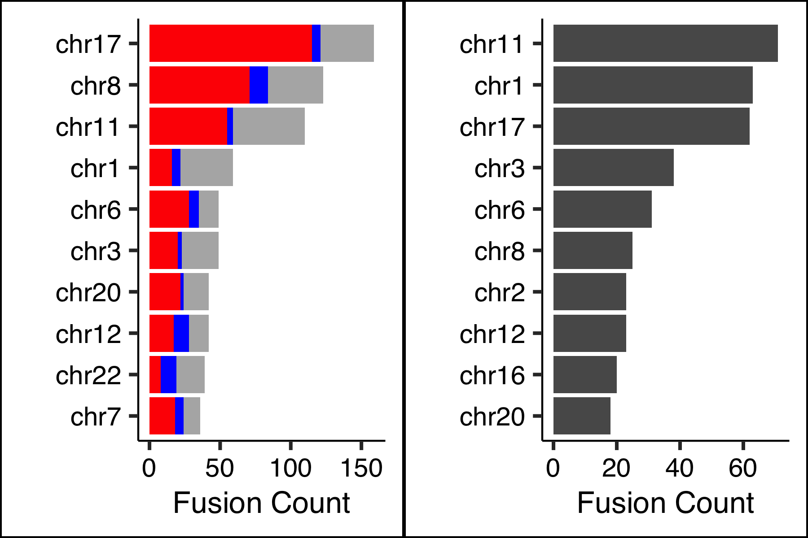

### Figure 3F: GOE and LOE Functional Fusions Circos

Circos plots displaying the chromosomal distribution and partner gene
pairs of functional OGM fusions classified as GOE (left panel) and LOE
(right panel) across ICLE cell lines. Arc thickness encodes fusion
recurrence; arcs are coloured by SV type (DEL, DUP, INV, TRA).

``` r
pdf(file = file.path(DIRS$results_sub$ogm, "Fig3F_left_GOE_Fusions.pdf"), width = 7, height = 7)
fig3f_left_goe_fusions_circos
dev.off()
```

    ## quartz_off_screen 
    ##                 2

``` r
pdf(file = file.path(DIRS$results_sub$ogm, "Fig3F_right_LOE_Fusions.pdf"), width = 7, height = 7)
fig3f_right_loe_fusions_circos
dev.off()
```

    ## quartz_off_screen 
    ##                 2

``` r
plot.new()
print(fig3f_left_goe_fusions_circos)
```

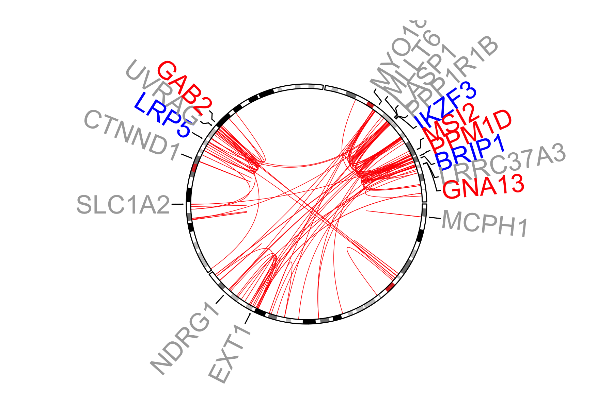

``` r
plot.new()
print(fig3f_right_loe_fusions_circos)
```

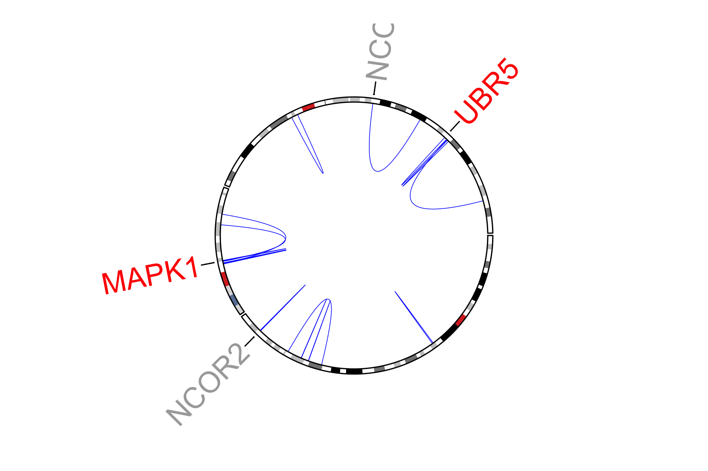

### SupFig 8A: Mutation Count vs SV Count and SV Size

Scatter plot showign correlation between WES mutation count vs OGM SV
count across ICLE cell lines.

``` r
ggsave(file.path(DIRS$results_sub$ogm, "SupFig8A_TMB_SV_Burden_Correlation.pdf"), SupFig8A, width = 5.5, height = 5)
write.table(sv_tmb_summary, file.path(DIRS$results_sub$ogm, "SupTable_SV_TMB_summary.tsv"), sep = "\t", quote = FALSE, row.names = FALSE)

SupFig8A
```

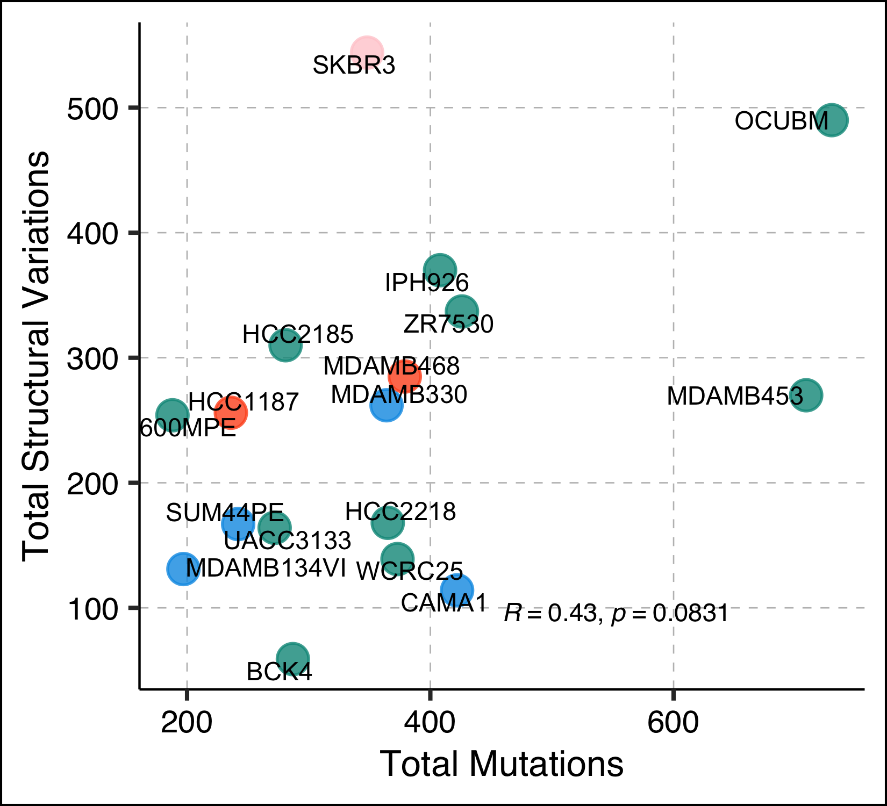

### SupFig 8B: TMB vs SV Burden (With and Without Outliers)

Scatter plot of TMB versus SV burden with (SupFig8B) and without
(SupFig8B_no_outliers) extreme outlier cell lines, with per-cell-line
alteration counts per chromosome saved to
`SupTable_alt_count_per_chr.tsv`.

``` r
ggsave(file.path(DIRS$results_sub$ogm, "SupFig8B_TMB_vs_SV_Burden_Correlation.pdf"), SupFig8B, width = 5.5, height = 5)
ggsave(file.path(DIRS$results_sub$ogm, "SupFig8B_TMB_vs_SV_Burden_Correlation_NoOutliers.pdf"), SupFig8B_no_outliers, width = 5.5, height = 5)
write.table(alt_count_chr, file.path(DIRS$results_sub$ogm, "SupTable_alt_count_per_chr.tsv"), sep = "\t", quote = FALSE, row.names = FALSE) 

ggarrange(plotlist = list(SupFig8B, SupFig8B_no_outliers))
```

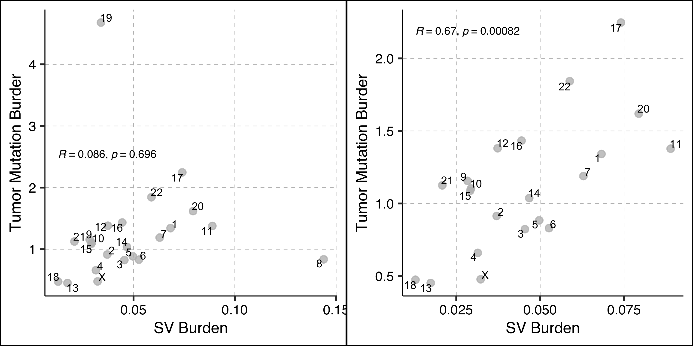

### SupFig 8C: SV Count per Chromosome

Bar plot of SV count per chromosome.

``` r
ggsave(file.path(DIRS$results_sub$ogm, "SupFig8C_SV_Per_Chr.pdf"), SupFig8C, width = 7, height = 5)
SupFig8C
```

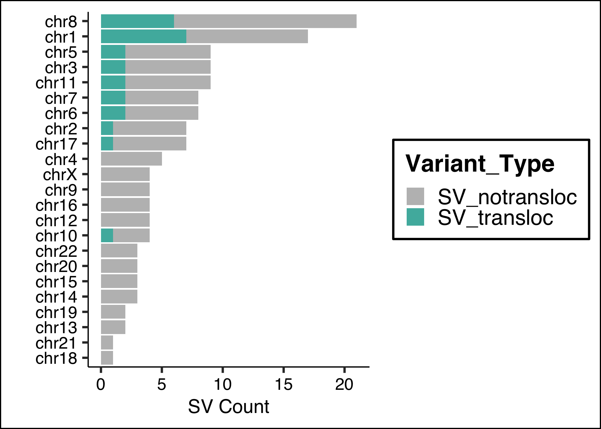

### SupFig 8D: Somatic Mutation Count per Chromosome

Bar plot of Mutation count per chromosome

``` r
ggsave(file.path(DIRS$results_sub$ogm, "SupFig8D_Mutations_Per_Chr.pdf"), SupFig8D, width = 4, height = 5)
SupFig8D
```

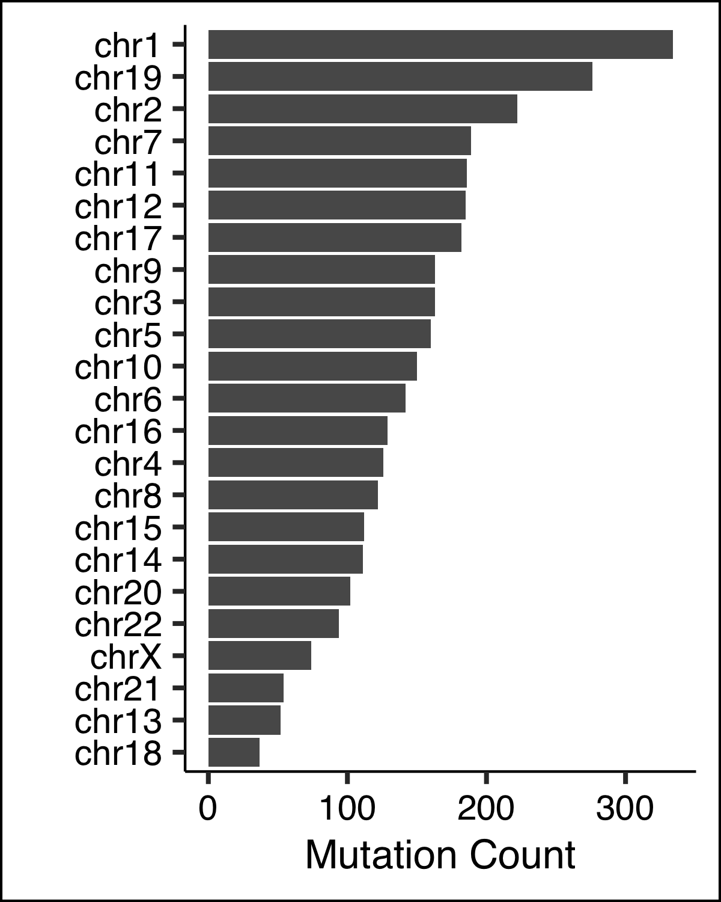

### SupFig 9: OGM Circos Plots

Generates individual OGM circos plots for every ICLE cell line using the
same `interacCircos`-based pipeline as Fig 3D. All plots are saved as
PDFs to `SupFig9_OGM_Circos/`. This chunk may take several minutes to
complete depending on SV count.

``` r
draw_circos_plot_for_all(shatterseek_outs$sv_df, shatterseek_outs$cnv_df, shatterseek_outs$chromothripsis_df, 
                         out_dir = file.path(DIRS$results_sub$ogm, "SupFig9_OGM_Circos"))
```

    ## [1] "Making Circos Plot for: HCC1187"

    ## file:////Users/oshah/Documents/ICLE/3-Results/Optical_Genome_Mapping/SupFig9_OGM_Circos/HCC1187_circos_plot.html screenshot completed

    ##   Saved PDF for sample: HCC1187

    ## [1] "Making Circos Plot for: HCC2218"

    ## file:////Users/oshah/Documents/ICLE/3-Results/Optical_Genome_Mapping/SupFig9_OGM_Circos/HCC2218_circos_plot.html screenshot completed

    ##   Saved PDF for sample: HCC2218

    ## [1] "Making Circos Plot for: IPH926"

    ## file:////Users/oshah/Documents/ICLE/3-Results/Optical_Genome_Mapping/SupFig9_OGM_Circos/IPH926_circos_plot.html screenshot completed

    ##   Saved PDF for sample: IPH926

    ## [1] "Making Circos Plot for: MDAMB134VI"

    ## file:////Users/oshah/Documents/ICLE/3-Results/Optical_Genome_Mapping/SupFig9_OGM_Circos/MDAMB134VI_circos_plot.html screenshot completed

    ##   Saved PDF for sample: MDAMB134VI

    ## [1] "Making Circos Plot for: MDAMB330"

    ## file:////Users/oshah/Documents/ICLE/3-Results/Optical_Genome_Mapping/SupFig9_OGM_Circos/MDAMB330_circos_plot.html screenshot completed

    ##   Saved PDF for sample: MDAMB330

    ## [1] "Making Circos Plot for: MDAMB453"

    ## file:////Users/oshah/Documents/ICLE/3-Results/Optical_Genome_Mapping/SupFig9_OGM_Circos/MDAMB453_circos_plot.html screenshot completed

    ##   Saved PDF for sample: MDAMB453

    ## [1] "Making Circos Plot for: 600MPE"

    ## file:////Users/oshah/Documents/ICLE/3-Results/Optical_Genome_Mapping/SupFig9_OGM_Circos/600MPE_circos_plot.html screenshot completed

    ##   Saved PDF for sample: 600MPE

    ## [1] "Making Circos Plot for: SUM44PE"

    ## file:////Users/oshah/Documents/ICLE/3-Results/Optical_Genome_Mapping/SupFig9_OGM_Circos/SUM44PE_circos_plot.html screenshot completed

    ##   Saved PDF for sample: SUM44PE

    ## [1] "Making Circos Plot for: WCRC25"

    ## file:////Users/oshah/Documents/ICLE/3-Results/Optical_Genome_Mapping/SupFig9_OGM_Circos/WCRC25_circos_plot.html screenshot completed

    ##   Saved PDF for sample: WCRC25

    ## [1] "Making Circos Plot for: BCK4"

    ## file:////Users/oshah/Documents/ICLE/3-Results/Optical_Genome_Mapping/SupFig9_OGM_Circos/BCK4_circos_plot.html screenshot completed

    ##   Saved PDF for sample: BCK4

    ## [1] "Making Circos Plot for: CAMA1"

    ## file:////Users/oshah/Documents/ICLE/3-Results/Optical_Genome_Mapping/SupFig9_OGM_Circos/CAMA1_circos_plot.html screenshot completed

    ##   Saved PDF for sample: CAMA1

    ## [1] "Making Circos Plot for: HCC2185"

    ## file:////Users/oshah/Documents/ICLE/3-Results/Optical_Genome_Mapping/SupFig9_OGM_Circos/HCC2185_circos_plot.html screenshot completed

    ##   Saved PDF for sample: HCC2185

    ## [1] "Making Circos Plot for: MDAMB468"

    ## file:////Users/oshah/Documents/ICLE/3-Results/Optical_Genome_Mapping/SupFig9_OGM_Circos/MDAMB468_circos_plot.html screenshot completed

    ##   Saved PDF for sample: MDAMB468

    ## [1] "Making Circos Plot for: OCUBM"

    ## file:////Users/oshah/Documents/ICLE/3-Results/Optical_Genome_Mapping/SupFig9_OGM_Circos/OCUBM_circos_plot.html screenshot completed

    ##   Saved PDF for sample: OCUBM

    ## [1] "Making Circos Plot for: SKBR3"

    ## file:////Users/oshah/Documents/ICLE/3-Results/Optical_Genome_Mapping/SupFig9_OGM_Circos/SKBR3_circos_plot.html screenshot completed

    ##   Saved PDF for sample: SKBR3

    ## [1] "Making Circos Plot for: UACC3133"

    ## file:////Users/oshah/Documents/ICLE/3-Results/Optical_Genome_Mapping/SupFig9_OGM_Circos/UACC3133_circos_plot.html screenshot completed

    ##   Saved PDF for sample: UACC3133

    ## [1] "Making Circos Plot for: ZR7530"

    ## file:////Users/oshah/Documents/ICLE/3-Results/Optical_Genome_Mapping/SupFig9_OGM_Circos/ZR7530_circos_plot.html screenshot completed

    ##   Saved PDF for sample: ZR7530

### SupFig 10: Functional Fusions Landscape

Chromosomal breakpoint heatmap showing which chromosome pairs are
recurrently involved in functional (GOE or LOE) fusions across ICLE cell
lines.

``` r
# SupFig 10A: Fusion Breakpoints Heatmap
pdf(file.path(DIRS$results_sub$ogm, "SupFig10A_Functional_Fusions_Chr_Heatmap.pdf"), width = 6.5, height = 5)
  draw(supfig10a_fusion_breakpoints_ht, merge_legends = TRUE)
dev.off()
```

    ## quartz_off_screen 
    ##                 2

``` r
draw(supfig10a_fusion_breakpoints_ht, merge_legends = TRUE)
```

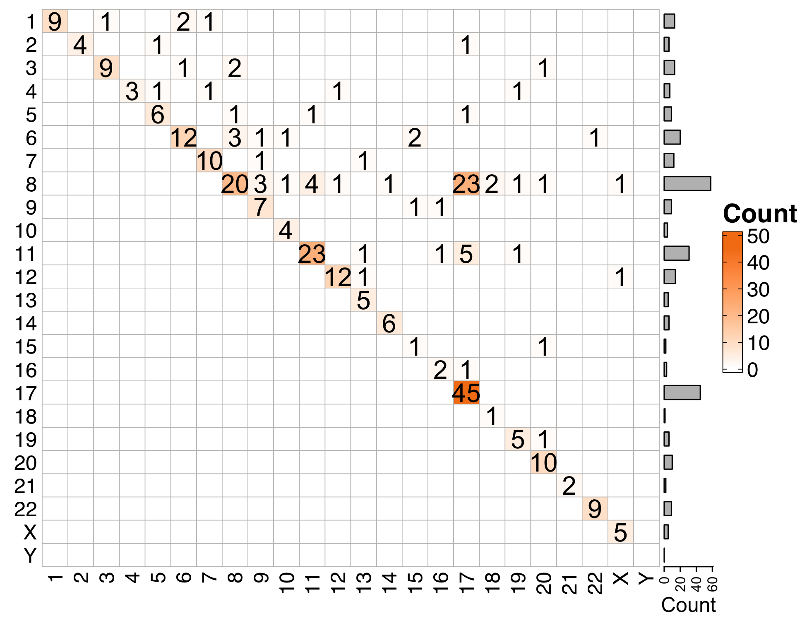

Expression heatmap of recurring fusion-partner genes (partner genes
forming fusions in ≥2 cell lines), showing z-score normalized RNA-seq
expression across the cohort alongside fusion type annotation.

``` r
# SupFig 10B: Recurring fusions expression heatmap
pdf(file.path(DIRS$results_sub$ogm, "SupFig10B_Recurring_Functional_Fusions.pdf"), width = 15, height = 5)
  draw(supfig10b_recurring_fusions_ht, merge_legends = TRUE)
dev.off()
```

    ## quartz_off_screen 
    ##                 2

``` r
draw(supfig10b_recurring_fusions_ht, merge_legends = TRUE)
```

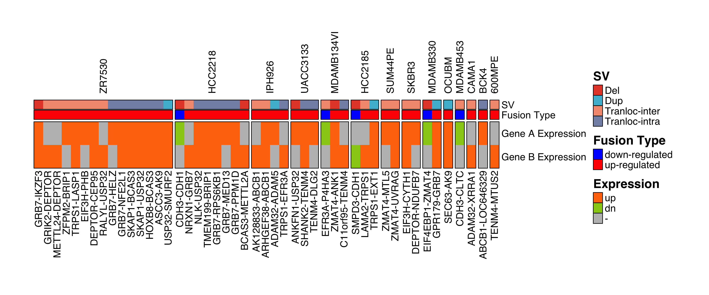

Gene-specific circos plots for each recurrently fused gene

``` r
# SupFig 10C: Recurring gene circos plots
gene_names <- names(recurring_gene_circos)
for (i in seq_along(gene_names)) {
    gene <- gene_names[i]
    pdf_file <- file.path(DIRS$results_sub$ogm, 
                         paste0("SupFig10C_", gene, "_Fusions.pdf"))
    pdf(pdf_file, width = 7, height = 7)
    print(recurring_gene_circos[[gene]])
    dev.off()
}
```

## d. Global Methylation Instability and Epigenetic Regulation of ILC Driver Genes

The orchestrator script `21_Fig4_SupFig11_DNAm_Alterations.R`
performs: 1. **DMI scoring** — sum of absolute β-value deviations from
normal-tissue medians across all shared probes (TCGA adjacent-normal as
reference); pairwise comparisons by two-sided t-test (Holm correction).
2. **Differential methylation** — limma on M-values comparing Luminal A
ILC vs NST in tumors and cell lines (FDR \< 0.05, \|log fold-change\| ≥
0.5). 3. **Differential expression** — DESeq2 on matched RNA-seq (FDR \<
0.05, \|log₂FC\| ≥ 1). 4. **Consensus DNAm-regulated genes** —
intersection of significant differential probes and genes with inverse
DNAm–expression correlation in both tumors and cell lines.

``` r
source(file.path(DIRS$scripts$helpers, "21_Fig4_SupFig11_DNAm_Alterations.R"), chdir = TRUE)
```

    ## ===============================================================================

    ## Section 1: Loading Data

    ## ===============================================================================

    ## Loading Oncovar annotations...

    ## Loading HM450K probe set...

    ## Loading RNA-seq data...

    ## Loading cell line DNA methylation data...

    ## TCGA DNA methylation data already loaded

    ##   Common probes across datasets: 75646

    ## 
    ## ===============================================================================

    ## Section 2: Calculating DMI (DNA Methylation Index)

    ## ===============================================================================

    ##   Step 1: Calculating median DNA methylation in normal samples...

    ##     Calculated median beta for 75646 probes

    ##   Step 2: Calculating Global Methylation Aberration (GMA) scores...

    ##   Patient tumors: 651 samples

    ##   Cell lines: 49 samples

    ##   Step 3: Combining patient and cell line data...

    ##   Step 4: Defining group variables...

    ##   Filtered to 700 samples (Cell Lines: 49. Normal: 98. Patient Tumors: 553. )

    ##   Step 5: Computing DMI z-scores...

    ##   Step 6: Removing outlier normals...

    ##   Removed 12 outlier normal samples

    ##   Step 7: Generating combined histology-type labels...

    ##   ✓ Saved DMI summary to: /Users/oshah/Documents/ICLE/3-Results/DNA_Methylation/DMI_Summary.tsv

    ## 
    ## ===============================================================================

    ## Section 3: DMI Comparisons and Visualizations

    ## ===============================================================================

    ## 
    ## ========================================

    ## SupFig 11A: DMI patient tumors by PAM50

    ## ========================================

    ## 
    ## ========================================

    ## SupFig 11B: DMI cell lines by PAM50

    ## ========================================

    ## 
    ## ========================================

    ## SupFig 11C: DMI by histology

    ## ========================================

    ## 
    ## ========================================

    ## Figure 4A: DMI by tissue source

    ## ========================================

    ##   ✓ SupFig 11 and Fig 4A DMI figures assigned to global environment

    ## 
    ## ===============================================================================

    ## Section 4: Differential Analysis (TCGA and Cell Lines)

    ## ===============================================================================

    ## TCGA DESeq2 Analysis (LumA ILC vs NST)...

    ##   Loading existing TCGA DESeq2 results...

    ##   ✓ TCGA DESeq2: 890 significant DEGs

    ## TCGA Limma Analysis (LumA ILC vs NST)...

    ##   Loading existing TCGA Limma results...

    ##   ✓ TCGA Limma: 3030 significant probes

    ## Cell Line DESeq2 Analysis (Non-Basal ILC vs NST)...

    ##   Loading existing Cell Line DESeq2 results...

    ##   ✓ Cell Line DESeq2: 875 significant DEGs

    ## Cell Line Limma Analysis (Non-Basal ILC vs NST)...

    ##   Loading existing Cell Line Limma results...

    ##   ✓ Cell Line Limma: 22923 significant probes

    ## 
    ## ===============================================================================

    ## Section 5: Identifying Consensus Events Between Cell Lines and Tumors

    ## ===============================================================================

    ## Identifying consensus DGE events...

    ##   Consensus DGE events: 21

    ## Identifying consensus DPM events...

    ##   Consensus DPM events: 814

    ## Merging RNA and DNAm results...

    ##   ✓ Identified 47 DNAm-regulated genes

    ## Adding annotations and expression/methylation values...

    ## Identifying consensus genes...

    ##   ✓ Identified 8 consensus genes

    ## 
    ## ========================================

    ## Figure 4B: DNAm-mRNA alterations scatter plot

    ## ========================================

    ##   ✓ Fig 4B complete (dnma_lfc_plt assigned).

    ## 
    ## ========================================

    ## Figure 4C: Consensus DNAm-mRNA alterations heatmap

    ## ========================================

    ##   ✓ Fig 4C complete (fig4c_ht assigned).

    ## 
    ## ========================================

    ## Figure 4D: MSI1 and TFAP2B expression and DNAm barplots

    ## ========================================

    ##   ✓ Fig 4D complete (fig4e assigned).

    ## 
    ## ===============================================================================

    ## Section 9: Saving Results

    ## ===============================================================================

    ##   ✓ Saved TCGA_DNAm_Regulated_Genes.csv to: /Users/oshah/Documents/ICLE/3-Results/DNA_Methylation/TCGA_DNAm_Regulated_Genes.csv

    ## 
    ## ===============================================================================

    ## Script 22 completed successfully!

    ## ===============================================================================

    ##   All figures assigned to global environment for saving in Main_Data_Analysis.Rmd

    ##   - SupFig11: tumor_pam50, cl_pam50, tumor_cl_histology_LumA

    ##   - Fig4A: tissue_dmi

    ##   - Fig4B: dnma_lfc_plt

    ##   - Fig4C: fig4c_ht

    ##   - Fig4D: fig4e

### SupFig 11: DNAm Instability Score (DMI) by PAM50 Subtype and Histology

``` r
ggsave(file.path(dnam_dir, "SupFig11A_DMI_Tumor_PAM50.pdf"), tumor_pam50, width = 5, height = 3)

pdf(file.path(dnam_dir, "SupFig11A_DMI_Tumor_PAM50_pvalue_table.pdf"), width = 10, height = 10)
  gridExtra::grid.table(signif(SupFig11A_pval_table, 1))
dev.off()
```

    ## quartz_off_screen 
    ##                 2

``` r
tumor_pam50
```

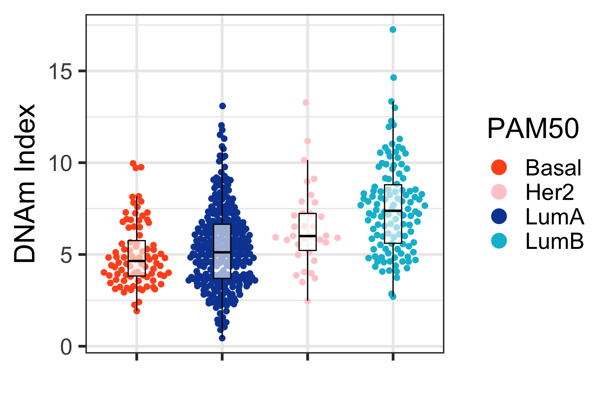

``` r
ggsave(file.path(dnam_dir, "SupFig11B_DMI_CL_PAM50.pdf"), cl_pam50, width = 5, height = 3)

pdf(file.path(dnam_dir, "SupFig11B_DMI_CL_PAM50_pvalue_table.pdf"), width = 10, height = 10)
  gridExtra::grid.table(signif(SupFig11B_pval_table, 1))
dev.off()
```

    ## quartz_off_screen 
    ##                 2

``` r
cl_pam50
```

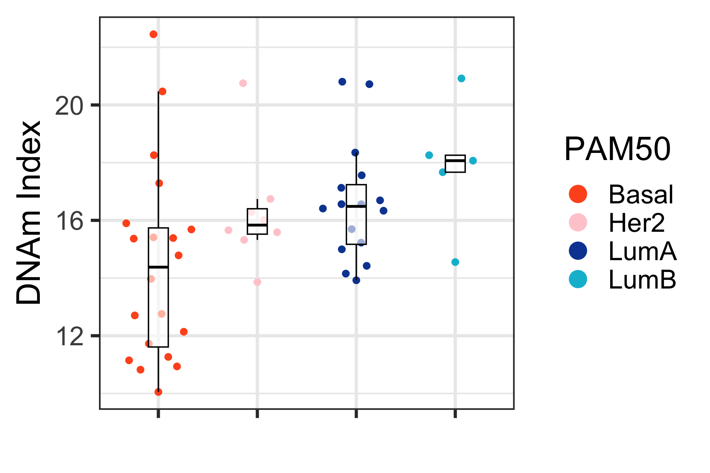

``` r
ggsave(file.path(dnam_dir, "SupFig11C_DMI_Tumor_CL_Histology.pdf"), tumor_cl_histology_LumA, width = 4, height = 3)

pdf(file.path(dnam_dir, "SupFig11C_DMI_Tumor_CL_Histology_pvalues_table.pdf"), width = 10, height = 10)
  gridExtra::grid.table(signif(SupFig11C_pval_table, 1))
dev.off()
```

    ## quartz_off_screen 
    ##                 2

``` r
tumor_cl_histology_LumA
```

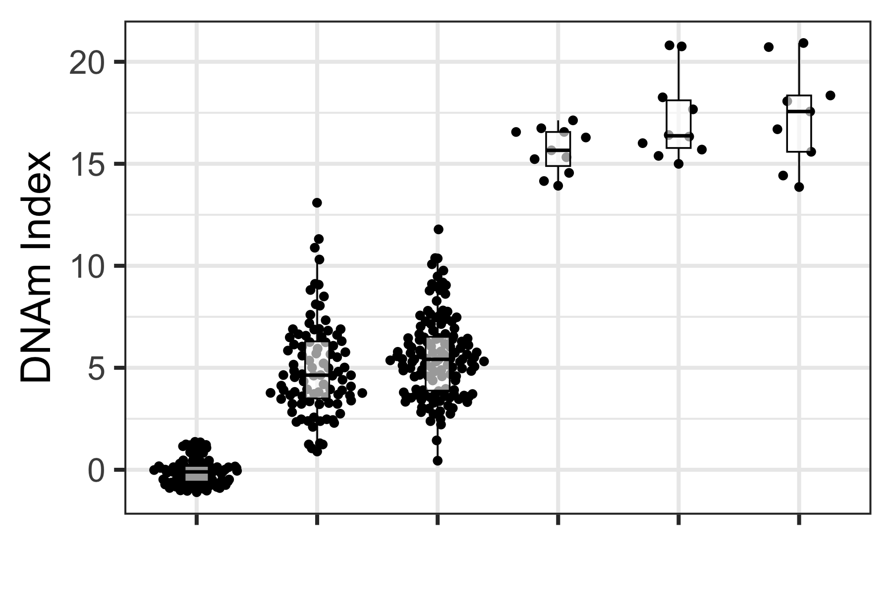

### Figure 4A: DNAm Instability Score (DMI) by Specimen Type

Violin/box plot of DMI scores stratified by specimen type: normal breast
tissue, TCGA primary BRCA tumors (ILC and NST), and integrated BRCA cell
lines (ILC-like and NST). Demonstrates progressively elevated
methylation instability from normal tissue through primary tumors to
cell lines.

``` r
ggsave(file.path(DIRS$results_sub$dna_methylation, "Fig4A_DMI_Normal_Tumor_CL.pdf"), 
       tissue_dmi, width = 5, height = 3)
gt::gtsave(tissue_dmi_pval, file.path(DIRS$results_sub$dna_methylation, "Fig4A_DMI_Normal_Tumor_CL_pvalue_table.html"))

tissue_dmi
```

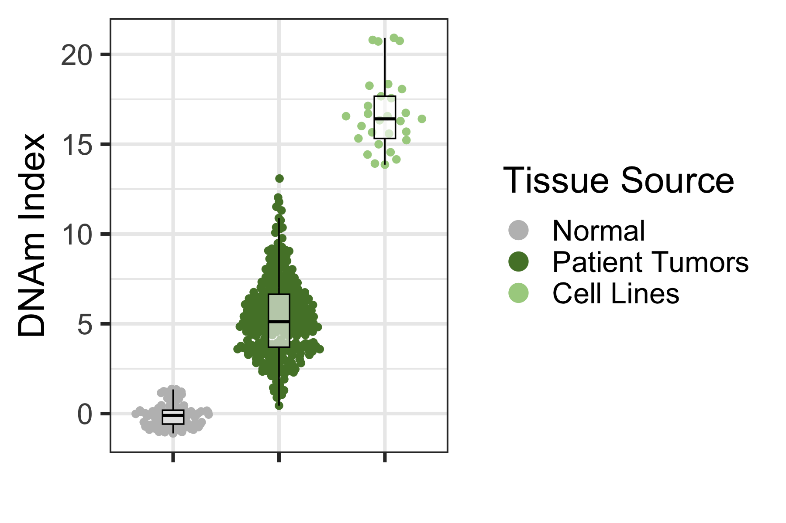

### Figure 4B: Consensus DNAm–mRNA Alterations (Patient Tumors and Cell Lines)

Scatter plot of genes with concordant differential methylation and gene
expression in Luminal A ILC vs NST, comparing results in TCGA tumors and
integrated BRCA cell lines. Points in the highlighted quadrants
represent consensus genes with inverse probe methylation and mRNA
expression changes.

``` r
ggsave(file.path(DIRS$results_sub$dna_methylation, "Fig4B_Tumor_RNA_DNAm_Alterations_small_height.pdf"),
       dnma_lfc_plt, width = 6, height = 5)
dnma_lfc_plt
```

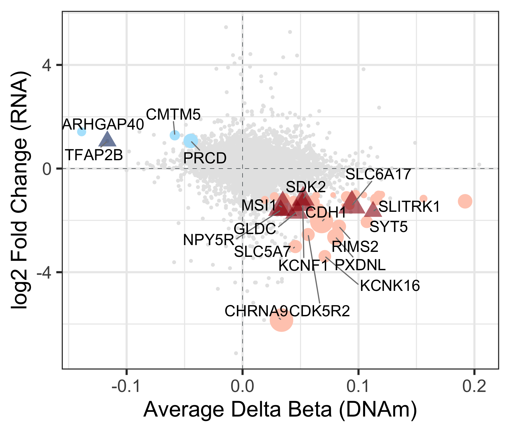

### Figure 4C: Consensus DNAm-Regulated Genes

Heatmap displaying consensus DNAm-regulated genes (from Fig 4B) across
TCGA tumors and integrated BRCA cell lines.

``` r
pdf(file.path(DIRS$results_sub$dna_methylation, "Fig4C_Alterations_Heatmap.pdf"), width = 10, height = 5)
  draw(fig4c_ht, merge_legends = TRUE, gap = unit(0.1, "cm"))
dev.off()
```

    ## quartz_off_screen 
    ##                 2

``` r
draw(fig4c_ht, merge_legends = TRUE, gap = unit(0.1, "cm"))
```

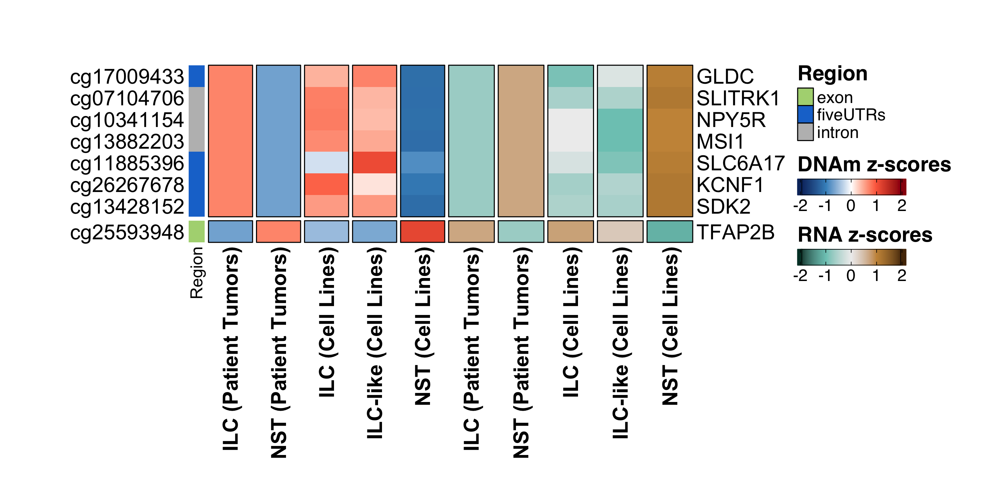

### Figure 4D: Top Consensus DNAm-Regulated Genes — Expression and Methylation Barplots

Paired barplots showing row normalized RNA expression and DNAm for
*MSI1* and *TFAP2B* across BRCA cell lines.

``` r
ggsave(file.path(DIRS$results_sub$dna_methylation, "Fig4D_Top_Alterations_Barplots.pdf"), fig4e, width = 12, height = 10)
fig4e
```

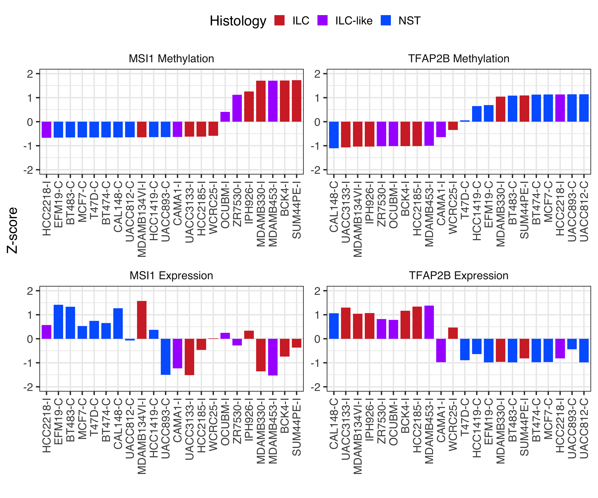

## e. Identification of ILC-Specific Gene Dependencies and Nomination of Druggable Targets

Identifies ILC-specific gene dependencies from the Marcotte et al. RNAi
loss-of-function screen using a consensus two-pipeline approach: (1)
**Limma-D2** — DEMETER2-preprocessed RNAi viability scores (DepMap)
followed by limma differential analysis; (2) **siMEM** — integrated
preprocessing and differential analysis using the siMEM algorithm
(Marcotte et al. 2016). Consensus dependencies are defined as genes with
nominal p ≤ 0.05 in both pipelines. High- and low-dependency gene sets
are then subjected to KEGG pathway over-representation analysis (hypeR)
and queried against DGIdb to nominate therapeutic targets.

``` r
source(file.path(DIRS$scripts$helpers, "22_Fig5_RNAi_Differential_Dependencies.R"), chdir = TRUE)
```

    ## ===============================================================================

    ## Section 2: Loading RNAi Data

    ## ===============================================================================

    ## Loading RNAi data...

    ## New names:
    ## ✓ Loaded 15256 genes across 19 cell lines
    ## ===============================================================================
    ## Section 3: SIMEM Differential Analysis
    ## ===============================================================================
    ## Loading existing SIMEM results...
    ## ✓ Loaded SIMEM results for 14730 genes
    ## ===============================================================================
    ## Section 4: D2 Differential Analysis
    ## ===============================================================================
    ## ✓ Analyzed 13607 genes
    ## ===============================================================================
    ## Section 5: Computing Consensus Dependencies
    ## ===============================================================================
    ## ✓ Consensus dependencies: 93
    ## Adding drug-gene interaction information...
    ## ✓ Added DGI information for 2396 genes
    ## ✓ Saved results to: /Users/oshah/Documents/ICLE/3-Results/Gene_Dependencies/RNAi_ILC_Consensus_Dependencies.tsv
    ## ========================================
    ## Figure 5B: Consensus dependencies scatter plot
    ## ========================================
    ## ✓ Fig 5B complete (fig5b_consensus_dep_plt assigned).
    ## ========================================
    ## SupFig 12: Consensus dependencies heatmap
    ## ========================================
    ## ✓ SupFig 12 complete (supfig12_dep_ht assigned).
    ## ========================================
    ## Figure 5C: KEGG pathway enrichment
    ## ========================================
    ## Scale for x is already present. Adding another scale for x, which will replace the existing scale.
    ## Scale for x is already present. Adding another scale for x, which will replace the existing scale.
    ## ✓ Fig 5C complete (fig5c_pathway_plt assigned).
    ## ========================================
    ## Figure 5D: Pathway level dependencies heatmap
    ## ========================================
    ## ✓ Fig 5D complete (fig5d_pathway_ht assigned).
    ## ========================================
    ## Figure 5E: Druggable dependencies heatmap
    ## ========================================
    ## ✓ Fig 5E complete (fig5e_drug_ht assigned).
    ## ========================================
    ## Figure 5 (5B–5E) and SupFig 12 complete
    ## ========================================
    ## - Fig 5B: fig5b_consensus_dep_plt
    ## - SupFig 12: supfig12_dep_ht
    ## - Fig 5C: fig5c_pathway_plt
    ## - Fig 5D: fig5d_pathway_ht
    ## - Fig 5E: fig5e_drug_ht
    ## • `` -> `...1`

### Figure 5A: ILC-Specific Dependency Analysis — Study Schematic

``` r
# Figure 5A is a schematic/workflow illustration produced in Adobe Illustrator.
# Overview schematic of the dual-pipeline ILC dependency discovery workflow (Limma-D2 and siMEM) and the downstream druggability Prioritization strategy.
```

------------------------------------------------------------------------

### Figure 5B: Consensus ILC-Specific Differential Dependencies

Scatter plot showing effect sizes of differential dependencies (ILC vs
NST cell lines) from Limma-D2 and siMEM pipelines. Point colors
highlight dependencies identified as significant by both (consensus) or
only one of the two pipelines.

``` r
ggsave(file.path(DIRS$results_sub$dependencies, "Fig5b_Differential_Dependencies.pdf"),
       fig5b_consensus_dep_plt, width = 8, height = 4.5)
fig5b_consensus_dep_plt
```

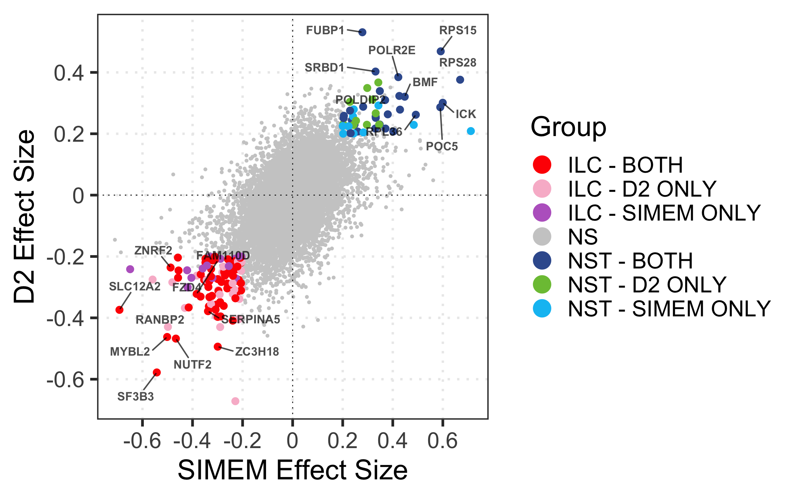

### SupFig 12: Consensus Differential Dependencies Heatmap

Hierarchically clustered heatmap of all consensus ILC-specific
differential dependency genes across Marcotte et al. RNAi cell lines,
annotated by histological subtype (ILC, NST).

``` r
pdf(file.path(DIRS$results_sub$dependencies, "SupFig12_Consensus_Dependencies_Heatmap.pdf"), 
    width = 7.5, height = 16)
  draw(supfig12_dep_ht, merge_legends = TRUE, heatmap_legend_side = "bottom")
dev.off()
```

    ## quartz_off_screen 
    ##                 2

``` r
draw(supfig12_dep_ht, merge_legends = TRUE, heatmap_legend_side = "bottom")
```

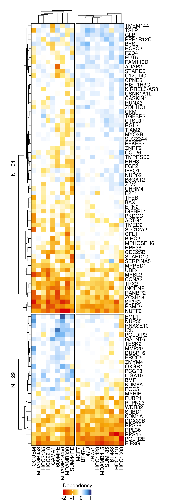

### Figure 5C: KEGG Pathway Over-Representation in ILC-Specific Dependency Genes

Barplot showing hypergeometric over-representation analysis of KEGG
pathways in ILC vs NST differential dependencies.

``` r
ggsave(file.path(DIRS$results_sub$dependencies, "Fig5C_KEGG_ORA.pdf"), fig5c_pathway_plt, width = 6, height = 3.5)
fig5c_pathway_plt
```

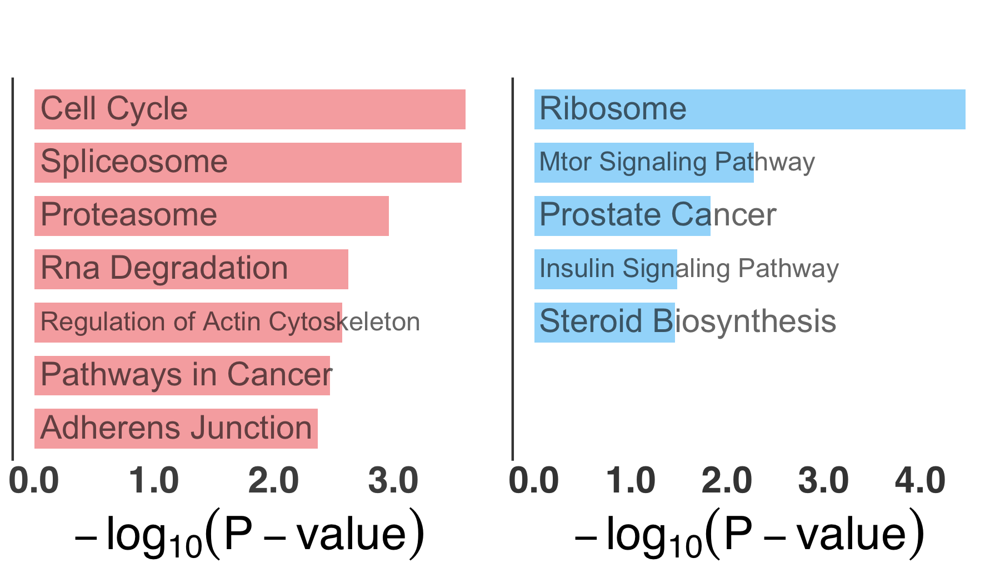

### Figure 5D: Pathway-Level Dependency Scores

Heatmap of pathway-level summary dependency scores (mean gene-level
dependency/viability scores per KEGG pathway) across cell lines,
stratified by ILC vs NST histology. Condenses gene-level signals into
interpretable pathway vulnerabilities.

``` r
pdf(file.path(DIRS$results_sub$dependencies, "Fig5D_Pathway_Scores.pdf"), width = 7.5, height = 5)
  draw(fig5d_pathway_ht, merge_legends = TRUE, heatmap_legend_side = "bottom")
dev.off()
```

    ## quartz_off_screen 
    ##                 2

``` r
draw(fig5d_pathway_ht, merge_legends = TRUE, heatmap_legend_side = "bottom")
```

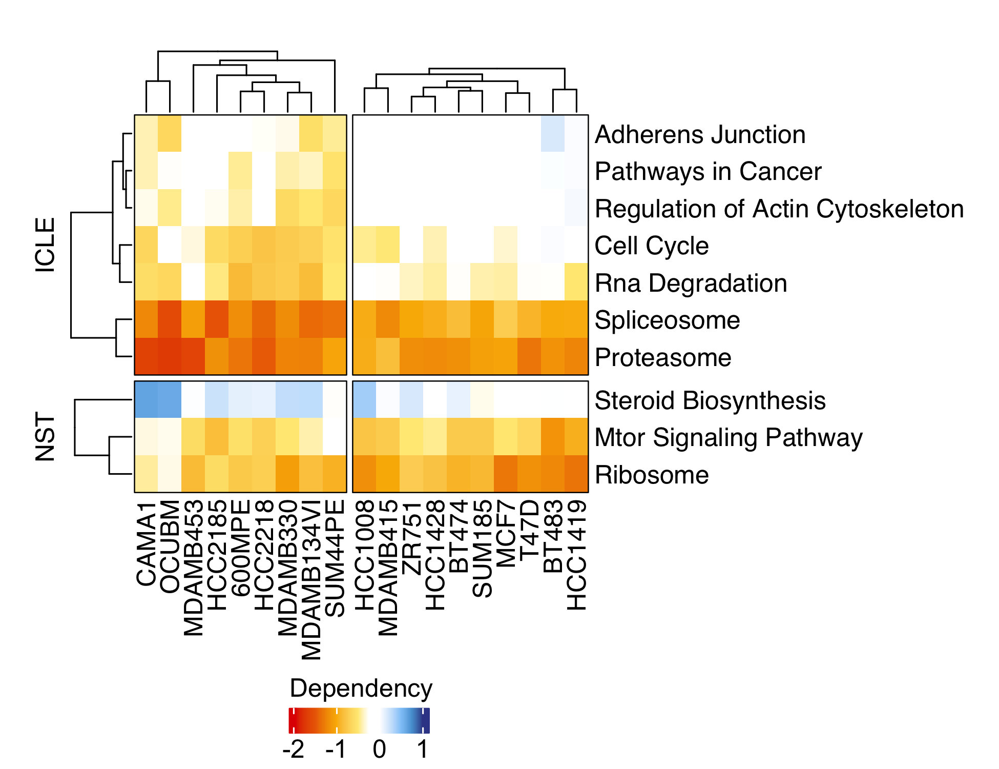

### Figure 5E: Druggable ILC Dependencies — Prioritized Therapeutic Targets

Heatmap of the top ILC-specific dependency genes with annotated drug
interactions from the Drug Gene Interaction database (DGIdb; Wagner et
al. 2016).

``` r
pdf(file.path(DIRS$results_sub$dependencies, "Fig5E_ILC_Druggable_Dependencies.pdf"), width = 7.5, height = 5)
  draw(fig5e_drug_ht, merge_legends = TRUE, heatmap_legend_side = "bottom")
dev.off()
```

    ## quartz_off_screen 
    ##                 2

``` r
draw(fig5e_drug_ht, merge_legends = TRUE, heatmap_legend_side = "bottom")
```

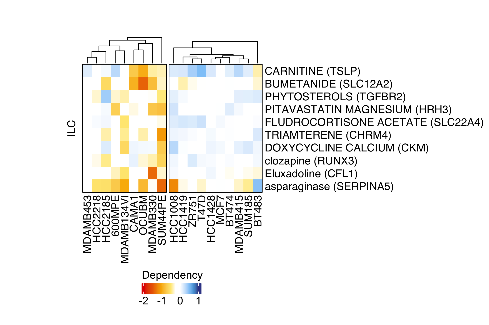

## f. Integrative Multi-omic Benchmarking Framework for ILC Model Selection

### Figure 6: CL–tumor Concordance / Molecular Resemblance Scores

Implements the two-step multi-omic molecular resemblance framework to
quantify the fidelity of each ICLE cell line to Luminal A ILC patient
tumors:

**Step 1 — ILC tumor signatures** (TCGA Luminal A ILC vs NST as
reference): - *RNA, DNAm, RPPA*: discriminatory features identified by
differential analysis (DESeq2 / limma); ILC tumor centroids constructed
by averaging normalizd feature values across TCGA ILC tumors. - *CN*:
chromosome-level centroid restricted to OncoVar pathogenic cancer driver
genes. - *MUT*: curated ILC-enriched and NST-enriched alteration lists.

**Step 2 — Cell line concordance scoring**: - *Continuous modalities
(RNA, DNAm, RPPA)*: bootstrapped Spearman correlation (1,000 iterations,
80% feature subsampling) between cell line profile and ILC tumor
centroid; final score = median. - *CN*: bootstrapped correlation (1,000
iterations, one driver gene randomly sampled per chromosome). - *MUT*:
frequency-centred score rewarding ILC-enriched and penalising
NST-enriched events. - All modality scores rank-normalizd to \[0, 1\];
**Consensus Resemblance Score** = equally weighted mean.

``` r
# Generate resemblance scores between cell lines and tumors
source(file.path(DIRS$scripts$helpers, "23_Fig6_Patient_Signatures_Resemblance_Scores.R"), chdir = TRUE)
```

    ## ===============================================================================

    ## Selecting Patient and Cell Line Subsets

    ## ===============================================================================

    ##   ILC tumors: 106

    ##   NST tumors: 201

    ##   Cell lines: 39

    ## 
    ## ===============================================================================

    ## PART 1: Computing Patient-Derived Signatures from TCGA

    ## ===============================================================================

    ## 
    ## 1.1 Computing CNV signature...

    ##   ✓ Saved CNV gene annotation to: /Users/oshah/Documents/ICLE/3-Results/Molecular_Resemblance/ILC_Signatures/ILC_CNV_Genes.tsv

    ## 
    ## 1.2 Computing Alterations signature...

    ##   ✓ Saved alterations signature to: /Users/oshah/Documents/ICLE/3-Results/Molecular_Resemblance/ILC_Signatures/ILC_Alterations.tsv

    ## 
    ## 1.3 Computing RNA signature...

    ##   ✓ Saved RNA signature to: /Users/oshah/Documents/ICLE/3-Results/Molecular_Resemblance/ILC_Signatures/ILC_DEGs.tsv

    ## 
    ## 1.4 Computing DNAm signature...

    ##   ✓ Saved DNAm signature to: /Users/oshah/Documents/ICLE/3-Results/Molecular_Resemblance/ILC_Signatures/ILC_DNAm_Probes.tsv

    ## 
    ## 1.5 Computing RPPA signature...

    ##   ✓ Saved RPPA signature to: /Users/oshah/Documents/ICLE/3-Results/Molecular_Resemblance/ILC_Signatures/ILC_DEPs.tsv

    ## 
    ## ===============================================================================

    ## PART 1 Complete: All patient-derived signatures saved to files

    ## ===============================================================================

    ## 
    ## ===============================================================================

    ## PART 2: Scoring Cell Lines and Computing Consensus

    ## ===============================================================================

    ## 
    ## 2.1 Computing CNV resemblance scores...

    ##   ✓ CNV scores computed for 38 cell lines

    ## 
    ## 2.2 Computing Alterations resemblance scores...

    ##   ✓ Alterations scores computed for 38 cell lines

    ## 
    ## 2.3 Computing RNA resemblance scores...

    ##   ✓ RNA scores computed for 39 cell lines

    ## 
    ## 2.4 Computing DNAm resemblance scores...

    ##   ✓ DNAm scores computed for 34 cell lines

    ## 
    ## 2.5 Computing RPPA resemblance scores...

    ##   ✓ RPPA scores computed for 37 cell lines

    ## 
    ## 2.6 Combining scores and computing consensus...

    ##   ✓ Saved resemblance scores to: /Users/oshah/Documents/ICLE/3-Results/Molecular_Resemblance/Resemblance_Scores.tsv

    ## 
    ## ========================================

    ## Figure 6: Resemblance scores heatmap

    ## ========================================

    ##   ✓ Fig 6 complete (fig6_resemblance_ht and signature heatmaps assigned).

``` r
# Save per-modality ILC signature heatmaps (CN, MUT, RNA, DNAm, RPPA)
# Each heatmap shows the discriminatory features defining the ILC tumor centroid
pdf(file = file.path(DIRS$results_sub$molecular_resemblance, "Fig6_ILC_CN_Signature.pdf"), width = 6, height = 6)
draw(cn_sig_ht)
dev.off()
```

    ## quartz_off_screen 
    ##                 2

``` r
pdf(file = file.path(DIRS$results_sub$molecular_resemblance, "Fig6_ILC_Alteration_Signature.pdf"), width = 6, height = 6)
draw(mut_sig_ht)
dev.off()
```

    ## quartz_off_screen 
    ##                 2

``` r
pdf(file = file.path(DIRS$results_sub$molecular_resemblance, "Fig6_ILC_DNAm_Signature.pdf"), width = 6, height = 6)
draw(dnam_sign_ht)
dev.off()
```

    ## quartz_off_screen 
    ##                 2

``` r
pdf(file = file.path(DIRS$results_sub$molecular_resemblance, "Fig6_ILC_RNA_Signature.pdf"), width = 6, height = 6)
draw(rna_sign_ht)
dev.off()
```

    ## quartz_off_screen 
    ##                 2

``` r
pdf(file = file.path(DIRS$results_sub$molecular_resemblance, "Fig6_ILC_rppa_Signature.pdf"), width = 6, height = 6)
draw(rppa_sig_ht)
dev.off()
```

    ## quartz_off_screen 
    ##                 2

``` r
# Consensus resemblance score heatmap — columns = ICLE cell lines; rows = modality scores + consensus
# Higher scores (yellow) indicate greater fidelity to Luminal A ILC patient tumors
pdf(file.path(DIRS$results_sub$molecular_resemblance, "Fig6_Resemblance_Scores.pdf"), width = 6, height = 5)
   draw(fig6_resemblance_ht, merge_legends = TRUE, annotation_legend_side = "right", 
        heatmap_legend_side = "right")
dev.off()
```

    ## quartz_off_screen 
    ##                 2

``` r
# Display figure
draw(fig6_resemblance_ht, merge_legends = TRUE, annotation_legend_side = "right", 
     heatmap_legend_side = "right")
```

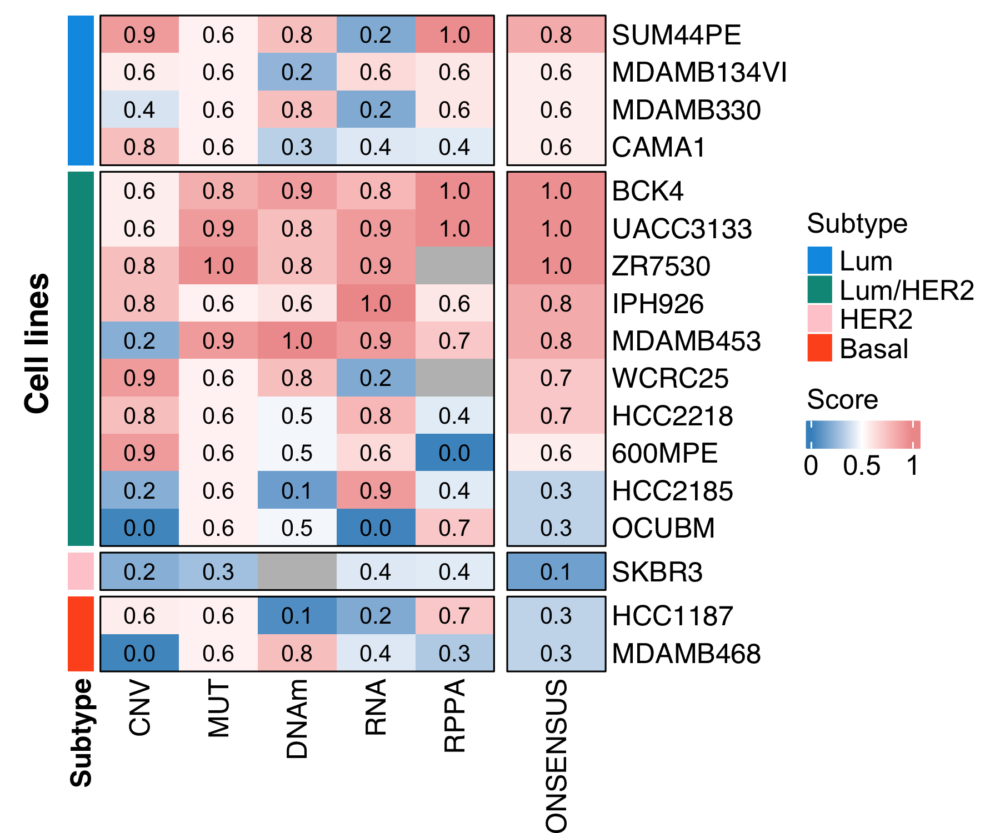

``` r
# Generate and Save RMD Report
report_file_name <- paste0(format(Sys.time(), "%Y-%m-%d"), "_ICLE_Analysis_Report.md")
knitr::opts_chunk$set(screenshot.force = TRUE, cache = FALSE)

rmarkdown::render(
  input = "./Main_Data_Analysis.Rmd",
  output_format = "github_document", 
  output_file = report_file_name, 
  output_dir = "./",
  envir = globalenv()
)

rmarkdown::pandoc_convert(
  input = paste0("./", report_file_name),
  to = "html5",                               
  output = paste0("./", report_file_name, ".html"),
  options = c(
    "--self-contained",
    "--standalone",
    "--section-divs",
    "--template", system.file("rmd/h/default.html", package = "rmarkdown"),
    "--variable", "theme=cerulean",              
    "--variable", "highlightjs=1",
    "--syntax-highlighting", "tango",              
    "--variable", "mathjax-url=https://mathjax.rstudio.com/latest/MathJax.js?config=TeX-AMS-MML_HTMLorMML",
    "--mathjax"
  )
)
```

``` r
sessionInfo()
```

    ## R version 4.5.1 (2025-06-13)
    ## Platform: aarch64-apple-darwin20
    ## Running under: macOS Tahoe 26.4.1
    ## 
    ## Matrix products: default
    ## BLAS:   /System/Library/Frameworks/Accelerate.framework/Versions/A/Frameworks/vecLib.framework/Versions/A/libBLAS.dylib 
    ## LAPACK: /Library/Frameworks/R.framework/Versions/4.5-arm64/Resources/lib/libRlapack.dylib;  LAPACK version 3.12.1
    ## 
    ## locale:
    ## [1] en_US.UTF-8/en_US.UTF-8/en_US.UTF-8/C/en_US.UTF-8/en_US.UTF-8
    ## 
    ## time zone: America/Chicago
    ## tzcode source: internal
    ## 
    ## attached base packages:
    ##  [1] stats4    grid      tools     stats     graphics  grDevices utils     datasets  methods   base     
    ## 
    ## other attached packages:
    ##  [1] msigdbr_25.1.1              hypeR_2.0.0                 tidytext_0.4.3             
    ##  [4] patchwork_1.3.2             sesame_1.26.0               sesameData_1.26.0          
    ##  [7] ExperimentHub_2.16.1        AnnotationHub_3.16.1        BiocFileCache_2.16.2       
    ## [10] dbplyr_2.5.1                limma_3.64.3                DESeq2_1.48.2              
    ## [13] webshot2_0.1.2              htmlwidgets_1.6.4           interacCircos_1.18.0       
    ## [16] hiAnnotator_1.42.0          gridExtra_2.3               ShatterSeek_1.1            
    ## [19] graph_1.86.0                foreach_1.5.2               scales_1.4.0               
    ## [22] ggsci_4.1.0                 gt_1.1.0                    ggpattern_1.2.1            
    ## [25] clusterProfiler_4.16.0      org.Hs.eg.db_3.21.0         AnnotationDbi_1.70.0       
    ## [28] CancerSubtypes_1.17.1       NMF_0.28                    cluster_2.1.8.1            
    ## [31] rngtools_1.5.2              registry_0.5-1              sigclust_1.1.0.1           
    ## [34] tidyr_1.3.1                 forcats_1.0.1               circlize_0.4.16            
    ## [37] ConsensusClusterPlus_1.72.0 SummarizedExperiment_1.38.1 MatrixGenerics_1.20.0      
    ## [40] matrixStats_1.5.0           BreastSubtypeR_1.0.0        viridis_0.6.5              
    ## [43] viridisLite_0.4.2           data.table_1.17.8           readxl_1.4.5               
    ## [46] maftools_2.24.0             stringr_1.5.2               ggrepel_0.9.6              
    ## [49] rtracklayer_1.68.0          GenomicRanges_1.60.0        GenomeInfoDb_1.44.3        
    ## [52] IRanges_2.42.0              S4Vectors_0.46.0            magrittr_2.0.4             
    ## [55] DNAcopy_1.82.0              vroom_1.6.6                 reshape2_1.4.4             
    ## [58] ggsankey_0.0.99999          dplyr_1.1.4                 ComplexHeatmap_2.24.1      
    ## [61] ggthemes_5.1.0              ggpubr_0.6.2                ggplot2_4.0.0              
    ## [64] Biobase_2.68.0              BiocGenerics_0.54.1         generics_0.1.4             
    ## 
    ## loaded via a namespace (and not attached):
    ##   [1] R.methodsS3_1.8.2        dichromat_2.0-0.1        Biostrings_2.76.0        vctrs_0.6.5             
    ##   [5] ggtangle_0.0.7           digest_0.6.37            png_0.1-8                shape_1.4.6.1           
    ##   [9] proxy_0.4-27             magick_2.9.0             MASS_7.3-65              httpuv_1.6.16           
    ##  [13] qvalue_2.40.0            withr_3.0.2              xfun_0.53                ggfun_0.2.0             
    ##  [17] ellipsis_0.3.2           survival_3.8-3           memoise_2.0.1            ggbeeswarm_0.7.2        
    ##  [21] gson_0.1.0               systemfonts_1.3.1        ragg_1.5.0               tidytree_0.4.6          
    ##  [25] GlobalOptions_0.1.2      R.oo_1.27.1              Formula_1.2-5            KEGGREST_1.48.1         
    ##  [29] promises_1.4.0           otel_0.2.0               httr_1.4.7               rstatix_0.7.3           
    ##  [33] restfulr_0.0.16          ps_1.9.1                 rstudioapi_0.17.1        units_1.0-0             
    ##  [37] UCSC.utils_1.4.0         DOSE_4.2.0               processx_3.8.6           babelgene_22.9          
    ##  [41] curl_7.0.0               polyclip_1.10-7          GenomeInfoDbData_1.2.14  SparseArray_1.8.1       
    ##  [45] xtable_1.8-4             doParallel_1.0.17        reactable_0.4.4          evaluate_1.0.5          
    ##  [49] S4Arrays_1.8.1           preprocessCore_1.70.0    hms_1.1.4                visNetwork_2.1.4        
    ##  [53] colorspace_2.1-2         filelock_1.0.3           CNTools_1.64.0           readr_2.1.5             
    ##  [57] later_1.4.4              ggtree_3.16.3            lattice_0.22-7           genefilter_1.90.0       
    ##  [61] XML_3.99-0.19            cowplot_1.2.0            class_7.3-23             pillar_1.11.1           
    ##  [65] nlme_3.1-168             iterators_1.0.14         gridBase_0.4-7           compiler_4.5.1          
    ##  [69] stringi_1.8.7            sf_1.0-21                tokenizers_0.3.0         devtools_2.4.6          
    ##  [73] GenomicAlignments_1.44.0 plyr_1.8.9               crayon_1.5.3             abind_1.4-8             
    ##  [77] BiocIO_1.18.0            gridGraphics_0.5-1       locfit_1.5-9.12          bit_4.6.0               
    ##  [81] chromote_0.5.1           fastmatch_1.1-6          codetools_0.2-20         textshaping_1.0.4       
    ##  [85] e1071_1.7-16             GetoptLong_1.0.5         mime_0.13                splines_4.5.1           
    ##  [89] Rcpp_1.1.0               iCluster_2.1.0           cellranger_1.1.0         knitr_1.51              
    ##  [93] blob_1.2.4               clue_0.3-66              BiocVersion_3.21.1       fs_1.6.6                
    ##  [97] pkgbuild_1.4.8           openxlsx_4.2.8           ggsignif_0.6.4           ggplotify_0.1.3         
    ## [101] tibble_3.3.0             Matrix_1.7-4             statmod_1.5.1            tzdb_0.5.0              
    ## [105] svglite_2.2.2            pheatmap_1.0.13          tweenr_2.0.3             pkgconfig_2.0.3         
    ## [109] cachem_1.1.0             RSQLite_2.4.3            DBI_1.2.3                impute_1.82.0           
    ## [113] fastmap_1.2.0            rmarkdown_2.30           usethis_3.2.1            Rsamtools_2.24.1        
    ## [117] sass_0.4.10              broom_1.0.10             BiocManager_1.30.26      carData_3.0-5           
    ## [121] farver_2.1.2             mgcv_1.9-3               yaml_2.3.10              cli_3.6.5               
    ## [125] purrr_1.1.0              lifecycle_1.0.4          sessioninfo_1.2.3        backports_1.5.0         
    ## [129] BiocParallel_1.42.2      annotate_1.86.1          gtable_0.3.6             rjson_0.2.23            
    ## [133] parallel_4.5.1           ape_5.8-1                SnowballC_0.7.1          jsonlite_2.0.0          
    ## [137] edgeR_4.6.3              bitops_1.0-9             kableExtra_1.4.0         bit64_4.6.0-1           
    ## [141] assertthat_0.2.1         yulab.utils_0.2.1        zip_2.3.3                janeaustenr_1.0.0       
    ## [145] GOSemSim_2.34.0          R.utils_2.13.0           lazyeval_0.2.2           shiny_1.11.1            
    ## [149] htmltools_0.5.8.1        enrichplot_1.28.4        GO.db_3.21.0             rappdirs_0.3.3          
    ## [153] glue_1.8.0               XVector_0.48.0           RCurl_1.98-1.17          treeio_1.32.0           
    ## [157] classInt_0.4-11          BSgenome_1.76.0          EnvStats_3.1.0           igraph_2.2.1            
    ## [161] R6_2.6.1                 sva_3.56.0               labeling_0.4.3           pkgload_1.4.1           
    ## [165] aplot_0.2.9              DelayedArray_0.34.1      tidyselect_1.2.1         vipor_0.4.7             
    ## [169] ggforce_0.5.0            xml2_1.4.1               car_3.1-3                wheatmap_0.2.0          
    ## [173] KernSmooth_2.23-26       S7_0.2.0                 gridpattern_1.3.1        websocket_1.4.4         
    ## [177] fgsea_1.34.2             RColorBrewer_1.1-3       rlang_1.1.6              remotes_2.5.0           
    ## [181] Cairo_1.7-0              beeswarm_0.4.0
