ILC Cell Line Encyclopedia (ICLE) Data Analysis
================

**Author:** Osama Shiraz Shah
<br>

**Last Updated:** March 03, 2026

<br>

**Table of Content:**

- [ILC Cell Line Encyclopedia (ICLE) Data Analysis](#ilc-cell-line-encyclopedia-icle-data-analysis)
- [Associated Publication and Data Availability](#associated-publication-and-data-availability)
- [1. Preparation](#1-preparation)
  - [Setup Environment](#setup-environment)
  - [Load All Data](#load-all-data)
- [2. Manuscript Figures](#2-manuscript-figures)
  - [a. Multi-omic Characterization of ILC Cell Lines and Genomic Fidelity to Human ILC](#a-multi-omic-characterization-of-ilc-cell-lines-and-genomic-fidelity-to-human-ilc)
    - [SupFig 1: Genotypic Similarity With Public Datasets](#supfig-1-genotypic-similarity-with-public-datasets)
    - [Perform Molecular Subtyping](#perform-molecular-subtyping)
    - [SupFig 2: RNA-seq Consensus Clustering](#supfig-2-rna-seq-consensus-clustering)
    - [SupFig 3: RPPA Consensus Clustering](#supfig-3-rppa-consensus-clustering)
    - [SupFig 4: DNAm Consensus Clustering](#supfig-4-dnam-consensus-clustering)
    - [Figure 1B: Overview of Multiomic Subtypes](#figure-1b-overview-of-multiomic-subtypes)
    - [Figure 1C: SET Signature](#figure-1c-set-signature)
    - [Figure 1D: Multiomics Overview](#figure-1d-multiomics-overview)
    - [Fig 1E: IGV Plot (Patient Tumors vs Cell Lines)](#fig-1e-igv-plot-patient-tumors-vs-cell-lines)
    - [Figure 1F: Alteration Frequency Barplots (Patient Tumors vs Cell Lines)](#figure-1f-alteration-frequency-barplots-patient-tumors-vs-cell-lines)
    - [SupFig 5: Key ILC vs NST Alterations (Patient Tumors)](#supfig-5-key-ilc-vs-nst-alterations-patient-tumors)
    - [SupFig 6: Alterations in Key Pathways (ICLE)](#supfig-6-alterations-in-key-pathways-icle)
  - [b. Recapitulation of the CDH1 Alteration Landscape in ILC Cell Line Models](#b-recapitulation-of-the-cdh1-alteration-landscape-in-ilc-cell-line-models)
    - [Figure 2B: Novel SVs in CDH1](#figure-2b-novel-svs-in-cdh1)
    - [Figure 2C: Exonic Deletions in ICLE](#figure-2c-exonic-deletions-in-icle)
    - [Figure 2D: CDH1 Alterations in Local Recurrences and Distant Metastases (Patient Tumors)](#figure-2d-cdh1-alterations-in-local-recurrences-and-distant-metastases-patient-tumors)
    - [Figure 2E: CDH1 Mutation Lollipop Plots (Patient Tumors vs Cell Lines)](#figure-2e-cdh1-mutation-lollipop-plots-patient-tumors-vs-cell-lines)
    - [Figure 2F: CDH1 Allele Frequency in Cell Lines](#figure-2f-cdh1-allele-frequency-in-cell-lines)
    - [Figure 2G: CDH1 Alteration Type Frequencies (Patient Tumors vs Cell Lines)](#figure-2g-cdh1-alteration-type-frequencies-patient-tumors-vs-cell-lines)
    - [Figure 2H: CDH1 Molecular Alteration Landscape (Patient Tumors vs Cell Lines)](#figure-2h-cdh1-molecular-alteration-landscape-patient-tumors-vs-cell-lines)
  - [c. Optical Genome Mapping Reveals Structural Variations, Chromothripsis and Functional Fusions](#coptical-genome-mapping-reveals-structural-variations-chromothripsis-and-functional-fusions)
    - [Figure 3A (left): ICLE Genomic Instability Metrics](#figure-3a-left-icle-genomic-instability-metrics)
    - [Figure 3A (right): ICLE SV Type Distribution](#figure-3a-right-icle-sv-type-distribution)
    - [Figure 3B: Chromosomal Topography of Translocation Breakpoints](#figure-3b-chromosomal-topography-of-translocation-breakpoints)
    - [Figure 3C: Chromothripsis Landscape](#figure-3c-chromothripsis-landscape)
    - [Figure 3D: OGM Circos Plots — BCK4, 600MPE, HCC2185, ZR7530](#figure-3d-ogm-circos-plots--bck4-600mpe-hcc2185-zr7530)
    - [Figure 3E: Fusion Distribution (Patient Tumors vs Cell Lines)](#figure-3e-fusion-distribution-patient-tumors-vs-cell-lines)
    - [Figure 3F: GOE and LOE Functional Fusions Circos](#figure-3f-goe-and-loe-functional-fusions-circos)
    - [SupFig 8A: Mutation Count vs SV Count and SV Size](#supfig-8a-mutation-count-vs-sv-count-and-sv-size)
    - [SupFig 8B: TMB vs SV Burden (With and Without Outliers)](#supfig-8b-tmb-vs-sv-burden-with-and-without-outliers)
    - [SupFig 8C: SV Count per Chromosome](#supfig-8c-sv-count-per-chromosome)
    - [SupFig 8D: Somatic Mutation Count per Chromosome](#supfig-8d-somatic-mutation-count-per-chromosome)
    - [SupFig 9: OGM Circos Plots](#supfig-9-ogm-circos-plots)
    - [SupFig 10: Functional Fusions Landscape](#supfig-10-functional-fusions-landscape)
  - [d. Global Methylation Instability and Epigenetic Regulation of ILC Driver Genes](#dglobal-methylation-instability-and-epigenetic-regulation-of-ilc-driver-genes)
    - [SupFig 11: DNAm Instability Score (DMI) by PAM50 Subtype and Histology](#supfig-11-dnam-instability-score-dmi-by-pam50-subtype-and-histology)
    - [Figure 4A: DNAm Instability Score (DMI) by Specimen Type](#figure-4a-dnam-instability-score-dmi-by-specimen-type)
    - [Figure 4B: Consensus DNAm–mRNA Alterations (Patient Tumors and Cell Lines)](#figure-4b-consensus-dnammrna-alterations-patient-tumors-and-cell-lines)
    - [Figure 4C: Consensus DNAm-Regulated Genes](#figure-4c-consensus-dnam-regulated-genes)
    - [Figure 4D: Top Consensus DNAm-Regulated Genes — Expression and Methylation Barplots](#figure-4d-top-consensus-dnam-regulated-genes--expression-and-methylation-barplots)
  - [e. Identification of ILC-Specific Gene Dependencies and Nomination of Druggable Targets](#e-identification-of-ilc-specific-gene-dependencies-and-nomination-of-druggable-targets)
    - [Figure 5A: ILC-Specific Dependency Analysis — Study Schematic](#figure-5a-ilc-specific-dependency-analysis--study-schematic)
    - [Figure 5B: Consensus ILC-Specific Differential Dependencies](#figure-5b-consensus-ilc-specific-differential-dependencies)
    - [SupFig 12: Consensus Differential Dependencies Heatmap](#supfig-12-consensus-differential-dependencies-heatmap)
    - [Figure 5C: KEGG Pathway Over-Representation in ILC-Specific Dependency Genes](#figure-5c-kegg-pathway-over-representation-in-ilc-specific-dependency-genes)
    - [Figure 5D: Pathway-Level Dependency Scores](#figure-5d-pathway-level-dependency-scores)
    - [Figure 5E: Druggable ILC Dependencies — Prioritized Therapeutic Targets](#figure-5e-druggable-ilc-dependencies--prioritized-therapeutic-targets)
  - [f. Integrative Multi-omic Benchmarking Framework for ILC Model Selection](#fintegrative-multi-omic-benchmarking-framework-for-ilc-model-selection)
    - [Figure 6: CL–tumor Concordance / Molecular Resemblance Scores](#figure-6-cltumor-concordance--molecular-resemblance-scores)

# Associated Publication and Data Availability

This bioinformatics pipeline accompanies the manuscript: *“Multi-omic
characterization of the ILC cell line encyclopedia (ICLE) defines new
models for biomarker discovery and therapeutic exploration”*.

To reproduce all analyses, clone this GitHub repository and download the
ICLE and external datasets from
[Zenodo](https://zenodo.org/records/18686750). Extract the contents of
each `.tar.gz` archive directly into the repository’s `1-Datasets/`
folder, then follow the instructions in `2-Analysis/README.md`.

<br>

This R Markdown document orchestrates the complete multi-omics analysis
pipeline for the ICLE project, from data loading through figure
generation.

**`2-Analysis/` directory layout:**

- **`config.R`** – Defines project root and all path variables (`DIRS`,
  `FILES`). Must be sourced from `2-Analysis/`.
- **`requirements.R`** – Package installation and version checking for
  all dependencies.
- **`Helper_Scripts/`** – Contains data-loading modules and per-figure
  analysis scripts:
  - *Data loading* (`Data_Loading/`): scripts for loading annotations
    and data modalities (RPPA, RNA-seq, CNV, SNV, DNAm, SV, external
    datasets, GAM generation).
  - *Figure 1*: scripts 01, 02 (sources `03_Fig1C`), 04–07.
  - *Figure 2*: orchestrator `08_Fig2_CDH1_Alteration_Landscape_All.R`
    (sources `08_Fig2C` – `13_Fig2H`).
  - *Figure 3*: orchestrator `14_Fig3_SV_All.R` (sources `14_SupFig8`,
    15–20; scripts 17–18 are sourced by 19–20).
  - *Figure 4:* script 21
  - *Figure 5:* script 22
  - *Figure 6*: script 23
- **`README.md`** – Environment setup, package installation, and
  step-by-step run instructions.

<br>

**Future Directions:**

A dedicated R package and interactive web application are in development
to provide streamlined access to the cell line model scoring framework
described in this study.

<br>

**Additional Notes:**

ICLE and integrated BRCA cell line datasets are available through an
institutional [cBioPortal](https://cbioportal.crc.pitt.edu) instance:

- [ICLE
  Dataset](https://cbioportal.crc.pitt.edu/study/summary?id=ILC_Cell_Line_Encyclopedia)
  (N = 17 cell lines)

- [Integrated BRCA Cell Line
  Dataset](https://cbioportal.crc.pitt.edu/study/summary?id=BRCA_Cell_Line_Integrated)
  (ICLE integrated with public datasets, N = 56 cell lines)

Raw sequencing files are deposited at NCBI under [BioProject
PRJNA1406296](https://www.ncbi.nlm.nih.gov/bioproject/PRJNA1406296).
Processed data are deposited at
[Zenodo](https://zenodo.org/records/18686750).

------------------------------------------------------------------------

# 1. Preparation

## Setup Environment

Set these to `TRUE` to reduce console noise during knitting. Set to
`FALSE` to show package startup messages and warnings.

``` r
SUPPRESS_PKG_MESSAGES <- TRUE   # FALSE = show package startup messages
SUPPRESS_WARNINGS <- TRUE       # FALSE = show warnings
SUPPRESS_FEATURE_SELECTION_PLOTS <- TRUE  # FALSE = show intermediate plots from FSbyMAD/FSbyVar
SUPPRESS_CONSENSUS_CLUSTER_PLOTS <- TRUE  # FALSE = show intermediate plots from ConsensusClusterPlus

knitr::opts_chunk$set(dev = "png", dpi = 300, fig.width = 6, fig.height = 4, out.width = "70%", fig.align = "center")
```

``` r
# Load configuration
source("config.R")
```

    ## ===============================================
    ## ICLE Project Configuration Loaded
    ## ===============================================
    ## Project Root: /Users/oshah/Documents/ICLE 
    ## Directories verified: TRUE 
    ## Files verified: TRUE 
    ## Random seed set: 123 
    ## ===============================================

``` r
# Load helper functions
suppressPackageStartupMessages(suppressWarnings(source(file.path(DIRS$scripts$helpers, "Helper_Functions.R"))))
```

## Load All Data

Loads all ICLE and external datasets into the R session via the modular
`Data_Loading/` scripts.

``` r
# Load all ICLE data using the master orchestrator
source(file.path(DIRS$scripts$helpers, "Data_Loading", "01_load_all_data.R"))

# Load all data (ICLE + external datasets)
load_all_icle_data(load_external = TRUE, verbose = TRUE)
```

    ## STEP 0/8: Loading Cell Line Annotations...

    ## Loading cell line annotations...

    ##   ✓ Loaded annotation data: 56 cell lines

    ## 
    ## Histology distribution:

    ## 
    ##      ILC ILC-like      NST 
    ##        9       16       31

    ## 
    ## Study distribution:

    ## 
    ##  ICLE Other 
    ##    17    39

    ##   ✓ Annotations loaded

    ## STEP 1/8: Loading RPPA (Protein) Data...

    ## Loading RPPA data...

    ## RPPA data already loaded (skipping)

    ##   ✓ RPPA data loaded successfully

    ##   ✓ Loaded: 207 proteins x 88 samples

    ##   ✓ RPPA data loaded

    ## STEP 2/8: Loading RNA-seq (mRNA) Data...

    ## Loading RNA-seq data...

    ##   ✓ RNA-seq data loaded successfully

    ##   ✓ Loaded: 35353 genes x 68 samples

    ##   ℹ Data appears to be log2-transformed (max value: 16.22)

    ##   ✓ RNA-seq data loaded

    ## STEP 3/8: Loading Copy Number Variation (CytoSNP) Data...

    ## Loading CNV data (missing objects: BRCA_CL_GISTIC)...

    ## 
    ##  Loading ICLE SNP Dataset
    ##  Loading ICLE Gene level LogRR Dataset
    ##  Loading ICLE Genotype Data
    ##  Loading ICLE DNAcopy Segmentated Copy Number Data
    ##  Loading Marcotte SNP Dataset

    ##   ✓ Loaded segmentation functions

    ## ═══════════════════════════════════════════════════════

    ##   Marcotte SNP Array Data Preparation

    ## ═══════════════════════════════════════════════════════

    ## 

    ## Step 1/2: Loading existing segmentation data...

    ##   ✓ Loaded segmentation data: 190182 segments

    ## Step 2/2: Preparing genotype data...

    ##   Loading existing genotype data...

    ##   ✓ Loaded genotype matrix: 1134514 SNPs

    ## 

    ## ═══════════════════════════════════════════════════════

    ##   ✓ Marcotte SNP data preparation complete

    ## ═══════════════════════════════════════════════════════

    ## 
    ##  Loading GISTIC Results

    ##   ✓ CNV data loaded successfully

    ##   ✓ Loaded BRCA_CL_GISTIC: 23109 genes x 95 samples

    ##   Missing objects: BRCA_CL_GISTIC

    ##   ✓ CNV data loaded

    ## STEP 4/8: Loading Single Nucleotide Variation (WES) Data...

    ## Loading SNV/mutation data...

    ## ═══════════════════════════════════════════════════════

    ##   SNV Data Preparation Pipeline

    ## ═══════════════════════════════════════════════════════

    ## 

    ## Step 1/3: Filtering and merging MAF files...

    ## 'ICLE_Hg38.maf.gz' already exists — skipping MAF filtering.

    ##   ✓ MAF filtering and merging complete

    ## Step 2/3: Performing genome liftover to hg19...

    ## 'ICLE_Hg38_liftover.maf.gz' already exists — skipping liftover

    ##   ✓ Genome liftover complete

    ## Step 3/3: Integrating ICLE and CCLE MAFs...

    ##   ✓ MAF integration complete

    ## 

    ## ═══════════════════════════════════════════════════════

    ##   ✓ SNV data preparation complete

    ## ═══════════════════════════════════════════════════════

    ##   ✓ Loaded BRCA_CL_MAF: 91179 entries

    ##   ✓ SNV data loaded

    ## STEP 5/8: Loading DNA Methylation (DNAm) Data...

    ## Loading DNAm data...

    ## ═══════════════════════════════════════════════════════

    ##   DNA Methylation Data Preparation

    ## ═══════════════════════════════════════════════════════

    ## 

    ## Step 1/3: Preprocessing ICLE DNAm data with Sesame...

    ## File 'ICLE_DNAm.Rdata' already exists. Skipping processing.

    ##   ✓ ICLE DNAm preprocessing complete

    ## Step 2/3: Preprocessing Sanger (Iorio) DNAm data with Sesame...

    ## File './Sanger_DNAm.Rdata' already exists. Loading existing data...

    ##   ✓ Loaded 486427 probes x 49 samples

    ##   ✓ Sanger DNAm preprocessing complete

    ## Step 3/3: Integrating ICLE and Sanger DNAm datasets...

    ## File 'BRCA_CL_DNAm.Rdata' already exists. Skipping DNAm Integration. Loading the saved file!

    ##   ✓ DNAm integration complete

    ##   ✓ Standardized sample name suffixes

    ##   ✓ Final DNAm matrix: 453001 probes x 65 samples

    ## 

    ## ═══════════════════════════════════════════════════════

    ##   ✓ DNA methylation data preparation complete

    ## ═══════════════════════════════════════════════════════

    ##   ✓ DNAm data loaded successfully

    ##   ✓ Loaded BRCA_CL_DNAm: 453001 probes x 65 samples

    ##   ✓ DNAm data loaded

    ## STEP 6/8: Loading Structural Variation (Bionano) Data...

    ## Loading structural variation data...

    ##   ✓ Loading preprocessed SV data from: ICLE_SV_Filtered.csv

    ##   ✓ Loaded 4320 structural variations

    ##   ✓ Loaded 645 nPutative gene fusions

    ## SV data already loaded (skipping)

    ##   ✓ SV data loaded

    ## STEP 7/8: Loading External Datasets (TCGA, MSK)...

    ##   Missing TCGA objects: TCGA_Annots

    ##   Missing MSK objects: MSK_Annots

    ## Loading external datasets...

    ## Loading TCGA data (missing required objects: TCGA_Annots)...

    ## 
    ##  Loading TCGA BRCA Meta Data (Annotations)

    ##   ✓ Loaded 817 TCGA samples

    ## 
    ##  Loading TCGA BRCA RNA Sequencing Data
    ##  Loading TCGA BRCA DNAm Data
    ##  Loading TCGA BRCA RPPA Data
    ##  Loading TCGA Gene level LogRR Dataset
    ##  Loading TCGA BRCA Genomic Alteration Matrix

    ##   ✓ Loaded from config path: /Users/oshah/Documents/ICLE/3-Results/Genomic_Alteration_Matrix/TCGA_BRCA_GAM.Rdata

    ## 
    ##  Harmonizing TCGA BRCA Datasets
    ##  ✓ TCGA data loading complete

    ##   ✓ TCGA_Annots loaded: 915 samples

    ##   ✓ Loaded TCGA_BRCA_GAM: 22578 x 815

    ##   ✓ Loaded TCGA_BRCA_DNAm: 485512 x 651

    ##   ✓ Loaded TCGA_BRCA_RPPA: 226 x 937

    ##   ✓ Loaded TCGA_BRCA_CN: 26477 x 2209

    ##   ✓ TCGA data loaded successfully

    ## Loading MSK data (missing required objects: MSK_Annots)...

    ## 
    ##  Loading MSK BRCA Genomic Alteration Matrix

    ##   ✓ Loaded from config path: /Users/oshah/Documents/ICLE/3-Results/Genomic_Alteration_Matrix/MSK_BRCA_MET_GAM.Rdata

    ## 
    ##  Loading MSK BRCA Meta Data

    ##   ✓ Loaded 1365 MSK samples

    ## 
    ##  ✓ MSK data loading complete

    ##   ✓ MSK_Annots loaded: 1365 samples

    ##   ✓ Loaded MSK_BRCA_GAM: 543 x 1304

    ##   ✓ MSK data loaded successfully

    ## ✓ External data loading complete

    ##   ✓ External data loaded

    ## STEP 8/8: Generating Genomic Alteration Matrices...

    ## Loading TCGA GAM...

    ## Loading MSK GAM...

    ## Loading cell line GAM...

    ##   ✓ Manual GAM annotations applied

    ## 

    ## ═══════════════════════════════════════════════════════

    ##   Data Loading Complete

    ## ═══════════════════════════════════════════════════════

    ## 

    ## Loading Status Summary:

    ##   ✓ ANNOTATIONS         : SUCCESS

    ##   ✓ RPPA                : SUCCESS

    ##   ✓ RNASEQ              : SUCCESS

    ##   ✓ CNV                 : SUCCESS

    ##   ✓ SNV                 : SUCCESS

    ##   ✓ DNAM                : SUCCESS

    ##   ✓ SV                  : SUCCESS

    ##   ✓ EXTERNAL            : SUCCESS

    ##   ✓ GAM                 : SUCCESS

    ## 

    ## Total Time: 0.82 minutes

    ## 
    ## Key Objects Available in Global Environment:

    ##   • CL_Annots           : 56 x 5

    ##   • BRCA_CL_RPPA        : 207 x 88

    ##   • BRCA_CL_EXP         : 35353 x 68

    ##   • BRCA_CL_GISTIC      : 23109 x 95

    ##   • BRCA_CL_DNAm        : 453001 x 65

    ##   • ICLE_SV             : 4320 x 36

    ##   • BRCA_CL_GAM         : 23738 x 67

    ## ═══════════════════════════════════════════════════════

# 2. Manuscript Figures

## a. Multi-omic Characterization of ILC Cell Lines and Genomic Fidelity to Human ILC

### SupFig 1: Genotypic Similarity With Public Datasets

Pairwise SNP-based genotype similarity heatmap confirming unique cell
line identities and verifying the absence of cross-contamination between
ICLE and the Marcotte et al. panel.

``` r
source(file.path(DIRS$scripts$helpers, "01_SupFig1_Genotype_Similarity.R"), chdir = TRUE)
```

    ## ═══════════════════════════════════════════════════════

    ##   Supplementary Figure 1: Genotype Similarity Analysis

    ## ═══════════════════════════════════════════════════════

    ##   Step 1/4: Loading and merging genotype data...

    ##   ✓ Genotype data merged: 692032 SNPs x 95 samples

    ##   Step 2/4: Converting genotype calls to integers...

    ##   ✓ Genotype calls converted

    ##   Step 3/4: Computing genotypic similarity matrix...

    ##   ✓ Similarity matrix computed

    ##   Step 4/4: Generating genotypic similarity heatmap...

    ##   ✓ Heatmap generated

    ## ═══════════════════════════════════════════════════════

    ##   Genotype Similarity Analysis Complete

    ## ═══════════════════════════════════════════════════════

``` r
pdf(file = file.path(DIRS$results, "SupFig1_Genotype_Similarity.pdf"), width = 8, height = 6)
  draw(supFig_1, merge_legends = TRUE)
dev.off()
```

    ## quartz_off_screen 
    ##                 2

``` r
draw(supFig_1, merge_legends = TRUE)
```

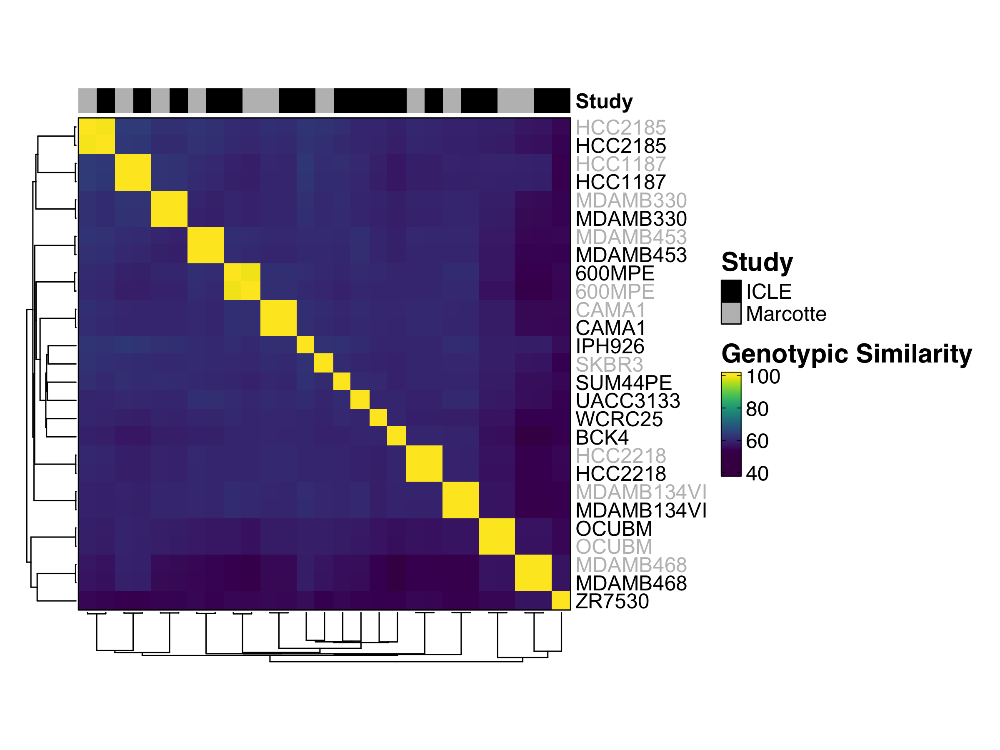

### Perform Molecular Subtyping

Performs all molecular subtyping and produces SupFigs 2–4 (Clustering
heatmaps), Fig 1B (Sankey), and Fig 1C (SET heatmap) in one orchestrator
script. Three independent approaches are used:

1.  **Intrinsic subtyping** — multi-algorithm consensus using
    BreastSubtypeR (PAM50, SCMGENE, SSP, AIMS, GGI); majority-vote
    “TopCall” assignment.
2.  **Data-driven multi-omic consensus clustering** —
    ConsensusClusterPlus on the top 6,000 MAD-variable genes (RNA), top
    50 variable proteins (RPPA), and 6,000 variable probes (DNAm), each
    yielding an independent cluster solution consolidated into four core
    subtypes (Luminal, Luminal/HER2, HER2-enriched, Basal).
3.  **SET signature** — endocrine therapy sensitivity inferred from
    published SET ER+/ER− gene modules (Symmans et al. 2010).

``` r
source(file.path(DIRS$scripts$helpers, "02_Fig1_SupFig2_3_4_Molecular_Subtyping.R"), chdir = TRUE)
```

    ## 
    ##   ── Step 1/5: molecular subtyping pipeline ──

    ## ═══════════════════════════════════════════════════════

    ##   Molecular Subtyping Pipeline

    ## ═══════════════════════════════════════════════════════

    ##   Step 1/7: Calculating ER status...

    ##   ✓ ER status calculated for 56 samples

    ## 
    ##   Step 2/7: Calculating HER2 status...

    ##   ✓ HER2 status calculated for 56 samples

    ## 
    ##   Step 3/7: Running Intrinsic Molecular Subtyping subtyping with BreastSubtypeR...

    ##   ✓ Intrinsic Molecular Subtyping subtyping complete

    ## 
    ##   Step 4/7: Running mRNA consensus clustering...

    ##   ✓ mRNA clustering complete

    ## 
    ##   Step 5/7: Running RPPA consensus clustering...

    ##   ✓ RPPA clustering complete

    ## 
    ##   Step 6/7: Running DNAm consensus clustering...

    ##   ✓ DNAm clustering complete

    ## 
    ##   Step 7/7: Updating annotations and saving results...

    ##   ✓ Annotations updated and results saved

    ## ═══════════════════════════════════════════════════════

    ##   Molecular Subtyping Complete

    ##   Results saved to: /Users/oshah/Documents/ICLE/3-Results/Molecular_Subtyping

    ## ═══════════════════════════════════════════════════════

    ## 
    ##   ── Step 2/5: ER/HER2 status + SET scores ──

    ## 
    ##   ── Step 3/5: building SupFig 2–4 heatmap, PCA, and Sankey objects ──

    ##   ✓ ims entropy heatmap saved

    ##   ✓ SupFig 2A: mRNA_sim_HT object created (saved in Main_Data_Analysis.Rmd)

    ##   ✓ SupFig 2B: supfig2b_mRNA_pca object created (saved in Main_Data_Analysis.Rmd)

    ##   ✓ SupFig 3A: rppa_sim_HT object created (saved in Main_Data_Analysis.Rmd)

    ##   ✓ SupFig 3B: supfig3b_rppa_pca object created (saved in Main_Data_Analysis.Rmd)

    ##   ✓ SupFig 4A: dnam_sim_HT object created (saved in Main_Data_Analysis.Rmd)

    ##   ✓ SupFig 4B: supfig4b_dnam_pca object created (saved in Main_Data_Analysis.Rmd)

    ##   ✓ SupFig 2C: rna_ims object created (saved in Main_Data_Analysis.Rmd)

    ##   ✓ SupFig 3C: rppa_sankey object created (saved in Main_Data_Analysis.Rmd)

    ##   ✓ SupFig 4C: dnam_sankey object created (saved in Main_Data_Analysis.Rmd)

    ## 
    ##   ── Step 4/5: Fig 1B multiomics Sankey ──

    ## 
    ##   ── Step 5/5: Fig 1C SET heatmap ──

    ##   Step 1/4: Loading SET signature genes...

    ##   ✓ Loaded 101 ER+ genes and 59 ER- genes

    ##   Step 2/4: Calculating SET scores...

    ##   ✓ SET scores calculated for 68 samples

    ##   Step 4/4: Creating SET signature heatmaps...

    ##   ✓ SET score heatmap created

    ##   ✓ Heatmaps created and combined

    ## ═══════════════════════════════════════════════════════

    ##   MOLECULAR SUBTYPING COMPLETE

    ## ═══════════════════════════════════════════════════════

### SupFig 2: RNA-seq Consensus Clustering

Heatmap showing consensus clustering solution for top variable RNA
features in integrated BRCA dataset. Heatmap annotations include
multi-algorithm intrinsic molecular subtype (IMS) top calls, ER+ gene
module scores and HER2 mRNA levels.

``` r
pdf(file.path(DIRS$results_sub$molecular_subtyping, "SupFig2A_mRNA_subtypes.pdf"), width = 10, height = 8)
draw(mRNA_sim_HT, merge_legends = TRUE, heatmap_legend_side = "right")
dev.off()
```

    ## quartz_off_screen 
    ##                 2

``` r
draw(mRNA_sim_HT, merge_legends = TRUE, heatmap_legend_side = "right")
```

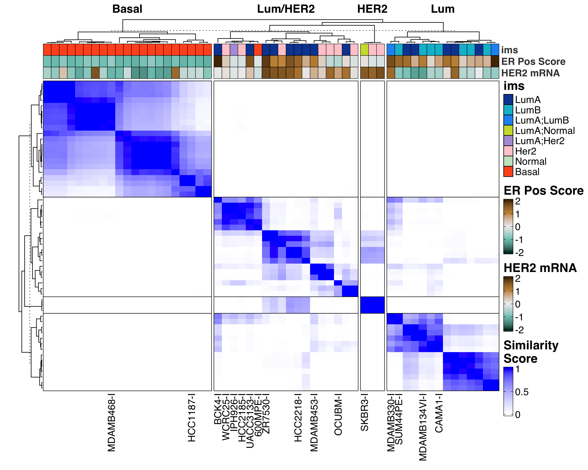

PCA plot of top variable RNA features showing cell clustering/similarity
annotated by molecular subtypes

``` r
ggsave(file.path(DIRS$results_sub$molecular_subtyping, "SupFig2B_mRNA_pca_subtypes.pdf"), supfig2b_mRNA_pca, width = 7, height = 5)
supfig2b_mRNA_pca
```

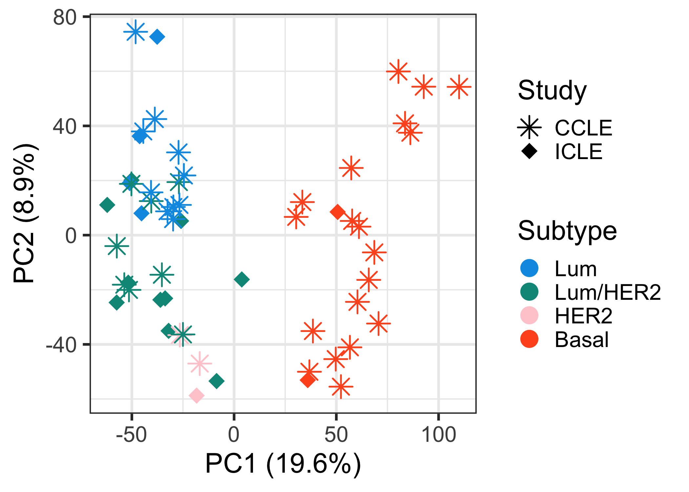

Sankey plot showing agreement between RNA molecular subtypes and (IMS)
top calls

``` r
ggsave(file.path(DIRS$results_sub$molecular_subtyping, "SupFig2C_RNA_ims.pdf"), rna_ims, width = 7, height = 5)
rna_ims
```

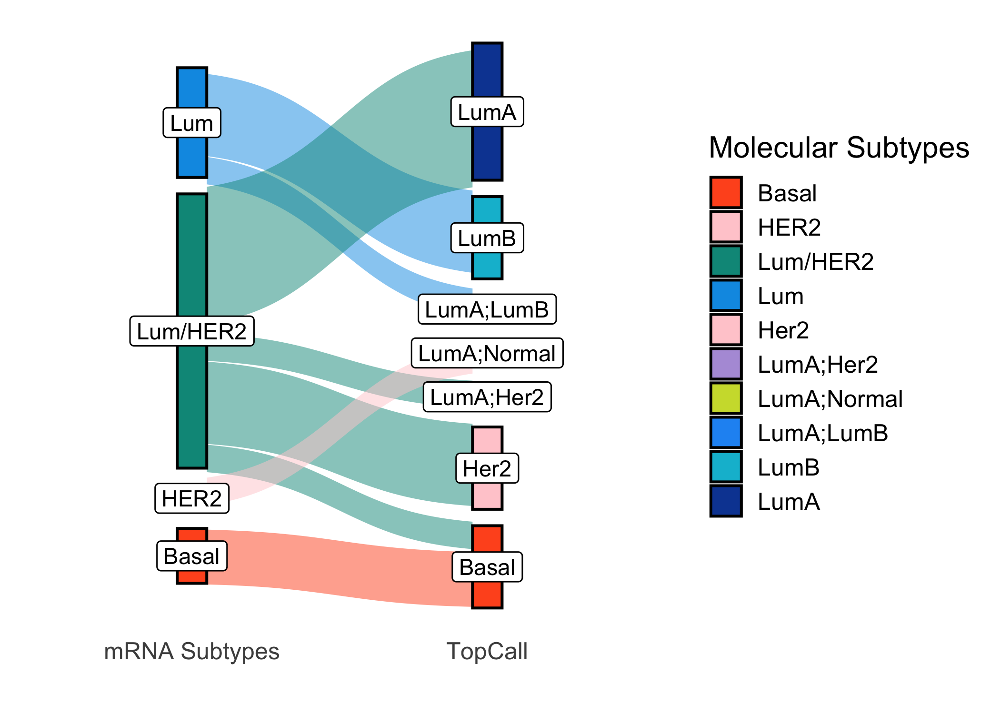

### SupFig 3: RPPA Consensus Clustering

``` r
pdf(file.path(DIRS$results_sub$molecular_subtyping, "SupFig3A_RPPA_subtypes.pdf"), width = 10, height = 8)
draw(rppa_sim_HT, merge_legends = TRUE, heatmap_legend_side = "right")
dev.off()
```

    ## quartz_off_screen 
    ##                 2

``` r
draw(rppa_sim_HT, merge_legends = TRUE, heatmap_legend_side = "right")
```

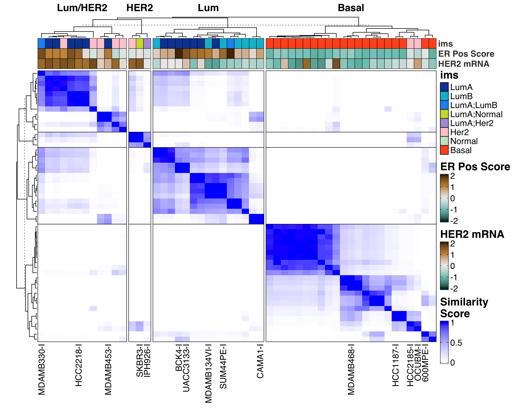

``` r
ggsave(file.path(DIRS$results_sub$molecular_subtyping, "SupFig3B_RPPA_pca_subtypes.pdf"), supfig3b_rppa_pca, width = 7, height = 5)
supfig3b_rppa_pca
```

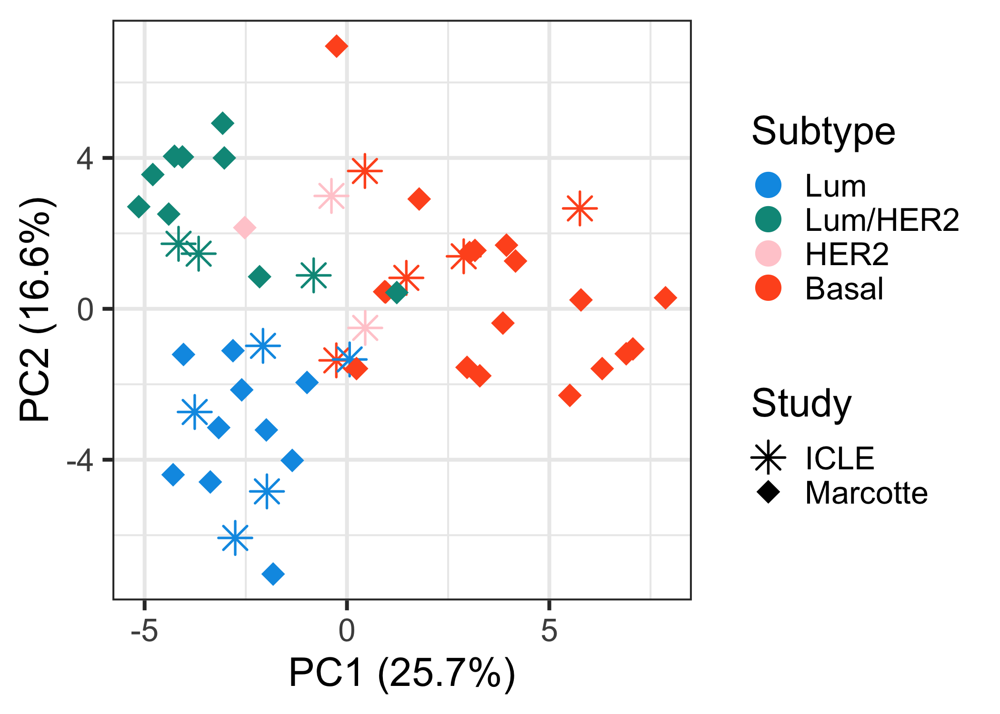

``` r
ggsave(file.path(DIRS$results_sub$molecular_subtyping, "SupFig3C_RPPA_ims.pdf"), rppa_sankey, width = 7, height = 5)
rppa_sankey
```

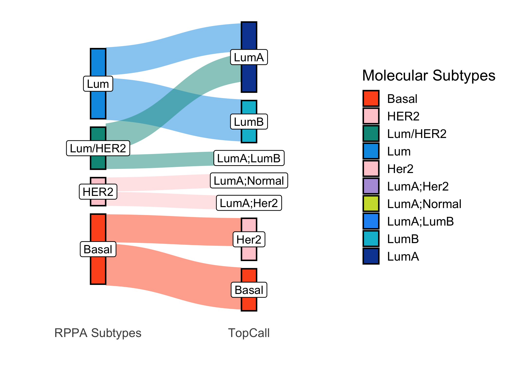

### SupFig 4: DNAm Consensus Clustering

``` r
pdf(file.path(DIRS$results_sub$molecular_subtyping, "SupFig4A_DNAm_subtypes.pdf"), width = 10, height = 8)
draw(dnam_sim_HT, merge_legends = TRUE, heatmap_legend_side = "right")
dev.off()
```

    ## quartz_off_screen 
    ##                 2

``` r
draw(dnam_sim_HT, merge_legends = TRUE, heatmap_legend_side = "right")
```

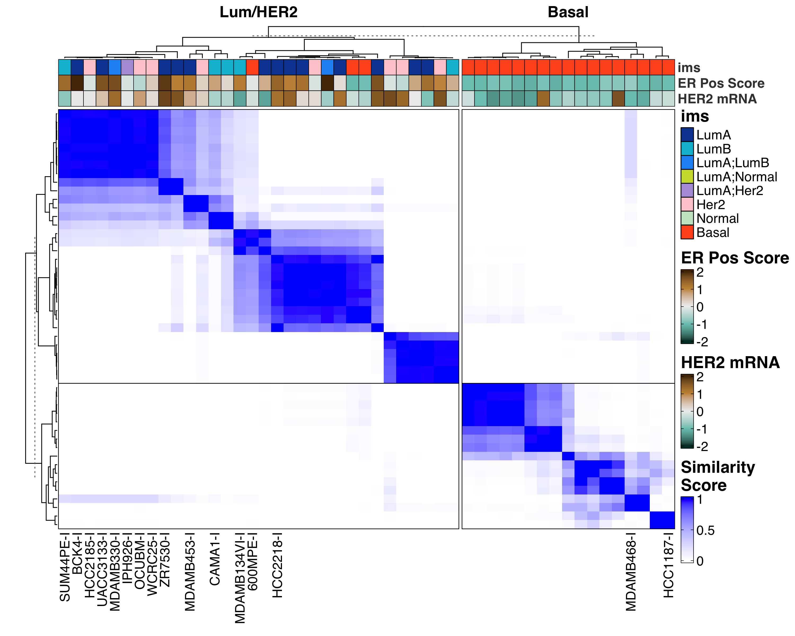

``` r
ggsave(file.path(DIRS$results_sub$molecular_subtyping, "SupFig4B_DNAm_pca_subtypes.pdf"), supfig4b_dnam_pca, width = 7, height = 5)
supfig4b_dnam_pca
```

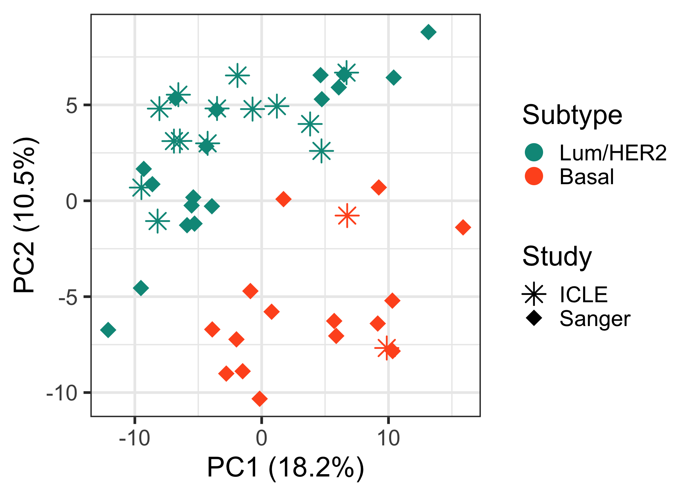

``` r
ggsave(file.path(DIRS$results_sub$molecular_subtyping, "SupFig4C_DNAm_ims.pdf"), dnam_sankey, width = 7, height = 5)
dnam_sankey
```

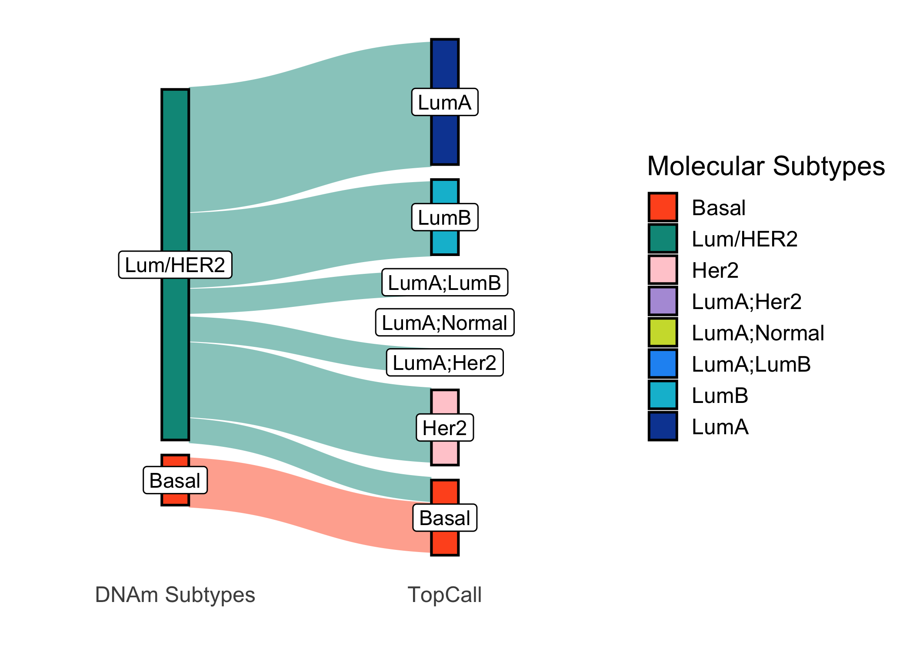

### Figure 1B: Overview of Multiomic Subtypes

Sankey/alluvial diagram showing agreement across the three data-driven
molecular subtype assignments (RNA, RPPA, DNAm).

``` r
ggsave(file.path(DIRS$results_sub$molecular_subtyping, "Fig1B_MolecularSubtypes.pdf"), fig1b_sankey, width = 7, height = 5)

fig1b_sankey
```

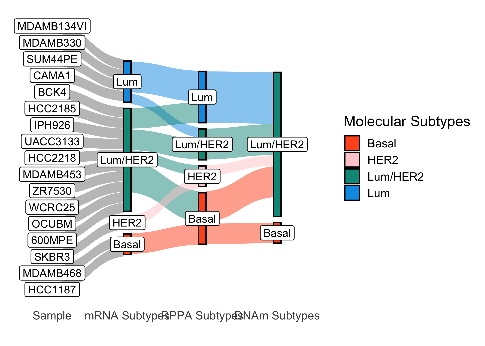

### Figure 1C: SET Signature

Heatmap of SET (Sensitivity to Endocrine Therapy) ER+ and ER− gene
module scores (Symmans et al. 2010) across integrated BRCA cell lines,
stratified by intrinsic subtype.

``` r
pdf(file.path(DIRS$results_sub$molecular_subtyping, "Fig1C_SET_Signature.pdf"), width = 8, height = 6)
  draw(fig1c_setheatmap, merge_legends = TRUE)
dev.off()
```

    ## quartz_off_screen 
    ##                 2

``` r
draw(fig1c_setheatmap, merge_legends = TRUE)
```

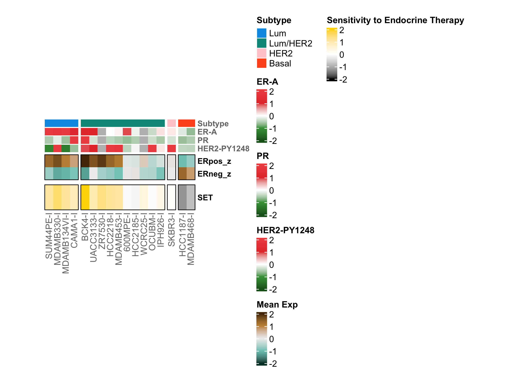

### Figure 1D: Multiomics Overview

Comprehensive multi-omic overview heatmap summarising key genomic,
transcriptomic, proteomic, and epigenetic features of ICLE cell lines.
Features include ER/HER2 status, molecular subtypes, copy number
alterations, somatic mutations and top variable RPPA/RNA/DNAm features.

``` r
source(file.path(DIRS$scripts$helpers, "04_Fig1D_Multiomics_Overview.R"), chdir = T)
```

    ## 
    ## ========================================

    ## Figure 1D: Multiomics Overview

    ## ========================================

    ##   Step 1/6: Loading additional genomic metrics...

    ##   ✓ Saved Genomic Instability Metrics to File/Users/oshah/Documents/ICLE/3-Results/Genomic_Instability_Metrics.tsv

    ##   ✓ Metrics loaded

    ##   Step 2/6: Preparing genetic alteration matrix...

    ##   ✓ Alteration matrix prepared: 9 genes x 17 samples

    ##   Step 3/6: Selecting top variable features...

    ##   ✓ RNA: 6000 genes selected

    ##   ✓ RPPA: 50 proteins selected

    ##   ✓ DNAm: 5913 probes selected

    ## 
    ##   Step 4/6: Creating annotations...

    ##   ✓ Top annotation created

    ## 
    ##   Step 5/6: Creating individual heatmaps...

    ##   ✓ Alteration heatmap created

    ##   ✓ RPPA heatmap created

    ##   ✓ RNA heatmap created

    ##   ✓ DNAm heatmap created

    ## 
    ## ========================================

    ## Figure 1D Completed

    ## ========================================

``` r
pdf(file.path(DIRS$results, "Fig1D_Multiome_Overview.pdf"), width = 6, height = 8)
  draw(fig1d_multiomics_overview, merge_legends = TRUE, annotation_legend_side = "right", heatmap_legend_side = "right")
dev.off()
```

    ## quartz_off_screen 
    ##                 2

``` r
fig1d_multiomics_overview
```

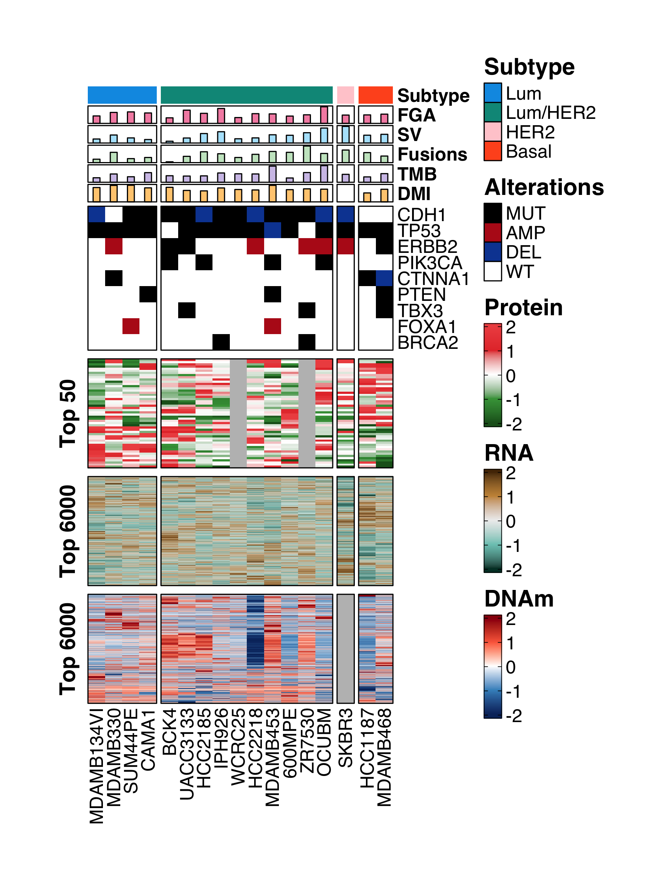

### Fig 1E: IGV Plot (Patient Tumors vs Cell Lines)

Prepares copy number segmentation files (log R ratio) per ICLE molecular
subtype for genome-wide CN visualization in the Integrative Genomics
Viewer (IGV). TCGA primary ILC (n = 127) and MSK metastatic ILC (n =
202) segment files are also subsetted and exported. These files are
loaded directly into IGV to produce figure 1E subpanels.

``` r
# prepare primary ILC patient tumor CN segments
TCGA_BRCA_CN_SEG <- read.delim(file.path(DIRS$external$tcga, "CN", "TCGA_logRR_DNAcopy.seg"))
TCGA_BRCA_CN_SEG$ID <- substr(TCGA_BRCA_CN_SEG$ID, 1, 15)
ILC_cases <- subset(TCGA_Annots, `Final Pathology` == "ILC")$Case.ID
ILC_seg <- subset(TCGA_BRCA_CN_SEG, ID %in% ILC_cases)
write.table(ILC_seg, file = file.path(DIRS$external$tcga, "CN", "TCGA_logRR_ILC_127.seg"), row.names = FALSE, quote = FALSE, sep = "\t")

# prepare metastatic ILC patient tumor CN segments
MSK_BRCA_CN_SEG <- read.delim(file.path(DIRS$external$msk, "CN", "MSK_BRCA_CN.seg"))
ILC_met_cases <- subset(MSK_Annots, ONCOTREE_CODE == "ILC")$SAMPLE_ID
ILC_met_seg <- subset(MSK_BRCA_CN_SEG, ID %in% ILC_met_cases)
write.table(ILC_met_seg, file = file.path(DIRS$external$msk, "MSK_CN_ILC_202.seg"), row.names = FALSE, quote = FALSE, sep = "\t")

# prepare ICLE CN segments by subtype
ICLE_cells <- subset(CL_Annots, Study == "ICLE")
ICLE_cells <- split(ICLE_cells$Name, ICLE_cells$`mRNA Subtypes`)
ICLE_cells$HER2 = "SKBR3-M" # borrow information on SKRB3 from Marcotte
ICLE_cells$Other <- c(ICLE_cells$HER2, ICLE_cells$Basal)
ICLE_cells <- ICLE_cells[-c(3,4)]

BRCA_CL_CN_SEG <- read.delim(FILES$cnv_seg)

BRCA_CL_CN_SEG_subtype <- sapply(ICLE_cells, FUN = function(x){
  subset(BRCA_CL_CN_SEG, ID %in% x)
}, simplify = F)

sapply(names(BRCA_CL_CN_SEG_subtype), FUN = function(x){
  seg = BRCA_CL_CN_SEG_subtype[[x]]
  x = gsub("[//]", "_", x)
  write.table(seg, file = file.path(DIRS$icle$cytosnp, "3_Segmentation", paste0(x, "_ICLE_CL_LogRR_DNACopy.seg")), row.names = FALSE, quote = FALSE, sep = "\t")
})
```

    ## $Lum
    ## NULL
    ## 
    ## $`Lum/HER2`
    ## NULL
    ## 
    ## $Other
    ## NULL

### Figure 1F: Alteration Frequency Barplots (Patient Tumors vs Cell Lines)

Compares alteration frequencies of ESMO ESCAT-scored actionable genes in
luminal ICLE cell lines versus TCGA primary ILC and MSK metastatic ILC
patient tumors. Differences in alteration frequency between groups are
assessed by two-proportion z-test.

``` r
suppressWarnings(source(file.path(DIRS$scripts$helpers, "05_Fig1F_Alteration_barplots.R")))
```

    ## 
    ## ========================================

    ## Figure 1F: Alteration Barplots

    ## ========================================

    ##   Step 1/5: Defining gene sets...

    ##   ✓ Gene sets defined:

    ##     - ILC genes: 6

    ##     - NST genes: 7

    ##     - ESCAT genes: 25

    ##     - Total unique genes: 32

    ##   Step 2/5: Calculating alteration frequencies...

    ##     Processing Cell Lines...

    ##       - Samples: 14

    ##       - Altered genes: 25

    ##     Processing Primary Tumors...

    ##       - Samples: 126

    ##       - Altered genes: 30

    ##     Processing Metastatic Tumors...

    ##       - Samples: 194

    ##       - Altered genes: 31

    ## 

    ##   Step 3/5: Combining and ordering data...

    ##   ✓ Combined data prepared:

    ##     - Common events: 24

    ##     - Genes to plot: 21

    ##   Step 4/5: Creating alteration barplot...

    ##   ✓ Barplot created

    ##   Step 5/5: Performing statistical tests...

    ##   ✓ Statistical tests completed

    ##   Saving results p-values plots...

    ##   ✓ P-values (numeric) saved: /Users/oshah/Documents/ICLE/3-Results/Molecular_Resemblance/Fig1F_Alteration_Barplot_pval.pdf

    ##   ✓ P-values (notation) saved: /Users/oshah/Documents/ICLE/3-Results/Molecular_Resemblance/Fig1F_Alteration_Barplot_pval_nt.pdf

    ##   ✓ Figure 1F complete

``` r
output_file <- file.path(DIRS$results, "Molecular_Resemblance", "Fig1F_Alteration_Barplot.pdf")
ggsave(filename = output_file, fig1f_alteration_barplot, width = 6, height = 5)

fig1f_alteration_barplot
```

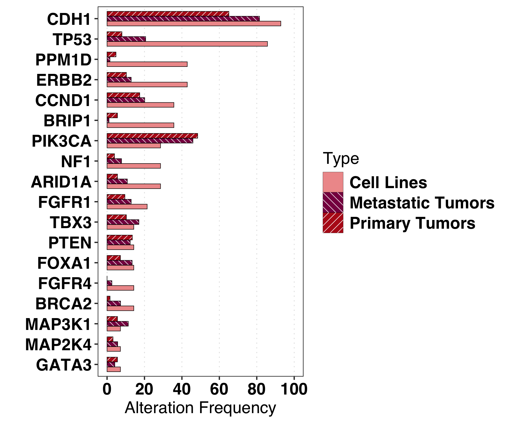

### SupFig 5: Key ILC vs NST Alterations (Patient Tumors)

Barplot comparing the frequencies of key somatic alterations in ILC
versus NST primary and metastatic breast cancer patient tumors.
Statistical comparisons performed using a two-proportion z-test.

``` r
source(file.path(DIRS$scripts$helpers, "06_SupFig5_ILC_NST_Alterations.R"), chdir = TRUE)
```

    ## 
    ## ========================================

    ## SupFig 5: ILC vs NST alteration frequencies (LumA tumors)

    ## ========================================

    ## Specs: 28 rows, 14 genes

    ##   ✓ SupFig 5 complete (supfigs5_tumor_alterations, freq_tbl assigned).

``` r
ggsave(file.path(DIRS$results, "SupFig5_BRCA_Tumor_Top_Alterations.pdf"), supfigs5_tumor_alterations, width = 8, height = 5)

write.table(freq_tbl, file.path(DIRS$results, "SupFig5_BRCA_Tumor_Top_Alterations.tsv"),  # source data for SupFig 5
            sep = "\t", quote = FALSE, row.names = FALSE)

supfigs5_tumor_alterations
```

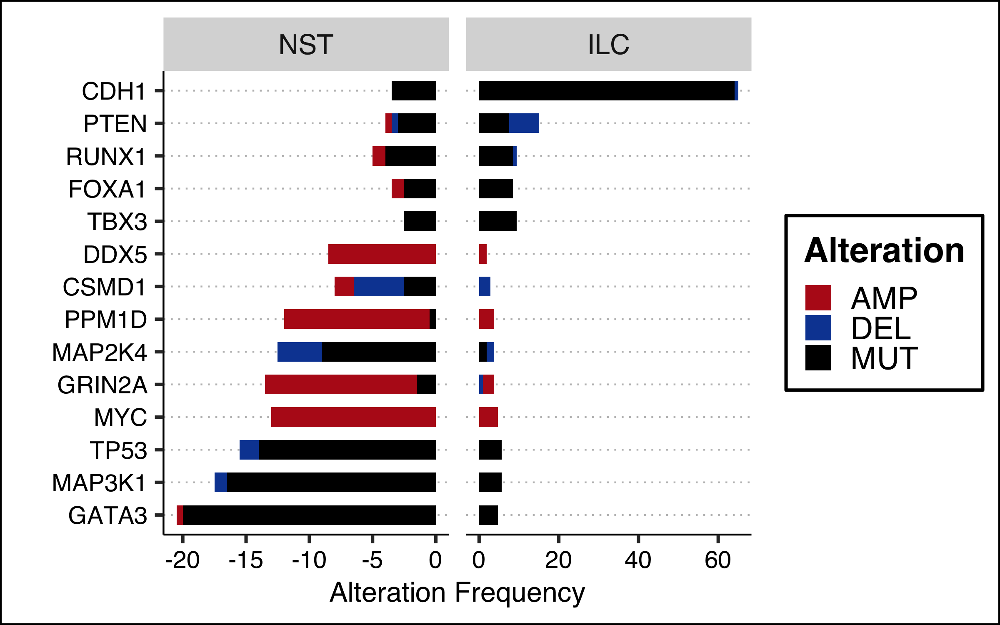

### SupFig 6: Alterations in Key Pathways (ICLE)

Oncoprint summarising the frequency and type of somatic alterations
across key cancer-relevant signalling pathways (RTK/RAS, PI3K, cell
cycle, apoptosis, DNA repair, Wnt, TGF-β, epigenetic regulators) in ICLE
cell lines.

``` r
source(file.path(DIRS$scripts$helpers, "07_SupFig6_Pathway_Alterations.R"), chdir = TRUE)
```

    ## 
    ## ========================================

    ## SupFig 6: Pathway alterations (ICLE)

    ## ========================================

    ##   ✓ SupFig 6 complete (SupFigS6, pathway_alt_mat assigned).

``` r
pdf(file.path(DIRS$results, "SupFig6_Pathway_Alterations.pdf"), width = 7.5, height = 8)
draw(SupFigS6, merge_legends = TRUE)
dev.off()
```

    ## quartz_off_screen 
    ##                 2

``` r
write.table(pathway_alt_mat, file.path(DIRS$results, "SupFig6_Pathway_Alterations.tsv"),  # source data for SupFig 6
            sep = "\t", quote = FALSE, col.names = NA)

draw(SupFigS6, merge_legends = TRUE)
```

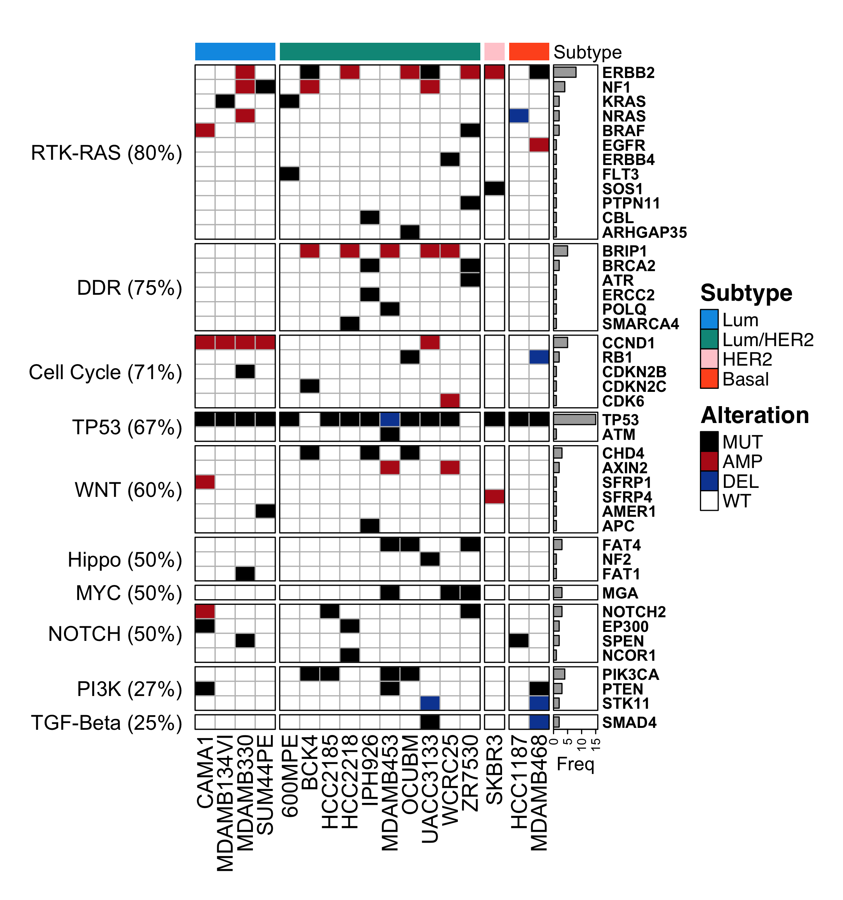

## b. Recapitulation of the CDH1 Alteration Landscape in ILC Cell Line Models

### Figure 2B: Novel SVs in CDH1

Structural variant visualizations for novel *CDH1* rearrangements
detected by Bionano OGM. These figures are generated externally by
loading the filtered SV files into Bionano Access (v1.7) software.

``` r
# Visualizations generated using Bionano Access software by loading SV files
```

Runs the full CDH1 alteration analysis pipeline (Figs 2C–2H) via
orchestrator script `08_Fig2_CDH1_Alteration_Landscape_All.R`, which
sources sub-scripts 08_Fig2C through 13_Fig2H in order. Performs
analysis and generates visualizations of: (i) exonic deletions in *CDH1*
locus using WES read coverage, (ii) *CDH1* alteration frequency
comparisons in FMI local and distant metastases, (iii) *CDH1* biallelic
inactivation events in ILC vs NST tumors and cell lines, (iv) multi-omic
overview of *CDH1* alteration landscape.

``` r
source(file.path(DIRS$scripts$helpers, "08_Fig2_CDH1_Alteration_Landscape_All.R"), chdir = TRUE)
```

    ## 
    ## ========================================

    ## Figure 2C: CDH1 Exonic Deletion Analysis

    ## ========================================

    ##   Loading WES CDH1 read counts...

    ##   Found 19 WES samples

    ##   ✓ Loaded read counts for 19 samples

    ##   Generating CDH1 deletion heatmap...

    ##   ✓ Heatmap generated with 16 exons and 5 samples

    ##   ✓ CDH1 exonic deletion analysis complete (fig2c_cdh1_exonic_del_heatmap assigned).

    ## 
    ## ========================================

    ## Figure 2D: FMI CDH1 alterations (Local vs Distant)

    ## ========================================

    ##   ✓ Fig 2D complete (fig2d_fmi_alts, fig2d_fmi_alts_tbl, fig2d_fmi_alts_tbl_pval assigned).

    ## 
    ## ========================================

    ## Figure 2E: CDH1 Protein Paint query

    ## ========================================

    ##   ✓ Saved Fig2E_CellLines_CDH1_Mutations_Protein_Paint_Query.tsv

    ##   ✓ Saved Fig2E_TCGA_CDH1_Mutations_Protein_Paint_Query.tsv

    ## 
    ## ========================================

    ## Figure 2F: CDH1 allele frequency plot

    ## ========================================

    ##   ✓ Fig 2F complete (fig2f_cdh1_af assigned).

    ## 
    ## ========================================

    ## Figure 2G: Cell vs Tumor CDH1 alteration barplots

    ## ========================================

    ##   ✓ Fig 2G complete (fig2g_cl_cdh1_alts, fig2g_tcga_cdh1_alts, fig2g_cl_cdh1_alts_tbl_pval, fig2g_tcga_cdh1_alts_tbl_pval assigned).

    ## 
    ## ========================================

    ## Figure 2H: CDH1 alteration landscape

    ## ========================================

    ##   ✓ Fig 2H complete (fig2h_tcga, fig2h_cl, TCGA_CDH1_df, CL_CDH1_df assigned).

    ## ═══════════════════════════════════════════════════════

    ##   Figure 2C-H complete

    ## ═══════════════════════════════════════════════════════

### Figure 2C: Exonic Deletions in ICLE

Heatmap of exon-level read depth (samtools bedcov) across canonical
*CDH1* and *CTNNA1* transcripts in ICLE cell lines. Exonic deletions are
defined as exons with fewer than 5 mapped WES reads. Identifies partial
gene deletions not detectable by point-mutation callers.

``` r
pdf(file.path(DIRS$results_sub$cdh1, "Fig2C_CDH1_Exonic_Deletions_ICLE.pdf"), width = 4, height = 4.5)
draw(fig2c_cdh1_exonic_del_heatmap)
dev.off()
```

    ## quartz_off_screen 
    ##                 2

``` r
draw(fig2c_cdh1_exonic_del_heatmap)
```

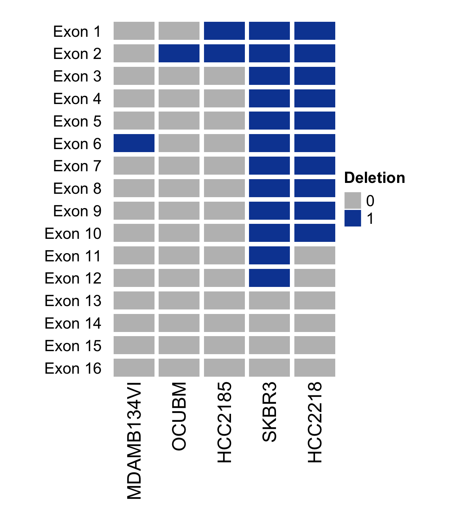

### Figure 2D: CDH1 Alterations in Local Recurrences and Distant Metastases (Patient Tumors)

Barplot comparing the frequency of *CDH1* structural rearrangements and
copy number deletions in ILC versus NST breast cancers across local
recurrence and distant metastasis groups in the FMI clinical cohort.
Enrichment statistics computed by Chi-square exact test, restricted to
cases without co-occurring *CDH1* point mutations or copy number gains.

``` r
ggsave(file.path(DIRS$results_sub$cdh1, "Fig2D_FMI_CDH1_Alterations_Barplot.pdf"), fig2d_fmi_alts, width = 6, height = 4)
gt::gtsave(gt::gt(fig2d_fmi_alts_tbl), file.path(DIRS$results_sub$cdh1, "Fig2D_FMI_CDH1_Alterations_Table.pdf"))
```

    ## file:////var/folders/7y/k10bb0_97t74ng9htslfjpk40000gr/T//Rtmpc117E4/file8db756dec8c7.html screenshot completed

``` r
gt::gtsave(gt::gt(fig2d_fmi_alts_tbl_pval) %>%
               gt::cols_width(starts_with("local") ~ px(100),starts_with("distant") ~ px(100)) %>% 
             gt::tab_options(table.width = px(600), column_labels.font.size = px(10)), 
           file.path(DIRS$results_sub$cdh1, "Fig2D_FMI_CDH1_Alterations_ILCvsNST_Event_pval.pdf"))
```

    ## file:////var/folders/7y/k10bb0_97t74ng9htslfjpk40000gr/T//Rtmpc117E4/file8db73c4fad5f.html screenshot completed

``` r
fig2d_fmi_alts
```

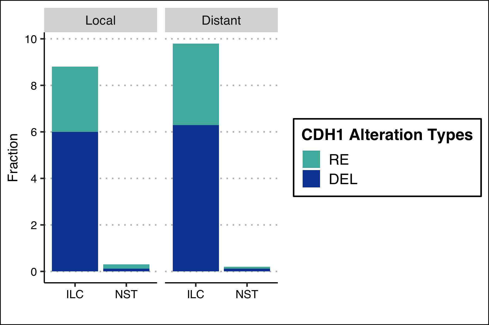

### Figure 2E: CDH1 Mutation Lollipop Plots (Patient Tumors vs Cell Lines)

*CDH1* protein domain lollipop plot overlaying mutation positions across
TCGA primary breast cancer tumors and integrated BRCA cell lines
generated using the ProteinPaint web tool (Zhou et al. 2016;
<https://proteinpaint.stjude.org/>).

``` r
# queries files (Fig2E_TCGA_CDH1_Mutations_Protein_Paint_Query.tsv & Fig2E_CellLines_CDH1_Mutations_Protein_Paint_Query.tsv) plotted using https://proteinpaint.stjude.org/
```

### Figure 2F: CDH1 Allele Frequency in Cell Lines

Barplot of *CDH1* variant allele frequencies (VAF) in ICLE cell lines,
colored by histological subtype (ILC, ILC-like, NST).

``` r
ggsave(file.path(DIRS$results_sub$cdh1, "Fig2F_CL_CDH1_AF_Barplot_histology_shape.pdf"), fig2f_cdh1_af, width = 4.5, height = 4)

fig2f_cdh1_af
```

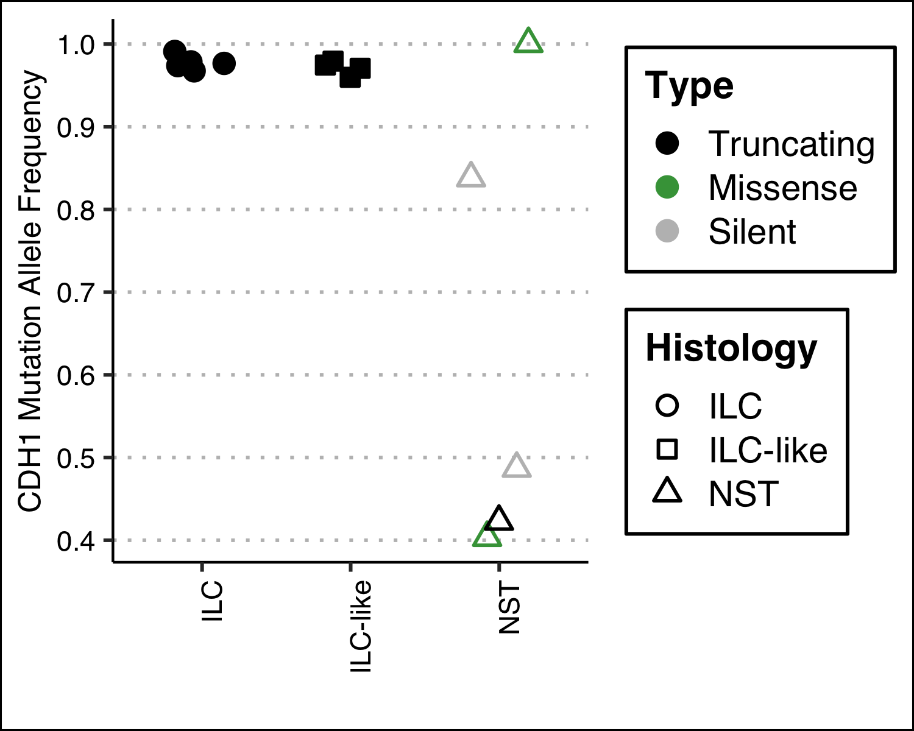

### Figure 2G: CDH1 Alteration Type Frequencies (Patient Tumors vs Cell Lines)

Side-by-side barplots comparing the frequency of *CDH1* alteration
categories — point mutation, LOH, biallelic event (MUT+LOH), dual
deletion — between integrated BRCA cell lines and TCGA primary BRCA
tumors, stratified by ILC vs NST. Enrichment of biallelic events in ILC
assessed by Chi-square test. Accompanying tables report per-event
p-values.

``` r
ggsave(file.path(DIRS$results_sub$cdh1, "Fig2G_CL_CDH1_Alt_barplot.pdf"), fig2g_cl_cdh1_alts, width = 5, height = 5)
ggsave(file.path(DIRS$results_sub$cdh1, "Fig2G_TCGA_CDH1_Alt_barplot.pdf"), fig2g_tcga_cdh1_alts, width = 4, height = 5)
suppressMessages({
  gt::gtsave(gt::gt(fig2g_cl_cdh1_alts_tbl), file.path(DIRS$results_sub$cdh1, "Fig2G_CL_CDH1_Alterations_Table.pdf"))
  gt::gtsave(gt::gt(fig2g_cl_cdh1_alts_tbl_pval), file.path(DIRS$results_sub$cdh1, "Fig2G_CL_CDH1_Alterations_ILCvsNST_Event_pval.pdf"))
  gt::gtsave(gt::gt(fig2g_tcga_cdh1_alts_tbl), file.path(DIRS$results_sub$cdh1, "Fig2G_TCGA_CDH1_Alterations_Table.pdf"))
  gt::gtsave(gt::gt(fig2g_tcga_cdh1_alts_tbl_pval), file.path(DIRS$results_sub$cdh1, "Fig2G_TCGA_CDH1_Alterations_ILCvsNST_Event_pval.pdf"))
})

ggarrange(plotlist = list(fig2g_tcga_cdh1_alts, fig2g_cl_cdh1_alts), widths = c(0.5, 0.6))
```

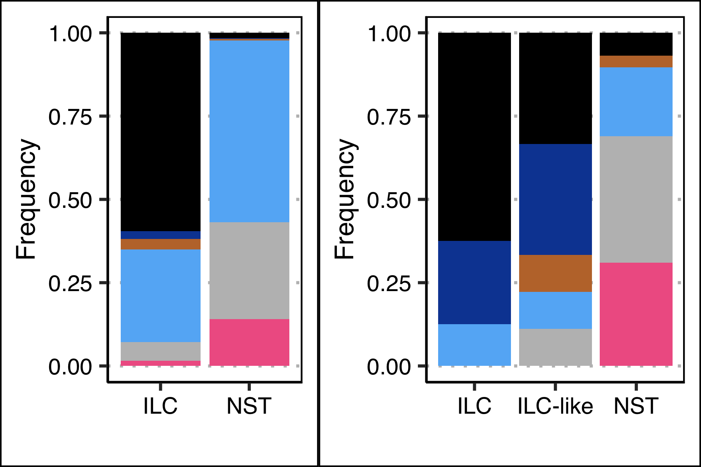

### Figure 2H: CDH1 Molecular Alteration Landscape (Patient Tumors vs Cell Lines)

Overview of multi-omic *CDH1* alteration landscape heatmaps in ILC vs
NST in Patient tumors and cell lines.

``` r
write.table(TCGA_CDH1_df, file.path(DIRS$results_sub$cdh1, "Fig2H_TCGA_CDH1_Alteration_Landscape.tsv"), sep = "\t", row.names = FALSE)  # → Supplementary Table S10 (TCGA)
write.table(CL_CDH1_df, file.path(DIRS$results_sub$cdh1, "Fig2H_CellLines_CDH1_Alteration_Landscape.tsv"), sep = "\t", row.names = FALSE)   # → Supplementary Table S10 (cell lines)

pdf(file.path(DIRS$results_sub$cdh1, "Fig2H_TCGA_CDH1_Alteration_Heatmap.pdf"), width = 8, height = 10)
  draw(fig2h_tcga, merge_legends = TRUE)
dev.off()
```

    ## quartz_off_screen 
    ##                 2

``` r
pdf(file.path(DIRS$results_sub$cdh1, "Fig2H_CellLine_CDH1_Alteration_Heatmap.pdf"), width = 8, height = 10)
  draw(fig2h_cl, merge_legends = TRUE)
dev.off()
```

    ## quartz_off_screen 
    ##                 2

``` r
draw(fig2h_tcga, merge_legends = TRUE)
```

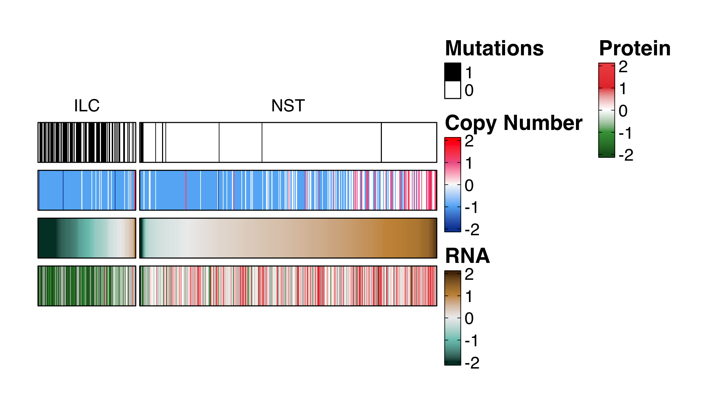

``` r
draw(fig2h_cl, merge_legends = TRUE)
```

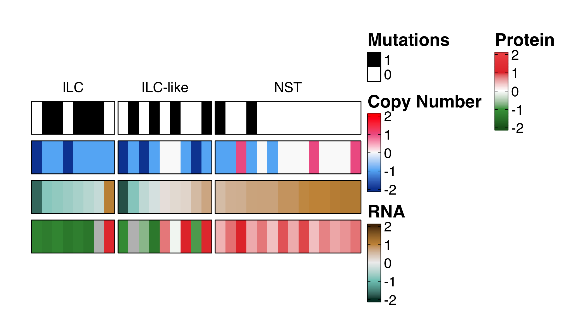

## c. Optical Genome Mapping Reveals Structural Variations, Chromothripsis and Functional Fusions

Runs all Figure 3 and SupFig 8–10 scripts in order via orchestrator
`14_Fig3_SV_All.R`. This section characterises the structural variant
(SV) landscape of ICLE cell lines profiled by Bionano Optical Genome
Mapping (OGM; resolution ≥5 kb). Includes: TMB and SV burden metrics
(SupFig 8), genome-wide SV distribution and genomic instability metrics
(Fig 3A), translocation breakpoint topography (Fig 3B), chromothripsis
detection using ShatterSeek (Fig 3C), circos plot generation (Fig 3D,
SupFig 9), and functional fusion analysis by integrating RNA-seq
expression data (Figs 3E–3F, SupFig 10).

``` r
source(file.path(DIRS$scripts$helpers, "14_Fig3_SV_All.R"), chdir = TRUE)
```

    ## 
    ## ========================================

    ## SupFig 8: TMB vs SV Comparison

    ## ========================================

    ##   ✓ SupFig 8 prep complete (chrom_sizes, alt_count_chr, SupFig8A–D assigned).

    ## 
    ## ========================================

    ## Figure 3A: Genomic instability metrics and SV distribution

    ## ========================================

    ##   ✓ Fig 3A complete

    ## 
    ## ========================================

    ## Figure 3B: Translocation breakpoint topography

    ## ========================================

    ##   ✓ Fig 3B complete (fig3b_transloc_breakpoints_ht assigned).

    ## 
    ## ========================================

    ## Figure 3C: Chromothripsis landscape

    ## ========================================

    ## [1] "Running Shatter Seek on All ICLE Samples to identify Chromothripsis Events"

    ## Processing: HCC1187

    ## Running..
    ## 
    ## 
    ## Evaluating the statistical criteria
    ## Successfully finished!

    ## Processing: HCC2218

    ## Running..
    ## 
    ## 
    ## Evaluating the statistical criteria
    ## Successfully finished!

    ## Processing: IPH926

    ## Running..
    ## 
    ## 
    ## Evaluating the statistical criteria
    ## Successfully finished!

    ## Processing: MDAMB134VI

    ## Running..
    ## 
    ## 
    ## Evaluating the statistical criteria
    ## Successfully finished!

    ## Processing: MDAMB330

    ## Running..
    ## 
    ## 
    ## Evaluating the statistical criteria
    ## Successfully finished!

    ## Processing: MDAMB453

    ## Running..
    ## 
    ## 
    ## Evaluating the statistical criteria
    ## Successfully finished!

    ## Processing: 600MPE

    ## Running..
    ## 
    ## 
    ## Evaluating the statistical criteria
    ## Successfully finished!

    ## Processing: SUM44PE

    ## Running..
    ## 
    ## 
    ## Evaluating the statistical criteria
    ## Successfully finished!

    ## Processing: WCRC25

    ## Running..
    ## 
    ## 
    ## Evaluating the statistical criteria
    ## Successfully finished!

    ## Processing: BCK4

    ## Running..
    ## 
    ## 
    ## Evaluating the statistical criteria
    ## Successfully finished!

    ## Processing: CAMA1

    ## Running..
    ## 
    ## 
    ## Evaluating the statistical criteria
    ## Successfully finished!

    ## Processing: HCC2185

    ## Running..
    ## 
    ## 
    ## Evaluating the statistical criteria
    ## Successfully finished!

    ## Processing: MDAMB468

    ## Running..
    ## 
    ## 
    ## Evaluating the statistical criteria
    ## Successfully finished!

    ## Processing: OCUBM

    ## Running..
    ## 
    ## 
    ## Evaluating the statistical criteria
    ## Successfully finished!

    ## Processing: SKBR3

    ## Running..
    ## 
    ## 
    ## Evaluating the statistical criteria
    ## Successfully finished!

    ## Processing: UACC3133

    ## Running..
    ## 
    ## 
    ## Evaluating the statistical criteria
    ## Successfully finished!

    ## Processing: ZR7530

    ## Running..
    ## 
    ## 
    ## Evaluating the statistical criteria
    ## Successfully finished!
    ## [1] "Saving Chromothripsis Analysis Results to: /Users/oshah/Documents/ICLE/3-Results/Optical_Genome_Mapping"

    ##   ✓ Fig 3C complete (shatterseek_outs, thripsis_ht assigned).

    ## 
    ## ========================================

    ## Figure 3D: Circos plots for selected samples

    ## ========================================

    ##   ✓ Fig 3D complete (trk_bck4, trk_600, trk_hcc, trk_zr assigned).

    ##   Preparing ICLE fusion data...

    ##   Loading tumor fusion data...

    ##   Calculating fusion gene expression...

    ##   Adding OncoVar annotations...

    ##   Identifying recurring fusions...

    ##   ✓ Fusion data preparation complete

    ##   Generating fusion visualizations...

    ## 
    ## ========================================

    ## Figure 3E: ICLE Fusion Distribution (Left)

    ## ========================================

    ##   ✓ Fig 3E (ICLE) complete

    ## 
    ## ========================================

    ## Figure 3E: Tumor Fusion Distribution (Right)

    ## ========================================

    ##   ✓ Fig 3E (Tumor) complete

    ## 
    ## ========================================

    ## SupFig 10A: Fusion Breakpoint Heatmap

    ## ========================================

    ##   ✓ SupFig 10A complete

    ## 
    ## ========================================

    ## SupFig 10B: Recurring Fusions Expression Heatmap

    ## ========================================

    ##   ✓ SupFig 10B complete

    ## 
    ## ========================================

    ## Figure 3F: GOE and LOE Fusions Circos

    ## ========================================

    ##   ✓ Fig 3F (GOE) complete

    ##   ✓ Fig 3F (LOE) complete

    ## 
    ## ========================================

    ## SupFig 10C: Recurring Gene Circos Plots

    ## ========================================

    ##   ✓ SupFig 10C (recurring genes) complete

    ## 
    ## ═══════════════════════════════════════════════════════

    ##   Figure 3 + SupFig 8–10 complete

    ## ═══════════════════════════════════════════════════════

### Figure 3A (left): ICLE Genomic Instability Metrics

Heatmap of genome-wide instability metrics across ICLE cell lines:
fraction genome altered (FGA; CINmetrics), large-scale state transitions
(LST), allelic imbalance (AI), homologous recombination deficiency (HRD)
score, and SV count from OGM. Columns annotated by molecular subtype and
histology.

``` r
pdf(file.path(DIRS$results_sub$ogm, "Fig3A_left_Metrics_of_GenomicInstability.pdf"), width = 4, height = 4)
draw(fig3a_genomic_instability)
dev.off()
```

    ## quartz_off_screen 
    ##                 2

``` r
fig3a_genomic_instability
```

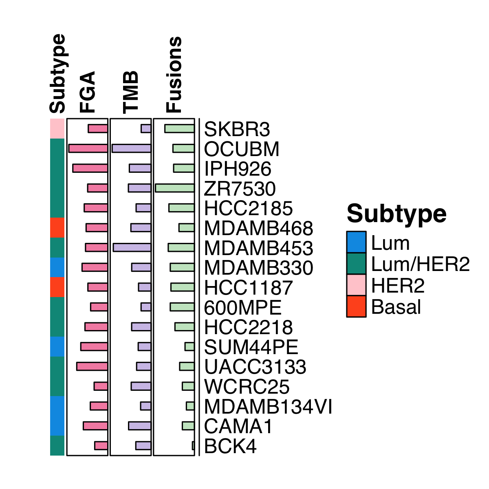

### Figure 3A (right): ICLE SV Type Distribution

Stacked barplot showing the absolute count and proportional distribution
of SV classes (DEL, DUP, INV, INS, TRA) per ICLE cell line, ordered by
total SV burden. Reveals cell line-specific patterns of genomic
rearrangement.

``` r
ggsave(file.path(DIRS$results_sub$ogm, "Fig3A_right_SV_Distribution.pdf"), fig3a_sv_distribution, width = 6, height = 5)
fig3a_sv_distribution
```

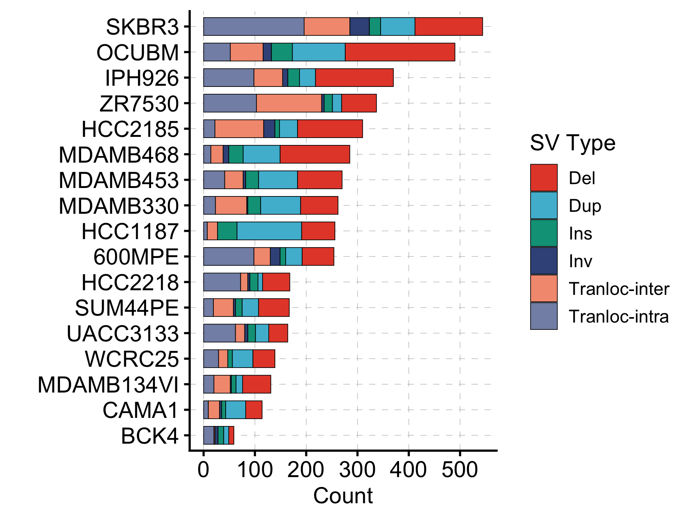

### Figure 3B: Chromosomal Topography of Translocation Breakpoints

Heatmap showing the chromosomal distribution of inter-chromosomal
translocation breakpoints across ICLE cell lines.

``` r
pdf(file.path(DIRS$results_sub$ogm, "Fig3B_Translocation_Distribution.pdf"), width = 6.5, height = 5)
  draw(fig3b_transloc_breakpoints_ht, merge_legends = TRUE)
dev.off()
```

    ## quartz_off_screen 
    ##                 2

``` r
fig3b_transloc_breakpoints_ht
```

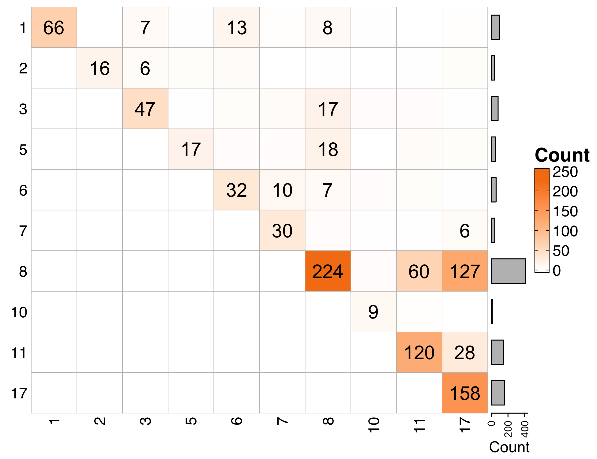

### Figure 3C: Chromothripsis Landscape

Heatmap of chromothripsis events identified by ShatterSeek
(Cortés-Ciriano et al. 2020) in ICLE cell lines. ShatterSeek integrates
OGM SV and CNV data to detect chromosomes with hallmarks of
chromothripsis (clustered oscillating CN states with co-localised SVs).
Rows = chromosomes; columns = ICLE cell lines; tile colour encodes
chromothripsis classification (high-confidence, low-confidence, absent).
Full results saved to
`SupTable11_shatterseek_chromothripsis_results.tsv`.

``` r
write.table(shatterseek_outs$chromothripsis_df, file.path(DIRS$results_sub$ogm, "SupTable11_shatterseek_chromothripsis_results.tsv"), sep = "\t", col.names = NA)  # → Supplementary Table S11
pdf(file.path(DIRS$results_sub$ogm, "Fig3C_chromothripsis_heatmap.pdf"), width = 5, height = 5)
  draw(fig3c_thripsis_ht, merge_legends = TRUE)
dev.off()
```

    ## quartz_off_screen 
    ##                 2

``` r
draw(fig3c_thripsis_ht, merge_legends = TRUE)
```

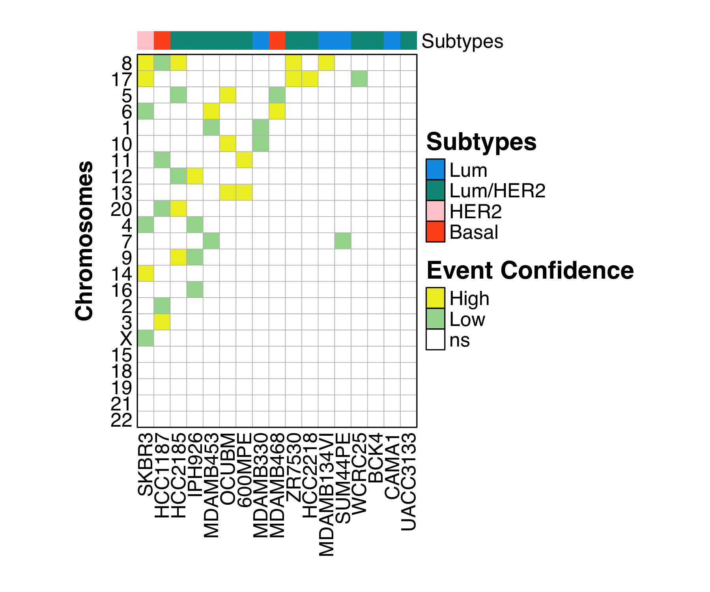

### Figure 3D: OGM Circos Plots — BCK4, 600MPE, HCC2185, ZR7530

Interactive circos plots for four ICLE cell lines with high SV burden or
clinically relevant rearrangements (BCK4, 600MPE, HCC2185, ZR7530),
generated using interacCircos (Cui et al. 2021). Each plot shows
genome-wide SV arcs overlaid on CN tracks. HTML widgets are exported to
static PDFs using `webshot2` (requires Chromium; see `README.md`). Cell
lines were selected to illustrate distinct OGM structural complexity
patterns.

``` r
# Load required libraries for HTML widget to PDF conversion
library(htmlwidgets)
library(webshot2)

# Save all four circos plots to PDF
message("Saving circos plots to PDF...")
```

    ## Saving circos plots to PDF...

``` r
circos_bck4 <- save_circos_to_pdf(trk_bck4, "BCK4", DIRS$results_sub$ogm)
```

    ## file:////Users/oshah/Documents/ICLE/3-Results/Optical_Genome_Mapping/Fig3D_Circos_BCK4.html screenshot completed

    ##   ✓ Saved PDF: Fig3D_Circos_BCK4.pdf

``` r
circos_600mpe <- save_circos_to_pdf(trk_600, "600MPE", DIRS$results_sub$ogm)
```

    ## file:////Users/oshah/Documents/ICLE/3-Results/Optical_Genome_Mapping/Fig3D_Circos_600MPE.html screenshot completed

    ##   ✓ Saved PDF: Fig3D_Circos_600MPE.pdf

``` r
circos_hcc2185 <- save_circos_to_pdf(trk_hcc, "HCC2185", DIRS$results_sub$ogm)
```

    ## file:////Users/oshah/Documents/ICLE/3-Results/Optical_Genome_Mapping/Fig3D_Circos_HCC2185.html screenshot completed

    ##   ✓ Saved PDF: Fig3D_Circos_HCC2185.pdf

``` r
circos_zr7530 <- save_circos_to_pdf(trk_zr, "ZR7530", DIRS$results_sub$ogm)
```

    ## file:////Users/oshah/Documents/ICLE/3-Results/Optical_Genome_Mapping/Fig3D_Circos_ZR7530.html screenshot completed

    ##   ✓ Saved PDF: Fig3D_Circos_ZR7530.pdf

``` r
circos_bck4
```

<div class="figure" style="text-align: center">

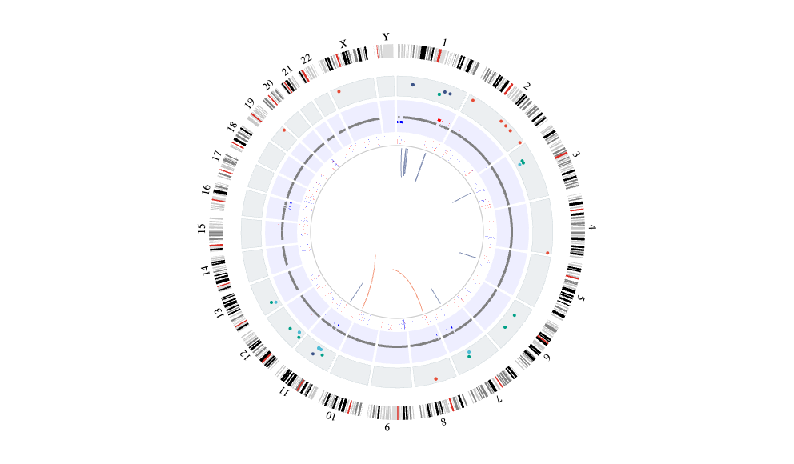
<p class="caption">

Fig 3D — BCK4 OGM circos
</p>

</div>

``` r
circos_600mpe
```

<div class="figure" style="text-align: center">

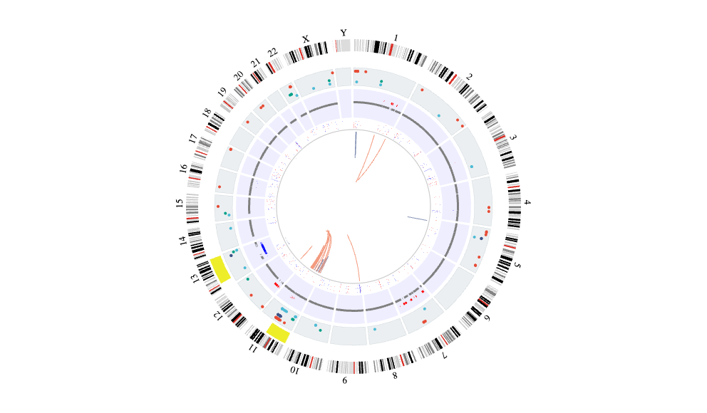
<p class="caption">

Fig 3D — 600MPE OGM circos
</p>

</div>

``` r
circos_hcc2185
```

<div class="figure" style="text-align: center">

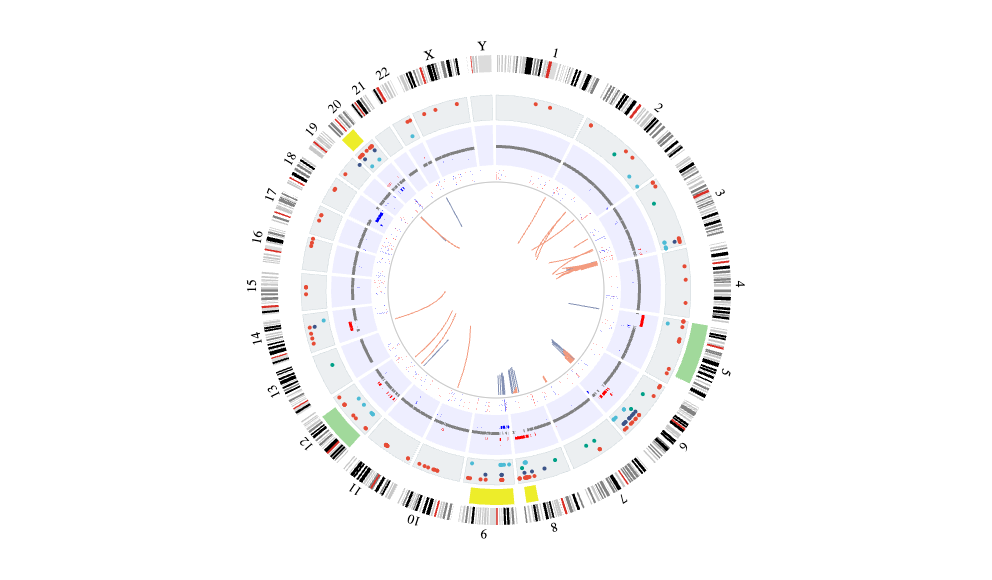
<p class="caption">

Fig 3D — HCC2185 OGM circos
</p>

</div>

``` r
circos_zr7530
```

<div class="figure" style="text-align: center">

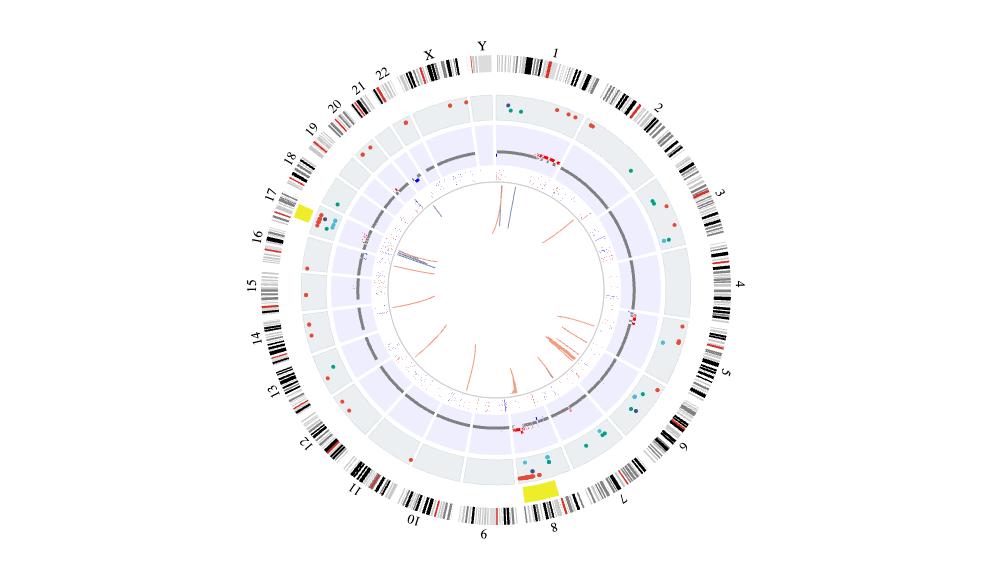
<p class="caption">

Fig 3D — ZR7530 OGM circos
</p>

</div>

### Figure 3E: Fusion Distribution (Patient Tumors vs Cell Lines)

Barplots comparing the distribution of OGM-detected gene fusions in ICLE
cell lines against fusions reported in the TCGA TumorFusions dataset
(Zhang et al. 2018). Fusions are classified by functional impact: Gain
of Expression (GOE, z \> 1) or Loss of Expression (LOE, z \< −1) based
on z-score normalizd RNA-seq expression of the fusion partner. Full
fusion annotation table saved to `SupTable12_fusion_df.tsv`.

``` r
# Save fusion distribution plots
ggsave(file.path(DIRS$results_sub$ogm, "Fig3E_right_FusionDistribution_ICLE.pdf"), 
       fig3e_1, width = 3, height = 4)
ggsave(file.path(DIRS$results_sub$ogm, "Fig3E_right_FusionDistribution_PatientTumor.pdf"), 
       fig3e_2+scale_x_continuous(breaks = c(0,25,50,75), limits = c(0,75)), width = 3, height = 4)
  
# Save fusion data table
write.table(fusions_df, file.path(DIRS$results_sub$ogm, "SupTable12_fusion_df.tsv"),  # → Supplementary Table S12
            quote = FALSE, sep = "\t", row.names = FALSE)

ggarrange(plotlist = list(fig3e_1, fig3e_2))
```

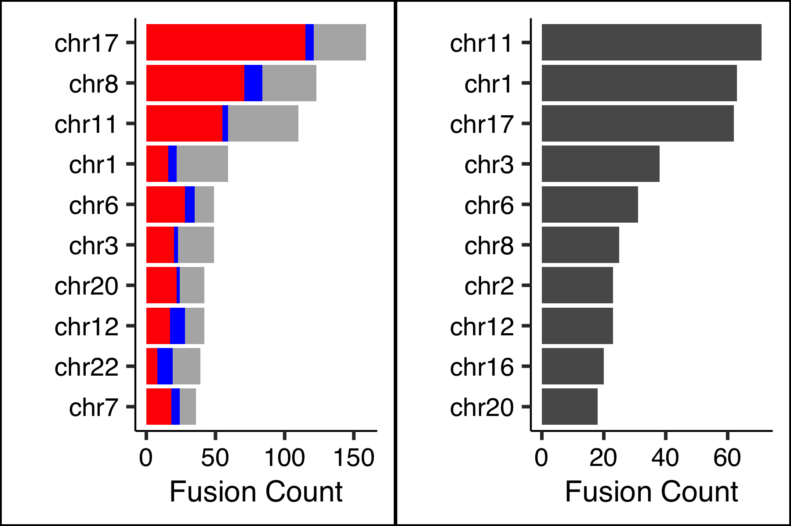

### Figure 3F: GOE and LOE Functional Fusions Circos

Circos plots displaying the chromosomal distribution and partner gene
pairs of functional OGM fusions classified as GOE (left panel) and LOE
(right panel) across ICLE cell lines. Arc thickness encodes fusion
recurrence; arcs are coloured by SV type (DEL, DUP, INV, TRA).

``` r
pdf(file = file.path(DIRS$results_sub$ogm, "Fig3F_left_GOE_Fusions.pdf"), width = 7, height = 7)
fig3f_left_goe_fusions_circos
dev.off()
```

    ## quartz_off_screen 
    ##                 2

``` r
pdf(file = file.path(DIRS$results_sub$ogm, "Fig3F_right_LOE_Fusions.pdf"), width = 7, height = 7)
fig3f_right_loe_fusions_circos
dev.off()
```

    ## quartz_off_screen 
    ##                 2

``` r
plot.new()
print(fig3f_left_goe_fusions_circos)
```

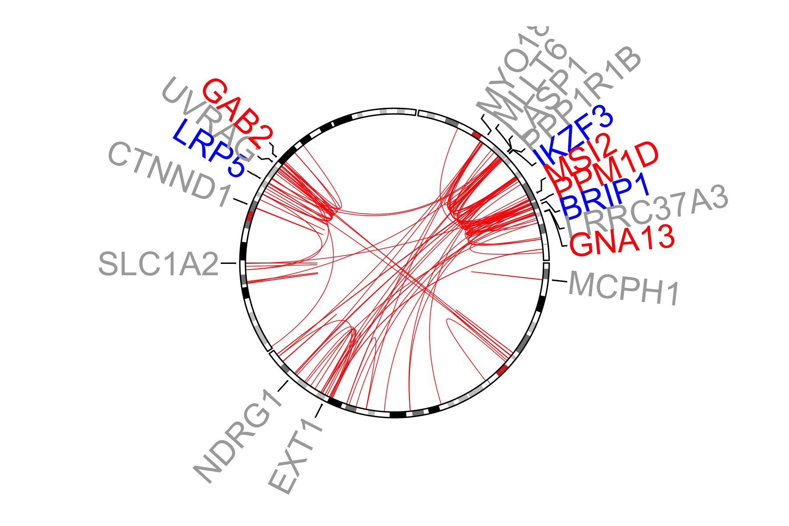

``` r
plot.new()
print(fig3f_right_loe_fusions_circos)
```

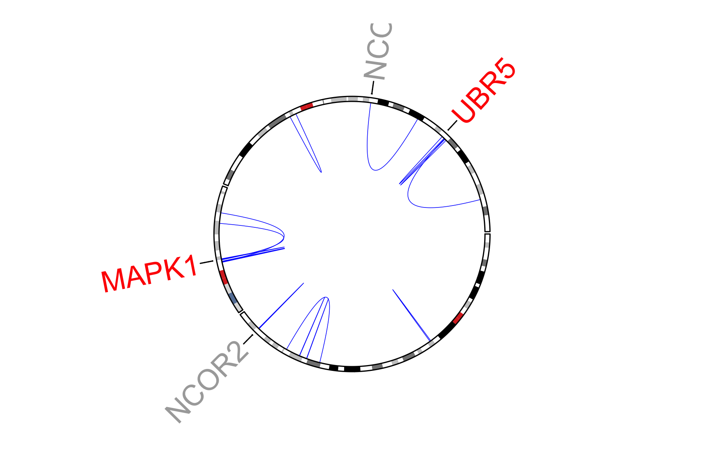

### SupFig 8A: Mutation Count vs SV Count and SV Size

Scatter plot showign correlation between WES mutation count vs OGM SV
count across ICLE cell lines.

``` r
ggsave(file.path(DIRS$results_sub$ogm, "SupFig8A_TMB_SV_Burden_Correlation.pdf"), SupFig8A, width = 5.5, height = 5)
write.table(sv_tmb_summary, file.path(DIRS$results_sub$ogm, "SupTable_SV_TMB_summary.tsv"), sep = "\t", quote = FALSE, row.names = FALSE)

SupFig8A
```

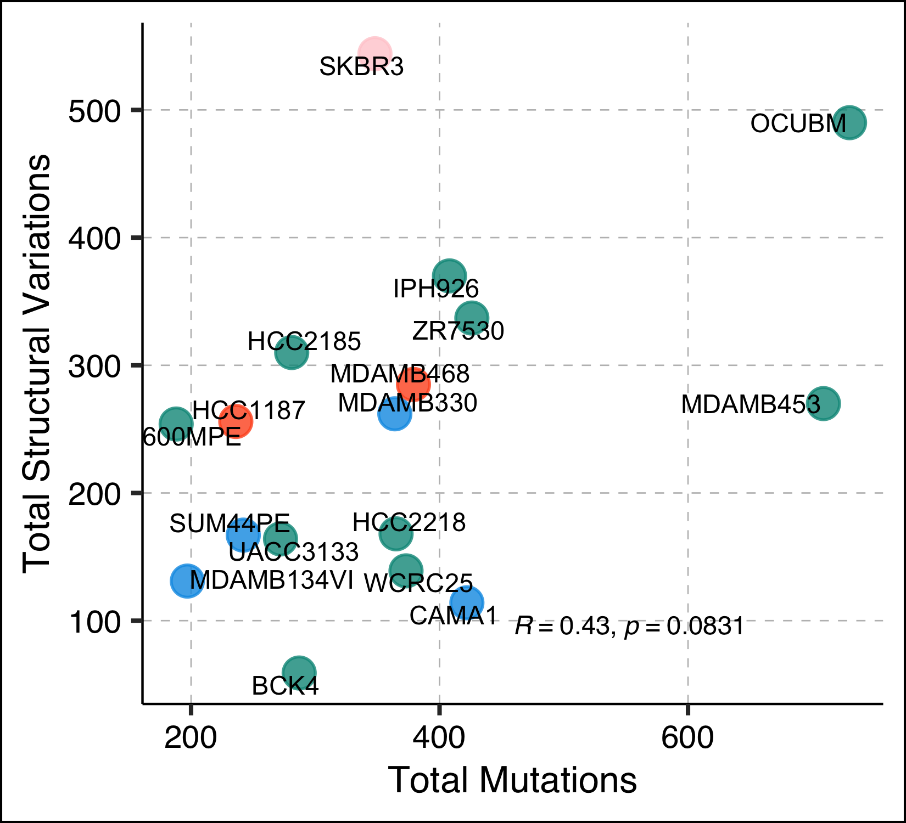

### SupFig 8B: TMB vs SV Burden (With and Without Outliers)

Scatter plot of TMB versus SV burden with (SupFig8B) and without
(SupFig8B_no_outliers) extreme outlier cell lines, with per-cell-line
alteration counts per chromosome saved to
`SupTable_alt_count_per_chr.tsv`.

``` r
ggsave(file.path(DIRS$results_sub$ogm, "SupFig8B_TMB_vs_SV_Burden_Correlation.pdf"), SupFig8B, width = 5.5, height = 5)
ggsave(file.path(DIRS$results_sub$ogm, "SupFig8B_TMB_vs_SV_Burden_Correlation_NoOutliers.pdf"), SupFig8B_no_outliers, width = 5.5, height = 5)
write.table(alt_count_chr, file.path(DIRS$results_sub$ogm, "SupTable_alt_count_per_chr.tsv"), sep = "\t", quote = FALSE, row.names = FALSE) 

ggarrange(plotlist = list(SupFig8B, SupFig8B_no_outliers))
```

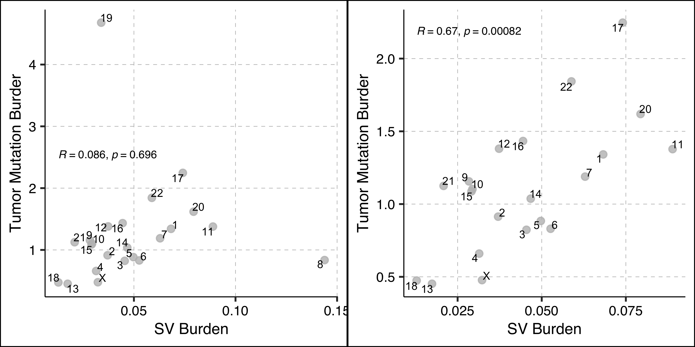

### SupFig 8C: SV Count per Chromosome

Bar plot of SV count per chromosome.

``` r
ggsave(file.path(DIRS$results_sub$ogm, "SupFig8C_SV_Per_Chr.pdf"), SupFig8C, width = 7, height = 5)
SupFig8C
```

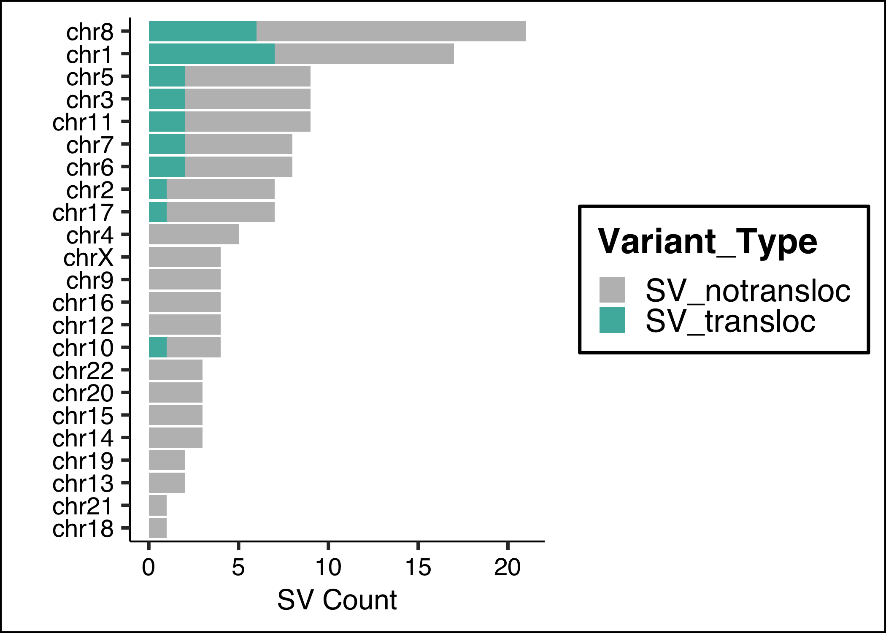

### SupFig 8D: Somatic Mutation Count per Chromosome

Bar plot of Mutation count per chromosome

``` r
ggsave(file.path(DIRS$results_sub$ogm, "SupFig8D_Mutations_Per_Chr.pdf"), SupFig8D, width = 4, height = 5)
SupFig8D
```

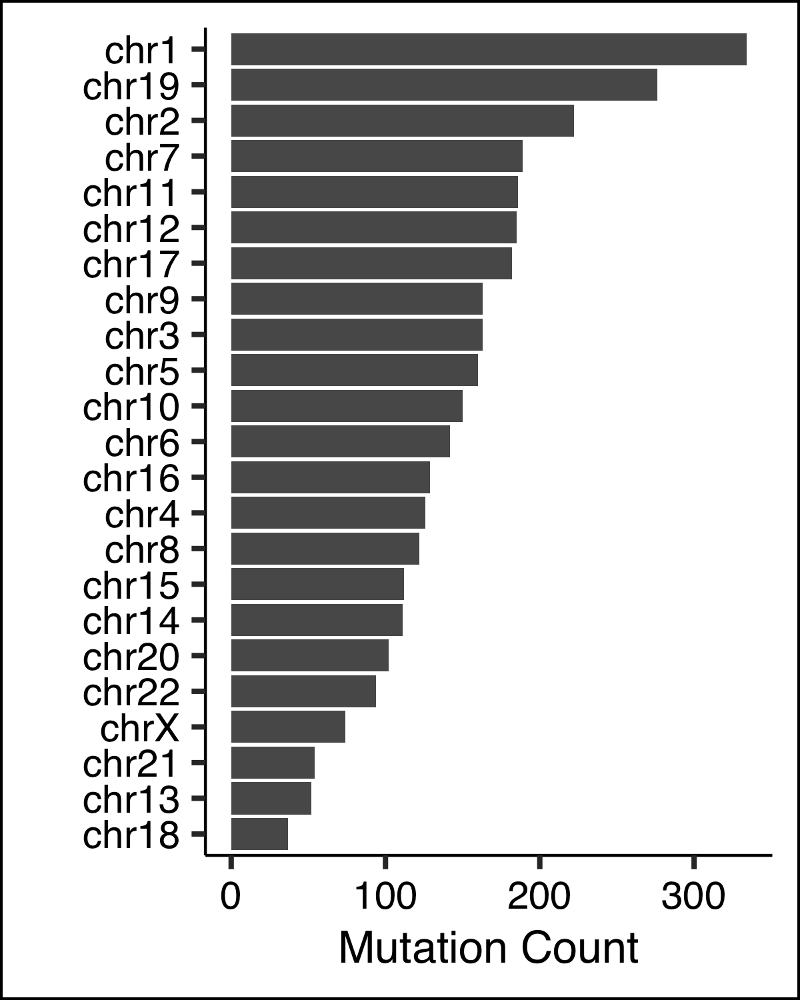

### SupFig 9: OGM Circos Plots

Generates individual OGM circos plots for every ICLE cell line using the
same `interacCircos`-based pipeline as Fig 3D. All plots are saved as
PDFs to `SupFig9_OGM_Circos/`. This chunk may take several minutes to
complete depending on SV count.

``` r
draw_circos_plot_for_all(shatterseek_outs$sv_df, shatterseek_outs$cnv_df, shatterseek_outs$chromothripsis_df, 
                         out_dir = file.path(DIRS$results_sub$ogm, "SupFig9_OGM_Circos"))
```

    ## [1] "Making Circos Plot for: HCC1187"

    ## file:////Users/oshah/Documents/ICLE/3-Results/Optical_Genome_Mapping/SupFig9_OGM_Circos/HCC1187_circos_plot.html screenshot completed

    ##   Saved PDF for sample: HCC1187

    ## [1] "Making Circos Plot for: HCC2218"

    ## file:////Users/oshah/Documents/ICLE/3-Results/Optical_Genome_Mapping/SupFig9_OGM_Circos/HCC2218_circos_plot.html screenshot completed

    ##   Saved PDF for sample: HCC2218

    ## [1] "Making Circos Plot for: IPH926"

    ## file:////Users/oshah/Documents/ICLE/3-Results/Optical_Genome_Mapping/SupFig9_OGM_Circos/IPH926_circos_plot.html screenshot completed

    ##   Saved PDF for sample: IPH926

    ## [1] "Making Circos Plot for: MDAMB134VI"

    ## file:////Users/oshah/Documents/ICLE/3-Results/Optical_Genome_Mapping/SupFig9_OGM_Circos/MDAMB134VI_circos_plot.html screenshot completed

    ##   Saved PDF for sample: MDAMB134VI

    ## [1] "Making Circos Plot for: MDAMB330"

    ## file:////Users/oshah/Documents/ICLE/3-Results/Optical_Genome_Mapping/SupFig9_OGM_Circos/MDAMB330_circos_plot.html screenshot completed

    ##   Saved PDF for sample: MDAMB330

    ## [1] "Making Circos Plot for: MDAMB453"

    ## file:////Users/oshah/Documents/ICLE/3-Results/Optical_Genome_Mapping/SupFig9_OGM_Circos/MDAMB453_circos_plot.html screenshot completed

    ##   Saved PDF for sample: MDAMB453

    ## [1] "Making Circos Plot for: 600MPE"

    ## file:////Users/oshah/Documents/ICLE/3-Results/Optical_Genome_Mapping/SupFig9_OGM_Circos/600MPE_circos_plot.html screenshot completed

    ##   Saved PDF for sample: 600MPE

    ## [1] "Making Circos Plot for: SUM44PE"

    ## file:////Users/oshah/Documents/ICLE/3-Results/Optical_Genome_Mapping/SupFig9_OGM_Circos/SUM44PE_circos_plot.html screenshot completed

    ##   Saved PDF for sample: SUM44PE

    ## [1] "Making Circos Plot for: WCRC25"

    ## file:////Users/oshah/Documents/ICLE/3-Results/Optical_Genome_Mapping/SupFig9_OGM_Circos/WCRC25_circos_plot.html screenshot completed

    ##   Saved PDF for sample: WCRC25

    ## [1] "Making Circos Plot for: BCK4"

    ## file:////Users/oshah/Documents/ICLE/3-Results/Optical_Genome_Mapping/SupFig9_OGM_Circos/BCK4_circos_plot.html screenshot completed

    ##   Saved PDF for sample: BCK4

    ## [1] "Making Circos Plot for: CAMA1"

    ## file:////Users/oshah/Documents/ICLE/3-Results/Optical_Genome_Mapping/SupFig9_OGM_Circos/CAMA1_circos_plot.html screenshot completed

    ##   Saved PDF for sample: CAMA1

    ## [1] "Making Circos Plot for: HCC2185"

    ## file:////Users/oshah/Documents/ICLE/3-Results/Optical_Genome_Mapping/SupFig9_OGM_Circos/HCC2185_circos_plot.html screenshot completed

    ##   Saved PDF for sample: HCC2185

    ## [1] "Making Circos Plot for: MDAMB468"

    ## file:////Users/oshah/Documents/ICLE/3-Results/Optical_Genome_Mapping/SupFig9_OGM_Circos/MDAMB468_circos_plot.html screenshot completed

    ##   Saved PDF for sample: MDAMB468

    ## [1] "Making Circos Plot for: OCUBM"

    ## file:////Users/oshah/Documents/ICLE/3-Results/Optical_Genome_Mapping/SupFig9_OGM_Circos/OCUBM_circos_plot.html screenshot completed

    ##   Saved PDF for sample: OCUBM

    ## [1] "Making Circos Plot for: SKBR3"

    ## file:////Users/oshah/Documents/ICLE/3-Results/Optical_Genome_Mapping/SupFig9_OGM_Circos/SKBR3_circos_plot.html screenshot completed

    ##   Saved PDF for sample: SKBR3

    ## [1] "Making Circos Plot for: UACC3133"

    ## file:////Users/oshah/Documents/ICLE/3-Results/Optical_Genome_Mapping/SupFig9_OGM_Circos/UACC3133_circos_plot.html screenshot completed

    ##   Saved PDF for sample: UACC3133

    ## [1] "Making Circos Plot for: ZR7530"

    ## file:////Users/oshah/Documents/ICLE/3-Results/Optical_Genome_Mapping/SupFig9_OGM_Circos/ZR7530_circos_plot.html screenshot completed

    ##   Saved PDF for sample: ZR7530

### SupFig 10: Functional Fusions Landscape

Chromosomal breakpoint heatmap showing which chromosome pairs are
recurrently involved in functional (GOE or LOE) fusions across ICLE cell
lines.

``` r
# SupFig 10A: Fusion Breakpoints Heatmap
pdf(file.path(DIRS$results_sub$ogm, "SupFig10A_Functional_Fusions_Chr_Heatmap.pdf"), width = 6.5, height = 5)
  draw(supfig10a_fusion_breakpoints_ht, merge_legends = TRUE)
dev.off()
```

    ## quartz_off_screen 
    ##                 2

``` r
draw(supfig10a_fusion_breakpoints_ht, merge_legends = TRUE)
```

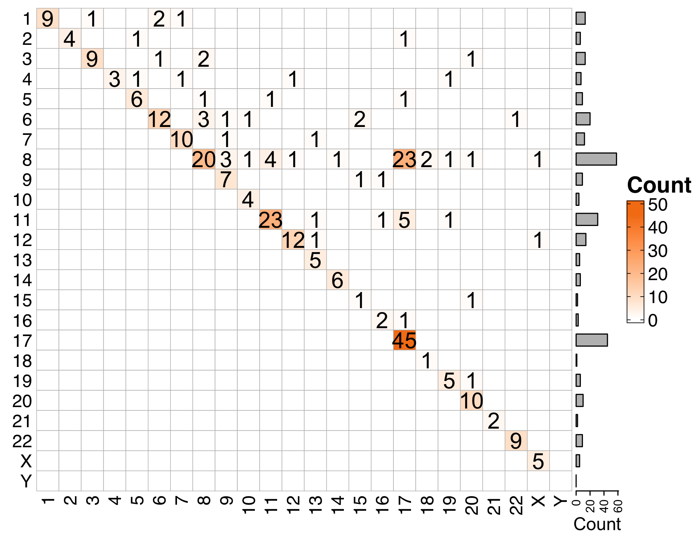

Expression heatmap of recurring fusion-partner genes (partner genes
forming fusions in ≥2 cell lines), showing z-score normalized RNA-seq
expression across the cohort alongside fusion type annotation.

``` r
# SupFig 10B: Recurring fusions expression heatmap
pdf(file.path(DIRS$results_sub$ogm, "SupFig10B_Recurring_Functional_Fusions.pdf"), width = 15, height = 5)
  draw(supfig10b_recurring_fusions_ht, merge_legends = TRUE)
dev.off()
```

    ## quartz_off_screen 
    ##                 2

``` r
draw(supfig10b_recurring_fusions_ht, merge_legends = TRUE)
```

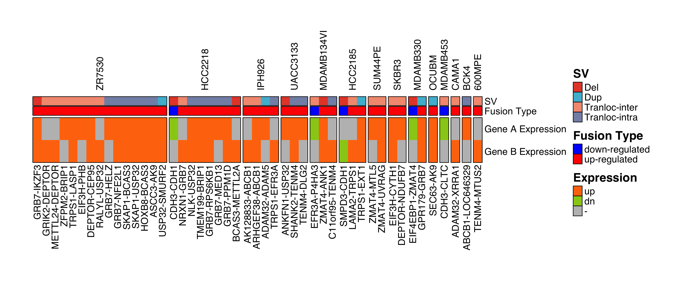

Gene-specific circos plots for each recurrently fused gene

``` r
# SupFig 10C: Recurring gene circos plots
gene_names <- names(recurring_gene_circos)
for (i in seq_along(gene_names)) {
    gene <- gene_names[i]
    pdf_file <- file.path(DIRS$results_sub$ogm, 
                         paste0("SupFig10C_", gene, "_Fusions.pdf"))
    pdf(pdf_file, width = 7, height = 7)
    print(recurring_gene_circos[[gene]])
    dev.off()
}
```

## d. Global Methylation Instability and Epigenetic Regulation of ILC Driver Genes

The orchestrator script `21_Fig4_SupFig11_DNAm_Alterations.R`
performs: 1. **DMI scoring** — sum of absolute β-value deviations from
normal-tissue medians across all shared probes (TCGA adjacent-normal as
reference); pairwise comparisons by two-sided t-test (Holm correction).
2. **Differential methylation** — limma on M-values comparing Luminal A
ILC vs NST in tumors and cell lines (FDR \< 0.05, \|log fold-change\| ≥
0.5). 3. **Differential expression** — DESeq2 on matched RNA-seq (FDR \<
0.05, \|log₂FC\| ≥ 1). 4. **Consensus DNAm-regulated genes** —
intersection of significant differential probes and genes with inverse
DNAm–expression correlation in both tumors and cell lines.

``` r
source(file.path(DIRS$scripts$helpers, "21_Fig4_SupFig11_DNAm_Alterations.R"), chdir = TRUE)
```

    ## ===============================================================================

    ## Section 1: Loading Data

    ## ===============================================================================

    ## Loading Oncovar annotations...

    ## Loading HM450K probe set...

    ## Loading RNA-seq data...

    ## Loading cell line DNA methylation data...

    ## TCGA DNA methylation data already loaded

    ##   Common probes across datasets: 75646

    ## 
    ## ===============================================================================

    ## Section 2: Calculating DMI (DNA Methylation Index)

    ## ===============================================================================

    ##   Step 1: Calculating median DNA methylation in normal samples...

    ##     Calculated median beta for 75646 probes

    ##   Step 2: Calculating Global Methylation Aberration (GMA) scores...

    ##   Patient tumors: 651 samples

    ##   Cell lines: 49 samples

    ##   Step 3: Combining patient and cell line data...

    ##   Step 4: Defining group variables...

    ##   Filtered to 700 samples (Cell Lines: 49. Normal: 98. Patient Tumors: 553. )

    ##   Step 5: Computing DMI z-scores...

    ##   Step 6: Removing outlier normals...

    ##   Removed 12 outlier normal samples

    ##   Step 7: Generating combined histology-type labels...

    ##   ✓ Saved DMI summary to: /Users/oshah/Documents/ICLE/3-Results/DNA_Methylation/DMI_Summary.tsv

    ## 
    ## ===============================================================================

    ## Section 3: DMI Comparisons and Visualizations

    ## ===============================================================================

    ## 
    ## ========================================

    ## SupFig 11A: DMI patient tumors by PAM50

    ## ========================================

    ## 
    ## ========================================

    ## SupFig 11B: DMI cell lines by PAM50

    ## ========================================

    ## 
    ## ========================================

    ## SupFig 11C: DMI by histology

    ## ========================================

    ## 
    ## ========================================

    ## Figure 4A: DMI by tissue source

    ## ========================================

    ##   ✓ SupFig 11 and Fig 4A DMI figures assigned to global environment

    ## 
    ## ===============================================================================

    ## Section 4: Differential Analysis (TCGA and Cell Lines)

    ## ===============================================================================

    ## TCGA DESeq2 Analysis (LumA ILC vs NST)...

    ##   Loading existing TCGA DESeq2 results...

    ##   ✓ TCGA DESeq2: 890 significant DEGs

    ## TCGA Limma Analysis (LumA ILC vs NST)...

    ##   Loading existing TCGA Limma results...

    ##   ✓ TCGA Limma: 3030 significant probes

    ## Cell Line DESeq2 Analysis (Non-Basal ILC vs NST)...

    ##   Loading existing Cell Line DESeq2 results...

    ##   ✓ Cell Line DESeq2: 833 significant DEGs

    ## Cell Line Limma Analysis (Non-Basal ILC vs NST)...

    ##   Loading existing Cell Line Limma results...

    ##   ✓ Cell Line Limma: 23308 significant probes

    ## 
    ## ===============================================================================

    ## Section 5: Identifying Consensus Events Between Cell Lines and Tumors

    ## ===============================================================================

    ## Identifying consensus DGE events...

    ##   Consensus DGE events: 23

    ## Identifying consensus DPM events...

    ##   Consensus DPM events: 854

    ## Merging RNA and DNAm results...

    ## Warning: Returning more (or less) than 1 row per `summarise()` group was deprecated in
    ## dplyr 1.1.0.
    ## ℹ Please use `reframe()` instead.
    ## ℹ When switching from `summarise()` to `reframe()`, remember that `reframe()`
    ##   always returns an ungrouped data frame and adjust accordingly.
    ## Call `lifecycle::last_lifecycle_warnings()` to see where this warning was
    ## generated.

    ## `summarise()` has grouped output by 'gene'. You can override using the
    ## `.groups` argument.

    ##   ✓ Identified 46 DNAm-regulated genes

    ## Adding annotations and expression/methylation values...

    ## Identifying consensus genes...

    ##   ✓ Identified 7 consensus genes

    ## 
    ## ========================================

    ## Figure 4B: DNAm-mRNA alterations scatter plot

    ## ========================================

    ##   ✓ Fig 4B complete (dnma_lfc_plt assigned).

    ## 
    ## ========================================

    ## Figure 4C: Consensus DNAm-mRNA alterations heatmap

    ## ========================================

    ##   ✓ Fig 4C complete (fig4c_ht assigned).

    ## 
    ## ========================================

    ## Figure 4D: MSI1 and TFAP2B expression and DNAm barplots

    ## ========================================

    ##   ✓ Fig 4D complete (fig4e assigned).

    ## 
    ## ===============================================================================

    ## Section 9: Saving Results

    ## ===============================================================================

    ##   ✓ Saved TCGA_DNAm_Regulated_Genes.csv to: /Users/oshah/Documents/ICLE/3-Results/DNA_Methylation/TCGA_DNAm_Regulated_Genes.csv

    ## 
    ## ===============================================================================

    ## Script 22 completed successfully!

    ## ===============================================================================

    ##   All figures assigned to global environment for saving in Main_Data_Analysis.Rmd

    ##   - SupFig11: tumor_pam50, cl_pam50, tumor_cl_histology_LumA

    ##   - Fig4A: tissue_dmi

    ##   - Fig4B: dnma_lfc_plt

    ##   - Fig4C: fig4c_ht

    ##   - Fig4D: fig4e

### SupFig 11: DNAm Instability Score (DMI) by PAM50 Subtype and Histology

``` r
ggsave(file.path(dnam_dir, "SupFig11A_DMI_Tumor_PAM50.pdf"), tumor_pam50, width = 5, height = 3)

pdf(file.path(dnam_dir, "SupFig11A_DMI_Tumor_PAM50_pvalue_table.pdf"), width = 10, height = 10)
  gridExtra::grid.table(signif(SupFig11A_pval_table, 1))
dev.off()
```

    ## quartz_off_screen 
    ##                 2

``` r
tumor_pam50
```

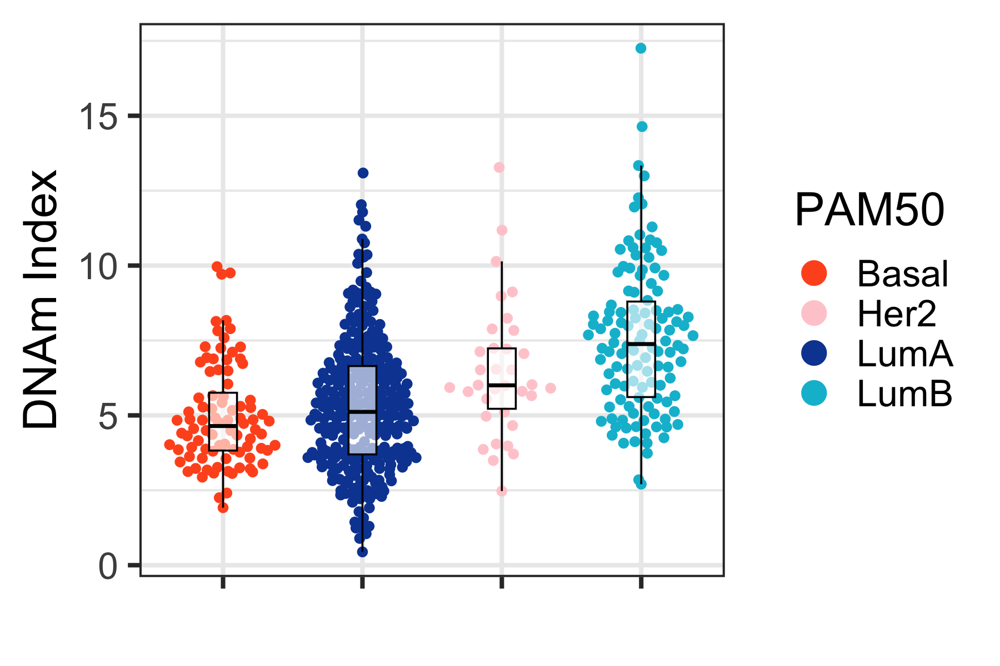

``` r
ggsave(file.path(dnam_dir, "SupFig11B_DMI_CL_PAM50.pdf"), cl_pam50, width = 5, height = 3)

pdf(file.path(dnam_dir, "SupFig11B_DMI_CL_PAM50_pvalue_table.pdf"), width = 10, height = 10)
  gridExtra::grid.table(signif(SupFig11B_pval_table, 1))
dev.off()
```

    ## quartz_off_screen 
    ##                 2

``` r
cl_pam50
```

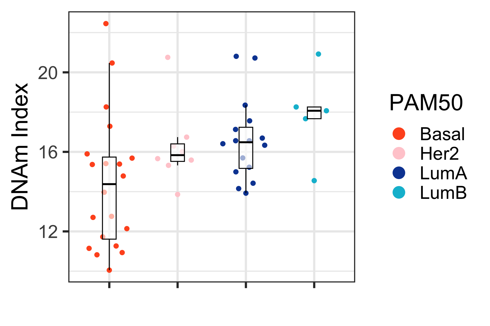

``` r
ggsave(file.path(dnam_dir, "SupFig11C_DMI_Tumor_CL_Histology.pdf"), tumor_cl_histology_LumA, width = 4, height = 3)

pdf(file.path(dnam_dir, "SupFig11C_DMI_Tumor_CL_Histology_pvalues_table.pdf"), width = 10, height = 10)
  gridExtra::grid.table(signif(SupFig11C_pval_table, 1))
dev.off()
```

    ## quartz_off_screen 
    ##                 2

``` r
tumor_cl_histology_LumA
```

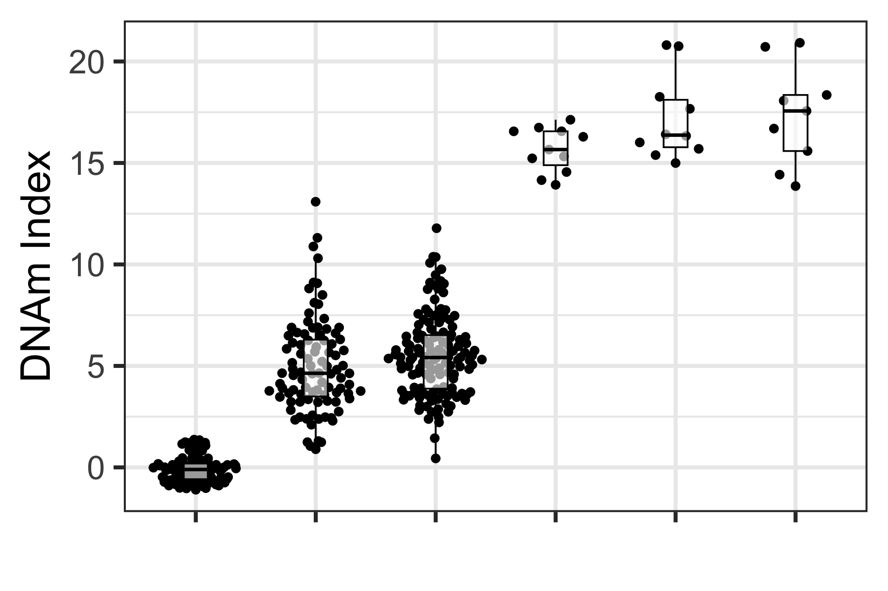

### Figure 4A: DNAm Instability Score (DMI) by Specimen Type

Violin/box plot of DMI scores stratified by specimen type: normal breast
tissue, TCGA primary BRCA tumors (ILC and NST), and integrated BRCA cell
lines (ILC-like and NST). Demonstrates progressively elevated
methylation instability from normal tissue through primary tumors to
cell lines.

``` r
ggsave(file.path(DIRS$results_sub$dna_methylation, "Fig4A_DMI_Normal_Tumor_CL.pdf"), 
       tissue_dmi, width = 5, height = 3)
gt::gtsave(tissue_dmi_pval, file.path(DIRS$results_sub$dna_methylation, "Fig4A_DMI_Normal_Tumor_CL_pvalue_table.pdf"))
```

    ## file:////var/folders/7y/k10bb0_97t74ng9htslfjpk40000gr/T//Rtmpc117E4/file8db74c397f88.html screenshot completed

``` r
tissue_dmi
```

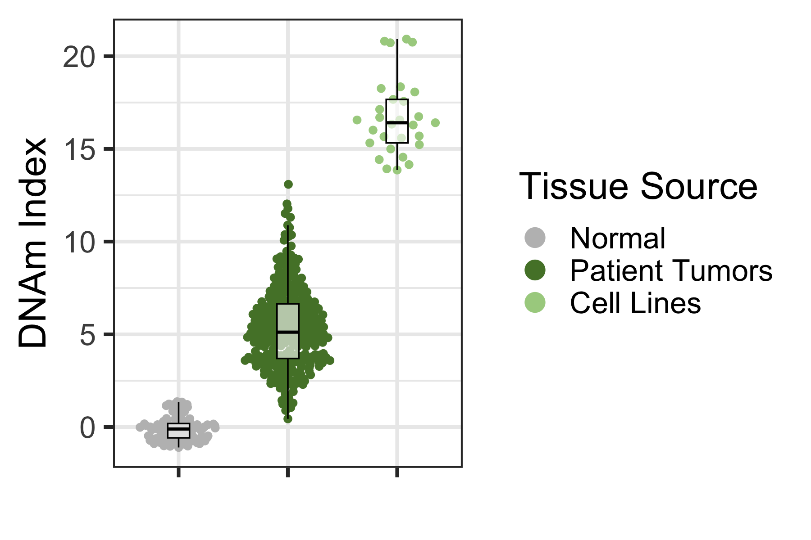

### Figure 4B: Consensus DNAm–mRNA Alterations (Patient Tumors and Cell Lines)

Scatter plot of genes with concordant differential methylation and gene
expression in Luminal A ILC vs NST, comparing results in TCGA tumors and
integrated BRCA cell lines. Points in the highlighted quadrants
represent consensus genes with inverse probe methylation and mRNA
expression changes.

``` r
ggsave(file.path(DIRS$results_sub$dna_methylation, "Fig4B_Tumor_RNA_DNAm_Alterations_small_height.pdf"),
       dnma_lfc_plt, width = 6, height = 5)
dnma_lfc_plt
```

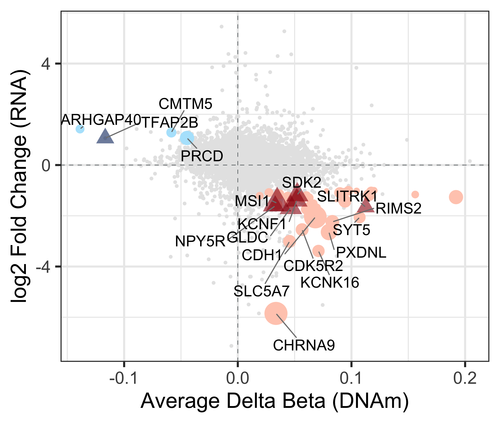

### Figure 4C: Consensus DNAm-Regulated Genes

Heatmap displaying consensus DNAm-regulated genes (from Fig 4B) across
TCGA tumors and integrated BRCA cell lines.

``` r
pdf(file.path(DIRS$results_sub$dna_methylation, "Fig4C_Alterations_Heatmap.pdf"), width = 10, height = 5)
  draw(fig4c_ht, merge_legends = TRUE, gap = unit(0.1, "cm"))
dev.off()
```

    ## quartz_off_screen 
    ##                 2

``` r
draw(fig4c_ht, merge_legends = TRUE, gap = unit(0.1, "cm"))
```

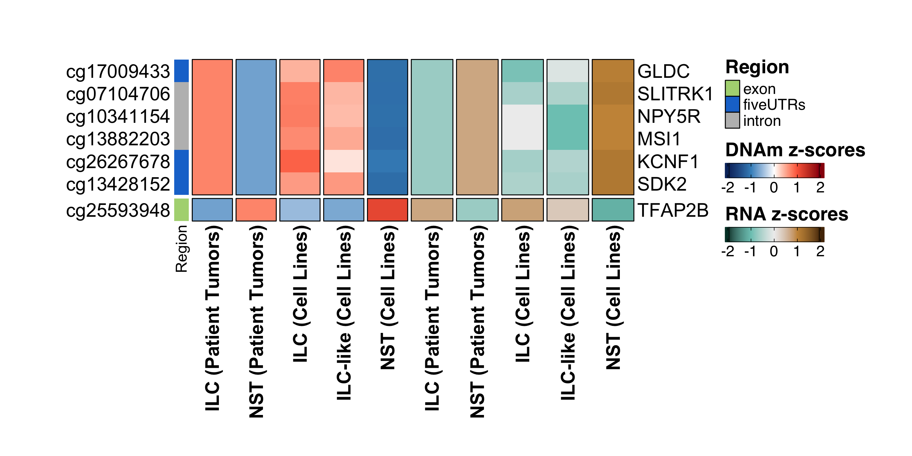

### Figure 4D: Top Consensus DNAm-Regulated Genes — Expression and Methylation Barplots

Paired barplots showing row normalized RNA expression and DNAm for
*MSI1* and *TFAP2B* across BRCA cell lines.

``` r
ggsave(file.path(DIRS$results_sub$dna_methylation, "Fig4D_Top_Alterations_Barplots.pdf"), fig4e, width = 12, height = 10)
fig4e
```

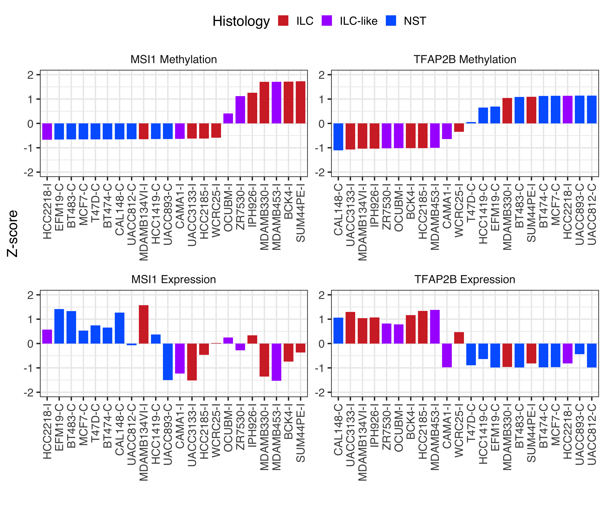

## e. Identification of ILC-Specific Gene Dependencies and Nomination of Druggable Targets

Identifies ILC-specific gene dependencies from the Marcotte et al. RNAi
loss-of-function screen using a consensus two-pipeline approach: (1)
**Limma-D2** — DEMETER2-preprocessed RNAi viability scores (DepMap)
followed by limma differential analysis; (2) **siMEM** — integrated
preprocessing and differential analysis using the siMEM algorithm
(Marcotte et al. 2016). Consensus dependencies are defined as genes with
nominal p ≤ 0.05 in both pipelines. High- and low-dependency gene sets
are then subjected to KEGG pathway over-representation analysis (hypeR)
and queried against DGIdb to nominate therapeutic targets.

``` r
source(file.path(DIRS$scripts$helpers, "22_Fig5_RNAi_Differential_Dependencies.R"), chdir = TRUE)
```

    ## ===============================================================================

    ## Section 2: Loading RNAi Data

    ## ===============================================================================

    ## Loading RNAi data...

    ## New names:
    ## ✓ Loaded 15256 genes across 19 cell lines
    ## ===============================================================================
    ## Section 3: SIMEM Differential Analysis
    ## ===============================================================================
    ## Loading existing SIMEM results...
    ## ✓ Loaded SIMEM results for 14730 genes
    ## ===============================================================================
    ## Section 4: D2 Differential Analysis
    ## ===============================================================================
    ## ✓ Analyzed 13607 genes
    ## ===============================================================================
    ## Section 5: Computing Consensus Dependencies
    ## ===============================================================================
    ## ✓ Consensus dependencies: 93
    ## Adding drug-gene interaction information...
    ## • `` -> `...1`

    ## Warning in .fun(.value[0], ...): no non-missing arguments to max; returning
    ## -Inf

    ##   ✓ Added DGI information for 2396 genes
    ##   ✓ Saved results to: /Users/oshah/Documents/ICLE/3-Results/Gene_Dependencies/RNAi_ILC_Consensus_Dependencies.tsv
    ## 
    ## ========================================
    ## Figure 5B: Consensus dependencies scatter plot
    ## ========================================

    ## Warning: Using `size` aesthetic for lines was deprecated in ggplot2 3.4.0.
    ## ℹ Please use `linewidth` instead.
    ## This warning is displayed once every 8 hours.
    ## Call `lifecycle::last_lifecycle_warnings()` to see where this warning was
    ## generated.

    ##   ✓ Fig 5B complete (fig5b_consensus_dep_plt assigned).
    ## 
    ## ========================================
    ## SupFig 12: Consensus dependencies heatmap
    ## ========================================
    ##   ✓ SupFig 12 complete (supfig12_dep_ht assigned).
    ## 
    ## ========================================
    ## Figure 5C: KEGG pathway enrichment
    ## ========================================

    ## Warning: Vectorized input to `element_text()` is not officially supported.
    ## ℹ Results may be unexpected or may change in future versions of ggplot2.

    ## Warning in geom_text(aes(x = 0.05), size = fontsize, face = "bold", hjust = 0,
    ## : Ignoring unknown parameters: `face`

    ## Scale for x is already present.
    ## Adding another scale for x, which will replace the existing scale.

    ## Warning in geom_text(aes(x = 0.05), size = fontsize, face = "bold", hjust = 0,
    ## : Ignoring unknown parameters: `face`

    ## Scale for x is already present.
    ## Adding another scale for x, which will replace the existing scale.

    ## Warning: Removed 2 rows containing missing values or values outside the scale range
    ## (`geom_text()`).

    ##   ✓ Fig 5C complete (fig5c_pathway_plt assigned).
    ## 
    ## ========================================
    ## Figure 5D: Pathway level dependencies heatmap
    ## ========================================
    ##   ✓ Fig 5D complete (fig5d_pathway_ht assigned).
    ## 
    ## ========================================
    ## Figure 5E: Druggable dependencies heatmap
    ## ========================================
    ##   ✓ Fig 5E complete (fig5e_drug_ht assigned).
    ## 
    ## ========================================
    ##   Figure 5 (5B–5E) and SupFig 12 complete
    ## ========================================
    ##   - Fig 5B: fig5b_consensus_dep_plt
    ##   - SupFig 12: supfig12_dep_ht
    ##   - Fig 5C: fig5c_pathway_plt
    ##   - Fig 5D: fig5d_pathway_ht
    ##   - Fig 5E: fig5e_drug_ht

### Figure 5A: ILC-Specific Dependency Analysis — Study Schematic

``` r
# Figure 5A is a schematic/workflow illustration produced in Adobe Illustrator.
# Overview schematic of the dual-pipeline ILC dependency discovery workflow (Limma-D2 and siMEM) and the downstream druggability Prioritization strategy.
```

------------------------------------------------------------------------

### Figure 5B: Consensus ILC-Specific Differential Dependencies

Scatter plot showing effect sizes of differential dependencies (ILC vs
NST cell lines) from Limma-D2 and siMEM pipelines. Point colors
highlight dependencies identified as significant by both (consensus) or
only one of the two pipelines.

``` r
ggsave(file.path(DIRS$results_sub$dependencies, "Fig5b_Differential_Dependencies.pdf"),
       fig5b_consensus_dep_plt, width = 8, height = 4.5)
fig5b_consensus_dep_plt
```

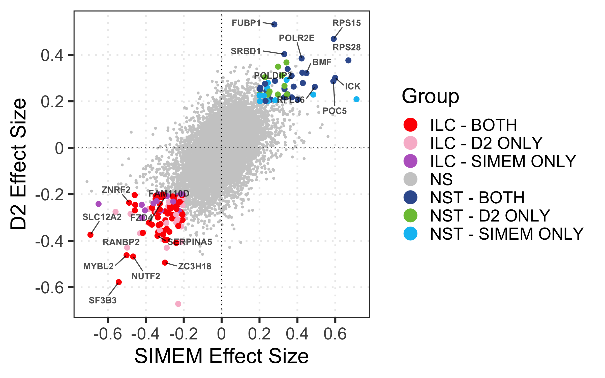

### SupFig 12: Consensus Differential Dependencies Heatmap

Hierarchically clustered heatmap of all consensus ILC-specific
differential dependency genes across Marcotte et al. RNAi cell lines,
annotated by histological subtype (ILC, NST).

``` r
pdf(file.path(DIRS$results_sub$dependencies, "SupFig12_Consensus_Dependencies_Heatmap.pdf"), 
    width = 7.5, height = 16)
  draw(supfig12_dep_ht, merge_legends = TRUE, heatmap_legend_side = "bottom")
dev.off()
```

    ## quartz_off_screen 
    ##                 2

``` r
draw(supfig12_dep_ht, merge_legends = TRUE, heatmap_legend_side = "bottom")
```

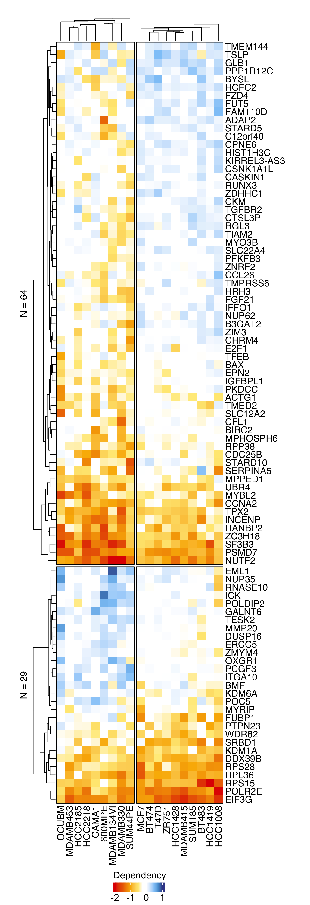

### Figure 5C: KEGG Pathway Over-Representation in ILC-Specific Dependency Genes

Barplot showing hypergeometric over-representation analysis of KEGG
pathways in ILC vs NST differential dependencies.

``` r
ggsave(file.path(DIRS$results_sub$dependencies, "Fig5C_KEGG_ORA.pdf"), fig5c_pathway_plt, width = 6, height = 3.5)
fig5c_pathway_plt
```

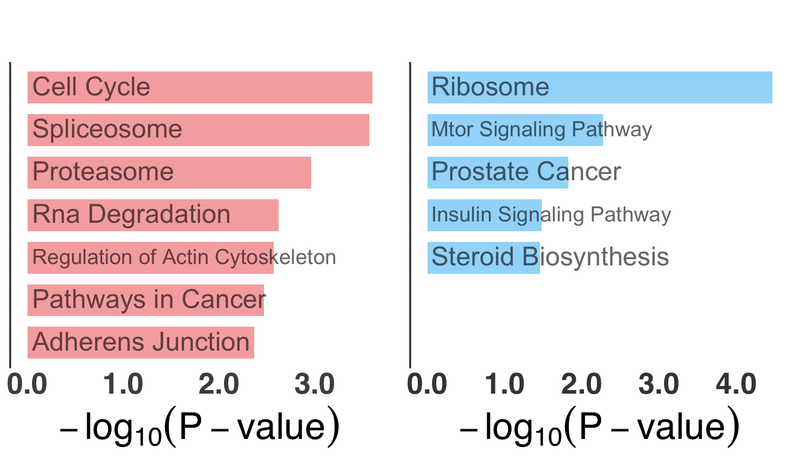

### Figure 5D: Pathway-Level Dependency Scores

Heatmap of pathway-level summary dependency scores (mean gene-level
dependency/viability scores per KEGG pathway) across cell lines,
stratified by ILC vs NST histology. Condenses gene-level signals into
interpretable pathway vulnerabilities.

``` r
pdf(file.path(DIRS$results_sub$dependencies, "Fig5D_Pathway_Scores.pdf"), width = 7.5, height = 5)
  draw(fig5d_pathway_ht, merge_legends = TRUE, heatmap_legend_side = "bottom")
dev.off()
```

    ## quartz_off_screen 
    ##                 2

``` r
draw(fig5d_pathway_ht, merge_legends = TRUE, heatmap_legend_side = "bottom")
```

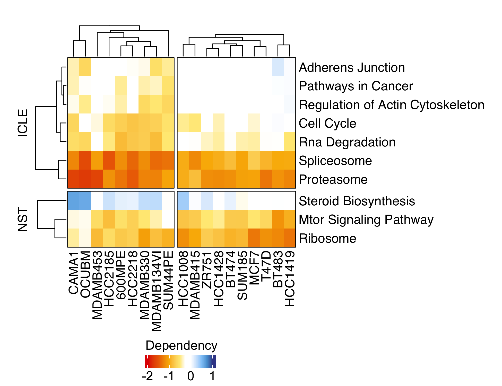

### Figure 5E: Druggable ILC Dependencies — Prioritized Therapeutic Targets

Heatmap of the top ILC-specific dependency genes with annotated drug
interactions from the Drug Gene Interaction database (DGIdb; Wagner et
al. 2016).

``` r
pdf(file.path(DIRS$results_sub$dependencies, "Fig5E_ILC_Druggable_Dependencies.pdf"), width = 7.5, height = 5)
  draw(fig5e_drug_ht, merge_legends = TRUE, heatmap_legend_side = "bottom")
dev.off()
```

    ## quartz_off_screen 
    ##                 2

``` r
draw(fig5e_drug_ht, merge_legends = TRUE, heatmap_legend_side = "bottom")
```

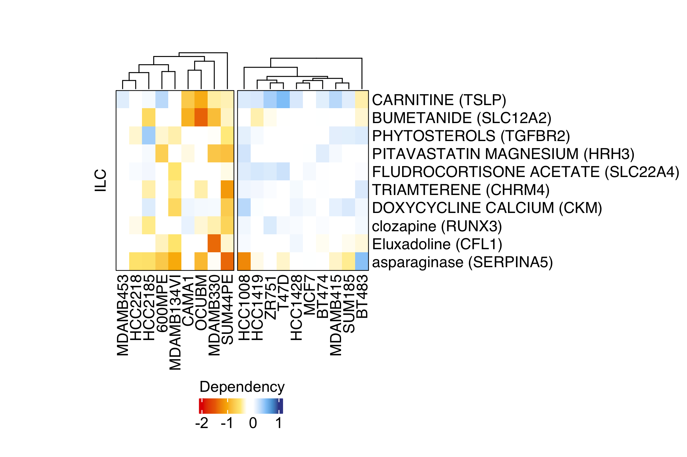

## f. Integrative Multi-omic Benchmarking Framework for ILC Model Selection

### Figure 6: CL–tumor Concordance / Molecular Resemblance Scores

Implements the two-step multi-omic molecular resemblance framework to
quantify the fidelity of each ICLE cell line to Luminal A ILC patient
tumors:

**Step 1 — ILC tumor signatures** (TCGA Luminal A ILC vs NST as
reference): - *RNA, DNAm, RPPA*: discriminatory features identified by
differential analysis (DESeq2 / limma); ILC tumor centroids constructed
by averaging normalizd feature values across TCGA ILC tumors. - *CN*:
chromosome-level centroid restricted to OncoVar pathogenic cancer driver
genes. - *MUT*: curated ILC-enriched and NST-enriched alteration lists.

**Step 2 — Cell line concordance scoring**: - *Continuous modalities
(RNA, DNAm, RPPA)*: bootstrapped Spearman correlation (1,000 iterations,
80% feature subsampling) between cell line profile and ILC tumor
centroid; final score = median. - *CN*: bootstrapped correlation (1,000
iterations, one driver gene randomly sampled per chromosome). - *MUT*:
frequency-centred score rewarding ILC-enriched and penalising
NST-enriched events. - All modality scores rank-normalizd to \[0, 1\];
**Consensus Resemblance Score** = equally weighted mean.

``` r
# Generate resemblance scores between cell lines and tumors
source(file.path(DIRS$scripts$helpers, "23_Fig6_Patient_Signatures_Resemblance_Scores.R"), chdir = TRUE)
```

    ## ===============================================================================

    ## Selecting Patient and Cell Line Subsets

    ## ===============================================================================

    ##   ILC tumors: 106

    ##   NST tumors: 201

    ##   Cell lines: 39

    ## 
    ## ===============================================================================

    ## PART 1: Computing Patient-Derived Signatures from TCGA

    ## ===============================================================================

    ## 
    ## 1.1 Computing CNV signature...

    ##   ✓ Saved CNV gene annotation to: /Users/oshah/Documents/ICLE/3-Results/Molecular_Resemblance/ILC_Signatures/ILC_CNV_Genes.tsv

    ## 
    ## 1.2 Computing Alterations signature...

    ##   ✓ Saved alterations signature to: /Users/oshah/Documents/ICLE/3-Results/Molecular_Resemblance/ILC_Signatures/ILC_Alterations.tsv

    ## 
    ## 1.3 Computing RNA signature...

    ##   ✓ Saved RNA signature to: /Users/oshah/Documents/ICLE/3-Results/Molecular_Resemblance/ILC_Signatures/ILC_DEGs.tsv

    ## 
    ## 1.4 Computing DNAm signature...

    ##   ✓ Saved DNAm signature to: /Users/oshah/Documents/ICLE/3-Results/Molecular_Resemblance/ILC_Signatures/ILC_DNAm_Probes.tsv

    ## 
    ## 1.5 Computing RPPA signature...

    ##   ✓ Saved RPPA signature to: /Users/oshah/Documents/ICLE/3-Results/Molecular_Resemblance/ILC_Signatures/ILC_DEPs.tsv

    ## 
    ## ===============================================================================

    ## PART 1 Complete: All patient-derived signatures saved to files

    ## ===============================================================================

    ## 
    ## ===============================================================================

    ## PART 2: Scoring Cell Lines and Computing Consensus

    ## ===============================================================================

    ## 
    ## 2.1 Computing CNV resemblance scores...

    ##   ✓ CNV scores computed for 38 cell lines

    ## 
    ## 2.2 Computing Alterations resemblance scores...

    ##   ✓ Alterations scores computed for 38 cell lines

    ## 
    ## 2.3 Computing RNA resemblance scores...

    ##   ✓ RNA scores computed for 39 cell lines

    ## 
    ## 2.4 Computing DNAm resemblance scores...

    ##   ✓ DNAm scores computed for 34 cell lines

    ## 
    ## 2.5 Computing RPPA resemblance scores...

    ##   ✓ RPPA scores computed for 37 cell lines

    ## 
    ## 2.6 Combining scores and computing consensus...

    ##   ✓ Saved resemblance scores to: /Users/oshah/Documents/ICLE/3-Results/Molecular_Resemblance/Resemblance_Scores.tsv

    ## 
    ## ========================================

    ## Figure 6: Resemblance scores heatmap

    ## ========================================

    ## Warning: Heatmap/annotation names are duplicated: Score

    ##   ✓ Fig 6 complete (fig6_resemblance_ht and signature heatmaps assigned).

``` r
# Save per-modality ILC signature heatmaps (CN, MUT, RNA, DNAm, RPPA)
# Each heatmap shows the discriminatory features defining the ILC tumor centroid
pdf(file = file.path(DIRS$results_sub$molecular_resemblance, "Fig6_ILC_CN_Signature.pdf"), width = 6, height = 6)
draw(cn_sig_ht)
dev.off()
```

    ## quartz_off_screen 
    ##                 2

``` r
pdf(file = file.path(DIRS$results_sub$molecular_resemblance, "Fig6_ILC_Alteration_Signature.pdf"), width = 6, height = 6)
draw(mut_sig_ht)
dev.off()
```

    ## quartz_off_screen 
    ##                 2

``` r
pdf(file = file.path(DIRS$results_sub$molecular_resemblance, "Fig6_ILC_DNAm_Signature.pdf"), width = 6, height = 6)
draw(dnam_sign_ht)
dev.off()
```

    ## quartz_off_screen 
    ##                 2

``` r
pdf(file = file.path(DIRS$results_sub$molecular_resemblance, "Fig6_ILC_RNA_Signature.pdf"), width = 6, height = 6)
draw(rna_sign_ht)
dev.off()
```

    ## quartz_off_screen 
    ##                 2

``` r
pdf(file = file.path(DIRS$results_sub$molecular_resemblance, "Fig6_ILC_rppa_Signature.pdf"), width = 6, height = 6)
draw(rppa_sig_ht)
dev.off()
```

    ## quartz_off_screen 
    ##                 2

``` r
# Consensus resemblance score heatmap — columns = ICLE cell lines; rows = modality scores + consensus
# Higher scores (yellow) indicate greater fidelity to Luminal A ILC patient tumors
pdf(file.path(DIRS$results_sub$molecular_resemblance, "Fig6_Resemblance_Scores.pdf"), width = 6, height = 5)
   draw(fig6_resemblance_ht, merge_legends = TRUE, annotation_legend_side = "right", 
        heatmap_legend_side = "right")
dev.off()
```

    ## quartz_off_screen 
    ##                 2

``` r
# Display figure
draw(fig6_resemblance_ht, merge_legends = TRUE, annotation_legend_side = "right", 
     heatmap_legend_side = "right")
```

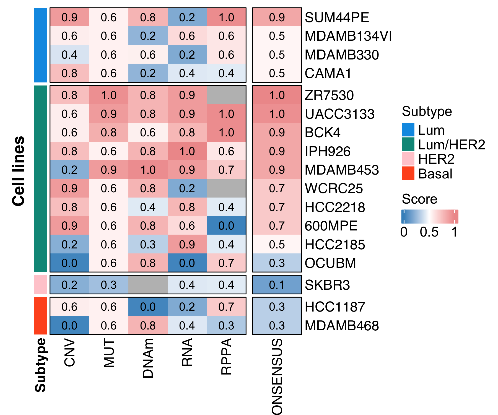

``` r
sessionInfo()
```

    ## R version 4.5.1 (2025-06-13)
    ## Platform: aarch64-apple-darwin20
    ## Running under: macOS Tahoe 26.2
    ## 
    ## Matrix products: default
    ## BLAS:   /Library/Frameworks/R.framework/Versions/4.5-arm64/Resources/lib/libRblas.0.dylib 
    ## LAPACK: /Library/Frameworks/R.framework/Versions/4.5-arm64/Resources/lib/libRlapack.dylib;  LAPACK version 3.12.1
    ## 
    ## locale:
    ## [1] en_US.UTF-8/en_US.UTF-8/en_US.UTF-8/C/en_US.UTF-8/en_US.UTF-8
    ## 
    ## time zone: America/Chicago
    ## tzcode source: internal
    ## 
    ## attached base packages:
    ## [1] stats4    grid      stats     graphics  grDevices utils     datasets 
    ## [8] methods   base     
    ## 
    ## other attached packages:
    ##  [1] msigdbr_25.1.1              hypeR_2.0.0                
    ##  [3] tidytext_0.4.3              patchwork_1.3.2            
    ##  [5] sesame_1.26.0               sesameData_1.26.0          
    ##  [7] ExperimentHub_2.16.1        AnnotationHub_3.16.1       
    ##  [9] BiocFileCache_2.16.2        dbplyr_2.5.1               
    ## [11] limma_3.64.3                DESeq2_1.48.2              
    ## [13] webshot2_0.1.2              htmlwidgets_1.6.4          
    ## [15] interacCircos_1.18.0        hiAnnotator_1.42.0         
    ## [17] gridExtra_2.3               ShatterSeek_1.1            
    ## [19] graph_1.86.0                foreach_1.5.2              
    ## [21] scales_1.4.0                ggsci_4.1.0                
    ## [23] gt_1.1.0                    ggpattern_1.2.1            
    ## [25] clusterProfiler_4.16.0      org.Hs.eg.db_3.21.0        
    ## [27] AnnotationDbi_1.70.0        CancerSubtypes_1.17.1      
    ## [29] NMF_0.28                    cluster_2.1.8.1            
    ## [31] rngtools_1.5.2              registry_0.5-1             
    ## [33] sigclust_1.1.0.1            tidyr_1.3.1                
    ## [35] forcats_1.0.1               circlize_0.4.16            
    ## [37] ConsensusClusterPlus_1.72.0 SummarizedExperiment_1.38.1
    ## [39] Biobase_2.68.0              MatrixGenerics_1.20.0      
    ## [41] matrixStats_1.5.0           BreastSubtypeR_1.0.0       
    ## [43] viridis_0.6.5               viridisLite_0.4.2          
    ## [45] data.table_1.17.8           readxl_1.4.5               
    ## [47] maftools_2.24.0             stringr_1.5.2              
    ## [49] ggrepel_0.9.6               rtracklayer_1.68.0         
    ## [51] GenomicRanges_1.60.0        GenomeInfoDb_1.44.3        
    ## [53] IRanges_2.42.0              S4Vectors_0.46.0           
    ## [55] BiocGenerics_0.54.1         generics_0.1.4             
    ## [57] magrittr_2.0.4              DNAcopy_1.82.0             
    ## [59] vroom_1.6.6                 reshape2_1.4.4             
    ## [61] ggsankey_0.0.99999          dplyr_1.1.4                
    ## [63] ComplexHeatmap_2.24.1       ggthemes_5.1.0             
    ## [65] ggpubr_0.6.2                ggplot2_4.0.0              
    ## 
    ## loaded via a namespace (and not attached):
    ##   [1] R.methodsS3_1.8.2        dichromat_2.0-0.1        Biostrings_2.76.0       
    ##   [4] vctrs_0.6.5              ggtangle_0.0.7           digest_0.6.37           
    ##   [7] png_0.1-8                shape_1.4.6.1            proxy_0.4-27            
    ##  [10] magick_2.9.0             MASS_7.3-65              httpuv_1.6.16           
    ##  [13] qvalue_2.40.0            withr_3.0.2              xfun_0.53               
    ##  [16] ggfun_0.2.0              survival_3.8-3           memoise_2.0.1           
    ##  [19] ggbeeswarm_0.7.2         gson_0.1.0               systemfonts_1.3.1       
    ##  [22] ragg_1.5.0               tidytree_0.4.6           GlobalOptions_0.1.2     
    ##  [25] R.oo_1.27.1              Formula_1.2-5            KEGGREST_1.48.1         
    ##  [28] promises_1.4.0           otel_0.2.0               httr_1.4.7              
    ##  [31] rstatix_0.7.3            restfulr_0.0.16          ps_1.9.1                
    ##  [34] rstudioapi_0.17.1        UCSC.utils_1.4.0         units_1.0-0             
    ##  [37] DOSE_4.2.0               processx_3.8.6           babelgene_22.9          
    ##  [40] curl_7.0.0               polyclip_1.10-7          GenomeInfoDbData_1.2.14 
    ##  [43] SparseArray_1.8.1        xtable_1.8-4             doParallel_1.0.17       
    ##  [46] reactable_0.4.4          evaluate_1.0.5           S4Arrays_1.8.1          
    ##  [49] preprocessCore_1.70.0    hms_1.1.4                visNetwork_2.1.4        
    ##  [52] colorspace_2.1-2         filelock_1.0.3           readr_2.1.5             
    ##  [55] later_1.4.4              ggtree_3.16.3            lattice_0.22-7          
    ##  [58] XML_3.99-0.19            cowplot_1.2.0            class_7.3-23            
    ##  [61] pillar_1.11.1            nlme_3.1-168             iterators_1.0.14        
    ##  [64] gridBase_0.4-7           compiler_4.5.1           stringi_1.8.7           
    ##  [67] sf_1.0-21                tokenizers_0.3.0         GenomicAlignments_1.44.0
    ##  [70] plyr_1.8.9               crayon_1.5.3             abind_1.4-8             
    ##  [73] BiocIO_1.18.0            gridGraphics_0.5-1       locfit_1.5-9.12         
    ##  [76] bit_4.6.0                chromote_0.5.1           fastmatch_1.1-6         
    ##  [79] codetools_0.2-20         textshaping_1.0.4        e1071_1.7-16            
    ##  [82] GetoptLong_1.0.5         mime_0.13                splines_4.5.1           
    ##  [85] Rcpp_1.1.0               iCluster_2.1.0           cellranger_1.1.0        
    ##  [88] knitr_1.51               blob_1.2.4               clue_0.3-66             
    ##  [91] BiocVersion_3.21.1       fs_1.6.6                 openxlsx_4.2.8          
    ##  [94] ggsignif_0.6.4           ggplotify_0.1.3          tibble_3.3.0            
    ##  [97] Matrix_1.7-4             statmod_1.5.1            tzdb_0.5.0              
    ## [100] svglite_2.2.2            tweenr_2.0.3             pkgconfig_2.0.3         
    ## [103] pheatmap_1.0.13          tools_4.5.1              cachem_1.1.0            
    ## [106] RSQLite_2.4.3            DBI_1.2.3                impute_1.82.0           
    ## [109] fastmap_1.2.0            rmarkdown_2.30           Rsamtools_2.24.1        
    ## [112] broom_1.0.10             sass_0.4.10              BiocManager_1.30.26     
    ## [115] carData_3.0-5            farver_2.1.2             yaml_2.3.10             
    ## [118] cli_3.6.5                purrr_1.1.0              lifecycle_1.0.4         
    ## [121] backports_1.5.0          BiocParallel_1.42.2      gtable_0.3.6            
    ## [124] rjson_0.2.23             parallel_4.5.1           ape_5.8-1               
    ## [127] SnowballC_0.7.1          jsonlite_2.0.0           bitops_1.0-9            
    ## [130] kableExtra_1.4.0         bit64_4.6.0-1            assertthat_0.2.1        
    ## [133] yulab.utils_0.2.1        zip_2.3.3                janeaustenr_1.0.0       
    ## [136] GOSemSim_2.34.0          R.utils_2.13.0           lazyeval_0.2.2          
    ## [139] shiny_1.11.1             htmltools_0.5.8.1        enrichplot_1.28.4       
    ## [142] GO.db_3.21.0             rappdirs_0.3.3           glue_1.8.0              
    ## [145] XVector_0.48.0           RCurl_1.98-1.17          treeio_1.32.0           
    ## [148] classInt_0.4-11          BSgenome_1.76.0          igraph_2.2.1            
    ## [151] R6_2.6.1                 labeling_0.4.3           aplot_0.2.9             
    ## [154] DelayedArray_0.34.1      tidyselect_1.2.1         vipor_0.4.7             
    ## [157] ggforce_0.5.0            xml2_1.4.1               car_3.1-3               
    ## [160] wheatmap_0.2.0           KernSmooth_2.23-26       S7_0.2.0                
    ## [163] gridpattern_1.3.1        websocket_1.4.4          fgsea_1.34.2            
    ## [166] RColorBrewer_1.1-3       rlang_1.1.6              Cairo_1.7-0             
    ## [169] beeswarm_0.4.0
