ICLE_Data_Analysis
================
Osama Shiraz Shah
2026-02-18

- [ICLE\_Data\_Analysis](#icle_data_analysis)
- [Publication and Data Availability](#publication-and-data-availability)
- [Analysis overview and downstream workflow](#analysis-overview-and-downstream-workflow)
- [Future directions](#future-directions)
- [1. Preparation](#1-preparation)
  - [Analysis Options](#analysis-options)
  - [Setup Environment](#setup-environment)
  - [Load All Data](#load-all-data)
- [2. Manuscript Figures](#2-manuscript-figures)
  - [a. ICLE Characterization \& Molecular Subtyping](#a-icle-characterization--molecular-subtyping)
    - [SupFig 1: Genotypic Similarity](#supfig-1-genotypic-similarity)
    - [Perform Molecular Subtyping](#perform-molecular-subtyping)
    - [Figure 1B: Overview of Multiomics Subtypes](#figure-1b-overview-of-multiomics-subtypes)
    - [Figure 1C: SET Signature](#figure-1c-set-signature)
    - [Figure 1D: Multiomics Overview](#figure-1d-multiomics-overview)
    - [Fig 1E: IGV Plot](#fig-1e-igv-plot)
    - [Figure 1F: Alteration Frequency Barplots](#figure-1f-alteration-frequency-barplots)
    - [SupFig 5: Key ILC vs NST Alterations (Patient Tumors)](#supfig-5-key-ilc-vs-nst-alterations-patient-tumors)
    - [SupFig 6: Alterations in Key Pathways (ICLE)](#supfig-6-alterations-in-key-pathways-icle)
  - [b. CDH1 Alteration Landscape](#b-cdh1-alteration-landscape)
    - [Figure 2B: Novel SV in ICLE](#figure-2b-novel-sv-in-icle)
    - [Figure 2C: Exonic Deletions in ICLE](#figure-2c-exonic-deletions-in-icle)
    - [Figure 2D: CDH1 Alterations (Foundation Medicine Dataset)](#figure-2d-cdh1-alterations-foundation-medicine-dataset)
    - [Figure 2E: CDH1 Mutation Lollipop Plots (TCGA Patient Tumors vs Cell Lines)](#figure-2e-cdh1-mutation-lollipop-plots-tcga-patient-tumors-vs-cell-lines)
    - [Figure 2F: CDH1 Allele Frequency in Cell Lines](#figure-2f-cdh1-allele-frequency-in-cell-lines)
    - [Figure 2G: CDH1 Alterations (Patient Tumors vs Cell Lines)](#figure-2g-cdh1-alterations-patient-tumors-vs-cell-lines)
    - [Figure 2H: CDH1 Molecular Alteration Landscape Summary](#figure-2h-cdh1-molecular-alteration-landscape-summary)
  - [c. SV Analysis](#csv-analysis)
    - [Figure 3A (left): ICLE Genomic Instability Metrics](#figure-3a-left-icle-genomic-instability-metrics)
    - [Figure 3A (right): ICLE SV Overview](#figure-3a-right-icle-sv-overview)
    - [Figure 3B: Chromosomal Topography of Translocation Breakpoints](#figure-3b-chromosomal-topography-of-translocation-breakpoints)
    - [Figure 3C: Chromothripsis Landscape](#figure-3c-chromothripsis-landscape)
    - [Figure 3D: Generate Cricos Plots for BCK4, 600MPE, HCC2185 and ZR7530](#figure-3d-generate-cricos-plots-for-bck4-600mpe-hcc2185-and-zr7530)
    - [Figure 3E: Fusions Distribution in Cell Lines vs Patient Tumors](#figure-3e-fusions-distribution-in-cell-lines-vs-patient-tumors)
    - [Figure 3F: GOE and LOE Functional Fusions Circos](#figure-3f-goe-and-loe-functional-fusions-circos)
    - [SupFig 8A: Mutation vs SV Count, Size](#supfig-8a-mutation-vs-sv-count-size)
    - [SupFig 8B: TMB vs SV Burden](#supfig-8b-tmb-vs-sv-burden)
    - [SupFig 8C: SV~Chr Size - SV Count by Chr](#supfig-8c-svchr-size---sv-count-by-chr)
    - [SupFig 8D: Mutation ~ Chr Size - Mutation Count by Chr](#supfig-8d-mutation--chr-size---mutation-count-by-chr)
    - [SupFig 9: Generate Cricos Plots for all ICLE cell lines](#supfig-9-generate-cricos-plots-for-all-icle-cell-lines)
    - [SupFig 10: Functional Fusions](#supfig-10-functional-fusions)
  - [d. DNAm Analysis](#ddnam-analysis)
      - [SupFig 11: DNAm Index by Across Histological and PAM50 Subtypes](#supfig-11-dnam-index-by-across-histological-and-pam50-subtypes)
      - [Figure 4A: DNAm Index by Specimen Type](#figure-4a-dnam-index-by-specimen-type)
      - [Figure 4B: DNAm-mRNA Alterations](#figure-4b-dnam-mrna-alterations)
      - [Figure 4C: Consensus DNAm-mRNA Alterations Heatmap](#figure-4c-consensus-dnam-mrna-alterations-heatmap)
      - [Figure 4D: MSI1 \& TFAP2B Barplots](#figure-4d-msi1--tfap2b-barplots)
  - [e. RNAi Analysis](#e-rnai-analysis)
    - [Figure 5B: Consensus Differential Dependencies](#figure-5b-consensus-differential-dependencies)
    - [SupFig 12: Consensus Differential Dependencies Heatmap](#supfig-12-consensus-differential-dependencies-heatmap)
    - [Figure 5C: Over represented Pathways](#figure-5c-over-represented-pathways)
    - [Figure 5D: Pathway level Dependencies Heatmap](#figure-5d-pathway-level-dependencies-heatmap)
    - [Figure 5E: Top Druggable Dependencies Heatmap](#figure-5e-top-druggable-dependencies-heatmap)
  - [f. Cell Line Scoring](#fcell-line-scoring)
    - [Figure 6: CL-Tumor Concordance/Resemblance Score](#figure-6-cl-tumor-concordanceresemblance-score)

# Publication and Data Availability

This analysis accompanies the ICLE manuscript (PubMed: )

Raw sequence files are deposited under Bioproject PRJNA1406296.

Processed data and/or analysis code will be deposited under ZENODO
(<https://zenodo.org/record/XXXXX>).

ICLE and Integrated BRCA cell line datasets generated in this study are
uploaded to local instance of cBioPortal for data sharing and analysis:

- [ICLE
  Dataset](https://cbioportal.crc.pitt.edu/study/summary?id=ILC_Cell_Line_Encyclopedia)
  (N=17)

- [Integrated BRCA Cell
  Line](https://cbioportal.crc.pitt.edu/study/summary?id=BRCA_Cell_Line_Integrated)
  (ICLE Integrated with Public Datasets, N=56)

# Analysis overview and downstream workflow

This R Markdown document orchestrates the complete multiomics analysis
pipeline for the ICLE project.

**2-Analysis/ layout:**

- **config.R** – Project root, `DIRS`, `FILES`; run from `2-Analysis/`.
- **Helper_Scripts/** – Data loading
  (`Data_Loading/00_load_annotations.R`, `01_load_all_data.R`, 02–09)
  and figure scripts. Fig 1: 01, 02 (sources 03_Fig1C), 04–07. Fig 2:
  orchestrator `08_Fig2_CDH1_Alteration_Landscape_All.R` (sources
  08_Fig2C–13_Fig2H). Fig 3: orchestrator `14_Fig3_SV_All.R` (sources
  14_SupFig8, 15–20; 17–18 sourced by 19–20). Fig 4–6: 21, 22, 23.
- **SCRIPT_INDEX.md** – Full script index and data-load order.
- **Main_Data_Analysis.Rmd** – Master document: sources config and
  helpers, loads data once, then runs figure scripts in order and writes
  outputs to `3-Results/`.

**Downstream flow:**

1.  **Preparation** – Options, `config.R`, `Helper_Functions.R`, then
    `01_load_all_data.R` and `load_all_icle_data(load_external = TRUE)`
    to load ICLE + external data.
2.  **Manuscript figures (in order)** – Source helper scripts 01–23;
    each chunk produces one or more figures and may save to
    `DIRS$results` / `DIRS$results_sub`. Figure 1 (SupFig 1, subtyping,
    SupFig 2–6, Fig 1B–1F); Figure 2 (Fig 2C–2H, CDH1); Figure 3 (SupFig
    8, Fig 3A–3F, SupFig 9–10); Figure 4 & SupFig 11 (DNAm/DMI); Figure
    5 (RNAi dependencies); Figure 6 (patient signatures, resemblance
    scores).
3.  **Outputs** – All written under `3-Results/` and subfolders
    (e.g. molecular_subtyping, cdh1, ogm, dna_methylation, dependencies,
    molecular_resemblance).

# Future directions

*Coming soon:* A package and/or web application to provide easy access
to the Cell Line model scoring framework described in this study.

------------------------------------------------------------------------

# 1. Preparation

## Analysis Options

Set these to `TRUE` to reduce console noise during knitting. Set to
`FALSE` to show package startup messages and warnings.

``` r
SUPPRESS_PKG_MESSAGES <- TRUE   # FALSE = show package startup messages
SUPPRESS_WARNINGS <- TRUE       # FALSE = show warnings
SUPPRESS_FEATURE_SELECTION_PLOTS <- TRUE  # FALSE = show intermediate plots from FSbyMAD/FSbyVar
SUPPRESS_CONSENSUS_CLUSTER_PLOTS <- TRUE  # FALSE = show intermediate plots from ConsensusClusterPlus
```

## Setup Environment

``` r
# Load configuration
source("config.R")
```

    ## ===============================================
    ## ICLE Project Configuration Loaded
    ## ===============================================
    ## Project Root: /Users/oshah/Documents/ICLE 
    ## Directories verified: TRUE 
    ## Files verified: TRUE 
    ## Random seed set: 123 
    ## ===============================================

``` r
# Load helper functions
suppressPackageStartupMessages(suppressWarnings(source(file.path(DIRS$scripts$helpers, "Helper_Functions.R"))))
```

## Load All Data

This section uses the refactored modular data loading system to load all
ICLE and external datasets.

``` r
# Load all ICLE data using the master orchestrator
source(file.path(DIRS$scripts$helpers, "Data_Loading", "01_load_all_data.R"))

# Load all data (ICLE + external datasets)
# Note: All datasets are loaded directly into global environment
load_all_icle_data(load_external = TRUE, verbose = TRUE)
```

    ## STEP 0/8: Loading Cell Line Annotations...

    ## Loading cell line annotations...

    ##   ✓ Loaded annotation data: 56 cell lines

    ## 
    ## Histology distribution:

    ## 
    ##      ILC ILC-like      NST 
    ##        9       16       31

    ## 
    ## Study distribution:

    ## 
    ##  ICLE Other 
    ##    17    39

    ##   ✓ Annotations loaded

    ## STEP 1/8: Loading RPPA (Protein) Data...

    ## Loading RPPA data...

    ## RPPA data already loaded (skipping)

    ##   ✓ RPPA data loaded successfully

    ##   ✓ Loaded: 207 proteins x 88 samples

    ##   ✓ RPPA data loaded

    ## STEP 2/8: Loading RNA-seq (mRNA) Data...

    ## Loading RNA-seq data...

    ##   ✓ RNA-seq data loaded successfully

    ##   ✓ Loaded: 35353 genes x 68 samples

    ##   ℹ Data appears to be log2-transformed (max value: 16.22)

    ##   ✓ RNA-seq data loaded

    ## STEP 3/8: Loading Copy Number Variation (CytoSNP) Data...

    ## 
    ##  Loading ICLE SNP Dataset
    ##  Loading ICLE Gene level LogRR Dataset
    ##  Loading ICLE Genotype Data
    ##  Loading ICLE DNAcopy Segmentated Copy Number Data
    ##  Loading Marcotte SNP Dataset

    ##   ✓ Loaded segmentation functions

    ## ═══════════════════════════════════════════════════════

    ##   Marcotte SNP Array Data Preparation

    ## ═══════════════════════════════════════════════════════

    ## 

    ## Step 1/2: Loading existing segmentation data...

    ##   ✓ Loaded segmentation data: 190182 segments

    ## Step 2/2: Preparing genotype data...

    ##   Loading existing genotype data...

    ##   ✓ Loaded genotype matrix: 1134514 SNPs

    ## 

    ## ═══════════════════════════════════════════════════════

    ##   ✓ Marcotte SNP data preparation complete

    ## ═══════════════════════════════════════════════════════

    ## 
    ##  Loading GISTIC Results

    ##   ✓ CNV data loaded successfully

    ##   ✗ Error loading CNV: object 'required_objects' not found

    ## STEP 4/8: Loading Single Nucleotide Variation (WES) Data...

    ## Loading SNV/mutation data...

    ## ═══════════════════════════════════════════════════════

    ##   SNV Data Preparation Pipeline

    ## ═══════════════════════════════════════════════════════

    ## 

    ## Step 1/3: Filtering and merging MAF files...

    ## 'ICLE_Hg38.maf.gz' already exists — skipping MAF filtering.

    ##   ✓ MAF filtering and merging complete

    ## Step 2/3: Performing genome liftover to hg19...

    ## 'ICLE_Hg38_liftover.maf.gz' already exists — skipping liftover

    ##   ✓ Genome liftover complete

    ## Step 3/3: Integrating ICLE and CCLE MAFs...

    ##   ✓ MAF integration complete

    ## 

    ## ═══════════════════════════════════════════════════════

    ##   ✓ SNV data preparation complete

    ## ═══════════════════════════════════════════════════════

    ##   ✓ Loaded BRCA_CL_MAF: 91179 entries

    ##   ✓ SNV data loaded

    ## STEP 5/8: Loading DNA Methylation (DNAm) Data...

    ## Loading DNAm data...

    ## ═══════════════════════════════════════════════════════

    ##   DNA Methylation Data Preparation

    ## ═══════════════════════════════════════════════════════

    ## 

    ## Step 1/3: Preprocessing ICLE DNAm data with Sesame...

    ## File 'ICLE_DNAm.Rdata' already exists. Skipping processing.

    ##   ✓ ICLE DNAm preprocessing complete

    ## Step 2/3: Preprocessing Sanger (Iorio) DNAm data with Sesame...

    ## File './Sanger_DNAm.Rdata' already exists. Loading existing data...

    ##   ✓ Loaded 486427 probes x 49 samples

    ##   ✓ Sanger DNAm preprocessing complete

    ## Step 3/3: Integrating ICLE and Sanger DNAm datasets...

    ## File 'BRCA_CL_DNAm.Rdata' already exists. Skipping DNAm Integration. Loading the saved file!

    ##   ✓ DNAm integration complete

    ##   ✓ Standardized sample name suffixes

    ##   ✓ Final DNAm matrix: 453001 probes x 65 samples

    ## 

    ## ═══════════════════════════════════════════════════════

    ##   ✓ DNA methylation data preparation complete

    ## ═══════════════════════════════════════════════════════

    ##   ✓ DNAm data loaded successfully

    ##   ✓ Loaded BRCA_CL_DNAm: 453001 probes x 65 samples

    ##   ✓ DNAm data loaded

    ## STEP 6/8: Loading Structural Variation (Bionano) Data...

    ## Loading structural variation data...

    ##   ✓ Loading preprocessed SV data from: ICLE_SV_Filtered.csv

    ##   ✓ Loaded 4320 structural variations

    ##   ✓ Loaded 645 nPutative gene fusions

    ## SV data already loaded (skipping)

    ##   ✓ SV data loaded

    ## STEP 7/8: Loading External Datasets (TCGA, MSK)...

    ##   Missing TCGA objects: TCGA_Annots

    ##   Missing MSK objects: MSK_Annots

    ## Loading external datasets...

    ## Loading TCGA data (missing required objects: TCGA_Annots)...

    ## 
    ##  Loading TCGA BRCA Meta Data (Annotations)

    ##   ✓ Loaded 817 TCGA samples

    ## 
    ##  Loading TCGA BRCA RNA Sequencing Data
    ##  Loading TCGA BRCA DNAm Data
    ##  Loading TCGA BRCA RPPA Data
    ##  Loading TCGA Gene level LogRR Dataset
    ##  Loading TCGA BRCA Genomic Alteration Matrix

    ##   ✓ Loaded from config path: /Users/oshah/Documents/ICLE/3-Results/Genomic_Alteration_Matrix/TCGA_BRCA_GAM.Rdata

    ## 
    ##  Harmonizing TCGA BRCA Datasets
    ##  ✓ TCGA data loading complete

    ##   ✓ TCGA_Annots loaded: 915 samples

    ##   ✓ Loaded TCGA_BRCA_GAM: 22578 x 815

    ##   ✓ Loaded TCGA_BRCA_DNAm: 485512 x 651

    ##   ✓ Loaded TCGA_BRCA_RPPA: 226 x 937

    ##   ✓ Loaded TCGA_BRCA_CN: 26477 x 2209

    ##   ✓ TCGA data loaded successfully

    ## Loading MSK data (missing required objects: MSK_Annots)...

    ## 
    ##  Loading MSK BRCA Genomic Alteration Matrix

    ##   ✓ Loaded from config path: /Users/oshah/Documents/ICLE/3-Results/Genomic_Alteration_Matrix/MSK_BRCA_MET_GAM.Rdata

    ## 
    ##  Loading MSK BRCA Meta Data

    ##   ✓ Loaded 1365 MSK samples

    ## 
    ##  ✓ MSK data loading complete

    ##   ✓ MSK_Annots loaded: 1365 samples

    ##   ✓ Loaded MSK_BRCA_GAM: 543 x 1304

    ##   ✓ MSK data loaded successfully

    ## ✓ External data loading complete

    ##   ✓ External data loaded

    ## STEP 8/8: Generating Genomic Alteration Matrices...

    ## Loading TCGA GAM...

    ## Loading MSK GAM...

    ## Loading cell line GAM...

    ##   ✓ Manual GAM annotations applied

    ## 

    ## ═══════════════════════════════════════════════════════

    ##   Data Loading Complete

    ## ═══════════════════════════════════════════════════════

    ## 

    ## Loading Status Summary:

    ##   ✓ ANNOTATIONS         : SUCCESS

    ##   ✓ RPPA                : SUCCESS

    ##   ✓ RNASEQ              : SUCCESS

    ##   ✓ SNV                 : SUCCESS

    ##   ✓ DNAM                : SUCCESS

    ##   ✓ SV                  : SUCCESS

    ##   ✓ EXTERNAL            : SUCCESS

    ##   ✓ GAM                 : SUCCESS

    ## 

    ## Total Time: 0.77 minutes

    ## 
    ## Key Objects Available in Global Environment:

    ##   • CL_Annots           : 56 x 5

    ##   • BRCA_CL_RPPA        : 207 x 88

    ##   • BRCA_CL_EXP         : 35353 x 68

    ##   • BRCA_CL_GISTIC      : 23109 x 95

    ##   • BRCA_CL_DNAm        : 453001 x 65

    ##   • ICLE_SV             : 4320 x 36

    ##   • BRCA_CL_GAM         : 23738 x 67

    ## ═══════════════════════════════════════════════════════

# 2. Manuscript Figures

## a. ICLE Characterization & Molecular Subtyping

### SupFig 1: Genotypic Similarity

Compare ICLE genotypes with Marcotte et al. dataset.

``` r
source(file.path(DIRS$scripts$helpers, "01_SupFig1_Genotype_Similarity.R"), chdir = TRUE)
```

    ## ═══════════════════════════════════════════════════════

    ##   Supplementary Figure 1: Genotype Similarity Analysis

    ## ═══════════════════════════════════════════════════════

    ##   Step 1/4: Loading and merging genotype data...

    ##   ✓ Genotype data merged: 692032 SNPs x 95 samples

    ##   Step 2/4: Converting genotype calls to integers...

    ##   ✓ Genotype calls converted

    ##   Step 3/4: Computing genotypic similarity matrix...

    ##   ✓ Similarity matrix computed

    ##   Step 4/4: Generating genotypic similarity heatmap...

    ##   ✓ Heatmap generated

    ## ═══════════════════════════════════════════════════════

    ##   Genotype Similarity Analysis Complete

    ## ═══════════════════════════════════════════════════════

``` r
pdf(file = file.path(DIRS$results, "SupFig1_Genotype_Similarity.pdf"), width = 8, height = 6)
  draw(supFig_1, merge_legends = TRUE)
dev.off()
```

    ## quartz_off_screen 
    ##                 2

``` r
draw(supFig_1, merge_legends = TRUE)
```

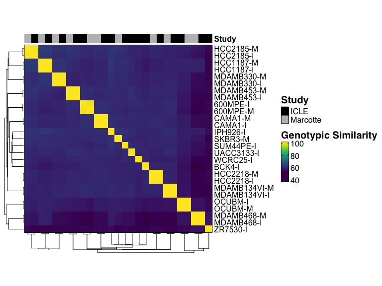<!-- -->

### Perform Molecular Subtyping

Run molecular subtyping (PAM50, mRNA/RPPA/DNAm consensus), SupFig 2-4
(heatmaps, PCAs, Sankey), Fig 1C (SET signature), and Fig 1B (multiomics
Sankey) via a single script. Assigns `fig1b_sankey` and
`fig1c_setheatmap` to the session.

``` r
source(file.path(DIRS$scripts$helpers, "02_Fig1_SupFig2_3_4_Molecular_Subtyping.R"), 
       chdir = TRUE)
```

    ## 
    ## ========================================

    ## 1. Molecular subtyping

    ## ========================================

    ## ═══════════════════════════════════════════════════════

    ##   Molecular Subtyping Pipeline

    ## ═══════════════════════════════════════════════════════

    ##   Step 1/7: Calculating ER status...

    ##   ✓ ER status calculated for 56 samples

    ## 
    ##   Step 2/7: Calculating HER2 status...

    ##   ✓ HER2 status calculated for 56 samples

    ## 
    ##   Step 3/7: Running Intrinsic Molecular Subtyping subtyping with BreastSubtypeR...

    ##   ✓ Intrinsic Molecular Subtyping subtyping complete

    ## 
    ##   Step 4/7: Running mRNA consensus clustering...

    ##   ✓ mRNA clustering complete

    ## 
    ##   Step 5/7: Running RPPA consensus clustering...

    ##   ✓ RPPA clustering complete

    ## 
    ##   Step 6/7: Running DNAm consensus clustering...

    ##   ✓ DNAm clustering complete

    ## 
    ##   Step 7/7: Updating annotations and saving results...

    ##   ✓ Annotations updated and results saved

    ## ═══════════════════════════════════════════════════════

    ##   Molecular Subtyping Complete

    ##   Results saved to: /Users/oshah/Documents/ICLE/3-Results/Molecular_Subtyping

    ## ═══════════════════════════════════════════════════════

    ## 
    ## ========================================

    ## 2. ERpos/neg and SET signature scores

    ## ========================================

    ## 
    ## ========================================

    ## 3. SupFig 2-4: Multi-omic subtypes (heatmaps, PCAs, Sankey)

    ## ========================================

    ##   ✓ ims entropy heatmap saved

    ##   ✓ SupFig 2A: mRNA heatmap saved

    ##   ✓ SupFig 2B: mRNA PCA saved

    ##   ✓ SupFig 3A: RPPA heatmap saved

    ##   ✓ SupFig 3B: RPPA PCA saved

    ##   ✓ SupFig 4A: DNAm heatmap saved

    ##   ✓ SupFig 4B: DNAm PCA saved

    ##   ✓ SupFig 2C: mRNA–ims Sankey saved

    ##   ✓ SupFig 3C: RPPA–ims Sankey saved

    ##   ✓ SupFig 4C: DNAm–ims Sankey saved

    ## 
    ## ========================================

    ## 4. Fig 1B: Multiomics Sankey

    ## ========================================

    ## 
    ## ========================================

    ## 5. Fig 1C: SET heatmap

    ## ========================================

    ##   Step 1/4: Loading SET signature genes...

    ##   ✓ Loaded 101 ER+ genes and 59 ER- genes

    ##   Step 2/4: Calculating SET scores...

    ##   ✓ SET scores calculated for 68 samples

    ##   Step 4/4: Creating SET signature heatmaps...

    ##   ✓ SET score heatmap created

    ##   ✓ Heatmaps created and combined

    ## ═══════════════════════════════════════════════════════

    ##   MOLECULAR SUBTYPING COMPLETE

    ## ═══════════════════════════════════════════════════════

### Figure 1B: Overview of Multiomics Subtypes

Sankey diagram (produced by the subtyping script above). Save to PDF and
display.

``` r
ggsave(file.path(DIRS$results_sub$molecular_subtyping, "Fig1B_MolecularSubtypes.pdf"), fig1b_sankey, width = 7, height = 5)

fig1b_sankey
```

<!-- -->

### Figure 1C: SET Signature

`fig1c_setheatmap` is produced by the subtyping script above. Save to
PDF and display.

``` r
pdf(file.path(DIRS$results_sub$molecular_subtyping, "Fig1C_SET_Signature.pdf"), width = 8, height = 6)
  draw(fig1c_setheatmap, merge_legends = TRUE)
dev.off()
```

    ## quartz_off_screen 
    ##                 2

``` r
draw(fig1c_setheatmap, merge_legends = TRUE)
```

<!-- -->

### Figure 1D: Multiomics Overview

Generate comprehensive multiomics heatmap.

``` r
source(file.path(DIRS$scripts$helpers, "04_Fig1D_Multiomics_Overview.R"), chdir = T)
```

    ## 
    ## ========================================

    ## Figure 1D: Multiomics Overview

    ## ========================================

    ##   Step 1/6: Loading additional genomic metrics...

    ##   ✓ Saved Genomic Instability Metrics to File/Users/oshah/Documents/ICLE/3-Results/Genomic_Instability_Metrics.tsv

    ##   ✓ Metrics loaded

    ##   Step 2/6: Preparing genetic alteration matrix...

    ##   ✓ Alteration matrix prepared: 9 genes x 17 samples

    ##   Step 3/6: Selecting top variable features...

    ##   ✓ RNA: 6000 genes selected

    ##   ✓ RPPA: 50 proteins selected

    ##   ✓ DNAm: 5913 probes selected

    ## 
    ##   Step 4/6: Creating annotations...

    ##   ✓ Top annotation created

    ## 
    ##   Step 5/6: Creating individual heatmaps...

    ##   ✓ Alteration heatmap created

    ##   ✓ RPPA heatmap created

    ##   ✓ RNA heatmap created

    ##   ✓ DNAm heatmap created

    ## 
    ## ========================================

    ## Figure 1D Completed

    ## ========================================

``` r
pdf(file.path(DIRS$results, "Fig1D_Multiome_Overview.pdf"), width = 6, height = 8)
draw(fig1d_multiomics_overview, merge_legends = TRUE, 
    annotation_legend_side = "right", heatmap_legend_side = "right")
dev.off()
```

    ## quartz_off_screen 
    ##                 2

``` r
fig1d_multiomics_overview
```

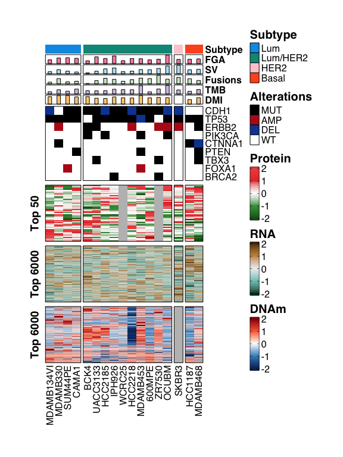<!-- -->

### Fig 1E: IGV Plot

``` r
# prepare primary ILC patient tumor CN segments
TCGA_BRCA_CN_SEG <- read.delim(file.path(DIRS$external$tcga, "CN", "TCGA_logRR_DNAcopy.seg"))
TCGA_BRCA_CN_SEG$ID <- substr(TCGA_BRCA_CN_SEG$ID, 1, 15)
ILC_cases <- subset(TCGA_Annots, `Final Pathology` == "ILC")$Case.ID
ILC_seg <- subset(TCGA_BRCA_CN_SEG, ID %in% ILC_cases)
write.table(ILC_seg, file = file.path(DIRS$external$tcga, "CN", "TCGA_logRR_ILC_127.seg"), row.names = FALSE, quote = FALSE, sep = "\t")

# prepare metastatic ILC patient tumor CN segments
MSK_BRCA_CN_SEG <- read.delim(file.path(DIRS$external$msk, "CN", "MSK_BRCA_CN.seg"))
ILC_met_cases <- subset(MSK_Annots, ONCOTREE_CODE == "ILC")$SAMPLE_ID
ILC_met_seg <- subset(MSK_BRCA_CN_SEG, ID %in% ILC_met_cases)
write.table(ILC_met_seg, file = file.path(DIRS$external$msk, "MSK_CN_ILC_202.seg"), row.names = FALSE, quote = FALSE, sep = "\t")

# prepare ICLE CN segments by subtype
ICLE_cells <- subset(CL_Annots, Study == "ICLE")
ICLE_cells <- split(ICLE_cells$Name, ICLE_cells$`mRNA Subtypes`)
ICLE_cells$HER2 = "SKBR3-M" # borrow information on SKRB3 from Marcotte
ICLE_cells$Other <- c(ICLE_cells$HER2, ICLE_cells$Basal)
ICLE_cells <- ICLE_cells[-c(3,4)]

BRCA_CL_CN_SEG <- read.delim(FILES$cnv_seg)

BRCA_CL_CN_SEG_subtype <- sapply(ICLE_cells, FUN = function(x){
  subset(BRCA_CL_CN_SEG, ID %in% x)
}, simplify = F)

sapply(names(BRCA_CL_CN_SEG_subtype), FUN = function(x){
  seg = BRCA_CL_CN_SEG_subtype[[x]]
  x = gsub("[//]", "_", x)
  write.table(seg, file = file.path(DIRS$icle$cytosnp, "3_Segmentation", paste0(x, "_ICLE_CL_LogRR_DNACopy.seg")), row.names = FALSE, quote = FALSE, sep = "\t")
  1
})
```

    ##      Lum Lum/HER2    Other 
    ##        1        1        1

### Figure 1F: Alteration Frequency Barplots

Compare alteration frequencies across cell lines, primary, and
metastatic tumors.

``` r
suppressWarnings(source(file.path(DIRS$scripts$helpers, "05_Fig1F_Alteration_barplots.R")))
```

    ## 
    ## ========================================

    ## Figure 1F: Alteration Barplots

    ## ========================================

    ##   Step 1/5: Defining gene sets...

    ##   ✓ Gene sets defined:

    ##     - ILC genes: 6

    ##     - NST genes: 7

    ##     - ESCAT genes: 25

    ##     - Total unique genes: 32

    ##   Step 2/5: Calculating alteration frequencies...

    ##     Processing Cell Lines...

    ##       - Samples: 14

    ##       - Altered genes: 25

    ##     Processing Primary Tumors...

    ##       - Samples: 126

    ##       - Altered genes: 30

    ##     Processing Metastatic Tumors...

    ##       - Samples: 194

    ##       - Altered genes: 31

    ## 

    ##   Step 3/5: Combining and ordering data...

    ##   ✓ Combined data prepared:

    ##     - Common events: 24

    ##     - Genes to plot: 21

    ##   Step 4/5: Creating alteration barplot...

    ##   ✓ Barplot created

    ##   Step 5/5: Performing statistical tests...

    ##   ✓ Statistical tests completed

    ##   Saving results p-values plots...

    ##   ✓ P-values (numeric) saved: /Users/oshah/Documents/ICLE/3-Results/Molecular_Resemblance/Fig1F_Alteration_Barplot_pval.pdf

    ##   ✓ P-values (notation) saved: /Users/oshah/Documents/ICLE/3-Results/Molecular_Resemblance/Fig1F_Alteration_Barplot_pval_nt.pdf

    ##   ✓ Figure 1F complete

``` r
output_file <- file.path(DIRS$results, "Molecular_Resemblance", "Fig1F_Alteration_Barplot.pdf")
ggsave(filename = output_file, fig1f_alteration_barplot, width = 6, height = 5)

fig1f_alteration_barplot
```

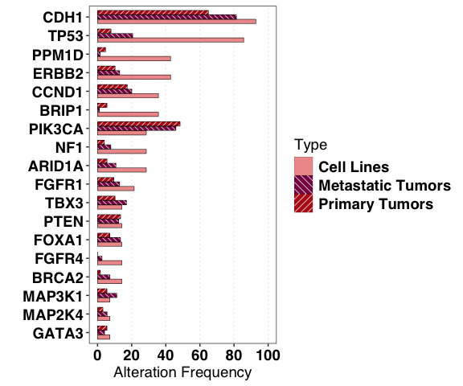<!-- -->

### SupFig 5: Key ILC vs NST Alterations (Patient Tumors)

``` r
source(file.path(DIRS$scripts$helpers, "06_SupFig5_ILC_NST_Alterations.R"), chdir = TRUE)
```

    ## 
    ## ========================================

    ## SupFig 5: ILC vs NST alteration frequencies (LumA tumors)

    ## ========================================

    ## Specs: 28 rows, 14 genes

    ##   ✓ SupFig 5 complete (supfigs5_tumor_alterations, freq_tbl assigned).

``` r
ggsave(file.path(DIRS$results, "SupFig5_BRCA_Tumor_Top_Alterations.pdf"), supfigs5_tumor_alterations, width = 8, height = 5)

write.table(freq_tbl, file.path(DIRS$results, "SupFig5_BRCA_Tumor_Top_Alterations.tsv"),
            sep = "\t", quote = FALSE, row.names = FALSE)

supfigs5_tumor_alterations
```

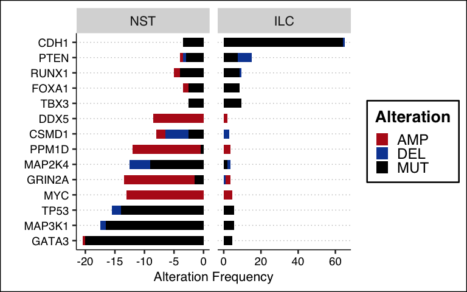<!-- -->

### SupFig 6: Alterations in Key Pathways (ICLE)

``` r
source(file.path(DIRS$scripts$helpers, "07_SupFig6_Pathway_Alterations.R"), chdir = TRUE)
```

    ## 
    ## ========================================

    ## SupFig 6: Pathway alterations (ICLE)

    ## ========================================

    ##   ✓ SupFig 6 complete (SupFigS6, pathway_alt_mat assigned).

``` r
pdf(file.path(DIRS$results, "SupFig6_Pathway_Alterations.pdf"), width = 7.5, height = 8)
draw(SupFigS6, merge_legends = TRUE)
dev.off()
```

    ## quartz_off_screen 
    ##                 2

``` r
write.table(pathway_alt_mat, file.path(DIRS$results, "SupFig6_Pathway_Alterations.tsv"),
            sep = "\t", quote = FALSE, col.names = NA)

draw(SupFigS6, merge_legends = TRUE)
```

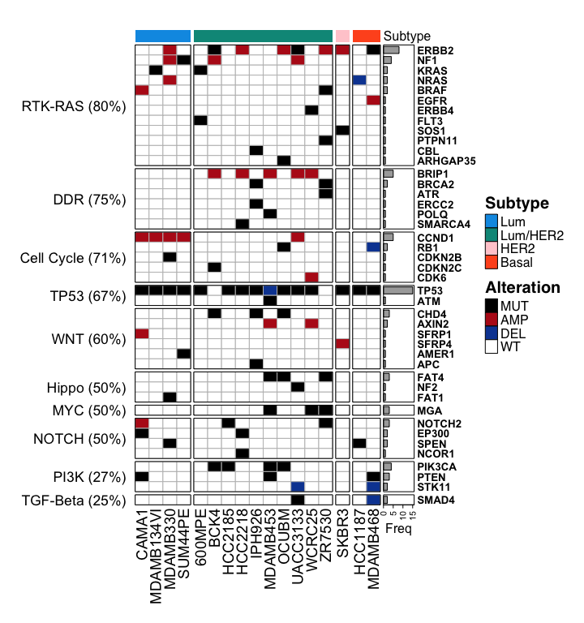<!-- -->

## b. CDH1 Alteration Landscape

### Figure 2B: Novel SV in ICLE

``` r
# Visualizations generated using Bionano Access software by loading SV files
```

``` r
source(file.path(DIRS$scripts$helpers, "08_Fig2_CDH1_Alteration_Landscape_All.R"), chdir = TRUE)
```

    ## ═══════════════════════════════════════════════════════

    ##   Figure 2C-H – running all panels in order

    ## ═══════════════════════════════════════════════════════

    ## 
    ## ========================================

    ## Figure 2C: CDH1 Exonic Deletion Analysis

    ## ========================================

    ##   Loading WES CDH1 read counts...

    ##   Found 19 WES samples

    ##   ✓ Loaded read counts for 19 samples

    ##   Generating CDH1 deletion heatmap...

    ##   ✓ Heatmap generated with 16 exons and 5 samples

    ##   ✓ CDH1 exonic deletion analysis complete (fig2c_cdh1_exonic_del_heatmap assigned).

    ## 
    ## ========================================

    ## Figure 2D: FMI CDH1 alterations (Local vs Distant)

    ## ========================================

    ##   ✓ Fig 2D complete (fig2d_fmi_alts, fig2d_fmi_alts_tbl, fig2d_fmi_alts_tbl_pval assigned).

    ## 
    ## ========================================

    ## Figure 2E: CDH1 Protein Paint query

    ## ========================================

    ##   ✓ Saved Fig2E_CellLines_CDH1_Mutations_Protein_Paint_Query.tsv

    ##   ✓ Saved Fig2E_TCGA_CDH1_Mutations_Protein_Paint_Query.tsv

    ## 
    ## ========================================

    ## Figure 2F: CDH1 allele frequency plot

    ## ========================================

    ##   ✓ Fig 2F complete (fig2f_cdh1_af assigned).

    ## 
    ## ========================================

    ## Figure 2G: Cell vs Tumor CDH1 alteration barplots

    ## ========================================

    ##   ✓ Fig 2G complete (fig2g_cl_cdh1_alts, fig2g_tcga_cdh1_alts, fig2g_cl_cdh1_alts_tbl_pval, fig2g_tcga_cdh1_alts_tbl_pval assigned).

    ## 
    ## ========================================

    ## Figure 2H: CDH1 alteration landscape

    ## ========================================

    ##   ✓ Fig 2H complete (fig2h_tcga, fig2h_cl, TCGA_CDH1_df, CL_CDH1_df assigned).

    ## ═══════════════════════════════════════════════════════

    ##   Figure 2C-H complete

    ## ═══════════════════════════════════════════════════════

### Figure 2C: Exonic Deletions in ICLE

``` r
pdf(file.path(DIRS$results_sub$cdh1, "Fig2C_CDH1_Exonic_Deletions_ICLE.pdf"), width = 4, height = 4.5)
draw(fig2c_cdh1_exonic_del_heatmap)
dev.off()
```

    ## quartz_off_screen 
    ##                 2

``` r
draw(fig2c_cdh1_exonic_del_heatmap)
```

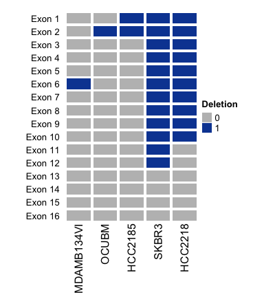<!-- -->

### Figure 2D: CDH1 Alterations (Foundation Medicine Dataset)

``` r
ggsave(file.path(DIRS$results_sub$cdh1, "Fig2D_FMI_CDH1_Alterations_Barplot.pdf"), fig2d_fmi_alts, width = 6, height = 4)
gt::gtsave(gt::gt(fig2d_fmi_alts_tbl), file.path(DIRS$results_sub$cdh1, "Fig2D_FMI_CDH1_Alterations_Table.pdf"))
```

    ## file:////var/folders/7y/k10bb0_97t74ng9htslfjpk40000gr/T//RtmpIuMw7q/fileea3955e1246e.html screenshot completed

``` r
gt::gtsave(gt::gt(fig2d_fmi_alts_tbl_pval) %>%
               gt::cols_width(starts_with("local") ~ px(100),starts_with("distant") ~ px(100)) %>% 
             gt::tab_options(table.width = px(600), column_labels.font.size = px(10)), 
           file.path(DIRS$results_sub$cdh1, "Fig2D_FMI_CDH1_Alterations_ILCvsNST_Event_pval.pdf"))
```

    ## file:////var/folders/7y/k10bb0_97t74ng9htslfjpk40000gr/T//RtmpIuMw7q/fileea39301eddce.html screenshot completed

``` r
fig2d_fmi_alts
```

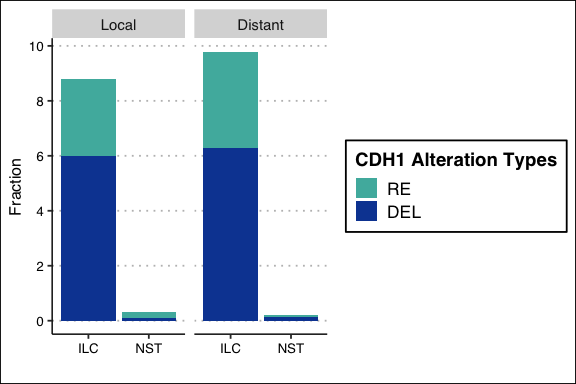<!-- -->

### Figure 2E: CDH1 Mutation Lollipop Plots (TCGA Patient Tumors vs Cell Lines)

``` r
# CDH1 protein paint plot for TCGA (generated by Fig 2 orchestrator)
# queries files plotted using https://proteinpaint.stjude.org/
```

### Figure 2F: CDH1 Allele Frequency in Cell Lines

``` r
ggsave(file.path(DIRS$results_sub$cdh1, "Fig2F_CL_CDH1_AF_Barplot_histology_shape.pdf"), fig2f_cdh1_af, width = 4.5, height = 4)

fig2f_cdh1_af
```

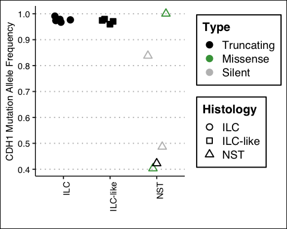<!-- -->

### Figure 2G: CDH1 Alterations (Patient Tumors vs Cell Lines)

``` r
ggsave(file.path(DIRS$results_sub$cdh1, "Fig2G_CL_CDH1_Alt_barplot.pdf"), fig2g_cl_cdh1_alts, width = 5, height = 5)
ggsave(file.path(DIRS$results_sub$cdh1, "Fig2G_TCGA_CDH1_Alt_barplot.pdf"), fig2g_tcga_cdh1_alts, width = 4, height = 5)
suppressMessages({
  gt::gtsave(gt::gt(fig2g_cl_cdh1_alts_tbl), file.path(DIRS$results_sub$cdh1, "Fig2G_CL_CDH1_Alterations_Table.pdf"))
  gt::gtsave(gt::gt(fig2g_cl_cdh1_alts_tbl_pval), file.path(DIRS$results_sub$cdh1, "Fig2G_CL_CDH1_Alterations_ILCvsNST_Event_pval.pdf"))
  gt::gtsave(gt::gt(fig2g_tcga_cdh1_alts_tbl), file.path(DIRS$results_sub$cdh1, "Fig2G_TCGA_CDH1_Alterations_Table.pdf"))
  gt::gtsave(gt::gt(fig2g_tcga_cdh1_alts_tbl_pval), file.path(DIRS$results_sub$cdh1, "Fig2G_TCGA_CDH1_Alterations_ILCvsNST_Event_pval.pdf"))
})

ggarrange(plotlist = list(fig2g_cl_cdh1_alts + fig2g_tcga_cdh1_alts), widths = c(1, 0.6))
```

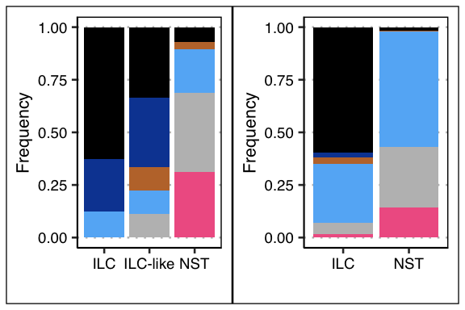<!-- -->

### Figure 2H: CDH1 Molecular Alteration Landscape Summary

``` r
write.table(TCGA_CDH1_df, file.path(DIRS$results_sub$cdh1, "Fig2H_TCGA_CDH1_Alteration_Landscape.tsv"), sep = "\t", row.names = FALSE)
write.table(CL_CDH1_df, file.path(DIRS$results_sub$cdh1, "Fig2HCellLines_CDH1_Alteration_Landscape.tsv"), sep = "\t", row.names = FALSE)

pdf(file.path(DIRS$results_sub$cdh1, "Fig2H_TCGA_CDH1_Alteration_Heatmap.pdf"), width = 8, height = 10)
  draw(fig2h_tcga, merge_legends = TRUE)
dev.off()
```

    ## quartz_off_screen 
    ##                 2

``` r
pdf(file.path(DIRS$results_sub$cdh1, "Fig2H_CellLine_CDH1_Alteration_Heatmap.pdf"), width = 8, height = 10)
  draw(fig2h_cl, merge_legends = TRUE)
dev.off()
```

    ## quartz_off_screen 
    ##                 2

``` r
draw(fig2h_tcga, merge_legends = TRUE)
```

<!-- -->

``` r
draw(fig2h_cl, merge_legends = TRUE)
```

<!-- -->

## c. SV Analysis

Run all Figure 3 and SupFig 8–10 scripts in order (TMB/SV prep, Fig
3A–3F, SupFig 8–10).

``` r
source(file.path(DIRS$scripts$helpers, "14_Fig3_SV_All.R"), chdir = TRUE)
```

    ## ═══════════════════════════════════════════════════════

    ##   Figure 3 + SupFig 8–10 – running all panels in order

    ## ═══════════════════════════════════════════════════════

    ## 
    ## ========================================

    ## SupFig 8: TMB vs SV Comparison

    ## ========================================

    ##   ✓ SupFig 8 prep complete (chrom_sizes, alt_count_chr, SupFig8A–D assigned).

    ## 
    ## ========================================

    ## Figure 3A: Genomic instability metrics and SV distribution

    ## ========================================

    ##   ✓ Fig 3A complete

    ## 
    ## ========================================

    ## Figure 3B: Translocation breakpoint topography

    ## ========================================

    ##   ✓ Fig 3B complete (fig3b_transloc_breakpoints_ht assigned).

    ## 
    ## ========================================

    ## Figure 3C: Chromothripsis landscape

    ## ========================================

    ## [1] "Running Shatter Seek on All ICLE Samples to identify Chromothripsis Events"

    ## Processing: HCC1187

    ## Running..
    ## 
    ## 
    ## Evaluating the statistical criteria
    ## Successfully finished!

    ## Processing: HCC2218

    ## Running..
    ## 
    ## 
    ## Evaluating the statistical criteria
    ## Successfully finished!

    ## Processing: IPH926

    ## Running..
    ## 
    ## 
    ## Evaluating the statistical criteria
    ## Successfully finished!

    ## Processing: MDAMB134VI

    ## Running..
    ## 
    ## 
    ## Evaluating the statistical criteria
    ## Successfully finished!

    ## Processing: MDAMB330

    ## Running..
    ## 
    ## 
    ## Evaluating the statistical criteria
    ## Successfully finished!

    ## Processing: MDAMB453

    ## Running..
    ## 
    ## 
    ## Evaluating the statistical criteria
    ## Successfully finished!

    ## Processing: 600MPE

    ## Running..
    ## 
    ## 
    ## Evaluating the statistical criteria
    ## Successfully finished!

    ## Processing: SUM44PE

    ## Running..
    ## 
    ## 
    ## Evaluating the statistical criteria
    ## Successfully finished!

    ## Processing: WCRC25

    ## Running..
    ## 
    ## 
    ## Evaluating the statistical criteria
    ## Successfully finished!

    ## Processing: BCK4

    ## Running..
    ## 
    ## 
    ## Evaluating the statistical criteria
    ## Successfully finished!

    ## Processing: CAMA1

    ## Running..
    ## 
    ## 
    ## Evaluating the statistical criteria
    ## Successfully finished!

    ## Processing: HCC2185

    ## Running..
    ## 
    ## 
    ## Evaluating the statistical criteria
    ## Successfully finished!

    ## Processing: MDAMB468

    ## Running..
    ## 
    ## 
    ## Evaluating the statistical criteria
    ## Successfully finished!

    ## Processing: OCUBM

    ## Running..
    ## 
    ## 
    ## Evaluating the statistical criteria
    ## Successfully finished!

    ## Processing: SKBR3

    ## Running..
    ## 
    ## 
    ## Evaluating the statistical criteria
    ## Successfully finished!

    ## Processing: UACC3133

    ## Running..
    ## 
    ## 
    ## Evaluating the statistical criteria
    ## Successfully finished!

    ## Processing: ZR7530

    ## Running..
    ## 
    ## 
    ## Evaluating the statistical criteria
    ## Successfully finished!
    ## [1] "Saving Chromothripsis Analysis Results to: /Users/oshah/Documents/ICLE/3-Results/Optical_Genome_Mapping"

    ##   ✓ Fig 3C complete (shatterseek_outs, thripsis_ht assigned).

    ## 
    ## ========================================

    ## Figure 3D: Circos plots for selected samples

    ## ========================================

    ##   ✓ Fig 3D complete (trk_bck4, trk_600, trk_hcc, trk_zr assigned).

    ##   Preparing ICLE fusion data...

    ##   Loading tumor fusion data...

    ##   Calculating fusion gene expression...

    ##   Adding OncoVar annotations...

    ##   Identifying recurring fusions...

    ##   ✓ Fusion data preparation complete

    ##   Generating fusion visualizations...

    ## 
    ## ========================================

    ## Figure 3E: ICLE Fusion Distribution (Left)

    ## ========================================

    ##   ✓ Fig 3E (ICLE) complete

    ## 
    ## ========================================

    ## Figure 3E: Tumor Fusion Distribution (Right)

    ## ========================================

    ##   ✓ Fig 3E (Tumor) complete

    ## 
    ## ========================================

    ## SupFig 10A: Fusion Breakpoint Heatmap

    ## ========================================

    ##   ✓ SupFig 10A complete

    ## 
    ## ========================================

    ## SupFig 10B: Recurring Fusions Expression Heatmap

    ## ========================================

    ##   ✓ SupFig 10B complete

    ## 
    ## ========================================

    ## Figure 3F: GOE and LOE Fusions Circos

    ## ========================================

    ##   ✓ Fig 3F (GOE) complete

    ##   ✓ Fig 3F (LOE) complete

    ## 
    ## ========================================

    ## SupFig 10C: Recurring Gene Circos Plots

    ## ========================================

    ##   ✓ SupFig 10C (recurring genes) complete

    ## 
    ## ═══════════════════════════════════════════════════════

    ##   Figure 3 + SupFig 8–10 complete

    ## ═══════════════════════════════════════════════════════

### Figure 3A (left): ICLE Genomic Instability Metrics

``` r
pdf(file.path(DIRS$results_sub$ogm, "Fig3A_left_Metrics_of_GenomicInstability.pdf"), width = 4, height = 4)
draw(fig3a_genomic_instability)
dev.off()
```

    ## quartz_off_screen 
    ##                 2

``` r
fig3a_genomic_instability
```

<!-- -->

### Figure 3A (right): ICLE SV Overview

``` r
ggsave(file.path(DIRS$results_sub$ogm, "Fig3A_right_SV_Distribution.pdf"), fig3a_sv_distribution, width = 6, height = 5)
fig3a_sv_distribution
```

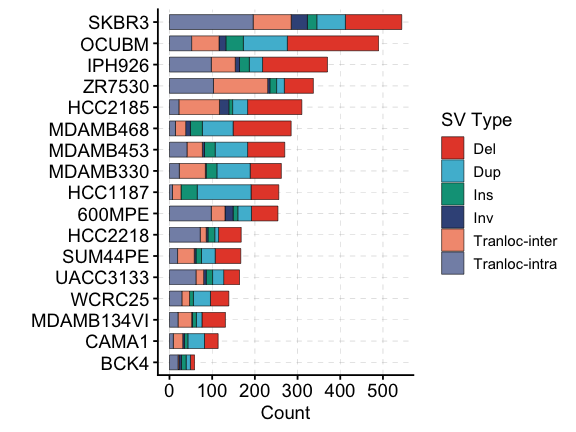<!-- -->

### Figure 3B: Chromosomal Topography of Translocation Breakpoints

``` r
pdf(file.path(DIRS$results_sub$ogm, "Fig3B_Translocation_Distribution.pdf"), width = 6.5, height = 5)
draw(fig3b_transloc_breakpoints_ht, merge_legends = TRUE)
dev.off()
```

    ## quartz_off_screen 
    ##                 2

``` r
fig3b_transloc_breakpoints_ht
```

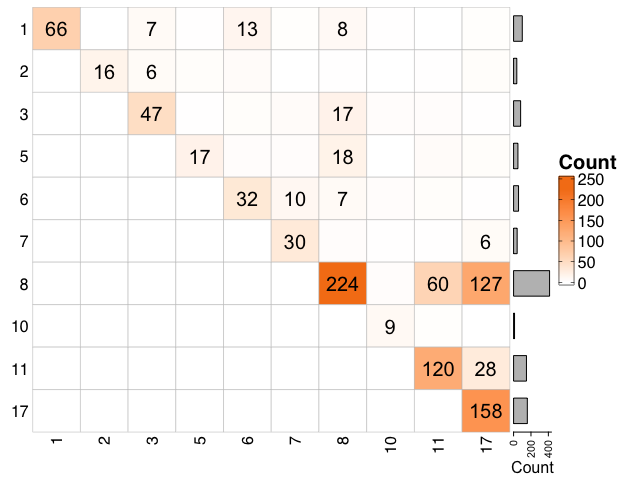<!-- -->

### Figure 3C: Chromothripsis Landscape

``` r
write.table(shatterseek_outs$chromothripsis_df, file.path(DIRS$results_sub$ogm, "SupTable11_shatterseek_chromothripsis_results.tsv"), sep = "\t", col.names = NA)
pdf(file.path(DIRS$results_sub$ogm, "Fig3C_chromothripsis_heatmap.pdf"), width = 5, height = 5)
draw(fig3c_thripsis_ht, merge_legends = TRUE)
dev.off()
```

    ## quartz_off_screen 
    ##                 2

``` r
draw(fig3c_thripsis_ht, merge_legends = TRUE)
```

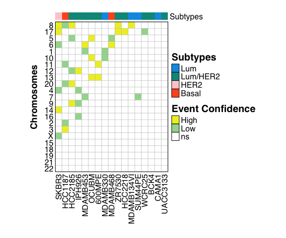<!-- -->

### Figure 3D: Generate Cricos Plots for BCK4, 600MPE, HCC2185 and ZR7530

``` r
# Load required libraries for HTML widget to PDF conversion
library(htmlwidgets)
library(webshot2)

# Save all four circos plots to PDF
message("Saving circos plots to PDF...")
```

    ## Saving circos plots to PDF...

``` r
circos_bck4 <- save_circos_to_pdf(trk_bck4, "BCK4", DIRS$results_sub$ogm)
```

    ## file:////Users/oshah/Documents/ICLE/3-Results/Optical_Genome_Mapping/Fig3D_Circos_BCK4.html screenshot completed

    ##   ✓ Saved PDF: Fig3D_Circos_BCK4.pdf

``` r
circos_600mpe <- save_circos_to_pdf(trk_600, "600MPE", DIRS$results_sub$ogm)
```

    ## file:////Users/oshah/Documents/ICLE/3-Results/Optical_Genome_Mapping/Fig3D_Circos_600MPE.html screenshot completed

    ##   ✓ Saved PDF: Fig3D_Circos_600MPE.pdf

``` r
circos_hcc2185 <- save_circos_to_pdf(trk_hcc, "HCC2185", DIRS$results_sub$ogm)
```

    ## file:////Users/oshah/Documents/ICLE/3-Results/Optical_Genome_Mapping/Fig3D_Circos_HCC2185.html screenshot completed

    ##   ✓ Saved PDF: Fig3D_Circos_HCC2185.pdf

``` r
circos_zr7530 <- save_circos_to_pdf(trk_zr, "ZR7530", DIRS$results_sub$ogm)
```

    ## file:////Users/oshah/Documents/ICLE/3-Results/Optical_Genome_Mapping/Fig3D_Circos_ZR7530.html screenshot completed

    ##   ✓ Saved PDF: Fig3D_Circos_ZR7530.pdf

``` r
circos_bck4
```

<!-- -->

``` r
circos_600mpe
```

<!-- -->

``` r
circos_hcc2185
```

<!-- -->

``` r
circos_zr7530
```

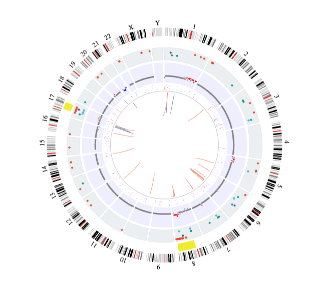<!-- -->

### Figure 3E: Fusions Distribution in Cell Lines vs Patient Tumors

``` r
# Save fusion distribution plots
ggsave(file.path(DIRS$results_sub$ogm, "Fig3E_right_FusionDistribution_ICLE.pdf"), 
       fig3e_1, width = 3, height = 4)
ggsave(file.path(DIRS$results_sub$ogm, "Fig3E_right_FusionDistribution_PatientTumor.pdf"), 
       fig3e_2+scale_x_continuous(breaks = c(0,25,50,75), limits = c(0,75)), width = 3, height = 4)

# Save fusion data table
write.table(fusions_df, file.path(DIRS$results_sub$ogm, "SupTable12_fusion_df.tsv"), 
            quote = FALSE, sep = "\t", row.names = FALSE)

ggarrange(plotlist = list(fig3e_1, fig3e_2))
```

<!-- -->

### Figure 3F: GOE and LOE Functional Fusions Circos

``` r
pdf(file = file.path(DIRS$results_sub$ogm, "Fig3F_left_GOE_Fusions.pdf"), width = 7, height = 7)
fig3f_left_goe_fusions_circos
dev.off()
```

    ## quartz_off_screen 
    ##                 2

``` r
pdf(file = file.path(DIRS$results_sub$ogm, "Fig3F_right_LOE_Fusions.pdf"), width = 7, height = 7)
fig3f_right_loe_fusions_circos
dev.off()
```

    ## quartz_off_screen 
    ##                 2

### SupFig 8A: Mutation vs SV Count, Size

``` r
ggsave(file.path(DIRS$results_sub$ogm, "SupFig8A_TMB_SV_Burden_Correlation.pdf"), SupFig8A, width = 5.5, height = 5)
write.table(sv_tmb_summary, file.path(DIRS$results_sub$ogm, "SupTable_SV_TMB_summary.tsv"), sep = "\t", quote = FALSE, row.names = FALSE)

SupFig8A
```

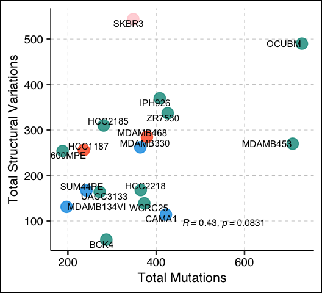<!-- -->

### SupFig 8B: TMB vs SV Burden

``` r
ggsave(file.path(DIRS$results_sub$ogm, "SupFig8B_TMB_vs_SV_Burden_Correlation.pdf"), SupFig8B, width = 5.5, height = 5)
SupFig8B
```

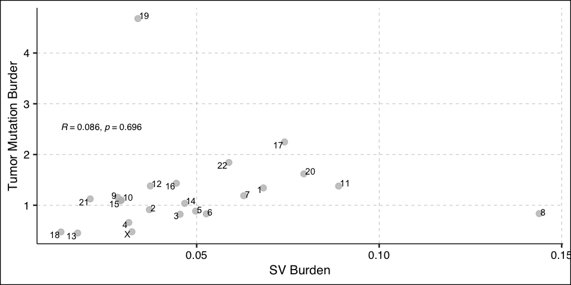<!-- -->

``` r
ggsave(file.path(DIRS$results_sub$ogm, "SupFig8B_TMB_vs_SV_Burden_Correlation_NoOutliers.pdf"), SupFig8B_no_outliers, width = 5.5, height = 5)
write.table(alt_count_chr, file.path(DIRS$results_sub$ogm, "SupTable_alt_count_per_chr.tsv"), sep = "\t", quote = FALSE, row.names = FALSE)

ggarrange(plotlist = list(SupFig8B +SupFig8B_no_outliers))
```

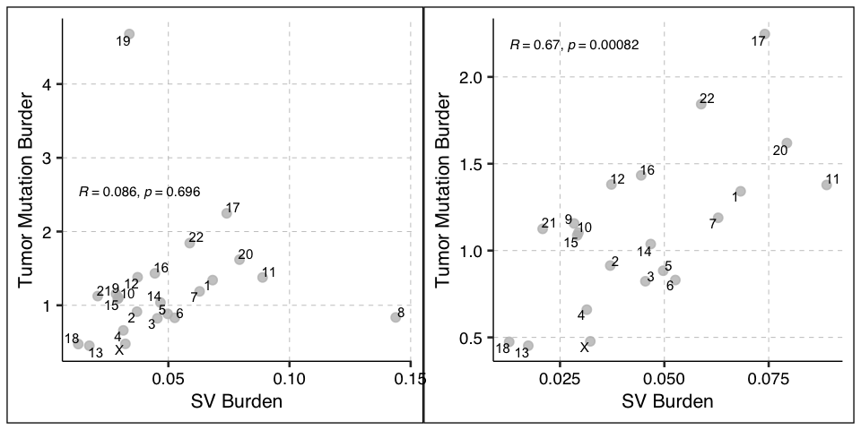<!-- -->

### SupFig 8C: SV~Chr Size - SV Count by Chr

``` r
ggsave(file.path(DIRS$results_sub$ogm, "SupFig8D_SV_Per_Chr.pdf"), SupFig8C, width = 7, height = 5)
SupFig8C
```

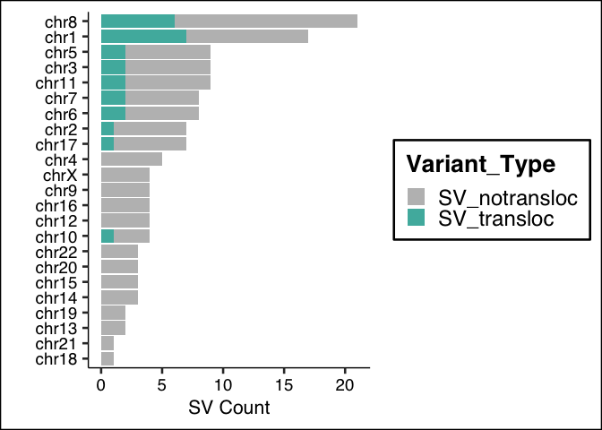<!-- -->

### SupFig 8D: Mutation ~ Chr Size - Mutation Count by Chr

``` r
ggsave(file.path(DIRS$results_sub$ogm, "SupFig8_Mutations_Per_Chr.pdf"), SupFig8D, width = 4, height = 5)
SupFig8D
```

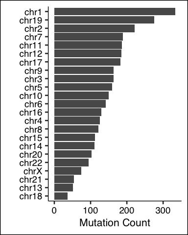<!-- -->

### SupFig 9: Generate Cricos Plots for all ICLE cell lines

``` r
draw_circos_plot_for_all(shatterseek_outs$sv_df, shatterseek_outs$cnv_df, shatterseek_outs$chromothripsis_df, out_dir = file.path(DIRS$results_sub$ogm, "SupFig9_OGM_Circos"))
```

    ## [1] "Making Circos Plot for: HCC1187"

    ## file:////Users/oshah/Documents/ICLE/3-Results/Optical_Genome_Mapping/SupFig9_OGM_Circos/HCC1187_circos_plot.html screenshot completed

    ##   Saved PDF for sample: HCC1187

    ## [1] "Making Circos Plot for: HCC2218"

    ## file:////Users/oshah/Documents/ICLE/3-Results/Optical_Genome_Mapping/SupFig9_OGM_Circos/HCC2218_circos_plot.html screenshot completed

    ##   Saved PDF for sample: HCC2218

    ## [1] "Making Circos Plot for: IPH926"

    ## file:////Users/oshah/Documents/ICLE/3-Results/Optical_Genome_Mapping/SupFig9_OGM_Circos/IPH926_circos_plot.html screenshot completed

    ##   Saved PDF for sample: IPH926

    ## [1] "Making Circos Plot for: MDAMB134VI"

    ## file:////Users/oshah/Documents/ICLE/3-Results/Optical_Genome_Mapping/SupFig9_OGM_Circos/MDAMB134VI_circos_plot.html screenshot completed

    ##   Saved PDF for sample: MDAMB134VI

    ## [1] "Making Circos Plot for: MDAMB330"

    ## file:////Users/oshah/Documents/ICLE/3-Results/Optical_Genome_Mapping/SupFig9_OGM_Circos/MDAMB330_circos_plot.html screenshot completed

    ##   Saved PDF for sample: MDAMB330

    ## [1] "Making Circos Plot for: MDAMB453"

    ## file:////Users/oshah/Documents/ICLE/3-Results/Optical_Genome_Mapping/SupFig9_OGM_Circos/MDAMB453_circos_plot.html screenshot completed

    ##   Saved PDF for sample: MDAMB453

    ## [1] "Making Circos Plot for: 600MPE"

    ## file:////Users/oshah/Documents/ICLE/3-Results/Optical_Genome_Mapping/SupFig9_OGM_Circos/600MPE_circos_plot.html screenshot completed

    ##   Saved PDF for sample: 600MPE

    ## [1] "Making Circos Plot for: SUM44PE"

    ## file:////Users/oshah/Documents/ICLE/3-Results/Optical_Genome_Mapping/SupFig9_OGM_Circos/SUM44PE_circos_plot.html screenshot completed

    ##   Saved PDF for sample: SUM44PE

    ## [1] "Making Circos Plot for: WCRC25"

    ## file:////Users/oshah/Documents/ICLE/3-Results/Optical_Genome_Mapping/SupFig9_OGM_Circos/WCRC25_circos_plot.html screenshot completed

    ##   Saved PDF for sample: WCRC25

    ## [1] "Making Circos Plot for: BCK4"

    ## file:////Users/oshah/Documents/ICLE/3-Results/Optical_Genome_Mapping/SupFig9_OGM_Circos/BCK4_circos_plot.html screenshot completed

    ##   Saved PDF for sample: BCK4

    ## [1] "Making Circos Plot for: CAMA1"

    ## file:////Users/oshah/Documents/ICLE/3-Results/Optical_Genome_Mapping/SupFig9_OGM_Circos/CAMA1_circos_plot.html screenshot completed

    ##   Saved PDF for sample: CAMA1

    ## [1] "Making Circos Plot for: HCC2185"

    ## file:////Users/oshah/Documents/ICLE/3-Results/Optical_Genome_Mapping/SupFig9_OGM_Circos/HCC2185_circos_plot.html screenshot completed

    ##   Saved PDF for sample: HCC2185

    ## [1] "Making Circos Plot for: MDAMB468"

    ## file:////Users/oshah/Documents/ICLE/3-Results/Optical_Genome_Mapping/SupFig9_OGM_Circos/MDAMB468_circos_plot.html screenshot completed

    ##   Saved PDF for sample: MDAMB468

    ## [1] "Making Circos Plot for: OCUBM"

    ## file:////Users/oshah/Documents/ICLE/3-Results/Optical_Genome_Mapping/SupFig9_OGM_Circos/OCUBM_circos_plot.html screenshot completed

    ##   Saved PDF for sample: OCUBM

    ## [1] "Making Circos Plot for: SKBR3"

    ## file:////Users/oshah/Documents/ICLE/3-Results/Optical_Genome_Mapping/SupFig9_OGM_Circos/SKBR3_circos_plot.html screenshot completed

    ##   Saved PDF for sample: SKBR3

    ## [1] "Making Circos Plot for: UACC3133"

    ## file:////Users/oshah/Documents/ICLE/3-Results/Optical_Genome_Mapping/SupFig9_OGM_Circos/UACC3133_circos_plot.html screenshot completed

    ##   Saved PDF for sample: UACC3133

    ## [1] "Making Circos Plot for: ZR7530"

    ## file:////Users/oshah/Documents/ICLE/3-Results/Optical_Genome_Mapping/SupFig9_OGM_Circos/ZR7530_circos_plot.html screenshot completed

    ##   Saved PDF for sample: ZR7530

### SupFig 10: Functional Fusions

``` r
# SupFig 10A: Fusion Breakpoints Heatmap
pdf(file.path(DIRS$results_sub$ogm, "SupFig10A_Functional_Fusions_Chr_Heatmap.pdf"), width = 6.5, height = 5)
draw(supfig10a_fusion_breakpoints_ht, merge_legends = TRUE)
dev.off()
```

    ## quartz_off_screen 
    ##                 2

``` r
draw(supfig10a_fusion_breakpoints_ht, merge_legends = TRUE)
```

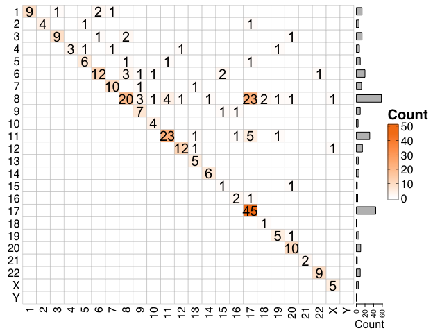<!-- -->

``` r
# SupFig 10B: Recurring fusions expression heatmap
pdf(file.path(DIRS$results_sub$ogm, "SupFig10B_Recurring_Functional_Fusions.pdf"), width = 15, height = 5)
  draw(supfig10b_recurring_fusions_ht, merge_legends = TRUE)
dev.off()
```

    ## quartz_off_screen 
    ##                 2

``` r
draw(supfig10b_recurring_fusions_ht, merge_legends = TRUE)
```

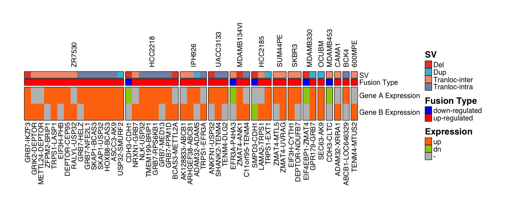<!-- -->

``` r
# SupFig 10C: Recurring gene circos plots
gene_names <- names(recurring_gene_circos)
for (i in seq_along(gene_names)) {
    gene <- gene_names[i]
    pdf_file <- file.path(DIRS$results_sub$ogm, 
                         paste0("SupFig10C_", gene, "_Fusions.pdf"))
    pdf(pdf_file, width = 7, height = 7)
    print(recurring_gene_circos[[gene]])
    dev.off()
}
```

## d. DNAm Analysis

#### SupFig 11: DNAm Index by Across Histological and PAM50 Subtypes

``` r
source(file.path(DIRS$scripts$helpers, "21_Fig4_SupFig11_DNAm_Alterations.R"), chdir = TRUE)
```

    ## ===============================================================================

    ## Section 1: Loading Data

    ## ===============================================================================

    ## Loading Oncovar annotations...

    ## Loading HM450K probe set...

    ## Loading RNA-seq data...

    ## Loading cell line DNA methylation data...

    ## TCGA DNA methylation data already loaded

    ##   Common probes across datasets: 75646

    ## 
    ## ===============================================================================

    ## Section 2: Calculating DMI (DNA Methylation Index)

    ## ===============================================================================

    ##   Step 1: Calculating median DNA methylation in normal samples...

    ##     Calculated median beta for 75646 probes

    ##   Step 2: Calculating Global Methylation Aberration (GMA) scores...

    ##   Patient tumors: 651 samples

    ##   Cell lines: 49 samples

    ##   Step 3: Combining patient and cell line data...

    ##   Step 4: Defining group variables...

    ##   Filtered to 700 samples (Cell Lines: 49. Normal: 98. Patient Tumors: 553. )

    ##   Step 5: Computing DMI z-scores...

    ##   Step 6: Removing outlier normals...

    ##   Removed 12 outlier normal samples

    ##   Step 7: Generating combined histology-type labels...

    ##   ✓ Saved DMI summary to: /Users/oshah/Documents/ICLE/3-Results/DNA_Methylation/DMI_Summary.tsv

    ## 
    ## ===============================================================================

    ## Section 3: DMI Comparisons and Visualizations

    ## ===============================================================================

    ## 
    ## ========================================

    ## SupFig 11A: DMI patient tumors by PAM50

    ## ========================================

    ## 
    ## ========================================

    ## SupFig 11B: DMI cell lines by PAM50

    ## ========================================

    ## 
    ## ========================================

    ## SupFig 11C: DMI by histology

    ## ========================================

    ## 
    ## ========================================

    ## Figure 4A: DMI by tissue source

    ## ========================================

    ##   ✓ SupFig 11 and Fig 4A DMI figures assigned to global environment

    ## 
    ## ===============================================================================

    ## Section 4: Differential Analysis (TCGA and Cell Lines)

    ## ===============================================================================

    ## TCGA DESeq2 Analysis (LumA ILC vs NST)...

    ##   Loading existing TCGA DESeq2 results...

    ##   ✓ TCGA DESeq2: 890 significant DEGs

    ## TCGA Limma Analysis (LumA ILC vs NST)...

    ##   Loading existing TCGA Limma results...

    ##   ✓ TCGA Limma: 3030 significant probes

    ## Cell Line DESeq2 Analysis (Non-Basal ILC vs NST)...

    ##   Loading existing Cell Line DESeq2 results...

    ##   ✓ Cell Line DESeq2: 833 significant DEGs

    ## Cell Line Limma Analysis (Non-Basal ILC vs NST)...

    ##   Loading existing Cell Line Limma results...

    ##   ✓ Cell Line Limma: 23308 significant probes

    ## 
    ## ===============================================================================

    ## Section 5: Identifying Consensus Events Between Cell Lines and Tumors

    ## ===============================================================================

    ## Identifying consensus DGE events...

    ##   Consensus DGE events: 23

    ## Identifying consensus DPM events...

    ##   Consensus DPM events: 854

    ## Merging RNA and DNAm results...

    ## Warning: Returning more (or less) than 1 row per `summarise()` group was deprecated in
    ## dplyr 1.1.0.
    ## ℹ Please use `reframe()` instead.
    ## ℹ When switching from `summarise()` to `reframe()`, remember that `reframe()`
    ##   always returns an ungrouped data frame and adjust accordingly.
    ## Call `lifecycle::last_lifecycle_warnings()` to see where this warning was
    ## generated.

    ## `summarise()` has grouped output by 'gene'. You can override using the
    ## `.groups` argument.

    ##   ✓ Identified 46 DNAm-regulated genes

    ## Adding annotations and expression/methylation values...

    ## Identifying consensus genes...

    ##   ✓ Identified 7 consensus genes

    ## 
    ## ========================================

    ## Figure 4B: DNAm-mRNA alterations scatter plot

    ## ========================================

    ##   ✓ Fig 4B complete (dnma_lfc_plt assigned).

    ## 
    ## ========================================

    ## Figure 4C: Consensus DNAm-mRNA alterations heatmap

    ## ========================================

    ##   ✓ Fig 4C complete (fig4c_ht assigned).

    ## 
    ## ========================================

    ## Figure 4D: MSI1 and TFAP2B expression and DNAm barplots

    ## ========================================

    ##   ✓ Fig 4D complete (fig4e assigned).

    ## 
    ## ===============================================================================

    ## Section 9: Saving Results

    ## ===============================================================================

    ##   ✓ Saved TCGA_DNAm_Regulated_Genes.csv to: /Users/oshah/Documents/ICLE/3-Results/DNA_Methylation/TCGA_DNAm_Regulated_Genes.csv

    ## 
    ## ===============================================================================

    ## Script 22 completed successfully!

    ## ===============================================================================

    ##   All figures assigned to global environment for saving in Main_Data_Analysis.Rmd

    ##   - SupFig11: tumor_pam50, cl_pam50, tumor_cl_histology_LumA

    ##   - Fig4A: tissue_dmi

    ##   - Fig4B: dnma_lfc_plt

    ##   - Fig4C: fig4c_ht

    ##   - Fig4D: fig4e

``` r
ggsave(file.path(dnam_dir, "SupFig11A_DMI_Tumor_PAM50.pdf"), tumor_pam50, width = 5, height = 3)

pdf(file.path(dnam_dir, "SupFig11A_DMI_Tumor_PAM50_pvalue_table.pdf"), width = 10, height = 10)
  gridExtra::grid.table(signif(SupFig11A_pval_table, 1))
dev.off()
```

    ## quartz_off_screen 
    ##                 2

``` r
tumor_pam50
```

<!-- -->

``` r
ggsave(file.path(dnam_dir, "SupFig11B_DMI_CL_PAM50.pdf"), cl_pam50, width = 5, height = 3)

pdf(file.path(dnam_dir, "SupFig11B_DMI_CL_PAM50_pvalue_table.pdf"), width = 10, height = 10)
  gridExtra::grid.table(signif(SupFig11B_pval_table, 1))
dev.off()
```

    ## quartz_off_screen 
    ##                 2

``` r
cl_pam50
```

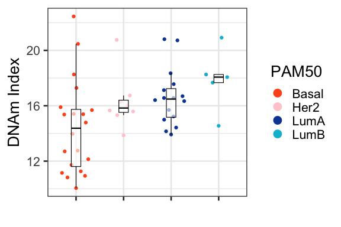<!-- -->

``` r
ggsave(file.path(dnam_dir, "SupFig11C_DMI_Tumor_CL_Histology.pdf"), tumor_cl_histology_LumA, width = 4, height = 3)

pdf(file.path(dnam_dir, "SupFig11C_DMI_Tumor_CL_Histology_pvalues_table.pdf"), width = 10, height = 10)
  gridExtra::grid.table(signif(SupFig11C_pval_table, 1))
dev.off()
```

    ## quartz_off_screen 
    ##                 2

``` r
tumor_cl_histology_LumA
```

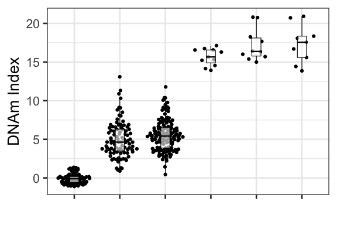<!-- -->

#### Figure 4A: DNAm Index by Specimen Type

``` r
ggsave(file.path(DIRS$results_sub$dna_methylation, "Fig4A_DMI_Normal_Tumor_CL.pdf"), 
       tissue_dmi, width = 5, height = 3)
gt::gtsave(tissue_dmi_pval, file.path(DIRS$results_sub$dna_methylation, "Fig4A_DMI_Normal_Tumor_CL_pvalue_table.pdf"))
```

    ## file:////var/folders/7y/k10bb0_97t74ng9htslfjpk40000gr/T//RtmpIuMw7q/fileea392529ed19.html screenshot completed

``` r
tissue_dmi
```

<!-- -->

#### Figure 4B: DNAm-mRNA Alterations

``` r
ggsave(file.path(DIRS$results_sub$dna_methylation, "Fig4B_Tumor_RNA_DNAm_Alterations_small_height.pdf"),
       dnma_lfc_plt, width = 6, height = 5)
dnma_lfc_plt
```

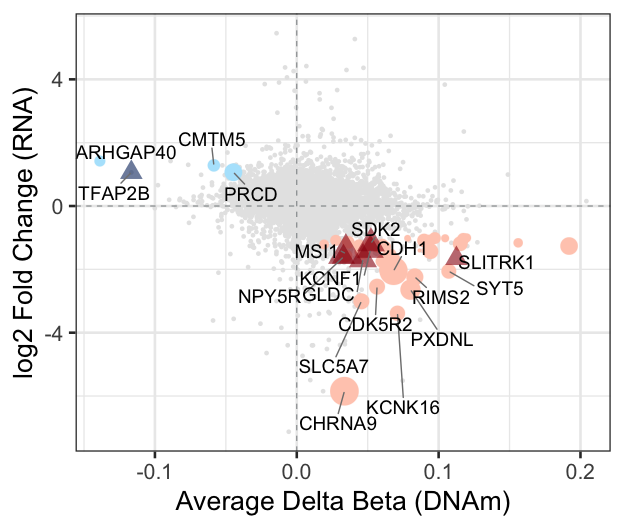<!-- -->

#### Figure 4C: Consensus DNAm-mRNA Alterations Heatmap

``` r
pdf(file.path(DIRS$results_sub$dna_methylation, "Fig4C_Alterations_Heatmap.pdf"), width = 10, height = 5)
  draw(fig4c_ht, merge_legends = TRUE, gap = unit(0.1, "cm"))
dev.off()
```

    ## quartz_off_screen 
    ##                 2

``` r
draw(fig4c_ht, merge_legends = TRUE, gap = unit(0.1, "cm"))
```

<!-- -->

#### Figure 4D: MSI1 & TFAP2B Barplots

``` r
ggsave(file.path(DIRS$results_sub$dna_methylation, "Fig4D_Top_Alterations_Barplots.pdf"), fig4e, width = 12, height = 10)
fig4e
```

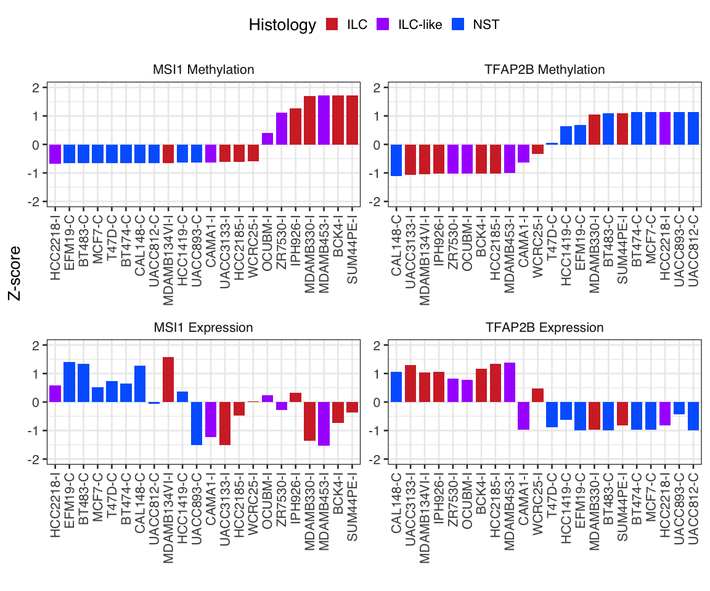<!-- -->

## e. RNAi Analysis

### Figure 5B: Consensus Differential Dependencies

``` r
source(file.path(DIRS$scripts$helpers, "22_Fig5_RNAi_Differential_Dependencies.R"), chdir = TRUE)
```

    ## ===============================================================================

    ## Section 2: Loading RNAi Data

    ## ===============================================================================

    ## Loading RNAi data...

    ## New names:
    ## ✓ Loaded 15256 genes across 19 cell lines
    ## ===============================================================================
    ## Section 3: SIMEM Differential Analysis
    ## ===============================================================================
    ## Loading existing SIMEM results...
    ## ✓ Loaded SIMEM results for 14730 genes
    ## ===============================================================================
    ## Section 4: D2 Differential Analysis
    ## ===============================================================================
    ## ✓ Analyzed 13607 genes
    ## ===============================================================================
    ## Section 5: Computing Consensus Dependencies
    ## ===============================================================================
    ## ✓ Consensus dependencies: 93
    ## Adding drug-gene interaction information...
    ## • `` -> `...1`

    ## Warning in .fun(.value[0], ...): no non-missing arguments to max; returning
    ## -Inf

    ##   ✓ Added DGI information for 2396 genes
    ##   ✓ Saved results to: /Users/oshah/Documents/ICLE/3-Results/Gene_Dependencies/RNAi_ILC_Consensus_Dependencies.tsv
    ## 
    ## ========================================
    ## Figure 5B: Consensus dependencies scatter plot
    ## ========================================

    ## Warning: Using `size` aesthetic for lines was deprecated in ggplot2 3.4.0.
    ## ℹ Please use `linewidth` instead.
    ## This warning is displayed once every 8 hours.
    ## Call `lifecycle::last_lifecycle_warnings()` to see where this warning was
    ## generated.

    ##   ✓ Fig 5B complete (fig5b_consensus_dep_plt assigned).
    ## 
    ## ========================================
    ## SupFig 12: Consensus dependencies heatmap
    ## ========================================
    ##   ✓ SupFig 12 complete (supfig12_dep_ht assigned).
    ## 
    ## ========================================
    ## Figure 5C: KEGG pathway enrichment
    ## ========================================

    ## Warning: Vectorized input to `element_text()` is not officially supported.
    ## ℹ Results may be unexpected or may change in future versions of ggplot2.

    ## Warning in geom_text(aes(x = 0.05), size = fontsize, face = "bold", hjust = 0,
    ## : Ignoring unknown parameters: `face`

    ## Scale for x is already present.
    ## Adding another scale for x, which will replace the existing scale.

    ## Warning in geom_text(aes(x = 0.05), size = fontsize, face = "bold", hjust = 0,
    ## : Ignoring unknown parameters: `face`

    ## Scale for x is already present.
    ## Adding another scale for x, which will replace the existing scale.

    ## Warning: Removed 2 rows containing missing values or values outside the scale range
    ## (`geom_text()`).

    ##   ✓ Fig 5C complete (fig5c_pathway_plt assigned).
    ## 
    ## ========================================
    ## Figure 5D: Pathway level dependencies heatmap
    ## ========================================
    ##   ✓ Fig 5D complete (fig5d_pathway_ht assigned).
    ## 
    ## ========================================
    ## Figure 5E: Druggable dependencies heatmap
    ## ========================================
    ##   ✓ Fig 5E complete (fig5e_drug_ht assigned).
    ## 
    ## ========================================
    ##   Figure 5 (5B–5E) and SupFig 12 complete
    ## ========================================
    ##   - Fig 5B: fig5b_consensus_dep_plt
    ##   - SupFig 12: supfig12_dep_ht
    ##   - Fig 5C: fig5c_pathway_plt
    ##   - Fig 5D: fig5d_pathway_ht
    ##   - Fig 5E: fig5e_drug_ht

``` r
ggsave(file.path(DIRS$results_sub$dependencies, "Fig5b_Differential_Dependencies.pdf"), 
       fig5b_consensus_dep_plt, width = 8, height = 4.5)
fig5b_consensus_dep_plt
```

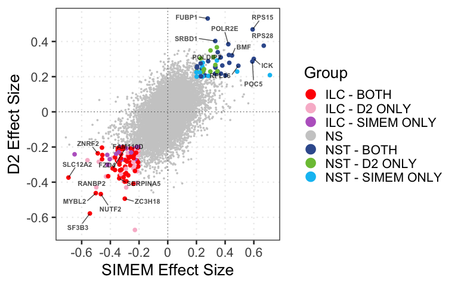<!-- -->

### SupFig 12: Consensus Differential Dependencies Heatmap

``` r
pdf(file.path(DIRS$results_sub$dependencies, "SupFig12_Consensus_Dependencies_Heatmap.pdf"), 
    width = 7.5, height = 16)
  draw(supfig12_dep_ht, merge_legends = TRUE, heatmap_legend_side = "bottom")
dev.off()
```

    ## quartz_off_screen 
    ##                 2

``` r
draw(supfig12_dep_ht, merge_legends = TRUE, heatmap_legend_side = "bottom")
```

<!-- -->

### Figure 5C: Over represented Pathways

``` r
ggsave(file.path(DIRS$results_sub$dependencies, "Fig5C_KEGG_ORA.pdf"), fig5c_pathway_plt, width = 6, height = 3.5)
fig5c_pathway_plt
```

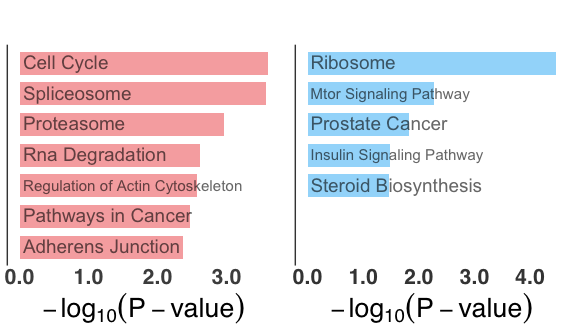<!-- -->

### Figure 5D: Pathway level Dependencies Heatmap

``` r
pdf(file.path(DIRS$results_sub$dependencies, "Fig5D_Pathway_Scores.pdf"), width = 7.5, height = 5)
  draw(fig5d_pathway_ht, merge_legends = TRUE, heatmap_legend_side = "bottom")
dev.off()
```

    ## quartz_off_screen 
    ##                 2

``` r
draw(fig5d_pathway_ht, merge_legends = TRUE, heatmap_legend_side = "bottom")
```

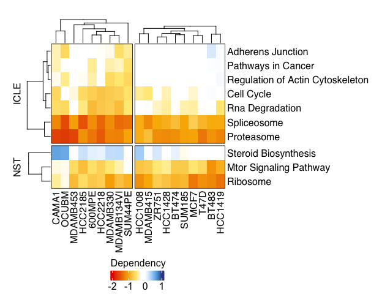<!-- -->

### Figure 5E: Top Druggable Dependencies Heatmap

``` r
pdf(file.path(DIRS$results_sub$dependencies, "Fig5E_ILC_Druggable_Dependencies.pdf"), width = 7.5, height = 5)
  draw(fig5e_drug_ht, merge_legends = TRUE, heatmap_legend_side = "bottom")
dev.off()
```

    ## quartz_off_screen 
    ##                 2

``` r
draw(fig5e_drug_ht, merge_legends = TRUE, heatmap_legend_side = "bottom")
```

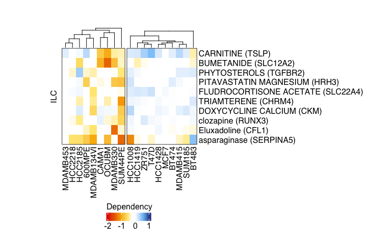<!-- -->

## f. Cell Line Scoring

### Figure 6: CL-Tumor Concordance/Resemblance Score

``` r
# Generate resemblance scores between cell lines and tumors
source(file.path(DIRS$scripts$helpers, "23_Fig6_Patient_Signatures_Resemblance_Scores.R"), chdir = TRUE)
```

    ## ===============================================================================

    ## Selecting Patient and Cell Line Subsets

    ## ===============================================================================

    ##   ILC tumors: 106

    ##   NST tumors: 201

    ##   Cell lines: 39

    ## 
    ## ===============================================================================

    ## PART 1: Computing Patient-Derived Signatures from TCGA

    ## ===============================================================================

    ## 
    ## 1.1 Computing CNV signature...

    ##   ✓ Saved CNV gene annotation to: /Users/oshah/Documents/ICLE/3-Results/Molecular_Resemblance/ILC_Signatures/ILC_CNV_Genes.tsv

    ## 
    ## 1.2 Computing Alterations signature...

    ##   ✓ Saved alterations signature to: /Users/oshah/Documents/ICLE/3-Results/Molecular_Resemblance/ILC_Signatures/ILC_Alterations.tsv

    ## 
    ## 1.3 Computing RNA signature...

    ##   ✓ Saved RNA signature to: /Users/oshah/Documents/ICLE/3-Results/Molecular_Resemblance/ILC_Signatures/ILC_DEGs.tsv

    ## 
    ## 1.4 Computing DNAm signature...

    ##   ✓ Saved DNAm signature to: /Users/oshah/Documents/ICLE/3-Results/Molecular_Resemblance/ILC_Signatures/ILC_DNAm_Probes.tsv

    ## 
    ## 1.5 Computing RPPA signature...

    ##   ✓ Saved RPPA signature to: /Users/oshah/Documents/ICLE/3-Results/Molecular_Resemblance/ILC_Signatures/ILC_DEPs.tsv

    ## 
    ## ===============================================================================

    ## PART 1 Complete: All patient-derived signatures saved to files

    ## ===============================================================================

    ## 
    ## ===============================================================================

    ## PART 2: Scoring Cell Lines and Computing Consensus

    ## ===============================================================================

    ## 
    ## 2.1 Computing CNV resemblance scores...

    ##   ✓ CNV scores computed for 38 cell lines

    ## 
    ## 2.2 Computing Alterations resemblance scores...

    ##   ✓ Alterations scores computed for 38 cell lines

    ## 
    ## 2.3 Computing RNA resemblance scores...

    ##   ✓ RNA scores computed for 39 cell lines

    ## 
    ## 2.4 Computing DNAm resemblance scores...

    ##   ✓ DNAm scores computed for 34 cell lines

    ## 
    ## 2.5 Computing RPPA resemblance scores...

    ##   ✓ RPPA scores computed for 37 cell lines

    ## 
    ## 2.6 Combining scores and computing consensus...

    ##   ✓ Saved resemblance scores to: /Users/oshah/Documents/ICLE/3-Results/Molecular_Resemblance/Resemblance_Scores.tsv

    ## 
    ## ========================================

    ## Figure 6: Resemblance scores heatmap

    ## ========================================

    ## Warning: Heatmap/annotation names are duplicated: Score

    ##   ✓ Fig 6 complete (fig6_resemblance_ht and signature heatmaps assigned).

``` r
pdf(file = file.path(DIRS$results_sub$molecular_resemblance, "Fig6_ILC_CN_Signature.pdf"), width = 6, height = 6)
draw(cn_sig_ht)
dev.off()
```

    ## quartz_off_screen 
    ##                 2

``` r
pdf(file = file.path(DIRS$results_sub$molecular_resemblance, "Fig6_ILC_Alteration_Signature.pdf"), width = 6, height = 6)
draw(mut_sig_ht)
dev.off()
```

    ## quartz_off_screen 
    ##                 2

``` r
pdf(file = file.path(DIRS$results_sub$molecular_resemblance, "Fig6_ILC_DNAm_Signature.pdf"), width = 6, height = 6)
draw(dnam_sign_ht)
dev.off()
```

    ## quartz_off_screen 
    ##                 2

``` r
pdf(file = file.path(DIRS$results_sub$molecular_resemblance, "Fig6_ILC_RNA_Signature.pdf"), width = 6, height = 6)
draw(rna_sign_ht)
dev.off()
```

    ## quartz_off_screen 
    ##                 2

``` r
pdf(file = file.path(DIRS$results_sub$molecular_resemblance, "Fig6_ILC_rppa_Signature.pdf"), width = 6, height = 6)
draw(rppa_sig_ht)
dev.off()
```

    ## quartz_off_screen 
    ##                 2

``` r
# Save Fig 6
pdf(file.path(DIRS$results_sub$molecular_resemblance, "Fig6_Resemblance_Scores.pdf"), width = 6, height = 5)
   draw(fig6_resemblance_ht, merge_legends = TRUE, annotation_legend_side = "right", 
        heatmap_legend_side = "right")
dev.off()
```

    ## quartz_off_screen 
    ##                 2

``` r
# Display figure
draw(fig6_resemblance_ht, merge_legends = TRUE, annotation_legend_side = "right", 
     heatmap_legend_side = "right")
```

<!-- -->

``` r
sessionInfo()
```

    ## R version 4.5.1 (2025-06-13)
    ## Platform: aarch64-apple-darwin20
    ## Running under: macOS Sequoia 15.7.2
    ## 
    ## Matrix products: default
    ## BLAS:   /Library/Frameworks/R.framework/Versions/4.5-arm64/Resources/lib/libRblas.0.dylib 
    ## LAPACK: /Library/Frameworks/R.framework/Versions/4.5-arm64/Resources/lib/libRlapack.dylib;  LAPACK version 3.12.1
    ## 
    ## locale:
    ## [1] en_US.UTF-8/en_US.UTF-8/en_US.UTF-8/C/en_US.UTF-8/en_US.UTF-8
    ## 
    ## time zone: America/Chicago
    ## tzcode source: internal
    ## 
    ## attached base packages:
    ## [1] stats4    grid      stats     graphics  grDevices utils     datasets 
    ## [8] methods   base     
    ## 
    ## other attached packages:
    ##  [1] msigdbr_25.1.1              hypeR_2.0.0                
    ##  [3] tidytext_0.4.3              patchwork_1.3.2            
    ##  [5] sesame_1.26.0               sesameData_1.26.0          
    ##  [7] ExperimentHub_2.16.1        AnnotationHub_3.16.1       
    ##  [9] BiocFileCache_2.16.2        dbplyr_2.5.1               
    ## [11] limma_3.64.3                DESeq2_1.48.2              
    ## [13] webshot2_0.1.2              htmlwidgets_1.6.4          
    ## [15] interacCircos_1.18.0        hiAnnotator_1.42.0         
    ## [17] gridExtra_2.3               ShatterSeek_1.1            
    ## [19] graph_1.86.0                foreach_1.5.2              
    ## [21] scales_1.4.0                ggsci_4.1.0                
    ## [23] gt_1.1.0                    ggpattern_1.2.1            
    ## [25] clusterProfiler_4.16.0      org.Hs.eg.db_3.21.0        
    ## [27] AnnotationDbi_1.70.0        CancerSubtypes_1.17.1      
    ## [29] NMF_0.28                    cluster_2.1.8.1            
    ## [31] rngtools_1.5.2              registry_0.5-1             
    ## [33] sigclust_1.1.0.1            tidyr_1.3.1                
    ## [35] forcats_1.0.1               circlize_0.4.16            
    ## [37] ConsensusClusterPlus_1.72.0 SummarizedExperiment_1.38.1
    ## [39] Biobase_2.68.0              MatrixGenerics_1.20.0      
    ## [41] matrixStats_1.5.0           BreastSubtypeR_1.0.0       
    ## [43] viridis_0.6.5               viridisLite_0.4.2          
    ## [45] data.table_1.17.8           readxl_1.4.5               
    ## [47] maftools_2.24.0             stringr_1.5.2              
    ## [49] ggrepel_0.9.6               rtracklayer_1.68.0         
    ## [51] GenomicRanges_1.60.0        GenomeInfoDb_1.44.3        
    ## [53] IRanges_2.42.0              S4Vectors_0.46.0           
    ## [55] BiocGenerics_0.54.1         generics_0.1.4             
    ## [57] magrittr_2.0.4              DNAcopy_1.82.0             
    ## [59] vroom_1.6.6                 reshape2_1.4.4             
    ## [61] ggsankey_0.0.99999          dplyr_1.1.4                
    ## [63] ComplexHeatmap_2.24.1       ggthemes_5.1.0             
    ## [65] ggpubr_0.6.2                ggplot2_4.0.0              
    ## 
    ## loaded via a namespace (and not attached):
    ##   [1] R.methodsS3_1.8.2        dichromat_2.0-0.1        Biostrings_2.76.0       
    ##   [4] vctrs_0.6.5              ggtangle_0.0.7           digest_0.6.37           
    ##   [7] png_0.1-8                shape_1.4.6.1            proxy_0.4-27            
    ##  [10] magick_2.9.0             MASS_7.3-65              httpuv_1.6.16           
    ##  [13] qvalue_2.40.0            withr_3.0.2              xfun_0.53               
    ##  [16] ggfun_0.2.0              survival_3.8-3           memoise_2.0.1           
    ##  [19] ggbeeswarm_0.7.2         gson_0.1.0               systemfonts_1.3.1       
    ##  [22] ragg_1.5.0               tidytree_0.4.6           GlobalOptions_0.1.2     
    ##  [25] R.oo_1.27.1              Formula_1.2-5            KEGGREST_1.48.1         
    ##  [28] promises_1.4.0           otel_0.2.0               httr_1.4.7              
    ##  [31] rstatix_0.7.3            restfulr_0.0.16          ps_1.9.1                
    ##  [34] rstudioapi_0.17.1        UCSC.utils_1.4.0         units_1.0-0             
    ##  [37] DOSE_4.2.0               processx_3.8.6           babelgene_22.9          
    ##  [40] curl_7.0.0               polyclip_1.10-7          GenomeInfoDbData_1.2.14 
    ##  [43] SparseArray_1.8.1        xtable_1.8-4             doParallel_1.0.17       
    ##  [46] reactable_0.4.4          evaluate_1.0.5           S4Arrays_1.8.1          
    ##  [49] preprocessCore_1.70.0    hms_1.1.4                visNetwork_2.1.4        
    ##  [52] colorspace_2.1-2         filelock_1.0.3           readr_2.1.5             
    ##  [55] later_1.4.4              ggtree_3.16.3            lattice_0.22-7          
    ##  [58] XML_3.99-0.19            cowplot_1.2.0            class_7.3-23            
    ##  [61] pillar_1.11.1            nlme_3.1-168             iterators_1.0.14        
    ##  [64] gridBase_0.4-7           compiler_4.5.1           stringi_1.8.7           
    ##  [67] sf_1.0-21                tokenizers_0.3.0         GenomicAlignments_1.44.0
    ##  [70] plyr_1.8.9               crayon_1.5.3             abind_1.4-8             
    ##  [73] BiocIO_1.18.0            gridGraphics_0.5-1       locfit_1.5-9.12         
    ##  [76] bit_4.6.0                chromote_0.5.1           fastmatch_1.1-6         
    ##  [79] codetools_0.2-20         textshaping_1.0.4        e1071_1.7-16            
    ##  [82] GetoptLong_1.0.5         mime_0.13                splines_4.5.1           
    ##  [85] Rcpp_1.1.0               iCluster_2.1.0           cellranger_1.1.0        
    ##  [88] knitr_1.51               blob_1.2.4               clue_0.3-66             
    ##  [91] BiocVersion_3.21.1       fs_1.6.6                 openxlsx_4.2.8          
    ##  [94] ggsignif_0.6.4           ggplotify_0.1.3          tibble_3.3.0            
    ##  [97] Matrix_1.7-4             statmod_1.5.1            tzdb_0.5.0              
    ## [100] svglite_2.2.2            tweenr_2.0.3             pkgconfig_2.0.3         
    ## [103] pheatmap_1.0.13          tools_4.5.1              cachem_1.1.0            
    ## [106] RSQLite_2.4.3            DBI_1.2.3                impute_1.82.0           
    ## [109] fastmap_1.2.0            rmarkdown_2.30           Rsamtools_2.24.1        
    ## [112] broom_1.0.10             sass_0.4.10              BiocManager_1.30.26     
    ## [115] carData_3.0-5            farver_2.1.2             yaml_2.3.10             
    ## [118] cli_3.6.5                purrr_1.1.0              lifecycle_1.0.4         
    ## [121] backports_1.5.0          BiocParallel_1.42.2      gtable_0.3.6            
    ## [124] rjson_0.2.23             parallel_4.5.1           ape_5.8-1               
    ## [127] SnowballC_0.7.1          jsonlite_2.0.0           bitops_1.0-9            
    ## [130] kableExtra_1.4.0         bit64_4.6.0-1            assertthat_0.2.1        
    ## [133] yulab.utils_0.2.1        zip_2.3.3                janeaustenr_1.0.0       
    ## [136] GOSemSim_2.34.0          R.utils_2.13.0           lazyeval_0.2.2          
    ## [139] shiny_1.11.1             htmltools_0.5.8.1        enrichplot_1.28.4       
    ## [142] GO.db_3.21.0             rappdirs_0.3.3           glue_1.8.0              
    ## [145] XVector_0.48.0           RCurl_1.98-1.17          treeio_1.32.0           
    ## [148] classInt_0.4-11          BSgenome_1.76.0          igraph_2.2.1            
    ## [151] R6_2.6.1                 labeling_0.4.3           aplot_0.2.9             
    ## [154] DelayedArray_0.34.1      tidyselect_1.2.1         vipor_0.4.7             
    ## [157] ggforce_0.5.0            xml2_1.4.1               car_3.1-3               
    ## [160] wheatmap_0.2.0           KernSmooth_2.23-26       S7_0.2.0                
    ## [163] gridpattern_1.3.1        websocket_1.4.4          fgsea_1.34.2            
    ## [166] RColorBrewer_1.1-3       rlang_1.1.6              Cairo_1.7-0             
    ## [169] beeswarm_0.4.0
